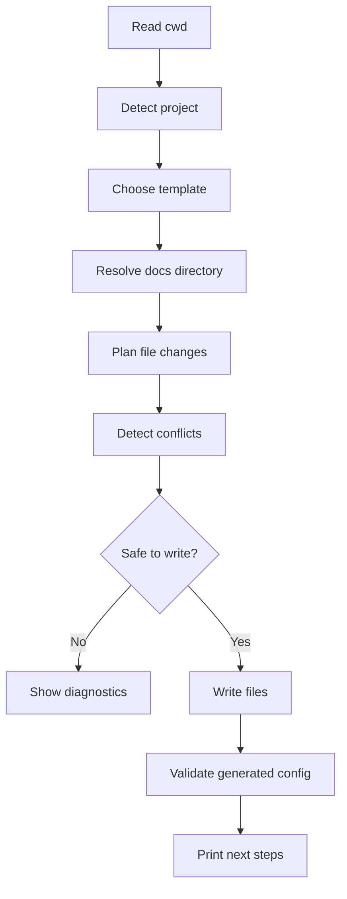
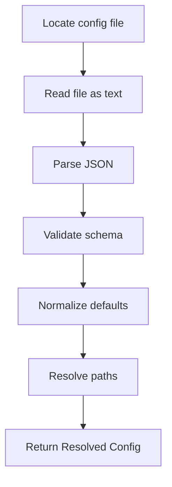
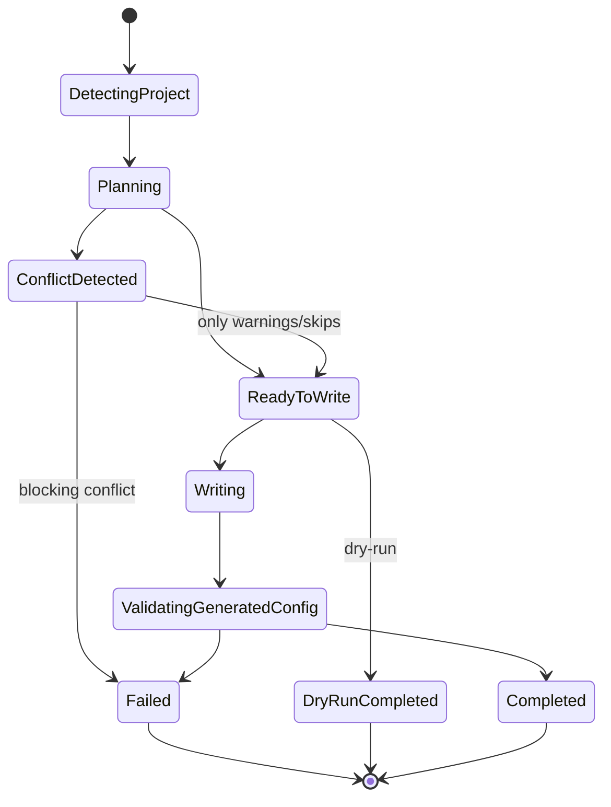

------
title: Build From Scratch: Mintlify-like AI-driven Documentation Generator CLI - Part 006
description: Building docforge init: project scaffolding, docs configuration, schema validation, template generation, idempotent writes, package script integration, and config diagnostics.
series: learn-mintlify-like-ai-docs-cli
seriesTitle: Build From Scratch: Mintlify-like AI-driven Documentation Generator CLI
order: 6
partTitle: Project Init and Docs Config
tags:
  - documentation
  - ai
  - cli
  - mdx
  - configuration
  - typescript
  - developer-tools
  - build-from-scratch
date: 2026-07-03
---

# Part 006 — Project Init and Docs Config

Di Part 005 kita mendesain CLI sebagai public API.

Sekarang kita implementasikan command pertama yang benar-benar terasa sebagai produk: **`docforge init`**.

Command `init` terlihat sederhana:

```bash
docforge init
```

Tapi di developer tools, `init` adalah titik pembentukan trust.

Jika `init` menimpa file sembarangan, membuat struktur membingungkan, atau menghasilkan config yang sulit dievolusikan, user akan kehilangan confidence sebelum mencoba fitur lain.

Part ini membahas:

- struktur project docs,
- config file,
- schema validation,
- template generation,
- idempotent file writes,
- interactive dan non-interactive mode,
- package script integration,
- default MDX pages,
- diagnostics untuk config error.

Target akhir part ini:

> `docforge init` mampu membuat project dokumentasi awal yang aman, followable, valid, dan siap dibangun oleh command berikutnya.

---

## 1. Mental Model: Init Bukan Copy Template Saja

Banyak CLI memperlakukan `init` sebagai copy folder template.

Untuk DocForge, itu terlalu dangkal.

`init` harus melakukan orchestration:



Perhatikan: sebelum menulis, kita membuat **plan**.

Plan ini penting karena:

- bisa ditampilkan pada `--dry-run`,
- bisa dicek conflict,
- bisa dites tanpa filesystem write,
- bisa dipakai nanti oleh PR automation,
- bisa dibuat reversible sebagian.

---

## 2. Struktur Project Awal

Kita akan membuat struktur default seperti ini:

```txt
.
├── docforge.config.json
├── docs/
│   ├── index.mdx
│   ├── quickstart.mdx
│   ├── concepts/
│   │   └── overview.mdx
│   └── api-reference/
│       └── introduction.mdx
└── package.json
```

Jika project sudah punya `docs/`, kita tidak langsung overwrite.

Jika project belum punya `package.json`, kita tetap bisa membuat docs project, tapi package script integration akan dilewati atau dibuat opsional.

### 2.1 Kenapa Config di Root?

Config di root memudahkan command:

```bash
docforge build
```

Tidak perlu user selalu menulis:

```bash
docforge build --config docs/docforge.config.json
```

Root config juga memudahkan CI dan repo automation.

Tapi docs content tetap di `docs/` agar jelas terpisah dari code.

---

## 3. Nama Config: `docforge.config.json`

Kita pilih JSON untuk awal.

Alternatif:

- `docforge.config.ts`,
- `docforge.config.mjs`,
- `docs.json`,
- `mint.json`-style config,
- `package.json` field.

Kenapa JSON dulu?

1. mudah divalidasi,
2. mudah diedit oleh manusia,
3. mudah diproses oleh tool lain,
4. tidak perlu menjalankan kode user,
5. aman untuk CI dan agent,
6. cocok untuk schema-driven diagnostics.

Dynamic config seperti TypeScript bisa datang nanti, tapi default awal sebaiknya declarative.

Rule security:

> Config awal tidak boleh mengharuskan DocForge mengeksekusi kode user.

Itu mengurangi risiko supply chain dan membuat behavior lebih deterministic.

---

## 4. Config Shape Awal

Config minimal:

```json
{
  "$schema": "https://docforge.dev/schemas/docforge.config.schema.json",
  "version": 1,
  "site": {
    "name": "My Docs",
    "description": "Developer documentation for this project"
  },
  "docs": {
    "dir": "docs"
  },
  "navigation": [
    {
      "group": "Start Here",
      "pages": [
        "index",
        "quickstart"
      ]
    },
    {
      "group": "Concepts",
      "pages": [
        "concepts/overview"
      ]
    },
    {
      "group": "API Reference",
      "pages": [
        "api-reference/introduction"
      ]
    }
  ],
  "search": {
    "enabled": true
  },
  "ai": {
    "enabled": false
  }
}
```

Kita sengaja membuat `ai.enabled` default `false`.

Kenapa?

Karena `init` harus bisa berjalan tanpa API key, tanpa network, tanpa provider dependency.

AI adalah fitur opt-in. Documentation generator harus berguna bahkan sebelum AI aktif.

---

## 5. Config Domain Model

Kita tidak ingin semua package membaca raw JSON langsung.

Raw config harus divalidasi dan dinormalisasi menjadi domain config.

```ts
export type DocforgeConfig = {
  version: 1;
  site: SiteConfig;
  docs: DocsConfig;
  navigation: NavigationGroup[];
  search: SearchConfig;
  ai: AiConfig;
};

export type SiteConfig = {
  name: string;
  description: string;
  logo?: string;
  url?: string;
};

export type DocsConfig = {
  dir: string;
};

export type NavigationGroup = {
  group: string;
  pages: string[];
};

export type SearchConfig = {
  enabled: boolean;
};

export type AiConfig = {
  enabled: boolean;
  provider?: string;
};
```

Raw JSON:

```ts
unknown
```

Validated config:

```ts
DocforgeConfig
```

Resolved config:

```ts
ResolvedDocforgeConfig
```

Resolved config sudah mengandung absolute paths dan default values.

```ts
export type ResolvedDocforgeConfig = DocforgeConfig & {
  paths: {
    rootDir: string;
    configPath: string;
    docsDir: string;
    outputDir: string;
  };
};
```

Jangan campur raw config, validated config, dan resolved config.

---

## 6. Schema Validation dengan Zod

Kita bisa memakai Zod untuk runtime validation di TypeScript.

Schema awal:

```ts
import * as z from "zod";

export const NavigationGroupSchema = z.object({
  group: z.string().min(1),
  pages: z.array(z.string().min(1)),
});

export const DocforgeConfigSchema = z.object({
  $schema: z.string().optional(),
  version: z.literal(1),
  site: z.object({
    name: z.string().min(1),
    description: z.string().min(1),
    logo: z.string().optional(),
    url: z.string().url().optional(),
  }),
  docs: z.object({
    dir: z.string().min(1).default("docs"),
  }),
  navigation: z.array(NavigationGroupSchema).default([]),
  search: z.object({
    enabled: z.boolean().default(true),
  }).default({ enabled: true }),
  ai: z.object({
    enabled: z.boolean().default(false),
    provider: z.string().optional(),
  }).default({ enabled: false }),
});

export type DocforgeConfig = z.infer<typeof DocforgeConfigSchema>;
```

Namun, Zod error default tidak boleh langsung dilempar ke user.

Kita convert ke diagnostics.

```ts
export function zodIssuesToDiagnostics(issues: z.ZodIssue[], file: string): Diagnostic[] {
  return issues.map((issue) => ({
    code: "CONFIG_INVALID_SCHEMA",
    severity: "error",
    message: issue.message,
    file,
    hint: `Check field: ${issue.path.join(".") || "<root>"}`,
    details: {
      path: issue.path,
    },
  }));
}
```

Nanti kita bisa meningkatkan ini dengan line/column mapping dari JSON parser.

---

## 7. JSON Schema untuk Editor Support

Zod bagus untuk runtime. Tapi user juga butuh editor autocomplete.

Maka config menyertakan `$schema`:

```json
{
  "$schema": "https://docforge.dev/schemas/docforge.config.schema.json"
}
```

JSON Schema berguna untuk:

- autocomplete di editor,
- validation sebelum CLI dijalankan,
- dokumentasi config,
- compatibility tooling,
- future migration checks.

Kita bisa generate JSON Schema dari Zod atau maintain manual schema.

Trade-off:

| Approach | Kelebihan | Kekurangan |
|---|---|---|
| Generate dari Zod | single source untuk runtime dan schema | hasil kadang kurang ekspresif |
| Manual JSON Schema | kontrol penuh untuk editor docs | rawan drift dari runtime schema |
| Hybrid | runtime Zod + checked generated schema | butuh test contract |

Untuk awal, kita bisa generate dari Zod, lalu menambahkan test agar generated schema tidak drift.

---

## 8. Init Templates

Template awal sebaiknya tidak terlalu banyak.

Kita definisikan tiga template:

```txt
minimal
api
full
```

### 8.1 `minimal`

Untuk project kecil.

Files:

```txt
docforge.config.json
docs/index.mdx
docs/quickstart.mdx
```

### 8.2 `api`

Untuk API product.

Files:

```txt
docforge.config.json
docs/index.mdx
docs/quickstart.mdx
docs/api-reference/introduction.mdx
openapi.yaml placeholder reference optional
```

### 8.3 `full`

Untuk project yang ingin struktur lengkap.

Files:

```txt
docs/index.mdx
docs/quickstart.mdx
docs/concepts/overview.mdx
docs/guides/installation.mdx
docs/guides/configuration.mdx
docs/api-reference/introduction.mdx
docs/troubleshooting/common-errors.mdx
```

Default kita pilih `minimal` atau `api`?

Untuk Mintlify-like developer docs, default yang baik adalah `minimal` agar tidak menghasilkan terlalu banyak halaman kosong.

Namun jika repo punya OpenAPI file, kita bisa suggest `api`.

---

## 9. Project Detection

Sebelum init, CLI bisa membaca repository untuk memberi default lebih baik.

Detection ringan:

```txt
package.json       -> Node/TypeScript project
pom.xml            -> Java Maven project
build.gradle       -> Java/Kotlin Gradle project
go.mod             -> Go project
pyproject.toml     -> Python project
openapi.yaml/json  -> API docs candidate
README.md          -> source for landing page
```

Tapi hati-hati:

> Project detection tidak boleh membuat init unpredictable.

Jika detection dipakai, tampilkan jelas:

```txt
Detected:
  package manager: pnpm
  README: README.md
  OpenAPI spec: openapi.yaml

Suggested template: api
```

Dalam non-interactive mode, default harus stabil atau bisa dikontrol flag.

```bash
docforge init --template minimal --yes
```

---

## 10. Init Request

Dari CLI, kita bentuk request.

```ts
export type InitTemplate = "minimal" | "api" | "full";

export type InitRequest = CommonCommandOptions & {
  template: InitTemplate;
  yes: boolean;
  dryRun: boolean;
  force: boolean;
  packageManager?: "npm" | "pnpm" | "yarn" | "bun";
  siteName?: string;
};
```

Catatan: `force` perlu didefinisikan ketat.

Dalam DocForge:

```txt
--force hanya boleh menimpa file yang sebelumnya diketahui sebagai generated file DocForge, bukan file user arbitrary.
```

Lebih aman lagi pakai flag:

```bash
--overwrite-generated
```

Tapi karena user umum mengenal `--force`, kita boleh menyediakan `--force` dengan semantic aman dan dokumentasi jelas.

---

## 11. Init Plan

Service `initProject` tidak langsung menulis file.

Ia membuat plan.

```ts
export type FileChange =
  | {
      type: "create";
      path: string;
      content: string;
    }
  | {
      type: "update";
      path: string;
      before: string;
      after: string;
    }
  | {
      type: "skip";
      path: string;
      reason: string;
    };

export type InitPlan = {
  rootDir: string;
  docsDir: string;
  template: InitTemplate;
  changes: FileChange[];
  diagnostics: Diagnostic[];
};
```

Execution:

```ts
export async function initProject(
  request: InitRequest,
  context: ExecutionContext,
): Promise<CommandResult<InitResultData>> {
  const plan = await createInitPlan(request, context);

  if (hasBlockingDiagnostics(plan.diagnostics)) {
    return initFailure(plan);
  }

  if (request.dryRun) {
    return initDryRunSuccess(plan);
  }

  await applyInitPlan(plan, context);
  return initSuccess(plan);
}
```

Dengan pattern ini, `dry-run` bukan fitur tambahan. Ia natural dari architecture.

---

## 12. File Write Safety

Aturan menulis file:

1. jika file belum ada: create,
2. jika file ada dan sama persis: skip,
3. jika file ada dan berbeda: conflict,
4. jika file generated by DocForge dan `--force`: update,
5. jangan hapus file user saat init.

Kita bisa menandai generated file lewat comment.

Untuk MDX:

```mdx
{/* Generated by DocForge init. Safe to edit. */}
```

Tapi setelah user edit, file tidak lagi sama.

Lebih baik gunakan manifest:

```txt
.docforge/
  manifest.json
```

Namun untuk init awal, kita belum butuh manifest kompleks. Kita bisa mulai dengan conservative behavior:

- tidak overwrite file berbeda,
- tampilkan conflict,
- user bisa rename atau pilih docs dir lain.

Contoh diagnostic:

```txt
error INIT_FILE_CONFLICT
  docs/index.mdx already exists and differs from the template.

hint
  Choose a different --dir, or move the existing file before running init.
```

Jangan jadikan `--yes` sebagai overwrite.

`--yes` hanya menjawab prompt default aman.

---

## 13. Default MDX Pages

Generated docs harus berguna, bukan filler.

### 13.1 `docs/index.mdx`

```mdx
------
title: Introduction
description: Developer documentation for this project.
---

# Introduction

Welcome to the project documentation.

Use this space to explain what the project does, who it is for, and what problem it solves.

## Start here

- [Quickstart](/quickstart)
- [Concepts](/concepts/overview)
- [API Reference](/api-reference/introduction)
```

### 13.2 `docs/quickstart.mdx`

```mdx
------
title: Quickstart
description: Install and run the project quickly.
---

# Quickstart

This guide helps developers get started quickly.

## Prerequisites

- Node.js or the runtime required by your project
- Package manager or build tool
- Access to required environment variables

## Install

```bash
# Replace this with your actual install command
npm install
```

## Run

```bash
# Replace this with your actual run command
npm run dev
```
```

Important: generated content harus jujur. Jangan mengarang command project jika belum diketahui.

Lebih baik placeholder eksplisit daripada hallucinated instructions.

---

## 14. Frontmatter Standard

Setiap page perlu frontmatter minimal:

```yaml
title: Quickstart
description: Install and run the project quickly.
```

Kenapa `description` wajib?

Karena dipakai untuk:

- SEO,
- search result snippet,
- generated navigation preview,
- LLM/agent summaries,
- docs quality gates.

Frontmatter schema:

```ts
export const PageFrontmatterSchema = z.object({
  title: z.string().min(1),
  description: z.string().min(1),
  icon: z.string().optional(),
  hidden: z.boolean().optional(),
});
```

Nanti frontmatter bisa diperluas.

Tapi minimal awal harus ketat.

---

## 15. Package Script Integration

Jika `package.json` ada, `init` bisa menawarkan menambahkan scripts:

```json
{
  "scripts": {
    "docs:dev": "docforge dev",
    "docs:build": "docforge build",
    "docs:check": "docforge check"
  }
}
```

Tapi ini harus hati-hati.

Rules:

1. jangan overwrite script existing,
2. jika script sudah ada sama persis: skip,
3. jika script name conflict: diagnostic warning,
4. update package.json dengan formatting stable,
5. dalam non-interactive mode, hanya tambah jika `--yes` dan tidak conflict.

Contoh conflict:

```json
{
  "scripts": {
    "docs:build": "vitepress build docs"
  }
}
```

Diagnostic:

```txt
warning INIT_PACKAGE_SCRIPT_CONFLICT
  package.json already has script "docs:build".

hint
  Existing script was left unchanged. Add "docforge build" manually if needed.
```

---

## 16. Config Resolution

Setelah init, command lain perlu menemukan config.

Resolution algorithm:

```txt
1. if --config provided, use it
2. else search cwd/docforge.config.json
3. else search upward until repository root
4. else fail with CONFIG_NOT_FOUND
```

Tapi hati-hati dengan upward search.

Jika user menjalankan command dari subdirectory, upward search membantu.

```bash
cd docs/guides
docforge build
```

Tapi jangan search sampai `/` tanpa batas. Stop di:

- git root,
- filesystem root,
- home boundary optional.

Pseudo-code:

```ts
export async function findConfig(startDir: string): Promise<string | undefined> {
  let dir = startDir;

  while (true) {
    const candidate = path.join(dir, "docforge.config.json");
    if (await exists(candidate)) return candidate;

    if (await exists(path.join(dir, ".git"))) return undefined;

    const parent = path.dirname(dir);
    if (parent === dir) return undefined;
    dir = parent;
  }
}
```

Ini akan disempurnakan nanti.

---

## 17. Reading Config Safely

Config read pipeline:



Error per tahap berbeda:

| Tahap | Diagnostic |
|---|---|
| file not found | `CONFIG_NOT_FOUND` |
| file unreadable | `CONFIG_READ_FAILED` |
| invalid JSON | `CONFIG_INVALID_JSON` |
| schema invalid | `CONFIG_INVALID_SCHEMA` |
| path invalid | `CONFIG_INVALID_PATH` |

Jangan semua menjadi `CONFIG_ERROR`.

Semakin spesifik diagnostic, semakin cepat user memperbaiki.

---

## 18. JSON Parse Error dengan Location

`JSON.parse` default tidak memberi line/column yang enak.

Untuk production, gunakan parser yang memberi location atau buat mapper dari position.

Untuk awal, kita bisa minimal:

```ts
export function parseJsonConfig(text: string, file: string): unknown {
  try {
    return JSON.parse(text);
  } catch (error) {
    throw new ExpectedFailure("Invalid JSON config", 3, [
      {
        code: "CONFIG_INVALID_JSON",
        severity: "error",
        message: error instanceof Error ? error.message : "Invalid JSON",
        file,
        hint: "Fix JSON syntax. Common issues: trailing comma, comments, or unquoted property names.",
      },
    ]);
  }
}
```

Catatan: JSON tidak mendukung comment dan trailing comma. Ini sering mengejutkan user yang terbiasa JSONC.

Kita bisa mendukung JSONC nanti, tapi jika iya, file extension dan semantics harus jelas.

---

## 19. Template Renderer

Template jangan langsung hardcode string di command handler.

Buat module template.

```txt
packages/core/src/init/
  templates/
    minimal.ts
    api.ts
    full.ts
  create-init-plan.ts
  apply-init-plan.ts
```

Template interface:

```ts
export type InitTemplateDefinition = {
  name: InitTemplate;
  files(input: InitTemplateInput): TemplateFile[];
  config(input: InitTemplateInput): DocforgeConfig;
};

export type TemplateFile = {
  path: string;
  content: string;
};

export type InitTemplateInput = {
  siteName: string;
  docsDir: string;
  detected: ProjectDetection;
};
```

Dengan ini, menambah template baru tidak mengubah CLI parser.

---

## 20. Project Detection Implementation

Detection jangan terlalu dalam di `init` awal. Kita hanya butuh hint.

```ts
export type ProjectDetection = {
  hasPackageJson: boolean;
  packageManager?: "npm" | "pnpm" | "yarn" | "bun";
  hasReadme: boolean;
  openApiFiles: string[];
  languages: string[];
};
```

Package manager detection:

```txt
pnpm-lock.yaml      -> pnpm
yarn.lock           -> yarn
bun.lockb/bun.lock  -> bun
package-lock.json   -> npm
```

Language detection ringan:

```txt
pom.xml             -> java
build.gradle        -> java/kotlin
go.mod              -> go
pyproject.toml      -> python
package.json        -> javascript/typescript
```

Jangan scan seluruh repository dulu. Full scanner baru dibahas di Part 008 dan seterusnya.

---

## 21. Init CLI Registration

Command:

```ts
export function registerInitCommand(program: Command): void {
  program
    .command("init")
    .description("Initialize DocForge documentation in this repository")
    .option("--template <template>", "Template: minimal, api, full", "minimal")
    .option("--site-name <name>", "Site name")
    .option("--package-manager <name>", "Package manager: npm, pnpm, yarn, bun")
    .option("--yes", "Use safe defaults without prompting", false)
    .option("--dry-run", "Show planned changes without writing files", false)
    .option("--force", "Overwrite generated files when safe", false)
    .action(async (options, command) => {
      const globals = command.parent?.optsWithGlobals() ?? {};
      const context = createExecutionContext(globals);

      const request: InitRequest = {
        cwd: globals.cwd,
        configPath: globals.config,
        docsDir: globals.dir ?? "docs",
        format: globals.format,
        verbose: globals.verbose,
        quiet: globals.quiet,
        color: globals.color,
        template: parseTemplate(options.template),
        yes: Boolean(options.yes),
        dryRun: Boolean(options.dryRun),
        force: Boolean(options.force),
        packageManager: options.packageManager,
        siteName: options.siteName,
      };

      const result = await initProject(request, context);
      await renderResult(result, context);
      process.exitCode = result.exitCode;
    });
}
```

`parseTemplate` harus menghasilkan diagnostic jika invalid.

```bash
docforge init --template enterprise
```

Output:

```txt
error CLI_INVALID_OPTION_VALUE
  Invalid value for --template: enterprise

hint
  Allowed values: minimal, api, full
```

---

## 22. Init Result Output

Human success:

```txt
DocForge initialized successfully.

Created:
  docforge.config.json
  docs/index.mdx
  docs/quickstart.mdx

Next steps:
  1. Run: docforge dev
  2. Edit: docs/index.mdx
  3. Build: docforge build
```

Dry-run success:

```txt
DocForge init plan:

Would create:
  docforge.config.json
  docs/index.mdx
  docs/quickstart.mdx

No files were written.
```

JSON output:

```json
{
  "tool": "docforge",
  "version": "0.1.0",
  "command": "init",
  "ok": true,
  "exitCode": 0,
  "diagnostics": [],
  "data": {
    "template": "minimal",
    "docsDir": "docs",
    "written": true,
    "changes": [
      { "type": "create", "path": "docforge.config.json" },
      { "type": "create", "path": "docs/index.mdx" },
      { "type": "create", "path": "docs/quickstart.mdx" }
    ]
  }
}
```

---

## 23. Idempotency

Idempotency berarti command bisa dijalankan ulang tanpa merusak state.

```bash
docforge init
docforge init
```

Run kedua seharusnya tidak membuat konflik jika file sama dengan template.

Output:

```txt
DocForge is already initialized.

Unchanged:
  docforge.config.json
  docs/index.mdx
  docs/quickstart.mdx
```

Tapi jika user sudah mengedit file, run kedua tidak boleh overwrite.

```txt
warning INIT_FILE_EXISTS
  docs/index.mdx already exists and was left unchanged.
```

Idempotency adalah sinyal maturity.

---

## 24. Handling Existing Docs Projects

Banyak repo sudah punya `docs/`.

Scenario:

```txt
docs/
  architecture.md
  api.md
```

Saat user menjalankan:

```bash
docforge init
```

Kita tidak ingin menimpa. Kita bisa:

1. create config,
2. leave existing docs,
3. suggest migration command later.

Diagnostic warning:

```txt
warning INIT_EXISTING_DOCS_DIR
  docs directory already exists.

hint
  Existing files were left unchanged. You can add them to navigation in docforge.config.json.
```

Kita bisa generate navigation kosong atau berdasarkan existing docs?

Untuk awal, jangan auto-classify terlalu banyak. Itu nanti bagian scanner dan AI planner.

Default aman:

- buat config jika belum ada,
- buat missing default pages jika path tidak conflict,
- skip conflict,
- laporkan jelas.

---

## 25. Avoiding Hallucinated Setup Instructions

Karena ini AI-driven docs generator, temptation-nya besar: dari `package.json`, langsung generate quickstart lengkap.

Tapi di `init`, jangan terlalu agresif.

Jika `package.json` punya scripts:

```json
{
  "scripts": {
    "dev": "next dev",
    "build": "next build"
  }
}
```

Kita boleh membuat suggestion:

```mdx
## Run locally

```bash
npm run dev
```
```

Tapi jika tidak yakin, jangan mengarang.

Aturan:

- fakta eksplisit dari file boleh dipakai,
- asumsi harus ditandai sebagai placeholder,
- command yang tidak ditemukan jangan ditulis sebagai pasti,
- AI generation nanti harus pakai provenance.

Untuk template init awal, lebih aman pakai placeholder.

---

## 26. Generated Config Example by Template

### 26.1 Minimal Template Config

```json
{
  "$schema": "https://docforge.dev/schemas/docforge.config.schema.json",
  "version": 1,
  "site": {
    "name": "My Project",
    "description": "Developer documentation for My Project"
  },
  "docs": {
    "dir": "docs"
  },
  "navigation": [
    {
      "group": "Start Here",
      "pages": ["index", "quickstart"]
    }
  ],
  "search": {
    "enabled": true
  },
  "ai": {
    "enabled": false
  }
}
```

### 26.2 API Template Config

```json
{
  "$schema": "https://docforge.dev/schemas/docforge.config.schema.json",
  "version": 1,
  "site": {
    "name": "My API",
    "description": "Developer documentation for My API"
  },
  "docs": {
    "dir": "docs"
  },
  "navigation": [
    {
      "group": "Start Here",
      "pages": ["index", "quickstart"]
    },
    {
      "group": "API Reference",
      "pages": ["api-reference/introduction"]
    }
  ],
  "openapi": {
    "spec": "openapi.yaml"
  },
  "search": {
    "enabled": true
  },
  "ai": {
    "enabled": false
  }
}
```

Notice: `openapi` belum ada di schema awal yang kita tulis. Jika template API menggunakannya, schema harus mendukungnya.

Maka update schema:

```ts
openapi: z.object({
  spec: z.string().min(1),
}).optional()
```

Ini contoh penting: template dan schema harus diuji bersama.

---

## 27. Config Contract Tests

Kita butuh test agar config generated selalu valid.

```ts
it.each(["minimal", "api", "full"] as const)("generates valid config for %s", (template) => {
  const definition = getInitTemplate(template);
  const config = definition.config({
    siteName: "Test Project",
    docsDir: "docs",
    detected: emptyDetection,
  });

  expect(() => DocforgeConfigSchema.parse(config)).not.toThrow();
});
```

Test lain:

```ts
it("rejects unknown config version", () => {
  const result = DocforgeConfigSchema.safeParse({ version: 999 });
  expect(result.success).toBe(false);
});
```

Dan snapshot untuk generated files.

```ts
it("minimal template file list is stable", () => {
  const files = minimalTemplate.files(input).map((file) => file.path);
  expect(files).toMatchInlineSnapshot();
});
```

---

## 28. Formatting JSON Output

Generated config harus readable.

```ts
export function formatJson(value: unknown): string {
  return `${JSON.stringify(value, null, 2)}\n`;
}
```

Kenapa newline di akhir?

Karena convention POSIX text file dan diff lebih bersih.

Saat update package.json, pertahankan indentasi jika bisa. Untuk awal, dua spasi cukup, tapi nanti kita bisa detect formatting.

---

## 29. Path Normalization

Config harus portable lintas OS.

Dalam config, gunakan POSIX-like path:

```json
{
  "docs": {
    "dir": "docs"
  }
}
```

Bukan:

```json
{
  "docs": {
    "dir": "docs\\guides"
  }
}
```

Internal runtime boleh resolve dengan `path.resolve`, tapi config path sebaiknya normal.

Utility:

```ts
export function toConfigPath(filePath: string): string {
  return filePath.split(path.sep).join("/");
}
```

Navigation pages juga pakai slash `/` dan tanpa extension:

```json
"pages": ["concepts/overview"]
```

Bukan:

```json
"pages": ["concepts\\overview.mdx"]
```

Ini memudahkan routing.

---

## 30. Route Mapping

Page file:

```txt
docs/concepts/overview.mdx
```

Navigation entry:

```txt
concepts/overview
```

Route:

```txt
/concepts/overview
```

Index page:

```txt
docs/index.mdx -> /
```

Nested index:

```txt
docs/concepts/index.mdx -> /concepts
```

Kita belum implement router penuh di part ini, tapi config init harus mengikuti rule yang akan dipakai renderer.

---

## 31. Config Diagnostics Examples

### 31.1 Missing Config

```txt
error CONFIG_NOT_FOUND
  Could not find docforge.config.json.

hint
  Run `docforge init` from your repository root, or pass --config <path>.
```

### 31.2 Invalid Version

```txt
error CONFIG_INVALID_SCHEMA
  Expected version to be 1.

hint
  This version of DocForge supports config version 1.
```

### 31.3 Missing Page in Navigation

This is not init validation; this is build/check validation.

```txt
error NAV_PAGE_NOT_FOUND
  Navigation points to concepts/overview, but docs/concepts/overview.mdx does not exist.
```

Still, init should generate consistent config so this never happens by default.

---

## 32. Full `initProject` Pseudo-code

```ts
export async function initProject(
  request: InitRequest,
  context: ExecutionContext,
): Promise<CommandResult<InitResultData>> {
  const startedAt = context.clock.monotonicMs();

  const detected = await detectProject(request.cwd);
  const template = getInitTemplate(request.template);

  const input: InitTemplateInput = {
    siteName: request.siteName ?? inferSiteName(request.cwd),
    docsDir: request.docsDir ?? "docs",
    detected,
  };

  const plan = await createInitPlan({ request, template, input, context });

  const blocking = plan.diagnostics.some((d) => d.severity === "error");
  if (blocking) {
    return {
      ok: false,
      exitCode: 4,
      diagnostics: plan.diagnostics,
      data: {
        template: request.template,
        docsDir: input.docsDir,
        written: false,
        changes: summarizeChanges(plan.changes),
      },
    };
  }

  if (!request.dryRun) {
    await applyInitPlan(plan, context);
  }

  return {
    ok: true,
    exitCode: 0,
    diagnostics: plan.diagnostics,
    data: {
      template: request.template,
      docsDir: input.docsDir,
      written: !request.dryRun,
      changes: summarizeChanges(plan.changes),
      durationMs: context.clock.monotonicMs() - startedAt,
    },
  };
}
```

Exit code for conflict bisa `4` source error atau `3` config error tergantung sumber. Untuk init file conflict, `4` masuk akal karena masalah ada pada filesystem target.

---

## 33. Mermaid: Init State Machine



---

## 34. What Not To Build Yet

Jangan membangun semua sekarang.

Belum perlu:

- AI generation,
- full repo scanner,
- MDX compiler,
- dev server,
- theme system,
- OpenAPI reference generator,
- search index,
- MCP server,
- GitHub PR integration.

`init` harus kecil tapi benar.

Kita hanya butuh foundation agar command berikutnya punya project untuk dibaca.

---

## 35. Checklist Part 006

`docforge init` dianggap production-aware jika:

- [ ] membuat `docforge.config.json`,
- [ ] membuat `docs/` default,
- [ ] generated config valid terhadap schema,
- [ ] generated pages punya frontmatter minimal,
- [ ] tidak overwrite file user,
- [ ] support `--dry-run`,
- [ ] support `--template`,
- [ ] support `--yes`,
- [ ] memiliki diagnostics untuk conflict,
- [ ] bisa berjalan non-interactive,
- [ ] optional package script integration aman,
- [ ] path dalam config portable,
- [ ] JSON output machine-readable,
- [ ] rerun init tidak merusak project.

---

## 36. Ringkasan

Part ini membuat `docforge init` sebagai operasi yang aman dan predictable.

Poin paling penting:

1. `init` adalah orchestration, bukan copy template mentah.
2. Config awal sebaiknya declarative JSON, bukan executable config.
3. Raw config, validated config, dan resolved config harus dipisah.
4. Schema validation harus menghasilkan diagnostic yang actionable.
5. Generated files harus minimal, jujur, dan tidak hallucinated.
6. `--yes` bukan izin overwrite.
7. `--dry-run` muncul natural jika kita memakai init plan.
8. Package script update harus non-destructive.
9. Config path dan navigation harus portable.
10. Init harus idempotent.

Di part berikutnya, kita akan melanjutkan ke **configuration schema versioning**.

Kita akan membahas bagaimana config berevolusi tanpa merusak project user: version field, migration, compatibility, deprecation diagnostics, feature flags, dan upgrade workflow.
