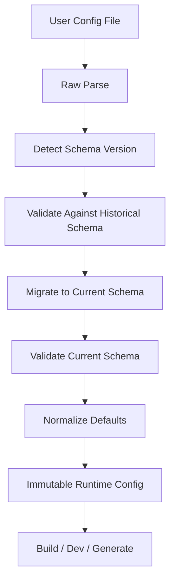
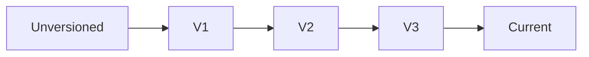
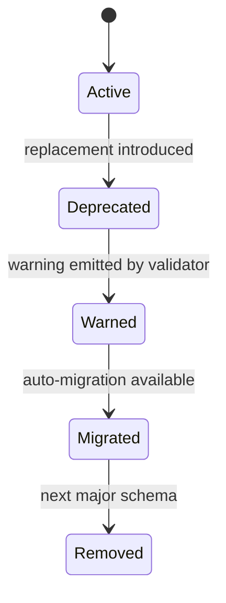

------
title: Build From Scratch: Mintlify-like AI-driven Documentation Generator CLI - Part 007
description: Build a production-grade configuration schema versioning system for a Mintlify-like AI documentation CLI, including schema evolution, migration, compatibility policy, diagnostics, feature flags, and safe config loading.
series: learn-mintlify-like-ai-docs-cli
seriesTitle: Build From Scratch: Mintlify-like AI-driven Documentation Generator CLI
order: 7
partTitle: Configuration Schema Versioning
tags:
  - documentation
  - ai
  - cli
  - configuration
  - schema-versioning
  - developer-tools
date: 2026-07-03
---

# Part 007 — Configuration Schema Versioning

Pada part sebelumnya kita sudah membuat `docforge init` dan sebuah `docforge.config.json`. Sekarang kita masuk ke masalah yang biasanya tidak terasa penting saat project masih kecil, tetapi menjadi sumber kerusakan besar saat tool mulai dipakai banyak repository: **evolusi konfigurasi**.

CLI documentation generator bukan hanya membaca config. Ia menjadikan config sebagai **kontrak jangka panjang** antara tool dan repository user. Begitu file config masuk ke Git, ia menjadi bagian dari workflow tim, CI, editor, branch lama, template internal, dan automation. Karena itu, config tidak boleh diperlakukan seperti object literal biasa.

Config harus punya:

1. versi eksplisit,
2. schema yang bisa divalidasi,
3. kebijakan kompatibilitas,
4. migrasi otomatis yang aman,
5. diagnostics yang manusiawi,
6. fallback yang deterministik,
7. extension point yang tidak merusak core.

Kita akan membangun semua itu.

---

## 1. Mental model: config adalah API publik

Kesalahan umum: menganggap config hanya file internal.

```json
{
  "site": {
    "title": "Acme Docs"
  },
  "navigation": [
    {
      "group": "Getting Started",
      "pages": ["index", "quickstart"]
    }
  ]
}
```

Secara teknis ini memang file JSON. Secara produk, ini adalah **public API**.

Kalau versi CLI berubah dan config lama tidak bisa dibaca, maka build user rusak. Kalau nama field berubah tanpa migrasi, CI rusak. Kalau default berubah diam-diam, output docs berubah tanpa trace. Kalau validasi terlalu longgar, user baru tahu salah saat preview gagal.

Jadi konfigurasi harus dikelola seperti API:



Invariant utama:

> Build pipeline hanya boleh menggunakan **runtime config yang sudah tervalidasi, termigrasi, dan dinormalisasi**. Tidak ada stage downstream yang membaca raw config langsung.

---

## 2. Masalah yang ingin kita cegah

Bayangkan versi awal tool punya config seperti ini:

```json
{
  "version": 1,
  "name": "Acme Docs",
  "pages": ["index", "api"]
}
```

Versi berikutnya butuh struktur lebih kaya:

```json
{
  "schemaVersion": 2,
  "site": {
    "title": "Acme Docs"
  },
  "navigation": [
    {
      "group": "Documentation",
      "pages": ["index", "api"]
    }
  ]
}
```

Tanpa versioning, kita akan punya pilihan buruk:

1. tetap support semua bentuk selamanya di semua layer,
2. breaking change dan berharap user membaca changelog,
3. validasi longgar dan runtime penuh `if legacy`,
4. migrasi manual yang rawan error.

Solusi yang benar: **schema versioning + migration pipeline**.

---

## 3. Target desain kita

Kita ingin `docforge` punya command seperti ini:

```bash
npx docforge config validate
npx docforge config migrate --dry-run
npx docforge config migrate --write
npx docforge config print --format json
npx docforge config explain navigation
```

Dan loader internal seperti ini:

```ts
const config = await loadProjectConfig({
  cwd: process.cwd(),
  mode: "build",
  migration: "auto-readonly"
});
```

Hasil `loadProjectConfig` bukan object mentah. Ia adalah struktur kaya:

```ts
export interface LoadedConfig {
  readonly rawPath: string;
  readonly rawText: string;
  readonly detectedVersion: SchemaVersion;
  readonly currentVersion: SchemaVersion;
  readonly wasMigratedInMemory: boolean;
  readonly diagnostics: Diagnostic[];
  readonly config: RuntimeConfig;
}
```

Perhatikan: kita menyimpan `detectedVersion`, `wasMigratedInMemory`, dan `diagnostics`. Ini penting untuk observability dan UX.

---

## 4. Schema version vs package version

Jangan campuradukkan dua hal ini:

| Konsep | Contoh | Arti |
|---|---:|---|
| CLI package version | `1.8.3` | Versi npm package `docforge` |
| Config schema version | `3` | Bentuk struktur config yang didukung |
| Docs content version | optional | Versi content model docs |
| Plugin API version | optional | Kontrak antara core dan plugin |

CLI package bisa berubah berkali-kali tanpa schema config berubah. Schema config hanya berubah ketika **bentuk config** berubah.

Contoh:

```json
{
  "$schema": "https://docforge.dev/schemas/docforge.config.v3.json",
  "schemaVersion": 3,
  "site": {
    "title": "Acme Docs"
  }
}
```

Field `$schema` berguna untuk editor tooling. Field `schemaVersion` berguna untuk runtime loader.

Kita tetap membutuhkan keduanya.

---

## 5. Bentuk config versi saat ini

Kita akan menargetkan `schemaVersion: 1` sebagai versi awal dari tool kita. Walaupun ini versi pertama, tetap buat sistemnya seolah akan ada versi berikutnya.

```ts filename="packages/config/src/types.ts"
export type SchemaVersion = 1;

export interface DocforgeConfigV1 {
  readonly $schema?: string;
  readonly schemaVersion: 1;
  readonly site: SiteConfigV1;
  readonly navigation: NavigationItemV1[];
  readonly sources?: SourcesConfigV1;
  readonly ai?: AiConfigV1;
  readonly build?: BuildConfigV1;
  readonly theme?: ThemeConfigV1;
  readonly plugins?: PluginConfigV1[];
  readonly experimental?: ExperimentalConfigV1;
}

export interface SiteConfigV1 {
  readonly title: string;
  readonly description?: string;
  readonly logo?: string;
  readonly baseUrl?: string;
}

export type NavigationItemV1 = NavGroupV1 | NavPageV1;

export interface NavGroupV1 {
  readonly type: "group";
  readonly title: string;
  readonly items: NavigationItemV1[];
}

export interface NavPageV1 {
  readonly type: "page";
  readonly title?: string;
  readonly path: string;
}

export interface SourcesConfigV1 {
  readonly include?: string[];
  readonly exclude?: string[];
  readonly maxFileBytes?: number;
}

export interface AiConfigV1 {
  readonly enabled?: boolean;
  readonly provider?: "openai" | "anthropic" | "local";
  readonly model?: string;
  readonly maxInputTokens?: number;
  readonly maxOutputTokens?: number;
}

export interface BuildConfigV1 {
  readonly outDir?: string;
  readonly strict?: boolean;
  readonly failOnWarnings?: boolean;
}

export interface ThemeConfigV1 {
  readonly name?: "default";
  readonly accentColor?: string;
}

export interface PluginConfigV1 {
  readonly package: string;
  readonly options?: Record<string, unknown>;
}

export interface ExperimentalConfigV1 {
  readonly mcp?: boolean;
  readonly llmsTxt?: boolean;
  readonly selfUpdatingDocs?: boolean;
}
```

Ada beberapa keputusan penting di sini.

Pertama, `navigation` memakai discriminated union `type: "group" | "page"`. Ini lebih verbose daripada array campuran string/object, tetapi lebih stabil untuk migrasi.

Kedua, `experimental` dipisahkan dari config utama. Ini mencegah fitur belum stabil menjadi kontrak permanen terlalu cepat.

Ketiga, `plugins[].options` tetap `unknown`. Plugin boleh punya schema sendiri, tetapi core tidak boleh menganggap tahu semua bentuk option plugin.

---

## 6. Runtime config tidak sama dengan file config

Raw file config boleh ringkas. Runtime config harus lengkap.

Raw:

```json filename="docforge.config.json"
{
  "$schema": "./node_modules/docforge/schemas/docforge.config.v1.json",
  "schemaVersion": 1,
  "site": {
    "title": "Acme Docs"
  },
  "navigation": [
    {
      "type": "page",
      "path": "index"
    }
  ]
}
```

Runtime:

```ts
export interface RuntimeConfig {
  readonly schemaVersion: 1;
  readonly projectRoot: string;
  readonly configPath: string;
  readonly site: {
    readonly title: string;
    readonly description: string | null;
    readonly baseUrl: string | null;
    readonly logo: string | null;
  };
  readonly navigation: RuntimeNavNode[];
  readonly sources: {
    readonly include: string[];
    readonly exclude: string[];
    readonly maxFileBytes: number;
  };
  readonly ai: {
    readonly enabled: boolean;
    readonly provider: "openai" | "anthropic" | "local" | null;
    readonly model: string | null;
    readonly maxInputTokens: number;
    readonly maxOutputTokens: number;
  };
  readonly build: {
    readonly outDir: string;
    readonly strict: boolean;
    readonly failOnWarnings: boolean;
  };
  readonly experimental: {
    readonly mcp: boolean;
    readonly llmsTxt: boolean;
    readonly selfUpdatingDocs: boolean;
  };
}
```

Kenapa perlu dipisah?

Karena downstream pipeline seharusnya tidak bertanya:

```ts
const strict = config.build?.strict ?? false;
```

Downstream harus menerima nilai final:

```ts
const strict = config.build.strict;
```

Ini membuat build stage lebih sederhana, testable, dan bebas dari logika default yang tersebar.

---

## 7. Loader pipeline

Buat package khusus:

```txt
packages/config/
  src/
    index.ts
    loadProjectConfig.ts
    detectVersion.ts
    validate.ts
    normalize.ts
    migrate.ts
    schemas/
      v1.ts
    migrations/
      index.ts
      v0ToV1.ts
    diagnostics.ts
  schemas/
    docforge.config.v1.json
```

Pipeline loader:

```ts filename="packages/config/src/loadProjectConfig.ts"
import { readFile } from "node:fs/promises";
import { resolve } from "node:path";
import { detectConfigVersion } from "./detectVersion";
import { migrateToCurrent } from "./migrate";
import { validateCurrentConfig } from "./validate";
import { normalizeConfig } from "./normalize";
import type { LoadedConfig } from "./types";

export interface LoadProjectConfigOptions {
  readonly cwd: string;
  readonly configPath?: string;
  readonly mode: "dev" | "build" | "generate" | "validate";
  readonly migration: "none" | "auto-readonly";
}

export async function loadProjectConfig(
  options: LoadProjectConfigOptions
): Promise<LoadedConfig> {
  const configPath = resolve(options.cwd, options.configPath ?? "docforge.config.json");
  const rawText = await readFile(configPath, "utf8");
  const rawJson = parseJsonWithHelpfulErrors(rawText, configPath);

  const detectedVersion = detectConfigVersion(rawJson);
  const migrated = migrateToCurrent(rawJson, detectedVersion, {
    allowMigration: options.migration !== "none"
  });

  const validation = validateCurrentConfig(migrated.value);
  const runtimeConfig = normalizeConfig(migrated.value, {
    cwd: options.cwd,
    configPath,
    mode: options.mode
  });

  return Object.freeze({
    rawPath: configPath,
    rawText,
    detectedVersion,
    currentVersion: 1,
    wasMigratedInMemory: migrated.wasMigrated,
    diagnostics: [...migrated.diagnostics, ...validation.diagnostics],
    config: runtimeConfig
  });
}

function parseJsonWithHelpfulErrors(text: string, filePath: string): unknown {
  try {
    return JSON.parse(text);
  } catch (error) {
    throw new Error(
      `Invalid JSON in ${filePath}. Fix the syntax before Docforge can load the config.\n` +
        String(error)
    );
  }
}
```

Catatan penting: contoh ini belum menangani JSONC. Untuk awal, pakai JSON murni. JSONC bisa ditambahkan nanti sebagai explicit feature, bukan default diam-diam.

---

## 8. Version detection

Version detection harus konservatif.

```ts filename="packages/config/src/detectVersion.ts"
import type { SchemaVersion } from "./types";

export type DetectedSchemaVersion = SchemaVersion | "unversioned" | "unknown";

export function detectConfigVersion(value: unknown): DetectedSchemaVersion {
  if (!isObject(value)) return "unknown";

  const version = value.schemaVersion;

  if (version === undefined || version === null) {
    return "unversioned";
  }

  if (version === 1) {
    return 1;
  }

  return "unknown";
}

function isObject(value: unknown): value is Record<string, unknown> {
  return typeof value === "object" && value !== null && !Array.isArray(value);
}
```

Jangan langsung reject config tanpa versi. Pada fase awal produk, mungkin user punya config hasil template lama. Kita bisa migrasikan dari `unversioned` ke `v1` jika bentuknya dikenali.

Tetapi jangan menebak terlalu jauh. Kalau bentuknya tidak jelas, beri diagnostic.

---

## 9. Migration sebagai rantai kecil, bukan fungsi besar

Migrasi harus composable:



Jangan membuat satu fungsi besar:

```ts
migrateAnythingToCurrent(config)
```

Buat rantai:

```ts
migrateV0ToV1(config)
migrateV1ToV2(config)
migrateV2ToV3(config)
```

Dengan begitu, setiap migrasi bisa dites sendiri.

Untuk sekarang, current version masih `1`. Tetapi kita tetap buat migrator dari unversioned ke v1.

```ts filename="packages/config/src/migrate.ts"
import { migrateUnversionedToV1 } from "./migrations/unversionedToV1";
import type { Diagnostic } from "./diagnostics";
import type { DetectedSchemaVersion } from "./detectVersion";

export interface MigrationResult {
  readonly value: unknown;
  readonly wasMigrated: boolean;
  readonly diagnostics: Diagnostic[];
}

export function migrateToCurrent(
  value: unknown,
  detectedVersion: DetectedSchemaVersion,
  options: { readonly allowMigration: boolean }
): MigrationResult {
  if (detectedVersion === 1) {
    return { value, wasMigrated: false, diagnostics: [] };
  }

  if (detectedVersion === "unversioned" && options.allowMigration) {
    return migrateUnversionedToV1(value);
  }

  return {
    value,
    wasMigrated: false,
    diagnostics: [
      {
        severity: "error",
        code: "CONFIG_UNSUPPORTED_SCHEMA_VERSION",
        message:
          "Unsupported or missing config schemaVersion. Add schemaVersion: 1 or run `docforge config migrate`.",
        path: ["schemaVersion"]
      }
    ]
  };
}
```

---

## 10. Migrasi unversioned ke v1

Anggap versi sangat lama punya bentuk:

```json
{
  "title": "Acme Docs",
  "pages": ["index", "quickstart"]
}
```

Kita migrasikan ke:

```json
{
  "schemaVersion": 1,
  "site": {
    "title": "Acme Docs"
  },
  "navigation": [
    {
      "type": "page",
      "path": "index"
    },
    {
      "type": "page",
      "path": "quickstart"
    }
  ]
}
```

Implementasi:

```ts filename="packages/config/src/migrations/unversionedToV1.ts"
import type { MigrationResult } from "../migrate";

export function migrateUnversionedToV1(value: unknown): MigrationResult {
  if (!isRecord(value)) {
    return migrationFailed("Config root must be an object.");
  }

  const title = typeof value.title === "string" ? value.title : undefined;
  const pages = Array.isArray(value.pages) ? value.pages : undefined;

  if (!title || !pages || !pages.every((page) => typeof page === "string")) {
    return migrationFailed(
      "Unversioned config shape is not recognized. Expected { title: string, pages: string[] }."
    );
  }

  return {
    value: {
      schemaVersion: 1,
      site: {
        title
      },
      navigation: pages.map((path) => ({
        type: "page",
        path
      }))
    },
    wasMigrated: true,
    diagnostics: [
      {
        severity: "warning",
        code: "CONFIG_MIGRATED_IN_MEMORY",
        message:
          "Config was migrated in memory from an unversioned format to schemaVersion 1. Run `docforge config migrate --write` to update the file.",
        path: []
      }
    ]
  };
}

function migrationFailed(message: string): MigrationResult {
  return {
    value: undefined,
    wasMigrated: false,
    diagnostics: [
      {
        severity: "error",
        code: "CONFIG_MIGRATION_FAILED",
        message,
        path: []
      }
    ]
  };
}

function isRecord(value: unknown): value is Record<string, unknown> {
  return typeof value === "object" && value !== null && !Array.isArray(value);
}
```

Design rule:

> Migration boleh memperbaiki bentuk yang jelas. Migration tidak boleh mengarang maksud user.

Kalau bentuk lama ambigu, stop dan berikan diagnostic.

---

## 11. Diagnostics lebih penting daripada error message biasa

Config error bukan sekadar exception. Ia harus actionable.

Buruk:

```txt
Invalid config
```

Lebih baik:

```txt
CONFIG_FIELD_REQUIRED: site.title is required
```

Lebih baik lagi:

```txt
✖ CONFIG_FIELD_REQUIRED
  docforge.config.json: site.title
  Missing required field `site.title`.

  Add:
  {
    "site": {
      "title": "Your Docs Title"
    }
  }
```

Kita gunakan struktur diagnostic:

```ts filename="packages/config/src/diagnostics.ts"
export type DiagnosticSeverity = "error" | "warning" | "info";

export interface Diagnostic {
  readonly severity: DiagnosticSeverity;
  readonly code: string;
  readonly message: string;
  readonly path: readonly (string | number)[];
  readonly hint?: string;
  readonly documentationUrl?: string;
}

export function hasErrors(diagnostics: readonly Diagnostic[]): boolean {
  return diagnostics.some((diagnostic) => diagnostic.severity === "error");
}
```

Kenapa `path` array, bukan string?

Karena array lebih mudah diproses:

```ts
["navigation", 0, "items", 2, "path"]
```

Bisa dirender menjadi:

```txt
navigation[0].items[2].path
```

Bisa juga dipakai editor integration atau JSON pointer.

---

## 12. Validasi schema

Kita bisa validasi dengan library runtime seperti Zod, atau dengan JSON Schema validator. Strategi yang praktis:

1. gunakan schema runtime TypeScript untuk loader,
2. generate/maintain JSON Schema untuk editor,
3. pastikan keduanya dites agar tidak divergen.

Contoh dengan Zod-style schema:

```ts filename="packages/config/src/schemas/v1.ts"
import { z } from "zod";

export const NavPageV1Schema = z.object({
  type: z.literal("page"),
  title: z.string().min(1).optional(),
  path: z.string().min(1)
});

export type NavPageV1Input = z.infer<typeof NavPageV1Schema>;

export const NavGroupV1Schema: z.ZodType<any> = z.lazy(() =>
  z.object({
    type: z.literal("group"),
    title: z.string().min(1),
    items: z.array(NavItemV1Schema).min(1)
  })
);

export const NavItemV1Schema: z.ZodType<any> = z.union([
  NavPageV1Schema,
  NavGroupV1Schema
]);

export const DocforgeConfigV1Schema = z.object({
  $schema: z.string().optional(),
  schemaVersion: z.literal(1),
  site: z.object({
    title: z.string().min(1),
    description: z.string().optional(),
    logo: z.string().optional(),
    baseUrl: z.string().url().optional()
  }),
  navigation: z.array(NavItemV1Schema).min(1),
  sources: z
    .object({
      include: z.array(z.string()).optional(),
      exclude: z.array(z.string()).optional(),
      maxFileBytes: z.number().int().positive().optional()
    })
    .optional(),
  ai: z
    .object({
      enabled: z.boolean().optional(),
      provider: z.enum(["openai", "anthropic", "local"]).optional(),
      model: z.string().optional(),
      maxInputTokens: z.number().int().positive().optional(),
      maxOutputTokens: z.number().int().positive().optional()
    })
    .optional(),
  build: z
    .object({
      outDir: z.string().optional(),
      strict: z.boolean().optional(),
      failOnWarnings: z.boolean().optional()
    })
    .optional(),
  theme: z
    .object({
      name: z.literal("default").optional(),
      accentColor: z.string().optional()
    })
    .optional(),
  plugins: z
    .array(
      z.object({
        package: z.string().min(1),
        options: z.record(z.string(), z.unknown()).optional()
      })
    )
    .optional(),
  experimental: z
    .object({
      mcp: z.boolean().optional(),
      llmsTxt: z.boolean().optional(),
      selfUpdatingDocs: z.boolean().optional()
    })
    .optional()
});
```

Validasi wrapper:

```ts filename="packages/config/src/validate.ts"
import { DocforgeConfigV1Schema } from "./schemas/v1";
import type { Diagnostic } from "./diagnostics";

export interface ValidationResult<T> {
  readonly value?: T;
  readonly diagnostics: Diagnostic[];
}

export function validateCurrentConfig(value: unknown): ValidationResult<unknown> {
  const result = DocforgeConfigV1Schema.safeParse(value);

  if (result.success) {
    return { value: result.data, diagnostics: [] };
  }

  return {
    diagnostics: result.error.issues.map((issue) => ({
      severity: "error",
      code: "CONFIG_SCHEMA_VALIDATION_FAILED",
      message: issue.message,
      path: issue.path
    }))
  };
}
```

Part yang sering dilupakan: validasi harus dipanggil **setelah migrasi** dan **sebelum normalize**.

---

## 13. Normalization: tempat default hidup

Default tidak boleh tersebar.

```ts filename="packages/config/src/normalize.ts"
import type { RuntimeConfig } from "./runtimeTypes";
import type { DocforgeConfigV1 } from "./types";

export interface NormalizeOptions {
  readonly cwd: string;
  readonly configPath: string;
  readonly mode: "dev" | "build" | "generate" | "validate";
}

export function normalizeConfig(
  input: DocforgeConfigV1,
  options: NormalizeOptions
): RuntimeConfig {
  return Object.freeze({
    schemaVersion: 1,
    projectRoot: options.cwd,
    configPath: options.configPath,
    site: {
      title: input.site.title,
      description: input.site.description ?? null,
      logo: input.site.logo ?? null,
      baseUrl: input.site.baseUrl ?? null
    },
    navigation: normalizeNavigation(input.navigation),
    sources: {
      include: input.sources?.include ?? ["**/*"],
      exclude: input.sources?.exclude ?? [
        "node_modules/**",
        ".git/**",
        "dist/**",
        "build/**",
        ".docforge/**"
      ],
      maxFileBytes: input.sources?.maxFileBytes ?? 512_000
    },
    ai: {
      enabled: input.ai?.enabled ?? false,
      provider: input.ai?.provider ?? null,
      model: input.ai?.model ?? null,
      maxInputTokens: input.ai?.maxInputTokens ?? 64_000,
      maxOutputTokens: input.ai?.maxOutputTokens ?? 8_000
    },
    build: {
      outDir: input.build?.outDir ?? ".docforge/out",
      strict: input.build?.strict ?? false,
      failOnWarnings: input.build?.failOnWarnings ?? false
    },
    experimental: {
      mcp: input.experimental?.mcp ?? false,
      llmsTxt: input.experimental?.llmsTxt ?? true,
      selfUpdatingDocs: input.experimental?.selfUpdatingDocs ?? false
    }
  });
}

function normalizeNavigation(items: DocforgeConfigV1["navigation"]) {
  return items.map((item) => {
    if (item.type === "page") {
      return {
        kind: "page" as const,
        title: item.title ?? inferTitleFromPath(item.path),
        path: item.path
      };
    }

    return {
      kind: "group" as const,
      title: item.title,
      items: normalizeNavigation(item.items)
    };
  });
}

function inferTitleFromPath(path: string): string {
  return path
    .split("/")
    .at(-1)!
    .replace(/[-_]/g, " ")
    .replace(/\b\w/g, (char) => char.toUpperCase());
}
```

Normalization adalah tempat kita menjawab:

- field optional menjadi nilai final,
- string path menjadi path canonical,
- title bisa diinfer dari path,
- default exclude rules ditentukan,
- fitur experimental punya default eksplisit.

---

## 14. Compatibility policy

Tool yang serius harus punya policy.

Contoh policy untuk `docforge`:

| Perubahan | Boleh di minor? | Butuh schemaVersion baru? | Butuh migrasi? |
|---|---:|---:|---:|
| Tambah optional field dengan default aman | Ya | Tidak selalu | Tidak |
| Tambah required field | Tidak | Ya | Ya |
| Rename field | Tidak | Ya | Ya |
| Ubah default output yang terlihat user | Hati-hati | Mungkin | Mungkin |
| Hapus field | Tidak | Ya | Ya |
| Tambah enum value | Ya, jika backward-compatible | Tidak selalu | Tidak |
| Hapus enum value | Tidak | Ya | Ya |
| Ubah arti field | Tidak | Ya | Ya |

Rule praktis:

> Kalau config lama yang valid bisa menjadi invalid di versi baru, itu breaking change.

> Kalau config lama tetap valid tapi output berubah signifikan, itu semantic breaking change.

Semantic breaking change sering lebih berbahaya. Misalnya default `build.strict` berubah dari `false` ke `true`, CI user bisa gagal.

---

## 15. Feature flags dan experimental config

AI documentation generator akan punya fitur cepat berubah:

- self-updating docs,
- MCP server,
- `llms-full.txt`,
- PR comment agent,
- snippet execution,
- semantic search,
- OpenAPI playground.

Jangan semua langsung masuk schema utama sebagai field stabil.

Gunakan namespace:

```json
{
  "experimental": {
    "mcp": true,
    "selfUpdatingDocs": false
  }
}
```

Tapi ada jebakan: `experimental` bukan tempat dumping ground tanpa aturan.

Policy:

1. setiap experimental flag harus punya owner,
2. harus punya default,
3. harus punya removal/maturation path,
4. tidak boleh mengubah behavior core secara diam-diam,
5. harus muncul di `docforge config explain experimental.<flag>`.

Representasi internal:

```ts
export interface FeatureFlagDefinition {
  readonly key: keyof RuntimeConfig["experimental"];
  readonly stage: "experimental" | "beta" | "stable" | "deprecated";
  readonly defaultValue: boolean;
  readonly description: string;
  readonly risk: "low" | "medium" | "high";
}

export const FEATURE_FLAGS: readonly FeatureFlagDefinition[] = [
  {
    key: "mcp",
    stage: "experimental",
    defaultValue: false,
    description: "Enable local MCP server integration for agent-ready docs search.",
    risk: "medium"
  },
  {
    key: "llmsTxt",
    stage: "beta",
    defaultValue: true,
    description: "Generate llms.txt and agent-readable Markdown exports.",
    risk: "low"
  },
  {
    key: "selfUpdatingDocs",
    stage: "experimental",
    defaultValue: false,
    description: "Enable diff-aware AI documentation update workflows.",
    risk: "high"
  }
];
```

---

## 16. Deprecation model

Jangan langsung hapus field. Beri fase.



Contoh field lama:

```json
{
  "schemaVersion": 1,
  "site": {
    "title": "Acme Docs"
  },
  "theme": {
    "color": "blue"
  }
}
```

Kita ingin ganti `theme.color` menjadi `theme.accentColor`.

Jangan langsung error. Untuk satu periode:

```ts
if (theme.color && !theme.accentColor) {
  diagnostics.push({
    severity: "warning",
    code: "CONFIG_FIELD_DEPRECATED",
    message:
      "theme.color is deprecated. Use theme.accentColor instead.",
    path: ["theme", "color"],
    hint: "Run `docforge config migrate --write` to update this automatically."
  });
}
```

Migration bisa mengubah:

```json
"theme": { "color": "blue" }
```

menjadi:

```json
"theme": { "accentColor": "blue" }
```

---

## 17. Config migrate command

Kita butuh command yang bisa menunjukkan perubahan sebelum menulis.

```bash
npx docforge config migrate --dry-run
```

Output manusia:

```diff
-  "title": "Acme Docs",
-  "pages": ["index", "quickstart"]
+  "schemaVersion": 1,
+  "site": {
+    "title": "Acme Docs"
+  },
+  "navigation": [
+    { "type": "page", "path": "index" },
+    { "type": "page", "path": "quickstart" }
+  ]
```

Output JSON untuk automation:

```bash
npx docforge config migrate --dry-run --json
```

```json
{
  "changed": true,
  "fromVersion": "unversioned",
  "toVersion": 1,
  "diagnostics": [
    {
      "severity": "warning",
      "code": "CONFIG_MIGRATED_IN_MEMORY",
      "path": []
    }
  ]
}
```

Implementasi command skeleton:

```ts filename="packages/cli/src/commands/configMigrate.ts"
import { readFile, writeFile } from "node:fs/promises";
import { loadProjectConfigForMigration } from "@docforge/config";
import { formatJsonStable } from "../formatJsonStable";
import { createUnifiedDiff } from "../diff";

export async function configMigrateCommand(options: {
  readonly cwd: string;
  readonly write: boolean;
  readonly json: boolean;
}) {
  const result = await loadProjectConfigForMigration({ cwd: options.cwd });
  const nextText = formatJsonStable(result.migratedConfig);

  if (options.json) {
    process.stdout.write(
      JSON.stringify(
        {
          changed: result.changed,
          fromVersion: result.fromVersion,
          toVersion: result.toVersion,
          diagnostics: result.diagnostics
        },
        null,
        2
      ) + "\n"
    );
    return;
  }

  if (!result.changed) {
    process.stdout.write("Config is already up to date.\n");
    return;
  }

  const currentText = await readFile(result.configPath, "utf8");
  process.stdout.write(createUnifiedDiff(currentText, nextText));

  if (options.write) {
    await writeFile(result.configPath, nextText, "utf8");
    process.stdout.write(`\nUpdated ${result.configPath}\n`);
  } else {
    process.stdout.write("\nDry run only. Re-run with --write to update the file.\n");
  }
}
```

Important invariant:

> `config migrate --dry-run` must never modify files.

Ini harus dites.

---

## 18. Stable formatting

Config migration tidak boleh membuat diff berantakan.

Buruk:

- urutan key berubah acak,
- indentation berubah tanpa perlu,
- newline hilang,
- komentar hilang jika format mendukung komentar,
- trailing newline tidak konsisten.

Untuk JSON awal, kita bisa pakai stable stringifier sederhana:

```ts filename="packages/cli/src/formatJsonStable.ts"
export function formatJsonStable(value: unknown): string {
  return JSON.stringify(sortObjectKeys(value), null, 2) + "\n";
}

function sortObjectKeys(value: unknown): unknown {
  if (Array.isArray(value)) {
    return value.map(sortObjectKeys);
  }

  if (typeof value === "object" && value !== null) {
    const input = value as Record<string, unknown>;
    const output: Record<string, unknown> = {};

    for (const key of Object.keys(input).sort(compareConfigKeys)) {
      output[key] = sortObjectKeys(input[key]);
    }

    return output;
  }

  return value;
}

const KEY_ORDER = [
  "$schema",
  "schemaVersion",
  "site",
  "navigation",
  "sources",
  "ai",
  "theme",
  "plugins",
  "experimental",
  "build"
];

function compareConfigKeys(a: string, b: string): number {
  const ai = KEY_ORDER.indexOf(a);
  const bi = KEY_ORDER.indexOf(b);

  if (ai >= 0 && bi >= 0) return ai - bi;
  if (ai >= 0) return -1;
  if (bi >= 0) return 1;
  return a.localeCompare(b);
}
```

Ini bukan formatter sempurna. Tapi cukup untuk v1.

Kalau nanti mendukung JSONC/YAML, kita butuh parser yang bisa preserve trivia/comment. Jangan campur itu sekarang.

---

## 19. Config explain command

Advanced CLI harus bisa menjelaskan config.

```bash
npx docforge config explain sources.maxFileBytes
```

Output:

```txt
sources.maxFileBytes

Maximum file size in bytes that Docforge will ingest from repository sources.

Default: 512000
Runtime value: 512000
Used by: filesystem scanner, code indexer, AI context collector
Risk: Increasing this may increase memory usage and AI cost.
```

Buat registry metadata:

```ts filename="packages/config/src/configDocs.ts"
export interface ConfigFieldDoc {
  readonly path: readonly string[];
  readonly type: string;
  readonly required: boolean;
  readonly defaultValue?: unknown;
  readonly description: string;
  readonly usedBy: readonly string[];
  readonly risk?: string;
}

export const CONFIG_FIELD_DOCS: readonly ConfigFieldDoc[] = [
  {
    path: ["site", "title"],
    type: "string",
    required: true,
    description: "Human-readable documentation site title.",
    usedBy: ["renderer", "metadata", "search"]
  },
  {
    path: ["sources", "maxFileBytes"],
    type: "positive integer",
    required: false,
    defaultValue: 512_000,
    description:
      "Maximum file size in bytes that Docforge will ingest from repository sources.",
    usedBy: ["filesystem scanner", "code indexer", "AI context collector"],
    risk: "Increasing this may increase memory usage and AI cost."
  }
];
```

Ini membuat config bukan black box. User bisa belajar tool dari CLI.

---

## 20. Strict mode dan lenient mode

Kita butuh dua mode:

1. **lenient dev mode**: warning tidak selalu menggagalkan preview,
2. **strict CI mode**: warning tertentu bisa menggagalkan build.

Contoh:

```json
{
  "schemaVersion": 1,
  "build": {
    "strict": true,
    "failOnWarnings": true
  }
}
```

Policy:

| Diagnostic | Dev | Build non-strict | Build strict |
|---|---:|---:|---:|
| Error | fail | fail | fail |
| Warning | show | show | fail if `failOnWarnings` |
| Info | show optional | hide optional | hide optional |

Implementasi:

```ts
export function shouldFailForDiagnostics(
  diagnostics: readonly Diagnostic[],
  config: RuntimeConfig
): boolean {
  if (diagnostics.some((item) => item.severity === "error")) {
    return true;
  }

  if (config.build.strict && config.build.failOnWarnings) {
    return diagnostics.some((item) => item.severity === "warning");
  }

  return false;
}
```

---

## 21. Handling unknown fields

Pertanyaan sulit: apakah unknown field harus error?

Contoh:

```json
{
  "schemaVersion": 1,
  "site": {
    "title": "Acme Docs"
  },
  "navigaton": []
}
```

Typo `navigaton` berbahaya. Kalau schema longgar, user bingung kenapa nav kosong.

Default policy:

- unknown top-level fields: warning di dev, error di strict,
- unknown nested fields di core config: warning/error,
- unknown plugin option fields: diserahkan ke plugin schema,
- fields di `x-*` namespace boleh sebagai extension metadata.

Contoh extension:

```json
{
  "schemaVersion": 1,
  "site": {
    "title": "Acme Docs"
  },
  "x-company": {
    "owner": "platform-docs"
  }
}
```

Extension key harus eksplisit: `x-*`.

Jangan menerima unknown field diam-diam.

---

## 22. Multi-file config: jangan terlalu cepat

Beberapa tool mendukung config tersebar:

```txt
docforge.config.json
docs/nav.json
docs/theme.json
```

Ini menggoda. Tapi untuk versi awal, hindari.

Kenapa?

1. migration lebih sulit,
2. error path lintas file lebih rumit,
3. user tidak tahu prioritas merge,
4. CI debugging lebih sulit,
5. plugin bisa membuat config sprawl.

Untuk sekarang, gunakan satu config file. Kalau nanti perlu, tambahkan explicit `extends`.

```json
{
  "schemaVersion": 1,
  "extends": "@company/docforge-base-config"
}
```

Tapi `extends` membawa masalah sendiri: resolution, trust boundary, npm dependency, cyclic extends, override semantics. Kita simpan untuk plugin/enterprise part.

---

## 23. Config as build input

Config harus masuk cache key.

Kalau `docforge.config.json` berubah, build incremental harus invalid.

```ts
export interface BuildInputFingerprint {
  readonly configHash: string;
  readonly sourceHash: string;
  readonly packageVersion: string;
  readonly pluginHashes: Record<string, string>;
}
```

Hash config harus berdasarkan **normalized runtime config**, bukan raw text. Kenapa?

Karena perubahan whitespace tidak perlu invalidate build.

Tapi ada nuance: jika raw config path berubah, itu bisa memengaruhi relative path resolution. Maka runtime config mengandung `configPath` dan `projectRoot`.

---

## 24. Tests yang wajib ada

Minimal test matrix:

```txt
packages/config/src/__tests__/
  detectVersion.test.ts
  validateV1.test.ts
  normalizeV1.test.ts
  migrateUnversionedToV1.test.ts
  loadProjectConfig.test.ts
  diagnostics.test.ts
```

Test contoh:

```ts filename="packages/config/src/__tests__/migrateUnversionedToV1.test.ts"
import { migrateUnversionedToV1 } from "../migrations/unversionedToV1";

it("migrates title/pages config to schemaVersion 1", () => {
  const result = migrateUnversionedToV1({
    title: "Acme Docs",
    pages: ["index", "quickstart"]
  });

  expect(result.wasMigrated).toBe(true);
  expect(result.value).toEqual({
    schemaVersion: 1,
    site: {
      title: "Acme Docs"
    },
    navigation: [
      { type: "page", path: "index" },
      { type: "page", path: "quickstart" }
    ]
  });
});
```

Test unknown version:

```ts
it("returns an error diagnostic for unsupported schemaVersion", () => {
  const result = migrateToCurrent(
    { schemaVersion: 99 },
    "unknown",
    { allowMigration: true }
  );

  expect(result.diagnostics).toContainEqual(
    expect.objectContaining({
      severity: "error",
      code: "CONFIG_UNSUPPORTED_SCHEMA_VERSION"
    })
  );
});
```

Test normalization:

```ts
it("normalizes default source exclude rules", () => {
  const runtime = normalizeConfig(
    {
      schemaVersion: 1,
      site: { title: "Acme" },
      navigation: [{ type: "page", path: "index" }]
    },
    {
      cwd: "/repo",
      configPath: "/repo/docforge.config.json",
      mode: "build"
    }
  );

  expect(runtime.sources.exclude).toContain("node_modules/**");
  expect(runtime.sources.maxFileBytes).toBe(512_000);
});
```

---

## 25. Failure modeling

Mari buat failure table.

| Failure | Detection | Behavior |
|---|---|---|
| Config file missing | filesystem read | `init` suggestion; fail build |
| Invalid JSON | parse error | fail before schema validation |
| Missing schemaVersion | detectVersion | migrate if recognized; otherwise diagnostic |
| Unsupported schemaVersion | detectVersion | fail with upgrade/downgrade hint |
| Missing required field | schema validation | fail |
| Deprecated field | validation extension | warning, migratable if possible |
| Unknown field | strict schema | warning/error depending mode |
| Invalid path | semantic validation | fail or warning depending field |
| Plugin option invalid | plugin schema | plugin diagnostic |
| Migration ambiguous | migration | fail, ask explicit manual change |

Perhatikan ada dua level validasi:

1. **structural validation**: bentuk data benar atau tidak,
2. **semantic validation**: nilai masuk akal di project nyata atau tidak.

Contoh structural valid:

```json
{
  "schemaVersion": 1,
  "site": { "title": "Acme" },
  "navigation": [{ "type": "page", "path": "missing-page" }]
}
```

Secara schema valid. Tapi secara semantic, `missing-page.mdx` tidak ada.

Semantic validation tidak boleh ada di package config murni kalau ia butuh filesystem. Letakkan di package build/docs validation.

---

## 26. Boundary: config package tidak boleh tahu semuanya

`@docforge/config` boleh tahu:

- schema,
- migration,
- normalization,
- config diagnostics.

Tidak boleh tahu:

- cara render React,
- cara scan repository,
- cara generate OpenAPI page,
- cara call LLM,
- cara deploy.

Downstream package menerima `RuntimeConfig`.

```mermaid id="config-boundary"
flowchart LR
    A[docforge.config.json] --> B[@docforge/config]
    B --> C[RuntimeConfig]
    C --> D[@docforge/scanner]
    C --> E[@docforge/mdx]
    C --> F[@docforge/ai]
    C --> G[@docforge/build]
```

Ini menjaga config sebagai stabil foundation, bukan god module.

---

## 27. Production checklist untuk config system

Sebelum lanjut ke filesystem scanner, pastikan checklist ini terpenuhi:

- [ ] config punya `schemaVersion`,
- [ ] loader tidak mengembalikan raw object,
- [ ] semua default ada di normalization layer,
- [ ] migration punya dry-run dan write mode,
- [ ] unsupported version menghasilkan diagnostic actionable,
- [ ] unknown field tidak diam-diam diabaikan,
- [ ] experimental flags terdokumentasi,
- [ ] deprecation punya warning dan migration path,
- [ ] config hash masuk build cache key,
- [ ] tests mencakup detect, validate, migrate, normalize,
- [ ] CLI punya `config validate`, `config migrate`, dan `config explain`.

---

## 28. Kesimpulan

Configuration schema versioning adalah salah satu fondasi yang membedakan tool mainan dari developer tool yang bisa dipakai jangka panjang.

Kita tidak membangun ini karena ingin terlihat enterprise. Kita membangun ini karena documentation generator akan hidup bersama repository user selama bertahun-tahun. Repository berubah. Team berubah. CLI berubah. Fitur berubah. Tanpa config evolution model, semua perubahan menjadi risiko.

Mental model yang harus dipegang:

> Raw config adalah input user. Runtime config adalah kontrak internal. Migration adalah jembatan antara masa lalu dan sekarang. Diagnostics adalah UX dari kegagalan.

Pada part berikutnya, kita akan masuk ke filesystem scanner dan ignore rules. Di sana config `sources.include`, `sources.exclude`, dan `sources.maxFileBytes` mulai benar-benar dipakai untuk membaca repo secara aman dan deterministik.
