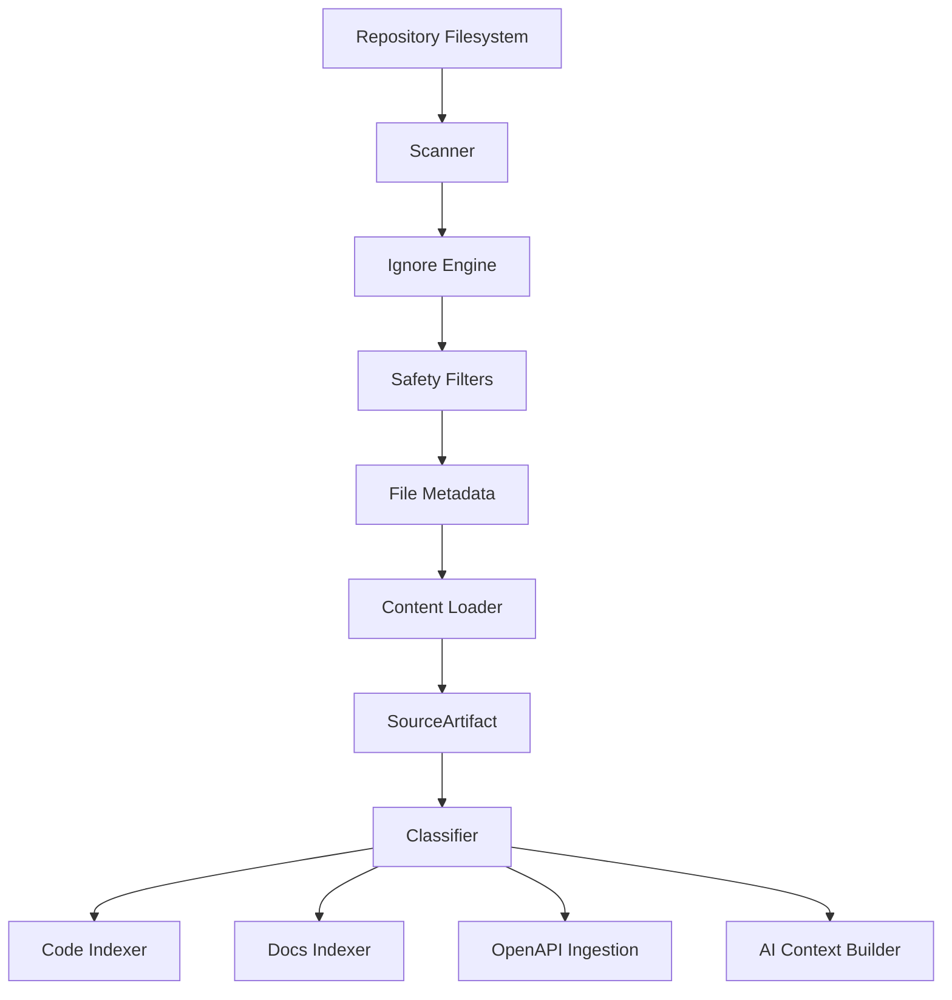
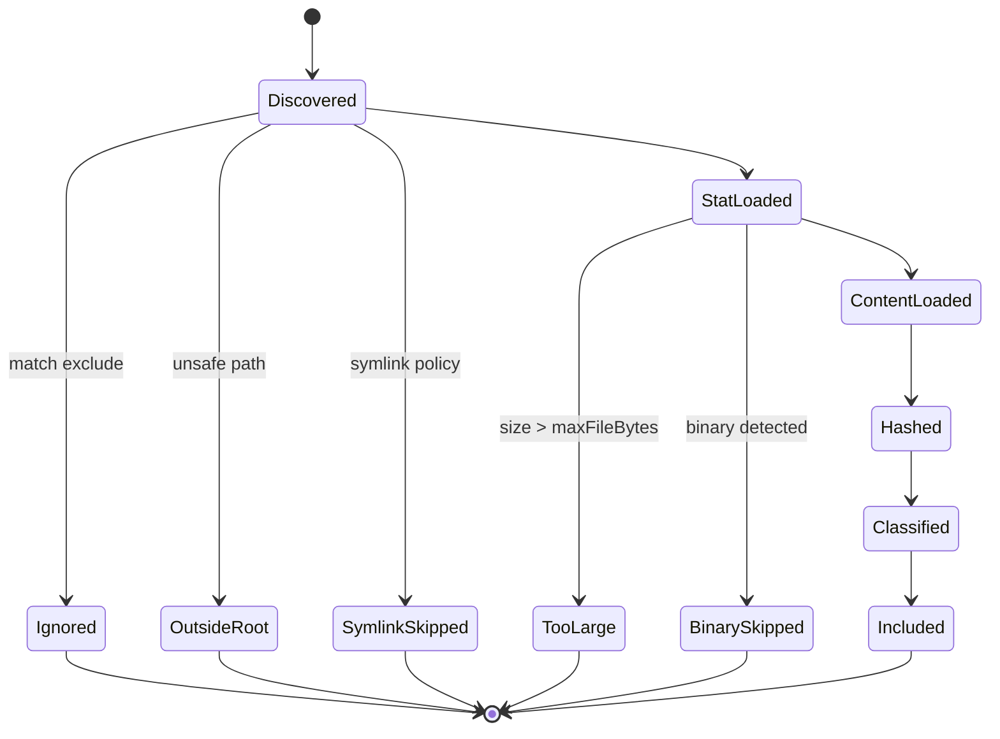
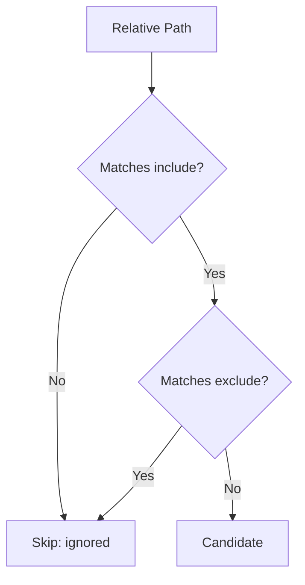
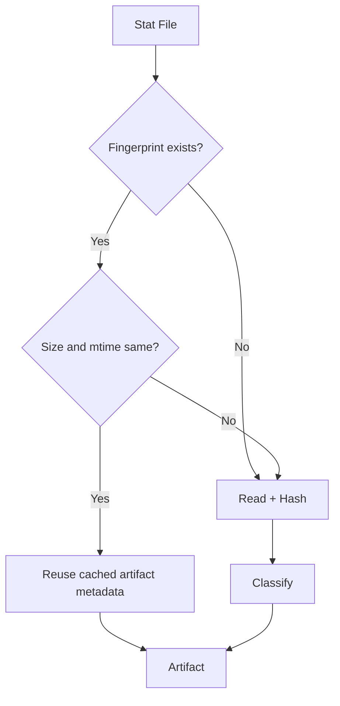
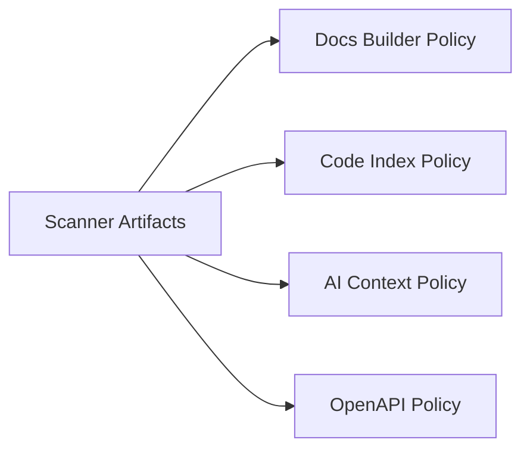

------
title: Build From Scratch: Mintlify-like AI-driven Documentation Generator CLI - Part 008
description: Build a safe, deterministic, and incremental filesystem scanner for a Mintlify-like AI documentation CLI, including glob rules, ignore semantics, symlink safety, binary detection, hashing, diagnostics, and source artifact classification.
series: learn-mintlify-like-ai-docs-cli
seriesTitle: Build From Scratch: Mintlify-like AI-driven Documentation Generator CLI
order: 8
partTitle: Filesystem Scanner and Ignore Rules
tags:
  - documentation
  - ai
  - cli
  - filesystem
  - scanner
  - developer-tools
date: 2026-07-03
---

# Part 008 — Filesystem Scanner and Ignore Rules

Sekarang kita mulai membaca repository.

Ini terdengar sederhana: jalan ke folder, cari file, baca isi. Tetapi untuk AI-driven documentation generator, filesystem scanner adalah salah satu komponen paling berbahaya jika diremehkan.

Scanner yang buruk akan:

- membaca `node_modules` dan menghabiskan waktu,
- mengikuti symlink ke luar repo,
- membaca file biner dan merusak parser,
- mengirim secret ke AI context,
- menghasilkan urutan file tidak deterministik,
- membuat incremental build tidak reliable,
- gagal di monorepo besar,
- membuat diagnostics tidak bisa ditelusuri.

Scanner bukan utility kecil. Scanner adalah **gerbang trust boundary** antara repository user dan seluruh pipeline documentation generator.



Invariant utama:

> Tidak ada file yang boleh masuk ke parser, indexer, renderer, atau AI context sebelum lolos dari scanner policy.

---

## 1. Tujuan scanner

Scanner kita harus menghasilkan daftar `SourceArtifact`, bukan sekadar path string.

Path string terlalu miskin informasi.

Kita butuh metadata:

- path relatif terhadap project root,
- path absolut canonical,
- ukuran file,
- modified time,
- content hash,
- file kind,
- language hint,
- apakah generated/vendor/test/example,
- alasan jika diskip,
- provenance.

Target interface:

```ts filename="packages/scanner/src/types.ts"
export interface ScanProjectOptions {
  readonly projectRoot: string;
  readonly include: readonly string[];
  readonly exclude: readonly string[];
  readonly maxFileBytes: number;
  readonly followSymlinks: boolean;
  readonly readContent: boolean;
}

export interface ScanResult {
  readonly projectRoot: string;
  readonly artifacts: readonly SourceArtifact[];
  readonly skipped: readonly SkippedFile[];
  readonly diagnostics: readonly ScannerDiagnostic[];
  readonly stats: ScanStats;
}

export interface SourceArtifact {
  readonly id: string;
  readonly absolutePath: string;
  readonly relativePath: string;
  readonly extension: string | null;
  readonly sizeBytes: number;
  readonly modifiedTimeMs: number;
  readonly contentHash: string;
  readonly kind: SourceArtifactKind;
  readonly language: string | null;
  readonly content?: string;
  readonly flags: SourceArtifactFlags;
}

export type SourceArtifactKind =
  | "markdown"
  | "mdx"
  | "source-code"
  | "openapi"
  | "config"
  | "package-metadata"
  | "test"
  | "example"
  | "asset"
  | "unknown-text";

export interface SourceArtifactFlags {
  readonly generated: boolean;
  readonly vendor: boolean;
  readonly test: boolean;
  readonly example: boolean;
  readonly likelySecret: boolean;
}

export interface SkippedFile {
  readonly absolutePath: string;
  readonly relativePath: string;
  readonly reason: SkippedFileReason;
  readonly detail?: string;
}

export type SkippedFileReason =
  | "ignored"
  | "too-large"
  | "binary"
  | "outside-root"
  | "symlink-not-followed"
  | "read-error"
  | "permission-denied";

export interface ScanStats {
  readonly filesVisited: number;
  readonly filesIncluded: number;
  readonly filesSkipped: number;
  readonly bytesRead: number;
  readonly durationMs: number;
}
```

Perhatikan ada `readContent`. Dalam beberapa mode kita hanya butuh metadata/hash. Dalam mode indexing/generation kita butuh content.

---

## 2. Scanner sebagai state machine

Setiap file melewati state yang jelas.



Kenapa state machine penting?

Karena kegagalan scanner harus bisa dijelaskan. Kalau file tidak masuk index, user harus bisa tahu alasannya.

Command yang kita inginkan:

```bash
npx docforge scan --why docs/api/large-file.json
```

Output:

```txt
docs/api/large-file.json was skipped.
Reason: too-large
Configured limit: 512000 bytes
Actual size: 2840330 bytes
Config path: sources.maxFileBytes
```

---

## 3. Include dan exclude semantics

Config dari part sebelumnya:

```json
{
  "schemaVersion": 1,
  "sources": {
    "include": ["**/*"],
    "exclude": [
      "node_modules/**",
      ".git/**",
      "dist/**",
      "build/**",
      ".docforge/**"
    ],
    "maxFileBytes": 512000
  }
}
```

Rule yang kita pakai:

1. file harus match minimal satu include pattern,
2. file tidak boleh match exclude pattern,
3. exclude menang atas include,
4. matching dilakukan terhadap relative path dengan `/`, bukan path separator OS,
5. hasil scan diurutkan stabil secara lexicographic by relative path,
6. default exclude selalu ditambahkan kecuali user override secara eksplisit di mode advanced.



Ini harus ditulis di docs config, karena user sering salah paham: include bukan override exclude.

---

## 4. Path normalization

Jangan pakai path mentah dari filesystem sebagai identity.

Windows dan Unix berbeda separator. Symlink dan `..` bisa membuat path kabur. Case sensitivity berbeda antar filesystem.

Kita definisikan canonical relative path:

```ts filename="packages/scanner/src/pathUtils.ts"
import path from "node:path";

export function toPosixRelativePath(projectRoot: string, absolutePath: string): string {
  const relative = path.relative(projectRoot, absolutePath);
  return relative.split(path.sep).join("/");
}

export function isInsideRoot(projectRoot: string, absolutePath: string): boolean {
  const relative = path.relative(projectRoot, absolutePath);
  return Boolean(relative) && !relative.startsWith("..") && !path.isAbsolute(relative);
}
```

Tetapi ada edge case: file root sendiri. Untuk scan file, root directory tidak dihitung sebagai artifact. Jadi `Boolean(relative)` aman untuk file artifact. Kalau nanti scanner mendukung single file root, sesuaikan.

Security invariant:

> Scanner tidak boleh memasukkan file dengan canonical path di luar `projectRoot`.

---

## 5. Symlink policy

Symlink adalah sumber bug dan security issue.

Contoh:

```txt
repo/
  docs/
  linked -> /etc
```

Kalau scanner mengikuti symlink tanpa batas, ia bisa membaca file di luar repo.

Default policy:

```ts
followSymlinks: false
```

Kalau user mengaktifkan follow symlink, tetap harus enforce root boundary setelah realpath.

```ts filename="packages/scanner/src/symlinkPolicy.ts"
import { realpath } from "node:fs/promises";
import { isInsideRoot } from "./pathUtils";

export async function resolveSafeRealPath(options: {
  readonly projectRootRealPath: string;
  readonly candidatePath: string;
  readonly followSymlinks: boolean;
}): Promise<{ ok: true; realPath: string } | { ok: false; reason: "symlink-not-followed" | "outside-root" }> {
  const realCandidate = await realpath(options.candidatePath);

  if (!options.followSymlinks && realCandidate !== options.candidatePath) {
    return { ok: false, reason: "symlink-not-followed" };
  }

  if (!isInsideRoot(options.projectRootRealPath, realCandidate)) {
    return { ok: false, reason: "outside-root" };
  }

  return { ok: true, realPath: realCandidate };
}
```

Catatan: `realCandidate !== candidatePath` bisa tricky karena path normalization/case. Dalam implementasi production, normalisasi kedua path lebih dulu. Untuk materi ini, mental modelnya yang penting: **realpath harus dicek terhadap root**.

---

## 6. Binary detection

Jangan baca semua file sebagai UTF-8.

Binary file bisa:

- menghasilkan karakter rusak,
- membuat parser error tidak bermakna,
- membengkakkan memory,
- tidak berguna untuk AI context,
- menyebabkan terminal output kacau.

Strategi sederhana:

1. baca sample awal, misalnya 8192 bytes,
2. jika ada null byte, anggap binary,
3. jika decoding UTF-8 gagal parah, anggap binary,
4. whitelist extension text tertentu,
5. blacklist extension binary umum.

```ts filename="packages/scanner/src/binary.ts"
const BINARY_EXTENSIONS = new Set([
  ".png",
  ".jpg",
  ".jpeg",
  ".gif",
  ".webp",
  ".ico",
  ".pdf",
  ".zip",
  ".gz",
  ".tar",
  ".jar",
  ".class",
  ".exe",
  ".dll",
  ".so",
  ".dylib"
]);

const TEXT_EXTENSIONS = new Set([
  ".md",
  ".mdx",
  ".txt",
  ".json",
  ".yaml",
  ".yml",
  ".toml",
  ".xml",
  ".java",
  ".ts",
  ".tsx",
  ".js",
  ".jsx",
  ".go",
  ".py",
  ".rs",
  ".kt",
  ".sh",
  ".sql"
]);

export function isLikelyBinaryByExtension(extension: string): boolean {
  return BINARY_EXTENSIONS.has(extension.toLowerCase());
}

export function isKnownTextExtension(extension: string): boolean {
  return TEXT_EXTENSIONS.has(extension.toLowerCase());
}

export function isLikelyBinaryBuffer(buffer: Buffer): boolean {
  if (buffer.includes(0)) return true;

  let suspicious = 0;
  for (const byte of buffer) {
    if (byte < 7 || (byte > 14 && byte < 32)) {
      suspicious++;
    }
  }

  return suspicious / Math.max(buffer.length, 1) > 0.3;
}
```

Kita tetap harus berhati-hati: binary detection adalah heuristic. Karena itu reason-nya `binary`, bukan `definitely-binary`.

---

## 7. Size limit

AI documentation generator harus punya batas ukuran file.

Tanpa limit, satu file generated bisa merusak semua:

```txt
openapi/generated-huge.json  90 MB
```

Default awal:

```ts
maxFileBytes = 512_000
```

Ini bukan angka sakral. Ini default konservatif. User bisa override.

Rule:

- file terlalu besar tidak dibaca content-nya,
- metadata tetap dicatat sebagai skipped,
- diagnostic bisa memberi saran exclude atau naikkan limit,
- file penting seperti OpenAPI besar bisa ditangani oleh specialized ingestion nanti.

```ts
if (stat.size > options.maxFileBytes) {
  skipped.push({
    absolutePath,
    relativePath,
    reason: "too-large",
    detail: `${stat.size} bytes exceeds sources.maxFileBytes=${options.maxFileBytes}`
  });
  continue;
}
```

Mental model:

> Scanner default harus aman. Fitur khusus boleh memperbesar batas secara sadar.

---

## 8. Content hashing

Hash dibutuhkan untuk incremental build.

Kita tidak ingin parse semua file setiap kali jika content tidak berubah.

```ts filename="packages/scanner/src/hash.ts"
import { createHash } from "node:crypto";

export function sha256Text(text: string): string {
  return createHash("sha256").update(text, "utf8").digest("hex");
}

export function createArtifactId(relativePath: string, contentHash: string): string {
  return `src:${relativePath}:${contentHash.slice(0, 16)}`;
}
```

Artifact ID sebaiknya mengandung path dan hash pendek. Path membuat debugging mudah. Hash membuat invalidation jelas.

Tapi jangan jadikan ID panjang sebagai public stable URL. ID internal boleh berubah saat content berubah.

---

## 9. Scanner implementation skeleton

Kita buat scanner yang explicit dan testable.

```ts filename="packages/scanner/src/scanProject.ts"
import { performance } from "node:perf_hooks";
import { lstat, readFile, realpath, stat } from "node:fs/promises";
import path from "node:path";
import { glob } from "glob";
import ignore from "ignore";
import type { ScanProjectOptions, ScanResult, SourceArtifact, SkippedFile } from "./types";
import { toPosixRelativePath, isInsideRoot } from "./pathUtils";
import { isLikelyBinaryBuffer, isLikelyBinaryByExtension } from "./binary";
import { sha256Text, createArtifactId } from "./hash";
import { classifyArtifact } from "./classifyArtifact";

export async function scanProject(options: ScanProjectOptions): Promise<ScanResult> {
  const started = performance.now();
  const projectRoot = path.resolve(options.projectRoot);
  const projectRootRealPath = await realpath(projectRoot);

  const ignoreEngine = ignore().add(options.exclude as string[]);
  const candidatePaths = await glob(options.include as string[], {
    cwd: projectRoot,
    nodir: true,
    dot: true,
    absolute: true,
    follow: false
  });

  const artifacts: SourceArtifact[] = [];
  const skipped: SkippedFile[] = [];
  let filesVisited = 0;
  let bytesRead = 0;

  for (const candidate of candidatePaths.sort()) {
    filesVisited++;

    const absolutePath = path.resolve(candidate);
    const relativePath = toPosixRelativePath(projectRoot, absolutePath);

    if (!isInsideRoot(projectRoot, absolutePath)) {
      skipped.push({ absolutePath, relativePath, reason: "outside-root" });
      continue;
    }

    if (ignoreEngine.ignores(relativePath)) {
      skipped.push({ absolutePath, relativePath, reason: "ignored" });
      continue;
    }

    const linkStat = await lstat(absolutePath);
    if (linkStat.isSymbolicLink() && !options.followSymlinks) {
      skipped.push({ absolutePath, relativePath, reason: "symlink-not-followed" });
      continue;
    }

    const realCandidate = await realpath(absolutePath);
    if (!isInsideRoot(projectRootRealPath, realCandidate)) {
      skipped.push({ absolutePath, relativePath, reason: "outside-root" });
      continue;
    }

    const fileStat = await stat(realCandidate);
    if (fileStat.size > options.maxFileBytes) {
      skipped.push({
        absolutePath,
        relativePath,
        reason: "too-large",
        detail: `${fileStat.size} bytes exceeds ${options.maxFileBytes} bytes`
      });
      continue;
    }

    const extension = path.extname(relativePath).toLowerCase() || null;

    if (extension && isLikelyBinaryByExtension(extension)) {
      skipped.push({ absolutePath, relativePath, reason: "binary" });
      continue;
    }

    const buffer = await readFile(realCandidate);
    bytesRead += buffer.byteLength;

    if (isLikelyBinaryBuffer(buffer)) {
      skipped.push({ absolutePath, relativePath, reason: "binary" });
      continue;
    }

    const content = buffer.toString("utf8");
    const contentHash = sha256Text(content);
    const classification = classifyArtifact({ relativePath, extension, content });

    artifacts.push({
      id: createArtifactId(relativePath, contentHash),
      absolutePath: realCandidate,
      relativePath,
      extension,
      sizeBytes: fileStat.size,
      modifiedTimeMs: fileStat.mtimeMs,
      contentHash,
      kind: classification.kind,
      language: classification.language,
      content: options.readContent ? content : undefined,
      flags: classification.flags
    });
  }

  return {
    projectRoot,
    artifacts: artifacts.sort((a, b) => a.relativePath.localeCompare(b.relativePath)),
    skipped,
    diagnostics: [],
    stats: {
      filesVisited,
      filesIncluded: artifacts.length,
      filesSkipped: skipped.length,
      bytesRead,
      durationMs: performance.now() - started
    }
  };
}
```

Ini masih skeleton. Ada beberapa hal yang nanti harus diperbaiki untuk production scale:

- concurrency limit,
- better error handling per file,
- streaming hashing untuk file besar,
- gitignore integration,
- persistent cache,
- directory pruning sebelum glob membesar,
- Windows realpath nuance,
- permission error handling.

Tetapi flow dasarnya sudah benar.

---

## 10. Jangan biarkan satu file error menggagalkan scan semua

Repository nyata tidak bersih. Ada permission issue, broken symlink, file terhapus saat scan, transient read error.

Scanner harus punya per-file isolation.

Buruk:

```ts
for (const file of files) {
  const content = await readFile(file, "utf8");
  // one error fails everything
}
```

Lebih baik:

```ts
try {
  // scan one file
} catch (error) {
  skipped.push({
    absolutePath,
    relativePath,
    reason: "read-error",
    detail: error instanceof Error ? error.message : String(error)
  });
}
```

Tetapi ada error yang harus fatal:

- project root tidak ada,
- config invalid,
- include pattern invalid,
- scanner internal invariant broken.

Perbedaan:

| Error | Scope | Behavior |
|---|---|---|
| Satu file tidak bisa dibaca | per file | skip + warning |
| Root tidak bisa dibuka | global | fail |
| Invalid glob pattern | global | fail |
| Symlink keluar root | per file | skip + warning/security info |
| Permission denied file | per file | skip |
| Permission denied root | global | fail |

---

## 11. Classification tahap awal

Scanner bukan parser penuh, tetapi ia bisa memberi classification awal.

```ts filename="packages/scanner/src/classifyArtifact.ts"
import type { SourceArtifactKind, SourceArtifactFlags } from "./types";

export interface ClassifyInput {
  readonly relativePath: string;
  readonly extension: string | null;
  readonly content: string;
}

export interface Classification {
  readonly kind: SourceArtifactKind;
  readonly language: string | null;
  readonly flags: SourceArtifactFlags;
}

export function classifyArtifact(input: ClassifyInput): Classification {
  const path = input.relativePath.toLowerCase();
  const ext = input.extension?.toLowerCase() ?? "";

  const flags: SourceArtifactFlags = {
    generated: isLikelyGenerated(input),
    vendor: isVendorPath(path),
    test: isTestPath(path),
    example: isExamplePath(path),
    likelySecret: isLikelySecretPath(path)
  };

  return {
    kind: inferKind(path, ext, input.content),
    language: inferLanguage(ext),
    flags
  };
}

function inferKind(path: string, ext: string, content: string): SourceArtifactKind {
  if (ext === ".md") return "markdown";
  if (ext === ".mdx") return "mdx";

  if (
    path.endsWith("openapi.json") ||
    path.endsWith("openapi.yaml") ||
    path.endsWith("openapi.yml") ||
    content.includes("\"openapi\"") ||
    content.includes("openapi:")
  ) {
    return "openapi";
  }

  if (path.endsWith("package.json") || path.endsWith("pom.xml")) {
    return "package-metadata";
  }

  if (isTestPath(path)) return "test";
  if (isExamplePath(path)) return "example";

  const language = inferLanguage(ext);
  if (language) return "source-code";

  if ([".json", ".yaml", ".yml", ".toml", ".xml"].includes(ext)) {
    return "config";
  }

  return "unknown-text";
}

function inferLanguage(ext: string): string | null {
  const map: Record<string, string> = {
    ".ts": "typescript",
    ".tsx": "typescript-react",
    ".js": "javascript",
    ".jsx": "javascript-react",
    ".java": "java",
    ".go": "go",
    ".py": "python",
    ".rs": "rust",
    ".kt": "kotlin",
    ".sql": "sql",
    ".sh": "shell"
  };

  return map[ext] ?? null;
}

function isVendorPath(path: string): boolean {
  return path.includes("/vendor/") || path.includes("/third_party/");
}

function isTestPath(path: string): boolean {
  return (
    path.includes("/test/") ||
    path.includes("/tests/") ||
    path.endsWith(".test.ts") ||
    path.endsWith(".spec.ts") ||
    path.endsWith("test.java")
  );
}

function isExamplePath(path: string): boolean {
  return path.includes("/example/") || path.includes("/examples/") || path.includes("/samples/");
}

function isLikelyGenerated(input: ClassifyInput): boolean {
  const head = input.content.slice(0, 2000).toLowerCase();
  return (
    head.includes("generated by") ||
    head.includes("do not edit") ||
    head.includes("auto-generated")
  );
}

function isLikelySecretPath(path: string): boolean {
  return (
    path.includes(".env") ||
    path.includes("secret") ||
    path.includes("credentials") ||
    path.includes("private_key")
  );
}
```

Important: `likelySecret` tidak otomatis berarti kita tahu file mengandung secret. Itu sinyal untuk policy.

Default sebaiknya:

- jangan masukkan likely secret ke AI context,
- boleh tampilkan diagnostic,
- user bisa override dengan explicit allowlist jika perlu, tetapi harus sadar risiko.

---

## 12. Secret safety filter

AI-driven docs generator punya risiko khusus: ia mungkin mengirim file content ke LLM provider.

Scanner harus menandai file sensitif sedini mungkin.

Path-based detection:

```txt
.env
.env.local
.env.production
*.pem
*.key
credentials.json
secrets.yaml
```

Content-based detection sederhana:

```ts filename="packages/scanner/src/secretDetection.ts"
const SECRET_PATTERNS: readonly RegExp[] = [
  /-----BEGIN (RSA |EC |OPENSSH )?PRIVATE KEY-----/,
  /\b[A-Za-z0-9_]*SECRET[A-Za-z0-9_]*\s*=/,
  /\b[A-Za-z0-9_]*TOKEN[A-Za-z0-9_]*\s*=/,
  /\b[A-Za-z0-9_]*API[_-]?KEY[A-Za-z0-9_]*\s*=/
];

export function containsLikelySecret(content: string): boolean {
  return SECRET_PATTERNS.some((pattern) => pattern.test(content));
}
```

Jangan overclaim. Ini heuristic.

Policy yang baik:

1. scanner boleh include metadata file sensitif,
2. scanner tidak perlu menyimpan content sensitif kecuali mode explicitly allow,
3. AI context builder harus menolak content dengan `likelySecret: true`,
4. diagnostics harus menjelaskan file mana yang dikecualikan.

---

## 13. Gitignore integration

Developer berharap tool menghormati `.gitignore`.

Tetapi ada nuance:

- `.gitignore` dirancang untuk Git tracking, bukan docs ingestion,
- beberapa ignored file mungkin tetap relevan untuk docs,
- beberapa tracked file tetap harus dikecualikan dari AI context,
- nested `.gitignore` punya semantics sendiri.

Untuk v1, kita bisa mulai dengan:

1. default exclude dari config,
2. root `.gitignore` optional,
3. nested `.gitignore` belum didukung atau didukung nanti.

Config:

```json
{
  "sources": {
    "respectGitignore": true
  }
}
```

Jika belum masuk schema v1, jangan implement diam-diam. Kita bisa rencanakan v1.1 optional field.

Simplified loader:

```ts
import { readFile } from "node:fs/promises";
import path from "node:path";

export async function readRootGitignore(projectRoot: string): Promise<string[]> {
  try {
    const text = await readFile(path.join(projectRoot, ".gitignore"), "utf8");
    return text
      .split(/\r?\n/)
      .map((line) => line.trim())
      .filter((line) => line && !line.startsWith("#"));
  } catch {
    return [];
  }
}
```

Nanti kita bisa upgrade semantics, tapi jangan mengklaim sudah 100% sama dengan Git jika belum.

---

## 14. Determinism

Build yang sama harus menghasilkan hasil yang sama.

Scanner wajib deterministik:

- urutan artifact stabil,
- path normalized,
- hash content stabil,
- skip reason stabil,
- glob include/exclude stabil,
- tidak bergantung pada urutan filesystem.

Test determinism:

```ts
it("returns artifacts sorted by relative path", async () => {
  const result = await scanProject(options);
  const paths = result.artifacts.map((artifact) => artifact.relativePath);
  expect(paths).toEqual([...paths].sort());
});
```

Kenapa ini penting untuk AI docs?

Karena context order bisa memengaruhi output LLM. Kalau scanner order berubah random, generated docs bisa berubah tanpa source change.

---

## 15. Incremental scan model

Untuk repo kecil, full scan cukup. Untuk monorepo, kita butuh cache.

Cache key minimal:

```ts
export interface FileFingerprint {
  readonly relativePath: string;
  readonly sizeBytes: number;
  readonly modifiedTimeMs: number;
  readonly contentHash: string;
}
```

Optimization:

1. stat file,
2. jika `sizeBytes` dan `modifiedTimeMs` sama dengan cache, reuse hash/classification,
3. jika beda, read content dan hash ulang.

Tapi hati-hati: modified time bisa tidak reliable di beberapa environment. Untuk correctness penuh, content hash adalah source of truth. mtime hanya fast path.



Rule:

> Cache boleh mempercepat, tidak boleh mengubah hasil benar.

---

## 16. Concurrency limit

Scanner harus parallel, tapi tidak liar.

Membaca ribuan file sekaligus bisa membuat OS limit error.

Gunakan concurrency limiter:

```ts filename="packages/scanner/src/concurrency.ts"
export async function mapLimit<T, R>(
  items: readonly T[],
  limit: number,
  fn: (item: T) => Promise<R>
): Promise<R[]> {
  const results: R[] = [];
  let index = 0;

  async function worker() {
    while (index < items.length) {
      const current = index++;
      results[current] = await fn(items[current]);
    }
  }

  await Promise.all(
    Array.from({ length: Math.min(limit, items.length) }, () => worker())
  );

  return results;
}
```

Default concurrency:

```ts
const DEFAULT_SCAN_CONCURRENCY = Math.max(4, Math.min(32, os.cpus().length * 2));
```

Jangan buat concurrency sebagai angka besar tanpa alasan. Scanner bottleneck bisa filesystem, CPU hashing, atau antivirus/IO subsystem.

---

## 17. Directory pruning

Glob yang buruk akan tetap masuk ke direktori besar lalu baru exclude file. Lebih efisien kalau kita prune directory.

Contoh exclude:

```txt
node_modules/**
.git/**
dist/**
build/**
```

Jika walker custom, saat menemukan directory `node_modules`, langsung skip subtree.

Dengan library glob, pastikan ignore pattern dipakai di level glob jika library mendukung.

Mental model:

> Exclude sebaiknya mencegah traversal, bukan hanya membuang hasil setelah traversal.

Ini sangat penting untuk monorepo.

---

## 18. Scanner diagnostics

Scanner diagnostics harus menjawab dua pertanyaan:

1. apa yang terjadi,
2. apa dampaknya terhadap docs.

Contoh:

```ts
export interface ScannerDiagnostic {
  readonly severity: "error" | "warning" | "info";
  readonly code: string;
  readonly message: string;
  readonly path?: string;
  readonly hint?: string;
}
```

Diagnostic examples:

```txt
SCANNER_FILE_TOO_LARGE
File `api/generated-openapi.json` was skipped because it exceeds sources.maxFileBytes.
Hint: Add a specific OpenAPI source config or increase sources.maxFileBytes.
```

```txt
SCANNER_POSSIBLE_SECRET
File `.env.local` was excluded from AI context because it looks sensitive.
Hint: Do not include secret files in documentation generation.
```

```txt
SCANNER_SYMLINK_OUTSIDE_ROOT
Symlink `docs/shared` points outside the project root and was skipped.
Hint: Copy the docs into the repository or configure an explicit trusted source later.
```

---

## 19. CLI command: scan

Add command:

```bash
npx docforge scan
npx docforge scan --json
npx docforge scan --include "src/**/*.ts" --exclude "**/*.test.ts"
npx docforge scan --why src/server/routes.ts
```

Human output:

```txt
Scanned project: /repo/acme

Included files: 184
Skipped files: 42
Bytes read: 1.8 MB
Duration: 312 ms

Kinds:
  source-code       96
  markdown          28
  mdx               12
  openapi            1
  config            21
  test              26

Warnings:
  3 files skipped because they were too large
  2 files excluded from AI context because they look sensitive
```

JSON output should be machine-readable and stable:

```json
{
  "projectRoot": "/repo/acme",
  "stats": {
    "filesVisited": 226,
    "filesIncluded": 184,
    "filesSkipped": 42,
    "bytesRead": 1887436,
    "durationMs": 312
  },
  "artifacts": [
    {
      "relativePath": "src/index.ts",
      "kind": "source-code",
      "language": "typescript",
      "contentHash": "..."
    }
  ],
  "skipped": [
    {
      "relativePath": "node_modules/pkg/index.js",
      "reason": "ignored"
    }
  ]
}
```

Do not include full content in `--json` by default. It can leak sensitive data and produce huge output.

---

## 20. Semantic difference: docs source vs AI source

Tidak semua included file harus masuk AI context.

Contoh:

| File | Masuk scan? | Masuk docs build? | Masuk AI context? |
|---|---:|---:|---:|
| `docs/index.mdx` | Ya | Ya | Ya |
| `src/server.ts` | Ya | Tidak langsung | Ya, jika relevan |
| `.env.local` | Metadata mungkin | Tidak | Tidak |
| `dist/bundle.js` | Tidak | Tidak | Tidak |
| `openapi.yaml` | Ya | Ya | Ya |
| `README.md` | Ya | Mungkin | Ya |
| `package-lock.json` | Mungkin | Tidak | Biasanya tidak |
| `tests/user.test.ts` | Ya | Tidak | Mungkin untuk examples/behavior |

Scanner hanya memberi artifact dan flags. Policy final ditentukan stage downstream.

Ini separation of concern:



Jangan masukkan semua policy ke scanner. Scanner cukup memberi informasi yang cukup.

---

## 21. Test project fixtures

Buat fixtures untuk scanner.

```txt
packages/scanner/test-fixtures/basic-repo/
  docforge.config.json
  README.md
  docs/
    index.mdx
  src/
    index.ts
    user.test.ts
  openapi.yaml
  .env.local
  dist/
    bundle.js
  node_modules/
    ignored.js
```

Test cases:

```ts
it("excludes default ignored directories", async () => {
  const result = await scanProject({
    projectRoot: fixture("basic-repo"),
    include: ["**/*"],
    exclude: ["node_modules/**", "dist/**", ".git/**"],
    maxFileBytes: 512_000,
    followSymlinks: false,
    readContent: false
  });

  expect(result.artifacts.map((a) => a.relativePath)).not.toContain(
    "node_modules/ignored.js"
  );
  expect(result.artifacts.map((a) => a.relativePath)).not.toContain(
    "dist/bundle.js"
  );
});
```

Test binary:

```ts
it("skips binary assets", async () => {
  const result = await scanProject(optionsFor("repo-with-image"));
  expect(result.skipped).toContainEqual(
    expect.objectContaining({
      relativePath: "docs/logo.png",
      reason: "binary"
    })
  );
});
```

Test determinism:

```ts
it("is deterministic across runs", async () => {
  const first = await scanProject(options);
  const second = await scanProject(options);

  expect(first.artifacts.map((a) => [a.relativePath, a.contentHash])).toEqual(
    second.artifacts.map((a) => [a.relativePath, a.contentHash])
  );
});
```

---

## 22. Failure model table

| Failure | Cause | Correct behavior |
|---|---|---|
| `node_modules` scanned | exclude not applied early | prune ignored dirs and test fixture |
| secret file sent to AI | no sensitivity flag | flag likely secrets and block in AI context |
| symlink escapes repo | follow symlink without realpath check | realpath + root boundary |
| scan order differs | filesystem order used directly | sort relative paths |
| large file OOM | no size limit | stat before read |
| binary file parser crash | no binary detection | sample/extension detection |
| generated file dominates docs | no generated flag | detect generated headers |
| missing file during scan | concurrent file changes | per-file read-error skip |
| permission error kills build | exception bubbles globally | per-file skip unless root-level |
| cache returns stale content | mtime trusted too much | hash when fingerprint uncertain |

---

## 23. Monorepo considerations

Monorepo punya masalah khusus:

```txt
repo/
  apps/
    web/
    admin/
  packages/
    api-client/
    server/
    ui/
  docs/
  node_modules/
```

Scanner harus mendukung source include yang targeted:

```json
{
  "sources": {
    "include": [
      "docs/**/*",
      "packages/api-client/src/**/*",
      "packages/server/src/**/*",
      "openapi/**/*"
    ],
    "exclude": [
      "**/*.test.ts",
      "**/__snapshots__/**",
      "**/node_modules/**",
      "**/dist/**"
    ]
  }
}
```

Jangan default scan seluruh monorepo secara agresif untuk AI generation. Untuk docs build, seluruh docs folder cukup. Untuk AI generation, source scope harus bisa dipersempit.

Advanced command:

```bash
npx docforge scan --profile ai-context
npx docforge scan --profile docs-build
npx docforge scan --profile code-index
```

Profile adalah policy layer, bukan scanner core.

---

## 24. Performance baseline

Target awal realistis:

| Repo size | Target behavior |
|---|---|
| < 500 files | full scan terasa instan |
| 500–5,000 files | full scan masih nyaman, cache membantu |
| 5,000–50,000 files | directory pruning dan incremental wajib |
| > 50,000 files | user harus define include scope dengan jelas |

Jangan klaim tool “bisa scan semua monorepo tanpa config”. Itu tidak jujur. Tool yang baik memberi default aman dan diagnostic:

```txt
SCANNER_TOO_MANY_FILES
Docforge found 92,341 candidate files.
Hint: Narrow sources.include to docs, src, and API spec directories.
```

---

## 25. Scanner contract dengan part berikutnya

Output scanner akan dipakai oleh Part 009: Documentation Source Classification.

Part ini sudah memberi classification awal, tetapi part 009 akan membuat classifier lebih formal:

- README as overview source,
- package metadata as install source,
- OpenAPI as API reference source,
- tests as behavior examples,
- examples as tutorial source,
- comments as symbol docs,
- existing docs as style/context source.

Jadi scanner tidak harus sempurna. Ia harus aman, deterministik, dan cukup informatif.

---

## 26. Production checklist untuk scanner

- [ ] include/exclude semantics jelas,
- [ ] exclude menang atas include,
- [ ] path dinormalisasi ke POSIX relative path,
- [ ] hasil scan sorted deterministically,
- [ ] symlink default tidak diikuti,
- [ ] realpath dicek terhadap project root,
- [ ] file size dicek sebelum read,
- [ ] binary detection ada,
- [ ] likely secret flag ada,
- [ ] content hash dibuat,
- [ ] generated/vendor/test/example flags ada,
- [ ] per-file error tidak menggagalkan semua scan,
- [ ] scan result punya stats,
- [ ] skipped files menyimpan reason,
- [ ] `docforge scan --json` tidak membocorkan content,
- [ ] fixtures menguji ignored dirs, binary, large file, symlink, determinism.

---

## 27. Kesimpulan

Filesystem scanner adalah pondasi real-world documentation generator. Ia menentukan apa yang dianggap sebagai source of truth, apa yang diabaikan, apa yang aman untuk diproses, dan apa yang boleh masuk ke AI context.

Mental model yang harus dipegang:

> Scanner bukan `readDirRecursive`. Scanner adalah policy-enforced ingestion boundary.

Jika scanner benar, stage berikutnya bisa fokus pada intelligence: classification, parsing, code graph, OpenAPI ingestion, dan AI generation. Jika scanner salah, semua stage setelahnya akan mewarisi noise, risiko, dan nondeterminism.

Pada part berikutnya kita akan membangun classifier yang lebih kaya: bagaimana membedakan README, tutorial, reference, test, example, generated file, package metadata, API spec, dan source code agar documentation generator bisa membuat keputusan yang masuk akal.
