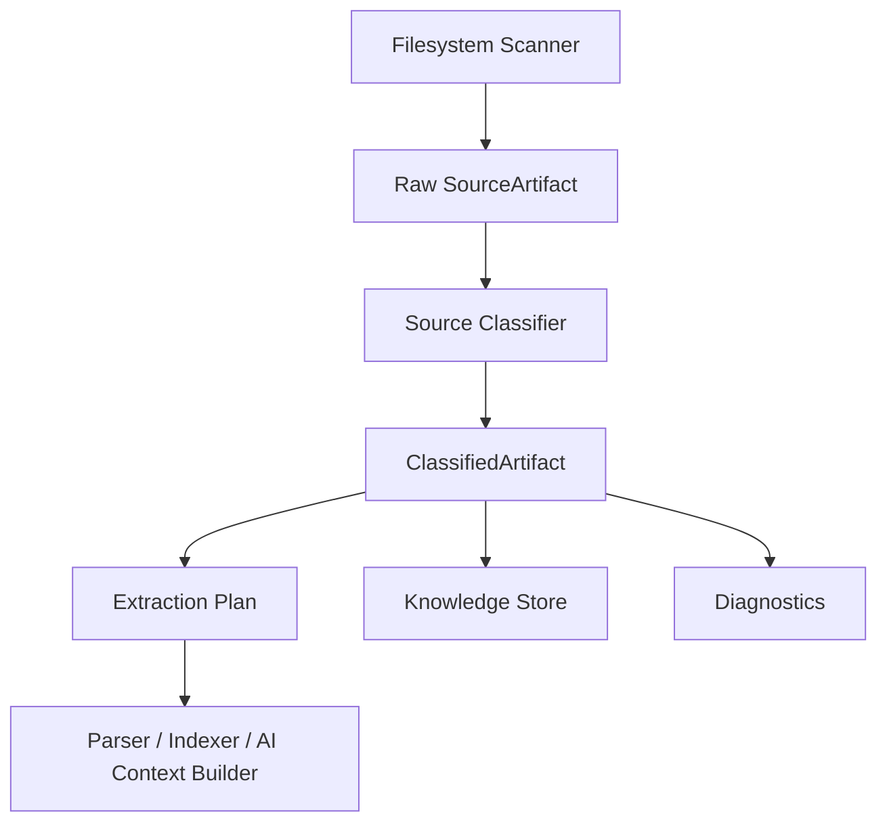
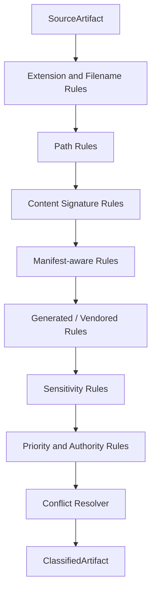

------
title: Build From Scratch: Mintlify-like AI-driven Documentation Generator CLI - Part 009
description: Build a documentation source classifier that turns raw scanned files into meaningful documentation artifacts, with deterministic rules, confidence scoring, provenance, diagnostics, and extraction plans.
series: learn-mintlify-like-ai-docs-cli
seriesTitle: Build From Scratch: Mintlify-like AI-driven Documentation Generator CLI
order: 9
partTitle: Documentation Source Classification
tags:
  - documentation
  - ai
  - cli
  - classification
  - source-analysis
  - developer-tools
date: 2026-07-03
---

# Part 009 — Documentation Source Classification

Di Part 008 kita sudah punya scanner.

Scanner bisa menjawab pertanyaan:

> File apa saja yang aman dan relevan untuk dibaca?

Tetapi documentation generator tidak cukup hanya tahu daftar file.

Ia perlu tahu:

- file ini adalah README atau source code biasa,
- file ini adalah OpenAPI spec atau YAML Kubernetes,
- file ini adalah test yang mengandung executable examples,
- file ini adalah generated file yang sebaiknya tidak dijadikan source of truth,
- file ini adalah package manifest yang menjelaskan command, dependency, entry point, dan metadata,
- file ini adalah existing docs yang harus dipertahankan tone dan strukturnya,
- file ini berisi secret-like content sehingga tidak boleh dikirim ke AI provider,
- file ini penting untuk documentation coverage atau hanya noise.

Scanner menghasilkan **raw artifact**.

Classifier menghasilkan **meaningful artifact**.



Part ini akan membangun classifier yang production-grade.

Kita tidak akan membuat AI langsung membaca semua file dan menebak sendiri. Itu desain yang mahal, lambat, tidak deterministik, dan rawan halusinasi.

Yang kita bangun adalah **classification layer deterministik** yang memberi konteks awal kepada pipeline berikutnya.

---

## 1. Mental model: classification is routing, not labeling

Kesalahan umum ketika membangun documentation generator adalah memperlakukan classification sebagai label sederhana:

```txt
README.md -> markdown
src/main.ts -> typescript
openapi.yaml -> yaml
```

Itu belum cukup.

Bahasa file hanya satu dimensi. Documentation generator butuh tahu **peran** file dalam sistem.

Contoh:

```txt
src/server.ts
```

Bisa berarti:

- HTTP server entry point,
- CLI bootstrap,
- test fixture,
- generated code,
- sample application,
- internal implementation detail.

Ekstensi `.ts` tidak cukup untuk membedakannya.

Classifier yang baik menjawab beberapa pertanyaan sekaligus:

| Pertanyaan | Contoh jawaban |
|---|---|
| Apa jenis sintaks file ini? | `markdown`, `typescript`, `yaml`, `json`, `java`, `xml` |
| Apa peran file ini dalam repo? | `readme`, `apiSpec`, `sourceCode`, `test`, `example`, `buildConfig` |
| Apakah file ini source of truth? | `primary`, `secondary`, `derived`, `generated`, `unknown` |
| Apakah aman dibaca penuh? | `safe`, `restricted`, `sensitive`, `blocked` |
| Bagaimana file ini harus diproses? | `parseMdx`, `parseOpenApi`, `parseAst`, `extractCommands`, `skip` |
| Seberapa yakin classifier? | `0.0` sampai `1.0` plus reason list |
| Apa prioritasnya untuk docs? | `critical`, `high`, `medium`, `low`, `noise` |

Jadi classification bukan sekadar memberi label.

Classification adalah **routing decision**.

File yang sama bisa menghasilkan routing berbeda.

```txt
openapi.yaml
  -> parse as YAML
  -> validate as OpenAPI
  -> generate API reference
  -> feed endpoint summary into knowledge store
  -> do not ask AI to rewrite raw spec
```

```txt
README.md
  -> parse as Markdown
  -> extract project overview
  -> preserve manual wording as high-priority source
  -> compare generated docs with existing claims
```

```txt
src/generated/client.ts
  -> detect generated code
  -> maybe index exported SDK methods
  -> lower trust as author intent
  -> avoid using comments as authoritative product docs
```

This is the compiler mindset.

A compiler does not treat every token equally. It classifies tokens, parses grammar, attaches semantic meaning, then routes nodes into later phases.

Our documentation CLI must do the same with repository files.

---

## 2. The contract from Part 008

From the scanner, assume we already receive a `SourceArtifact` like this:

```ts id="source-artifact-contract"
export type SourceArtifact = {
  artifactId: string;
  projectId: string;
  absolutePath: string;
  repoRelativePath: string;
  normalizedPath: string;
  fileName: string;
  extension: string | null;
  sizeBytes: number;
  contentHash: string;
  binary: boolean;
  symlink: boolean;
  ignored: boolean;
  readable: boolean;
  scanDecision: "included" | "excluded" | "blocked";
  scanReasons: string[];
};
```

Do not mutate this object.

Classification produces a second object:

```ts id="classified-artifact-contract"
export type ClassifiedArtifact = SourceArtifact & {
  syntaxKind: SyntaxKind;
  artifactKinds: ArtifactKind[];
  roles: ArtifactRole[];
  sourceAuthority: SourceAuthority;
  sensitivity: SensitivityLevel;
  docPriority: DocPriority;
  extractionPlan: ExtractionPlan;
  confidence: number;
  classificationReasons: ClassificationReason[];
  diagnostics: Diagnostic[];
};
```

The original scan result is immutable input. Classification is derived metadata.

This distinction matters for incremental builds.

If the file content hash does not change, scan metadata may be reused. If classifier rules change, classification may be recomputed without rescanning the filesystem.

---

## 3. Classification dimensions

A production classifier should be multi-dimensional.

Do not encode everything into one enum like this:

```ts id="bad-single-kind"
type BadArtifactType =
  | "readme"
  | "typescript"
  | "openapi"
  | "test"
  | "config";
```

This fails because dimensions overlap.

`README.md` is both Markdown and project overview.

`src/routes/users.test.ts` is TypeScript, test, framework-aware example, and maybe endpoint usage evidence.

`openapi.yaml` is YAML and API specification.

`pom.xml` is XML and build metadata.

Use separate dimensions.

### 3.1 `SyntaxKind`

`SyntaxKind` describes how to parse the file at the syntax level.

```ts id="syntax-kind"
export type SyntaxKind =
  | "markdown"
  | "mdx"
  | "json"
  | "yaml"
  | "toml"
  | "xml"
  | "typescript"
  | "javascript"
  | "java"
  | "go"
  | "python"
  | "shell"
  | "dockerfile"
  | "plaintext"
  | "binary"
  | "unknown";
```

This is mostly extension/content-signature based.

### 3.2 `ArtifactKind`

`ArtifactKind` describes what the file represents.

```ts id="artifact-kind"
export type ArtifactKind =
  | "projectReadme"
  | "packageManifest"
  | "buildManifest"
  | "apiSpec"
  | "existingDocPage"
  | "sourceCode"
  | "testCode"
  | "exampleCode"
  | "script"
  | "ciWorkflow"
  | "deploymentConfig"
  | "containerConfig"
  | "license"
  | "securityPolicy"
  | "contributingGuide"
  | "changelog"
  | "adr"
  | "generatedCode"
  | "lockfile"
  | "asset"
  | "fixture"
  | "unknown";
```

A file may have multiple artifact kinds.

Example:

```txt
examples/quickstart/app.ts
```

```ts id="multi-kind-example"
artifactKinds: ["sourceCode", "exampleCode"]
```

### 3.3 `ArtifactRole`

Role describes how the documentation system should use the artifact.

```ts id="artifact-role"
export type ArtifactRole =
  | "overviewSource"
  | "conceptSource"
  | "howToSource"
  | "apiReferenceSource"
  | "codeReferenceSource"
  | "exampleSource"
  | "commandSource"
  | "configurationSource"
  | "troubleshootingSource"
  | "releaseHistorySource"
  | "policySource"
  | "supportingEvidence"
  | "noise";
```

A `package.json` is not just a JSON file. It may be a command source because `scripts` can reveal developer workflows.

A `Dockerfile` may be a deployment source.

A test file may be an example source.

A README may be overview source and concept source.

### 3.4 `SourceAuthority`

Not every file has equal authority.

```ts id="source-authority"
export type SourceAuthority =
  | "primary"      // canonical author-maintained source
  | "secondary"    // useful but not canonical
  | "derived"      // generated from another source
  | "generated"    // machine-created output
  | "untrusted"    // may be fixture, sample, copied, stale
  | "unknown";
```

For documentation generation, this is critical.

A generated API client may contain endpoint paths, but the OpenAPI spec is usually more authoritative for API reference.

A README may say “requires Node 20”, while `package.json` `engines.node` says `>=22`. Which one wins?

The answer depends on authority rules.

A simple default:

| Claim type | Preferred authority |
|---|---|
| API endpoint shape | OpenAPI spec > route source code > README |
| CLI command list | CLI source code > package scripts > README |
| installation command | package manager manifests > README > examples |
| release notes | changelog > git tags > README |
| deployment variables | deployment config > docs page > README |
| license | LICENSE file > package manifest |

This does not mean README is low quality. It means README is human-authored overview, not always canonical for machine-verifiable facts.

### 3.5 `SensitivityLevel`

The classifier must participate in safety.

```ts id="sensitivity-level"
export type SensitivityLevel =
  | "safe"
  | "restricted"
  | "sensitive"
  | "blocked";
```

Examples:

| File | Sensitivity |
|---|---|
| `README.md` | `safe` |
| `docs/quickstart.mdx` | `safe` |
| `.env.example` | `restricted` |
| `.env` | `blocked` |
| `private-key.pem` | `blocked` |
| `test/fixtures/token.json` | `restricted` or `sensitive` |

The scanner may already block obvious secrets. The classifier refines context.

`fixtures/auth-response.json` may be a test fixture. It might contain fake tokens. It should not automatically enter AI context without redaction.

### 3.6 `DocPriority`

`DocPriority` controls processing order and context budget.

```ts id="doc-priority"
export type DocPriority =
  | "critical"
  | "high"
  | "medium"
  | "low"
  | "noise";
```

For a docs generator, not all files deserve equal attention.

Suggested default:

| Priority | Examples |
|---|---|
| `critical` | root README, OpenAPI spec, existing docs index, package manifest |
| `high` | source entry points, public API code, examples, changelog |
| `medium` | tests with realistic usage, CI config, deployment examples |
| `low` | internal utilities, fixtures, old migration scripts |
| `noise` | lockfiles, generated assets, coverage output |

Priority does not equal authority.

A changelog may be high priority for migration docs, but not authoritative for current API schema.

---

## 4. Extraction plan: the classifier's real output

The most useful result of classification is the extraction plan.

```ts id="extraction-plan"
export type ExtractionPlan = {
  action:
    | "skip"
    | "parseMarkdown"
    | "parseMdx"
    | "parseJson"
    | "parseYaml"
    | "parseXml"
    | "parseOpenApi"
    | "parseCodeAst"
    | "extractPlainText"
    | "extractPackageMetadata"
    | "extractCiWorkflow"
    | "extractDeploymentMetadata";

  readMode: "none" | "metadataOnly" | "partial" | "full";
  aiContextAllowed: boolean;
  requiresRedaction: boolean;
  maxBytes?: number;
  parserHints: ParserHint[];
};

export type ParserHint =
  | { kind: "language"; value: SyntaxKind }
  | { kind: "framework"; value: string }
  | { kind: "schema"; value: string }
  | { kind: "entrypoint"; value: boolean }
  | { kind: "generated"; value: boolean };
```

This is where the classifier becomes operational.

A later pipeline does not need to re-decide everything. It can route artifact by `extractionPlan.action`.

```ts id="route-by-extraction-plan"
export async function extractArtifact(artifact: ClassifiedArtifact): Promise<ExtractionResult> {
  switch (artifact.extractionPlan.action) {
    case "skip":
      return skipExtraction(artifact);
    case "parseMarkdown":
      return parseMarkdownArtifact(artifact);
    case "parseMdx":
      return parseMdxArtifact(artifact);
    case "parseOpenApi":
      return parseOpenApiArtifact(artifact);
    case "parseCodeAst":
      return parseCodeArtifact(artifact);
    case "extractPackageMetadata":
      return extractPackageMetadata(artifact);
    default:
      return extractAsTextWithLimits(artifact);
  }
}
```

Notice the shape.

Classifier does not parse all content deeply. It decides **what parser should be used** and **what risk policy applies**.

---

## 5. Classification pipeline

A robust classifier should be layered.

Never put all logic in one giant `if` statement.



Each layer adds evidence.

Evidence is later merged into a decision.

This pattern is better than immediately setting final fields because it supports explainability.

---

## 6. Evidence model

Use evidence objects internally.

```ts id="classification-evidence"
export type ClassificationEvidence = {
  ruleId: string;
  dimension:
    | "syntaxKind"
    | "artifactKind"
    | "role"
    | "authority"
    | "sensitivity"
    | "priority"
    | "extraction";
  value: string;
  weight: number;
  reason: string;
};
```

Example evidence:

```json id="classification-evidence-example"
{
  "ruleId": "filename.root-readme",
  "dimension": "artifactKind",
  "value": "projectReadme",
  "weight": 0.95,
  "reason": "File is README.md at repository root"
}
```

Another:

```json id="openapi-evidence-example"
{
  "ruleId": "content.openapi-fields",
  "dimension": "artifactKind",
  "value": "apiSpec",
  "weight": 0.98,
  "reason": "YAML document contains openapi and paths fields"
}
```

The final decision keeps reasons.

```ts id="classification-reason"
export type ClassificationReason = {
  ruleId: string;
  message: string;
  weight: number;
};
```

This enables a user-facing command:

```bash id="classify-explain-command"
docforge classify --explain openapi.yaml
```

Output:

```txt id="classify-explain-output"
openapi.yaml
  syntaxKind: yaml
  artifactKinds: apiSpec
  roles: apiReferenceSource
  authority: primary
  priority: critical
  extraction: parseOpenApi

Reasons:
  + extension.yaml matched YAML syntax rule
  + document contains top-level openapi field
  + document contains top-level paths field
  + api specs are primary source for API reference generation
```

This kind of transparency matters. Developers will not trust an AI docs tool that silently misclassifies their repo.

---

## 7. Extension and filename rules

Start with cheap deterministic rules.

```ts id="extension-rules"
const EXTENSION_SYNTAX_RULES: Record<string, SyntaxKind> = {
  ".md": "markdown",
  ".mdx": "mdx",
  ".json": "json",
  ".yaml": "yaml",
  ".yml": "yaml",
  ".toml": "toml",
  ".xml": "xml",
  ".ts": "typescript",
  ".tsx": "typescript",
  ".js": "javascript",
  ".jsx": "javascript",
  ".mjs": "javascript",
  ".cjs": "javascript",
  ".java": "java",
  ".go": "go",
  ".py": "python",
  ".sh": "shell",
  ".bash": "shell",
};
```

Filename rules catch extensionless files.

```ts id="filename-rules"
function syntaxFromFilename(fileName: string): SyntaxKind | null {
  const normalized = fileName.toLowerCase();

  if (normalized === "dockerfile") return "dockerfile";
  if (normalized === "makefile") return "plaintext";
  if (normalized === "license") return "plaintext";
  if (normalized === "readme") return "markdown";

  return null;
}
```

Then artifact kind by well-known filenames.

```ts id="well-known-filename-rules"
function classifyWellKnownFile(path: string, fileName: string): ClassificationEvidence[] {
  const evidence: ClassificationEvidence[] = [];
  const lowerName = fileName.toLowerCase();
  const lowerPath = path.toLowerCase();

  if (lowerName === "readme.md" && !lowerPath.includes("/")) {
    evidence.push({
      ruleId: "filename.root-readme",
      dimension: "artifactKind",
      value: "projectReadme",
      weight: 0.95,
      reason: "Root README is the project overview source",
    });
    evidence.push({
      ruleId: "filename.root-readme.role",
      dimension: "role",
      value: "overviewSource",
      weight: 0.9,
      reason: "Root README usually explains project purpose and setup",
    });
  }

  if (lowerName === "package.json") {
    evidence.push({
      ruleId: "filename.package-json",
      dimension: "artifactKind",
      value: "packageManifest",
      weight: 0.98,
      reason: "package.json is the Node package manifest",
    });
    evidence.push({
      ruleId: "filename.package-json.extraction",
      dimension: "extraction",
      value: "extractPackageMetadata",
      weight: 0.98,
      reason: "package metadata should be extracted structurally",
    });
  }

  if (lowerName === "pom.xml") {
    evidence.push({
      ruleId: "filename.maven-pom",
      dimension: "artifactKind",
      value: "buildManifest",
      weight: 0.95,
      reason: "pom.xml is a Maven build manifest",
    });
  }

  if (lowerName === "license" || lowerName.startsWith("license.")) {
    evidence.push({
      ruleId: "filename.license",
      dimension: "artifactKind",
      value: "license",
      weight: 0.95,
      reason: "License file defines legal usage terms",
    });
  }

  if (lowerName === "security.md") {
    evidence.push({
      ruleId: "filename.security-policy",
      dimension: "artifactKind",
      value: "securityPolicy",
      weight: 0.9,
      reason: "SECURITY.md usually describes vulnerability reporting policy",
    });
  }

  return evidence;
}
```

Do not overfit too early. These are high-confidence defaults, not universal truth.

---

## 8. Path rules

Paths are powerful signals.

```ts id="path-role-rules"
function classifyByPath(normalizedPath: string): ClassificationEvidence[] {
  const path = normalizedPath.toLowerCase();
  const evidence: ClassificationEvidence[] = [];

  if (path.startsWith("docs/") || path.startsWith("documentation/")) {
    evidence.push({
      ruleId: "path.docs-directory",
      dimension: "artifactKind",
      value: "existingDocPage",
      weight: 0.8,
      reason: "File is inside a documentation directory",
    });
  }

  if (path.includes("/test/") || path.includes("/tests/") || path.includes("__tests__/")) {
    evidence.push({
      ruleId: "path.test-directory",
      dimension: "artifactKind",
      value: "testCode",
      weight: 0.85,
      reason: "File path indicates test code",
    });
  }

  if (path.startsWith("examples/") || path.includes("/examples/")) {
    evidence.push({
      ruleId: "path.examples-directory",
      dimension: "artifactKind",
      value: "exampleCode",
      weight: 0.9,
      reason: "Examples are strong documentation evidence",
    });
    evidence.push({
      ruleId: "path.examples-directory.role",
      dimension: "role",
      value: "exampleSource",
      weight: 0.9,
      reason: "Example files can become tutorials and snippets",
    });
  }

  if (path.startsWith(".github/workflows/")) {
    evidence.push({
      ruleId: "path.github-workflows",
      dimension: "artifactKind",
      value: "ciWorkflow",
      weight: 0.95,
      reason: "GitHub workflow files define CI automation",
    });
  }

  if (path.includes("generated") || path.includes("__generated__")) {
    evidence.push({
      ruleId: "path.generated",
      dimension: "artifactKind",
      value: "generatedCode",
      weight: 0.75,
      reason: "Path suggests generated artifact",
    });
  }

  return evidence;
}
```

Path rules are useful but not absolute.

`src/test/java` is test code in Java.

`test/fixtures/openapi.yaml` might be a fixture, not the real API spec.

`docs/openapi.yaml` might be canonical spec.

Because path rules can conflict, keep them as evidence with weights.

---

## 9. Content signature rules

Some files need light content sniffing.

Do not read huge files fully. Use a prefix sample from scanner or a controlled read limit.

```ts id="content-sample"
export type ContentSample = {
  text: string;
  truncated: boolean;
  bytesRead: number;
};
```

### 9.1 OpenAPI detection

A YAML file is not automatically an OpenAPI spec.

An OpenAPI 3.x document normally contains a top-level `openapi` field plus API structure such as `info` and `paths`. OpenAPI is a language-agnostic interface description for HTTP APIs, so if detected, it should be routed to the API reference generator rather than treated as generic YAML.

```ts id="detect-openapi"
function detectOpenApi(sample: ContentSample, syntaxKind: SyntaxKind): ClassificationEvidence[] {
  if (syntaxKind !== "yaml" && syntaxKind !== "json") return [];

  const text = sample.text;
  const hasOpenApi = /^\s*openapi\s*:/m.test(text) || /"openapi"\s*:/m.test(text);
  const hasSwagger = /^\s*swagger\s*:/m.test(text) || /"swagger"\s*:/m.test(text);
  const hasPaths = /^\s*paths\s*:/m.test(text) || /"paths"\s*:/m.test(text);
  const hasInfo = /^\s*info\s*:/m.test(text) || /"info"\s*:/m.test(text);

  if ((hasOpenApi || hasSwagger) && hasPaths && hasInfo) {
    return [
      {
        ruleId: "content.openapi-signature",
        dimension: "artifactKind",
        value: "apiSpec",
        weight: 0.98,
        reason: "Document contains OpenAPI/Swagger signature fields",
      },
      {
        ruleId: "content.openapi-role",
        dimension: "role",
        value: "apiReferenceSource",
        weight: 0.98,
        reason: "OpenAPI documents are API reference sources",
      },
      {
        ruleId: "content.openapi-extraction",
        dimension: "extraction",
        value: "parseOpenApi",
        weight: 0.98,
        reason: "OpenAPI documents should be parsed with an OpenAPI parser",
      },
    ];
  }

  return [];
}
```

The real parser later must validate the spec. The classifier only detects likely routing.

### 9.2 MDX detection

File extension `.mdx` is enough for syntax, but Markdown files may also contain JSX-like blocks.

Be careful: many README files contain `<br />` or badges. That does not mean full MDX.

```ts id="detect-mdx-ish"
function detectMdxFeatures(sample: ContentSample): ClassificationEvidence[] {
  const text = sample.text;

  const hasImport = /^\s*import\s+.*from\s+["'][^"']+["'];?\s*$/m.test(text);
  const hasExport = /^\s*export\s+(const|function|default)\s+/m.test(text);
  const hasComponent = /^\s*<[A-Z][A-Za-z0-9]*(\s|>|\/)/m.test(text);

  if (hasImport || hasExport || hasComponent) {
    return [
      {
        ruleId: "content.mdx-features",
        dimension: "syntaxKind",
        value: "mdx",
        weight: 0.7,
        reason: "Markdown file contains MDX-like imports, exports, or component usage",
      },
    ];
  }

  return [];
}
```

Do not automatically rewrite Markdown syntax as MDX unless the user opts into MDX conversion.

### 9.3 Generated file detection

Generated code often contains comments like:

```txt
// Code generated by ... DO NOT EDIT.
```

```ts id="detect-generated-content"
function detectGeneratedContent(sample: ContentSample): ClassificationEvidence[] {
  const text = sample.text.toLowerCase();

  const generatedMarkers = [
    "do not edit",
    "auto-generated",
    "autogenerated",
    "code generated",
    "generated by",
    "this file was generated",
  ];

  if (generatedMarkers.some(marker => text.includes(marker))) {
    return [
      {
        ruleId: "content.generated-marker",
        dimension: "artifactKind",
        value: "generatedCode",
        weight: 0.9,
        reason: "File contains generated-code marker",
      },
      {
        ruleId: "content.generated-authority",
        dimension: "authority",
        value: "generated",
        weight: 0.9,
        reason: "Generated files should not be treated as human-authored source of truth",
      },
    ];
  }

  return [];
}
```

Generated files are not always useless. API clients may expose public methods that docs should mention. But they should not dominate conceptual explanations.

---

## 10. Manifest-aware rules

Some files deserve structural interpretation.

### 10.1 `package.json`

`package.json` contains name, version, scripts, dependencies, exports, package type, bin commands, engines, and other package metadata.

For a docs CLI, this can reveal:

- project name,
- install command,
- package manager assumptions,
- CLI binaries,
- available developer commands,
- runtime version constraints,
- public package entry points.

```ts id="package-metadata-extraction-preview"
export type PackageManifestSummary = {
  name?: string;
  version?: string;
  description?: string;
  type?: "module" | "commonjs" | string;
  private?: boolean;
  scripts: Record<string, string>;
  dependencies: string[];
  devDependencies: string[];
  peerDependencies: string[];
  bin: Record<string, string>;
  engines: Record<string, string>;
  exports: unknown;
};
```

Classifier does not need to fully index dependencies. But it can set roles:

```ts id="package-manifest-role-rules"
function classifyPackageJsonManifest(pkg: unknown): ClassificationEvidence[] {
  const evidence: ClassificationEvidence[] = [];

  if (!isObject(pkg)) return evidence;

  evidence.push({
    ruleId: "manifest.package-json.authority",
    dimension: "authority",
    value: "primary",
    weight: 0.85,
    reason: "Package manifest is canonical for package metadata and scripts",
  });

  if (isObject(pkg.scripts) && Object.keys(pkg.scripts).length > 0) {
    evidence.push({
      ruleId: "manifest.package-json.scripts",
      dimension: "role",
      value: "commandSource",
      weight: 0.85,
      reason: "package.json scripts describe common developer commands",
    });
  }

  if (pkg.bin) {
    evidence.push({
      ruleId: "manifest.package-json.bin",
      dimension: "role",
      value: "commandSource",
      weight: 0.9,
      reason: "package.json bin field declares CLI commands",
    });
  }

  return evidence;
}
```

This is how the docs generator later knows that `npm run dev` or `pnpm build` might belong in a Quickstart.

### 10.2 `pom.xml`

For Java projects, `pom.xml` can reveal:

- group ID,
- artifact ID,
- packaging,
- modules,
- plugins,
- Java version hints,
- dependencies,
- build lifecycle assumptions.

Do not turn this part into Maven education. For our CLI, the goal is simple:

> extract enough build metadata to generate accurate setup and development docs.

### 10.3 CI workflows

`.github/workflows/*.yml` can reveal:

- supported runtime versions,
- test commands,
- build commands,
- release process,
- deployment target,
- lint/format expectations.

But CI can contain secrets references and internal deployment details.

Default handling:

```ts id="ci-workflow-default-policy"
const CI_WORKFLOW_POLICY: Partial<ExtractionPlan> = {
  action: "extractCiWorkflow",
  readMode: "partial",
  aiContextAllowed: false,
  requiresRedaction: true,
};
```

The extraction result can expose safe summaries, not raw YAML.

---

## 11. Sensitivity rules

Documentation tools are prone to accidental leakage.

A docs generator will often collect “context” and send it to an LLM. That makes classification part of the security boundary.

### 11.1 Filename-based sensitivity

```ts id="sensitivity-filename-rules"
function classifySensitivityByName(path: string): ClassificationEvidence[] {
  const lower = path.toLowerCase();
  const evidence: ClassificationEvidence[] = [];

  const blockedNames = [
    ".env",
    ".env.local",
    ".env.production",
    "id_rsa",
    "id_ed25519",
    "private-key.pem",
    "credentials.json",
  ];

  if (blockedNames.some(name => lower.endsWith(name))) {
    evidence.push({
      ruleId: "sensitivity.blocked-filename",
      dimension: "sensitivity",
      value: "blocked",
      weight: 1.0,
      reason: "Filename indicates secrets or credentials",
    });
  }

  if (lower.endsWith(".env.example") || lower.endsWith(".env.sample")) {
    evidence.push({
      ruleId: "sensitivity.env-example",
      dimension: "sensitivity",
      value: "restricted",
      weight: 0.8,
      reason: "Environment example may contain safe variable names but should still be handled carefully",
    });
  }

  return evidence;
}
```

### 11.2 Content-based sensitivity

Use redaction and high precision. Avoid regexes that mark every UUID as a secret.

```ts id="sensitivity-content-rules"
function classifySensitivityByContent(sample: ContentSample): ClassificationEvidence[] {
  const text = sample.text;

  const patterns = [
    { id: "aws-access-key", re: /AKIA[0-9A-Z]{16}/ },
    { id: "private-key", re: /-----BEGIN (RSA |EC |OPENSSH )?PRIVATE KEY-----/ },
    { id: "github-token", re: /gh[pousr]_[A-Za-z0-9_]{20,}/ },
  ];

  for (const pattern of patterns) {
    if (pattern.re.test(text)) {
      return [
        {
          ruleId: `sensitivity.${pattern.id}`,
          dimension: "sensitivity",
          value: "blocked",
          weight: 1.0,
          reason: `Content matches high-confidence secret pattern: ${pattern.id}`,
        },
      ];
    }
  }

  return [];
}
```

If sensitivity is `blocked`, extraction plan must be `skip`.

Security overrides convenience.

---

## 12. Conflict resolution

Because we use evidence, conflicts are expected.

Example:

```txt
test/fixtures/openapi.yaml
```

Evidence says:

- YAML syntax,
- OpenAPI signature,
- fixture path,
- maybe API spec.

Should it generate API reference? Not necessarily.

Conflict resolution should prefer explicit source intent.

A good default:

| Conflict | Resolution |
|---|---|
| `apiSpec` + `fixture` | classify as `apiSpec`, but authority `untrusted`, priority `low`, no API reference generation unless configured |
| `existingDocPage` + `generatedCode` | generated docs are derived, avoid using as primary source |
| `exampleCode` + `testCode` | allow both roles; examples can be extracted if test is realistic |
| `blocked sensitivity` + any role | skip extraction and block AI context |
| `root README` + low content confidence | still overview source, but add diagnostic if unreadable or empty |

Implement conflict resolution after all evidence is collected.

```ts id="classification-resolver-skeleton"
export function resolveClassification(
  artifact: SourceArtifact,
  evidence: ClassificationEvidence[],
): ClassifiedArtifact {
  const syntaxKind = resolveSingleDimension<SyntaxKind>(evidence, "syntaxKind", "unknown");
  const artifactKinds = resolveMultiDimension<ArtifactKind>(evidence, "artifactKind", ["unknown"]);
  const roles = resolveMultiDimension<ArtifactRole>(evidence, "role", ["supportingEvidence"]);

  let sensitivity = resolveSensitivity(evidence);
  let sourceAuthority = resolveAuthority(evidence, artifactKinds);
  let docPriority = resolvePriority(evidence, artifactKinds, roles, sensitivity);
  let extractionPlan = resolveExtractionPlan(artifact, syntaxKind, artifactKinds, roles, sensitivity);

  const confidence = computeConfidence(evidence, syntaxKind, artifactKinds, roles);
  const diagnostics = buildClassificationDiagnostics(artifact, evidence, {
    syntaxKind,
    artifactKinds,
    roles,
    sensitivity,
    extractionPlan,
  });

  return {
    ...artifact,
    syntaxKind,
    artifactKinds,
    roles,
    sourceAuthority,
    sensitivity,
    docPriority,
    extractionPlan,
    confidence,
    classificationReasons: evidence.map(toReason),
    diagnostics,
  };
}
```

### Sensitivity resolver

Sensitivity should be conservative.

```ts id="resolve-sensitivity"
function resolveSensitivity(evidence: ClassificationEvidence[]): SensitivityLevel {
  const values = evidence
    .filter(e => e.dimension === "sensitivity")
    .map(e => e.value as SensitivityLevel);

  if (values.includes("blocked")) return "blocked";
  if (values.includes("sensitive")) return "sensitive";
  if (values.includes("restricted")) return "restricted";
  return "safe";
}
```

### Extraction resolver

```ts id="resolve-extraction-plan"
function resolveExtractionPlan(
  artifact: SourceArtifact,
  syntaxKind: SyntaxKind,
  kinds: ArtifactKind[],
  roles: ArtifactRole[],
  sensitivity: SensitivityLevel,
): ExtractionPlan {
  if (artifact.binary || sensitivity === "blocked") {
    return {
      action: "skip",
      readMode: "none",
      aiContextAllowed: false,
      requiresRedaction: false,
      parserHints: [],
    };
  }

  if (kinds.includes("apiSpec")) {
    const isFixture = kinds.includes("fixture");
    return {
      action: isFixture ? "parseYaml" : "parseOpenApi",
      readMode: "full",
      aiContextAllowed: false,
      requiresRedaction: sensitivity !== "safe",
      parserHints: [{ kind: "schema", value: "openapi" }],
    };
  }

  if (kinds.includes("packageManifest")) {
    return {
      action: "extractPackageMetadata",
      readMode: "full",
      aiContextAllowed: false,
      requiresRedaction: false,
      parserHints: [{ kind: "schema", value: "package.json" }],
    };
  }

  if (syntaxKind === "mdx") {
    return {
      action: "parseMdx",
      readMode: "full",
      aiContextAllowed: sensitivity === "safe",
      requiresRedaction: sensitivity !== "safe",
      parserHints: [{ kind: "language", value: "mdx" }],
    };
  }

  if (syntaxKind === "markdown") {
    return {
      action: "parseMarkdown",
      readMode: "full",
      aiContextAllowed: sensitivity === "safe",
      requiresRedaction: sensitivity !== "safe",
      parserHints: [{ kind: "language", value: "markdown" }],
    };
  }

  if (["typescript", "javascript", "java", "go", "python"].includes(syntaxKind)) {
    return {
      action: "parseCodeAst",
      readMode: "partial",
      aiContextAllowed: false,
      requiresRedaction: sensitivity !== "safe",
      parserHints: [{ kind: "language", value: syntaxKind }],
    };
  }

  return {
    action: "extractPlainText",
    readMode: "partial",
    aiContextAllowed: false,
    requiresRedaction: sensitivity !== "safe",
    maxBytes: 32_000,
    parserHints: [],
  };
}
```

Notice that `aiContextAllowed` is not automatically true for code.

The better architecture is:

1. parse code locally,
2. extract structured symbols,
3. select minimal snippets with provenance,
4. then send selected safe snippets to AI.

Do not ship entire repository files into prompts by default.

---

## 13. Priority rules

Priority affects scheduling and context selection.

```ts id="resolve-priority"
function resolvePriority(
  evidence: ClassificationEvidence[],
  kinds: ArtifactKind[],
  roles: ArtifactRole[],
  sensitivity: SensitivityLevel,
): DocPriority {
  if (sensitivity === "blocked") return "noise";

  if (kinds.includes("projectReadme")) return "critical";
  if (kinds.includes("apiSpec")) return "critical";
  if (kinds.includes("packageManifest")) return "critical";

  if (kinds.includes("existingDocPage")) return "high";
  if (kinds.includes("exampleCode")) return "high";
  if (roles.includes("commandSource")) return "high";

  if (kinds.includes("testCode")) return "medium";
  if (kinds.includes("ciWorkflow")) return "medium";
  if (kinds.includes("deploymentConfig")) return "medium";

  if (kinds.includes("lockfile")) return "noise";
  if (kinds.includes("asset")) return "noise";
  if (kinds.includes("generatedCode")) return "low";

  return "medium";
}
```

A practical rule:

> If a file can change what a new developer does in the first 15 minutes, it is high priority or critical.

Examples:

- install command,
- required runtime version,
- authentication setup,
- first API call,
- local dev command,
- migration guide,
- deployment target.

---

## 14. User overrides

No classifier will be correct for every repository.

Provide config overrides.

```json id="classification-config-example"
{
  "classification": {
    "rules": [
      {
        "match": "specs/public-api.yaml",
        "artifactKinds": ["apiSpec"],
        "roles": ["apiReferenceSource"],
        "sourceAuthority": "primary",
        "docPriority": "critical",
        "extraction": "parseOpenApi"
      },
      {
        "match": "test/fixtures/**",
        "artifactKinds": ["fixture"],
        "sourceAuthority": "untrusted",
        "docPriority": "low"
      },
      {
        "match": "legacy-docs/**",
        "roles": ["supportingEvidence"],
        "sourceAuthority": "secondary"
      }
    ]
  }
}
```

Override rules should be explicit and explainable.

When a user override changes a decision, record it:

```txt id="override-diagnostic-output"
DOCFORGE_CLASSIFY_OVERRIDE
  path: specs/public-api.yaml
  decision: artifactKinds += apiSpec
  reason: user config classification.rules[0]
```

Do not silently hide overrides. Silent behavior makes debugging hard.

---

## 15. Classifier API

Expose classifier as a package-level service.

```ts id="classifier-interface"
export type ClassifierInput = {
  artifact: SourceArtifact;
  contentSample?: ContentSample;
  projectContext: ProjectClassificationContext;
  config: ClassificationConfig;
};

export type ProjectClassificationContext = {
  rootPath: string;
  packageManager?: "npm" | "pnpm" | "yarn" | "bun";
  detectedLanguages: string[];
  manifestPaths: string[];
  docsRootCandidates: string[];
};

export interface SourceClassifier {
  classify(input: ClassifierInput): Promise<ClassifiedArtifact>;
}
```

Why include project context?

Because classification sometimes depends on the repo, not just file path.

Example:

- `src/main/java` has special meaning in Maven projects.
- `pages/api` has special meaning in Next.js projects.
- `cmd/mycli/main.go` has special meaning in Go CLI projects.
- `docs.json` has special meaning in Mintlify-style projects.
- `pyproject.toml` changes how Python files are interpreted.

Keep the first version simple, but design the API to accept context.

---

## 16. Implementation skeleton

Suggested package:

```txt id="classifier-package-layout"
packages/
  core/
    src/
      classification/
        classify-artifact.ts
        evidence.ts
        rules/
          extension-rules.ts
          filename-rules.ts
          path-rules.ts
          content-signature-rules.ts
          manifest-rules.ts
          sensitivity-rules.ts
          override-rules.ts
        resolve/
          resolve-syntax.ts
          resolve-kinds.ts
          resolve-authority.ts
          resolve-priority.ts
          resolve-extraction-plan.ts
        diagnostics.ts
        index.ts
```

Main flow:

```ts id="classify-artifact-main"
export async function classifyArtifact(input: ClassifierInput): Promise<ClassifiedArtifact> {
  const evidence: ClassificationEvidence[] = [];

  evidence.push(...classifySyntaxByExtension(input.artifact));
  evidence.push(...classifySyntaxByFilename(input.artifact));
  evidence.push(...classifyWellKnownFile(input.artifact.normalizedPath, input.artifact.fileName));
  evidence.push(...classifyByPath(input.artifact.normalizedPath));
  evidence.push(...classifySensitivityByName(input.artifact.normalizedPath));

  if (input.contentSample) {
    const preliminarySyntax = resolveSingleDimension<SyntaxKind>(
      evidence,
      "syntaxKind",
      "unknown",
    );

    evidence.push(...detectOpenApi(input.contentSample, preliminarySyntax));
    evidence.push(...detectMdxFeatures(input.contentSample));
    evidence.push(...detectGeneratedContent(input.contentSample));
    evidence.push(...classifySensitivityByContent(input.contentSample));
  }

  evidence.push(...classifyByProjectContext(input.artifact, input.projectContext));
  evidence.push(...applyUserOverrides(input.artifact, input.config));

  return resolveClassification(input.artifact, evidence);
}
```

This is intentionally boring.

Boring here is good. Classification must be predictable.

---

## 17. CLI command: `classify`

Give users visibility.

```bash id="classify-basic-command"
docforge classify
```

Example output:

```txt id="classify-table-output"
Path                         Kind                    Priority   Extraction
README.md                    projectReadme           critical   parseMarkdown
package.json                 packageManifest         critical   extractPackageMetadata
openapi.yaml                 apiSpec                 critical   parseOpenApi
docs/quickstart.mdx          existingDocPage         high       parseMdx
src/index.ts                 sourceCode              medium     parseCodeAst
test/fixtures/openapi.yaml   apiSpec,fixture         low        parseYaml
.env                         unknown                 noise      skip
```

JSON output:

```bash id="classify-json-command"
docforge classify --json
```

NDJSON output for large repos:

```bash id="classify-ndjson-command"
docforge classify --ndjson
```

Explain one file:

```bash id="classify-one-file-command"
docforge classify --explain src/index.ts
```

This command is not just for users. It is also a debugging tool for you while building the generator.

---

## 18. Diagnostics

Classification should report suspicious cases.

Examples:

| Diagnostic | Meaning |
|---|---|
| `DOCFORGE_CLASSIFY_LOW_CONFIDENCE` | Classifier could not confidently determine role |
| `DOCFORGE_CLASSIFY_API_SPEC_IN_FIXTURE` | OpenAPI-like file is under fixture path |
| `DOCFORGE_CLASSIFY_BLOCKED_SECRET_FILE` | File skipped due to likely secret |
| `DOCFORGE_CLASSIFY_GENERATED_PRIMARY_CONFLICT` | Generated file was also configured as primary source |
| `DOCFORGE_CLASSIFY_AMBIGUOUS_DOC_ROOT` | Multiple docs root candidates found |

Diagnostic shape:

```ts id="classification-diagnostic"
export type Diagnostic = {
  code: string;
  severity: "info" | "warning" | "error";
  message: string;
  path?: string;
  hint?: string;
};
```

Example:

```ts id="fixture-openapi-diagnostic"
function diagnosticForApiSpecFixture(artifact: SourceArtifact, kinds: ArtifactKind[]): Diagnostic[] {
  if (kinds.includes("apiSpec") && kinds.includes("fixture")) {
    return [
      {
        code: "DOCFORGE_CLASSIFY_API_SPEC_IN_FIXTURE",
        severity: "warning",
        path: artifact.normalizedPath,
        message: "OpenAPI-like document found under fixture path; it will not be used as canonical API reference by default.",
        hint: "Move the canonical spec outside test fixtures or add an explicit classification override.",
      },
    ];
  }

  return [];
}
```

Diagnostics are part of the product UX.

A docs generator should not merely fail. It should teach the repo owner how to make their documentation source model clearer.

---

## 19. Test strategy

Classifier tests should be table-driven.

```ts id="classifier-table-test"
describe("source classifier", () => {
  it.each([
    {
      path: "README.md",
      expectedKinds: ["projectReadme"],
      expectedPriority: "critical",
      expectedExtraction: "parseMarkdown",
    },
    {
      path: "package.json",
      content: JSON.stringify({ scripts: { dev: "vite" }, bin: { docforge: "dist/cli.js" } }),
      expectedKinds: ["packageManifest"],
      expectedRoles: ["commandSource"],
      expectedExtraction: "extractPackageMetadata",
    },
    {
      path: "openapi.yaml",
      content: "openapi: 3.1.0\ninfo:\n  title: API\n  version: 1.0.0\npaths: {}\n",
      expectedKinds: ["apiSpec"],
      expectedExtraction: "parseOpenApi",
    },
    {
      path: "test/fixtures/openapi.yaml",
      content: "openapi: 3.1.0\ninfo:\n  title: API\n  version: 1.0.0\npaths: {}\n",
      expectedKinds: ["apiSpec", "fixture"],
      expectedPriority: "low",
    },
  ])("classifies $path", async (case_) => {
    const artifact = fakeArtifact(case_.path);
    const result = await classifyArtifact({
      artifact,
      contentSample: case_.content
        ? { text: case_.content, truncated: false, bytesRead: Buffer.byteLength(case_.content) }
        : undefined,
      projectContext: fakeProjectContext(),
      config: defaultClassificationConfig(),
    });

    expect(result.artifactKinds).toEqual(expect.arrayContaining(case_.expectedKinds));

    if (case_.expectedRoles) {
      expect(result.roles).toEqual(expect.arrayContaining(case_.expectedRoles));
    }

    if (case_.expectedPriority) {
      expect(result.docPriority).toBe(case_.expectedPriority);
    }

    if (case_.expectedExtraction) {
      expect(result.extractionPlan.action).toBe(case_.expectedExtraction);
    }
  });
});
```

Also test invariants.

```ts id="classifier-invariant-tests"
it("never allows blocked files into AI context", async () => {
  const result = await classifyPathWithContent(".env", "API_KEY=secret");

  expect(result.sensitivity).toBe("blocked");
  expect(result.extractionPlan.action).toBe("skip");
  expect(result.extractionPlan.aiContextAllowed).toBe(false);
});

it("preserves multiple roles instead of forcing a single type", async () => {
  const result = await classifyPathWithContent("examples/quickstart.test.ts", "test('example', () => {})");

  expect(result.artifactKinds).toEqual(expect.arrayContaining(["testCode", "exampleCode"]));
});
```

Testing the classifier is cheap and high leverage. A wrong classifier poisons every later stage.

---

## 20. Example repository classification

Suppose the repository looks like this:

```txt id="example-repo-tree"
.
├── README.md
├── package.json
├── docs.json
├── docs/
│   ├── introduction.mdx
│   └── quickstart.mdx
├── openapi.yaml
├── src/
│   ├── index.ts
│   ├── cli.ts
│   └── generated/client.ts
├── examples/
│   └── basic.ts
├── test/
│   └── fixtures/openapi.yaml
├── .github/workflows/ci.yml
└── .env
```

Classifier output:

| Path | Kinds | Roles | Authority | Priority | Extraction |
|---|---|---|---|---|---|
| `README.md` | `projectReadme` | `overviewSource` | `primary` | `critical` | `parseMarkdown` |
| `package.json` | `packageManifest` | `commandSource`, `configurationSource` | `primary` | `critical` | `extractPackageMetadata` |
| `docs.json` | `buildManifest` | `configurationSource` | `primary` | `critical` | `parseJson` |
| `docs/introduction.mdx` | `existingDocPage` | `conceptSource` | `primary` | `high` | `parseMdx` |
| `openapi.yaml` | `apiSpec` | `apiReferenceSource` | `primary` | `critical` | `parseOpenApi` |
| `src/index.ts` | `sourceCode` | `codeReferenceSource` | `primary` | `medium` | `parseCodeAst` |
| `src/cli.ts` | `sourceCode` | `commandSource` | `primary` | `high` | `parseCodeAst` |
| `src/generated/client.ts` | `sourceCode`, `generatedCode` | `codeReferenceSource` | `generated` | `low` | `parseCodeAst` |
| `examples/basic.ts` | `sourceCode`, `exampleCode` | `exampleSource` | `secondary` | `high` | `parseCodeAst` |
| `test/fixtures/openapi.yaml` | `apiSpec`, `fixture` | `supportingEvidence` | `untrusted` | `low` | `parseYaml` |
| `.github/workflows/ci.yml` | `ciWorkflow` | `commandSource` | `secondary` | `medium` | `extractCiWorkflow` |
| `.env` | `unknown` | `noise` | `unknown` | `noise` | `skip` |

This table is the first point where the docs generator starts to “understand” the repository.

Not semantically in the AI sense yet. But structurally enough to make safe and useful routing decisions.

---

## 21. What not to classify yet

Do not overbuild.

At this stage, avoid deep semantic conclusions like:

- “this service is event-driven”,
- “this class implements authorization”,
- “this API is deprecated”,
- “this endpoint is admin-only”,
- “this module owns billing”.

Those require code graph, framework detection, OpenAPI parsing, comments, annotations, and cross-file reasoning.

Part 009 only classifies **source artifact type and processing intent**.

A useful boundary:

> Classification tells us which parser and pipeline should handle a file. It does not produce final documentation claims.

That keeps the system honest.

---

## 22. Build checkpoint

At the end of this part, your implementation should support:

```bash id="part-009-checkpoint"
docforge scan --json
docforge classify
docforge classify --json
docforge classify --ndjson
docforge classify --explain README.md
```

And internally you should have:

- `ClassifiedArtifact`,
- multi-dimensional classification fields,
- evidence model,
- extension rules,
- filename rules,
- path rules,
- content signature rules,
- manifest-aware rules,
- sensitivity rules,
- user override rules,
- conflict resolver,
- extraction plan resolver,
- diagnostics,
- table-driven tests.

Do not move to AI generation until this layer is boring, testable, and explainable.

AI should consume curated, classified, redacted, and provenance-rich inputs.

Not a random pile of repository text.

---

## 23. Key takeaways

- Scanner answers “what files exist?”
- Classifier answers “what do these files mean for documentation?”
- Syntax kind and artifact role are different dimensions.
- Classification should be deterministic, explainable, and overrideable.
- The most important output is the extraction plan.
- Sensitivity and AI-context permission belong in classification.
- Confidence and reasons are not optional; they are debugging infrastructure.
- User overrides are required because no heuristic classifier understands every repository.
- Wrong classification silently poisons indexing, retrieval, generation, and docs quality.

---

## 24. Technical references

- MDX official documentation describes MDX as Markdown that can use JSX/components, which is why `.mdx` files require different treatment from plain Markdown.
- The OpenAPI Specification defines a standard, language-agnostic description for HTTP APIs, which is why OpenAPI files should route to API reference generation rather than generic YAML parsing.
- npm package metadata uses `package.json` for fields such as package name, version, scripts, dependencies, and package configuration; these fields are useful documentation sources for Node-based projects.
- GitHub Linguist is a practical reference for repository file classification concerns such as binary, vendored, and generated files.

In the next part, we will stop thinking in terms of files and start thinking in terms of **content intermediate representation**: a structured document model that sits between extraction, AI generation, MDX emission, validation, and rendering.
