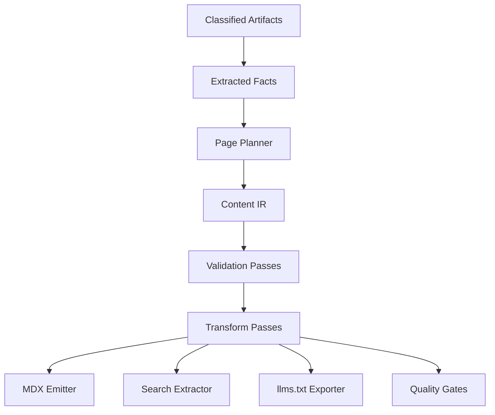
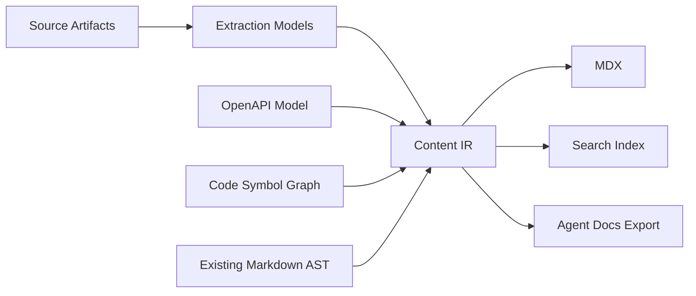
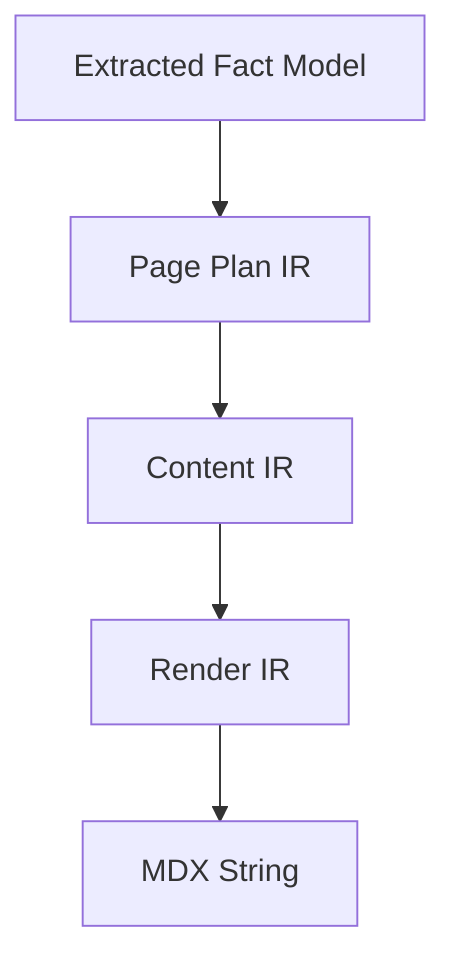
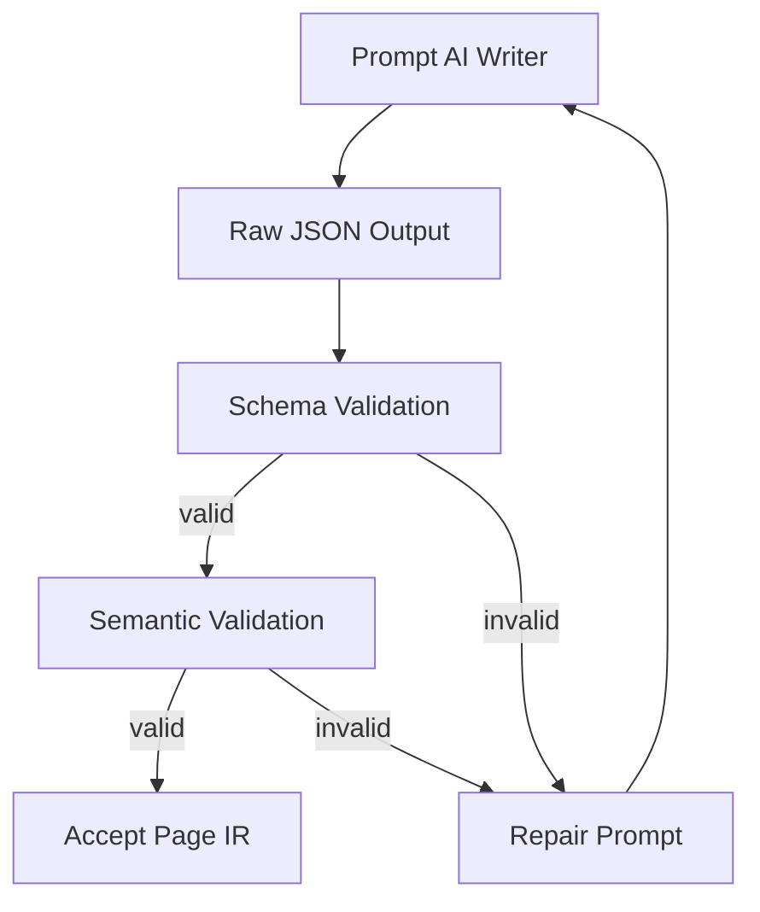
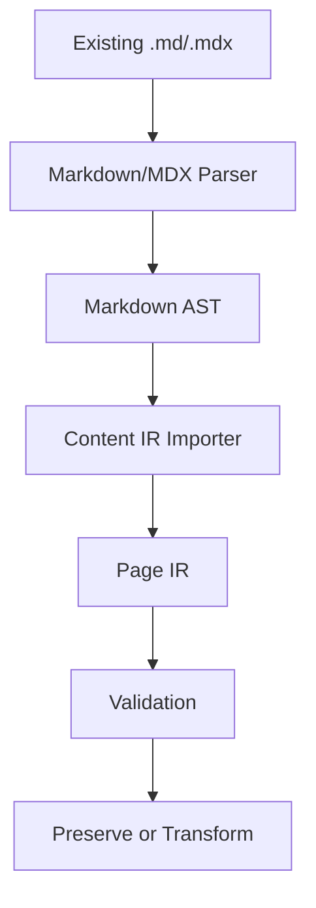

------
title: Build From Scratch: Mintlify-like AI-driven Documentation Generator CLI - Part 010
description: Design and implement a content intermediate representation for an AI-driven documentation generator, separating source extraction, AI planning, semantic blocks, provenance, validation, and deterministic MDX emission.
series: learn-mintlify-like-ai-docs-cli
seriesTitle: Build From Scratch: Mintlify-like AI-driven Documentation Generator CLI
order: 10
partTitle: Content Intermediate Representation
tags:
  - documentation
  - ai
  - mdx
  - compiler
  - intermediate-representation
  - developer-tools
date: 2026-07-03
---

# Part 010 — Content Intermediate Representation

In Part 009, kita membuat classifier.

Sekarang pipeline sudah tahu bahwa:

- `README.md` adalah project overview source,
- `openapi.yaml` adalah API reference source,
- `package.json` adalah command/configuration source,
- `docs/quickstart.mdx` adalah existing doc page,
- `src/cli.ts` adalah source code yang mungkin mendefinisikan command,
- `.env` harus diblokir.

Tetapi kita belum punya bentuk internal untuk **konten dokumentasi**.

Banyak orang akan langsung melakukan ini:

```txt id="bad-direct-generation"
source files + prompt -> AI -> .mdx file
```

Ini terlihat cepat. Tetapi untuk production-grade documentation generator, ini salah satu desain paling rapuh.

Masalahnya:

- output AI bisa tidak valid MDX,
- heading hierarchy bisa kacau,
- frontmatter bisa rusak,
- link bisa broken,
- code block bisa kehilangan language tag,
- API reference bisa tidak konsisten,
- prose claim bisa tidak punya provenance,
- incremental updates sulit karena kita hanya punya string besar,
- quality gates sulit karena struktur dokumen tidak eksplisit,
- renderer dan AI generator menjadi tightly coupled.

Solusinya adalah memakai **Content Intermediate Representation**.

Kita akan menyebutnya **Content IR**.



Content IR adalah jembatan antara:

- scanner,
- classifier,
- parsers,
- code index,
- OpenAPI parser,
- AI planner,
- AI writer,
- MDX compiler,
- search indexer,
- `llms.txt` exporter,
- quality gate.

Tanpa IR, semua komponen akan saling mengoper string.

Dengan IR, kita punya kontrak struktural.

---

## 1. Mental model: documentation generator as compiler

A compiler rarely goes directly from source code string to machine code string.

Compiler biasanya punya tahapan:

```txt id="compiler-analogy"
source text -> tokens -> AST -> semantic model -> IR -> optimized IR -> target output
```

Documentation generator kita juga harus seperti itu:

```txt id="docs-compiler-analogy"
repo files -> classified artifacts -> extracted facts -> page plan -> content IR -> MDX -> static site
```

Kenapa tidak langsung MDX?

Karena MDX adalah **target format**, bukan internal truth.

MDX bagus untuk authoring dan rendering. MDX memungkinkan Markdown plus JSX/component usage, sehingga cocok untuk docs modern. Tetapi sebagai internal model, MDX string terlalu bebas.

Kita butuh bentuk yang lebih ketat:

- heading adalah object,
- paragraph adalah object,
- code block adalah object,
- API operation reference adalah object,
- admonition adalah object,
- provenance adalah field,
- dependency adalah field,
- validation bisa dilakukan sebelum render.

Content IR harus cukup expressive untuk menghasilkan MDX, tetapi cukup strict untuk divalidasi.

---

## 2. What Content IR is and is not

Content IR adalah:

- struktur dokumen internal,
- serializable JSON object,
- target netral sebelum MDX,
- tempat menyimpan provenance,
- input untuk validation dan transformation passes,
- unit yang bisa di-diff,
- kontrak antara AI writer dan renderer.

Content IR bukan:

- AST parser MDX mentah,
- format final untuk user edit,
- database schema permanen yang tidak boleh berubah,
- prompt text,
- replacement untuk OpenAPI schema,
- replacement untuk code symbol graph.

Content IR berada di tengah.



---

## 3. Core invariants

Sebelum menulis schema, tentukan invariant.

### 3.1 IR must be serializable

Content IR harus bisa disimpan sebagai JSON.

No functions. No class instances. No circular references.

Ini membuatnya bisa:

- di-cache,
- di-diff,
- disnapshot di tests,
- dikirim antar process,
- diinspeksi via CLI.

### 3.2 IR must preserve provenance

Setiap klaim penting harus bisa ditelusuri.

Bukan setiap kata perlu citation. Tetapi setiap technical fact yang dapat diverifikasi harus punya anchor:

- source file path,
- line range,
- symbol ID,
- OpenAPI operation ID,
- package manifest field path,
- extraction job ID.

### 3.3 IR must be target-neutral enough

Kita saat ini menarget MDX. Tetapi IR jangan terlalu MDX-specific.

Bad:

```ts id="bad-mdx-specific-ir"
type BadBlock = {
  rawMdx: string;
};
```

Better:

```ts id="better-semantic-block"
type CalloutBlock = {
  type: "callout";
  variant: "info" | "warning" | "danger";
  title?: string;
  children: ContentBlock[];
};
```

Nanti emitter yang memutuskan apakah callout menjadi:

```mdx id="callout-mdx-output-example"
<Warning>
  ...
</Warning>
```

atau syntax lain.

### 3.4 IR must be strict enough to validate

Jika block bisa berisi arbitrary string tanpa constraint, IR tidak membantu.

Kita perlu validation:

- heading level valid,
- section ID unique,
- code block language known,
- internal link target exists,
- API operation reference resolvable,
- symbol reference resolvable,
- page frontmatter lengkap,
- no blocked provenance source,
- no raw untrusted JSX.

### 3.5 IR must support partial generation

AI generation bisa gagal di tengah.

IR harus bisa menyimpan status:

- planned,
- drafted,
- validated,
- emitted,
- failed.

Jangan menganggap page langsung sempurna.

### 3.6 IR must support deterministic emission

MDX output harus stabil.

Jika input IR sama, output MDX harus sama byte-for-byte, kecuali timestamp memang berubah.

Determinism penting untuk:

- clean Git diffs,
- caching,
- regression tests,
- PR automation,
- user trust.

---

## 4. Layering: Fact Model, Page Plan, Content IR, Render AST

Jangan memasukkan semua ke satu model.

Kita butuh beberapa layer.



### 4.1 Extracted Fact Model

Fact model adalah hasil parser dan extractor.

Example:

```ts id="extracted-fact-model"
export type ExtractedFact =
  | PackageScriptFact
  | PackageDependencyFact
  | OpenApiOperationFact
  | CodeSymbolFact
  | MarkdownSectionFact
  | CiCommandFact;
```

Fact model belum berupa halaman docs.

### 4.2 Page Plan IR

Page plan menjawab:

- halaman apa yang harus dibuat,
- untuk audience siapa,
- sumber apa yang dipakai,
- struktur section apa,
- acceptance criteria apa.

Example:

```ts id="page-plan-ir"
export type PagePlan = {
  pageId: string;
  slug: string;
  title: string;
  pageType: PageType;
  purpose: string;
  audience: "newUser" | "integrator" | "maintainer" | "operator";
  sourceRefs: SourceRef[];
  sections: PlannedSection[];
  acceptanceCriteria: string[];
};
```

### 4.3 Content IR

Content IR adalah halaman yang sudah berbentuk konten struktural.

### 4.4 Render IR

Render IR adalah bentuk yang sangat dekat dengan MDX output.

Kita bisa skip Render IR di versi pertama. Tetapi secara mental, tetap pisahkan:

- Content IR: semantic intent,
- Render IR: concrete component mapping.

Example:

```txt id="semantic-vs-render"
Content IR: callout warning about destructive command
Render IR: <Warning> component with escaped child markdown
```

---

## 5. Top-level schema

Start with top-level document package.

```ts id="content-ir-top-level"
export type ContentIrBundle = {
  version: "content-ir.v1";
  projectId: string;
  generatedAt: string;
  generatorVersion: string;
  pages: PageIr[];
  assets: AssetIr[];
  diagnostics: Diagnostic[];
};
```

`version` is required. IR will evolve.

Do not rely on package version alone. IR schema version and CLI version are different things.

### Page IR

```ts id="page-ir"
export type PageIr = {
  id: string;
  slug: string;
  route: string;
  title: string;
  description: string;
  pageType: PageType;
  frontmatter: FrontmatterIr;
  nav: NavHintIr;
  status: PageGenerationStatus;
  sourceRefs: SourceRef[];
  sections: SectionIr[];
  diagnostics: Diagnostic[];
};

export type PageType =
  | "overview"
  | "quickstart"
  | "concept"
  | "howTo"
  | "tutorial"
  | "apiReference"
  | "troubleshooting"
  | "migration"
  | "changelog"
  | "reference";

export type PageGenerationStatus =
  | "planned"
  | "drafted"
  | "validated"
  | "emitted"
  | "failed";
```

### Frontmatter IR

```ts id="frontmatter-ir"
export type FrontmatterIr = {
  title: string;
  description: string;
  tags: string[];
  order?: number;
  hidden?: boolean;
  generated?: boolean;
  lastVerifiedAt?: string;
  sourceHash?: string;
};
```

Do not put arbitrary frontmatter everywhere. Allow extensions later, but keep core fields strict.

---

## 6. Source references and provenance

Provenance should be first-class.

```ts id="source-ref"
export type SourceRef = {
  refId: string;
  artifactId: string;
  path: string;
  range?: SourceRange;
  symbolId?: string;
  openApiPointer?: string;
  jsonPointer?: string;
  authority: "primary" | "secondary" | "derived" | "generated" | "untrusted" | "unknown";
};

export type SourceRange = {
  startLine: number;
  endLine: number;
  startColumn?: number;
  endColumn?: number;
};
```

Every block can carry `sourceRefs`.

```ts id="block-provenance-base"
export type BlockBase = {
  id: string;
  sourceRefs?: SourceRef[];
  diagnostics?: Diagnostic[];
};
```

A paragraph can be prose. But if it claims “Run `pnpm dev` to start local development”, source should point to `package.json#/scripts/dev` or equivalent extracted fact.

```json id="provenance-example"
{
  "id": "block-run-dev-command",
  "type": "paragraph",
  "text": "Run `pnpm dev` to start the local development server.",
  "sourceRefs": [
    {
      "refId": "src-package-script-dev",
      "artifactId": "artifact-package-json",
      "path": "package.json",
      "jsonPointer": "/scripts/dev",
      "authority": "primary"
    }
  ]
}
```

This makes fact-checking possible.

---

## 7. Section IR

A page contains sections.

```ts id="section-ir"
export type SectionIr = {
  id: string;
  title: string;
  level: 2 | 3 | 4;
  purpose?: string;
  sourceRefs?: SourceRef[];
  blocks: ContentBlock[];
  children?: SectionIr[];
};
```

Why sections have `purpose`?

Because AI planner and reviewer need to know why the section exists.

Example:

```json id="section-purpose-example"
{
  "id": "install",
  "title": "Install the CLI",
  "level": 2,
  "purpose": "Help a new developer install the package and verify the binary works.",
  "blocks": []
}
```

This is not necessarily emitted to MDX. It is internal instruction and audit metadata.

---

## 8. Content blocks

Now define block types.

```ts id="content-block-union"
export type ContentBlock =
  | ParagraphBlock
  | HeadingBlock
  | ListBlock
  | CodeBlock
  | CalloutBlock
  | StepsBlock
  | TabsBlock
  | TableBlock
  | MermaidBlock
  | ApiOperationBlock
  | SymbolReferenceBlock
  | FileTreeBlock
  | CardsBlock
  | RawMdxBlock;
```

Keep `RawMdxBlock`, but make it restricted.

### 8.1 Paragraph block

```ts id="paragraph-block"
export type ParagraphBlock = BlockBase & {
  type: "paragraph";
  text: InlineContent[];
};
```

Use inline content, not plain string, if you want good link/code validation.

```ts id="inline-content"
export type InlineContent =
  | { type: "text"; value: string }
  | { type: "inlineCode"; value: string }
  | { type: "link"; text: string; target: LinkTarget }
  | { type: "strong"; children: InlineContent[] }
  | { type: "emphasis"; children: InlineContent[] };

export type LinkTarget =
  | { kind: "url"; href: string }
  | { kind: "route"; route: string }
  | { kind: "heading"; pageId: string; headingId: string }
  | { kind: "source"; sourceRef: SourceRef };
```

You may simplify v1 by storing paragraph as Markdown text, but the long-term model benefits from inline structure.

### 8.2 Code block

```ts id="code-block"
export type CodeBlock = BlockBase & {
  type: "code";
  language: string;
  code: string;
  title?: string;
  executable?: boolean;
  expectedOutput?: string;
  redacted?: boolean;
};
```

Code block should not be arbitrary.

It needs metadata because later we will verify snippets.

Example:

```json id="code-block-example"
{
  "id": "install-command",
  "type": "code",
  "language": "bash",
  "code": "npm install -g docforge",
  "title": "Install globally",
  "executable": false,
  "sourceRefs": [
    {
      "refId": "package-name",
      "artifactId": "artifact-package-json",
      "path": "package.json",
      "jsonPointer": "/name",
      "authority": "primary"
    }
  ]
}
```

### 8.3 Callout block

```ts id="callout-block"
export type CalloutBlock = BlockBase & {
  type: "callout";
  variant: "info" | "tip" | "warning" | "danger";
  title?: string;
  children: ContentBlock[];
};
```

Do not encode callout as raw HTML.

Semantic callouts can be rendered differently per theme.

### 8.4 Steps block

```ts id="steps-block"
export type StepsBlock = BlockBase & {
  type: "steps";
  steps: StepItem[];
};

export type StepItem = {
  id: string;
  title: string;
  blocks: ContentBlock[];
};
```

This is useful for quickstarts and tutorials.

### 8.5 Tabs block

```ts id="tabs-block"
export type TabsBlock = BlockBase & {
  type: "tabs";
  tabs: TabItem[];
};

export type TabItem = {
  id: string;
  label: string;
  blocks: ContentBlock[];
};
```

Tabs are not just UI. They represent alternate paths:

- npm vs pnpm vs yarn,
- curl vs JavaScript vs Python,
- Docker vs local install,
- cloud provider A vs B.

### 8.6 API operation block

Do not copy OpenAPI details into prose too early.

Reference the operation.

```ts id="api-operation-block"
export type ApiOperationBlock = BlockBase & {
  type: "apiOperation";
  operationRef: {
    specArtifactId: string;
    operationId?: string;
    method: string;
    path: string;
  };
  display: "summary" | "full" | "requestOnly" | "responseOnly";
};
```

This allows the API renderer to stay consistent with OpenAPI source.

### 8.7 Symbol reference block

```ts id="symbol-reference-block"
export type SymbolReferenceBlock = BlockBase & {
  type: "symbolReference";
  symbolId: string;
  display: "signature" | "summary" | "full";
};
```

This is useful for SDK docs and CLI docs.

### 8.8 Mermaid block

```ts id="mermaid-block"
export type MermaidBlock = BlockBase & {
  type: "mermaid";
  diagramType: "flowchart" | "sequence" | "state" | "class" | "er" | "unknown";
  code: string;
  title?: string;
};
```

Diagrams should be validated enough to avoid broken build output.

### 8.9 Raw MDX block

Sometimes you need escape hatch.

```ts id="raw-mdx-block"
export type RawMdxBlock = BlockBase & {
  type: "rawMdx";
  code: string;
  trust: "generatedSafe" | "userAuthored" | "unsafe";
};
```

Rule:

- user-authored existing MDX can be preserved,
- generated raw MDX must pass strict validation,
- unsafe raw MDX cannot be emitted.

Raw blocks are necessary, but they should be rare.

---

## 9. Zod schemas

Runtime validation is mandatory because AI-generated IR is external input from the system's point of view.

```ts id="zod-content-block-schema"
import { z } from "zod";

const SourceRangeSchema = z.object({
  startLine: z.number().int().positive(),
  endLine: z.number().int().positive(),
  startColumn: z.number().int().positive().optional(),
  endColumn: z.number().int().positive().optional(),
});

const SourceRefSchema = z.object({
  refId: z.string().min(1),
  artifactId: z.string().min(1),
  path: z.string().min(1),
  range: SourceRangeSchema.optional(),
  symbolId: z.string().optional(),
  openApiPointer: z.string().optional(),
  jsonPointer: z.string().optional(),
  authority: z.enum(["primary", "secondary", "derived", "generated", "untrusted", "unknown"]),
});

const BlockBaseSchema = z.object({
  id: z.string().min(1),
  sourceRefs: z.array(SourceRefSchema).optional(),
});

const CodeBlockSchema = BlockBaseSchema.extend({
  type: z.literal("code"),
  language: z.string().min(1),
  code: z.string(),
  title: z.string().optional(),
  executable: z.boolean().optional(),
  expectedOutput: z.string().optional(),
  redacted: z.boolean().optional(),
});
```

Recursive schemas need lazy evaluation.

```ts id="zod-recursive-block-schema"
type ContentBlock = z.infer<typeof ContentBlockSchema>;

const ContentBlockSchema: z.ZodType<ContentBlock> = z.lazy(() =>
  z.discriminatedUnion("type", [
    ParagraphBlockSchema,
    CodeBlockSchema,
    CalloutBlockSchema,
    StepsBlockSchema,
    TabsBlockSchema,
    MermaidBlockSchema,
    ApiOperationBlockSchema,
    SymbolReferenceBlockSchema,
    RawMdxBlockSchema,
  ]),
);
```

Use discriminated unions. They make validation and rendering simpler.

---

## 10. AI should output IR, not final MDX

The writer agent should produce structured JSON matching schema.

Bad prompt:

```txt id="bad-ai-mdx-prompt"
Write an MDX quickstart for this project.
```

Better contract:

```txt id="better-ai-ir-prompt"
Create a Content IR draft for a quickstart page.
Return only JSON matching the PageIr schema.
Every technical claim must reference one of the provided sourceRefs.
Do not output raw MDX unless the block type requires it.
Use code blocks for commands.
Use steps for ordered setup.
```

Then validate:

```ts id="validate-ai-ir-output"
const parsed = JSON.parse(modelOutput);
const page = PageIrSchema.parse(parsed);
const diagnostics = validatePageIr(page, projectKnowledge);

if (diagnostics.some(d => d.severity === "error")) {
  throw new InvalidGeneratedIrError(diagnostics);
}
```

This gives you a repair loop.



Without IR, repair is messy because you only have broken MDX text.

With IR, you can tell the model exactly what field is wrong.

---

## 11. Validation passes

IR validation should happen before MDX emission.

### 11.1 Schema validation

Checks object shape.

Examples:

- missing title,
- invalid block type,
- invalid enum value,
- wrong field type.

### 11.2 Structural validation

Checks document structure.

```ts id="structural-validation"
export function validateSectionStructure(page: PageIr): Diagnostic[] {
  const diagnostics: Diagnostic[] = [];
  const ids = new Set<string>();

  for (const section of walkSections(page.sections)) {
    if (ids.has(section.id)) {
      diagnostics.push({
        code: "DOCFORGE_IR_DUPLICATE_SECTION_ID",
        severity: "error",
        message: `Duplicate section id: ${section.id}`,
      });
    }
    ids.add(section.id);

    if (section.level < 2) {
      diagnostics.push({
        code: "DOCFORGE_IR_INVALID_SECTION_LEVEL",
        severity: "error",
        message: `Section ${section.id} has invalid level ${section.level}`,
      });
    }
  }

  return diagnostics;
}
```

### 11.3 Reference validation

Checks whether referenced source exists.

```ts id="reference-validation"
export function validateSourceRefs(page: PageIr, sourceIndex: SourceIndex): Diagnostic[] {
  const diagnostics: Diagnostic[] = [];

  for (const block of walkBlocks(page)) {
    for (const ref of block.sourceRefs ?? []) {
      if (!sourceIndex.hasArtifact(ref.artifactId)) {
        diagnostics.push({
          code: "DOCFORGE_IR_UNKNOWN_SOURCE_ARTIFACT",
          severity: "error",
          message: `Block ${block.id} references unknown artifact ${ref.artifactId}`,
        });
      }

      if (ref.path && sourceIndex.isBlocked(ref.path)) {
        diagnostics.push({
          code: "DOCFORGE_IR_BLOCKED_SOURCE_REFERENCE",
          severity: "error",
          message: `Block ${block.id} references blocked source ${ref.path}`,
        });
      }
    }
  }

  return diagnostics;
}
```

### 11.4 Link validation

Internal routes should exist. Heading anchors should exist. External URLs can be checked later.

### 11.5 Render validation

Before writing files, emit MDX into memory and compile it.

Content IR validity does not guarantee MDX compiler validity. The emitter can still have bugs.

---

## 12. Transform passes

After validation, run transforms.


### 12.1 Normalize IDs

Make IDs deterministic.

```ts id="normalize-id"
function slugifyId(input: string): string {
  return input
    .toLowerCase()
    .trim()
    .replace(/[^a-z0-9]+/g, "-")
    .replace(/^-+|-+$/g, "");
}
```

For generated blocks, include stable context:

```ts id="stable-block-id"
function stableBlockId(pageId: string, sectionId: string, index: number, type: string): string {
  return `${pageId}.${sectionId}.${index}.${type}`;
}
```

### 12.2 Resolve links

Convert semantic links into routes.

```ts id="resolve-route-link"
function emitLinkTarget(target: LinkTarget, routeIndex: RouteIndex): string {
  switch (target.kind) {
    case "url":
      return target.href;
    case "route":
      return routeIndex.resolveRoute(target.route);
    case "heading":
      return `${routeIndex.resolvePage(target.pageId)}#${target.headingId}`;
    case "source":
      return `#source-${target.sourceRef.refId}`;
  }
}
```

### 12.3 Prune empty blocks

AI may produce empty paragraphs. Remove them before emission.

But do not silently remove a section if it was required by acceptance criteria. Produce diagnostic.

---

## 13. Deterministic MDX emission

Emitter converts IR to MDX.

```ts id="mdx-emitter-interface"
export interface MdxEmitter {
  emitPage(page: PageIr): EmitResult;
}

export type EmitResult = {
  path: string;
  content: string;
  diagnostics: Diagnostic[];
};
```

Simple emitter skeleton:

```ts id="mdx-emitter-skeleton"
export function emitPageToMdx(page: PageIr): string {
  const chunks: string[] = [];

  chunks.push(emitFrontmatter(page.frontmatter));
  chunks.push("");
  chunks.push(`# ${escapeMarkdown(page.title)}`);
  chunks.push("");

  for (const section of page.sections) {
    chunks.push(emitSection(section));
    chunks.push("");
  }

  return chunks.join("\n").replace(/\n{3,}/g, "\n\n").trimEnd() + "\n";
}

function emitSection(section: SectionIr): string {
  const chunks: string[] = [];
  chunks.push(`${"#".repeat(section.level)} ${escapeMarkdown(section.title)}`);
  chunks.push("");

  for (const block of section.blocks) {
    chunks.push(emitBlock(block));
    chunks.push("");
  }

  for (const child of section.children ?? []) {
    chunks.push(emitSection(child));
    chunks.push("");
  }

  return chunks.join("\n").trimEnd();
}
```

Block emission:

```ts id="emit-block"
function emitBlock(block: ContentBlock): string {
  switch (block.type) {
    case "paragraph":
      return emitInlineContent(block.text);
    case "code":
      return emitCodeBlock(block);
    case "callout":
      return emitCallout(block);
    case "steps":
      return emitSteps(block);
    case "tabs":
      return emitTabs(block);
    case "mermaid":
      return emitMermaid(block);
    case "apiOperation":
      return emitApiOperation(block);
    case "symbolReference":
      return emitSymbolReference(block);
    case "rawMdx":
      return emitRawMdx(block);
    default:
      return assertNever(block);
  }
}
```

Code block emission:

```ts id="emit-code-block"
function emitCodeBlock(block: CodeBlock): string {
  const title = block.title ? ` title="${escapeAttribute(block.title)}"` : "";
  return `\`\`\`${block.language}${title}\n${block.code}\n\`\`\``;
}
```

Callout emission:

```ts id="emit-callout"
function emitCallout(block: CalloutBlock): string {
  const component = {
    info: "Info",
    tip: "Tip",
    warning: "Warning",
    danger: "Danger",
  }[block.variant];

  const titleProp = block.title ? ` title="${escapeAttribute(block.title)}"` : "";
  const body = block.children.map(emitBlock).join("\n\n");

  return `<${component}${titleProp}>\n\n${body}\n\n</${component}>`;
}
```

Mermaid emission:

````ts id="emit-mermaid-block"
function emitMermaid(block: MermaidBlock): string {
  return `\`\`\`mermaid id="${escapeAttribute(block.id)}"\n${block.code}\n\`\`\``;
}
````

API operation emission could map to a component:

```ts id="emit-api-operation"
function emitApiOperation(block: ApiOperationBlock): string {
  const method = escapeAttribute(block.operationRef.method.toUpperCase());
  const path = escapeAttribute(block.operationRef.path);
  const operationId = block.operationRef.operationId
    ? ` operationId="${escapeAttribute(block.operationRef.operationId)}"`
    : "";

  return `<ApiOperation method="${method}" path="${path}"${operationId} display="${block.display}" />`;
}
```

This keeps generated API pages consistent.

---

## 14. Example: Quickstart Page IR

Imagine extracted facts:

```json id="quickstart-facts-example"
{
  "packageName": "docforge",
  "packageManager": "pnpm",
  "scripts": {
    "dev": "tsx src/cli.ts dev",
    "build": "tsup src/index.ts"
  },
  "bin": {
    "docforge": "dist/cli.js"
  }
}
```

Page IR:

```json id="quickstart-page-ir-example"
{
  "id": "quickstart",
  "slug": "quickstart",
  "route": "/quickstart",
  "title": "Quickstart",
  "description": "Install the CLI, initialize documentation, and run the local preview server.",
  "pageType": "quickstart",
  "frontmatter": {
    "title": "Quickstart",
    "description": "Install the CLI, initialize documentation, and run the local preview server.",
    "tags": ["quickstart", "cli"],
    "order": 1,
    "generated": true
  },
  "nav": {
    "group": "Getting Started",
    "order": 1
  },
  "status": "drafted",
  "sourceRefs": [
    {
      "refId": "package-json",
      "artifactId": "artifact-package-json",
      "path": "package.json",
      "authority": "primary"
    }
  ],
  "sections": [
    {
      "id": "install",
      "title": "Install the CLI",
      "level": 2,
      "blocks": [
        {
          "id": "install.command",
          "type": "code",
          "language": "bash",
          "code": "pnpm add -D docforge",
          "title": "Install Docforge",
          "sourceRefs": [
            {
              "refId": "package-name",
              "artifactId": "artifact-package-json",
              "path": "package.json",
              "jsonPointer": "/name",
              "authority": "primary"
            }
          ]
        }
      ]
    },
    {
      "id": "initialize-docs",
      "title": "Initialize docs",
      "level": 2,
      "blocks": [
        {
          "id": "init.command",
          "type": "code",
          "language": "bash",
          "code": "pnpm docforge init",
          "title": "Create docs config"
        }
      ]
    }
  ],
  "diagnostics": []
}
```

Emitted MDX:

````mdx id="quickstart-emitted-mdx"
---
title: Quickstart
description: Install the CLI, initialize documentation, and run the local preview server.
tags:
  - quickstart
  - cli
order: 1
generated: true
---

# Quickstart

## Install the CLI

```bash title="Install Docforge"
pnpm add -D docforge
```

## Initialize docs

```bash title="Create docs config"
pnpm docforge init
```
````

The emitted result is simple. But internally we kept structure, provenance, and validation hooks.

---

## 15. Existing docs import

Your generator will not only create new docs. It must also read existing docs.

Existing Markdown/MDX should be parsed into IR as much as possible.



Important policy:

> User-authored docs should be preserved unless the user explicitly asks for rewrite or update.

Generated docs tools become annoying when they overwrite human-authored content too aggressively.

For existing MDX, unsupported constructs can become `RawMdxBlock` with `trust: "userAuthored"`.

```ts id="import-unsupported-mdx"
const block: RawMdxBlock = {
  id: "raw-user-mdx-1",
  type: "rawMdx",
  code: originalMdxFragment,
  trust: "userAuthored",
  sourceRefs: [sourceRefForOriginalRange],
};
```

This preserves content without pretending we understand every custom component.

---

## 16. Page planning with IR

Page planner should output `PagePlan`, not final content.

Example page plan for a docs CLI:

```json id="page-plan-example"
{
  "pageId": "configuration",
  "slug": "configuration",
  "title": "Configuration",
  "pageType": "reference",
  "purpose": "Explain every supported docs configuration field with examples and validation rules.",
  "audience": "maintainer",
  "sourceRefs": [
    {
      "refId": "config-schema",
      "artifactId": "artifact-config-schema",
      "path": "packages/config/schema.ts",
      "authority": "primary"
    }
  ],
  "sections": [
    {
      "id": "overview",
      "title": "Overview",
      "requiredFacts": ["config file name", "config lookup order"]
    },
    {
      "id": "fields",
      "title": "Fields",
      "requiredFacts": ["field names", "types", "defaults", "examples"]
    },
    {
      "id": "validation-errors",
      "title": "Validation errors",
      "requiredFacts": ["diagnostic codes", "fix hints"]
    }
  ],
  "acceptanceCriteria": [
    "Every config field has type, default, and example.",
    "Every technical fact cites config schema source.",
    "No deprecated field is recommended as default."
  ]
}
```

Then writer converts plan + facts into Content IR.

This separation is important:

- planner decides structure,
- writer fills content,
- reviewer validates facts,
- emitter handles MDX.

---

## 17. Handling claims

A high-quality docs generator must distinguish between prose and claim.

Simple prose:

```txt
This guide walks through local setup.
```

Technical claim:

```txt
Run `pnpm dev` to start the local preview server.
```

The second should have source refs.

You can model claims explicitly.

```ts id="claim-model"
export type Claim = {
  claimId: string;
  text: string;
  sourceRefs: SourceRef[];
  confidence: number;
  verified: boolean;
};
```

Then attach claims to blocks.

```ts id="claim-aware-block-base"
export type ClaimAwareBlockBase = BlockBase & {
  claims?: Claim[];
};
```

In v1, you can skip explicit claims and rely on block sourceRefs. But for advanced quality gates, explicit claims become valuable.

Future reviewer agent can check:

- Does every command exist?
- Does every endpoint exist?
- Does every config field exist?
- Does every version claim match manifests?
- Does every file path exist?

---

## 18. IR diffs

String diffs are noisy.

IR diffs can be semantic.

Example:

```json id="semantic-ir-diff"
{
  "type": "block.updated",
  "pageId": "quickstart",
  "blockId": "install.command",
  "field": "code",
  "before": "npm install -g docforge",
  "after": "pnpm add -D docforge",
  "reason": "package manager changed from npm to pnpm based on pnpm-lock.yaml"
}
```

This is useful for PR automation.

A PR comment can say:

```txt id="semantic-pr-comment"
Updated Quickstart install command because the repository now uses pnpm-lock.yaml and package scripts are pnpm-based.
```

That is much better than dumping a huge MDX diff and expecting reviewers to infer intent.

---

## 19. Storing IR

Suggested hidden output:

```txt id="ir-storage-layout"
.docforge/
  cache/
    content-ir/
      quickstart.json
      api-reference.users.create.json
    facts/
    source-index.sqlite
```

Do not require users to commit `.docforge/cache`.

But you may allow committing generated metadata for reproducibility later.

For now:

- generated `.mdx` goes to docs directory,
- internal IR goes to cache,
- build manifest records hashes.

```ts id="ir-cache-record"
export type IrCacheRecord = {
  pageId: string;
  inputHash: string;
  irHash: string;
  mdxHash: string;
  generatedAt: string;
  sourceArtifactIds: string[];
};
```

This allows incremental generation.

If source artifacts do not change, skip regeneration.

---

## 20. Diagnostics in IR

Diagnostics should attach at multiple levels:

- bundle,
- page,
- section,
- block.

Example:

```json id="block-diagnostic-example"
{
  "id": "run-tests-command",
  "type": "code",
  "language": "bash",
  "code": "npm test",
  "diagnostics": [
    {
      "code": "DOCFORGE_IR_UNVERIFIED_COMMAND",
      "severity": "warning",
      "message": "Command was generated but no matching package script or source reference was found.",
      "hint": "Reference package.json#/scripts/test or mark this command as manual."
    }
  ]
}
```

This keeps generated content auditable.

Do not hide uncertainty.

Uncertainty should be visible to the pipeline and sometimes to the user.

---

## 21. Avoiding MDX injection

MDX can execute/import components during build depending on your renderer setup. Treat generated MDX as untrusted until validated.

IR helps because most blocks are semantic and escaped by emitter.

Risky path:

```txt id="mdx-injection-risk"
AI output -> raw MDX -> compile -> arbitrary component/import behavior
```

Safer path:

```txt id="safe-ir-to-mdx-path"
AI output JSON -> schema validation -> semantic validation -> escaping emitter -> MDX compile
```

Raw MDX rules:

- no `import` in generated raw blocks,
- no `export` in generated raw blocks,
- no unknown JSX components unless allowed by theme registry,
- no event handlers,
- no remote script injection,
- no raw HTML if security policy disables it.

```ts id="validate-raw-mdx-block"
function validateRawMdxBlock(block: RawMdxBlock, registry: ComponentRegistry): Diagnostic[] {
  if (block.trust === "unsafe") {
    return [{
      code: "DOCFORGE_IR_UNSAFE_RAW_MDX",
      severity: "error",
      message: `Raw MDX block ${block.id} is marked unsafe and cannot be emitted.`,
    }];
  }

  if (/^\s*import\s+/m.test(block.code) && block.trust !== "userAuthored") {
    return [{
      code: "DOCFORGE_IR_GENERATED_MDX_IMPORT",
      severity: "error",
      message: `Generated raw MDX block ${block.id} contains import statements.`,
    }];
  }

  return [];
}
```

Security starts here, not only in deployment.

---

## 22. Build checkpoint

At the end of this part, your implementation should have:

- `ContentIrBundle`,
- `PageIr`,
- `SectionIr`,
- `ContentBlock` union,
- `SourceRef`,
- `FrontmatterIr`,
- Zod schemas,
- page validation passes,
- source reference validation,
- deterministic MDX emitter,
- basic IR cache record,
- CLI debug command.

Suggested CLI command:

```bash id="ir-command"
docforge ir --page quickstart --json
```

Suggested command to emit without writing:

```bash id="emit-dry-run-command"
docforge emit --page quickstart --dry-run
```

Suggested validation:

```bash id="validate-ir-command"
docforge validate-ir .docforge/cache/content-ir/quickstart.json
```

---

## 23. Tests

Snapshot-test the emitter.

```ts id="emitter-snapshot-test"
it("emits stable MDX for quickstart page", () => {
  const page = makeQuickstartPageIr();
  const mdx = emitPageToMdx(page);

  expect(mdx).toMatchInlineSnapshot(`
"---
title: Quickstart
description: Install the CLI, initialize documentation, and run the local preview server.
tags:
  - quickstart
  - cli
order: 1
generated: true
---

# Quickstart

## Install the CLI

\`\`\`bash title=\"Install Docforge\"
pnpm add -D docforge
\`\`\`
"
`);
});
```

Test validation:

```ts id="ir-validation-test"
it("rejects source refs to blocked artifacts", () => {
  const page = makePageWithSourceRef({ path: ".env", artifactId: "artifact-env" });
  const sourceIndex = makeSourceIndex([{ artifactId: "artifact-env", path: ".env", blocked: true }]);

  const diagnostics = validateSourceRefs(page, sourceIndex);

  expect(diagnostics).toEqual(expect.arrayContaining([
    expect.objectContaining({ code: "DOCFORGE_IR_BLOCKED_SOURCE_REFERENCE" }),
  ]));
});
```

Test AI output validation:

```ts id="ai-output-validation-test"
it("rejects AI output with unknown block type", () => {
  const modelOutput = {
    id: "bad-page",
    sections: [
      {
        id: "x",
        title: "X",
        level: 2,
        blocks: [{ type: "magic", content: "not allowed" }],
      },
    ],
  };

  expect(() => PageIrSchema.parse(modelOutput)).toThrow();
});
```

These tests make the system harder to corrupt.

---

## 24. Key takeaways

- Do not make AI generate final MDX directly as the primary architecture.
- MDX is a target format; Content IR is the internal contract.
- Content IR gives you validation, provenance, deterministic emission, diffing, and better repair loops.
- Every technical claim should eventually connect to source evidence.
- Raw MDX is an escape hatch, not the default block type.
- IR should be serializable and versioned.
- Separate fact extraction, page planning, content drafting, validation, and emission.
- A good IR makes later features easier: search, `llms.txt`, MCP retrieval, PR automation, quality gates, and documentation evaluation.

In the next part, we will go from Content IR to the **MDX authoring model**: frontmatter, components, admonitions, tabs, code blocks, imports, links, and the contract between generated content and user-editable docs.
