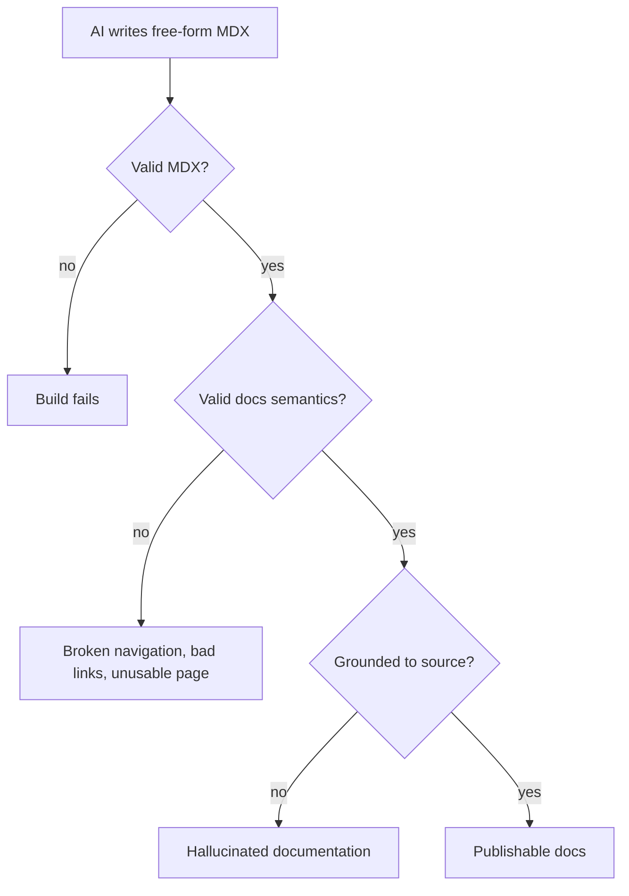
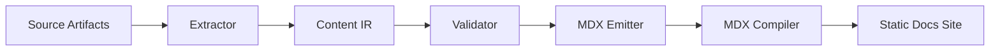
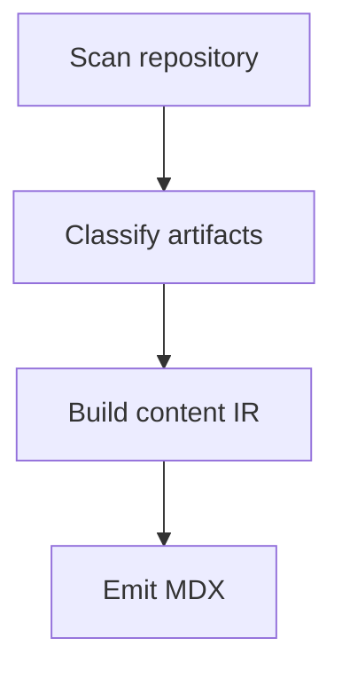
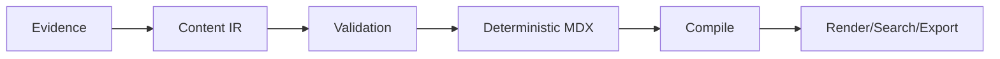

------
title: Build From Scratch: Mintlify-like AI-driven Documentation Generator CLI - Part 011
description: Mendesain MDX authoring model untuk documentation generator: frontmatter, components, admonitions, tabs, cards, code blocks, links, imports, constraints, dan cara menjadikan MDX sebagai target output yang aman, stabil, dan bisa divalidasi.
series: learn-mintlify-like-ai-docs-cli
seriesTitle: Build From Scratch: Mintlify-like AI-driven Documentation Generator CLI
order: 11
partTitle: MDX Authoring Model
tags:
  - documentation
  - ai
  - cli
  - mdx
  - developer-tools
  - static-site-generator
date: 2026-07-03
---

# Part 011 — MDX Authoring Model

Kita sudah punya scanner, classifier, dan Content Intermediate Representation.

Sekarang kita masuk ke layer yang akan dilihat langsung oleh developer: **MDX authoring model**.

MDX bukan sekadar Markdown yang bisa ditempeli React component. Dalam documentation generator production-grade, MDX adalah **contract surface** antara:

1. content planner,
2. AI writer,
3. human editor,
4. renderer,
5. search indexer,
6. link checker,
7. API reference generator,
8. `llms.txt` exporter,
9. dan quality gate.

Kalau contract ini lemah, sistem akan terlihat bekerja di demo, tetapi rapuh di repo nyata.

Masalah klasiknya seperti ini:



Tujuan part ini: membuat **model authoring MDX** yang cukup ekspresif untuk dokumentasi modern, tetapi cukup sempit agar bisa di-generate, di-review, di-compile, dan di-maintain.

---

## 1. Mental model: MDX adalah target authoring, bukan source of truth internal

Satu kesalahan desain yang sering terjadi:

> "Karena output kita MDX, maka internal representation kita string MDX."

Ini berbahaya.

String MDX terlalu bebas. Ia bisa berisi Markdown, JSX, import, expression, embedded code, raw HTML, dan custom component. Fleksibel untuk manusia, tetapi terlalu longgar untuk pipeline otomatis.

Dalam sistem kita, MDX harus diposisikan seperti ini:



Artinya:

- **Content IR** adalah model kebenaran internal.
- **MDX** adalah format authoring/output.
- **Compiler** adalah pembuktian bahwa output valid secara sintaks dan renderable.
- **Diagnostics** adalah interface untuk memperbaiki kesalahan.

MDX tetap penting. Tetapi ia bukan tempat pertama untuk melakukan reasoning.

---

## 2. Peran MDX dalam documentation generator

Dalam produk Mintlify-like, MDX punya beberapa peran:

| Peran | Penjelasan |
|---|---|
| Human-editable output | Developer bisa mengedit hasil AI secara manual. |
| Component-rich docs | Docs bisa memakai cards, tabs, accordions, API blocks, callouts, steps, dan custom layout. |
| Static rendering input | File MDX dikompilasi menjadi halaman statis. |
| Search extraction input | Text dan heading diekstrak untuk search index. |
| Agent-ready export source | MDX bisa diturunkan menjadi Markdown plain untuk `llms.txt`/`llms-full.txt`. |
| Quality gate target | Link, frontmatter, heading, code fence, dan component usage bisa divalidasi. |

Jadi MDX authoring model harus menjawab:

1. Struktur minimal halaman apa?
2. Metadata apa yang wajib?
3. Component apa yang didukung?
4. Kapan AI boleh memakai JSX?
5. Bagaimana import dikelola?
6. Bagaimana link antar halaman ditulis?
7. Bagaimana code block ditulis agar bisa diuji?
8. Bagaimana warning, tip, note, dan error dimodelkan?
9. Bagaimana halaman API reference dibedakan dari halaman concept/how-to?
10. Bagaimana output tetap aman dari MDX injection dan prompt injection?

---

## 3. Prinsip desain authoring model

Kita pakai prinsip berikut.

### 3.1 MDX harus deterministic

Output yang sama dari IR harus menghasilkan MDX yang stabil.

Buruk:

```mdx
# Install

Run this:

```bash
npm install
```
```

Kadang AI menulis "Install", kadang "Installation", kadang "Getting started". Ini susah dibandingkan dalam diff.

Lebih baik:

```ts
emitPage({
  title: "Installation",
  kind: "howTo",
  sections: [
    {
      id: "install-package",
      title: "Install the package",
      blocks: [
        {
          type: "code",
          language: "bash",
          value: "npm install @acme/sdk"
        }
      ]
    }
  ]
})
```

Lalu emitter menghasilkan MDX stabil.

### 3.2 MDX harus constrained

Kita tidak mengizinkan semua fitur MDX. Sistem perlu subset resmi.

Contoh fitur yang boleh:

- frontmatter,
- Markdown headings,
- paragraphs,
- lists,
- fenced code blocks,
- tables,
- internal links,
- selected components: `Callout`, `Steps`, `Step`, `Tabs`, `Tab`, `Card`, `CardGroup`, `Accordion`, `AccordionGroup`,
- generated API components.

Contoh fitur yang sebaiknya dibatasi:

- arbitrary `import`,
- arbitrary JSX expression,
- raw HTML,
- inline JavaScript expression,
- dynamic runtime logic,
- external script,
- untrusted iframe.

Kenapa? Karena docs generator kita menerima input dari repo dan AI. MDX adalah executable-ish content jika terlalu bebas.

### 3.3 MDX harus explainable

Setiap halaman harus bisa menjawab:

- Halaman ini dibuat dari artifact mana?
- Klaim ini berasal dari source mana?
- Code sample ini diverifikasi atau tidak?
- Endpoint ini berasal dari OpenAPI operation mana?
- Command ini berasal dari `package.json`, README, atau inferensi?

Ini bukan berarti semua halaman publik harus menampilkan citation. Tetapi internal metadata harus menyimpan provenance.

### 3.4 MDX harus portable

Jangan mengikat semua authoring ke satu renderer. Target utama kita boleh renderer sendiri, tetapi content sebaiknya tetap bisa diekspor ke:

- plain Markdown,
- `llms.txt`,
- search documents,
- JSON page manifest,
- atau renderer lain.

Karena itu component usage harus punya semantic fallback.

Contoh:

```mdx
<Callout type="warning" title="Do not commit generated secrets">
The generator skips `.env` by default, but custom include rules can override this.
</Callout>
```

Fallback Markdown:

```md
> [!WARNING]
> **Do not commit generated secrets**
>
> The generator skips `.env` by default, but custom include rules can override this.
```

---

## 4. Page kinds

Sebelum menulis MDX, kita perlu tahu jenis halaman.

Documentation generator kita minimal mendukung:

| Page kind | Tujuan | Contoh |
|---|---|---|
| `overview` | Ringkasan produk/proyek | `index.mdx` |
| `quickstart` | Jalur tercepat berhasil | `quickstart.mdx` |
| `concept` | Mental model | `concepts/code-indexing.mdx` |
| `howTo` | Instruksi task-oriented | `guides/generate-api-docs.mdx` |
| `reference` | Rincian formal | `reference/config.mdx` |
| `apiReference` | Endpoint/API spec | `api/create-user.mdx` |
| `troubleshooting` | Error dan solusi | `troubleshooting/build-errors.mdx` |
| `migration` | Upgrade dari versi lama | `migration/v1-to-v2.mdx` |
| `architecture` | Desain sistem | `architecture/pipeline.mdx` |
| `adr` | Architecture decision record | `adr/0001-mdx-ir.mdx` |

Page kind mempengaruhi struktur.

Contoh struktur `quickstart`:

```mdx
# Quickstart

## Prerequisites

## Install

## Initialize docs

## Start local preview

## Next steps
```

Contoh struktur `reference`:

```mdx
# Configuration Reference

## File location

## Schema

## Fields

## Examples

## Validation rules

## Migration notes
```

Contoh struktur `troubleshooting`:

```mdx
# Troubleshooting

## Build fails with invalid MDX

### Symptoms

### Cause

### Fix

### Prevention
```

AI writer tidak boleh bebas memilih struktur dari nol untuk setiap page. Ia harus mengikuti page kind template.

---

## 5. Frontmatter contract

Setiap file MDX harus punya frontmatter.

Untuk seri ini, user sudah menentukan format:

```mdx
------
title: Build From Scratch: Mintlify-like AI-driven Documentation Generator CLI - Part 011
description: ...
series: learn-mintlify-like-ai-docs-cli
seriesTitle: Build From Scratch: Mintlify-like AI-driven Documentation Generator CLI
order: 11
partTitle: MDX Authoring Model
tags:
  - documentation
  - ai
  - cli
  - mdx
date: 2026-07-03
---
```

Untuk produk CLI kita, frontmatter halaman docs bisa punya contract seperti ini:

```yaml
title: Quickstart
description: Generate developer documentation from your repository in minutes.
kind: quickstart
navTitle: Quickstart
order: 1
generated: true
lastUpdatedFrom:
  type: git
  commit: "abc123"
provenance:
  sources:
    - path: package.json
      hash: sha256:...
    - path: README.md
      hash: sha256:...
```

Tetapi jangan semua metadata harus ditulis di MDX. Ada metadata yang lebih baik disimpan di manifest internal.

Kita pisahkan:

| Metadata | Lokasi yang tepat |
|---|---|
| Title, description, nav title, order | Frontmatter |
| Page kind | Frontmatter |
| Generated/manual flag | Frontmatter atau manifest |
| Source hashes | Manifest |
| Symbol references | Manifest |
| Diagnostics | Build report |
| AI prompt/result trace | Private trace store |
| Review status | Manifest atau remote workflow |

Kenapa tidak semua di frontmatter?

Karena frontmatter dibaca manusia. Kalau terlalu banyak field teknis, file docs menjadi bising.

---

## 6. Minimal frontmatter schema

Kita mulai dari schema minimal:

```ts
export type PageKind =
  | "overview"
  | "quickstart"
  | "concept"
  | "howTo"
  | "reference"
  | "apiReference"
  | "troubleshooting"
  | "migration"
  | "architecture"
  | "adr";

export type PageFrontmatter = {
  title: string;
  description: string;
  kind: PageKind;
  navTitle?: string;
  order?: number;
  tags?: string[];
  generated?: boolean;
  draft?: boolean;
};
```

Validation rules:

| Field | Rule |
|---|---|
| `title` | Required, non-empty, max length reasonable. |
| `description` | Required, non-empty, usable for SEO/search preview. |
| `kind` | Required enum. |
| `navTitle` | Optional, shorter than title. |
| `order` | Optional integer. |
| `tags` | Optional list of lowercase slugs. |
| `generated` | Optional boolean. |
| `draft` | Optional boolean; draft pages not emitted in production unless enabled. |

Example Zod schema:

```ts
import { z } from "zod";

export const PageKindSchema = z.enum([
  "overview",
  "quickstart",
  "concept",
  "howTo",
  "reference",
  "apiReference",
  "troubleshooting",
  "migration",
  "architecture",
  "adr",
]);

export const PageFrontmatterSchema = z.object({
  title: z.string().trim().min(1).max(120),
  description: z.string().trim().min(1).max(240),
  kind: PageKindSchema,
  navTitle: z.string().trim().min(1).max(60).optional(),
  order: z.number().int().nonnegative().optional(),
  tags: z.array(z.string().regex(/^[a-z0-9-]+$/)).optional(),
  generated: z.boolean().optional(),
  draft: z.boolean().optional(),
}).strict();
```

Perhatikan `.strict()`.

Unknown field bukan selalu fatal, tetapi pada tahap awal lebih baik strict agar schema tidak membusuk. Nanti kita bisa menambah `x-` extension field kalau butuh.

---

## 7. Heading model

Heading adalah struktur navigasi internal.

Aturan sederhana:

1. Satu halaman hanya punya satu `h1`.
2. `h1` harus sama atau compatible dengan frontmatter `title`.
3. Heading tidak boleh lompat level: `h2` lalu langsung `h4`.
4. Heading harus punya slug stabil.
5. Heading tidak boleh duplicate dalam satu halaman.
6. Heading generated tidak boleh bergantung pada random phrasing AI.

Contoh buruk:

```mdx
# Install

#### Troubleshooting install
```

Contoh baik:

```mdx
# Installation

## Install the package

## Verify the installation

## Troubleshooting installation errors
```

Internal heading type:

```ts
export type HeadingNode = {
  depth: 1 | 2 | 3 | 4;
  title: string;
  slug: string;
  source: "frontmatter" | "content" | "generated";
};
```

Slug generation harus deterministic:

```ts
export function slugifyHeading(input: string): string {
  return input
    .toLowerCase()
    .normalize("NFKD")
    .replace(/[^\w\s-]/g, "")
    .trim()
    .replace(/\s+/g, "-");
}
```

Jika duplicate:

```ts
export function uniqueSlug(base: string, used: Set<string>): string {
  if (!used.has(base)) {
    used.add(base);
    return base;
  }

  let i = 2;
  while (used.has(`${base}-${i}`)) {
    i++;
  }

  const slug = `${base}-${i}`;
  used.add(slug);
  return slug;
}
```

---

## 8. Paragraph model

Paragraph tampak sederhana, tetapi untuk AI-generated docs, paragraph harus punya batasan.

Aturan:

- Satu paragraph menjelaskan satu ide.
- Hindari claim tanpa source untuk statement teknis.
- Hindari "simply", "just", "obviously" dalam docs teknis.
- Hindari overpromise seperti "always", "never", kecuali invariant memang membuktikan.
- Hindari phrase marketing kosong.

Contoh buruk:

```mdx
DocForge automatically understands your whole codebase and writes perfect docs instantly.
```

Contoh baik:

```mdx
DocForge scans configured source files, classifies documentation-relevant artifacts, and uses the resulting index to draft pages that can be reviewed before publishing.
```

Ini lebih benar karena menjelaskan mekanisme dan batas.

Internal IR:

```ts
export type ParagraphBlock = {
  type: "paragraph";
  text: string;
  provenance?: ProvenanceRef[];
};
```

Emitter MDX:

```ts
export function emitParagraph(block: ParagraphBlock): string {
  return wrapText(block.text, 88);
}
```

---

## 9. Lists

Lists dipakai untuk prerequisites, steps, constraints, options, limitations.

Kita bedakan:

```ts
export type ListBlock = {
  type: "list";
  ordered: boolean;
  items: Array<{
    text: string;
    children?: ListBlock[];
    provenance?: ProvenanceRef[];
  }>;
};
```

Rules:

| Use case | Format |
|---|---|
| Sequential instruction | Ordered list atau `Steps` component |
| Feature summary | Unordered list |
| Constraints | Unordered list |
| Decision criteria | Table atau list |
| Troubleshooting procedure | Ordered list |

Contoh:

```mdx
Before running `docforge build`, make sure:

- the docs config exists,
- source paths resolve inside the project root,
- generated pages are not manually edited without review,
- and the output directory is not the same as the source docs directory.
```

Untuk instruksi panjang, lebih baik pakai `Steps`.

---

## 10. Code block model

Code blocks adalah bagian paling rentan.

Salah satu tujuan docs generator adalah membuat dokumentasi yang bisa dipercaya. Code block yang salah lebih buruk daripada tidak ada code block.

Kita perlu metadata internal.

```ts
export type CodeBlock = {
  type: "code";
  language: string;
  value: string;
  title?: string;
  executable?: boolean;
  expectedOutput?: string;
  workingDirectory?: string;
  provenance?: ProvenanceRef[];
};
```

MDX output dasar:

````mdx
```bash
docforge init
docforge dev
```
````

Dengan title:

````mdx
```json title="docforge.config.json"
{
  "docs": "docs",
  "output": ".docforge/site"
}
```
````

Jika renderer tidak mendukung `title`, kita bisa fallback:

````mdx
**`docforge.config.json`**

```json
{
  "docs": "docs",
  "output": ".docforge/site"
}
```
````

Rules code block:

1. Language wajib.
2. Jangan gunakan `text` kalau ada language yang tepat.
3. Command shell harus executable atau ditandai non-executable.
4. Placeholder harus konsisten, misalnya `<project-root>`.
5. Jangan masukkan secret nyata.
6. Jangan tulis destructive command tanpa warning.
7. Jangan generate command yang bergantung pada environment yang tidak dijelaskan.

Contoh code block dengan command policy:

```ts
export type CommandSafety =
  | "safeReadOnly"
  | "writesProject"
  | "destructive"
  | "network"
  | "unknown";

export type ShellCommandBlock = CodeBlock & {
  language: "bash" | "sh" | "zsh" | "powershell";
  safety: CommandSafety;
};
```

Jika `safety === "destructive"`, halaman wajib punya warning sebelum command.

---

## 11. Admonitions / callouts

Docs modern membutuhkan callout.

Kita definisikan semantic model:

```ts
export type CalloutType = "note" | "tip" | "warning" | "danger" | "info";

export type CalloutBlock = {
  type: "callout";
  calloutType: CalloutType;
  title?: string;
  blocks: ContentBlock[];
};
```

Output MDX:

```mdx
<Callout type="warning" title="Generated pages can overwrite local edits">
Run `docforge generate --dry-run` before applying changes in a branch with manual documentation edits.
</Callout>
```

Fallback Markdown:

```md
> [!WARNING]
> **Generated pages can overwrite local edits**
>
> Run `docforge generate --dry-run` before applying changes in a branch with manual documentation edits.
```

Rules:

| Callout type | Kapan dipakai |
|---|---|
| `note` | Informasi tambahan yang membantu. |
| `tip` | Praktik yang mempercepat atau memperjelas. |
| `warning` | Risiko umum yang bisa menyebabkan kesalahan. |
| `danger` | Risiko destructive/security/data loss. |
| `info` | Konteks netral. |

Jangan pakai callout untuk menghias. Pakai jika ada semantic weight.

---

## 12. Steps component

Untuk procedural docs, ordered list sering kurang ekspresif.

Kita pakai component:

```mdx
<Steps>
  <Step title="Initialize the docs project">
    Run the init command from the repository root.

    ```bash
    docforge init
    ```
  </Step>

  <Step title="Start the local preview">
    Run the dev server.

    ```bash
    docforge dev
    ```
  </Step>
</Steps>
```

Internal model:

```ts
export type StepsBlock = {
  type: "steps";
  steps: Array<{
    title: string;
    blocks: ContentBlock[];
  }>;
};
```

Rules:

1. Setiap step harus punya title.
2. Step harus task-oriented.
3. Jangan lebih dari 7-9 step dalam satu component.
4. Jika prosedur bercabang, pecah menjadi beberapa section.
5. Jika satu step punya prerequisite penting, tulis sebelum `Steps`.

---

## 13. Tabs component

Tabs cocok untuk variasi environment, package manager, language, atau framework.

Contoh:

````mdx
<Tabs>
  <Tab title="npm">
    ```bash
    npm install -D docforge
    ```
  </Tab>

  <Tab title="pnpm">
    ```bash
    pnpm add -D docforge
    ```
  </Tab>

  <Tab title="yarn">
    ```bash
    yarn add -D docforge
    ```
  </Tab>
</Tabs>
````

Internal model:

```ts
export type TabsBlock = {
  type: "tabs";
  tabs: Array<{
    title: string;
    blocks: ContentBlock[];
  }>;
};
```

Rules:

1. Semua tab harus menjawab pertanyaan yang sama.
2. Jangan campur kategori berbeda dalam satu tabs.
3. Jangan taruh informasi penting hanya di satu tab kalau berlaku untuk semua.
4. Tab title harus pendek dan konsisten.

Buruk:

```mdx
<Tabs>
  <Tab title="Install">...</Tab>
  <Tab title="Architecture">...</Tab>
</Tabs>
```

Baik:

```mdx
<Tabs>
  <Tab title="npm">...</Tab>
  <Tab title="pnpm">...</Tab>
  <Tab title="yarn">...</Tab>
</Tabs>
```

---

## 14. Cards and card groups

Cards cocok untuk navigation discovery.

Contoh:

```mdx
<CardGroup cols={2}>
  <Card title="Generate API reference" href="/guides/api-reference">
    Create endpoint documentation from an OpenAPI specification.
  </Card>

  <Card title="Index a codebase" href="/guides/codebase-indexing">
    Extract symbols, routes, examples, and ownership from source files.
  </Card>
</CardGroup>
```

Internal model:

```ts
export type CardGroupBlock = {
  type: "cardGroup";
  columns?: 2 | 3;
  cards: Array<{
    title: string;
    href: string;
    description: string;
    icon?: string;
  }>;
};
```

Rules:

- Cards are for navigation, not prose replacement.
- `href` must resolve.
- Title must be action-oriented or destination-oriented.
- Description must explain what user gets after clicking.

---

## 15. Accordions

Accordions cocok untuk optional details, not critical instructions.

```mdx
<AccordionGroup>
  <Accordion title="Why does the generator store a local index?">
    The local index avoids re-parsing unchanged files and allows diff-aware documentation updates.
  </Accordion>

  <Accordion title="Can generated docs be edited manually?">
    Yes, but generated pages should keep provenance metadata so future updates can detect manual changes.
  </Accordion>
</AccordionGroup>
```

Rules:

1. Jangan sembunyikan prerequisite penting di accordion.
2. Jangan sembunyikan security warning di accordion.
3. Gunakan untuk FAQ atau optional deep dive.
4. Accordion content tetap harus searchable.

---

## 16. Tables

Tables bagus untuk comparison dan reference.

Contoh:

```mdx
| Command | Purpose | Writes files |
|---|---|---|
| `docforge init` | Create docs config and starter pages | Yes |
| `docforge scan` | Inspect source artifacts | No |
| `docforge build` | Compile docs into static output | Yes |
```

Internal model:

```ts
export type TableBlock = {
  type: "table";
  columns: Array<{
    key: string;
    title: string;
    align?: "left" | "center" | "right";
  }>;
  rows: Array<Record<string, InlineContent>>;
};
```

Rules:

1. Keep cells short.
2. Use tables for structured comparison, not long prose.
3. Do not put complex JSX inside table cells in generated docs.
4. Table headers must be meaningful when extracted to plain Markdown.

---

## 17. Links

Links adalah graph documentation.

Kita butuh model internal, bukan string bebas.

```ts
export type LinkRef = {
  type: "internal" | "external" | "anchor" | "source";
  label: string;
  target: string;
  resolved?: boolean;
};
```

MDX:

```mdx
Read [Configuration Schema Versioning](/reference/configuration-schema-versioning) before adding new config fields.
```

Rules internal link:

1. Prefer route ID, bukan raw path string, di IR.
2. Emitter yang menyelesaikan route.
3. Link checker memvalidasi target.
4. Anchor link harus sesuai generated slug.
5. Generated docs tidak boleh membuat link ke halaman yang belum ada kecuali page plan juga membuatnya.

Contoh route resolution:

```ts
export type RouteId = string & { readonly brand: unique symbol };

export type InternalLink = {
  label: string;
  routeId: RouteId;
  anchor?: string;
};
```

Resolver:

```ts
export function resolveInternalLink(
  link: InternalLink,
  routeMap: Map<RouteId, string>
): string {
  const route = routeMap.get(link.routeId);

  if (!route) {
    throw new Error(`Unknown route id: ${String(link.routeId)}`);
  }

  return link.anchor ? `${route}#${link.anchor}` : route;
}
```

---

## 18. Images and diagrams

Untuk seri ini, diagram memakai Mermaid.

Generated docs juga perlu model diagram.

```ts
export type DiagramBlock = {
  type: "diagram";
  diagramType: "mermaid";
  value: string;
  title?: string;
};
```

Output:

````mdx

````

Rules:

1. Diagram harus menjelaskan hubungan, bukan dekorasi.
2. Node label harus pendek.
3. Diagram besar harus dipecah.
4. Mermaid harus divalidasi jika memungkinkan.
5. Diagram harus punya prose sebelum atau sesudahnya.

---

## 19. Imports

MDX bisa memakai imports.

Tetapi generated docs sebaiknya tidak menulis arbitrary import.

Buruk:

```mdx
import Dangerous from "../../../../../somewhere/Dangerous";

<Dangerous />
```

Baik:

```mdx
<Callout type="note">
This page was generated from the project index.
</Callout>
```

Kita pakai **component registry**. Emitter tahu component apa yang legal, lalu renderer menyediakan binding.

```ts
export type ComponentName =
  | "Callout"
  | "Steps"
  | "Step"
  | "Tabs"
  | "Tab"
  | "Card"
  | "CardGroup"
  | "Accordion"
  | "AccordionGroup"
  | "ApiOperation"
  | "EndpointExample";

export const ALLOWED_COMPONENTS: Record<ComponentName, true> = {
  Callout: true,
  Steps: true,
  Step: true,
  Tabs: true,
  Tab: true,
  Card: true,
  CardGroup: true,
  Accordion: true,
  AccordionGroup: true,
  ApiOperation: true,
  EndpointExample: true,
};
```

Authoring rule:

- Generated MDX does not emit `import`.
- Renderer injects allowed components.
- Manual pages may optionally use imports only if config enables trusted MDX mode.
- CI should fail on disallowed import in generated pages.

---

## 20. JSX expressions

MDX supports JSX-like usage. But expressions increase risk.

Example:

```mdx
{process.env.SECRET}
```

This is not acceptable for generated docs.

Rule:

- No arbitrary JS expression in generated MDX.
- Component props must be JSON-serializable literals.
- No function props.
- No spread props.
- No inline computation.

Allowed:

```mdx
<CardGroup cols={2}>
```

Potentially disallowed in strict generated mode:

```mdx
<CardGroup cols={1 + 1}>
```

Disallowed:

```mdx
<Card {...props}>
```

We need AST validation in Part 012.

---

## 21. API reference components

API docs should not be free-form pages only.

Internal model:

```ts
export type ApiOperationBlock = {
  type: "apiOperation";
  operationId: string;
  method: "GET" | "POST" | "PUT" | "PATCH" | "DELETE";
  path: string;
  summary?: string;
  description?: string;
};
```

MDX output:

```mdx
<ApiOperation operationId="createUser" />
```

Or, for fully static output:

```mdx
# Create user

<Endpoint method="POST" path="/users" />

Creates a new user.

## Request body

## Responses

## Examples
```

For our generator, the better model is:

- OpenAPI parser normalizes operation data.
- API reference generator creates structured blocks.
- MDX emitter emits API-specific components or static sections.
- Search indexer extracts endpoint name, method, path, description, parameters, and examples.
- `llms.txt` exporter emits plain Markdown endpoint reference.

Do not ask AI to invent endpoint details if OpenAPI exists. AI may explain, group, or clarify, but the formal source is the spec.

---

## 22. Generated vs manual pages

We need a clear policy.

| Page type | Owner | Update behavior |
|---|---|---|
| Manual | Human | Never overwritten automatically. |
| Generated | Tool | Can be regenerated. |
| Hybrid | Human + tool | Tool updates managed regions only. |

Frontmatter:

```yaml
generated: true
```

But for hybrid pages, we need markers:

```mdx
# SDK Usage

This introduction is written manually.

{/* docforge:start section="generated-examples" */}
## Generated examples

```ts
import { Client } from "@acme/sdk";
```
{/* docforge:end */}
```

Rules:

1. The generator may only replace content inside managed regions.
2. Managed regions must be balanced.
3. Managed region IDs must be stable.
4. Manual content outside region must remain untouched.
5. Diff output must show exactly what changed.

Internal managed region:

```ts
export type ManagedRegion = {
  id: string;
  startOffset: number;
  endOffset: number;
  owner: "docforge";
};
```

---

## 23. Provenance in MDX

We do not want noisy citation everywhere, but we need traceability.

Options:

### Option A — hidden comments

```mdx
{/* provenance: {"sources":["package.json#scripts.dev"]} */}
```

Pros:

- Stays in file.
- Easy to inspect.

Cons:

- Noisy.
- Comments can be deleted.
- Can leak internal paths.

### Option B — sidecar manifest

`docs/.docforge/page-manifest.json`

```json
{
  "pages/quickstart.mdx": {
    "sources": [
      {
        "path": "package.json",
        "selector": "scripts.dev",
        "hash": "sha256:..."
      }
    ]
  }
}
```

Pros:

- Clean MDX.
- Better for machine processing.
- Can store more data.

Cons:

- Needs manifest sync.
- Less visible to human editor.

### Option C — both

Use frontmatter minimal, sidecar rich.

Recommended:

- Frontmatter: human-facing metadata.
- Sidecar manifest: detailed provenance.
- Optional inline comments only for managed regions.

---

## 24. MDX safety levels

Define safety modes.

```ts
export type MdxSafetyMode =
  | "generatedStrict"
  | "manualTrusted"
  | "manualRestricted";
```

| Mode | Imports | JSX expressions | Raw HTML | Components |
|---|---|---|---|---|
| `generatedStrict` | No | No arbitrary expression | No | Registry only |
| `manualRestricted` | No or allowlist | Limited | Optional | Registry only |
| `manualTrusted` | Yes | Yes | Yes | Any configured |

Default should be `generatedStrict` for generated content.

Why? Because AI output and repo-derived content may be adversarial.

---

## 25. Component registry design

Create a registry that defines:

- component name,
- allowed props,
- child policy,
- Markdown fallback,
- search extraction behavior,
- `llms.txt` rendering behavior.

Example:

```ts
export type ComponentSpec = {
  name: string;
  props: Record<string, PropSpec>;
  children: "none" | "inline" | "blocks" | "specific";
  allowedChildren?: string[];
  renderFallbackMarkdown: (node: ComponentNode) => string;
  extractSearchText: (node: ComponentNode) => string[];
};

export type PropSpec = {
  type: "string" | "number" | "boolean" | "enum";
  required?: boolean;
  values?: string[];
};
```

Example `Callout` spec:

```ts
export const CalloutSpec: ComponentSpec = {
  name: "Callout",
  props: {
    type: {
      type: "enum",
      required: true,
      values: ["note", "tip", "warning", "danger", "info"],
    },
    title: {
      type: "string",
      required: false,
    },
  },
  children: "blocks",
  renderFallbackMarkdown(node) {
    return renderCalloutAsMarkdown(node);
  },
  extractSearchText(node) {
    return extractTextFromChildren(node.children);
  },
};
```

This registry becomes useful in:

- MDX validation,
- rendering,
- docs linting,
- AI output constraints,
- search indexing,
- `llms.txt` export,
- migration.

---

## 26. From Content IR to MDX

Let's define simplified IR:

```ts
export type ContentBlock =
  | ParagraphBlock
  | HeadingBlock
  | CodeBlock
  | ListBlock
  | TableBlock
  | CalloutBlock
  | StepsBlock
  | TabsBlock
  | CardGroupBlock
  | DiagramBlock
  | ApiOperationBlock;

export type ContentPage = {
  id: string;
  path: string;
  frontmatter: PageFrontmatter;
  blocks: ContentBlock[];
};
```

Emitter skeleton:

```ts
export function emitMdxPage(page: ContentPage): string {
  const chunks: string[] = [];

  chunks.push(emitFrontmatter(page.frontmatter));
  chunks.push("");

  for (const block of page.blocks) {
    chunks.push(emitBlock(block));
    chunks.push("");
  }

  return chunks.join("\n").trimEnd() + "\n";
}
```

Block dispatcher:

```ts
export function emitBlock(block: ContentBlock): string {
  switch (block.type) {
    case "paragraph":
      return emitParagraph(block);
    case "heading":
      return emitHeading(block);
    case "code":
      return emitCodeBlock(block);
    case "list":
      return emitList(block);
    case "table":
      return emitTable(block);
    case "callout":
      return emitCallout(block);
    case "steps":
      return emitSteps(block);
    case "tabs":
      return emitTabs(block);
    case "cardGroup":
      return emitCardGroup(block);
    case "diagram":
      return emitDiagram(block);
    case "apiOperation":
      return emitApiOperation(block);
  }
}
```

The emitter should not call AI. It should be pure.

Given the same page IR, it returns the same MDX.

---

## 27. Escaping rules

MDX has syntax-sensitive characters. We need escaping.

Potential issues:

- `{` and `}` can become MDX expressions.
- `<` can become JSX.
- backticks can break code spans.
- triple backticks can break code fences.
- YAML frontmatter needs escaping for colon, quote, newline.
- JSX props need escaping.

Paragraph escaping:

```ts
export function escapeMdxText(input: string): string {
  return input
    .replace(/\\/g, "\\\\")
    .replace(/{/g, "\\{")
    .replace(/}/g, "\\}")
    .replace(/</g, "&lt;");
}
```

But be careful: escaping everything can damage intended Markdown links or inline code.

A better approach:

- represent inline content structurally,
- emit text, code spans, links, and emphasis separately.

```ts
export type InlineNode =
  | { type: "text"; value: string }
  | { type: "code"; value: string }
  | { type: "link"; label: InlineNode[]; target: LinkRef }
  | { type: "strong"; children: InlineNode[] }
  | { type: "emphasis"; children: InlineNode[] };
```

This is more work, but far safer.

---

## 28. Inline code

Inline code is important for commands, config keys, package names, filenames.

Rules:

| Entity | Format |
|---|---|
| CLI command | `` `docforge build` `` |
| File path | `` `docs/config.json` `` |
| Config field | `` `navigation.groups` `` |
| Package name | `` `@acme/sdk` `` |
| Symbol name | `` `UserService.createUser` `` |

Escape backticks inside inline code by choosing longer delimiter.

```ts
export function emitInlineCode(value: string): string {
  const maxRun = Math.max(...[...value.matchAll(/`+/g)].map(m => m[0].length), 0);
  const fence = "`".repeat(maxRun + 1);
  return `${fence}${value}${fence}`;
}
```

---

## 29. File path conventions

Generated docs should normalize paths.

Rules:

1. Use POSIX-style `/` in docs even on Windows unless showing Windows-specific examples.
2. Do not expose absolute local user paths.
3. Use `<project-root>` placeholder if needed.
4. Wrap paths in inline code.
5. Avoid linking directly to source file paths unless route is intended.

Bad:

```mdx
Run the command from C:\Users\Budi\repo\project.
```

Good:

```mdx
Run the command from the repository root.
```

Or:

```mdx
Run the command from `<project-root>`.
```

---

## 30. Generated page templates

Now define templates.

### 30.1 Overview page

```ts
export function createOverviewPage(project: ProjectSummary): ContentPage {
  return {
    id: "overview",
    path: "index.mdx",
    frontmatter: {
      title: project.displayName,
      description: project.description,
      kind: "overview",
      order: 0,
      generated: true,
    },
    blocks: [
      h1(project.displayName),
      p(project.description),
      cardGroup([
        card("Quickstart", "/quickstart", "Install and run the project locally."),
        card("Configuration", "/reference/configuration", "Understand the configuration model."),
      ]),
    ],
  };
}
```

### 30.2 Quickstart page

A good quickstart must optimize time-to-success.

Sections:

1. Prerequisites.
2. Install.
3. Initialize.
4. Run.
5. Verify.
6. Next steps.

### 30.3 Concept page

A concept page must explain mental model, not steps.

Sections:

1. Problem.
2. Core idea.
3. Model/diagram.
4. Trade-offs.
5. Related concepts.

### 30.4 How-to page

A how-to page is task-oriented.

Sections:

1. Goal.
2. Before you start.
3. Steps.
4. Verify result.
5. Troubleshooting.
6. Next steps.

### 30.5 Reference page

Reference is complete and structured.

Sections:

1. Summary.
2. Location or syntax.
3. Fields/options.
4. Examples.
5. Validation.
6. Related pages.

---

## 31. AI authoring constraints

When AI generates content, do not prompt:

> "Write an MDX page about this project."

Prompt it to produce structured page plan or Content IR.

Example output schema:

```ts
export const GeneratedPageSchema = z.object({
  frontmatter: PageFrontmatterSchema,
  blocks: z.array(ContentBlockSchema),
});
```

Prompt contract:

```text
You are generating documentation content for a developer docs site.

Return only JSON matching the provided schema.
Do not generate raw MDX.
Do not invent commands, APIs, environment variables, or file paths.
Every technical claim must be supported by one of the provided source references.
If evidence is missing, emit a "needsEvidence" diagnostic block instead of guessing.
```

This makes MDX emitter deterministic.

---

## 32. Human editing model

Generated docs must be editable.

But if humans edit generated pages, regeneration creates conflict.

We need policies.

### Policy A — generated pages are disposable

Simple.

- Tool owns generated pages.
- Human should not edit them.
- Manual docs live elsewhere.

Good for API reference.

Bad for overview/quickstart where human polish matters.

### Policy B — generated once, then manual

- Tool scaffolds pages.
- After creation, page becomes manual.
- Future generation does not overwrite.

Good for small projects.

Bad for keeping docs fresh.

### Policy C — managed regions

- Human owns page.
- Tool owns marked sections.

Best for advanced docs.

Recommended for this project.

Example:

```mdx
# Configuration

This introduction is maintained manually.

{/* docforge:start id="config-fields" */}
## Fields

| Field | Type | Description |
|---|---|---|
| `docs` | string | Source docs directory. |
{/* docforge:end */}
```

Validation rules:

- Start and end markers must match.
- Region ID must be unique per page.
- Tool must preserve content outside regions byte-for-byte if possible.
- Region replacement must run through MDX compiler.

---

## 33. Formatting policy

Formatting should be stable to reduce noisy diffs.

Rules:

1. Final newline required.
2. One blank line between blocks.
3. No trailing whitespace.
4. Use ATX headings: `##`, not Setext.
5. Use fenced code blocks, not indented code blocks.
6. Prefer `-` for unordered lists.
7. Prefer pipe tables for simple tables.
8. Wrap prose at a stable width if possible.
9. Do not reorder frontmatter keys randomly.
10. Use double quotes in JSON examples.

Example frontmatter key order:

```ts
const FRONTMATTER_ORDER = [
  "title",
  "description",
  "kind",
  "navTitle",
  "order",
  "tags",
  "generated",
  "draft",
];
```

---

## 34. MDX lint rules

We will implement these later, but authoring model should define them now.

| Rule ID | Description | Severity |
|---|---|---|
| `frontmatter/missing-title` | Page must have title | error |
| `frontmatter/missing-description` | Page must have description | error |
| `heading/single-h1` | Page must contain exactly one H1 | error |
| `heading/no-skip` | Heading levels must not skip | warning/error |
| `link/internal-resolves` | Internal links must resolve | error |
| `code/language-required` | Fenced code block must specify language | warning |
| `component/allowed-only` | Only registered components allowed | error |
| `component/no-arbitrary-expression` | Generated MDX may not contain arbitrary expressions | error |
| `content/no-empty-section` | Heading must not be followed by empty section | warning |
| `docs/no-unsupported-html` | Raw HTML not allowed in strict mode | error |
| `provenance/generated-page-has-manifest` | Generated pages need manifest entry | error |

---

## 35. Search extraction model

MDX authoring impacts search.

Search indexer needs:

- title,
- description,
- headings,
- paragraphs,
- callout text,
- tab content,
- accordion content,
- table content,
- code block title and comments maybe,
- API operation metadata.

But not everything should be indexed equally.

Weights:

| Content | Weight |
|---|---:|
| Page title | 10 |
| Description | 8 |
| H2 | 6 |
| H3 | 4 |
| Paragraph | 2 |
| Table cell | 2 |
| Code block title | 2 |
| Code body | 0-1 |
| Hidden component metadata | Depends |

If component registry knows search extraction behavior, we can avoid missing text hidden in components.

---

## 36. `llms.txt` export model

A modern docs site should be consumable by AI agents.

MDX authoring model must support plain Markdown export.

Examples:

MDX:

```mdx
<Tabs>
  <Tab title="npm">
    ```bash
    npm install -D docforge
    ```
  </Tab>
  <Tab title="pnpm">
    ```bash
    pnpm add -D docforge
    ```
  </Tab>
</Tabs>
```

LLM export:

````md
### npm

```bash
npm install -D docforge
```

### pnpm

```bash
pnpm add -D docforge
```
````

MDX:

```mdx
<Card title="Configuration" href="/reference/configuration">
Learn the config file format.
</Card>
```

LLM export:

```md
- [Configuration](/reference/configuration): Learn the config file format.
```

Therefore every custom component must define a Markdown export.

---

## 37. Example: generating a quickstart page from IR

IR:

```ts
const page: ContentPage = {
  id: "quickstart",
  path: "quickstart.mdx",
  frontmatter: {
    title: "Quickstart",
    description: "Generate and preview documentation from a repository.",
    kind: "quickstart",
    order: 1,
    generated: true,
  },
  blocks: [
    h1("Quickstart"),
    p("This guide creates a local documentation project and starts a preview server."),
    callout("note", "Run from the repository root", [
      p("The scanner resolves configured paths relative to the project root."),
    ]),
    steps([
      step("Initialize the docs project", [
        code("bash", "docforge init"),
      ]),
      step("Start the local preview", [
        code("bash", "docforge dev"),
      ]),
    ]),
  ],
};
```

Generated MDX:

````mdx
------
title: Quickstart
description: Generate and preview documentation from a repository.
kind: quickstart
order: 1
generated: true
---

# Quickstart

This guide creates a local documentation project and starts a preview server.

<Callout type="note" title="Run from the repository root">
The scanner resolves configured paths relative to the project root.
</Callout>

<Steps>
  <Step title="Initialize the docs project">
    ```bash
    docforge init
    ```
  </Step>

  <Step title="Start the local preview">
    ```bash
    docforge dev
    ```
  </Step>
</Steps>
````

This is generated from structured data, not free text.

---

## 38. Implementation roadmap for this part

Create package:

```txt
packages/mdx-authoring/
  src/
    frontmatter.ts
    inline.ts
    blocks.ts
    emit.ts
    components.ts
    safety.ts
    templates/
      overview.ts
      quickstart.ts
      concept.ts
      how-to.ts
      reference.ts
    __tests__/
      emit-frontmatter.test.ts
      emit-code-block.test.ts
      emit-components.test.ts
```

Core exports:

```ts
export * from "./frontmatter";
export * from "./inline";
export * from "./blocks";
export * from "./emit";
export * from "./components";
export * from "./safety";
```

Minimum tests:

```ts
import { describe, expect, it } from "vitest";
import { emitMdxPage } from "../src/emit";

describe("emitMdxPage", () => {
  it("emits stable frontmatter and content", () => {
    const mdx = emitMdxPage({
      id: "quickstart",
      path: "quickstart.mdx",
      frontmatter: {
        title: "Quickstart",
        description: "Start using DocForge.",
        kind: "quickstart",
      },
      blocks: [
        { type: "heading", depth: 1, title: "Quickstart" },
        { type: "paragraph", text: "Start using DocForge." },
      ],
    });

    expect(mdx).toContain("title: Quickstart");
    expect(mdx).toContain("# Quickstart");
    expect(mdx.endsWith("\n")).toBe(true);
  });
});
```

---

## 39. Failure modes

| Failure | Cause | Prevention |
|---|---|---|
| Build fails after generation | AI emitted invalid MDX | AI emits IR, not raw MDX |
| Broken component usage | Unknown props/components | Component registry validation |
| Lost human edits | Full file overwrite | Managed regions |
| Hallucinated docs | Ungrounded claims | Provenance-required generation |
| Search misses tab content | Search extractor ignores components | Component-level extraction |
| `llms.txt` is unreadable | No Markdown fallback | Component fallback contract |
| Noisy diffs | Non-deterministic formatting | Stable emitter |
| Security issue | Arbitrary MDX expression/import | Strict generated mode |

---

## 40. Key takeaways

MDX is powerful because it is readable, editable, component-friendly, and renderable.

But for an AI-driven documentation generator, MDX must be treated as a **compiled target**, not as the internal brain.

The correct model is:



If you get this right, later parts become easier:

- MDX compiler can produce clear diagnostics.
- Search indexer can extract semantic content.
- AI writer can be constrained.
- Human edits can be preserved.
- `llms.txt` can be generated cleanly.
- Quality gates can fail early.

In the next part, we move from authoring model to **MDX parser, compiler, and diagnostics**.
