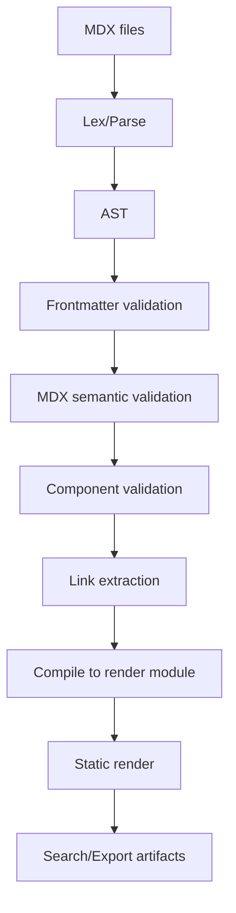
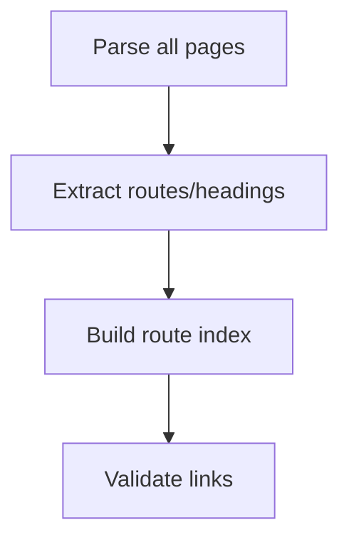
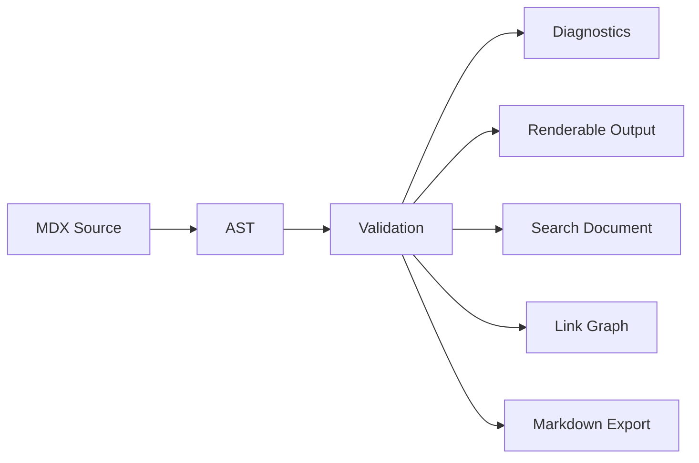

------
title: Build From Scratch: Mintlify-like AI-driven Documentation Generator CLI - Part 012
description: Membangun pipeline parser, compiler, dan diagnostics untuk MDX agar documentation generator bisa mendeteksi syntax error, semantic error, invalid component usage, broken frontmatter, unsafe expressions, dan menghasilkan pesan error yang actionable.
series: learn-mintlify-like-ai-docs-cli
seriesTitle: Build From Scratch: Mintlify-like AI-driven Documentation Generator CLI
order: 12
partTitle: MDX Parser, Compiler, and Diagnostics
tags:
  - documentation
  - ai
  - cli
  - mdx
  - compiler
  - diagnostics
  - developer-tools
date: 2026-07-03
---

# Part 012 — MDX Parser, Compiler, and Diagnostics

Part sebelumnya menetapkan MDX sebagai **target authoring** yang constrained.

Sekarang kita masuk ke tahap yang membuat sistem ini terasa production-grade: **parser, compiler, dan diagnostics**.

Tanpa compiler pipeline yang baik, documentation generator hanya akan menjadi file writer. Ia bisa menghasilkan banyak file, tetapi tidak bisa membuktikan apakah file itu benar.

Target kita bukan hanya:

> "MDX bisa dirender."

Target kita:

> "Setiap halaman MDX bisa diparse, divalidasi, dikompilasi, dicek struktur semantiknya, diperiksa keamanan component-nya, dan jika gagal, user mendapat diagnostic yang spesifik, actionable, dan menunjuk lokasi yang benar."

---

## 1. Mental model: docs build adalah compiler pipeline

Bayangkan docs generator seperti compiler.



Compiler yang baik tidak hanya menghasilkan output. Ia memberi tahu kenapa input salah.

Dalam konteks docs:

- syntax error harus menunjuk baris/kolom,
- frontmatter error harus menyebut field yang salah,
- component error harus menyebut component dan prop yang invalid,
- link error harus menyebut target yang tidak ditemukan,
- code fence error harus menyebut language yang missing,
- security error harus menyebut ekspresi/import yang tidak diizinkan,
- semantic error harus menjelaskan invariant yang dilanggar.

---

## 2. Kategori error

Kita perlu membedakan error.

| Kategori | Contoh | Fatal? |
|---|---|---|
| Parse error | MDX syntax invalid | Ya |
| Frontmatter error | `title` missing | Ya |
| Structural error | Multiple H1 | Biasanya ya |
| Component error | Unknown `<Foo />` | Ya di strict mode |
| Security error | Arbitrary expression in generated page | Ya |
| Link error | Internal link broken | Ya untuk production |
| Content warning | Empty section | Tidak selalu |
| Search warning | Page has no searchable body | Tidak selalu |
| Provenance warning/error | Generated page missing manifest | Tergantung mode |
| Deprecation warning | Old frontmatter field | Tidak |

Diagnostic model harus bisa mengkodekan ini.

---

## 3. Diagnostic data model

Kita desain diagnostic sebagai public contract.

```ts
export type DiagnosticSeverity = "info" | "warning" | "error";

export type DiagnosticCategory =
  | "parse"
  | "frontmatter"
  | "structure"
  | "component"
  | "security"
  | "link"
  | "content"
  | "search"
  | "provenance"
  | "deprecation"
  | "internal";

export type SourceLocation = {
  path: string;
  line?: number;
  column?: number;
  endLine?: number;
  endColumn?: number;
};

export type Diagnostic = {
  code: string;
  severity: DiagnosticSeverity;
  category: DiagnosticCategory;
  message: string;
  location?: SourceLocation;
  hint?: string;
  docsUrl?: string;
  related?: SourceLocation[];
};
```

Contoh diagnostic:

```json
{
  "code": "mdx.component.unknown",
  "severity": "error",
  "category": "component",
  "message": "Unknown MDX component <Foo>.",
  "location": {
    "path": "docs/quickstart.mdx",
    "line": 18,
    "column": 1
  },
  "hint": "Use one of the registered components: Callout, Steps, Tabs, CardGroup."
}
```

Diagnostic harus punya:

1. `code` stabil,
2. severity,
3. kategori,
4. message singkat,
5. location jika ada,
6. hint jika bisa,
7. related locations untuk error lintas file.

---

## 4. Diagnostic code naming

Gunakan namespace.

Contoh:

| Code | Meaning |
|---|---|
| `mdx.parse.failed` | Parser gagal membaca MDX |
| `mdx.frontmatter.missing` | Frontmatter tidak ada |
| `mdx.frontmatter.invalidField` | Field frontmatter invalid |
| `mdx.heading.multipleH1` | Lebih dari satu H1 |
| `mdx.heading.skippedLevel` | Heading lompat level |
| `mdx.component.unknown` | Component tidak terdaftar |
| `mdx.component.invalidProp` | Prop tidak valid |
| `mdx.security.importNotAllowed` | Import tidak boleh |
| `mdx.security.expressionNotAllowed` | Expression tidak boleh |
| `mdx.link.unresolvedInternal` | Internal link tidak resolve |
| `mdx.code.missingLanguage` | Fenced code block tanpa language |
| `mdx.content.emptySection` | Section kosong |
| `mdx.provenance.missingManifest` | Generated page tidak punya manifest |

Stable code penting untuk:

- CI suppression,
- machine-readable JSON output,
- docs,
- metrics,
- regression tests.

---

## 5. Compiler pipeline interface

Kita buat package:

```txt
packages/mdx-compiler/
  src/
    compile-page.ts
    parse-mdx.ts
    validate-frontmatter.ts
    validate-structure.ts
    validate-components.ts
    validate-security.ts
    extract-links.ts
    extract-search.ts
    diagnostics.ts
    source-map.ts
    reporter.ts
    __tests__/
```

Core API:

```ts
export type CompileMode = "development" | "production";
export type MdxSafetyMode = "generatedStrict" | "manualRestricted" | "manualTrusted";

export type CompilePageInput = {
  path: string;
  source: string;
  mode: CompileMode;
  safetyMode: MdxSafetyMode;
  componentRegistry: ComponentRegistry;
  routeIndex: RouteIndex;
};

export type CompilePageResult = {
  path: string;
  frontmatter?: PageFrontmatter;
  ast?: unknown;
  renderModule?: string;
  links: ExtractedLink[];
  searchDocument?: SearchDocument;
  diagnostics: Diagnostic[];
  ok: boolean;
};
```

Rule:

- `ok === false` jika ada diagnostic severity `error`.
- Warnings tidak memblokir dev mode.
- Production mode bisa meng-upgrade beberapa warning menjadi error.

Example:

```ts
export function hasErrors(diagnostics: Diagnostic[]): boolean {
  return diagnostics.some((d) => d.severity === "error");
}
```

---

## 6. Parse stage

Parser menerima string MDX.

Output:

- AST,
- frontmatter raw,
- parse diagnostics.

Pseudo-flow:

```ts
export async function parseMdxFile(path: string, source: string): Promise<ParseResult> {
  try {
    const ast = await parseMdxToAst(source);

    return {
      path,
      ast,
      diagnostics: [],
    };
  } catch (error) {
    return {
      path,
      diagnostics: [
        normalizeParseError(path, error),
      ],
    };
  }
}
```

Kita sengaja tidak melempar exception ke atas untuk user error. Parse error adalah diagnostic, bukan crash.

Crash hanya untuk bug internal.

---

## 7. Parse error normalization

Library parser sering menghasilkan error dengan shape berbeda.

Kita normalisasi.

```ts
export function normalizeParseError(path: string, error: unknown): Diagnostic {
  const maybe = error as {
    message?: string;
    line?: number;
    column?: number;
    position?: {
      start?: { line?: number; column?: number };
      end?: { line?: number; column?: number };
    };
  };

  return {
    code: "mdx.parse.failed",
    severity: "error",
    category: "parse",
    message: maybe.message ?? "Failed to parse MDX.",
    location: {
      path,
      line: maybe.position?.start?.line ?? maybe.line,
      column: maybe.position?.start?.column ?? maybe.column,
      endLine: maybe.position?.end?.line,
      endColumn: maybe.position?.end?.column,
    },
    hint: "Check for unclosed JSX tags, invalid expressions, broken code fences, or malformed frontmatter.",
  };
}
```

User harus melihat:

```txt
docs/quickstart.mdx:18:5 error mdx.parse.failed
Failed to parse MDX: Expected a closing tag for <Callout>.

Hint: Check for unclosed JSX tags, invalid expressions, broken code fences, or malformed frontmatter.
```

---

## 8. Frontmatter extraction

Frontmatter adalah contract halaman.

Kita butuh dua tahap:

1. extract raw frontmatter,
2. validate schema.

Pseudo:

```ts
export type FrontmatterResult = {
  data?: unknown;
  diagnostics: Diagnostic[];
};

export function extractFrontmatter(path: string, source: string): FrontmatterResult {
  if (!source.startsWith("---") && !source.startsWith("------")) {
    return {
      diagnostics: [
        {
          code: "mdx.frontmatter.missing",
          severity: "error",
          category: "frontmatter",
          message: "MDX page is missing frontmatter.",
          location: { path, line: 1, column: 1 },
          hint: "Add frontmatter with at least title, description, and kind.",
        },
      ],
    };
  }

  // Real implementation should parse frontmatter robustly.
  return parseYamlFrontmatter(path, source);
}
```

Dalam seri ini, contoh user memakai opening `------` dan closing `---`.

Untuk produk umum, lebih lazim memakai `---` sebagai delimiter YAML frontmatter. Tetapi engine kita bisa mendukung keduanya jika memang ada compatibility requirement.

Rule penting:

- delimiter harus jelas,
- YAML parser harus error-friendly,
- unknown fields bergantung mode,
- date/string coercion harus konsisten.

---

## 9. Frontmatter validation

Gunakan schema.

```ts
export function validateFrontmatter(
  path: string,
  data: unknown
): { frontmatter?: PageFrontmatter; diagnostics: Diagnostic[] } {
  const parsed = PageFrontmatterSchema.safeParse(data);

  if (parsed.success) {
    return {
      frontmatter: parsed.data,
      diagnostics: [],
    };
  }

  const diagnostics = parsed.error.issues.map((issue): Diagnostic => {
    const field = issue.path.join(".");

    return {
      code: "mdx.frontmatter.invalidField",
      severity: "error",
      category: "frontmatter",
      message: field
        ? `Invalid frontmatter field "${field}": ${issue.message}.`
        : `Invalid frontmatter: ${issue.message}.`,
      location: { path },
      hint: "Check the page frontmatter schema.",
    };
  });

  return { diagnostics };
}
```

Better diagnostics map YAML field to line number.

That requires source position tracking.

If YAML parser does not expose line numbers, we can implement approximate mapping:

```ts
export function findFrontmatterFieldLine(source: string, field: string): number | undefined {
  const lines = source.split(/\r?\n/);

  for (let index = 0; index < lines.length; index++) {
    if (lines[index]?.match(new RegExp(`^\\s*${escapeRegExp(field)}\\s*:`))) {
      return index + 1;
    }
  }

  return undefined;
}
```

---

## 10. AST traversal

To validate MDX, we traverse AST.

We do not need to expose parser AST shape to the rest of the system. Wrap it.

```ts
export type AstVisitor = {
  enter?: (node: unknown, context: AstContext) => void;
  exit?: (node: unknown, context: AstContext) => void;
};

export type AstContext = {
  path: string;
  ancestors: unknown[];
  diagnostics: Diagnostic[];
};
```

Generic walker:

```ts
export function walkAst(node: unknown, visitor: AstVisitor, context: AstContext): void {
  visitor.enter?.(node, context);

  for (const child of getChildren(node)) {
    context.ancestors.push(node);
    walkAst(child, visitor, context);
    context.ancestors.pop();
  }

  visitor.exit?.(node, context);
}
```

In real implementation, use the AST shape from the MDX/unified ecosystem, but keep your validation rules behind your own abstraction.

Why?

Because parser libraries can change AST internals. Your business rules should not be scattered across the codebase.

---

## 11. Structure validation

Structural validation checks page shape.

Rules:

1. exactly one H1,
2. no skipped heading levels,
3. no empty heading title,
4. no duplicate heading slug,
5. frontmatter title compatible with H1,
6. page body not empty,
7. page kind matches expected sections if strict mode.

Example heading collector:

```ts
export type HeadingInfo = {
  depth: number;
  title: string;
  slug: string;
  location?: SourceLocation;
};

export function collectHeadings(ast: unknown, path: string): HeadingInfo[] {
  const headings: HeadingInfo[] = [];

  walkAst(ast, {
    enter(node) {
      if (isMarkdownHeading(node)) {
        const title = getPlainText(node);
        headings.push({
          depth: getHeadingDepth(node),
          title,
          slug: slugifyHeading(title),
          location: getNodeLocation(path, node),
        });
      }
    },
  }, {
    path,
    ancestors: [],
    diagnostics: [],
  });

  return headings;
}
```

Validate H1:

```ts
export function validateSingleH1(path: string, headings: HeadingInfo[]): Diagnostic[] {
  const h1s = headings.filter((h) => h.depth === 1);

  if (h1s.length === 1) {
    return [];
  }

  return [{
    code: h1s.length === 0 ? "mdx.heading.missingH1" : "mdx.heading.multipleH1",
    severity: "error",
    category: "structure",
    message: h1s.length === 0
      ? "Page must contain exactly one H1 heading."
      : `Page must contain exactly one H1 heading, but found ${h1s.length}.`,
    location: h1s[1]?.location ?? { path },
    hint: "Keep one top-level page title and use H2/H3 for sections.",
    related: h1s.map((h) => h.location).filter(Boolean) as SourceLocation[],
  }];
}
```

Validate skipped levels:

```ts
export function validateHeadingLevels(headings: HeadingInfo[]): Diagnostic[] {
  const diagnostics: Diagnostic[] = [];
  let previousDepth = 0;

  for (const heading of headings) {
    if (previousDepth > 0 && heading.depth > previousDepth + 1) {
      diagnostics.push({
        code: "mdx.heading.skippedLevel",
        severity: "warning",
        category: "structure",
        message: `Heading "${heading.title}" skips from H${previousDepth} to H${heading.depth}.`,
        location: heading.location,
        hint: `Use H${previousDepth + 1} unless this section hierarchy is intentional.`,
      });
    }

    previousDepth = heading.depth;
  }

  return diagnostics;
}
```

---

## 12. Component validation

Component validation is where MDX-specific safety becomes important.

Given component registry:

```ts
export type ComponentRegistry = {
  has(name: string): boolean;
  get(name: string): ComponentSpec | undefined;
};
```

Validator:

```ts
export function validateComponents(
  ast: unknown,
  path: string,
  registry: ComponentRegistry
): Diagnostic[] {
  const diagnostics: Diagnostic[] = [];

  walkAst(ast, {
    enter(node) {
      if (!isMdxJsxElement(node)) {
        return;
      }

      const name = getMdxElementName(node);

      if (!registry.has(name)) {
        diagnostics.push({
          code: "mdx.component.unknown",
          severity: "error",
          category: "component",
          message: `Unknown MDX component <${name}>.`,
          location: getNodeLocation(path, node),
          hint: `Use a registered documentation component or enable trusted MDX mode.`,
        });
        return;
      }

      const spec = registry.get(name);
      if (!spec) {
        return;
      }

      diagnostics.push(
        ...validateComponentProps(path, node, spec),
        ...validateComponentChildren(path, node, spec),
      );
    },
  }, {
    path,
    ancestors: [],
    diagnostics,
  });

  return diagnostics;
}
```

---

## 13. Prop validation

Component props should match schema.

Example `Callout`:

```ts
const CalloutSpec: ComponentSpec = {
  name: "Callout",
  props: {
    type: {
      type: "enum",
      required: true,
      values: ["note", "tip", "warning", "danger", "info"],
    },
    title: {
      type: "string",
      required: false,
    },
  },
  children: "blocks",
};
```

Invalid:

```mdx
<Callout type="banana">
This is invalid.
</Callout>
```

Diagnostic:

```txt
docs/page.mdx:10:10 error mdx.component.invalidProp
Invalid prop "type" on <Callout>: expected one of note, tip, warning, danger, info.
```

Pseudo:

```ts
export function validateComponentProps(
  path: string,
  node: unknown,
  spec: ComponentSpec
): Diagnostic[] {
  const diagnostics: Diagnostic[] = [];
  const actualProps = getMdxElementProps(node);

  for (const [propName, propSpec] of Object.entries(spec.props)) {
    const actual = actualProps.get(propName);

    if (propSpec.required && !actual) {
      diagnostics.push({
        code: "mdx.component.missingProp",
        severity: "error",
        category: "component",
        message: `Missing required prop "${propName}" on <${spec.name}>.`,
        location: getNodeLocation(path, node),
      });
      continue;
    }

    if (actual) {
      const invalidReason = validatePropValue(actual, propSpec);
      if (invalidReason) {
        diagnostics.push({
          code: "mdx.component.invalidProp",
          severity: "error",
          category: "component",
          message: `Invalid prop "${propName}" on <${spec.name}>: ${invalidReason}.`,
          location: getNodeLocation(path, actual.node),
        });
      }
    }
  }

  for (const actualName of actualProps.keys()) {
    if (!spec.props[actualName]) {
      diagnostics.push({
        code: "mdx.component.unknownProp",
        severity: "warning",
        category: "component",
        message: `Unknown prop "${actualName}" on <${spec.name}>.`,
        location: getNodeLocation(path, node),
        hint: `Remove the prop or add it to the component registry.`,
      });
    }
  }

  return diagnostics;
}
```

---

## 14. Children validation

Some components require specific children.

Example:

- `Tabs` may only contain `Tab`.
- `Steps` may only contain `Step`.
- `CardGroup` may only contain `Card`.
- `AccordionGroup` may only contain `Accordion`.

Invalid:

```mdx
<Tabs>
  <Card title="Wrong" href="/wrong">
    This should not be here.
  </Card>
</Tabs>
```

Diagnostic:

```txt
error mdx.component.invalidChild
<Tabs> may only contain <Tab> children, but found <Card>.
```

Spec:

```ts
export type ComponentChildrenSpec =
  | { type: "none" }
  | { type: "blocks" }
  | { type: "only"; names: string[] };

export type ComponentSpec = {
  name: string;
  props: Record<string, PropSpec>;
  children: ComponentChildrenSpec;
};
```

Validation:

```ts
export function validateComponentChildren(
  path: string,
  node: unknown,
  spec: ComponentSpec
): Diagnostic[] {
  if (spec.children.type !== "only") {
    return [];
  }

  const diagnostics: Diagnostic[] = [];
  const children = getElementChildren(node);

  for (const child of children) {
    if (isWhitespaceText(child)) {
      continue;
    }

    if (!isMdxJsxElement(child)) {
      diagnostics.push({
        code: "mdx.component.invalidChild",
        severity: "error",
        category: "component",
        message: `<${spec.name}> may only contain ${formatAllowedChildren(spec.children.names)} children.`,
        location: getNodeLocation(path, child),
      });
      continue;
    }

    const childName = getMdxElementName(child);

    if (!spec.children.names.includes(childName)) {
      diagnostics.push({
        code: "mdx.component.invalidChild",
        severity: "error",
        category: "component",
        message: `<${spec.name}> may only contain ${formatAllowedChildren(spec.children.names)} children, but found <${childName}>.`,
        location: getNodeLocation(path, child),
      });
    }
  }

  return diagnostics;
}
```

---

## 15. Security validation

Generated docs must not execute arbitrary code.

Security validation checks:

1. import declarations,
2. export declarations,
3. arbitrary JSX expressions,
4. spread props,
5. function props,
6. raw HTML,
7. dangerous URLs,
8. script-like components,
9. unknown MDX ESM nodes.

Generated strict mode:

```ts
export function validateSecurity(
  ast: unknown,
  path: string,
  safetyMode: MdxSafetyMode
): Diagnostic[] {
  if (safetyMode === "manualTrusted") {
    return [];
  }

  const diagnostics: Diagnostic[] = [];

  walkAst(ast, {
    enter(node) {
      if (isMdxEsm(node)) {
        diagnostics.push({
          code: "mdx.security.importNotAllowed",
          severity: "error",
          category: "security",
          message: "Import/export statements are not allowed in restricted MDX.",
          location: getNodeLocation(path, node),
          hint: "Use registered documentation components instead of importing arbitrary modules.",
        });
      }

      if (isMdxExpression(node)) {
        diagnostics.push({
          code: "mdx.security.expressionNotAllowed",
          severity: "error",
          category: "security",
          message: "Arbitrary MDX expressions are not allowed in restricted MDX.",
          location: getNodeLocation(path, node),
          hint: "Use literal props or structured documentation components.",
        });
      }

      if (isMdxJsxSpreadAttribute(node)) {
        diagnostics.push({
          code: "mdx.security.spreadPropNotAllowed",
          severity: "error",
          category: "security",
          message: "JSX spread props are not allowed in restricted MDX.",
          location: getNodeLocation(path, node),
        });
      }
    },
  }, {
    path,
    ancestors: [],
    diagnostics,
  });

  return diagnostics;
}
```

---

## 16. URL safety

Links can be unsafe.

Disallow:

- `javascript:`,
- `data:` except maybe image data in trusted mode,
- suspicious protocol-relative URLs if not intended,
- external URL if config disallows.

```ts
const BLOCKED_PROTOCOLS = new Set(["javascript:", "data:", "vbscript:"]);

export function validateUrlSafety(url: string): string | undefined {
  try {
    const parsed = new URL(url, "https://example.invalid");

    if (BLOCKED_PROTOCOLS.has(parsed.protocol.toLowerCase())) {
      return `Protocol "${parsed.protocol}" is not allowed.`;
    }

    return undefined;
  } catch {
    return "URL is not valid.";
  }
}
```

Diagnostic:

```ts
{
  code: "mdx.security.unsafeUrl",
  severity: "error",
  category: "security",
  message: `Unsafe URL in link: ${reason}`,
  location,
}
```

---

## 17. Link extraction

Link checking is both semantic and graph-level.

Extract:

- Markdown links,
- JSX component links,
- image links,
- anchor links,
- API operation references,
- card links.

```ts
export type ExtractedLink = {
  type: "internal" | "external" | "anchor" | "asset";
  label?: string;
  target: string;
  location?: SourceLocation;
};
```

Extractor:

```ts
export function extractLinks(ast: unknown, path: string): ExtractedLink[] {
  const links: ExtractedLink[] = [];

  walkAst(ast, {
    enter(node) {
      if (isMarkdownLink(node)) {
        links.push({
          type: classifyLinkTarget(getLinkUrl(node)),
          label: getPlainText(node),
          target: getLinkUrl(node),
          location: getNodeLocation(path, node),
        });
      }

      if (isMdxJsxElement(node)) {
        const name = getMdxElementName(node);

        if (name === "Card") {
          const href = getLiteralProp(node, "href");
          if (href) {
            links.push({
              type: classifyLinkTarget(href),
              target: href,
              label: getLiteralProp(node, "title"),
              location: getNodeLocation(path, node),
            });
          }
        }
      }
    },
  }, {
    path,
    ancestors: [],
    diagnostics: [],
  });

  return links;
}
```

---

## 18. Internal link validation

Route index:

```ts
export type RouteIndex = {
  hasRoute(path: string): boolean;
  hasAnchor(path: string, anchor: string): boolean;
};
```

Validator:

```ts
export function validateInternalLinks(
  links: ExtractedLink[],
  routeIndex: RouteIndex
): Diagnostic[] {
  const diagnostics: Diagnostic[] = [];

  for (const link of links) {
    if (link.type !== "internal") {
      continue;
    }

    const [route, anchor] = splitAnchor(link.target);

    if (!routeIndex.hasRoute(route)) {
      diagnostics.push({
        code: "mdx.link.unresolvedInternal",
        severity: "error",
        category: "link",
        message: `Internal link target does not exist: ${link.target}.`,
        location: link.location,
        hint: "Check the route path or add the missing page.",
      });
      continue;
    }

    if (anchor && !routeIndex.hasAnchor(route, anchor)) {
      diagnostics.push({
        code: "mdx.link.unresolvedAnchor",
        severity: "error",
        category: "link",
        message: `Anchor "${anchor}" does not exist on route ${route}.`,
        location: link.location,
      });
    }
  }

  return diagnostics;
}
```

But route index needs headings from all pages, so link validation can happen after page parse/structure extraction.

Pipeline:



---

## 19. Code fence validation

Fenced code blocks should specify language.

```ts
export function validateCodeBlocks(ast: unknown, path: string): Diagnostic[] {
  const diagnostics: Diagnostic[] = [];

  walkAst(ast, {
    enter(node) {
      if (!isCodeBlock(node)) {
        return;
      }

      const lang = getCodeLanguage(node);

      if (!lang) {
        diagnostics.push({
          code: "mdx.code.missingLanguage",
          severity: "warning",
          category: "content",
          message: "Code block is missing a language.",
          location: getNodeLocation(path, node),
          hint: "Add a language such as bash, json, ts, java, yaml, or text.",
        });
      }
    },
  }, {
    path,
    ancestors: [],
    diagnostics,
  });

  return diagnostics;
}
```

Later in Part 038, code examples can be executed/verified.

For now, we only validate syntax and metadata.

---

## 20. Content quality validation

Content validation catches weak docs.

Rules:

| Rule | Severity |
|---|---|
| H2 with no content before next heading | warning |
| Page body too short | warning |
| `TODO` left in generated page | warning/error |
| "Lorem ipsum" | error |
| Empty callout | warning |
| Empty tab | error |
| Table with no rows | warning |
| Page has no description | error |
| Duplicate title across pages | warning/error |

Example empty section:

```ts
export function validateNoEmptySections(pageAst: unknown, path: string): Diagnostic[] {
  const sections = collectSections(pageAst, path);

  return sections
    .filter((section) => section.bodyNodeCount === 0)
    .map((section): Diagnostic => ({
      code: "mdx.content.emptySection",
      severity: "warning",
      category: "content",
      message: `Section "${section.title}" has no content.`,
      location: section.location,
      hint: "Add content or remove the empty heading.",
    }));
}
```

---

## 21. Compile to render module

After validation, we compile MDX to renderable code.

Conceptually:

```ts
export async function compileRenderableMdx(
  path: string,
  source: string,
  options: CompileOptions
): Promise<CompileOutput> {
  // Uses MDX compiler under the hood.
  const code = await compile(source, {
    jsx: true,
    providerImportSource: options.providerImportSource,
    development: options.mode === "development",
  });

  return {
    code: String(code),
  };
}
```

Important concerns:

1. compile only after parse/security validation if possible,
2. avoid executing untrusted MDX during validation,
3. isolate renderer from arbitrary imports in strict mode,
4. preserve source maps or line mapping for diagnostics,
5. cache compile output by content hash and config hash.

---

## 22. Source maps and locations

Diagnostics are only useful if location is right.

We need helper:

```ts
export function getNodeLocation(path: string, node: unknown): SourceLocation | undefined {
  const position = getPosition(node);

  if (!position?.start) {
    return { path };
  }

  return {
    path,
    line: position.start.line,
    column: position.start.column,
    endLine: position.end?.line,
    endColumn: position.end?.column,
  };
}
```

Diagnostic location should point at:

- invalid component tag,
- invalid prop value,
- broken link node,
- heading node,
- code fence start,
- frontmatter field line if available.

Bad diagnostic:

```txt
Build failed.
```

Better:

```txt
docs/reference/configuration.mdx:42:12 error mdx.component.invalidProp
Invalid prop "type" on <Callout>: expected note, tip, warning, danger, or info; got "important".
```

---

## 23. Reporter design

CLI users need human-readable output.

CI and IDE integration need machine-readable output.

Support:

1. pretty text,
2. JSON,
3. NDJSON,
4. GitHub Actions annotations later.

Text reporter:

```txt
error mdx.component.unknown docs/quickstart.mdx:21:1
Unknown MDX component <Alert>.

Hint:
Use <Callout type="..."> instead, or register Alert in the component registry.
```

JSON reporter:

```json
{
  "ok": false,
  "diagnostics": [
    {
      "code": "mdx.component.unknown",
      "severity": "error",
      "category": "component",
      "message": "Unknown MDX component <Alert>.",
      "location": {
        "path": "docs/quickstart.mdx",
        "line": 21,
        "column": 1
      }
    }
  ]
}
```

NDJSON reporter:

```json
{"event":"diagnostic","code":"mdx.component.unknown","severity":"error","path":"docs/quickstart.mdx","line":21}
{"event":"summary","ok":false,"errors":1,"warnings":0}
```

Use JSON/NDJSON for automation. Use pretty reporter for humans.

---

## 24. Diagnostic aggregation

A build has many pages.

```ts
export type BuildDiagnostics = {
  diagnostics: Diagnostic[];
  errors: number;
  warnings: number;
  infos: number;
  ok: boolean;
};
```

Aggregate:

```ts
export function summarizeDiagnostics(diagnostics: Diagnostic[]): BuildDiagnostics {
  let errors = 0;
  let warnings = 0;
  let infos = 0;

  for (const diagnostic of diagnostics) {
    if (diagnostic.severity === "error") errors++;
    if (diagnostic.severity === "warning") warnings++;
    if (diagnostic.severity === "info") infos++;
  }

  return {
    diagnostics,
    errors,
    warnings,
    infos,
    ok: errors === 0,
  };
}
```

Ordering:

1. errors before warnings,
2. by path,
3. by line,
4. by code.

Stable ordering makes CI output easier to compare.

---

## 25. Dev mode vs production mode

Different modes should enforce different strictness.

| Rule | Dev | Production |
|---|---|---|
| Parse errors | Error | Error |
| Missing frontmatter | Error | Error |
| Unknown component | Error | Error |
| Broken internal link | Warning maybe | Error |
| External link unreachable | Warning | Warning/error by config |
| Missing code language | Warning | Warning |
| Draft page | Allowed | Skipped or error |
| Empty section | Warning | Warning |
| Missing provenance | Warning | Error for generated pages |

Compile mode:

```ts
export function severityForRule(
  rule: string,
  mode: CompileMode
): DiagnosticSeverity {
  if (rule === "mdx.link.unresolvedInternal") {
    return mode === "production" ? "error" : "warning";
  }

  return "error";
}
```

But avoid overcomplicating severity rules early. Start simple, then introduce config.

---

## 26. Incremental compilation

Large docs sites need incremental builds.

Cache key:

```ts
export type CompileCacheKey = {
  sourceHash: string;
  configHash: string;
  componentRegistryHash: string;
  compilerVersion: string;
};
```

If any of these changes, invalidate.

Cache entry:

```ts
export type CompileCacheEntry = {
  key: CompileCacheKey;
  result: CompilePageResult;
  createdAt: string;
};
```

Do not cache fatal internal errors as if they were valid results.

Cache diagnostics too, but always include compiler version in key.

---

## 27. Cross-page validation

Some validations require all pages.

Examples:

- duplicate routes,
- duplicate titles,
- duplicate nav order,
- broken internal links,
- anchor existence,
- orphan pages,
- nav references missing file,
- generated page missing provenance manifest.

Build pipeline:

```ts
export async function compileSite(input: CompileSiteInput): Promise<CompileSiteResult> {
  const pageResults = await Promise.all(
    input.pages.map((page) => compilePageFirstPass(page, input))
  );

  const routeIndex = buildRouteIndex(pageResults);
  const crossPageDiagnostics = validateCrossPageRules(pageResults, routeIndex, input);

  const finalDiagnostics = [
    ...pageResults.flatMap((r) => r.diagnostics),
    ...crossPageDiagnostics,
  ];

  return {
    pages: pageResults,
    routeIndex,
    diagnostics: finalDiagnostics,
    ok: !hasErrors(finalDiagnostics),
  };
}
```

First pass collects:

- frontmatter,
- headings,
- route,
- links,
- search text candidate.

Second pass validates graph.

---

## 28. Route index

```ts
export type RouteRecord = {
  route: string;
  path: string;
  title: string;
  anchors: Set<string>;
};

export type RouteIndex = {
  byRoute: Map<string, RouteRecord>;
  byPath: Map<string, RouteRecord>;
};
```

Build:

```ts
export function buildRouteIndex(results: CompilePageResult[]): RouteIndex {
  const byRoute = new Map<string, RouteRecord>();
  const byPath = new Map<string, RouteRecord>();

  for (const result of results) {
    if (!result.frontmatter) {
      continue;
    }

    const route = routeFromPath(result.path);
    const anchors = new Set(result.headings?.map((h) => h.slug) ?? []);

    const record = {
      route,
      path: result.path,
      title: result.frontmatter.title,
      anchors,
    };

    byRoute.set(route, record);
    byPath.set(result.path, record);
  }

  return { byRoute, byPath };
}
```

Duplicate route diagnostic:

```ts
{
  code: "mdx.route.duplicate",
  severity: "error",
  category: "structure",
  message: `Multiple pages resolve to route ${route}.`,
  location: { path },
  related: otherPaths.map((p) => ({ path: p })),
}
```

---

## 29. Search document extraction

Search indexer should not parse MDX again if compiler already has AST.

Extract:

```ts
export type SearchDocument = {
  route: string;
  title: string;
  description: string;
  headings: string[];
  bodyText: string;
  tags: string[];
};
```

Extractor:

```ts
export function extractSearchDocument(
  result: CompilePageResult,
  ast: unknown
): SearchDocument | undefined {
  if (!result.frontmatter) {
    return undefined;
  }

  return {
    route: routeFromPath(result.path),
    title: result.frontmatter.title,
    description: result.frontmatter.description,
    headings: collectHeadings(ast, result.path).map((h) => h.title),
    bodyText: extractSearchableText(ast),
    tags: result.frontmatter.tags ?? [],
  };
}
```

Important:

- Extract text from component children.
- Do not index hidden implementation metadata.
- Decide whether code blocks are indexed lightly or not.
- Include API operation metadata for API pages.

---

## 30. Plain Markdown export extraction

For `llms.txt`, we need markdown-ish output.

Do not rely only on original MDX string. Custom components must be converted.

Component registry:

```ts
export type MarkdownExportContext = {
  route: string;
  componentRegistry: ComponentRegistry;
};

export type ComponentSpec = {
  name: string;
  toMarkdown?: (node: unknown, context: MarkdownExportContext) => string;
};
```

Example:

```ts
export function calloutToMarkdown(node: unknown): string {
  const type = getLiteralProp(node, "type") ?? "note";
  const title = getLiteralProp(node, "title");

  const body = renderChildrenToMarkdown(node);

  return [
    `> [!${type.toUpperCase()}]${title ? ` ${title}` : ""}`,
    ...body.split("\n").map((line) => `> ${line}`),
  ].join("\n");
}
```

This matters because agent-ready docs must not lose component content.

---

## 31. Handling generated region markers

Managed regions use comments:

```mdx
{/* docforge:start id="config-fields" */}
...
{/* docforge:end */}
```

The parser should detect:

```ts
export type ManagedRegionMarker =
  | { type: "start"; id: string; location?: SourceLocation }
  | { type: "end"; location?: SourceLocation };
```

Validation:

1. start must have id,
2. end must match open region,
3. nested regions disallowed unless explicitly supported,
4. duplicate region ID error,
5. unclosed region error.

Pseudo:

```ts
export function validateManagedRegions(markers: ManagedRegionMarker[]): Diagnostic[] {
  const diagnostics: Diagnostic[] = [];
  const stack: ManagedRegionMarker[] = [];
  const ids = new Set<string>();

  for (const marker of markers) {
    if (marker.type === "start") {
      if (ids.has(marker.id)) {
        diagnostics.push({
          code: "mdx.region.duplicateId",
          severity: "error",
          category: "structure",
          message: `Duplicate managed region id "${marker.id}".`,
          location: marker.location,
        });
      }

      ids.add(marker.id);
      stack.push(marker);
      continue;
    }

    if (marker.type === "end") {
      if (stack.length === 0) {
        diagnostics.push({
          code: "mdx.region.unmatchedEnd",
          severity: "error",
          category: "structure",
          message: "Managed region end marker has no matching start marker.",
          location: marker.location,
        });
        continue;
      }

      stack.pop();
    }
  }

  for (const unclosed of stack) {
    diagnostics.push({
      code: "mdx.region.unclosed",
      severity: "error",
      category: "structure",
      message: "Managed region start marker has no matching end marker.",
      location: unclosed.location,
    });
  }

  return diagnostics;
}
```

---

## 32. Build fail policy

A docs generator must be strict enough to protect quality, but not so strict that development is painful.

Suggested policy:

| Command | Behavior |
|---|---|
| `docforge dev` | Show warnings/errors, keep server running if possible. |
| `docforge build` | Fail on errors. |
| `docforge check` | Fail on errors; optionally fail on warnings with `--max-warnings=0`. |
| `docforge generate --dry-run` | Show diagnostics before writing. |
| `docforge generate --apply` | Refuse to write invalid MDX unless `--force` for debug only. |

Never publish known-invalid docs.

---

## 33. Error recovery

In dev server mode, one bad page should not kill the whole preview.

Strategy:

- compile valid pages,
- show error page for invalid route,
- keep watching files,
- recompile when file changes.

```ts
export type DevPageState =
  | { status: "valid"; result: CompilePageResult }
  | { status: "invalid"; diagnostics: Diagnostic[] };
```

When user opens invalid page:

```mdx
# MDX compile error

`docs/quickstart.mdx` has 1 error.

- `mdx.component.unknown` at line 21: Unknown MDX component `<Alert>`.
```

This is much better than a blank page.

---

## 34. Pretty diagnostic examples

### 34.1 Unknown component

Input:

```mdx
<Alert type="info">
Hello.
</Alert>
```

Output:

```txt
docs/quickstart.mdx:12:1 error mdx.component.unknown
Unknown MDX component <Alert>.

Hint:
Use <Callout type="info"> instead, or register Alert in the component registry.
```

### 34.2 Multiple H1

Input:

```mdx
# Quickstart

# Installation
```

Output:

```txt
docs/quickstart.mdx:5:1 error mdx.heading.multipleH1
Page must contain exactly one H1 heading, but found 2.

Hint:
Keep one page title and use H2/H3 for sections.
```

### 34.3 Unsafe expression

Input:

```mdx
{process.env.SECRET}
```

Output:

```txt
docs/page.mdx:8:1 error mdx.security.expressionNotAllowed
Arbitrary MDX expressions are not allowed in restricted MDX.

Hint:
Use literal props or structured documentation components.
```

### 34.4 Broken internal link

Input:

```mdx
Read [deployment](/deployments).
```

Output:

```txt
docs/page.mdx:16:6 error mdx.link.unresolvedInternal
Internal link target does not exist: /deployments.

Hint:
Check the route path or add the missing page.
```

---

## 35. Testing strategy

Testing compiler requires multiple layers.

### 35.1 Unit tests

- frontmatter parser,
- diagnostic normalization,
- heading collector,
- component prop validator,
- link classifier,
- security validator.

### 35.2 Golden tests

Given input MDX, expect exact diagnostics.

```txt
fixtures/
  unknown-component/
    input.mdx
    diagnostics.json
  multiple-h1/
    input.mdx
    diagnostics.json
```

Test:

```ts
import { readFile } from "node:fs/promises";
import { compilePage } from "../src/compile-page";

it("reports unknown component", async () => {
  const source = await readFile("fixtures/unknown-component/input.mdx", "utf8");
  const expected = JSON.parse(
    await readFile("fixtures/unknown-component/diagnostics.json", "utf8")
  );

  const result = await compilePage({
    path: "fixtures/unknown-component/input.mdx",
    source,
    mode: "production",
    safetyMode: "generatedStrict",
    componentRegistry: defaultRegistry,
    routeIndex: emptyRouteIndex(),
  });

  expect(result.diagnostics).toMatchObject(expected);
});
```

### 35.3 Snapshot tests

Use snapshots carefully. They are useful for pretty reporter output.

### 35.4 Fuzz tests

Fuzz MDX-ish input to ensure compiler returns diagnostics, not crashes.

```ts
it("does not throw on arbitrary input", async () => {
  for (const source of generateRandomMdxLikeInputs()) {
    await expect(
      compilePage({
        path: "random.mdx",
        source,
        mode: "production",
        safetyMode: "generatedStrict",
        componentRegistry: defaultRegistry,
        routeIndex: emptyRouteIndex(),
      })
    ).resolves.toBeDefined();
  }
});
```

Rule:

> User-authored syntax errors should never crash the process.

---

## 36. CLI integration

Commands:

```bash
docforge check
docforge check --format=json
docforge check --format=ndjson
docforge check --max-warnings=0
docforge check docs/quickstart.mdx
```

Output summary:

```txt
Checked 42 pages.

Errors:   2
Warnings: 5

Build failed.
```

Exit code:

| Result | Exit code |
|---|---:|
| No errors | 0 |
| Errors found | 1 |
| Internal crash | 2 |
| Invalid CLI usage | 64 |
| Config error | 78 |

`docforge check` should not write files.

---

## 37. GitHub Actions annotation format

Later GitHub integration can map diagnostics to annotations.

Conceptually:

```txt
::error file=docs/quickstart.mdx,line=12,col=1,title=mdx.component.unknown::Unknown MDX component <Alert>.
```

But keep this as reporter adapter, not core diagnostic model.

Core:

```ts
Diagnostic[]
```

Reporter:

```ts
Diagnostic[] -> GitHub annotation output
```

---

## 38. IDE/editor integration

Stable diagnostics enable future editor integration.

Possible future:

- Language Server Protocol adapter,
- VS Code extension,
- diagnostics overlay in dev server,
- quick fixes:
  - replace `<Alert>` with `<Callout>`,
  - add missing code language,
  - fix heading level,
  - create missing linked page.

Do not build this now. But design diagnostic codes and locations so it remains possible.

---

## 39. Performance concerns

MDX compile can be expensive.

Optimize:

1. parse only changed files in dev,
2. cache by content hash,
3. separate fast lint from full compile if needed,
4. parallelize with worker pool,
5. avoid rechecking external links every build,
6. avoid executing/rendering untrusted MDX during lint.

Performance budget example:

| Site size | Target |
|---|---:|
| 50 pages | under 1s warm check |
| 500 pages | under 5s warm check |
| 5,000 pages | incremental check under 2s for one changed page |

These are directional targets, not hard guarantees.

---

## 40. Compiler failure model

A robust compiler distinguishes:

| Failure type | Handling |
|---|---|
| User input error | Diagnostic |
| Config error | Diagnostic, fail build |
| External dependency error | Diagnostic if recoverable |
| Internal bug | Crash report style error |
| Timeout | Diagnostic with retry hint |
| Cache corruption | Warn, invalidate cache, retry |

Do not hide internal bugs as generic "invalid MDX". That makes debugging impossible.

---

## 41. Implementation skeleton

`compile-page.ts`:

```ts
export async function compilePage(input: CompilePageInput): Promise<CompilePageResult> {
  const diagnostics: Diagnostic[] = [];

  const frontmatterResult = extractAndValidateFrontmatter(input.path, input.source);
  diagnostics.push(...frontmatterResult.diagnostics);

  const parseResult = await parseMdxFile(input.path, input.source);
  diagnostics.push(...parseResult.diagnostics);

  if (!parseResult.ast) {
    return {
      path: input.path,
      frontmatter: frontmatterResult.frontmatter,
      links: [],
      diagnostics,
      ok: false,
    };
  }

  diagnostics.push(
    ...validateStructure(parseResult.ast, input.path, frontmatterResult.frontmatter),
    ...validateComponents(parseResult.ast, input.path, input.componentRegistry),
    ...validateSecurity(parseResult.ast, input.path, input.safetyMode),
    ...validateCodeBlocks(parseResult.ast, input.path),
    ...validateContentQuality(parseResult.ast, input.path),
  );

  const links = extractLinks(parseResult.ast, input.path);

  if (hasErrors(diagnostics)) {
    return {
      path: input.path,
      frontmatter: frontmatterResult.frontmatter,
      ast: parseResult.ast,
      links,
      diagnostics,
      ok: false,
    };
  }

  const compiled = await compileRenderableMdx(input.path, input.source, {
    mode: input.mode,
  });

  return {
    path: input.path,
    frontmatter: frontmatterResult.frontmatter,
    ast: parseResult.ast,
    renderModule: compiled.code,
    links,
    searchDocument: extractSearchDocumentFromAst(
      input.path,
      frontmatterResult.frontmatter,
      parseResult.ast
    ),
    diagnostics,
    ok: true,
  };
}
```

---

## 42. Build-level skeleton

`compile-site.ts`:

```ts
export async function compileSite(input: CompileSiteInput): Promise<CompileSiteResult> {
  const firstPass = await runWithConcurrency(
    input.pages,
    input.concurrency,
    (page) => compilePage({
      path: page.path,
      source: page.source,
      mode: input.mode,
      safetyMode: page.safetyMode,
      componentRegistry: input.componentRegistry,
      routeIndex: emptyRouteIndex(),
    })
  );

  const routeIndex = buildRouteIndex(firstPass);

  const graphDiagnostics = [
    ...validateDuplicateRoutes(firstPass),
    ...validateDuplicateTitles(firstPass),
    ...validateLinks(firstPass, routeIndex, input.mode),
    ...validateNavigation(input.navigation, routeIndex),
  ];

  const diagnostics = [
    ...firstPass.flatMap((result) => result.diagnostics),
    ...graphDiagnostics,
  ];

  return {
    pages: firstPass,
    routeIndex,
    diagnostics,
    ok: !hasErrors(diagnostics),
  };
}
```

---

## 43. Why diagnostics quality matters

For a developer tool, diagnostics are product UX.

A bad diagnostic says:

```txt
Error: build failed
```

A good diagnostic says:

```txt
docs/reference/configuration.mdx:31:15 error mdx.component.invalidProp
Invalid prop "type" on <Callout>: expected note, tip, warning, danger, or info; got "important".

Hint:
Change it to <Callout type="info"> or add "important" to the Callout component registry.
```

The second one teaches the user how the system works.

This is the difference between a toy CLI and a professional developer tool.

---

## 44. Failure modes

| Failure | Cause | Mitigation |
|---|---|---|
| Parser exception crashes CLI | Error not normalized | Convert user syntax errors to diagnostics |
| Bad component silently renders wrong | No component registry validation | Validate component names, props, children |
| Broken links reach production | Link checking missing or dev-only | Build-level route index validation |
| Security issue from generated MDX | Arbitrary imports/expressions allowed | Strict MDX safety mode |
| User cannot fix error | Diagnostic lacks location/hint | Source location mapping and hints |
| Build slow on large docs | Full compile every change | Incremental cache |
| Search misses content | Extractor ignores custom components | Component registry extraction contract |
| Human edits overwritten by invalid generated region | Region markers not validated | Managed region validation |

---

## 45. Key takeaways

The MDX compiler layer is where documentation becomes trustworthy.

A production-grade docs generator must:

- parse MDX safely,
- validate frontmatter,
- enforce structural rules,
- constrain component usage,
- block unsafe MDX features in generated mode,
- extract links and search text,
- compile to render output,
- report diagnostics clearly,
- and support cross-page validation.

The core mental model:



This layer becomes the foundation for:

- local dev server,
- static build pipeline,
- search,
- `llms.txt`,
- quality gates,
- PR automation,
- and safe AI-generated documentation updates.

Next, we move to **Navigation, Sidebar, and Information Architecture**.
