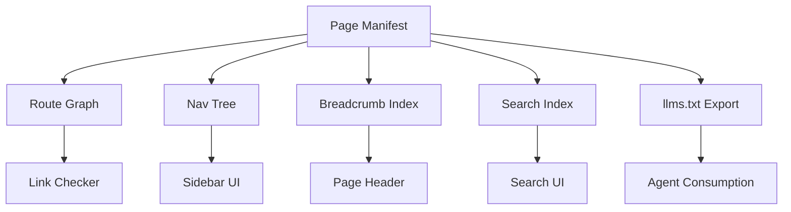
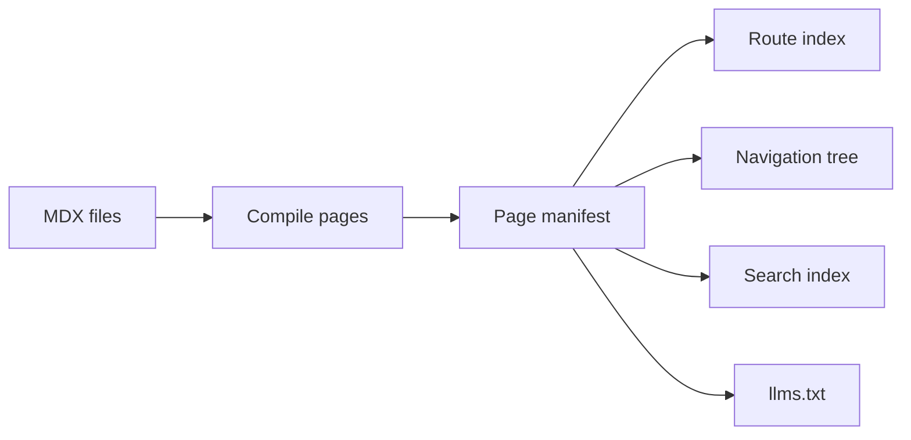
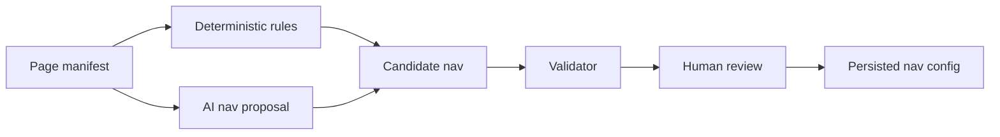
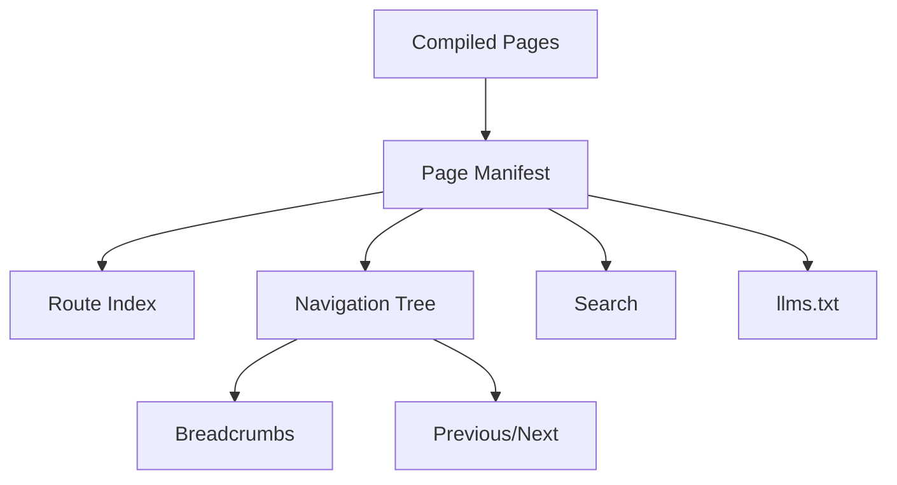

------
title: Build From Scratch: Mintlify-like AI-driven Documentation Generator CLI - Part 013
description: Mendesain navigation, sidebar, breadcrumbs, route graph, information architecture, orphan detection, generated/manual nav policy, dan strategi agar documentation generator menghasilkan docs yang bisa ditemukan, stabil, dan mudah dipelihara.
series: learn-mintlify-like-ai-docs-cli
seriesTitle: Build From Scratch: Mintlify-like AI-driven Documentation Generator CLI
order: 13
partTitle: Navigation, Sidebar, and Information Architecture
tags:
  - documentation
  - ai
  - cli
  - mdx
  - information-architecture
  - navigation
  - developer-tools
date: 2026-07-03
---

# Part 013 — Navigation, Sidebar, and Information Architecture

Kita sudah punya:

1. scanner,
2. classifier,
3. Content IR,
4. MDX authoring model,
5. MDX parser/compiler/diagnostics.

Sekarang kita masuk ke salah satu bagian yang paling sering diremehkan: **navigation dan information architecture**.

Banyak documentation generator bisa membuat halaman. Lebih sedikit yang bisa membuat dokumentasi yang **mudah ditemukan, masuk akal, stabil, dan tidak membusuk**.

Docs yang buruk biasanya bukan hanya karena tulisannya jelek. Sering kali penyebabnya adalah:

- halaman penting tersembunyi,
- sidebar tumbuh tanpa struktur,
- API reference bercampur dengan guide,
- halaman konsep bercampur dengan task,
- route berubah-ubah,
- internal link rusak,
- quickstart terlalu jauh dari overview,
- troubleshooting tidak punya tempat jelas,
- generated docs menimpa urutan manual,
- halaman orphan tidak terdeteksi,
- dan docs tidak punya mental model perjalanan pengguna.

Dalam sistem Mintlify-like, navigation bukan dekorasi UI. Navigation adalah **contract antara domain knowledge dan user journey**.

---

## 1. Mental model: docs site adalah graph, sidebar hanya satu projection

Sidebar bukan source of truth utama.

Docs site lebih tepat dimodelkan sebagai graph:



Halaman punya route, metadata, relation, source, dan kind. Sidebar hanyalah salah satu cara menampilkan sebagian graph tersebut.

Ini penting karena satu page bisa muncul dalam banyak konteks:

- di sidebar,
- di breadcrumb,
- di search,
- di related pages,
- di `llms.txt`,
- di API reference tree,
- di generated quickstart flow,
- di PR update impact report.

Kalau kita hanya berpikir "array menu sidebar", desain akan cepat buntu.

---

## 2. Tujuan information architecture

Information architecture harus menyelesaikan lima masalah.

### 2.1 Findability

User harus bisa menemukan jawaban dengan cepat.

Pertanyaan user biasanya berbentuk:

- "Bagaimana mulai?"
- "Bagaimana install?"
- "Bagaimana configure?"
- "Bagaimana deploy?"
- "Bagaimana pakai API X?"
- "Kenapa error ini terjadi?"
- "Apa arti konsep ini?"
- "Apa yang berubah dari versi lama?"

Navigation harus mendukung pertanyaan ini.

### 2.2 Orientation

User harus tahu sedang berada di mana.

Docs perlu:

- title jelas,
- breadcrumb,
- section structure,
- active sidebar state,
- previous/next links,
- related pages.

### 2.3 Progression

Docs harus punya alur belajar.

Contoh:

```txt
Overview -> Quickstart -> Concepts -> Guides -> Reference -> Troubleshooting
```

Bukan:

```txt
README -> Config.ts -> UserController -> random generated page -> OpenAPI
```

### 2.4 Stability

Route dan nav tidak boleh berubah setiap kali generator dijalankan.

Generated docs yang route-nya berubah-ubah akan merusak:

- bookmarks,
- search index,
- external links,
- SEO,
- docs PR diff,
- user trust.

### 2.5 Maintainability

Tim harus bisa menggabungkan:

- manual nav,
- generated nav,
- OpenAPI nav,
- code-derived nav,
- versioned docs,
- hidden/draft pages,
- redirects,
- deprecated pages.

---

## 3. Core entities

Kita butuh model eksplisit.

```ts
export type PageId = string & { readonly brand: unique symbol };
export type RoutePath = string & { readonly brand: unique symbol };

export type PageKind =
  | "overview"
  | "quickstart"
  | "concept"
  | "howTo"
  | "reference"
  | "apiReference"
  | "troubleshooting"
  | "migration"
  | "architecture"
  | "adr";

export type PageManifestEntry = {
  id: PageId;
  sourcePath: string;
  route: RoutePath;
  title: string;
  description: string;
  kind: PageKind;
  navTitle?: string;
  order?: number;
  tags: string[];
  generated: boolean;
  draft: boolean;
  hidden: boolean;
  canonical?: RoutePath;
  redirects?: RoutePath[];
};
```

Navigation node:

```ts
export type NavNode =
  | NavGroupNode
  | NavPageNode
  | NavLinkNode
  | NavGeneratedSectionNode;

export type NavGroupNode = {
  type: "group";
  title: string;
  children: NavNode[];
  collapsed?: boolean;
};

export type NavPageNode = {
  type: "page";
  pageId: PageId;
  title?: string;
};

export type NavLinkNode = {
  type: "link";
  title: string;
  href: string;
  external?: boolean;
};

export type NavGeneratedSectionNode = {
  type: "generatedSection";
  id: string;
  source: "apiReference" | "guides" | "concepts" | "troubleshooting";
  title: string;
  options?: Record<string, unknown>;
};
```

Route index:

```ts
export type RouteRecord = {
  pageId: PageId;
  route: RoutePath;
  sourcePath: string;
  title: string;
  anchors: Set<string>;
};

export type RouteIndex = {
  byRoute: Map<RoutePath, RouteRecord>;
  byPageId: Map<PageId, RouteRecord>;
  bySourcePath: Map<string, RouteRecord>;
};
```

---

## 4. Page manifest is the source of navigation truth

After compiling all MDX pages, we create a **page manifest**.

```json
{
  "pages": [
    {
      "id": "quickstart",
      "sourcePath": "docs/quickstart.mdx",
      "route": "/quickstart",
      "title": "Quickstart",
      "description": "Generate and preview documentation from a repository.",
      "kind": "quickstart",
      "order": 1,
      "generated": true,
      "draft": false,
      "hidden": false
    }
  ]
}
```

This manifest drives:

- route table,
- nav tree,
- breadcrumbs,
- previous/next,
- search index,
- `llms.txt`,
- link checker,
- static renderer.

Do not let each subsystem independently infer pages from filesystem. That creates divergence.

Correct flow:



---

## 5. Filesystem path vs route path

Filesystem path is not always route path.

Examples:

| Source path | Route |
|---|---|
| `docs/index.mdx` | `/` |
| `docs/quickstart.mdx` | `/quickstart` |
| `docs/guides/install.mdx` | `/guides/install` |
| `docs/api/users/create.mdx` | `/api/users/create` |
| `docs/reference/configuration.mdx` | `/reference/configuration` |

Route derivation:

```ts
export function routeFromSourcePath(docsRoot: string, sourcePath: string): RoutePath {
  const relative = normalizeRelativePath(docsRoot, sourcePath);

  const withoutExtension = relative.replace(/\.mdx?$/, "");

  if (withoutExtension === "index") {
    return "/" as RoutePath;
  }

  if (withoutExtension.endsWith("/index")) {
    return (`/${withoutExtension.slice(0, -"/index".length)}` || "/") as RoutePath;
  }

  return (`/${withoutExtension}`) as RoutePath;
}
```

Rules:

1. Use lowercase route segments by default for generated pages.
2. Preserve manual page paths unless migration is explicit.
3. Remove file extension.
4. Treat `index.mdx` as directory root.
5. Normalize duplicate slashes.
6. Do not expose absolute filesystem path.
7. Detect route collisions.

---

## 6. Route collision detection

Two files can map to same route.

Example:

```txt
docs/guides/install.mdx -> /guides/install
docs/guides/install/index.mdx -> /guides/install
```

Diagnostic:

```ts
export function validateRouteCollisions(entries: PageManifestEntry[]): Diagnostic[] {
  const byRoute = new Map<string, PageManifestEntry[]>();

  for (const entry of entries) {
    const existing = byRoute.get(entry.route) ?? [];
    existing.push(entry);
    byRoute.set(entry.route, existing);
  }

  const diagnostics: Diagnostic[] = [];

  for (const [route, routeEntries] of byRoute) {
    if (routeEntries.length <= 1) {
      continue;
    }

    diagnostics.push({
      code: "nav.route.collision",
      severity: "error",
      category: "structure",
      message: `Multiple pages resolve to the same route: ${route}.`,
      location: { path: routeEntries[0]!.sourcePath },
      related: routeEntries.slice(1).map((entry) => ({ path: entry.sourcePath })),
      hint: "Rename one page or configure an explicit route override.",
    });
  }

  return diagnostics;
}
```

Collision detection must happen before static build.

---

## 7. Navigation modes

Support three nav modes.

### 7.1 Explicit mode

User controls all navigation.

```json
{
  "navigation": [
    {
      "type": "group",
      "title": "Get started",
      "children": [
        { "type": "page", "path": "index.mdx" },
        { "type": "page", "path": "quickstart.mdx" }
      ]
    }
  ]
}
```

Pros:

- predictable,
- human-controlled,
- best for mature docs.

Cons:

- manual maintenance,
- generated pages may be omitted accidentally.

### 7.2 Inferred mode

Generator builds nav from pages.

Pros:

- works with minimal config,
- good for scaffolding,
- useful for generated API reference.

Cons:

- may not match product intent,
- can create awkward order,
- can be unstable if not carefully designed.

### 7.3 Hybrid mode

Manual nav with generated sections.

```json
{
  "navigation": [
    {
      "type": "group",
      "title": "Start here",
      "children": [
        { "type": "page", "path": "index.mdx" },
        { "type": "page", "path": "quickstart.mdx" }
      ]
    },
    {
      "type": "generatedSection",
      "id": "api-reference",
      "source": "apiReference",
      "title": "API Reference"
    }
  ]
}
```

Recommended default: **hybrid**.

Manual pages define learning path. Generated sections keep high-volume reference material fresh.

---

## 8. Navigation config schema

Minimal config:

```ts
export const NavPageNodeSchema = z.object({
  type: z.literal("page"),
  path: z.string().min(1),
  title: z.string().optional(),
});

export const NavLinkNodeSchema = z.object({
  type: z.literal("link"),
  title: z.string().min(1),
  href: z.string().min(1),
  external: z.boolean().optional(),
});

export const NavGeneratedSectionNodeSchema = z.object({
  type: z.literal("generatedSection"),
  id: z.string().min(1),
  source: z.enum(["apiReference", "guides", "concepts", "troubleshooting"]),
  title: z.string().min(1),
  options: z.record(z.unknown()).optional(),
});

export type NavNodeInput =
  | z.infer<typeof NavPageNodeSchema>
  | z.infer<typeof NavLinkNodeSchema>
  | z.infer<typeof NavGeneratedSectionNodeSchema>
  | {
      type: "group";
      title: string;
      collapsed?: boolean;
      children: NavNodeInput[];
    };
```

Recursive schema in Zod:

```ts
export const NavNodeSchema: z.ZodType<NavNodeInput> = z.lazy(() =>
  z.discriminatedUnion("type", [
    NavPageNodeSchema,
    NavLinkNodeSchema,
    NavGeneratedSectionNodeSchema,
    z.object({
      type: z.literal("group"),
      title: z.string().min(1),
      collapsed: z.boolean().optional(),
      children: z.array(NavNodeSchema),
    }),
  ])
);
```

Full config:

```ts
export const NavigationSchema = z.array(NavNodeSchema);
```

---

## 9. Resolve configured nav

Config references source paths or route paths. Choose one primary form.

Recommended:

- use source path for manual page references,
- generator resolves to `pageId`,
- final nav tree uses `pageId`.

Why source path?

Because humans edit files and think in file paths. Routes can be derived.

Resolver:

```ts
export function resolveNavigation(
  input: NavNodeInput[],
  manifest: PageManifest
): ResolvedNavigation {
  const diagnostics: Diagnostic[] = [];
  const nodes = input.map((node) => resolveNavNode(node, manifest, diagnostics));

  return {
    nodes: nodes.filter(Boolean) as NavNode[],
    diagnostics,
  };
}
```

Page resolver:

```ts
function resolvePageNode(
  node: { path: string; title?: string },
  manifest: PageManifest,
  diagnostics: Diagnostic[]
): NavPageNode | undefined {
  const page = manifest.bySourcePath.get(normalizePath(node.path));

  if (!page) {
    diagnostics.push({
      code: "nav.page.notFound",
      severity: "error",
      category: "structure",
      message: `Navigation references a page that does not exist: ${node.path}.`,
      location: { path: "docforge.config.json" },
      hint: "Check the path or remove the nav entry.",
    });
    return undefined;
  }

  return {
    type: "page",
    pageId: page.id,
    title: node.title,
  };
}
```

---

## 10. Inferred navigation

When no navigation config exists, generate a sensible nav.

Input:

- page manifest,
- page kind,
- order,
- path,
- title,
- tags,
- generated/manual flag.

Default group order:

```ts
const DEFAULT_KIND_GROUPS: Array<{
  title: string;
  kinds: PageKind[];
}> = [
  { title: "Start here", kinds: ["overview", "quickstart"] },
  { title: "Concepts", kinds: ["concept", "architecture"] },
  { title: "Guides", kinds: ["howTo"] },
  { title: "Reference", kinds: ["reference"] },
  { title: "API Reference", kinds: ["apiReference"] },
  { title: "Troubleshooting", kinds: ["troubleshooting"] },
  { title: "Migration", kinds: ["migration"] },
  { title: "Decisions", kinds: ["adr"] },
];
```

Algorithm:

```ts
export function inferNavigation(manifest: PageManifest): NavNode[] {
  const visiblePages = manifest.pages.filter((page) => !page.hidden && !page.draft);

  const groups: NavGroupNode[] = [];

  for (const group of DEFAULT_KIND_GROUPS) {
    const pages = visiblePages
      .filter((page) => group.kinds.includes(page.kind))
      .sort(comparePagesForNav);

    if (pages.length === 0) {
      continue;
    }

    groups.push({
      type: "group",
      title: group.title,
      children: pages.map((page) => ({
        type: "page",
        pageId: page.id,
      })),
    });
  }

  return groups;
}
```

Sort:

```ts
export function comparePagesForNav(a: PageManifestEntry, b: PageManifestEntry): number {
  if (a.order != null && b.order != null) {
    return a.order - b.order;
  }

  if (a.order != null) return -1;
  if (b.order != null) return 1;

  return a.route.localeCompare(b.route);
}
```

Stability rule:

- Do not use file modified time.
- Do not use AI-generated ranking without persisting result.
- Do not use nondeterministic filesystem order.
- Always sort deterministically.

---

## 11. Generated section expansion

A `generatedSection` expands into nav nodes.

Example config:

```json
{
  "type": "generatedSection",
  "id": "api-reference",
  "source": "apiReference",
  "title": "API Reference",
  "options": {
    "groupBy": "tag"
  }
}
```

Expansion:

```ts
export function expandGeneratedSection(
  node: NavGeneratedSectionNode,
  manifest: PageManifest
): NavGroupNode {
  const pages = manifest.pages.filter((page) => {
    if (node.source === "apiReference") {
      return page.kind === "apiReference";
    }

    if (node.source === "guides") {
      return page.kind === "howTo";
    }

    if (node.source === "concepts") {
      return page.kind === "concept";
    }

    if (node.source === "troubleshooting") {
      return page.kind === "troubleshooting";
    }

    return false;
  });

  return {
    type: "group",
    title: node.title,
    children: groupGeneratedPages(node, pages),
  };
}
```

For API reference, simple flat list is often bad. Group by OpenAPI tags if available.

---

## 12. API reference navigation

API reference has special structure.

Possible grouping strategies:

| Strategy | When useful |
|---|---|
| Group by OpenAPI tag | Default for public APIs |
| Group by path prefix | Useful when tags are missing |
| Group by resource | Useful for REST resources |
| Group by service | Useful for multi-service APIs |
| Flat | Small APIs only |

OpenAPI-derived page metadata:

```ts
export type ApiPageMetadata = {
  operationId: string;
  method: string;
  path: string;
  tags: string[];
  resource?: string;
};
```

Nav title strategy:

```ts
export function apiNavTitle(api: ApiPageMetadata, title: string): string {
  if (api.operationId) {
    return title;
  }

  return `${api.method.toUpperCase()} ${api.path}`;
}
```

Group by tag:

```ts
export function groupApiPagesByTag(pages: ApiPage[]): NavNode[] {
  const byTag = new Map<string, ApiPage[]>();

  for (const page of pages) {
    const tag = page.api.tags[0] ?? "Other";
    const group = byTag.get(tag) ?? [];
    group.push(page);
    byTag.set(tag, group);
  }

  return [...byTag.entries()]
    .sort(([a], [b]) => a.localeCompare(b))
    .map(([tag, tagPages]) => ({
      type: "group",
      title: tag,
      children: tagPages
        .sort(compareApiOperations)
        .map((page) => ({ type: "page", pageId: page.id })),
    }));
}
```

Sort API operations:

```ts
const METHOD_ORDER = ["GET", "POST", "PUT", "PATCH", "DELETE"];

export function compareApiOperations(a: ApiPage, b: ApiPage): number {
  const pathCompare = a.api.path.localeCompare(b.api.path);

  if (pathCompare !== 0) {
    return pathCompare;
  }

  return METHOD_ORDER.indexOf(a.api.method) - METHOD_ORDER.indexOf(b.api.method);
}
```

---

## 13. Navigation quality rules

Navigation needs diagnostics.

| Rule | Code | Severity |
|---|---|---|
| Nav references missing page | `nav.page.notFound` | error |
| Page appears twice in nav | `nav.page.duplicate` | warning/error |
| Visible page not in nav | `nav.page.orphan` | warning |
| Empty group | `nav.group.empty` | warning |
| Group too large | `nav.group.tooLarge` | warning |
| Generated section empty | `nav.generatedSection.empty` | warning |
| Draft page in production nav | `nav.page.draftInProduction` | error |
| Hidden page in nav | `nav.page.hiddenInNav` | warning/error |
| External link unsafe | `nav.link.unsafe` | error |
| Duplicate nav title in same group | `nav.title.duplicateSibling` | warning |

Duplicate nav page:

```ts
export function validateNoDuplicateNavPages(nav: NavNode[]): Diagnostic[] {
  const seen = new Map<PageId, NavPageNode>();
  const diagnostics: Diagnostic[] = [];

  for (const pageNode of flattenNavPages(nav)) {
    const existing = seen.get(pageNode.pageId);

    if (existing) {
      diagnostics.push({
        code: "nav.page.duplicate",
        severity: "warning",
        category: "structure",
        message: `Page appears more than once in navigation.`,
        hint: "Keep duplicate nav entries only if the page intentionally belongs to multiple contexts.",
      });
    }

    seen.set(pageNode.pageId, pageNode);
  }

  return diagnostics;
}
```

---

## 14. Orphan detection

A page is orphan if:

- visible,
- not draft,
- not hidden,
- no nav reference,
- and not reachable by generated section.

```ts
export function findOrphanPages(
  manifest: PageManifest,
  nav: NavNode[]
): PageManifestEntry[] {
  const referenced = new Set<PageId>();

  for (const node of flattenNavPages(nav)) {
    referenced.add(node.pageId);
  }

  return manifest.pages.filter((page) => {
    return !page.hidden &&
      !page.draft &&
      !referenced.has(page.id);
  });
}
```

Diagnostic:

```ts
{
  code: "nav.page.orphan",
  severity: "warning",
  category: "structure",
  message: `Visible page is not included in navigation: ${page.sourcePath}.`,
  location: { path: page.sourcePath },
  hint: "Add the page to navigation, mark it hidden, or include it through a generated section.",
}
```

Not all orphan pages are bad. Some pages may be only search-accessible. But if that is intentional, mark them hidden or configure a policy.

---

## 15. Breadcrumbs

Breadcrumbs help orientation.

For nav-based breadcrumb:

```txt
Start here / Quickstart
```

For route-based breadcrumb:

```txt
Guides / API Reference / Create User
```

Nav-based breadcrumb is better when route hierarchy is not enough.

Build breadcrumb index:

```ts
export type BreadcrumbItem = {
  title: string;
  route?: RoutePath;
};

export type BreadcrumbIndex = Map<PageId, BreadcrumbItem[]>;

export function buildBreadcrumbIndex(
  nav: NavNode[],
  manifest: PageManifest
): BreadcrumbIndex {
  const index: BreadcrumbIndex = new Map();

  function visit(nodes: NavNode[], ancestors: BreadcrumbItem[]) {
    for (const node of nodes) {
      if (node.type === "group") {
        visit(node.children, [
          ...ancestors,
          { title: node.title },
        ]);
      }

      if (node.type === "page") {
        const page = manifest.byPageId.get(node.pageId);
        if (!page) continue;

        index.set(node.pageId, [
          ...ancestors,
          {
            title: node.title ?? page.navTitle ?? page.title,
            route: page.route,
          },
        ]);
      }
    }
  }

  visit(nav, []);

  return index;
}
```

If a page appears twice in nav, breadcrumbs become ambiguous. You can either:

1. choose first occurrence,
2. support multiple breadcrumbs,
3. disallow duplicate page in nav.

Recommended early version: warn on duplicates and use first occurrence.

---

## 16. Previous and next links

Previous/next helps guided progression.

Flatten nav pages in order:

```ts
export function flattenNavPageOrder(nav: NavNode[]): PageId[] {
  const ids: PageId[] = [];

  function visit(nodes: NavNode[]) {
    for (const node of nodes) {
      if (node.type === "page") {
        ids.push(node.pageId);
      }

      if (node.type === "group") {
        visit(node.children);
      }
    }
  }

  visit(nav);
  return ids;
}
```

Build:

```ts
export type PrevNext = {
  previous?: PageId;
  next?: PageId;
};

export function buildPrevNextIndex(nav: NavNode[]): Map<PageId, PrevNext> {
  const order = flattenNavPageOrder(nav);
  const index = new Map<PageId, PrevNext>();

  for (let i = 0; i < order.length; i++) {
    index.set(order[i]!, {
      previous: order[i - 1],
      next: order[i + 1],
    });
  }

  return index;
}
```

Rule:

- Prev/next follows nav order, not filesystem order.
- Hidden pages should not get prev/next unless explicitly enabled.
- API reference may disable prev/next if too large.

---

## 17. Related pages

Related pages are not same as nav.

They can be derived from:

- explicit frontmatter,
- shared tags,
- same OpenAPI tag,
- same code symbol,
- link graph,
- manual config,
- AI recommendation with validation.

Simple model:

```ts
export type RelatedPage = {
  pageId: PageId;
  reason: "sameTag" | "sameApiTag" | "explicit" | "linked" | "generated";
  score: number;
};
```

Do not overuse AI here. A deterministic related-page system is often better.

Algorithm:

```ts
export function findRelatedPages(
  page: PageManifestEntry,
  manifest: PageManifest
): RelatedPage[] {
  const related: RelatedPage[] = [];

  for (const candidate of manifest.pages) {
    if (candidate.id === page.id) {
      continue;
    }

    const sharedTags = intersection(page.tags, candidate.tags);

    if (sharedTags.length > 0) {
      related.push({
        pageId: candidate.id,
        reason: "sameTag",
        score: sharedTags.length,
      });
    }
  }

  return related
    .sort((a, b) => b.score - a.score)
    .slice(0, 5);
}
```

---

## 18. URL stability and redirects

Generated docs must not casually change routes.

When title changes:

```txt
"Generate API Docs" -> "Generate API Reference"
```

Route should not automatically change from:

```txt
/guides/generate-api-docs
```

to:

```txt
/guides/generate-api-reference
```

unless user requests migration.

Route identity should come from:

- explicit path,
- stable page ID,
- OpenAPI operation ID,
- managed generated route map,
- or route lock file.

Generated route map:

```json
{
  "api:createUser": "/api/users/create-user",
  "guide:install": "/guides/install"
}
```

When generator wants new route:

```ts
export function resolveStableGeneratedRoute(
  generatedId: string,
  proposedRoute: string,
  routeLock: RouteLock
): string {
  const existing = routeLock.routes[generatedId];

  if (existing) {
    return existing;
  }

  routeLock.routes[generatedId] = proposedRoute;
  return proposedRoute;
}
```

Redirects:

```ts
export type Redirect = {
  from: RoutePath;
  to: RoutePath;
  status: 301 | 302 | 307 | 308;
};
```

If user intentionally renames route, emit redirect.

---

## 19. Canonical pages

Sometimes same content appears in multiple routes or versions.

Canonical field:

```yaml
canonical: /reference/configuration
```

Use cases:

- alias pages,
- deprecated paths,
- versioned docs,
- generated API docs with old route,
- migration pages.

Rules:

1. Canonical route must exist.
2. A page should not canonical to itself unnecessarily.
3. Canonical loops are invalid.
4. Search index should prefer canonical.
5. `llms.txt` should avoid duplicate canonical content unless versioned.

---

## 20. Draft and hidden pages

Draft:

```yaml
draft: true
```

Hidden:

```yaml
hidden: true
```

Difference:

| Field | Meaning |
|---|---|
| `draft` | Not ready for production. |
| `hidden` | Published but not shown in nav. |

Production behavior:

| Page state | Render? | Nav? | Search? |
|---|---|---|---|
| normal | yes | yes if nav includes | yes |
| hidden | yes | no | maybe |
| draft | no by default | no | no |
| draft + preview | yes in dev | no | no |

Config:

```json
{
  "drafts": {
    "includeInDev": true,
    "includeInProduction": false
  },
  "hiddenPages": {
    "includeInSearch": false
  }
}
```

---

## 21. Versioned docs

Even if we do not implement full versioning now, IA should not block it.

Possible route structure:

```txt
/v1/quickstart
/v2/quickstart
```

Version model:

```ts
export type DocsVersion = {
  id: string;
  label: string;
  root: string;
  default?: boolean;
  deprecated?: boolean;
};
```

Page manifest entry may include:

```ts
version?: string;
```

Navigation can be per-version:

```ts
export type VersionedNavigation = {
  version: string;
  nodes: NavNode[];
};
```

Do not implement too early, but avoid hardcoding single global nav assumptions in all APIs.

---

## 22. Multi-product or multi-package docs

For monorepos, docs may cover multiple packages/services.

Possible top-level grouping:

```txt
Start here
Packages
  CLI
  SDK
  Server
API Reference
  Admin API
  Public API
```

Page metadata:

```ts
export type PageManifestEntry = {
  packageName?: string;
  serviceName?: string;
  owner?: string;
  // ...
};
```

Generated section options:

```json
{
  "type": "generatedSection",
  "source": "apiReference",
  "title": "API Reference",
  "options": {
    "groupBy": ["service", "tag"]
  }
}
```

Avoid forcing all docs into one flat product model.

---

## 23. IA patterns for developer docs

### 23.1 Small library

```txt
Overview
Quickstart
Guides
  Installation
  Basic usage
  Configuration
Reference
  CLI
  Config
Troubleshooting
```

### 23.2 API product

```txt
Start here
  Overview
  Quickstart
  Authentication
Guides
  Create your first resource
  Pagination
  Errors
API Reference
  Users
  Projects
  Webhooks
SDKs
  JavaScript
  Python
Troubleshooting
```

### 23.3 Internal platform

```txt
Overview
Concepts
  Architecture
  Environments
  Ownership model
Guides
  Local setup
  Deploy service
  Add config
Reference
  CLI
  Config
  Policies
Runbooks
  Incident response
  Rollback
```

### 23.4 AI-driven docs generator itself

For our own product:

```txt
Start here
  Overview
  Quickstart
  Installation
Concepts
  Source artifacts
  Content IR
  MDX pipeline
  Provenance
Guides
  Generate docs from a repo
  Generate API reference
  Configure navigation
Reference
  CLI commands
  Config schema
  Components
API Reference
Troubleshooting
```

---

## 24. AI-assisted navigation planning

AI can help propose nav, but should not be the final authority.

Safe pattern:



AI output should be structured:

```ts
export const AiNavProposalSchema = z.object({
  groups: z.array(z.object({
    title: z.string(),
    pageIds: z.array(z.string()),
    rationale: z.string(),
  })),
  diagnostics: z.array(z.object({
    message: z.string(),
    severity: z.enum(["info", "warning"]),
  })),
});
```

Rules:

1. AI can propose grouping.
2. AI cannot invent page IDs.
3. AI cannot reference pages not in manifest.
4. AI cannot silently change stable routes.
5. Human review or config persistence required.
6. Validator must catch orphan/duplicate/missing pages.

---

## 25. Navigation planning prompt contract

Prompt should provide:

- list of pages,
- page kinds,
- titles,
- descriptions,
- tags,
- source categories,
- existing nav if any,
- product goal,
- constraints.

Prompt rules:

```text
Return only JSON matching the schema.
Use only page IDs from the provided list.
Do not invent pages.
Do not change routes.
Prefer task-oriented grouping.
Keep Start here short.
Put high-volume API reference under a generated section if possible.
If a page is low-confidence, include it in diagnostics instead of guessing.
```

But again: AI result is proposal, not direct write.

---

## 26. Nav rendering model

Renderer receives resolved nav tree.

```ts
export type RenderNavNode =
  | {
      type: "group";
      title: string;
      collapsed?: boolean;
      children: RenderNavNode[];
    }
  | {
      type: "page";
      title: string;
      route: RoutePath;
      active?: boolean;
    }
  | {
      type: "link";
      title: string;
      href: string;
      external?: boolean;
    };
```

Convert:

```ts
export function toRenderNav(
  nav: NavNode[],
  manifest: PageManifest,
  activeRoute: RoutePath
): RenderNavNode[] {
  return nav.map((node) => {
    if (node.type === "group") {
      return {
        type: "group",
        title: node.title,
        collapsed: node.collapsed,
        children: toRenderNav(node.children, manifest, activeRoute),
      };
    }

    if (node.type === "page") {
      const page = manifest.byPageId.get(node.pageId)!;

      return {
        type: "page",
        title: node.title ?? page.navTitle ?? page.title,
        route: page.route,
        active: page.route === activeRoute,
      };
    }

    return node;
  });
}
```

Renderer should not resolve paths itself. It receives ready-to-render data.

---

## 27. Navigation serialization

Static site build needs nav manifest.

`dist/nav.json`:

```json
{
  "items": [
    {
      "type": "group",
      "title": "Start here",
      "children": [
        {
          "type": "page",
          "title": "Overview",
          "route": "/"
        },
        {
          "type": "page",
          "title": "Quickstart",
          "route": "/quickstart"
        }
      ]
    }
  ]
}
```

Page manifest:

`dist/page-manifest.json`:

```json
{
  "pages": [
    {
      "id": "quickstart",
      "route": "/quickstart",
      "sourcePath": "docs/quickstart.mdx",
      "title": "Quickstart",
      "description": "Generate and preview documentation from a repository."
    }
  ]
}
```

These artifacts are useful for:

- client-side nav,
- search,
- static renderer,
- debugging,
- external integrations.

---

## 28. Diagnostics for IA

A user-facing CLI should print IA diagnostics clearly.

Example:

```txt
warning nav.page.orphan docs/guides/deploy.mdx
Visible page is not included in navigation.

Hint:
Add it to navigation, mark it hidden, or include it through a generated section.
```

Example:

```txt
error nav.page.notFound docforge.config.json
Navigation references a page that does not exist: docs/setup.mdx.

Hint:
Check the path or remove the nav entry.
```

Example:

```txt
warning nav.group.tooLarge docforge.config.json
Group "Guides" contains 42 pages.

Hint:
Split the group into smaller task-oriented groups.
```

---

## 29. IA quality gates

Suggested production checks:

| Check | Default |
|---|---|
| Missing nav target | error |
| Duplicate route | error |
| Draft page in nav | error |
| Hidden page in nav | warning |
| Orphan visible page | warning |
| Empty group | warning |
| Broken previous/next | error |
| Duplicate sibling title | warning |
| API generated section empty | warning |
| No quickstart page | warning for product docs |

No quickstart diagnostic:

```ts
export function validateHasQuickstart(manifest: PageManifest): Diagnostic[] {
  const hasQuickstart = manifest.pages.some((page) => page.kind === "quickstart");

  if (hasQuickstart) {
    return [];
  }

  return [{
    code: "nav.ia.missingQuickstart",
    severity: "warning",
    category: "structure",
    message: "Documentation has no quickstart page.",
    hint: "Add a quickstart page that gives users the shortest path to a working result.",
  }];
}
```

---

## 30. Implementation package

Create:

```txt
packages/navigation/
  src/
    page-manifest.ts
    route.ts
    route-index.ts
    nav-schema.ts
    nav-resolve.ts
    nav-infer.ts
    generated-sections.ts
    breadcrumbs.ts
    prev-next.ts
    related.ts
    redirects.ts
    diagnostics.ts
    render-nav.ts
    __tests__/
      route.test.ts
      nav-resolve.test.ts
      nav-infer.test.ts
      breadcrumbs.test.ts
      orphan-pages.test.ts
```

Core exports:

```ts
export * from "./page-manifest";
export * from "./route";
export * from "./route-index";
export * from "./nav-schema";
export * from "./nav-resolve";
export * from "./nav-infer";
export * from "./breadcrumbs";
export * from "./prev-next";
export * from "./render-nav";
```

---

## 31. Integration with compiler

Compiler outputs enough information to build manifest.

```ts
export function manifestEntryFromCompileResult(
  result: CompilePageResult
): PageManifestEntry | undefined {
  if (!result.frontmatter) {
    return undefined;
  }

  return {
    id: pageIdFromPath(result.path),
    sourcePath: result.path,
    route: routeFromSourcePath("docs", result.path),
    title: result.frontmatter.title,
    description: result.frontmatter.description,
    kind: result.frontmatter.kind,
    navTitle: result.frontmatter.navTitle,
    order: result.frontmatter.order,
    tags: result.frontmatter.tags ?? [],
    generated: result.frontmatter.generated ?? false,
    draft: result.frontmatter.draft ?? false,
    hidden: result.frontmatter.hidden ?? false,
  };
}
```

Build pipeline:

```ts
const compileResult = await compileSite(...);

const manifest = buildPageManifest(compileResult.pages);

const navResult = config.navigation
  ? resolveNavigation(config.navigation, manifest)
  : { nodes: inferNavigation(manifest), diagnostics: [] };

const expandedNav = expandGeneratedSections(navResult.nodes, manifest);

const navDiagnostics = validateNavigation(expandedNav, manifest);

const breadcrumbs = buildBreadcrumbIndex(expandedNav, manifest);
const prevNext = buildPrevNextIndex(expandedNav);
```

---

## 32. Integration with static renderer

Renderer input:

```ts
export type RenderSiteInput = {
  pages: CompiledPage[];
  manifest: PageManifest;
  navigation: RenderNavNode[];
  breadcrumbs: BreadcrumbIndex;
  prevNext: Map<PageId, PrevNext>;
};
```

For each page:

```ts
export type RenderPageContext = {
  page: PageManifestEntry;
  nav: RenderNavNode[];
  breadcrumbs: BreadcrumbItem[];
  previous?: PageManifestEntry;
  next?: PageManifestEntry;
};
```

The page component does not compute IA. It renders IA.

This separation keeps renderer simple.

---

## 33. Testing navigation

### 33.1 Route tests

```ts
it("maps docs/index.mdx to root route", () => {
  expect(routeFromSourcePath("docs", "docs/index.mdx")).toBe("/");
});

it("maps nested index to directory route", () => {
  expect(routeFromSourcePath("docs", "docs/guides/index.mdx")).toBe("/guides");
});
```

### 33.2 Collision tests

```ts
it("detects route collisions", () => {
  const diagnostics = validateRouteCollisions([
    page({ sourcePath: "docs/a.mdx", route: "/a" }),
    page({ sourcePath: "docs/a/index.mdx", route: "/a" }),
  ]);

  expect(diagnostics).toContainEqual(
    expect.objectContaining({ code: "nav.route.collision" })
  );
});
```

### 33.3 Orphan tests

```ts
it("warns when visible page is not in nav", () => {
  const manifest = manifestWithPages([
    page({ id: "quickstart", hidden: false, draft: false }),
  ]);

  const diagnostics = validateOrphans(manifest, []);

  expect(diagnostics).toContainEqual(
    expect.objectContaining({ code: "nav.page.orphan" })
  );
});
```

### 33.4 Generated section tests

```ts
it("expands api reference generated section", () => {
  const nav = expandGeneratedSection({
    type: "generatedSection",
    id: "api",
    source: "apiReference",
    title: "API Reference",
  }, manifestWithApiPages());

  expect(nav.children.length).toBeGreaterThan(0);
});
```

---

## 34. Failure modes

| Failure | Cause | Prevention |
|---|---|---|
| Sidebar changes every run | Nondeterministic sort or AI direct output | Stable ordering and persisted nav config |
| Page exists but unreachable | No orphan detection | Nav quality gate |
| API reference unusable | Flat hundreds of endpoints | Generated section grouping |
| Broken breadcrumbs | Duplicate page locations | Breadcrumb index and duplicate diagnostics |
| Route collision | Path mapping ambiguity | Route collision validation |
| External links in nav unsafe | No URL validation | URL safety checks |
| Human nav overwritten | Generator owns full config | Hybrid nav with generated sections |
| Search and nav disagree | Each subsystem scans files independently | Page manifest as shared source |
| Bad route rename breaks links | Route derived from title every run | Route lock/canonical/redirects |

---

## 35. Key takeaways

Navigation is not a sidebar array.

It is a projection of a deeper model:



A top-tier docs generator must treat IA as a first-class subsystem because it determines whether generated content is usable.

The rules are:

1. Build a page manifest.
2. Derive a route index.
3. Support explicit, inferred, and hybrid navigation.
4. Expand generated sections deterministically.
5. Detect orphan, duplicate, missing, draft, and hidden page issues.
6. Keep routes stable.
7. Render nav from resolved data, not raw config.
8. Let AI propose IA, but validate and persist before applying.

Next, we build the **local dev server and hot reload loop**.
