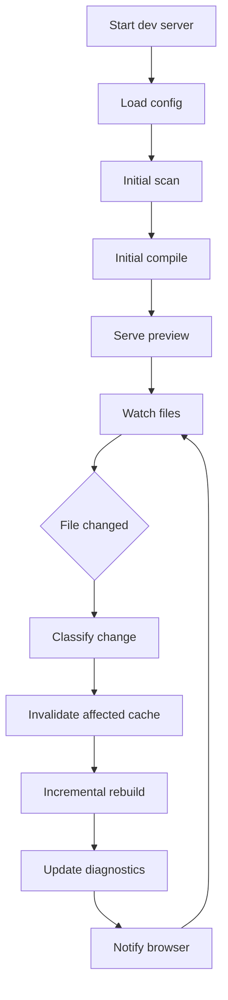
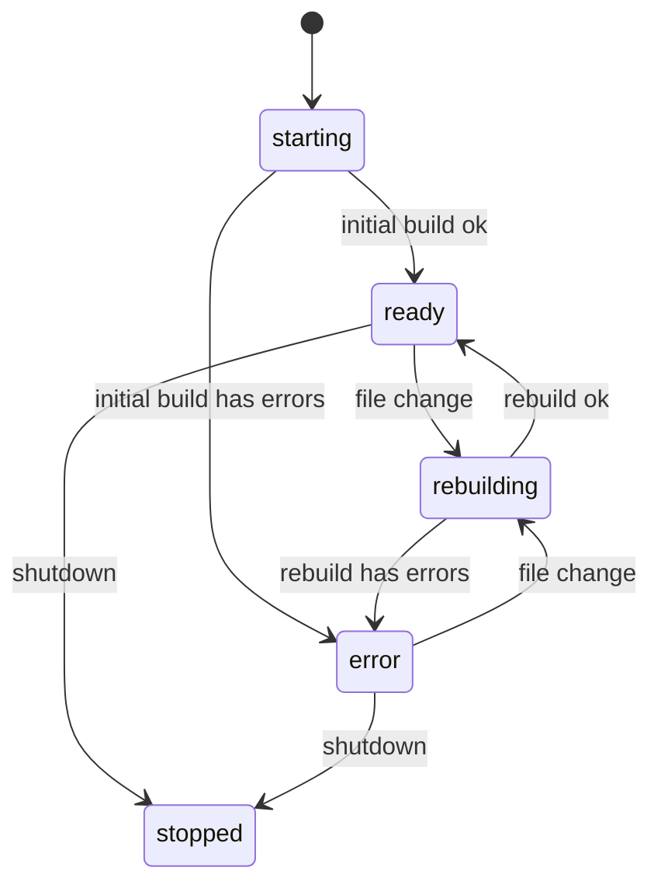
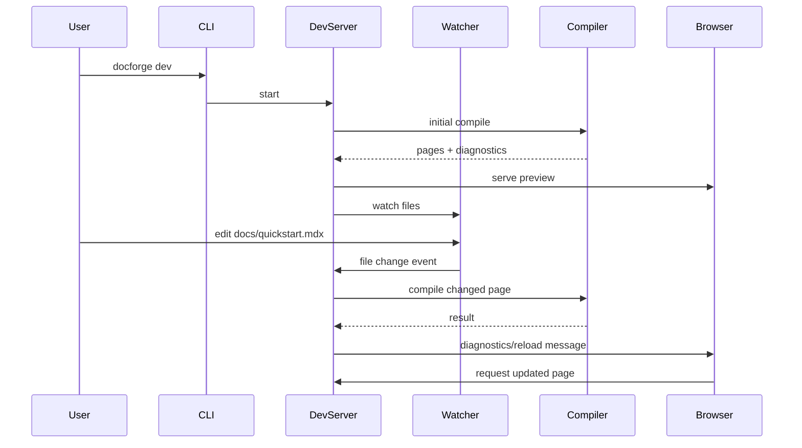
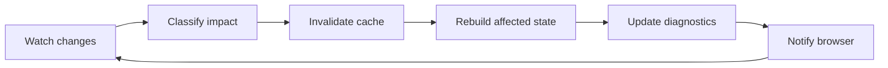

------
title: Build From Scratch: Mintlify-like AI-driven Documentation Generator CLI - Part 014
description: Membangun local dev server untuk documentation generator: watch mode, incremental rebuild, route serving, diagnostics overlay, hot reload boundary, cache invalidation, concurrency control, dan failure recovery.
series: learn-mintlify-like-ai-docs-cli
seriesTitle: Build From Scratch: Mintlify-like AI-driven Documentation Generator CLI
order: 14
partTitle: Local Dev Server and Hot Reload
tags:
  - documentation
  - ai
  - cli
  - mdx
  - dev-server
  - hot-reload
  - developer-tools
date: 2026-07-03
---

# Part 014 — Local Dev Server and Hot Reload

Sekarang kita membangun pengalaman yang membuat tool terasa nyata: **local dev server**.

Command-nya kelihatan sederhana:

```bash
docforge dev
```

Tetapi di balik itu ada banyak keputusan arsitektur:

- membaca config,
- scan docs dan source,
- compile MDX,
- build navigation,
- serve static assets,
- watch file changes,
- incremental rebuild,
- preserve state,
- render diagnostics,
- reload browser,
- recover from errors,
- dan tidak membunuh proses setiap kali user salah ketik.

Dev server adalah tempat pertama user merasakan kualitas developer tool.

Kalau `dev` lambat, sering crash, error-nya tidak jelas, atau harus restart manual, user akan kehilangan trust sebelum sampai ke fitur AI.

---

## 1. Mental model: dev server adalah long-running compiler

`docforge build` adalah batch compiler.

`docforge dev` adalah compiler yang hidup terus.



Perbedaannya:

| Concern | `build` | `dev` |
|---|---|---|
| Lifecycle | One-shot | Long-running |
| Error handling | Fail and exit | Report and keep running |
| Output | Static files | In-memory or temp output |
| Watch | No | Yes |
| Reload | No | Yes |
| Performance goal | Total build time | Incremental latency |
| UX | CI-friendly | Human-friendly |

---

## 2. Goals

Dev server harus memenuhi tujuan berikut.

### 2.1 Fast feedback

Perubahan kecil harus cepat terlihat.

Target mental:

- edit satu MDX page → recompiles one page,
- edit config nav → rebuild nav/site shell,
- edit theme component → reload renderer,
- edit source code scanned for docs → update affected generated previews or mark stale,
- edit OpenAPI spec → rebuild API reference section.

### 2.2 Error resilience

Satu file rusak tidak boleh membunuh server.

Instead:

- keep server alive,
- show diagnostics,
- render error overlay,
- recover automatically after fix.

### 2.3 Deterministic state

Dev server should not become a magic mutable process.

Internal state should be inspectable:

- current config,
- page manifest,
- route index,
- diagnostics,
- cache entries,
- watched files,
- last build summary.

### 2.4 Safe defaults

Dev server should not:

- execute arbitrary code examples by default,
- send repo content to AI without explicit command/config,
- expose server beyond localhost unless configured,
- write generated files unexpectedly,
- publish or deploy.

---

## 3. Command contract

CLI:

```bash
docforge dev
```

Options:

```bash
docforge dev --host 127.0.0.1
docforge dev --port 3000
docforge dev --open
docforge dev --strict
docforge dev --no-cache
docforge dev --log-level debug
docforge dev --format pretty
docforge dev --watch-poll
```

Suggested semantics:

| Option | Meaning |
|---|---|
| `--host` | Host bind address. Default `127.0.0.1`. |
| `--port` | Preferred port. If busy, either fail or auto-pick by config. |
| `--open` | Open browser after successful start. |
| `--strict` | Treat warnings as errors in dev. |
| `--no-cache` | Disable persistent cache. |
| `--watch-poll` | Use polling watcher for environments where native FS events fail. |
| `--log-level` | Debug internal server events. |

Default host should be localhost for safety.

---

## 4. Dev server package layout

```txt
packages/dev-server/
  src/
    dev-command.ts
    dev-server.ts
    state.ts
    watcher.ts
    change-classifier.ts
    incremental-builder.ts
    route-server.ts
    websocket.ts
    diagnostics-overlay.ts
    file-cache.ts
    port.ts
    open-browser.ts
    __tests__/
      change-classifier.test.ts
      incremental-builder.test.ts
      dev-state.test.ts
```

Dependencies from previous packages:

```txt
config -> scanner -> classifier -> mdx-compiler -> navigation -> renderer
```

Dev server coordinates packages. It should not duplicate their logic.

---

## 5. Dev server state

Define explicit state.

```ts
export type DevServerStatus =
  | "starting"
  | "ready"
  | "rebuilding"
  | "error"
  | "stopped";

export type DevServerState = {
  status: DevServerStatus;
  projectRoot: string;
  configPath?: string;
  config?: NormalizedConfig;
  pages: Map<string, CompilePageResult>;
  manifest?: PageManifest;
  navigation?: NavNode[];
  routeIndex?: RouteIndex;
  diagnostics: Diagnostic[];
  lastBuild?: BuildSummary;
  startedAt: number;
  lastUpdatedAt: number;
};
```

State transitions:



Important: `error` does not mean process crashed. It means current docs state has build errors.

---

## 6. Initial startup pipeline

Pseudo:

```ts
export async function runDevCommand(args: DevArgs): Promise<void> {
  const projectRoot = resolveProjectRoot(args.cwd);

  const configResult = await loadConfig(projectRoot);
  if (!configResult.ok) {
    printDiagnostics(configResult.diagnostics);
    process.exitCode = 78;
    return;
  }

  const server = await createDevServer({
    projectRoot,
    config: configResult.config,
    options: args,
  });

  await server.start();
}
```

Server start:

```ts
export async function startDevServer(ctx: DevServerContext): Promise<DevServerHandle> {
  const state = createInitialState(ctx);

  const initialBuild = await buildInitialState(ctx, state);
  updateStateFromBuild(state, initialBuild);

  const httpServer = await startHttpServer(ctx, state);
  const watcher = await startWatcher(ctx, state, (events) =>
    scheduleRebuild(ctx, state, events)
  );

  return {
    url: httpServer.url,
    stop: async () => {
      await watcher.close();
      await httpServer.close();
    },
  };
}
```

---

## 7. Initial build

Initial build is similar to `build`, but output can stay in memory.

```ts
export async function buildInitialState(
  ctx: DevServerContext,
  state: DevServerState
): Promise<DevBuildResult> {
  const scan = await scanProject({
    root: ctx.projectRoot,
    config: ctx.config,
  });

  const classified = classifyArtifacts(scan.artifacts, ctx.config);

  const mdxPages = await loadMdxPages(classified);

  const compileResult = await compileSite({
    pages: mdxPages,
    mode: "development",
    componentRegistry: ctx.componentRegistry,
    navigation: ctx.config.navigation,
  });

  const manifest = buildPageManifest(compileResult.pages);
  const nav = buildNavigation(ctx.config.navigation, manifest);

  return {
    pages: compileResult.pages,
    manifest,
    navigation: nav.nodes,
    routeIndex: compileResult.routeIndex,
    diagnostics: [
      ...scan.diagnostics,
      ...compileResult.diagnostics,
      ...nav.diagnostics,
    ],
  };
}
```

Do not write generated docs automatically in dev unless command explicitly does.

---

## 8. In-memory route serving

The dev server can serve compiled pages from memory.

```ts
export type DevRouteHandler = {
  match(pathname: string): boolean;
  handle(req: Request): Promise<Response>;
};
```

Route resolution:

```ts
export function resolvePageForRequest(
  pathname: string,
  state: DevServerState
): CompilePageResult | undefined {
  const routeIndex = state.routeIndex;
  if (!routeIndex) return undefined;

  const record = routeIndex.byRoute.get(pathname as RoutePath);
  if (!record) return undefined;

  return state.pages.get(record.sourcePath);
}
```

Response cases:

| Case | Response |
|---|---|
| route exists and page valid | render page |
| route exists but page invalid | render diagnostic page |
| route missing | render 404 |
| global config invalid | render global error page |
| server rebuilding | optionally serve stale page with overlay |

In dev mode, stale content is acceptable if overlay says rebuild in progress.

---

## 9. Renderer boundary

Do not let dev server know React details.

Define renderer interface:

```ts
export type RenderPageInput = {
  page: CompilePageResult;
  manifest: PageManifest;
  navigation: RenderNavNode[];
  breadcrumbs: BreadcrumbItem[];
  diagnostics: Diagnostic[];
  dev: boolean;
};

export type Renderer = {
  renderPage(input: RenderPageInput): Promise<string>;
  renderErrorPage(input: RenderErrorPageInput): Promise<string>;
  renderNotFound(input: RenderNotFoundInput): Promise<string>;
};
```

Dev server calls renderer. Renderer owns HTML layout.

This makes it easier later to swap:

- static SSR renderer,
- dev renderer,
- test renderer,
- alternative theme.

---

## 10. File watcher

Watchers are tricky.

Files to watch:

- docs root,
- config file,
- source include paths,
- OpenAPI files,
- theme files,
- package manifests,
- lock files maybe,
- plugin files.

Files to ignore:

- output directory,
- cache directory,
- `node_modules`,
- `.git`,
- large binary directories,
- generated search output,
- temporary editor files.

Watcher config:

```ts
export type WatchConfig = {
  include: string[];
  ignore: string[];
  usePolling: boolean;
  debounceMs: number;
};
```

Events:

```ts
export type FileChangeKind = "add" | "change" | "unlink";

export type FileChangeEvent = {
  kind: FileChangeKind;
  path: string;
  timestamp: number;
};
```

Normalize all paths relative to project root.

---

## 11. Debouncing changes

Saving a file can emit multiple events.

We need debounce.

```ts
export class ChangeBuffer {
  private events = new Map<string, FileChangeEvent>();
  private timer: NodeJS.Timeout | undefined;

  constructor(
    private readonly debounceMs: number,
    private readonly flush: (events: FileChangeEvent[]) => void
  ) {}

  push(event: FileChangeEvent): void {
    this.events.set(event.path, event);

    if (this.timer) {
      clearTimeout(this.timer);
    }

    this.timer = setTimeout(() => {
      const events = [...this.events.values()];
      this.events.clear();
      this.flush(events);
    }, this.debounceMs);
  }
}
```

Recommended default:

```ts
debounceMs = 50 to 150
```

Too low: redundant rebuilds.

Too high: sluggish feedback.

---

## 12. Change classification

Not every change requires full rebuild.

Classify events.

```ts
export type ChangeImpact =
  | { type: "config"; requiresRestart?: boolean }
  | { type: "mdxPage"; path: string }
  | { type: "docsAsset"; path: string }
  | { type: "sourceArtifact"; path: string }
  | { type: "openapiSpec"; path: string }
  | { type: "theme"; path: string }
  | { type: "unknown"; path: string };
```

Classifier:

```ts
export function classifyChange(
  event: FileChangeEvent,
  ctx: DevServerContext
): ChangeImpact {
  if (event.path === ctx.configPath) {
    return { type: "config" };
  }

  if (event.path.endsWith(".mdx") || event.path.endsWith(".md")) {
    return { type: "mdxPage", path: event.path };
  }

  if (isOpenApiPath(event.path, ctx.config)) {
    return { type: "openapiSpec", path: event.path };
  }

  if (isThemePath(event.path, ctx.config)) {
    return { type: "theme", path: event.path };
  }

  if (isIncludedSourcePath(event.path, ctx.config)) {
    return { type: "sourceArtifact", path: event.path };
  }

  return { type: "unknown", path: event.path };
}
```

---

## 13. Rebuild strategies

| Change | Strategy |
|---|---|
| One MDX page changed | Recompile page, rebuild manifest/nav if frontmatter changed |
| MDX page added/deleted | Rebuild manifest/nav/route index |
| Config changed | Reload config and likely full rebuild |
| OpenAPI changed | Regenerate API pages in memory, rebuild nav |
| Source file changed | Re-index affected artifact; maybe mark generated pages stale |
| Theme changed | Reload renderer/client |
| Asset changed | Notify browser; no MDX compile |
| Unknown changed | Conservative full rebuild or ignore based on config |

Do not prematurely optimize. But structure code so incremental is possible.

---

## 14. Incremental page rebuild

When one MDX page changes:

```ts
export async function rebuildMdxPage(
  ctx: DevServerContext,
  state: DevServerState,
  path: string
): Promise<void> {
  const source = await readFile(path, "utf8");

  const result = await compilePage({
    path,
    source,
    mode: "development",
    safetyMode: inferSafetyMode(path, state),
    componentRegistry: ctx.componentRegistry,
    routeIndex: state.routeIndex ?? emptyRouteIndex(),
  });

  state.pages.set(path, result);

  const manifest = buildPageManifest([...state.pages.values()]);
  const nav = buildNavigation(ctx.config.navigation, manifest);
  const routeIndex = buildRouteIndex([...state.pages.values()]);

  const linkDiagnostics = validateLinks([...state.pages.values()], routeIndex, "development");

  state.manifest = manifest;
  state.navigation = nav.nodes;
  state.routeIndex = routeIndex;
  state.diagnostics = mergeDiagnostics([
    ...collectNonPageDiagnostics(state),
    ...collectPageDiagnostics(state.pages),
    ...nav.diagnostics,
    ...linkDiagnostics,
  ]);
}
```

Even one page change may affect:

- title,
- description,
- route,
- heading anchors,
- search text,
- nav labels,
- broken links from other pages.

So incremental rebuild has local compile + graph validation.

---

## 15. File deletion

If MDX file deleted:

```ts
export function handleMdxDelete(
  state: DevServerState,
  path: string
): void {
  state.pages.delete(path);

  state.manifest = buildPageManifest([...state.pages.values()]);
  state.routeIndex = buildRouteIndex([...state.pages.values()]);

  const navResult = buildNavigation(state.config?.navigation, state.manifest);

  state.navigation = navResult.nodes;
  state.diagnostics = [
    ...collectPageDiagnostics(state.pages),
    ...navResult.diagnostics,
    ...validateLinks([...state.pages.values()], state.routeIndex, "development"),
  ];
}
```

This may create diagnostics if nav config still references deleted page.

---

## 16. Config change handling

Config changes are high-impact.

Possible changed fields:

| Config field | Impact |
|---|---|
| docs root | full rescan |
| include/exclude | full rescan |
| navigation | rebuild nav only |
| theme | reload renderer |
| OpenAPI specs | rebuild API reference |
| search config | rebuild search index |
| AI config | no dev rebuild unless generation runs |
| safety config | revalidate pages |
| output dir | no in-memory impact but build config changes |

In early implementation, config change can trigger full rebuild.

Later optimize.

```ts
export async function rebuildAfterConfigChange(
  ctx: DevServerContext,
  state: DevServerState
): Promise<void> {
  const configResult = await loadConfig(ctx.projectRoot);

  if (!configResult.ok) {
    state.status = "error";
    state.diagnostics = configResult.diagnostics;
    notifyClients({ type: "diagnostics", diagnostics: state.diagnostics });
    return;
  }

  ctx.config = configResult.config;
  const build = await buildInitialState(ctx, state);
  updateStateFromBuild(state, build);
}
```

---

## 17. Rebuild scheduler

Multiple changes can happen while rebuild is running.

Need scheduler that:

- avoids concurrent rebuilds corrupting state,
- coalesces events,
- runs another rebuild if events arrive during rebuild.

```ts
export class RebuildScheduler {
  private running = false;
  private pending: FileChangeEvent[] = [];

  constructor(
    private readonly rebuild: (events: FileChangeEvent[]) => Promise<void>
  ) {}

  async schedule(events: FileChangeEvent[]): Promise<void> {
    this.pending.push(...events);

    if (this.running) {
      return;
    }

    this.running = true;

    try {
      while (this.pending.length > 0) {
        const batch = this.pending;
        this.pending = [];
        await this.rebuild(batch);
      }
    } finally {
      this.running = false;
    }
  }
}
```

This preserves order and avoids race conditions.

---

## 18. Diagnostics overlay

The browser should show diagnostics without forcing user to read terminal.

Overlay data:

```ts
export type DevOverlayPayload = {
  status: DevServerStatus;
  diagnostics: Diagnostic[];
  lastBuild?: BuildSummary;
};
```

Overlay behavior:

- show fatal errors prominently,
- show warning count,
- show file path and line,
- allow dismiss warning overlay,
- auto-clear when fixed,
- keep page visible if stale valid render exists.

Client script:

```html
<script type="module" src="/__docforge/dev-client.js"></script>
```

Dev client connects websocket:

```ts
const ws = new WebSocket(`ws://${location.host}/__docforge/ws`);

ws.addEventListener("message", (event) => {
  const message = JSON.parse(event.data);

  if (message.type === "reload") {
    location.reload();
  }

  if (message.type === "diagnostics") {
    renderDiagnosticsOverlay(message.payload);
  }
});
```

---

## 19. WebSocket protocol

Define small protocol.

```ts
export type DevServerMessage =
  | { type: "connected"; payload: { serverId: string } }
  | { type: "status"; payload: { status: DevServerStatus } }
  | { type: "diagnostics"; payload: DevOverlayPayload }
  | { type: "reload"; payload: { reason: string } }
  | { type: "routeUpdated"; payload: { route: string } };
```

Client to server:

```ts
export type DevClientMessage =
  | { type: "hello"; payload: { route: string } }
  | { type: "ping" };
```

Keep protocol explicit. Do not send arbitrary internal state.

---

## 20. Hot reload vs full reload

For documentation pages, full reload is often acceptable.

But we can distinguish:

| Change | Action |
|---|---|
| Current MDX page changed | Reload route |
| Other page changed | Update nav/search maybe reload if nav affected |
| CSS/theme changed | Hot update CSS if supported |
| Config/nav changed | Full reload |
| Diagnostics only changed | Update overlay |
| Asset changed | Reload if current page references asset |
| Search index changed | Update search data |

Early version:

- full page reload on successful rebuild,
- overlay update on errors.

Later:

- route-specific update,
- HMR-like module replacement.

---

## 21. Serving dev client

Internal route:

```txt
/__docforge/dev-client.js
/__docforge/ws
/__docforge/diagnostics.json
/__docforge/state.json
```

Debug endpoints:

| Endpoint | Purpose |
|---|---|
| `/__docforge/diagnostics.json` | Current diagnostics |
| `/__docforge/state.json` | Sanitized dev state |
| `/__docforge/manifest.json` | Page manifest |
| `/__docforge/nav.json` | Resolved nav |
| `/__docforge/ws` | WebSocket |

Do not expose sensitive data. Sanitized state should not include:

- environment variables,
- secrets,
- full AI prompts,
- raw source code unless intended,
- absolute user home path if avoidable.

---

## 22. HTTP server design

We can use Node HTTP directly or a lightweight framework.

Interface:

```ts
export type HttpHandler = (req: IncomingMessage, res: ServerResponse) => Promise<void>;

export function createHttpServer(handler: HttpHandler): Server {
  return http.createServer((req, res) => {
    handler(req, res).catch((error) => {
      res.statusCode = 500;
      res.end("Internal dev server error");
      logInternalError(error);
    });
  });
}
```

Router:

```ts
export async function handleRequest(
  req: IncomingMessage,
  res: ServerResponse,
  ctx: DevServerContext,
  state: DevServerState
): Promise<void> {
  const url = new URL(req.url ?? "/", `http://${req.headers.host}`);

  if (url.pathname === "/__docforge/dev-client.js") {
    return serveDevClient(res);
  }

  if (url.pathname === "/__docforge/diagnostics.json") {
    return json(res, sanitizeDiagnostics(state.diagnostics));
  }

  if (url.pathname.startsWith("/assets/")) {
    return serveAsset(req, res, ctx, state);
  }

  return servePage(url.pathname, req, res, ctx, state);
}
```

---

## 23. Port selection

Default port can be `3000`, `3333`, or configurable.

Port behavior options:

1. fail if occupied,
2. auto-increment,
3. prompt user,
4. use random available.

For CLI automation, avoid interactive prompt by default.

```ts
export async function findAvailablePort(
  preferred: number,
  host: string,
  maxAttempts = 20
): Promise<number> {
  for (let port = preferred; port < preferred + maxAttempts; port++) {
    if (await isPortAvailable(port, host)) {
      return port;
    }
  }

  throw new Error(`No available port found from ${preferred} to ${preferred + maxAttempts - 1}.`);
}
```

CLI output:

```txt
DocForge dev server running:

  Local: http://127.0.0.1:3000

Press Ctrl+C to stop.
```

---

## 24. Shutdown handling

Handle:

- `SIGINT`,
- `SIGTERM`,
- uncaught server close,
- watcher close.

```ts
export function installShutdownHandlers(handle: DevServerHandle): void {
  let shuttingDown = false;

  async function shutdown(signal: string) {
    if (shuttingDown) return;
    shuttingDown = true;

    console.log(`\nReceived ${signal}. Stopping dev server...`);
    await handle.stop();
    process.exitCode = 0;
  }

  process.on("SIGINT", () => void shutdown("SIGINT"));
  process.on("SIGTERM", () => void shutdown("SIGTERM"));
}
```

Do not leave watchers open.

---

## 25. Cache design

Dev server cache helps responsiveness.

Cache layers:

| Cache | Key |
|---|---|
| File hash cache | path + mtime/size/hash |
| Scan artifact cache | file hash + scanner version |
| MDX compile cache | source hash + compiler config hash |
| Route/nav cache | manifest hash + nav config hash |
| OpenAPI parse cache | spec hash + parser version |
| Search extraction cache | page hash + extraction config hash |

Early version can use in-memory cache. Later persistent cache.

In-memory:

```ts
export type DevCache = {
  fileHashes: Map<string, string>;
  compileResults: Map<string, CompilePageResult>;
  openApiResults: Map<string, NormalizedOpenApiDocument>;
};
```

Cache invalidation:

```ts
export function invalidatePath(cache: DevCache, path: string): void {
  cache.fileHashes.delete(path);
  cache.compileResults.delete(path);
  cache.openApiResults.delete(path);
}
```

---

## 26. Handling source code changes

This is where AI-driven docs become different from normal static docs.

If user changes `src/user-service.ts`, what should dev server do?

Options:

1. only update code index,
2. mark generated docs stale,
3. regenerate affected docs automatically,
4. show suggestions.

Default safe behavior:

- re-index source artifact,
- compute affected pages,
- show stale diagnostics,
- do not rewrite docs unless user runs generate/apply.

Diagnostic:

```txt
info docs.generated.stale docs/guides/users.mdx
This generated page may be stale because src/user-service.ts changed.

Hint:
Run docforge generate --diff to review suggested documentation updates.
```

Impact mapping:

```ts
export type SourceImpact = {
  changedArtifact: string;
  affectedSymbols: SymbolId[];
  affectedPages: PageId[];
};
```

In dev server:

```ts
export async function handleSourceArtifactChange(
  ctx: DevServerContext,
  state: DevServerState,
  path: string
): Promise<void> {
  const artifact = await reindexSourceArtifact(path, ctx);

  const impact = computeSourceImpact(artifact, state);

  state.diagnostics = [
    ...removeStaleDiagnosticsForPath(state.diagnostics, path),
    ...createStaleDocsDiagnostics(impact),
  ];

  notifyClients({
    type: "diagnostics",
    payload: {
      status: state.status,
      diagnostics: state.diagnostics,
    },
  });
}
```

This avoids surprise AI writes during dev.

---

## 27. Handling OpenAPI changes

OpenAPI changes are more deterministic.

If spec changes:

- parse/validate spec,
- regenerate API reference IR,
- emit virtual MDX or update generated pages in memory,
- rebuild manifest/nav,
- show diagnostics.

In dev mode, generated API pages can be virtual:

```ts
export type VirtualPage = {
  path: string;
  source: string;
  generatedFrom: {
    type: "openapi";
    path: string;
    operationId?: string;
  };
};
```

This lets preview update without writing files.

Later `docforge generate --apply` writes them.

---

## 28. Virtual files

Dev server may serve virtual generated pages.

Examples:

- API reference pages,
- generated quickstart preview,
- generated config reference,
- AI draft previews,
- search debug pages.

File identity:

```ts
export type DevPageSource =
  | { type: "physical"; path: string }
  | { type: "virtual"; id: string; generatedFrom: string[] };

export type DevPage = {
  source: DevPageSource;
  mdx: string;
};
```

Manifest entry:

```ts
sourcePath: "virtual:api:createUser"
```

But public route remains normal:

```txt
/api/users/create
```

Rules:

1. Virtual pages must be clearly marked in diagnostics/debug endpoints.
2. User must know they are not written yet.
3. Build command should not depend on dev-only virtual pages unless generation pipeline is part of build.
4. Virtual page IDs must be stable.

---

## 29. Dev diagnostics lifecycle

Diagnostics come from many sources:

- config,
- scanner,
- classifier,
- MDX compiler,
- navigation,
- OpenAPI parser,
- source indexer,
- dev server internals.

Use diagnostic owner/source.

```ts
export type Diagnostic = {
  code: string;
  severity: DiagnosticSeverity;
  category: DiagnosticCategory;
  message: string;
  location?: SourceLocation;
  hint?: string;
  owner?: "config" | "scanner" | "mdx" | "nav" | "openapi" | "source" | "dev-server";
};
```

When rebuilding one page, remove diagnostics owned by that page, not all diagnostics.

```ts
export function replaceDiagnosticsForPath(
  diagnostics: Diagnostic[],
  path: string,
  next: Diagnostic[]
): Diagnostic[] {
  return [
    ...diagnostics.filter((d) => d.location?.path !== path),
    ...next,
  ];
}
```

For cross-page diagnostics, owner should include rule scope:

```ts
owner: "nav"
```

and rebuild nav diagnostics as a group.

---

## 30. Terminal output strategy

Do not spam terminal on every file event.

Good output:

```txt
✓ Initial build completed in 428ms
  18 pages, 0 errors, 3 warnings

Watching for changes...
```

On change:

```txt
rebuild docs/quickstart.mdx 37ms
✓ 18 pages, 0 errors, 2 warnings
```

On error:

```txt
rebuild docs/quickstart.mdx 24ms
✕ 1 error, 2 warnings

docs/quickstart.mdx:18:1 error mdx.component.unknown
Unknown MDX component <Alert>.
```

Debug mode can show more:

```txt
[watch] change docs/quickstart.mdx
[cache] invalidated compile:docs/quickstart.mdx
[build] recompiled page docs/quickstart.mdx in 18ms
```

---

## 31. Avoiding infinite rebuild loops

Common bug:

- dev server writes output into watched directory,
- watcher sees output,
- rebuild writes output again,
- infinite loop.

Prevent by:

1. never writing output into source directory in dev unless explicit,
2. ignore output/cache directories,
3. ignore generated search output,
4. ignore temp files,
5. use atomic write conventions carefully.

Ignore defaults:

```ts
const DEFAULT_DEV_IGNORE = [
  "**/node_modules/**",
  "**/.git/**",
  "**/.docforge/cache/**",
  "**/.docforge/site/**",
  "**/dist/**",
  "**/.next/**",
  "**/.turbo/**",
  "**/.DS_Store",
  "**/*~",
  "**/*.swp",
];
```

---

## 32. Security boundary

Dev server runs on developer machine. Still be careful.

Default policies:

| Risk | Policy |
|---|---|
| Exposing local files | Serve only project docs/assets/output allowlist |
| Network exposure | Bind localhost by default |
| MDX arbitrary imports | Restricted mode for generated pages |
| Code execution | Disabled unless explicit |
| Secrets in diagnostics | Redact known secret patterns |
| AI calls | Disabled during dev unless explicit |
| Path traversal | Normalize and enforce project root |
| Debug endpoint leaking data | Sanitize state |

Path safe check:

```ts
export function assertInsideRoot(root: string, target: string): void {
  const resolvedRoot = path.resolve(root);
  const resolvedTarget = path.resolve(root, target);

  if (!resolvedTarget.startsWith(resolvedRoot + path.sep) && resolvedTarget !== resolvedRoot) {
    throw new Error(`Path escapes project root: ${target}`);
  }
}
```

---

## 33. Serving assets safely

Asset request:

```txt
/assets/logo.png
```

Resolve:

```ts
export async function serveAsset(
  req: IncomingMessage,
  res: ServerResponse,
  ctx: DevServerContext,
  state: DevServerState
): Promise<void> {
  const url = new URL(req.url ?? "/", `http://${req.headers.host}`);
  const relative = decodeURIComponent(url.pathname.replace(/^\/assets\//, ""));
  const assetPath = path.join(ctx.config.assetsRoot, relative);

  assertInsideRoot(ctx.projectRoot, assetPath);

  if (!(await exists(assetPath))) {
    res.statusCode = 404;
    res.end("Asset not found");
    return;
  }

  streamFile(res, assetPath);
}
```

Never concatenate raw URL to filesystem path without normalization.

---

## 34. Browser open behavior

`--open` should open after server starts.

But if initial build has errors, still open error preview or wait?

Recommended:

- open after HTTP server is listening,
- show overlay/error page if build has errors.

```ts
if (args.open) {
  await openBrowser(server.url);
}
```

Do not block dev server if browser opening fails. Print warning.

---

## 35. Strict mode in dev

`--strict` can make warnings behave like errors.

Use cases:

- author wants production-like validation,
- CI runs `docforge dev --strict`? Usually better use `check`.

In dev server, strict mode:

- overlay shows warnings as blocking,
- terminal summary says failed,
- but process still stays alive.

```ts
export function isDevStateOk(
  diagnostics: Diagnostic[],
  strict: boolean
): boolean {
  return diagnostics.every((d) => {
    if (d.severity === "error") return false;
    if (strict && d.severity === "warning") return false;
    return true;
  });
}
```

---

## 36. Dev server and search index

In dev mode, search index can be:

1. rebuilt on every valid compile,
2. rebuilt lazily,
3. disabled by default,
4. rebuilt in background.

For early version:

- build lightweight in-memory search document list,
- serve `/__docforge/search.json`,
- client search can consume it.

```ts
export function buildDevSearchDocuments(state: DevServerState): SearchDocument[] {
  return [...state.pages.values()]
    .map((page) => page.searchDocument)
    .filter(Boolean) as SearchDocument[];
}
```

No need to build production-optimized Pagefind-like artifacts on every dev edit.

That belongs to `build`.

---

## 37. Dev server and `llms.txt`

In dev mode, expose:

```txt
/llms.txt
/llms-full.txt
```

generated from current in-memory docs.

Benefits:

- user can inspect agent-ready docs,
- validates export pipeline early,
- catches component Markdown fallback issues.

But if current docs have compile errors, `llms-full.txt` should either:

- omit invalid pages with diagnostics comment,
- or return error in strict mode.

Recommended:

```txt
# llms-full.txt unavailable

The docs site has MDX compile errors. Fix diagnostics before exporting full agent-ready docs.
```

---

## 38. Dev server testing

Testing long-running servers requires discipline.

### 38.1 Unit test change classifier

```ts
it("classifies mdx change", () => {
  const impact = classifyChange({
    kind: "change",
    path: "docs/quickstart.mdx",
    timestamp: Date.now(),
  }, ctx);

  expect(impact.type).toBe("mdxPage");
});
```

### 38.2 Integration test initial build

```ts
it("starts server with valid docs", async () => {
  const fixture = await createFixtureProject({
    "docforge.config.json": validConfig(),
    "docs/index.mdx": validPage(),
  });

  const server = await startDevServer({
    projectRoot: fixture.root,
    config: fixture.config,
  });

  const response = await fetch(`${server.url}/`);
  expect(response.status).toBe(200);

  await server.stop();
});
```

### 38.3 Error recovery test

```ts
it("recovers after invalid mdx is fixed", async () => {
  const fixture = await createFixtureProject({
    "docs/index.mdx": invalidMdx(),
  });

  const server = await startDevServerForTest(fixture);

  expect(server.state.status).toBe("error");

  await fixture.write("docs/index.mdx", validPage());
  await server.waitForNextBuild();

  expect(server.state.status).toBe("ready");

  await server.stop();
});
```

### 38.4 Watch debounce test

Use fake timers.

```ts
it("coalesces rapid file events", async () => {
  const rebuild = vi.fn();
  const buffer = new ChangeBuffer(100, rebuild);

  buffer.push(event("docs/a.mdx"));
  buffer.push(event("docs/a.mdx"));

  vi.advanceTimersByTime(100);

  expect(rebuild).toHaveBeenCalledTimes(1);
});
```

---

## 39. Observability in dev

Keep simple metrics:

```ts
export type DevBuildSummary = {
  startedAt: number;
  endedAt: number;
  durationMs: number;
  changedFiles: string[];
  compiledPages: number;
  skippedPages: number;
  errors: number;
  warnings: number;
  cacheHits: number;
  cacheMisses: number;
};
```

Debug endpoint:

```json
{
  "status": "ready",
  "lastBuild": {
    "durationMs": 42,
    "compiledPages": 1,
    "cacheHits": 17,
    "errors": 0,
    "warnings": 2
  }
}
```

This helps tune performance later.

---

## 40. Performance budget

Suggested targets:

| Operation | Target |
|---|---:|
| Initial small docs startup | < 1s |
| One MDX page edit | < 100ms to 300ms |
| Config nav edit | < 300ms |
| OpenAPI small spec edit | < 1s |
| Large API spec edit | progressive / < 3s |
| Source artifact edit | < 500ms to update stale diagnostics |
| Browser reload after successful compile | near immediate |

These are directional. They force better design.

---

## 41. Common implementation trap: doing full site render on every edit

Early prototype often does:

```txt
file change -> full scan -> full compile -> full render -> full search index
```

Works for 10 pages. Fails for 1000 pages.

Better:

```txt
file change -> classify impact -> invalidate affected state -> recompile minimal set -> rebuild graph indices -> notify browser
```

Important nuance: graph indices might still need full-page metadata, but not full recompilation.

---

## 42. Common implementation trap: direct mutation everywhere

Long-running process with mutable state can become untestable.

Use controlled state updates.

```ts
export function applyBuildResult(
  state: DevServerState,
  result: DevBuildResult
): DevServerState {
  return {
    ...state,
    status: result.ok ? "ready" : "error",
    pages: result.pages,
    manifest: result.manifest,
    navigation: result.navigation,
    routeIndex: result.routeIndex,
    diagnostics: result.diagnostics,
    lastBuild: result.summary,
    lastUpdatedAt: Date.now(),
  };
}
```

You can still mutate internally for performance, but state transitions should be conceptually explicit.

---

## 43. Common implementation trap: reload before state is consistent

If websocket sends reload before route index and page map are updated, browser requests stale route.

Correct order:

1. rebuild,
2. update state atomically,
3. update diagnostics,
4. notify browser.

```ts
const nextState = applyBuildResult(state, result);
replaceState(nextState);
notifyClients({ type: "diagnostics", payload: getOverlayPayload(nextState) });

if (result.ok) {
  notifyClients({ type: "reload", payload: { reason: "rebuild" } });
}
```

---

## 44. Dev server lifecycle diagram



---

## 45. Minimal implementation milestone

For first working dev server, implement only:

1. load config,
2. compile all MDX pages initially,
3. build manifest/nav,
4. serve pages,
5. watch `.mdx` and config,
6. on change, full rebuild,
7. show terminal diagnostics,
8. websocket full reload.

Then improve:

1. incremental page rebuild,
2. diagnostics overlay,
3. route-specific updates,
4. source artifact stale diagnostics,
5. OpenAPI virtual pages,
6. search dev endpoint,
7. sanitized state endpoint.

This sequence avoids overengineering before proof of flow.

---

## 46. Minimal server pseudo-code

```ts
export async function dev(args: DevArgs): Promise<void> {
  const ctx = await createDevContext(args);
  let state = await buildAll(ctx);

  const server = await listen(ctx, () => state);

  const scheduler = new RebuildScheduler(async (events) => {
    state = {
      ...state,
      status: "rebuilding",
    };

    notifyClients({ type: "status", payload: { status: "rebuilding" } });

    const result = await rebuild(ctx, state, events);

    state = result.state;

    notifyClients({
      type: "diagnostics",
      payload: {
        status: state.status,
        diagnostics: state.diagnostics,
        lastBuild: state.lastBuild,
      },
    });

    if (state.status === "ready") {
      notifyClients({ type: "reload", payload: { reason: "rebuild" } });
    }
  });

  const watcher = await watchProject(ctx, (events) => scheduler.schedule(events));

  installShutdownHandlers({
    stop: async () => {
      await watcher.close();
      await server.close();
    },
  });

  printDevServerReady(server.url, state);
}
```

---

## 47. Failure modes

| Failure | Cause | Prevention |
|---|---|---|
| Server exits on MDX typo | Compile error thrown instead of diagnostic | Normalize user errors and keep process alive |
| Browser reload loop | Output/cache watched | Ignore generated directories |
| Stale route after edit | Reload sent before state update | Atomic state update before notification |
| Slow edits | Full rebuild always | Change classification and incremental compile |
| Config edit breaks everything silently | Config diagnostics not surfaced | Global error state and overlay |
| Source edits trigger surprise AI writes | Auto-generation in watch mode | Mark stale, do not write unless explicit |
| Dev endpoint leaks secrets | Raw state exposed | Sanitized debug endpoints |
| Watcher misses events in Docker/WSL | Native watch unreliable | `--watch-poll` option |
| Broken nav after file delete | Nav not revalidated | Rebuild nav diagnostics after deletion |

---

## 48. Key takeaways

The local dev server is not just a preview server.

It is a long-running compiler loop:



A strong implementation has these properties:

1. It keeps running after user errors.
2. It gives fast feedback.
3. It avoids surprise writes.
4. It exposes actionable diagnostics.
5. It keeps state explicit.
6. It handles config, MDX, source, OpenAPI, and theme changes differently.
7. It has a clean renderer boundary.
8. It is safe by default.

Next, we build the **static site build pipeline**, where the same compiler/nav/rendering model becomes production output.
