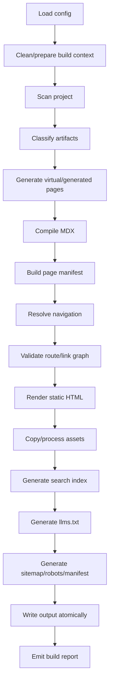
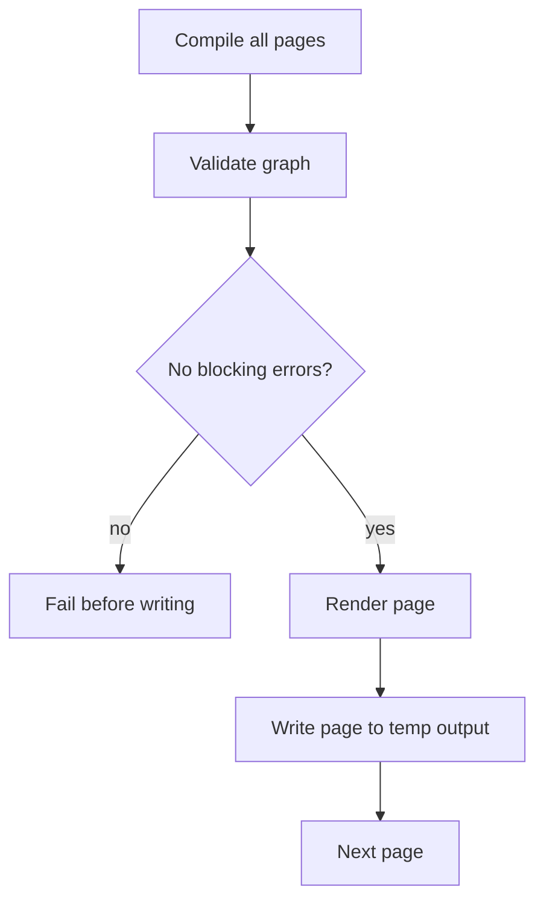
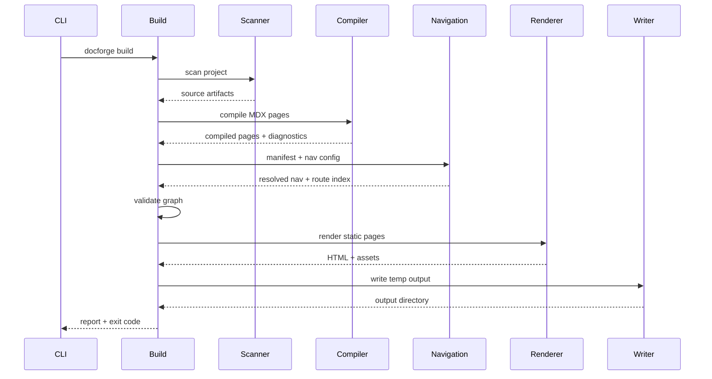
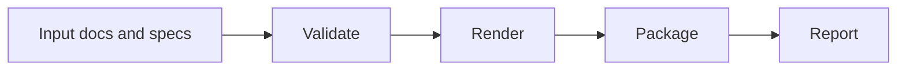

------
title: Build From Scratch: Mintlify-like AI-driven Documentation Generator CLI - Part 015
description: Membangun static site build pipeline untuk documentation generator: compile semua MDX, resolve route/nav, render halaman statis, emit assets, validate links, generate sitemap, search manifest, llms.txt, build report, dan atomic output.
series: learn-mintlify-like-ai-docs-cli
seriesTitle: Build From Scratch: Mintlify-like AI-driven Documentation Generator CLI
order: 15
partTitle: Static Site Build Pipeline
tags:
  - documentation
  - ai
  - cli
  - mdx
  - static-site-generator
  - build-pipeline
  - developer-tools
date: 2026-07-03
---

# Part 015 — Static Site Build Pipeline

Sekarang kita masuk ke command yang menentukan apakah documentation generator ini layak dipakai di production:

```bash
docforge build
```

Pada permukaan, `build` tampak seperti:

> "compile docs menjadi folder static."

Tetapi untuk tool Mintlify-like yang serius, `build` adalah **final proof stage**.

Ia harus membuktikan bahwa:

1. config valid,
2. source docs bisa discan,
3. MDX valid,
4. components aman,
5. navigation konsisten,
6. route tidak tabrakan,
7. link internal resolve,
8. generated API reference valid,
9. static HTML bisa dirender,
10. assets aman dan lengkap,
11. search index bisa dibuat,
12. `llms.txt` bisa diekspor,
13. sitemap dan metadata benar,
14. output directory ditulis secara atomic,
15. dan build report bisa dipakai di CI.

Kalau `dev` adalah long-running compiler, `build` adalah **batch compiler + packager + verifier**.

---

## 1. Mental model: build sebagai pipeline deterministik

Static build pipeline harus deterministic.

Input yang sama, config yang sama, versi tool yang sama, dan environment yang sama harus menghasilkan output yang sama.



Pipeline ini bukan list procedural sembarangan. Setiap tahap menghasilkan artifact yang menjadi input tahap berikutnya.

---

## 2. Build command contract

Command:

```bash
docforge build
```

Useful options:

```bash
docforge build --out .docforge/site
docforge build --clean
docforge build --strict
docforge build --base-path /docs
docforge build --format pretty
docforge build --format json
docforge build --dry-run
docforge build --no-search
docforge build --no-llms
docforge build --profile
```

Semantics:

| Option | Meaning |
|---|---|
| `--out` | Override output directory. |
| `--clean` | Remove previous output before writing. |
| `--strict` | Treat selected warnings as errors. |
| `--base-path` | Serve docs under path prefix, e.g. `/docs`. |
| `--format` | Human or machine-readable build output. |
| `--dry-run` | Run validation and rendering plan without writing final output. |
| `--no-search` | Skip search artifact generation. |
| `--no-llms` | Skip agent-ready export. |
| `--profile` | Include timing/memory details in build report. |

Exit codes:

| Result | Exit code |
|---|---:|
| Build success | 0 |
| Validation/build errors | 1 |
| Internal crash | 2 |
| Invalid CLI usage | 64 |
| Config error | 78 |

---

## 3. Build context

Build context is immutable-ish configuration for one run.

```ts
export type BuildMode = "development" | "production";

export type BuildContext = {
  projectRoot: string;
  configPath: string;
  config: NormalizedConfig;
  mode: BuildMode;
  outputDir: string;
  tempOutputDir: string;
  basePath: string;
  startedAt: number;
  toolVersion: string;
  environment: {
    nodeVersion: string;
    platform: string;
    ci: boolean;
  };
};
```

Why `tempOutputDir`?

Because final output should be atomic. We build into temp, then swap/rename.

Avoid writing partial broken output to production directory.

---

## 4. Build result

```ts
export type BuildResult = {
  ok: boolean;
  outputDir: string;
  pages: BuildPageResult[];
  manifest?: PageManifest;
  navigation?: NavNode[];
  routeIndex?: RouteIndex;
  assets: AssetBuildResult[];
  search?: SearchBuildResult;
  llms?: LlmsBuildResult;
  diagnostics: Diagnostic[];
  report: BuildReport;
};
```

Build report:

```ts
export type BuildReport = {
  toolVersion: string;
  startedAt: string;
  endedAt: string;
  durationMs: number;
  pagesTotal: number;
  pagesRendered: number;
  assetsCopied: number;
  errors: number;
  warnings: number;
  outputBytes: number;
  timings: Record<string, number>;
};
```

Machine-readable report should be written to:

```txt
<out>/build-report.json
```

or optionally:

```txt
.docforge/build-report.json
```

depending on whether you want it deployed.

---

## 5. Pipeline stage interface

Do not write a giant `build.ts` function with everything inline.

Create stage interface:

```ts
export type BuildStageName =
  | "loadConfig"
  | "scan"
  | "classify"
  | "generatePages"
  | "compile"
  | "navigation"
  | "validateGraph"
  | "render"
  | "assets"
  | "search"
  | "llms"
  | "metadata"
  | "write";

export type BuildStageResult<T> = {
  value?: T;
  diagnostics: Diagnostic[];
  timingMs: number;
};

export type BuildStage<TInput, TOutput> = {
  name: BuildStageName;
  run(input: TInput, ctx: BuildContext): Promise<BuildStageResult<TOutput>>;
};
```

This gives us:

- timing per stage,
- testing per stage,
- diagnostics per stage,
- better debugging,
- easier incremental build later.

---

## 6. Build orchestration skeleton

```ts
export async function buildSite(args: BuildArgs): Promise<BuildResult> {
  const startedAt = Date.now();
  const diagnostics: Diagnostic[] = [];
  const timings: Record<string, number> = {};

  const ctx = await createBuildContext(args);

  const scan = await timed("scan", timings, () => scanProject(ctx));
  diagnostics.push(...scan.diagnostics);

  const classified = await timed("classify", timings, () =>
    classifyArtifacts(scan.artifacts, ctx.config)
  );
  diagnostics.push(...classified.diagnostics);

  const generatedPages = await timed("generatePages", timings, () =>
    generateBuildPages(classified, ctx)
  );
  diagnostics.push(...generatedPages.diagnostics);

  const compile = await timed("compile", timings, () =>
    compileBuildPages(generatedPages.pages, ctx)
  );
  diagnostics.push(...compile.diagnostics);

  const manifest = buildPageManifest(compile.pages);

  const nav = await timed("navigation", timings, () =>
    resolveBuildNavigation(ctx.config.navigation, manifest)
  );
  diagnostics.push(...nav.diagnostics);

  const graphDiagnostics = validateBuildGraph(compile.pages, manifest, nav.nodes, ctx);
  diagnostics.push(...graphDiagnostics);

  if (hasBlockingErrors(diagnostics, ctx)) {
    return failedBuildResult(ctx, diagnostics, timings, startedAt);
  }

  const render = await timed("render", timings, () =>
    renderStaticPages(compile.pages, manifest, nav.nodes, ctx)
  );
  diagnostics.push(...render.diagnostics);

  const assets = await timed("assets", timings, () =>
    buildAssets(ctx)
  );
  diagnostics.push(...assets.diagnostics);

  const search = ctx.config.search.enabled
    ? await timed("search", timings, () => buildSearchIndex(compile.pages, manifest, ctx))
    : undefined;

  if (search) diagnostics.push(...search.diagnostics);

  const llms = ctx.config.llms.enabled
    ? await timed("llms", timings, () => buildLlmsExports(compile.pages, manifest, nav.nodes, ctx))
    : undefined;

  if (llms) diagnostics.push(...llms.diagnostics);

  const metadata = await timed("metadata", timings, () =>
    buildMetadataFiles(manifest, nav.nodes, ctx)
  );
  diagnostics.push(...metadata.diagnostics);

  if (hasBlockingErrors(diagnostics, ctx)) {
    return failedBuildResult(ctx, diagnostics, timings, startedAt);
  }

  await timed("write", timings, () =>
    writeBuildOutputAtomically({
      ctx,
      renderedPages: render.pages,
      assets: assets.assets,
      search: search?.value,
      llms: llms?.value,
      metadata: metadata.value,
    })
  );

  return successBuildResult(ctx, diagnostics, timings, startedAt);
}
```

The actual implementation will differ, but the shape is important.

---

## 7. Clean output and temp output

Never do this directly:

```ts
rm -rf out
mkdir out
write files into out
```

If build fails halfway, user gets half output.

Better:

```txt
.docforge/tmp/build-<id>/
```

Then rename/swap:

```ts
export async function writeBuildOutputAtomically(input: WriteOutputInput): Promise<void> {
  const { ctx } = input;

  await remove(ctx.tempOutputDir);
  await mkdir(ctx.tempOutputDir, { recursive: true });

  await writeAllFiles(ctx.tempOutputDir, input);

  if (ctx.config.build.clean) {
    await remove(ctx.outputDir);
  }

  await rename(ctx.tempOutputDir, ctx.outputDir);
}
```

Caveat: `rename` across devices can fail. Ensure temp is inside same parent filesystem as output.

Safer:

```txt
<out-parent>/.docforge-build-tmp-<id>
```

---

## 8. Output directory safety

Do not allow output directory to be dangerous.

Bad output paths:

- project root,
- docs source root,
- `/`,
- user home,
- `.git`,
- config directory,
- any included source directory.

Validation:

```ts
export function validateOutputDirectory(ctx: BuildContext): Diagnostic[] {
  const out = path.resolve(ctx.outputDir);
  const root = path.resolve(ctx.projectRoot);
  const docsRoot = path.resolve(ctx.projectRoot, ctx.config.docs.root);

  const diagnostics: Diagnostic[] = [];

  if (out === root) {
    diagnostics.push({
      code: "build.output.projectRoot",
      severity: "error",
      category: "config",
      message: "Output directory cannot be the project root.",
      hint: "Use a dedicated directory such as .docforge/site or dist/docs.",
    });
  }

  if (out === docsRoot || isParentOrSame(out, docsRoot)) {
    diagnostics.push({
      code: "build.output.overlapsDocsRoot",
      severity: "error",
      category: "config",
      message: "Output directory cannot overlap the docs source directory.",
      hint: "Choose an output directory outside the source docs root.",
    });
  }

  if (out.includes(`${path.sep}.git${path.sep}`) || out.endsWith(`${path.sep}.git`)) {
    diagnostics.push({
      code: "build.output.gitDirectory",
      severity: "error",
      category: "config",
      message: "Output directory cannot be inside .git.",
    });
  }

  return diagnostics;
}
```

Safety matters because `--clean` may delete output before writing.

---

## 9. Build page sources: physical and virtual

Build may include:

- physical MDX files,
- virtual generated pages,
- OpenAPI generated pages,
- generated reference pages,
- generated config reference,
- maybe generated `404`.

```ts
export type BuildPageSource =
  | { type: "physical"; path: string }
  | { type: "virtual"; id: string; generatedFrom: string[] };

export type BuildPageInput = {
  source: BuildPageSource;
  routeHint?: string;
  mdx: string;
  safetyMode: MdxSafetyMode;
};
```

For physical pages:

```ts
source: { type: "physical", path: "docs/quickstart.mdx" }
```

For generated API page:

```ts
source: {
  type: "virtual",
  id: "openapi:public:createUser",
  generatedFrom: ["openapi/public.yaml#/paths/~1users/post"]
}
```

Virtual pages become regular compiled pages downstream.

---

## 10. Generated pages in build

Important policy question:

Should `docforge build` generate docs from AI?

Recommended:

- deterministic generated pages can be generated during build,
- AI-written pages should not be generated silently during build unless explicitly configured and cached/reviewed,
- build should not surprise-write source MDX files,
- build may render virtual generated pages from deterministic sources like OpenAPI.

Why?

CI builds should be repeatable. LLM calls are not ideal inside normal build unless treated carefully.

Default:

| Page type | Build behavior |
|---|---|
| Manual MDX | Compile/render |
| OpenAPI reference | Deterministically generate virtual pages |
| Config reference | Deterministically generate virtual page |
| AI-generated guide | Use committed MDX or reviewed generated artifact |
| AI update suggestion | Not part of build; use `generate` workflow |

This preserves production determinism.

---

## 11. Compile all pages

Compile physical and virtual pages with production mode:

```ts
export async function compileBuildPages(
  pages: BuildPageInput[],
  ctx: BuildContext
): Promise<CompileSiteResult> {
  return compileSite({
    pages: pages.map((page) => ({
      path: sourcePathForBuildPage(page.source),
      source: page.mdx,
      safetyMode: page.safetyMode,
    })),
    mode: "production",
    componentRegistry: ctx.config.components.registry,
    navigation: ctx.config.navigation,
  });
}
```

Production mode upgrades some warnings.

Examples:

- broken internal link = error,
- draft page in nav = error,
- unknown component = error,
- unsafe MDX = error,
- missing frontmatter = error,
- route collision = error.

---

## 12. Blocking error policy

Build should stop before expensive rendering if structural validation fails.

```ts
export function hasBlockingErrors(
  diagnostics: Diagnostic[],
  ctx: BuildContext
): boolean {
  return diagnostics.some((diagnostic) => {
    if (diagnostic.severity === "error") {
      return true;
    }

    if (ctx.config.build.strict && diagnostic.severity === "warning") {
      return isStrictBlockingWarning(diagnostic);
    }

    return false;
  });
}
```

Not all warnings should block in strict mode; make this configurable.

Example config:

```json
{
  "build": {
    "strict": true,
    "failOnWarnings": [
      "nav.page.orphan",
      "mdx.code.missingLanguage"
    ]
  }
}
```

---

## 13. Render model

Renderer receives compiled page and site context.

```ts
export type StaticRenderInput = {
  page: CompilePageResult;
  manifest: PageManifest;
  navigation: RenderNavNode[];
  breadcrumbs: BreadcrumbItem[];
  previous?: PageManifestEntry;
  next?: PageManifestEntry;
  basePath: string;
  theme: ThemeRuntime;
  buildInfo: {
    toolVersion: string;
    generatedAt: string;
  };
};

export type RenderedPage = {
  route: string;
  outputPath: string;
  html: string;
  assets: ReferencedAsset[];
};
```

The renderer should not compile MDX again. It receives compiled module or renderable content.

---

## 14. Route to output path

Static output convention:

| Route | Output file |
|---|---|
| `/` | `index.html` |
| `/quickstart` | `quickstart/index.html` |
| `/guides/install` | `guides/install/index.html` |
| `/api/users/create` | `api/users/create/index.html` |

Function:

```ts
export function outputPathForRoute(route: string): string {
  const normalized = normalizeRoute(route);

  if (normalized === "/") {
    return "index.html";
  }

  return `${normalized.replace(/^\//, "")}/index.html`;
}
```

Benefits:

- clean URLs,
- static hosting friendly,
- relative assets easier if base path handled correctly.

Alternative:

```txt
quickstart.html
```

But folder-style routes are common for docs.

---

## 15. Base path handling

If docs are hosted under:

```txt
https://example.com/docs/
```

base path is:

```txt
/docs
```

All internal asset and route URLs must include it.

```ts
export function withBasePath(basePath: string, route: string): string {
  const base = basePath.replace(/\/$/, "");
  const normalizedRoute = route.startsWith("/") ? route : `/${route}`;

  if (!base) {
    return normalizedRoute;
  }

  return `${base}${normalizedRoute}`;
}
```

Rules:

1. Internal nav links use base path at render time.
2. Route index uses route without base path.
3. Sitemap uses full public URL if configured.
4. `llms.txt` may use canonical URLs or relative routes depending config.

Do not bake base path into page IDs.

---

## 16. HTML shell

Static HTML shell includes:

- doctype,
- `<html lang>`,
- metadata,
- title,
- description,
- canonical link,
- CSS,
- nav/sidebar,
- main content,
- search script,
- hydration script if needed,
- footer.

Example simplified:

```html
<!doctype html>
<html lang="en">
  <head>
    <meta charset="utf-8" />
    <title>Quickstart - Acme Docs</title>
    <meta name="description" content="Generate and preview documentation." />
    <meta name="viewport" content="width=device-width, initial-scale=1" />
    <link rel="canonical" href="https://docs.example.com/quickstart" />
    <link rel="stylesheet" href="/assets/docforge.css" />
  </head>
  <body>
    <div id="root">...</div>
    <script type="module" src="/assets/docforge.js"></script>
  </body>
</html>
```

Static-first does not mean no JavaScript. It means content should be readable without client API calls.

---

## 17. Metadata generation

Page metadata from frontmatter and config:

```ts
export type PageSeoMetadata = {
  title: string;
  description: string;
  canonicalUrl?: string;
  ogTitle?: string;
  ogDescription?: string;
  ogImage?: string;
  noindex?: boolean;
};
```

Generate:

```ts
export function buildSeoMetadata(
  page: PageManifestEntry,
  ctx: BuildContext
): PageSeoMetadata {
  const siteTitle = ctx.config.site.title;

  return {
    title: page.route === "/"
      ? siteTitle
      : `${page.title} - ${siteTitle}`,
    description: page.description,
    canonicalUrl: ctx.config.site.url
      ? new URL(withBasePath(ctx.basePath, page.route), ctx.config.site.url).toString()
      : undefined,
    noindex: page.draft || page.hidden && !ctx.config.hiddenPages.index,
  };
}
```

Do not require public `site.url` for local builds, but warn if sitemap is enabled without it.

---

## 18. Asset pipeline

Assets include:

- theme CSS,
- client JS,
- images,
- fonts if user provides them,
- favicon,
- OpenGraph images,
- search data,
- API playground JS,
- page-specific static assets.

Asset model:

```ts
export type AssetInput = {
  sourcePath: string;
  outputPath: string;
  fingerprint?: boolean;
};

export type AssetBuildResult = {
  sourcePath: string;
  outputPath: string;
  bytes: number;
  hash?: string;
};
```

Fingerprint:

```txt
assets/docforge.3fa92c1.css
assets/docforge.aa091d2.js
```

Why fingerprint?

- browser cache,
- immutable deploys,
- CDN-friendly.

Do not fingerprint HTML entry files. Fingerprint assets referenced by HTML.

---

## 19. Asset safety

Asset copy must enforce:

1. asset path inside project root or allowed package asset root,
2. no path traversal,
3. no `.env`,
4. no secret files,
5. no huge files unless allowed,
6. no source maps in production unless configured.

Example diagnostic:

```ts
{
  code: "build.asset.blockedSecretLikeFile",
  severity: "error",
  category: "security",
  message: "Asset pipeline refused to copy a secret-like file: .env",
  location: { path: ".env" },
  hint: "Move public assets into the configured assets directory."
}
```

---

## 20. Link validation in build

Build should validate:

- internal links,
- internal anchors,
- asset links,
- nav links,
- canonical links,
- redirects,
- optionally external links.

Internal link validation is mandatory.

External link validation can be optional because:

- network is slow,
- CI may not have internet,
- external sites rate-limit,
- flaky checks create noisy builds.

Config:

```json
{
  "links": {
    "checkExternal": false,
    "failOnExternalBroken": false,
    "timeoutMs": 3000
  }
}
```

Internal link diagnostic:

```txt
docs/guides/install.mdx:42:10 error mdx.link.unresolvedInternal
Internal link target does not exist: /configuration.
```

External link diagnostic:

```txt
warning link.external.unreachable docs/page.mdx:12:5
External link could not be reached.
```

---

## 21. Sitemap generation

If `site.url` exists, generate `sitemap.xml`.

Input:

- page manifest,
- canonical routes,
- hidden/noindex policy,
- base path,
- last modified if known.

```ts
export type SitemapEntry = {
  loc: string;
  lastmod?: string;
  changefreq?: string;
  priority?: number;
};
```

Generate:

```ts
export function buildSitemapEntries(
  manifest: PageManifest,
  ctx: BuildContext
): SitemapEntry[] {
  if (!ctx.config.site.url) {
    return [];
  }

  return manifest.pages
    .filter((page) => !page.draft)
    .filter((page) => !page.noindex)
    .map((page) => ({
      loc: new URL(withBasePath(ctx.basePath, page.route), ctx.config.site.url).toString(),
      lastmod: page.lastModified,
    }));
}
```

Output:

```xml
<?xml version="1.0" encoding="UTF-8"?>
<urlset xmlns="http://www.sitemaps.org/schemas/sitemap/0.9">
  <url>
    <loc>https://docs.example.com/quickstart</loc>
  </url>
</urlset>
```

If no site URL:

- skip sitemap,
- emit warning if sitemap explicitly enabled.

---

## 22. Robots.txt

Optional.

```txt
User-agent: *
Allow: /

Sitemap: https://docs.example.com/sitemap.xml
```

Config:

```json
{
  "robots": {
    "enabled": true,
    "allow": true
  }
}
```

For internal docs:

```txt
User-agent: *
Disallow: /
```

Do not assume all docs should be indexed publicly.

---

## 23. Search index artifact

Part 017 will go deep into search. Here build needs stage boundary.

Search build input:

```ts
export type SearchBuildInput = {
  documents: SearchDocument[];
  outputDir: string;
  basePath: string;
  config: SearchConfig;
};
```

Output:

```ts
export type SearchBuildResult = {
  files: Array<{
    path: string;
    bytes: number;
  }>;
  documentsIndexed: number;
};
```

Search stage should use search documents extracted by compiler, not re-parse pages separately.

```ts
const documents = compile.pages
  .map((page) => page.searchDocument)
  .filter(Boolean);
```

If a page has no search document, emit warning only if unexpected.

---

## 24. `llms.txt` and `llms-full.txt`

Part 040 will go deep. Build only needs to emit artifacts.

Typical outputs:

```txt
/llms.txt
/llms-full.txt
```

`llms.txt`:

- compact index of docs,
- key links,
- summary.

`llms-full.txt`:

- fuller Markdown export of docs.

Build input:

```ts
export type LlmsBuildInput = {
  manifest: PageManifest;
  navigation: NavNode[];
  pages: CompilePageResult[];
  config: LlmsConfig;
};
```

Important:

- Exclude draft pages.
- Respect hidden/noindex policy.
- Convert MDX components to Markdown through component registry.
- Avoid duplicating canonical pages.
- Preserve order based on navigation.

---

## 25. Build metadata files

Useful artifacts:

```txt
manifest.json
nav.json
routes.json
build-report.json
search.json or search/
llms.txt
llms-full.txt
sitemap.xml
robots.txt
```

Example `routes.json`:

```json
{
  "routes": [
    {
      "route": "/",
      "file": "index.html",
      "sourcePath": "docs/index.mdx"
    },
    {
      "route": "/quickstart",
      "file": "quickstart/index.html",
      "sourcePath": "docs/quickstart.mdx"
    }
  ]
}
```

Do not expose internal prompt traces or private source snippets in public build output.

---

## 26. 404 page

Generate a static 404 page.

Options:

1. user-provided `docs/404.mdx`,
2. theme default 404,
3. generated fallback.

Route:

```txt
/404.html
```

Not:

```txt
/404/index.html
```

because many static hosts expect `404.html`.

Build:

```ts
export async function build404Page(ctx: BuildContext): Promise<RenderedPage> {
  const userPage = findPageByRoute("/404");

  if (userPage) {
    return renderPageAs404(userPage);
  }

  return renderDefault404(ctx);
}
```

Do not include 404 in sitemap.

---

## 27. Redirect output

Redirect support depends on hosting provider.

Portable static option:

- emit redirect manifest,
- emit HTML redirect pages.

Redirect page:

```html
<!doctype html>
<html>
  <head>
    <meta http-equiv="refresh" content="0; url=/new-path" />
    <link rel="canonical" href="/new-path" />
  </head>
  <body>
    <p>Redirecting to <a href="/new-path">/new-path</a>.</p>
  </body>
</html>
```

Provider-specific adapters later can emit:

- `_redirects` for Netlify-like platforms,
- `vercel.json`,
- S3 routing rules,
- CloudFront function config.

For build pipeline, keep redirects as neutral IR:

```ts
export type RedirectRule = {
  from: RoutePath;
  to: RoutePath;
  status: 301 | 302 | 307 | 308;
};
```

---

## 28. Build dry run

`--dry-run` should run:

- config validation,
- scan,
- classification,
- generation planning,
- compile,
- nav validation,
- graph validation,
- render planning maybe,
- no final write.

Output:

```txt
Build dry run completed.

Pages:    42
Routes:   42
Assets:   18 planned
Errors:   0
Warnings: 3

No files written.
```

Use case:

- CI validation,
- pre-commit,
- testing config changes,
- checking AI-generated docs before applying.

---

## 29. Build profiling

`--profile` can include stage timings.

Example:

```txt
Build completed in 1.84s

Timings:
  scan             120ms
  classify          18ms
  generatePages    210ms
  compile          640ms
  navigation        12ms
  render           390ms
  assets            80ms
  search           290ms
  llms              42ms
  write             38ms
```

JSON:

```json
{
  "durationMs": 1840,
  "timings": {
    "scan": 120,
    "compile": 640,
    "render": 390
  }
}
```

Profiling is not just nice-to-have. It reveals whether large repos fail because of scanner, compiler, renderer, search, or IO.

---

## 30. Parallel rendering

Pages can render in parallel.

But concurrency must be bounded.

```ts
export async function renderStaticPages(
  pages: CompilePageResult[],
  manifest: PageManifest,
  navigation: NavNode[],
  ctx: BuildContext
): Promise<RenderStageOutput> {
  const rendered = await runWithConcurrency(
    pages,
    ctx.config.build.concurrency ?? defaultConcurrency(),
    (page) => renderOnePage(page, manifest, navigation, ctx)
  );

  return {
    pages: rendered,
    diagnostics: rendered.flatMap((page) => page.diagnostics),
  };
}
```

Default concurrency:

```ts
export function defaultConcurrency(): number {
  const cpus = os.cpus().length;
  return Math.max(1, Math.min(cpus - 1, 8));
}
```

Do not set unbounded `Promise.all` for thousands of pages.

---

## 31. Memory management

Static docs can be large.

Avoid storing unnecessary full HTML and AST for every page forever.

Options:

1. compile all pages, render all into memory, then write,
2. stream render outputs to temp files,
3. render/write page-by-page after validation.

For simple implementation, all in memory is fine for small sites.

For production scale:



This avoids keeping all HTML in memory.

But you still need enough metadata for graph validation.

---

## 32. Build cache

Production build can use cache.

Cache key includes:

- source hash,
- config hash,
- theme hash,
- compiler version,
- component registry hash,
- base path maybe,
- renderer version.

```ts
export type BuildCacheKey = {
  sourceHash: string;
  configHash: string;
  themeHash: string;
  compilerVersion: string;
  rendererVersion: string;
};
```

Cache policy:

| Artifact | Cacheable? |
|---|---|
| file scan hashes | yes |
| MDX compile output | yes |
| rendered HTML | yes if theme/base path unchanged |
| search documents | yes |
| sitemap | cheap, no need |
| llms export | yes maybe |

Do not cache across incompatible tool versions.

---

## 33. Determinism checks

Build output should be stable.

Potential nondeterminism:

- `Date.now()` in HTML,
- random IDs,
- unordered object iteration,
- filesystem order,
- AI generation,
- locale-dependent sort,
- absolute paths,
- machine-specific temp paths.

Rules:

1. Sort arrays before output.
2. Use stable IDs.
3. Put build timestamp only in build report, not page content by default.
4. Avoid absolute local paths in public HTML.
5. Do not call AI in default production build.
6. Use deterministic slug/route generation.
7. Make generated Mermaid IDs stable if used.

---

## 34. Public vs private build artifacts

Separate deployable output from internal cache.

Deployable:

```txt
out/
  index.html
  quickstart/index.html
  assets/...
  search/...
  llms.txt
  llms-full.txt
  sitemap.xml
  robots.txt
```

Internal:

```txt
.docforge/
  cache/
  traces/
  page-manifest.internal.json
  provenance/
  build-report.internal.json
```

Do not accidentally deploy:

- AI prompt traces,
- local absolute paths,
- source snippets not intended,
- cache database,
- secret scan report,
- private provenance if sensitive.

Build output should contain only public artifacts.

---

## 35. Build diagnostics examples

### 35.1 Build blocked by MDX error

```txt
Build failed.

docs/quickstart.mdx:18:1 error mdx.component.unknown
Unknown MDX component <Alert>.

Hint:
Use <Callout type="info"> or register Alert in the component registry.
```

### 35.2 Build blocked by route collision

```txt
Build failed.

error nav.route.collision
Multiple pages resolve to the same route: /guides/install.

Related:
- docs/guides/install.mdx
- docs/guides/install/index.mdx
```

### 35.3 Build warning for missing site URL

```txt
warning build.sitemap.missingSiteUrl
Sitemap generation is enabled, but site.url is not configured.

Hint:
Set site.url or disable sitemap generation.
```

---

## 36. Machine-readable build output

CI needs structured data.

```bash
docforge build --format json
```

Output:

```json
{
  "ok": false,
  "errors": 1,
  "warnings": 2,
  "diagnostics": [
    {
      "code": "mdx.link.unresolvedInternal",
      "severity": "error",
      "message": "Internal link target does not exist: /configuration.",
      "location": {
        "path": "docs/quickstart.mdx",
        "line": 24,
        "column": 8
      }
    }
  ],
  "report": {
    "durationMs": 982,
    "pagesTotal": 42
  }
}
```

NDJSON can stream:

```json
{"event":"stage:start","stage":"compile"}
{"event":"diagnostic","severity":"error","code":"mdx.link.unresolvedInternal"}
{"event":"stage:end","stage":"compile","durationMs":420}
{"event":"build:end","ok":false}
```

Useful for large builds and CI annotations.

---

## 37. Static renderer integration

Build should call renderer with complete context:

```ts
export async function renderOnePage(
  page: CompilePageResult,
  manifest: PageManifest,
  navigation: NavNode[],
  ctx: BuildContext
): Promise<RenderedPage> {
  const pageEntry = manifest.bySourcePath.get(page.path);

  if (!pageEntry) {
    throw new Error(`Missing manifest entry for ${page.path}`);
  }

  const renderNav = toRenderNav(navigation, manifest, pageEntry.route);
  const breadcrumbs = ctx.breadcrumbs.get(pageEntry.id) ?? [];
  const prevNext = ctx.prevNext.get(pageEntry.id);

  const html = await ctx.renderer.renderPage({
    page,
    pageEntry,
    navigation: renderNav,
    breadcrumbs,
    previous: prevNext?.previous
      ? manifest.byPageId.get(prevNext.previous)
      : undefined,
    next: prevNext?.next
      ? manifest.byPageId.get(prevNext.next)
      : undefined,
    basePath: ctx.basePath,
    production: true,
  });

  return {
    route: pageEntry.route,
    outputPath: outputPathForRoute(pageEntry.route),
    html,
    assets: [],
  };
}
```

Renderer should be pure relative to input.

---

## 38. Build and generated regions

If build sees managed regions, it validates them.

But build should not update managed regions. That belongs to `generate`.

Build can fail if:

- region markers invalid,
- generated page manifest missing,
- stale generated page policy is error.

Example config:

```json
{
  "generatedDocs": {
    "stalePolicy": "warn"
  }
}
```

Options:

| Policy | Behavior |
|---|---|
| `ignore` | Do not check staleness |
| `warn` | Warn if generated page source changed |
| `error` | Fail build if stale |

For regulated/enterprise docs, `error` may be desirable.

---

## 39. Build and provenance

Build can verify provenance sidecar exists for generated pages.

```ts
export function validateGeneratedPageProvenance(
  manifest: PageManifest,
  provenanceStore: ProvenanceStore,
  ctx: BuildContext
): Diagnostic[] {
  const diagnostics: Diagnostic[] = [];

  for (const page of manifest.pages) {
    if (!page.generated) {
      continue;
    }

    const provenance = provenanceStore.getPageProvenance(page.id);

    if (!provenance) {
      diagnostics.push({
        code: "build.provenance.missingGeneratedPageProvenance",
        severity: ctx.config.provenance.required ? "error" : "warning",
        category: "provenance",
        message: `Generated page has no provenance record: ${page.sourcePath}.`,
        location: { path: page.sourcePath },
      });
    }
  }

  return diagnostics;
}
```

This matters for AI-generated docs because user needs traceability.

---

## 40. Build and CI

Typical CI flow:

```yaml
- run: npm ci
- run: npm run docs:check
- run: npm run docs:build
- uses: actions/upload-artifact
  with:
    name: docs-site
    path: .docforge/site
```

Recommended package scripts:

```json
{
  "scripts": {
    "docs:dev": "docforge dev",
    "docs:check": "docforge check",
    "docs:build": "docforge build"
  }
}
```

`check` can be a build without render/write, or dedicated validation command.

---

## 41. Build test strategy

### 41.1 Unit tests

- route to output path,
- base path,
- output dir validation,
- sitemap generation,
- asset path safety,
- report summary.

### 41.2 Fixture tests

Project fixture:

```txt
fixture-basic/
  docforge.config.json
  docs/
    index.mdx
    quickstart.mdx
```

Test:

```ts
it("builds a minimal docs site", async () => {
  const result = await buildSite({
    cwd: fixturePath("fixture-basic"),
    out: tempDir(),
  });

  expect(result.ok).toBe(true);
  expect(await exists(path.join(result.outputDir, "index.html"))).toBe(true);
  expect(await exists(path.join(result.outputDir, "quickstart/index.html"))).toBe(true);
});
```

### 41.3 Golden output tests

For stable small fixtures, compare output files.

Be careful with timestamps. Keep them out of HTML.

### 41.4 Failure tests

- invalid MDX,
- missing frontmatter,
- route collision,
- broken link,
- unsafe asset,
- invalid nav config,
- sitemap without site URL warning.

---

## 42. Performance test strategy

Large fixture generator:

```ts
export async function createLargeDocsFixture(count: number): Promise<string> {
  const root = await makeTempProject();

  for (let i = 0; i < count; i++) {
    await writeFile(
      path.join(root, "docs", `page-${i}.mdx`),
      validPage(`Page ${i}`)
    );
  }

  return root;
}
```

Test targets:

- 100 pages,
- 1,000 pages,
- 5,000 pages maybe.

Measure:

- scan time,
- compile time,
- render time,
- search time,
- memory peak.

Do not wait until users report slow builds.

---

## 43. Common implementation trap: build uses dev server code directly

It is tempting to reuse dev server state.

Bad:

```txt
build starts dev server internally and snapshots output
```

Better:

- dev and build share compiler/nav/renderer packages,
- dev has watcher/websocket/state loop,
- build has batch pipeline/write/report.

Shared packages:

```txt
scanner
classifier
mdx-compiler
navigation
renderer
search
llms
```

Different orchestrators:

```txt
dev-server
static-build
```

---

## 44. Common implementation trap: rendering before validation completes

If you render pages before cross-page validation, you may waste time and produce partial output.

Correct:

1. compile all,
2. build manifest,
3. nav,
4. link/route validation,
5. stop if blocking,
6. render.

Graph validation must happen before write.

---

## 45. Common implementation trap: public output leaks internals

Build output should not include:

- raw config with secrets,
- environment variables,
- local absolute paths,
- AI prompts,
- source index DB,
- cache files,
- private provenance,
- `.docforge/cache`.

Implement allowlist-based write, not copy-whole-project.

---

## 46. Minimal implementation milestone

First working `build`:

1. load config,
2. read MDX files,
3. compile pages,
4. build manifest/nav,
5. validate internal links,
6. render HTML,
7. copy public assets,
8. write `index.html`-style output,
9. emit basic `build-report.json`,
10. fail on errors.

Then add:

1. atomic output,
2. sitemap,
3. search,
4. `llms.txt`,
5. redirects,
6. OpenAPI generated pages,
7. profiling,
8. caching,
9. provenance validation.

---

## 47. Build pipeline diagram



---

## 48. Failure modes

| Failure | Cause | Prevention |
|---|---|---|
| Partial broken output | Direct writes to output dir | Write temp then swap |
| Deleted project files | Unsafe `--clean` path | Output directory safety validation |
| Slow large builds | Unbounded compile/render | Bounded concurrency and cache |
| Broken links published | No graph validation | Validate links before render/write |
| Nondeterministic diffs | Random IDs/time/order | Stable sort and IDs |
| Search misses pages | Search separately scans files | Use compiler search documents |
| `llms.txt` loses component text | No component Markdown fallback | Component export contract |
| Private traces deployed | Copying internal directories | Allowlist deployable artifacts |
| CI cannot parse errors | Pretty-only output | JSON/NDJSON reporter |
| AI changes build output unpredictably | LLM calls during build | No default AI calls in production build |

---

## 49. Key takeaways

`docforge build` is not just a static export command.

It is the production proof stage:



A strong build pipeline:

1. separates validation from rendering,
2. writes output atomically,
3. treats routes/nav/search/llms as products of one manifest,
4. blocks unsafe or invalid output,
5. supports machine-readable diagnostics,
6. stays deterministic,
7. and avoids surprise AI generation during production builds.

Next, we design the **theme system and component contracts** that make rendered docs flexible without making generated MDX unsafe.
