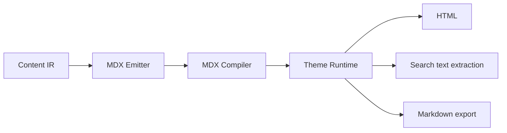
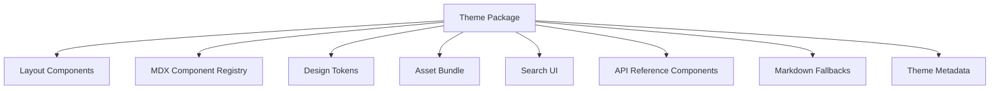
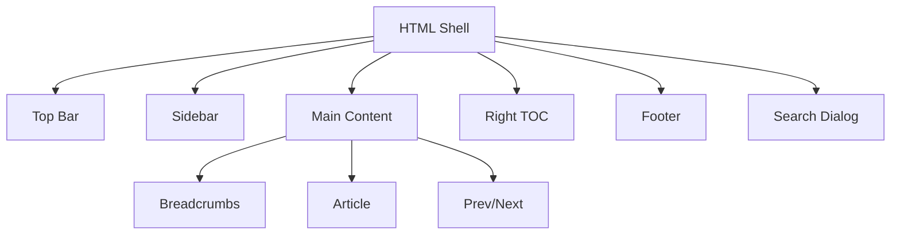
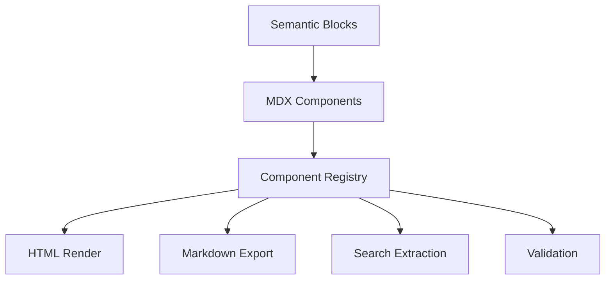

------
title: Build From Scratch: Mintlify-like AI-driven Documentation Generator CLI - Part 016
description: Mendesain theme system dan component contracts untuk documentation generator: layout, design tokens, component registry, MDX component safety, fallback Markdown, search extraction, llms.txt export, API components, versioning, and extension boundaries.
series: learn-mintlify-like-ai-docs-cli
seriesTitle: Build From Scratch: Mintlify-like AI-driven Documentation Generator CLI
order: 16
partTitle: Theme System and Component Contracts
tags:
  - documentation
  - ai
  - cli
  - mdx
  - theme-system
  - components
  - developer-tools
date: 2026-07-03
---

# Part 016 — Theme System and Component Contracts

Sekarang kita membahas layer yang paling terlihat oleh user: **theme system**.

Tetapi kita tidak akan mendesain theme sebagai kumpulan CSS dan React components saja.

Dalam documentation generator AI-driven, theme adalah **runtime contract** untuk MDX generated content.

Theme harus menjawab:

1. layout docs seperti apa?
2. component apa yang legal di MDX?
3. props apa yang boleh?
4. children apa yang valid?
5. bagaimana component dirender ke HTML?
6. bagaimana component diekstrak untuk search?
7. bagaimana component diekspor ke Markdown untuk `llms.txt`?
8. bagaimana API reference component menerima data?
9. bagaimana user menyesuaikan tampilan tanpa merusak safety?
10. bagaimana theme berevolusi tanpa mematahkan docs lama?

Kalau theme system lemah, generated MDX akan rapuh. AI bisa menulis component yang tidak ada. Search bisa kehilangan content. `llms.txt` bisa kosong untuk tabs/cards. Build bisa berhasil tetapi UX rusak.

---

## 1. Mental model: theme adalah adapter antara semantic content dan presentation

Kita sudah punya Content IR dan MDX. Theme tidak boleh menjadi source of truth.



Theme runtime menerima content yang sudah tervalidasi, lalu menyajikannya.

Theme bukan tempat untuk:

- mengklasifikasi source code,
- mengarang dokumentasi,
- menyelesaikan route,
- membaca OpenAPI langsung,
- melakukan AI calls,
- memutuskan navigation IA,
- menulis file.

Theme harus fokus pada presentation dan component semantics.

---

## 2. Theming goals

### 2.1 Safe customization

User harus bisa mengubah:

- logo,
- colors,
- typography,
- layout density,
- sidebar behavior,
- top nav,
- footer,
- code block style,
- component look,
- dark/light mode.

Tapi tidak boleh membuat generated MDX menjadi arbitrary code execution.

### 2.2 Stable component contract

Jika generator menulis:

```mdx
<Callout type="warning" title="Be careful">
...
</Callout>
```

maka semua theme yang compatible harus tahu cara merender `Callout`.

### 2.3 Semantic fallback

Setiap component harus bisa turun menjadi plain Markdown.

Ini penting untuk:

- `llms.txt`,
- search,
- export,
- migrations,
- non-React renderers,
- accessibility.

### 2.4 Versioned evolution

Component contract berubah seiring waktu.

Theme system harus bisa mendukung:

- deprecation,
- migration,
- compatibility matrix,
- feature detection,
- validation.

---

## 3. Theme architecture



Theme package exports:

```ts
export type ThemePackage = {
  metadata: ThemeMetadata;
  layouts: ThemeLayouts;
  components: ComponentRegistry;
  tokens: ThemeTokens;
  assets: ThemeAssets;
  renderers: ThemeRenderers;
};
```

Metadata:

```ts
export type ThemeMetadata = {
  name: string;
  version: string;
  compatibleWith: {
    docforge: string;
    componentContract: string;
  };
};
```

---

## 4. Layout model

Docs layout has stable regions.

```ts
export type DocsLayoutProps = {
  page: PageManifestEntry;
  site: SiteConfig;
  navigation: RenderNavNode[];
  breadcrumbs: BreadcrumbItem[];
  previous?: PageManifestEntry;
  next?: PageManifestEntry;
  tableOfContents: TocItem[];
  children: React.ReactNode;
};
```

Layout regions:



Do not let MDX pages construct the full layout. MDX supplies article content. Theme supplies site shell.

---

## 5. Design tokens

Theme customization should start with tokens, not raw CSS overrides.

```ts
export type ThemeTokens = {
  color: {
    background: string;
    foreground: string;
    muted: string;
    border: string;
    accent: string;
    danger: string;
    warning: string;
    success: string;
    info: string;
    codeBackground: string;
  };
  typography: {
    fontSans: string;
    fontMono: string;
    baseSize: string;
    lineHeight: string;
  };
  spacing: {
    pageX: string;
    pageY: string;
    sectionGap: string;
  };
  radius: {
    sm: string;
    md: string;
    lg: string;
  };
};
```

Config:

```json
{
  "theme": {
    "tokens": {
      "color": {
        "accent": "#6366f1"
      },
      "radius": {
        "md": "8px"
      }
    }
  }
}
```

Token validation:

- valid color strings,
- length units allowed,
- no `url(...)` if unsafe,
- no arbitrary CSS injection in strict mode.

---

## 6. CSS variable output

Tokens can compile to CSS variables.

```css
:root {
  --df-color-background: #ffffff;
  --df-color-foreground: #111827;
  --df-color-accent: #6366f1;
  --df-font-sans: Inter, system-ui, sans-serif;
  --df-font-mono: ui-monospace, SFMono-Regular, monospace;
  --df-radius-md: 8px;
}

[data-theme="dark"] {
  --df-color-background: #0b0f19;
  --df-color-foreground: #f9fafb;
}
```

Renderer components use variables:

```css
.df-callout {
  border: 1px solid var(--df-color-border);
  border-radius: var(--df-radius-md);
}
```

This keeps customization stable.

---

## 7. Component registry revisited

From Part 011 and 012, component registry is not just a React map.

It is a semantic contract:

```ts
export type ComponentSpec = {
  name: string;
  version: string;
  props: Record<string, PropSpec>;
  children: ChildrenSpec;
  render: ComponentRenderer;
  toMarkdown: MarkdownExporter;
  extractSearchText: SearchTextExtractor;
  accessibility?: AccessibilitySpec;
  deprecated?: DeprecationInfo;
};
```

Registry:

```ts
export type ComponentRegistry = {
  contractVersion: string;
  components: Map<string, ComponentSpec>;
  get(name: string): ComponentSpec | undefined;
  has(name: string): boolean;
};
```

This registry powers:

- MDX validation,
- rendering,
- search extraction,
- `llms.txt` export,
- migration,
- AI prompt constraints.

---

## 8. Prop spec

```ts
export type PropSpec =
  | {
      type: "string";
      required?: boolean;
      maxLength?: number;
      pattern?: RegExp;
    }
  | {
      type: "number";
      required?: boolean;
      min?: number;
      max?: number;
      integer?: boolean;
    }
  | {
      type: "boolean";
      required?: boolean;
    }
  | {
      type: "enum";
      required?: boolean;
      values: string[];
    }
  | {
      type: "href";
      required?: boolean;
      allowExternal?: boolean;
    };
```

Examples:

```ts
const CalloutProps = {
  type: {
    type: "enum",
    required: true,
    values: ["note", "tip", "warning", "danger", "info"],
  },
  title: {
    type: "string",
    required: false,
    maxLength: 80,
  },
} satisfies Record<string, PropSpec>;
```

Why not just TypeScript props?

Because we need runtime validation for MDX files.

---

## 9. Children spec

```ts
export type ChildrenSpec =
  | { type: "none" }
  | { type: "inline" }
  | { type: "blocks" }
  | { type: "only"; components: string[] };
```

Examples:

```ts
const TabsChildren: ChildrenSpec = {
  type: "only",
  components: ["Tab"],
};

const CardChildren: ChildrenSpec = {
  type: "blocks",
};
```

This lets compiler catch:

```mdx
<Tabs>
  <Card title="Wrong" href="/x" />
</Tabs>
```

before runtime.

---

## 10. Core component set

A Mintlify-like docs generator needs a stable core set.

| Component | Purpose |
|---|---|
| `Callout` | Notes, tips, warnings, danger messages. |
| `Steps` | Ordered procedures. |
| `Step` | A single procedural step. |
| `Tabs` | Variants by package manager/language/platform. |
| `Tab` | A single tab. |
| `CardGroup` | Navigation cards. |
| `Card` | Linkable card. |
| `AccordionGroup` | FAQ/optional details group. |
| `Accordion` | Collapsible optional detail. |
| `CodeGroup` | Multiple code variants. |
| `CodeBlock` | Enhanced code block if needed. |
| `ApiOperation` | API reference operation. |
| `Endpoint` | Method/path badge. |
| `ParamTable` | Structured parameters. |
| `ResponseTable` | Response model. |
| `SchemaViewer` | JSON schema visualization. |

Start small. Add API-specific components when needed.

---

## 11. Callout contract

MDX:

```mdx
<Callout type="warning" title="Generated pages can overwrite managed regions">
Run `docforge generate --dry-run` before applying documentation updates.
</Callout>
```

Spec:

```ts
export const CalloutSpec: ComponentSpec = {
  name: "Callout",
  version: "1.0.0",
  props: {
    type: {
      type: "enum",
      required: true,
      values: ["note", "tip", "warning", "danger", "info"],
    },
    title: {
      type: "string",
      required: false,
      maxLength: 100,
    },
  },
  children: { type: "blocks" },
  render: renderCallout,
  toMarkdown: calloutToMarkdown,
  extractSearchText: extractChildrenText,
};
```

Markdown fallback:

```md
> [!WARNING] Generated pages can overwrite managed regions
> Run `docforge generate --dry-run` before applying documentation updates.
```

Search extraction:

```txt
Generated pages can overwrite managed regions
Run docforge generate --dry-run before applying documentation updates.
```

Accessibility:

- role should not overstate unless urgent,
- warning/danger may use visually clear label,
- do not rely on color alone.

---

## 12. Steps contract

MDX:

````mdx
<Steps>
  <Step title="Initialize documentation">
    ```bash
    docforge init
    ```
  </Step>

  <Step title="Start preview">
    ```bash
    docforge dev
    ```
  </Step>
</Steps>
````

Spec:

```ts
export const StepsSpec: ComponentSpec = {
  name: "Steps",
  version: "1.0.0",
  props: {},
  children: { type: "only", components: ["Step"] },
  render: renderSteps,
  toMarkdown: stepsToMarkdown,
  extractSearchText: extractChildrenText,
};

export const StepSpec: ComponentSpec = {
  name: "Step",
  version: "1.0.0",
  props: {
    title: { type: "string", required: true, maxLength: 120 },
  },
  children: { type: "blocks" },
  render: renderStep,
  toMarkdown: stepToMarkdown,
  extractSearchText: extractChildrenText,
};
```

Markdown fallback:

````md
1. **Initialize documentation**

   ```bash
   docforge init
   ```

2. **Start preview**

   ```bash
   docforge dev
   ```
````

Validation:

- `Step` outside `Steps` should be invalid or warning.
- `Steps` with zero `Step` children is invalid.
- Step title required.

---

## 13. Tabs contract

MDX:

````mdx
<Tabs>
  <Tab title="npm">
    ```bash
    npm install -D docforge
    ```
  </Tab>

  <Tab title="pnpm">
    ```bash
    pnpm add -D docforge
    ```
  </Tab>
</Tabs>
````

Spec:

```ts
export const TabsSpec: ComponentSpec = {
  name: "Tabs",
  version: "1.0.0",
  props: {},
  children: { type: "only", components: ["Tab"] },
  render: renderTabs,
  toMarkdown: tabsToMarkdown,
  extractSearchText: extractChildrenText,
};

export const TabSpec: ComponentSpec = {
  name: "Tab",
  version: "1.0.0",
  props: {
    title: { type: "string", required: true, maxLength: 60 },
  },
  children: { type: "blocks" },
  render: renderTab,
  toMarkdown: tabToMarkdown,
  extractSearchText: extractChildrenText,
};
```

Markdown fallback:

````md
### npm

```bash
npm install -D docforge
```

### pnpm

```bash
pnpm add -D docforge
```
````

Important for search:

- all tab content should be indexed,
- not only active/default tab.

---

## 14. Card and CardGroup contract

MDX:

```mdx
<CardGroup cols={2}>
  <Card title="Generate API reference" href="/guides/api-reference">
    Create endpoint documentation from an OpenAPI specification.
  </Card>

  <Card title="Configure navigation" href="/reference/navigation">
    Define manual and generated sidebar sections.
  </Card>
</CardGroup>
```

Spec:

```ts
export const CardGroupSpec: ComponentSpec = {
  name: "CardGroup",
  version: "1.0.0",
  props: {
    cols: {
      type: "number",
      required: false,
      min: 1,
      max: 3,
      integer: true,
    },
  },
  children: { type: "only", components: ["Card"] },
  render: renderCardGroup,
  toMarkdown: cardGroupToMarkdown,
  extractSearchText: extractChildrenText,
};

export const CardSpec: ComponentSpec = {
  name: "Card",
  version: "1.0.0",
  props: {
    title: { type: "string", required: true, maxLength: 120 },
    href: { type: "href", required: true, allowExternal: false },
    icon: { type: "string", required: false, maxLength: 40 },
  },
  children: { type: "blocks" },
  render: renderCard,
  toMarkdown: cardToMarkdown,
  extractSearchText: extractChildrenText,
};
```

Markdown fallback:

```md
- [Generate API reference](/guides/api-reference): Create endpoint documentation from an OpenAPI specification.
- [Configure navigation](/reference/navigation): Define manual and generated sidebar sections.
```

Link validation uses `href`.

---

## 15. Accordion contract

MDX:

```mdx
<AccordionGroup>
  <Accordion title="Why does DocForge keep a local index?">
    The index avoids re-parsing unchanged files and supports diff-aware documentation updates.
  </Accordion>
</AccordionGroup>
```

Spec:

```ts
export const AccordionGroupSpec: ComponentSpec = {
  name: "AccordionGroup",
  version: "1.0.0",
  props: {},
  children: { type: "only", components: ["Accordion"] },
  render: renderAccordionGroup,
  toMarkdown: accordionGroupToMarkdown,
  extractSearchText: extractChildrenText,
};

export const AccordionSpec: ComponentSpec = {
  name: "Accordion",
  version: "1.0.0",
  props: {
    title: { type: "string", required: true, maxLength: 120 },
  },
  children: { type: "blocks" },
  render: renderAccordion,
  toMarkdown: accordionToMarkdown,
  extractSearchText: extractChildrenText,
};
```

Search must include accordion content even if collapsed visually.

---

## 16. CodeGroup contract

Sometimes tabs are used only for code variants. `CodeGroup` can be more specific.

MDX:

````mdx
<CodeGroup>
  ```bash title="npm"
  npm install -D docforge
  ```

  ```bash title="pnpm"
  pnpm add -D docforge
  ```
</CodeGroup>
````

But this is harder to validate unless code block metadata is modeled well.

Alternative: use `Tabs` for variants. Keep `CodeGroup` for later.

The design lesson:

> Do not introduce component convenience before you can validate and export it correctly.

---

## 17. API operation components

API reference needs components that bind to normalized OpenAPI data.

MDX:

```mdx
<ApiOperation operationId="createUser" />
```

Spec:

```ts
export const ApiOperationSpec: ComponentSpec = {
  name: "ApiOperation",
  version: "1.0.0",
  props: {
    operationId: { type: "string", required: true, maxLength: 120 },
  },
  children: { type: "none" },
  render: renderApiOperation,
  toMarkdown: apiOperationToMarkdown,
  extractSearchText: apiOperationSearchText,
};
```

But rendering needs data.

Theme render context:

```ts
export type ComponentRenderContext = {
  page: PageManifestEntry;
  apiRegistry?: ApiRegistry;
  routeIndex: RouteIndex;
  basePath: string;
};
```

Renderer:

```ts
export function renderApiOperation(
  props: { operationId: string },
  ctx: ComponentRenderContext
): React.ReactNode {
  const operation = ctx.apiRegistry?.getOperation(props.operationId);

  if (!operation) {
    return <MissingApiOperation operationId={props.operationId} />;
  }

  return <ApiOperationView operation={operation} />;
}
```

Validation should catch missing operation before render in production.

---

## 18. API component decomposition

Instead of one giant API component, internal theme may use:

```txt
ApiOperation
  EndpointBadge
  OperationSummary
  AuthRequirements
  ParameterTable
  RequestBodyViewer
  ResponseTable
  CodeSamples
  ErrorModel
```

But public MDX should usually only use:

```mdx
<ApiOperation operationId="..." />
```

Why?

- less MDX noise,
- less chance generator emits inconsistent API details,
- OpenAPI remains source of truth,
- component can evolve layout internally.

Use smaller components only for advanced manual customization.

---

## 19. Theme render context

All components may need context.

```ts
export type ThemeRenderContext = {
  site: SiteConfig;
  page: PageManifestEntry;
  routeIndex: RouteIndex;
  basePath: string;
  apiRegistry?: ApiRegistry;
  assetResolver: AssetResolver;
  searchConfig: SearchConfig;
};
```

Do not let components read global mutable singleton state.

Bad:

```ts
const operation = globalApiRegistry.get(operationId);
```

Good:

```ts
renderApiOperation(props, context)
```

This improves testability.

---

## 20. Component renderer interface

If using React internally:

```ts
export type ComponentRenderer<Props = unknown> = (
  props: Props,
  children: React.ReactNode,
  context: ThemeRenderContext
) => React.ReactNode;
```

But registry should not force all non-render concerns to React.

```ts
export type MarkdownExporter<Props = unknown> = (
  props: Props,
  children: MarkdownNode[],
  context: MarkdownExportContext
) => string;

export type SearchTextExtractor<Props = unknown> = (
  props: Props,
  children: SearchTextNode[],
  context: SearchExtractContext
) => string[];
```

Separate render/export/extract.

---

## 21. Avoiding arbitrary component imports

Generated MDX should not contain imports.

Instead of:

```mdx
import { Callout } from "@theme/components";

<Callout />
```

Generated MDX uses registered component names:

```mdx
<Callout type="note" />
```

The MDX provider maps names to components.

```tsx
const mdxComponents = {
  Callout,
  Steps,
  Step,
  Tabs,
  Tab,
  CardGroup,
  Card,
  AccordionGroup,
  Accordion,
  ApiOperation,
};
```

For manual trusted MDX, imports may be allowed by config. But default generated mode should disallow them.

---

## 22. Component contract versioning

Define a contract version:

```ts
export type ComponentContractVersion = "1.0";
```

Theme metadata:

```ts
export const themeMetadata = {
  name: "@docforge/theme-default",
  version: "1.4.0",
  compatibleWith: {
    docforge: "^1.0.0",
    componentContract: "1.0",
  },
};
```

Generated MDX can include:

```yaml
componentContract: "1.0"
```

or manifest can record it.

If CLI v2 changes component contract, old docs can still be validated against v1.

---

## 23. Component deprecation

Example: `Note` deprecated in favor of `Callout`.

Registry:

```ts
export const NoteSpec: ComponentSpec = {
  name: "Note",
  version: "0.9.0",
  props: {},
  children: { type: "blocks" },
  render: renderNote,
  toMarkdown: noteToMarkdown,
  extractSearchText: extractChildrenText,
  deprecated: {
    since: "1.0.0",
    replacement: "Callout",
    message: "Use <Callout type=\"note\"> instead.",
  },
};
```

Diagnostic:

```txt
warning mdx.component.deprecated docs/page.mdx:12:1
<Note> is deprecated. Use <Callout type="note"> instead.
```

Migration tool can rewrite.

---

## 24. Theme extension points

We need customization without chaos.

Extension types:

| Extension | Safe? | Notes |
|---|---|---|
| Token override | Very safe | Best default customization. |
| Logo/footer config | Safe | Data-driven. |
| Component style override | Mostly safe | CSS/token level. |
| Component replacement | Medium | Must preserve contract. |
| New custom component | Risky | Require registry spec. |
| Arbitrary MDX import | Risky | Trusted mode only. |
| Layout replacement | Medium/high | Must implement layout contract. |

Config:

```json
{
  "theme": {
    "name": "default",
    "tokens": {
      "color": {
        "accent": "#2563eb"
      }
    },
    "logo": {
      "src": "/assets/logo.svg",
      "alt": "Acme"
    },
    "footer": {
      "text": "© 2026 Acme"
    }
  }
}
```

---

## 25. Custom component registration

If user wants a custom component:

```ts
export const CustomChartSpec: ComponentSpec = {
  name: "CustomChart",
  version: "1.0.0",
  props: {
    id: { type: "string", required: true },
  },
  children: { type: "none" },
  render: renderCustomChart,
  toMarkdown: customChartToMarkdown,
  extractSearchText: customChartSearchText,
};
```

Config:

```json
{
  "components": {
    "custom": ["./docs/components/custom-chart.ts"]
  }
}
```

But custom component loading has security implications.

Default:

- allowed only in trusted project mode,
- build runs local code,
- warn users,
- not allowed for untrusted remote docs generation.

---

## 26. Component replacement contract

A theme can replace `Callout` visually, but must preserve:

- prop schema,
- child semantics,
- Markdown export,
- search extraction.

```ts
export type ComponentReplacement = {
  name: string;
  render: ComponentRenderer;
};
```

Do not let replacement change schema silently. If schema changes, it is a new component or contract version.

---

## 27. Theme package loading

Theme sources:

1. built-in default theme,
2. installed npm package,
3. local project theme.

```ts
export type ThemeConfig =
  | { type: "builtin"; name: "default" }
  | { type: "package"; packageName: string }
  | { type: "local"; path: string };
```

Resolver:

```ts
export async function loadTheme(config: ThemeConfig): Promise<ThemePackage> {
  if (config.type === "builtin") {
    return loadBuiltinTheme(config.name);
  }

  if (config.type === "package") {
    return loadThemePackage(config.packageName);
  }

  return loadLocalTheme(config.path);
}
```

Validate metadata:

```ts
export function validateThemeCompatibility(
  theme: ThemePackage,
  docforgeVersion: string
): Diagnostic[] {
  // Check component contract and package compatibility.
  return [];
}
```

---

## 28. Theme asset bundling

Theme may include:

- CSS,
- JS,
- icons,
- fonts,
- images.

Asset manifest:

```ts
export type ThemeAssets = {
  css: string[];
  js: string[];
  static: Array<{
    sourcePath: string;
    outputPath: string;
  }>;
};
```

Build asset output:

```txt
assets/theme.css
assets/theme.js
assets/logo.svg
```

Fingerprint when appropriate.

Do not expose arbitrary package files. Use asset manifest allowlist.

---

## 29. Dark mode

Support:

```ts
export type ColorScheme = "light" | "dark" | "system";
```

Config:

```json
{
  "theme": {
    "colorScheme": "system"
  }
}
```

HTML:

```html
<html data-theme="light">
```

Client script can set:

```ts
const preferred = localStorage.getItem("theme")
  ?? (matchMedia("(prefers-color-scheme: dark)").matches ? "dark" : "light");

document.documentElement.dataset.theme = preferred;
```

Static content remains readable.

---

## 30. Accessibility contracts

Component spec can include accessibility expectations.

```ts
export type AccessibilitySpec = {
  requiresLabel?: boolean;
  keyboardInteractive?: boolean;
  semanticRole?: string;
};
```

Examples:

- Tabs must be keyboard navigable.
- Accordion buttons must be buttons, not divs.
- Search dialog must trap focus.
- Code copy button must have accessible label.
- Callout should not rely only on color.

Validation can catch missing props like `alt` on images if image component is used.

---

## 31. Code block theming

Code blocks need:

- syntax highlighting,
- filename/title,
- copy button,
- line numbers optional,
- highlighted lines optional,
- diff display,
- shell command style.

Fenced code metadata:

````mdx
```ts title="src/index.ts" {2-4}
export function main() {
  console.log("hello");
}
```
````

Model:

```ts
export type CodeBlockMeta = {
  title?: string;
  highlightLines?: number[];
  showLineNumbers?: boolean;
};
```

Theme renderer receives normalized code block, not raw fence string if possible.

Search extraction should not over-index huge code blocks.

---

## 32. Table of contents

TOC is derived from headings.

```ts
export type TocItem = {
  depth: number;
  title: string;
  href: string;
  children: TocItem[];
};
```

Rules:

- include H2/H3 by default,
- exclude H1,
- optionally exclude generated API internal headings,
- stable anchors,
- active section client-side optional.

Theme renders right sidebar TOC.

---

## 33. Search UI contract

Search backend/index may change. Theme needs stable interface.

```ts
export type SearchProvider = {
  search(query: string): Promise<SearchResult[]>;
};

export type SearchResult = {
  title: string;
  route: string;
  excerpt: string;
  section?: string;
};
```

Theme search dialog should not know whether index is Pagefind-like, custom JSON, or remote.

It calls provider.

---

## 34. API playground theming

API playground is advanced. Theme should define container components, but request logic belongs elsewhere.

Separation:

| Layer | Responsibility |
|---|---|
| OpenAPI normalizer | Formal operation model |
| API sample generator | Code samples |
| API request runtime | Makes requests if enabled |
| Theme component | Renders UI |
| Security policy | Controls auth/network behavior |

Theme component props:

```ts
export type ApiPlaygroundProps = {
  operationId: string;
};
```

Runtime context provides:

```ts
export type ApiPlaygroundContext = {
  operation: NormalizedApiOperation;
  environments: ApiEnvironment[];
  authSchemes: AuthScheme[];
  requestPolicy: RequestPolicy;
};
```

Do not embed API keys in generated HTML.

---

## 35. Theme and security

Theme code is executable. Loading local theme means executing user project code.

Security modes:

```ts
export type ThemeTrustMode =
  | "builtinOnly"
  | "trustedLocal"
  | "packageAllowed";
```

For normal local CLI, executing local code may be acceptable. For SaaS/remote processing, it is not.

Policies:

| Mode | Theme loading |
|---|---|
| `builtinOnly` | Only bundled themes |
| `packageAllowed` | Installed package themes |
| `trustedLocal` | Local theme files allowed |

If project is untrusted, do not load arbitrary theme code.

---

## 36. Theme diagnostics

Examples:

```txt
error theme.compatibility.unsupportedContract
Theme "@acme/doc-theme" supports component contract 0.9, but this project requires 1.0.
```

```txt
error theme.component.missingRequired
Theme does not provide required component: Callout.
```

```txt
warning theme.token.invalid
Invalid theme token color.accent: expected a valid CSS color.
```

```txt
error theme.asset.notFound
Theme asset does not exist: ./docs/logo.svg.
```

---

## 37. Default theme contract

The default theme should be boring but complete.

It must support:

- responsive layout,
- sidebar nav,
- top nav,
- breadcrumbs,
- right TOC,
- previous/next,
- search,
- callouts,
- tabs,
- steps,
- cards,
- accordions,
- code blocks,
- API operation component,
- 404 page,
- dark mode,
- mobile nav.

Do not overdesign the first visual version. Prioritize correctness, accessibility, and contract completeness.

---

## 38. Theme configuration schema

```ts
export const ThemeConfigSchema = z.object({
  name: z.string().default("default"),
  colorScheme: z.enum(["light", "dark", "system"]).default("system"),
  logo: z.object({
    src: z.string(),
    alt: z.string(),
  }).optional(),
  tokens: ThemeTokensSchema.optional(),
  footer: z.object({
    text: z.string().optional(),
    links: z.array(z.object({
      title: z.string(),
      href: z.string(),
    })).optional(),
  }).optional(),
});
```

Validation rules:

- logo alt required if logo src exists,
- footer links href safe,
- token values safe,
- theme name resolves.

---

## 39. Rendering MDX with component provider

Conceptual React-style renderer:

```tsx
export function DocsArticle({ compiledMdx, context }: Props) {
  const components = createMdxComponentMap(context.theme.components, context);

  return (
    <MDXProvider components={components}>
      <compiledMdx.Content />
    </MDXProvider>
  );
}
```

Component map wraps renderers with context:

```ts
export function createMdxComponentMap(
  registry: ComponentRegistry,
  context: ThemeRenderContext
): Record<string, React.ComponentType<any>> {
  const map: Record<string, React.ComponentType<any>> = {};

  for (const spec of registry.components.values()) {
    map[spec.name] = function RegisteredComponent(props) {
      return spec.render(props, props.children, context);
    };
  }

  return map;
}
```

Do not expose the entire build context to components. Use sanitized render context.

---

## 40. Markdown export with same registry

For `llms.txt`, use registry:

```ts
export function renderMdxAstToMarkdown(
  ast: unknown,
  registry: ComponentRegistry,
  context: MarkdownExportContext
): string {
  return walkAndRenderMarkdown(ast, {
    onComponent(node) {
      const name = getMdxElementName(node);
      const spec = registry.get(name);

      if (!spec?.toMarkdown) {
        return renderUnknownComponentFallback(node);
      }

      const props = getProps(node);
      const children = renderChildrenToMarkdownNodes(node);

      return spec.toMarkdown(props, children, context);
    },
  });
}
```

This ensures docs rendered in browser and docs exported to agents share semantics.

---

## 41. Search extraction with same registry

```ts
export function extractSearchTextFromMdxAst(
  ast: unknown,
  registry: ComponentRegistry,
  context: SearchExtractContext
): string[] {
  const chunks: string[] = [];

  walkAst(ast, {
    enter(node) {
      if (isTextNode(node)) {
        chunks.push(node.value);
      }

      if (isMdxJsxElement(node)) {
        const spec = registry.get(getMdxElementName(node));

        if (spec) {
          chunks.push(...spec.extractSearchText(getProps(node), getChildren(node), context));
        }
      }
    },
  }, createContext());

  return chunks;
}
```

Do not let tabs/accordions disappear from search.

---

## 42. Component docs generation

Because component registry is structured, we can generate component reference docs.

For each component:

- name,
- purpose,
- props table,
- allowed children,
- examples,
- Markdown fallback behavior,
- deprecation status.

Example generated page:

```mdx
# Callout

Use `Callout` to highlight notes, tips, warnings, and danger messages.

## Props

| Prop | Type | Required | Description |
|---|---|---|---|
| `type` | `note \| tip \| warning \| danger \| info` | yes | Visual and semantic callout type. |
| `title` | `string` | no | Optional title. |
```

This is a nice payoff of explicit contracts.

---

## 43. AI writer integration

AI writer should receive allowed components from registry.

Prompt context:

```json
{
  "allowedComponents": [
    {
      "name": "Callout",
      "props": {
        "type": ["note", "tip", "warning", "danger", "info"],
        "title": "optional string"
      },
      "children": "blocks"
    },
    {
      "name": "Steps",
      "children": "only Step"
    }
  ]
}
```

But better: AI emits Content IR, not MDX.

Still, page planner may need to know component options.

Rule:

- AI may choose semantic block types,
- emitter maps semantic block to components,
- validator enforces registry.

---

## 44. Theme testing

### 44.1 Component contract tests

Every required component:

- validates props,
- renders without crash,
- exports Markdown,
- extracts search text.

```ts
it("Callout supports render, markdown export, and search extraction", () => {
  const spec = registry.get("Callout")!;

  expect(spec.props.type).toBeDefined();
  expect(spec.toMarkdown).toBeDefined();
  expect(spec.extractSearchText).toBeDefined();
});
```

### 44.2 Visual smoke tests

Render fixture pages:

- callouts,
- tabs,
- cards,
- accordions,
- code blocks,
- API operation,
- long sidebar,
- mobile layout.

### 44.3 Accessibility tests

Use automated checks where possible:

- heading order,
- button labels,
- tab keyboard behavior,
- color contrast,
- focus management.

### 44.4 Markdown export tests

Golden tests:

```txt
fixtures/component-export/callout.mdx
fixtures/component-export/callout.expected.md
```

---

## 45. Theme compatibility tests

Given a theme package:

```ts
export function validateThemePackage(theme: ThemePackage): Diagnostic[] {
  const diagnostics: Diagnostic[] = [];

  for (const required of REQUIRED_COMPONENTS) {
    if (!theme.components.has(required)) {
      diagnostics.push({
        code: "theme.component.missingRequired",
        severity: "error",
        category: "theme",
        message: `Theme is missing required component: ${required}.`,
      });
    }
  }

  diagnostics.push(...validateComponentSpecs(theme.components));
  diagnostics.push(...validateTokens(theme.tokens));
  diagnostics.push(...validateThemeAssets(theme.assets));

  return diagnostics;
}
```

Run during config load/build.

---

## 46. Package layout

```txt
packages/theme-contract/
  src/
    component-spec.ts
    prop-spec.ts
    registry.ts
    markdown-export.ts
    search-extract.ts
    diagnostics.ts

packages/theme-default/
  src/
    metadata.ts
    tokens.ts
    registry.ts
    layouts/
      DocsLayout.tsx
      NotFoundLayout.tsx
    components/
      Callout.tsx
      Steps.tsx
      Tabs.tsx
      Card.tsx
      Accordion.tsx
      ApiOperation.tsx
    styles/
      theme.css
```

Keep contract separate from default theme.

Why?

Other themes should import the contract without depending on default visuals.

---

## 47. Minimal implementation milestone

First version:

1. define component spec model,
2. implement default registry,
3. implement `Callout`, `Steps`, `Tabs`, `CardGroup`, `Accordion`,
4. implement layout with sidebar/main/TOC,
5. implement token CSS variables,
6. validate components in compiler,
7. render MDX with provider,
8. export components to Markdown,
9. extract component text for search.

Later:

1. API reference components,
2. theme package loading,
3. local custom components,
4. visual regression tests,
5. dark mode toggle,
6. advanced code block rendering,
7. API playground,
8. versioned component contracts.

---

## 48. Failure modes

| Failure | Cause | Prevention |
|---|---|---|
| AI emits unknown component | No allowed component contract | Component registry and IR emitter |
| Build passes but search misses tabs | Search ignores component children | Registry-level search extractor |
| `llms.txt` loses cards/callouts | No Markdown fallback | Registry-level Markdown exporter |
| Custom theme breaks generated docs | Theme changes prop contract | Contract compatibility validation |
| MDX imports unsafe local code | Arbitrary imports allowed | Generated strict mode and provider mapping |
| Visual customization breaks accessibility | Raw CSS overrides only | Tokens and accessibility tests |
| API docs duplicate formal data | Manual API components with copied data | `<ApiOperation operationId>` bound to registry |
| Old docs break after upgrade | No component versioning | Contract version and deprecation |
| Public output leaks theme package internals | Copy whole theme dir | Asset manifest allowlist |

---

## 49. Key takeaways

Theme system is not just styling.

For an AI-driven documentation generator, theme is a **semantic rendering contract**.

A robust theme system:

1. provides stable layout,
2. exposes constrained MDX components,
3. validates props and children,
4. renders to HTML,
5. exports to Markdown,
6. extracts search text,
7. supports tokens for safe customization,
8. version-controls component contracts,
9. allows extension without sacrificing safety,
10. and keeps presentation separate from documentation truth.

The mental model:



Next, we build **search indexing with static search**, where compiled docs become fast local search artifacts.
