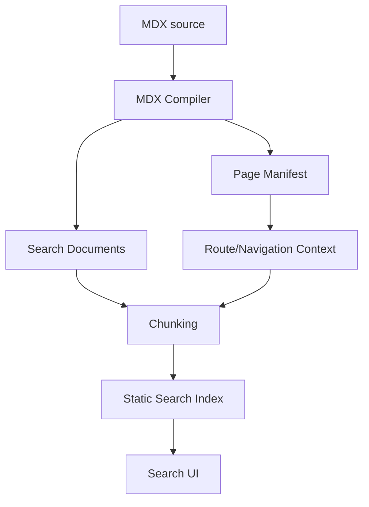

------
title: Build From Scratch: Mintlify-like AI-driven Documentation Generator CLI - Part 017
description: Membangun static search indexing untuk documentation generator: search document extraction, chunking, weighting, faceting, section-level indexing, component-aware extraction, ranking, static artifact output, privacy boundary, and quality diagnostics.
series: learn-mintlify-like-ai-docs-cli
seriesTitle: Build From Scratch: Mintlify-like AI-driven Documentation Generator CLI
order: 17
partTitle: Search Indexing with Static Search
tags:
  - documentation
  - ai
  - cli
  - mdx
  - search
  - static-site-generator
  - developer-tools
date: 2026-07-03
---

# Part 017 — Search Indexing with Static Search

Search adalah salah satu fitur yang paling menentukan kualitas docs.

User jarang membaca dokumentasi secara linear dari awal sampai akhir. Mereka sering datang dengan intent seperti:

- "config field apa untuk output directory?"
- "command untuk generate API reference?"
- "error ini artinya apa?"
- "endpoint untuk create user?"
- "cara setup auth?"
- "bagaimana migrate dari v1 ke v2?"
- "di mana contoh Java SDK?"

Kalau search buruk, docs terasa buruk walaupun kontennya lengkap.

Dalam documentation generator seperti DocForge, search bukan sekadar `Ctrl+F` global. Search harus memahami:

1. page title,
2. heading,
3. section,
4. route,
5. component content,
6. code samples,
7. API method/path,
8. config fields,
9. CLI command,
10. troubleshooting symptoms,
11. generated reference docs,
12. dan agent-ready export.

Part ini membangun static search indexing yang cocok untuk docs site statis: tidak memerlukan server search khusus, bisa di-host di static hosting, dan tetap cukup cepat untuk dokumentasi developer.

---

## 1. Mental model: search adalah read model

Search index bukan source of truth.

Search adalah **read model** yang dibangun dari compiled docs.



Jangan membuat search indexer membaca filesystem dan parse MDX sendiri secara terpisah dari compiler. Itu membuat search dan rendered docs bisa berbeda.

Correct principle:

> Apa yang bisa dicari harus berasal dari content yang berhasil dikompilasi dan akan dipublish.

---

## 2. Static search vs server search

Search architecture options:

| Model | Kelebihan | Kekurangan |
|---|---|---|
| Static local index | Mudah deploy, privacy bagus, tidak butuh backend | Index besar bisa berat |
| Server search | Ranking lebih kuat, analytics, scalable | Butuh backend, auth, ops |
| Hosted search SaaS | Cepat implementasi, fitur kaya | Cost, vendor, data leaves environment |
| Hybrid | Static fallback + remote enhanced | Kompleks |

Untuk seri ini, target awal: **static search**.

Kenapa?

- cocok untuk docs-as-code,
- output bisa di-host di static hosting,
- build deterministic,
- tidak butuh database runtime,
- user bisa deploy di mana saja,
- enterprise/internal docs bisa lebih mudah dikontrol.

---

## 3. Search responsibilities

Search subsystem punya beberapa responsibility.


Detail:

| Stage | Responsibility |
|---|---|
| Extract | Ambil searchable text dari compiled pages/components/API metadata. |
| Normalize | Lowercase, trim, tokenize, strip noise, preserve code tokens. |
| Chunk | Pecah page menjadi section-level units. |
| Weight | Beri bobot title, heading, command, endpoint, prose. |
| Index | Emit static index artifact. |
| Serve | Load index di browser. |
| Rank | Urutkan hasil berdasarkan score. |
| Render | Tampilkan title, section, excerpt, route. |

---

## 4. Search data model

Search dimulai dari `SearchDocument`.

```ts
export type SearchDocument = {
  pageId: PageId;
  route: RoutePath;
  title: string;
  description: string;
  kind: PageKind;
  tags: string[];
  sections: SearchSection[];
  metadata: SearchMetadata;
};

export type SearchSection = {
  id: string;
  heading?: string;
  anchor?: string;
  level?: number;
  text: string;
  code?: SearchCodeBlock[];
  entities?: SearchEntity[];
};

export type SearchCodeBlock = {
  language: string;
  title?: string;
  text: string;
  executable?: boolean;
};

export type SearchEntity =
  | { type: "cliCommand"; name: string }
  | { type: "configField"; name: string }
  | { type: "apiOperation"; operationId: string; method: string; path: string }
  | { type: "symbol"; name: string; language?: string }
  | { type: "package"; name: string };

export type SearchMetadata = {
  sourcePath: string;
  navPath: string[];
  breadcrumbs: string[];
  generated: boolean;
  hidden: boolean;
  draft: boolean;
};
```

Key idea: search document is not just text. It includes structured entities.

---

## 5. Search chunk model

A search result should usually point to a section, not only a page.

Bad result:

```txt
Configuration Reference
/docs/reference/configuration
```

Better result:

```txt
outputDir
Configuration Reference > Build output
/docs/reference/configuration#build-output

Defines where the static site build is written.
```

Chunk type:

```ts
export type SearchChunk = {
  id: string;
  pageId: PageId;
  route: RoutePath;
  anchor?: string;
  title: string;
  sectionTitle?: string;
  breadcrumbs: string[];
  kind: PageKind;
  text: string;
  entities: SearchEntity[];
  weight: number;
};
```

Chunk route:

```ts
export function chunkHref(chunk: SearchChunk): string {
  return chunk.anchor
    ? `${chunk.route}#${chunk.anchor}`
    : chunk.route;
}
```

---

## 6. Chunking strategy

Chunk boundaries should follow headings.

Example MDX:

```mdx
# Configuration Reference

## Build output

The `outputDir` field controls where static output is written.

## Search

The `search.enabled` field controls whether search artifacts are emitted.
```

Chunks:

```json
[
  {
    "title": "Configuration Reference",
    "sectionTitle": "Build output",
    "anchor": "build-output",
    "text": "The outputDir field controls where static output is written."
  },
  {
    "title": "Configuration Reference",
    "sectionTitle": "Search",
    "anchor": "search",
    "text": "The search.enabled field controls whether search artifacts are emitted."
  }
]
```

Rules:

1. H1 is page title.
2. H2 creates major chunks.
3. H3 may create subchunks if content is large.
4. Very small sections can be merged with parent.
5. Very large sections should be split by paragraph/code/table boundaries.
6. API operations are independent chunks.
7. Troubleshooting entries are independent chunks.

---

## 7. Chunk size

If chunks are too small:

- results lack context,
- ranking gets noisy,
- query terms split across chunks.

If chunks are too large:

- result points too broadly,
- excerpts are vague,
- index becomes heavy.

Suggested targets:

| Chunk type | Target size |
|---|---:|
| Concept/prose section | 300-1200 words |
| How-to step group | 100-600 words |
| API operation | one operation |
| Config field | one field or field group |
| Troubleshooting symptom | one problem/solution |
| CLI command | one command |

Implementation:

```ts
export function splitLargeSection(section: SearchSection): SearchSection[] {
  if (wordCount(section.text) <= 800) {
    return [section];
  }

  return splitByParagraphs(section, {
    targetWords: 500,
    maxWords: 900,
  });
}
```

Do not split code blocks in the middle unless necessary.

---

## 8. Component-aware extraction

From Part 016, every component has search extraction behavior.

Examples:

### 8.1 Callout

MDX:

```mdx
<Callout type="warning" title="Do not publish unreviewed AI output">
Always review generated documentation before applying it to the main branch.
</Callout>
```

Search text:

```txt
Do not publish unreviewed AI output
Always review generated documentation before applying it to the main branch.
```

### 8.2 Tabs

All tabs should be searchable:

```mdx
<Tabs>
  <Tab title="npm">
    npm install -D docforge
  </Tab>
  <Tab title="pnpm">
    pnpm add -D docforge
  </Tab>
</Tabs>
```

Search should find:

- `npm install`,
- `pnpm add`,
- `docforge`.

### 8.3 CardGroup

Cards are navigation and should be searchable lightly:

```txt
Generate API reference
Create endpoint documentation from an OpenAPI specification.
```

### 8.4 Accordion

Even collapsed content should be indexed.

### 8.5 ApiOperation

Index:

- operation ID,
- summary,
- method,
- path,
- tags,
- parameters,
- request body field names,
- response status codes,
- error model,
- examples.

---

## 9. Text extraction pipeline

Compiler produces AST. Search extractor walks AST.

```ts
export function extractSearchDocument(
  page: CompilePageResult,
  manifestEntry: PageManifestEntry,
  registry: ComponentRegistry
): SearchDocument {
  const sections = extractSearchSectionsFromAst(page.ast, {
    registry,
    route: manifestEntry.route,
    pageTitle: manifestEntry.title,
  });

  return {
    pageId: manifestEntry.id,
    route: manifestEntry.route,
    title: manifestEntry.title,
    description: manifestEntry.description,
    kind: manifestEntry.kind,
    tags: manifestEntry.tags,
    sections,
    metadata: {
      sourcePath: manifestEntry.sourcePath,
      navPath: [],
      breadcrumbs: [],
      generated: manifestEntry.generated,
      hidden: manifestEntry.hidden,
      draft: manifestEntry.draft,
    },
  };
}
```

Do not include draft pages in production search.

Hidden pages are configurable.

---

## 10. Normalize text

Search text should be normalized while preserving developer tokens.

Naive normalization destroys useful terms:

- `docforge.config.json`,
- `search.enabled`,
- `POST /users`,
- `UserService.createUser`,
- `@acme/sdk`,
- `--dry-run`,
- `HTTP 401`,
- `application/json`.

Normalization must preserve code-like tokens.

```ts
export function normalizeSearchText(input: string): string {
  return input
    .replace(/\s+/g, " ")
    .trim();
}
```

Do not over-normalize initially.

A developer search engine should understand exact tokens.

---

## 11. Tokenization for developer docs

Token categories:

| Token type | Example |
|---|---|
| natural word | documentation |
| CLI command | `docforge build` |
| flag | `--dry-run` |
| file path | `docs/index.mdx` |
| package | `@acme/sdk` |
| dotted field | `search.enabled` |
| method/path | `POST /users` |
| symbol | `UserService.createUser` |
| status code | `404` |
| content type | `application/json` |

Tokenizer should not split everything on punctuation.

Bad:

```txt
search.enabled -> search, enabled only
```

Good:

```txt
search.enabled -> search.enabled, search, enabled
```

Token expansion:

```ts
export function expandDeveloperToken(token: string): string[] {
  const expanded = new Set<string>();
  expanded.add(token);

  if (token.includes(".")) {
    for (const part of token.split(".")) {
      expanded.add(part);
    }
  }

  if (token.includes("/")) {
    for (const part of token.split("/").filter(Boolean)) {
      expanded.add(part);
    }
  }

  if (token.startsWith("--")) {
    expanded.add(token.slice(2));
  }

  return [...expanded];
}
```

---

## 12. Weighting model

Not all text has same importance.

```ts
export type WeightedText = {
  text: string;
  field: SearchField;
  weight: number;
};

export type SearchField =
  | "pageTitle"
  | "description"
  | "heading"
  | "body"
  | "code"
  | "apiPath"
  | "apiMethod"
  | "cliCommand"
  | "configField"
  | "tag";
```

Suggested weights:

| Field | Weight |
|---|---:|
| pageTitle | 10 |
| section heading | 8 |
| API method/path | 9 |
| CLI command | 9 |
| config field | 9 |
| description | 6 |
| tag | 5 |
| body prose | 2 |
| table cell | 2 |
| code block title | 3 |
| code body | 1 |

Ranking should prioritize exact structured matches.

Query: `outputDir`

Result with config field `outputDir` should outrank a random paragraph mentioning output directory.

---

## 13. Ranking model

For first version, use simple scoring.

```ts
export type SearchQuery = {
  raw: string;
  terms: string[];
  exactPhrases: string[];
};

export type SearchHit = {
  chunk: SearchChunk;
  score: number;
  highlights: SearchHighlight[];
};
```

Score:

```ts
export function scoreChunk(query: SearchQuery, chunk: IndexedChunk): number {
  let score = 0;

  for (const term of query.terms) {
    score += scoreTerm(term, chunk);
  }

  for (const phrase of query.exactPhrases) {
    if (chunk.normalizedText.includes(phrase)) {
      score += 20;
    }
  }

  score += chunk.weight;

  return score;
}
```

Field-aware term score:

```ts
export function scoreTerm(term: string, chunk: IndexedChunk): number {
  let score = 0;

  for (const field of chunk.fields) {
    if (field.tokens.includes(term)) {
      score += field.weight;
    }

    if (field.exactValues.includes(term)) {
      score += field.weight * 2;
    }
  }

  return score;
}
```

---

## 14. Exact search and fuzzy search

Developer docs need exact search more than fuzzy search.

Examples:

- `--dry-run` should match exact flag.
- `POST /users` should match exact endpoint.
- `search.enabled` should match exact config key.
- `UserService` should match exact symbol.

Fuzzy search is useful for typos but can create noisy results.

Suggested order:

1. exact structured matches,
2. exact token matches,
3. phrase matches,
4. prefix matches,
5. fuzzy matches.

Implement fuzzy later.

---

## 15. Static index artifact options

Static search artifact can be:

### Option A — simple JSON index

```json
{
  "chunks": [
    {
      "id": "quickstart#install",
      "title": "Quickstart",
      "sectionTitle": "Install",
      "href": "/quickstart#install",
      "text": "Install DocForge with npm...",
      "tokens": ["install", "docforge", "npm"]
    }
  ]
}
```

Pros:

- easy to implement,
- transparent,
- testable.

Cons:

- large for big docs,
- slower client-side search.

### Option B — inverted index

```json
{
  "terms": {
    "docforge": [["chunk1", 12], ["chunk2", 4]],
    "build": [["chunk3", 10]]
  },
  "chunks": {
    "chunk1": {
      "title": "Quickstart",
      "href": "/quickstart"
    }
  }
}
```

Pros:

- faster query,
- smaller if compressed.

Cons:

- more complex.

### Option C — external static search library

Use Pagefind-like artifact generation.

Pros:

- mature search behavior,
- optimized index.

Cons:

- integration complexity,
- less control over structured developer tokens.

For build-from-scratch learning, start with simple JSON or inverted index. Later can add adapter.

---

## 16. Inverted index model

```ts
export type StaticSearchIndex = {
  version: string;
  chunks: Record<string, SearchChunkPreview>;
  terms: Record<string, Posting[]>;
};

export type Posting = {
  chunkId: string;
  score: number;
  fields: SearchField[];
};

export type SearchChunkPreview = {
  id: string;
  title: string;
  sectionTitle?: string;
  href: string;
  breadcrumbs: string[];
  kind: PageKind;
  excerpt: string;
};
```

Build index:

```ts
export function buildInvertedIndex(chunks: SearchChunk[]): StaticSearchIndex {
  const index: StaticSearchIndex = {
    version: "1",
    chunks: {},
    terms: {},
  };

  for (const chunk of chunks) {
    index.chunks[chunk.id] = toPreview(chunk);

    for (const field of buildWeightedFields(chunk)) {
      const tokens = tokenize(field.text);

      for (const token of tokens) {
        const postings = index.terms[token] ?? [];
        postings.push({
          chunkId: chunk.id,
          score: field.weight,
          fields: [field.field],
        });
        index.terms[token] = postings;
      }
    }
  }

  return compactIndex(index);
}
```

---

## 17. Compacting postings

Multiple fields may produce same term/chunk.

Compact:

```ts
export function compactIndex(index: StaticSearchIndex): StaticSearchIndex {
  for (const [term, postings] of Object.entries(index.terms)) {
    const byChunk = new Map<string, Posting>();

    for (const posting of postings) {
      const existing = byChunk.get(posting.chunkId);

      if (!existing) {
        byChunk.set(posting.chunkId, posting);
        continue;
      }

      existing.score += posting.score;
      existing.fields = [...new Set([...existing.fields, ...posting.fields])];
    }

    index.terms[term] = [...byChunk.values()]
      .sort((a, b) => b.score - a.score);
  }

  return index;
}
```

---

## 18. Stop words

Stop words reduce index noise.

But be careful. Developer docs contain meaningful short tokens:

- `go`,
- `id`,
- `io`,
- `js`,
- `ts`,
- `v1`,
- `v2`.

Generic stop words:

```ts
const STOP_WORDS = new Set([
  "the", "a", "an", "and", "or", "to", "of", "in", "for", "with", "on",
]);
```

Do not remove:

- code tokens,
- flags,
- dotted keys,
- paths,
- uppercase abbreviations,
- numbers that look like status codes.

---

## 19. Excerpts and highlights

Search result should show useful excerpt.

Store compact excerpt at build time:

```ts
export function createExcerpt(text: string, maxLength = 220): string {
  const normalized = text.replace(/\s+/g, " ").trim();

  if (normalized.length <= maxLength) {
    return normalized;
  }

  return normalized.slice(0, maxLength - 1).trimEnd() + "…";
}
```

Query-time highlight:

```ts
export type SearchHighlight = {
  start: number;
  end: number;
  term: string;
};
```

Simpler first version:

- show precomputed excerpt,
- bold matched terms client-side if exact positions easy.

Do not store entire page content in client index if privacy or size matters.

---

## 20. Facets and filters

Search can filter by:

- page kind,
- tag,
- API method,
- service/package,
- version,
- generated/manual,
- language.

Search UI:

```ts
export type SearchFilter = {
  kind?: PageKind[];
  tag?: string[];
  method?: string[];
  version?: string[];
};
```

Index chunk includes facets:

```ts
export type SearchChunkPreview = {
  id: string;
  title: string;
  href: string;
  kind: PageKind;
  tags: string[];
  facets: Record<string, string[]>;
};
```

Useful queries:

- show only API endpoints,
- show only troubleshooting,
- show only config reference,
- show only Java examples.

---

## 21. API search

API reference needs special indexing.

For each operation:

```ts
export function apiOperationToSearchChunk(
  operation: NormalizedApiOperation,
  page: PageManifestEntry
): SearchChunk {
  return {
    id: `api:${operation.operationId}`,
    pageId: page.id,
    route: page.route,
    anchor: operation.operationId,
    title: page.title,
    sectionTitle: `${operation.method} ${operation.path}`,
    breadcrumbs: ["API Reference", ...(operation.tags ?? [])],
    kind: "apiReference",
    text: [
      operation.operationId,
      operation.summary,
      operation.description,
      operation.method,
      operation.path,
      operation.parameters.map((p) => p.name).join(" "),
      operation.responses.map((r) => r.status).join(" "),
    ].join("\n"),
    entities: [
      {
        type: "apiOperation",
        operationId: operation.operationId,
        method: operation.method,
        path: operation.path,
      },
    ],
    weight: 10,
  };
}
```

Query examples:

| Query | Expected |
|---|---|
| `POST /users` | Create user endpoint |
| `createUser` | Operation page |
| `401` | Auth/error response sections |
| `user_id` | Parameter docs |
| `pagination` | API guide/reference |

---

## 22. CLI command search

CLI docs should index commands as structured entities.

Example:

```mdx
## `docforge build`

Build the static docs site.

| Option | Description |
|---|---|
| `--out` | Output directory. |
| `--strict` | Treat warnings as errors. |
```

Extract entity:

```ts
{
  type: "cliCommand",
  name: "docforge build"
}
```

Also extract flags:

```ts
{
  type: "cliFlag",
  command: "docforge build",
  name: "--strict"
}
```

Even if `cliFlag` is not part of initial union, design can extend.

Search `--strict` should land on command reference.

---

## 23. Config field search

Config reference should index fields.

Example field:

```txt
build.outputDir
```

Tokens:

- `build.outputDir`,
- `build`,
- `outputDir`,
- `output`,
- `dir`,
- maybe `outputdir`.

Implementation:

```ts
export function expandConfigFieldToken(field: string): string[] {
  const parts = field.split(".");
  const camelParts = parts.flatMap(splitCamelCase);

  return [
    field,
    ...parts,
    ...camelParts,
    field.toLowerCase(),
  ];
}
```

Search for `output dir` should find `outputDir`.

---

## 24. Code block search policy

Should code body be searchable?

Yes, but with low weight and limits.

Rules:

1. Index code block title strongly.
2. Index comments and small code snippets lightly.
3. Avoid indexing huge generated code blocks fully.
4. Preserve identifiers.
5. Do not index secret-like content.
6. Do not index binary/encoded blobs.

```ts
export function shouldIndexCodeBlock(block: SearchCodeBlock): boolean {
  if (block.text.length > 5000) {
    return false;
  }

  if (containsSecretLikePattern(block.text)) {
    return false;
  }

  return true;
}
```

Diagnostic:

```txt
warning search.code.skippedLargeBlock docs/page.mdx:42:1
Large code block was skipped from search indexing.
```

---

## 25. Privacy and sensitive content

Search index is public if deployed.

Do not index:

- `.env` values,
- API keys,
- tokens,
- private comments,
- internal prompt traces,
- raw source code if config excludes it,
- generated provenance if private.

Secret-like scanner:

```ts
export function redactSearchText(input: string): string {
  return input
    .replace(/sk-[A-Za-z0-9_-]{20,}/g, "[REDACTED_SECRET]")
    .replace(/AKIA[0-9A-Z]{16}/g, "[REDACTED_AWS_KEY]");
}
```

Better:

- detect before indexing,
- emit diagnostic,
- avoid including offending content.

---

## 26. Search config

```ts
export type SearchConfig = {
  enabled: boolean;
  includeHiddenPages: boolean;
  includeCodeBlocks: boolean;
  maxChunkWords: number;
  indexFormat: "json" | "inverted";
  minTermLength: number;
  facets: string[];
};
```

Config file:

```json
{
  "search": {
    "enabled": true,
    "includeHiddenPages": false,
    "includeCodeBlocks": true,
    "indexFormat": "inverted",
    "maxChunkWords": 900
  }
}
```

Validation:

- `maxChunkWords` reasonable,
- `minTermLength` not too high,
- index format supported,
- hidden pages policy explicit if hidden pages exist.

---

## 27. Search build stage

Input:

```ts
export type SearchBuildInput = {
  documents: SearchDocument[];
  manifest: PageManifest;
  navigation: NavNode[];
  config: SearchConfig;
  outputDir: string;
};
```

Output:

```ts
export type SearchBuildOutput = {
  indexFiles: Array<{
    path: string;
    bytes: number;
  }>;
  chunksIndexed: number;
  termsIndexed: number;
  diagnostics: Diagnostic[];
};
```

Build:

```ts
export async function buildSearch(input: SearchBuildInput): Promise<SearchBuildOutput> {
  const diagnostics: Diagnostic[] = [];

  const documents = input.documents
    .filter((doc) => shouldIncludeInSearch(doc, input.config));

  const chunks = documents.flatMap((doc) =>
    chunkSearchDocument(doc, input.config)
  );

  const safeChunks = chunks.map((chunk) =>
    sanitizeSearchChunk(chunk, diagnostics)
  );

  const index = input.config.indexFormat === "inverted"
    ? buildInvertedIndex(safeChunks)
    : buildJsonIndex(safeChunks);

  const files = await writeSearchArtifacts(index, input.outputDir);

  return {
    indexFiles: files,
    chunksIndexed: safeChunks.length,
    termsIndexed: countTerms(index),
    diagnostics,
  };
}
```

---

## 28. Search artifacts

Suggested output:

```txt
search/
  index.json
  meta.json
```

`meta.json`:

```json
{
  "version": "1",
  "format": "inverted",
  "chunks": 428,
  "terms": 9231,
  "generatedAt": "2026-07-03T00:00:00.000Z"
}
```

For determinism, avoid timestamp in deployed meta unless useful. Put timestamp in build report instead.

Index can be compressed by hosting/CDN with gzip/brotli.

---

## 29. Client search loader

Search UI should load index lazily.

```ts
export class StaticSearchClient {
  private indexPromise?: Promise<StaticSearchIndex>;

  constructor(private readonly indexUrl: string) {}

  async search(query: string): Promise<SearchResult[]> {
    const index = await this.loadIndex();
    return searchIndex(index, parseQuery(query));
  }

  private async loadIndex(): Promise<StaticSearchIndex> {
    if (!this.indexPromise) {
      this.indexPromise = fetch(this.indexUrl).then((res) => res.json());
    }

    return this.indexPromise;
  }
}
```

Do not load search index on initial page load unless search UI is opened or config opts in.

---

## 30. Search UI behavior

Good search UX:

- keyboard shortcut `/` or `Cmd+K`,
- instant open,
- lazy index load,
- loading state,
- grouped results,
- keyboard navigation,
- route on Enter,
- highlight terms,
- show breadcrumb,
- show result kind badge,
- no-results suggestions.

Result display:

```txt
Configuration Reference
Build output · /reference/configuration#build-output
Defines where the static site build is written.
```

For API:

```txt
POST /users
API Reference > Users · /api/users/create
Creates a new user.
```

---

## 31. Query parsing

```ts
export type ParsedQuery = {
  raw: string;
  terms: string[];
  phrases: string[];
  filters: Record<string, string[]>;
};
```

Support simple filters later:

```txt
kind:api users
method:POST users
tag:config outputDir
```

Parser:

```ts
export function parseSearchQuery(raw: string): ParsedQuery {
  const phrases = [...raw.matchAll(/"([^"]+)"/g)].map((m) => m[1]!);
  const withoutPhrases = raw.replace(/"([^"]+)"/g, " ");

  const filters: Record<string, string[]> = {};
  const terms: string[] = [];

  for (const token of withoutPhrases.split(/\s+/).filter(Boolean)) {
    const filterMatch = token.match(/^([a-zA-Z]+):(.+)$/);

    if (filterMatch) {
      const [, key, value] = filterMatch;
      filters[key!] = [...(filters[key!] ?? []), value!];
      continue;
    }

    terms.push(token);
  }

  return {
    raw,
    terms: terms.flatMap(expandDeveloperToken),
    phrases,
    filters,
  };
}
```

---

## 32. Result grouping

Avoid showing 10 chunks from same page at top unless query is specific.

Strategy:

1. compute chunk scores,
2. group by page,
3. keep top N chunks per page,
4. diversify top results.

```ts
export function diversifyResults(hits: SearchHit[]): SearchHit[] {
  const byPage = new Map<PageId, SearchHit[]>();

  for (const hit of hits) {
    const group = byPage.get(hit.chunk.pageId) ?? [];
    group.push(hit);
    byPage.set(hit.chunk.pageId, group);
  }

  const diversified: SearchHit[] = [];

  for (const group of byPage.values()) {
    diversified.push(...group.slice(0, 2));
  }

  return diversified.sort((a, b) => b.score - a.score);
}
```

---

## 33. Synonyms and aliases

Developer docs often have terminology aliases:

- "auth" vs "authentication",
- "config" vs "configuration",
- "deploy" vs "deployment",
- "endpoint" vs "operation",
- "schema" vs "contract",
- "docs" vs "documentation".

Config:

```json
{
  "search": {
    "synonyms": {
      "auth": ["authentication", "authorization"],
      "config": ["configuration"],
      "deploy": ["deployment"]
    }
  }
}
```

Query expansion:

```ts
export function expandSynonyms(term: string, synonyms: Record<string, string[]>): string[] {
  return [term, ...(synonyms[term] ?? [])];
}
```

Be conservative. Too many synonyms reduce precision.

---

## 34. Search diagnostics

Search stage should report quality issues.

| Code | Meaning |
|---|---|
| `search.page.noText` | Page has almost no searchable content |
| `search.chunk.tooLarge` | Chunk too large and was split |
| `search.code.skippedLargeBlock` | Code block skipped |
| `search.secret.redacted` | Secret-like content redacted |
| `search.index.tooLarge` | Static index exceeds configured budget |
| `search.component.missingExtractor` | Component lacks search extractor |
| `search.api.operationMissingSummary` | API operation has weak searchable metadata |

Example:

```ts
{
  code: "search.component.missingExtractor",
  severity: "warning",
  category: "search",
  message: "Component <CustomChart> has no search extractor, so its content may not be searchable.",
  hint: "Add extractSearchText to the component registry entry.",
}
```

---

## 35. Index size budget

Static index can become large.

Config:

```json
{
  "search": {
    "maxIndexBytes": 5000000
  }
}
```

Diagnostic:

```txt
warning search.index.tooLarge
Search index is 7.2 MB, above the configured 5 MB budget.

Hint:
Exclude large code blocks, reduce hidden pages, or switch to a remote search provider.
```

Possible mitigations:

- skip large code blocks,
- chunk less aggressively,
- compress output,
- split index by section/group,
- lazy-load index shards,
- use external static search engine.

---

## 36. Sharded index

For large docs:

```txt
search/
  meta.json
  shards/
    api.json
    guides.json
    reference.json
```

Meta:

```json
{
  "shards": [
    {
      "id": "api",
      "url": "/search/shards/api.json",
      "kinds": ["apiReference"]
    },
    {
      "id": "guides",
      "url": "/search/shards/guides.json",
      "kinds": ["howTo", "quickstart"]
    }
  ]
}
```

Query strategy:

- load common shard first,
- load API shard if query looks endpoint-like,
- or load all shards after first query.

This is optional. Start single index.

---

## 37. Search quality evaluation

Do not judge search by "it returns something".

Create benchmark queries.

```ts
export type SearchEvalCase = {
  query: string;
  expectedRoutes: string[];
  expectedTopRoute?: string;
  description: string;
};
```

Examples:

```json
[
  {
    "query": "outputDir",
    "expectedTopRoute": "/reference/configuration#build-output"
  },
  {
    "query": "docforge build --strict",
    "expectedTopRoute": "/reference/cli#docforge-build"
  },
  {
    "query": "POST /users",
    "expectedTopRoute": "/api/users/create"
  }
]
```

Eval metric:

```ts
export type SearchEvalResult = {
  total: number;
  top1: number;
  top3: number;
  top5: number;
  misses: SearchEvalCase[];
};
```

Search quality should be regression-tested.

---

## 38. Integration with docs evaluation

Later Part 039 will evaluate docs quality. Search contributes:

- can user find answer?
- does query return relevant docs?
- does top result answer the question?
- are generated pages discoverable?
- are stale docs surfaced incorrectly?

Search eval should run in CI for important docs.

---

## 39. Package layout

```txt
packages/search/
  src/
    document.ts
    extract.ts
    chunk.ts
    tokenize.ts
    weights.ts
    index-json.ts
    index-inverted.ts
    query.ts
    rank.ts
    client.ts
    diagnostics.ts
    eval.ts
    __tests__/
      tokenize.test.ts
      chunk.test.ts
      rank.test.ts
      api-search.test.ts
      config-field-search.test.ts
```

Build integration:

```txt
packages/static-build/src/stages/search.ts
packages/theme-default/src/components/SearchDialog.tsx
```

---

## 40. Minimal implementation milestone

First version:

1. compiler extracts `SearchDocument`,
2. chunk by H2 sections,
3. tokenize developer-friendly terms,
4. build simple JSON or inverted index,
5. write `search/index.json`,
6. add search dialog UI,
7. support title/heading/body scoring,
8. index tabs/callouts/cards through registry,
9. include API method/path chunks,
10. add basic diagnostics.

Later:

1. fuzzy matching,
2. sharded index,
3. synonyms,
4. filters/facets,
5. search eval suite,
6. query analytics if privacy-safe,
7. remote provider adapter,
8. semantic/vector search optional.

---

## 41. Failure modes

| Failure | Cause | Prevention |
|---|---|---|
| Search result points to whole page only | No section chunking | Chunk by headings/anchors |
| Tabs not searchable | Component extraction ignored | Registry-level extractor |
| API endpoints hard to find | Method/path not structured | API operation entities |
| Config fields rank poorly | Dotted/camel tokens split badly | Developer token expansion |
| Search index too large | Full code blocks indexed | Size budget and code policy |
| Secrets leak in index | No redaction/sensitivity filter | Search sanitization |
| Search and rendered docs differ | Search parses files separately | Use compiler output |
| Hidden/draft docs appear publicly | Bad inclusion policy | Manifest-based filtering |
| Query returns same page repeatedly | No diversification | Group by page |
| Ranking regressions unnoticed | No eval cases | Search eval suite |

---

## 42. Key takeaways

Static search is not just an index file.

It is a read model of the published docs:


A strong docs search system:

1. indexes sections, not only pages,
2. preserves developer tokens,
3. understands components,
4. understands API operations,
5. handles config fields and CLI commands,
6. filters draft/hidden pages correctly,
7. avoids leaking sensitive content,
8. keeps index size under control,
9. and has evaluation cases.

Next, we start the next major subsystem: **codebase indexing**.
