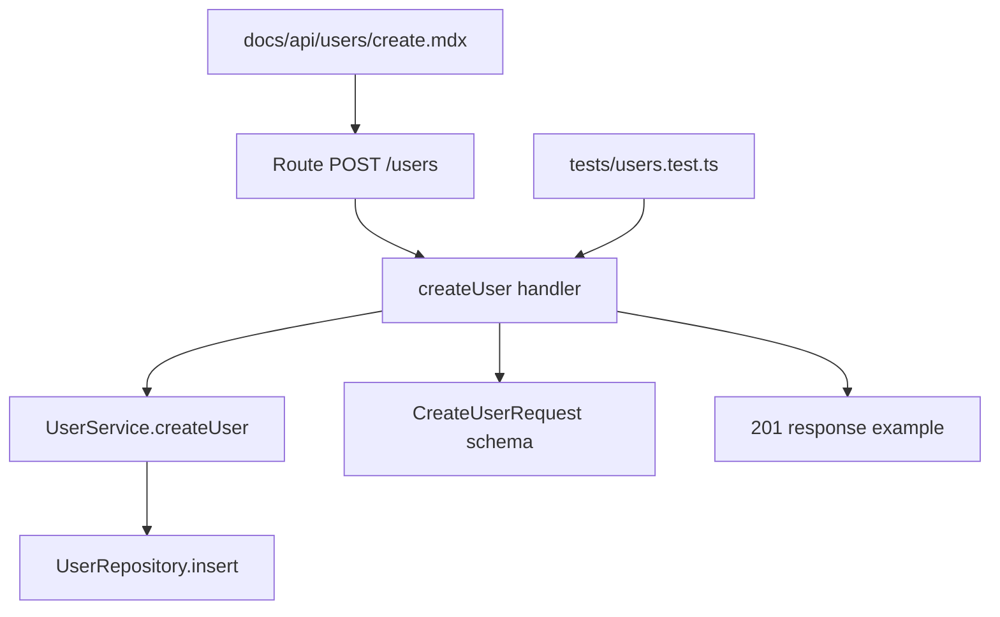
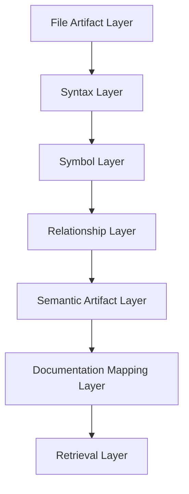
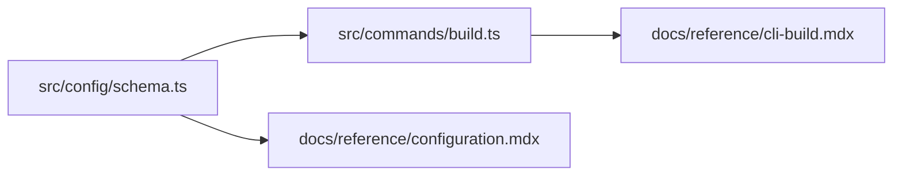
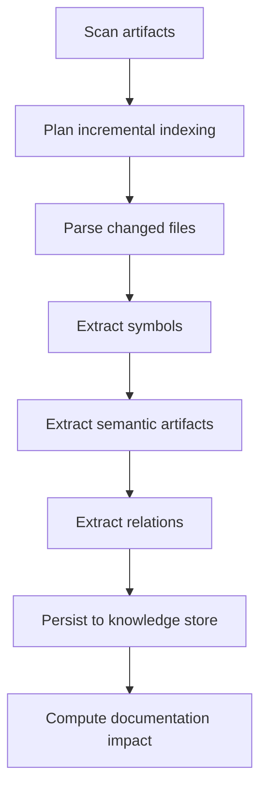
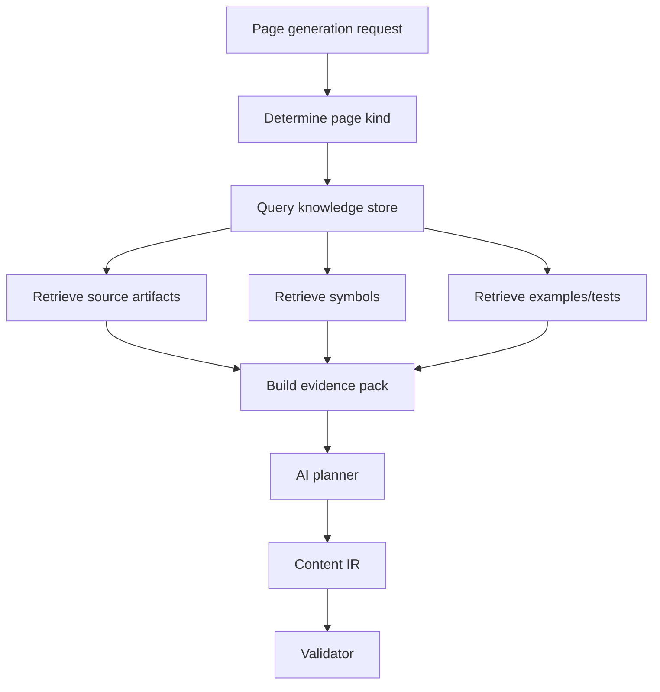
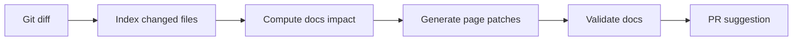
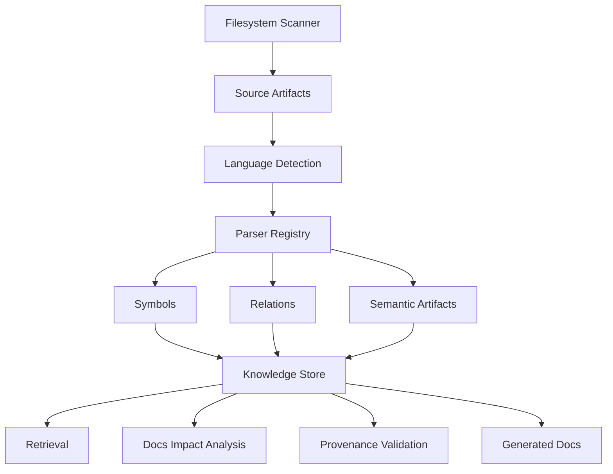
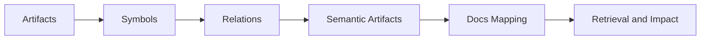

------
title: Build From Scratch: Mintlify-like AI-driven Documentation Generator CLI - Part 018
description: Membangun mental model codebase indexing untuk AI-driven documentation generator: source artifacts, symbol graph, dependency graph, ownership, examples, routes, public API surface, provenance, incremental indexing, and documentation impact analysis.
series: learn-mintlify-like-ai-docs-cli
seriesTitle: Build From Scratch: Mintlify-like AI-driven Documentation Generator CLI
order: 18
partTitle: Codebase Indexing Overview
tags:
  - documentation
  - ai
  - cli
  - codebase-indexing
  - static-analysis
  - developer-tools
date: 2026-07-03
---

# Part 018 — Codebase Indexing Overview

Kita sudah membangun fondasi docs pipeline:

- scanner,
- classifier,
- Content IR,
- MDX authoring,
- compiler,
- navigation,
- dev server,
- static build,
- theme contract,
- search.

Sekarang kita masuk ke subsystem yang membuat project ini benar-benar **AI-driven documentation generator for developers**, bukan hanya static docs generator:

> **codebase indexing**

AI tidak bisa menulis dokumentasi yang grounded kalau ia tidak punya model codebase.

Tetapi "index codebase" sering disalahpahami sebagai:

> "Ambil semua file, split per chunk, buat embedding."

Itu hanya satu lapisan. Untuk documentation generator production-grade, kita butuh model yang lebih struktural.

Kita perlu tahu:

- file apa yang penting,
- simbol apa yang public,
- fungsi mana yang internal,
- endpoint mana yang user-facing,
- contoh penggunaan ada di mana,
- test mana yang menunjukkan behavior,
- config mana yang mengubah runtime,
- package mana yang diekspor,
- route mana yang di-handle,
- breaking change berdampak ke halaman docs apa,
- dan klaim dokumentasi mana yang bisa ditrace ke source.

Codebase index bukan hanya untuk retrieval. Ia adalah **knowledge substrate**.

---

## 1. Mental model: codebase index adalah graph, bukan folder tree

Filesystem memberi kita tree.

```txt
src/
  server.ts
  routes/
    users.ts
  services/
    user-service.ts
```

Tapi dokumentasi butuh graph:



Tree menjawab:

> "File ini ada di mana?"

Graph menjawab:

> "Behavior ini berasal dari apa, dipakai di mana, dan terdokumentasi di halaman mana?"

Itulah yang kita butuhkan.

---

## 2. Codebase indexing goals

### 2.1 Documentation grounding

AI writer harus bisa mengatakan:

> "`docforge build` writes static output into the configured output directory."

Lalu sistem bisa menjawab:

- klaim ini berasal dari command implementation mana?
- config schema field mana?
- test apa yang memverifikasi?
- docs page mana yang memuatnya?

### 2.2 Discovery

Generator harus menemukan:

- CLI commands,
- REST endpoints,
- exported SDK functions,
- config schemas,
- examples,
- tests,
- README sections,
- package metadata,
- OpenAPI specs,
- generated code,
- public types,
- error types.

### 2.3 Impact analysis

Ketika code berubah:

```txt
src/commands/build.ts
```

Sistem harus tahu docs apa yang mungkin stale:

- CLI reference,
- build pipeline guide,
- troubleshooting build errors,
- config reference if flags changed.

### 2.4 Retrieval

Ketika AI diminta menulis halaman:

> "Generate guide for API reference generation"

retrieval harus mengambil:

- relevant command,
- relevant config fields,
- OpenAPI generation code,
- tests,
- examples,
- existing docs,
- not random unrelated files.

### 2.5 Evaluation

Docs bisa diuji terhadap index:

- docs menyebut command yang tidak ada,
- docs lupa option baru,
- docs menjelaskan endpoint yang sudah dihapus,
- docs code sample tidak match exported API.

---

## 3. Indexing layers

Codebase index punya beberapa layer.



| Layer | Isi |
|---|---|
| File artifact | path, hash, size, language, sensitivity, generated/vendor flags |
| Syntax | AST, comments, imports, exports, declarations |
| Symbol | class, function, method, type, interface, constant |
| Relationship | imports, calls, implements, extends, route-to-handler, test-to-subject |
| Semantic artifact | endpoint, CLI command, config field, package export, example |
| Documentation mapping | source → page, symbol → page, endpoint → page |
| Retrieval | chunks, embeddings metadata, keyword index, symbol-aware context |

---

## 4. SourceArtifact revisited

From earlier parts, `SourceArtifact` is the unit scanned from filesystem.

Now enrich it.

```ts
export type SourceArtifact = {
  id: ArtifactId;
  path: string;
  kind: SourceArtifactKind;
  language?: LanguageId;
  hash: string;
  sizeBytes: number;
  generated: boolean;
  vendored: boolean;
  binary: boolean;
  sensitive: SensitivityLevel;
  lastIndexedAt?: string;
};

export type SourceArtifactKind =
  | "sourceCode"
  | "testCode"
  | "exampleCode"
  | "documentation"
  | "apiSpec"
  | "config"
  | "packageManifest"
  | "schema"
  | "buildScript"
  | "unknown";

export type SensitivityLevel =
  | "public"
  | "internal"
  | "secretLike"
  | "excluded";
```

Indexing must skip or limit:

- binary files,
- huge generated files,
- vendored dependencies,
- secret-like files,
- excluded paths.

---

## 5. Language detection

Language matters because parsing differs.

```ts
export type LanguageId =
  | "typescript"
  | "javascript"
  | "java"
  | "go"
  | "python"
  | "json"
  | "yaml"
  | "markdown"
  | "mdx"
  | "unknown";
```

Detection sources:

1. file extension,
2. shebang,
3. package/tool config,
4. content hints,
5. override config.

```ts
export function detectLanguage(path: string, contentSample: string): LanguageId {
  if (path.endsWith(".ts") || path.endsWith(".tsx")) return "typescript";
  if (path.endsWith(".js") || path.endsWith(".jsx")) return "javascript";
  if (path.endsWith(".java")) return "java";
  if (path.endsWith(".go")) return "go";
  if (path.endsWith(".py")) return "python";
  if (path.endsWith(".json")) return "json";
  if (path.endsWith(".yaml") || path.endsWith(".yml")) return "yaml";
  if (path.endsWith(".mdx")) return "mdx";
  if (path.endsWith(".md")) return "markdown";
  return "unknown";
}
```

For real tools, you can use a more comprehensive language detector, but keep internal language IDs stable.

---

## 6. Parse strategy

We need syntax extraction.

Options:

| Parser strategy | Pros | Cons |
|---|---|---|
| Regex | Fast simple patterns | Fragile |
| Language compiler API | Accurate | Per-language complexity |
| Tree-sitter | Multi-language incremental parsing | Need query design |
| Babel/TypeScript parser | Good JS/TS support | JS/TS only |
| JavaParser/JDT | Strong Java support | JVM dependency or separate process |
| Hybrid | Practical | More orchestration |

For a Mintlify-like CLI built with Node/TypeScript, a good strategy:

1. use Tree-sitter for broad symbol extraction,
2. use specialized parsers for key languages/features,
3. use config/plugin hooks for framework-specific discovery,
4. store normalized symbol graph independent of parser.

Part 019 will go deep into Tree-sitter integration.

---

## 7. Symbol model

Core symbol:

```ts
export type SymbolId = string & { readonly brand: unique symbol };

export type CodeSymbol = {
  id: SymbolId;
  artifactId: ArtifactId;
  language: LanguageId;
  kind: SymbolKind;
  name: string;
  qualifiedName: string;
  visibility: SymbolVisibility;
  exported: boolean;
  location: SourceRange;
  docComment?: string;
  signature?: string;
  annotations?: AnnotationRef[];
};

export type SymbolKind =
  | "module"
  | "package"
  | "class"
  | "interface"
  | "typeAlias"
  | "function"
  | "method"
  | "constructor"
  | "field"
  | "constant"
  | "enum"
  | "variable"
  | "routeHandler"
  | "cliCommand"
  | "configField"
  | "schema";

export type SymbolVisibility =
  | "public"
  | "protected"
  | "private"
  | "internal"
  | "unknown";
```

Source range:

```ts
export type SourceRange = {
  path: string;
  startLine: number;
  startColumn: number;
  endLine: number;
  endColumn: number;
};
```

---

## 8. Qualified names

Names must be stable.

Examples:

| Language | Symbol | Qualified name |
|---|---|---|
| TypeScript | exported function | `src/cli/build.ts#buildCommand` |
| Java | class | `com.acme.docs.BuildCommand` |
| Go | function | `github.com/acme/docforge/cmd.Build` |
| Python | method | `docforge.cli.BuildCommand.run` |
| OpenAPI | operation | `openapi:public#createUser` |

Do not rely only on display name.

Two functions named `run` can exist in many files.

Symbol ID can be hash-based:

```ts
export function createSymbolId(input: {
  path: string;
  kind: SymbolKind;
  qualifiedName: string;
}): SymbolId {
  return sha256(`${input.path}:${input.kind}:${input.qualifiedName}`) as SymbolId;
}
```

Caveat: if path changes, ID changes. Later route lock/rename detection can improve.

---

## 9. Relationship model

Symbols are useful, but relationships matter more.

```ts
export type CodeRelation = {
  id: string;
  from: SymbolId | ArtifactId;
  to: SymbolId | ArtifactId;
  kind: RelationKind;
  location?: SourceRange;
  confidence: Confidence;
};

export type RelationKind =
  | "imports"
  | "exports"
  | "calls"
  | "references"
  | "implements"
  | "extends"
  | "annotatedBy"
  | "handlesRoute"
  | "definesCliCommand"
  | "definesConfigField"
  | "tests"
  | "documents"
  | "exampleOf"
  | "generates"
  | "dependsOn";

export type Confidence = "high" | "medium" | "low";
```

Confidence matters because not all extraction is equally certain.

- AST export relation: high.
- Regex route detection: medium/low.
- AI-inferred relation: low unless validated.
- OpenAPI operation: high if parsed from spec.

---

## 10. Semantic artifacts

Not every meaningful documentation unit is a language symbol.

We need semantic artifacts.

```ts
export type SemanticArtifact =
  | ApiEndpointArtifact
  | CliCommandArtifact
  | ConfigFieldArtifact
  | PackageExportArtifact
  | ExampleArtifact
  | TestArtifact
  | ErrorArtifact;

export type ApiEndpointArtifact = {
  type: "apiEndpoint";
  id: string;
  method: string;
  path: string;
  operationId?: string;
  handlerSymbolId?: SymbolId;
  source: ProvenanceRef;
};

export type CliCommandArtifact = {
  type: "cliCommand";
  id: string;
  name: string;
  description?: string;
  options: CliOptionArtifact[];
  handlerSymbolId?: SymbolId;
  source: ProvenanceRef;
};

export type ConfigFieldArtifact = {
  type: "configField";
  id: string;
  path: string;
  schemaType: string;
  required: boolean;
  defaultValue?: unknown;
  description?: string;
  source: ProvenanceRef;
};
```

These artifacts are directly useful for docs.

---

## 11. Public API surface

Documentation should prioritize public surface.

Public surface includes:

- exported package APIs,
- CLI commands/options,
- REST endpoints,
- config fields,
- environment variables,
- extension/plugin APIs,
- public schemas,
- examples users are expected to copy.

Internal implementation details should not dominate docs unless architecture docs need them.

Surface classifier:

```ts
export type PublicSurfaceStatus =
  | "public"
  | "semiPublic"
  | "internal"
  | "private"
  | "unknown";

export type SurfaceClassification = {
  symbolId: SymbolId;
  status: PublicSurfaceStatus;
  reason: string;
};
```

Rules:

| Evidence | Classification |
|---|---|
| exported from package entrypoint | public |
| route exposed by server | public/semiPublic |
| CLI command registered | public |
| config schema field | public |
| private class method | private |
| file under `internal/` | internal |
| test helper | internal |
| generated code | usually internal unless generated SDK |

---

## 12. Example discovery

Examples are gold for documentation.

Example sources:

- `examples/`,
- README code blocks,
- tests,
- sample apps,
- integration tests,
- snippets in existing docs.

Model:

```ts
export type ExampleArtifact = {
  type: "example";
  id: string;
  title?: string;
  language: LanguageId;
  code: string;
  source: ProvenanceRef;
  demonstrates: Array<SymbolId | string>;
  executable?: boolean;
  confidence: Confidence;
};
```

Tests can be examples, but not always. Test setup may be too noisy.

Example classifier should score:

| Signal | Meaning |
|---|---|
| under `examples/` | likely user-facing |
| README code block | likely user-facing |
| test named `should create user` | behavior evidence |
| imports public package | likely usage |
| uses mocks/private helpers | less suitable |
| includes secret/test credentials | avoid |

---

## 13. Test artifact discovery

Tests document behavior.

```ts
export type TestArtifact = {
  type: "test";
  id: string;
  name: string;
  framework?: string;
  artifactId: ArtifactId;
  subjectSymbols: SymbolId[];
  behaviorText?: string;
  source: ProvenanceRef;
};
```

Useful for:

- verifying docs claims,
- understanding expected errors,
- finding usage patterns,
- evaluating generated examples.

Relation:

```txt
tests/users.test.ts -> tests -> UserService.createUser
```

Detection strategies:

- import graph,
- naming conventions,
- test framework AST,
- call graph,
- file path proximity.

---

## 14. Route discovery

Framework-aware discovery finds routes.

Examples:

### Express-like TypeScript

```ts
router.post("/users", createUserHandler);
```

Artifact:

```ts
{
  type: "apiEndpoint",
  method: "POST",
  path: "/users",
  handlerSymbolId: "createUserHandler"
}
```

### Java JAX-RS

```java
@Path("/users")
public class UserResource {
  @POST
  public Response createUser(CreateUserRequest request) { ... }
}
```

Artifact:

```ts
{
  type: "apiEndpoint",
  method: "POST",
  path: "/users",
  handlerSymbolId: "com.acme.UserResource.createUser"
}
```

### Spring MVC

```java
@PostMapping("/users")
public User createUser(@RequestBody CreateUserRequest request) { ... }
```

Framework-aware plugins are necessary. Generic AST alone is not enough.

Part 021 will go deep here.

---

## 15. CLI command discovery

Example TypeScript:

```ts
program
  .command("build")
  .description("Build the static docs site")
  .option("--strict", "Treat warnings as errors")
  .action(runBuild);
```

Artifact:

```ts
{
  type: "cliCommand",
  name: "build",
  description: "Build the static docs site",
  options: [
    {
      name: "--strict",
      description: "Treat warnings as errors"
    }
  ],
  handlerSymbolId: "runBuild"
}
```

Docs generated:

- CLI reference,
- quickstart commands,
- troubleshooting command errors.

---

## 16. Config schema discovery

Sources:

- JSON Schema,
- Zod schema,
- TypeScript types,
- Java config classes,
- YAML schema,
- docs config examples.

Artifact:

```ts
export type ConfigFieldArtifact = {
  type: "configField";
  id: string;
  path: string;
  schemaType: string;
  required: boolean;
  defaultValue?: unknown;
  description?: string;
  source: ProvenanceRef;
};
```

Config docs should prefer schema source over README prose.

If README says field exists but schema does not, diagnostic.

---

## 17. Package export discovery

For libraries/SDKs, public exports matter.

TypeScript package:

- `package.json` exports,
- `src/index.ts` exports,
- generated declaration files,
- README examples.

Java package:

- public classes,
- artifact coordinates,
- Javadocs,
- public API packages.

Go module:

- exported identifiers,
- package docs,
- examples.

Artifact:

```ts
export type PackageExportArtifact = {
  type: "packageExport";
  id: string;
  packageName: string;
  exportName: string;
  symbolId?: SymbolId;
  source: ProvenanceRef;
};
```

---

## 18. Documentation mapping

We need relation between source and docs pages.

```ts
export type DocumentationMapping = {
  pageId: PageId;
  sourceRefs: ProvenanceRef[];
  symbols: SymbolId[];
  semanticArtifacts: string[];
  lastVerifiedHash?: string;
};
```

Examples:

```json
{
  "pageId": "reference-cli-build",
  "symbols": ["symbol:runBuild"],
  "semanticArtifacts": ["cli:build"],
  "sourceRefs": [
    {
      "path": "src/commands/build.ts",
      "startLine": 12,
      "endLine": 48
    }
  ]
}
```

Used for:

- stale detection,
- provenance,
- AI context retrieval,
- docs impact analysis,
- review UI.

---

## 19. Provenance references

Provenance must be small and precise.

```ts
export type ProvenanceRef = {
  artifactId: ArtifactId;
  path: string;
  range?: SourceRange;
  selector?: string;
  hash: string;
  kind: "file" | "symbol" | "schemaField" | "openapiOperation" | "test" | "example";
};
```

Selector examples:

- `package.json#scripts.build`,
- `openapi.yaml#/paths/~1users/post`,
- `src/cli.ts#buildCommand`,
- `docforge.config.schema.json#/properties/build/properties/outputDir`.

Provenance is what separates grounded docs from hallucinated docs.

---

## 20. Knowledge store

Index needs storage.

Options:

| Store | Pros | Cons |
|---|---|---|
| JSON files | Simple, inspectable | Slow for large repos |
| SQLite | Local, queryable, stable | Schema design required |
| Embedded KV | Fast | Less relational |
| In-memory only | Simple dev | Not persistent |

For production CLI, SQLite is a good local knowledge store.

Core tables:

```sql
CREATE TABLE artifacts (
  id TEXT PRIMARY KEY,
  path TEXT NOT NULL,
  kind TEXT NOT NULL,
  language TEXT,
  hash TEXT NOT NULL,
  size_bytes INTEGER NOT NULL,
  generated INTEGER NOT NULL,
  vendored INTEGER NOT NULL,
  sensitive TEXT NOT NULL
);

CREATE TABLE symbols (
  id TEXT PRIMARY KEY,
  artifact_id TEXT NOT NULL,
  kind TEXT NOT NULL,
  name TEXT NOT NULL,
  qualified_name TEXT NOT NULL,
  visibility TEXT NOT NULL,
  exported INTEGER NOT NULL,
  start_line INTEGER,
  start_column INTEGER,
  end_line INTEGER,
  end_column INTEGER
);

CREATE TABLE relations (
  id TEXT PRIMARY KEY,
  from_id TEXT NOT NULL,
  to_id TEXT NOT NULL,
  kind TEXT NOT NULL,
  confidence TEXT NOT NULL
);
```

Part 022 will go deep into repository knowledge store.

---

## 21. Incremental indexing

Do not re-index entire repo every time.

File hash determines whether artifact changed.

```ts
export type IndexingPlan = {
  unchanged: SourceArtifact[];
  changed: SourceArtifact[];
  deleted: SourceArtifact[];
  added: SourceArtifact[];
};
```

Algorithm:

```ts
export function planIndexing(
  previous: ArtifactIndexSnapshot,
  current: SourceArtifact[]
): IndexingPlan {
  const previousByPath = new Map(previous.artifacts.map((a) => [a.path, a]));
  const currentByPath = new Map(current.map((a) => [a.path, a]));

  const changed: SourceArtifact[] = [];
  const added: SourceArtifact[] = [];
  const unchanged: SourceArtifact[] = [];
  const deleted: SourceArtifact[] = [];

  for (const artifact of current) {
    const prev = previousByPath.get(artifact.path);

    if (!prev) {
      added.push(artifact);
    } else if (prev.hash !== artifact.hash) {
      changed.push(artifact);
    } else {
      unchanged.push(artifact);
    }
  }

  for (const artifact of previous.artifacts) {
    if (!currentByPath.has(artifact.path)) {
      deleted.push(artifact);
    }
  }

  return { unchanged, changed, deleted, added };
}
```

When file changes:

- remove old symbols from that artifact,
- parse new artifact,
- insert new symbols,
- recompute direct relations,
- update reverse impact if needed.

---

## 22. Dependency invalidation

If a file changes, other files may be affected.

Example:

```ts
src/config/schema.ts changed
src/commands/build.ts imports schema
docs/reference/configuration.mdx documents schema
```

Need dependency graph.



Impact algorithm:

```ts
export function computeAffectedArtifacts(
  changedArtifactIds: ArtifactId[],
  graph: DependencyGraph,
  maxDepth = 2
): Set<ArtifactId> {
  const affected = new Set<ArtifactId>();
  const queue = changedArtifactIds.map((id) => ({ id, depth: 0 }));

  while (queue.length > 0) {
    const { id, depth } = queue.shift()!;

    if (affected.has(id) || depth > maxDepth) {
      continue;
    }

    affected.add(id);

    for (const dependent of graph.reverseDependencies(id)) {
      queue.push({ id: dependent, depth: depth + 1 });
    }
  }

  return affected;
}
```

Avoid unbounded graph traversal in huge monorepos.

---

## 23. Indexing pipeline



Implementation skeleton:

```ts
export async function indexRepository(input: IndexRepositoryInput): Promise<IndexRepositoryResult> {
  const scan = await scanProject(input.projectRoot, input.config);
  const plan = await createIndexingPlan(scan.artifacts, input.store);

  const parsed = await parseArtifacts(plan.added.concat(plan.changed), input.parsers);

  const symbols = parsed.flatMap(extractSymbols);
  const semanticArtifacts = parsed.flatMap(extractSemanticArtifacts);
  const relations = parsed.flatMap(extractRelations);

  await input.store.transaction(async (tx) => {
    await tx.deleteArtifacts(plan.deleted);
    await tx.replaceArtifacts(plan.added.concat(plan.changed));
    await tx.replaceSymbolsForArtifacts(plan.added.concat(plan.changed), symbols);
    await tx.replaceSemanticArtifactsForArtifacts(plan.added.concat(plan.changed), semanticArtifacts);
    await tx.replaceRelationsForArtifacts(plan.added.concat(plan.changed), relations);
  });

  const impact = await computeDocumentationImpact(plan, input.store);

  return {
    plan,
    symbols,
    semanticArtifacts,
    relations,
    impact,
    diagnostics: [],
  };
}
```

---

## 24. Parser abstraction

```ts
export type ArtifactParser = {
  language: LanguageId;
  parse(input: ParseArtifactInput): Promise<ParseArtifactResult>;
};

export type ParseArtifactInput = {
  artifact: SourceArtifact;
  content: string;
};

export type ParseArtifactResult = {
  artifactId: ArtifactId;
  ast?: unknown;
  symbols: CodeSymbol[];
  relations: CodeRelation[];
  semanticArtifacts: SemanticArtifact[];
  diagnostics: Diagnostic[];
};
```

Parser may fail for one file. That should produce diagnostic, not crash indexer.

```ts
{
  code: "index.parse.failed",
  severity: "warning",
  category: "indexing",
  message: "Could not parse TypeScript file.",
  location: { path: "src/broken.ts" }
}
```

---

## 25. Confidence model

Not all data is equal.

Examples:

| Extraction | Confidence |
|---|---|
| OpenAPI operation from spec | high |
| TypeScript export from AST | high |
| Java annotation route from AST | high |
| Test subject inferred by filename | medium |
| Example demonstrates symbol via text similarity | low |
| AI-inferred relation | low until validated |

Use confidence in retrieval.

High-confidence context should rank higher.

```ts
export function confidenceWeight(confidence: Confidence): number {
  switch (confidence) {
    case "high": return 1.0;
    case "medium": return 0.6;
    case "low": return 0.3;
  }
}
```

---

## 26. Documentation impact analysis

Given changed artifacts, find affected pages.

Inputs:

- changed artifact IDs,
- symbols changed,
- semantic artifacts changed,
- documentation mappings,
- relation graph.

```ts
export type DocumentationImpact = {
  changedArtifacts: ArtifactId[];
  affectedPages: Array<{
    pageId: PageId;
    reason: ImpactReason;
    confidence: Confidence;
  }>;
};

export type ImpactReason =
  | { type: "documentsChangedSymbol"; symbolId: SymbolId }
  | { type: "documentsChangedArtifact"; artifactId: ArtifactId }
  | { type: "documentsChangedApiOperation"; operationId: string }
  | { type: "documentsChangedConfigField"; fieldPath: string }
  | { type: "linkedFromChangedPage"; sourcePageId: PageId };
```

Used by:

- `docforge dev` stale diagnostics,
- `docforge generate --diff`,
- PR automation,
- docs review report.

---

## 27. Retrieval layer overview

RAG for documentation should use structured retrieval.

Query:

> "Write a guide for generating API reference."

Naive embedding may retrieve random docs. Better retrieval uses:

1. keyword match: `api reference`, `OpenAPI`, `generate`,
2. semantic artifacts: OpenAPI generator command,
3. symbols: `generateApiReference`,
4. docs pages: existing API reference docs,
5. examples: config containing `openapi`,
6. tests: API generation tests.

Retrieval result:

```ts
export type RetrievalItem = {
  id: string;
  kind: "source" | "symbol" | "semanticArtifact" | "docPage" | "example" | "test";
  title: string;
  content: string;
  provenance: ProvenanceRef;
  score: number;
  confidence: Confidence;
};
```

Part 028 will go deep.

---

## 28. Indexing and embeddings

Embeddings can be useful, but they are not the whole index.

Embedding candidates:

- doc sections,
- symbol doc comments,
- function signatures + comments,
- examples,
- tests descriptions,
- API operation summaries,
- config field descriptions.

Do not embed:

- secret-like files,
- huge generated code,
- vendored dependencies,
- binary content,
- private files excluded by config.

Store embedding metadata separately:

```ts
export type EmbeddingRecord = {
  id: string;
  targetKind: "symbol" | "artifact" | "docSection" | "example";
  targetId: string;
  model: string;
  vectorHash: string;
  contentHash: string;
};
```

Do not assume embeddings are deterministic across model/provider versions.

---

## 29. Index freshness

Index must know if it is stale.

```ts
export type IndexSnapshot = {
  projectRootHash: string;
  configHash: string;
  toolVersion: string;
  createdAt: string;
  artifacts: Array<{
    path: string;
    hash: string;
  }>;
};
```

Freshness check:

```ts
export async function isIndexFresh(
  snapshot: IndexSnapshot,
  currentArtifacts: SourceArtifact[],
  configHash: string
): Promise<boolean> {
  if (snapshot.configHash !== configHash) {
    return false;
  }

  const previous = new Map(snapshot.artifacts.map((a) => [a.path, a.hash]));

  for (const artifact of currentArtifacts) {
    if (previous.get(artifact.path) !== artifact.hash) {
      return false;
    }
  }

  return true;
}
```

Commands:

```bash
docforge index
docforge index --force
docforge index --status
```

---

## 30. Index diagnostics

Examples:

```txt
warning index.parse.failed src/server.ts:1:1
Could not parse TypeScript file.

Hint:
Check whether the file uses syntax unsupported by the configured parser.
```

```txt
info index.artifact.skippedGenerated src/generated/client.ts
Generated file skipped from codebase index.
```

```txt
warning index.secret.skipped .env
Secret-like file excluded from indexing.
```

```txt
warning index.symbol.duplicateQualifiedName
Multiple symbols share the same qualified name.
```

Diagnostics should distinguish expected skip from failure.

---

## 31. Codebase index and docs generation

When generating a page, use index like this:



Evidence pack must be bounded. Do not dump entire repo into prompt.

```ts
export type EvidencePack = {
  objective: string;
  items: RetrievalItem[];
  constraints: string[];
  missingEvidence: string[];
};
```

If evidence missing, generator should say so or emit diagnostic, not invent.

---

## 32. Codebase index and self-updating docs

When PR changes code:

1. scan changed files,
2. update index,
3. compute impact,
4. identify affected pages,
5. generate doc diff proposal,
6. run validation,
7. open/update PR.



This is why indexing must preserve provenance and mappings.

---

## 33. Boundaries: what not to index

Default exclude:

- `node_modules`,
- `.git`,
- build output,
- cache,
- coverage,
- vendored dependencies,
- binary assets,
- lockfiles maybe metadata only,
- `.env`,
- secrets,
- huge generated clients unless public SDK,
- minified bundles.

Config:

```json
{
  "index": {
    "include": ["src/**", "docs/**", "openapi/**", "examples/**", "tests/**"],
    "exclude": ["**/node_modules/**", "**/dist/**", "**/.env"]
  }
}
```

Do not assume more indexed content always means better AI. Too much irrelevant context hurts.

---

## 34. Index quality metrics

Track:

```ts
export type IndexQualityReport = {
  artifactsTotal: number;
  artifactsIndexed: number;
  artifactsSkipped: number;
  parseFailures: number;
  symbolsExtracted: number;
  semanticArtifactsExtracted: number;
  relationsExtracted: number;
  publicSurfaceSymbols: number;
  examplesFound: number;
  testsMapped: number;
  docsMappings: number;
};
```

Useful output:

```txt
Indexed repository in 1.42s

Artifacts:
  scanned: 842
  indexed: 213
  skipped: 629

Extracted:
  symbols: 1,942
  routes: 34
  CLI commands: 8
  config fields: 62
  examples: 19
  tests mapped: 104

Warnings:
  parse failures: 3
```

---

## 35. Testing strategy

### 35.1 Parser fixtures

```txt
fixtures/typescript-cli/
  src/cli.ts
  expected-symbols.json
  expected-semantic-artifacts.json
```

Test:

```ts
it("extracts CLI command from TypeScript fixture", async () => {
  const result = await parseArtifact(fixtureArtifact("src/cli.ts"));

  expect(result.semanticArtifacts).toContainEqual(
    expect.objectContaining({
      type: "cliCommand",
      name: "build",
    })
  );
});
```

### 35.2 Graph tests

```ts
it("connects route handler to service call", () => {
  const graph = buildGraph(symbols, relations);

  expect(graph.hasRelation({
    from: "route:POST /users",
    to: "symbol:UserService.createUser",
    kind: "calls",
  })).toBe(true);
});
```

### 35.3 Incremental tests

```ts
it("re-indexes only changed artifact", async () => {
  const first = await indexRepository(fixture);
  await fixture.write("src/a.ts", changedContent);

  const second = await indexRepository(fixture);

  expect(second.plan.changed.map((a) => a.path)).toEqual(["src/a.ts"]);
});
```

### 35.4 Impact tests

```ts
it("marks docs page stale when documented symbol changes", async () => {
  const impact = await computeDocumentationImpact({
    changedSymbols: ["symbol:buildCommand"],
  });

  expect(impact.affectedPages).toContainEqual(
    expect.objectContaining({
      pageId: "reference-cli-build",
    })
  );
});
```

---

## 36. Package layout

```txt
packages/code-index/
  src/
    artifact.ts
    language.ts
    parser.ts
    symbol.ts
    relation.ts
    semantic-artifact.ts
    graph.ts
    public-surface.ts
    examples.ts
    tests.ts
    provenance.ts
    incremental.ts
    impact.ts
    diagnostics.ts
    __tests__/
      language.test.ts
      symbol-id.test.ts
      incremental.test.ts
      impact.test.ts

packages/code-index-tree-sitter/
  src/
    parser-registry.ts
    queries/
      typescript.scm
      java.scm
      go.scm
      python.scm

packages/knowledge-store/
  src/
    schema.sql
    store.ts
    migrations.ts
```

Keep core model independent from parser implementation.

---

## 37. Minimal implementation milestone

First version:

1. scan source artifacts,
2. detect language,
3. parse TypeScript/JavaScript symbols,
4. extract imports/exports,
5. extract basic CLI command artifacts if project uses known pattern,
6. persist artifact/symbol tables,
7. compute changed files by hash,
8. expose `docforge index --status`,
9. map generated docs pages to source artifacts via provenance,
10. produce stale diagnostics when source changes.

Second version:

1. Tree-sitter multi-language parsing,
2. Java route discovery,
3. OpenAPI-to-handler mapping,
4. test/example discovery,
5. dependency graph,
6. public surface classification,
7. retrieval API,
8. impact analysis for PR automation.

---

## 38. Common implementation trap: indexing everything

More context is not always better.

If index includes:

- vendor code,
- generated clients,
- compiled output,
- lockfiles,
- minified JS,
- test snapshots,

retrieval becomes noisy and slow.

Good index is selective.

Principle:

> Index what can explain the product, not every byte in the repository.

---

## 39. Common implementation trap: embeddings without structure

Embedding-only systems fail on exact technical queries.

Query:

```txt
--strict
```

Semantic embedding may not retrieve the CLI flag docs.

Structured index can.

Use hybrid retrieval:

- exact token search,
- symbol lookup,
- semantic search,
- graph expansion.

Embeddings are useful, but structure carries engineering truth.

---

## 40. Common implementation trap: no provenance

Without provenance, generated docs become unverifiable.

Bad:

```txt
The build command supports strict mode.
```

No source.

Good internal mapping:

```json
{
  "claim": "The build command supports strict mode.",
  "source": "src/commands/build.ts",
  "range": "42-48",
  "symbol": "cli:build.option.strict"
}
```

This allows fact checking and stale detection.

---

## 41. Common implementation trap: language-specific model leaks everywhere

If your core index model assumes TypeScript only, adding Java later is painful.

Bad:

```ts
type Symbol = {
  exportName: string;
  tsNodeKind: string;
}
```

Better:

```ts
type CodeSymbol = {
  language: LanguageId;
  kind: SymbolKind;
  name: string;
  qualifiedName: string;
}
```

Parser-specific details can be stored as optional metadata, not core dependency.

---

## 42. Codebase index overview diagram



---

## 43. Failure modes

| Failure | Cause | Prevention |
|---|---|---|
| AI docs hallucinate behavior | No grounded code index | Evidence pack from symbols/artifacts/tests |
| Retrieval returns irrelevant files | Index includes too much noise | Include/exclude and public surface classification |
| Exact technical search fails | Embedding-only retrieval | Hybrid token/symbol/semantic retrieval |
| Docs not marked stale | No docs-source mapping | Provenance and documentation mapping |
| Route docs miss endpoints | No framework-aware discovery | Route extraction plugins |
| Public docs expose internals | No public surface classifier | Visibility/export/surface rules |
| Incremental index stale | Bad hash/invalidation | artifact hash and dependency graph |
| Parser crash stops indexing | Exception not isolated | Per-artifact diagnostics |
| Multi-language support painful | TS-specific core model | language-neutral symbol/relation model |
| Generated code dominates index | generated/vendor detection missing | artifact classification and skip policy |

---

## 44. Key takeaways

Codebase indexing is the knowledge foundation of AI-driven docs.

It is not just embeddings. It is a structured graph:



A strong codebase index lets the generator:

1. discover public surface,
2. ground AI output,
3. find examples/tests,
4. generate API/CLI/config docs,
5. detect stale documentation,
6. explain provenance,
7. and update docs based on code diffs.

Next, we go deeper into the parser layer: **Tree-sitter Parser Integration**.
