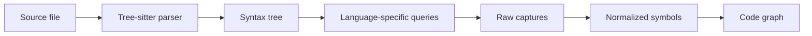
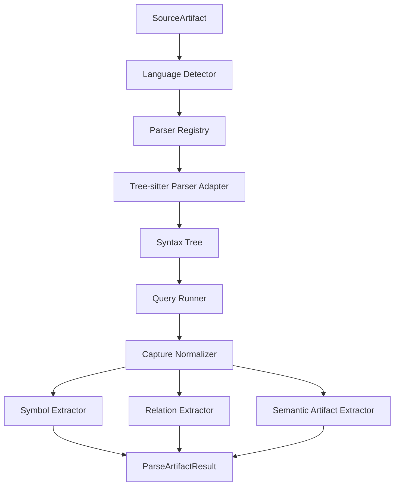
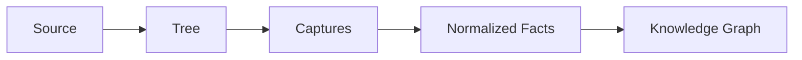

------
title: Build From Scratch: Mintlify-like AI-driven Documentation Generator CLI - Part 019
description: Mengintegrasikan Tree-sitter untuk parser multi-language dalam documentation generator: parser registry, grammar loading, incremental parsing, query system, AST normalization, error recovery, source ranges, performance, and diagnostics.
series: learn-mintlify-like-ai-docs-cli
seriesTitle: Build From Scratch: Mintlify-like AI-driven Documentation Generator CLI
order: 19
partTitle: Tree-sitter Parser Integration
tags:
  - documentation
  - ai
  - cli
  - tree-sitter
  - parser
  - static-analysis
  - developer-tools
date: 2026-07-03
---

# Part 019 — Tree-sitter Parser Integration

Part sebelumnya membahas codebase index sebagai graph.

Sekarang kita masuk ke parser layer.

Kita butuh cara membaca source code lintas bahasa secara cukup akurat, cukup cepat, dan cukup stabil untuk kebutuhan dokumentasi.

Kita tidak sedang membangun compiler lengkap. Kita juga tidak sedang mencoba memahami seluruh semantic runtime. Target kita lebih spesifik:

> ekstrak struktur dokumentasi-relevan dari codebase.

Struktur tersebut meliputi:

- module/import/export,
- function/class/interface/type,
- method/field,
- annotations/decorators,
- comments/doc comments,
- route declarations,
- CLI command declarations,
- schema/config declarations,
- call/reference sederhana,
- dan source location.

Untuk kebutuhan ini, **Tree-sitter** adalah pilihan yang sangat kuat karena menyediakan incremental parsing dan grammar untuk banyak bahasa. Tetapi Tree-sitter bukan magic. Ia menghasilkan syntax tree, bukan domain model dokumentasi. Kita masih harus membangun parser registry, query system, normalizer, extractor, diagnostics, dan cache.

---

## 1. Mental model: Tree-sitter memberi syntax tree, bukan knowledge graph

Tree-sitter menghasilkan concrete syntax tree.



Yang sering salah:

> "Kita sudah parse file dengan Tree-sitter, berarti kita sudah punya code intelligence."

Belum.

Tree-sitter hanya membantu menjawab:

- node apa ini?
- range-nya di mana?
- child-nya apa?
- pattern syntax apa yang match?

Ia tidak otomatis tahu:

- fungsi ini public atau internal,
- route ini user-facing,
- command ini bagian CLI,
- type ini dipakai untuk request body,
- test ini memverifikasi behavior apa,
- docs page mana yang terdampak.

Itu layer kita.

---

## 2. Kenapa Tree-sitter cocok untuk docs generator

Kebutuhan kita:

| Kebutuhan | Kenapa Tree-sitter cocok |
|---|---|
| Multi-language | Banyak grammar tersedia. |
| Cepat | Dirancang untuk parsing interaktif. |
| Incremental | Bisa reuse tree saat file berubah. |
| Error tolerant | Tetap menghasilkan tree walau source belum sempurna. |
| Source location | Node punya byte/range/point. |
| Query system | Bisa mengekstrak pattern syntax dengan query. |
| Editor-grade | Dipakai luas untuk syntax-aware tooling. |

Untuk docs generator, error tolerance penting. Saat `docforge dev` berjalan, user mungkin menyimpan file yang belum selesai. Parser harus menghasilkan diagnostic, bukan crash.

---

## 3. Batas kemampuan Tree-sitter

Tree-sitter tidak memberi:

- type resolution penuh,
- import resolution lintas package secara lengkap,
- call graph akurat 100%,
- framework semantics,
- runtime behavior,
- overload resolution,
- generics semantics,
- reflection/dynamic routing,
- dependency injection binding.

Jadi kita harus desain confidence model.

Contoh:

```ts
router.post("/users", createUser);
```

Route extraction dari syntax: confidence high jika pattern jelas.

Contoh:

```ts
router[methodFromConfig](pathFromConfig, handler);
```

Route extraction statis: confidence low atau unknown.

Jangan pura-pura tahu.

---

## 4. Parser integration architecture



Package layout:

```txt
packages/code-index-tree-sitter/
  src/
    parser-registry.ts
    language-loader.ts
    tree-sitter-parser.ts
    query-loader.ts
    query-runner.ts
    captures.ts
    node-utils.ts
    diagnostics.ts
    source-range.ts
    languages/
      typescript.ts
      javascript.ts
      java.ts
      go.ts
      python.ts
    queries/
      typescript/
        symbols.scm
        imports.scm
        routes.scm
        cli.scm
      java/
        symbols.scm
        annotations.scm
        routes-jaxrs.scm
      go/
        symbols.scm
      python/
        symbols.scm
```

Keep Tree-sitter-specific code separate from core model.

Core model lives in `packages/code-index`.

---

## 5. Parser registry

Parser registry maps language to parser adapter.

```ts
export type TreeSitterLanguageId =
  | "typescript"
  | "tsx"
  | "javascript"
  | "jsx"
  | "java"
  | "go"
  | "python";

export type ParserRegistry = {
  get(language: LanguageId): ArtifactParser | undefined;
  has(language: LanguageId): boolean;
  list(): LanguageId[];
};
```

Implementation:

```ts
export class DefaultParserRegistry implements ParserRegistry {
  private readonly parsers = new Map<LanguageId, ArtifactParser>();

  register(parser: ArtifactParser): void {
    this.parsers.set(parser.language, parser);
  }

  get(language: LanguageId): ArtifactParser | undefined {
    return this.parsers.get(language);
  }

  has(language: LanguageId): boolean {
    return this.parsers.has(language);
  }

  list(): LanguageId[] {
    return [...this.parsers.keys()];
  }
}
```

Usage:

```ts
const parser = registry.get(artifact.language ?? "unknown");

if (!parser) {
  return {
    artifactId: artifact.id,
    symbols: [],
    relations: [],
    semanticArtifacts: [],
    diagnostics: [{
      code: "index.parser.unsupportedLanguage",
      severity: "info",
      category: "indexing",
      message: `No parser registered for language: ${artifact.language}.`,
      location: { path: artifact.path },
    }],
  };
}
```

Unsupported language should not fail whole index.

---

## 6. Tree-sitter parser adapter

Core parser interface from Part 018:

```ts
export type ArtifactParser = {
  language: LanguageId;
  parse(input: ParseArtifactInput): Promise<ParseArtifactResult>;
};
```

Tree-sitter adapter:

```ts
export type TreeSitterParserConfig = {
  language: LanguageId;
  treeSitterLanguage: unknown;
  queries: LanguageQuerySet;
  extractors: LanguageExtractors;
};

export class TreeSitterArtifactParser implements ArtifactParser {
  constructor(private readonly config: TreeSitterParserConfig) {}

  get language(): LanguageId {
    return this.config.language;
  }

  async parse(input: ParseArtifactInput): Promise<ParseArtifactResult> {
    const diagnostics: Diagnostic[] = [];

    try {
      const tree = parseWithTreeSitter(
        this.config.treeSitterLanguage,
        input.content
      );

      diagnostics.push(...diagnosticsFromTreeErrors(input.artifact.path, tree));

      const captures = runLanguageQueries(tree, input, this.config.queries);

      return {
        artifactId: input.artifact.id,
        symbols: this.config.extractors.extractSymbols(captures, input),
        relations: this.config.extractors.extractRelations(captures, input),
        semanticArtifacts: this.config.extractors.extractSemanticArtifacts(captures, input),
        diagnostics,
      };
    } catch (error) {
      return {
        artifactId: input.artifact.id,
        symbols: [],
        relations: [],
        semanticArtifacts: [],
        diagnostics: [normalizeParserCrash(input.artifact.path, error)],
      };
    }
  }
}
```

Parser crash is diagnostic. It should not kill repository indexing.

---

## 7. Language loading

Tree-sitter grammars can be loaded differently depending on runtime.

Abstract it.

```ts
export type LanguageLoader = {
  load(language: LanguageId): Promise<unknown>;
};
```

Example:

```ts
export class NodeTreeSitterLanguageLoader implements LanguageLoader {
  async load(language: LanguageId): Promise<unknown> {
    switch (language) {
      case "typescript":
        return loadTypescriptLanguage();
      case "javascript":
        return loadJavascriptLanguage();
      case "java":
        return loadJavaLanguage();
      case "go":
        return loadGoLanguage();
      case "python":
        return loadPythonLanguage();
      default:
        throw new Error(`Unsupported Tree-sitter language: ${language}`);
    }
  }
}
```

Do not scatter grammar imports across extractors. Centralize loading.

---

## 8. Parser pooling

Creating parsers repeatedly can be wasteful.

Pool by language.

```ts
export class TreeSitterParserPool {
  private readonly parsers = new Map<LanguageId, unknown>();

  async get(language: LanguageId): Promise<unknown> {
    const existing = this.parsers.get(language);
    if (existing) return existing;

    const parser = await createParserForLanguage(language);
    this.parsers.set(language, parser);
    return parser;
  }
}
```

If parser instances are not thread-safe in your runtime, pool per worker instead of global singleton.

---

## 9. Source range conversion

Tree-sitter nodes expose start/end positions. We normalize to `SourceRange`.

```ts
export type SourceRange = {
  path: string;
  startLine: number;
  startColumn: number;
  endLine: number;
  endColumn: number;
};
```

Important: Tree-sitter points are often zero-based.

Docs diagnostics should be one-based.

```ts
export function nodeToSourceRange(path: string, node: TreeSitterNode): SourceRange {
  return {
    path,
    startLine: node.startPosition.row + 1,
    startColumn: node.startPosition.column + 1,
    endLine: node.endPosition.row + 1,
    endColumn: node.endPosition.column + 1,
  };
}
```

Be consistent across all parsers.

---

## 10. Byte ranges vs line ranges

Store both if useful.

```ts
export type SourceRange = {
  path: string;
  startLine: number;
  startColumn: number;
  endLine: number;
  endColumn: number;
  startByte?: number;
  endByte?: number;
};
```

Byte ranges useful for:

- slicing exact source,
- incremental edits,
- source maps,
- patch generation.

Line ranges useful for:

- diagnostics,
- citations,
- human display,
- GitHub comments.

---

## 11. Node utilities

Tree-sitter AST APIs can be verbose. Wrap common operations.

```ts
export function textOf(node: TreeSitterNode, source: string): string {
  return source.slice(node.startIndex, node.endIndex);
}

export function childByFieldName(
  node: TreeSitterNode,
  fieldName: string
): TreeSitterNode | undefined {
  return node.childForFieldName(fieldName) ?? undefined;
}

export function namedChildren(node: TreeSitterNode): TreeSitterNode[] {
  const children: TreeSitterNode[] = [];

  for (let i = 0; i < node.namedChildCount; i++) {
    const child = node.namedChild(i);
    if (child) children.push(child);
  }

  return children;
}
```

Keep low-level node logic out of domain extractors.

---

## 12. Parse errors

Tree-sitter can produce ERROR nodes or missing nodes.

We should detect and report parse quality.

```ts
export function diagnosticsFromTreeErrors(
  path: string,
  tree: TreeSitterTree
): Diagnostic[] {
  const diagnostics: Diagnostic[] = [];

  walkTree(tree.rootNode, (node) => {
    if (node.type === "ERROR") {
      diagnostics.push({
        code: "index.parse.syntaxError",
        severity: "warning",
        category: "indexing",
        message: "Parser found a syntax error in source file.",
        location: nodeToSourceRange(path, node),
        hint: "Indexing will continue, but extracted symbols may be incomplete.",
      });
    }

    if (node.isMissing?.()) {
      diagnostics.push({
        code: "index.parse.missingNode",
        severity: "warning",
        category: "indexing",
        message: "Parser recovered from a missing syntax node.",
        location: nodeToSourceRange(path, node),
      });
    }
  });

  return diagnostics;
}
```

In dev mode, syntax errors are normal while typing. Do not over-warn too noisily. Consider deduping.

---

## 13. Query system

Tree-sitter queries let us capture patterns.

Example conceptual query for TypeScript functions:

```scheme
(function_declaration
  name: (identifier) @function.name) @function.declaration
```

Class:

```scheme
(class_declaration
  name: (type_identifier) @class.name) @class.declaration
```

Import:

```scheme
(import_statement
  source: (string) @import.source) @import.statement
```

Queries should be stored per language and purpose:

```txt
queries/typescript/symbols.scm
queries/typescript/imports.scm
queries/typescript/routes.scm
```

Do not make one giant query file that does everything.

---

## 14. Query loading

```ts
export type QueryName =
  | "symbols"
  | "imports"
  | "exports"
  | "routes"
  | "cli"
  | "config"
  | "tests";

export type LanguageQuerySet = Map<QueryName, CompiledQuery>;

export async function loadLanguageQueries(
  language: LanguageId,
  treeSitterLanguage: unknown
): Promise<LanguageQuerySet> {
  const queryFiles = queryFilesForLanguage(language);
  const result = new Map<QueryName, CompiledQuery>();

  for (const file of queryFiles) {
    const source = await readFile(file.path, "utf8");
    const query = compileTreeSitterQuery(treeSitterLanguage, source);
    result.set(file.name, query);
  }

  return result;
}
```

Query compile errors should fail tests, not appear in user runtime. Treat query files as part of tool code.

---

## 15. Query capture model

Normalize query captures.

```ts
export type QueryCapture = {
  queryName: QueryName;
  captureName: string;
  node: TreeSitterNode;
  text: string;
  range: SourceRange;
  patternIndex?: number;
};

export type QueryMatch = {
  queryName: QueryName;
  captures: QueryCapture[];
};
```

Runner:

```ts
export function runQuery(
  queryName: QueryName,
  query: CompiledQuery,
  tree: TreeSitterTree,
  input: ParseArtifactInput
): QueryMatch[] {
  const matches = query.matches(tree.rootNode);

  return matches.map((match) => ({
    queryName,
    captures: match.captures.map((capture) => ({
      queryName,
      captureName: capture.name,
      node: capture.node,
      text: textOf(capture.node, input.content),
      range: nodeToSourceRange(input.artifact.path, capture.node),
      patternIndex: match.pattern,
    })),
  }));
}
```

Do not let extractors depend directly on raw query API.

---

## 16. Capture grouping

Queries often emit multiple captures per symbol.

Example:

```scheme
(function_declaration
  name: (identifier) @symbol.name
  parameters: (formal_parameters) @symbol.params) @symbol.node
```

Match captures:

```txt
symbol.node
symbol.name
symbol.params
```

Helper:

```ts
export function captureMap(match: QueryMatch): Map<string, QueryCapture[]> {
  const map = new Map<string, QueryCapture[]>();

  for (const capture of match.captures) {
    const group = map.get(capture.captureName) ?? [];
    group.push(capture);
    map.set(capture.captureName, group);
  }

  return map;
}

export function firstCapture(
  map: Map<string, QueryCapture[]>,
  name: string
): QueryCapture | undefined {
  return map.get(name)?.[0];
}
```

---

## 17. Language extractor interface

```ts
export type LanguageExtractors = {
  extractSymbols(
    captures: LanguageCaptures,
    input: ParseArtifactInput
  ): CodeSymbol[];

  extractRelations(
    captures: LanguageCaptures,
    input: ParseArtifactInput
  ): CodeRelation[];

  extractSemanticArtifacts(
    captures: LanguageCaptures,
    input: ParseArtifactInput
  ): SemanticArtifact[];
};

export type LanguageCaptures = {
  byQuery: Map<QueryName, QueryMatch[]>;
};
```

TypeScript extractor differs from Java extractor, but both return core `CodeSymbol`.

---

## 18. TypeScript symbol query example

Conceptual `symbols.scm`:

```scheme
(function_declaration
  name: (identifier) @function.name) @function.declaration

(method_definition
  name: (property_identifier) @method.name) @method.declaration

(class_declaration
  name: (type_identifier) @class.name) @class.declaration

(interface_declaration
  name: (type_identifier) @interface.name) @interface.declaration

(type_alias_declaration
  name: (type_identifier) @type.name) @type.declaration

(lexical_declaration
  (variable_declarator
    name: (identifier) @variable.name)) @variable.declaration
```

Extractor maps:

```ts
export function extractTypeScriptSymbols(
  captures: LanguageCaptures,
  input: ParseArtifactInput
): CodeSymbol[] {
  const symbols: CodeSymbol[] = [];

  for (const match of captures.byQuery.get("symbols") ?? []) {
    const map = captureMap(match);

    symbols.push(...symbolFromCaptureKind("function", map, input));
    symbols.push(...symbolFromCaptureKind("class", map, input));
    symbols.push(...symbolFromCaptureKind("interface", map, input));
    symbols.push(...symbolFromCaptureKind("type", map, input));
    symbols.push(...symbolFromCaptureKind("method", map, input));
  }

  return dedupeSymbols(symbols);
}
```

---

## 19. Export detection

Symbol visibility/public surface needs export info.

TypeScript patterns:

```scheme
(export_statement
  declaration: (function_declaration
    name: (identifier) @export.function.name)) @export.function

(export_statement
  declaration: (class_declaration
    name: (type_identifier) @export.class.name)) @export.class

(export_statement
  (export_clause
    (export_specifier
      name: (identifier) @export.name))) @export.specifier
```

Also:

```ts
export { buildCommand } from "./commands/build";
export * from "./public";
```

Export relations may refer to symbols in other files.

Initial model:

- mark directly exported declarations as `exported: true`,
- create import/export relations,
- later resolve re-exports across files.

---

## 20. Import extraction

TypeScript import query:

```scheme
(import_statement
  source: (string) @import.source) @import.statement
```

Extract:

```ts
export type ImportRef = {
  sourceArtifactId: ArtifactId;
  moduleSpecifier: string;
  location: SourceRange;
};
```

Relation:

```ts
{
  from: artifact.id,
  to: moduleSpecifierToTarget(...),
  kind: "imports",
  confidence: "medium"
}
```

Import target resolution may be incomplete until module resolver stage.

Keep unresolved module specifier as relation metadata.

---

## 21. Java symbol query example

Java class:

```scheme
(class_declaration
  name: (identifier) @class.name) @class.declaration

(interface_declaration
  name: (identifier) @interface.name) @interface.declaration

(method_declaration
  name: (identifier) @method.name) @method.declaration

(constructor_declaration
  name: (identifier) @constructor.name) @constructor.declaration
```

Modifiers:

```scheme
(modifiers) @modifiers
```

Java extractor needs package declaration:

```scheme
(package_declaration
  (scoped_identifier) @package.name)
```

Qualified name:

```txt
<package>.<class>.<method>
```

For Java, class nesting matters. You need ancestor traversal.

---

## 22. Ancestor-aware extraction

A method's qualified name depends on class ancestor.

```java
package com.acme;

public class UserResource {
  public Response createUser() {}
}
```

Method qualified name:

```txt
com.acme.UserResource.createUser
```

Helper:

```ts
export function findAncestor(
  node: TreeSitterNode,
  predicate: (node: TreeSitterNode) => boolean
): TreeSitterNode | undefined {
  let current = node.parent;

  while (current) {
    if (predicate(current)) return current;
    current = current.parent;
  }

  return undefined;
}
```

For TypeScript methods:

```txt
src/services/user-service.ts#UserService.createUser
```

---

## 23. Comments and doc comments

Documentation generator must extract comments.

Not all comments are doc comments.

Examples:

```ts
/**
 * Builds the static documentation site.
 */
export async function buildSite() {}
```

Java:

```java
/**
 * Creates a new user.
 */
@POST
@Path("/users")
public Response createUser(...) {}
```

Comment association strategy:

1. find nearest preceding comment before declaration,
2. ensure no blank/logical barrier if language convention requires,
3. support language-specific doc comment syntax,
4. avoid inline unrelated comments.

Model:

```ts
export type DocComment = {
  text: string;
  format: "jsdoc" | "javadoc" | "godoc" | "pythonDocstring" | "plain";
  range: SourceRange;
};
```

Attach to symbol:

```ts
docComment?: string;
```

---

## 24. Comment association algorithm

Generic:

```ts
export function findLeadingDocComment(
  declarationNode: TreeSitterNode,
  source: string,
  path: string
): DocComment | undefined {
  const previous = previousNamedOrCommentSibling(declarationNode);

  if (!previous || !isCommentNode(previous)) {
    return undefined;
  }

  if (!isDocCommentText(textOf(previous, source))) {
    return undefined;
  }

  return {
    text: cleanDocComment(textOf(previous, source)),
    format: detectDocCommentFormat(textOf(previous, source)),
    range: nodeToSourceRange(path, previous),
  };
}
```

This works for many languages but not all. Python docstrings are inside function/class body, not preceding comments.

Language extractors can override.

---

## 25. Python docstrings

Python:

```python
def build_site(config):
    """Build the static documentation site."""
    ...
```

Tree-sitter pattern conceptually:

```scheme
(function_definition
  name: (identifier) @function.name
  body: (block
    (expression_statement
      (string) @function.docstring)?)) @function.declaration
```

Extractor:

```ts
const docstring = firstCapture(map, "function.docstring")?.text;
```

Clean quotes and indentation.

---

## 26. Go doc comments

Go convention:

```go
// BuildSite builds the static documentation site.
func BuildSite(config Config) error {
    ...
}
```

Public export by capitalized identifier.

```ts
export function goVisibility(name: string): SymbolVisibility {
  return /^[A-Z]/.test(name) ? "public" : "private";
}
```

This is language-specific but maps into generic visibility.

---

## 27. Error-tolerant extraction

When code has syntax errors, partial tree may still contain useful nodes.

Rules:

1. extract symbols outside error nodes,
2. mark file parse diagnostics,
3. set confidence lower if symbol is near error region,
4. do not fail whole file unless parser crashes.

```ts
export function confidenceForNode(node: TreeSitterNode): Confidence {
  return hasErrorAncestor(node) ? "low" : "high";
}
```

---

## 28. Framework query examples: route detection

Tree-sitter can match framework patterns.

Express-like TypeScript:

```scheme
(call_expression
  function: (member_expression
    object: (identifier) @route.router
    property: (property_identifier) @route.method)
  arguments: (arguments
    (string) @route.path
    (_) @route.handler)) @route.call
```

Extractor filters method:

```ts
const HTTP_METHODS = new Set(["get", "post", "put", "patch", "delete"]);

if (!HTTP_METHODS.has(method.toLowerCase())) {
  return undefined;
}
```

Artifact:

```ts
{
  type: "apiEndpoint",
  method: method.toUpperCase(),
  path: stripQuotes(pathCapture.text),
  handlerSymbolId: maybeResolveHandler(handlerCapture),
  source: provenanceFromCapture(routeCallCapture),
}
```

Confidence high if path is string literal and handler is identifier.

---

## 29. Java annotation route detection

JAX-RS:

```java
@Path("/users")
public class UserResource {
  @POST
  public Response createUser() {}
}
```

Query captures annotations:

```scheme
(marker_annotation
  name: (identifier) @annotation.name) @annotation.node

(annotation
  name: (identifier) @annotation.name
  arguments: (annotation_argument_list) @annotation.args) @annotation.node
```

Extractor:

1. collect class-level `@Path`,
2. collect method-level HTTP method annotation,
3. collect method-level `@Path`,
4. combine paths.

Pseudo:

```ts
const classPath = annotationValue(classNode, "Path") ?? "";
const methodPath = annotationValue(methodNode, "Path") ?? "";
const method = httpMethodFromAnnotations(methodNode);

if (method) {
  endpoint.path = joinPaths(classPath, methodPath);
}
```

This requires node ancestor traversal and annotation parsing, not just query capture.

---

## 30. Query vs manual traversal

Tree-sitter queries are powerful, but not everything should be query-only.

Use queries for:

- locating candidate declarations,
- capturing obvious syntax,
- reducing traversal work.

Use manual traversal for:

- ancestor context,
- combining annotations,
- resolving class + method path,
- associating comments,
- computing qualified names,
- interpreting nested structures.

Hybrid is best.

---

## 31. Incremental parsing

Tree-sitter supports incremental parsing if we provide edits.

In CLI indexing, simpler approach:

- file hash unchanged → skip parse,
- file hash changed → parse full file.

This is often enough.

For `docforge dev`, incremental parsing can help if we keep previous tree and edit info, but file watcher usually gives whole file change, not text edit delta.

Recommended:

- start with file-level incremental by hash,
- add Tree-sitter incremental edits only if profiling proves need.

Do not overcomplicate early.

---

## 32. Parse cache

Cache parse results by:

- artifact hash,
- language,
- parser version,
- query version.

```ts
export type ParseCacheKey = {
  artifactHash: string;
  language: LanguageId;
  parserVersion: string;
  queryVersion: string;
};

export type ParseCacheEntry = {
  key: ParseCacheKey;
  result: ParseArtifactResult;
};
```

Query version can be hash of query files.

```ts
export function computeQueryVersion(querySources: string[]): string {
  return sha256(querySources.join("\n---query---\n"));
}
```

If query changes, re-parse/re-extract.

---

## 33. Parser versioning

Tree-sitter grammar updates can change node names.

Store parser metadata:

```ts
export type ParserMetadata = {
  language: LanguageId;
  grammarName: string;
  grammarVersion?: string;
  extractorVersion: string;
  queryVersion: string;
};
```

In knowledge store:

```sql
CREATE TABLE parser_runs (
  artifact_id TEXT NOT NULL,
  artifact_hash TEXT NOT NULL,
  language TEXT NOT NULL,
  extractor_version TEXT NOT NULL,
  query_version TEXT NOT NULL,
  indexed_at TEXT NOT NULL,
  PRIMARY KEY (artifact_id, extractor_version, query_version)
);
```

When extractor/query changes, old index may be stale.

---

## 34. Diagnostics

Parser diagnostics should be precise but not noisy.

Diagnostic examples:

```txt
warning index.parse.syntaxError src/server.ts:42:10
Parser found a syntax error. Indexing will continue, but extracted symbols may be incomplete.
```

```txt
info index.parser.unsupportedLanguage scripts/setup.rb
No parser registered for language: ruby.
```

```txt
warning index.query.captureIncomplete src/routes/users.ts:18:1
Route declaration matched a known pattern but the path is not a string literal.
```

```txt
error index.parser.crash src/weird.ts
Parser crashed while indexing this file.
```

Unsupported language is not error if docs generator can proceed.

Parser crash should be warning/error depending scope.

---

## 35. Query diagnostics

Queries can match ambiguous forms.

Example:

```ts
router.post(getPath(), createUser);
```

We know method is `POST`, but path is dynamic.

Diagnostic:

```ts
{
  code: "index.route.dynamicPath",
  severity: "warning",
  category: "indexing",
  message: "Route path is dynamic and cannot be resolved statically.",
  location: routeCallRange,
  hint: "Use an OpenAPI spec or add an explicit route annotation for documentation generation.",
}
```

But avoid flooding. Deduplicate by code/path/range.

---

## 36. Dedupe diagnostics

```ts
export function dedupeDiagnostics(diagnostics: Diagnostic[]): Diagnostic[] {
  const seen = new Set<string>();
  const result: Diagnostic[] = [];

  for (const diagnostic of diagnostics) {
    const key = [
      diagnostic.code,
      diagnostic.location?.path,
      diagnostic.location?.line,
      diagnostic.location?.column,
      diagnostic.message,
    ].join("|");

    if (seen.has(key)) continue;

    seen.add(key);
    result.push(diagnostic);
  }

  return result;
}
```

---

## 37. Performance strategy

Parsing many files can be expensive.

Optimizations:

1. skip excluded/generated/vendor/binary files,
2. parse only changed files,
3. limit max file size,
4. use bounded concurrency,
5. cache parse results,
6. avoid huge query sets for every file,
7. run framework-specific queries only when signals exist.

Signal-based query selection:

```ts
export function queriesForArtifact(
  artifact: SourceArtifact,
  contentSample: string
): QueryName[] {
  const queries: QueryName[] = ["symbols", "imports", "exports"];

  if (contentSample.includes("router.") || contentSample.includes("@Path")) {
    queries.push("routes");
  }

  if (contentSample.includes(".command(") || contentSample.includes("Command")) {
    queries.push("cli");
  }

  return queries;
}
```

This avoids running route queries on every file.

---

## 38. Bounded concurrency

```ts
export async function parseArtifactsWithConcurrency(
  artifacts: SourceArtifact[],
  concurrency: number,
  parseOne: (artifact: SourceArtifact) => Promise<ParseArtifactResult>
): Promise<ParseArtifactResult[]> {
  return runWithConcurrency(artifacts, concurrency, parseOne);
}
```

Default:

```ts
concurrency = min(cpuCount - 1, 8)
```

Avoid unbounded parse on huge repos.

---

## 39. Memory management

Tree objects can be large.

After extraction, do not keep AST in memory unless needed.

Store:

- symbols,
- relations,
- semantic artifacts,
- diagnostics,
- maybe lightweight source snippets,
- not full tree.

If dev server needs AST for changed file, keep limited LRU cache.

```ts
export class TreeCache {
  private readonly entries = new Map<string, TreeSitterTree>();

  constructor(private readonly maxEntries: number) {}

  set(key: string, tree: TreeSitterTree): void {
    this.entries.set(key, tree);

    while (this.entries.size > this.maxEntries) {
      const oldest = this.entries.keys().next().value;
      this.entries.delete(oldest);
    }
  }
}
```

---

## 40. Testing Tree-sitter integration

### 40.1 Query fixture tests

Fixture:

```txt
fixtures/typescript/basic-symbols/input.ts
fixtures/typescript/basic-symbols/expected-symbols.json
```

Test:

```ts
it("extracts TypeScript symbols", async () => {
  const result = await parseFixture("typescript/basic-symbols/input.ts");

  expect(result.symbols).toMatchObject([
    { kind: "function", name: "buildSite" },
    { kind: "class", name: "BuildCommand" },
  ]);
});
```

### 40.2 Route fixture tests

```ts
it("extracts Express route", async () => {
  const result = await parseFixture("typescript/express-route/input.ts");

  expect(result.semanticArtifacts).toContainEqual(
    expect.objectContaining({
      type: "apiEndpoint",
      method: "POST",
      path: "/users",
    })
  );
});
```

### 40.3 Error recovery tests

```ts
it("does not crash on invalid source", async () => {
  const result = await parseSource("typescript", "export function {");

  expect(result.diagnostics).toContainEqual(
    expect.objectContaining({ code: "index.parse.syntaxError" })
  );
});
```

### 40.4 Golden capture tests

For query changes, capture output can be snapshotted.

Be careful: raw AST details can change with grammar version. Snapshot normalized captures, not entire tree.

---

## 41. Fixture design

Good fixtures should include:

- simple declaration,
- nested declaration,
- exported declaration,
- imports,
- re-exports,
- comments,
- decorators/annotations,
- route declarations,
- dynamic route edge cases,
- syntax error case,
- generated/vendor skip case.

Example:

```txt
fixtures/
  typescript/
    symbols-basic/
    exports/
    express-routes/
    commander-cli/
    invalid-syntax/
  java/
    classes-methods/
    jaxrs-routes/
    spring-routes/
  go/
    exported-functions/
  python/
    docstrings/
```

---

## 42. Abstraction boundary

Tree-sitter types should not leak into core `code-index`.

Bad:

```ts
export type CodeSymbol = {
  node: TreeSitterNode;
}
```

Good:

```ts
export type CodeSymbol = {
  id: SymbolId;
  kind: SymbolKind;
  name: string;
  location: SourceRange;
}
```

If you need parser details for debugging, store optional metadata:

```ts
parserMetadata?: {
  parser: "tree-sitter";
  nodeType: string;
  grammar: string;
}
```

Keep it non-essential.

---

## 43. Handling generated code

Tree-sitter can parse generated code, but we often should skip it.

Detection sources:

- path patterns: `generated/`, `gen/`, `target/generated-sources/`,
- comments: `// Code generated ... DO NOT EDIT`,
- package metadata,
- config exclude rules.

Skip diagnostic:

```txt
info index.artifact.skippedGenerated src/generated/client.ts
Generated file skipped from parser indexing.
```

But sometimes generated SDK is public documentation surface. Allow override:

```json
{
  "index": {
    "includeGenerated": [
      "sdk/generated/public/**"
    ]
  }
}
```

---

## 44. Handling huge files

Set max parse size.

```json
{
  "index": {
    "maxParseBytes": 1000000
  }
}
```

Diagnostic:

```ts
{
  code: "index.artifact.tooLargeToParse",
  severity: "info",
  category: "indexing",
  message: "File skipped because it exceeds maxParseBytes.",
  location: { path: artifact.path },
}
```

Do not parse 20MB generated files by accident.

---

## 45. Handling unknown syntax versions

A file may use new language syntax not supported by grammar.

Symptoms:

- ERROR nodes,
- missing captures,
- parse diagnostics.

Do not immediately fail. But track parse failure rate.

Index quality report:

```ts
export type ParserQualityReport = {
  filesParsed: number;
  filesWithSyntaxErrors: number;
  unsupportedLanguages: number;
  symbolsExtracted: number;
  semanticArtifactsExtracted: number;
};
```

If parse errors are high, warn:

```txt
warning index.parser.highSyntaxErrorRate
28% of parsed TypeScript files contained syntax errors. Extracted documentation context may be incomplete.
```

---

## 46. Minimal implementation milestone

First milestone:

1. integrate Tree-sitter for TypeScript/JavaScript,
2. extract functions/classes/interfaces/types,
3. extract imports/exports,
4. extract JSDoc comments,
5. detect simple Express routes,
6. normalize to `CodeSymbol`, `CodeRelation`, `ApiEndpointArtifact`,
7. persist parse results,
8. add diagnostics,
9. add fixture tests.

Second milestone:

1. Java grammar,
2. Java packages/classes/methods,
3. JAX-RS/Spring annotations,
4. Go/Python basic symbols,
5. query versioning,
6. parse cache,
7. performance profiling,
8. impact analysis integration.

---

## 47. Failure modes

| Failure | Cause | Prevention |
|---|---|---|
| Parser crash stops indexing | Uncaught parser error | Normalize to diagnostic per artifact |
| Wrong line numbers | Zero-based positions exposed | Normalize source ranges |
| Graph polluted with vendor code | No skip policy | artifact classification and exclude rules |
| Route extraction misses dynamic routes | Static parser limitation | Confidence model and diagnostics |
| Generated code dominates index | No generated detection | generated/vendored skip |
| Slow indexing | Parse every file every run | file hash incremental plan and cache |
| Query changes silently break extraction | No fixture tests | golden extractor tests |
| Core tied to Tree-sitter | Parser types leak | normalized model boundary |
| Too many noisy diagnostics | Error nodes from in-progress edits | dedupe and dev-friendly severity |
| Re-export public API missed | only direct export detection | module resolver/re-export relation later |

---

## 48. Key takeaways

Tree-sitter is a syntax engine, not a documentation engine.

Use it to produce reliable syntax facts:



The key design rules:

1. keep parser adapters separate from core model,
2. use queries to find candidates,
3. use traversal to interpret context,
4. normalize source ranges,
5. attach doc comments,
6. handle errors without crashing,
7. cache by file hash and query version,
8. use confidence levels,
9. test with fixtures,
10. and never confuse syntax tree with full semantic understanding.

Next, we build on this parser layer to perform **symbol extraction and code graph construction**.
