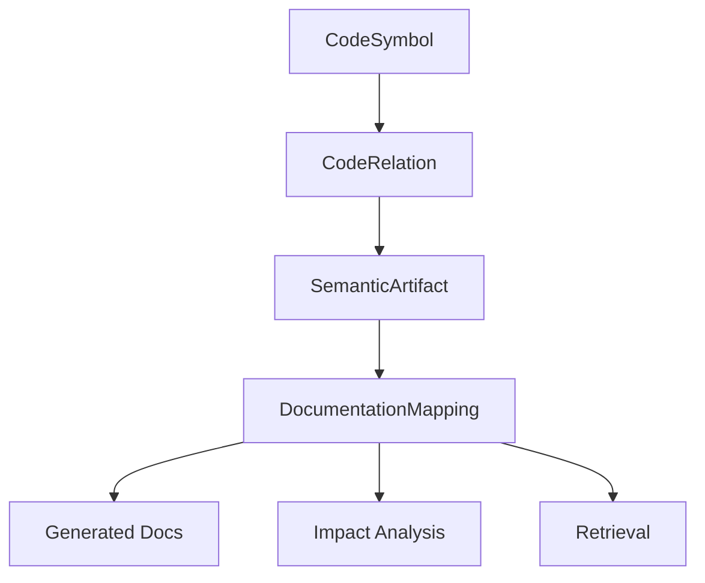
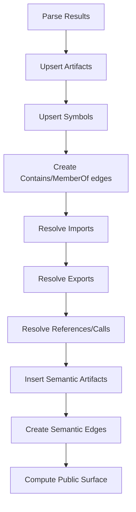
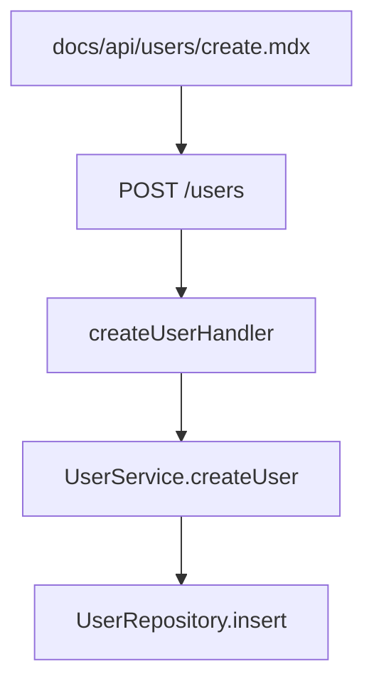
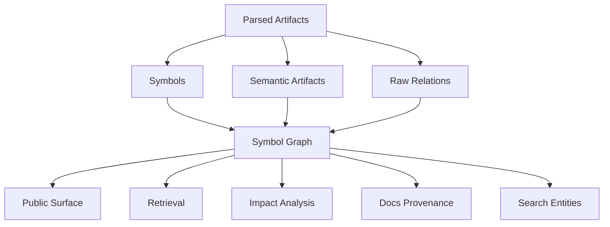
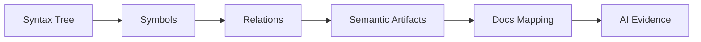

------
title: Build From Scratch: Mintlify-like AI-driven Documentation Generator CLI - Part 020
description: Mendesain ekstraksi symbol dan code graph untuk documentation generator: symbol identity, imports/exports, call/reference relations, module graph, public surface classification, graph storage, graph queries, impact analysis, and diagnostics.
series: learn-mintlify-like-ai-docs-cli
seriesTitle: Build From Scratch: Mintlify-like AI-driven Documentation Generator CLI
order: 20
partTitle: Symbol Extraction and Code Graph
tags:
  - documentation
  - ai
  - cli
  - static-analysis
  - symbol-graph
  - code-graph
  - developer-tools
date: 2026-07-03
---

# Part 020 — Symbol Extraction and Code Graph

Tree-sitter memberi kita syntax facts.

Sekarang kita membangun struktur yang lebih penting untuk documentation generator: **symbol graph** dan **code graph**.

Symbol graph menjawab:

- simbol apa saja yang ada?
- public surface-nya apa?
- simbol ini dideklarasikan di mana?
- komentar dokumentasinya apa?
- signature-nya apa?
- simbol ini diekspor atau internal?

Code graph menjawab:

- file ini import apa?
- function ini memanggil apa?
- route ini di-handle oleh function mana?
- command ini menjalankan handler mana?
- schema ini dipakai oleh endpoint mana?
- test ini memverifikasi symbol mana?
- docs page ini mendokumentasikan source mana?

Untuk AI-driven documentation generator, graph ini menjadi dasar:

1. retrieval,
2. provenance,
3. stale docs detection,
4. public API reference,
5. CLI/config reference,
6. PR impact analysis,
7. doc quality checks.

---

## 1. Mental model: graph adalah truth map, bukan prose

Docs adalah prose. Graph adalah peta kebenaran teknis.



AI writer boleh menghasilkan kalimat, tapi kalimat itu harus ditopang oleh graph.

Contoh claim:

> "`docforge build --strict` treats selected warnings as blocking."

Graph support:

```txt
cliCommand: docforge build
  option: --strict
  handler: buildCommand
  config: build.strict
  docsPage: reference/cli-build
```

Tanpa graph, AI hanya menebak.

---

## 2. Symbol graph vs code graph

Kita bedakan:

### Symbol graph

Fokus pada deklarasi dan identitas.

```txt
UserService
UserService.createUser
CreateUserRequest
UserRepository.insert
```

Relations:

```txt
UserService.createUser belongsTo UserService
UserService exportedFrom src/services/index.ts
```

### Code graph

Fokus pada hubungan behavior.

```txt
POST /users handles UserResource.createUser
UserResource.createUser calls UserService.createUser
UserService.createUser calls UserRepository.insert
users.test.ts tests UserService.createUser
docs/api/users/create.mdx documents POST /users
```

Keduanya saling melengkapi.

---

## 3. Core symbol model

```ts
export type SymbolId = string & { readonly brand: unique symbol };
export type ArtifactId = string & { readonly brand: unique symbol };

export type CodeSymbol = {
  id: SymbolId;
  artifactId: ArtifactId;
  language: LanguageId;
  kind: SymbolKind;
  name: string;
  qualifiedName: string;
  displayName: string;
  visibility: SymbolVisibility;
  exported: boolean;
  location: SourceRange;
  selectionRange?: SourceRange;
  signature?: string;
  docComment?: string;
  modifiers: string[];
  annotations: AnnotationRef[];
  parentSymbolId?: SymbolId;
  parserMetadata?: ParserMetadata;
};

export type SymbolKind =
  | "module"
  | "namespace"
  | "package"
  | "class"
  | "interface"
  | "typeAlias"
  | "function"
  | "method"
  | "constructor"
  | "field"
  | "constant"
  | "enum"
  | "enumMember"
  | "variable"
  | "parameter"
  | "routeHandler"
  | "cliCommand"
  | "configField"
  | "schema";

export type SymbolVisibility =
  | "public"
  | "protected"
  | "private"
  | "internal"
  | "package"
  | "unknown";
```

`location` = full declaration range.  
`selectionRange` = name range, useful for UI/source links.

---

## 4. Symbol identity

Symbol identity must be stable enough for indexing.

Naive ID:

```txt
hash(path + name + line)
```

Problem: line changes when code above changes.

Better:

```txt
hash(project-relative-path + symbol-kind + qualified-name)
```

```ts
export function createSymbolId(input: {
  path: string;
  kind: SymbolKind;
  qualifiedName: string;
}): SymbolId {
  return sha256([
    normalizePath(input.path),
    input.kind,
    input.qualifiedName,
  ].join("|")) as SymbolId;
}
```

This survives line movement but not file rename.

File rename support can be added later by:

- git rename detection,
- content similarity,
- previous symbol signature matching,
- route lock-like symbol mapping.

Start simple.

---

## 5. Qualified name strategy

Qualified name rules differ per language.

### TypeScript

```txt
src/commands/build.ts#buildCommand
src/services/user-service.ts#UserService.createUser
```

### Java

```txt
com.acme.docs.commands.BuildCommand.run
```

### Go

```txt
github.com/acme/docforge/cmd.Build
```

### Python

```txt
docforge.cli.BuildCommand.run
```

Generic helper:

```ts
export type QualifiedNameContext = {
  artifactPath: string;
  packageName?: string;
  moduleName?: string;
  parentNames: string[];
  symbolName: string;
};

export function qualifiedNameForSymbol(
  language: LanguageId,
  ctx: QualifiedNameContext
): string {
  switch (language) {
    case "java":
      return [...optional(ctx.packageName), ...ctx.parentNames, ctx.symbolName].join(".");
    case "typescript":
    case "javascript":
      return `${ctx.artifactPath}#${[...ctx.parentNames, ctx.symbolName].join(".")}`;
    default:
      return [...optional(ctx.moduleName), ...ctx.parentNames, ctx.symbolName].join(".");
  }
}
```

---

## 6. Display name vs qualified name

Docs usually need display name, not internal qualified name.

| Field | Example | Purpose |
|---|---|---|
| `name` | `createUser` | raw local name |
| `displayName` | `UserService.createUser` | human docs |
| `qualifiedName` | `src/services/user-service.ts#UserService.createUser` | stable identity |

Do not show ugly qualified name in prose unless needed.

---

## 7. Parent-child relations

Nested structure matters.

```ts
export type CodeRelation = {
  id: RelationId;
  from: GraphNodeRef;
  to: GraphNodeRef;
  kind: RelationKind;
  location?: SourceRange;
  confidence: Confidence;
  metadata?: Record<string, unknown>;
};

export type GraphNodeRef =
  | { type: "artifact"; id: ArtifactId }
  | { type: "symbol"; id: SymbolId }
  | { type: "semanticArtifact"; id: string }
  | { type: "docPage"; id: PageId }
  | { type: "external"; id: string };
```

Parent relation:

```ts
{
  from: { type: "symbol", id: methodId },
  to: { type: "symbol", id: classId },
  kind: "memberOf",
  confidence: "high"
}
```

File contains symbol:

```ts
{
  from: { type: "artifact", id: artifactId },
  to: { type: "symbol", id: symbolId },
  kind: "contains",
  confidence: "high"
}
```

---

## 8. Relation kinds

```ts
export type RelationKind =
  | "contains"
  | "memberOf"
  | "imports"
  | "exports"
  | "reExports"
  | "calls"
  | "references"
  | "instantiates"
  | "extends"
  | "implements"
  | "annotatedBy"
  | "handlesRoute"
  | "definesCliCommand"
  | "definesConfigField"
  | "usesSchema"
  | "tests"
  | "documents"
  | "exampleOf"
  | "generates"
  | "dependsOn";
```

Do not try to model every possible relation on day one. Start with:

- `contains`,
- `memberOf`,
- `imports`,
- `exports`,
- `references`,
- `handlesRoute`,
- `definesCliCommand`,
- `documents`.

Then add `calls`, `tests`, `usesSchema`.

---

## 9. Relation identity

Relation ID should be deterministic.

```ts
export function createRelationId(input: {
  from: GraphNodeRef;
  to: GraphNodeRef;
  kind: RelationKind;
  location?: SourceRange;
}): RelationId {
  return sha256(JSON.stringify({
    from: input.from,
    to: input.to,
    kind: input.kind,
    path: input.location?.path,
    line: input.location?.startLine,
    column: input.location?.startColumn,
  })) as RelationId;
}
```

If location absent, relation may dedupe aggressively. That is usually fine for high-level graph.

---

## 10. Import graph

Import graph operates at artifact/module level first.

```ts
export type ImportRelationMetadata = {
  specifier: string;
  importedNames?: string[];
  isTypeOnly?: boolean;
  resolved?: boolean;
};
```

Example:

```ts
import { buildSite } from "../build/site";
```

Relation:

```ts
{
  from: { type: "artifact", id: "src/commands/build.ts" },
  to: { type: "artifact", id: "src/build/site.ts" },
  kind: "imports",
  confidence: "high",
  metadata: {
    specifier: "../build/site",
    importedNames: ["buildSite"],
    resolved: true
  }
}
```

If unresolved:

```ts
to: { type: "external", id: "npm:commander" }
```

or:

```ts
to: { type: "external", id: "unresolved:../build/site" }
```

---

## 11. Module resolution

For TypeScript/JavaScript, import resolution depends on:

- relative path,
- extension inference,
- `package.json` exports,
- `tsconfig paths`,
- index files,
- node module resolution,
- ESM/CJS semantics.

Start with relative resolver:

```ts
export function resolveRelativeImport(
  fromPath: string,
  specifier: string,
  artifactIndex: ArtifactPathIndex
): ArtifactId | undefined {
  if (!specifier.startsWith(".") && !specifier.startsWith("/")) {
    return undefined;
  }

  const base = path.resolve(path.dirname(fromPath), specifier);
  const candidates = [
    base,
    `${base}.ts`,
    `${base}.tsx`,
    `${base}.js`,
    `${base}.jsx`,
    path.join(base, "index.ts"),
    path.join(base, "index.tsx"),
    path.join(base, "index.js"),
  ].map(normalizePath);

  for (const candidate of candidates) {
    const artifact = artifactIndex.byPath.get(candidate);
    if (artifact) return artifact.id;
  }

  return undefined;
}
```

Later add TS path mapping.

---

## 12. Export graph

Exports identify public surface.

Direct export:

```ts
export function buildSite() {}
```

Symbol:

```ts
exported: true
```

Relation:

```ts
{
  from: { type: "artifact", id: artifactId },
  to: { type: "symbol", id: buildSiteId },
  kind: "exports",
  confidence: "high"
}
```

Re-export:

```ts
export { buildSite } from "./build/site";
```

Relation:

```ts
{
  from: { type: "artifact", id: indexArtifactId },
  to: { type: "artifact", id: buildSiteArtifactId },
  kind: "reExports",
  confidence: "medium"
}
```

Public package surface may require walking from package entrypoint.

---

## 13. Package public surface graph

For TypeScript package:

```json
{
  "exports": {
    ".": "./dist/index.js",
    "./cli": "./dist/cli.js"
  },
  "types": "./dist/index.d.ts"
}
```

Source mapping may point to `src/index.ts`.

Public surface algorithm:

1. find package entrypoints,
2. resolve source entrypoint if configured,
3. walk export/re-export graph,
4. mark reachable exported symbols as public,
5. mark non-reachable symbols as internal unless other evidence.

```ts
export function computePublicSurface(
  graph: CodeGraph,
  packageEntrypoints: ArtifactId[]
): Set<SymbolId> {
  const publicSymbols = new Set<SymbolId>();
  const visitedArtifacts = new Set<ArtifactId>();
  const queue = [...packageEntrypoints];

  while (queue.length > 0) {
    const artifactId = queue.shift()!;
    if (visitedArtifacts.has(artifactId)) continue;
    visitedArtifacts.add(artifactId);

    for (const relation of graph.outgoing(artifactId)) {
      if (relation.kind === "exports" && relation.to.type === "symbol") {
        publicSymbols.add(relation.to.id);
      }

      if (relation.kind === "reExports" && relation.to.type === "artifact") {
        queue.push(relation.to.id);
      }
    }
  }

  return publicSymbols;
}
```

This is approximate but useful.

---

## 14. Call graph

Call graph is harder.

Example:

```ts
export async function runBuild() {
  await buildSite(config);
}
```

Tree-sitter can capture call expression name:

```scheme
(call_expression
  function: (identifier) @call.name) @call.expression
```

Relation:

```ts
{
  from: currentFunctionSymbol,
  to: unresolvedSymbolRef("buildSite"),
  kind: "calls",
  confidence: "medium"
}
```

Resolution requires scope analysis.

Initial approach:

1. collect call names inside function/method,
2. resolve to imported symbols if import name matches,
3. resolve to same-file symbols if unique,
4. otherwise external/unresolved.

Do not claim full call graph accuracy.

---

## 15. Scope-aware call resolution

Scope model can be simple initially.

```ts
export type Scope = {
  symbolId?: SymbolId;
  parent?: Scope;
  declarations: Map<string, SymbolId>;
  imports: Map<string, SymbolId | ArtifactId | ExternalRef>;
};
```

Resolution:

```ts
export function resolveIdentifier(
  name: string,
  scope: Scope
): SymbolId | ArtifactId | ExternalRef | undefined {
  let current: Scope | undefined = scope;

  while (current) {
    const local = current.declarations.get(name);
    if (local) return local;

    const imported = current.imports.get(name);
    if (imported) return imported;

    current = current.parent;
  }

  return undefined;
}
```

This is not full type checking, but enough for many documentation impact cases.

---

## 16. Reference graph

Reference is weaker than call.

Examples:

```ts
const schema = BuildConfigSchema;
type Config = BuildConfig;
```

Relation:

```ts
kind: "references"
```

References help impact analysis:

- config schema field changed,
- docs page mentions `BuildConfig`,
- command uses schema.

Reference extraction can be based on identifiers. Keep confidence medium/low unless resolved.

---

## 17. Semantic artifacts as graph nodes

Semantic artifacts should be part of graph.

Example API endpoint:

```ts
export type ApiEndpointArtifact = {
  type: "apiEndpoint";
  id: string;
  method: string;
  path: string;
  operationId?: string;
  handlerSymbolId?: SymbolId;
  source: ProvenanceRef;
};
```

Relations:

```ts
{
  from: { type: "semanticArtifact", id: "api:POST:/users" },
  to: { type: "symbol", id: createUserHandlerId },
  kind: "handlesRoute",
  confidence: "high"
}
```

Maybe direction seems reversed. Choose consistent semantics:

- endpoint `handledBy` handler would be another kind.
- We use `handlesRoute` from handler to endpoint or endpoint to handler?

Pick one and document.

Recommended:

```txt
handler --handlesRoute--> endpoint
```

Because source symbol performs handling.

```ts
{
  from: { type: "symbol", id: createUserHandlerId },
  to: { type: "semanticArtifact", id: endpointId },
  kind: "handlesRoute",
  confidence: "high"
}
```

---

## 18. CLI command graph

Command artifact:

```ts
export type CliCommandArtifact = {
  type: "cliCommand";
  id: string;
  name: string;
  description?: string;
  options: CliOptionArtifact[];
  source: ProvenanceRef;
};
```

Relations:

```txt
runBuild --definesCliCommand--> cli:docforge-build
runBuild --calls--> buildSite
buildSite --references--> BuildConfig
docs/reference/cli-build --documents--> cli:docforge-build
```

This makes stale detection practical.

If `runBuild` changes, command docs may be affected.

If option `--strict` added, CLI reference must update.

---

## 19. Config field graph

Config field artifact:

```ts
export type ConfigFieldArtifact = {
  type: "configField";
  id: string;
  path: string;
  schemaType: string;
  required: boolean;
  defaultValue?: unknown;
  description?: string;
  source: ProvenanceRef;
};
```

Relations:

```txt
BuildConfigSchema --definesConfigField--> config:build.strict
runBuild --references--> config:build.strict
docs/reference/configuration --documents--> config:build.strict
```

If schema changes, docs impact is direct.

---

## 20. Document mapping graph

Docs pages become graph nodes too.

```ts
export type DocPageNode = {
  id: PageId;
  route: RoutePath;
  sourcePath: string;
  title: string;
};
```

Relations:

```ts
{
  from: { type: "docPage", id: pageId },
  to: { type: "semanticArtifact", id: "cli:docforge-build" },
  kind: "documents",
  confidence: "high"
}
```

Direction:

```txt
docPage --documents--> sourceThing
```

This reads naturally.

For reverse impact:

```txt
sourceThing changed -> incoming documents relations -> affected pages
```

---

## 21. Graph storage

SQLite tables.

```sql
CREATE TABLE graph_nodes (
  id TEXT PRIMARY KEY,
  type TEXT NOT NULL,
  label TEXT NOT NULL,
  metadata_json TEXT
);

CREATE TABLE graph_edges (
  id TEXT PRIMARY KEY,
  from_id TEXT NOT NULL,
  from_type TEXT NOT NULL,
  to_id TEXT NOT NULL,
  to_type TEXT NOT NULL,
  kind TEXT NOT NULL,
  confidence TEXT NOT NULL,
  path TEXT,
  start_line INTEGER,
  start_column INTEGER,
  end_line INTEGER,
  end_column INTEGER,
  metadata_json TEXT
);

CREATE INDEX idx_graph_edges_from ON graph_edges(from_type, from_id);
CREATE INDEX idx_graph_edges_to ON graph_edges(to_type, to_id);
CREATE INDEX idx_graph_edges_kind ON graph_edges(kind);
```

Separate tables for symbols/artifacts remain useful for structured queries.

Graph table is generic.

---

## 22. Typed graph API

Do not let app code write raw SQL everywhere.

```ts
export type CodeGraph = {
  getNode(ref: GraphNodeRef): Promise<GraphNode | undefined>;
  outgoing(ref: GraphNodeRef, kind?: RelationKind): Promise<CodeRelation[]>;
  incoming(ref: GraphNodeRef, kind?: RelationKind): Promise<CodeRelation[]>;
  neighbors(ref: GraphNodeRef, options?: NeighborOptions): Promise<GraphNode[]>;
  shortestPath(from: GraphNodeRef, to: GraphNodeRef, options?: PathOptions): Promise<CodeRelation[]>;
};
```

For in-memory tests:

```ts
export class InMemoryCodeGraph implements CodeGraph {
  // Useful for unit tests.
}
```

---

## 23. Graph construction pipeline

After parsing artifacts:



Pipeline stages:

```ts
export async function buildCodeGraph(
  parseResults: ParseArtifactResult[],
  ctx: GraphBuildContext
): Promise<GraphBuildResult> {
  const nodes = collectGraphNodes(parseResults);
  const baseEdges = collectBaseEdges(parseResults);

  const importEdges = await resolveImportEdges(parseResults, ctx);
  const exportEdges = await resolveExportEdges(parseResults, ctx);
  const callEdges = await resolveCallEdges(parseResults, ctx);
  const semanticEdges = createSemanticArtifactEdges(parseResults);

  const edges = [
    ...baseEdges,
    ...importEdges,
    ...exportEdges,
    ...callEdges,
    ...semanticEdges,
  ];

  return {
    nodes,
    edges: dedupeRelations(edges),
    diagnostics: [],
  };
}
```

---

## 24. Symbol deduplication

Parsers can produce duplicates.

Dedupe by:

```txt
artifactId + kind + qualifiedName + location
```

```ts
export function dedupeSymbols(symbols: CodeSymbol[]): CodeSymbol[] {
  const byKey = new Map<string, CodeSymbol>();

  for (const symbol of symbols) {
    const key = [
      symbol.artifactId,
      symbol.kind,
      symbol.qualifiedName,
      symbol.location.startLine,
      symbol.location.startColumn,
    ].join("|");

    if (!byKey.has(key)) {
      byKey.set(key, symbol);
    }
  }

  return [...byKey.values()];
}
```

If same qualified name with different locations appears, emit diagnostic.

```ts
{
  code: "index.symbol.duplicateQualifiedName",
  severity: "warning",
  category: "indexing",
  message: `Multiple symbols share qualified name ${qualifiedName}.`,
}
```

---

## 25. Relation deduplication

```ts
export function dedupeRelations(relations: CodeRelation[]): CodeRelation[] {
  const byId = new Map<string, CodeRelation>();

  for (const relation of relations) {
    const existing = byId.get(relation.id);

    if (!existing) {
      byId.set(relation.id, relation);
      continue;
    }

    byId.set(relation.id, mergeRelations(existing, relation));
  }

  return [...byId.values()];
}
```

Merge confidence:

```ts
export function maxConfidence(a: Confidence, b: Confidence): Confidence {
  const rank = { low: 0, medium: 1, high: 2 };
  return rank[a] >= rank[b] ? a : b;
}
```

---

## 26. Public surface classification

Public docs should not expose every internal symbol.

Classifier inputs:

- language visibility,
- exported flag,
- package entrypoint reachability,
- framework endpoint detection,
- CLI command detection,
- config schema detection,
- path conventions,
- annotations,
- doc comments,
- config overrides.

```ts
export type PublicSurfaceClassification = {
  ref: GraphNodeRef;
  status: "public" | "semiPublic" | "internal" | "private" | "unknown";
  reasons: string[];
  confidence: Confidence;
};
```

Classifier:

```ts
export function classifyPublicSurface(
  symbol: CodeSymbol,
  graph: CodeGraphSnapshot,
  config: PublicSurfaceConfig
): PublicSurfaceClassification {
  const reasons: string[] = [];

  if (symbol.visibility === "private") {
    return {
      ref: { type: "symbol", id: symbol.id },
      status: "private",
      reasons: ["language visibility is private"],
      confidence: "high",
    };
  }

  if (symbol.exported && isReachableFromPackageEntrypoint(symbol.id, graph)) {
    reasons.push("exported from package entrypoint");
    return {
      ref: { type: "symbol", id: symbol.id },
      status: "public",
      reasons,
      confidence: "high",
    };
  }

  if (hasOutgoingRelation(symbol.id, "handlesRoute", graph)) {
    reasons.push("handles externally documented route");
    return {
      ref: { type: "symbol", id: symbol.id },
      status: "semiPublic",
      reasons,
      confidence: "high",
    };
  }

  return {
    ref: { type: "symbol", id: symbol.id },
    status: "internal",
    reasons: ["not exported or externally exposed"],
    confidence: "medium",
  };
}
```

---

## 27. Graph queries for docs generation

Common queries:

### 27.1 Find CLI commands

```ts
graph.nodes({ type: "semanticArtifact", artifactType: "cliCommand" })
```

### 27.2 Find docs for symbol

```ts
graph.incoming({ type: "symbol", id: symbolId }, "documents")
```

### 27.3 Find public APIs

```ts
publicSurface.where(status = "public")
```

### 27.4 Find examples for symbol

```ts
graph.incoming({ type: "symbol", id: symbolId }, "exampleOf")
```

### 27.5 Find impact pages

```ts
graph.incoming(changedNodeRef, "documents")
```

### 27.6 Expand context around endpoint

```txt
endpoint <-handlesRoute- handler
handler -calls-> service
handler -usesSchema-> request schema
endpoint <-documents- docs page
endpoint <-tests- test case
```

This becomes evidence pack.

---

## 28. Context expansion

Retrieval should not stop at one node.

```ts
export type ContextExpansionOptions = {
  maxDepth: number;
  relationKinds: RelationKind[];
  maxNodes: number;
};

export async function expandContext(
  graph: CodeGraph,
  seed: GraphNodeRef,
  options: ContextExpansionOptions
): Promise<GraphContext> {
  const visited = new Set<string>();
  const nodes: GraphNode[] = [];
  const edges: CodeRelation[] = [];
  const queue = [{ ref: seed, depth: 0 }];

  while (queue.length > 0 && nodes.length < options.maxNodes) {
    const current = queue.shift()!;
    const key = graphRefKey(current.ref);

    if (visited.has(key) || current.depth > options.maxDepth) {
      continue;
    }

    visited.add(key);

    const node = await graph.getNode(current.ref);
    if (node) nodes.push(node);

    const outgoing = await graph.outgoing(current.ref);
    const relevant = outgoing.filter((edge) =>
      options.relationKinds.includes(edge.kind)
    );

    for (const edge of relevant) {
      edges.push(edge);
      queue.push({ ref: edge.to, depth: current.depth + 1 });
    }
  }

  return { nodes, edges };
}
```

Use depth carefully. Graphs grow fast.

---

## 29. Impact analysis with graph

Given changed artifact:

```txt
src/commands/build.ts
```

Steps:

1. find symbols contained in artifact,
2. find semantic artifacts defined by those symbols,
3. find docs pages that document those nodes,
4. find docs pages that document dependent nodes,
5. rank by confidence.

```ts
export async function computeImpactForChangedArtifact(
  graph: CodeGraph,
  artifactId: ArtifactId
): Promise<DocumentationImpact> {
  const contained = await graph.outgoing(
    { type: "artifact", id: artifactId },
    "contains"
  );

  const changedNodes = contained.map((edge) => edge.to);

  const affectedPages = new Map<PageId, ImpactReason[]>();

  for (const node of changedNodes) {
    const docs = await graph.incoming(node, "documents");

    for (const edge of docs) {
      if (edge.from.type === "docPage") {
        addImpact(affectedPages, edge.from.id, {
          type: "documentsChangedSymbol",
          symbolId: node.id as SymbolId,
        });
      }
    }
  }

  return {
    changedArtifacts: [artifactId],
    affectedPages: [...affectedPages.entries()].map(([pageId, reasons]) => ({
      pageId,
      reasons,
      confidence: "high",
    })),
  };
}
```

Need reverse direction based on our `docPage --documents--> node` relation:

```ts
const docs = await graph.incoming(node, "documents");
```

because docs page points to source node.

---

## 30. Impact ranking

Not every relation means same risk.

| Relation | Impact risk |
|---|---:|
| docs page documents changed config field | high |
| docs page documents changed CLI command | high |
| docs page documents changed endpoint | high |
| docs page documents symbol that calls changed internal helper | medium |
| docs page shares tag with changed symbol | low |
| docs page links to changed page | low/medium |

```ts
export function impactScore(reason: ImpactReason): number {
  switch (reason.type) {
    case "documentsChangedConfigField":
    case "documentsChangedApiOperation":
    case "documentsChangedCliCommand":
      return 1.0;
    case "documentsChangedSymbol":
      return 0.8;
    case "dependentSymbolChanged":
      return 0.5;
    case "linkedFromChangedPage":
      return 0.2;
  }
}
```

Use scores to decide whether to generate docs update or just warn.

---

## 31. Graph and provenance

Every docs claim should point to graph/provenance where possible.

Example internal evidence:

```ts
export type EvidenceRef = {
  graphNode: GraphNodeRef;
  provenance: ProvenanceRef;
  confidence: Confidence;
  excerpt?: string;
};
```

AI prompt evidence item:

```json
{
  "title": "CLI command: docforge build",
  "kind": "cliCommand",
  "source": "src/commands/build.ts:18-44",
  "content": "Command build has options --out, --strict, --no-search."
}
```

The graph helps select evidence. Provenance helps verify it.

---

## 32. Graph and search

Search can use graph entities.

Search chunk for config field:

```txt
config:build.outputDir
```

Graph node:

```txt
semanticArtifact:config:build.outputDir
```

Search result can show structured metadata:

```txt
Config field
build.outputDir
```

Graph also helps related results:

- searching `build` can show CLI command, config fields, guide page, troubleshooting page.

---

## 33. Graph and API reference

OpenAPI operations can be graph nodes.

If code route discovery and OpenAPI spec both produce endpoint:

```txt
code: POST /users
openapi: createUser
```

We can link them.

Relation:

```ts
{
  from: { type: "semanticArtifact", id: "openapi:createUser" },
  to: { type: "semanticArtifact", id: "route:POST:/users" },
  kind: "describesSameEndpoint",
  confidence: "medium"
}
```

If operation ID and route match, confidence high.

This enables:

- detect OpenAPI spec drift from code,
- generate API docs with code examples,
- trace endpoint docs to both spec and handler.

`describesSameEndpoint` was not in initial `RelationKind`; add only when needed or store as metadata. Do not explode relation enum prematurely.

---

## 34. Graph consistency diagnostics

Graph build can detect problems.

| Diagnostic | Meaning |
|---|---|
| `graph.symbol.duplicateQualifiedName` | same qualified name in same scope |
| `graph.import.unresolved` | import target not resolved |
| `graph.export.unresolved` | export target not resolved |
| `graph.endpoint.duplicate` | duplicate method/path |
| `graph.cli.duplicateCommand` | duplicate command name |
| `graph.config.duplicateField` | duplicate config field |
| `graph.docs.unmappedGeneratedPage` | generated page lacks documented source |
| `graph.docs.staleMapping` | mapped source hash changed |

Severity depends on context.

Unresolved import in JS can be normal for external package; not always warning.

---

## 35. Duplicate endpoint detection

```ts
export function validateDuplicateEndpoints(
  artifacts: SemanticArtifact[]
): Diagnostic[] {
  const endpoints = artifacts.filter(isApiEndpoint);
  const byKey = new Map<string, ApiEndpointArtifact[]>();

  for (const endpoint of endpoints) {
    const key = `${endpoint.method.toUpperCase()} ${normalizeApiPath(endpoint.path)}`;
    const group = byKey.get(key) ?? [];
    group.push(endpoint);
    byKey.set(key, group);
  }

  const diagnostics: Diagnostic[] = [];

  for (const [key, group] of byKey) {
    if (group.length > 1) {
      diagnostics.push({
        code: "graph.endpoint.duplicate",
        severity: "warning",
        category: "indexing",
        message: `Multiple handlers appear to define endpoint ${key}.`,
        related: group.map((endpoint) => endpoint.source.range).filter(Boolean) as SourceRange[],
      });
    }
  }

  return diagnostics;
}
```

Could be legitimate due to router composition/versioning. Use warning.

---

## 36. Graph snapshots

Persist graph snapshot for diffing.

```ts
export type GraphSnapshot = {
  version: string;
  createdAt: string;
  artifactHashes: Record<string, string>;
  nodeCount: number;
  edgeCount: number;
  publicSurfaceHash: string;
};
```

Public surface hash:

```ts
export function computePublicSurfaceHash(surface: PublicSurfaceClassification[]): string {
  const normalized = surface
    .filter((entry) => entry.status === "public")
    .map((entry) => graphRefKey(entry.ref))
    .sort()
    .join("\n");

  return sha256(normalized);
}
```

If public surface hash changes, docs likely need review.

---

## 37. Graph diff

Graph diff helps PR automation.

```ts
export type GraphDiff = {
  addedNodes: GraphNodeRef[];
  removedNodes: GraphNodeRef[];
  changedNodes: GraphNodeRef[];
  addedEdges: RelationId[];
  removedEdges: RelationId[];
  publicSurfaceChanged: boolean;
};
```

Use cases:

- new CLI command added,
- endpoint removed,
- config field renamed,
- public function signature changed.

Diff can drive docs generation prompts.

---

## 38. Signature extraction

Symbol signature is important for docs.

TypeScript:

```ts
export function buildSite(config: BuildConfig): Promise<BuildResult>
```

Java:

```java
public BuildResult buildSite(BuildConfig config)
```

Model:

```ts
export type SymbolSignature = {
  text: string;
  parameters?: Array<{
    name: string;
    type?: string;
    optional?: boolean;
  }>;
  returnType?: string;
};
```

`CodeSymbol.signature` can start as string. Later structured signature can be added.

Do not need full type checking initially. Use syntax text.

---

## 39. Doc comment extraction and normalization

Raw comment:

```ts
/**
 * Builds the static documentation site.
 *
 * @param config Normalized build config.
 */
```

Normalized:

```txt
Builds the static documentation site.

@param config Normalized build config.
```

Structured optional:

```ts
export type ParsedDocComment = {
  summary?: string;
  description?: string;
  params: Array<{ name: string; description: string }>;
  returns?: string;
  deprecated?: string;
};
```

Use doc comments as high-value context for AI writer.

But do not blindly publish internal comments. Apply public surface filter.

---

## 40. Graph query examples

### 40.1 Find command handler

```ts
export async function findCommandHandler(
  graph: CodeGraph,
  commandId: string
): Promise<CodeSymbol | undefined> {
  const incoming = await graph.incoming(
    { type: "semanticArtifact", id: commandId },
    "definesCliCommand"
  );

  const handlerEdge = incoming.find((edge) => edge.from.type === "symbol");
  if (!handlerEdge) return undefined;

  return getSymbol(handlerEdge.from.id as SymbolId);
}
```

### 40.2 Find docs pages for endpoint

```ts
export async function findDocsForEndpoint(
  graph: CodeGraph,
  endpointId: string
): Promise<PageId[]> {
  const incoming = await graph.incoming(
    { type: "semanticArtifact", id: endpointId },
    "documents"
  );

  return incoming
    .filter((edge) => edge.from.type === "docPage")
    .map((edge) => edge.from.id as PageId);
}
```

### 40.3 Find examples for public symbol

```ts
export async function findExamplesForSymbol(
  graph: CodeGraph,
  symbolId: SymbolId
): Promise<SemanticArtifact[]> {
  const incoming = await graph.incoming(
    { type: "symbol", id: symbolId },
    "exampleOf"
  );

  return incoming
    .filter((edge) => edge.from.type === "semanticArtifact")
    .map((edge) => getSemanticArtifact(edge.from.id));
}
```

---

## 41. Integration with repository knowledge store

Part 022 will cover store deeply. For now, API:

```ts
export type KnowledgeStore = {
  upsertArtifacts(artifacts: SourceArtifact[]): Promise<void>;
  replaceSymbolsForArtifacts(artifactIds: ArtifactId[], symbols: CodeSymbol[]): Promise<void>;
  replaceRelationsForArtifacts(artifactIds: ArtifactId[], relations: CodeRelation[]): Promise<void>;
  upsertSemanticArtifacts(artifacts: SemanticArtifact[]): Promise<void>;
  getGraph(): CodeGraph;
};
```

Important transaction:

```ts
await store.transaction(async (tx) => {
  await tx.replaceSymbolsForArtifacts(changedArtifactIds, symbols);
  await tx.replaceRelationsForArtifacts(changedArtifactIds, relations);
  await tx.upsertSemanticArtifacts(semanticArtifacts);
});
```

Avoid partial graph updates.

---

## 42. Graph invalidation

When artifact changes:

1. remove old symbols from artifact,
2. remove old relations originating from artifact/symbols,
3. insert new symbols,
4. insert new relations,
5. recompute cross-artifact resolved edges,
6. recompute public surface if needed,
7. recompute docs impact.

Potential issue:

- other artifacts may import symbols from changed artifact.
- their resolved import edges may need update.

Conservative approach:

- re-resolve imports for dependents too.

```ts
const affectedArtifacts = computeAffectedArtifacts([changedArtifactId], dependencyGraph, 1);
```

---

## 43. Graph compaction

Over time, stale nodes can remain if not cleaned.

Use artifact-scoped replacement:

```sql
DELETE FROM symbols WHERE artifact_id = ?;
DELETE FROM graph_edges WHERE metadata_json LIKE '%artifactId...%';
```

Better schema includes `source_artifact_id` on edges.

```sql
ALTER TABLE graph_edges ADD COLUMN source_artifact_id TEXT;
CREATE INDEX idx_graph_edges_source_artifact ON graph_edges(source_artifact_id);
```

Then:

```sql
DELETE FROM graph_edges WHERE source_artifact_id = ?;
```

Design for deletion from beginning.

---

## 44. Graph visualization

For debugging, expose:

```bash
docforge graph show --symbol UserService.createUser
docforge graph show --endpoint "POST /users"
docforge graph export --format mermaid
```

Example Mermaid export:



This helps developers trust the system.

---

## 45. Graph CLI commands

Useful commands:

```bash
docforge index
docforge graph stats
docforge graph search UserService
docforge graph show --symbol UserService.createUser
docforge graph impact --changed src/commands/build.ts
docforge graph public-surface
```

Outputs should support JSON.

```bash
docforge graph impact --changed src/commands/build.ts --format json
```

This is useful for CI/PR automation.

---

## 46. Graph statistics

```ts
export type GraphStats = {
  artifacts: number;
  symbols: number;
  relations: number;
  semanticArtifacts: Record<string, number>;
  publicSymbols: number;
  endpoints: number;
  cliCommands: number;
  configFields: number;
  examples: number;
  docsMappings: number;
};
```

CLI:

```txt
Code graph:

Artifacts:       213
Symbols:         1,942
Relations:       4,821
Endpoints:       34
CLI commands:    8
Config fields:   62
Examples:        19
Docs mappings:   117
Public symbols:  148
```

---

## 47. Testing graph construction

### 47.1 Symbol identity tests

```ts
it("creates stable symbol id when line changes", () => {
  const a = createSymbolId({
    path: "src/build.ts",
    kind: "function",
    qualifiedName: "src/build.ts#buildSite",
  });

  const b = createSymbolId({
    path: "src/build.ts",
    kind: "function",
    qualifiedName: "src/build.ts#buildSite",
  });

  expect(a).toBe(b);
});
```

### 47.2 Import resolution tests

```ts
it("resolves relative TypeScript import", () => {
  const target = resolveRelativeImport(
    "src/commands/build.ts",
    "../build/site",
    artifactIndex
  );

  expect(target).toBe(artifactIdFor("src/build/site.ts"));
});
```

### 47.3 Public surface tests

```ts
it("marks entrypoint exports as public", async () => {
  const publicSurface = computePublicSurface(graph, [artifactIdFor("src/index.ts")]);

  expect(publicSurface).toContain(symbolIdFor("buildSite"));
});
```

### 47.4 Impact tests

```ts
it("finds docs page affected by changed CLI command", async () => {
  const impact = await computeImpactForChangedArtifact(
    graph,
    artifactIdFor("src/commands/build.ts")
  );

  expect(impact.affectedPages).toContainEqual(
    expect.objectContaining({
      pageId: pageIdFor("docs/reference/cli-build.mdx"),
    })
  );
});
```

---

## 48. Graph quality checklist

Before trusting graph for AI generation, check:

- Are public symbols identified?
- Are command artifacts extracted?
- Are config fields extracted?
- Are endpoints extracted?
- Are docs pages mapped to source artifacts?
- Are examples discovered?
- Are parse failures low?
- Are generated/vendor files excluded?
- Are duplicate endpoints/commands detected?
- Are import edges mostly resolved?
- Are graph queries fast enough?

Index quality should be visible, not hidden.

---

## 49. Common implementation trap: treating references as truth

If code contains:

```ts
foo(bar)
```

and there are three `foo` symbols, do not pick one randomly.

Options:

1. unresolved reference,
2. low confidence relation,
3. use import/scope resolution,
4. defer to language server integration later.

Bad graph is worse than incomplete graph.

Use confidence.

---

## 50. Common implementation trap: docs from internal symbols

If AI sees all internal helper functions, it may generate docs like:

> "Use `normalizeBuildContextInternalUnsafe()`."

This is bad.

Retrieval should prioritize:

- public surface,
- semantic artifacts,
- examples,
- tests,
- docs mappings.

Internal symbols can support explanation but should not become user-facing API unless architecture docs request internal details.

---

## 51. Common implementation trap: graph edges without source

Every relation should ideally have provenance.

Bad:

```json
{ "from": "A", "to": "B", "kind": "calls" }
```

Better:

```json
{
  "from": "A",
  "to": "B",
  "kind": "calls",
  "location": {
    "path": "src/a.ts",
    "startLine": 42
  },
  "confidence": "medium"
}
```

Source location makes graph explainable.

---

## 52. Code graph overview diagram



---

## 53. Minimal implementation milestone

First milestone:

1. define symbol/relation models,
2. create deterministic IDs,
3. extract parent-child `contains`/`memberOf`,
4. extract import/export relations,
5. extract basic route/CLI/config semantic artifacts,
6. persist graph nodes/edges,
7. implement basic graph queries,
8. compute public surface for TypeScript entrypoint,
9. map docs pages to provenance sources,
10. compute direct docs impact.

Second milestone:

1. call/reference resolution,
2. test/example mapping,
3. OpenAPI-code endpoint matching,
4. graph diff,
5. graph visualization CLI,
6. advanced public surface classification,
7. graph-based retrieval expansion.

---

## 54. Failure modes

| Failure | Cause | Prevention |
|---|---|---|
| Symbol IDs unstable | line-based IDs | path + kind + qualified name |
| Public docs expose internals | no public surface classification | export/route/CLI/config rules |
| Impact misses changed docs | no docs-source relation | `docPage --documents--> node` mapping |
| Graph polluted | vendor/generated files indexed | artifact skip policy |
| Wrong call graph | naive identifier matching | scope/import resolution and confidence |
| Slow graph queries | no indexes | indexed SQLite graph tables |
| Stale graph entries | artifact update does not delete old edges | artifact-scoped replacement |
| AI trusts low-confidence relation | no confidence model | relation confidence and retrieval weighting |
| Duplicate routes unnoticed | no semantic artifact validation | duplicate endpoint diagnostics |
| Graph impossible to debug | no visualization/query CLI | `graph show`, `graph impact`, stats |

---

## 55. Key takeaways

Symbol extraction turns syntax into identifiable units.

Code graph turns units into relationships.

Together, they form the technical truth layer for AI-driven docs:



The important design choices:

1. stable symbol identity,
2. language-neutral symbol model,
3. explicit relation kinds,
4. confidence levels,
5. source provenance,
6. public surface classification,
7. artifact-scoped graph invalidation,
8. graph queries for retrieval and impact,
9. diagnostics for graph quality,
10. and strict separation between graph truth and generated prose.

Next, we move to **framework-aware code discovery**, where the graph starts recognizing routes, CLI commands, config schemas, and other product-specific semantics.
