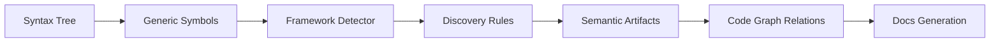
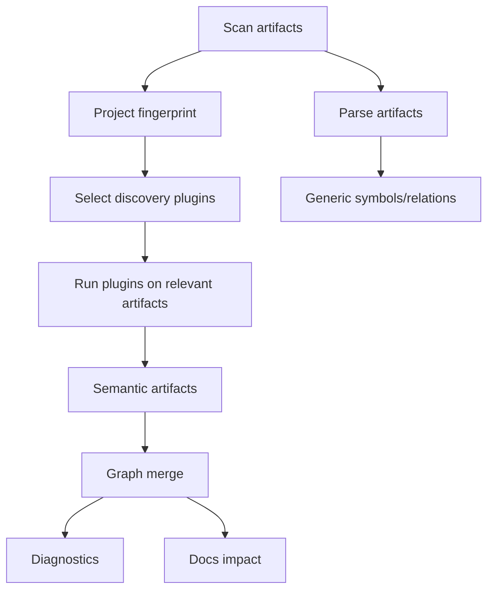
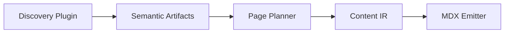
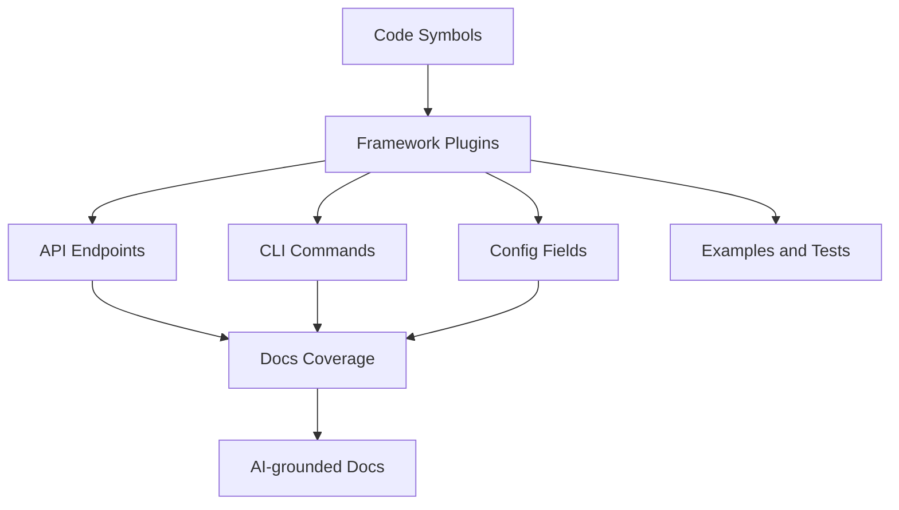

------
title: Build From Scratch: Mintlify-like AI-driven Documentation Generator CLI - Part 021
description: Mendesain framework-aware code discovery untuk documentation generator: REST routes, CLI commands, config schemas, SDK exports, jobs, events, database migrations, test/example mapping, plugin-based discovery, confidence model, diagnostics, and documentation impact.
series: learn-mintlify-like-ai-docs-cli
seriesTitle: Build From Scratch: Mintlify-like AI-driven Documentation Generator CLI
order: 21
partTitle: Framework-aware Code Discovery
tags:
  - documentation
  - ai
  - cli
  - codebase-indexing
  - static-analysis
  - framework-discovery
  - developer-tools
date: 2026-07-03
---

# Part 021 — Framework-aware Code Discovery

Pada Part 019 dan 020, kita membangun parser, symbol extraction, dan code graph.

Itu memberi kita struktur generik:

- file,
- symbol,
- import,
- export,
- call,
- relation,
- source range,
- provenance.

Tetapi documentation generator yang berguna tidak cukup hanya tahu:

> "Ada function bernama `createUser`."

Ia harus bisa tahu:

> "`createUser` adalah handler untuk endpoint `POST /users`, menggunakan request schema `CreateUserRequest`, dipakai di API reference, dan dites oleh `users.test.ts`."

Itulah tujuan **framework-aware code discovery**.

Framework-aware discovery adalah layer yang mengubah syntax graph menjadi **product semantics**.

---

## 1. Mental model: framework discovery adalah semantic interpretation

Tree-sitter melihat syntax:

```ts
router.post("/users", createUserHandler)
```

Framework discovery melihat product fact:

```txt
POST /users is an API endpoint handled by createUserHandler
```

Compiler/parser layer menjawab:

- ini call expression,
- ini string literal,
- ini identifier,
- lokasinya di file ini.

Framework discovery menjawab:

- ini Express route,
- method-nya POST,
- path-nya `/users`,
- handler-nya `createUserHandler`,
- confidence high karena path literal dan handler identifier,
- endpoint ini bisa menjadi API documentation artifact.

Diagram:



---

## 2. Kenapa framework-aware discovery penting

Tanpa framework awareness, AI docs generator akan lemah.

Ia mungkin melihat banyak function dan file, tetapi tidak tahu mana yang user-facing.

Contoh:

```txt
src/routes/users.ts
src/services/user-service.ts
src/repositories/user-repository.ts
src/utils/normalize.ts
```

Generic index melihat semua sebagai code.

Framework-aware discovery tahu:

- `routes/users.ts` berisi endpoint,
- `user-service.ts` berisi business operation,
- `user-repository.ts` internal persistence,
- `normalize.ts` helper internal.

Docs user-facing harus fokus ke endpoint, command, config, SDK export, dan examples, bukan semua helper.

---

## 3. What counts as framework-aware discovery?

Dalam seri ini, discovery mencakup:

| Area | Artifact yang ditemukan |
|---|---|
| HTTP frameworks | routes/endpoints, handlers, middleware, auth guards |
| CLI frameworks | commands, options, arguments, subcommands, handlers |
| Config frameworks | schema fields, defaults, env vars, validation rules |
| SDK/library exports | public functions/classes/types |
| Event systems | topics, event producers/consumers, payload schemas |
| Job/workflow frameworks | jobs, cron schedules, workflow tasks |
| Database/migrations | tables, columns, migrations, seed data |
| Test frameworks | tests, behavior descriptions, subject mapping |
| Example conventions | sample apps, README snippets, examples folder |
| Documentation conventions | generated/manual docs mapping |

Not all need to be implemented immediately. But architecture harus mendukung extension.

---

## 4. Discovery plugin architecture

Framework-specific logic should be plugins.

```ts
export type DiscoveryPlugin = {
  id: string;
  name: string;
  version: string;
  appliesTo(context: DiscoveryContext): boolean;
  discover(input: DiscoveryInput): Promise<DiscoveryResult>;
};

export type DiscoveryContext = {
  projectRoot: string;
  packageManagers: string[];
  dependencies: Record<string, string>;
  devDependencies: Record<string, string>;
  files: SourceArtifact[];
  config: NormalizedConfig;
};

export type DiscoveryInput = {
  artifact: SourceArtifact;
  parseResult: ParseArtifactResult;
  graph: CodeGraphSnapshot;
  content: string;
};

export type DiscoveryResult = {
  semanticArtifacts: SemanticArtifact[];
  relations: CodeRelation[];
  diagnostics: Diagnostic[];
};
```

Plugin examples:

```txt
@docforge/discovery-express
@docforge/discovery-fastify
@docforge/discovery-jaxrs
@docforge/discovery-spring
@docforge/discovery-commander
@docforge/discovery-yargs
@docforge/discovery-zod
@docforge/discovery-openapi
@docforge/discovery-junit
```

---

## 5. Plugin selection

Do not run every plugin on every file.

Selection stages:

1. project-level detection,
2. artifact-level detection,
3. content-level fast signal,
4. AST-level discovery.

Project detection:

```ts
export function detectProjectFrameworks(ctx: DiscoveryContext): string[] {
  const frameworks: string[] = [];

  if (ctx.dependencies["express"]) frameworks.push("express");
  if (ctx.dependencies["fastify"]) frameworks.push("fastify");
  if (ctx.dependencies["commander"]) frameworks.push("commander");
  if (ctx.dependencies["zod"]) frameworks.push("zod");
  if (ctx.dependencies["@nestjs/core"]) frameworks.push("nestjs");
  if (ctx.dependencies["spring-web"] || ctx.dependencies["spring-boot-starter-web"]) {
    frameworks.push("spring");
  }

  return frameworks;
}
```

Artifact signal:

```ts
export function hasExpressSignals(content: string): boolean {
  return content.includes("router.") ||
    content.includes("express.Router") ||
    content.includes("app.get(") ||
    content.includes("app.post(");
}
```

Then run Express plugin only if relevant.

---

## 6. Confidence model

Framework discovery can be uncertain.

```ts
export type DiscoveryConfidence = "high" | "medium" | "low";

export type DiscoveredFact<T> = {
  value: T;
  confidence: DiscoveryConfidence;
  evidence: ProvenanceRef[];
  explanation: string;
};
```

Examples:

| Pattern | Confidence |
|---|---|
| `router.post("/users", handler)` | high |
| `router[method]("/users", handler)` | medium if method constant resolved |
| `router.post(userPath, handler)` | medium if `userPath` constant literal |
| `router.post(getPath(), handler)` | low |
| route generated from config | low unless config parsed |
| framework convention inferred by filename | low/medium |

Docs should only publish high/medium facts by default. Low confidence facts can become diagnostics or review suggestions.

---

## 7. Semantic artifact model extension

We already introduced `SemanticArtifact`. Now extend it.

```ts
export type SemanticArtifact =
  | ApiEndpointArtifact
  | CliCommandArtifact
  | ConfigFieldArtifact
  | PackageExportArtifact
  | ExampleArtifact
  | TestArtifact
  | EventArtifact
  | JobArtifact
  | DatabaseArtifact
  | EnvironmentVariableArtifact;

export type EnvironmentVariableArtifact = {
  type: "environmentVariable";
  id: string;
  name: string;
  required?: boolean;
  defaultValue?: string;
  description?: string;
  source: ProvenanceRef;
};
```

Event:

```ts
export type EventArtifact = {
  type: "event";
  id: string;
  name: string;
  direction: "produced" | "consumed";
  transport?: "kafka" | "rabbitmq" | "sns" | "sqs" | "webhook" | "unknown";
  payloadSchemaRef?: string;
  source: ProvenanceRef;
};
```

Job:

```ts
export type JobArtifact = {
  type: "job";
  id: string;
  name: string;
  schedule?: string;
  handlerSymbolId?: SymbolId;
  source: ProvenanceRef;
};
```

---

## 8. REST route discovery: Express-like

Input:

```ts
const router = Router();

router.post("/users", createUserHandler);
router.get("/users/:id", getUserHandler);
```

Expected artifacts:

```json
[
  {
    "type": "apiEndpoint",
    "method": "POST",
    "path": "/users",
    "handler": "createUserHandler"
  },
  {
    "type": "apiEndpoint",
    "method": "GET",
    "path": "/users/:id",
    "handler": "getUserHandler"
  }
]
```

Discovery logic:

1. detect call expression,
2. check callee is member expression,
3. check member property is HTTP method,
4. read first argument as path,
5. read handler argument,
6. resolve handler symbol if possible,
7. create endpoint artifact,
8. add graph relation handler `handlesRoute` endpoint.

Pseudo:

```ts
export function discoverExpressRoutes(input: DiscoveryInput): DiscoveryResult {
  const endpoints: ApiEndpointArtifact[] = [];
  const relations: CodeRelation[] = [];
  const diagnostics: Diagnostic[] = [];

  for (const routeCall of findExpressRouteCalls(input.parseResult)) {
    const method = routeCall.method.toUpperCase();
    const pathValue = resolveStringLike(routeCall.pathNode, input);

    if (!pathValue.value) {
      diagnostics.push(dynamicRouteDiagnostic(routeCall.pathRange));
      continue;
    }

    const endpoint = createApiEndpointArtifact({
      method,
      path: pathValue.value,
      source: provenanceFromRange(input.artifact, routeCall.range),
      confidence: pathValue.confidence,
    });

    endpoints.push(endpoint);

    const handler = resolveHandlerSymbol(routeCall.handlerNode, input.graph);

    if (handler) {
      relations.push(createRelation({
        from: { type: "symbol", id: handler },
        to: { type: "semanticArtifact", id: endpoint.id },
        kind: "handlesRoute",
        confidence: endpoint.confidence,
        location: routeCall.range,
      }));
    }
  }

  return { semanticArtifacts: endpoints, relations, diagnostics };
}
```

---

## 9. Nested router path composition

Express apps often compose routes.

```ts
app.use("/api", apiRouter);
apiRouter.use("/v1", v1Router);
v1Router.post("/users", createUser);
```

Endpoint should be:

```txt
POST /api/v1/users
```

This requires router mount graph.

Artifacts:

```ts
export type RouterMountArtifact = {
  type: "routerMount";
  id: string;
  parentRouter: string;
  childRouter: string;
  pathPrefix: string;
  source: ProvenanceRef;
};
```

Relation:

```txt
app --mountsRouter--> apiRouter prefix /api
apiRouter --mountsRouter--> v1Router prefix /v1
v1Router --definesRoute--> POST /users
```

Resolve:

```ts
export function composeRoutePath(prefixes: string[], routePath: string): string {
  return normalizeHttpPath([...prefixes, routePath].join("/"));
}
```

Start simple: discover direct routes. Add router composition later.

---

## 10. REST route discovery: JAX-RS

Java JAX-RS:

```java
@Path("/users")
public class UserResource {
  @POST
  @Consumes(MediaType.APPLICATION_JSON)
  @Produces(MediaType.APPLICATION_JSON)
  public Response createUser(CreateUserRequest request) {
    ...
  }

  @GET
  @Path("/{id}")
  public Response getUser(@PathParam("id") String id) {
    ...
  }
}
```

Discovery:

1. collect class-level `@Path`,
2. collect method HTTP annotation: `@GET`, `@POST`, `@PUT`, `@PATCH`, `@DELETE`,
3. collect method-level `@Path`,
4. combine path,
5. collect consumes/produces,
6. collect parameters,
7. resolve request/response type,
8. create endpoint artifact.

Endpoint:

```ts
{
  type: "apiEndpoint",
  method: "POST",
  path: "/users",
  requestTypeSymbolId: "CreateUserRequest",
  responseType: "Response",
  source: ...
}
```

Graph:

```txt
UserResource.createUser --handlesRoute--> POST /users
UserResource.createUser --references--> CreateUserRequest
```

---

## 11. REST route discovery: Spring MVC

Spring:

```java
@RestController
@RequestMapping("/users")
public class UserController {
  @PostMapping
  public User createUser(@RequestBody CreateUserRequest request) {
    ...
  }

  @GetMapping("/{id}")
  public User getUser(@PathVariable String id) {
    ...
  }
}
```

Rules:

| Annotation | Meaning |
|---|---|
| `@RequestMapping` on class | base path |
| `@GetMapping` | GET + method path |
| `@PostMapping` | POST + method path |
| `@PutMapping` | PUT |
| `@PatchMapping` | PATCH |
| `@DeleteMapping` | DELETE |
| `@RequestBody` | request body |
| `@PathVariable` | path parameter |
| `@RequestParam` | query parameter |

Discovery must parse annotation arguments.

Examples:

```java
@PostMapping("/users")
```

or:

```java
@RequestMapping(method = RequestMethod.POST, path = "/users")
```

Both should be supported eventually.

---

## 12. OpenAPI vs code route discovery

If project has OpenAPI spec and code routes, which is truth?

Recommended:

| Artifact | Role |
|---|---|
| OpenAPI | Formal public API contract |
| Code route | Implementation evidence |
| Tests | Behavior evidence |
| Docs | Explanation |

When both exist:

- OpenAPI drives API reference,
- code route validates implementation exists,
- mismatch creates diagnostic.

Diagnostic:

```txt
warning api.route.missingInOpenApi src/routes/users.ts:18:1
Code defines POST /users, but no matching OpenAPI operation was found.

Hint:
Add the operation to the OpenAPI spec or mark this route internal.
```

Reverse:

```txt
warning api.openapi.operationMissingHandler openapi.yaml#/paths/~1users/post
OpenAPI defines POST /users, but no matching code handler was discovered.
```

Do not assume code route is public if OpenAPI intentionally excludes internal route. Config can mark internal prefixes.

---

## 13. CLI discovery: Commander

Commander-style:

```ts
program
  .command("build")
  .description("Build the static docs site")
  .option("--out <dir>", "Output directory")
  .option("--strict", "Treat warnings as errors")
  .action(runBuild);
```

Artifact:

```ts
{
  type: "cliCommand",
  id: "cli:build",
  name: "build",
  description: "Build the static docs site",
  options: [
    {
      name: "--out",
      valueName: "dir",
      required: false,
      description: "Output directory"
    },
    {
      name: "--strict",
      required: false,
      description: "Treat warnings as errors"
    }
  ],
  handlerSymbolId: "runBuild"
}
```

Discovery pattern:

1. detect `.command(...)`,
2. follow chained calls,
3. read `.description(...)`,
4. read `.option(...)`,
5. read `.argument(...)`,
6. read `.action(handler)`,
7. resolve handler symbol,
8. create command artifact.

---

## 14. CLI discovery: nested commands

Example:

```ts
const docs = program.command("docs");

docs.command("build").action(buildDocs);
docs.command("dev").action(devDocs);
```

Command names:

```txt
docs build
docs dev
```

Need parent command context.

Artifact:

```ts
export type CliCommandArtifact = {
  type: "cliCommand";
  id: string;
  name: string;
  fullName: string;
  parent?: string;
  description?: string;
  arguments: CliArgumentArtifact[];
  options: CliOptionArtifact[];
  handlerSymbolId?: SymbolId;
  source: ProvenanceRef;
};
```

Start with flat commands, add nesting later.

---

## 15. CLI discovery edge cases

Commander command can be dynamic:

```ts
program.command(commandNameFromConfig).action(handler);
```

Low confidence.

Options can be reused:

```ts
const strictOption = new Option("--strict");
program.addOption(strictOption);
```

Need richer discovery later.

Subcommands can be imported from modules:

```ts
program.addCommand(buildCommand);
```

Requires resolving `buildCommand`.

Discovery should emit partial artifact with confidence.

---

## 16. Config schema discovery: Zod

Example:

```ts
export const BuildConfigSchema = z.object({
  outputDir: z.string().default(".docforge/site"),
  strict: z.boolean().default(false),
  search: z.object({
    enabled: z.boolean().default(true),
  }),
});
```

Artifacts:

```txt
config:outputDir
config:strict
config:search.enabled
```

Discovery:

1. detect `z.object`,
2. recursively walk properties,
3. infer type from Zod call,
4. detect `.default(...)`,
5. detect `.optional()`,
6. detect `.describe(...)`,
7. create config field artifacts.

Example artifact:

```ts
{
  type: "configField",
  id: "config:search.enabled",
  path: "search.enabled",
  schemaType: "boolean",
  required: false,
  defaultValue: true,
  description: undefined,
  source: ...
}
```

---

## 17. Config schema discovery: JSON Schema

JSON Schema is more deterministic.

```json
{
  "type": "object",
  "properties": {
    "outputDir": {
      "type": "string",
      "default": ".docforge/site",
      "description": "Output directory."
    }
  }
}
```

Discovery:

- parse JSON,
- walk `properties`,
- support `$ref`,
- support `required`,
- support `default`,
- support `description`,
- support `enum`.

JSON pointer provenance:

```txt
docforge.schema.json#/properties/outputDir
```

This is high confidence.

---

## 18. Environment variable discovery

Environment variables appear in code:

```ts
const apiKey = process.env.OPENAI_API_KEY;
```

Artifact:

```ts
{
  type: "environmentVariable",
  id: "env:OPENAI_API_KEY",
  name: "OPENAI_API_KEY",
  required: undefined,
  source: ...
}
```

But do not document all env vars automatically. Some are internal or secrets.

Policy:

- discover,
- classify,
- include in reference only if public/configured,
- never include values,
- redact examples.

Config can mark public env vars:

```json
{
  "env": {
    "public": ["DOCFORGE_LOG_LEVEL", "DOCFORGE_CONFIG"]
  }
}
```

---

## 19. SDK export discovery

For a library package, docs need public exports.

TypeScript:

```ts
export { createClient } from "./client";
export type { ClientOptions } from "./types";
```

Artifacts:

```ts
{
  type: "packageExport",
  packageName: "@acme/sdk",
  exportName: "createClient",
  symbolId: "...",
  source: ...
}
```

Use package entrypoint graph from Part 020.

Discovery enhances it by extracting:

- export kind,
- type/value export,
- docs comment,
- examples,
- deprecation,
- stability annotations.

---

## 20. Deprecation discovery

Languages/frameworks can mark deprecation.

TypeScript/JSDoc:

```ts
/**
 * @deprecated Use createClient instead.
 */
export function oldClient() {}
```

Java:

```java
@Deprecated
public void oldMethod() {}
```

Artifact metadata:

```ts
deprecation?: {
  deprecated: true;
  message?: string;
  source: ProvenanceRef;
};
```

Docs should show deprecation callout.

Search should rank deprecated items lower unless query exact.

---

## 21. Event discovery: Kafka-like

Example:

```ts
producer.send({
  topic: "user.created",
  messages: [{ value: JSON.stringify(event) }],
});
```

Consumer:

```ts
consumer.subscribe({ topic: "user.created" });
```

Artifact:

```ts
{
  type: "event",
  id: "event:kafka:user.created:produced",
  name: "user.created",
  direction: "produced",
  transport: "kafka",
  source: ...
}
```

Confidence high if topic is literal. Medium if constant resolved. Low if dynamic.

Docs generated:

- event catalog,
- producer/consumer reference,
- payload schema if found.

---

## 22. Job/workflow discovery

Cron:

```ts
cron.schedule("0 * * * *", runHourlySync);
```

Artifact:

```ts
{
  type: "job",
  id: "job:runHourlySync",
  name: "runHourlySync",
  schedule: "0 * * * *",
  handlerSymbolId: "...",
  source: ...
}
```

Workflow systems vary widely. Use plugin model.

Docs generated:

- scheduled jobs reference,
- operational runbook,
- failure handling.

---

## 23. Database discovery

Migration file:

```sql
CREATE TABLE users (
  id UUID PRIMARY KEY,
  email TEXT NOT NULL
);
```

Artifact:

```ts
{
  type: "databaseTable",
  name: "users",
  columns: [
    { name: "id", type: "UUID", primaryKey: true },
    { name: "email", type: "TEXT", nullable: false }
  ],
  source: ...
}
```

This can support:

- data model docs,
- API field explanations,
- migration docs.

But database discovery can get deep. Keep optional.

---

## 24. Test discovery

Tests are behavior evidence.

JavaScript/Jest/Vitest:

```ts
describe("build command", () => {
  it("fails on invalid MDX", async () => {
    ...
  });
});
```

Artifact:

```ts
{
  type: "test",
  id: "test:build-command:fails-on-invalid-mdx",
  name: "build command fails on invalid MDX",
  framework: "vitest",
  subjectSymbols: ["runBuild"],
  source: ...
}
```

Discovery:

1. detect test framework imports/globals,
2. collect `describe`/`it` names,
3. map calls/imports to subject symbols,
4. classify behavior text.

Tests should not be copied into docs blindly. They support evidence.

---

## 25. Example discovery

Examples can be discovered from:

```txt
examples/**
docs/**/*.mdx code blocks
README.md code blocks
tests/integration/**
```

Artifact:

```ts
{
  type: "example",
  id: "example:quickstart-basic",
  title: "Basic DocForge setup",
  language: "typescript",
  code: "...",
  demonstrates: ["cli:docforge-init"],
  executable: false,
  confidence: "medium",
  source: ...
}
```

Example quality scoring:

```ts
export type ExampleQuality = {
  score: number;
  reasons: string[];
};
```

Signals:

| Signal | Score |
|---|---:|
| in `examples/` | +3 |
| imports public package | +2 |
| short and focused | +1 |
| has README context | +2 |
| uses private helper | -2 |
| contains secret-like value | reject |
| depends on test harness | -1 |

---

## 26. Framework detector

Before running plugins, build project fingerprint.

```ts
export type ProjectFingerprint = {
  packageManagers: string[];
  languages: LanguageId[];
  dependencies: Record<string, string>;
  devDependencies: Record<string, string>;
  buildTools: string[];
  frameworks: string[];
  testFrameworks: string[];
  packageType?: "library" | "application" | "cli" | "service" | "monorepo";
};
```

From `package.json`:

```ts
export function fingerprintPackageJson(pkg: PackageJson): Partial<ProjectFingerprint> {
  const deps = {
    ...(pkg.dependencies ?? {}),
    ...(pkg.devDependencies ?? {}),
  };

  return {
    frameworks: [
      deps.express ? "express" : undefined,
      deps.fastify ? "fastify" : undefined,
      deps.commander ? "commander" : undefined,
      deps.zod ? "zod" : undefined,
      deps.vitest ? "vitest" : undefined,
      deps.jest ? "jest" : undefined,
    ].filter(Boolean) as string[],
  };
}
```

For Java, use `pom.xml`/Gradle dependencies.

---

## 27. Discovery pipeline



Implementation:

```ts
export async function runFrameworkDiscovery(
  input: FrameworkDiscoveryInput
): Promise<FrameworkDiscoveryResult> {
  const fingerprint = buildProjectFingerprint(input.artifacts, input.packageMetadata);

  const plugins = input.plugins.filter((plugin) =>
    plugin.appliesTo({
      projectRoot: input.projectRoot,
      packageManagers: fingerprint.packageManagers,
      dependencies: fingerprint.dependencies,
      devDependencies: fingerprint.devDependencies,
      files: input.artifacts,
      config: input.config,
    })
  );

  const results: DiscoveryResult[] = [];

  for (const artifact of input.artifacts) {
    const parseResult = input.parseResults.get(artifact.id);
    if (!parseResult) continue;

    for (const plugin of plugins) {
      if (!pluginAppliesToArtifact(plugin, artifact, parseResult)) {
        continue;
      }

      results.push(await plugin.discover({
        artifact,
        parseResult,
        graph: input.graphSnapshot,
        content: await input.contentLoader.read(artifact),
      }));
    }
  }

  return mergeDiscoveryResults(results);
}
```

---

## 28. Merge and dedupe semantic artifacts

Multiple plugins may discover same endpoint.

Example:

- Express plugin discovers `POST /users`,
- OpenAPI plugin discovers `POST /users`.

These are not identical; one is implementation, one is contract. But they may represent same public endpoint.

Use source dimension.

```ts
export type SemanticArtifactSourceKind =
  | "code"
  | "openapi"
  | "schema"
  | "test"
  | "docs"
  | "manual";

export type SemanticArtifactBase = {
  type: string;
  id: string;
  sourceKind: SemanticArtifactSourceKind;
  source: ProvenanceRef;
  confidence: Confidence;
};
```

For endpoint matching:

```ts
export function endpointKey(endpoint: ApiEndpointArtifact): string {
  return `${endpoint.method.toUpperCase()} ${normalizeHttpPath(endpoint.path)}`;
}
```

Instead of deduping, create relation:

```txt
code endpoint --matchesContract--> openapi operation
```

---

## 29. Cross-source consistency checks

Examples:

### Code route not in OpenAPI

```txt
warning api.codeRoute.notInOpenApi
```

### OpenAPI operation missing code handler

```txt
warning api.openapi.missingCodeHandler
```

### CLI docs mention command not discovered

```txt
error docs.cli.unknownCommand
```

### Config docs mention field not in schema

```txt
warning docs.config.unknownField
```

### Example imports non-public symbol

```txt
warning example.usesInternalSymbol
```

These checks are powerful for docs quality.

---

## 30. Framework discovery diagnostics

Diagnostic categories:

| Code | Meaning |
|---|---|
| `discovery.framework.detected` | Framework detected |
| `discovery.route.dynamicPath` | Route path cannot be statically resolved |
| `discovery.route.dynamicMethod` | HTTP method dynamic |
| `discovery.route.handlerUnresolved` | Handler symbol not resolved |
| `discovery.cli.dynamicCommandName` | CLI command name dynamic |
| `discovery.cli.handlerUnresolved` | Command action handler unresolved |
| `discovery.config.dynamicSchema` | Schema cannot be statically expanded |
| `discovery.openapi.routeMismatch` | Code/spec mismatch |
| `discovery.example.secretLike` | Example contains secret-like value |
| `discovery.plugin.failed` | Plugin failed but indexing continues |

Example:

```ts
{
  code: "discovery.route.dynamicPath",
  severity: "warning",
  category: "indexing",
  message: "Route path is dynamic and cannot be resolved statically.",
  location: { path: "src/routes/users.ts", line: 18, column: 13 },
  hint: "Use an OpenAPI spec or add a manual route annotation for documentation generation.",
}
```

---

## 31. Manual annotations for discovery

Static discovery cannot resolve everything. Allow manual hints.

Example comment:

```ts
// @docforge route POST /users/:id
router[method](`/users/${id}`, handler);
```

Or config:

```json
{
  "discovery": {
    "manualArtifacts": [
      {
        "type": "apiEndpoint",
        "method": "POST",
        "path": "/users",
        "handler": "src/routes/users.ts#createUserHandler"
      }
    ]
  }
}
```

Manual artifacts should have provenance:

```ts
sourceKind: "manual"
source: {
  path: "docforge.config.json",
  selector: "discovery.manualArtifacts[0]"
}
```

Manual hints should override low-confidence dynamic discovery.

---

## 32. Discovery and generated docs

Each semantic artifact can produce page candidates.

```ts
export type PageCandidate = {
  id: string;
  kind: PageKind;
  title: string;
  route: RoutePath;
  sourceArtifacts: string[];
  confidence: Confidence;
};
```

Examples:

| Artifact | Page candidate |
|---|---|
| CLI command | CLI reference section/page |
| Config fields | Config reference page |
| API endpoint | API reference operation page |
| Event | Event catalog page |
| Job | Jobs/runbook page |
| Example | Guide/tutorial page |
| Public SDK export | SDK reference page |

But do not generate all pages blindly. Use planning rules.

---

## 33. Discovery and retrieval

Framework facts improve retrieval.

Query:

```txt
generate docs for build command
```

Retrieval seeds:

- `cli:docforge-build`,
- handler symbol,
- options,
- tests,
- existing docs page,
- config fields referenced by handler.

Query:

```txt
write guide for user creation endpoint
```

Retrieval seeds:

- `api:POST:/users`,
- OpenAPI operation,
- handler symbol,
- request schema,
- tests,
- examples.

This is more precise than embeddings alone.

---

## 34. Discovery and stale docs

If discovered artifact changes, docs may be stale.

Examples:

- CLI option added → CLI reference stale.
- endpoint removed → API docs stale.
- config field default changed → config reference stale.
- example code changed → guide stale.
- event topic renamed → event catalog stale.

Impact mapping:

```ts
docPage --documents--> semanticArtifact
semanticArtifact source hash changed
=> page stale
```

Discovery artifacts should store source hash.

```ts
export type SemanticArtifactBase = {
  sourceHash: string;
};
```

---

## 35. Documentation coverage report

Framework discovery enables coverage.

```ts
export type DocsCoverageReport = {
  cliCommands: CoverageGroup;
  apiEndpoints: CoverageGroup;
  configFields: CoverageGroup;
  publicExports: CoverageGroup;
  examples: CoverageGroup;
};

export type CoverageGroup = {
  total: number;
  documented: number;
  undocumented: Array<{
    id: string;
    title: string;
    source: ProvenanceRef;
  }>;
};
```

CLI:

```bash
docforge coverage
```

Output:

```txt
Documentation coverage:

API endpoints: 32/34 documented
CLI commands:  8/8 documented
Config fields: 58/62 documented
Public exports: 41/148 documented

Undocumented API endpoints:
- DELETE /users/{id} src/routes/users.ts:72
- PATCH /users/{id} src/routes/users.ts:93
```

This is extremely valuable for engineering teams.

---

## 36. Plugin failure isolation

A plugin bug should not break all indexing.

```ts
export async function safeRunPlugin(
  plugin: DiscoveryPlugin,
  input: DiscoveryInput
): Promise<DiscoveryResult> {
  try {
    return await plugin.discover(input);
  } catch (error) {
    return {
      semanticArtifacts: [],
      relations: [],
      diagnostics: [{
        code: "discovery.plugin.failed",
        severity: "warning",
        category: "indexing",
        message: `Discovery plugin ${plugin.id} failed.`,
        location: { path: input.artifact.path },
        hint: "Run with --log-level debug for plugin error details.",
      }],
    };
  }
}
```

In debug logs, include stack. In normal diagnostics, do not dump internal stack unless useful.

---

## 37. Plugin trust boundary

Discovery plugins execute code.

Built-in plugins are trusted. Third-party/local plugins are code execution risk.

Config:

```json
{
  "discovery": {
    "plugins": [
      "@docforge/discovery-express",
      "./tools/docforge-discovery-custom.ts"
    ],
    "allowLocalPlugins": false
  }
}
```

Modes:

| Mode | Policy |
|---|---|
| local trusted project | allow local plugins if configured |
| CI trusted repo | allow pinned plugins |
| remote SaaS/untrusted | built-in plugins only |
| security strict | no custom plugins |

Document this clearly.

---

## 38. Testing discovery plugins

Each plugin needs fixtures.

```txt
fixtures/discovery/express/basic-route/
  package.json
  src/routes/users.ts
  expected-artifacts.json
  expected-relations.json

fixtures/discovery/commander/basic-command/
  package.json
  src/cli.ts
  expected-artifacts.json

fixtures/discovery/zod/config-schema/
  src/config.ts
  expected-config-fields.json
```

Test shape:

```ts
it("discovers Express POST route", async () => {
  const result = await runDiscoveryFixture("express/basic-route");

  expect(result.semanticArtifacts).toContainEqual(
    expect.objectContaining({
      type: "apiEndpoint",
      method: "POST",
      path: "/users",
    })
  );
});
```

---

## 39. Golden diagnostics tests

Dynamic route fixture:

```ts
router.post(getUserPath(), createUser);
```

Expected:

```json
[
  {
    "code": "discovery.route.dynamicPath",
    "severity": "warning"
  }
]
```

This prevents accidental silent misclassification.

---

## 40. Evaluation of discovery quality

Metrics:

```ts
export type DiscoveryQualityReport = {
  pluginsRun: number;
  artifactsDiscovered: Record<string, number>;
  highConfidence: number;
  mediumConfidence: number;
  lowConfidence: number;
  unresolvedHandlers: number;
  dynamicRoutes: number;
  codeSpecMismatches: number;
};
```

CLI:

```txt
Discovery report:

Frameworks:
- express
- commander
- zod

Artifacts:
- API endpoints: 34
- CLI commands: 8
- Config fields: 62
- Examples: 19

Warnings:
- dynamic routes: 2
- unresolved handlers: 1
- OpenAPI mismatches: 3
```

---

## 41. Framework-aware docs examples

### 41.1 CLI reference from discovery

Discovered command:

```txt
docforge build
options: --out, --strict, --no-search
```

Generated docs section:

```mdx
## `docforge build`

Builds the static documentation site.

| Option | Description |
|---|---|
| `--out <dir>` | Override the output directory. |
| `--strict` | Treat selected warnings as errors. |
| `--no-search` | Skip search artifact generation. |
```

### 41.2 API reference from discovery + OpenAPI

Code discovery provides handler. OpenAPI provides formal request/response.

Docs can include:

- method/path from OpenAPI,
- schema from OpenAPI,
- implementation provenance from code,
- tests/examples from graph.

### 41.3 Config reference from Zod/JSON Schema

Generated field table:

```mdx
| Field | Type | Required | Default | Description |
|---|---|---:|---|---|
| `search.enabled` | boolean | no | `true` | Enables static search artifact generation. |
```

---

## 42. Anti-pattern: regex-only framework discovery

Regex can bootstrap, but it breaks quickly.

Bad:

```ts
const matches = content.matchAll(/router\.(get|post)\("([^"]+)"/g);
```

Fails with:

- single quotes,
- template strings,
- whitespace,
- comments,
- chained routers,
- imported aliases,
- TypeScript syntax,
- nested calls.

Use syntax tree. Regex can be a fast signal, not final extraction.

---

## 43. Anti-pattern: assuming all routes are public

Internal health/admin routes may not belong in public docs.

Examples:

```txt
GET /health
GET /metrics
POST /internal/reindex
```

Classification:

```ts
export type EndpointVisibility = "public" | "internal" | "admin" | "unknown";
```

Rules:

- path starts `/internal` → internal by default,
- path starts `/admin` → admin,
- OpenAPI inclusion → public,
- config override.

Config:

```json
{
  "discovery": {
    "endpointVisibility": {
      "/internal/**": "internal",
      "/admin/**": "admin"
    }
  }
}
```

Docs generation should default to public endpoints unless internal docs enabled.

---

## 44. Anti-pattern: framework plugin writes docs directly

Discovery plugin should not write MDX.

Bad:

```ts
plugin.discoverAndWriteDocs()
```

Good:

```txt
plugin discovers semantic artifacts
planner decides docs
emitter writes MDX
build validates
```

Separation:



Plugins produce facts, not prose.

---

## 45. Package layout

```txt
packages/framework-discovery/
  src/
    plugin.ts
    fingerprint.ts
    discovery-runner.ts
    semantic-artifact.ts
    confidence.ts
    coverage.ts
    diagnostics.ts

packages/discovery-express/
  src/
    plugin.ts
    route-query.ts
    route-extractor.ts
    router-composition.ts

packages/discovery-commander/
  src/
    plugin.ts
    command-extractor.ts

packages/discovery-zod/
  src/
    plugin.ts
    zod-schema-extractor.ts

packages/discovery-java-web/
  src/
    jaxrs.ts
    spring.ts
```

Keep plugin API stable.

---

## 46. Minimal implementation milestone

First version:

1. project fingerprint from `package.json`,
2. plugin runner,
3. Express route discovery for literal paths,
4. Commander command discovery for simple chains,
5. Zod config field discovery for basic `z.object`,
6. docs mapping relation support,
7. coverage report for CLI/API/config,
8. diagnostics for dynamic/unresolved cases,
9. fixture tests.

Second version:

1. router composition,
2. Spring/JAX-RS discovery,
3. OpenAPI-code consistency,
4. event/job discovery,
5. example/test mapping,
6. endpoint visibility classification,
7. custom plugins,
8. discovery quality report.

---

## 47. Failure modes

| Failure | Cause | Prevention |
|---|---|---|
| User-facing docs miss endpoints | No framework-aware route discovery | route discovery plugins |
| Docs include internal endpoints | no visibility classifier | endpoint visibility rules |
| CLI reference stale | command options not discovered | CLI framework plugin |
| Config docs wrong | schema not parsed | Zod/JSON Schema discovery |
| Dynamic route hallucinated | path unresolved but guessed | confidence + diagnostics |
| Plugin crash breaks index | plugin not isolated | safe plugin runner |
| OpenAPI and code drift unnoticed | no cross-source consistency | code/spec matching diagnostics |
| AI retrieves irrelevant helper code | no semantic artifacts | framework facts guide retrieval |
| Too much custom logic in core | no plugin boundary | discovery plugin API |
| Security risk from plugins | arbitrary plugin loading | trust mode and allowlist |

---

## 48. Key takeaways

Framework-aware discovery turns code syntax into product semantics.

It identifies the things users actually care about:



The design rules:

1. keep discovery plugin-based,
2. run plugins selectively,
3. attach provenance to every fact,
4. use confidence levels,
5. do not guess dynamic values,
6. separate facts from prose,
7. classify public vs internal surface,
8. cross-check code/spec/docs,
9. produce coverage reports,
10. isolate plugin failures.

Next, we design the **repository knowledge store** that persists artifacts, symbols, relations, semantic artifacts, diagnostics, provenance, and retrieval metadata.
