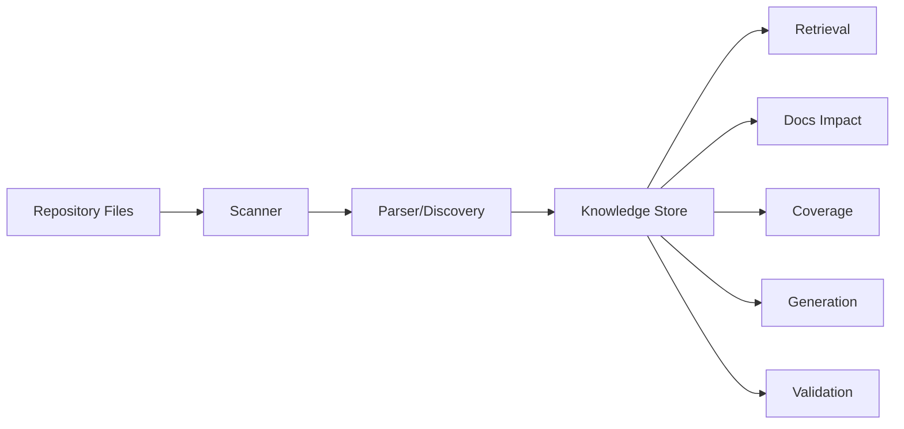
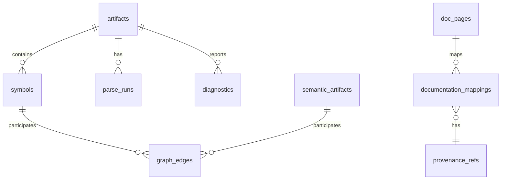
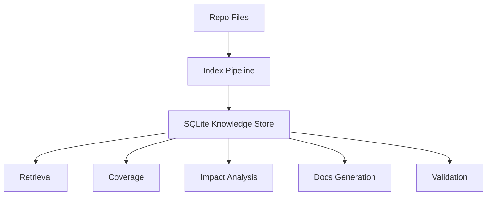

------
title: Build From Scratch: Mintlify-like AI-driven Documentation Generator CLI - Part 022
description: Mendesain repository knowledge store untuk documentation generator: SQLite schema, artifact/symbol/relation storage, semantic artifacts, provenance, embeddings metadata, cache invalidation, migrations, transactions, query APIs, and operational reliability.
series: learn-mintlify-like-ai-docs-cli
seriesTitle: Build From Scratch: Mintlify-like AI-driven Documentation Generator CLI
order: 22
partTitle: Repository Knowledge Store
tags:
  - documentation
  - ai
  - cli
  - sqlite
  - knowledge-store
  - codebase-indexing
  - developer-tools
date: 2026-07-03
---

# Part 022 — Repository Knowledge Store

Kita sudah membangun banyak model:

- `SourceArtifact`,
- `CodeSymbol`,
- `CodeRelation`,
- `SemanticArtifact`,
- `DocumentationMapping`,
- `ProvenanceRef`,
- search metadata,
- discovery diagnostics,
- index snapshots.

Sekarang pertanyaannya:

> semua data ini disimpan di mana?

Kalau disimpan sebagai object in-memory saja, tool akan lambat dan tidak bisa incremental.

Kalau disimpan sebagai JSON besar, mudah dimulai tetapi sulit di-query, sulit update sebagian, dan lambat untuk repo besar.

Untuk CLI lokal, pilihan yang sangat masuk akal adalah **SQLite knowledge store**.

SQLite memberi kita:

- single-file local database,
- transaksi,
- indexing,
- query relational,
- durability,
- portability,
- no server,
- cocok untuk cache/index lokal.

Knowledge store adalah jantung dari AI-driven documentation generator karena ia membuat sistem bisa mengingat hasil indexing, melakukan impact analysis, membangun retrieval, dan memverifikasi provenance tanpa mem-parse seluruh repo setiap saat.

---

## 1. Mental model: knowledge store adalah local read/write model

Knowledge store bukan source code truth. Source code tetap source of truth.

Knowledge store adalah **derived local model**.



Karena derived, store harus bisa:

- dihapus dan dibangun ulang,
- divalidasi freshness-nya,
- dimigrasi schema-nya,
- di-invalidate sebagian,
- tidak dianggap lebih benar dari file sumber.

---

## 2. Store responsibilities

Knowledge store menyimpan:

| Data | Purpose |
|---|---|
| Artifacts | file metadata, hash, language, sensitivity |
| Parse runs | parser/query version per artifact |
| Symbols | declarations extracted from code |
| Relations | graph edges |
| Semantic artifacts | endpoint, CLI command, config field, example, test |
| Documentation mappings | docs page → source artifact/symbol/artifact |
| Provenance | precise source references |
| Diagnostics | indexing/discovery/build issues |
| Embedding metadata | vector cache keys and target mapping |
| Snapshots | freshness and diffing |
| Cache metadata | invalidation and versioning |
| Coverage | derived reporting optional |

Do not store secrets or raw full source by default.

---

## 3. Store location

Default:

```txt
<project-root>/.docforge/index/docforge.sqlite
```

Other files:

```txt
<project-root>/.docforge/
  index/
    docforge.sqlite
    docforge.sqlite-shm
    docforge.sqlite-wal
  cache/
    ...
  traces/
    ...
```

Config:

```json
{
  "index": {
    "storePath": ".docforge/index/docforge.sqlite"
  }
}
```

Rules:

1. Store path must be inside project root by default.
2. Store should be ignored by git.
3. Store should not be deployed.
4. Store can be deleted safely.
5. Store version must be explicit.

---

## 4. Why SQLite instead of JSON

JSON is tempting:

```txt
.docforge/index.json
```

But problems appear:

- updating one artifact requires rewriting whole file,
- querying symbol relations requires loading everything,
- graph traversal becomes manual,
- concurrent read/write harder,
- large repo becomes slow,
- migrations are ad hoc.

SQLite gives:

- `SELECT` by path/hash/symbol,
- indexes,
- transactions,
- partial updates,
- consistency,
- inspectability with SQL,
- good local performance.

JSON can still be used for public build artifacts. Knowledge store is internal.

---

## 5. Store versioning

Need schema version.

```sql
CREATE TABLE IF NOT EXISTS schema_migrations (
  version INTEGER PRIMARY KEY,
  name TEXT NOT NULL,
  applied_at TEXT NOT NULL
);
```

Migration files:

```txt
packages/knowledge-store/migrations/
  001_initial.sql
  002_semantic_artifacts.sql
  003_embeddings.sql
```

Migration runner:

```ts
export async function migrateStore(db: Database): Promise<void> {
  const applied = await getAppliedMigrationVersions(db);
  const migrations = await loadMigrations();

  for (const migration of migrations) {
    if (applied.has(migration.version)) {
      continue;
    }

    await db.transaction(async () => {
      await db.exec(migration.sql);
      await db.run(
        "INSERT INTO schema_migrations(version, name, applied_at) VALUES (?, ?, ?)",
        [migration.version, migration.name, new Date().toISOString()]
      );
    });
  }
}
```

Never silently use incompatible schema.

---

## 6. Core schema overview



We will design relational tables plus JSON metadata fields where appropriate.

Use relational columns for query-heavy fields. Use JSON for optional metadata.

---

## 7. Artifacts table

```sql
CREATE TABLE artifacts (
  id TEXT PRIMARY KEY,
  path TEXT NOT NULL UNIQUE,
  kind TEXT NOT NULL,
  language TEXT,
  hash TEXT NOT NULL,
  size_bytes INTEGER NOT NULL,
  generated INTEGER NOT NULL DEFAULT 0,
  vendored INTEGER NOT NULL DEFAULT 0,
  binary INTEGER NOT NULL DEFAULT 0,
  sensitive TEXT NOT NULL DEFAULT 'public',
  last_seen_at TEXT NOT NULL,
  metadata_json TEXT
);

CREATE INDEX idx_artifacts_kind ON artifacts(kind);
CREATE INDEX idx_artifacts_hash ON artifacts(hash);
CREATE INDEX idx_artifacts_language ON artifacts(language);
CREATE INDEX idx_artifacts_sensitive ON artifacts(sensitive);
```

Notes:

- `path` is project-relative normalized POSIX path.
- `hash` is content hash.
- `last_seen_at` helps detect deleted files.
- `metadata_json` can store detector details.

Artifact ID:

```ts
artifact:${sha256(path)}
```

or hash of normalized path. Since artifact identity is path-based initially.

---

## 8. Parse runs table

Tracks parser/extractor version per artifact.

```sql
CREATE TABLE parse_runs (
  artifact_id TEXT NOT NULL,
  artifact_hash TEXT NOT NULL,
  language TEXT NOT NULL,
  parser_name TEXT NOT NULL,
  parser_version TEXT NOT NULL,
  query_version TEXT NOT NULL,
  extractor_version TEXT NOT NULL,
  ok INTEGER NOT NULL,
  indexed_at TEXT NOT NULL,
  diagnostics_count INTEGER NOT NULL DEFAULT 0,
  PRIMARY KEY (
    artifact_id,
    artifact_hash,
    parser_name,
    parser_version,
    query_version,
    extractor_version
  )
);

CREATE INDEX idx_parse_runs_artifact ON parse_runs(artifact_id);
```

Fresh parse exists if:

- artifact hash same,
- parser version same,
- query version same,
- extractor version same.

---

## 9. Symbols table

```sql
CREATE TABLE symbols (
  id TEXT PRIMARY KEY,
  artifact_id TEXT NOT NULL,
  language TEXT NOT NULL,
  kind TEXT NOT NULL,
  name TEXT NOT NULL,
  qualified_name TEXT NOT NULL,
  display_name TEXT NOT NULL,
  visibility TEXT NOT NULL,
  exported INTEGER NOT NULL DEFAULT 0,
  parent_symbol_id TEXT,
  signature TEXT,
  doc_comment TEXT,
  start_line INTEGER NOT NULL,
  start_column INTEGER NOT NULL,
  end_line INTEGER NOT NULL,
  end_column INTEGER NOT NULL,
  selection_start_line INTEGER,
  selection_start_column INTEGER,
  selection_end_line INTEGER,
  selection_end_column INTEGER,
  modifiers_json TEXT,
  annotations_json TEXT,
  parser_metadata_json TEXT,
  FOREIGN KEY (artifact_id) REFERENCES artifacts(id) ON DELETE CASCADE
);

CREATE INDEX idx_symbols_artifact ON symbols(artifact_id);
CREATE INDEX idx_symbols_kind ON symbols(kind);
CREATE INDEX idx_symbols_name ON symbols(name);
CREATE INDEX idx_symbols_qualified_name ON symbols(qualified_name);
CREATE INDEX idx_symbols_exported ON symbols(exported);
CREATE INDEX idx_symbols_parent ON symbols(parent_symbol_id);
```

`qualified_name` may not be globally unique in all cases, so do not make it unique.

---

## 10. Semantic artifacts table

Different artifact types have different fields. Use common columns + JSON payload.

```sql
CREATE TABLE semantic_artifacts (
  id TEXT PRIMARY KEY,
  type TEXT NOT NULL,
  source_kind TEXT NOT NULL,
  title TEXT,
  key TEXT,
  source_artifact_id TEXT,
  source_hash TEXT,
  confidence TEXT NOT NULL,
  payload_json TEXT NOT NULL,
  created_at TEXT NOT NULL,
  updated_at TEXT NOT NULL,
  FOREIGN KEY (source_artifact_id) REFERENCES artifacts(id) ON DELETE SET NULL
);

CREATE INDEX idx_semantic_artifacts_type ON semantic_artifacts(type);
CREATE INDEX idx_semantic_artifacts_key ON semantic_artifacts(key);
CREATE INDEX idx_semantic_artifacts_source ON semantic_artifacts(source_artifact_id);
CREATE INDEX idx_semantic_artifacts_confidence ON semantic_artifacts(confidence);
```

Examples:

| Type | Key |
|---|---|
| `apiEndpoint` | `POST /users` |
| `cliCommand` | `docforge build` |
| `configField` | `search.enabled` |
| `event` | `kafka:user.created:produced` |
| `example` | `examples/basic` |

Payload example:

```json
{
  "method": "POST",
  "path": "/users",
  "operationId": "createUser",
  "visibility": "public"
}
```

---

## 11. Graph nodes table

We can infer nodes from artifacts/symbols/semantic artifacts/doc pages, but generic graph node table helps traversal.

```sql
CREATE TABLE graph_nodes (
  id TEXT NOT NULL,
  type TEXT NOT NULL,
  label TEXT NOT NULL,
  source_table TEXT,
  metadata_json TEXT,
  PRIMARY KEY (type, id)
);

CREATE INDEX idx_graph_nodes_label ON graph_nodes(label);
```

Node ref:

```txt
type + id
```

Examples:

```txt
artifact | artifact:abc
symbol | symbol:def
semanticArtifact | api:POST:/users
docPage | docs:quickstart
external | npm:express
```

---

## 12. Graph edges table

```sql
CREATE TABLE graph_edges (
  id TEXT PRIMARY KEY,
  from_type TEXT NOT NULL,
  from_id TEXT NOT NULL,
  to_type TEXT NOT NULL,
  to_id TEXT NOT NULL,
  kind TEXT NOT NULL,
  confidence TEXT NOT NULL,
  source_artifact_id TEXT,
  path TEXT,
  start_line INTEGER,
  start_column INTEGER,
  end_line INTEGER,
  end_column INTEGER,
  metadata_json TEXT
);

CREATE INDEX idx_graph_edges_from ON graph_edges(from_type, from_id);
CREATE INDEX idx_graph_edges_to ON graph_edges(to_type, to_id);
CREATE INDEX idx_graph_edges_kind ON graph_edges(kind);
CREATE INDEX idx_graph_edges_source_artifact ON graph_edges(source_artifact_id);
CREATE INDEX idx_graph_edges_from_kind ON graph_edges(from_type, from_id, kind);
CREATE INDEX idx_graph_edges_to_kind ON graph_edges(to_type, to_id, kind);
```

`source_artifact_id` makes invalidation possible.

When artifact changes:

```sql
DELETE FROM graph_edges WHERE source_artifact_id = ?;
```

---

## 13. Doc pages table

Docs pages are also indexed.

```sql
CREATE TABLE doc_pages (
  id TEXT PRIMARY KEY,
  source_path TEXT NOT NULL UNIQUE,
  route TEXT NOT NULL,
  title TEXT NOT NULL,
  description TEXT,
  kind TEXT NOT NULL,
  generated INTEGER NOT NULL DEFAULT 0,
  hidden INTEGER NOT NULL DEFAULT 0,
  draft INTEGER NOT NULL DEFAULT 0,
  content_hash TEXT,
  metadata_json TEXT,
  updated_at TEXT NOT NULL
);

CREATE INDEX idx_doc_pages_route ON doc_pages(route);
CREATE INDEX idx_doc_pages_kind ON doc_pages(kind);
CREATE INDEX idx_doc_pages_generated ON doc_pages(generated);
```

This table is updated from MDX compiler/page manifest.

---

## 14. Documentation mappings table

Maps docs pages to sources they document.

```sql
CREATE TABLE documentation_mappings (
  id TEXT PRIMARY KEY,
  page_id TEXT NOT NULL,
  target_type TEXT NOT NULL,
  target_id TEXT NOT NULL,
  relation_kind TEXT NOT NULL DEFAULT 'documents',
  confidence TEXT NOT NULL,
  source_hash TEXT,
  metadata_json TEXT,
  created_at TEXT NOT NULL,
  updated_at TEXT NOT NULL,
  FOREIGN KEY (page_id) REFERENCES doc_pages(id) ON DELETE CASCADE
);

CREATE INDEX idx_doc_mappings_page ON documentation_mappings(page_id);
CREATE INDEX idx_doc_mappings_target ON documentation_mappings(target_type, target_id);
```

Example:

```json
{
  "page_id": "reference-cli-build",
  "target_type": "semanticArtifact",
  "target_id": "cli:docforge-build",
  "confidence": "high"
}
```

Also create graph edge:

```txt
docPage --documents--> semanticArtifact
```

The table provides richer mapping metadata.

---

## 15. Provenance refs table

Provenance can be embedded JSON, but queryable provenance is useful.

```sql
CREATE TABLE provenance_refs (
  id TEXT PRIMARY KEY,
  owner_type TEXT NOT NULL,
  owner_id TEXT NOT NULL,
  artifact_id TEXT,
  path TEXT NOT NULL,
  selector TEXT,
  kind TEXT NOT NULL,
  hash TEXT,
  start_line INTEGER,
  start_column INTEGER,
  end_line INTEGER,
  end_column INTEGER,
  metadata_json TEXT
);

CREATE INDEX idx_provenance_owner ON provenance_refs(owner_type, owner_id);
CREATE INDEX idx_provenance_artifact ON provenance_refs(artifact_id);
CREATE INDEX idx_provenance_path ON provenance_refs(path);
```

Owner examples:

- semantic artifact,
- doc mapping,
- generated block,
- diagnostic,
- search chunk.

---

## 16. Diagnostics table

Store diagnostics from indexing/discovery.

```sql
CREATE TABLE diagnostics (
  id TEXT PRIMARY KEY,
  run_id TEXT NOT NULL,
  code TEXT NOT NULL,
  severity TEXT NOT NULL,
  category TEXT NOT NULL,
  message TEXT NOT NULL,
  path TEXT,
  line INTEGER,
  column INTEGER,
  end_line INTEGER,
  end_column INTEGER,
  hint TEXT,
  owner_type TEXT,
  owner_id TEXT,
  metadata_json TEXT,
  created_at TEXT NOT NULL
);

CREATE INDEX idx_diagnostics_run ON diagnostics(run_id);
CREATE INDEX idx_diagnostics_code ON diagnostics(code);
CREATE INDEX idx_diagnostics_severity ON diagnostics(severity);
CREATE INDEX idx_diagnostics_path ON diagnostics(path);
```

Diagnostics from current run can replace previous run's diagnostics.

Alternative: store only latest diagnostics. But run history can help debugging. Keep bounded.

---

## 17. Index runs table

```sql
CREATE TABLE index_runs (
  id TEXT PRIMARY KEY,
  started_at TEXT NOT NULL,
  ended_at TEXT,
  status TEXT NOT NULL,
  tool_version TEXT NOT NULL,
  config_hash TEXT NOT NULL,
  artifact_count INTEGER,
  symbols_count INTEGER,
  relations_count INTEGER,
  semantic_artifacts_count INTEGER,
  diagnostics_count INTEGER,
  metadata_json TEXT
);

CREATE INDEX idx_index_runs_started_at ON index_runs(started_at);
CREATE INDEX idx_index_runs_status ON index_runs(status);
```

Status:

```txt
running
succeeded
failed
cancelled
```

On startup, if previous run stuck in `running`, mark as interrupted.

---

## 18. Embedding metadata table

Do not store vectors in SQLite initially unless needed. Store metadata and vector cache location.

```sql
CREATE TABLE embedding_records (
  id TEXT PRIMARY KEY,
  target_type TEXT NOT NULL,
  target_id TEXT NOT NULL,
  content_hash TEXT NOT NULL,
  model TEXT NOT NULL,
  provider TEXT NOT NULL,
  dimensions INTEGER,
  vector_store TEXT NOT NULL,
  vector_ref TEXT NOT NULL,
  created_at TEXT NOT NULL
);

CREATE INDEX idx_embeddings_target ON embedding_records(target_type, target_id);
CREATE INDEX idx_embeddings_model ON embedding_records(provider, model);
CREATE INDEX idx_embeddings_content_hash ON embedding_records(content_hash);
```

Vector storage options:

- separate binary file,
- SQLite blob,
- external local vector DB,
- provider-side? usually not for local CLI.

For early implementation, skip vectors or store small JSON vector files.

---

## 19. Search chunks table

Search build may use separate public artifacts, but store can cache chunks.

```sql
CREATE TABLE search_chunks (
  id TEXT PRIMARY KEY,
  page_id TEXT NOT NULL,
  route TEXT NOT NULL,
  anchor TEXT,
  title TEXT NOT NULL,
  section_title TEXT,
  text_hash TEXT NOT NULL,
  text_preview TEXT,
  weight REAL NOT NULL,
  metadata_json TEXT,
  updated_at TEXT NOT NULL
);

CREATE INDEX idx_search_chunks_page ON search_chunks(page_id);
CREATE INDEX idx_search_chunks_route ON search_chunks(route);
```

Full text can be large. Store preview and hash, or store text if needed for local retrieval. Avoid secrets.

---

## 20. Snapshot table

```sql
CREATE TABLE snapshots (
  id TEXT PRIMARY KEY,
  kind TEXT NOT NULL,
  created_at TEXT NOT NULL,
  config_hash TEXT NOT NULL,
  tool_version TEXT NOT NULL,
  data_json TEXT NOT NULL
);

CREATE INDEX idx_snapshots_kind_created ON snapshots(kind, created_at);
```

Snapshot kinds:

- `artifactIndex`,
- `graph`,
- `publicSurface`,
- `docsMapping`,
- `search`,
- `coverage`.

Keep latest N snapshots.

---

## 21. Store API design

Expose typed API, not raw SQL to the whole app.

```ts
export type KnowledgeStore = {
  migrate(): Promise<void>;
  close(): Promise<void>;

  transaction<T>(fn: (tx: KnowledgeStoreTx) => Promise<T>): Promise<T>;

  artifacts: ArtifactRepository;
  symbols: SymbolRepository;
  semanticArtifacts: SemanticArtifactRepository;
  graph: GraphRepository;
  docPages: DocPageRepository;
  mappings: DocumentationMappingRepository;
  provenance: ProvenanceRepository;
  diagnostics: DiagnosticRepository;
  runs: IndexRunRepository;
};
```

Transaction-scoped API:

```ts
export type KnowledgeStoreTx = Omit<KnowledgeStore, "transaction" | "close" | "migrate">;
```

Repositories are focused.

---

## 22. Artifact repository

```ts
export type ArtifactRepository = {
  upsertMany(artifacts: SourceArtifact[]): Promise<void>;
  getByPath(path: string): Promise<SourceArtifact | undefined>;
  getById(id: ArtifactId): Promise<SourceArtifact | undefined>;
  listByKind(kind: SourceArtifactKind): Promise<SourceArtifact[]>;
  listChanged(current: SourceArtifact[]): Promise<ArtifactChangeSet>;
  deleteMissing(currentPaths: string[]): Promise<SourceArtifact[]>;
};
```

`listChanged` compares hash.

```ts
export type ArtifactChangeSet = {
  added: SourceArtifact[];
  changed: SourceArtifact[];
  unchanged: SourceArtifact[];
  deleted: SourceArtifact[];
};
```

---

## 23. Symbol repository

```ts
export type SymbolRepository = {
  replaceForArtifacts(artifactIds: ArtifactId[], symbols: CodeSymbol[]): Promise<void>;
  getById(id: SymbolId): Promise<CodeSymbol | undefined>;
  findByName(name: string): Promise<CodeSymbol[]>;
  findByQualifiedName(qualifiedName: string): Promise<CodeSymbol[]>;
  listByArtifact(artifactId: ArtifactId): Promise<CodeSymbol[]>;
  listExported(): Promise<CodeSymbol[]>;
};
```

Replacement:

```ts
async function replaceForArtifacts(artifactIds: ArtifactId[], symbols: CodeSymbol[]) {
  for (const artifactId of artifactIds) {
    await db.run("DELETE FROM symbols WHERE artifact_id = ?", [artifactId]);
  }

  await insertSymbols(symbols);
}
```

Wrap in transaction.

---

## 24. Graph repository

```ts
export type GraphRepository = {
  upsertNodes(nodes: GraphNode[]): Promise<void>;
  replaceEdgesForArtifacts(artifactIds: ArtifactId[], edges: CodeRelation[]): Promise<void>;
  outgoing(ref: GraphNodeRef, kind?: RelationKind): Promise<CodeRelation[]>;
  incoming(ref: GraphNodeRef, kind?: RelationKind): Promise<CodeRelation[]>;
  neighbors(ref: GraphNodeRef, options?: NeighborOptions): Promise<GraphNode[]>;
  getNode(ref: GraphNodeRef): Promise<GraphNode | undefined>;
};
```

Outgoing query:

```sql
SELECT *
FROM graph_edges
WHERE from_type = ?
  AND from_id = ?
  AND (? IS NULL OR kind = ?);
```

Incoming query:

```sql
SELECT *
FROM graph_edges
WHERE to_type = ?
  AND to_id = ?
  AND (? IS NULL OR kind = ?);
```

---

## 25. Semantic artifact repository

```ts
export type SemanticArtifactRepository = {
  replaceForSourceArtifacts(
    artifactIds: ArtifactId[],
    artifacts: SemanticArtifact[]
  ): Promise<void>;

  getById(id: string): Promise<SemanticArtifact | undefined>;
  listByType(type: SemanticArtifact["type"]): Promise<SemanticArtifact[]>;
  findByKey(type: string, key: string): Promise<SemanticArtifact[]>;
};
```

Replacement needs source artifact ID.

```sql
DELETE FROM semantic_artifacts WHERE source_artifact_id IN (...);
```

Then insert current artifacts.

---

## 26. Documentation mapping repository

```ts
export type DocumentationMappingRepository = {
  replaceForPage(pageId: PageId, mappings: DocumentationMapping[]): Promise<void>;
  findPagesDocumenting(target: GraphNodeRef): Promise<DocPageNode[]>;
  findTargetsDocumentedBy(pageId: PageId): Promise<DocumentationMapping[]>;
  findStaleMappings(): Promise<StaleDocumentationMapping[]>;
};
```

Stale mapping:

- mapping stores `source_hash`,
- current source artifact hash differs.

```sql
SELECT dm.*
FROM documentation_mappings dm
JOIN semantic_artifacts sa
  ON dm.target_type = 'semanticArtifact'
 AND dm.target_id = sa.id
WHERE dm.source_hash IS NOT NULL
  AND dm.source_hash != sa.source_hash;
```

---

## 27. Provenance repository

```ts
export type ProvenanceRepository = {
  replaceForOwner(owner: OwnerRef, refs: ProvenanceRef[]): Promise<void>;
  listForOwner(owner: OwnerRef): Promise<ProvenanceRef[]>;
  findByArtifact(artifactId: ArtifactId): Promise<ProvenanceRef[]>;
};
```

Owner:

```ts
export type OwnerRef = {
  type: "semanticArtifact" | "docPage" | "mapping" | "diagnostic" | "searchChunk";
  id: string;
};
```

---

## 28. Diagnostics repository

```ts
export type DiagnosticRepository = {
  replaceForRun(runId: string, diagnostics: Diagnostic[]): Promise<void>;
  listLatest(): Promise<Diagnostic[]>;
  listByPath(path: string): Promise<Diagnostic[]>;
  countBySeverity(runId: string): Promise<Record<DiagnosticSeverity, number>>;
};
```

If storing many runs, `listLatest` needs latest successful/last run.

```sql
SELECT id FROM index_runs ORDER BY started_at DESC LIMIT 1;
```

---

## 29. Transactions

Index update must be atomic.

Bad:

1. delete old symbols,
2. crash before insert new symbols,
3. store loses data.

Good:

```ts
await store.transaction(async (tx) => {
  await tx.artifacts.upsertMany(changedArtifacts);
  await tx.symbols.replaceForArtifacts(changedArtifactIds, symbols);
  await tx.semanticArtifacts.replaceForSourceArtifacts(changedArtifactIds, semanticArtifacts);
  await tx.graph.replaceEdgesForArtifacts(changedArtifactIds, relations);
  await tx.diagnostics.replaceForRun(runId, diagnostics);
});
```

If any step fails, rollback.

---

## 30. Write-ahead logging

SQLite WAL mode improves concurrency.

On store open:

```sql
PRAGMA journal_mode = WAL;
PRAGMA foreign_keys = ON;
PRAGMA synchronous = NORMAL;
```

Foreign keys help consistency.

WAL allows readers while writer writes.

For CLI, this helps dev server and commands reading index.

---

## 31. Concurrency model

Multiple commands could access store:

- `docforge dev`,
- `docforge index`,
- `docforge graph`,
- editor extension later.

SQLite supports multiple readers, single writer.

Implement lock behavior:

- short transactions,
- avoid holding transaction while parsing,
- parse first, then write quickly,
- busy timeout.

```sql
PRAGMA busy_timeout = 5000;
```

Do not parse files inside DB transaction.

Correct:

```txt
scan -> parse -> compute results -> open transaction -> write results
```

---

## 32. Store corruption and recovery

SQLite is robust, but handle failure.

If open fails:

1. print diagnostic,
2. suggest rebuild,
3. optionally move corrupted store aside.

Command:

```bash
docforge index reset
```

Behavior:

```txt
Moves .docforge/index/docforge.sqlite to .docforge/index/docforge.sqlite.bak-<timestamp>
Rebuilds index from source files.
```

Do not delete silently.

---

## 33. Invalidation model

Invalidation inputs:

- file content hash changed,
- config hash changed,
- parser version changed,
- query version changed,
- discovery plugin version changed,
- tool version migration,
- theme/component contract maybe,
- OpenAPI spec changed.

Store freshness:

```ts
export type FreshnessReason =
  | "artifactChanged"
  | "artifactDeleted"
  | "configChanged"
  | "parserVersionChanged"
  | "queryVersionChanged"
  | "pluginVersionChanged"
  | "schemaMigrationRequired";
```

Plan:

```ts
export type ReindexPlan = {
  full: boolean;
  artifactsToParse: SourceArtifact[];
  artifactsToDelete: SourceArtifact[];
  reasons: FreshnessReason[];
};
```

If config include/exclude changes, full rescan may be needed.

---

## 34. Partial invalidation

When a file changes:

```ts
await store.transaction(async (tx) => {
  await tx.graph.deleteEdgesForSourceArtifact(artifactId);
  await tx.symbols.deleteForArtifact(artifactId);
  await tx.semanticArtifacts.deleteForSourceArtifact(artifactId);
  await tx.provenance.deleteForArtifact(artifactId);
  await tx.artifacts.upsert(artifact);
  await tx.symbols.insertMany(newSymbols);
  await tx.semanticArtifacts.insertMany(newSemanticArtifacts);
  await tx.graph.insertEdges(newRelations);
});
```

Do not leave old semantic artifacts from changed file.

---

## 35. Store compaction

Over time, database may grow.

Commands:

```bash
docforge index vacuum
docforge index reset
```

Vacuum:

```sql
VACUUM;
```

Only run on explicit command or occasional maintenance, not every build.

---

## 36. Data retention

Diagnostics and runs can grow.

Config:

```json
{
  "index": {
    "retainRuns": 20
  }
}
```

Cleanup:

```sql
DELETE FROM diagnostics
WHERE run_id NOT IN (
  SELECT id FROM index_runs ORDER BY started_at DESC LIMIT 20
);
```

Then delete old runs.

---

## 37. Avoid storing raw source

Raw source is sensitive and large.

By default store:

- paths,
- hashes,
- symbols,
- doc comments,
- signatures,
- small snippets maybe,
- provenance ranges.

Do not store full file content unless config allows.

For retrieval, you can read source files on demand using provenance.

If storing excerpts:

- redact secrets,
- limit length,
- mark source.

---

## 38. Store and AI privacy

Knowledge store may contain:

- internal class names,
- comments,
- endpoint names,
- config fields,
- doc comments.

It should remain local unless user explicitly sends context to AI provider.

Separation:

```txt
Knowledge store = local derived data
AI evidence pack = selected bounded data
AI provider = receives only evidence pack
```

Do not upload whole store.

---

## 39. Query examples

### 39.1 Find public CLI commands

```sql
SELECT payload_json
FROM semantic_artifacts
WHERE type = 'cliCommand'
ORDER BY key;
```

### 39.2 Find docs pages affected by endpoint

```sql
SELECT dp.*
FROM documentation_mappings dm
JOIN doc_pages dp ON dp.id = dm.page_id
WHERE dm.target_type = 'semanticArtifact'
  AND dm.target_id = ?;
```

### 39.3 Find exported symbols

```sql
SELECT *
FROM symbols
WHERE exported = 1
ORDER BY qualified_name;
```

### 39.4 Find route handlers

```sql
SELECT ge.*
FROM graph_edges ge
WHERE ge.kind = 'handlesRoute';
```

### 39.5 Find unresolved imports diagnostics

```sql
SELECT *
FROM diagnostics
WHERE code = 'graph.import.unresolved'
ORDER BY path, line;
```

---

## 40. Typed query helpers

Avoid SQL strings in application logic.

```ts
export async function findCliCommands(store: KnowledgeStore): Promise<CliCommandArtifact[]> {
  return store.semanticArtifacts.listByType("cliCommand") as Promise<CliCommandArtifact[]>;
}

export async function findDocsForSemanticArtifact(
  store: KnowledgeStore,
  artifactId: string
): Promise<DocPageNode[]> {
  return store.mappings.findPagesDocumenting({
    type: "semanticArtifact",
    id: artifactId,
  });
}
```

SQL belongs inside repository implementation.

---

## 41. Store-backed retrieval

Retrieval can query store:

```ts
export type RetrievalStore = {
  keywordSearch(query: string): Promise<RetrievalItem[]>;
  findSymbol(name: string): Promise<RetrievalItem[]>;
  findSemanticArtifact(type: string, key: string): Promise<RetrievalItem[]>;
  expandGraph(ref: GraphNodeRef): Promise<RetrievalItem[]>;
};
```

Example retrieval:

```ts
export async function retrieveForCliCommand(
  store: KnowledgeStore,
  commandName: string
): Promise<RetrievalItem[]> {
  const commands = await store.semanticArtifacts.findByKey("cliCommand", commandName);

  const items: RetrievalItem[] = [];

  for (const command of commands) {
    items.push(semanticArtifactToRetrievalItem(command));

    const handler = await findCommandHandler(store.graph, command.id);
    if (handler) {
      items.push(symbolToRetrievalItem(handler));
    }

    const docs = await store.mappings.findPagesDocumenting({
      type: "semanticArtifact",
      id: command.id,
    });

    items.push(...docs.map(docPageToRetrievalItem));
  }

  return items;
}
```

---

## 42. Store-backed impact analysis

Impact command:

```bash
docforge graph impact --changed src/commands/build.ts
```

Flow:

1. find artifact by path,
2. find symbols/semantic artifacts from artifact,
3. find doc mappings,
4. expand dependent relations,
5. rank pages.

```ts
export async function impactForChangedPath(
  store: KnowledgeStore,
  path: string
): Promise<DocumentationImpact> {
  const artifact = await store.artifacts.getByPath(path);
  if (!artifact) {
    return { changedArtifacts: [], affectedPages: [] };
  }

  return computeImpactForArtifact(store.graph, store.mappings, artifact.id);
}
```

---

## 43. Migration strategy

Migrations must be safe.

Rules:

1. migration files immutable once released,
2. each migration wrapped in transaction,
3. backup before destructive migration if necessary,
4. incompatible major changes can rebuild store,
5. user can run `docforge index reset`.

Because store is derived, destructive migrations are acceptable if rebuild is easy. But still avoid data loss of user-authored metadata.

If store contains manual annotations, keep them outside derived tables or in config files.

---

## 44. Schema migration example

Add endpoint visibility:

```sql
-- 004_add_semantic_artifact_visibility.sql
ALTER TABLE semantic_artifacts ADD COLUMN visibility TEXT DEFAULT 'unknown';
CREATE INDEX idx_semantic_artifacts_visibility ON semantic_artifacts(visibility);
```

Migration runner records:

```sql
INSERT INTO schema_migrations(version, name, applied_at)
VALUES (4, 'add semantic artifact visibility', datetime('now'));
```

---

## 45. Store health check

Command:

```bash
docforge index doctor
```

Checks:

- DB opens,
- schema migrations applied,
- foreign keys valid,
- required indexes exist,
- latest run status,
- artifact count reasonable,
- stale artifacts,
- diagnostics count,
- orphan graph edges.

SQLite checks:

```sql
PRAGMA integrity_check;
PRAGMA foreign_key_check;
```

Output:

```txt
Knowledge store health:

Schema:     up to date
Integrity:  ok
Artifacts:  213
Symbols:    1,942
Edges:      4,821
Latest run: succeeded 2 minutes ago
Diagnostics: 0 errors, 3 warnings
```

---

## 46. Orphan edge check

Graph edge points to missing node.

```sql
SELECT ge.*
FROM graph_edges ge
LEFT JOIN graph_nodes gn
  ON ge.to_type = gn.type AND ge.to_id = gn.id
WHERE gn.id IS NULL;
```

Also check from side.

If orphan edges exist, index may need rebuild.

---

## 47. Store status command

```bash
docforge index status
```

Output:

```txt
Index status:

Store: .docforge/index/docforge.sqlite
Schema: 22
Last indexed: 2026-07-03 12:14:22
Config hash: 9f2a...
Artifacts:
  current: 213
  changed: 0
  deleted: 0
Parser versions:
  tree-sitter-typescript: 0.23.x
Discovery:
  express: enabled
  commander: enabled
  zod: enabled

Index is fresh.
```

If stale:

```txt
Index is stale.

Reasons:
- 3 files changed
- config hash changed

Run:
  docforge index
```

---

## 48. Store reset command

```bash
docforge index reset
```

Behavior:

1. stop if dev server using store? or coordinate lock,
2. move old DB to backup,
3. create fresh schema,
4. optionally reindex.

```bash
docforge index reset --rebuild
```

Output:

```txt
Moved old store to .docforge/index/docforge.sqlite.bak-20260703-121422
Rebuilt index successfully.
```

---

## 49. Store locking

For single-process CLI, SQLite locking is enough.

For better UX, use lock table or file lock for long index operations.

```sql
CREATE TABLE store_locks (
  name TEXT PRIMARY KEY,
  owner TEXT NOT NULL,
  acquired_at TEXT NOT NULL,
  expires_at TEXT
);
```

But avoid overengineering. SQLite writer lock plus busy timeout is sufficient for early version.

---

## 50. Testing knowledge store

### 50.1 Migration tests

```ts
it("applies migrations to empty database", async () => {
  const db = await openTempStore();
  await migrateStore(db);

  const version = await getCurrentSchemaVersion(db);
  expect(version).toBe(LATEST_SCHEMA_VERSION);
});
```

### 50.2 Repository tests

```ts
it("upserts and reads artifact by path", async () => {
  const store = await createTempKnowledgeStore();

  await store.artifacts.upsertMany([
    artifact({ path: "src/index.ts", hash: "abc" }),
  ]);

  const found = await store.artifacts.getByPath("src/index.ts");
  expect(found?.hash).toBe("abc");
});
```

### 50.3 Transaction rollback tests

```ts
it("rolls back failed transaction", async () => {
  const store = await createTempKnowledgeStore();

  await expect(store.transaction(async (tx) => {
    await tx.artifacts.upsertMany([artifact({ path: "src/a.ts" })]);
    throw new Error("boom");
  })).rejects.toThrow("boom");

  expect(await store.artifacts.getByPath("src/a.ts")).toBeUndefined();
});
```

### 50.4 Graph query tests

```ts
it("returns outgoing graph edges", async () => {
  const store = await createTempKnowledgeStore();
  await seedGraph(store);

  const outgoing = await store.graph.outgoing(
    { type: "symbol", id: "symbol:handler" },
    "handlesRoute"
  );

  expect(outgoing).toHaveLength(1);
});
```

---

## 51. Performance testing

Test with generated dataset:

- 1,000 artifacts,
- 10,000 symbols,
- 50,000 edges,
- 1,000 semantic artifacts,
- 2,000 doc mappings.

Measure:

- bulk insert time,
- artifact lookup,
- symbol search,
- outgoing/incoming graph query,
- impact query,
- migration time.

Use transactions for bulk inserts.

Bad:

```ts
for each row:
  insert outside transaction
```

Good:

```ts
transaction:
  prepared statement insert many rows
```

---

## 52. Prepared statements

For performance:

```ts
const stmt = db.prepare(`
  INSERT INTO symbols (
    id, artifact_id, language, kind, name, qualified_name, display_name,
    visibility, exported, start_line, start_column, end_line, end_column
  )
  VALUES (?, ?, ?, ?, ?, ?, ?, ?, ?, ?, ?, ?, ?)
  ON CONFLICT(id) DO UPDATE SET
    artifact_id = excluded.artifact_id,
    language = excluded.language,
    kind = excluded.kind,
    name = excluded.name,
    qualified_name = excluded.qualified_name,
    display_name = excluded.display_name,
    visibility = excluded.visibility,
    exported = excluded.exported,
    start_line = excluded.start_line,
    start_column = excluded.start_column,
    end_line = excluded.end_line,
    end_column = excluded.end_column
`);
```

Use batch transaction.

---

## 53. JSON encoding

Some fields stored as JSON.

Helpers:

```ts
export function encodeJson(value: unknown): string {
  return JSON.stringify(value ?? null);
}

export function decodeJson<T>(value: string | null | undefined, fallback: T): T {
  if (!value) return fallback;

  try {
    return JSON.parse(value) as T;
  } catch {
    return fallback;
  }
}
```

Bad JSON should not crash query. But corruption should be detected in doctor.

---

## 54. Normalizing paths

Store all paths normalized.

```ts
export function normalizeStorePath(pathValue: string): string {
  return pathValue.replace(/\\/g, "/").replace(/^\.\/+/, "");
}
```

Never store absolute local path in derived public data unless internal-only.

Artifact table uses project-relative path.

Diagnostics may display project-relative path.

---

## 55. Store and monorepos

Monorepo options:

### Option A — one store per repo

```txt
repo/.docforge/index/docforge.sqlite
```

Pros:

- cross-package graph possible.

Cons:

- larger store.

### Option B — one store per docs project/package

```txt
repo/packages/a/.docforge/index/docforge.sqlite
```

Pros:

- isolated.

Cons:

- harder cross-package references.

Recommended for this project: one store per configured project root, with package/service metadata.

Artifacts can include:

```sql
package_name TEXT
service_name TEXT
```

or metadata JSON.

---

## 56. Store and branch changes

Git branches can change files dramatically.

Store freshness by hash handles changes.

But deleted/recreated files may leave stale docs mappings if not cleaned.

On index run:

1. mark seen artifacts,
2. delete missing artifacts or mark deleted,
3. cascade delete symbols/edges,
4. recompute mappings if target missing.

Optional branch key:

```ts
branchName?: string;
headCommit?: string;
```

Store snapshots can include git metadata.

---

## 57. Store and CI cache

CI can cache `.docforge/index`.

But if cache stale, index should invalidate by:

- file hashes,
- config hash,
- tool version,
- parser version.

Do not trust cache blindly.

CI script:

```yaml
- uses: actions/cache
  with:
    path: .docforge/index
    key: docforge-index-${{ hashFiles('**/*') }}
```

Better key can include lockfiles/config.

Even without cache, index should build deterministically.

---

## 58. Store API package layout

```txt
packages/knowledge-store/
  src/
    open.ts
    migrate.ts
    schema.ts
    repositories/
      artifacts.ts
      symbols.ts
      semantic-artifacts.ts
      graph.ts
      doc-pages.ts
      mappings.ts
      provenance.ts
      diagnostics.ts
      runs.ts
    transaction.ts
    path.ts
    json.ts
    health.ts
    reset.ts
    __tests__/
      migrations.test.ts
      artifacts.test.ts
      symbols.test.ts
      graph.test.ts
      transactions.test.ts
```

---

## 59. Store integration with index command

```ts
export async function runIndexCommand(args: IndexArgs): Promise<void> {
  const config = await loadConfig(args.cwd);
  const store = await openKnowledgeStore(config.index.storePath);

  await store.migrate();

  const run = await store.runs.start({
    toolVersion: VERSION,
    configHash: hashConfig(config),
  });

  try {
    const result = await indexRepository({
      projectRoot: args.cwd,
      config,
      store,
      runId: run.id,
    });

    await store.runs.finish(run.id, {
      status: "succeeded",
      artifactCount: result.stats.artifacts,
      symbolsCount: result.stats.symbols,
      relationsCount: result.stats.relations,
      diagnosticsCount: result.diagnostics.length,
    });

    printIndexSummary(result);
  } catch (error) {
    await store.runs.finish(run.id, { status: "failed" });
    throw error;
  } finally {
    await store.close();
  }
}
```

---

## 60. Minimal implementation milestone

First version:

1. SQLite open/migration,
2. artifacts table/repository,
3. symbols table/repository,
4. semantic artifacts table/repository,
5. graph nodes/edges table/repository,
6. diagnostics table,
7. index runs table,
8. transaction support,
9. artifact hash change detection,
10. artifact-scoped replacement,
11. `docforge index status`,
12. `docforge index reset`.

Second version:

1. doc pages/mappings,
2. provenance refs,
3. graph impact queries,
4. embeddings metadata,
5. search chunk cache,
6. store doctor,
7. snapshots/diff,
8. CI cache support,
9. retention/cleanup,
10. monorepo metadata.

---

## 61. Failure modes

| Failure | Cause | Prevention |
|---|---|---|
| Store stale after file change | no hash invalidation | artifact hash planning |
| Old symbols remain | replacement not artifact-scoped | delete by artifact before insert |
| Partial index update | no transaction | transactional writes |
| Slow queries | missing indexes | indexes on graph/artifact/symbol fields |
| DB locked | long write transactions | parse outside transaction, busy timeout |
| Secrets stored | raw source stored indiscriminately | metadata-only default, redaction |
| Schema mismatch | no migrations | schema_migrations table |
| Store corruption blocks work | no recovery command | `index reset`, backup |
| Public build leaks store | output copies `.docforge` | deploy allowlist |
| Graph orphan edges | deleted nodes without cleanup | foreign checks/doctor/orphan check |
| Cache invalid after parser update | key lacks parser/query version | parse_runs versioning |

---

## 62. Key takeaways

Repository knowledge store is the local memory of the documentation generator.

It stores derived facts, not source truth:



A strong knowledge store design has:

1. explicit schema versioning,
2. artifact hash invalidation,
3. transactional updates,
4. artifact-scoped replacement,
5. typed repositories,
6. graph query indexes,
7. provenance storage,
8. diagnostics history,
9. freshness/status commands,
10. reset/doctor recovery paths.

Next, we move into **OpenAPI ingestion and validation**, where formal API specs become high-confidence API documentation source artifacts.
