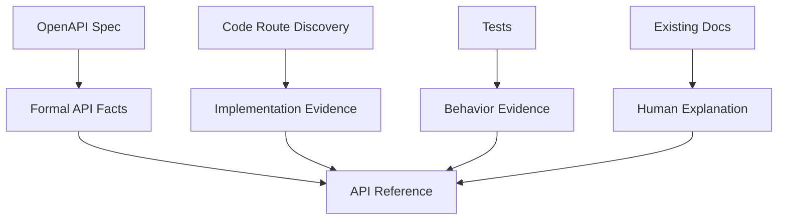
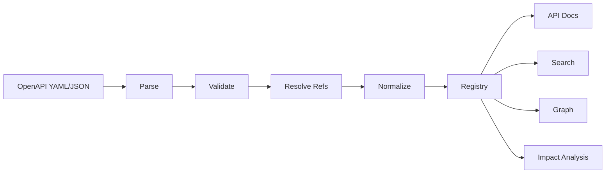

------
title: Build From Scratch: Mintlify-like AI-driven Documentation Generator CLI - Part 023
description: Membangun OpenAPI ingestion dan validation pipeline untuk documentation generator: local/remote specs, parsing YAML/JSON, bundling refs, normalization, semantic validation, style rules, security checks, provenance, diagnostics, cache, and code/spec consistency.
series: learn-mintlify-like-ai-docs-cli
seriesTitle: Build From Scratch: Mintlify-like AI-driven Documentation Generator CLI
order: 23
partTitle: OpenAPI Ingestion and Validation
tags:
  - documentation
  - ai
  - cli
  - openapi
  - api-reference
  - validation
  - developer-tools
date: 2026-07-03
---

# Part 023 — OpenAPI Ingestion and Validation

Kita sudah punya code index dan knowledge store.

Sekarang kita masuk ke salah satu source artifact paling penting untuk developer documentation: **OpenAPI**.

OpenAPI adalah formal contract untuk HTTP API. Dalam documentation generator production-grade, OpenAPI tidak boleh diperlakukan sebagai "file YAML biasa". Ia harus diperlakukan sebagai **high-authority source artifact**.

Jika OpenAPI tersedia, maka API reference harus mengambil fakta formal dari sana:

- operation method,
- path,
- operation ID,
- tags,
- summary,
- description,
- parameters,
- request body,
- response status,
- response schema,
- authentication/security,
- examples,
- servers,
- deprecation,
- schema definitions.

AI boleh membantu menjelaskan, mengelompokkan, atau menulis guide. Tetapi AI tidak boleh mengarang detail endpoint jika OpenAPI sudah menyediakannya.

---

## 1. Mental model: OpenAPI adalah formal API contract

Dalam sistem docs kita, source memiliki authority berbeda.



OpenAPI paling kuat untuk public contract. Code route discovery kuat untuk implementation evidence. Tests kuat untuk behavior evidence. Existing docs kuat untuk explanation, tetapi bisa stale.

Rule:

> API reference formal harus dihasilkan dari normalized OpenAPI, bukan dari AI prose.

---

## 2. Goals

OpenAPI ingestion pipeline harus:

1. menemukan spec file,
2. membaca YAML/JSON,
3. mendukung multiple specs,
4. memvalidasi struktur OpenAPI,
5. resolve `$ref`,
6. normalize versi dan shape,
7. menghasilkan operation registry,
8. menghasilkan schema registry,
9. menyimpan provenance,
10. mengeluarkan diagnostics actionable,
11. mendeteksi conflict dengan code discovery,
12. menghasilkan input stabil untuk API page generation.

---

## 3. Input sources

Spec bisa berasal dari beberapa lokasi:

```json
{
  "openapi": {
    "specs": [
      {
        "id": "public",
        "path": "openapi/public.yaml"
      },
      {
        "id": "admin",
        "path": "openapi/admin.json"
      }
    ]
  }
}
```

Potential source types:

| Source | Example | Default policy |
|---|---|---|
| Local file | `openapi.yaml` | Allowed |
| Local glob | `openapi/*.yaml` | Allowed if configured |
| URL | `https://example.com/openapi.json` | Disabled in deterministic build unless configured |
| Generated command | `npm run openapi:generate` | Explicit only |
| Inline config | embedded spec object | Not recommended |
| Package artifact | generated OpenAPI in build output | Allowed if path safe |

Prefer local committed specs for deterministic docs.

---

## 4. OpenAPI config model

```ts
export type OpenApiConfig = {
  specs: OpenApiSpecConfig[];
  validation: OpenApiValidationConfig;
  generation: OpenApiGenerationConfig;
};

export type OpenApiSpecConfig = {
  id: string;
  path?: string;
  url?: string;
  title?: string;
  visibility?: "public" | "internal" | "admin";
  baseRoute?: string;
  includeTags?: string[];
  excludeTags?: string[];
  includeOperations?: string[];
  excludeOperations?: string[];
};

export type OpenApiValidationConfig = {
  strict: boolean;
  failOnWarnings: boolean;
  allowRemoteRefs: boolean;
  requireOperationId: boolean;
  requireSummary: boolean;
  requireTags: boolean;
};

export type OpenApiGenerationConfig = {
  groupBy: "tag" | "path" | "operation" | "resource";
  routePrefix: string;
};
```

Example:

```json
{
  "openapi": {
    "specs": [
      {
        "id": "public",
        "path": "openapi/public.yaml",
        "baseRoute": "/api-reference"
      }
    ],
    "validation": {
      "strict": true,
      "allowRemoteRefs": false,
      "requireOperationId": true,
      "requireSummary": true,
      "requireTags": true
    },
    "generation": {
      "groupBy": "tag",
      "routePrefix": "/api-reference"
    }
  }
}
```

---

## 5. Discovery of specs

If config does not explicitly declare specs, we can infer common paths.

Common candidates:

```txt
openapi.yaml
openapi.yml
openapi.json
swagger.yaml
swagger.yml
swagger.json
api/openapi.yaml
docs/openapi.yaml
spec/openapi.yaml
```

But inferred discovery should be conservative.

```ts
export async function discoverOpenApiSpecs(projectRoot: string): Promise<DiscoveredOpenApiSpec[]> {
  const candidates = [
    "openapi.yaml",
    "openapi.yml",
    "openapi.json",
    "swagger.yaml",
    "swagger.yml",
    "swagger.json",
    "api/openapi.yaml",
    "docs/openapi.yaml",
    "spec/openapi.yaml",
  ];

  const found: DiscoveredOpenApiSpec[] = [];

  for (const relative of candidates) {
    const absolute = path.join(projectRoot, relative);
    if (await exists(absolute)) {
      found.push({
        id: inferSpecId(relative),
        path: relative,
        confidence: "medium",
      });
    }
  }

  return found;
}
```

If multiple candidates found without config, emit diagnostic and require explicit config.

---

## 6. Spec identity

Every spec needs stable ID.

```ts
export type OpenApiSpecId = string & { readonly brand: unique symbol };
```

Rules:

- config `id` preferred,
- fallback from filename,
- lowercase kebab-case,
- unique across project.

Diagnostic:

```txt
error openapi.spec.duplicateId
Multiple OpenAPI specs use id "public".
```

Spec ID is used for:

- routes,
- cache,
- operation IDs,
- provenance,
- API registry,
- graph nodes.

---

## 7. Parsing YAML/JSON

OpenAPI can be YAML or JSON.

Parser result:

```ts
export type OpenApiParseResult = {
  specId: OpenApiSpecId;
  raw: unknown;
  source: OpenApiSource;
  diagnostics: Diagnostic[];
};

export type OpenApiSource =
  | { type: "file"; path: string; hash: string }
  | { type: "url"; url: string; fetchedAt: string; hash: string };
```

Pseudo:

```ts
export async function parseOpenApiSpec(
  spec: OpenApiSpecConfig,
  ctx: OpenApiIngestionContext
): Promise<OpenApiParseResult> {
  const source = await loadOpenApiSource(spec, ctx);
  const text = source.text;

  try {
    const raw = spec.path?.endsWith(".json")
      ? JSON.parse(text)
      : parseYaml(text);

    return {
      specId: spec.id as OpenApiSpecId,
      raw,
      source: source.metadata,
      diagnostics: [],
    };
  } catch (error) {
    return {
      specId: spec.id as OpenApiSpecId,
      raw: undefined,
      source: source.metadata,
      diagnostics: [normalizeOpenApiParseError(spec, error)],
    };
  }
}
```

YAML parser errors must include line/column if possible.

---

## 8. Remote specs policy

Remote specs reduce determinism.

If allowed:

```json
{
  "openapi": {
    "specs": [
      {
        "id": "public",
        "url": "https://api.example.com/openapi.json"
      }
    ],
    "validation": {
      "allowRemoteRefs": false
    }
  }
}
```

Policies:

| Context | Default |
|---|---|
| `dev` | allow if explicitly configured |
| `build` | allow only if explicitly configured |
| `check` | allow only if explicitly configured |
| CI deterministic mode | prefer disallow |
| offline mode | disallow |

Cache remote response by URL and ETag/hash if implemented.

Diagnostic:

```txt
error openapi.remote.disabled
Remote OpenAPI specs are disabled in this build.

Hint:
Use a local committed spec file or enable remote specs explicitly.
```

---

## 9. Basic OpenAPI shape validation

Before full validation, check basic shape.

```ts
export function validateOpenApiRoot(raw: unknown, source: OpenApiSource): Diagnostic[] {
  const diagnostics: Diagnostic[] = [];

  if (!isObject(raw)) {
    diagnostics.push({
      code: "openapi.root.notObject",
      severity: "error",
      category: "openapi",
      message: "OpenAPI document root must be an object.",
      location: sourceLocation(source),
    });
    return diagnostics;
  }

  if (!("openapi" in raw) && !("swagger" in raw)) {
    diagnostics.push({
      code: "openapi.root.missingVersion",
      severity: "error",
      category: "openapi",
      message: "OpenAPI document is missing an openapi version field.",
      location: sourceLocation(source),
    });
  }

  if (!("paths" in raw)) {
    diagnostics.push({
      code: "openapi.root.missingPaths",
      severity: "error",
      category: "openapi",
      message: "OpenAPI document is missing required paths object.",
      location: sourceLocation(source),
    });
  }

  return diagnostics;
}
```

Swagger 2.0 support can be a future migration step. For this project, normalize OpenAPI 3.x first.

---

## 10. Validation levels

Validation has layers.

| Layer | Example | Severity |
|---|---|---|
| Syntax parse | invalid YAML | error |
| Spec structure | missing `paths` | error |
| Reference resolution | `$ref` target missing | error |
| Semantic API quality | missing `operationId` | warning/error by config |
| Style quality | summary too vague | warning |
| Security | remote `$ref` not allowed | error |
| Docs generation readiness | operation cannot produce route | error/warning |

This separation matters because not every weak spec should block dev mode.

---

## 11. Reference resolution

OpenAPI uses `$ref`.

Examples:

```yaml
schema:
  $ref: "#/components/schemas/User"
```

Need resolver.

```ts
export type RefResolutionPolicy = {
  allowRemoteRefs: boolean;
  maxDepth: number;
  preserveRefMetadata: boolean;
};

export type ResolvedRef<T = unknown> = {
  value: T;
  ref: string;
  source: ProvenanceRef;
};
```

Resolver:

```ts
export function resolveJsonPointer(root: unknown, pointer: string): unknown {
  if (!pointer.startsWith("#/")) {
    throw new Error(`Only local JSON pointers are supported: ${pointer}`);
  }

  const parts = pointer
    .slice(2)
    .split("/")
    .map((part) => part.replace(/~1/g, "/").replace(/~0/g, "~"));

  let current: unknown = root;

  for (const part of parts) {
    if (!isObject(current) && !Array.isArray(current)) {
      throw new Error(`Cannot resolve ${pointer}`);
    }

    current = (current as any)[part];
  }

  return current;
}
```

Need cycle detection.

---

## 12. Circular refs

Schemas often have circular refs.

Example:

```yaml
User:
  type: object
  properties:
    manager:
      $ref: "#/components/schemas/User"
```

Resolver must not infinitely expand.

Use graph of refs.

```ts
export type RefResolverState = {
  stack: string[];
  seen: Set<string>;
};
```

If ref repeats:

- preserve `$ref`,
- mark circular,
- do not inline infinitely.

```ts
if (state.stack.includes(ref)) {
  return {
    type: "circularRef",
    ref,
  };
}
```

For rendering, schema viewer can show circular reference by name.

---

## 13. Bundling vs dereferencing

Two strategies:

| Strategy | Meaning | Pros | Cons |
|---|---|---|---|
| Bundle | External refs become internal refs | preserves structure | still needs ref handling |
| Dereference | Replace refs with actual objects | easier traversal | cycles/problematic, loses names |
| Hybrid | Normalize registry and keep refs | best for docs | more design work |

Recommended: **hybrid registry**.

Create registries:

```ts
export type OpenApiRegistry = {
  specs: Map<OpenApiSpecId, NormalizedOpenApiDocument>;
  operations: Map<OperationKey, NormalizedOperation>;
  schemas: Map<SchemaKey, NormalizedSchema>;
  securitySchemes: Map<string, NormalizedSecurityScheme>;
};
```

Do not blindly inline everything.

---

## 14. Normalized document model

```ts
export type NormalizedOpenApiDocument = {
  id: OpenApiSpecId;
  title: string;
  version?: string;
  description?: string;
  servers: NormalizedServer[];
  operations: NormalizedOperation[];
  schemas: NormalizedSchema[];
  securitySchemes: NormalizedSecurityScheme[];
  tags: NormalizedTag[];
  source: OpenApiSource;
  diagnostics: Diagnostic[];
};
```

Operation:

```ts
export type NormalizedOperation = {
  key: OperationKey;
  specId: OpenApiSpecId;
  operationId: string;
  method: HttpMethod;
  path: string;
  summary?: string;
  description?: string;
  tags: string[];
  deprecated: boolean;
  parameters: NormalizedParameter[];
  requestBody?: NormalizedRequestBody;
  responses: NormalizedResponse[];
  security: NormalizedSecurityRequirement[];
  servers: NormalizedServer[];
  examples: NormalizedExample[];
  source: ProvenanceRef;
};
```

Method:

```ts
export type HttpMethod =
  | "GET"
  | "POST"
  | "PUT"
  | "PATCH"
  | "DELETE"
  | "HEAD"
  | "OPTIONS"
  | "TRACE";
```

---

## 15. Operation key

Need stable operation key.

```ts
export type OperationKey = string & { readonly brand: unique symbol };

export function operationKey(specId: string, method: string, path: string): OperationKey {
  return `${specId}:${method.toUpperCase()} ${normalizeApiPath(path)}` as OperationKey;
}
```

Do not rely only on `operationId` because specs can have missing/duplicate operation IDs.

But for generated page route, operationId is preferred if valid.

---

## 16. Operation ID validation

Operation ID is extremely useful for:

- route generation,
- code sample generation,
- SDK mapping,
- stable anchors,
- links,
- API components.

Rules:

1. operationId should exist,
2. operationId should be unique within spec,
3. operationId should be slug-safe or mappable,
4. operationId should not change casually.

Diagnostic:

```ts
{
  code: "openapi.operation.missingOperationId",
  severity: config.requireOperationId ? "error" : "warning",
  category: "openapi",
  message: `Operation ${method} ${path} is missing operationId.`,
  location: operationLocation,
  hint: "Add a stable operationId such as createUser or listUsers.",
}
```

Duplicate:

```txt
error openapi.operation.duplicateOperationId
operationId "createUser" is used by multiple operations.
```

---

## 17. Summary and description validation

API reference without summary is weak.

Rules:

- summary should exist,
- summary should be concise,
- description can be longer,
- summary should not repeat method/path only,
- avoid "TODO".

Diagnostic:

```txt
warning openapi.operation.missingSummary
POST /users is missing summary.
```

If `requireSummary` true, error.

---

## 18. Tags validation

Tags drive navigation grouping.

Rules:

- operation should have at least one tag,
- tag should be declared in root `tags` if strict,
- tag names should be stable,
- avoid too many tags per operation.

Diagnostic:

```txt
warning openapi.operation.missingTags
Operation POST /users has no tags, so API navigation grouping may be poor.
```

Fallback grouping by path prefix.

---

## 19. Parameter normalization

OpenAPI parameters can be defined at path or operation level.

Normalize combined parameters:

```ts
export type NormalizedParameter = {
  name: string;
  in: "path" | "query" | "header" | "cookie";
  required: boolean;
  description?: string;
  deprecated: boolean;
  schema?: NormalizedSchemaRef;
  examples: NormalizedExample[];
  source: ProvenanceRef;
};
```

Merge path-level + operation-level.

If operation-level parameter overrides same `name` + `in`, use operation-level.

Validation:

- path params must be required,
- every `{id}` in path should have path parameter,
- no extra path parameter not in path template,
- parameter should have schema,
- parameter description recommended.

---

## 20. Path parameter validation

Path:

```txt
/users/{id}
```

Expected parameter:

```yaml
parameters:
  - name: id
    in: path
    required: true
```

Check:

```ts
export function extractPathTemplateParams(path: string): string[] {
  return [...path.matchAll(/{([^}]+)}/g)].map((m) => m[1]!);
}
```

Diagnostics:

```txt
error openapi.path.missingPathParameter
Path /users/{id} uses parameter {id}, but operation does not define path parameter "id".
```

```txt
warning openapi.path.unusedPathParameter
Operation defines path parameter "userId", but it is not present in path /users/{id}.
```

---

## 21. Request body normalization

```ts
export type NormalizedRequestBody = {
  required: boolean;
  description?: string;
  content: NormalizedMediaType[];
  source: ProvenanceRef;
};

export type NormalizedMediaType = {
  mediaType: string;
  schema?: NormalizedSchemaRef;
  examples: NormalizedExample[];
};
```

Common media types:

- `application/json`,
- `application/x-www-form-urlencoded`,
- `multipart/form-data`,
- `text/plain`.

Validation:

- write operations often should have request body, but not always,
- request body content should have schema,
- examples recommended for public API.

---

## 22. Response normalization

```ts
export type NormalizedResponse = {
  status: string;
  description: string;
  content: NormalizedMediaType[];
  headers: NormalizedHeader[];
  source: ProvenanceRef;
};
```

Rules:

- responses object required,
- each response should have description,
- success response recommended,
- error responses recommended,
- response schemas recommended for JSON APIs.

Diagnostic:

```txt
warning openapi.response.missingSuccessResponse
POST /users has no 2xx response.
```

```txt
warning openapi.response.missingErrorResponses
POST /users has no 4xx error response.
```

---

## 23. Schema normalization

Schemas are complex. Start with normalized model.

```ts
export type NormalizedSchema =
  | ObjectSchema
  | ArraySchema
  | PrimitiveSchema
  | EnumSchema
  | RefSchema
  | OneOfSchema
  | AnyOfSchema
  | AllOfSchema
  | UnknownSchema;

export type ObjectSchema = {
  kind: "object";
  name?: string;
  description?: string;
  required: string[];
  properties: NormalizedSchemaProperty[];
  additionalProperties?: boolean | NormalizedSchemaRef;
  source: ProvenanceRef;
};

export type NormalizedSchemaProperty = {
  name: string;
  required: boolean;
  deprecated: boolean;
  description?: string;
  schema: NormalizedSchemaRef;
};
```

Schema ref:

```ts
export type NormalizedSchemaRef = {
  ref?: string;
  name?: string;
  schema?: NormalizedSchema;
};
```

Keep schema viewer capable of lazy resolving.

---

## 24. OpenAPI 3.0 vs 3.1

OpenAPI 3.1 aligns more closely with JSON Schema than 3.0. But generation pipeline should normalize into internal schema model.

Potential differences:

- nullable handling in 3.0,
- JSON Schema dialect in 3.1,
- `type` arrays in 3.1,
- examples behavior,
- schema keywords.

Strategy:

```ts
export type OpenApiVersion = "3.0" | "3.1" | "unknown";
```

Normalize:

- 3.0 `nullable: true` → include nullability metadata,
- 3.1 `type: ["string", "null"]` → nullable,
- preserve original schema for advanced viewer.

Do not erase version-specific details. Store raw pointer/provenance.

---

## 25. Security schemes

Normalize security schemes.

```ts
export type NormalizedSecurityScheme =
  | {
      type: "http";
      scheme: string;
      bearerFormat?: string;
      description?: string;
    }
  | {
      type: "apiKey";
      name: string;
      in: "query" | "header" | "cookie";
      description?: string;
    }
  | {
      type: "oauth2";
      flows: unknown;
      description?: string;
    }
  | {
      type: "openIdConnect";
      openIdConnectUrl: string;
      description?: string;
    };
```

Operation security:

```ts
export type NormalizedSecurityRequirement = {
  schemeName: string;
  scopes: string[];
};
```

Docs should show auth requirements per operation.

Validation:

- referenced security scheme exists,
- public operations intentionally unauthenticated if security empty,
- auth scheme description recommended.

---

## 26. Servers

Servers can appear root-level, path-level, operation-level.

Normalize effective servers per operation.

```ts
export type NormalizedServer = {
  url: string;
  description?: string;
  variables: Record<string, {
    default: string;
    enum?: string[];
    description?: string;
  }>;
};
```

Docs can show:

- base URL,
- environment options,
- server variables.

For generated API playground, server info matters.

---

## 27. Examples

OpenAPI examples appear in:

- parameter example,
- parameter examples,
- request body media type example,
- request body media type examples,
- response media type example,
- response media type examples,
- schema example.

Normalize:

```ts
export type NormalizedExample = {
  name?: string;
  summary?: string;
  description?: string;
  value?: unknown;
  externalValue?: string;
  source: ProvenanceRef;
};
```

Do not fetch external examples unless configured.

If `externalValue` remote, validation should note.

---

## 28. Provenance for OpenAPI elements

Every normalized object should know where it came from.

OpenAPI provenance can use JSON pointer.

```ts
export type OpenApiProvenanceRef = {
  artifactId: ArtifactId;
  path: string;
  selector: string;
  hash: string;
  kind: "openapiOperation" | "openapiSchema" | "openapiParameter" | "openapiResponse";
};
```

Operation pointer:

```txt
openapi/public.yaml#/paths/~1users/post
```

Schema pointer:

```txt
openapi/public.yaml#/components/schemas/User
```

This is essential for:

- diagnostics,
- stale detection,
- citations,
- traceability,
- PR comments.

---

## 29. Diagnostics location for YAML

JSON pointer is precise but not line/column.

For better diagnostics:

1. parse YAML with CST if possible,
2. map JSON pointer to line/column,
3. fallback to path + selector.

Diagnostic location:

```ts
{
  path: "openapi/public.yaml",
  selector: "#/paths/~1users/post/operationId"
}
```

Even without line, selector is actionable.

---

## 30. OpenAPI registry

After ingestion:

```ts
export type OpenApiRegistry = {
  documents: Map<OpenApiSpecId, NormalizedOpenApiDocument>;
  operationsByKey: Map<OperationKey, NormalizedOperation>;
  operationsById: Map<string, NormalizedOperation[]>;
  schemasByKey: Map<string, NormalizedSchema>;
  tags: Map<string, NormalizedTag>;
};
```

Build:

```ts
export function buildOpenApiRegistry(
  documents: NormalizedOpenApiDocument[]
): OpenApiRegistry {
  const registry = createEmptyOpenApiRegistry();

  for (const document of documents) {
    registry.documents.set(document.id, document);

    for (const operation of document.operations) {
      registry.operationsByKey.set(operation.key, operation);

      const byId = registry.operationsById.get(operation.operationId) ?? [];
      byId.push(operation);
      registry.operationsById.set(operation.operationId, byId);
    }

    for (const schema of document.schemas) {
      registry.schemasByKey.set(schemaKey(document.id, schema), schema);
    }
  }

  return registry;
}
```

API reference generator consumes registry, not raw OpenAPI object.

---

## 31. Store integration

Store OpenAPI as semantic artifacts.

Operation semantic artifact:

```ts
{
  type: "apiEndpoint",
  id: "openapi:public:createUser",
  sourceKind: "openapi",
  key: "POST /users",
  confidence: "high",
  payload: {
    specId: "public",
    operationId: "createUser",
    method: "POST",
    path: "/users",
    tags: ["Users"],
    deprecated: false
  }
}
```

Schema artifact maybe:

```ts
{
  type: "apiSchema",
  id: "openapi:public:schema:User",
  key: "User",
  payload: {
    specId: "public",
    name: "User"
  }
}
```

Graph edges:

```txt
openapi operation --usesSchema--> User
docPage --documents--> openapi operation
code route --matchesContract--> openapi operation
```

---

## 32. Code/spec consistency

From framework discovery, we may have code endpoint artifacts.

Match by:

- method,
- normalized path template,
- maybe operationId if annotations,
- visibility,
- base path mapping.

Normalize path parameters:

```txt
/users/{id}
```

and:

```txt
/users/:id
```

both map to:

```txt
/users/{id}
```

Function:

```ts
export function normalizeEndpointPath(path: string): string {
  return path
    .replace(/:([A-Za-z_][A-Za-z0-9_]*)/g, "{$1}")
    .replace(/\/+/g, "/")
    .replace(/\/$/, "") || "/";
}
```

Consistency diagnostics:

| Case | Diagnostic |
|---|---|
| code route not in OpenAPI | warning |
| OpenAPI operation no code handler | warning |
| method/path duplicated | warning/error |
| code path param mismatch | warning |
| internal route excluded | info/no diagnostic |

---

## 33. OpenAPI quality rules

Suggested rules:

| Rule | Code | Default |
|---|---|---|
| Missing operationId | `openapi.operation.missingOperationId` | warning/error |
| Duplicate operationId | `openapi.operation.duplicateOperationId` | error |
| Missing summary | `openapi.operation.missingSummary` | warning |
| Missing tags | `openapi.operation.missingTags` | warning |
| Missing path parameter definition | `openapi.path.missingPathParameter` | error |
| Unused path parameter | `openapi.path.unusedPathParameter` | warning |
| Missing 2xx response | `openapi.response.missingSuccessResponse` | warning |
| Missing response description | `openapi.response.missingDescription` | error/warning |
| Missing request schema | `openapi.request.missingSchema` | warning |
| Unknown security scheme | `openapi.security.unknownScheme` | error |
| External ref disallowed | `openapi.ref.remoteNotAllowed` | error |
| Circular schema ref | `openapi.schema.circularRef` | info/warning |
| Empty schema object | `openapi.schema.empty` | warning |

---

## 34. Style rules

Style rules improve generated docs.

Examples:

- summary should start with verb?
- tag names should be Title Case?
- operationId should be camelCase?
- schemas should have descriptions?
- error responses should use consistent error model?

These should be configurable, not hard-coded.

```json
{
  "openapi": {
    "style": {
      "operationIdCase": "camelCase",
      "requireSchemaDescriptions": true,
      "requireErrorResponses": true
    }
  }
}
```

Avoid making subjective style rules fatal by default.

---

## 35. Security checks

OpenAPI ingestion can expose risks.

Checks:

1. remote refs disallowed by default,
2. external examples not fetched by default,
3. server URLs should not include secrets,
4. examples should not contain real tokens,
5. API keys in examples should be redacted,
6. internal/admin specs should not be published unless configured.

Secret-like example diagnostic:

```txt
error openapi.example.secretLike
OpenAPI example appears to contain a secret-like value.
```

Server URL diagnostic:

```txt
warning openapi.server.suspiciousCredential
Server URL appears to contain credentials.
```

---

## 36. Ingestion cache

Cache by:

- spec source hash,
- tool version,
- parser/normalizer version,
- validation config hash.

```ts
export type OpenApiCacheKey = {
  specId: string;
  sourceHash: string;
  normalizerVersion: string;
  validationConfigHash: string;
};
```

Cache value:

```ts
export type OpenApiCacheEntry = {
  key: OpenApiCacheKey;
  document: NormalizedOpenApiDocument;
  diagnostics: Diagnostic[];
};
```

Cache helps large specs.

---

## 37. Command surface

Commands:

```bash
docforge openapi check
docforge openapi inspect
docforge openapi list-operations
docforge openapi list-schemas
docforge openapi diff
```

Examples:

```bash
docforge openapi check openapi/public.yaml
```

Output:

```txt
OpenAPI check completed.

Spec: public
Operations: 128
Schemas: 42
Errors: 0
Warnings: 11
```

List operations:

```txt
POST /users      createUser      Users
GET  /users/{id} getUser         Users
```

---

## 38. OpenAPI diff

Useful for docs impact.

Diff:

```ts
export type OpenApiDiff = {
  addedOperations: NormalizedOperation[];
  removedOperations: NormalizedOperation[];
  changedOperations: Array<{
    before: NormalizedOperation;
    after: NormalizedOperation;
    changes: OpenApiOperationChange[];
  }>;
  addedSchemas: NormalizedSchema[];
  removedSchemas: NormalizedSchema[];
  changedSchemas: SchemaChange[];
};
```

Operation changes:

- summary changed,
- request schema changed,
- response schema changed,
- parameter added/removed,
- security changed,
- deprecated changed.

Docs impact:

```txt
operation changed -> API page stale
schema changed -> all operations using schema may be stale
```

---

## 39. Testing ingestion

Fixtures:

```txt
fixtures/openapi/
  valid-3-0.yaml
  valid-3-1.yaml
  missing-operation-id.yaml
  duplicate-operation-id.yaml
  missing-path-param.yaml
  circular-schema.yaml
  remote-ref.yaml
  examples-secret.yaml
```

Test:

```ts
it("reports missing operationId", async () => {
  const result = await ingestOpenApiFixture("missing-operation-id.yaml", {
    requireOperationId: true,
  });

  expect(result.diagnostics).toContainEqual(
    expect.objectContaining({
      code: "openapi.operation.missingOperationId",
      severity: "error",
    })
  );
});
```

---

## 40. Golden normalized output tests

For valid fixtures, assert normalized operations.

```ts
it("normalizes operations", async () => {
  const result = await ingestOpenApiFixture("valid-3-0.yaml");

  expect(result.registry.operationsByKey.get("public:POST /users")).toMatchObject({
    method: "POST",
    path: "/users",
    operationId: "createUser",
    tags: ["Users"],
  });
});
```

Golden tests catch accidental normalizer changes.

---

## 41. Failure modes

| Failure | Cause | Prevention |
|---|---|---|
| API docs hallucinate fields | AI writes from prose, not spec | API reference generated from normalized OpenAPI |
| Build fails on circular schema | naive dereference | hybrid registry and cycle detection |
| Broken nav grouping | missing tags not diagnosed | tag validation/fallback grouping |
| Wrong endpoint route | operationId/path unstable | operation key and route lock |
| Duplicate operation pages | duplicate operationId | duplicate validation |
| Path params missing | no semantic path validation | path parameter check |
| Secrets published in examples | no example scanning | secret-like redaction diagnostics |
| Remote refs break CI | remote fetch default | disallow remote by default |
| Code/spec drift hidden | no consistency check | match OpenAPI operations with code routes |
| Huge spec slow | no cache | source hash cache |
| Bad YAML error unclear | raw parser exception | normalized diagnostics with path/selector |

---

## 42. Key takeaways

OpenAPI ingestion transforms formal API specs into normalized, validated, provenance-rich API facts.

The pipeline is:



Design principles:

1. treat OpenAPI as high-authority source,
2. parse and validate before generation,
3. normalize into internal model,
4. preserve provenance via JSON pointer,
5. handle refs and cycles safely,
6. keep remote access explicit,
7. run quality/style/security checks,
8. store operations as semantic artifacts,
9. cross-check with code discovery,
10. and never let AI invent formal API details.

Next, we use this normalized registry to generate **API reference pages**.
