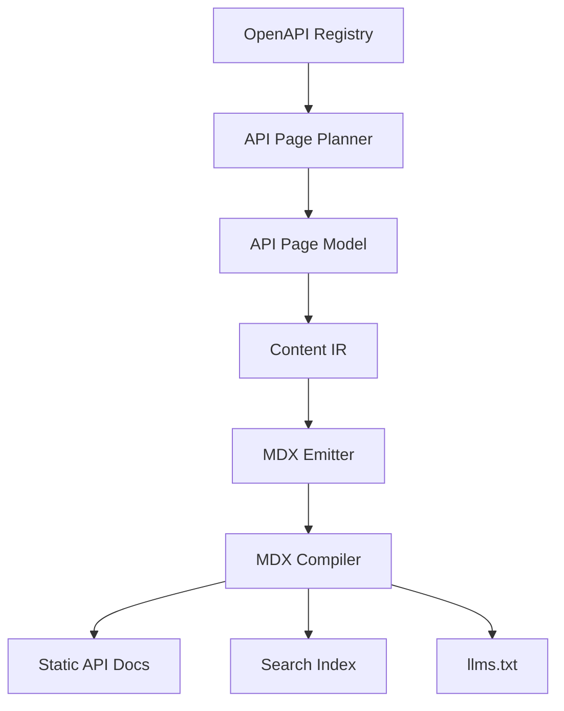
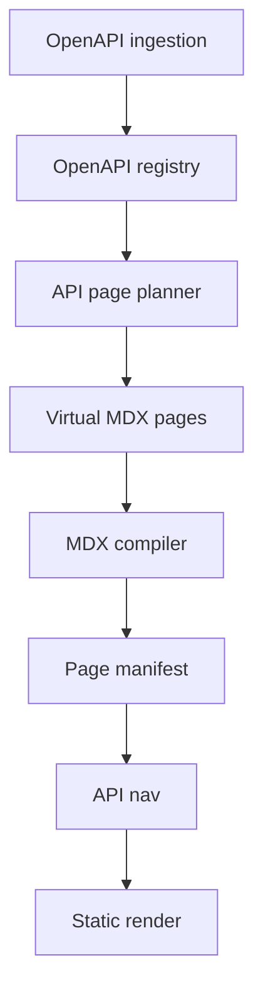
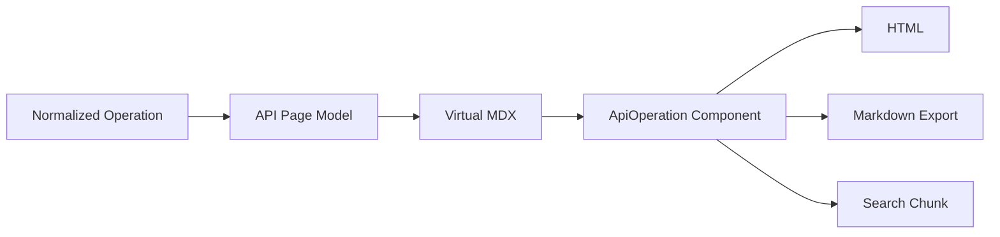

------
title: Build From Scratch: Mintlify-like AI-driven Documentation Generator CLI - Part 024
description: Membangun API reference page generation dari normalized OpenAPI registry: grouping, stable routes, operation page model, schema rendering, parameters, request/response docs, examples, auth, search, llms.txt export, diagnostics, and testing.
series: learn-mintlify-like-ai-docs-cli
seriesTitle: Build From Scratch: Mintlify-like AI-driven Documentation Generator CLI
order: 24
partTitle: API Reference Page Generation
tags:
  - documentation
  - ai
  - cli
  - openapi
  - api-reference
  - mdx
  - developer-tools
date: 2026-07-03
---

# Part 024 — API Reference Page Generation

Part sebelumnya menghasilkan `OpenApiRegistry` yang sudah:

- parsed,
- validated,
- ref-aware,
- normalized,
- provenance-rich,
- stored sebagai semantic artifacts.

Sekarang kita membangun tahap berikutnya:

> mengubah normalized OpenAPI registry menjadi API reference pages.

API reference bukan sekadar "dump YAML menjadi HTML". API reference yang bagus harus:

1. mudah dinavigasi,
2. route-nya stabil,
3. operation-nya lengkap,
4. parameter dan schema-nya jelas,
5. request/response examples mudah dipakai,
6. auth requirements terlihat,
7. search-friendly,
8. agent-readable,
9. bisa dihubungkan ke code graph,
10. dan tidak mengarang apapun di luar spec.

---

## 1. Mental model: API reference adalah compiled view dari API contract



Formal facts berasal dari registry. Page planner menentukan struktur halaman dan routes. Emitter menghasilkan MDX yang memakai API components atau static sections.

AI tidak diperlukan untuk membuat formal API reference. AI boleh membantu menulis guide tambahan, tetapi API reference harus deterministic.

---

## 2. Goals

API reference generator harus:

1. menghasilkan page candidate dari operations,
2. mengelompokkan operations,
3. membuat route stabil,
4. membuat navigation section,
5. menghasilkan operation page/section,
6. merender parameter/request/response/schema,
7. menampilkan auth/security,
8. menampilkan examples,
9. menyediakan provenance,
10. menghasilkan search chunks,
11. menghasilkan Markdown export untuk `llms.txt`,
12. mendukung multiple specs,
13. mengeluarkan diagnostics untuk spec yang tidak siap.

---

## 3. Page generation strategies

Ada beberapa strategi.

### 3.1 One page per operation

```txt
/api-reference/users/create-user
/api-reference/users/get-user
```

Pros:

- deep link jelas,
- search result spesifik,
- cocok untuk large APIs,
- mudah map page → operation.

Cons:

- banyak file/pages,
- navigation bisa panjang.

### 3.2 One page per tag/resource

```txt
/api-reference/users
```

Page berisi banyak operations.

Pros:

- navigation compact,
- cocok untuk small/medium APIs.

Cons:

- page panjang,
- search anchor harus bagus,
- operation-level provenance lebih kompleks.

### 3.3 Hybrid

- tag page overview,
- operation details as sections or generated child pages.

Recommended default:

| API size | Strategy |
|---|---|
| < 20 operations | tag/resource page |
| 20-200 operations | one page per operation grouped by tag |
| > 200 operations | one page per operation + sharded nav/search |

For our system, use configurable strategy.

---

## 4. API generation config

```ts
export type ApiReferenceGenerationConfig = {
  routePrefix: string;
  strategy: "operationPage" | "tagPage" | "hybrid";
  groupBy: "tag" | "path" | "resource" | "spec";
  includeDeprecated: boolean;
  includeInternal: boolean;
  showOperationId: boolean;
  showSchemasInline: boolean;
  examples: {
    include: boolean;
    preferNamedExamples: boolean;
  };
  auth: {
    showSecuritySchemes: boolean;
  };
};
```

Example:

```json
{
  "openapi": {
    "generation": {
      "routePrefix": "/api-reference",
      "strategy": "operationPage",
      "groupBy": "tag",
      "includeDeprecated": true,
      "showSchemasInline": true
    }
  }
}
```

---

## 5. API page model

Do not generate MDX directly from operation.

Use page model.

```ts
export type ApiReferencePage = {
  id: string;
  route: RoutePath;
  title: string;
  description: string;
  kind: "apiReference";
  specId: OpenApiSpecId;
  group?: ApiReferenceGroup;
  operations: NormalizedOperation[];
  blocks: ApiReferenceBlock[];
  provenance: ProvenanceRef[];
};

export type ApiReferenceGroup = {
  type: "tag" | "path" | "resource" | "spec";
  key: string;
  title: string;
};
```

Blocks:

```ts
export type ApiReferenceBlock =
  | ApiOperationSummaryBlock
  | ApiEndpointBlock
  | ApiAuthBlock
  | ApiParametersBlock
  | ApiRequestBodyBlock
  | ApiResponsesBlock
  | ApiExamplesBlock
  | ApiSchemaBlock
  | ApiDeprecatedBlock;
```

---

## 6. Operation page model

For one page per operation:

```ts
export type ApiOperationPage = ApiReferencePage & {
  strategy: "operationPage";
  operation: NormalizedOperation;
};
```

Sections:

1. title/summary,
2. method/path,
3. description,
4. deprecation notice,
5. authentication,
6. path/query/header parameters,
7. request body,
8. responses,
9. examples,
10. related schemas,
11. provenance/debug metadata optional.

Output skeleton:

```mdx
------
title: Create user
description: Creates a new user.
kind: apiReference
generated: true
---

# Create user

<Endpoint method="POST" path="/users" />

Creates a new user.

## Authentication

## Parameters

## Request body

## Responses

## Examples
```

---

## 7. Tag page model

For tag page strategy:

```ts
export type ApiTagPage = ApiReferencePage & {
  strategy: "tagPage";
  tag: string;
  operations: NormalizedOperation[];
};
```

Output:

```mdx
# Users

Operations for managing users.

## Create user

<ApiOperation operationId="createUser" />

## Get user

<ApiOperation operationId="getUser" />
```

This can use component references instead of expanding all details into MDX.

---

## 8. Stable route generation

Routes must not change casually.

Route sources in order:

1. explicit route override,
2. route lock by operation key,
3. operationId slug,
4. method + path slug.

```ts
export function routeForOperation(
  operation: NormalizedOperation,
  config: ApiReferenceGenerationConfig,
  routeLock: RouteLock
): RoutePath {
  const stableId = operation.key;
  const existing = routeLock.get(stableId);

  if (existing) {
    return existing;
  }

  const slug = operation.operationId
    ? slugify(operation.operationId)
    : slugify(`${operation.method}-${operation.path}`);

  const group = groupSlugForOperation(operation, config);
  const route = normalizeRoute(`${config.routePrefix}/${group}/${slug}`);

  routeLock.set(stableId, route);

  return route as RoutePath;
}
```

If operationId changes but method/path same, route lock preserves route.

---

## 9. Operation title generation

Sources:

1. summary,
2. operationId humanized,
3. method + path fallback.

```ts
export function titleForOperation(operation: NormalizedOperation): string {
  if (operation.summary && isGoodSummary(operation.summary)) {
    return trimSentencePeriod(operation.summary);
  }

  if (operation.operationId) {
    return humanizeIdentifier(operation.operationId);
  }

  return `${operation.method} ${operation.path}`;
}
```

Examples:

| operationId | Title |
|---|---|
| `createUser` | Create user |
| `listUsers` | List users |
| `deleteProjectMember` | Delete project member |

Do not over-capitalize.

---

## 10. Description generation

Description source:

1. operation description,
2. operation summary,
3. fallback generated factual sentence.

```ts
export function descriptionForOperation(operation: NormalizedOperation): string {
  if (operation.description) {
    return firstSentence(operation.description);
  }

  if (operation.summary) {
    return operation.summary;
  }

  return `${operation.method} ${operation.path}.`;
}
```

If fallback used, emit warning earlier in validation.

---

## 11. Grouping by tag

```ts
export function groupOperationsByTag(
  operations: NormalizedOperation[]
): Map<string, NormalizedOperation[]> {
  const groups = new Map<string, NormalizedOperation[]>();

  for (const operation of operations) {
    const tag = operation.tags[0] ?? "Other";
    const group = groups.get(tag) ?? [];
    group.push(operation);
    groups.set(tag, group);
  }

  for (const group of groups.values()) {
    group.sort(compareOperationsForApiNav);
  }

  return groups;
}
```

Sort:

```ts
const METHOD_ORDER = ["GET", "POST", "PUT", "PATCH", "DELETE", "HEAD", "OPTIONS"];

export function compareOperationsForApiNav(a: NormalizedOperation, b: NormalizedOperation): number {
  const pathCompare = a.path.localeCompare(b.path);
  if (pathCompare !== 0) return pathCompare;

  return METHOD_ORDER.indexOf(a.method) - METHOD_ORDER.indexOf(b.method);
}
```

---

## 12. Grouping by resource

Resource extraction:

```txt
/users -> users
/users/{id} -> users
/projects/{projectId}/members -> projects or members?
```

Simple strategy: first non-parameter segment.

```ts
export function resourceFromPath(path: string): string {
  const segment = path
    .split("/")
    .filter(Boolean)
    .find((part) => !part.startsWith("{"));

  return segment ?? "root";
}
```

For better grouping, allow config override.

```json
{
  "openapi": {
    "resources": {
      "/projects/{projectId}/members/**": "Project members"
    }
  }
}
```

---

## 13. API navigation generation

Navigation section:

```ts
export function buildApiNavigation(
  pages: ApiReferencePage[],
  config: ApiReferenceGenerationConfig
): NavNode {
  const byGroup = groupPagesForNav(pages, config.groupBy);

  return {
    type: "group",
    title: "API Reference",
    children: [...byGroup.entries()].map(([group, groupPages]) => ({
      type: "group",
      title: group,
      children: groupPages.map((page) => ({
        type: "page",
        pageId: page.id as PageId,
      })),
    })),
  };
}
```

If only one group, flatten optionally.

Nav title for operation:

```ts
export function navTitleForOperation(operation: NormalizedOperation): string {
  if (operation.summary) return trimSentencePeriod(operation.summary);
  if (operation.operationId) return humanizeIdentifier(operation.operationId);
  return `${operation.method} ${operation.path}`;
}
```

For dense API nav, include method badge in renderer, not title string.

---

## 14. MDX output strategy

Two options:

### Option A — rich component

```mdx
<ApiOperation operationId="createUser" />
```

Pros:

- MDX compact,
- operation rendering centralized,
- updates automatically if registry changes.

Cons:

- final MDX less readable without renderer,
- `llms.txt` export must understand component.

### Option B — expanded MDX sections

```mdx
## Request body

| Field | Type | Required | Description |
```

Pros:

- human-readable MDX,
- portable.

Cons:

- more generated content,
- harder to update component design.

Recommended hybrid:

- operation page contains semantic components for complex parts,
- component registry provides Markdown/search export.

Example:

```mdx
# Create user

<ApiEndpoint operationId="createUser" />

<ApiOperationDescription operationId="createUser" />

<ApiParameters operationId="createUser" />

<ApiRequestBody operationId="createUser" />

<ApiResponses operationId="createUser" />

<ApiExamples operationId="createUser" />
```

But too many components may be noisy.

Simpler:

```mdx
<ApiOperation operationId="createUser" />
```

with operation registry.

---

## 15. Component contract for API operation

```ts
export const ApiOperationSpec: ComponentSpec = {
  name: "ApiOperation",
  version: "1.0.0",
  props: {
    operationId: { type: "string", required: true },
    specId: { type: "string", required: false },
  },
  children: { type: "none" },
  render: renderApiOperation,
  toMarkdown: apiOperationToMarkdown,
  extractSearchText: apiOperationSearchText,
};
```

Validation:

- operationId exists,
- if duplicate operationId across specs, specId required,
- operation not excluded,
- operation visibility allowed.

Diagnostic:

```txt
error api.component.unknownOperation
<ApiOperation operationId="createUser" /> does not match any normalized OpenAPI operation.
```

---

## 16. Operation page generated MDX

Example generated page:

```mdx
------
title: Create user
description: Creates a new user.
kind: apiReference
generated: true
---

# Create user

<ApiOperation specId="public" operationId="createUser" />
```

Sidecar manifest:

```json
{
  "pageId": "api-public-create-user",
  "documents": [
    {
      "type": "openapiOperation",
      "specId": "public",
      "operationId": "createUser",
      "selector": "#/paths/~1users/post"
    }
  ]
}
```

This keeps MDX short and traceable.

---

## 17. Fully expanded Markdown export

Even if MDX is compact, `llms.txt` must export operation detail.

`ApiOperation.toMarkdown`:

````md
## Create user

`POST /users`

Creates a new user.

### Authentication

Requires bearer authentication.

### Request body

Content type: `application/json`

| Field | Type | Required | Description |
|---|---|---:|---|
| `email` | string | yes | User email address. |

### Responses

#### `201 Created`

Returns the created user.

#### `400 Bad Request`

The request is invalid.
````

This ensures agents can consume API docs without running React.

---

## 18. Endpoint header rendering

Visual component:

```tsx
<Endpoint method="POST" path="/users" />
```

Data:

```ts
export type EndpointProps = {
  method: HttpMethod;
  path: string;
};
```

Search extraction:

```txt
POST /users
```

Accessibility:

- method text visible,
- color not sole indicator,
- path copy button has label.

---

## 19. Authentication section

From operation security.

Cases:

| Security | Render |
|---|---|
| inherited from root | Show effective auth |
| empty array | "No authentication required" |
| bearer | "Bearer token required" |
| apiKey header | "API key in header `X-API-Key`" |
| oauth2 scopes | list required scopes |
| multiple alternatives | show alternatives |

Normalized render model:

```ts
export type ApiAuthViewModel = {
  required: boolean;
  alternatives: Array<{
    schemes: Array<{
      name: string;
      type: string;
      description?: string;
      scopes?: string[];
    }>;
  }>;
};
```

Do not show actual secrets.

---

## 20. Parameters section

Group parameters by location.

```ts
export type ParameterGroup = {
  in: "path" | "query" | "header" | "cookie";
  parameters: NormalizedParameter[];
};
```

Render table:

```mdx
## Parameters

### Path parameters

| Name | Type | Required | Description |
|---|---|---:|---|
| `id` | string | yes | User ID. |

### Query parameters

| Name | Type | Required | Description |
|---|---|---:|---|
| `includeDeleted` | boolean | no | Include deleted users. |
```

If no parameters:

```txt
This endpoint does not define parameters.
```

But avoid clutter. Omit empty section unless useful.

---

## 21. Parameter type rendering

Schema to type string:

```ts
export function renderSchemaType(schema: NormalizedSchemaRef): string {
  if (schema.ref && schema.name) return schema.name;

  const s = schema.schema;
  if (!s) return "unknown";

  switch (s.kind) {
    case "primitive":
      return s.nullable ? `${s.type} | null` : s.type;
    case "array":
      return `${renderSchemaType(s.items)}[]`;
    case "enum":
      return s.values.map((v) => JSON.stringify(v)).join(" | ");
    case "object":
      return "object";
    case "oneOf":
      return s.variants.map(renderSchemaType).join(" | ");
    default:
      return "unknown";
  }
}
```

Keep human-readable. Link schema names where possible.

---

## 22. Request body section

Render by content type.

```mdx
## Request body

Content type: `application/json`

<SchemaViewer schemaRef="CreateUserRequest" />
```

If multiple content types:

```mdx
<Tabs>
  <Tab title="application/json">
    <SchemaViewer schemaRef="CreateUserRequest" />
  </Tab>

  <Tab title="multipart/form-data">
    <SchemaViewer schemaRef="UploadUserAvatarRequest" />
  </Tab>
</Tabs>
```

Request body required flag:

```txt
This endpoint requires a request body.
```

or badge.

---

## 23. Schema viewer

Schema viewer should support:

- object properties,
- required fields,
- nested objects,
- arrays,
- enum values,
- oneOf/anyOf/allOf,
- nullable,
- deprecated fields,
- descriptions,
- examples,
- circular refs.

View model:

```ts
export type SchemaViewModel = {
  name?: string;
  kind: string;
  description?: string;
  properties?: SchemaPropertyViewModel[];
  enumValues?: unknown[];
  variants?: SchemaViewModel[];
};

export type SchemaPropertyViewModel = {
  name: string;
  type: string;
  required: boolean;
  deprecated: boolean;
  description?: string;
};
```

Do not inline infinite nested schemas. Use depth limit.

```ts
maxSchemaDepth = 3
```

Then link to schema detail.

---

## 24. Response section

Render responses sorted.

Status order:

1. 2xx,
2. 3xx,
3. 4xx,
4. 5xx,
5. default.

```ts
export function compareResponseStatus(a: string, b: string): number {
  return responseRank(a) - responseRank(b);
}
```

Example:

```mdx
## Responses

### `201 Created`

Created user.

<SchemaViewer schemaRef="User" />

### `400 Bad Request`

Invalid request.

<SchemaViewer schemaRef="ErrorResponse" />
```

If many responses, use accordions.

---

## 25. Examples section

Examples from operation:

- request examples,
- response examples,
- parameter examples,
- generated examples later from SDK/code sample generator.

For now, render spec-provided examples.

```mdx
## Examples

### Request

```json
{
  "email": "user@example.com",
  "name": "Jane Doe"
}
```

### Response `201`

```json
{
  "id": "usr_123",
  "email": "user@example.com"
}
```
```

Security:

- scan example for secret-like values,
- do not render external examples unless fetched/validated.

---

## 26. Deprecation notice

If operation deprecated:

```mdx
<Callout type="warning" title="Deprecated endpoint">
This endpoint is marked as deprecated in the OpenAPI specification.
</Callout>
```

If spec has custom extension:

```yaml
x-deprecation-message: Use POST /v2/users instead.
```

Render message.

Support vendor extensions carefully.

---

## 27. Vendor extensions

OpenAPI supports `x-*`.

Useful examples:

- `x-codeSamples`,
- `x-internal`,
- `x-deprecation-message`,
- `x-docs-group`,
- `x-docs-order`,
- `x-stability`,
- `x-beta`.

Normalize selected extensions.

```ts
export type OpenApiDocsExtensions = {
  internal?: boolean;
  docsGroup?: string;
  docsOrder?: number;
  codeSamples?: CodeSample[];
  stability?: "alpha" | "beta" | "stable" | "deprecated";
};
```

Do not let arbitrary extension drive unsafe rendering.

---

## 28. Operation visibility

Visibility sources:

1. spec config visibility,
2. `x-internal`,
3. tag/prefix rules,
4. route classification from code,
5. explicit include/exclude config.

```ts
export type ApiOperationVisibility =
  | "public"
  | "internal"
  | "admin"
  | "hidden";
```

Generation filter:

```ts
export function shouldGenerateOperation(
  operation: NormalizedOperation,
  config: ApiReferenceGenerationConfig
): boolean {
  if (operation.visibility === "internal" && !config.includeInternal) {
    return false;
  }

  if (operation.deprecated && !config.includeDeprecated) {
    return false;
  }

  return true;
}
```

---

## 29. API page manifest

Generated API pages become page manifest entries.

```ts
export function apiPageToManifestEntry(page: ApiReferencePage): PageManifestEntry {
  return {
    id: page.id as PageId,
    sourcePath: `virtual:openapi:${page.id}`,
    route: page.route,
    title: page.title,
    description: page.description,
    kind: "apiReference",
    navTitle: page.title,
    tags: ["api", page.specId],
    generated: true,
    draft: false,
    hidden: false,
  };
}
```

Physical generated pages can later be written by `docforge generate --apply`.

Build can render virtual pages without writing MDX source.

---

## 30. Sidecar provenance

For generated API page:

```json
{
  "pageId": "api-public-create-user",
  "generatedFrom": [
    {
      "kind": "openapiOperation",
      "specId": "public",
      "operationId": "createUser",
      "selector": "#/paths/~1users/post",
      "hash": "sha256:..."
    }
  ]
}
```

Store mapping:

```txt
docPage --documents--> openapi:public:createUser
```

This powers stale detection.

---

## 31. Search extraction for API pages

Search chunk should include:

- title,
- method,
- path,
- operationId,
- summary,
- description,
- tags,
- parameters,
- schema names,
- response statuses,
- auth scheme names.

Chunk:

```ts
export function operationToSearchChunk(operation: NormalizedOperation, page: ApiReferencePage): SearchChunk {
  return {
    id: `api:${operation.key}`,
    pageId: page.id as PageId,
    route: page.route,
    anchor: undefined,
    title: page.title,
    sectionTitle: `${operation.method} ${operation.path}`,
    breadcrumbs: ["API Reference", ...(operation.tags ?? [])],
    kind: "apiReference",
    text: [
      operation.operationId,
      operation.method,
      operation.path,
      operation.summary,
      operation.description,
      operation.tags.join(" "),
      operation.parameters.map((p) => p.name).join(" "),
      operation.responses.map((r) => r.status).join(" "),
    ].filter(Boolean).join("\n"),
    entities: [{
      type: "apiOperation",
      operationId: operation.operationId,
      method: operation.method,
      path: operation.path,
    }],
    weight: 10,
  };
}
```

Exact query `POST /users` should rank this high.

---

## 32. `llms.txt` export for API

API operation Markdown should be concise but complete.

```md
## Create user

Method: `POST`  
Path: `/users`  
Operation ID: `createUser`

Creates a new user.

Authentication: Bearer token.

### Request body

Content type: `application/json`

Schema: `CreateUserRequest`

Required fields:
- `email` string
- `name` string

### Responses

- `201`: Created user. Schema: `User`
- `400`: Invalid request. Schema: `ErrorResponse`
```

Avoid huge nested schemas in `llms.txt`. Link or summarize schemas.

`llms-full.txt` can include more schema details.

---

## 33. Schema reference pages

For large APIs, create schema reference pages.

Routes:

```txt
/api-reference/schemas/user
/api-reference/schemas/create-user-request
```

Page:

```mdx
# User

<SchemaViewer schemaRef="User" />
```

When to generate schema pages?

| Condition | Generate? |
|---|---|
| schema used by many operations | yes |
| schema complex | yes |
| simple inline object | no |
| internal schema | no unless internal docs |
| huge schema | yes page instead of inline |

Config:

```json
{
  "openapi": {
    "generation": {
      "schemaPages": "auto"
    }
  }
}
```

Options:

```txt
none
auto
all
```

---

## 34. Related operations

Operation page can show related operations.

Heuristics:

- same tag,
- same resource path,
- same schema,
- same operationId prefix,
- opposite action: create/list/get/update/delete.

Example:

```txt
Related:
- List users
- Get user
- Update user
```

Keep deterministic.

```ts
export function relatedOperations(
  operation: NormalizedOperation,
  registry: OpenApiRegistry
): NormalizedOperation[] {
  return registry.documents.get(operation.specId)!.operations
    .filter((candidate) => candidate.key !== operation.key)
    .filter((candidate) => sharesTagOrResource(operation, candidate))
    .sort(compareOperationsForApiNav)
    .slice(0, 5);
}
```

---

## 35. Breadcrumbs

For operation page:

```txt
API Reference / Users / Create user
```

From nav grouping.

For schema page:

```txt
API Reference / Schemas / User
```

Breadcrumb should not depend only on route path if nav groups differ.

---

## 36. API page diagnostics

Generation diagnostics:

| Code | Meaning |
|---|---|
| `api.page.routeCollision` | generated route collides |
| `api.page.duplicateTitle` | duplicate page title in group |
| `api.page.missingOperation` | component references unknown operation |
| `api.page.ambiguousOperationId` | operationId used across specs |
| `api.page.noOperations` | spec/filter produced no operations |
| `api.schema.tooDeep` | schema rendering depth exceeded |
| `api.example.secretLike` | example refused/redacted |
| `api.nav.emptyGroup` | generated API nav group empty |

Route collision:

```txt
error api.page.routeCollision
Multiple API operations generate route /api-reference/users/create-user.
```

Fix:

- use route lock,
- include method/path slug,
- require unique operationId.

---

## 37. Route collision handling

If two operationIds generate same slug:

```txt
createUser
create-user
```

Collision strategy:

1. try operationId slug,
2. if conflict, append method/path hash,
3. record route in lock,
4. emit warning if collision required fallback.

```ts
export function uniqueApiRoute(
  proposed: RoutePath,
  operation: NormalizedOperation,
  used: Set<RoutePath>
): RoutePath {
  if (!used.has(proposed)) {
    used.add(proposed);
    return proposed;
  }

  const fallback = `${proposed}-${slugify(operation.method)}-${shortHash(operation.path)}` as RoutePath;
  used.add(fallback);
  return fallback;
}
```

Better to surface operationId uniqueness validation earlier.

---

## 38. Multiple specs

If multiple specs:

```txt
/api-reference/public/users/create-user
/api-reference/admin/users/create-user
```

Or separate groups:

```txt
API Reference
  Public API
  Admin API
```

Route generation should include spec ID if multiple specs.

```ts
export function routePrefixForSpec(
  spec: NormalizedOpenApiDocument,
  allSpecs: NormalizedOpenApiDocument[],
  config: ApiReferenceGenerationConfig
): string {
  if (allSpecs.length === 1) {
    return config.routePrefix;
  }

  return `${config.routePrefix}/${slugify(spec.id)}`;
}
```

Operation component should include `specId` when operationId may collide.

---

## 39. API overview page

Generate optional overview.

Route:

```txt
/api-reference
```

Content:

- API title,
- version,
- base URLs,
- authentication summary,
- groups/tags,
- links to operations,
- schema reference.

Example:

```mdx
# API Reference

This API reference is generated from `openapi/public.yaml`.

## Base URLs

| Environment | URL |
|---|---|
| Production | `https://api.example.com` |

## Authentication

Most endpoints require bearer authentication.

<CardGroup cols={2}>
  <Card title="Users" href="/api-reference/users">
    User management endpoints.
  </Card>
</CardGroup>
```

---

## 40. API changelog integration

Not required now, but page generation should be compatible with future diffs.

OpenAPI diff can produce:

- added operation,
- removed operation,
- changed schema,
- deprecated operation.

API page can include generated "Changed in" metadata if versioning exists.

Do not implement early, but preserve operation keys and source hashes.

---

## 41. API reference testing

Fixtures:

```txt
fixtures/api-generation/
  simple-users/
    openapi.yaml
    expected-pages.json
    expected-nav.json
  multi-tag/
  duplicate-operation-id/
  multiple-specs/
  schema-pages/
```

Test page planning:

```ts
it("generates one page per operation", async () => {
  const registry = await ingestFixture("simple-users/openapi.yaml");

  const pages = planApiReferencePages(registry, {
    strategy: "operationPage",
    groupBy: "tag",
    routePrefix: "/api-reference",
  });

  expect(pages).toContainEqual(
    expect.objectContaining({
      route: "/api-reference/users/create-user",
      title: "Create user",
    })
  );
});
```

Test MDX:

```ts
it("emits ApiOperation component", () => {
  const mdx = emitApiOperationPage(page);

  expect(mdx).toContain('<ApiOperation specId="public" operationId="createUser" />');
});
```

---

## 42. Golden Markdown export tests

Given operation, expected Markdown.

```ts
it("exports operation to Markdown", () => {
  const markdown = apiOperationToMarkdown(operation, registry);

  expect(markdown).toContain("Method: `POST`");
  expect(markdown).toContain("Path: `/users`");
  expect(markdown).toContain("### Responses");
});
```

This ensures `llms.txt` export remains useful.

---

## 43. Visual/API component tests

Render fixture operation with:

- path params,
- query params,
- request body,
- multiple responses,
- auth schemes,
- examples,
- deprecated flag,
- nested schemas,
- oneOf/anyOf,
- circular refs.

Component should not crash.

---

## 44. Integration with static build

Build flow:



API pages can be virtual in build. They do not need committed MDX files unless user wants.

`docforge generate --api --apply` can write physical pages later.

---

## 45. Integration with dev server

When OpenAPI file changes:

1. re-ingest spec,
2. rebuild API registry,
3. regenerate virtual API pages,
4. recompile API pages,
5. rebuild navigation,
6. update search,
7. notify browser.

Do not restart dev server.

Diagnostics appear overlay.

---

## 46. Integration with knowledge store

Persist:

- OpenAPI artifact,
- apiEndpoint semantic artifacts,
- apiSchema semantic artifacts,
- docs page mappings,
- provenance refs,
- code/spec matching relations.

This enables:

```bash
docforge coverage
docforge graph impact --changed openapi/public.yaml
docforge openapi diff
```

---

## 47. Anti-pattern: generating prose with AI for formal fields

Bad:

> AI reads endpoint name and invents request fields.

Good:

- request fields come from schema,
- response fields come from schema,
- description comes from OpenAPI description,
- AI only suggests improvements if missing.

If summary missing, output factual fallback and diagnostic:

```txt
POST /users
```

Do not invent "Creates a new user" unless evidence exists.

---

## 48. Anti-pattern: route from title only

If title changes, route changes.

Bad:

```txt
summary: Create user -> /api-reference/create-user
summary: Register user -> /api-reference/register-user
```

External links break.

Use route lock and operation key.

---

## 49. Anti-pattern: fully dereferencing schemas into every page

If every operation page expands all nested schemas, docs become huge.

Better:

- inline shallow schema,
- link complex schemas,
- generate schema pages,
- use collapsible viewer,
- export compact Markdown.

---

## 50. Minimal implementation milestone

First version:

1. normalize operations from OpenAPI registry,
2. generate one virtual page per operation,
3. stable route from operationId with route lock,
4. group nav by tag,
5. emit MDX with `<ApiOperation />`,
6. implement `ApiOperation` render/export/search,
7. render endpoint, params, request body, responses,
8. store doc mappings/provenance,
9. add diagnostics for route collisions/unknown operations,
10. fixture tests.

Second version:

1. tag pages/hybrid pages,
2. schema reference pages,
3. examples rendering,
4. auth details,
5. multiple specs,
6. OpenAPI-code consistency in page badges,
7. API changelog/diff,
8. API playground integration,
9. generated code samples.

---

## 51. Failure modes

| Failure | Cause | Prevention |
|---|---|---|
| API page route changes | route based on summary | operation key + route lock |
| Formal fields hallucinated | AI-written API details | deterministic generation from registry |
| Search cannot find endpoint | method/path not indexed | API search chunk entities |
| `llms.txt` loses API detail | component has no Markdown export | `ApiOperation.toMarkdown` |
| Duplicate pages | duplicate operationId/route | validation and collision handling |
| Schema render infinite loop | circular refs | depth limit and ref viewer |
| Internal endpoints published | no visibility policy | operation visibility filtering |
| Multiple specs conflict | operationId not namespaced | include specId |
| Dev server stale after spec edit | no OpenAPI watch integration | re-ingest and regenerate virtual pages |
| Docs not marked stale | no page mapping | docPage documents operation relation |

---

## 52. Key takeaways

API reference generation is deterministic compilation from normalized OpenAPI to docs pages.



A strong API reference generator:

1. uses OpenAPI as formal source,
2. keeps routes stable,
3. groups operations deterministically,
4. uses semantic API components,
5. exports operation details to Markdown,
6. indexes method/path/parameters,
7. preserves provenance,
8. supports multiple specs,
9. handles schema complexity safely,
10. and avoids AI-generated formal API facts.

Next, we build the **API playground and request builder model**.
