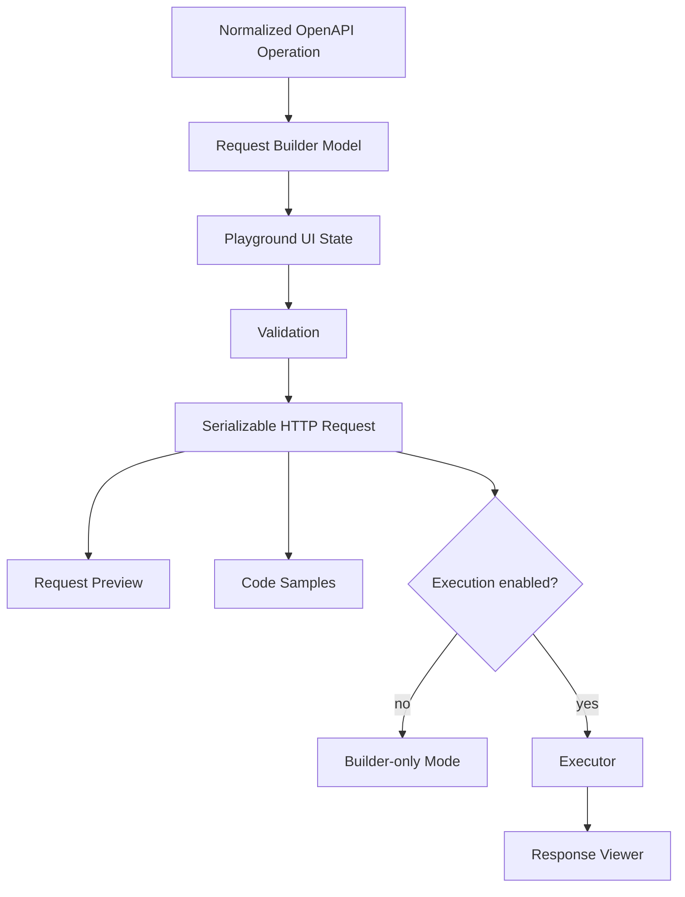
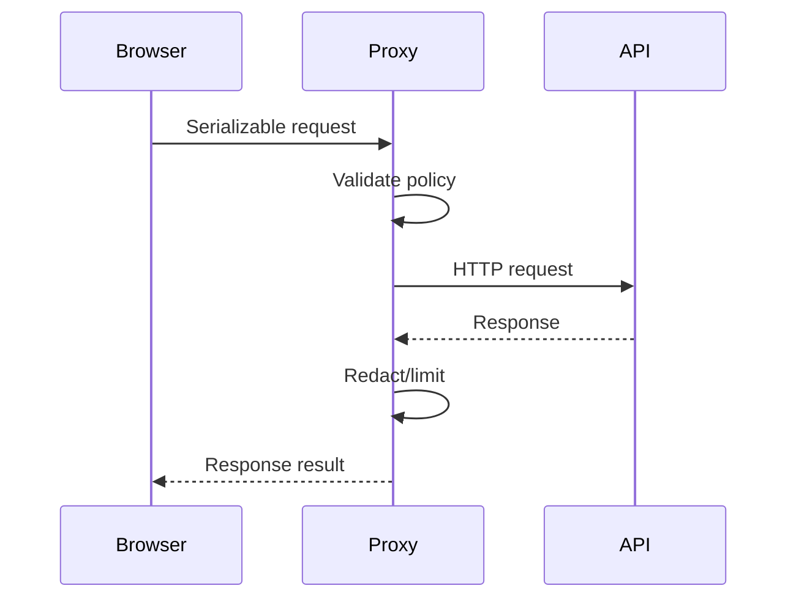
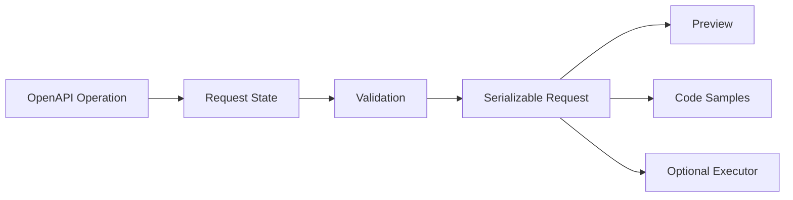

------
title: Build From Scratch: Mintlify-like AI-driven Documentation Generator CLI - Part 025
description: Mendesain API playground dan request builder model untuk documentation generator: OpenAPI-driven forms, auth, environments, parameter binding, request body editor, validation, execution policy, proxy model, security, persistence, diagnostics, and testing.
series: learn-mintlify-like-ai-docs-cli
seriesTitle: Build From Scratch: Mintlify-like AI-driven Documentation Generator CLI
order: 25
partTitle: API Playground and Request Builder Model
tags:
  - documentation
  - ai
  - cli
  - openapi
  - api-playground
  - request-builder
  - developer-tools
date: 2026-07-03
---

# Part 025 — API Playground and Request Builder Model

Setelah API reference bisa dibuat dari OpenAPI, kita masuk ke fitur yang membuat dokumentasi API terasa hidup: **API playground**.

Namun API playground bukan sekadar tombol **Send request**. Ia menyentuh area sensitif: token, API key, cookie, request body, server URL, response body, CORS, proxy, dan potensi data leakage. Karena itu, desain yang benar harus memisahkan dua hal:

1. **Request builder**: membangun request dari OpenAPI + input user.
2. **Request executor**: benar-benar mengirim request.

Request builder boleh aktif secara default. Request execution harus controlled, explicit, dan policy-driven.

---

## 1. Mental model



OpenAPI menentukan method, path, parameters, request body, security, examples, dan servers. User hanya mengisi values. Builder mengubah values itu menjadi request model yang deterministic.

---

## 2. Playground modes

```ts
export type ApiPlaygroundMode =
  | "disabled"
  | "builderOnly"
  | "browserExecute"
  | "proxyExecute"
  | "mockExecute";
```

| Mode | Kegunaan | Risiko |
|---|---|---|
| `disabled` | Docs statis tanpa interaksi | Paling aman |
| `builderOnly` | Preview request dan code sample | Aman untuk default |
| `browserExecute` | Browser langsung memanggil API | CORS, token di browser |
| `proxyExecute` | Docs proxy memanggil API | SSRF/proxy abuse jika salah |
| `mockExecute` | Response dari examples/spec | Aman untuk demo |

Default yang sehat:

```json
{
  "apiPlayground": {
    "mode": "builderOnly",
    "persistAuth": false,
    "persistInputs": true,
    "allowCustomServer": false
  }
}
```

---

## 3. Core data model

```ts
export type RequestBuilderState = {
  operationKey: OperationKey;
  server: ServerSelectionState;
  auth: AuthState;
  parameters: ParameterInputState;
  requestBody: RequestBodyState;
  headers: HeaderInputState;
  options: RequestOptionsState;
  dirty: boolean;
};

export type ServerSelectionState = {
  selectedServerUrl: string;
  variables: Record<string, string>;
  customServerUrl?: string;
};

export type ParameterInputState = {
  path: Record<string, ParameterValue>;
  query: Record<string, ParameterValue>;
  header: Record<string, ParameterValue>;
  cookie: Record<string, ParameterValue>;
};

export type ParameterValue =
  | { kind: "empty" }
  | { kind: "string"; value: string }
  | { kind: "number"; value: number }
  | { kind: "boolean"; value: boolean }
  | { kind: "array"; value: ParameterValue[] }
  | { kind: "object"; value: Record<string, ParameterValue> };
```

Request body:

```ts
export type RequestBodyState =
  | { kind: "none" }
  | { kind: "json"; contentType: string; value: unknown; rawText: string; validJson: boolean }
  | { kind: "form"; contentType: "application/x-www-form-urlencoded"; fields: Record<string, string> }
  | { kind: "multipart"; contentType: "multipart/form-data"; fields: MultipartFieldState[] }
  | { kind: "raw"; contentType: string; text: string };
```

---

## 4. Serializable request

Semua output request builder harus turun ke model ini.

```ts
export type SerializableHttpRequest = {
  method: HttpMethod;
  url: string;
  path: string;
  query: Array<{ name: string; value: string }>;
  headers: Array<{ name: string; value: string; sensitive?: boolean }>;
  cookies: Array<{ name: string; value: string; sensitive?: boolean }>;
  body?: SerializableRequestBody;
  metadata: {
    operationKey: OperationKey;
    operationId?: string;
    specId: OpenApiSpecId;
  };
};
```

Model ini dipakai oleh:

- preview,
- executor,
- cURL/code sample generator,
- tests,
- mock response matching.

Satu request model berarti tidak ada perbedaan diam-diam antara playground dan code sample.

---

## 5. Membuat initial state dari operation

```ts
export function createInitialRequestState(
  operation: NormalizedOperation,
  registry: OpenApiRegistry,
  config: ApiPlaygroundConfig
): RequestBuilderState {
  return {
    operationKey: operation.key,
    server: initialServerState(operation, config),
    auth: initialAuthState(operation, registry, config),
    parameters: initialParameterState(operation),
    requestBody: initialRequestBodyState(operation, registry),
    headers: initialHeaderState(operation),
    options: {
      includeOptionalEmptyFields: false,
      validateBeforeExecute: true,
    },
    dirty: false,
  };
}
```

Default value priority:

1. explicit OpenAPI example,
2. schema example,
3. schema default,
4. enum first value only if safe,
5. generated placeholder,
6. empty.

Jangan memakai value sungguhan untuk token/key/password.

---

## 6. Server dan environment selection

OpenAPI server:

```yaml
servers:
  - url: https://api.example.com
    description: Production
  - url: https://sandbox-api.example.com
    description: Sandbox
```

Config bisa override dengan environment:

```json
{
  "apiPlayground": {
    "environments": [
      {
        "id": "production",
        "label": "Production",
        "serverUrl": "https://api.example.com",
        "default": true
      },
      {
        "id": "sandbox",
        "label": "Sandbox",
        "serverUrl": "https://sandbox-api.example.com"
      }
    ]
  }
}
```

Server URL builder:

```ts
export function resolveServerUrl(
  server: NormalizedServer,
  variables: Record<string, string>
): string {
  let url = server.url;

  for (const [name, variable] of Object.entries(server.variables)) {
    const value = variables[name] ?? variable.default;
    url = url.replace(`{${name}}`, encodeURIComponent(value));
  }

  return url;
}
```

Security rules:

- only allow configured hosts by default,
- disallow `javascript:` and non-HTTP protocols,
- custom server disabled by default,
- published docs should not expose internal staging URLs unless intended.

---

## 7. Path parameter binding

Path template:

```txt
/users/{id}/sessions/{sessionId}
```

Builder:

```ts
export function bindPathParameters(
  pathTemplate: string,
  values: Record<string, ParameterValue>
): string {
  return pathTemplate.replace(/{([^}]+)}/g, (_, name) => {
    const value = values[name];

    if (!value || value.kind === "empty") {
      return `{${name}}`;
    }

    return encodeURIComponent(parameterValueToString(value));
  });
}
```

Validation error jika required path param kosong:

```txt
playground.pathParam.required
Path parameter "id" is required.
```

---

## 8. Query/header/cookie serialization

Query parameters harus mengikuti OpenAPI serialization style. Untuk versi awal, dukung `form` style yang umum.

```ts
export function serializeQueryParameter(
  param: NormalizedParameter,
  value: ParameterValue
): Array<{ name: string; value: string }> {
  if (value.kind === "empty") return [];

  if (value.kind === "array") {
    if (param.explode !== false) {
      return value.value.map((item) => ({
        name: param.name,
        value: parameterValueToString(item),
      }));
    }

    return [{
      name: param.name,
      value: value.value.map(parameterValueToString).join(","),
    }];
  }

  return [{ name: param.name, value: parameterValueToString(value) }];
}
```

Unsupported style harus menjadi diagnostic, bukan silently wrong:

```txt
warning playground.parameter.unsupportedStyle
Parameter "filter" uses style deepObject, which this playground cannot serialize yet.
```

Cookie parameters tidak bisa dikirim sembarang dari browser karena browser membatasi `Cookie` header. UI harus menjelaskan bahwa cookie execution butuh proxy atau manual cURL.

---

## 9. Request body editor

### JSON body

```ts
export type JsonBodyEditorState = {
  contentType: "application/json";
  rawText: string;
  parsed?: unknown;
  validJson: boolean;
  parseError?: string;
};
```

Initialize dari example/schema:

```ts
export function initialJsonBody(operation: NormalizedOperation): JsonBodyEditorState {
  const example = findBestRequestExample(operation);

  if (example?.value !== undefined) {
    return {
      contentType: "application/json",
      rawText: JSON.stringify(example.value, null, 2),
      parsed: example.value,
      validJson: true,
    };
  }

  const sample = generateSampleFromSchema(operation.requestBody?.content[0]?.schema);

  return {
    contentType: "application/json",
    rawText: JSON.stringify(sample, null, 2),
    parsed: sample,
    validJson: true,
  };
}
```

### Form URL encoded

```ts
export type FormBodyState = {
  contentType: "application/x-www-form-urlencoded";
  fields: Array<{
    name: string;
    value: string;
    required: boolean;
  }>;
};
```

### Multipart

```ts
export type MultipartFieldState =
  | { kind: "text"; name: string; value: string; required: boolean }
  | { kind: "file"; name: string; fileName?: string; mediaType?: string; required: boolean };
```

File input tidak boleh dipersist, tidak boleh menampilkan local path, dan code sample harus memakai placeholder filename.

---

## 10. Schema-driven sample generation

```ts
export function generateSampleFromSchema(
  schemaRef: NormalizedSchemaRef | undefined,
  ctx: SampleGenerationContext = { depth: 0 }
): unknown {
  if (!schemaRef) return {};

  const schema = resolveSchemaRef(schemaRef);
  if (!schema) return {};

  if (ctx.depth > 3) {
    return undefined;
  }

  switch (schema.kind) {
    case "primitive":
      return samplePrimitive(schema);
    case "enum":
      return schema.values[0];
    case "array":
      return [generateSampleFromSchema(schema.items, { depth: ctx.depth + 1 })];
    case "object":
      return sampleObject(schema, ctx);
    case "oneOf":
    case "anyOf":
      return generateSampleFromSchema(schema.variants[0], { depth: ctx.depth + 1 });
    case "ref":
      return generateSampleFromSchema(resolveRef(schema), { depth: ctx.depth + 1 });
    default:
      return {};
  }
}
```

Primitive placeholder:

```ts
export function samplePrimitive(schema: PrimitiveSchema): unknown {
  if (schema.example !== undefined) return schema.example;
  if (schema.default !== undefined) return schema.default;

  switch (schema.type) {
    case "string":
      if (schema.format === "email") return "user@example.com";
      if (schema.format === "uuid") return "00000000-0000-0000-0000-000000000000";
      if (schema.format === "date-time") return "2026-01-01T00:00:00Z";
      return "string";
    case "integer":
    case "number":
      return 0;
    case "boolean":
      return true;
    default:
      return null;
  }
}
```

---

## 11. Auth state

```ts
export type AuthState =
  | { kind: "none" }
  | { kind: "httpBearer"; token: SecretInputState }
  | { kind: "httpBasic"; username: string; password: SecretInputState }
  | { kind: "apiKey"; location: "header" | "query" | "cookie"; name: string; value: SecretInputState }
  | { kind: "oauth2"; accessToken: SecretInputState; scopes: string[] }
  | { kind: "multiple"; schemes: AuthState[] };

export type SecretInputState = {
  value: string;
  redacted: boolean;
  persisted: boolean;
};
```

Default:

- secret empty,
- display redacted,
- memory only,
- never embedded into static HTML,
- never included in shareable URL.

Apply auth:

```ts
export function applyAuthToRequest(
  request: SerializableHttpRequest,
  auth: AuthState
): SerializableHttpRequest {
  switch (auth.kind) {
    case "httpBearer":
      if (!auth.token.value) return request;
      return addHeader(request, {
        name: "Authorization",
        value: `Bearer ${auth.token.value}`,
        sensitive: true,
      });

    case "apiKey":
      return applyApiKey(request, auth);

    case "httpBasic":
      return addHeader(request, {
        name: "Authorization",
        value: `Basic ${base64(`${auth.username}:${auth.password.value}`)}`,
        sensitive: true,
      });

    default:
      return request;
  }
}
```

---

## 12. Request preview

Preview harus meredact sensitive values:

```http
POST https://api.example.com/users HTTP/1.1
Authorization: Bearer ••••••••
Content-Type: application/json

{
  "email": "user@example.com"
}
```

Renderer:

```ts
export function renderHttpRequestPreview(request: SerializableHttpRequest): string {
  const url = buildFullUrl(request);
  const lines = [`${request.method} ${url} HTTP/1.1`];

  for (const header of request.headers) {
    lines.push(`${header.name}: ${header.sensitive ? "••••••••" : header.value}`);
  }

  if (request.body) {
    lines.push("");
    lines.push(renderRequestBodyPreview(request.body));
  }

  return lines.join("\n");
}
```

Preview bukan log. Jangan simpan token asli.

---

## 13. Validation model

```ts
export type RequestValidationResult = {
  ok: boolean;
  issues: RequestValidationIssue[];
};

export type RequestValidationIssue = {
  code: string;
  severity: "error" | "warning";
  location: RequestInputLocation;
  message: string;
  hint?: string;
};
```

Validation rules:

- required path parameter present,
- required query/header/cookie present,
- server URL allowed,
- auth required but missing,
- JSON body valid,
- required body present,
- body roughly matches schema,
- unsupported serialization style flagged,
- duplicate managed header flagged.

Partial schema validation is better than pretending to be full validator.

---

## 14. Execution policy

```ts
export type RequestExecutionPolicy = {
  enabled: boolean;
  mode: "browser" | "proxy" | "mock";
  allowedMethods: HttpMethod[];
  allowedHosts: string[];
  allowCustomServer: boolean;
  timeoutMs: number;
  maxRequestBodyBytes: number;
  maxResponseBodyBytes: number;
  sendCredentials: boolean;
  redactRequestInLogs: boolean;
};
```

Default execution policy should be conservative:

```ts
{
  enabled: false,
  mode: "mock",
  allowedMethods: ["GET"],
  allowedHosts: [],
  allowCustomServer: false,
  timeoutMs: 10000,
  maxRequestBodyBytes: 1024 * 1024,
  maxResponseBodyBytes: 1024 * 1024,
  sendCredentials: false,
  redactRequestInLogs: true
}
```

---

## 15. Browser execution

Browser execution uses `fetch`.

Pros:

- no backend,
- simple deployment,
- transparent.

Cons:

- CORS,
- cannot set some headers,
- token in browser memory,
- cookie restrictions,
- no central policy beyond client.

```ts
export async function executeInBrowser(
  request: SerializableHttpRequest,
  policy: RequestExecutionPolicy
): Promise<HttpResponseResult> {
  validateExecutionPolicy(request, policy);

  const response = await fetch(buildFullUrl(request), {
    method: request.method,
    headers: headersToFetchHeaders(request.headers),
    body: request.body ? bodyToFetchBody(request.body) : undefined,
    credentials: policy.sendCredentials ? "include" : "omit",
  });

  return normalizeFetchResponse(response, policy);
}
```

Do not tell users to disable CORS. Explain the limitation.

---

## 16. Proxy execution and SSRF defense

Proxy execution solves CORS but introduces serious risk.



Proxy target validation:

```ts
export function validateProxyTarget(url: string, policy: RequestExecutionPolicy): void {
  const parsed = new URL(url);

  if (!["https:", "http:"].includes(parsed.protocol)) {
    throw new Error("Unsupported protocol.");
  }

  if (!policy.allowedHosts.includes(parsed.host)) {
    throw new Error(`Host not allowed: ${parsed.host}`);
  }

  if (isPrivateNetworkAddress(parsed.hostname)) {
    throw new Error("Private network targets are not allowed.");
  }
}
```

Block by default:

- localhost,
- 127.0.0.1,
- private IP ranges,
- metadata service IPs,
- non-HTTP protocols,
- arbitrary custom hosts.

---

## 17. Mock execution

Mock mode returns OpenAPI examples.

```ts
export async function executeMock(
  operation: NormalizedOperation
): Promise<HttpResponseResult> {
  const best = findBestResponseExample(operation);

  return {
    status: Number(best?.status ?? 200),
    statusText: statusText(best?.status ?? "200"),
    headers: [{ name: "Content-Type", value: "application/json" }],
    body: best?.value ?? generateSampleResponse(operation),
    durationMs: 0,
    mock: true,
  };
}
```

UI harus jelas menunjukkan:

```txt
Mock response from OpenAPI example.
```

---

## 18. Response viewer

Response model:

```ts
export type HttpResponseResult = {
  status: number;
  statusText: string;
  headers: Array<{ name: string; value: string }>;
  body: unknown;
  bodyText?: string;
  contentType?: string;
  durationMs: number;
  sizeBytes?: number;
  truncated?: boolean;
  mock?: boolean;
  error?: HttpExecutionError;
};
```

Response viewer harus:

- escape HTML,
- never execute scripts,
- format JSON,
- show raw text if non-JSON,
- truncate huge response,
- redact configured sensitive headers,
- show status/duration,
- show network/CORS errors clearly.

---

## 19. Persistence and shareable state

Persist only safe input by default.

```ts
export type PlaygroundPersistenceConfig = {
  persistInputs: boolean;
  persistAuth: boolean;
  storage: "session" | "local" | "none";
};
```

Key should include operation hash:

```txt
docforge:playground:<site-id>:<operation-key>:<operation-hash>
```

Shareable URL state:

- never include auth,
- never include sensitive headers,
- optionally include params/body,
- user-triggered only.

```ts
export function encodeShareableState(state: RequestBuilderState): string {
  const safe = stripSensitiveState(state);
  return base64url(JSON.stringify(safe));
}
```

---

## 20. UI layout

A practical layout:

```txt
Main content:
  Endpoint documentation
  Parameters
  Request body
  Responses

Right panel or tab:
  Environment
  Auth
  Inputs
  Request preview
  Code samples
  Send button if enabled
  Response viewer
```

Component boundary:

```tsx
<ApiPlayground operationId="createUser" />
```

But runtime should receive normalized operation from `ApiOperation` context, not fetch raw YAML.

---

## 21. Diagnostics

Build-time diagnostics:

| Code | Meaning |
|---|---|
| `playground.operation.unsupportedContentType` | Content type not supported |
| `playground.parameter.unsupportedStyle` | Parameter serialization unsupported |
| `playground.auth.unsupportedScheme` | Auth scheme unsupported |
| `playground.server.notAllowed` | Server URL blocked |
| `playground.example.secretLike` | Example contains secret-like value |
| `playground.execution.enabledWithoutPolicy` | Execution enabled but policy incomplete |

Runtime validation issues:

- missing required path param,
- invalid JSON,
- missing auth,
- server not allowed,
- request body too large,
- response too large,
- CORS/network error.

---

## 22. Testing strategy

Unit tests:

```ts
it("binds required path parameter", () => {
  const request = buildRequest(stateWithPathParam("id", "usr_123"));
  expect(request.path).toBe("/users/usr_123");
});
```

```ts
it("serializes repeated array query parameters", () => {
  const request = buildRequest(stateWithQueryArray("tag", ["a", "b"]));
  expect(request.query).toEqual([
    { name: "tag", value: "a" },
    { name: "tag", value: "b" },
  ]);
});
```

```ts
it("redacts Authorization header in preview", () => {
  const preview = renderHttpRequestPreview(requestWithBearer("secret"));
  expect(preview).not.toContain("secret");
});
```

Fixture scenarios:

```txt
fixtures/playground/
  get-with-path-query.yaml
  post-json-body.yaml
  multipart-upload.yaml
  bearer-auth.yaml
  api-key-header.yaml
  deep-object-query.yaml
  multiple-servers.yaml
  examples-secret.yaml
```

---

## 23. Package layout

```txt
packages/api-playground/
  src/
    config.ts
    request-state.ts
    initial-state.ts
    server.ts
    parameters.ts
    body.ts
    auth.ts
    validation.ts
    request-build.ts
    preview.ts
    executor/
      browser.ts
      proxy.ts
      mock.ts
      policy.ts
    persistence.ts
    diagnostics.ts
    __tests__/
      path-params.test.ts
      query-serialization.test.ts
      auth.test.ts
      body-json.test.ts
      policy.test.ts

packages/theme-default/
  src/components/api-playground/
    ApiPlayground.tsx
    ServerSelector.tsx
    AuthEditor.tsx
    ParameterEditor.tsx
    BodyEditor.tsx
    RequestPreview.tsx
    ResponseViewer.tsx
```

Core builder harus bebas dari React supaya mudah dites.

---

## 24. Minimal implementation milestone

First version:

1. builder-only mode,
2. server selector,
3. path/query/header inputs,
4. JSON body editor,
5. bearer/api-key auth input,
6. required field validation,
7. request preview,
8. mock response from OpenAPI example,
9. integration with `ApiOperation`,
10. no live execution by default.

Second version:

1. browser execution,
2. proxy execution,
3. response viewer,
4. multipart/form support,
5. advanced parameter styles,
6. state persistence,
7. shareable state,
8. schema-aware form editor,
9. OAuth helper,
10. audit/redaction policy.

---

## 25. Failure modes

| Failure | Cause | Prevention |
|---|---|---|
| Token leaked in preview | sensitive flag missing | redaction by default |
| Docs become SSRF proxy | arbitrary proxy target | allowlist + private network blocking |
| User thinks mock is real | poor UI label | explicit mock badge |
| Browser request fails mysteriously | CORS ignored | clear CORS error explanation |
| Required path param omitted | weak validation | validate before build/execute |
| Query serialization wrong | unsupported style ignored | diagnostics/fallback |
| Auth persisted by default | unsafe storage | memory-only auth default |
| UI sends request on load | bad side effect | explicit user action only |
| Static build requires backend | builder/executor coupled | separate builder and executor |
| Example leaks secret | no scanning | secret-like diagnostics |

---

## 26. Key takeaways

API playground is a request compiler:



Rules:

1. OpenAPI drives the form.
2. Builder and executor are separate.
3. Builder-only is safe default.
4. Execution is explicit and policy-controlled.
5. Auth is memory-only by default.
6. Proxy execution needs SSRF protection.
7. Request preview must redact secrets.
8. Unsupported features create diagnostics.
9. Mock mode is clearly labeled.
10. Nothing is sent automatically.

Next, we generate SDK and code samples from this same request model.
