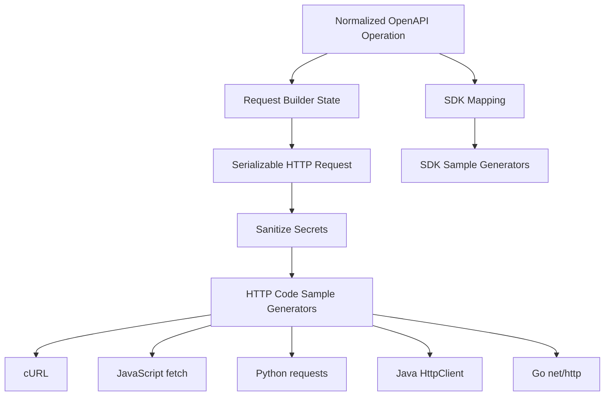
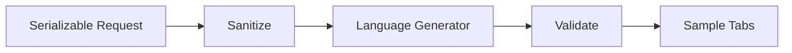

------
title: Build From Scratch: Mintlify-like AI-driven Documentation Generator CLI - Part 026
description: Membangun SDK dan code sample generation untuk documentation generator: request model to cURL/fetch/Java/Python/Go examples, SDK operation mapping, sample quality, auth redaction, schema examples, validation, execution testing, and deterministic output.
series: learn-mintlify-like-ai-docs-cli
seriesTitle: Build From Scratch: Mintlify-like AI-driven Documentation Generator CLI
order: 26
partTitle: SDK and Code Sample Generation
tags:
  - documentation
  - ai
  - cli
  - openapi
  - sdk
  - code-samples
  - developer-tools
date: 2026-07-03
---

# Part 026 — SDK and Code Sample Generation

Pada Part 025, kita membuat `SerializableHttpRequest`. Sekarang model itu dipakai untuk menghasilkan code samples:

- cURL,
- JavaScript `fetch`,
- TypeScript,
- Python `requests`,
- Java `HttpClient`,
- Go `net/http`,
- dan SDK samples jika mapping tersedia.

Code sample adalah bagian docs yang paling sering di-copy. Karena itu, sample yang salah sangat mahal: user copy request yang invalid, token bocor, SDK method tidak ada, atau sample tidak sesuai API terbaru.

Prinsip utama:

> Code sample adalah projection deterministic dari request model, bukan creative writing.

---

## 1. Mental model



HTTP samples berasal dari request. SDK samples berasal dari SDK mapping yang bisa divalidasi.

---

## 2. Code sample model

```ts
export type CodeSampleKind = "http" | "sdk" | "cli";

export type CodeSampleLanguage =
  | "curl"
  | "javascript"
  | "typescript"
  | "python"
  | "java"
  | "go"
  | "csharp"
  | "php"
  | "ruby";

export type GeneratedCodeSample = {
  id: string;
  kind: CodeSampleKind;
  language: CodeSampleLanguage;
  label: string;
  code: string;
  source: CodeSampleSource;
  diagnostics: Diagnostic[];
};

export type CodeSampleSource = {
  operationKey: OperationKey;
  requestHash?: string;
  sdkMappingId?: string;
};
```

Generator interface:

```ts
export type CodeSampleGenerator = {
  language: CodeSampleLanguage;
  kind: CodeSampleKind;
  generate(input: CodeSampleInput): Promise<GeneratedCodeSample>;
};

export type CodeSampleInput = {
  operation: NormalizedOperation;
  request: SerializableHttpRequest;
  registry: OpenApiRegistry;
  config: CodeSampleConfig;
  sdkRegistry?: SdkRegistry;
};
```

---

## 3. Code sample config

```ts
export type CodeSampleConfig = {
  enabled: boolean;
  languages: CodeSampleLanguage[];
  defaultLanguage: CodeSampleLanguage;
  includeSdkSamples: boolean;
  authPlaceholderStyle: "env" | "placeholder" | "redacted";
  maxBodyInlineBytes: number;
  includeErrorHandling: boolean;
  formatting: {
    lineWidth: number;
    indent: number;
  };
};
```

Example:

```json
{
  "codeSamples": {
    "enabled": true,
    "languages": ["curl", "javascript", "python", "java", "go"],
    "defaultLanguage": "curl",
    "includeSdkSamples": true,
    "authPlaceholderStyle": "env",
    "includeErrorHandling": true
  }
}
```

---

## 4. Sanitizing secrets

Never generate docs with user-entered real token.

```ts
export function sanitizeRequestForSample(
  request: SerializableHttpRequest,
  config: CodeSampleConfig
): SerializableHttpRequest {
  return {
    ...request,
    headers: request.headers.map((header) => {
      if (!header.sensitive) return header;

      return {
        ...header,
        value: authPlaceholderForHeader(header, config),
      };
    }),
    cookies: request.cookies.map((cookie) => ({
      ...cookie,
      value: cookie.sensitive ? placeholderForSecret(cookie.name, config) : cookie.value,
    })),
  };
}
```

Placeholder styles:

| Style | Example |
|---|---|
| `env` | `$API_TOKEN`, `process.env.API_TOKEN` |
| `placeholder` | `<YOUR_API_TOKEN>` |
| `redacted` | `[REDACTED]` |

Recommended default for published docs: `env`.

---

## 5. cURL generator

Output:

```bash
curl -X POST "https://api.example.com/users" \
  -H "Authorization: Bearer $API_TOKEN" \
  -H "Content-Type: application/json" \
  -d '{
    "email": "user@example.com"
  }'
```

Implementation shape:

```ts
export function generateCurlSample(input: CodeSampleInput): GeneratedCodeSample {
  const request = sanitizeRequestForSample(input.request, input.config);
  const lines: string[] = [];

  lines.push(`curl -X ${request.method} ${shellQuote(buildFullUrl(request))}`);

  for (const header of sortHeaders(request.headers)) {
    lines.push(`  -H ${shellQuote(`${header.name}: ${header.value}`)}`);
  }

  if (request.body) {
    lines.push(`  -d ${shellQuote(renderBodyForCurl(request.body))}`);
  }

  return {
    id: sampleId(input, "curl"),
    kind: "http",
    language: "curl",
    label: "cURL",
    code: joinShellContinuation(lines),
    source: { operationKey: input.operation.key, requestHash: hashRequest(request) },
    diagnostics: [],
  };
}
```

Shell quoting is not optional. JSON body can contain quotes, spaces, and apostrophes.

```ts
export function shellQuote(value: string): string {
  if (/^[A-Za-z0-9_./:=?&%-]+$/.test(value)) {
    return value;
  }

  return `'${value.replace(/'/g, `'\''`)}'`;
}
```

---

## 6. JavaScript fetch generator

Output:

```ts
const response = await fetch("https://api.example.com/users", {
  method: "POST",
  headers: {
    "Authorization": `Bearer ${process.env.API_TOKEN}`,
    "Content-Type": "application/json"
  },
  body: JSON.stringify({
    email: "user@example.com"
  })
});

if (!response.ok) {
  throw new Error(`Request failed with status ${response.status}`);
}

const data = await response.json();
console.log(data);
```

Generator chooses:

- URL from request model,
- headers from sanitized request,
- `body: JSON.stringify(...)` for JSON,
- optional error handling.

Do not generate browser-specific assumptions unless label says browser.

---

## 7. TypeScript fetch generator

If response type is known, we can include it. If not, avoid fake precision.

Conservative output:

```ts
const response = await fetch("https://api.example.com/users", {
  method: "POST",
  headers: {
    "Authorization": `Bearer ${process.env.API_TOKEN}`,
    "Content-Type": "application/json"
  },
  body: JSON.stringify({
    email: "user@example.com"
  })
});

if (!response.ok) {
  throw new Error(`Request failed with status ${response.status}`);
}

const data: unknown = await response.json();
console.log(data);
```

Only generate:

```ts
const data = (await response.json()) as User;
```

if schema-to-type mapping is reliable.

---

## 8. Python requests generator

Output:

```py
import os
import requests

response = requests.post(
    "https://api.example.com/users",
    headers={
        "Authorization": f"Bearer {os.environ['API_TOKEN']}",
        "Content-Type": "application/json",
    },
    json={
        "email": "user@example.com",
    },
)

response.raise_for_status()
data = response.json()
print(data)
```

Rules:

- use `json=` for JSON body,
- use `data=` for form body,
- use `files=` for multipart,
- use `params=` for query if not embedded in URL,
- import `os` only if env token used.

---

## 9. Java HttpClient generator

Java 17-friendly output:

```java
import java.net.URI;
import java.net.http.HttpClient;
import java.net.http.HttpRequest;
import java.net.http.HttpResponse;

HttpClient client = HttpClient.newHttpClient();

String requestBody = """
{
  "email": "user@example.com"
}
""";

HttpRequest request = HttpRequest.newBuilder()
    .uri(URI.create("https://api.example.com/users"))
    .header("Authorization", "Bearer " + System.getenv("API_TOKEN"))
    .header("Content-Type", "application/json")
    .POST(HttpRequest.BodyPublishers.ofString(requestBody))
    .build();

HttpResponse<String> response = client.send(request, HttpResponse.BodyHandlers.ofString());

if (response.statusCode() >= 400) {
    throw new RuntimeException("Request failed with status " + response.statusCode());
}

System.out.println(response.body());
```

If target Java version < 15, avoid text blocks. Since project context often uses Java 17+, text blocks are acceptable if documented.

---

## 10. Go net/http generator

Output:

```go
package main

import (
	"bytes"
	"fmt"
	"io"
	"net/http"
	"os"
)

func main() {
	body := []byte(`{
  "email": "user@example.com"
}`)

	req, err := http.NewRequest("POST", "https://api.example.com/users", bytes.NewReader(body))
	if err != nil {
		panic(err)
	}

	req.Header.Set("Authorization", "Bearer "+os.Getenv("API_TOKEN"))
	req.Header.Set("Content-Type", "application/json")

	client := &http.Client{}
	resp, err := client.Do(req)
	if err != nil {
		panic(err)
	}
	defer resp.Body.Close()

	respBody, err := io.ReadAll(resp.Body)
	if err != nil {
		panic(err)
	}

	fmt.Println(string(respBody))
}
```

Imports should be generated from features:

```ts
export function requiredGoImports(request: SerializableHttpRequest): string[] {
  const imports = new Set(["fmt", "io", "net/http"]);

  if (request.body) imports.add("bytes");
  if (hasEnvAuth(request)) imports.add("os");

  return [...imports].sort();
}
```

---

## 11. Deterministic request formatting

Request model to code sample must be stable.

Rules:

1. sort headers deterministically,
2. preserve schema property order if available,
3. avoid random IDs,
4. avoid current timestamps,
5. avoid AI-generated variable names,
6. avoid environment-specific paths.

Header sort:

```ts
export function sortHeaders(headers: Header[]): Header[] {
  const rank = (name: string) => {
    const lower = name.toLowerCase();
    if (lower === "authorization") return 0;
    if (lower === "content-type") return 1;
    if (lower === "accept") return 2;
    return 10;
  };

  return [...headers].sort((a, b) =>
    rank(a.name) - rank(b.name) || a.name.localeCompare(b.name)
  );
}
```

---

## 12. Placeholder generation

```ts
export function placeholderForField(name: string, schema: NormalizedSchemaRef): unknown {
  const lower = name.toLowerCase();

  if (lower.includes("email")) return "user@example.com";
  if (lower.endsWith("id") || lower === "id") return "usr_123";
  if (lower.includes("name")) return "Jane Doe";
  if (lower.includes("url")) return "https://example.com";
  if (lower.includes("token") || lower.includes("secret") || lower.includes("key")) {
    return "<REDACTED>";
  }

  return generateSampleFromSchema(schema);
}
```

For request body:

1. explicit example,
2. schema example,
3. default,
4. placeholder.

For auth: always env or placeholder.

---

## 13. SDK sample generation

HTTP samples are universal. SDK samples need mapping.

```ts
export type SdkRegistry = {
  sdks: SdkDefinition[];
  findOperationMapping(
    operation: NormalizedOperation,
    language: CodeSampleLanguage
  ): SdkOperationMapping | undefined;
};

export type SdkDefinition = {
  id: string;
  language: CodeSampleLanguage;
  packageName: string;
  install?: InstallInstruction[];
  clientInitialization: ClientInitializationModel;
  operations: SdkOperationMapping[];
};

export type SdkOperationMapping = {
  operationKey: OperationKey;
  methodPath: string[];
  requestShape: SdkRequestShape;
  responseType?: string;
  source: ProvenanceRef;
};
```

Mapping sources:

| Source | Confidence |
|---|---|
| generated SDK metadata | high |
| manual config | high |
| code index export mapping | medium/high |
| naming convention | medium |
| AI inference | low until validated |

Do not generate SDK sample if method mapping is unknown.

---

## 14. TypeScript SDK sample

Given mapping:

```json
{
  "methodPath": ["users", "create"],
  "requestShape": { "kind": "bodyObject" }
}
```

Output:

```ts
import { AcmeClient } from "@acme/sdk";

const client = new AcmeClient({
  apiKey: process.env.API_TOKEN
});

const user = await client.users.create({
  email: "user@example.com"
});

console.log(user);
```

If mapping cannot be verified, fallback to HTTP sample and emit diagnostic:

```txt
warning codeSample.sdk.noMapping
No TypeScript SDK mapping found for operation createUser.
```

---

## 15. Java SDK sample

Java SDK mapping needs richer metadata:

- client class,
- package imports,
- builder style,
- request class,
- response class,
- method chain.

Output example:

```java
import com.acme.AcmeClient;
import com.acme.models.CreateUserRequest;

AcmeClient client = AcmeClient.builder()
    .apiKey(System.getenv("API_TOKEN"))
    .build();

CreateUserRequest request = CreateUserRequest.builder()
    .email("user@example.com")
    .build();

User user = client.users().create(request);

System.out.println(user);
```

Do not infer this from operationId alone.

---

## 16. Python SDK sample

```py
import os
from acme import AcmeClient

client = AcmeClient(api_key=os.environ["API_TOKEN"])

user = client.users.create(
    email="user@example.com",
)

print(user)
```

Possible request shapes:

```ts
export type SdkRequestShape =
  | { kind: "bodyObject" }
  | { kind: "paramsObject"; pathParamField?: string; queryField?: string; bodyField?: string }
  | { kind: "positional"; args: SdkArgumentMapping[] }
  | { kind: "kwargs" }
  | { kind: "builder"; className: string };
```

Different SDKs vary. Metadata beats guessing.

---

## 17. Vendor extension samples

OpenAPI may include `x-codeSamples`.

Policy:

```json
{
  "codeSamples": {
    "preferVendorSamples": true,
    "validateVendorSamples": true
  }
}
```

Use vendor sample if:

- language supported,
- no secret-like values,
- operation matches,
- sample passes validation if enabled.

Internal source kind:

```ts
export type CodeSampleSourceKind =
  | "generated"
  | "openapiVendorExtension"
  | "manual"
  | "sdkMetadata"
  | "exampleFile";
```

Vendor sample can be more idiomatic, but may be stale. Preserve provenance.

---

## 18. Managed sample regions

If samples are written into physical MDX:

````mdx
{/* docforge:begin generated sample operation=createUser language=curl hash=... */}
```bash
curl ...
```
{/* docforge:end generated sample */}
````

Generator updates only managed regions.

For virtual API pages, samples can be generated at build/render time without writing MDX.

---

## 19. Code sample tabs

MDX output can use tabs:

````mdx
<Tabs>
  <Tab title="cURL">
    ```bash
    curl ...
    ```
  </Tab>

  <Tab title="JavaScript">
    ```js
    const response = await fetch(...)
    ```
  </Tab>
</Tabs>
````

Important:

- all tabs must be searchable,
- Markdown export must include all languages,
- accessibility keyboard behavior matters.

---

## 20. Integration with `ApiOperation`

```ts
export function renderApiOperation(operation: NormalizedOperation, ctx: ApiOperationRenderContext) {
  const initialState = createInitialRequestState(operation, ctx.registry, ctx.playgroundConfig);
  const request = buildRequest(initialState);

  const samples = generateSamplesForOperation({
    operation,
    request,
    registry: ctx.registry,
    config: ctx.codeSampleConfig,
    sdkRegistry: ctx.sdkRegistry,
  });

  return <ApiOperationView operation={operation} samples={samples} />;
}
```

In interactive mode, selected samples can regenerate from changed playground state.

---

## 21. Search and `llms.txt`

Search should index sample content lightly.

Useful tokens:

- SDK method names,
- `curl`,
- package name,
- endpoint method/path,
- language.

Do not let generic tokens like `const`, `import`, `response` dominate.

For `llms.txt`, include a bounded set:

```json
{
  "llms": {
    "codeSampleLanguages": ["curl", "javascript", "python"]
  }
}
```

`llms-full.txt` can include all.

---

## 22. Diagnostics

| Code | Meaning |
|---|---|
| `codeSample.unsupportedLanguage` | no generator |
| `codeSample.body.tooLarge` | body omitted/truncated |
| `codeSample.auth.unsupported` | auth scheme cannot be represented |
| `codeSample.sdk.noMapping` | SDK sample requested but mapping missing |
| `codeSample.sdk.unresolvedMethod` | mapping points to missing SDK symbol |
| `codeSample.multipart.unsupported` | multipart not supported for language |
| `codeSample.secret.redacted` | secret-like value redacted |
| `codeSample.syntax.invalid` | syntax validation failed |

Secret detection should be a hard error by default for published docs.

---

## 23. Validation and testing

Snapshot fixtures:

```txt
fixtures/code-samples/create-user/
  openapi.yaml
  expected.curl.sh
  expected.fetch.js
  expected.python.py
  expected.java
  expected.go
```

Test shape:

```ts
it("generates cURL sample for createUser", async () => {
  const sample = await generateSampleFixture("create-user", "curl");
  expect(sample.code).toMatchFileSnapshot("expected.curl.sh");
});
```

Round-trip test with request builder:

```ts
it("uses same URL as request builder", () => {
  const state = createInitialRequestState(operation, registry, config);
  const request = buildRequest(state);
  const sample = generateCurlSample({ operation, request, registry, config });

  expect(sample.code).toContain(buildFullUrl(request));
});
```

Optional syntax checks:

- JS/TS parse,
- Python `ast.parse`,
- Go `gofmt`,
- Java compile if configured.

---

## 24. Package layout

```txt
packages/code-samples/
  src/
    config.ts
    generator.ts
    registry.ts
    sanitize.ts
    placeholders.ts
    format.ts
    curl.ts
    javascript-fetch.ts
    typescript-fetch.ts
    python-requests.ts
    java-http-client.ts
    go-net-http.ts
    sdk/
      registry.ts
      mapping.ts
      typescript.ts
      python.ts
      java.ts
    validation.ts
    diagnostics.ts
    __tests__/
      curl.test.ts
      javascript.test.ts
      python.test.ts
      java.test.ts
      go.test.ts
      sdk-typescript.test.ts
      secret-redaction.test.ts
```

Generators should be pure: input request → output code.

---

## 25. Minimal implementation milestone

First version:

1. code sample config,
2. request sanitizer,
3. cURL generator,
4. JavaScript fetch generator,
5. Python requests generator,
6. code sample tabs in `ApiOperation`,
7. secret redaction,
8. snapshot tests,
9. `llms.txt` export,
10. diagnostics for unsupported language/body/auth.

Second version:

1. Java HttpClient,
2. Go net/http,
3. TypeScript SDK mapping,
4. Python SDK mapping,
5. Java SDK mapping,
6. `x-codeSamples`,
7. syntax validation,
8. executable sample verification,
9. custom sample plugins,
10. sample coverage report.

---

## 26. Failure modes

| Failure | Cause | Prevention |
|---|---|---|
| Token leaks | raw playground state used | sanitize request for sample |
| SDK method does not exist | guessed mapping | SDK registry + validation |
| cURL broken | bad shell escaping | quote helper + tests |
| Body differs from playground | duplicate build logic | use `SerializableHttpRequest` |
| Diffs unstable | random placeholders/order | deterministic generation |
| Vendor sample stale | trusted blindly | provenance + validation |
| Huge docs | large body inline | max inline body |
| Search noisy | full code high weight | low code weight |
| Java incompatible | wrong Java version | target version config |
| Multipart wrong | unsupported file model | diagnostics/fallback |

---

## 27. Key takeaways

Code sample generation is a compiler layer.



Rules:

1. generate from request model,
2. sanitize secrets,
3. preserve deterministic output,
4. require SDK mapping,
5. snapshot-test samples,
6. validate syntax where possible,
7. expose diagnostics,
8. include useful samples in `llms.txt`,
9. treat vendor samples as provenance-rich but validated,
10. never invent formal API behavior.

Next, we enter the AI layer: **AI Generation Architecture**.
