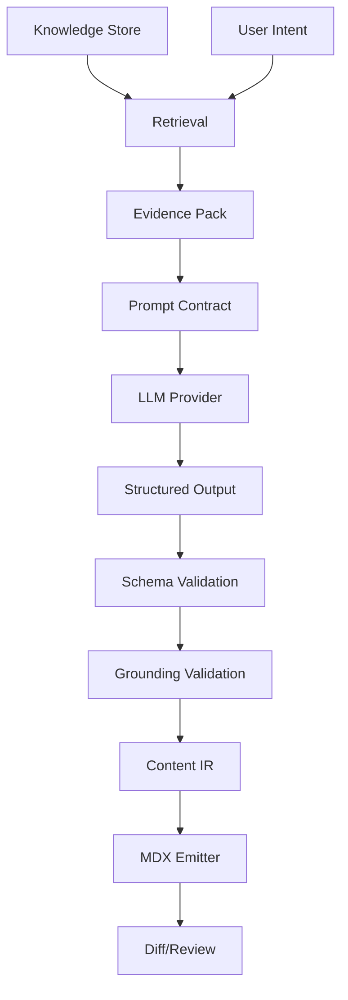
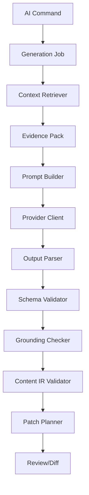
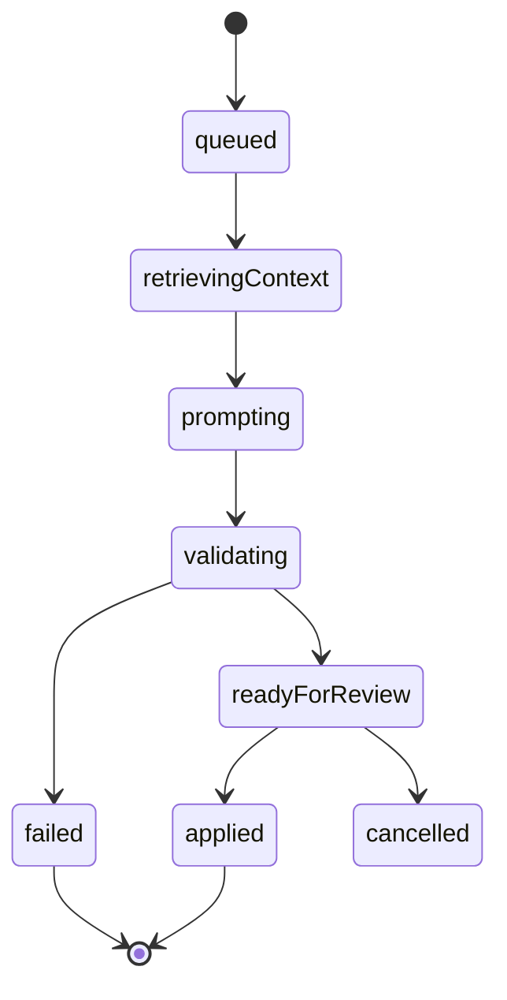
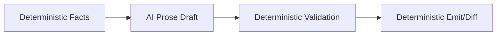
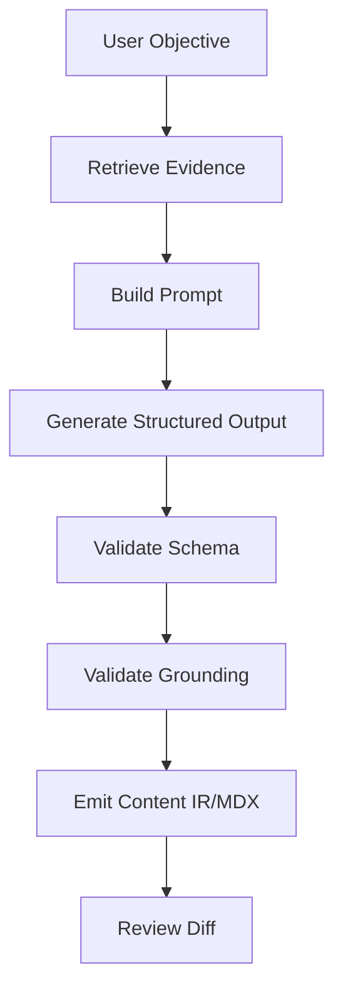

------
title: Build From Scratch: Mintlify-like AI-driven Documentation Generator CLI - Part 027
description: Mendesain AI generation architecture untuk documentation generator: provider abstraction, deterministic boundaries, job orchestration, prompt contracts, structured outputs, evidence packs, safety gates, provenance, cost control, retries, caching, review workflow, and failure modes.
series: learn-mintlify-like-ai-docs-cli
seriesTitle: Build From Scratch: Mintlify-like AI-driven Documentation Generator CLI
order: 27
partTitle: AI Generation Architecture
tags:
  - documentation
  - ai
  - cli
  - llm
  - generation
  - architecture
  - developer-tools
date: 2026-07-03
---

# Part 027 — AI Generation Architecture

Sekarang kita masuk ke bagian yang paling menarik, tetapi juga paling mudah salah: **AI generation architecture**.

Sampai sekarang kita sudah membangun banyak fondasi deterministic:

- scanner,
- classifier,
- Content IR,
- MDX parser/compiler,
- navigation,
- dev server,
- static build,
- search,
- code index,
- OpenAPI ingestion,
- API reference generation,
- playground,
- code samples,
- knowledge store.

Semua itu sengaja dibangun sebelum AI layer.

Kenapa?

Karena AI yang baik dalam production tool bukan "LLM langsung menulis file".

AI harus berada dalam sistem yang:

1. punya evidence,
2. punya schema output,
3. punya validator,
4. punya provenance,
5. punya review workflow,
6. punya retry/cost control,
7. punya deterministic boundary,
8. dan tidak bisa diam-diam merusak source docs.

Kita tidak sedang membuat chatbot. Kita sedang membuat **AI-assisted documentation compiler**.

---

## 1. Mental model: AI adalah transform stage, bukan source of truth

AI bukan source of truth. Source of truth tetap:

- repository files,
- OpenAPI specs,
- config schemas,
- code symbols,
- tests,
- examples,
- committed docs,
- user instructions.

AI adalah transform yang membantu mengubah evidence menjadi:

- outline,
- draft Content IR,
- suggested edits,
- missing-docs diagnosis,
- summary,
- migration explanation,
- examples explanation,
- review comments.



The rule:

> AI output must pass through typed structures and validators before becoming docs.

---

## 2. Anti-pattern: LLM writes MDX directly

Bad architecture:

```txt
Prompt: "Write docs for this repo"
LLM -> docs/quickstart.mdx
```

Problems:

- hallucinated commands,
- invalid MDX,
- unknown components,
- broken links,
- no provenance,
- no review boundary,
- no deterministic diff,
- no schema validation,
- hard to regenerate,
- hard to explain source of claims.

Better:

```txt
Evidence Pack -> AI -> Content IR -> Validator -> MDX emitter -> diff
```

AI can produce structured blocks. Our emitter produces MDX.

---

## 3. AI generation responsibilities

AI layer responsibilities:

| Responsibility | Description |
|---|---|
| Task planning | Decide docs objective and needed sections. |
| Context use | Use retrieved evidence only. |
| Drafting | Produce Content IR or patch proposal. |
| Explanation | Explain why certain docs are needed. |
| Review | Detect unsupported claims, stale sections, weak examples. |
| Summarization | Summarize code/spec/test evidence. |
| Transformation | Rewrite manual prose into clearer form while preserving facts. |

AI layer should not:

- execute code,
- scan filesystem directly,
- bypass ignore rules,
- directly mutate files,
- publish docs,
- invent formal API facts,
- ignore validators,
- store secrets,
- silently call remote providers without config.

---

## 4. AI subsystem architecture



Packages:

```txt
packages/ai/
  src/
    provider.ts
    model.ts
    job.ts
    prompt.ts
    evidence.ts
    output-schema.ts
    structured-output.ts
    generation-runner.ts
    retries.ts
    cache.ts
    cost.ts
    grounding.ts
    safety.ts
    diagnostics.ts

packages/ai-tasks/
  src/
    page-planner.ts
    doc-writer.ts
    doc-reviewer.ts
    fact-checker.ts
    diff-updater.ts
```

Keep generic AI provider code separate from task-specific generation.

---

## 5. Provider abstraction

Provider abstraction should hide API differences but not erase important capabilities.

```ts
export type AiProvider = {
  id: string;
  listModels(): Promise<AiModelInfo[]>;
  generate(input: AiGenerateInput): Promise<AiGenerateResult>;
};

export type AiModelInfo = {
  id: string;
  supportsJsonSchema: boolean;
  supportsToolCalls: boolean;
  supportsStreaming: boolean;
  maxInputTokens?: number;
  maxOutputTokens?: number;
  cost?: {
    inputPerMillion?: number;
    outputPerMillion?: number;
  };
};
```

Generate input:

```ts
export type AiGenerateInput = {
  model: string;
  system: string;
  messages: AiMessage[];
  output?: AiOutputContract;
  temperature: number;
  maxOutputTokens?: number;
  metadata?: Record<string, string>;
  abortSignal?: AbortSignal;
};

export type AiMessage =
  | { role: "user"; content: string }
  | { role: "assistant"; content: string };

export type AiGenerateResult = {
  text: string;
  structured?: unknown;
  usage?: AiUsage;
  providerMetadata?: Record<string, unknown>;
};
```

Do not design around one provider's API shape.

---

## 6. Model selection

Config:

```json
{
  "ai": {
    "enabled": true,
    "provider": "openai-compatible",
    "model": "docs-writer",
    "reviewModel": "docs-reviewer",
    "temperature": 0.2,
    "maxOutputTokens": 6000
  }
}
```

Internal model roles:

```ts
export type AiModelRole =
  | "planner"
  | "writer"
  | "reviewer"
  | "summarizer"
  | "factChecker"
  | "embedding";
```

Role mapping:

```ts
export type AiModelConfig = {
  default: string;
  roles: Partial<Record<AiModelRole, string>>;
};
```

Why roles?

- planner may use cheaper/faster model,
- reviewer may use stricter model,
- writer may need longer output,
- embedding uses embedding model.

---

## 7. AI config safety defaults

Default should be disabled.

```json
{
  "ai": {
    "enabled": false
  }
}
```

When enabled:

- provider key from environment variable,
- never store API key in config file,
- show what will be sent,
- respect ignore/sensitivity,
- allow dry-run,
- require explicit apply.

Config:

```ts
export type AiConfig = {
  enabled: boolean;
  provider: string;
  model: string;
  apiKeyEnv?: string;
  temperature: number;
  maxInputTokens: number;
  maxOutputTokens: number;
  allowSendingSource: boolean;
  allowSendingPrivateDocs: boolean;
  cache: {
    enabled: boolean;
    path: string;
  };
  budget: {
    maxRequestsPerRun?: number;
    maxInputTokensPerRun?: number;
    maxCostUsdPerRun?: number;
  };
};
```

---

## 8. Generation jobs

AI generation should be job-based.

```ts
export type GenerationJob = {
  id: string;
  type: GenerationJobType;
  status: GenerationJobStatus;
  request: GenerationRequest;
  createdAt: string;
  updatedAt: string;
  diagnostics: Diagnostic[];
};

export type GenerationJobType =
  | "planPage"
  | "writePage"
  | "reviewPage"
  | "updatePageFromDiff"
  | "summarizeEvidence"
  | "generateTroubleshooting"
  | "generateGuide";

export type GenerationJobStatus =
  | "queued"
  | "retrievingContext"
  | "prompting"
  | "validating"
  | "readyForReview"
  | "failed"
  | "cancelled"
  | "applied";
```

State machine:



This helps CLI, dev server, PR automation, and debug reports.

---

## 9. Generation request

```ts
export type GenerationRequest = {
  objective: string;
  target?: GenerationTarget;
  constraints: GenerationConstraint[];
  contextPolicy: ContextPolicy;
  outputPolicy: OutputPolicy;
};

export type GenerationTarget =
  | { type: "newPage"; pageKind: PageKind; routeHint?: string }
  | { type: "existingPage"; path: string; updateMode: "replaceManagedRegions" | "suggestPatch" }
  | { type: "apiOperation"; operationKey: OperationKey }
  | { type: "cliCommand"; commandId: string }
  | { type: "configReference"; schemaId: string };

export type GenerationConstraint =
  | { type: "tone"; value: "concise" | "tutorial" | "reference" }
  | { type: "audience"; value: string }
  | { type: "maxSections"; value: number }
  | { type: "allowedComponents"; value: string[] }
  | { type: "mustCiteEvidence"; value: boolean };
```

---

## 10. Context policy

```ts
export type ContextPolicy = {
  maxItems: number;
  maxTokens: number;
  includeSourceCode: boolean;
  includeTests: boolean;
  includeExamples: boolean;
  includeExistingDocs: boolean;
  includeOpenApi: boolean;
  sensitivity: {
    allowInternal: boolean;
    allowSecretLike: false;
  };
};
```

Defaults:

- include formal sources,
- include doc snippets,
- include public code symbols,
- include examples/tests when relevant,
- exclude secret-like artifacts,
- exclude large raw files,
- use provenance.

---

## 11. Output policy

```ts
export type OutputPolicy = {
  format: "contentIr" | "pagePlan" | "patchPlan" | "reviewReport";
  requireStructuredOutput: boolean;
  allowMarkdown: boolean;
  allowedComponents: string[];
  maxBlocks: number;
  requireProvenanceRefs: boolean;
};
```

For page writing:

```ts
{
  format: "contentIr",
  requireStructuredOutput: true,
  allowMarkdown: false,
  allowedComponents: ["Callout", "Steps", "Tabs", "CardGroup"],
  requireProvenanceRefs: true
}
```

AI returns Content IR, not MDX.

---

## 12. Evidence pack

Evidence pack is the core AI input.

```ts
export type EvidencePack = {
  id: string;
  objective: string;
  items: EvidenceItem[];
  constraints: string[];
  missingEvidence: MissingEvidence[];
  tokenEstimate: number;
};

export type EvidenceItem = {
  id: string;
  kind:
    | "docPage"
    | "codeSymbol"
    | "semanticArtifact"
    | "openapiOperation"
    | "configField"
    | "cliCommand"
    | "example"
    | "test"
    | "provenance";
  title: string;
  content: string;
  provenance: ProvenanceRef[];
  confidence: Confidence;
  priority: number;
};

export type MissingEvidence = {
  topic: string;
  reason: string;
  impact: "low" | "medium" | "high";
};
```

Prompt should instruct model to use only evidence items.

---

## 13. Evidence item formatting

Evidence should be compact and labeled.

Example:

```txt
[EVIDENCE cli:docforge-build]
Kind: cliCommand
Confidence: high
Source: src/commands/build.ts:12-48

Command: docforge build
Description: Build the static documentation site.
Options:
- --out <dir>: Override output directory.
- --strict: Treat selected warnings as errors.
- --no-search: Skip search artifact generation.
```

For source symbols:

```txt
[EVIDENCE symbol:buildSite]
Kind: codeSymbol
Confidence: high
Source: src/build/build-site.ts:18-96

Signature:
buildSite(args: BuildArgs): Promise<BuildResult>

Doc comment:
Runs the production build pipeline and writes static output.
```

For OpenAPI:

```txt
[EVIDENCE openapi:public:createUser]
Kind: openapiOperation
Confidence: high
Source: openapi/public.yaml#/paths/~1users/post

POST /users
operationId: createUser
summary: Create user
```

---

## 14. Prompt contract

Prompt should have clear sections:

1. role and task,
2. output schema,
3. hard rules,
4. available components,
5. evidence pack,
6. target page constraints,
7. style constraints,
8. missing evidence handling.

Example skeleton:

```txt
You are a documentation generation engine.

Task:
Generate a Content IR draft for the requested page.

Hard rules:
- Use only facts from EVIDENCE items.
- Do not invent commands, options, endpoints, fields, or behavior.
- If evidence is missing, add a MissingInfo block instead of guessing.
- Every factual block must cite evidence IDs.
- Output must match the provided JSON schema.
- Do not output MDX.
- Use only allowed component block types.

Allowed components:
...

Evidence:
...

Return JSON only.
```

---

## 15. Structured output

Use schema.

```ts
export const AiContentIrOutputSchema = z.object({
  page: z.object({
    title: z.string(),
    description: z.string(),
    kind: z.string(),
    blocks: z.array(ContentBlockSchema),
  }),
  evidenceUsage: z.array(z.object({
    evidenceId: z.string(),
    usedFor: z.string(),
  })),
  missingEvidence: z.array(z.object({
    topic: z.string(),
    reason: z.string(),
  })),
});
```

Validate:

```ts
export function parseAiStructuredOutput<T>(
  raw: unknown,
  schema: z.ZodSchema<T>
): Result<T, Diagnostic[]> {
  const parsed = schema.safeParse(raw);

  if (!parsed.success) {
    return err(zodErrorsToDiagnostics(parsed.error));
  }

  return ok(parsed.data);
}
```

If provider does not support JSON schema natively, parse text as JSON and validate.

---

## 16. Content IR output

AI should produce Content IR.

```ts
export type GeneratedContentIr = {
  title: string;
  description: string;
  kind: PageKind;
  blocks: ContentBlock[];
  provenance: BlockProvenance[];
};

export type BlockProvenance = {
  blockId: string;
  evidenceIds: string[];
};
```

Example block:

```json
{
  "type": "paragraph",
  "text": "The build command compiles the documentation site into static output.",
  "evidenceIds": ["cli:docforge-build"]
}
```

Validator checks evidence IDs exist.

---

## 17. Missing information block

If evidence missing, model should not invent.

```json
{
  "type": "missingInfo",
  "topic": "Exact deployment command",
  "reason": "No deployment adapter or package script evidence was provided."
}
```

Emitter can render as diagnostic or omit from final published docs depending workflow.

In review mode, missing info is useful.

---

## 18. Grounding validation

After AI output, validate facts against evidence.

Basic checks:

1. every block has evidence IDs,
2. evidence IDs exist,
3. formal entity mentions exist in evidence,
4. commands/options/endpoints/config fields are known,
5. no unknown component,
6. no unsupported link,
7. no forbidden sensitivity.

Entity extraction from output:

```ts
export type ExtractedClaimEntity =
  | { type: "cliCommand"; name: string }
  | { type: "cliOption"; name: string }
  | { type: "apiEndpoint"; method: string; path: string }
  | { type: "configField"; path: string }
  | { type: "codeSymbol"; name: string };
```

If output mentions `docforge deploy` but no evidence has that command:

```txt
error ai.grounding.unknownCliCommand
Generated output mentions command "docforge deploy", but no evidence supports it.
```

---

## 19. Formal facts must not be AI-authored

For API reference, CLI reference, config reference:

- AI may write introductions,
- formal tables come from deterministic artifacts.

Example:

```txt
Config field table must be generated from schema, not AI.
```

Rule:

```ts
export type FormalContentPolicy = {
  apiOperations: "deterministicOnly";
  cliCommands: "deterministicOnly";
  configFields: "deterministicOnly";
  codeSamples: "deterministicOnly";
};
```

AI can propose explanatory prose around formal blocks.

---

## 20. Patch planning

AI should not write files directly. It creates patch plan.

```ts
export type PatchPlan = {
  targetPath: string;
  changes: PatchChange[];
  summary: string;
  risk: "low" | "medium" | "high";
};

export type PatchChange =
  | { type: "insertManagedRegion"; afterHeading: string; content: ContentBlock[] }
  | { type: "replaceManagedRegion"; regionId: string; content: ContentBlock[] }
  | { type: "createPage"; page: GeneratedContentIr }
  | { type: "suggestManualEdit"; path: string; message: string };
```

Patch planner then converts IR to MDX and creates diff.

User reviews diff before apply.

---

## 21. Managed regions

AI updates should prefer managed regions.

```mdx
{/* docforge:begin generated id="build-command-summary" source="cli:docforge-build" */}
...
{/* docforge:end generated */}
```

Rules:

1. generator may replace content inside managed region,
2. generator must not edit outside managed region without explicit patch review,
3. human edits inside managed region may be overwritten, so warn,
4. region stores provenance hash.

This protects authored docs.

---

## 22. Generation runner

```ts
export async function runGenerationJob(
  job: GenerationJob,
  ctx: GenerationContext
): Promise<GenerationResult> {
  const evidence = await ctx.retriever.retrieve(job.request);

  const prompt = ctx.promptBuilder.build({
    request: job.request,
    evidence,
    outputPolicy: job.request.outputPolicy,
  });

  const aiResult = await ctx.provider.generate({
    model: ctx.modelSelector.select(job.type),
    system: prompt.system,
    messages: prompt.messages,
    output: prompt.outputContract,
    temperature: ctx.temperatureFor(job.type),
    maxOutputTokens: ctx.maxOutputTokens,
  });

  const parsed = parseAiOutput(aiResult, job.request.outputPolicy);

  const validation = await validateGeneratedOutput(parsed, {
    evidence,
    registry: ctx.componentRegistry,
    knowledgeStore: ctx.store,
  });

  if (!validation.ok) {
    return failedGeneration(job, validation.diagnostics);
  }

  const patch = await createPatchPlan(parsed.value, job.request, ctx);

  return {
    ok: true,
    jobId: job.id,
    evidence,
    output: parsed.value,
    patch,
    diagnostics: validation.diagnostics,
    usage: aiResult.usage,
  };
}
```

---

## 23. Retries

Retries must be targeted.

Retry cases:

| Failure | Retry? |
|---|---|
| transient provider error | yes |
| rate limit | yes with backoff |
| invalid JSON | maybe once with repair prompt |
| schema validation error | maybe once with validator feedback |
| grounding violation | maybe with feedback, limited |
| missing evidence | no, retrieve more or ask/report |
| budget exceeded | no |

Retry policy:

```ts
export type RetryPolicy = {
  maxAttempts: number;
  backoffMs: number;
  retryOn: RetryReason[];
};
```

Do not infinite-loop AI repair.

---

## 24. Repair prompts

If structured output invalid:

```txt
Your previous output did not match the required JSON schema.

Validation errors:
- page.blocks[3].type must be one of paragraph, heading, callout
- evidenceUsage[2].evidenceId references unknown evidence item

Return corrected JSON only.
```

Include original output? Maybe if not too large. Be careful with token cost.

Max repair attempts: 1 or 2.

---

## 25. AI cache

Cache provider responses for deterministic requests.

Cache key:

```ts
export type AiCacheKey = {
  provider: string;
  model: string;
  promptHash: string;
  outputSchemaHash: string;
  temperature: number;
};
```

If temperature > 0, cache still useful but output may be stochastic. For repeatable docs generation, use low temperature.

Cache path:

```txt
.docforge/cache/ai/
```

Cache entry:

```json
{
  "key": "...",
  "createdAt": "...",
  "usage": { "inputTokens": 1234, "outputTokens": 567 },
  "response": { ... }
}
```

Do not cache prompts containing sensitive evidence unless config allows. Or store encrypted? For local CLI, simplest: allow opt-in.

---

## 26. Cost and token budget

Generation runner should estimate tokens and enforce budget.

```ts
export type AiBudgetState = {
  requests: number;
  inputTokens: number;
  outputTokens: number;
  estimatedCostUsd: number;
};

export function checkBudget(state: AiBudgetState, config: AiConfig): Diagnostic[] {
  const diagnostics: Diagnostic[] = [];

  if (config.budget.maxRequestsPerRun && state.requests >= config.budget.maxRequestsPerRun) {
    diagnostics.push({
      code: "ai.budget.maxRequestsExceeded",
      severity: "error",
      category: "ai",
      message: "AI request budget exceeded for this run.",
    });
  }

  return diagnostics;
}
```

CLI should show:

```txt
AI usage:
  requests: 3
  input tokens: 18,420
  output tokens: 4,208
  estimated cost: $0.12
```

If provider does not return usage, mark unknown.

---

## 27. Streaming

Streaming is useful for UX, but structured validation still happens after full output.

Streaming events:

```ts
export type AiGenerationEvent =
  | { type: "started"; jobId: string }
  | { type: "retrievedEvidence"; items: number }
  | { type: "token"; text: string }
  | { type: "validationStarted" }
  | { type: "diagnostic"; diagnostic: Diagnostic }
  | { type: "completed"; result: GenerationResult };
```

CLI can show progress. Dev server can show job status.

Do not apply partial streamed content.

---

## 28. Safety and privacy gates

Before sending evidence to provider:

```ts
export function validateEvidenceForAi(
  evidence: EvidencePack,
  config: AiConfig
): Diagnostic[] {
  const diagnostics: Diagnostic[] = [];

  for (const item of evidence.items) {
    if (item.kind === "codeSymbol" && !config.allowSendingSource) {
      diagnostics.push({
        code: "ai.privacy.sourceNotAllowed",
        severity: "error",
        category: "ai",
        message: "AI evidence includes source code, but sending source is disabled.",
      });
    }

    if (containsSecretLikePattern(item.content)) {
      diagnostics.push({
        code: "ai.privacy.secretLikeEvidence",
        severity: "error",
        category: "ai",
        message: "AI evidence appears to contain secret-like content.",
      });
    }
  }

  return diagnostics;
}
```

No provider call if privacy diagnostics contain errors.

---

## 29. Redaction

If evidence has safe content with secret-like snippets, redact or exclude.

```ts
export function redactEvidenceItem(item: EvidenceItem): EvidenceItem {
  return {
    ...item,
    content: redactSecrets(item.content),
  };
}
```

But if redaction removes important information, mark missing evidence.

---

## 30. Review workflow

AI generation result should be reviewable.

CLI:

```bash
docforge generate guide --topic "build pipeline" --dry-run
```

Output:

```txt
Generated draft ready for review.

Target:
  docs/guides/build-pipeline.mdx

Evidence:
  8 items

Diagnostics:
  0 errors, 2 warnings

Diff:
  + ...
```

Apply:

```bash
docforge generate guide --topic "build pipeline" --apply
```

But recommended flow:

1. dry-run,
2. inspect diff,
3. apply.

For CI/PR automation, create PR.

---

## 31. Human-in-the-loop levels

| Mode | Behavior |
|---|---|
| `suggest` | produce patch but do not write |
| `applyManagedOnly` | update managed regions only |
| `applyWithReview` | write patch after explicit approval |
| `autoApply` | dangerous, only for trusted workflow |
| `prOnly` | open PR/draft PR |

Default local CLI: `suggest`.

---

## 32. Generation commands

Potential commands:

```bash
docforge generate page --kind guide --topic "build pipeline"
docforge generate api-guides
docforge generate config-reference
docforge generate cli-reference
docforge update docs --from-diff
docforge review docs
```

Command options:

```bash
--dry-run
--apply
--target docs/guides/build.mdx
--format json
--max-context 12000
--model ...
--no-ai-cache
```

`generate config-reference` may not need AI for formal table. It can use AI only for explanation.

---

## 33. AI generation report

```ts
export type AiGenerationReport = {
  jobId: string;
  objective: string;
  model: string;
  evidenceItems: number;
  diagnostics: Diagnostic[];
  usage?: AiUsage;
  outputFiles: Array<{
    path: string;
    action: "create" | "update" | "suggest";
  }>;
  provenance: Array<{
    outputBlockId: string;
    evidenceIds: string[];
  }>;
};
```

Write report to:

```txt
.docforge/reports/generation/<job-id>.json
```

Do not deploy by default.

---

## 34. Observability

Log:

- job type,
- model,
- evidence count,
- prompt token estimate,
- response time,
- validation errors,
- retry count,
- cache hit/miss,
- cost estimate.

Do not log raw evidence/prompt unless debug/tracing explicitly enabled.

---

## 35. AI trace mode

For debugging, user may enable traces.

```json
{
  "ai": {
    "tracing": {
      "enabled": true,
      "includePrompts": false,
      "includeResponses": false
    }
  }
}
```

Prompt traces can contain source code/private data. Default false.

Trace files:

```txt
.docforge/traces/ai/<job-id>/
  evidence.json
  prompt.redacted.txt
  response.redacted.json
  validation.json
```

---

## 36. Task-specific agents vs simple functions

Do not overcomplicate with "agents" too early.

Most tasks are pipeline functions:

- retrieve context,
- prompt once,
- validate,
- maybe repair once.

Agentic loops are useful for complex multi-step update workflows, but risky.

Recommended initial tasks:

| Task | Calls |
|---|---:|
| page plan | 1 |
| page draft | 1 |
| review | 1 |
| repair | 0-1 |
| diff update | 1-2 |

Avoid autonomous multi-file editing until validation is mature.

---

## 37. Deterministic and probabilistic boundary

Deterministic:

- scanning,
- parsing,
- OpenAPI facts,
- config field tables,
- CLI options,
- code samples,
- MDX emitting,
- validation,
- diffing.

Probabilistic:

- prose explanation,
- page outline suggestions,
- missing docs prioritization,
- wording improvements,
- summary synthesis.

The architecture should keep them separated.



---

## 38. Testing AI architecture without real provider

Use fake provider.

```ts
export class FakeAiProvider implements AiProvider {
  constructor(private readonly responses: unknown[]) {}

  async generate(input: AiGenerateInput): Promise<AiGenerateResult> {
    const response = this.responses.shift();

    return {
      text: typeof response === "string" ? response : JSON.stringify(response),
      structured: typeof response === "object" ? response : undefined,
      usage: { inputTokens: 100, outputTokens: 50 },
    };
  }
}
```

Test:

- prompt builder includes evidence,
- output schema validation,
- grounding errors,
- repair loop,
- budget enforcement,
- privacy gate,
- patch plan.

Do not rely on live model tests for unit suite.

---

## 39. Golden prompt tests

Prompt templates are code.

Snapshot them with stable fixtures.

```ts
it("builds page writer prompt", () => {
  const prompt = buildDocWriterPrompt(fixtureRequest, fixtureEvidence);

  expect(prompt.system).toMatchSnapshot();
  expect(prompt.messages[0].content).toMatchSnapshot();
});
```

Avoid snapshots that include unstable timestamps.

---

## 40. Evaluation tests

AI output quality needs eval, but keep separate from unit tests.

Eval cases:

```ts
export type AiGenerationEvalCase = {
  id: string;
  objective: string;
  evidenceFixture: string;
  expectedEntities: string[];
  forbiddenEntities: string[];
  requiredSections: string[];
};
```

Metrics:

- schema validity,
- grounding violations,
- required entities included,
- forbidden hallucinations absent,
- MDX compiles,
- search document exists,
- human rating optional.

---

## 41. Failure modes

| Failure | Cause | Prevention |
|---|---|---|
| Hallucinated command | no grounding validation | entity checks against knowledge store |
| Invalid MDX | AI writes MDX directly | AI outputs Content IR, emitter writes MDX |
| Secrets sent to AI | no privacy gate | sensitivity/redaction before provider call |
| Huge cost | no budget | token/cost budget enforcement |
| Infinite retry | repair loop unbounded | max attempts |
| Formal API facts wrong | AI generates API tables | deterministic OpenAPI generation |
| User docs overwritten | direct file writes | patch plan and managed regions |
| Hard to debug output | no traces/reports | generation report and optional redacted traces |
| Vendor lock-in | provider-specific code | provider abstraction |
| Prompt drift | templates untested | golden prompt tests |
| Low-quality context | retrieval unbounded/noisy | evidence pack and context policy |

---

## 42. Minimal implementation milestone

First version:

1. AI config disabled by default,
2. provider abstraction,
3. fake provider for tests,
4. generation job model,
5. evidence pack format,
6. prompt builder for page planning,
7. structured output schema,
8. Content IR validation,
9. grounding check for CLI/API/config entities,
10. patch plan dry-run,
11. budget counters,
12. privacy gate.

Second version:

1. doc writer agent,
2. doc reviewer agent,
3. repair loop,
4. AI cache,
5. cost estimation,
6. streaming events,
7. managed region updates,
8. trace/report files,
9. PR automation integration,
10. eval suite.

---

## 43. Key takeaways

AI generation architecture is not "call model and write file".

It is a controlled pipeline:



Strong rules:

1. AI is not source of truth.
2. Evidence pack is mandatory.
3. Structured output is mandatory.
4. Validation happens after every generation.
5. Formal docs are deterministic.
6. Privacy gates run before provider calls.
7. Cost budget is explicit.
8. File writes go through patch/review.
9. Provider abstraction prevents lock-in.
10. Tests use fake providers and golden prompts.

Next, we go deeper into the most important part of AI quality: **context retrieval for documentation**.
