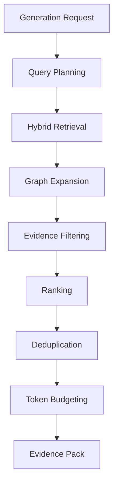
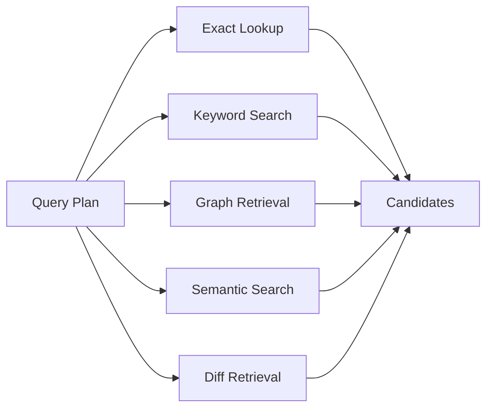
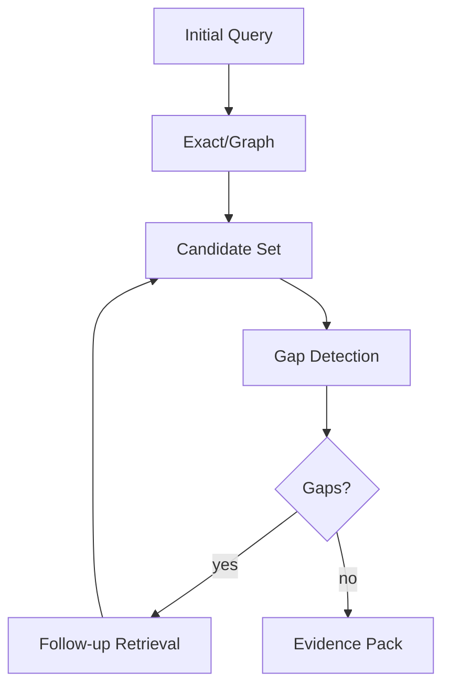
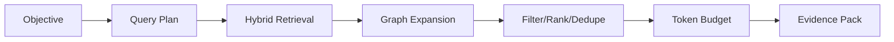

------
title: Build From Scratch: Mintlify-like AI-driven Documentation Generator CLI - Part 028
description: Mendesain context retrieval untuk AI-driven documentation: retrieval objectives, hybrid search, graph expansion, evidence packs, token budgeting, ranking, deduplication, provenance, sensitivity filtering, query planning, and evaluation.
series: learn-mintlify-like-ai-docs-cli
seriesTitle: Build From Scratch: Mintlify-like AI-driven Documentation Generator CLI
order: 28
partTitle: Context Retrieval for Documentation
tags:
  - documentation
  - ai
  - cli
  - retrieval
  - rag
  - codebase-indexing
  - developer-tools
date: 2026-07-03
---

# Part 028 — Context Retrieval for Documentation

AI documentation quality is usually limited less by the model and more by the **context**.

Jika context buruk, output buruk:

- file irrelevant,
- source terlalu banyak,
- fakta formal hilang,
- tests tidak masuk,
- examples tidak masuk,
- OpenAPI tidak masuk,
- config schema tidak masuk,
- public/private boundary kabur,
- evidence tidak punya provenance.

Model terbaik pun akan menebak jika evidence-nya tidak ada.

Part ini membahas **context retrieval**: bagaimana memilih evidence yang tepat dari knowledge store, code graph, search index, OpenAPI registry, docs, examples, tests, dan user objective.

---

## 1. Mental model: retrieval adalah evidence selection, bukan sekadar search

Search menjawab:

> "Dokumen apa yang mengandung kata ini?"

Retrieval untuk AI docs menjawab:

> "Evidence apa yang cukup, relevan, aman, dan terurut untuk menulis atau memperbarui dokumentasi ini?"



Evidence pack adalah hasil akhir retrieval.

---

## 2. Retrieval goals

Context retriever harus:

1. memahami objective,
2. menemukan formal facts,
3. menemukan existing docs,
4. menemukan code symbols,
5. menemukan examples/tests,
6. menemukan related config/API/CLI artifacts,
7. menjaga provenance,
8. menyingkirkan sensitive/secret context,
9. menghindari noise,
10. mematuhi token budget,
11. melaporkan missing evidence,
12. membuat evidence pack yang bisa dipakai prompt.

---

## 3. Retrieval sources

```ts
export type RetrievalSource =
  | "knowledgeStore"
  | "searchIndex"
  | "codeGraph"
  | "openApiRegistry"
  | "existingDocs"
  | "examples"
  | "tests"
  | "gitDiff"
  | "userProvided";
```

Source strengths:

| Source | Strength |
|---|---|
| OpenAPI registry | Formal API facts |
| Config schema | Formal config facts |
| CLI semantic artifacts | Formal command facts |
| Code symbols | Implementation evidence |
| Tests | Behavior evidence |
| Examples | Usage evidence |
| Existing docs | Human explanation/current wording |
| Search index | Textual discovery |
| Graph | Relationship expansion |
| Git diff | Recent change focus |
| User input | Intent/constraints |

---

## 4. Retrieval request

```ts
export type RetrievalRequest = {
  objective: string;
  target?: GenerationTarget;
  queryHints: string[];
  contextPolicy: ContextPolicy;
  outputPolicy: OutputPolicy;
  changedFiles?: string[];
};

export type RetrievalResult = {
  evidencePack: EvidencePack;
  diagnostics: Diagnostic[];
  stats: RetrievalStats;
};

export type RetrievalStats = {
  candidatesFound: number;
  candidatesAfterFiltering: number;
  itemsSelected: number;
  estimatedTokens: number;
  sourcesUsed: Record<RetrievalSource, number>;
};
```

The retriever is deterministic given the same store and request.

---

## 5. Query planning

Before retrieval, derive query plan.

```ts
export type RetrievalQueryPlan = {
  intents: RetrievalIntent[];
  exactLookups: ExactLookup[];
  keywordQueries: string[];
  graphSeeds: GraphNodeRef[];
  requiredSources: RetrievalSource[];
  optionalSources: RetrievalSource[];
};

export type RetrievalIntent =
  | "writeGuide"
  | "writeReference"
  | "updateFromDiff"
  | "reviewDocs"
  | "explainConcept"
  | "generateTroubleshooting"
  | "documentApiOperation"
  | "documentCliCommand"
  | "documentConfig";
```

Example objective:

```txt
Generate a guide for docforge build pipeline
```

Plan:

```json
{
  "intents": ["writeGuide"],
  "keywordQueries": ["build pipeline", "docforge build", "static site build"],
  "exactLookups": [
    { "type": "cliCommand", "name": "docforge build" }
  ],
  "graphSeeds": [
    { "type": "semanticArtifact", "id": "cli:docforge-build" }
  ],
  "requiredSources": ["knowledgeStore", "codeGraph", "existingDocs"]
}
```

---

## 6. Target-aware retrieval

If target is explicit, retrieval is easier.

### API operation target

```ts
{ type: "apiOperation", operationKey: "public:POST /users" }
```

Required evidence:

- normalized OpenAPI operation,
- schemas used by operation,
- examples,
- code route handler if known,
- tests,
- existing docs page if any.

### CLI command target

Required evidence:

- command artifact,
- options/arguments,
- handler symbol,
- tests,
- examples,
- existing CLI docs.

### Config reference target

Required evidence:

- config schema fields,
- defaults,
- validation rules,
- examples,
- existing config docs.

---

## 7. Hybrid retrieval

Use multiple retrieval methods.



Candidate type:

```ts
export type RetrievalCandidate = {
  id: string;
  source: RetrievalSource;
  kind: EvidenceItem["kind"];
  title: string;
  content: string;
  provenance: ProvenanceRef[];
  score: number;
  confidence: Confidence;
  sensitivity: SensitivityLevel;
  metadata: Record<string, unknown>;
};
```

---

## 8. Exact lookup

Exact lookup is highest precision.

Examples:

- operation key,
- operationId,
- CLI command name,
- config field path,
- symbol qualified name,
- page route.

```ts
export async function exactLookup(
  plan: RetrievalQueryPlan,
  store: KnowledgeStore
): Promise<RetrievalCandidate[]> {
  const candidates: RetrievalCandidate[] = [];

  for (const lookup of plan.exactLookups) {
    if (lookup.type === "cliCommand") {
      candidates.push(...await lookupCliCommand(store, lookup.name));
    }

    if (lookup.type === "apiOperation") {
      candidates.push(...await lookupApiOperation(store, lookup.operationKey));
    }

    if (lookup.type === "configField") {
      candidates.push(...await lookupConfigField(store, lookup.path));
    }
  }

  return candidates;
}
```

Exact matches get high base score.

---

## 9. Keyword retrieval

Keyword retrieval uses search index / store FTS.

Queries:

- objective terms,
- derived aliases,
- target names,
- operationId,
- symbol names,
- route path,
- command flags.

If using SQLite FTS later:

```sql
CREATE VIRTUAL TABLE retrieval_fts
USING fts5(
  title,
  content,
  kind,
  path,
  content='retrieval_documents',
  content_rowid='rowid'
);
```

But first version can query search chunks and symbols by simple matching.

---

## 10. Semantic retrieval

Embeddings can help for prose concepts.

Use for:

- concept docs,
- guides,
- troubleshooting,
- comments,
- examples.

Not enough for exact technical facts.

Semantic retrieval should not replace:

- exact lookup,
- OpenAPI operation lookup,
- config field lookup,
- CLI command lookup.

Hybrid score:

```ts
finalScore =
  exactScore * 2.0 +
  keywordScore * 1.0 +
  semanticScore * 0.8 +
  graphScore * 1.2 +
  freshnessBoost +
  publicSurfaceBoost -
  sensitivityPenalty
```

---

## 11. Graph expansion

Start from seed nodes and expand relevant relations.

Example seed:

```txt
cli:docforge-build
```

Expand:

```txt
cli command -> handler symbol
handler symbol -> calls buildSite
handler symbol -> references BuildConfig
cli command -> documented by docs/reference/cli-build
handler symbol -> tested by build-command.test.ts
```

Graph expansion config:

```ts
export type RetrievalGraphExpansionConfig = {
  maxDepth: number;
  maxNodes: number;
  relationWeights: Partial<Record<RelationKind, number>>;
};
```

Default relation weights:

| Relation | Weight |
|---|---:|
| documents | 1.0 |
| definesCliCommand | 1.0 |
| handlesRoute | 1.0 |
| definesConfigField | 1.0 |
| tests | 0.8 |
| exampleOf | 0.8 |
| calls | 0.4 |
| references | 0.5 |
| imports | 0.2 |

Do not expand import graph too far.

---

## 12. Graph expansion algorithm

```ts
export async function retrieveFromGraph(
  seeds: GraphNodeRef[],
  store: KnowledgeStore,
  config: RetrievalGraphExpansionConfig
): Promise<RetrievalCandidate[]> {
  const candidates: RetrievalCandidate[] = [];
  const visited = new Set<string>();
  const queue = seeds.map((seed) => ({
    ref: seed,
    depth: 0,
    score: 1.0,
  }));

  while (queue.length > 0 && visited.size < config.maxNodes) {
    const item = queue.shift()!;
    const key = graphRefKey(item.ref);

    if (visited.has(key) || item.depth > config.maxDepth) {
      continue;
    }

    visited.add(key);

    const candidate = await graphNodeToCandidate(store, item.ref, item.score);
    if (candidate) candidates.push(candidate);

    const edges = await store.graph.outgoing(item.ref);

    for (const edge of edges) {
      const weight = config.relationWeights[edge.kind] ?? 0;
      if (weight <= 0) continue;

      queue.push({
        ref: edge.to,
        depth: item.depth + 1,
        score: item.score * weight * confidenceWeight(edge.confidence),
      });
    }
  }

  return candidates;
}
```

Also consider incoming edges for docs mappings:

```txt
docPage --documents--> target
```

To find docs for target, need incoming `documents`.

So graph expansion should support direction per relation.

---

## 13. Direction-aware expansion

```ts
export type RelationExpansionRule = {
  kind: RelationKind;
  direction: "outgoing" | "incoming" | "both";
  weight: number;
};
```

Rules:

```ts
const DEFAULT_EXPANSION_RULES: RelationExpansionRule[] = [
  { kind: "documents", direction: "incoming", weight: 1.0 },
  { kind: "definesCliCommand", direction: "incoming", weight: 1.0 },
  { kind: "handlesRoute", direction: "incoming", weight: 1.0 },
  { kind: "definesConfigField", direction: "incoming", weight: 1.0 },
  { kind: "tests", direction: "incoming", weight: 0.8 },
  { kind: "exampleOf", direction: "incoming", weight: 0.8 },
  { kind: "calls", direction: "outgoing", weight: 0.4 },
  { kind: "references", direction: "outgoing", weight: 0.5 },
];
```

---

## 14. Diff-aware retrieval

For updating docs from code changes:

Input:

```ts
changedFiles: ["src/commands/build.ts"]
```

Retrieve:

1. changed artifacts,
2. changed symbols,
3. semantic artifacts from changed files,
4. docs pages documenting them,
5. tests/examples related,
6. old docs content.

```ts
export async function retrieveForDiffUpdate(
  changedFiles: string[],
  store: KnowledgeStore
): Promise<RetrievalCandidate[]> {
  const candidates: RetrievalCandidate[] = [];

  for (const path of changedFiles) {
    const artifact = await store.artifacts.getByPath(path);
    if (!artifact) continue;

    candidates.push(artifactToCandidate(artifact));

    const symbols = await store.symbols.listByArtifact(artifact.id);
    candidates.push(...symbols.map(symbolToCandidate));

    const impact = await impactForChangedPath(store, path);
    for (const page of impact.affectedPages) {
      candidates.push(await docPageToCandidate(store, page.pageId));
    }
  }

  return candidates;
}
```

---

## 15. Existing docs retrieval

When updating or writing adjacent content, include existing docs.

Sources:

- target page,
- linked pages,
- same nav group,
- pages documenting same artifacts,
- search results,
- pages with same tags.

Evidence item:

```txt
[EVIDENCE docs:reference-cli-build]
Kind: docPage
Source: docs/reference/cli-build.mdx
Route: /reference/cli-build

Existing docs content:
...
```

Use existing docs to preserve style and avoid duplication. But remember existing docs can be stale.

Mark confidence based on mapping freshness.

---

## 16. Tests as evidence

Tests often reveal behavior not in docs.

Example:

```ts
it("fails build when internal links are broken", async () => ...)
```

Evidence item:

```txt
[EVIDENCE test:build-fails-on-broken-links]
Kind: test
Source: tests/build.test.ts:34-58
Confidence: medium

Behavior:
Build fails when internal links are broken.
```

Use tests to support troubleshooting or behavior explanation.

But tests can be internal/noisy. Rank lower than formal artifacts for reference docs.

---

## 17. Examples as evidence

Examples are high-value for guides.

Example evidence:

```txt
[EVIDENCE example:basic-config]
Kind: example
Source: examples/basic/docforge.config.json
Confidence: high

Example config:
{
  "site": { "title": "Acme Docs" },
  "docs": { "root": "docs" }
}
```

Examples help AI write practical steps.

Prioritize examples that:

- use public APIs,
- are short,
- are in `examples/`,
- are referenced by docs/tests,
- compile/execute if verified.

---

## 18. Formal artifact priority

For reference pages, formal artifacts outrank prose.

Priority order:

### API reference

1. OpenAPI operation/schema,
2. code route consistency,
3. tests/examples,
4. existing docs.

### CLI reference

1. CLI semantic artifact,
2. handler symbol/signature,
3. tests/examples,
4. existing docs.

### Config reference

1. schema fields,
2. default values,
3. validation code,
4. examples,
5. existing docs.

### Guide

1. formal artifacts relevant to task,
2. examples,
3. tests,
4. existing docs,
5. implementation details if needed.

---

## 19. Sensitivity filtering

Every candidate has sensitivity.

```ts
export type SensitivityLevel =
  | "public"
  | "internal"
  | "secretLike"
  | "excluded";
```

Filter:

```ts
export function filterBySensitivity(
  candidates: RetrievalCandidate[],
  policy: ContextPolicy
): RetrievalCandidate[] {
  return candidates.filter((candidate) => {
    if (candidate.sensitivity === "excluded") return false;
    if (candidate.sensitivity === "secretLike") return false;
    if (candidate.sensitivity === "internal" && !policy.sensitivity.allowInternal) return false;
    return true;
  });
}
```

If relevant evidence filtered, report missing evidence.

---

## 20. Token budgeting

Evidence pack must fit model context.

We need estimate tokens.

```ts
export type TokenBudget = {
  maxTokens: number;
  reservedForInstructions: number;
  reservedForOutput: number;
  availableForEvidence: number;
};
```

Selection:

```ts
export function selectWithinTokenBudget(
  candidates: RetrievalCandidate[],
  budget: TokenBudget
): EvidenceItem[] {
  const selected: EvidenceItem[] = [];
  let used = 0;

  for (const candidate of candidates.sort(compareCandidateRank)) {
    const item = candidateToEvidenceItem(candidate);
    const tokens = estimateTokens(item.content);

    if (used + tokens > budget.availableForEvidence) {
      const compressed = compressEvidenceItem(item, budget.availableForEvidence - used);

      if (compressed) {
        selected.push(compressed);
        used += estimateTokens(compressed.content);
      }

      continue;
    }

    selected.push(item);
    used += tokens;
  }

  return selected;
}
```

---

## 21. Evidence compression

Compression should preserve facts and provenance.

Strategies:

| Evidence type | Compression |
|---|---|
| OpenAPI operation | keep method/path/params/schemas summaries |
| Schema | keep required fields/types, omit deep nested details |
| Code symbol | keep signature/doc comment, omit body |
| Test | keep name/assertion summary, omit setup |
| Example | keep relevant snippet, omit boilerplate |
| Existing docs | keep headings and relevant sections |
| Long code file | never include whole file; include symbol ranges |

Do not use AI to compress evidence for first version. Use deterministic summarizers.

---

## 22. Code evidence extraction

When including code, prefer slices.

```ts
export type CodeEvidenceSlice = {
  symbolId: SymbolId;
  signature: string;
  docComment?: string;
  sourceExcerpt?: string;
  dependencies?: string[];
};
```

Avoid full function body unless necessary.

For explaining implementation, include body with line limit.

```ts
export function codeSymbolToEvidence(
  symbol: CodeSymbol,
  source: string,
  policy: ContextPolicy
): EvidenceItem {
  const content = [
    `Qualified name: ${symbol.qualifiedName}`,
    `Signature: ${symbol.signature ?? symbol.displayName}`,
    symbol.docComment ? `Doc comment:\n${symbol.docComment}` : undefined,
    policy.includeSourceCode ? excerptSymbolSource(symbol, source) : undefined,
  ].filter(Boolean).join("\n\n");

  return {
    id: `symbol:${symbol.id}`,
    kind: "codeSymbol",
    title: symbol.displayName,
    content,
    provenance: [provenanceFromSymbol(symbol)],
    confidence: "high",
    priority: 0.8,
  };
}
```

---

## 23. Deduplication

Same fact can appear from multiple sources.

Example:

- OpenAPI operation says `POST /users`,
- generated API page also says `POST /users`,
- search chunk finds same API page.

Deduplicate by canonical target.

```ts
export function dedupeCandidates(candidates: RetrievalCandidate[]): RetrievalCandidate[] {
  const byCanonical = new Map<string, RetrievalCandidate>();

  for (const candidate of candidates) {
    const key = canonicalCandidateKey(candidate);
    const existing = byCanonical.get(key);

    if (!existing || candidate.score > existing.score) {
      byCanonical.set(key, mergeCandidate(existing, candidate));
    }
  }

  return [...byCanonical.values()];
}
```

Canonical keys:

- `openapi:<specId>:<operationKey>`,
- `cli:<commandName>`,
- `config:<fieldPath>`,
- `symbol:<symbolId>`,
- `doc:<pageId>`.

---

## 24. Ranking features

Candidate ranking should consider:

```ts
export type RankingFeatures = {
  exactMatch: number;
  keywordScore: number;
  semanticScore: number;
  graphScore: number;
  confidence: number;
  publicSurface: number;
  freshness: number;
  sourceAuthority: number;
  targetRelevance: number;
  sensitivityPenalty: number;
};
```

Source authority:

| Source | Authority |
|---|---:|
| OpenAPI formal operation | 1.0 |
| Config schema | 1.0 |
| CLI semantic artifact | 1.0 |
| Code symbol public surface | 0.8 |
| Test | 0.7 |
| Example | 0.7 |
| Existing docs fresh | 0.6 |
| Existing docs stale | 0.2 |
| Low-confidence inference | 0.2 |

Score:

```ts
export function rankCandidate(candidate: RetrievalCandidate): number {
  const f = candidate.features;

  return (
    f.exactMatch * 3.0 +
    f.sourceAuthority * 2.0 +
    f.graphScore * 1.5 +
    f.keywordScore * 1.0 +
    f.semanticScore * 0.8 +
    f.confidence * 1.2 +
    f.publicSurface * 0.8 +
    f.freshness * 0.5 -
    f.sensitivityPenalty * 5.0
  );
}
```

Tune with eval cases.

---

## 25. Freshness

Existing docs can be stale.

Freshness sources:

- doc mapping source hash matches current,
- generated region hash matches current evidence,
- page last built after source change,
- no stale diagnostics.

```ts
export function freshnessScore(candidate: RetrievalCandidate): number {
  if (candidate.metadata.stale === true) return 0.1;
  if (candidate.metadata.sourceHashMatches === true) return 1.0;
  return 0.5;
}
```

Stale docs can still be useful as wording/style reference, but lower authority.

---

## 26. Missing evidence detection

If required evidence absent, report.

Examples:

```ts
export type MissingEvidence = {
  topic: string;
  reason: string;
  impact: "low" | "medium" | "high";
};
```

For API operation page:

- missing OpenAPI operation = high,
- missing request schema = medium/high,
- missing examples = medium,
- missing code handler = low/medium depending policy.

For guide:

- missing examples = medium,
- missing tests = low,
- missing existing docs = low.

Prompt should include missing evidence so AI can avoid guessing.

---

## 27. Evidence pack structure

Final pack:

```ts
export type EvidencePack = {
  id: string;
  objective: string;
  items: EvidenceItem[];
  missingEvidence: MissingEvidence[];
  constraints: string[];
  stats: {
    tokenEstimate: number;
    sourceCounts: Record<string, number>;
  };
};
```

Text rendering:

```txt
# Evidence Pack

Objective:
Generate a guide for the static build pipeline.

Rules:
- Use only evidence below.
- Cite evidence IDs for factual claims.
- If evidence is missing, say so.

Missing evidence:
- Deployment hosting adapter details are not available.

Evidence:
...
```

---

## 28. Evidence IDs

Evidence IDs must be stable and short.

Examples:

```txt
cli:docforge-build
symbol:buildSite
openapi:public:createUser
config:build.outputDir
doc:static-build-pipeline
test:build-fails-on-broken-links
example:basic-config
```

Avoid random IDs in prompt. Stable IDs support provenance mapping.

---

## 29. Retrieval for page planner

Page planner needs broader context.

Objective:

```txt
Plan a guide for API reference generation.
```

Evidence:

- existing nav/sidebar IA,
- OpenAPI generation config,
- API reference page generator artifacts,
- examples,
- related docs,
- missing docs coverage.

It does not need full code bodies.

Planner evidence should be conceptual and structural.

---

## 30. Retrieval for doc writer

Doc writer needs focused evidence.

Objective:

```txt
Write the Quickstart page for DocForge CLI.
```

Evidence:

- install commands,
- init command,
- dev command,
- build command,
- minimal config example,
- docs directory structure,
- expected output,
- troubleshooting basics.

Writer evidence should be direct and sufficient.

---

## 31. Retrieval for doc reviewer

Reviewer needs:

- target docs page,
- formal artifacts it claims to document,
- knowledge store facts,
- link graph,
- component registry,
- diagnostics,
- stale mapping info.

Reviewer should look for:

- unsupported claims,
- outdated commands,
- broken links,
- missing prerequisites,
- invalid code samples,
- weak examples,
- missing provenance.

---

## 32. Retrieval for diff updater

Input: git diff.

Evidence:

- changed hunks,
- changed symbols,
- impacted docs pages,
- old docs content,
- tests changed,
- semantic artifact diff.

Do not retrieve unrelated docs.

Diff updater prompt:

```txt
Update only managed regions or propose patch for affected docs.
Do not rewrite unrelated sections.
```

---

## 33. Retrieval quality diagnostics

Diagnostics:

| Code | Meaning |
|---|---|
| `retrieval.noEvidenceFound` | no candidates |
| `retrieval.missingRequiredEvidence` | required source missing |
| `retrieval.tokenBudgetExceeded` | candidates trimmed |
| `retrieval.sensitiveEvidenceExcluded` | relevant but sensitive evidence filtered |
| `retrieval.lowConfidenceOnly` | only low-confidence candidates found |
| `retrieval.tooManyCandidates` | query too broad |
| `retrieval.staleDocsIncluded` | stale docs included with low authority |

Example:

```ts
{
  code: "retrieval.sensitiveEvidenceExcluded",
  severity: "warning",
  category: "ai",
  message: "Some relevant evidence was excluded because it is marked internal or secret-like.",
  hint: "Adjust context policy only if this is a trusted generation workflow.",
}
```

---

## 34. Query broadness detection

If query returns too many candidates:

```txt
"build"
```

could match many docs.

Heuristic:

- too many candidates with low scores,
- no exact target,
- ambiguous command/symbol names.

Diagnostic:

```txt
warning retrieval.query.tooBroad
The retrieval query "build" matched many unrelated artifacts.

Hint:
Specify a target such as "docforge build command" or "static site build pipeline".
```

For automated workflow, refine query using target type.

---

## 35. Context policy presets

```ts
export const CONTEXT_PRESETS = {
  publicDocs: {
    includeSourceCode: false,
    includeTests: true,
    includeExamples: true,
    includeExistingDocs: true,
    sensitivity: { allowInternal: false, allowSecretLike: false },
  },
  internalArchitectureDocs: {
    includeSourceCode: true,
    includeTests: true,
    includeExamples: true,
    includeExistingDocs: true,
    sensitivity: { allowInternal: true, allowSecretLike: false },
  },
  apiReference: {
    includeOpenApi: true,
    includeSourceCode: false,
    includeTests: false,
    includeExamples: true,
    sensitivity: { allowInternal: false, allowSecretLike: false },
  },
};
```

User can override.

---

## 36. Multi-stage retrieval

For complex tasks, use staged retrieval.

Example:

1. exact lookup target,
2. graph expand,
3. keyword search related docs,
4. select evidence,
5. detect missing topics,
6. optional second retrieval for missing topics.



Limit stages to avoid runaway retrieval.

---

## 37. Retrieval caching

Cache retrieval results by:

- request hash,
- store snapshot hash,
- context policy hash,
- retriever version.

```ts
export type RetrievalCacheKey = {
  requestHash: string;
  storeSnapshotHash: string;
  contextPolicyHash: string;
  retrieverVersion: string;
};
```

Cache evidence pack after sensitivity filtering.

If store changes, invalidate.

---

## 38. Evidence pack storage

Store evidence pack for traceability.

```txt
.docforge/reports/generation/<job-id>/evidence-pack.json
```

Redacted by default.

Use config to include full content.

Evidence pack helps answer:

> "Why did the AI write this?"

---

## 39. Evaluation of retrieval

Retrieval must be tested.

Eval case:

```ts
export type RetrievalEvalCase = {
  id: string;
  request: RetrievalRequest;
  expectedEvidenceIds: string[];
  forbiddenEvidenceIds: string[];
  maxTokenBudget: number;
};
```

Metrics:

- recall@k for expected evidence,
- precision@k,
- forbidden evidence count,
- token budget compliance,
- missing evidence accuracy,
- source diversity.

Example:

```json
{
  "id": "cli-build-guide",
  "request": {
    "objective": "Write a guide for docforge build command"
  },
  "expectedEvidenceIds": [
    "cli:docforge-build",
    "config:build.outputDir",
    "doc:static-site-build-pipeline"
  ],
  "forbiddenEvidenceIds": [
    "api:public:createUser"
  ]
}
```

---

## 40. Retrieval unit tests

Use seeded in-memory store.

```ts
it("retrieves CLI command evidence for build guide", async () => {
  const store = seedStoreWithCliCommand();
  const result = await retrieveContext({
    objective: "Write a guide for docforge build",
    target: { type: "cliCommand", commandId: "cli:docforge-build" },
    contextPolicy: defaultPolicy,
  }, store);

  expect(result.evidencePack.items.map((i) => i.id)).toContain("cli:docforge-build");
});
```

Sensitivity test:

```ts
it("excludes secret-like evidence", async () => {
  const result = await retrieveContext(request, storeWithSecretArtifact);

  expect(result.evidencePack.items.some((i) => i.id === "secret:env")).toBe(false);
});
```

---

## 41. Integration with AI prompt builder

Prompt builder should not query store. It receives evidence pack.

Good:

```ts
const evidence = await retriever.retrieve(request);
const prompt = promptBuilder.build(request, evidence);
```

Bad:

```ts
promptBuilder.lookupMoreContext(...)
```

Separation keeps retrieval testable.

---

## 42. Integration with knowledge store

Knowledge store should expose retrieval-friendly APIs.

```ts
export type RetrievalRepository = {
  findSemanticArtifacts(query: SemanticArtifactQuery): Promise<RetrievalCandidate[]>;
  findSymbols(query: SymbolQuery): Promise<RetrievalCandidate[]>;
  findDocPages(query: DocPageQuery): Promise<RetrievalCandidate[]>;
  findExamples(query: ExampleQuery): Promise<RetrievalCandidate[]>;
  findTests(query: TestQuery): Promise<RetrievalCandidate[]>;
};
```

This can sit above core repositories.

---

## 43. Integration with search index

Search index powers keyword retrieval.

But search chunks are page-oriented. Retrieval candidates may need richer source.

Flow:

```txt
search hit -> page/section -> doc page candidate -> maybe graph mappings -> formal artifacts
```

If search finds existing docs page, expand to what it documents.

---

## 44. Integration with OpenAPI registry

If target is API operation, do not rely only on store payload.

Use registry or normalized operation store to produce rich evidence:

- method/path,
- parameters,
- request body,
- responses,
- schemas,
- security,
- examples.

Compress schemas as needed.

---

## 45. Integration with code graph

Graph retrieval connects evidence.

Example:

```txt
config field build.outputDir
<- documents - docs/reference/configuration
<- references - build command handler
<- exampleOf - examples/basic-config
```

This produces a coherent evidence pack.

---

## 46. Retrieval package layout

```txt
packages/retrieval/
  src/
    request.ts
    query-plan.ts
    candidate.ts
    exact-lookup.ts
    keyword.ts
    semantic.ts
    graph-expand.ts
    diff.ts
    ranking.ts
    dedupe.ts
    sensitivity.ts
    token-budget.ts
    compression.ts
    evidence-pack.ts
    diagnostics.ts
    eval.ts
    __tests__/
      cli-command-retrieval.test.ts
      api-operation-retrieval.test.ts
      config-retrieval.test.ts
      sensitivity.test.ts
      token-budget.test.ts
```

---

## 47. Minimal implementation milestone

First version:

1. retrieval request model,
2. query planner,
3. exact lookup for CLI/API/config targets,
4. graph expansion with relation weights,
5. existing docs retrieval by mapping,
6. examples/tests retrieval if mapped,
7. sensitivity filtering,
8. ranking/deduplication,
9. token budget selection,
10. evidence pack rendering,
11. missing evidence diagnostics,
12. retrieval eval fixtures.

Second version:

1. SQLite FTS,
2. embeddings,
3. multi-stage retrieval,
4. compression per evidence type,
5. retrieval caching,
6. diff-aware retrieval,
7. source diversity optimization,
8. retrieval quality dashboard,
9. prompt/evidence trace explorer.

---

## 48. Failure modes

| Failure | Cause | Prevention |
|---|---|---|
| AI hallucinates | missing formal evidence | target-aware exact retrieval |
| Prompt too large | no token budgeting | ranking and compression |
| Sensitive data sent | no filtering | sensitivity policy and redaction |
| Irrelevant context | keyword-only retrieval | hybrid exact + graph + search |
| Missing examples | examples not indexed/mapped | example discovery and graph expansion |
| Stale docs used as truth | no freshness scoring | stale mapping detection |
| Public docs mention internals | internal symbols ranked high | public surface boost/filter |
| API facts omitted | OpenAPI not prioritized | source authority ranking |
| Same fact repeated | no dedupe | canonical candidate keys |
| Retrieval regressions unnoticed | no eval | retrieval eval suite |

---

## 49. Key takeaways

Context retrieval is the difference between AI-assisted docs and AI guessing.

The pipeline:



Strong retrieval design:

1. exact lookup for formal targets,
2. graph expansion for related evidence,
3. keyword/semantic search for prose discovery,
4. source authority ranking,
5. sensitivity filtering,
6. token budgeting,
7. missing evidence reporting,
8. provenance-preserving evidence,
9. retrieval eval tests,
10. no prompt builder side queries.

Next, we define **prompt contracts and output schemas**, where evidence becomes reliable structured generation input/output.
