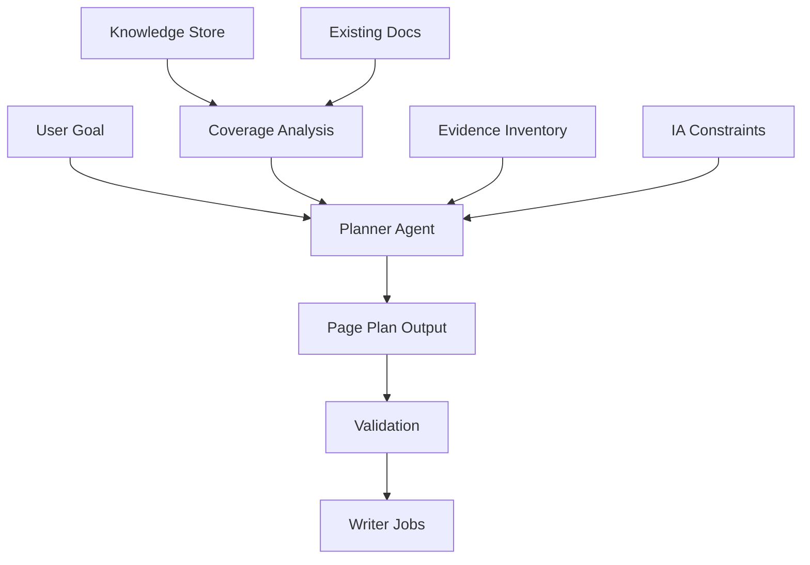
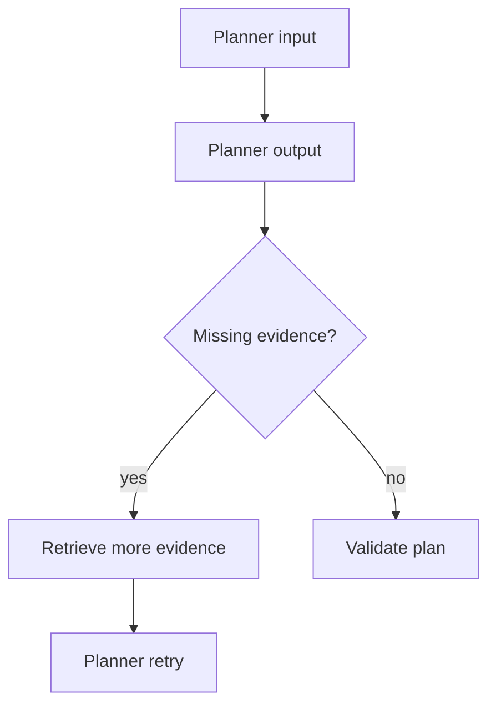
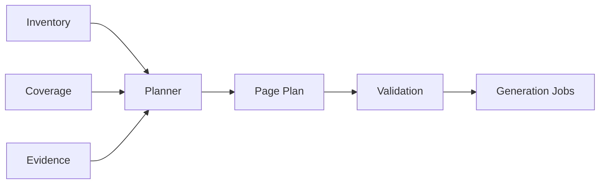

------
title: Build From Scratch: Mintlify-like AI-driven Documentation Generator CLI - Part 030
description: Mendesain Doc Page Planner Agent untuk AI documentation generator: page inventory, gap analysis, page candidates, route planning, IA alignment, evidence selection, coverage scoring, update decisions, output schema, validation, and testing.
series: learn-mintlify-like-ai-docs-cli
seriesTitle: Build From Scratch: Mintlify-like AI-driven Documentation Generator CLI
order: 30
partTitle: Doc Page Planner Agent
tags:
  - documentation
  - ai
  - cli
  - page-planning
  - information-architecture
  - structured-output
  - developer-tools
date: 2026-07-03
---

# Part 030 — Doc Page Planner Agent

Sebelum AI writer menulis halaman, kita butuh agent yang menentukan:

- halaman apa yang perlu ada,
- halaman apa yang tidak perlu dibuat,
- halaman mana yang perlu update,
- route-nya apa,
- page kind-nya apa,
- evidence apa yang harus dipakai,
- section apa yang harus ada,
- dan bagaimana halaman tersebut masuk ke navigation.

Itulah tugas **Doc Page Planner Agent**.

Planner agent tidak menulis prose panjang. Ia membuat **rencana dokumentasi**.

Analogi:

- architect membuat blueprint,
- writer membangun ruangan,
- reviewer memeriksa hasil.

Jika kita melewati planner dan langsung meminta model "write docs", hasilnya sering:

- duplikatif,
- route tidak stabil,
- coverage tidak jelas,
- page terlalu besar,
- formal reference bercampur guide,
- generated docs menimpa manual docs,
- dan navigation kacau.

---

## 1. Mental model: planner agent membuat documentation build plan



Planner output bukan final docs. Output-nya adalah list planned pages and update actions.

---

## 2. Planner responsibilities

Planner bertanggung jawab untuk:

1. memahami objective,
2. membaca existing docs inventory,
3. membaca semantic artifacts,
4. menemukan gap,
5. memutuskan page boundaries,
6. memilih page kind,
7. menentukan priority,
8. menentukan route stable,
9. memilih evidence IDs,
10. menentukan required sections,
11. menentukan apakah create/update/skip,
12. menjaga IA consistency,
13. dan mengeluarkan plan yang valid.

Planner tidak boleh:

- menulis full docs prose,
- mengarang API fields,
- mengubah source files,
- membuat route yang konflik,
- menghapus manual docs tanpa policy,
- membuat page untuk low-confidence artifacts tanpa review,
- memasukkan private/internal artifacts ke public docs.

---

## 3. Planner input sources

Planner receives curated summaries, not entire repo.

```ts
export type PagePlannerInput = {
  schemaVersion: "page-planner-input/v1";
  objective: PlanningObjective;
  project: ProjectPromptContext;
  docsInventory: DocsInventorySummary;
  navigation: NavigationSummary;
  coverage: DocumentationCoverageSummary;
  semanticArtifacts: SemanticArtifactSummary[];
  existingPages: ExistingPageSummary[];
  evidence: EvidenceItem[];
  constraints: PagePlanningConstraints;
};
```

Objective:

```ts
export type PlanningObjective =
  | { type: "initialDocs"; scope: "full" | "minimal" | "api" | "cli" }
  | { type: "fillCoverageGaps"; artifactTypes: string[] }
  | { type: "updateForDiff"; changedArtifacts: string[] }
  | { type: "planSinglePage"; topic: string }
  | { type: "reorganizeNavigation"; scope: string };
```

---

## 4. Existing docs inventory

```ts
export type DocsInventorySummary = {
  pagesTotal: number;
  pagesByKind: Record<PageKind, number>;
  generatedPages: number;
  manualPages: number;
  orphanPages: ExistingPageSummary[];
  duplicateTopics: DuplicateTopicSummary[];
  stalePages: StalePageSummary[];
};
```

Existing page:

```ts
export type ExistingPageSummary = {
  pageId: PageId;
  route: RoutePath;
  title: string;
  description?: string;
  kind: PageKind;
  sourcePath: string;
  generated: boolean;
  hidden: boolean;
  draft: boolean;
  documentedTargets: GraphNodeRef[];
  headings: string[];
  tags: string[];
};
```

Planner must not plan duplicate page if existing page already covers topic.

---

## 5. Semantic artifact summary

Planner does not need full artifact payload for every object.

```ts
export type SemanticArtifactSummary = {
  id: string;
  type:
    | "apiEndpoint"
    | "cliCommand"
    | "configField"
    | "packageExport"
    | "event"
    | "job"
    | "example"
    | "test";
  key: string;
  title: string;
  visibility: "public" | "internal" | "admin" | "unknown";
  confidence: Confidence;
  documentedBy: PageId[];
  sourceEvidenceIds: string[];
  tags: string[];
  changed?: boolean;
};
```

Example:

```json
{
  "id": "cli:docforge-build",
  "type": "cliCommand",
  "key": "docforge build",
  "title": "Build static documentation site",
  "visibility": "public",
  "confidence": "high",
  "documentedBy": [],
  "sourceEvidenceIds": ["ev_cli_build"],
  "tags": ["cli", "build"]
}
```

---

## 6. Coverage summary

```ts
export type DocumentationCoverageSummary = {
  groups: CoverageGroupSummary[];
};

export type CoverageGroupSummary = {
  artifactType: string;
  total: number;
  documented: number;
  undocumented: SemanticArtifactSummary[];
  stale: SemanticArtifactSummary[];
};
```

Planner uses coverage to propose pages.

Example:

```json
{
  "artifactType": "cliCommand",
  "total": 8,
  "documented": 5,
  "undocumented": [
    { "id": "cli:docforge-index", "key": "docforge index" }
  ]
}
```

---

## 7. Planning constraints

```ts
export type PagePlanningConstraints = {
  maxNewPages: number;
  maxUpdatedPages: number;
  allowedPageKinds: PageKind[];
  routePrefix?: string;
  preserveManualPages: boolean;
  allowGeneratedPages: boolean;
  includeInternal: boolean;
  preferredStrategy: "minimal" | "comprehensive" | "referenceFirst" | "guideFirst";
  navigationPolicy: "doNotChange" | "proposeOnly" | "allowGeneratedSections";
};
```

Example:

```json
{
  "maxNewPages": 10,
  "maxUpdatedPages": 5,
  "preserveManualPages": true,
  "allowGeneratedPages": true,
  "includeInternal": false,
  "preferredStrategy": "referenceFirst",
  "navigationPolicy": "proposeOnly"
}
```

---

## 8. Planner output schema

```ts
export type PagePlanOutput = {
  schemaVersion: "page-plan/v1";
  summary: string;
  actions: PlannedPageAction[];
  navigationSuggestions: NavigationSuggestion[];
  coverageImpact: CoverageImpactSummary;
  missingEvidence: MissingEvidence[];
  diagnostics: DraftDiagnostic[];
};
```

Actions:

```ts
export type PlannedPageAction =
  | CreatePageAction
  | UpdatePageAction
  | SkipPageAction
  | SplitPageAction
  | MergePageAction;
```

Create:

```ts
export type CreatePageAction = {
  action: "create";
  id: string;
  title: string;
  route: RoutePath;
  sourcePath?: string;
  kind: PageKind;
  priority: "must" | "should" | "could";
  purpose: string;
  audience: "beginner" | "intermediate" | "advanced";
  targetArtifacts: GraphNodeRef[];
  evidenceIds: string[];
  requiredSections: PlannedSection[];
  generationMode: "deterministic" | "aiDraft" | "hybrid";
  rationale: string;
};
```

Update:

```ts
export type UpdatePageAction = {
  action: "update";
  pageId: PageId;
  reason: "stale" | "coverageGap" | "structure" | "quality" | "diff";
  priority: "must" | "should" | "could";
  targetArtifacts: GraphNodeRef[];
  evidenceIds: string[];
  requiredChanges: PlannedChange[];
  rationale: string;
};
```

Skip:

```ts
export type SkipPageAction = {
  action: "skip";
  targetArtifacts: GraphNodeRef[];
  reason: "alreadyDocumented" | "internal" | "lowConfidence" | "outOfScope" | "missingEvidence";
  rationale: string;
};
```

---

## 9. Planned section schema

```ts
export type PlannedSection = {
  id: string;
  title: string;
  purpose: string;
  requiredEvidenceIds: string[];
  expectedBlocks: Array<
    | "paragraph"
    | "steps"
    | "code"
    | "table"
    | "callout"
    | "apiOperation"
    | "cardGroup"
  >;
  acceptanceCriteria: string[];
};
```

Example:

```json
{
  "id": "build-options",
  "title": "Build options",
  "purpose": "Explain the key flags for the build command.",
  "requiredEvidenceIds": ["ev_cli_build"],
  "expectedBlocks": ["table", "paragraph"],
  "acceptanceCriteria": [
    "Includes --out, --strict, and --no-search.",
    "Does not mention flags not present in CLI evidence."
  ]
}
```

This becomes input to writer agent.

---

## 10. Generation mode

Not every page needs AI writing.

```ts
export type GenerationMode =
  | "deterministic"
  | "aiDraft"
  | "hybrid";
```

Examples:

| Page | Mode |
|---|---|
| API operation reference | deterministic |
| Config field reference | deterministic/hybrid |
| CLI command reference | deterministic/hybrid |
| Quickstart guide | aiDraft/hybrid |
| Architecture overview | aiDraft |
| Coverage report page | deterministic |

Planner should choose mode.

Rule:

- formal reference from structured artifacts → deterministic or hybrid,
- explanatory guide → AI draft with evidence,
- generated API docs → deterministic.

---

## 11. Page kind decision

Planner must choose correct page kind.

| Artifact/Objective | Page kind |
|---|---|
| Product overview | `overview` |
| First working path | `quickstart` |
| Task steps | `howTo` |
| Conceptual explanation | `concept` |
| CLI/config/API formal docs | `reference` or `apiReference` |
| Errors/fixes | `troubleshooting` |
| Upgrade path | `migration` |
| Internal design | `architecture` |
| Decision record | `adr` |

Anti-pattern: putting reference tables inside quickstart.

---

## 12. Page boundary rules

Planner must decide page granularity.

Rules:

1. One page should have one primary user intent.
2. Do not create one page per tiny config field.
3. API operations can be one per page if API large.
4. CLI commands can be one reference page or grouped by command family.
5. Concepts should not be mixed with step-by-step tasks.
6. Troubleshooting should be symptom-oriented.
7. Generated reference pages should be predictable.

Examples:

### Bad

```txt
Configuration and Deployment and API Auth and Troubleshooting
```

### Good

```txt
Configuration Reference
Deploy Documentation Site
Authentication Concepts
Troubleshooting Build Failures
```

---

## 13. Route planning

Planner proposes route, but route validator enforces stability.

Route rules:

- lowercase,
- kebab-case,
- no spaces,
- stable topic slug,
- under appropriate prefix,
- no conflict with existing routes,
- no route based only on current title if formal artifact has stable key.

Route examples:

| Page kind | Route |
|---|---|
| quickstart | `/quickstart` |
| config reference | `/reference/configuration` |
| CLI command | `/reference/cli/build` |
| API operation | `/api-reference/users/create-user` |
| guide | `/guides/generate-api-reference` |
| troubleshooting | `/troubleshooting/mdx-build-errors` |

Planner output route is candidate. Route resolver may adjust.

---

## 14. Route collision validation

Planner output validation:

```ts
export function validatePlannedRoutes(
  plan: PagePlanOutput,
  existingRoutes: Set<RoutePath>
): Diagnostic[] {
  const diagnostics: Diagnostic[] = [];
  const planned = new Map<RoutePath, PlannedPageAction[]>();

  for (const action of plan.actions) {
    if (action.action !== "create") continue;

    const group = planned.get(action.route) ?? [];
    group.push(action);
    planned.set(action.route, group);

    if (existingRoutes.has(action.route)) {
      diagnostics.push({
        code: "planner.route.exists",
        severity: "error",
        category: "ai",
        message: `Planned route already exists: ${action.route}.`,
      });
    }
  }

  for (const [route, actions] of planned) {
    if (actions.length > 1) {
      diagnostics.push({
        code: "planner.route.duplicate",
        severity: "error",
        category: "ai",
        message: `Multiple planned pages use route: ${route}.`,
      });
    }
  }

  return diagnostics;
}
```

---

## 15. Planner objective: initial docs

For a new project, planner should propose minimal useful docs.

Typical minimal plan:

1. Overview,
2. Quickstart,
3. Configuration Reference,
4. CLI Reference,
5. API Reference if OpenAPI exists,
6. Troubleshooting if diagnostics/examples exist.

Planner must respect `maxNewPages`.

Example output summary:

```json
{
  "summary": "Plan creates a minimal docs set with overview, quickstart, CLI reference, config reference, and API reference generated from the OpenAPI spec."
}
```

---

## 16. Planner objective: fill coverage gaps

Input:

```json
{
  "type": "fillCoverageGaps",
  "artifactTypes": ["cliCommand", "configField"]
}
```

Planner should:

- not create one page per field if fields can be grouped,
- update existing config reference if exists,
- create missing reference page if not,
- skip internal/low-confidence artifacts.

Example:

```json
{
  "action": "update",
  "pageId": "reference-configuration",
  "reason": "coverageGap",
  "targetArtifacts": [
    { "type": "semanticArtifact", "id": "config:search.enabled" }
  ]
}
```

---

## 17. Planner objective: update for diff

Diff input:

```ts
export type ChangedArtifactSummary = {
  artifactId: ArtifactId;
  path: string;
  changedSymbols: GraphNodeRef[];
  changedSemanticArtifacts: GraphNodeRef[];
  affectedPages: PageId[];
};
```

Planner decides:

- update existing page,
- create new page for new public artifact,
- mark removed artifact docs for deletion/deprecation update,
- skip internal changes.

Examples:

| Change | Planner action |
|---|---|
| New CLI command | update CLI reference or create command page |
| New OpenAPI endpoint | create API page deterministically |
| Config field default changed | update config reference |
| Internal helper changed | skip or no docs |
| Public SDK function removed | update migration/deprecation docs |

---

## 18. Planner objective: single page

User asks:

```txt
Generate guide for setting up API reference from OpenAPI.
```

Planner should create one plan action:

- kind: `howTo`,
- route: `/guides/generate-api-reference`,
- evidence: OpenAPI ingestion, config, CLI command,
- required sections: prerequisites, config, build, validate, troubleshooting.

If evidence missing, include missingEvidence.

---

## 19. Navigation suggestion model

Planner can propose navigation changes but should not apply automatically unless policy allows.

```ts
export type NavigationSuggestion = {
  type: "addPage" | "addGroup" | "addGeneratedSection" | "movePage";
  title: string;
  targetRoute?: RoutePath;
  parentGroup?: string;
  reason: string;
  confidence: Confidence;
};
```

Example:

```json
{
  "type": "addPage",
  "title": "Configuration",
  "targetRoute": "/reference/configuration",
  "parentGroup": "Reference",
  "reason": "New configuration reference page should be discoverable under Reference.",
  "confidence": "high"
}
```

Nav resolver validates.

---

## 20. Coverage impact summary

Planner should estimate coverage improvement.

```ts
export type CoverageImpactSummary = {
  before: Record<string, { total: number; documented: number }>;
  afterEstimate: Record<string, { total: number; documented: number }>;
  newlyDocumentedArtifactIds: string[];
  remainingGaps: string[];
};
```

Example:

```json
{
  "before": { "cliCommand": { "total": 8, "documented": 5 } },
  "afterEstimate": { "cliCommand": { "total": 8, "documented": 8 } },
  "newlyDocumentedArtifactIds": ["cli:docforge-index", "cli:docforge-graph"],
  "remainingGaps": []
}
```

This makes planning measurable.

---

## 21. Planner prompt contract

The planner prompt should say:

```txt
You are a documentation page planning agent.
You create a plan, not final documentation prose.
Use only supplied evidence, docs inventory, semantic artifact summaries, and constraints.
Do not invent pages for internal or low-confidence artifacts unless explicitly requested.
Prefer updating existing pages over creating duplicates.
Preserve manual pages.
Return only JSON matching PagePlanOutput schema.
```

Key anti-duplication instruction:

```txt
If an existing page already covers an artifact or topic, plan an update or skip, not a duplicate page.
```

---

## 22. Planner evidence usage

Planner does not need detailed full evidence for every section. But each planned action needs evidence IDs.

Create page action:

```json
{
  "evidenceIds": ["ev_cli_build", "ev_config_build_output_dir"]
}
```

Required section:

```json
{
  "requiredEvidenceIds": ["ev_cli_build"]
}
```

If no evidence for a page, planner should not create it unless objective is explicitly exploratory and output marks missing evidence.

---

## 23. Planner output validation

Validators:

1. schema validation,
2. action count limits,
3. route uniqueness,
4. evidence IDs exist,
5. target artifacts exist,
6. page kind allowed,
7. manual page preservation,
8. no internal artifacts if `includeInternal=false`,
9. deterministic pages not assigned AI-only mode incorrectly,
10. required sections have evidence or missing evidence.

Example internal artifact check:

```ts
export function validateNoInternalTargets(
  plan: PagePlanOutput,
  artifacts: Map<string, SemanticArtifactSummary>,
  includeInternal: boolean
): Diagnostic[] {
  if (includeInternal) return [];

  const diagnostics: Diagnostic[] = [];

  for (const action of plan.actions) {
    const targets = "targetArtifacts" in action ? action.targetArtifacts : [];

    for (const target of targets) {
      const artifact = artifacts.get(target.id);
      if (artifact?.visibility === "internal") {
        diagnostics.push({
          code: "planner.target.internalNotAllowed",
          severity: "error",
          category: "ai",
          message: `Plan targets internal artifact ${target.id}, but internal docs are disabled.`,
        });
      }
    }
  }

  return diagnostics;
}
```

---

## 24. Preserve manual pages

If `preserveManualPages=true`, planner cannot propose overwriting manual pages.

It can propose:

- add generated section,
- add update suggestion,
- create patch in managed region,
- or mark for human review.

Validation:

```ts
if (action.action === "update" && page.generated === false) {
  // allowed only as suggestion, not auto-apply
}
```

Add field:

```ts
applyPolicy: "auto" | "reviewRequired";
```

Manual page update should be `reviewRequired`.

---

## 25. Create vs update decision

Decision table:

| Condition | Action |
|---|---|
| No existing page covers target | create |
| Existing generated page covers target and stale | update |
| Existing manual page covers target and stale | update reviewRequired |
| Existing page covers target and fresh | skip |
| Artifact internal and internal disabled | skip |
| Artifact low confidence | skip or reviewRequired |
| Topic too broad | split |
| Multiple pages duplicate same target | merge suggestion |

Planner should prefer updating over duplicating.

---

## 26. Split and merge actions

For mature docs, planner may propose restructuring.

Split:

```ts
export type SplitPageAction = {
  action: "split";
  pageId: PageId;
  reason: string;
  proposedPages: Array<{
    title: string;
    route: RoutePath;
    kind: PageKind;
    targetSections: string[];
  }>;
  priority: "should" | "could";
  applyPolicy: "reviewRequired";
};
```

Merge:

```ts
export type MergePageAction = {
  action: "merge";
  pageIds: PageId[];
  proposedTargetPage: {
    title: string;
    route: RoutePath;
    kind: PageKind;
  };
  reason: string;
  priority: "should" | "could";
  applyPolicy: "reviewRequired";
};
```

These should not auto-apply.

---

## 27. Planning deterministic reference pages

Some pages can be generated without AI prose.

Examples:

- API reference,
- CLI reference,
- config reference,
- schema reference,
- event catalog.

Planner can mark:

```json
"generationMode": "deterministic"
```

Then writer agent is not needed. A deterministic generator consumes target artifacts.

This saves cost and avoids hallucination.

---

## 28. Planning hybrid pages

Hybrid page:

- formal tables deterministic,
- explanations AI-drafted.

Example: CLI command page.

Sections:

1. Overview paragraph — AI with evidence.
2. Usage block — deterministic.
3. Options table — deterministic.
4. Examples — deterministic/generated.
5. Troubleshooting — AI if evidence from diagnostics/tests exists.

Planner marks sections:

```ts
export type PlannedSection = {
  generationMode?: "deterministic" | "aiDraft" | "hybrid";
};
```

---

## 29. Planning guides

Guides need task flow.

Required section pattern:

1. When to use this guide,
2. Prerequisites,
3. Step-by-step,
4. Verify result,
5. Troubleshooting,
6. Next steps.

Planner should enforce concrete success condition.

Example:

```json
{
  "title": "Generate API reference from OpenAPI",
  "requiredSections": [
    {
      "title": "Prerequisites",
      "purpose": "List required OpenAPI spec and config."
    },
    {
      "title": "Configure OpenAPI ingestion",
      "purpose": "Show docforge.config.json openapi.specs."
    },
    {
      "title": "Build and verify",
      "purpose": "Run build/check and explain expected output."
    }
  ]
}
```

---

## 30. Planning quickstart

Quickstart should be shortest path to working result.

Rules:

- avoid deep theory,
- include install/init/dev/build,
- include expected result,
- link to references,
- keep under reasonable length,
- no exhaustive options.

Planner should not put every feature into quickstart.

---

## 31. Planning troubleshooting pages

Troubleshooting pages should be symptom-oriented.

Source evidence:

- diagnostics catalog,
- error messages,
- tests,
- issue patterns,
- existing docs.

Plan sections:

```txt
Build fails with unknown MDX component
OpenAPI operation missing operationId
Search index too large
Dev server reload loop
```

Each issue section should include:

- symptom,
- likely cause,
- fix,
- verification.

Do not create troubleshooting for speculative problems without evidence.

---

## 32. Planning architecture docs

Architecture docs can include internal symbols if objective includes internal/architecture.

But public docs should avoid internal implementation by default.

Planner constraint:

```json
{
  "includeInternal": false
}
```

For internal docs:

```json
{
  "includeInternal": true,
  "allowedPageKinds": ["architecture", "adr", "concept"]
}
```

---

## 33. Planner and IA alignment

Planner must respect existing information architecture.

If nav has groups:

```txt
Start here
Guides
Reference
API Reference
Troubleshooting
```

Planner should route pages accordingly.

Example:

- `howTo` → `/guides/...`
- `reference` → `/reference/...`
- `apiReference` → `/api-reference/...`
- `troubleshooting` → `/troubleshooting/...`

Route prefix can be derived from page kind.

```ts
export function defaultPrefixForPageKind(kind: PageKind): string {
  switch (kind) {
    case "howTo": return "/guides";
    case "reference": return "/reference";
    case "apiReference": return "/api-reference";
    case "troubleshooting": return "/troubleshooting";
    case "concept": return "/concepts";
    default: return "";
  }
}
```

---

## 34. Planner and route lock

Planner can propose route but route resolver finalizes.

```ts
export type PlannedRoute = {
  proposed: RoutePath;
  stabilityKey: string;
};
```

Stability key:

- semantic artifact ID,
- page topic ID,
- operation key,
- command key.

Route lock:

```txt
page:cli:docforge-build -> /reference/cli/build
```

If title changes, route stays.

---

## 35. Planner and evidence retrieval

Planner may request more evidence.

Output missingEvidence can trigger retrieval expansion.

Flow:



Limit retries.

Example missing evidence:

```json
{
  "question": "Need example command output for docforge init.",
  "severity": "nonBlocking",
  "suggestedSources": ["README", "tests", "CLI snapshots"]
}
```

---

## 36. Planner and priorities

Priority helps decide what to generate under limits.

Priority rules:

| Priority | Meaning |
|---|---|
| `must` | Required for coherent docs or public contract coverage |
| `should` | Strongly useful but not blocking |
| `could` | Nice-to-have or later |

Planner should not mark everything `must`.

Examples:

- Quickstart for new docs: must.
- API reference for public API: must.
- Advanced architecture guide: could.
- Troubleshooting for known frequent diagnostic: should.

---

## 37. Planner and risk

Add risk for actions.

```ts
export type PlannedActionRisk = {
  level: "low" | "medium" | "high";
  reasons: string[];
};
```

High risk:

- updates manual page,
- low-confidence evidence,
- deletes/merges pages,
- changes route/nav,
- internal/private artifacts,
- broad rewrite.

Auto-apply only low-risk generated pages.

---

## 38. Planner execution pipeline

```ts
export async function planDocumentation(
  input: PagePlannerInput,
  ctx: AiPlanningContext
): Promise<PagePlanResult> {
  const prompt = renderPagePlannerPrompt(input);
  const raw = await ctx.model.generateJson(prompt, ctx.modelConfig);
  const parsed = parseModelJsonOutput(raw);
  const schemaResult = PagePlanOutputSchema.safeParse(parsed);

  if (!schemaResult.success) {
    return repairPlannerOutput(input, parsed, schemaResult.error, ctx);
  }

  const plan = schemaResult.data;
  const diagnostics = [
    ...validatePlannerEvidence(plan, input.evidence),
    ...validatePlannedRoutes(plan, existingRouteSet(input)),
    ...validatePlannerConstraints(plan, input.constraints, input),
    ...validatePlannerTargets(plan, input.semanticArtifacts),
  ];

  if (hasErrors(diagnostics)) {
    return repairOrFailPlan(input, plan, diagnostics, ctx);
  }

  return { plan, diagnostics };
}
```

---

## 39. Planner output to jobs

Plan becomes jobs.

```ts
export type GenerationJob =
  | DeterministicPageGenerationJob
  | AiWriterGenerationJob
  | PageUpdateJob
  | NavigationUpdateSuggestionJob;
```

Create action to writer job:

```ts
export function createWriterJob(action: CreatePageAction): AiWriterGenerationJob {
  return {
    type: "writePage",
    pageId: action.id,
    title: action.title,
    route: action.route,
    kind: action.kind,
    evidenceIds: action.evidenceIds,
    requiredSections: action.requiredSections,
  };
}
```

Deterministic action goes to reference generator.

---

## 40. Planner result presentation

CLI should show plan before applying.

```txt
Documentation plan:

Create:
  [must] /quickstart
    Quickstart
    evidence: ev_cli_init, ev_cli_dev, ev_cli_build

  [must] /reference/configuration
    Configuration Reference
    deterministic/hybrid
    targets: 62 config fields

Update:
  [should] /reference/cli
    Add missing command: docforge index

Skip:
  internal endpoint GET /metrics
    reason: internal
```

Then:

```bash
docforge generate --plan
docforge generate --apply
docforge generate --apply --only must
```

---

## 41. Human approval model

Planner can be auto-run, but applying should respect policy.

Actions have:

```ts
applyPolicy: "auto" | "reviewRequired" | "manualOnly";
```

Defaults:

| Action | Policy |
|---|---|
| create generated API page | auto |
| create config reference | auto/review |
| create guide with AI prose | reviewRequired |
| update manual page | reviewRequired |
| merge/split pages | manualOnly |
| nav restructure | reviewRequired |

---

## 42. Planner diagnostics

Planner-specific diagnostics:

| Code | Meaning |
|---|---|
| `planner.route.exists` | planned route already exists |
| `planner.route.duplicate` | two actions same route |
| `planner.evidence.unknown` | evidence ID not in input |
| `planner.target.unknown` | target artifact not found |
| `planner.target.internalNotAllowed` | internal target in public plan |
| `planner.duplicatesExistingPage` | create duplicates existing page |
| `planner.tooManyActions` | exceeds constraints |
| `planner.lowConfidenceAutoApply` | low-confidence action marked auto |
| `planner.manualOverwrite` | update manual page without review policy |

---

## 43. Planner testing

### 43.1 Schema tests

```ts
it("rejects create action without evidence", () => {
  const plan = pagePlan({
    actions: [
      createAction({ evidenceIds: [] }),
    ],
  });

  const diagnostics = validatePlannerEvidence(plan, evidence);

  expect(diagnostics).toContainEqual(
    expect.objectContaining({ code: "planner.evidence.missing" })
  );
});
```

### 43.2 Route collision tests

```ts
it("rejects planned route that already exists", () => {
  const diagnostics = validatePlannedRoutes(planWithRoute("/quickstart"), new Set(["/quickstart"]));

  expect(diagnostics).toContainEqual(
    expect.objectContaining({ code: "planner.route.exists" })
  );
});
```

### 43.3 Internal artifact tests

```ts
it("rejects internal target when internal docs disabled", () => {
  const diagnostics = validateNoInternalTargets(plan, artifactMap, false);

  expect(diagnostics).toContainEqual(
    expect.objectContaining({ code: "planner.target.internalNotAllowed" })
  );
});
```

---

## 44. Planner eval cases

Create planning evaluation fixtures.

```ts
export type PlannerEvalCase = {
  name: string;
  input: PagePlannerInput;
  expectedActions: Array<{
    action: "create" | "update" | "skip";
    targetId?: string;
    route?: string;
  }>;
  forbiddenActions?: Array<{
    action: "create" | "update";
    targetId?: string;
    route?: string;
  }>;
};
```

Examples:

1. new CLI command undocumented → update CLI reference,
2. existing page already documents command → skip,
3. new API operation → deterministic create API page,
4. internal endpoint → skip,
5. manual stale page → update reviewRequired,
6. low-confidence dynamic route → skip or reviewRequired.

---

## 45. Fake model tests

Use fake model output to test pipeline.

```ts
class FakePlannerModel implements ModelClient {
  constructor(private readonly output: unknown) {}

  async generateJson(): Promise<string> {
    return JSON.stringify(this.output);
  }
}
```

Test repair path too.

---

## 46. Planner quality metrics

Track:

```ts
export type PlannerQualityMetrics = {
  plannedCreate: number;
  plannedUpdate: number;
  plannedSkip: number;
  duplicateRouteErrors: number;
  unknownEvidenceErrors: number;
  internalTargetErrors: number;
  coverageImprovementEstimate: number;
  reviewRequiredActions: number;
};
```

Over time, measure:

- how often planner proposes duplicates,
- how often human rejects plan,
- how often writer lacks evidence,
- how coverage improves.

---

## 47. Anti-pattern: planner writes prose

Bad planner output:

```json
{
  "page": "# Quickstart\nInstall DocForge..."
}
```

Planner should output structure and evidence, not content.

Writer agent handles prose.

---

## 48. Anti-pattern: one page per artifact always

If 62 config fields exist, creating 62 pages is bad.

Better:

- one configuration reference page,
- group by config section,
- anchors per field.

If 128 API operations exist, one per operation may be good. Granularity depends on artifact type and UX.

---

## 49. Anti-pattern: ignoring existing docs

Planner must avoid duplicates.

If existing page documents `cli:docforge-build`, planner should update or skip.

Do not create:

```txt
/reference/build
/reference/cli-build
/reference/docforge-build
```

for same command.

---

## 50. Anti-pattern: public docs from private artifacts

Planner should not expose:

- internal endpoints,
- private helper functions,
- secret env vars,
- internal-only jobs,
- admin routes,

unless configured.

Visibility filtering belongs before and after model output.

---

## 51. Package layout

```txt
packages/doc-planner/
  src/
    input.ts
    output-schema.ts
    prompt.ts
    planner.ts
    validation/
      evidence.ts
      routes.ts
      targets.ts
      constraints.ts
      duplicates.ts
      apply-policy.ts
    jobs.ts
    coverage-impact.ts
    presentation.ts
    eval.ts
    __tests__/
      schema.test.ts
      route-validation.test.ts
      target-validation.test.ts
      job-conversion.test.ts
      eval-cases.test.ts
```

Keep planner separate from writer.

---

## 52. Minimal implementation milestone

First version:

1. define planner input summary types,
2. define `PagePlanOutputSchema`,
3. implement planner prompt,
4. implement output validators,
5. support create/update/skip actions,
6. support route/evidence/target validation,
7. convert actions to generation jobs,
8. print plan preview,
9. add eval fixtures,
10. require review for AI-drafted pages.

Second version:

1. split/merge actions,
2. navigation suggestions,
3. coverage impact estimation,
4. diff-aware planning,
5. route lock integration,
6. planner repair loop,
7. human approval UI,
8. planning analytics.

---

## 53. Failure modes

| Failure | Cause | Prevention |
|---|---|---|
| Duplicate docs pages | planner ignores existing inventory | existing docs summary + duplicate validation |
| Wrong route | free-form route generation | route schema + resolver + route lock |
| Internal API exposed | no visibility validation | internal target filter |
| Too many pages | no constraints | maxNewPages/maxUpdatedPages |
| Manual docs overwritten | no apply policy | reviewRequired/manualOnly |
| Writer lacks evidence | planner sections not evidence-bound | requiredEvidenceIds |
| Formal reference uses AI prose | wrong generation mode | deterministic/hybrid mode |
| Coverage doesn't improve | no coverage model | coverage impact summary |
| Plan impossible to apply | no job conversion model | validate action-to-job |
| Human cannot review | no plan presentation | CLI plan preview |

---

## 54. Key takeaways

Doc Page Planner Agent decides what should be documented before anything is written.



Strong planner design:

1. plans pages, not prose,
2. uses docs inventory to avoid duplicates,
3. respects IA and route stability,
4. targets semantic artifacts with evidence,
5. chooses create/update/skip,
6. distinguishes deterministic vs AI-drafted pages,
7. preserves manual pages,
8. filters internal artifacts,
9. estimates coverage impact,
10. and produces reviewable actions.

Next, we implement the **Doc Writer Agent**, which turns one planned page into Content IR using the evidence and section contract from the planner.
