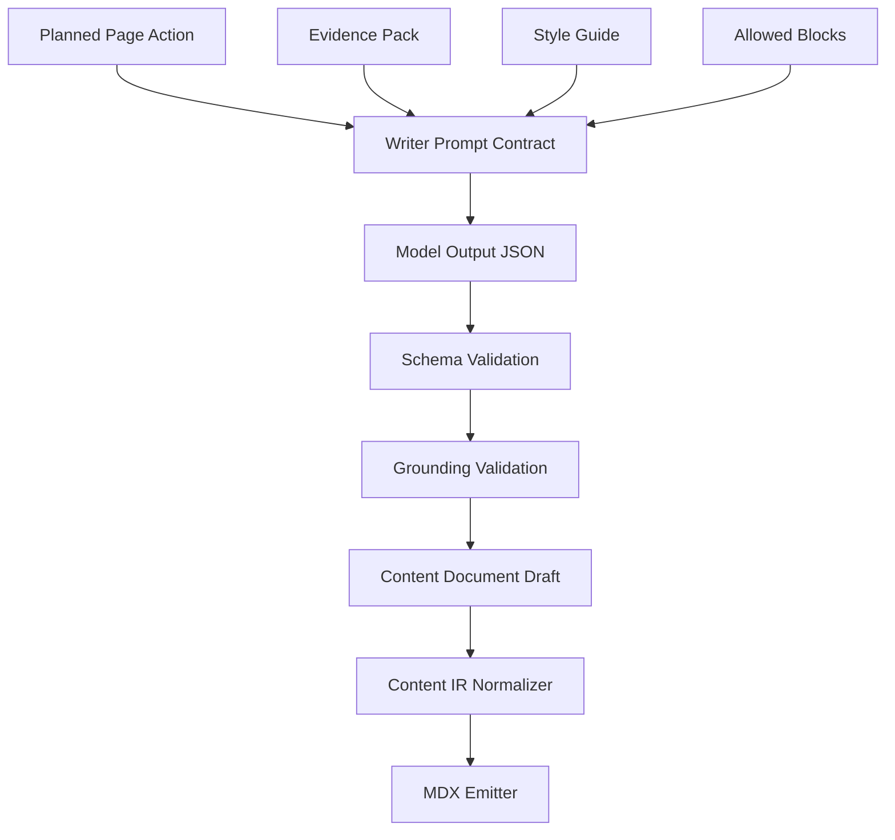
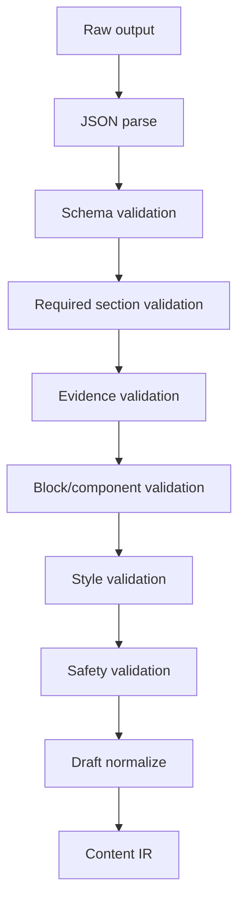

------
title: Build From Scratch: Mintlify-like AI-driven Documentation Generator CLI - Part 031
description: Mendesain Doc Writer Agent untuk AI documentation generator: planned page to Content IR draft, evidence-bound writing, section contracts, claim support, examples, code blocks, missing evidence, style policy, validation, repair, and deterministic MDX emission.
series: learn-mintlify-like-ai-docs-cli
seriesTitle: Build From Scratch: Mintlify-like AI-driven Documentation Generator CLI
order: 31
partTitle: Doc Writer Agent
tags:
  - documentation
  - ai
  - cli
  - doc-writer
  - content-ir
  - structured-output
  - developer-tools
date: 2026-07-03
---

# Part 031 — Doc Writer Agent

Pada Part 030, **Doc Page Planner Agent** menghasilkan rencana halaman:

- title,
- route,
- page kind,
- target artifacts,
- evidence IDs,
- required sections,
- generation mode,
- priority,
- dan acceptance criteria.

Sekarang kita membangun agent yang mengubah satu planned page menjadi draft dokumentasi:

> **Doc Writer Agent**

Writer agent tidak boleh menulis bebas. Ia harus menulis berdasarkan:

1. planned page contract,
2. required section contract,
3. evidence pack,
4. allowed component/block schema,
5. documentation style guide,
6. page kind rules,
7. provenance requirements,
8. dan output schema.

Writer agent menghasilkan **Content Document Draft**, bukan final `.mdx`.

Final `.mdx` tetap dihasilkan oleh deterministic emitter dari Content IR.

---

## 1. Mental model: writer agent adalah evidence-to-IR transformer



Writer agent bukan "penulis artikel bebas".

Writer agent adalah transform stage:

```ts
function writePage(input: DocWriterInput): Promise<ContentDocumentDraft>
```

---

## 2. Writer responsibilities

Writer bertanggung jawab untuk:

1. mengubah planned sections menjadi content blocks,
2. menjelaskan konsep sesuai audience,
3. menjaga page kind pattern,
4. memakai evidence yang disediakan,
5. menulis claim dengan evidence IDs,
6. menghindari fakta tanpa evidence,
7. menghasilkan code blocks hanya jika punya evidence atau deterministic generator,
8. menandai missing evidence,
9. memakai allowed block types,
10. menjaga style/terminology,
11. menghasilkan draft yang bisa divalidasi,
12. dan tidak menulis final MDX.

Writer tidak boleh:

- mengarang CLI flag,
- mengarang API field,
- mengarang config default,
- mengarang file path,
- mengarang code sample,
- membuat arbitrary MDX import,
- membuat link internal yang belum ada tanpa target planned,
- menulis secret/token asli,
- mengubah navigation,
- mengubah route,
- atau memutuskan page baru.

---

## 3. Writer input schema

```ts
export type DocWriterInput = {
  schemaVersion: "doc-writer-input/v1";
  page: WriterPageSpec;
  sections: PlannedSection[];
  evidence: EvidenceItem[];
  existingPage?: ExistingPageContext;
  styleGuide: DocumentationStyleGuide;
  allowedBlocks: AllowedBlockSpec[];
  constraints: WriterConstraints;
};
```

Page spec:

```ts
export type WriterPageSpec = {
  pageId: string;
  title: string;
  route: RoutePath;
  kind: PageKind;
  purpose: string;
  audience: "beginner" | "intermediate" | "advanced";
  targetArtifacts: GraphNodeRef[];
  generationMode: "aiDraft" | "hybrid";
};
```

Constraints:

```ts
export type WriterConstraints = {
  maxWords?: number;
  maxSections: number;
  requireEvidenceForClaims: boolean;
  allowCodeBlocks: boolean;
  allowCallouts: boolean;
  allowTables: boolean;
  preserveExistingHumanText: boolean;
  missingEvidencePolicy: "report" | "fail";
};
```

---

## 4. Existing page context for updates

If writer updates a page, it needs current page summary.

```ts
export type ExistingPageContext = {
  pageId: PageId;
  route: RoutePath;
  title: string;
  frontmatter: Record<string, unknown>;
  outline: ExistingSectionSummary[];
  managedRegions: ManagedRegionSummary[];
  protectedHumanRegions: ProtectedRegionSummary[];
  staleMappings: DocumentationMapping[];
};
```

Existing section summary:

```ts
export type ExistingSectionSummary = {
  id: string;
  heading: string;
  level: number;
  summary: string;
  evidenceIds: string[];
  generated: boolean;
};
```

Do not pass full page unless necessary. For updates, pass relevant section snippets.

---

## 5. Style guide model

```ts
export type DocumentationStyleGuide = {
  voice: "direct" | "tutorial" | "reference" | "enterprise";
  language: "en" | "id" | "mixed";
  audience: string;
  sentenceStyle: "concise" | "detailed";
  headingStyle: "sentenceCase" | "titleCase";
  codePolicy: {
    preferRunnableExamples: boolean;
    requireLanguageTag: boolean;
    noSecrets: boolean;
  };
  terminology: Record<string, string>;
  forbiddenTerms: string[];
};
```

Example:

```json
{
  "voice": "direct",
  "language": "en",
  "audience": "developers",
  "sentenceStyle": "concise",
  "headingStyle": "sentenceCase",
  "terminology": {
    "DocForge": "DocForge",
    "OpenAPI": "OpenAPI"
  },
  "forbiddenTerms": ["magic", "simply", "obviously"]
}
```

Style guide shapes expression, not facts.

---

## 6. Page kind patterns

Writer should follow page kind pattern.

### Quickstart

Pattern:

1. What you will build,
2. Prerequisites,
3. Install/init,
4. Run locally,
5. Build,
6. Verify output,
7. Next steps.

### How-to

Pattern:

1. Goal,
2. Prerequisites,
3. Steps,
4. Verify,
5. Troubleshooting,
6. Related reference.

### Reference

Pattern:

1. Short scope statement,
2. Formal table/list,
3. Details per item,
4. Examples if available,
5. Notes/caveats.

### Concept

Pattern:

1. Problem,
2. Mental model,
3. Core concepts,
4. Trade-offs,
5. Examples,
6. Related tasks.

### Troubleshooting

Pattern:

1. Symptom,
2. Cause,
3. Fix,
4. Verification,
5. Prevention.

Writer prompt should include page kind pattern.

---

## 7. Writer output schema

From Part 029:

```ts
export type ContentDocumentDraft = {
  schemaVersion: "content-document-draft/v1";
  title: string;
  description: string;
  kind: PageKind;
  audience: "beginner" | "intermediate" | "advanced";
  intent: string;
  blocks: DraftBlock[];
  missingEvidence: MissingEvidence[];
  diagnostics: DraftDiagnostic[];
};
```

Writer output must match this exactly.

No Markdown wrapper. No explanations outside JSON.

---

## 8. Section-to-block mapping

Each planned section becomes one or more blocks.

Planned section:

```json
{
  "id": "configure-openapi",
  "title": "Configure OpenAPI ingestion",
  "purpose": "Show how to configure openapi.specs.",
  "requiredEvidenceIds": ["ev_openapi_config"],
  "expectedBlocks": ["paragraph", "code", "callout"],
  "acceptanceCriteria": [
    "Shows docforge.config.json with openapi.specs.",
    "Does not mention remote specs unless evidence supports it."
  ]
}
```

Draft blocks:

```json
[
  {
    "type": "heading",
    "id": "configure-openapi",
    "level": 2,
    "text": "Configure OpenAPI ingestion"
  },
  {
    "type": "paragraph",
    "id": "configure-openapi-purpose",
    "text": {
      "text": "Add an `openapi.specs` entry so DocForge can ingest the local OpenAPI file during build.",
      "evidenceIds": ["ev_openapi_config"],
      "confidence": "high"
    }
  },
  {
    "type": "code",
    "id": "configure-openapi-json",
    "language": "json",
    "title": "docforge.config.json",
    "code": "{ ... }",
    "source": "evidence",
    "evidenceIds": ["ev_openapi_config"]
  }
]
```

---

## 9. Writer prompt contract

Core instruction:

```txt
You are the Doc Writer Agent.
You write one documentation page draft from a planned page contract.
You must follow the planned sections.
You must only use provided evidence.
You must reference evidence IDs for factual claims.
If evidence is missing, add missingEvidence instead of guessing.
You must output JSON matching ContentDocumentDraft schema.
Do not output MDX.
Do not output Markdown outside JSON.
```

Section instruction:

```txt
For each planned section:
- include a heading block,
- satisfy acceptance criteria,
- use required evidence IDs,
- only include expected block types unless necessary,
- keep content aligned with page kind.
```

---

## 10. Evidence rendering for writer

Evidence should be scoped to this page.

Bad:

- pass entire repository evidence.

Good:

- pass only evidence selected by planner/retrieval.

Evidence format:

```txt
<EVIDENCE id="ev_cli_build" kind="cliCommand" confidence="high">
Title: CLI command: docforge build
Source: src/commands/build.ts:12-48
Content:
`docforge build` builds the static docs site and supports `--out`, `--strict`, and `--no-search`.
</EVIDENCE>
```

If evidence confidence is low, writer should not present it as certain.

---

## 11. Handling low-confidence evidence

Rules:

| Evidence confidence | Writer behavior |
|---|---|
| high | Can state as fact with evidence |
| medium | Can state with cautious wording if appropriate |
| low | Do not use for formal docs unless plan explicitly requires review |
| unknown | Treat as missing evidence |

Example low-confidence route:

```json
{
  "id": "ev_dynamic_route",
  "confidence": "low",
  "content": "A dynamic route may map to POST /users."
}
```

Writer should not write:

> "The endpoint is `POST /users`."

It can add missing evidence:

```json
{
  "question": "Confirm the exact route path for the dynamic route handler.",
  "severity": "blocking"
}
```

---

## 12. Claim granularity

A paragraph may contain multiple claims. Ideally each paragraph uses evidence IDs that support all factual claims.

Bad:

```json
{
  "text": "DocForge builds static HTML, uploads it to Vercel, and monitors analytics.",
  "evidenceIds": ["ev_build"]
}
```

If `ev_build` only supports static HTML, the Vercel/analytics claims are unsupported.

Better:

- split paragraph,
- or remove unsupported claims,
- or add missingEvidence.

Validator can only do so much; reviewer/fact-checker later catches unsupported claims.

---

## 13. Code block generation policy

Writer can include code blocks only when:

1. code exists in evidence,
2. code sample generator produced it,
3. schema/request model produced it,
4. or planned section explicitly asks for deterministic example.

Writer should not invent complex code.

Code block model:

```ts
export type DraftCodeBlock = {
  type: "code";
  id: string;
  language: string;
  title?: string;
  code: string;
  source: "evidence" | "generatedFromSchema" | "generatedFromRequestModel" | "generatedByTool";
  evidenceIds: string[];
};
```

For shell commands:

- command must be supported by CLI evidence,
- destructive commands require warning,
- flags must exist in evidence.

---

## 14. Tables

Reference pages often need tables.

Table schema:

```ts
export type DraftTableBlock = {
  type: "table";
  id: string;
  caption?: string;
  columns: Array<{
    key: string;
    header: string;
  }>;
  rows: Array<Record<string, SupportedText>>;
};
```

Example config field table:

```json
{
  "type": "table",
  "id": "build-config-fields",
  "columns": [
    { "key": "field", "header": "Field" },
    { "key": "type", "header": "Type" },
    { "key": "default", "header": "Default" },
    { "key": "description", "header": "Description" }
  ],
  "rows": [
    {
      "field": {
        "text": "`build.outputDir`",
        "evidenceIds": ["ev_config_output_dir"],
        "confidence": "high"
      },
      "type": {
        "text": "`string`",
        "evidenceIds": ["ev_config_output_dir"],
        "confidence": "high"
      },
      "default": {
        "text": "`.docforge/site`",
        "evidenceIds": ["ev_config_output_dir"],
        "confidence": "high"
      },
      "description": {
        "text": "Controls where static output is written.",
        "evidenceIds": ["ev_config_output_dir"],
        "confidence": "high"
      }
    }
  ]
}
```

Each factual cell has evidence.

---

## 15. Steps

How-to pages need steps.

```ts
export type DraftStepsBlock = {
  type: "steps";
  id: string;
  steps: DraftStep[];
};

export type DraftStep = {
  id: string;
  title: string;
  body: DraftBlock[];
  evidenceIds: string[];
};
```

Rules:

- step title is action-oriented,
- body includes command/explanation,
- verification step included where possible,
- no hidden prerequisites.

Example:

```json
{
  "type": "steps",
  "id": "generate-api-reference-steps",
  "steps": [
    {
      "id": "add-openapi-spec",
      "title": "Add the OpenAPI spec to the config",
      "evidenceIds": ["ev_openapi_config"],
      "body": [...]
    }
  ]
}
```

---

## 16. Callouts

Callouts should be semantic, not decorative.

Use callout for:

- warnings,
- destructive actions,
- security notes,
- important constraints,
- version limitations,
- missing evidence caveats.

Callout schema:

```ts
export type DraftCalloutBlock = {
  type: "callout";
  id: string;
  tone: "note" | "tip" | "warning" | "danger" | "info";
  title?: string;
  body: DraftBlock[];
  evidenceIds: string[];
};
```

Rules:

- do not overuse,
- warning/danger require evidence or policy,
- security notes should be precise.

---

## 17. Links

Links should be structured.

```ts
export type DraftLink = {
  text: string;
  href: string;
  targetPageId?: PageId;
  evidenceIds: string[];
};
```

Writer may include internal links only if:

- target exists,
- target planned,
- or provided as allowed link.

Writer should not invent routes.

Prompt input:

```ts
allowedLinks: Array<{
  text: string;
  href: string;
  pageId?: PageId;
  reason: string;
}>;
```

Validator checks.

---

## 18. Draft normalization

After model output passes schema, normalize it.

```ts
export function normalizeContentDocumentDraft(
  draft: ContentDocumentDraft
): ContentDocumentDraft {
  return {
    ...draft,
    title: normalizeTitle(draft.title),
    description: normalizeDescription(draft.description),
    blocks: normalizeBlocks(draft.blocks),
  };
}
```

Normalize:

- block IDs unique,
- heading levels start at H2,
- no empty paragraphs,
- table columns consistent,
- code language canonicalized,
- whitespace trimmed.

Do not change factual meaning silently.

---

## 19. Draft to Content IR

Writer draft is close to Content IR but not exactly.

```ts
export function draftToContentIr(
  draft: ContentDocumentDraft,
  ctx: DraftToIrContext
): PageIr {
  return {
    id: ctx.pageId,
    route: ctx.route,
    frontmatter: {
      title: draft.title,
      description: draft.description,
      generated: true,
      owner: "generated",
    },
    sections: blocksToSections(draft.blocks, ctx),
    provenance: collectDraftProvenance(draft, ctx.evidence),
    diagnostics: draft.diagnostics,
  };
}
```

Content IR may require richer source refs than draft evidence IDs. Resolve evidence IDs to provenance.

---

## 20. Evidence to provenance mapping

```ts
export function evidenceIdsToSourceRefs(
  evidenceIds: string[],
  evidenceMap: Map<string, EvidenceItem>
): SourceRef[] {
  return evidenceIds.flatMap((id) => {
    const evidence = evidenceMap.get(id);
    return evidence?.provenance.map(provenanceToSourceRef) ?? [];
  });
}
```

Every block in IR should carry source refs.

---

## 21. Writer validation pipeline



Additional writer-specific validators:

- planned sections covered,
- acceptance criteria referenced,
- required evidence used,
- page kind pattern satisfied,
- no unsupported extra sections,
- no duplicate headings,
- no low-confidence formal claims.

---

## 22. Required section validation

```ts
export function validatePlannedSectionsCovered(
  draft: ContentDocumentDraft,
  plannedSections: PlannedSection[]
): Diagnostic[] {
  const headingIds = new Set(
    draft.blocks
      .filter((block): block is DraftHeadingBlock => block.type === "heading")
      .map((block) => block.id)
  );

  return plannedSections.flatMap((section) => {
    if (headingIds.has(section.id)) return [];

    return [{
      code: "writer.section.missing",
      severity: "error",
      category: "ai",
      message: `Draft is missing planned section: ${section.title}.`,
      location: { blockId: section.id },
    }];
  });
}
```

---

## 23. Required evidence validation

```ts
export function validateRequiredEvidenceUsed(
  draft: ContentDocumentDraft,
  plannedSections: PlannedSection[]
): Diagnostic[] {
  const usedEvidence = new Set(collectEvidenceRefs(draft).map((ref) => ref.evidenceId));
  const diagnostics: Diagnostic[] = [];

  for (const section of plannedSections) {
    for (const evidenceId of section.requiredEvidenceIds) {
      if (!usedEvidence.has(evidenceId)) {
        diagnostics.push({
          code: "writer.evidence.requiredNotUsed",
          severity: "error",
          category: "ai",
          message: `Required evidence was not used: ${evidenceId}.`,
        });
      }
    }
  }

  return diagnostics;
}
```

If evidence is not useful, writer should explain missing/irrelevant evidence in diagnostics, not ignore silently.

---

## 24. Acceptance criteria validation

Some criteria can be machine-checked, some cannot.

Example criterion:

```txt
Includes --out, --strict, and --no-search.
```

Machine check can search text.

But semantic validation may require reviewer.

Represent criteria:

```ts
export type AcceptanceCriterion = {
  id: string;
  text: string;
  check?: {
    type: "containsText" | "usesEvidence" | "hasBlockType" | "manual";
    value?: string;
  };
};
```

Planner should emit machine-checkable criteria where possible.

---

## 25. Style validation

Style validator can check:

- title length,
- description length,
- heading levels,
- duplicate headings,
- banned terms,
- paragraphs too long,
- too many callouts,
- code block language missing,
- table too wide,
- no "simply/obviously" if forbidden.

```ts
export function validateStyle(
  draft: ContentDocumentDraft,
  styleGuide: DocumentationStyleGuide
): Diagnostic[] {
  const diagnostics: Diagnostic[] = [];

  for (const term of styleGuide.forbiddenTerms) {
    if (collectAllDraftText(draft).includes(term)) {
      diagnostics.push({
        code: "writer.style.forbiddenTerm",
        severity: "warning",
        category: "style",
        message: `Draft uses forbidden term: ${term}.`,
      });
    }
  }

  return diagnostics;
}
```

Style warnings may not block.

---

## 26. Writer repair loop

If draft invalid, repair.

Repair prompt includes:

- planned page,
- planned sections,
- evidence,
- invalid output,
- diagnostics,
- same output schema.

Repair instructions:

```txt
Fix only the validation issues.
Do not add unsupported facts.
Do not remove planned sections unless you add missingEvidence explaining why.
Return only JSON.
```

Limit attempts.

If still invalid:

- fail job,
- write diagnostics,
- do not apply page.

---

## 27. Missing evidence handling

If writer cannot satisfy a planned section:

```json
{
  "missingEvidence": [
    {
      "id": "missing-build-output-default",
      "question": "What is the default build output directory?",
      "neededFor": "Explain where build artifacts are written.",
      "severity": "blocking",
      "suggestedSources": ["config schema", "build implementation"]
    }
  ]
}
```

If missing evidence blocking, output should not be auto-applied.

The generator can:

1. retrieve more evidence,
2. rerun writer,
3. or surface to user.

---

## 28. Writer and deterministic blocks

Hybrid pages may include deterministic sections.

Example:

- writer writes overview and caveats,
- deterministic generator inserts config table.

Planner can mark section mode:

```json
{
  "id": "configuration-fields",
  "generationMode": "deterministic"
}
```

Writer should skip deterministic section or include placeholder block:

```ts
export type DraftGeneratedPlaceholderBlock = {
  type: "generatedPlaceholder";
  id: string;
  generator: "configReference" | "cliReference" | "apiOperation";
  targetArtifacts: GraphNodeRef[];
};
```

Then deterministic stage fills.

This prevents model from rewriting formal tables.

---

## 29. Writer and code examples

For guide pages, examples often come from code sample generator.

Input can include generated sample evidence:

```json
{
  "id": "ev_sample_create_user_curl",
  "kind": "codeSample",
  "content": "curl -X POST ...",
  "confidence": "high"
}
```

Writer can include that code block with source `generatedByTool`.

Do not ask writer to invent API request examples from schema if code sample generator already exists.

---

## 30. Writer and existing docs reuse

If updating page, writer should preserve useful existing content.

Existing content summary:

```json
{
  "sectionId": "configure-openapi",
  "summary": "Explains local OpenAPI spec path and route prefix.",
  "generated": false
}
```

If manual section exists, writer should propose update only in reviewRequired patch, not overwrite.

For generated section, writer can replace.

---

## 31. Writer output to patch plan

For updates, writer may output replacement draft for sections, not entire page.

Alternative schema:

```ts
export type SectionRewriteDraft = {
  schemaVersion: "section-rewrite-draft/v1";
  pageId: PageId;
  replacements: Array<{
    targetSectionId: string;
    blocks: DraftBlock[];
    evidenceIds: string[];
  }>;
  missingEvidence: MissingEvidence[];
  diagnostics: DraftDiagnostic[];
};
```

For first version, use full page draft for creates and patch plan for updates.

---

## 32. Writer command flow

CLI:

```bash
docforge generate --page /guides/openapi-reference --dry-run
```

Flow:

```txt
planner selects page
retriever builds evidence pack
writer drafts ContentDocumentDraft
validator checks
reviewer checks
emitter generates MDX
diff shown to user
```

Output:

```txt
Generated draft for /guides/openapi-reference

Validation:
  errors: 0
  warnings: 2

Review required:
  AI-generated explanatory content
  1 missing non-blocking evidence item
```

---

## 33. Writer trace

Store trace:

```ts
export type WriterTrace = {
  jobId: string;
  pageId: string;
  promptContractVersion: string;
  outputSchemaVersion: string;
  evidenceIds: string[];
  plannedSectionIds: string[];
  validationDiagnostics: Diagnostic[];
  missingEvidence: MissingEvidence[];
  accepted: boolean;
};
```

This enables debugging and audit.

---

## 34. Writer cache

Cache by:

- page spec hash,
- planned sections hash,
- evidence hash,
- style guide hash,
- prompt contract version,
- output schema version,
- model config.

```ts
export type WriterCacheKey = {
  pageSpecHash: string;
  sectionsHash: string;
  evidenceHash: string;
  styleGuideHash: string;
  promptVersion: string;
  schemaVersion: string;
  model: string;
};
```

If evidence changes, draft cache invalidates.

---

## 35. Writer quality metrics

Track:

```ts
export type WriterQualityMetrics = {
  draftsGenerated: number;
  schemaValidationFailures: number;
  evidenceValidationFailures: number;
  repairAttempts: number;
  missingEvidenceBlocking: number;
  reviewerRejects: number;
  averageBlocksPerPage: number;
};
```

High repair/reject rate indicates poor prompt/retrieval/planning.

---

## 36. Writer test fixtures

Fixtures:

```txt
fixtures/doc-writer/
  quickstart-basic/
    input.json
    model-output-valid.json
    expected-ir.json
  missing-evidence/
    input.json
    model-output-missing-evidence.json
  invalid-unknown-evidence/
    input.json
    model-output-invalid.json
```

Tests:

- schema validation,
- evidence validation,
- section coverage,
- draft to IR,
- MDX emission compile.

---

## 37. Fake model writer tests

```ts
it("accepts valid writer output", async () => {
  const model = new FakeModel(loadFixture("model-output-valid.json"));

  const result = await runDocWriter(fixtureInput(), { model });

  expect(result.ok).toBe(true);
  expect(result.draft.blocks.length).toBeGreaterThan(0);
});
```

Repair test:

```ts
it("repairs output with unknown evidence id", async () => {
  const model = new FakeModelSequence([
    loadFixture("invalid-unknown-evidence.json"),
    loadFixture("valid-repaired.json"),
  ]);

  const result = await runDocWriter(fixtureInput(), { model });

  expect(result.ok).toBe(true);
  expect(result.repairAttempts).toBe(1);
});
```

---

## 38. End-to-end writer test

```ts
it("writes and compiles a how-to page", async () => {
  const plan = loadPlannerAction("generate-openapi-guide");
  const evidence = loadEvidencePack("openapi-guide");
  const writerOutput = loadModelOutput("openapi-guide-valid");

  const draft = validateWriterOutput(writerOutput, evidence, plan);
  const ir = draftToContentIr(draft, context);
  const mdx = emitMdx(ir);
  const compile = await compileMdx(mdx);

  expect(compile.diagnostics).toEqual([]);
});
```

This catches contract mismatch between writer and emitter.

---

## 39. Human review UX

Show draft with evidence.

Example review view:

```txt
Section: Configure OpenAPI ingestion

Generated text:
  Add an openapi.specs entry so DocForge can ingest the local OpenAPI file during build.

Evidence:
  ev_openapi_config
  docforge.config.schema.json#/properties/openapi

Confidence: high
```

Reviewer can accept/reject/edit.

For top-quality product, every claim should be inspectable.

---

## 40. Anti-pattern: writer owns route/nav

Writer should not decide:

- route,
- nav group,
- page creation,
- deletion,
- merge/split.

Planner owns structure. Nav resolver owns nav. Writer owns content blocks.

---

## 41. Anti-pattern: writer outputs final MDX

Even if model can write MDX, do not let it bypass:

- schema validation,
- component contract,
- evidence mapping,
- deterministic emitter,
- source refs,
- managed regions.

MDX is output target, not writer output.

---

## 42. Anti-pattern: writer fills evidence gaps

If evidence missing, writer must not "complete" the page by guessing.

Bad:

> "The default output directory is `dist/docs`."

Good:

```json
{
  "missingEvidence": [
    {
      "question": "What is the default output directory?",
      "severity": "blocking"
    }
  ]
}
```

---

## 43. Anti-pattern: overexplaining reference pages

Reference pages should be compact.

Do not turn config reference into essay.

Planner/page kind should constrain writer.

For reference:

- short intro,
- table,
- item details,
- examples.

For guide:

- steps and verification.

For concept:

- deeper explanation.

---

## 44. Package layout

```txt
packages/doc-writer/
  src/
    input.ts
    output-schema.ts
    prompt.ts
    writer.ts
    validation/
      sections.ts
      evidence.ts
      style.ts
      safety.ts
      blocks.ts
    normalize.ts
    draft-to-ir.ts
    repair.ts
    trace.ts
    cache.ts
    __tests__/
      schema.test.ts
      section-validation.test.ts
      evidence-validation.test.ts
      draft-to-ir.test.ts
      repair.test.ts
      e2e-mdx.test.ts
```

---

## 45. Minimal implementation milestone

First version:

1. define writer input schema,
2. implement writer prompt,
3. reuse `ContentDocumentDraftSchema`,
4. validate section coverage,
5. validate evidence IDs,
6. validate required evidence usage,
7. validate safety/no secrets,
8. normalize draft,
9. convert draft to Content IR,
10. emit MDX and compile-test.

Second version:

1. update/patch writer,
2. deterministic placeholder blocks,
3. richer acceptance criteria checks,
4. writer cache,
5. human review UI,
6. metrics and traces,
7. style guide customization,
8. multilingual output policy.

---

## 46. Failure modes

| Failure | Cause | Prevention |
|---|---|---|
| Writer hallucinates facts | no evidence requirement | per-block evidence IDs |
| Writer ignores planned section | no section validation | planned section coverage check |
| Writer invents code | code policy too loose | code block source constraints |
| Writer breaks MDX | raw MDX output | Content IR draft + emitter |
| Writer overwrites manual content | no existing page policy | protected regions/reviewRequired |
| Writer creates duplicate topic | planner/inventory ignored | planner before writer |
| Writer uses unknown component | no allowed block validation | block schema |
| Missing evidence hidden | no missingEvidence model | explicit missingEvidence |
| Draft too verbose | no page kind/style constraints | style guide and limits |
| Review impossible | no trace/provenance | writer trace + evidence mapping |

---

## 47. Key takeaways

Doc Writer Agent turns a planned page into evidence-bound Content IR draft.


Strong writer design:

1. writes one planned page at a time,
2. follows required sections,
3. uses evidence IDs for factual claims,
4. reports missing evidence,
5. emits structured JSON,
6. never emits raw MDX,
7. respects page kind,
8. keeps formal reference deterministic when possible,
9. protects manual content,
10. and produces reviewable, compilable docs.

Next, we build the **Doc Reviewer and Fact-check Agent**.
