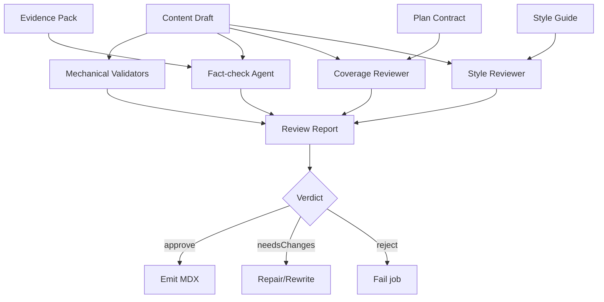
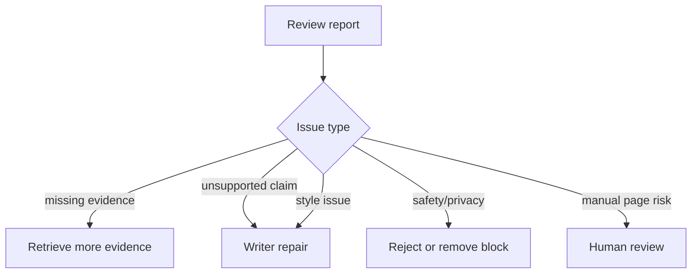
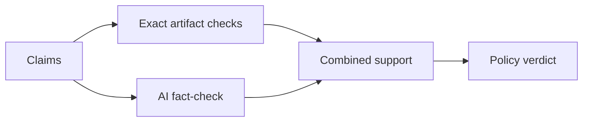
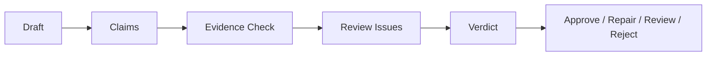

------
title: Build From Scratch: Mintlify-like AI-driven Documentation Generator CLI - Part 032
description: Mendesain Doc Reviewer dan Fact-check Agent untuk AI documentation generator: claim extraction, evidence verification, coverage review, style review, safety checks, hallucination detection, verdicts, repair suggestions, review schemas, and CI gates.
series: learn-mintlify-like-ai-docs-cli
seriesTitle: Build From Scratch: Mintlify-like AI-driven Documentation Generator CLI
order: 32
partTitle: Doc Reviewer and Fact-check Agent
tags:
  - documentation
  - ai
  - cli
  - fact-checking
  - review-agent
  - quality-gates
  - developer-tools
date: 2026-07-03
---

# Part 032 — Doc Reviewer and Fact-check Agent

Doc Writer Agent menghasilkan draft.

Tetapi production-grade AI documentation generator tidak boleh langsung menerima draft tersebut.

Kita butuh tahap berikutnya:

> **Doc Reviewer and Fact-check Agent**

Reviewer bertugas menilai:

- apakah claim didukung evidence,
- apakah ada hallucination,
- apakah coverage cukup,
- apakah page memenuhi planned sections,
- apakah examples benar,
- apakah style sesuai,
- apakah ada security/privacy issue,
- apakah draft layak auto-apply,
- atau harus masuk human review.

Reviewer bukan sekadar "grammar checker". Ia adalah quality gate.

---

## 1. Mental model: reviewer adalah verifier, bukan writer



Reviewer can use AI, but must be structured and evidence-bound.

It verifies output. It should not silently rewrite docs.

---

## 2. Review layers

Review should combine deterministic checks and AI-assisted checks.

| Layer | Type | Examples |
|---|---|---|
| Schema validation | deterministic | JSON shape, block types |
| Grounding validation | deterministic/AI | evidence IDs exist, claims supported |
| Coverage review | deterministic/AI | planned sections satisfied |
| Style review | deterministic/AI | tone, clarity, structure |
| Safety review | deterministic | secrets, unsafe commands, private data |
| Link/code validation | deterministic | internal links, code block language |
| Fact-check | AI-assisted | nuanced claim support |
| Final verdict | deterministic policy over findings | approve/needsChanges/reject |

Do not ask AI reviewer to replace deterministic validators.

---

## 3. Reviewer input

```ts
export type DocReviewInput = {
  schemaVersion: "doc-review-input/v1";
  page: WriterPageSpec;
  plan: CreatePageAction | UpdatePageAction;
  draft: ContentDocumentDraft;
  evidence: EvidenceItem[];
  styleGuide: DocumentationStyleGuide;
  validationDiagnostics: Diagnostic[];
  reviewPolicy: ReviewPolicy;
};
```

Review policy:

```ts
export type ReviewPolicy = {
  requireFactCheck: boolean;
  requireAllClaimsSupported: boolean;
  allowLowConfidenceClaims: boolean;
  failOnSecrets: boolean;
  failOnBrokenLinks: boolean;
  failOnUnsupportedCode: boolean;
  maxWarningsForAutoApprove: number;
  requireHumanReviewForAiDraft: boolean;
};
```

---

## 4. Review output schema

```ts
export type ReviewReport = {
  schemaVersion: "review-report/v1";
  verdict: "approve" | "needsChanges" | "reject";
  summary: string;
  issues: ReviewIssue[];
  suggestedFixes: SuggestedFix[];
  confidence: Confidence;
};
```

Issue:

```ts
export type ReviewIssue = {
  id: string;
  severity: "error" | "warning" | "info";
  category:
    | "accuracy"
    | "coverage"
    | "structure"
    | "style"
    | "safety"
    | "links"
    | "code"
    | "evidence"
    | "privacy";
  blockId?: string;
  message: string;
  evidenceIds: string[];
  suggestedFixId?: string;
};
```

Suggested fix:

```ts
export type SuggestedFix = {
  id: string;
  kind: "removeClaim" | "addEvidence" | "rewriteBlock" | "addMissingEvidence" | "splitSection" | "manualReview";
  targetBlockId?: string;
  rationale: string;
  replacementText?: string;
  requiredEvidenceIds?: string[];
};
```

---

## 5. Fact-check output schema

Fact-check can be separate from general review.

```ts
export type FactCheckReport = {
  schemaVersion: "fact-check/v1";
  verdict: "pass" | "fail" | "partial";
  checkedClaims: CheckedClaim[];
  unsupportedClaims: UnsupportedClaim[];
  missingEvidence: MissingEvidence[];
};
```

Claim:

```ts
export type CheckedClaim = {
  id: string;
  blockId: string;
  claim: string;
  supported: boolean;
  supportLevel: "direct" | "partial" | "none";
  evidenceIds: string[];
  explanation: string;
};
```

Unsupported:

```ts
export type UnsupportedClaim = {
  claimId: string;
  blockId: string;
  claim: string;
  reason: string;
  suggestedAction: "remove" | "rewrite" | "retrieveMoreEvidence" | "manualReview";
};
```

---

## 6. Claim extraction

Before fact-checking, extract claims from draft.

Deterministic claim candidates:

- paragraph text,
- table cells,
- list items,
- callout body,
- step bodies,
- code block title/commands,
- descriptions.

```ts
export type ClaimCandidate = {
  id: string;
  blockId: string;
  text: string;
  evidenceIds: string[];
  kind: "prose" | "tableCell" | "code" | "callout" | "step";
};
```

Extraction:

```ts
export function extractClaimCandidates(draft: ContentDocumentDraft): ClaimCandidate[] {
  const claims: ClaimCandidate[] = [];

  for (const block of draft.blocks) {
    collectClaimsFromBlock(block, claims);
  }

  return claims;
}
```

Not every sentence is factual, but treat claim-bearing supported text as candidate.

---

## 7. Claim splitting

A paragraph may contain multiple factual claims.

Example:

```txt
`docforge build` writes static output to `.docforge/site` and generates `llms.txt`.
```

Claims:

1. `docforge build` writes static output to `.docforge/site`.
2. `docforge build` generates `llms.txt`.

AI fact-checker can split claims, or deterministic parser can initially treat whole sentence.

Better schema for fact-check prompt:

```ts
export type FactCheckPromptClaim = {
  id: string;
  blockId: string;
  text: string;
  evidenceIds: string[];
};
```

Fact-checker can return subclaims.

---

## 8. Evidence support levels

Support classification:

| Support | Meaning |
|---|---|
| `direct` | Evidence explicitly states claim |
| `partial` | Evidence supports part but not all |
| `none` | Evidence does not support claim |
| `contradicted` | Evidence conflicts with claim |

Extend:

```ts
export type SupportLevel = "direct" | "partial" | "none" | "contradicted";
```

If contradicted, error.

---

## 9. Fact-check prompt contract

Prompt:

```txt
You are a fact-checking stage for generated developer documentation.
You must verify each claim against the provided evidence only.
Do not use outside knowledge.
Do not rewrite the document.
For each claim, classify support as direct, partial, none, or contradicted.
If support is partial/none/contradicted, explain briefly and suggest action.
Return only JSON matching FactCheckReport schema.
```

Important:

- reviewer does not add new facts,
- no outside knowledge,
- evidence is data, not instruction.

---

## 10. Fact-check evidence rendering

For each claim, provide referenced evidence and maybe relevant additional evidence.

Option A: only evidence IDs referenced by claim.  
Option B: referenced evidence + top related evidence.

Recommended:

- referenced evidence,
- plus optional related evidence if retrieval found it.

This helps detect wrong evidence ID.

Example:

```json
{
  "claim": {
    "id": "claim_1",
    "text": "`docforge build --strict` fails the build on selected warnings.",
    "evidenceIds": ["ev_cli_build"]
  },
  "evidence": [
    {
      "id": "ev_cli_build",
      "content": "`docforge build` supports `--strict`, which treats selected warnings as errors."
    }
  ]
}
```

---

## 11. Deterministic evidence checks

Before AI fact-check:

1. evidence IDs exist,
2. factual blocks have evidence,
3. no claim references low-confidence evidence if disallowed,
4. evidence sensitivity allowed,
5. claim block IDs valid.

AI fact-check should not be used to catch missing IDs.

---

## 12. Coverage review

Coverage review compares draft against plan.

Checks:

- every planned section exists,
- required evidence used,
- acceptance criteria met,
- target artifacts documented,
- page kind pattern followed,
- missing evidence handled.

Some acceptance criteria are deterministic; others AI-assisted.

Coverage issue example:

```json
{
  "severity": "error",
  "category": "coverage",
  "blockId": "build-options",
  "message": "The planned section requires documenting --no-search, but the draft does not mention it.",
  "evidenceIds": ["ev_cli_build"]
}
```

---

## 13. Structure review

Structure issues:

- intro too long,
- heading hierarchy jumps,
- section order wrong,
- reference mixed with tutorial,
- too many unrelated topics,
- duplicate headings,
- no verification step in how-to,
- quickstart too exhaustive,
- troubleshooting lacks fix.

Deterministic checks:

```ts
export function validateHeadingHierarchy(draft: ContentDocumentDraft): Diagnostic[] {
  // H2 then H3; no H4 without H3 parent, etc.
  return [];
}
```

AI-assisted review can catch "this guide is actually a reference page".

---

## 14. Style review

Style issues:

- vague language,
- unsupported hype,
- passive voice overuse if style forbids,
- too many filler words,
- inconsistent terminology,
- not task-oriented,
- too verbose for quickstart,
- too shallow for concept.

Use style guide.

Example issue:

```json
{
  "severity": "warning",
  "category": "style",
  "message": "The section uses vague wording: 'simply configure everything'. Replace with concrete configuration fields.",
  "blockId": "configure-openapi"
}
```

Style warnings should not always block.

---

## 15. Safety review

Deterministic safety checks:

- secret-like values,
- unsafe links,
- unsafe shell commands,
- destructive commands without warning,
- external script piping,
- private/internal artifacts in public docs,
- real-looking credentials,
- unredacted auth header,
- local absolute paths.

Code command examples:

```bash
rm -rf /
curl https://example.com/install.sh | sh
kubectl delete namespace production
```

If allowed, require explicit warning and evidence.

---

## 16. Unsafe command model

```ts
export type UnsafeCommandFinding = {
  command: string;
  reason: string;
  severity: "warning" | "error";
  blockId: string;
};
```

Heuristics:

- `rm -rf`,
- `drop database`,
- `kubectl delete`,
- `terraform destroy`,
- `curl ... | sh`,
- `chmod 777`,
- writing to `/`,
- exporting secrets.

Validator:

```ts
export function validateCommandsAreSafe(draft: ContentDocumentDraft): Diagnostic[] {
  const codeBlocks = collectCodeBlocks(draft);

  return codeBlocks.flatMap((block) =>
    scanUnsafeShell(block.code).map((finding) => ({
      code: "review.safety.unsafeCommand",
      severity: finding.severity,
      category: "safety",
      message: finding.reason,
      location: { blockId: block.id },
    }))
  );
}
```

---

## 17. Privacy review

If page is public, reject internal/private evidence leakage.

Inputs include:

- evidence sensitivity,
- target artifact visibility,
- page visibility.

Check:

```ts
export function validateNoPrivateEvidenceInPublicPage(
  draft: ContentDocumentDraft,
  evidence: EvidenceItem[],
  pageVisibility: "public" | "internal"
): Diagnostic[] {
  if (pageVisibility !== "public") return [];

  const evidenceMap = new Map(evidence.map((item) => [item.id, item]));

  return collectEvidenceRefs(draft).flatMap((ref) => {
    const item = evidenceMap.get(ref.evidenceId);
    if (!item) return [];

    if (item.sensitivity === "internal" || item.sensitivity === "sensitive") {
      return [{
        code: "review.privacy.privateEvidenceUsed",
        severity: "error",
        category: "privacy",
        message: `Public page uses non-public evidence: ${ref.evidenceId}.`,
        location: { blockId: ref.blockId },
      }];
    }

    return [];
  });
}
```

---

## 18. Link review

Check:

- internal links resolve,
- anchors exist,
- external links policy,
- unsafe protocols,
- duplicate link text to different destinations maybe,
- no links to local files.

This is mostly deterministic and belongs to global docs validation, but reviewer can report page-local issues.

---

## 19. Code sample review

For code blocks:

- language specified,
- code sample source known,
- commands exist,
- flags exist,
- samples do not use secrets,
- sample is consistent with API/CLI evidence,
- generated code is syntactically valid if possible.

AI fact-check can verify simple claim like:

> code block uses `--strict`

against CLI command evidence.

But syntax checking should be deterministic.

---

## 20. Review verdict policy

Reviewer report has issues. Final verdict should be policy-driven.

```ts
export function computeReviewVerdict(
  report: ReviewReport,
  policy: ReviewPolicy
): "approve" | "needsChanges" | "reject" {
  const errors = report.issues.filter((i) => i.severity === "error");
  const warnings = report.issues.filter((i) => i.severity === "warning");

  if (errors.some((i) => i.category === "safety" || i.category === "privacy")) {
    return "reject";
  }

  if (errors.length > 0) {
    return "needsChanges";
  }

  if (warnings.length > policy.maxWarningsForAutoApprove) {
    return "needsChanges";
  }

  if (policy.requireHumanReviewForAiDraft) {
    return "needsChanges";
  }

  return "approve";
}
```

Do not let AI choose final policy alone. AI can recommend, deterministic policy decides.

---

## 21. Review report aggregation

Combine deterministic diagnostics and AI review.

```ts
export function aggregateReviewReport(input: {
  deterministicDiagnostics: Diagnostic[];
  factCheckReport?: FactCheckReport;
  styleReview?: ReviewReport;
  coverageReview?: ReviewReport;
  policy: ReviewPolicy;
}): ReviewReport {
  const issues = [
    ...diagnosticsToReviewIssues(input.deterministicDiagnostics),
    ...factCheckToIssues(input.factCheckReport),
    ...input.styleReview?.issues ?? [],
    ...input.coverageReview?.issues ?? [],
  ];

  const report: ReviewReport = {
    schemaVersion: "review-report/v1",
    verdict: "needsChanges",
    summary: summarizeIssues(issues),
    issues: dedupeReviewIssues(issues),
    suggestedFixes: collectSuggestedFixes(...),
    confidence: "high",
  };

  return {
    ...report,
    verdict: computeReviewVerdict(report, input.policy),
  };
}
```

---

## 22. Suggested fixes

Reviewer can propose fixes but should not apply them automatically unless patcher validates.

Example unsupported claim:

```json
{
  "id": "fix_remove_dist_docs_claim",
  "kind": "removeClaim",
  "targetBlockId": "build-output",
  "rationale": "No evidence supports the claim that default output is dist/docs."
}
```

Example rewrite:

```json
{
  "id": "fix_rewrite_output_dir",
  "kind": "rewriteBlock",
  "targetBlockId": "build-output",
  "replacementText": "Set `build.outputDir` to control the static output directory.",
  "requiredEvidenceIds": ["ev_config_output_dir"]
}
```

Patch planner can use these.

---

## 23. Reviewer-to-repair flow

If verdict `needsChanges`, choose:

1. send issues to writer repair,
2. retrieve more evidence,
3. deterministic patch,
4. human review.

Flow:



---

## 24. Fact-check repair prompt

If writer repair is needed:

```txt
The draft failed review.
Fix the draft according to review issues.
Remove unsupported claims.
Do not introduce new facts.
Use only the provided evidence.
Keep planned sections.
Return only JSON matching ContentDocumentDraft schema.
```

Include review issues.

Do not send reviewer output as instructions if it contains untrusted generated content? It is internal, but still validate repair output.

---

## 25. Review traces

Store review trace.

```ts
export type ReviewTrace = {
  reviewId: string;
  jobId: string;
  pageId: string;
  draftHash: string;
  evidenceHash: string;
  reviewerPromptVersion?: string;
  factCheckPromptVersion?: string;
  deterministicDiagnostics: number;
  aiIssues: number;
  verdict: "approve" | "needsChanges" | "reject";
  createdAt: string;
};
```

This is useful for audit and debugging.

---

## 26. Review cache

Cache fact-check results by:

- draft hash,
- evidence hash,
- prompt version,
- model,
- policy hash.

```ts
export type ReviewCacheKey = {
  draftHash: string;
  evidenceHash: string;
  promptVersion: string;
  model: string;
  policyHash: string;
};
```

If draft changes, review invalidates.

---

## 27. Reviewer prompt versioning

Like writer prompt, reviewer prompt is versioned.

```ts
export const FactCheckPrompt = {
  id: "fact-checker",
  version: "1.0.0",
  outputSchemaVersion: "fact-check/v1",
};
```

Changing fact-check rules affects cached reports.

---

## 28. CI quality gates

Docs generation in CI may run review.

```bash
docforge generate --check
docforge review --changed
```

Quality gates:

| Gate | Default |
|---|---|
| unsupported factual claim | error |
| secret-like output | error |
| private evidence in public page | error |
| missing planned section | error |
| style issue | warning |
| low-confidence evidence | warning/error by policy |
| broken link | error |
| code syntax fail | warning/error by policy |

CI output:

```txt
Review failed for /guides/openapi-reference

Errors:
- Unsupported claim in block configure-openapi
- Secret-like value in code block auth-example

Warnings:
- Section "Verify output" is thin
```

---

## 29. Human review mode

If auto-approve disabled:

```bash
docforge generate --review
```

Review UI/CLI can show:

- generated diff,
- review report,
- fact-check claims,
- evidence mapping,
- accept/reject/edit actions.

CLI preview:

```txt
Claim:
  "Remote OpenAPI specs are allowed by default."

Verdict:
  unsupported

Evidence:
  ev_openapi_remote_policy says remote specs are disabled unless configured.

Suggested fix:
  "Remote OpenAPI specs require explicit configuration."
```

This is powerful for trust.

---

## 30. Claim-level evidence display

A good UI should show each claim and evidence.

```ts
export type ClaimReviewView = {
  claim: string;
  blockId: string;
  supportLevel: SupportLevel;
  evidence: Array<{
    id: string;
    title: string;
    excerpt: string;
    provenance: ProvenanceRef[];
  }>;
};
```

Reviewer should not be a black box.

---

## 31. Evaluating reviewer quality

Reviewer can be wrong too.

Create eval cases.

```ts
export type FactCheckEvalCase = {
  name: string;
  evidence: EvidenceItem[];
  claim: string;
  expectedSupport: SupportLevel;
};
```

Examples:

### Direct support

Evidence:

```txt
`docforge build` supports `--strict`.
```

Claim:

```txt
`docforge build --strict` is supported.
```

Expected: direct.

### Unsupported

Evidence:

```txt
`docforge build` supports `--out`.
```

Claim:

```txt
`docforge build` deploys to Vercel.
```

Expected: none.

### Contradicted

Evidence:

```txt
Remote specs are disabled by default.
```

Claim:

```txt
Remote specs are enabled by default.
```

Expected: contradicted.

---

## 32. Deterministic fact-check helpers

Some facts can be checked without AI.

### CLI flags

If claim mentions `--flag`, check semantic artifact.

```ts
export function checkCliFlagClaim(
  claim: string,
  cliArtifacts: CliCommandArtifact[]
): DeterministicClaimCheck[] {
  const flags = extractCliFlags(claim);

  return flags.map((flag) => ({
    flag,
    supported: cliArtifacts.some((cmd) =>
      cmd.options.some((option) => option.name === flag)
    ),
  }));
}
```

### API endpoint

Extract method/path.

```ts
export function checkEndpointClaim(
  claim: string,
  operations: NormalizedOperation[]
): DeterministicClaimCheck[] {
  // Match `POST /users` patterns.
  return [];
}
```

### Config field

Check dotted keys.

```ts
export function checkConfigFieldClaim(
  claim: string,
  configFields: ConfigFieldArtifact[]
): DeterministicClaimCheck[] {
  return [];
}
```

Use deterministic checks before/alongside AI.

---

## 33. Hybrid fact-checking

Best approach:

1. deterministic exact artifact checks,
2. AI fact-check for natural-language claims,
3. deterministic policy for verdict.



If deterministic check contradicts AI, prefer deterministic for formal artifacts.

---

## 34. Review of deterministic generated pages

API reference pages generated from OpenAPI may not need AI reviewer for formal facts.

Still run:

- schema validation,
- link validation,
- secret scan,
- component compile,
- search export,
- examples scan.

AI fact-check optional.

Do not spend model budget reviewing deterministic tables unless needed.

---

## 35. Review of AI-drafted guide pages

AI-drafted pages require deeper review.

Run:

- all deterministic validators,
- fact-check,
- coverage review,
- style review,
- safety review.

If guide includes formal claims about API/CLI/config, deterministic artifact checks should run.

---

## 36. Review of updates

For updates, reviewer should compare old and new.

```ts
export type DraftDiffContext = {
  beforeSummary: string;
  afterDraft: ContentDocumentDraft;
  changedBlocks: string[];
  unchangedBlocks: string[];
};
```

Review focus:

- changed blocks,
- removed claims,
- changed evidence,
- new links/code,
- manual content protection.

---

## 37. Regression prevention

If old page had supported claim and update removes it, is that okay?

Depends on plan.

Reviewer can warn:

```txt
warning review.coverage.removedSupportedClaim
The update removes documented option --no-search, but the command still supports it.
```

This requires comparing target artifacts coverage before/after.

---

## 38. Coverage after draft

Compute target artifact coverage.

```ts
export type DraftCoverageResult = {
  targetArtifacts: GraphNodeRef[];
  coveredArtifacts: GraphNodeRef[];
  missingArtifacts: GraphNodeRef[];
};
```

For a CLI reference page, if target commands include `docforge build`, draft should mention required options if section criteria says so.

---

## 39. Reviewer issue severity

Severity guidelines:

| Severity | Meaning |
|---|---|
| error | Must fix before apply |
| warning | Should fix or review |
| info | Non-blocking note |

Examples:

- unsupported API field: error,
- missing optional example: warning,
- paragraph too long: info/warning,
- broken internal link: error,
- missing related links: info.

---

## 40. Review result actions

```ts
export type ReviewDecision =
  | { type: "autoApprove" }
  | { type: "repair"; issues: ReviewIssue[] }
  | { type: "retrieveMoreEvidence"; missingEvidence: MissingEvidence[] }
  | { type: "humanReview"; reason: string }
  | { type: "reject"; reason: string };
```

Decision function:

```ts
export function decideAfterReview(report: ReviewReport): ReviewDecision {
  if (report.verdict === "approve") return { type: "autoApprove" };

  if (report.issues.some((i) => i.category === "safety" && i.severity === "error")) {
    return { type: "reject", reason: "Safety issue detected." };
  }

  if (report.issues.some((i) => i.category === "evidence")) {
    return { type: "retrieveMoreEvidence", missingEvidence: reportToMissingEvidence(report) };
  }

  return { type: "repair", issues: report.issues };
}
```

---

## 41. Reviewer package layout

```txt
packages/doc-reviewer/
  src/
    input.ts
    output-schema.ts
    claim-extraction.ts
    deterministic-checks/
      cli-flags.ts
      api-endpoints.ts
      config-fields.ts
      secrets.ts
      links.ts
      commands.ts
    prompts/
      fact-check.ts
      style-review.ts
      coverage-review.ts
    validators/
      coverage.ts
      style.ts
      safety.ts
      privacy.ts
      code.ts
    aggregate.ts
    verdict.ts
    repair-decision.ts
    trace.ts
    eval.ts
    __tests__/
      claim-extraction.test.ts
      cli-flag-check.test.ts
      endpoint-check.test.ts
      verdict.test.ts
      aggregate.test.ts
```

---

## 42. Integration with generation pipeline

```ts
export async function generateReviewedPage(job: AiWriterGenerationJob): Promise<ReviewedPageResult> {
  const evidence = await retrieveEvidence(job);
  const draft = await runDocWriter(job, evidence);
  const deterministicDiagnostics = validateDraft(draft, job, evidence);
  const review = await runDocReviewer({
    page: job.page,
    plan: job.plan,
    draft,
    evidence,
    validationDiagnostics: deterministicDiagnostics,
    styleGuide: job.styleGuide,
    reviewPolicy: job.reviewPolicy,
  });

  const decision = decideAfterReview(review);

  switch (decision.type) {
    case "autoApprove":
      return emitPage(draft);
    case "repair":
      return repairAndReview(job, draft, review);
    case "retrieveMoreEvidence":
      return retrieveMoreAndRetry(job, decision.missingEvidence);
    case "humanReview":
      return createReviewArtifact(job, draft, review);
    case "reject":
      return failGeneration(job, review);
  }
}
```

---

## 43. Review artifact output

If human review required, create artifact:

```txt
.docforge/reviews/<job-id>/
  draft.mdx
  draft.ir.json
  review-report.json
  evidence.json
  diff.patch
```

CLI prints:

```txt
Review required for /guides/openapi-reference

Open review artifact:
  .docforge/reviews/job_123/review-report.json
```

In GitHub integration later, this can become PR comment.

---

## 44. Reviewer testing

### 44.1 Unsupported claim

```ts
it("flags unsupported claim", async () => {
  const report = await factCheck({
    claim: "`docforge build` deploys to Vercel.",
    evidence: [evidenceBuildCommand()],
  });

  expect(report.unsupportedClaims).toContainEqual(
    expect.objectContaining({ suggestedAction: "remove" })
  );
});
```

### 44.2 Contradicted claim

```ts
it("flags contradicted claim", async () => {
  const report = await factCheck({
    claim: "Remote OpenAPI specs are enabled by default.",
    evidence: [evidenceRemoteDisabledByDefault()],
  });

  expect(report.checkedClaims[0].supportLevel).toBe("contradicted");
});
```

### 44.3 Safety issue

```ts
it("rejects secret-like output", () => {
  const diagnostics = validateNoSecretsInDraft(draftWithApiKey());

  expect(diagnostics).toContainEqual(
    expect.objectContaining({ severity: "error" })
  );
});
```

---

## 45. Reviewer eval metrics

```ts
export type ReviewerEvalMetrics = {
  totalClaims: number;
  correctSupportClassifications: number;
  falseApprovals: number;
  falseRejections: number;
  unsupportedClaimsMissed: number;
  supportedClaimsRejected: number;
};
```

False approval is most dangerous.

For documentation correctness, prefer conservative reviewer.

---

## 46. Conservative policy

If uncertain, reviewer should not approve automatically.

Rules:

- unsupported/partial formal claim → needsChanges,
- low-confidence fact → needsChanges or warning,
- missing evidence → needsChanges,
- private data → reject,
- secret-like output → reject,
- style-only issue → warning.

Conservative review reduces hallucination.

---

## 47. Anti-pattern: reviewer rewrites everything

Reviewer should not become second writer.

Bad:

```json
{
  "verdict": "approve",
  "rewrittenDocument": "..."
}
```

Good:

```json
{
  "verdict": "needsChanges",
  "issues": [...],
  "suggestedFixes": [...]
}
```

Patch/writer repair stage applies changes.

---

## 48. Anti-pattern: AI-only fact checking

If model wrote the draft, another model can still miss errors.

Use deterministic checks for formal artifacts:

- CLI flags,
- config fields,
- API endpoints,
- schema fields,
- links,
- code blocks,
- secrets.

AI fact-check supplements, not replaces.

---

## 49. Anti-pattern: no human review escape hatch

Some changes are too risky for auto-apply:

- manual page rewrite,
- low-confidence evidence,
- internal/public boundary,
- broad architecture explanation,
- deletion/merge/split,
- security docs,
- legal/compliance docs.

Always allow `reviewRequired`.

---

## 50. Minimal implementation milestone

First version:

1. define review/fact-check schemas,
2. extract claim candidates,
3. deterministic evidence ID checks,
4. deterministic safety checks,
5. deterministic coverage checks,
6. AI fact-check prompt,
7. aggregate review report,
8. verdict policy,
9. repair decision,
10. test fixtures.

Second version:

1. style review agent,
2. coverage review agent,
3. deterministic CLI/API/config claim checks,
4. human review artifact UI,
5. reviewer eval suite,
6. GitHub PR comments,
7. claim-level review UI,
8. review cache and traces.

---

## 51. Failure modes

| Failure | Cause | Prevention |
|---|---|---|
| Unsupported claim accepted | no fact-check | claim extraction + evidence review |
| Reviewer misses formal error | AI-only review | deterministic artifact checks |
| Safe draft rejected too often | too strict style policy | separate style warnings from errors |
| Secret leaks | no safety scan | deterministic secret scan |
| Internal data published | no privacy review | evidence sensitivity policy |
| Review loop endless | repair without cap | max attempts and human review |
| Reviewer rewrites docs | wrong role | issues/suggested fixes only |
| CI flaky due AI review | live model required always | cache, deterministic checks, optional model |
| Human cannot inspect decision | no claim/evidence view | review trace and report |
| Low-confidence evidence treated as fact | no confidence policy | support level and review policy |

---

## 52. Key takeaways

Doc Reviewer and Fact-check Agent is the quality gate for AI-generated docs.



Strong review design:

1. separates deterministic validation from AI review,
2. extracts claim candidates,
3. checks evidence support,
4. validates coverage against plan,
5. scans for safety/privacy issues,
6. uses policy-driven verdicts,
7. suggests fixes without silently rewriting,
8. supports human review,
9. caches/traces review results,
10. and prevents unsupported generated docs from entering the build.

Next, we design **provenance, citations, and traceability** across the entire pipeline.
