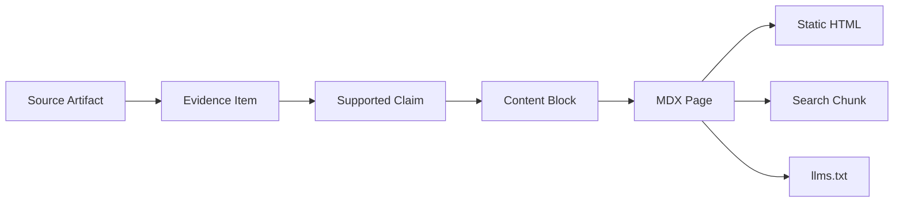
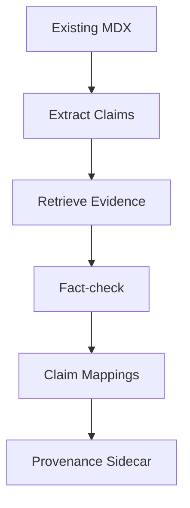
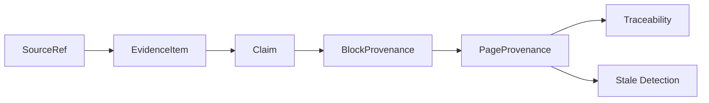

------
title: Build From Scratch: Mintlify-like AI-driven Documentation Generator CLI - Part 033
description: Mendesain provenance, citations, dan traceability untuk AI-driven documentation generator: source refs, evidence refs, claim mapping, generated block metadata, citations UI, trace store, review audit, stale detection, and trust model.
series: learn-mintlify-like-ai-docs-cli
seriesTitle: Build From Scratch: Mintlify-like AI-driven Documentation Generator CLI
order: 33
partTitle: Provenance, Citations, and Traceability
tags:
  - documentation
  - ai
  - cli
  - provenance
  - citations
  - traceability
  - developer-tools
date: 2026-07-03
---

# Part 033 — Provenance, Citations, and Traceability

Pada Part 031 dan 032, kita membangun writer dan reviewer agent yang berbasis evidence.

Sekarang kita mendesain layer yang membuat seluruh pipeline bisa dipercaya:

> **provenance, citations, and traceability**

Tanpa provenance, AI-generated docs hanya menjadi teks yang terlihat meyakinkan.

Dengan provenance, setiap claim penting bisa dijawab:

- berasal dari file mana?
- dari line berapa?
- dari OpenAPI pointer mana?
- dari config schema field mana?
- dari test mana?
- dari command artifact mana?
- kapan terakhir diverifikasi?
- hash sumbernya apa?
- apakah sumbernya berubah sejak docs dibuat?
- siapa/apa yang menghasilkan block ini?
- apakah block ini aman untuk auto-update?

Provenance adalah pembeda antara "AI wrote docs" dan "AI-assisted documentation compiler".

---

## 1. Mental model: provenance adalah supply chain untuk knowledge

Dalam software build, kita peduli pada artifact lineage:

```txt
source -> compile -> bundle -> deploy
```

Dalam docs generator, kita perlu lineage untuk knowledge:

```txt
source fact -> evidence item -> generated claim -> content block -> MDX page -> static HTML/search/llms.txt
```

Diagram:



Traceability berarti kita bisa bergerak dua arah:

- forward: source berubah → docs apa terdampak?
- backward: docs claim → source mana yang mendukung?

---

## 2. Why provenance is non-negotiable

AI docs generator tanpa provenance akan gagal di enterprise/prod.

Masalah tanpa provenance:

| Problem | Consequence |
|---|---|
| Claim tidak bisa dicek | Reviewer harus percaya model |
| Source berubah | Docs stale tidak terdeteksi |
| AI hallucination | Sulit dibuktikan/diisolasi |
| Manual edit bercampur generated | Update bisa overwrite human work |
| API docs generated dari spec lama | User copy request salah |
| Code sample tidak tahu asal | Sample sulit diverifikasi |
| Audit/security review sulit | Tidak ada lineage |
| Search/llms export tidak traceable | Agent memakai fakta tanpa sumber |

Provenance bukan fitur nice-to-have. Ia adalah trust foundation.

---

## 3. Provenance vocabulary

Kita gunakan beberapa istilah.

| Term | Meaning |
|---|---|
| Source artifact | File/source object asli: code, OpenAPI, schema, docs, test |
| Source ref | Pointer presisi ke bagian source |
| Evidence item | Curated context yang dikirim ke AI/generator |
| Claim | Pernyataan faktual dalam docs |
| Block provenance | Source refs yang mendukung content block |
| Page provenance | Gabungan provenance semua block/page |
| Trace | Metadata proses generation/review/build |
| Citation | User-facing reference ke source/evidence |
| Stale marker | Indikasi source hash berubah sejak docs dibuat |

---

## 4. Source artifact identity

Dari Part 018/022:

```ts
export type SourceArtifact = {
  id: ArtifactId;
  path: string;
  kind: SourceArtifactKind;
  language?: LanguageId;
  hash: string;
  sizeBytes: number;
  generated: boolean;
  vendored: boolean;
  sensitive: SensitivityLevel;
};
```

Artifact identity initially path-based:

```txt
artifact:<sha256(normalized-project-relative-path)>
```

Hash is content-based:

```txt
sha256(file bytes)
```

Traceability needs both:

- path ID for stable references,
- content hash for stale detection.

---

## 5. SourceRef model

`SourceRef` points to a precise source location.

```ts
export type SourceRef = {
  artifactId: ArtifactId;
  path: string;
  kind: SourceRefKind;
  range?: SourceRange;
  selector?: string;
  hash: string;
  label?: string;
};

export type SourceRefKind =
  | "file"
  | "lineRange"
  | "symbol"
  | "openapiOperation"
  | "openapiSchema"
  | "jsonPointer"
  | "configField"
  | "cliCommand"
  | "test"
  | "example"
  | "generatedArtifact";

export type SourceRange = {
  startLine: number;
  startColumn?: number;
  endLine: number;
  endColumn?: number;
};
```

Examples:

### Code symbol

```json
{
  "artifactId": "artifact:src-commands-build",
  "path": "src/commands/build.ts",
  "kind": "symbol",
  "selector": "src/commands/build.ts#buildCommand",
  "range": { "startLine": 12, "endLine": 48 },
  "hash": "sha256:abc..."
}
```

### OpenAPI operation

```json
{
  "artifactId": "artifact:openapi-public",
  "path": "openapi/public.yaml",
  "kind": "openapiOperation",
  "selector": "#/paths/~1users/post",
  "hash": "sha256:def..."
}
```

### Config field

```json
{
  "artifactId": "artifact:config-schema",
  "path": "src/config/schema.ts",
  "kind": "configField",
  "selector": "build.outputDir",
  "range": { "startLine": 32, "endLine": 39 },
  "hash": "sha256:ghi..."
}
```

---

## 6. Selector design

Selector should be stable and human/debug friendly.

Selector examples:

| Source | Selector |
|---|---|
| OpenAPI operation | `#/paths/~1users/post` |
| JSON Schema field | `#/properties/build/properties/outputDir` |
| TypeScript symbol | `src/build.ts#buildSite` |
| Java symbol | `com.acme.UserResource.createUser` |
| CLI command | `cli:docforge build` |
| Config field | `config:build.outputDir` |
| Test | `test:build command fails on invalid MDX` |
| MDX heading | `docs/quickstart.mdx#install` |

Selectors do not replace line ranges. Use both if possible.

---

## 7. EvidenceItem model

Evidence is what AI/generator receives.

```ts
export type EvidenceItem = {
  id: EvidenceId;
  kind: EvidenceKind;
  title: string;
  content: string;
  sourceRefs: SourceRef[];
  confidence: Confidence;
  sensitivity: SensitivityLevel;
  freshness: EvidenceFreshness;
  metadata?: Record<string, unknown>;
};

export type EvidenceKind =
  | "openapiOperation"
  | "openapiSchema"
  | "cliCommand"
  | "configField"
  | "codeSymbol"
  | "test"
  | "example"
  | "existingDoc"
  | "diagnostic"
  | "searchChunk"
  | "manualNote";

export type EvidenceFreshness = {
  sourceHash: string;
  indexedAt: string;
  stale: boolean;
};
```

Evidence ID is stable within job:

```txt
ev_cli_build
ev_config_build_output_dir
ev_openapi_create_user
```

Could include hash for global uniqueness, but prompt readability matters.

---

## 8. Evidence pack provenance

An evidence pack is a set of evidence items plus selection trace.

```ts
export type EvidencePack = {
  id: string;
  objective: string;
  items: EvidenceItem[];
  retrievalTrace: RetrievalTrace;
  createdAt: string;
};

export type RetrievalTrace = {
  query: string;
  seeds: RetrievalSeed[];
  stages: RetrievalStageTrace[];
  filtersApplied: string[];
  tokenBudget: number;
};

export type RetrievalStageTrace = {
  stage: "exact" | "keyword" | "semantic" | "graph" | "rerank" | "compression";
  inputCount: number;
  outputCount: number;
  notes?: string[];
};
```

Trace answers:

> Why did this evidence get selected?

This is useful when writer hallucinates due to poor retrieval.

---

## 9. Claim model

A claim is a factual assertion in docs.

```ts
export type Claim = {
  id: ClaimId;
  blockId: string;
  text: string;
  evidenceIds: EvidenceId[];
  sourceRefs: SourceRef[];
  supportStatus: ClaimSupportStatus;
  confidence: Confidence;
};

export type ClaimSupportStatus =
  | "supported"
  | "partiallySupported"
  | "unsupported"
  | "contradicted"
  | "notChecked";
```

Claims can be extracted from draft blocks.

Stored claim mapping helps:

- review,
- trace UI,
- stale detection,
- coverage,
- fact-check eval.

---

## 10. Block provenance

Every content block should know source refs.

```ts
export type BlockProvenance = {
  blockId: string;
  generatedBy: GenerationSource;
  evidenceIds: EvidenceId[];
  sourceRefs: SourceRef[];
  claims: Claim[];
  sourceHashAggregate: string;
  lastVerifiedAt: string;
  verificationStatus: VerificationStatus;
};

export type GenerationSource =
  | { type: "human" }
  | { type: "deterministic"; generator: string; version: string }
  | { type: "ai"; jobId: string; promptContractVersion: string; model: string }
  | { type: "hybrid"; sources: GenerationSource[] };

export type VerificationStatus =
  | "verified"
  | "needsReview"
  | "stale"
  | "unverified"
  | "failed";
```

This allows block-level update, not just page-level.

---

## 11. Page provenance

```ts
export type PageProvenance = {
  pageId: PageId;
  route: RoutePath;
  sourcePath: string;
  generated: boolean;
  owner: "human" | "generated" | "hybrid";
  sourceRefs: SourceRef[];
  blockProvenance: BlockProvenance[];
  generatedAt?: string;
  lastVerifiedAt?: string;
  sourceHashAggregate: string;
  verificationStatus: VerificationStatus;
};
```

Source hash aggregate:

```ts
export function aggregateSourceHashes(sourceRefs: SourceRef[]): string {
  const hashes = sourceRefs
    .map((ref) => `${ref.path}:${ref.selector ?? ""}:${ref.hash}`)
    .sort()
    .join("\n");

  return sha256(hashes);
}
```

If aggregate changes, page may be stale.

---

## 12. Generated block metadata

When writing MDX, embed managed region metadata.

Example comment markers:

```mdx
{/* docforge:begin block id="build-options" owner="generated" hash="sha256:abc" */}
## Build options

...
{/* docforge:end block id="build-options" */}
```

But raw comment metadata can become noisy.

Alternative sidecar file:

```txt
docs/reference/cli-build.mdx
docs/reference/cli-build.mdx.docforge.json
```

Sidecar:

```json
{
  "pageId": "reference-cli-build",
  "blocks": [
    {
      "id": "build-options",
      "owner": "generated",
      "contentHash": "sha256:...",
      "sourceHashAggregate": "sha256:...",
      "evidenceIds": ["ev_cli_build"]
    }
  ]
}
```

Recommended: use sidecar for rich metadata, minimal inline markers for managed regions.

---

## 13. Inline markers vs sidecar metadata

| Approach | Pros | Cons |
|---|---|---|
| Inline markers | survives file movement, visible | noisy in docs source |
| Sidecar | clean MDX, rich metadata | can drift from source |
| Hybrid | best practical choice | more implementation |

Hybrid:

- inline markers identify managed regions,
- sidecar stores provenance details.

Inline:

```mdx
{/* docforge:begin id="build-options" */}
...
{/* docforge:end id="build-options" */}
```

Sidecar stores hash/evidence/claims.

---

## 14. Managed region model

```ts
export type ManagedRegion = {
  id: string;
  owner: "generated" | "human" | "hybrid";
  startOffset?: number;
  endOffset?: number;
  startLine?: number;
  endLine?: number;
  contentHash: string;
  sourceHashAggregate: string;
  updatePolicy: "auto" | "reviewRequired" | "manualOnly";
};
```

During update:

1. parse MDX,
2. locate managed regions,
3. verify content hash,
4. update only if owner/policy allows,
5. if human edited generated region, switch to review.

---

## 15. Human edit detection

If generated region content hash changed since last generation, user edited it.

```ts
export function detectHumanEditedRegion(
  currentContent: string,
  region: ManagedRegion
): boolean {
  return sha256(currentContent) !== region.contentHash;
}
```

Policy:

| Region | If edited |
|---|---|
| generated auto | mark conflict/review |
| hybrid | preserve human subregions |
| human | never overwrite |
| manualOnly | never overwrite |

Diagnostic:

```txt
warning provenance.region.humanEdited
Generated region "build-options" was modified manually. Automatic update requires review.
```

---

## 16. Citation model

Citations are user-facing references.

```ts
export type Citation = {
  id: string;
  label: string;
  sourceRef: SourceRef;
  displayMode: "hidden" | "inline" | "footnote" | "debug";
};
```

Not every docs site should show source code citations to public users.

Modes:

| Mode | Behavior |
|---|---|
| hidden | provenance stored but not displayed |
| debug | visible in local/dev/review mode |
| footnote | citations shown at bottom |
| inline | cite icon next to claims/sections |
| sourceLink | link to GitHub/source if allowed |

For public external docs, hidden or sourceLink may be best. For internal engineering docs, footnote/debug can be powerful.

---

## 17. Citation visibility policy

```ts
export type CitationPolicy = {
  mode: "hidden" | "debug" | "footnote" | "inline";
  exposeSourcePaths: boolean;
  exposeLineNumbers: boolean;
  exposePrivateSources: boolean;
  sourceBaseUrl?: string;
};
```

Public docs:

```json
{
  "citations": {
    "mode": "hidden",
    "exposeSourcePaths": false
  }
}
```

Internal docs:

```json
{
  "citations": {
    "mode": "debug",
    "exposeSourcePaths": true,
    "exposeLineNumbers": true,
    "sourceBaseUrl": "https://github.com/acme/project/blob/main"
  }
}
```

Never expose private/internal paths in public docs unless configured.

---

## 18. Source links

If repo base URL configured:

```ts
export function sourceUrlForRef(ref: SourceRef, policy: CitationPolicy): string | undefined {
  if (!policy.sourceBaseUrl) return undefined;
  if (!policy.exposeSourcePaths) return undefined;

  let url = `${policy.sourceBaseUrl}/${encodeURI(ref.path)}`;

  if (policy.exposeLineNumbers && ref.range) {
    url += `#L${ref.range.startLine}-L${ref.range.endLine}`;
  }

  return url;
}
```

Do not generate source URLs for sensitive evidence.

---

## 19. Citation rendering

Inline debug citation:

```mdx
<SourceCitation id="src-build-command" />
```

Footnote:

```mdx
<SourceFootnotes refs={...} />
```

But final MDX should not contain huge provenance JSON. It can reference sidecar manifest.

Component contract:

```ts
export type SourceCitationProps = {
  citationId: string;
};
```

Renderer resolves citation from page provenance.

---

## 20. Trace store

Provenance is about content. Trace is about process.

Trace types:

```ts
export type TraceRecord =
  | RetrievalTraceRecord
  | PlannerTraceRecord
  | WriterTraceRecord
  | ReviewTraceRecord
  | BuildTraceRecord
  | PatchTraceRecord;
```

Common:

```ts
export type BaseTraceRecord = {
  id: string;
  type: string;
  jobId: string;
  createdAt: string;
  toolVersion: string;
  inputHash: string;
  outputHash: string;
  diagnostics: Diagnostic[];
};
```

Store traces in knowledge store or `.docforge/traces`.

---

## 21. Generation trace

```ts
export type GenerationTrace = {
  jobId: string;
  pageId: string;
  plannerTraceId?: string;
  retrievalTraceId: string;
  writerTraceId?: string;
  reviewTraceId?: string;
  modelCalls: ModelCallTrace[];
  finalVerdict: "applied" | "reviewRequired" | "failed";
};
```

Model call trace:

```ts
export type ModelCallTrace = {
  id: string;
  provider: string;
  model: string;
  promptContractId: string;
  promptContractVersion: string;
  inputTokenEstimate?: number;
  outputTokenEstimate?: number;
  costEstimate?: number;
  promptHash: string;
  outputHash: string;
  storedPrompt?: boolean;
  storedOutput?: boolean;
};
```

Do not store full prompts if privacy policy disallows. Store hashes.

---

## 22. Provenance in knowledge store

Tables from Part 022 can be extended.

### block_provenance

```sql
CREATE TABLE block_provenance (
  id TEXT PRIMARY KEY,
  page_id TEXT NOT NULL,
  block_id TEXT NOT NULL,
  owner TEXT NOT NULL,
  generation_source_json TEXT NOT NULL,
  evidence_ids_json TEXT NOT NULL,
  source_hash_aggregate TEXT NOT NULL,
  content_hash TEXT NOT NULL,
  verification_status TEXT NOT NULL,
  last_verified_at TEXT,
  metadata_json TEXT
);

CREATE INDEX idx_block_provenance_page ON block_provenance(page_id);
CREATE INDEX idx_block_provenance_block ON block_provenance(page_id, block_id);
CREATE INDEX idx_block_provenance_status ON block_provenance(verification_status);
```

### claim_mappings

```sql
CREATE TABLE claim_mappings (
  id TEXT PRIMARY KEY,
  page_id TEXT NOT NULL,
  block_id TEXT NOT NULL,
  claim_text TEXT NOT NULL,
  support_status TEXT NOT NULL,
  confidence TEXT NOT NULL,
  evidence_ids_json TEXT NOT NULL,
  source_refs_json TEXT NOT NULL,
  last_checked_at TEXT
);

CREATE INDEX idx_claim_mappings_page ON claim_mappings(page_id);
CREATE INDEX idx_claim_mappings_block ON claim_mappings(page_id, block_id);
CREATE INDEX idx_claim_mappings_status ON claim_mappings(support_status);
```

---

## 23. Provenance sidecar schema

For portable docs source:

```ts
export type PageProvenanceSidecar = {
  schemaVersion: "page-provenance/v1";
  pageId: PageId;
  route: RoutePath;
  sourcePath: string;
  owner: "human" | "generated" | "hybrid";
  contentHash: string;
  sourceHashAggregate: string;
  blocks: BlockProvenanceSidecar[];
};

export type BlockProvenanceSidecar = {
  blockId: string;
  contentHash: string;
  owner: "human" | "generated" | "hybrid";
  updatePolicy: "auto" | "reviewRequired" | "manualOnly";
  evidenceIds: EvidenceId[];
  sourceRefs: SourceRef[];
  claims: Array<{
    claimId: string;
    textHash: string;
    supportStatus: ClaimSupportStatus;
  }>;
};
```

Do not store huge claim text if not needed; store hash in sidecar and full in knowledge store.

---

## 24. Freshness checking

To check if a block is stale:

```ts
export function checkBlockFreshness(
  block: BlockProvenance,
  currentSourceHashes: Map<ArtifactId, string>
): FreshnessStatus {
  for (const ref of block.sourceRefs) {
    const currentHash = currentSourceHashes.get(ref.artifactId);

    if (!currentHash) {
      return {
        status: "stale",
        reason: "sourceMissing",
        sourceRef: ref,
      };
    }

    if (currentHash !== ref.hash) {
      return {
        status: "stale",
        reason: "sourceHashChanged",
        sourceRef: ref,
      };
    }
  }

  return { status: "fresh" };
}
```

This is conservative. A file hash changed does not always mean referenced symbol changed. Later we can compare symbol-level hashes.

---

## 25. Symbol-level hash

File hash can be too broad. Better:

```ts
export type SymbolSnapshot = {
  symbolId: SymbolId;
  signatureHash: string;
  bodyHash?: string;
  docCommentHash?: string;
  range: SourceRange;
};
```

For docs claims about signature/options, signature hash matters more than body hash.

Config field snapshot:

```ts
export type ConfigFieldSnapshot = {
  fieldId: string;
  typeHash: string;
  defaultHash: string;
  descriptionHash?: string;
};
```

OpenAPI operation snapshot:

```ts
export type OperationSnapshot = {
  operationKey: OperationKey;
  operationHash: string;
  requestHash: string;
  responseHash: string;
  parameterHash: string;
  securityHash: string;
};
```

Block provenance can reference semantic snapshot hash.

---

## 26. Source hash granularity

| Source type | Good hash granularity |
|---|---|
| File | content hash |
| Symbol | signature/doc comment/body hash |
| CLI command | command/options hash |
| Config field | type/default/description hash |
| OpenAPI operation | normalized operation hash |
| Schema | normalized schema hash |
| Example | code hash |
| Test | test body/name hash |

Use semantic hashes for precise stale detection.

---

## 27. Normalized operation hash

```ts
export function hashNormalizedOperation(operation: NormalizedOperation): string {
  return sha256(stableJson({
    operationId: operation.operationId,
    method: operation.method,
    path: operation.path,
    summary: operation.summary,
    description: operation.description,
    parameters: operation.parameters,
    requestBody: operation.requestBody,
    responses: operation.responses,
    security: operation.security,
    deprecated: operation.deprecated,
  }));
}
```

Ignore source location if only moved but contract same.

---

## 28. Stable JSON

Hashing requires stable serialization.

```ts
export function stableJson(value: unknown): string {
  if (Array.isArray(value)) {
    return `[${value.map(stableJson).join(",")}]`;
  }

  if (value && typeof value === "object") {
    const entries = Object.entries(value as Record<string, unknown>)
      .filter(([, v]) => v !== undefined)
      .sort(([a], [b]) => a.localeCompare(b));

    return `{${entries.map(([k, v]) => `${JSON.stringify(k)}:${stableJson(v)}`).join(",")}}`;
  }

  return JSON.stringify(value);
}
```

---

## 29. Traceability queries

Useful CLI queries:

```bash
docforge trace page /reference/cli-build
docforge trace claim --page /reference/cli-build --block build-options
docforge trace source src/commands/build.ts
docforge trace stale
```

### Page trace

```txt
Page: /reference/cli-build
Source: docs/reference/cli-build.mdx
Owner: hybrid
Status: verified

Blocks:
- build-command-overview
  generated by AI writer job_123
  evidence: ev_cli_build
  source: src/commands/build.ts:12-48
  status: verified

- build-options
  generated by deterministic cliReference v1.0.0
  source: cli:docforge build
  status: stale
```

### Source trace

```txt
Source: src/commands/build.ts

Documents:
- /reference/cli-build
  blocks: build-command-overview, build-options
- /guides/build-docs
  blocks: run-build
```

---

## 30. Provenance UI in review mode

In local dev/review mode, show source links.

UI pattern:

```txt
[Source: src/commands/build.ts:12-48]
```

or icon.

Click opens:

- local editor link,
- GitHub source link,
- source excerpt,
- evidence item.

This helps reviewers quickly verify.

---

## 31. Evidence excerpt rendering

Do not show entire source file.

Show excerpt:

```ts
export type EvidenceExcerpt = {
  evidenceId: EvidenceId;
  title: string;
  excerpt: string;
  sourceRefs: SourceRef[];
};
```

Excerpt length bounded.

If source sensitivity is internal and page public, do not render.

---

## 32. Public citations for generated docs

Some public docs may want citations like:

```txt
Generated from OpenAPI spec.
```

Instead of code line links.

Policy:

- API docs can show "Generated from OpenAPI",
- config reference can show "Generated from config schema",
- CLI reference can show "Generated from CLI command metadata",
- avoid exposing repo paths.

Example public footer:

```mdx
<GeneratedFrom label="OpenAPI" />
```

Internal mode can show exact file/pointer.

---

## 33. Provenance for deterministic generators

Deterministic generators should produce provenance too.

Example config reference generator:

```ts
export function generateConfigFieldRow(field: ConfigFieldArtifact): DraftTableRow {
  return {
    field: supportedText(`\`${field.path}\``, [field.evidenceId]),
    type: supportedText(`\`${field.schemaType}\``, [field.evidenceId]),
    default: supportedText(renderDefault(field.defaultValue), [field.evidenceId]),
    description: supportedText(field.description ?? "", [field.evidenceId]),
  };
}
```

Even without AI, provenance exists.

---

## 34. Provenance for code samples

Code samples derive from:

- operation,
- request example/schema,
- auth scheme,
- SDK mapping.

```ts
export type CodeSampleProvenance = {
  operationRef: SourceRef;
  requestExampleRefs: SourceRef[];
  schemaRefs: SourceRef[];
  sdkMappingRef?: SourceRef;
  generator: {
    id: string;
    version: string;
  };
};
```

If code sample becomes stale because operation request body changes, update sample.

---

## 35. Provenance for search chunks

Search chunks should know page/block source.

```ts
export type SearchChunkProvenance = {
  chunkId: string;
  pageId: PageId;
  blockIds: string[];
  sourceRefs: SourceRef[];
};
```

This enables:

- search result "generated from OpenAPI",
- debug bad search result,
- remove stale chunks,
- answer agent queries with citations.

---

## 36. Provenance for `llms.txt`

`llms.txt` is an export. It should include trace metadata internally.

Maybe not user-facing.

```ts
export type LlmsExportRecord = {
  sourcePageId: PageId;
  sourceBlockIds: string[];
  sourceHashAggregate: string;
  exportedAt: string;
};
```

If source page stale, `llms.txt` stale.

---

## 37. Stale status model

```ts
export type StaleStatus =
  | { status: "fresh" }
  | { status: "stale"; reasons: StaleReason[] }
  | { status: "unknown"; reason: string };

export type StaleReason =
  | { type: "sourceHashChanged"; sourceRef: SourceRef; previousHash: string; currentHash: string }
  | { type: "sourceMissing"; sourceRef: SourceRef }
  | { type: "evidenceMissing"; evidenceId: EvidenceId }
  | { type: "generatorVersionChanged"; previous: string; current: string }
  | { type: "promptContractChanged"; previous: string; current: string }
  | { type: "reviewExpired"; lastVerifiedAt: string };
```

Docs can be stale because source changed or generator/prompt changed.

---

## 38. Verification expiry

Some docs should be re-reviewed periodically.

```ts
export type VerificationPolicy = {
  maxAgeDays?: number;
  requireReviewAfterGeneratorChange: boolean;
  requireReviewAfterPromptChange: boolean;
};
```

Example:

- API reference: reverify on spec hash change.
- Security docs: reverify after 30 days or source change.
- Quickstart: reverify after command/config changes.

---

## 39. Provenance report

Command:

```bash
docforge provenance report
```

Output:

```txt
Provenance report:

Pages: 128
Verified: 117
Stale: 8
Unverified: 3

Top stale reasons:
- OpenAPI operation changed: 4
- CLI command options changed: 2
- Config field defaults changed: 2

Pages missing provenance:
- /guides/legacy-deployment
- /concepts/architecture-old
```

This tells team where trust gaps are.

---

## 40. Missing provenance diagnostics

```txt
warning provenance.page.missing
Page /guides/legacy-deployment has no provenance metadata.
```

```txt
warning provenance.block.unverified
Generated block "advanced-options" has no verification record.
```

```txt
error provenance.generated.noSource
Generated block "api-request-body" has no source refs.
```

Generated formal reference without source is error.

---

## 41. Provenance during import of existing docs

Existing docs may not have provenance.

Import options:

1. mark as human/unverified,
2. infer links to semantic artifacts,
3. ask AI/reviewer to map claims to evidence,
4. gradually add provenance.

Do not pretend imported docs are verified.

```ts
owner: "human"
verificationStatus: "unverified"
```

Later `docforge verify` can attempt mapping.

---

## 42. Claim-to-source backfill

For existing docs, we can run claim mapping.

Pipeline:



This is expensive and should be optional.

---

## 43. Provenance and manual notes

Sometimes human adds manual source note.

Example frontmatter:

```yaml
docforge:
  sources:
    - type: manualNote
      label: "Engineering decision in ADR-004"
      path: "docs/adr/004-openapi-first.mdx"
```

Manual note becomes evidence with human provenance.

---

## 44. Trust levels

Not all provenance equal.

```ts
export type TrustLevel =
  | "formalContract"
  | "code"
  | "test"
  | "officialExample"
  | "existingDoc"
  | "manualNote"
  | "aiInferred";
```

Ranking:

1. formal contract,
2. code,
3. tests,
4. official examples,
5. existing docs,
6. manual notes,
7. AI inferred.

Use trust level in reviewer.

---

## 45. Provenance conflict detection

Evidence may conflict.

Example:

- config schema says default `true`,
- README says default `false`.

Conflict model:

```ts
export type EvidenceConflict = {
  id: string;
  claimKey: string;
  evidenceA: EvidenceId;
  evidenceB: EvidenceId;
  description: string;
  severity: "warning" | "error";
};
```

Resolution:

- prefer higher trust level,
- emit diagnostic,
- require human review if conflict affects docs.

---

## 46. Conflict diagnostic

```txt
warning provenance.evidence.conflict
Configuration field search.enabled has conflicting defaults.

- Schema: true
- Existing docs: false

Preferred source: schema
Action: update existing docs or verify intended default.
```

This is one of the most valuable outputs of the system.

---

## 47. Provenance and route/page ownership

Page ownership:

```ts
export type PageOwnership = {
  owner: "human" | "generated" | "hybrid";
  updatePolicy: "auto" | "reviewRequired" | "manualOnly";
  protectedRegions: string[];
};
```

Generated API reference:

```txt
owner: generated
updatePolicy: auto
```

Human guide:

```txt
owner: human
updatePolicy: manualOnly
```

Hybrid CLI guide:

```txt
owner: hybrid
updatePolicy: reviewRequired
```

Ownership affects diff-aware updates.

---

## 48. Security of provenance data

Provenance can leak:

- internal file paths,
- symbol names,
- comments,
- private APIs,
- generated prompts,
- source excerpts.

Policies:

1. Do not deploy `.docforge` store.
2. Do not include sidecars in public build unless configured.
3. Redact sensitive source refs from public citations.
4. Do not store full prompts by default.
5. Do not send provenance of secret files to AI.
6. Use sensitivity labels.

Public static output should include only safe provenance metadata.

---

## 49. Provenance build artifact policy

Build output should copy:

- HTML,
- JS/CSS assets,
- search index,
- `llms.txt`,
- sitemap,
- public provenance if configured.

It should not copy:

- knowledge store,
- trace files,
- full prompts,
- private evidence,
- source excerpts,
- local absolute paths.

Add build check:

```txt
error build.output.privateProvenanceLeak
Public build output contains internal provenance file .docforge/index/docforge.sqlite.
```

---

## 50. Provenance tests

### 50.1 SourceRef mapping

```ts
it("maps OpenAPI operation to source ref", () => {
  const ref = sourceRefForOperation(operation);

  expect(ref.selector).toBe("#/paths/~1users/post");
  expect(ref.kind).toBe("openapiOperation");
});
```

### 50.2 Block provenance

```ts
it("creates block provenance from evidence IDs", () => {
  const provenance = blockProvenanceFromDraftBlock(block, evidenceMap);

  expect(provenance.sourceRefs).toHaveLength(1);
  expect(provenance.evidenceIds).toEqual(["ev_cli_build"]);
});
```

### 50.3 Stale detection

```ts
it("marks block stale when source hash changes", () => {
  const status = checkBlockFreshness(block, new Map([
    [artifactId, "sha256:new"],
  ]));

  expect(status.status).toBe("stale");
});
```

### 50.4 Public citation policy

```ts
it("does not expose source path when policy disables paths", () => {
  const citation = renderCitation(ref, { exposeSourcePaths: false, mode: "footnote" });

  expect(citation).not.toContain("src/commands/build.ts");
});
```

---

## 51. Provenance CLI commands

```bash
docforge provenance report
docforge trace page /quickstart
docforge trace source src/commands/build.ts
docforge trace claim --page /quickstart --block install
docforge stale
docforge verify --page /quickstart
```

`docforge stale` output:

```txt
Stale documentation:

/reference/cli-build
  - block build-options
    reason: CLI command options changed
    source: src/commands/build.ts

/api-reference/users/create-user
  - block api-operation
    reason: OpenAPI operation changed
    source: openapi/public.yaml#/paths/~1users/post
```

---

## 52. Integration with reviewer

Reviewer updates claim support.

```ts
export function applyFactCheckReportToProvenance(
  pageProvenance: PageProvenance,
  report: FactCheckReport
): PageProvenance {
  // update claim support status
  return pageProvenance;
}
```

If reviewer says unsupported:

- block verificationStatus = failed,
- page verificationStatus = needsReview or failed,
- auto-apply blocked.

---

## 53. Integration with diff-aware updates

Part 034 builds on provenance.

When source changes:

```txt
source hash changed -> find sourceRefs -> find blocks -> mark stale -> generate targeted patch
```

Without provenance, update must rewrite too much.

With provenance, update only impacted blocks.

---

## 54. Minimal implementation milestone

First version:

1. define `SourceRef`,
2. define `EvidenceItem`,
3. map evidence to source refs,
4. attach block provenance to Content IR,
5. create page provenance sidecar,
6. detect stale by source hash,
7. add `docforge trace page`,
8. add `docforge stale`,
9. hide citations by default,
10. validate generated blocks have source refs.

Second version:

1. claim-level mapping,
2. citation UI,
3. source links,
4. provenance report,
5. semantic hash granularity,
6. conflict detection,
7. provenance backfill for existing docs,
8. review trace integration,
9. public/private citation policies,
10. GitHub PR source links.

---

## 55. Failure modes

| Failure | Cause | Prevention |
|---|---|---|
| Docs claim cannot be verified | no claim/source mapping | block provenance and evidence IDs |
| Stale docs not detected | only page text stored | source refs and hashes |
| Manual edits overwritten | no region ownership | managed regions and content hash |
| Public build leaks paths | citations exposed by default | citation visibility policy |
| AI cites fake source | no evidence ID validation | evidence ID validator |
| OpenAPI change rewrites all docs | no block-level provenance | block source refs |
| Conflicting evidence hidden | no conflict detection | trust levels and conflict diagnostics |
| Review not auditable | no traces | generation/review trace store |
| Sidecar drifts from MDX | no content hash | content hash validation |
| Search/llms stale | no export provenance | export records and source hash aggregate |

---

## 56. Key takeaways

Provenance is the trust infrastructure of AI-driven documentation.



Strong provenance design:

1. tracks source refs precisely,
2. maps evidence to claims,
3. stores block/page provenance,
4. separates inline markers from sidecar metadata,
5. detects stale content by hashes,
6. supports citations without leaking private data,
7. records generation/review traces,
8. protects human edits,
9. powers targeted updates,
10. and makes AI-generated docs auditable.

Next, we build on this to implement **diff-aware documentation updates**.
