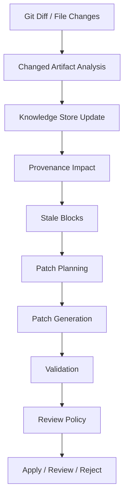
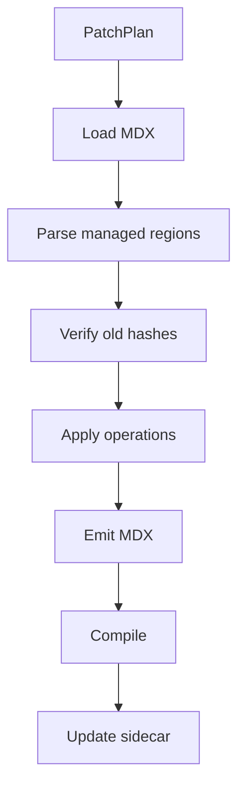
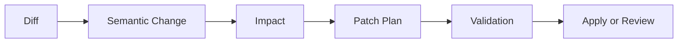

------
title: Build From Scratch: Mintlify-like AI-driven Documentation Generator CLI - Part 034
description: Mendesain diff-aware documentation updates untuk AI-driven documentation generator: git diff ingestion, impact analysis, stale block detection, patch planning, managed regions, conflict handling, human review, PR-friendly diffs, and safe auto-apply.
series: learn-mintlify-like-ai-docs-cli
seriesTitle: Build From Scratch: Mintlify-like AI-driven Documentation Generator CLI
order: 34
partTitle: Diff-aware Documentation Updates
tags:
  - documentation
  - ai
  - cli
  - diff-aware
  - patching
  - provenance
  - developer-tools
date: 2026-07-03
---

# Part 034 — Diff-aware Documentation Updates

Part 033 memberi kita provenance dan traceability.

Sekarang kita membangun fitur yang membuat documentation generator terasa seperti engineering tool, bukan content generator:

> **diff-aware documentation updates**

Goal-nya bukan "rewrite all docs with AI".

Goal-nya:

- pahami perubahan source,
- temukan docs yang terdampak,
- update block yang relevan,
- pertahankan human edits,
- hasilkan patch kecil,
- validasi dan review,
- auto-apply hanya jika aman,
- dan buat PR-friendly diff.

Dokumentasi yang bagus bukan hanya dibuat sekali. Ia harus tetap sinkron dengan codebase.

---

## 1. Mental model: docs update adalah impact-to-patch pipeline



Diff-aware update means:

> Change determines what docs are touched. Provenance determines where. Patch policy determines how safely.

---

## 2. Why not regenerate everything?

Full regeneration is tempting.

Problems:

| Problem | Consequence |
|---|---|
| Huge diffs | reviewers cannot trust changes |
| Manual edits lost | adoption fails |
| AI output changes style | noisy churn |
| Unrelated pages modified | PR noise |
| expensive model calls | cost and latency |
| higher hallucination surface | more generated text |
| route/nav instability | broken links |
| difficult rollback | no targeted patch |

Diff-aware update produces small, explainable changes.

---

## 3. Update sources

Changes can come from:

| Source | Example |
|---|---|
| Git diff | PR changed code/OpenAPI/config |
| Working tree | user edits locally |
| OpenAPI diff | operation added/changed |
| Config schema diff | field default changed |
| CLI command diff | option added |
| Generated code diff | SDK regenerated |
| Docs source diff | manual docs edited |
| Dependency version diff | package feature changed |
| Diagnostics diff | new build error pattern |

Initial focus:

- git diff,
- file hash changes,
- OpenAPI diff,
- semantic artifact changes,
- provenance stale detection.

---

## 4. Diff input model

```ts
export type DiffInput =
  | GitDiffInput
  | FileChangeInput
  | SemanticDiffInput;

export type GitDiffInput = {
  type: "git";
  baseRef: string;
  headRef: string;
  changedFiles: ChangedFile[];
};

export type ChangedFile = {
  path: string;
  status: "added" | "modified" | "deleted" | "renamed";
  oldPath?: string;
  patch?: string;
};

export type FileChangeInput = {
  type: "fileChange";
  changedPaths: string[];
};

export type SemanticDiffInput = {
  type: "semantic";
  changedArtifacts: ChangedSemanticArtifact[];
};
```

---

## 5. Git diff ingestion

Command:

```bash
docforge update --since main
docforge update --staged
docforge update --changed
```

Implementation:

```ts
export async function getGitChangedFiles(
  repoRoot: string,
  baseRef: string,
  headRef = "HEAD"
): Promise<ChangedFile[]> {
  const output = await execGit([
    "diff",
    "--name-status",
    baseRef,
    headRef,
  ], { cwd: repoRoot });

  return parseGitNameStatus(output);
}
```

For patch:

```bash
git diff --unified=3 main...HEAD -- path
```

Use git as optional dependency. If repo not git, fall back to hash scan.

---

## 6. Change classification

Not every changed file affects docs.

```ts
export type ChangeClassification = {
  file: ChangedFile;
  artifact?: SourceArtifact;
  category:
    | "sourceCode"
    | "openapiSpec"
    | "configSchema"
    | "docsPage"
    | "example"
    | "test"
    | "buildConfig"
    | "generated"
    | "unknown";
  docsImpactLikely: boolean;
  reason: string;
};
```

Rules:

| File | Impact |
|---|---|
| OpenAPI spec | high |
| config schema | high |
| CLI command file | high |
| public SDK export | high |
| route handler | medium/high |
| internal helper | low/medium |
| test/example | medium |
| README/docs page | high |
| lockfile | low |
| generated vendor code | usually low |

Use classifier + code graph.

---

## 7. Semantic diff

File diff is low-level. We need semantic diff.

Examples:

- CLI option added,
- endpoint path changed,
- config default changed,
- schema property removed,
- public function signature changed,
- example changed.

```ts
export type SemanticChange =
  | CliCommandChange
  | ConfigFieldChange
  | ApiOperationChange
  | SchemaChange
  | SymbolChange
  | ExampleChange
  | TestChange;

export type BaseSemanticChange = {
  id: string;
  kind: string;
  target: GraphNodeRef;
  sourceRefs: SourceRef[];
  severity: "breaking" | "behavioral" | "additive" | "documentation" | "unknown";
  confidence: Confidence;
};
```

---

## 8. CLI command diff

```ts
export type CliCommandChange = BaseSemanticChange & {
  kind: "cliCommand";
  commandId: string;
  changes: Array<
    | { type: "optionAdded"; option: string }
    | { type: "optionRemoved"; option: string }
    | { type: "optionDescriptionChanged"; option: string }
    | { type: "usageChanged" }
    | { type: "commandDescriptionChanged" }
  >;
};
```

Example:

```json
{
  "kind": "cliCommand",
  "commandId": "cli:docforge-build",
  "changes": [
    { "type": "optionAdded", "option": "--profile" }
  ],
  "severity": "additive"
}
```

Docs impacted:

- CLI reference,
- build guide if it mentions options,
- troubleshooting if option changes behavior.

---

## 9. Config field diff

```ts
export type ConfigFieldChange = BaseSemanticChange & {
  kind: "configField";
  fieldId: string;
  changes: Array<
    | { type: "fieldAdded" }
    | { type: "fieldRemoved" }
    | { type: "typeChanged"; before: string; after: string }
    | { type: "defaultChanged"; before: unknown; after: unknown }
    | { type: "descriptionChanged" }
    | { type: "requiredChanged"; before: boolean; after: boolean }
  >;
};
```

Docs impacted:

- config reference,
- guides using field,
- examples using field,
- migration guide if breaking.

---

## 10. OpenAPI operation diff

From Part 023/024.

```ts
export type ApiOperationChange = BaseSemanticChange & {
  kind: "apiOperation";
  operationKey: OperationKey;
  changes: Array<
    | { type: "operationAdded" }
    | { type: "operationRemoved" }
    | { type: "summaryChanged" }
    | { type: "parameterAdded"; name: string; location: string }
    | { type: "parameterRemoved"; name: string; location: string }
    | { type: "requestBodyChanged" }
    | { type: "responseAdded"; status: string }
    | { type: "responseRemoved"; status: string }
    | { type: "securityChanged" }
    | { type: "deprecatedChanged"; deprecated: boolean }
  >;
};
```

Docs impacted:

- operation page,
- tag/resource page,
- code samples,
- API playground state,
- SDK samples,
- `llms.txt`,
- search chunks.

---

## 11. Symbol diff

```ts
export type SymbolChange = BaseSemanticChange & {
  kind: "symbol";
  symbolId: SymbolId;
  changes: Array<
    | { type: "symbolAdded" }
    | { type: "symbolRemoved" }
    | { type: "signatureChanged" }
    | { type: "docCommentChanged" }
    | { type: "visibilityChanged" }
    | { type: "exportStatusChanged" }
  >;
};
```

Docs impacted if symbol is:

- public,
- documented,
- example target,
- route handler,
- SDK export.

Internal symbol changes may not update docs directly but can affect architecture docs.

---

## 12. Semantic diff generation

Compare previous and current knowledge store snapshots.

```ts
export async function computeSemanticDiff(
  previous: KnowledgeSnapshot,
  current: KnowledgeSnapshot
): Promise<SemanticChange[]> {
  return [
    ...diffCliCommands(previous.cliCommands, current.cliCommands),
    ...diffConfigFields(previous.configFields, current.configFields),
    ...diffApiOperations(previous.apiOperations, current.apiOperations),
    ...diffPublicSymbols(previous.publicSymbols, current.publicSymbols),
    ...diffExamples(previous.examples, current.examples),
  ];
}
```

Requires storing previous snapshot or deriving from git base.

Initial version can compare current store before/after reindex in working tree.

---

## 13. Impact analysis

Impact maps semantic changes to docs.

```ts
export type DocumentationImpactResult = {
  changes: SemanticChange[];
  affectedPages: AffectedPage[];
  staleBlocks: StaleBlock[];
  diagnostics: Diagnostic[];
};

export type AffectedPage = {
  pageId: PageId;
  route: RoutePath;
  sourcePath: string;
  reasons: ImpactReason[];
  severity: "high" | "medium" | "low";
  recommendedAction: "update" | "review" | "skip" | "delete" | "create";
};

export type StaleBlock = {
  pageId: PageId;
  blockId: string;
  reasons: ImpactReason[];
  updatePolicy: "auto" | "reviewRequired" | "manualOnly";
};
```

---

## 14. Impact reason model

```ts
export type ImpactReason =
  | { type: "documentsChangedArtifact"; artifactId: ArtifactId }
  | { type: "documentsChangedSemanticArtifact"; artifactId: string; changeId: string }
  | { type: "documentsChangedSymbol"; symbolId: SymbolId; changeId: string }
  | { type: "sourceRefStale"; sourceRef: SourceRef }
  | { type: "generatedByChangedGenerator"; generator: string }
  | { type: "linkedPageChanged"; pageId: PageId }
  | { type: "coverageGapNewArtifact"; artifactId: string };
```

Impact is explainable.

---

## 15. Provenance-driven stale block detection

Given semantic change target, find blocks using it.

```ts
export async function findStaleBlocksForChange(
  change: SemanticChange,
  store: KnowledgeStore
): Promise<StaleBlock[]> {
  const mappings = await store.provenance.findBlocksReferencing(change.target);

  return mappings.map((mapping) => ({
    pageId: mapping.pageId,
    blockId: mapping.blockId,
    reasons: [{
      type: "documentsChangedSemanticArtifact",
      artifactId: graphRefKey(change.target),
      changeId: change.id,
    }],
    updatePolicy: mapping.updatePolicy,
  }));
}
```

If no provenance exists, fallback to text search/semantic search.

---

## 16. Fallback impact detection

Existing docs may lack provenance.

Fallback strategies:

1. search for symbol/command/field names,
2. search for route/method/path,
3. use links,
4. use embeddings,
5. use existing page tags,
6. human review.

Fallback impact confidence is lower.

```ts
export type ImpactConfidence = "direct" | "inferred" | "weak";
```

If inferred/weak, update should be reviewRequired.

---

## 17. Update action model

```ts
export type DocumentationUpdateAction =
  | CreateDocsAction
  | UpdateBlocksAction
  | DeleteOrDeprecatePageAction
  | ReviewOnlyAction
  | NoOpAction;

export type UpdateBlocksAction = {
  action: "updateBlocks";
  pageId: PageId;
  sourcePath: string;
  blocks: Array<{
    blockId: string;
    reason: ImpactReason[];
    updatePolicy: "auto" | "reviewRequired" | "manualOnly";
  }>;
  evidenceIds: EvidenceId[];
  risk: UpdateRisk;
};
```

Risk:

```ts
export type UpdateRisk = {
  level: "low" | "medium" | "high";
  reasons: string[];
};
```

---

## 18. Auto-apply policy

Auto-apply only when low risk.

```ts
export type AutoApplyPolicy = {
  allowGeneratedPages: boolean;
  allowGeneratedBlocks: boolean;
  allowManualPages: boolean;
  allowAiDrafts: boolean;
  maxRisk: "low" | "medium";
  requireReviewForBreakingChanges: boolean;
};
```

Recommended default:

```json
{
  "allowGeneratedPages": true,
  "allowGeneratedBlocks": true,
  "allowManualPages": false,
  "allowAiDrafts": false,
  "maxRisk": "low",
  "requireReviewForBreakingChanges": true
}
```

AI-drafted content should usually require review.

Deterministic API/config/CLI reference updates can auto-apply if generated region untouched.

---

## 19. Risk scoring

Risk factors:

| Factor | Risk |
|---|---|
| generated deterministic block | low |
| generated AI block | medium |
| human-edited generated block | high |
| manual page | high |
| breaking API change | high |
| source confidence low | medium/high |
| inferred impact | medium |
| route/nav change | high |
| deletion | high |
| style-only update | low |
| formal reference table update | low/medium |

```ts
export function scoreUpdateRisk(input: UpdateRiskInput): UpdateRisk {
  const reasons: string[] = [];
  let score = 0;

  if (input.pageOwner === "human") {
    score += 5;
    reasons.push("page is human-owned");
  }

  if (input.regionEditedByHuman) {
    score += 5;
    reasons.push("generated region was manually edited");
  }

  if (input.changeSeverity === "breaking") {
    score += 4;
    reasons.push("source change is breaking");
  }

  if (input.impactConfidence !== "direct") {
    score += 2;
    reasons.push("impact inferred without direct provenance");
  }

  return {
    level: score >= 6 ? "high" : score >= 3 ? "medium" : "low",
    reasons,
  };
}
```

---

## 20. Patch planning

Patch planner decides how to update.

```ts
export type PatchPlan = {
  schemaVersion: "patch-plan/v1";
  targetFile: string;
  pageId: PageId;
  operations: PatchOperation[];
  rationale: string;
  risk: UpdateRisk;
  requiredReview: boolean;
};

export type PatchOperation =
  | ReplaceManagedBlockOperation
  | InsertManagedBlockOperation
  | DeleteManagedBlockOperation
  | UpdateFrontmatterOperation
  | AddSidecarMetadataOperation;
```

Replace block:

```ts
export type ReplaceManagedBlockOperation = {
  type: "replaceManagedBlock";
  blockId: string;
  oldContentHash: string;
  newBlocks: DraftBlock[];
  evidenceIds: EvidenceId[];
};
```

---

## 21. Deterministic patch generation

If block generated by deterministic generator, regenerate it.

Example API operation page:

```ts
export async function planApiOperationUpdate(
  page: PageProvenance,
  change: ApiOperationChange,
  registry: OpenApiRegistry
): Promise<PatchPlan> {
  const operation = registry.operationsByKey.get(change.operationKey);
  const newBlocks = generateApiOperationBlocks(operation);

  return {
    schemaVersion: "patch-plan/v1",
    targetFile: page.sourcePath,
    pageId: page.pageId,
    operations: [{
      type: "replaceManagedBlock",
      blockId: "api-operation",
      oldContentHash: block.contentHash,
      newBlocks,
      evidenceIds: [`ev_openapi_${operation.operationId}`],
    }],
    rationale: "OpenAPI operation changed.",
    risk: { level: "low", reasons: ["deterministic generated API block"] },
    requiredReview: false,
  };
}
```

---

## 22. AI patch generation

For AI-drafted explanatory content, do not ask model to rewrite whole page unless necessary.

Input:

- stale block,
- old block content,
- change summary,
- new evidence,
- surrounding context,
- style guide,
- review issues.

Output:

```ts
export type BlockRewriteDraft = {
  schemaVersion: "block-rewrite/v1";
  blockId: string;
  replacementBlocks: DraftBlock[];
  missingEvidence: MissingEvidence[];
  diagnostics: DraftDiagnostic[];
};
```

Prompt:

```txt
Rewrite only the target block/section.
Preserve the section purpose and style.
Use only new evidence.
Do not modify unrelated content.
Return JSON replacement blocks.
```

---

## 23. Minimal patch principle

Patch should touch smallest necessary region.

Bad:

- rewrite entire page for one config default change.

Good:

- update one table cell/row.

For deterministic tables, support cell-level patches.

```ts
export type UpdateTableCellOperation = {
  type: "updateTableCell";
  blockId: string;
  rowKey: string;
  columnKey: string;
  oldValue: string;
  newValue: SupportedText;
};
```

First implementation can replace block. Later optimize to cell-level.

---

## 24. Patch application

Patch applies to Content IR/MDX safely.

Flow:



Hash verification prevents overwriting changed content.

```ts
if (currentRegion.contentHash !== operation.oldContentHash) {
  throw new PatchConflictError("Managed block changed since patch was planned.");
}
```

---

## 25. Patch conflict model

```ts
export type PatchConflict = {
  type:
    | "blockNotFound"
    | "contentHashMismatch"
    | "humanEditedRegion"
    | "manualOnlyRegion"
    | "routeConflict"
    | "sidecarMismatch";
  pageId: PageId;
  blockId?: string;
  message: string;
};
```

Conflict policy:

- do not apply,
- create review artifact,
- show manual resolution.

---

## 26. Update existing manual pages

Manual pages require review.

Options:

1. produce suggested patch only,
2. insert generated advisory section if allowed,
3. create TODO diagnostic,
4. open PR comment.

Do not overwrite manual prose.

Example output:

```txt
Review required: /guides/build-docs

Reason:
- Manual page mentions `--strict`
- CLI command added `--profile`
- Impact inferred by text match, not direct provenance

Suggested change:
- Add `--profile` to "Build options" section.
```

---

## 27. Deleted artifacts

If source artifact removed:

| Artifact removed | Action |
|---|---|
| API operation removed | delete/deprecate operation page |
| CLI command removed | update CLI reference; maybe remove command section |
| config field removed | update config reference; maybe migration note |
| public SDK symbol removed | update reference; migration guide |
| example removed | remove/update example |
| internal symbol removed | likely no docs action |

Deletion is high risk.

Prefer deprecate/review over automatic delete unless generated deterministic page.

---

## 28. Added artifacts

If new public artifact appears:

- new API operation → generate API page,
- new CLI command → update CLI reference or create command page,
- new config field → update config reference,
- new public SDK export → update SDK reference,
- new event/job → update catalog.

Planner handles create/update.

Diff-aware update can call planner with objective `updateForDiff`.

---

## 29. Renames

Renames are hard.

Git may report rename. Semantic diff may see remove+add.

Detect possible rename by:

- similar signature,
- same method/path with operationId changed,
- same config field path moved? rare,
- same symbol body hash different name,
- git rename status.

Rename action:

- preserve route if same semantic contract,
- update title if needed,
- add redirect if route changes,
- review required if uncertain.

```ts
export type RenameCandidate = {
  before: GraphNodeRef;
  after: GraphNodeRef;
  confidence: Confidence;
  reason: string;
};
```

---

## 30. Route preservation during updates

If operationId changes but method/path same:

- route should stay unless user chooses migration.

Use route lock.

```ts
const route = routeLock.get(operationKey) ?? generateNewRoute(operation);
```

If semantic key changes due path changed:

- maybe old route should redirect to new route,
- breaking API path change likely requires review.

---

## 31. Redirect planning

If docs route changes:

```ts
export type RedirectPlan = {
  from: RoutePath;
  to: RoutePath;
  reason: string;
  permanent: boolean;
};
```

For generated API pages, if operation route changes due rename:

- add redirect,
- update nav/search,
- report.

Do not silently break URLs.

---

## 32. Diff-aware search updates

When page/block changes:

- rebuild affected search chunks,
- remove chunks for deleted pages,
- update API operation chunk,
- update `llms.txt` export.

Search index can be full rebuilt initially. Later incremental.

```ts
export type SearchUpdatePlan = {
  changedPageIds: PageId[];
  deletedPageIds: PageId[];
  rebuildAll: boolean;
};
```

---

## 33. Diff-aware `llms.txt` updates

`llms.txt` is derived from docs pages.

If pages changed:

- rebuild `llms.txt`,
- or incremental update sections.

Initial version: full rebuild. It is deterministic and cheaper than docs generation.

But provenance should say export changed due page changes.

---

## 34. Update command flow

CLI:

```bash
docforge update --since main --dry-run
```

Output:

```txt
Detected changes:
- openapi/public.yaml modified
  2 operations changed
  1 operation added

Affected docs:
- /api-reference/users/create-user
  stale block: api-operation
  action: auto-update deterministic
- /api-reference/users/list-users
  stale block: api-operation
  action: auto-update deterministic
- /api-reference/users/delete-user
  action: create generated page

No manual pages will be modified.
```

Apply:

```bash
docforge update --since main --apply
```

Review-only:

```bash
docforge update --since main --review
```

---

## 35. Dry-run report model

```ts
export type UpdateDryRunReport = {
  changes: SemanticChange[];
  affectedPages: AffectedPage[];
  patchPlans: PatchPlan[];
  conflicts: PatchConflict[];
  reviewRequired: PatchPlan[];
  autoApplicable: PatchPlan[];
  noOps: NoOpAction[];
  diagnostics: Diagnostic[];
};
```

Dry-run should be default for risky commands.

---

## 36. Patch report

After apply:

```ts
export type PatchApplyReport = {
  applied: Array<{
    pageId: PageId;
    file: string;
    operations: number;
  }>;
  skipped: Array<{
    pageId: PageId;
    reason: string;
  }>;
  conflicts: PatchConflict[];
  diagnostics: Diagnostic[];
};
```

CLI:

```txt
Applied documentation updates:

- docs/api/users/create-user.mdx
  replaced block api-operation
- docs/reference/configuration.mdx
  updated generated config table

Review required:
- docs/guides/build-docs.mdx
  manual page mentions changed CLI option
```

---

## 37. PR-friendly diffs

Generated patches should:

- be minimal,
- deterministic,
- stable formatting,
- avoid unrelated whitespace,
- group changes by page,
- include review notes,
- not reorder sections unless needed.

Use formatter carefully. Formatting whole file can create noisy diff. Prefer region-level formatting.

---

## 38. Human review artifact for updates

Create:

```txt
.docforge/reviews/update-<id>/
  report.json
  patches/
    docs-guides-build-docs.patch
  evidence/
    cli-build.json
  stale-blocks.json
```

Report includes:

- changed source,
- impacted docs,
- suggested changes,
- risk,
- evidence.

Useful for PR comments later.

---

## 39. Applying patches to virtual pages

Some generated pages are virtual, not committed.

If API reference virtual:

- update happens by regenerating build artifacts,
- no MDX file patch.
- provenance store updates.

If user wants physical generated pages:

```bash
docforge generate --api --apply
```

Update command should know page storage mode.

```ts
export type PageStorageMode = "virtual" | "physical" | "hybrid";
```

---

## 40. Diff-aware navigation updates

If new page created, nav may need update.

Navigation action:

```ts
export type NavigationPatchPlan = {
  action: "addPage" | "removePage" | "movePage";
  parentGroup: string;
  pageId: PageId;
  route: RoutePath;
  reviewRequired: boolean;
};
```

Auto-add generated API pages to generated API nav section.  
Manual nav changes require review.

---

## 41. Diff-aware coverage

After update, recompute coverage.

```txt
Before:
API endpoints documented: 127/128

After:
API endpoints documented: 128/129
Remaining gap:
- GET /internal/metrics skipped internal
```

Coverage report should distinguish:

- public undocumented,
- internal skipped,
- low-confidence skipped.

---

## 42. Diff-aware AI retrieval

For AI patch, retrieval should focus on changed evidence.

Evidence pack:

1. stale block old evidence,
2. new semantic artifact state,
3. diff summary,
4. surrounding docs context,
5. style guide,
6. relevant examples/tests.

Do not retrieve entire topic again unless needed.

```ts
export type PatchEvidencePack = {
  staleBlock: StaleBlock;
  oldBlockContent: string;
  oldEvidence: EvidenceItem[];
  newEvidence: EvidenceItem[];
  semanticChanges: SemanticChange[];
  surroundingContext: string;
};
```

---

## 43. Diff summary for AI

AI should receive semantic diff, not raw git patch only.

Example:

```json
{
  "change": {
    "type": "config.defaultChanged",
    "field": "search.enabled",
    "before": false,
    "after": true
  }
}
```

This is easier and safer than raw code diff.

Raw diff can be included as evidence if useful.

---

## 44. Patch validation

After patch:

1. MDX parse,
2. component validation,
3. link validation,
4. source provenance validation,
5. fact-check if AI patch,
6. safety scan,
7. build affected pages,
8. update search/export.

```ts
export async function validatePatchResult(
  patch: AppliedPatch,
  ctx: PatchValidationContext
): Promise<Diagnostic[]> {
  return [
    ...await validateMdxFile(patch.file),
    ...validateProvenanceSidecar(patch),
    ...await validateAffectedLinks(patch),
    ...validateNoSecrets(patch),
  ];
}
```

If validation fails, rollback patch or leave review artifact.

---

## 45. Transactional file updates

File updates should be atomic.

Approach:

1. write new content to temp file,
2. validate,
3. rename over original,
4. update sidecar,
5. if sidecar update fails, rollback if possible.

For multiple files:

- stage all temp files,
- validate all,
- commit all,
- otherwise no changes.

```ts
export async function applyFilePatchesAtomically(patches: FilePatch[]): Promise<void> {
  const staged = await stagePatches(patches);

  try {
    await validateStagedPatches(staged);
    await commitStagedPatches(staged);
  } catch (error) {
    await cleanupStagedPatches(staged);
    throw error;
  }
}
```

---

## 46. Rollback

If patch applied and later validation fails:

- keep backup,
- restore original,
- report.

```txt
error update.validation.failed
Patch failed MDX compilation. Restored original file.

Review artifact:
.docforge/reviews/update-123
```

Do not leave corrupted docs.

---

## 47. Update modes

```txt
--dry-run       show plan, do not write
--apply         apply auto-safe patches
--review        create review artifacts for risky patches
--all           include medium-risk patches
--only api      update only API docs
--only cli      update only CLI docs
--since main    diff against main
--staged        use staged changes
```

Defaults:

- dry-run unless command explicitly says apply,
- auto-apply low-risk generated patches,
- review manual/AI/risky patches.

---

## 48. Update policy config

```json
{
  "updates": {
    "autoApply": {
      "generatedDeterministic": true,
      "generatedAi": false,
      "manualPages": false,
      "maxRisk": "low"
    },
    "review": {
      "requiredForBreakingChanges": true,
      "requiredForRouteChanges": true,
      "requiredForManualPages": true
    },
    "deletePolicy": "deprecate"
  }
}
```

Delete policy:

- `delete`,
- `deprecate`,
- `reviewOnly`,
- `ignore`.

Default: `reviewOnly` or `deprecate` for public pages.

---

## 49. Deprecation instead of deletion

If API operation removed, maybe page should show deprecation/removed notice.

Generated page:

```mdx
<Callout type="warning" title="Endpoint removed">
This endpoint is no longer present in the OpenAPI specification.
</Callout>
```

But if operation truly removed before release, delete may be fine.

Policy matters.

---

## 50. Update planner prompt

For AI-assisted patch planning:

```txt
You are a documentation update planner.
You receive semantic changes, stale block metadata, existing page summary, and evidence.
Plan the smallest safe update.
Do not rewrite unrelated sections.
Do not modify human-owned regions.
If update risk is high, return reviewRequired.
Return JSON matching PatchPlan schema.
```

But for most deterministic updates, no AI needed.

---

## 51. Patch writer prompt

For rewriting one block:

```txt
Rewrite only the target block.
The block is stale because the following semantic changes occurred.
Use only provided new evidence.
Preserve style and scope.
Return replacement DraftBlock JSON.
If evidence is insufficient, return missingEvidence.
```

Do not ask for full page rewrite.

---

## 52. Conflict resolution UX

When conflict:

```txt
Conflict: generated region was manually edited

File:
  docs/reference/cli-build.mdx

Region:
  build-options

Reason:
  Current content hash differs from last generated hash.

Options:
  1. Keep manual content and skip
  2. Generate suggested patch for review
  3. Overwrite with regenerated content
```

Do not overwrite without explicit user action.

---

## 53. Update test fixtures

Fixtures:

```txt
fixtures/update/
  cli-option-added/
    before/
    after/
    expected-patch.patch
  openapi-operation-changed/
  config-default-changed/
  human-edited-region/
  internal-route-added/
  operation-removed/
```

Each fixture includes:

- previous store snapshot,
- current source files,
- existing docs,
- sidecar provenance,
- expected impacted pages,
- expected patch plans.

---

## 54. Unit tests

### 54.1 Impact by provenance

```ts
it("marks block stale when referenced config field changes", async () => {
  const impact = await computeImpact(configDefaultChanged(), store);

  expect(impact.staleBlocks).toContainEqual(
    expect.objectContaining({
      pageId: "reference-configuration",
      blockId: "config-table",
    })
  );
});
```

### 54.2 Human edited region conflict

```ts
it("does not auto-apply when generated region was edited", () => {
  const conflict = detectPatchConflicts(patchPlan, currentPage);

  expect(conflict).toContainEqual(
    expect.objectContaining({ type: "humanEditedRegion" })
  );
});
```

### 54.3 Deterministic API update

```ts
it("replaces API operation block for changed operation", async () => {
  const patch = await planApiOperationUpdate(change, page, registry);

  expect(patch.requiredReview).toBe(false);
  expect(patch.operations[0].type).toBe("replaceManagedBlock");
});
```

---

## 55. Integration tests

End-to-end:

1. create fixture repo,
2. run initial generation,
3. modify OpenAPI/config/code,
4. run `docforge update --dry-run`,
5. assert impacted pages,
6. run `docforge update --apply`,
7. assert MDX compiles,
8. assert provenance sidecar updated,
9. assert search/llms artifacts update.

---

## 56. Metrics

Track:

```ts
export type UpdateMetrics = {
  changedFiles: number;
  semanticChanges: number;
  affectedPages: number;
  staleBlocks: number;
  autoAppliedPatches: number;
  reviewRequiredPatches: number;
  conflicts: number;
  skippedInternalChanges: number;
  averagePatchLines: number;
};
```

Useful for improving system quality.

---

## 57. Anti-pattern: AI rewrite whole docs on every PR

This creates churn and distrust.

Diff-aware pipeline should update only:

- stale blocks,
- affected generated pages,
- new/removed public artifacts,
- relevant nav/search exports.

---

## 58. Anti-pattern: ignore human edits

If user edited generated content, that is signal.

Either:

- preserve it,
- require review,
- or let user explicitly reset generated region.

Never silently overwrite.

---

## 59. Anti-pattern: raw git diff to AI as only context

Raw diff lacks semantic meaning.

Better:

- reindex,
- compute semantic diff,
- attach evidence,
- include raw diff only as supporting evidence.

AI is better at editing docs when it sees "config default changed from false to true" than arbitrary code patch.

---

## 60. Anti-pattern: update without validation

Every patch must pass:

- MDX compile,
- link check,
- component validation,
- provenance validation,
- safety scan,
- review if AI content.

No validation, no apply.

---

## 61. Package layout

```txt
packages/doc-update/
  src/
    diff/
      git.ts
      file-change.ts
      semantic-diff.ts
    impact/
      provenance-impact.ts
      graph-impact.ts
      fallback-impact.ts
    plan/
      update-action.ts
      risk.ts
      patch-plan.ts
      deterministic.ts
      ai-patch.ts
    apply/
      managed-regions.ts
      patch-apply.ts
      conflicts.ts
      atomic-write.ts
      rollback.ts
    report/
      dry-run.ts
      apply-report.ts
      review-artifact.ts
    validation/
      patch-validation.ts
    __tests__/
      semantic-diff.test.ts
      impact.test.ts
      risk.test.ts
      conflicts.test.ts
      patch-apply.test.ts
```

---

## 62. Minimal implementation milestone

First version:

1. read git changed files,
2. classify changes,
3. reindex changed artifacts,
4. compute semantic diff for OpenAPI/config/CLI,
5. find stale blocks via provenance,
6. create deterministic patch plans,
7. detect managed region conflicts,
8. dry-run report,
9. auto-apply low-risk generated blocks,
10. validate MDX and sidecar after patch.

Second version:

1. AI block rewrite patches,
2. fallback impact detection for unprovenanced docs,
3. delete/deprecate policies,
4. route redirects,
5. navigation patching,
6. review artifact generation,
7. GitHub PR comments,
8. semantic diff snapshots,
9. incremental search/llms updates,
10. update metrics.

---

## 63. Failure modes

| Failure | Cause | Prevention |
|---|---|---|
| Huge noisy diffs | full-page regeneration | block-level patches |
| Human edits lost | no hash conflict detection | managed region content hash |
| Docs remain stale | no provenance impact | source refs and semantic diff |
| Wrong docs updated | weak fallback matching | confidence/risk + review |
| Removed API page deleted accidentally | aggressive delete policy | review/deprecate default |
| Route changes break links | no route lock/redirect | route preservation and redirect plan |
| AI patch changes unrelated content | full-page prompt | block rewrite contract |
| Broken MDX applied | no validation | compile before apply |
| Partial file writes | non-atomic update | temp files/rollback |
| Public docs expose internal change | no visibility filter | internal skip policy |

---

## 64. Key takeaways

Diff-aware updates make docs maintenance practical.



Strong update design:

1. starts from source diff,
2. computes semantic changes,
3. uses provenance to find stale blocks,
4. creates minimal patches,
5. protects human edits,
6. separates deterministic and AI updates,
7. applies only low-risk patches automatically,
8. validates before writing,
9. creates review artifacts for risky changes,
10. and keeps generated docs synchronized without churn.

Next, we build **self-updating docs workflow**, where diff-aware updates become an end-to-end local/CI/PR automation loop.
