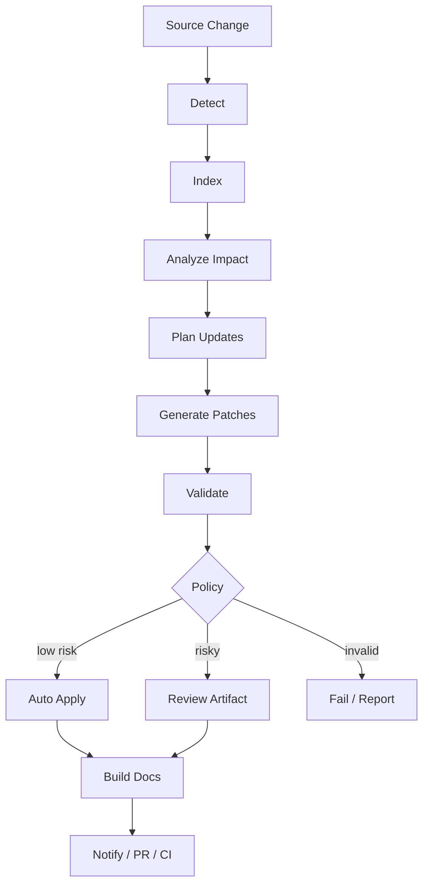
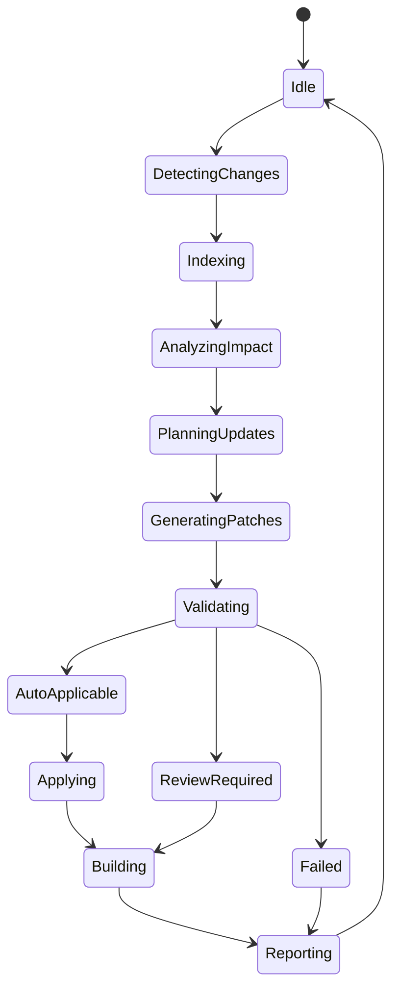
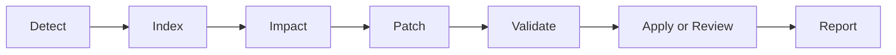

------
title: Build From Scratch: Mintlify-like AI-driven Documentation Generator CLI - Part 035
description: Mendesain self-updating docs workflow untuk AI-driven documentation generator: local workflow, CI workflow, scheduled verification, policy gates, update modes, review artifacts, rollback, notifications, and operational playbook.
series: learn-mintlify-like-ai-docs-cli
seriesTitle: Build From Scratch: Mintlify-like AI-driven Documentation Generator CLI
order: 35
partTitle: Self-updating Docs Workflow
tags:
  - documentation
  - ai
  - cli
  - self-updating-docs
  - ci
  - workflow
  - developer-tools
date: 2026-07-03
---

# Part 035 — Self-updating Docs Workflow

Pada Part 034, kita membangun **diff-aware documentation updates**.

Sekarang kita mengubah kemampuan itu menjadi workflow lengkap:

> **self-updating docs workflow**

Self-updating docs bukan berarti "AI bebas mengubah dokumentasi kapan saja".

Self-updating docs berarti:

- sistem mendeteksi perubahan source,
- menghitung dampak terhadap docs,
- membuat update kecil dan terverifikasi,
- menerapkan update deterministic yang low-risk,
- membuat review artifact untuk perubahan risky,
- menjalankan quality gates,
- dan mengintegrasikan semuanya ke local dev, CI, dan PR workflow.

Tujuannya bukan mengganti reviewer manusia. Tujuannya mengurangi pekerjaan repetitif dan membuat drift terlihat sejak awal.

---

## 1. Mental model: self-updating docs adalah control loop



Control loop ini punya feedback:

```txt
change -> docs impact -> patch -> validation -> review/apply -> build -> report
```

Self-updating docs yang baik harus selalu menjawab:

- apa yang berubah?
- docs apa yang terdampak?
- patch apa yang dibuat?
- kenapa patch itu aman/tidak aman?
- apa yang perlu reviewer lihat?
- apakah build masih valid?

---

## 2. Self-updating does not mean autonomous publishing

Penting:

> self-updating docs bukan self-publishing docs tanpa guardrail.

Ada beberapa level autonomy.

| Level | Meaning |
|---|---|
| L0 | Detect drift only |
| L1 | Suggest patches |
| L2 | Auto-apply deterministic generated patches |
| L3 | Auto-open PR with reviewed changes |
| L4 | Auto-merge docs-only low-risk changes |
| L5 | Fully autonomous docs updates |

Untuk production-grade engineering org, default realistis adalah **L1-L2**.

- AI-authored prose: review required.
- Deterministic API/config/CLI reference: can auto-update if generated region clean.
- Manual docs: never overwrite automatically.
- Publishing/merge: human or policy gate.

---

## 3. Workflow surfaces

Self-updating docs muncul di beberapa tempat.

| Surface | Example |
|---|---|
| Local dev | `docforge update --changed --apply` |
| Pre-commit | Warn if docs stale |
| CI check | Fail if public docs drift |
| PR bot | Comment affected docs |
| Scheduled job | Nightly docs drift report |
| Release workflow | Verify docs before release |
| Docs maintenance command | `docforge stale`, `docforge verify` |
| Generated PR | Create docs update PR |

Semua surface memakai engine yang sama: index, impact, patch, validation, policy.

---

## 4. Core workflow commands

Command surface:

```bash
docforge stale
docforge update --dry-run
docforge update --apply
docforge update --since main
docforge update --staged
docforge update --review
docforge verify
docforge generate --plan
docforge generate --apply
docforge workflow status
```

Recommended user-facing flows:

### Local check

```bash
docforge stale
```

### Local update

```bash
docforge update --changed --apply
```

### PR check

```bash
docforge update --since origin/main --dry-run --format json
```

### CI gate

```bash
docforge verify --strict
```

---

## 5. Workflow configuration

```json
{
  "workflow": {
    "defaultMode": "suggest",
    "updatePolicy": {
      "autoApplyGeneratedDeterministic": true,
      "autoApplyAiDrafts": false,
      "autoApplyManualPages": false,
      "requireReviewForBreakingChanges": true,
      "maxAutoApplyRisk": "low"
    },
    "ci": {
      "failOnStalePublicDocs": true,
      "failOnUnsupportedClaims": true,
      "failOnBrokenLinks": true,
      "allowReviewArtifacts": true
    },
    "notifications": {
      "summary": true,
      "includeEvidence": false
    }
  }
}
```

Policy is explicit. Do not hide autonomy decisions in code.

---

## 6. Workflow state machine



State model:

```ts
export type WorkflowRunStatus =
  | "idle"
  | "detectingChanges"
  | "indexing"
  | "analyzingImpact"
  | "planningUpdates"
  | "generatingPatches"
  | "validating"
  | "applying"
  | "building"
  | "reporting"
  | "succeeded"
  | "failed"
  | "cancelled";
```

Store workflow runs in knowledge store for observability.

---

## 7. Workflow run model

```ts
export type WorkflowRun = {
  id: string;
  mode: WorkflowMode;
  trigger: WorkflowTrigger;
  status: WorkflowRunStatus;
  startedAt: string;
  endedAt?: string;
  configHash: string;
  git?: GitContext;
  stats: WorkflowRunStats;
  diagnostics: Diagnostic[];
};

export type WorkflowMode =
  | "detectOnly"
  | "suggest"
  | "applySafe"
  | "review"
  | "ciCheck"
  | "openPr";

export type WorkflowTrigger =
  | { type: "manual"; command: string }
  | { type: "devServer"; changedPaths: string[] }
  | { type: "ci"; baseRef: string; headRef: string }
  | { type: "scheduled"; scheduleId: string }
  | { type: "release"; version: string };
```

Stats:

```ts
export type WorkflowRunStats = {
  changedFiles: number;
  semanticChanges: number;
  affectedPages: number;
  staleBlocks: number;
  patchesGenerated: number;
  patchesApplied: number;
  reviewRequired: number;
  conflicts: number;
  validationErrors: number;
};
```

---

## 8. Local workflow

Local workflow should be fast and clear.

Common commands:

```bash
docforge update --changed --dry-run
docforge update --changed --apply
docforge stale
```

Local output should answer:

```txt
What changed?
What docs are stale?
What can be updated safely?
What needs review?
What command should I run next?
```

Example:

```txt
Docs update dry-run

Changed files:
- openapi/public.yaml

Semantic changes:
- POST /users request body changed
- GET /users/{id} response schema changed

Auto-applicable:
- /api-reference/users/create-user
- /api-reference/users/get-user

Review required:
- /guides/user-management
  reason: manual page references changed response schema

Run:
  docforge update --changed --apply
```

---

## 9. Local apply workflow

```bash
docforge update --changed --apply
```

Steps:

1. detect changed files,
2. reindex,
3. compute impact,
4. generate low-risk patches,
5. apply patches atomically,
6. update sidecars,
7. run affected-page compile,
8. update search/llms derived artifacts if configured,
9. print report.

Important:

- if patch fails validation, rollback.
- if conflict, skip and create review artifact.
- never silently modify manual pages.

---

## 10. Local review workflow

```bash
docforge update --changed --review
```

Creates review artifacts:

```txt
.docforge/reviews/update-20260703-001/
  report.md
  report.json
  patches/
  evidence/
  stale-blocks.json
```

`report.md` should be human-readable.

Example:

```md
# Documentation update review

## Source changes

- `src/commands/build.ts`: CLI command `docforge build` added option `--profile`.

## Suggested docs updates

### `/reference/cli/build`

Risk: medium  
Reason: generated region was manually edited.

Suggested patch:
...
```

---

## 11. Dev server integration

During `docforge dev`, file changes trigger incremental compile.

For self-updating:

- do not auto-edit files on every keystroke,
- detect stale docs and show overlay/report,
- optionally offer command.

Dev overlay:

```txt
Docs may be stale

Changed:
- openapi/public.yaml

Affected:
- /api-reference/users/create-user

Run:
  docforge update --changed --apply
```

Why not auto-apply in dev server?

- user may be mid-edit,
- too much file churn,
- difficult undo,
- confusing.

Dev mode should default to detect/suggest.

---

## 12. Watch mode for docs drift

Optional:

```bash
docforge watch --stale
```

Behavior:

- watches code/spec/config/docs,
- updates knowledge store,
- reports stale pages,
- does not write docs unless configured.

This is useful for maintainers.

---

## 13. Pre-commit workflow

Pre-commit should be fast.

Recommended:

```bash
docforge verify --staged --quick
```

Quick checks:

- MDX compile changed docs,
- obvious stale generated regions,
- no secret-like docs output,
- no broken local links in changed pages.

Avoid expensive AI generation in pre-commit.

If stale detected:

```txt
Generated docs are stale:
- docs/reference/configuration.mdx

Run:
  docforge update --staged --apply
```

---

## 14. CI workflow

CI should be deterministic and policy-driven.

Typical CI steps:

```yaml
- run: docforge index
- run: docforge verify --strict
- run: docforge update --since origin/main --dry-run --format json > docforge-update-report.json
- run: docforge build
```

CI can fail on:

- docs build errors,
- broken links,
- stale public docs,
- unsupported generated claims,
- secret-like output,
- missing required provenance,
- unreviewed risky generated content.

CI should not automatically push changes unless explicitly configured.

---

## 15. CI modes

```txt
docforge verify --strict
docforge verify --changed
docforge update --since origin/main --dry-run
docforge update --since origin/main --apply --generated-only
```

Modes:

| Mode | Use |
|---|---|
| `verify --strict` | release/main branch |
| `verify --changed` | PR quick feedback |
| `update --dry-run` | PR bot report |
| `update --apply --generated-only` | docs-only automation branch |
| `build` | ensure static output valid |

---

## 16. CI failure policy

```ts
export type CiFailurePolicy = {
  failOnBuildError: boolean;
  failOnBrokenLinks: boolean;
  failOnStalePublicDocs: boolean;
  failOnStaleInternalDocs: boolean;
  failOnReviewRequired: boolean;
  failOnGeneratedPatchAvailable: boolean;
  failOnUnsupportedClaims: boolean;
};
```

Default PR behavior:

- fail build errors,
- fail broken links,
- fail unsupported claims,
- warn on reviewRequired,
- warn or fail on stale docs depending team policy.

Strict release behavior:

- fail stale public docs.

---

## 17. CI report model

```ts
export type CiDocsReport = {
  schemaVersion: "ci-docs-report/v1";
  status: "pass" | "fail" | "warning";
  summary: string;
  changedFiles: ChangedFile[];
  staleDocs: StaleDocsSummary[];
  patchSuggestions: PatchPlanSummary[];
  reviewRequired: ReviewRequiredSummary[];
  diagnostics: Diagnostic[];
  commands: SuggestedCommand[];
};
```

This report feeds:

- terminal output,
- PR comments,
- GitHub Checks,
- artifacts.

---

## 18. Suggested command model

```ts
export type SuggestedCommand = {
  label: string;
  command: string;
  reason: string;
};
```

Example:

```json
{
  "label": "Apply generated API docs updates",
  "command": "docforge update --since origin/main --apply --only api",
  "reason": "2 generated API reference pages are stale."
}
```

---

## 19. Scheduled verification

Docs can drift without PR changes if:

- remote spec changes,
- generated outputs not committed,
- dependencies/codegen change,
- docs were manually edited,
- scheduled source refresh.

Scheduled workflow:

```bash
docforge verify --strict
docforge stale --format json
```

Output:

- stale report,
- coverage report,
- provenance report,
- generated review artifacts.

Could open issue/PR in integration layer later.

---

## 20. Release workflow

Before release:

```bash
docforge verify --release
```

Extra checks:

- public API docs match release OpenAPI,
- CLI reference matches release binary/source,
- config reference matches release schema,
- links valid,
- search index built,
- `llms.txt` built,
- no reviewRequired items,
- provenance fresh.

Release docs drift should block.

---

## 21. Update strategy matrix

| Change | Local | CI PR | Main/release |
|---|---|---|---|
| Generated API page stale | auto-apply allowed | report/optional fail | fail strict |
| Manual guide stale | review artifact | PR comment | fail if public critical |
| New config field | update generated table | report | fail if reference stale |
| Internal route changed | skip/info | ignore/warn | ignore |
| API breaking change | review required | fail/warn | fail |
| Secret in docs | fail | fail | fail |
| Broken link | fail/warn | fail | fail |

---

## 22. Workflow policy evaluation

```ts
export function evaluateWorkflowPolicy(
  report: UpdateDryRunReport,
  policy: WorkflowPolicy
): WorkflowDecision {
  const blockers: Diagnostic[] = [];
  const warnings: Diagnostic[] = [];

  if (policy.ci.failOnStalePublicDocs && hasStalePublicDocs(report)) {
    blockers.push({
      code: "workflow.ci.stalePublicDocs",
      severity: "error",
      category: "workflow",
      message: "Public documentation is stale.",
    });
  }

  if (hasSecretDiagnostics(report)) {
    blockers.push({
      code: "workflow.security.secretDetected",
      severity: "error",
      category: "security",
      message: "Secret-like value detected in documentation output.",
    });
  }

  return blockers.length > 0
    ? { status: "fail", blockers, warnings }
    : { status: warnings.length > 0 ? "warning" : "pass", blockers, warnings };
}
```

---

## 23. Workflow decisions

```ts
export type WorkflowDecision =
  | { status: "pass"; blockers: []; warnings: Diagnostic[] }
  | { status: "warning"; blockers: []; warnings: Diagnostic[] }
  | { status: "fail"; blockers: Diagnostic[]; warnings: Diagnostic[] };
```

Command exit codes:

| Decision | Exit |
|---|---:|
| pass | 0 |
| warning | 0 by default, 5 if `--fail-on-warning` |
| fail | non-zero |

---

## 24. Review artifact lifecycle

Review artifacts should not pile up forever.

Config:

```json
{
  "workflow": {
    "reviewArtifacts": {
      "path": ".docforge/reviews",
      "retentionDays": 14,
      "includeEvidence": true,
      "includePatches": true
    }
  }
}
```

Cleanup:

```bash
docforge workflow cleanup
```

Do not store secrets in review artifacts.

---

## 25. Workflow status

Command:

```bash
docforge workflow status
```

Output:

```txt
DocForge workflow status

Last index:       2 minutes ago
Last verify:      passed
Stale pages:      0
Review artifacts: 2
Coverage:
  API endpoints: 128/128
  CLI commands: 8/8
  Config fields: 62/62

Suggested:
  docforge workflow cleanup
```

---

## 26. Workflow history

Store workflow runs.

```sql
CREATE TABLE workflow_runs (
  id TEXT PRIMARY KEY,
  mode TEXT NOT NULL,
  trigger_type TEXT NOT NULL,
  status TEXT NOT NULL,
  started_at TEXT NOT NULL,
  ended_at TEXT,
  config_hash TEXT NOT NULL,
  git_json TEXT,
  stats_json TEXT,
  diagnostics_json TEXT
);
```

Command:

```bash
docforge workflow history
```

Useful for debugging flaky CI.

---

## 27. Notifications abstraction

Do not hardcode GitHub/Slack into workflow core.

```ts
export type WorkflowNotifier = {
  notify(report: WorkflowNotification): Promise<void>;
};

export type WorkflowNotification = {
  title: string;
  status: "pass" | "warning" | "fail";
  summary: string;
  sections: NotificationSection[];
  artifacts: NotificationArtifact[];
};
```

Adapters:

- terminal,
- JSON file,
- GitHub PR comment,
- GitHub Check,
- Slack later,
- email later.

Core produces notification model. Integrations render it.

---

## 28. Terminal reporter

Human-readable terminal output.

```txt
Documentation workflow: warning

Changed files: 4
Semantic changes: 3
Affected pages: 2
Auto-applicable patches: 1
Review required: 1

Auto-applicable:
- /api-reference/users/create-user

Review required:
- /guides/user-management
  reason: manual page references changed response schema
```

Keep report concise; provide `--verbose` for details.

---

## 29. JSON/NDJSON reporter

Machine-readable output.

```bash
docforge update --dry-run --format json
```

JSON:

```json
{
  "status": "warning",
  "changedFiles": 4,
  "affectedPages": [
    {
      "route": "/api-reference/users/create-user",
      "recommendedAction": "update",
      "risk": "low"
    }
  ]
}
```

NDJSON for streaming in CI/dev:

```json
{"event":"workflow.started","runId":"run_123"}
{"event":"workflow.impact","affectedPages":2}
{"event":"workflow.finished","status":"warning"}
```

---

## 30. Workflow events

```ts
export type WorkflowEvent =
  | { type: "workflow.started"; runId: string }
  | { type: "workflow.index.started" }
  | { type: "workflow.index.finished"; artifacts: number }
  | { type: "workflow.impact.finished"; affectedPages: number }
  | { type: "workflow.patch.generated"; pageId: PageId; risk: string }
  | { type: "workflow.patch.applied"; pageId: PageId }
  | { type: "workflow.review.required"; pageId: PageId; reason: string }
  | { type: "workflow.finished"; status: "pass" | "warning" | "fail" };
```

Events power progress UI.

---

## 31. Workflow orchestration API

```ts
export type DocsWorkflowEngine = {
  run(input: DocsWorkflowInput): Promise<DocsWorkflowResult>;
};

export type DocsWorkflowInput = {
  mode: WorkflowMode;
  trigger: WorkflowTrigger;
  projectRoot: string;
  config: NormalizedConfig;
  diff?: DiffInput;
  policy: WorkflowPolicy;
};

export type DocsWorkflowResult = {
  run: WorkflowRun;
  updateReport?: UpdateDryRunReport;
  applyReport?: PatchApplyReport;
  ciReport?: CiDocsReport;
  decision: WorkflowDecision;
};
```

Orchestration:

```ts
export async function runDocsWorkflow(input: DocsWorkflowInput): Promise<DocsWorkflowResult> {
  const run = await startWorkflowRun(input);

  try {
    const diff = input.diff ?? await detectDiff(input);
    const indexResult = await updateIndexForDiff(diff, input);
    const impact = await analyzeDocumentationImpact(diff, indexResult, input);
    const patchPlans = await planDocumentationUpdates(impact, input);
    const validation = await validatePatchPlans(patchPlans, input);
    const updateReport = buildUpdateDryRunReport(diff, impact, patchPlans, validation);

    const applyReport = shouldApply(input.mode)
      ? await applySafePatches(updateReport, input)
      : undefined;

    const decision = evaluateWorkflowPolicy(updateReport, input.policy);

    return finishWorkflowRun(run, { updateReport, applyReport, decision });
  } catch (error) {
    return failWorkflowRun(run, error);
  }
}
```

---

## 32. Workflow idempotency

Running update twice should not produce new changes if nothing changed.

Requirements:

- deterministic generation,
- stable formatting,
- route lock,
- content hashes,
- sidecar updated,
- no timestamps in generated MDX unless intentional,
- no random IDs.

Test:

```bash
docforge update --apply
git diff --exit-code
docforge update --apply
git diff --exit-code
```

Second run should be clean.

---

## 33. Workflow rollback

If apply fails:

1. restore modified files,
2. restore sidecars,
3. do not update store as if success,
4. produce review artifact.

Rollback model:

```ts
export type RollbackPlan = {
  files: Array<{
    path: string;
    previousContentHash: string;
    backupPath: string;
  }>;
};
```

Use before writing.

---

## 34. Workflow with uncommitted changes

If user has dirty docs files, applying patches may conflict.

Check:

```bash
git status --porcelain docs/
```

If target file dirty:

- allow if target changes are from this run? no,
- otherwise require `--force` or review.

Diagnostic:

```txt
warning workflow.targetFile.dirty
Target docs file has uncommitted changes. Skipping auto-apply.
```

Do not overwrite local work.

---

## 35. Workflow with generated physical pages

Physical generated pages are committed or local.

If generated page missing but source exists:

- regenerate if policy allows.

If generated page exists but sidecar missing:

- mark unverified,
- maybe rebuild sidecar from page/source,
- review required.

---

## 36. Workflow with virtual pages

Virtual pages do not modify source files.

Self-updating virtual pages means:

- rebuild derived artifacts,
- update knowledge store,
- update build output.

`docforge update --apply` may report "no source file patch needed".

For PR workflow, virtual pages don't produce code changes unless build artifacts are committed.

---

## 37. Build artifact policy

Some projects commit generated docs site output. Others do not.

Config:

```json
{
  "build": {
    "commitOutput": false
  }
}
```

If output not committed:

- CI build verifies.
- update patches only source docs/sidecars.

If output committed:

- update must rebuild output too.
- more noisy diffs.
- recommend not committing output for most repos.

---

## 38. Workflow and documentation coverage

Self-updating workflow should update coverage.

After changes:

```txt
Coverage delta:
+1 API endpoint documented
+2 config fields documented
0 public CLI commands undocumented
```

Coverage can be a CI gate.

```json
{
  "coverage": {
    "minimum": {
      "apiEndpoint": 1.0,
      "cliCommand": 1.0,
      "configField": 0.95
    }
  }
}
```

---

## 39. Workflow and review debt

Review artifacts represent debt.

Track:

```ts
export type ReviewDebtSummary = {
  openReviewArtifacts: number;
  staleReviewArtifacts: number;
  highRiskItems: number;
  oldestCreatedAt?: string;
};
```

CI can warn if review debt grows.

---

## 40. Workflow and generated comments in PR

Core workflow should not know PR specifics, but produce PR-ready summary:

```ts
export type PrSummaryModel = {
  title: string;
  status: "pass" | "warning" | "fail";
  changedDocs: Array<{
    route: RoutePath;
    action: string;
    risk: string;
  }>;
  reviewRequired: Array<{
    route: RoutePath;
    reason: string;
  }>;
  suggestedCommands: SuggestedCommand[];
};
```

Part 036 will render this into GitHub comments/checks.

---

## 41. Workflow safety checklist

Before auto-apply:

- target region generated,
- content hash matches,
- update risk <= policy max,
- source evidence high confidence,
- no manual page overwrite,
- no secrets,
- MDX compiles,
- sidecar update valid,
- links valid enough,
- no route changes unless allowed,
- no breaking change auto-applied if policy forbids.

---

## 42. Workflow validation stages

```ts
export type WorkflowValidationStage =
  | "prePatch"
  | "postPatch"
  | "postBuild"
  | "preNotify";

export type WorkflowValidationResult = {
  stage: WorkflowValidationStage;
  diagnostics: Diagnostic[];
};
```

Pre-patch:

- conflicts,
- policy,
- evidence.

Post-patch:

- MDX,
- provenance,
- formatting.

Post-build:

- links,
- search,
- llms.

Pre-notify:

- report completeness,
- privacy redaction.

---

## 43. Workflow privacy

Reports can leak internal details.

PR comments on public repos should avoid:

- internal source snippets,
- private file paths if not public,
- prompt/output traces,
- secrets,
- private endpoint names.

Report redaction:

```ts
export function redactWorkflowReport(
  report: CiDocsReport,
  policy: ReportPrivacyPolicy
): CiDocsReport {
  // remove source excerpts, sensitive paths, private artifacts
  return report;
}
```

---

## 44. Workflow observability

Metrics:

```ts
export type WorkflowMetrics = {
  runDurationMs: number;
  indexDurationMs: number;
  impactDurationMs: number;
  patchPlanningDurationMs: number;
  validationDurationMs: number;
  changedFiles: number;
  affectedPages: number;
  patchesApplied: number;
  reviewRequired: number;
  modelCalls: number;
  modelCostEstimate?: number;
};
```

Print in verbose mode.

---

## 45. Workflow performance strategy

For large repos:

1. use changed files,
2. incremental index,
3. provenance lookup,
4. avoid full AI generation,
5. deterministic patches first,
6. only run expensive checks on affected pages,
7. full build in CI/release.

Local update should be fast.

---

## 46. Workflow failure modes

Failure categories:

```ts
export type WorkflowFailureKind =
  | "diffDetectionFailed"
  | "indexFailed"
  | "impactAnalysisFailed"
  | "patchGenerationFailed"
  | "patchConflict"
  | "validationFailed"
  | "applyFailed"
  | "buildFailed"
  | "notificationFailed";
```

User-facing errors should say:

- what failed,
- what was changed or not changed,
- recovery command,
- review artifact path if available.

---

## 47. Recovery commands

Examples:

```bash
docforge workflow status
docforge workflow cleanup
docforge index reset --rebuild
docforge update --dry-run --verbose
docforge verify --strict
```

If patches partially applied, rollback should already occur. If not:

```bash
git checkout -- docs/
```

But do not rely on git for rollback if working tree has user edits.

---

## 48. Workflow testing matrix

Test modes:

| Test | Purpose |
|---|---|
| dry-run no changes | pass/no-op |
| generated API update | auto-apply |
| manual page stale | review required |
| human-edited generated region | conflict |
| secret in generated sample | fail |
| broken link after patch | rollback |
| dirty target file | skip auto-apply |
| missing sidecar | review/unverified |
| CI strict stale docs | non-zero exit |
| idempotency second run | no diff |

---

## 49. End-to-end fixture example

Fixture:

```txt
fixtures/workflow/openapi-change/
  repo/
    openapi/public.yaml
    docs/api/users/create-user.mdx
    docs/api/users/create-user.mdx.docforge.json
  changes/
    openapi/public.yaml
  expected/
    dry-run-report.json
    patch.patch
```

Test:

```ts
it("auto-updates generated API page when operation changes", async () => {
  const repo = await createFixtureRepo("workflow/openapi-change");

  await applyFixtureChanges(repo);

  const result = await runDocsWorkflow({
    mode: "applySafe",
    trigger: { type: "manual", command: "test" },
    projectRoot: repo.path,
    config: repo.config,
    policy: defaultWorkflowPolicy(),
  });

  expect(result.applyReport?.applied).toHaveLength(1);
  expect(await mdxCompiles(repo, "docs/api/users/create-user.mdx")).toBe(true);
});
```

---

## 50. Workflow reports as artifacts

CI should upload:

```txt
.docforge/reports/
  ci-docs-report.json
  update-dry-run-report.json
  provenance-report.json
  coverage-report.json
```

These artifacts enable debugging without rerunning.

Keep prompts/evidence excluded unless explicitly configured.

---

## 51. Self-updating docs adoption path

Recommended rollout:

### Phase 1: observe

- run `docforge stale`,
- report drift,
- no patches.

### Phase 2: suggest

- generate patch suggestions,
- human applies.

### Phase 3: auto generated reference

- auto-update generated API/config/CLI reference.

### Phase 4: PR bot

- comment on affected docs,
- optionally open docs update PR.

### Phase 5: release gate

- fail release if public docs stale.

This gradual adoption builds trust.

---

## 52. Example policy profiles

### Conservative

```json
{
  "workflow": {
    "defaultMode": "suggest",
    "updatePolicy": {
      "autoApplyGeneratedDeterministic": false,
      "autoApplyAiDrafts": false,
      "autoApplyManualPages": false
    }
  }
}
```

### Balanced

```json
{
  "workflow": {
    "defaultMode": "applySafe",
    "updatePolicy": {
      "autoApplyGeneratedDeterministic": true,
      "autoApplyAiDrafts": false,
      "autoApplyManualPages": false,
      "maxAutoApplyRisk": "low"
    }
  }
}
```

### Aggressive internal

```json
{
  "workflow": {
    "defaultMode": "applySafe",
    "updatePolicy": {
      "autoApplyGeneratedDeterministic": true,
      "autoApplyAiDrafts": true,
      "autoApplyManualPages": false,
      "maxAutoApplyRisk": "medium"
    }
  }
}
```

Even aggressive profile should not auto-overwrite manual pages by default.

---

## 53. Workflow package layout

```txt
packages/docs-workflow/
  src/
    engine.ts
    input.ts
    policy.ts
    run-store.ts
    modes/
      detect-only.ts
      suggest.ts
      apply-safe.ts
      ci-check.ts
      review.ts
    reports/
      terminal.ts
      json.ts
      ndjson.ts
      pr-summary.ts
    validation/
      policy.ts
      privacy.ts
      post-patch.ts
    notifications/
      model.ts
      terminal.ts
    status.ts
    cleanup.ts
    __tests__/
      policy.test.ts
      engine-dry-run.test.ts
      engine-apply.test.ts
      idempotency.test.ts
      dirty-files.test.ts
```

---

## 54. CLI command design

```bash
docforge workflow status
docforge workflow history
docforge workflow cleanup

docforge stale
docforge update
docforge verify
```

`workflow` commands are operational.  
`update/stale/verify` are user-friendly aliases for common workflows.

---

## 55. Exit codes

Use consistent exit codes from Part 005.

Examples:

| Scenario | Exit |
|---|---:|
| pass | 0 |
| stale docs found in non-strict mode | 0 |
| stale docs found in strict mode | 5 |
| build validation failed | 5 |
| config error | 3 |
| source parse/index error blocking | 4 |
| unexpected bug | 9 |

CI should use strict flags.

---

## 56. Anti-pattern: silent auto-commit

Do not let CLI silently commit changes.

If integration opens PR/commit, user/config must explicitly enable it.

Local command should write files only with `--apply`.

GitHub automation is separate Part 036.

---

## 57. Anti-pattern: one workflow for all teams

Some teams want strict generated docs. Others want advisory only.

Expose policy profiles and config.

Do not hardcode aggressive automation.

---

## 58. Anti-pattern: failure without recovery instructions

Bad:

```txt
Update failed.
```

Good:

```txt
Update failed because generated block "build-options" was edited manually.

No files were changed.

Next:
- Run `docforge update --review` to create a review patch.
- Or reset the generated region and rerun `docforge update --apply`.
```

---

## 59. Anti-pattern: AI in every workflow run

AI calls are expensive and variable.

Use AI only when needed:

- explanatory generated text,
- manual guide update suggestions,
- fact-check nuanced prose,
- patch rewrite of AI-owned blocks.

Do not call AI for deterministic API/config/CLI reference updates.

---

## 60. Minimal implementation milestone

First version:

1. implement workflow engine,
2. support `stale`,
3. support `update --dry-run`,
4. support `update --apply` for low-risk generated deterministic patches,
5. support `verify --strict`,
6. implement workflow run store,
7. implement terminal and JSON reports,
8. implement policy evaluation,
9. implement review artifact creation,
10. add idempotency tests.

Second version:

1. dev server stale overlay,
2. pre-commit quick mode,
3. scheduled verification,
4. release profile,
5. notifications abstraction,
6. CI artifact reports,
7. review debt tracking,
8. policy profiles,
9. workflow metrics,
10. GitHub integration.

---

## 61. Failure modes

| Failure | Cause | Prevention |
|---|---|---|
| Untrusted automation | too much auto-apply | autonomy levels and policy |
| PR diffs too noisy | broad rewrite | minimal patches |
| CI too slow | full rebuild/AI every run | changed-only workflow |
| Manual work overwritten | dirty file/region ignored | hash/conflict checks |
| Stale docs ignored | advisory not surfaced | CI/release gates |
| Bot leaks private info | report not redacted | report privacy policy |
| Review artifacts pile up | no retention | cleanup/retention |
| Workflow flaky | live AI in strict CI | deterministic first, cache |
| User confused after failure | no recovery steps | actionable diagnostics |
| Second run changes files again | non-idempotent output | stable generation and hashes |

---

## 62. Key takeaways

Self-updating docs workflow turns diff-aware updates into an operational loop.



Strong workflow design:

1. has explicit autonomy levels,
2. defaults to safe suggestion/apply-safe modes,
3. treats deterministic updates differently from AI prose,
4. protects manual edits,
5. validates before writing,
6. supports local/CI/release workflows,
7. produces human-readable and machine-readable reports,
8. tracks review debt,
9. is idempotent,
10. and provides recovery paths.

Next, we connect this workflow to GitHub PR automation.
