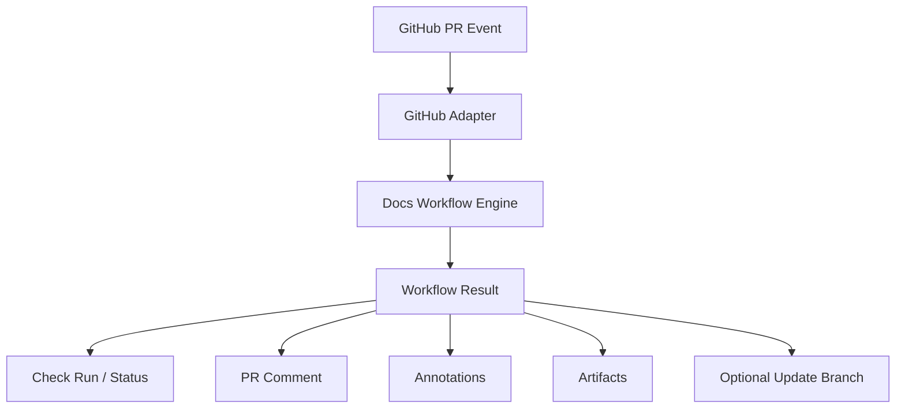
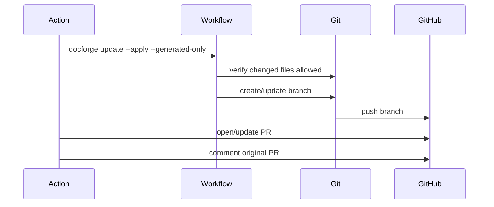
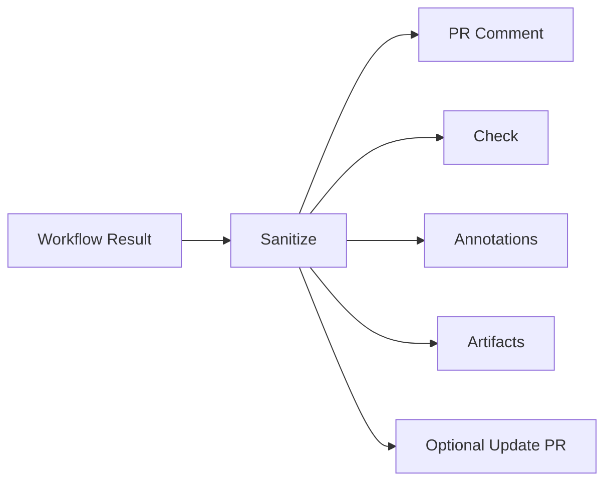

------
title: Build From Scratch: Mintlify-like AI-driven Documentation Generator CLI - Part 036
description: Mendesain GitHub integration dan PR automation untuk AI-driven documentation generator: GitHub Actions, checks, PR comments, annotations, review artifacts, docs update branches, bot permissions, idempotency, security, and operational playbook.
series: learn-mintlify-like-ai-docs-cli
seriesTitle: Build From Scratch: Mintlify-like AI-driven Documentation Generator CLI
order: 36
partTitle: GitHub Integration and PR Automation
tags:
  - documentation
  - ai
  - cli
  - github
  - pull-requests
  - ci
  - automation
  - developer-tools
date: 2026-07-03
---

# Part 036 — GitHub Integration and PR Automation

Part 035 mendesain self-updating workflow core.

Sekarang kita hubungkan workflow itu ke platform yang banyak dipakai untuk code review:

> **GitHub integration and PR automation**

Tujuannya bukan membuat "bot yang spam PR".

Tujuannya:

- menjalankan docs verification di PR,
- memberi komentar ringkas tentang docs impact,
- menambahkan annotations untuk file/line tertentu,
- mengunggah report artifact,
- optionally membuat branch/PR docs update,
- menjaga permission minimal,
- menjaga idempotency,
- dan tidak membocorkan private evidence.

GitHub integration harus menjadi adapter di atas workflow engine, bukan bagian dari core docs logic.

---

## 1. Mental model: GitHub adapter renders workflow results



Workflow engine tetap platform-agnostic.

GitHub adapter bertugas:

- membaca PR context,
- menjalankan command/workflow,
- merender hasil untuk GitHub,
- mengatur permissions,
- menjaga comment idempotency,
- dan mengelola update PR jika diaktifkan.

---

## 2. Integration surfaces

GitHub integration bisa muncul sebagai:

| Surface | Purpose |
|---|---|
| GitHub Actions workflow | Run `docforge verify/update/build` |
| PR comment | Human-readable impact summary |
| Check run/status | Pass/fail/warning signal |
| Annotations | File/line diagnostics |
| Artifact upload | JSON reports, review artifacts |
| Bot branch/commit | Apply generated docs patches |
| Bot PR | Separate docs update PR |
| PR review comments | Inline docs/source suggestions |
| Labels | `docs-stale`, `docs-update-ready` |

Start small: Actions + report artifacts + PR comment.

---

## 3. Recommended integration phases

### Phase 1: CI check only

- run docs build,
- fail on build errors,
- upload report.

### Phase 2: PR impact comment

- run update dry-run,
- comment affected docs and suggested command.

### Phase 3: Generated patch artifact

- upload patch file,
- reviewer can apply manually.

### Phase 4: Bot update branch

- apply safe generated patches,
- push `docforge/docs-update/<pr-number>`,
- open/update docs update PR or comment.

### Phase 5: Inline annotations and review

- annotate stale docs lines,
- suggest fixes for generated blocks.

Avoid jumping directly to bot commits.

---

## 4. GitHub config model

```ts
export type GitHubIntegrationConfig = {
  enabled: boolean;
  prComments: {
    enabled: boolean;
    mode: "summary" | "detailed";
    updateExistingComment: boolean;
  };
  checks: {
    enabled: boolean;
    failOnStalePublicDocs: boolean;
    failOnReviewRequired: boolean;
  };
  annotations: {
    enabled: boolean;
    maxAnnotations: number;
  };
  artifacts: {
    uploadReports: boolean;
    uploadReviewArtifacts: boolean;
  };
  updates: {
    enabled: boolean;
    strategy: "none" | "commitToPrBranch" | "separateBranch" | "separatePullRequest";
    applySafeOnly: boolean;
    branchPrefix: string;
  };
  privacy: {
    exposeSourcePaths: boolean;
    exposeEvidenceExcerpts: boolean;
    redactInternalArtifacts: boolean;
  };
};
```

Example conservative:

```json
{
  "github": {
    "enabled": true,
    "prComments": {
      "enabled": true,
      "mode": "summary",
      "updateExistingComment": true
    },
    "checks": {
      "enabled": true,
      "failOnStalePublicDocs": false,
      "failOnReviewRequired": false
    },
    "annotations": {
      "enabled": true,
      "maxAnnotations": 20
    },
    "updates": {
      "enabled": false,
      "strategy": "none",
      "applySafeOnly": true,
      "branchPrefix": "docforge/docs-update"
    }
  }
}
```

---

## 5. GitHub Actions workflow

Example workflow:

```yaml
name: DocForge Docs

on:
  pull_request:
    types: [opened, synchronize, reopened, ready_for_review]

permissions:
  contents: read
  pull-requests: write
  checks: write

jobs:
  docs:
    runs-on: ubuntu-latest

    steps:
      - uses: actions/checkout@v4
        with:
          fetch-depth: 0

      - uses: actions/setup-node@v4
        with:
          node-version: 20
          cache: pnpm

      - run: corepack enable
      - run: pnpm install --frozen-lockfile

      - run: pnpm docforge verify --strict
      - run: pnpm docforge update --since origin/${{ github.base_ref }} --dry-run --format json > docforge-update-report.json

      - uses: actions/upload-artifact@v4
        with:
          name: docforge-update-report
          path: docforge-update-report.json
```

This is a starting point. Comment posting can be done by a dedicated command:

```bash
docforge github comment --report docforge-update-report.json
```

or by action integration.

---

## 6. Why `fetch-depth: 0` matters

Diff-aware update needs base refs and history.

If checkout only fetches one commit, commands like:

```bash
git diff origin/main...HEAD
```

may fail.

For PR diff workflows, ensure base ref is available.

In GitHub Actions, either fetch full history or fetch the base branch explicitly.

---

## 7. GitHub adapter package layout

```txt
packages/github-integration/
  src/
    context.ts
    config.ts
    actions-env.ts
    reports/
      pr-comment.ts
      annotations.ts
      checks.ts
      artifacts.ts
    commands/
      github-comment.ts
      github-check.ts
      github-update-branch.ts
    update-branch.ts
    permissions.ts
    privacy.ts
    idempotency.ts
    __tests__/
      pr-comment.test.ts
      annotations.test.ts
      privacy.test.ts
      idempotency.test.ts
```

Keep GitHub adapter separate from workflow core.

---

## 8. GitHub context model

```ts
export type GitHubContext = {
  repository: {
    owner: string;
    name: string;
    fullName: string;
  };
  pullRequest?: {
    number: number;
    headRef: string;
    headSha: string;
    baseRef: string;
    baseSha?: string;
    isFork: boolean;
  };
  actor: string;
  eventName: string;
  runId?: string;
  serverUrl: string;
  apiUrl: string;
};
```

Read from environment:

```ts
export function readGitHubActionsContext(env: NodeJS.ProcessEnv): GitHubContext | undefined {
  const repository = env.GITHUB_REPOSITORY;
  const eventName = env.GITHUB_EVENT_NAME;

  if (!repository || !eventName) return undefined;

  const [owner, name] = repository.split("/");

  return {
    repository: { owner, name, fullName: repository },
    actor: env.GITHUB_ACTOR ?? "",
    eventName,
    runId: env.GITHUB_RUN_ID,
    serverUrl: env.GITHUB_SERVER_URL ?? "https://github.com",
    apiUrl: env.GITHUB_API_URL ?? "https://api.github.com",
  };
}
```

Pull request details may come from event payload file.

---

## 9. Event payload parsing

GitHub Actions provides event payload JSON path.

```ts
export async function readGitHubEventPayload(env: NodeJS.ProcessEnv): Promise<unknown | undefined> {
  const path = env.GITHUB_EVENT_PATH;
  if (!path) return undefined;

  return JSON.parse(await fs.readFile(path, "utf8"));
}
```

Parse PR fields carefully.

```ts
export function parsePullRequestContext(payload: any): GitHubContext["pullRequest"] | undefined {
  const pr = payload.pull_request;
  if (!pr) return undefined;

  return {
    number: pr.number,
    headRef: pr.head.ref,
    headSha: pr.head.sha,
    baseRef: pr.base.ref,
    baseSha: pr.base.sha,
    isFork: pr.head.repo?.full_name !== pr.base.repo?.full_name,
  };
}
```

Never assume PR context exists for all events.

---

## 10. Permissions model

GitHub integration needs minimal permissions.

Use cases:

| Action | Needed permission |
|---|---|
| read repo | contents read |
| upload artifacts | actions artifact via workflow |
| comment on PR | pull-requests write or issues write depending method |
| create check run | checks write |
| push branch | contents write |
| open PR | pull-requests write |
| add labels | pull-requests/issues write |

Default should not require write unless comments/updates enabled.

Config should document permissions.

---

## 11. Fork PR security

Fork PRs are security-sensitive.

Risks:

- untrusted code runs in CI,
- secrets unavailable,
- bot write permissions restricted,
- malicious PR may alter docs generator config,
- malicious code may exfiltrate tokens if workflow grants too much.

Safe default for fork PRs:

- run read-only checks,
- do not expose secrets,
- do not run privileged update branch steps,
- do not execute arbitrary local plugins,
- do not comment using privileged token if workflow context unsafe,
- upload sanitized reports only.

Policy:

```ts
export function githubAutomationAllowed(ctx: GitHubContext, config: GitHubIntegrationConfig): GitHubAutomationPermissions {
  if (ctx.pullRequest?.isFork) {
    return {
      canComment: false,
      canPush: false,
      canCreatePr: false,
      canUploadSanitizedArtifacts: true,
    };
  }

  return {
    canComment: config.prComments.enabled,
    canPush: config.updates.enabled,
    canCreatePr: config.updates.strategy === "separatePullRequest",
    canUploadSanitizedArtifacts: true,
  };
}
```

Teams may override carefully, but default conservative.

---

## 12. PR comment design

Comment should be:

- concise,
- idempotent,
- update existing comment,
- include status summary,
- include affected docs,
- include review required,
- include commands,
- avoid huge details,
- link to artifact/report if available.

Example:

```md
<!-- docforge:pr-comment -->

## DocForge documentation report

Status: ⚠️ Review required

### Docs impact

| Source change | Affected docs | Action |
|---|---|---|
| `openapi/public.yaml` | `/api-reference/users/create-user` | Safe generated update |
| `src/commands/build.ts` | `/guides/build-docs` | Review required |

### Suggested next step

```bash
docforge update --since origin/main --apply
```

Full report: workflow artifact `docforge-update-report`
```

Hidden marker enables update-in-place.

---

## 13. Comment idempotency

Do not post a new comment on every push.

Use marker:

```md
<!-- docforge:pr-comment -->
```

Algorithm:

1. list PR comments,
2. find bot comment containing marker,
3. update it,
4. otherwise create new comment.

```ts
export async function upsertPrComment(
  client: GitHubClient,
  ctx: GitHubContext,
  body: string
): Promise<void> {
  const marker = "<!-- docforge:pr-comment -->";
  const comments = await client.listIssueComments(ctx.repository, ctx.pullRequest!.number);
  const existing = comments.find((comment) =>
    comment.body.includes(marker) && comment.user.type === "Bot"
  );

  if (existing) {
    await client.updateComment(existing.id, body);
  } else {
    await client.createIssueComment(ctx.repository, ctx.pullRequest!.number, body);
  }
}
```

Use whichever GitHub API/client abstraction the project chooses.

---

## 14. PR comment rendering model

Render from `PrSummaryModel`, not raw workflow result.

```ts
export function renderPrComment(summary: PrSummaryModel, config: GitHubIntegrationConfig): string {
  return [
    "<!-- docforge:pr-comment -->",
    "",
    `## DocForge documentation report`,
    "",
    `Status: ${renderStatus(summary.status)}`,
    "",
    renderChangedDocsTable(summary),
    renderReviewRequired(summary),
    renderSuggestedCommands(summary),
    renderFooter(summary),
  ].join("\n");
}
```

Privacy filtering happens before render.

---

## 15. PR comment privacy

Do not include:

- secret-like values,
- full evidence excerpts by default,
- internal artifacts if redacted,
- private source paths if disabled,
- prompt text,
- model output,
- token/cost details if not desired.

Redaction:

```ts
export function sanitizePrSummary(
  summary: PrSummaryModel,
  policy: GitHubIntegrationConfig["privacy"]
): PrSummaryModel {
  // remove internal/private evidence, shorten paths, redact sensitive names
  return summary;
}
```

---

## 16. Annotations

Annotations show diagnostics in PR files.

Use cases:

- docs file has broken link,
- generated region stale,
- OpenAPI operation missing operationId,
- config field docs stale,
- unsupported claim in generated docs.

Annotation model:

```ts
export type GitHubAnnotation = {
  path: string;
  startLine: number;
  endLine?: number;
  annotationLevel: "notice" | "warning" | "failure";
  message: string;
  title?: string;
  rawDetails?: string;
};
```

Map diagnostics:

```ts
export function diagnosticToAnnotation(diagnostic: Diagnostic): GitHubAnnotation | undefined {
  if (!diagnostic.location?.path || !diagnostic.location?.line) {
    return undefined;
  }

  return {
    path: diagnostic.location.path,
    startLine: diagnostic.location.line,
    annotationLevel: severityToAnnotationLevel(diagnostic.severity),
    title: diagnostic.code,
    message: diagnostic.message,
  };
}
```

Limit annotations. GitHub surfaces can become noisy.

---

## 17. Annotation limits

Config:

```json
{
  "github": {
    "annotations": {
      "enabled": true,
      "maxAnnotations": 20
    }
  }
}
```

If more diagnostics exist:

```txt
Only showing first 20 annotations. See full report artifact.
```

Sort:

1. errors,
2. warnings,
3. changed files,
4. docs files,
5. source files.

---

## 18. Checks

Check run/status should summarize docs workflow.

Possible conclusions:

| Workflow decision | Check conclusion |
|---|---|
| pass | success |
| warning | neutral or success with warnings |
| fail | failure |
| cancelled | cancelled |
| internal error | failure |

Check output summary:

```md
DocForge found 2 affected documentation pages.

- 1 safe generated update is available.
- 1 manual page requires review.
```

Details link to artifacts/comment.

---

## 19. Checks vs PR comments

Use both carefully.

| Surface | Best for |
|---|---|
| Check | pass/fail status, annotations |
| PR comment | narrative summary, suggested commands |
| Artifact | full machine-readable report |
| Inline review | targeted suggestions |

Do not duplicate huge content everywhere.

---

## 20. Artifact upload

In GitHub Actions, artifact upload is usually done by workflow step.

Files:

```txt
.docforge/reports/ci-docs-report.json
.docforge/reports/update-dry-run-report.json
.docforge/reports/provenance-report.json
.docforge/reviews/**
```

Sanitize before upload if repo/public policy requires.

Command:

```bash
docforge workflow export-reports --out .docforge/reports
```

Workflow:

```yaml
- uses: actions/upload-artifact@v4
  with:
    name: docforge-reports
    path: .docforge/reports
```

---

## 21. Bot update strategies

### Strategy 1: commit to PR branch

Bot commits docs updates directly to PR branch.

Pros:

- simple,
- one PR.

Cons:

- requires write access to contributor branch,
- risky for fork PRs,
- can surprise authors.

### Strategy 2: separate branch in same repo

Bot pushes:

```txt
docforge/docs-update/pr-123
```

Pros:

- safe separation,
- can open separate PR.

Cons:

- two PRs to manage.

### Strategy 3: separate pull request

Bot opens docs update PR targeting original branch or base branch.

Pros:

- reviewable,
- avoids touching user branch.

Cons:

- more workflow complexity.

Recommended default: no bot push. Later: separate branch/PR.

---

## 22. Update branch model

```ts
export type UpdateBranchPlan = {
  branchName: string;
  baseRef: string;
  commitMessage: string;
  changedFiles: string[];
  prTitle?: string;
  prBody?: string;
};
```

Branch naming:

```txt
docforge/docs-update/pr-<number>
docforge/docs-update/<short-sha>
```

Commit message:

```txt
docs: update generated documentation for PR #123
```

Do not include model/provider details in commit message unless useful.

---

## 23. Bot branch idempotency

If branch exists, update it.

Algorithm:

1. fetch branch,
2. reset/rebase to latest target,
3. apply patches,
4. if no diff, delete/close or comment no-op,
5. force-push only bot-owned branch,
6. never force-push user branch.

Branch must include ownership marker.

PR body marker:

```md
<!-- docforge:update-pr -->
```

---

## 24. Bot commit safety

Before commit:

- run `docforge update --apply --generated-only`,
- run `docforge verify --strict`,
- ensure only allowed paths changed,
- ensure no sensitive files changed,
- ensure no `.docforge/index` committed,
- ensure diff is deterministic.

Allowed paths:

```json
{
  "github": {
    "updates": {
      "allowedPaths": [
        "docs/**",
        "openapi/generated-docs/**",
        "docforge.lock.json"
      ]
    }
  }
}
```

If unexpected path changed, abort.

---

## 25. Generated docs lock file

For route locks/provenance, maybe commit lightweight lock.

```txt
docforge.lock.json
```

Contains:

- route locks,
- generator versions,
- page IDs,
- semantic artifact keys.

But be careful not to store private data.

Update bot may modify lock file. This is expected if new generated pages/routes are added.

---

## 26. Opening/updating docs update PR

PR body:

```md
<!-- docforge:update-pr -->

# DocForge generated docs update

This PR updates generated documentation affected by source changes.

## Source changes

- OpenAPI operation changed: `POST /users`
- Config field default changed: `search.enabled`

## Updated docs

- `/api-reference/users/create-user`
- `/reference/configuration`

## Validation

- MDX compile: passed
- Link check: passed
- Provenance: updated
```

Idempotency:

- find existing open PR with marker and source PR number,
- update branch/body,
- otherwise create.

---

## 27. Labels

Optional labels:

- `docs-stale`,
- `docs-update-ready`,
- `docs-review-required`,
- `docforge`.

Labels should be configurable.

Do not require label permissions unless enabled.

---

## 28. Inline review comments

Inline comments can be useful but easy to spam.

Use only for:

- generated region conflict,
- unsupported claim in changed docs line,
- broken link in changed line,
- missing operationId in OpenAPI line.

Avoid commenting on every warning.

Model:

```ts
export type InlineReviewComment = {
  path: string;
  line: number;
  body: string;
  severity: "warning" | "error";
};
```

Policy:

- max comments,
- only changed lines,
- update existing? hard; prefer Check annotations first.

---

## 29. GitHub PR summary examples

### No docs impact

```md
## DocForge documentation report

Status: ✅ No docs updates needed

No public documentation impact was detected for this PR.
```

### Generated updates available

```md
## DocForge documentation report

Status: ⚠️ Generated docs update available

DocForge found 2 generated API reference pages that can be updated safely.

Run locally:

```bash
docforge update --since origin/main --apply --only api
```
```

### Review required

```md
## DocForge documentation report

Status: ⚠️ Review required

A manual guide references changed API behavior.

| Page | Reason |
|---|---|
| `/guides/user-management` | Mentions response schema changed by `openapi/public.yaml` |
```

### Failure

```md
## DocForge documentation report

Status: ❌ Failed

Docs verification failed.

Errors:
- Broken link in `/quickstart`
- Unsupported claim in generated block `build-output`

See workflow artifacts for the full report.
```

---

## 30. GitHub workflow variants

### Verify only

```yaml
- run: pnpm docforge verify --strict
```

### Dry-run and comment

```yaml
- run: pnpm docforge update --since origin/${{ github.base_ref }} --dry-run --format json > report.json
- run: pnpm docforge github comment --report report.json
```

### Safe generated update PR

```yaml
- run: pnpm docforge update --since origin/${{ github.base_ref }} --apply --generated-only
- run: pnpm docforge verify --strict
- run: pnpm docforge github update-pr
```

Keep separate jobs if permission differs.

---

## 31. Pull request from fork workflow

For fork PR:

- run verification with read-only token,
- upload sanitized artifact,
- do not comment if token lacks permission,
- do not run local untrusted plugins,
- do not use secrets,
- do not push.

Example policy:

```json
{
  "github": {
    "forks": {
      "allowComments": false,
      "allowUpdates": false,
      "allowCustomPlugins": false
    }
  }
}
```

If comment impossible, job summary can still show output.

---

## 32. Job summary

GitHub Actions supports step summaries. Conceptually, adapter can write Markdown summary file.

Command:

```bash
docforge github summary --report report.json >> "$GITHUB_STEP_SUMMARY"
```

This does not require PR comment permissions.

Summary should be sanitized.

---

## 33. Authentication and tokens

Never ask users to paste tokens into docs config.

In Actions, token is provided by environment. Adapter reads token only when needed.

```ts
export type GitHubClientConfig = {
  token?: string;
  apiUrl: string;
};
```

If no token and operation requires write:

```txt
warning github.token.missing
Cannot post PR comment because GitHub token is unavailable.
```

Do not fail docs build solely because optional comment failed unless configured.

---

## 34. API client abstraction

Avoid tying core to one GitHub client.

```ts
export type GitHubClient = {
  listIssueComments(repo: RepoRef, issueNumber: number): Promise<GitHubComment[]>;
  createIssueComment(repo: RepoRef, issueNumber: number, body: string): Promise<void>;
  updateComment(commentId: number, body: string): Promise<void>;
  createCheckRun?(input: CreateCheckRunInput): Promise<void>;
  createOrUpdateBranch?(plan: UpdateBranchPlan): Promise<void>;
  createPullRequest?(input: CreatePullRequestInput): Promise<void>;
};
```

Implement with REST/GraphQL/CLI as adapter detail.

---

## 35. Resilience to API failures

If posting comment fails:

- report warning,
- do not fail docs verification by default,
- upload artifact if possible.

If update branch push fails:

- fail update automation,
- do not mark docs as updated,
- print recovery.

Diagnostics:

```txt
warning github.comment.failed
DocForge completed docs analysis but failed to update PR comment.
```

---

## 36. Check annotations from diagnostics

Diagnostics already have:

```ts
type Diagnostic = {
  code: string;
  severity: "info" | "warning" | "error";
  message: string;
  location?: {
    path?: string;
    line?: number;
    column?: number;
  };
};
```

Map:

```ts
export function severityToAnnotationLevel(severity: DiagnosticSeverity): "notice" | "warning" | "failure" {
  switch (severity) {
    case "error": return "failure";
    case "warning": return "warning";
    default: return "notice";
  }
}
```

Annotation message should be short. Put long detail in artifact/report.

---

## 37. Changed-line filtering

To avoid noisy comments, only annotate changed lines by default.

Need patch line map.

```ts
export type ChangedLineMap = Map<string, Set<number>>;

export function isDiagnosticOnChangedLine(
  diagnostic: Diagnostic,
  changedLines: ChangedLineMap
): boolean {
  const path = diagnostic.location?.path;
  const line = diagnostic.location?.line;

  if (!path || !line) return false;

  return changedLines.get(path)?.has(line) ?? false;
}
```

For build-wide errors without line, use check summary.

---

## 38. PR comment size control

GitHub comments have practical size limits and readability limits.

Rules:

- show top N affected pages,
- collapse details in `<details>`,
- link artifact for full report,
- truncate long diagnostics,
- never paste entire evidence.

Example:

```md
<details>
<summary>Show diagnostics</summary>

...
</details>
```

---

## 39. Markdown rendering safety

Generated PR comments are Markdown. Escape user-controlled content.

Potential issues:

- table injection,
- code fence breaking,
- HTML injection,
- mention spam with `@everyone`/`@org/team`.

Escape or wrap in code.

```ts
export function escapeMarkdownTableCell(value: string): string {
  return value.replace(/\|/g, "\\|").replace(/\n/g, " ");
}
```

Avoid rendering untrusted source text as raw Markdown.

---

## 40. Mention suppression

If evidence contains `@user`, PR comment may mention people.

Sanitize:

```ts
export function suppressMentions(text: string): string {
  return text.replace(/@/g, "@\u200B");
}
```

Use for paths/messages from source content.

---

## 41. GitHub diagnostics

Codes:

| Code | Meaning |
|---|---|
| `github.context.missing` | not running in GitHub context |
| `github.token.missing` | token unavailable |
| `github.permission.denied` | action lacks permission |
| `github.comment.failed` | PR comment failed |
| `github.comment.updated` | PR comment updated |
| `github.annotation.tooMany` | annotations truncated |
| `github.updateBranch.disabledForFork` | update disabled for fork PR |
| `github.updateBranch.unexpectedFileChange` | patch modified disallowed file |
| `github.pr.upsert.failed` | docs update PR failed |

---

## 42. GitHub command surface

```bash
docforge github comment --report .docforge/reports/ci-docs-report.json
docforge github summary --report .docforge/reports/ci-docs-report.json
docforge github annotations --report .docforge/reports/ci-docs-report.json
docforge github update-pr --report .docforge/reports/update-dry-run-report.json
docforge github doctor
```

`github doctor` checks:

- GitHub context detected,
- token present if needed,
- permissions likely sufficient,
- base ref available,
- report files exist.

---

## 43. GitHub doctor output

```txt
GitHub integration doctor

Context:
  repository: acme/docforge
  event: pull_request
  PR: #123
  fork: false

Permissions:
  comments: available
  checks: available
  push updates: disabled by config

Git:
  base ref: origin/main available
  head ref: HEAD

Reports:
  .docforge/reports/ci-docs-report.json found
```

If not in GitHub:

```txt
Not running inside GitHub Actions.
```

Exit 0 unless strict.

---

## 44. GitHub update branch flow



Separate from normal verify job.

---

## 45. Allowed file guard

Before pushing bot branch:

```ts
export function validateChangedFilesAllowed(
  changedFiles: string[],
  allowedGlobs: string[]
): Diagnostic[] {
  return changedFiles.flatMap((file) => {
    if (matchesAny(file, allowedGlobs)) return [];

    return [{
      code: "github.updateBranch.unexpectedFileChange",
      severity: "error",
      category: "github",
      message: `Update branch modified disallowed file: ${file}.`,
    }];
  });
}
```

This prevents accidental commits of store/traces/secrets.

---

## 46. Bot identity

Commit author:

```txt
DocForge Bot <docforge-bot@example.com>
```

Or use GitHub Actions bot identity.

Commit message includes marker:

```txt
docs: update generated docs

Generated by DocForge.
Source PR: #123
```

Avoid huge metadata.

---

## 47. Update PR body idempotency marker

```md
<!-- docforge:update-pr source-pr=123 -->

# Generated documentation update for PR #123
...
```

Find existing PRs by:

- branch name,
- body marker,
- label.

Update instead of creating duplicates.

---

## 48. Avoid update loops

If bot PR triggers workflow, it may create another update PR.

Prevention:

- detect bot branch prefix,
- skip update-pr job on bot branches,
- allow verify/build only.

```ts
export function isDocForgeBotBranch(branch: string, prefix: string): boolean {
  return branch.startsWith(prefix);
}
```

In workflow:

```yaml
if: ${{ !startsWith(github.head_ref, 'docforge/docs-update') }}
```

---

## 49. Comment on original PR with update PR link

If separate update PR created:

```md
Generated docs update PR: #456

This PR updates generated API/config reference affected by the current changes.
```

If update PR already exists, update link/status.

---

## 50. Stale bot branch cleanup

If source PR closes/merges:

- close update PR,
- delete bot branch if configured,
- or leave for audit.

This can be scheduled or event-driven.

Config:

```json
{
  "github": {
    "updates": {
      "cleanupOnSourcePrClose": true
    }
  }
}
```

---

## 51. GitHub integration privacy modes

### Public repository mode

- no evidence excerpts,
- no internal paths beyond changed files,
- no model traces,
- no prompts,
- no private artifacts.

### Private repository mode

- can include source paths,
- maybe line links,
- still no secrets/prompts by default.

Config should not infer privacy solely from GitHub visibility unless adapter can know. Let user configure.

---

## 52. GitHub source links

For annotations/comments, source links can be built.

```ts
export function githubSourceUrl(ctx: GitHubContext, path: string, ref: string, line?: number): string {
  const base = `${ctx.serverUrl}/${ctx.repository.fullName}/blob/${ref}/${encodeURI(path)}`;
  return line ? `${base}#L${line}` : base;
}
```

Use head SHA for PR source.

But if `exposeSourcePaths=false`, do not render.

---

## 53. PR comment from provenance

For affected docs, include source cause.

```md
| Source | Docs | Why |
|---|---|---|
| `openapi/public.yaml` | `/api-reference/users/create-user` | OpenAPI operation changed |
```

If privacy hides source path:

```md
| Source | Docs | Why |
|---|---|---|
| OpenAPI spec | `/api-reference/users/create-user` | API operation changed |
```

---

## 54. Integration with checks and branch protection

Teams may use GitHub branch protection requiring checks.

Check names should be stable:

```txt
DocForge / Verify
DocForge / Docs Drift
DocForge / Build
```

Avoid dynamic names that break branch protection.

---

## 55. Matrix workflows

For monorepo:

```yaml
strategy:
  matrix:
    docs-project: [public-docs, internal-docs]

steps:
  - run: pnpm docforge verify --project ${{ matrix.docs-project }}
```

Report should include project name.

---

## 56. Caching in GitHub Actions

Cache:

- package manager dependencies,
- `.docforge/index` maybe,
- parser cache.

But cache must be invalidated by:

- lockfile,
- docforge config,
- parser/query versions,
- source hashes.

Safe default: cache package dependencies first; add index cache later.

If index cache stale, DocForge must detect.

---

## 57. Large reports

For large repos, PR comment should not list hundreds of pages.

Summary:

```md
DocForge found 143 affected generated API pages.

Showing top 10. Full report is available as workflow artifact.
```

Use grouping:

- API reference: 120 pages,
- config reference: 1 page,
- guides: 3 pages review required.

---

## 58. Rate limiting and retries

GitHub API calls may fail transiently.

Adapter should:

- retry limited times for comments/checks,
- avoid retrying non-idempotent operations without idempotency marker,
- respect failure policy.

For comment update, idempotent.

For PR creation, check existing branch/PR first.

---

## 59. Security: workflow command injection

Do not build shell commands from PR title/branch without escaping.

Bad:

```bash
git checkout $BRANCH
```

Good:

- use API/exec args array,
- validate branch names,
- avoid shell interpolation.

```ts
await execFile("git", ["checkout", branchName], { cwd });
```

---

## 60. Security: untrusted config changes

PR may modify `docforge.config.json`.

If workflow reads config from PR, malicious contributor could:

- enable custom plugins,
- enable remote specs,
- exfiltrate evidence via comments,
- change update paths.

Policy for untrusted PRs:

- restrict dangerous config fields,
- ignore local plugins,
- force privacy policy,
- disable update branch,
- disallow remote fetching unless trusted.

```ts
export type TrustedAutomationMode = "trusted" | "untrustedFork" | "restricted";
```

In restricted mode, override config.

---

## 61. GitHub integration tests

### 61.1 Comment rendering

```ts
it("renders idempotent PR comment marker", () => {
  const body = renderPrComment(summary, config);

  expect(body).toContain("<!-- docforge:pr-comment -->");
});
```

### 61.2 Privacy redaction

```ts
it("redacts evidence excerpts in public mode", () => {
  const safe = sanitizePrSummary(summaryWithEvidence, publicPolicy);

  expect(JSON.stringify(safe)).not.toContain("internalImplementationDetail");
});
```

### 61.3 Annotation limit

```ts
it("limits annotations", () => {
  const annotations = diagnosticsToAnnotations(manyDiagnostics, { maxAnnotations: 10 });

  expect(annotations).toHaveLength(10);
});
```

### 61.4 Fork policy

```ts
it("disables updates for fork PRs", () => {
  const permissions = githubAutomationAllowed(forkContext, config);

  expect(permissions.canPush).toBe(false);
});
```

---

## 62. End-to-end GitHub fixture

Simulate:

- PR context payload,
- workflow report,
- existing comments,
- adapter upsert.

Test:

```ts
it("updates existing PR comment", async () => {
  const client = new FakeGitHubClient({
    comments: [{ id: 1, body: "<!-- docforge:pr-comment --> old", user: { type: "Bot" } }],
  });

  await upsertPrComment(client, ctx, "new body");

  expect(client.updatedComments[0].id).toBe(1);
});
```

---

## 63. Operational playbook

Recommended GitHub rollout:

### Step 1

Add verify workflow:

```bash
docforge verify --strict
docforge build
```

### Step 2

Add dry-run report artifact:

```bash
docforge update --since origin/main --dry-run --format json
```

### Step 3

Add PR comment summary.

### Step 4

Enable annotations with low max count.

### Step 5

Enable generated-only update PR on trusted branches.

### Step 6

Add release branch protection requiring DocForge checks.

---

## 64. Failure modes

| Failure | Cause | Prevention |
|---|---|---|
| Bot spams comments | no idempotency marker | update existing comment |
| Bot leaks private evidence | report not sanitized | privacy policy |
| Fork PR exfiltrates secrets | privileged workflow on untrusted code | restricted fork mode |
| Bot commits unexpected files | broad git add | allowed path guard |
| Infinite update PR loop | bot branch triggers update job | branch prefix skip |
| Huge PR comment unreadable | report too detailed | summary + artifacts |
| Inline comments noisy | annotating every warning | limits + changed-line filter |
| CI cannot diff base | shallow checkout | fetch base/full history |
| Update branch overwrites user branch | direct push strategy | separate bot branch default |
| GitHub API failure breaks docs build | comment required by default | optional notification failure policy |

---

## 65. Key takeaways

GitHub integration should be a thin, safe adapter over the workflow engine.



Strong GitHub automation design:

1. starts read-only,
2. uses idempotent comments,
3. keeps checks stable,
4. limits annotations,
5. uploads full reports as artifacts,
6. treats forks as untrusted,
7. uses minimal permissions,
8. guards bot commits by allowed paths,
9. prevents update loops,
10. and separates GitHub rendering from docs workflow logic.

Next, we implement **link checker and content quality gates**.
