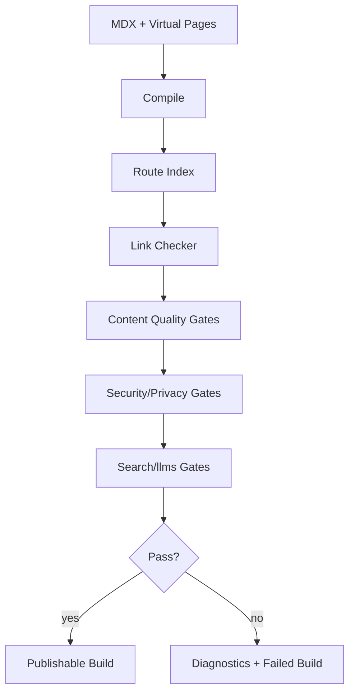
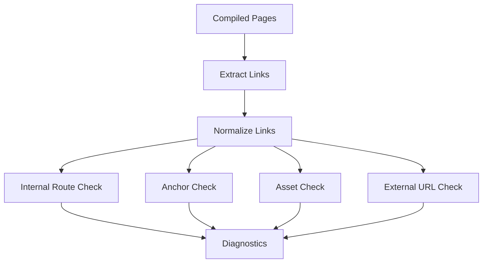
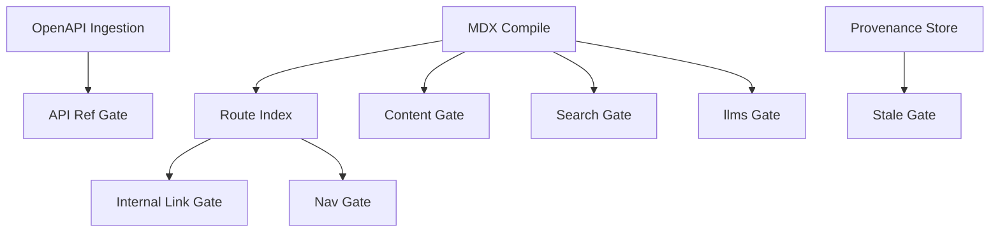
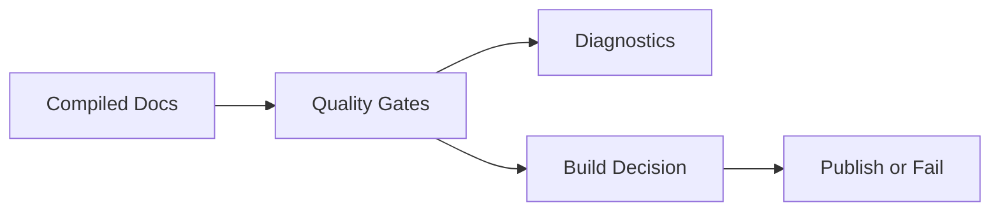

------
title: Build From Scratch: Mintlify-like AI-driven Documentation Generator CLI - Part 037
description: Mendesain link checker dan content quality gates untuk AI-driven documentation generator: internal/external links, anchors, redirects, assets, API references, prose quality, stale content, generated claim gates, CI policies, diagnostics, and reporting.
series: learn-mintlify-like-ai-docs-cli
seriesTitle: Build From Scratch: Mintlify-like AI-driven Documentation Generator CLI
order: 37
partTitle: Link Checker and Content Quality Gates
tags:
  - documentation
  - ai
  - cli
  - link-checker
  - quality-gates
  - mdx
  - developer-tools
date: 2026-07-03
---

# Part 037 — Link Checker and Content Quality Gates

Kita sudah membangun:

- scanner,
- parser,
- MDX compiler,
- navigation,
- static build,
- OpenAPI pipeline,
- AI planner/writer/reviewer,
- provenance,
- diff-aware update,
- workflow,
- GitHub automation.

Sekarang kita perlu menjawab pertanyaan production:

> Bagaimana memastikan dokumentasi yang dipublish tidak rusak?

Docs generator production-grade harus punya **quality gates**.

Quality gates adalah aturan yang menentukan apakah docs:

- boleh dibuild,
- boleh dipublish,
- boleh masuk PR,
- butuh review,
- atau harus gagal.

Quality gates mencakup:

- link internal,
- anchor,
- route,
- asset,
- redirect,
- external link,
- MDX component,
- OpenAPI operation ref,
- code sample ref,
- stale provenance,
- unsupported AI claim,
- content quality,
- search/llms export,
- privacy/security.

Tanpa quality gates, generator hanya membuat teks. Dengan quality gates, generator menjadi compiler yang menjaga kualitas.

---

## 1. Mental model: docs build is quality-gated compilation



Quality gates adalah bagian dari build pipeline, bukan lint opsional belaka.

---

## 2. Quality gate taxonomy

```ts
export type QualityGateCategory =
  | "links"
  | "anchors"
  | "routes"
  | "assets"
  | "mdx"
  | "navigation"
  | "openapi"
  | "codeSamples"
  | "provenance"
  | "aiGrounding"
  | "content"
  | "search"
  | "llms"
  | "security"
  | "privacy"
  | "performance";
```

Gate result:

```ts
export type QualityGateResult = {
  gateId: string;
  category: QualityGateCategory;
  status: "pass" | "warning" | "fail" | "skipped";
  diagnostics: Diagnostic[];
  stats?: Record<string, number>;
};
```

Build aggregate:

```ts
export type QualityReport = {
  schemaVersion: "quality-report/v1";
  status: "pass" | "warning" | "fail";
  results: QualityGateResult[];
  summary: QualitySummary;
};

export type QualitySummary = {
  errors: number;
  warnings: number;
  info: number;
  skipped: number;
};
```

---

## 3. Gate severity policy

A diagnostic has severity. A gate decides whether severity blocks build.

```ts
export type QualityGatePolicy = {
  gateId: string;
  enabled: boolean;
  failOn: Array<"error" | "warning">;
  mode: "off" | "warn" | "strict";
};
```

Global config:

```json
{
  "quality": {
    "mode": "strict",
    "gates": {
      "links.internal": "error",
      "links.external": "warning",
      "provenance.stale": "error",
      "content.headingHierarchy": "warning",
      "ai.unsupportedClaims": "error"
    }
  }
}
```

Modes:

| Mode | Behavior |
|---|---|
| `off` | gate skipped |
| `warn` | diagnostics but no fail |
| `strict` | configured severities fail |
| `ci` | stricter default for CI |
| `release` | strictest |

---

## 4. Quality gate runner

```ts
export type QualityGate = {
  id: string;
  category: QualityGateCategory;
  run(input: QualityGateInput): Promise<QualityGateResult>;
};

export type QualityGateInput = {
  projectRoot: string;
  config: NormalizedConfig;
  pageManifest: PageManifest;
  routeIndex: RouteIndex;
  compiledPages: CompiledPage[];
  nav: NavTree;
  assets: AssetManifest;
  knowledgeStore: KnowledgeStore;
  buildContext: BuildContext;
};
```

Runner:

```ts
export async function runQualityGates(
  gates: QualityGate[],
  input: QualityGateInput,
  policy: QualityPolicy
): Promise<QualityReport> {
  const results: QualityGateResult[] = [];

  for (const gate of gates) {
    if (!isGateEnabled(gate.id, policy)) {
      results.push({
        gateId: gate.id,
        category: gate.category,
        status: "skipped",
        diagnostics: [],
      });
      continue;
    }

    const result = await gate.run(input);
    results.push(applyGatePolicy(result, policy));
  }

  return aggregateQualityReport(results);
}
```

---

## 5. Link model

Links can come from many sources:

- Markdown links,
- MDX component props,
- nav items,
- cards,
- redirects,
- OpenAPI docs components,
- generated breadcrumbs,
- footer/social links,
- code blocks? usually not as link refs,
- `llms.txt` exports.

Link extraction should produce normalized records.

```ts
export type LinkReference = {
  id: string;
  sourcePageId?: PageId;
  sourcePath: string;
  sourceBlockId?: string;
  href: string;
  text?: string;
  kind:
    | "markdown"
    | "mdxComponent"
    | "nav"
    | "redirect"
    | "asset"
    | "image"
    | "openapi"
    | "llms";
  location?: SourceLocation;
};
```

Normalized link:

```ts
export type NormalizedLink = {
  original: LinkReference;
  target: LinkTarget;
};

export type LinkTarget =
  | { type: "internalRoute"; route: RoutePath; anchor?: string }
  | { type: "externalUrl"; url: string }
  | { type: "asset"; path: string }
  | { type: "mailto"; address: string }
  | { type: "tel"; value: string }
  | { type: "fragment"; anchor: string }
  | { type: "unknown"; reason: string };
```

---

## 6. Link extraction from MDX AST

During MDX compile, collect:

```md
[Quickstart](/quickstart)
[Section](#configure-openapi)
[External](https://example.com)
```

Also images:

```md

```

Component props:

```mdx
<Card title="Quickstart" href="/quickstart" />
```

Tabs/cards/nav generated components must register link-bearing props in component registry.

```ts
export type ComponentLinkExtractor = {
  componentName: string;
  extractLinks(node: MdxJsxElementNode): LinkReference[];
};
```

Component spec:

```ts
export type ComponentSpec = {
  name: string;
  linkProps?: string[];
};
```

---

## 7. Link normalization

```ts
export function normalizeLinkReference(
  ref: LinkReference,
  page: CompiledPage,
  config: NormalizedConfig
): NormalizedLink {
  const href = ref.href.trim();

  if (href.startsWith("#")) {
    return {
      original: ref,
      target: { type: "fragment", anchor: href.slice(1) },
    };
  }

  if (href.startsWith("mailto:")) {
    return { original: ref, target: { type: "mailto", address: href.slice("mailto:".length) } };
  }

  if (href.startsWith("tel:")) {
    return { original: ref, target: { type: "tel", value: href.slice("tel:".length) } };
  }

  if (/^https?:\/\//.test(href)) {
    return { original: ref, target: { type: "externalUrl", url: href } };
  }

  if (href.startsWith("/")) {
    const { route, anchor } = splitRouteAnchor(href);
    return { original: ref, target: { type: "internalRoute", route, anchor } };
  }

  if (isAssetLike(href)) {
    return { original: ref, target: { type: "asset", path: resolveRelativeAsset(page.route, href) } };
  }

  const { route, anchor } = splitRouteAnchor(resolveRelativeRoute(page.route, href));
  return { original: ref, target: { type: "internalRoute", route, anchor } };
}
```

---

## 8. Internal route checking

Internal route check uses route index.

```ts
export function checkInternalRoute(
  link: NormalizedLink,
  routeIndex: RouteIndex
): Diagnostic[] {
  if (link.target.type !== "internalRoute") return [];

  const route = routeIndex.get(link.target.route);

  if (!route) {
    return [{
      code: "link.internal.routeNotFound",
      severity: "error",
      category: "links",
      message: `Internal link points to missing route: ${link.target.route}.`,
      location: link.original.location,
      hint: "Update the href or add a page for this route.",
    }];
  }

  if (link.target.anchor && !route.anchors.has(link.target.anchor)) {
    return [{
      code: "link.internal.anchorNotFound",
      severity: "error",
      category: "links",
      message: `Internal link points to missing anchor: #${link.target.anchor}.`,
      location: link.original.location,
      hint: `Available anchors include: ${[...route.anchors].slice(0, 5).join(", ")}`,
    }];
  }

  return [];
}
```

---

## 9. Anchor generation consistency

Anchor checking requires same slug algorithm as renderer.

Do not use separate slug logic in checker.

Use shared function:

```ts
export function headingToAnchor(text: string): string {
  return slugifyHeading(text);
}
```

Route record:

```ts
export type RouteRecord = {
  route: RoutePath;
  pageId: PageId;
  sourcePath: string;
  anchors: Set<string>;
};
```

During compile:

- collect headings,
- compute anchors,
- detect duplicates,
- store anchor map.

Duplicate headings:

```txt
warning content.heading.duplicateAnchor
Multiple headings produce anchor #configuration.
```

Renderer may append suffix. Checker must know final anchor.

---

## 10. Anchor aliases

If heading changes, old links break.

Support explicit anchor alias:

```mdx
## Configure OpenAPI {#configure-openapi}
```

or frontmatter/sidecar aliases.

Model:

```ts
export type AnchorAlias = {
  pageId: PageId;
  alias: string;
  targetAnchor: string;
};
```

This is useful for stable docs links.

---

## 11. Redirect checking

Redirects:

```json
{
  "redirects": [
    { "from": "/old-quickstart", "to": "/quickstart" }
  ]
}
```

Check:

- `from` unique,
- `to` route exists or external URL allowed,
- no redirect loops,
- no redirect from current route conflict,
- no chain too long.

Loop detection:

```ts
export function detectRedirectLoops(redirects: RedirectRule[]): Diagnostic[] {
  const map = new Map(redirects.map((r) => [r.from, r.to]));

  const diagnostics: Diagnostic[] = [];

  for (const redirect of redirects) {
    const seen = new Set<string>();
    let current = redirect.from;

    while (map.has(current)) {
      if (seen.has(current)) {
        diagnostics.push({
          code: "redirect.loop",
          severity: "error",
          category: "routes",
          message: `Redirect loop detected starting at ${redirect.from}.`,
        });
        break;
      }

      seen.add(current);
      current = map.get(current)!;
    }
  }

  return diagnostics;
}
```

---

## 12. Asset checking

Assets include:

- images,
- logos,
- downloadable files,
- CSS/JS bundles,
- OpenGraph images,
- favicons.

Check:

- referenced asset exists,
- path is safe,
- file size within budget,
- image alt text present,
- public asset not outside allowed root,
- no sensitive file accidentally referenced.

Asset diagnostic:

```txt
error asset.missing
Image /assets/architecture.svg was referenced but not found.
```

Alt text:

```txt
warning asset.image.missingAlt
Image is missing alt text.
```

---

## 13. External link checking

External links are slow and flaky. Treat carefully.

Modes:

| Mode | Behavior |
|---|---|
| `off` | skip |
| `syntax` | validate URL shape only |
| `fast` | HEAD request with timeout |
| `full` | GET fallback, redirects |
| `ciCached` | use cache to avoid repeated checks |

Default local: `syntax`.  
Default CI: maybe `fast` or cached.  
Release: `full` if acceptable.

Config:

```json
{
  "quality": {
    "externalLinks": {
      "mode": "fast",
      "timeoutMs": 5000,
      "maxConcurrency": 8,
      "retry": 1,
      "allowlist": ["https://github.com/**"],
      "ignore": ["https://localhost/**"]
    }
  }
}
```

---

## 14. External link result model

```ts
export type ExternalLinkCheckResult = {
  url: string;
  status:
    | "ok"
    | "redirect"
    | "broken"
    | "timeout"
    | "skipped"
    | "blocked"
    | "unknown";
  statusCode?: number;
  finalUrl?: string;
  error?: string;
  checkedAt: string;
};
```

Diagnostics:

```txt
warning link.external.redirect
External link redirects from A to B.
```

```txt
error link.external.broken
External link returned 404.
```

Policy can make external broken warning, not error, to avoid flaky CI.

---

## 15. External link cache

```ts
export type ExternalLinkCacheEntry = {
  url: string;
  result: ExternalLinkCheckResult;
  expiresAt: string;
};
```

Cache key includes URL.

TTL config:

```json
{
  "quality": {
    "externalLinks": {
      "cacheTtlHours": 24
    }
  }
}
```

Do not cache forever.

---

## 16. External link security

Do not let link checker become SSRF tool.

Rules:

- block localhost/private IPs by default,
- allow only http/https,
- no file protocol,
- no arbitrary internal hosts unless configured,
- limit redirects,
- limit response size,
- no credentialed requests,
- do not send cookies/tokens.

This matters if docs content comes from untrusted PR.

---

## 17. Link checker pipeline



Implementation:

```ts
export async function runLinkChecker(input: LinkCheckerInput): Promise<QualityGateResult> {
  const refs = extractAllLinks(input.compiledPages, input.nav);
  const normalized = refs.map((ref) => normalizeLinkReference(ref, pageForRef(ref), input.config));

  const diagnostics = [
    ...normalized.flatMap((link) => checkInternalRoute(link, input.routeIndex)),
    ...normalized.flatMap((link) => checkAssetLink(link, input.assets)),
    ...await checkExternalLinks(normalized, input.config),
  ];

  return {
    gateId: "links",
    category: "links",
    status: diagnostics.some((d) => d.severity === "error") ? "fail" : "pass",
    diagnostics,
    stats: {
      links: refs.length,
      internal: normalized.filter((l) => l.target.type === "internalRoute").length,
      external: normalized.filter((l) => l.target.type === "externalUrl").length,
    },
  };
}
```

---

## 18. Navigation quality gates

Navigation gates from Part 013.

Checks:

- every nav page exists,
- no duplicate nav entries unless allowed,
- no empty groups,
- no orphan important pages,
- generated sections resolve,
- nav depth reasonable,
- external nav links safe,
- hidden/draft pages not exposed in production.

Diagnostic:

```txt
error nav.page.notFound
Navigation references missing page: /reference/configuration.
```

```txt
warning nav.group.tooLarge
Navigation group "API Reference" has 213 direct children.
```

---

## 19. Content quality gates

Content gates are not just grammar.

Categories:

| Gate | Checks |
|---|---|
| heading hierarchy | no skipped levels, unique anchors |
| frontmatter | title/description/kind valid |
| page length | max/min length per page kind |
| page kind pattern | quickstart has steps/verify; reference has structured details |
| duplicate content | duplicate titles/sections |
| empty sections | headings without content |
| stale markers | page/block stale |
| draft/hidden policy | drafts not in production |
| terminology | forbidden/inconsistent terms |
| readability | excessive long paragraphs |
| generated ownership | generated blocks have provenance |

---

## 20. Frontmatter gate

```ts
export function checkFrontmatter(page: CompiledPage): Diagnostic[] {
  const diagnostics: Diagnostic[] = [];

  if (!page.frontmatter.title) {
    diagnostics.push({
      code: "frontmatter.title.missing",
      severity: "error",
      category: "content",
      message: "Page frontmatter is missing title.",
      location: { path: page.sourcePath },
    });
  }

  if (!page.frontmatter.description) {
    diagnostics.push({
      code: "frontmatter.description.missing",
      severity: "warning",
      category: "content",
      message: "Page frontmatter is missing description.",
      location: { path: page.sourcePath },
    });
  }

  return diagnostics;
}
```

---

## 21. Heading hierarchy gate

```ts
export function checkHeadingHierarchy(page: CompiledPage): Diagnostic[] {
  const diagnostics: Diagnostic[] = [];
  let previousLevel = 1;

  for (const heading of page.headings) {
    if (heading.level > previousLevel + 1) {
      diagnostics.push({
        code: "content.heading.skippedLevel",
        severity: "warning",
        category: "content",
        message: `Heading jumps from H${previousLevel} to H${heading.level}.`,
        location: heading.location,
      });
    }

    previousLevel = heading.level;
  }

  return diagnostics;
}
```

Generated pages should be stricter than manual pages? Maybe yes.

---

## 22. Empty section gate

A heading followed by another heading with no content is usually bad.

```txt
warning content.section.empty
Section "Troubleshooting" has no content.
```

Allow exception if placeholder/draft page, but production strict should fail for generated pages.

---

## 23. Page kind pattern gate

For page kind `howTo`, require:

- steps or ordered procedure,
- verification section,
- prerequisites if needed.

For `quickstart`:

- install/init/run/build path,
- not too exhaustive,
- next steps links.

For `reference`:

- formal entries/tables,
- no long narrative-only body.

Pattern checks can be partly deterministic and partly AI/reviewer.

Initial deterministic:

```ts
export function checkHowToPattern(page: CompiledPage): Diagnostic[] {
  const headings = page.headings.map((h) => h.text.toLowerCase());
  const hasVerify = headings.some((h) => h.includes("verify") || h.includes("validate"));

  if (!hasVerify) {
    return [{
      code: "content.howTo.missingVerification",
      severity: "warning",
      category: "content",
      message: "How-to page should include a verification section.",
      location: { path: page.sourcePath },
    }];
  }

  return [];
}
```

---

## 24. Duplicate content gate

Detect duplicate routes/titles/headings.

```ts
export function checkDuplicateTitles(pages: CompiledPage[]): Diagnostic[] {
  const byTitle = new Map<string, CompiledPage[]>();

  for (const page of pages) {
    const key = normalizeTitleKey(page.frontmatter.title);
    byTitle.set(key, [...(byTitle.get(key) ?? []), page]);
  }

  return [...byTitle.entries()].flatMap(([title, group]) => {
    if (group.length <= 1) return [];

    return [{
      code: "content.title.duplicate",
      severity: "warning",
      category: "content",
      message: `Multiple pages use similar title: ${title}.`,
      hint: group.map((p) => p.route).join(", "),
    }];
  });
}
```

Exact duplicate pages can be found via content hashes.

---

## 25. Stale provenance gate

From Part 033.

```ts
export async function runStaleProvenanceGate(input: QualityGateInput): Promise<QualityGateResult> {
  const stale = await findStalePages(input.knowledgeStore);

  const diagnostics = stale.map((item) => ({
    code: "provenance.page.stale",
    severity: item.public ? "error" : "warning",
    category: "provenance",
    message: `Page ${item.route} is stale: ${item.reason}.`,
    location: { path: item.sourcePath },
  }));

  return gateResult("provenance.stale", "provenance", diagnostics);
}
```

Production public docs should fail if stale.

---

## 26. AI grounding gate

Checks:

- generated AI blocks have evidence IDs,
- no unsupported claims from reviewer,
- review status approved or reviewRequired based policy,
- model output trace exists if AI-generated,
- missing evidence not blocking.

Diagnostic:

```txt
error ai.claim.unsupported
Generated claim in block "build-output" is unsupported by evidence.
```

```txt
error ai.review.required
AI-generated page requires human review before publishing.
```

This is essential for trust.

---

## 27. OpenAPI quality gates

From Part 023/024.

Checks:

- spec valid,
- operation IDs unique,
- required path params defined,
- no duplicate operation routes,
- operation pages generated for public operations,
- API component refs resolve,
- schema viewer can render schemas,
- examples safe.

Build should fail for invalid OpenAPI if API reference generated from it.

---

## 28. API reference link gates

API docs often have generated links to:

- schemas,
- operations,
- tags,
- playground,
- code samples.

Check:

- `<ApiOperation operationId="...">` resolves,
- schema refs resolve,
- operation ID ambiguous? specId required,
- deprecated/removed operation pages not linked as active unless intended.

Diagnostic:

```txt
error api.operationRef.notFound
ApiOperation component references unknown operationId createUser.
```

---

## 29. Code sample quality gates

Part 038 goes deep. At this level:

- sample generated successfully,
- no secret-like values,
- language tag present,
- code sample source known,
- syntax/execution verification status acceptable,
- SDK mappings high-confidence if SDK sample shown.

Diagnostic:

```txt
error codeSample.secret.detected
Code sample contains secret-like value.
```

```txt
warning codeSample.notVerified
Code sample was generated but not execution-verified.
```

Policy decides if not verified blocks publish.

---

## 30. Security gates

Security gates:

- unsafe links,
- secret-like values,
- private evidence in public output,
- unsafe shell commands,
- external script execution,
- public output contains `.docforge`,
- raw prompts/traces in dist,
- unsafe HTML/JS injection,
- untrusted MDX expressions if restricted mode.

```txt
error security.secretLike
Page contains a secret-like token.
```

```txt
error security.publicOutput.privateArtifact
Public build output includes private DocForge artifact.
```

---

## 31. Privacy gates

Privacy gates check:

- internal routes not published in public docs,
- sensitive evidence not cited publicly,
- source paths hidden if policy,
- private API specs excluded,
- env vars marked secret not documented as public config,
- prompt/model traces not exported.

```txt
error privacy.internalArtifactPublished
Internal artifact GET /internal/reindex is included in public documentation.
```

---

## 32. Search quality gates

Search build should not silently degrade.

Checks:

- search index generated if enabled,
- every public page has search chunk,
- hidden/draft pages excluded,
- duplicate routes absent,
- important entities indexed,
- search index size within budget.

```txt
warning search.page.missing
Public page /quickstart has no search document.
```

```txt
warning search.index.tooLarge
Search index is 18 MB, exceeding configured budget of 10 MB.
```

---

## 33. `llms.txt` quality gates

Checks:

- `llms.txt` generated if enabled,
- important pages included,
- hidden/private pages excluded,
- API operations summarized,
- code samples sanitized,
- export size under budget,
- source page hashes fresh.

```txt
error llms.privatePageIncluded
llms.txt includes hidden/internal page /internal/runbooks.
```

```txt
warning llms.export.tooLarge
llms-full.txt exceeds configured size budget.
```

---

## 34. Performance gates

Docs site can become slow.

Initial static gates:

- total HTML size,
- JS bundle size,
- search index size,
- asset size,
- page count,
- largest page size,
- large images.

```json
{
  "quality": {
    "budgets": {
      "maxSearchIndexBytes": 10485760,
      "maxPageHtmlBytes": 524288,
      "maxAssetBytes": 2097152
    }
  }
}
```

Diagnostic:

```txt
warning performance.page.tooLarge
Page /api-reference/big-schema is 1.2 MB.
```

---

## 35. Quality gates by environment

| Gate | Dev | Build | CI | Release |
|---|---|---|---|---|
| MDX compile | error | error | error | error |
| internal links | warning/error | error | error | error |
| external links | off/syntax | warning | warning | error optional |
| stale provenance | warning | warning/error | error for public | error |
| AI unsupported claims | error | error | error | error |
| style warnings | info | warning | warning | warning |
| search index | warning | error if enabled | error | error |
| llms export | warning | error if enabled | error | error |
| performance budgets | off/warn | warn | warn | error optional |

---

## 36. Diagnostics design

Diagnostics must be actionable.

Bad:

```txt
Broken link.
```

Good:

```txt
error link.internal.routeNotFound docs/guides/openapi.mdx:42:12
Internal link points to missing route: /reference/openapi-config

Hint:
Use /reference/configuration#openapi or create a page at /reference/openapi-config.
```

Include:

- code,
- severity,
- path,
- line/column,
- message,
- hint,
- related routes if possible.

---

## 37. Suggestions for broken internal links

For missing route, suggest closest routes.

```ts
export function suggestRoutes(missing: RoutePath, routeIndex: RouteIndex): RoutePath[] {
  return [...routeIndex.routes()]
    .map((route) => ({ route, score: similarity(missing, route) }))
    .sort((a, b) => b.score - a.score)
    .slice(0, 5)
    .map((item) => item.route);
}
```

Diagnostic hint:

```txt
Did you mean:
- /reference/configuration
- /guides/openapi-reference
```

---

## 38. Reporting formats

Quality reports should support:

```bash
docforge check
docforge check --format json
docforge check --format ndjson
docforge check --strict
docforge check --only links
docforge check --only provenance
```

Human output:

```txt
Quality check failed

Errors:
- link.internal.routeNotFound docs/guides/openapi.mdx:42
- ai.claim.unsupported docs/guides/build.mdx:block build-output

Warnings:
- content.howTo.missingVerification docs/guides/openapi.mdx
```

JSON output for CI/integrations.

---

## 39. Check command

```bash
docforge check
```

Alias for selected quality gates without full static build.

Options:

```txt
--strict
--only links,content,provenance
--changed
--format human|json|ndjson
--external-links off|syntax|fast|full
--fail-on-warning
```

`docforge build` should run necessary gates too.

`docforge check` is for faster standalone validation.

---

## 40. Changed-only checks

For PR/local speed:

```bash
docforge check --changed
```

Changed-only should still include cross-page effects:

- changed page links,
- routes if new/deleted pages,
- affected pages by provenance,
- nav if page added/removed.

Do not check only changed MDX file if route graph changed.

---

## 41. Gate dependency graph

Some gates need earlier outputs.



Gate runner should order dependencies or operate after full compile.

---

## 42. Quality report storage

Store reports:

```txt
.docforge/reports/
  quality-report.json
  link-report.json
  provenance-report.json
```

Knowledge store can keep latest summary.

```sql
CREATE TABLE quality_runs (
  id TEXT PRIMARY KEY,
  started_at TEXT NOT NULL,
  ended_at TEXT,
  status TEXT NOT NULL,
  config_hash TEXT NOT NULL,
  report_json TEXT NOT NULL
);
```

Do not commit reports unless configured.

---

## 43. Quality gates and GitHub annotations

Diagnostics can become annotations.

Part 036 mapping applies.

For link checker:

- broken link location in MDX,
- missing route maybe docs page line,
- missing external link line.

For generated virtual pages, no source path maybe; use page route in summary.

---

## 44. Content quality vs personal taste

Avoid turning subjective preferences into blocking errors.

Good hard errors:

- broken internal link,
- unknown component,
- unsupported AI claim,
- secret value,
- missing API operation ref.

Good warnings:

- long paragraph,
- missing verification section,
- duplicate title,
- external redirect.

Style should be configurable.

---

## 45. Quality profiles

```json
{
  "quality": {
    "profile": "balanced"
  }
}
```

Profiles:

### Relaxed

- good during early docs migration,
- most content style issues info/warn,
- stale internal docs warn.

### Balanced

- internal links fail,
- AI unsupported claims fail,
- stale public docs fail in CI,
- style warnings only.

### Strict

- stale docs fail,
- external broken links fail,
- coverage thresholds enforced,
- generated pages require full provenance.

---

## 46. Quality coverage thresholds

```json
{
  "quality": {
    "coverage": {
      "apiEndpoint": 1.0,
      "cliCommand": 1.0,
      "configField": 0.95,
      "publicExport": 0.8
    }
  }
}
```

Gate:

```txt
error coverage.apiEndpoint.belowThreshold
API endpoint documentation coverage is 96%, below required 100%.
```

Coverage gates are powerful but can be harsh. Use after adoption.

---

## 47. Quality gates for generated vs manual docs

Generated docs should satisfy stricter machine guarantees.

Generated page:

- must have provenance,
- must compile,
- must be fresh,
- must not have unsupported claims,
- can be auto-updated.

Manual page:

- may lack provenance,
- can warn for missing provenance,
- should still pass links/security.

Hybrid page:

- generated regions strict,
- manual regions protected.

---

## 48. Gate result to workflow decision

Quality report feeds Part 035 workflow.

```ts
export function qualityReportToWorkflowDecision(report: QualityReport): WorkflowDecision {
  if (report.status === "fail") {
    return {
      status: "fail",
      blockers: report.results.flatMap((r) => r.diagnostics.filter((d) => d.severity === "error")),
      warnings: report.results.flatMap((r) => r.diagnostics.filter((d) => d.severity === "warning")),
    };
  }

  return {
    status: report.status === "warning" ? "warning" : "pass",
    blockers: [],
    warnings: report.results.flatMap((r) => r.diagnostics.filter((d) => d.severity === "warning")),
  };
}
```

---

## 49. Testing link checker

Fixtures:

```txt
fixtures/link-checker/
  internal-ok/
  internal-missing-route/
  internal-missing-anchor/
  relative-link/
  asset-missing/
  external-syntax-invalid/
  redirect-loop/
```

Test:

```ts
it("reports missing internal route", async () => {
  const result = await runLinkCheckerFixture("internal-missing-route");

  expect(result.diagnostics).toContainEqual(
    expect.objectContaining({
      code: "link.internal.routeNotFound",
      severity: "error",
    })
  );
});
```

---

## 50. Testing quality gates

Fixtures:

```txt
fixtures/quality/
  stale-generated-page/
  unsupported-ai-claim/
  secret-in-code-block/
  quickstart-missing-verify/
  public-output-leaks-docforge/
  search-missing-page/
  llms-includes-hidden-page/
```

Test aggregate:

```ts
it("fails strict quality report for unsupported AI claim", async () => {
  const report = await runQualityFixture("unsupported-ai-claim", strictPolicy());

  expect(report.status).toBe("fail");
});
```

---

## 51. External link testing

Avoid real network in unit tests.

Use fake HTTP client.

```ts
export type HttpLinkClient = {
  check(url: string, options: LinkCheckOptions): Promise<ExternalLinkCheckResult>;
};
```

Test:

```ts
it("reports 404 external link", async () => {
  const client = new FakeLinkClient({
    "https://example.com/missing": { status: "broken", statusCode: 404 },
  });

  const result = await checkExternalLinks(links, config, client);

  expect(result.diagnostics[0].code).toBe("link.external.broken");
});
```

---

## 52. Quality gates package layout

```txt
packages/quality-gates/
  src/
    policy.ts
    runner.ts
    report.ts
    diagnostics.ts
    gates/
      links/
        extract.ts
        normalize.ts
        internal.ts
        external.ts
        assets.ts
        redirects.ts
      content/
        frontmatter.ts
        headings.ts
        page-kind.ts
        duplicates.ts
      navigation.ts
      provenance.ts
      ai-grounding.ts
      openapi.ts
      code-samples.ts
      search.ts
      llms.ts
      security.ts
      privacy.ts
      performance.ts
    reporters/
      human.ts
      json.ts
      ndjson.ts
    __tests__/
      link-internal.test.ts
      link-external.test.ts
      content.test.ts
      provenance.test.ts
      runner.test.ts
```

---

## 53. Integration with build

`docforge build` flow:

```txt
load config
scan/index
compile MDX
build route/nav/page manifests
generate virtual pages
run quality gates
if pass:
  render static site
  build search/llms
  run output quality gates
write manifest
```

Some gates run before rendering, some after.

Pre-render gates:

- MDX compile,
- route/nav,
- internal links,
- provenance.

Post-render gates:

- output private leak,
- asset existence in dist,
- bundle/search size,
- `llms.txt`.

---

## 54. Integration with dev server

Dev server should run fast gates incrementally:

- compile current page,
- internal link check for current page,
- route/nav update,
- relevant stale warnings,
- no external link checks by default.

Show overlay:

```txt
Quality warnings:
- Missing anchor #configure-openapi
- Page is stale because config schema changed
```

Do not block dev server entirely for warnings.

---

## 55. Integration with AI reviewer

AI reviewer produces issues. Quality gate consumes review status.

Important: reviewer is one source of diagnostics. Quality gate enforces policy.

```ts
export async function runAiGroundingGate(input: QualityGateInput): Promise<QualityGateResult> {
  const diagnostics = await input.knowledgeStore.reviews.listBlockingIssues();

  return gateResult("ai.grounding", "aiGrounding", diagnostics);
}
```

---

## 56. Anti-pattern: external links fail every CI randomly

External links are flaky. Avoid making them hard errors by default unless cached and controlled.

Better:

- syntax check as error,
- external HTTP failures as warning,
- strict release can fail,
- allow ignore list.

---

## 57. Anti-pattern: quality gate rewrites content

Quality gates diagnose. They do not rewrite.

Repair/update workflow may fix issues later, but gates should be pure checks.

---

## 58. Anti-pattern: opaque "quality score"

A single score hides actionable issues.

Bad:

```txt
Docs quality score: 82
```

Good:

```txt
Errors:
- 2 broken internal links
- 1 unsupported AI claim

Warnings:
- 3 pages missing descriptions
- 1 external link timeout
```

Use metrics, but never replace diagnostics.

---

## 59. Anti-pattern: style as hard-coded taste

Avoid hardcoding:

- "no passive voice",
- exact sentence length,
- specific tone,

unless user config says so.

Hard gates should be objective.

---

## 60. Minimal implementation milestone

First version:

1. link extraction from MDX and component props,
2. internal route/anchor checker,
3. asset checker,
4. frontmatter/heading content gates,
5. provenance stale gate,
6. AI grounding gate using review results,
7. security secret scan gate,
8. quality policy and runner,
9. `docforge check`,
10. JSON/human reports.

Second version:

1. external link checker with cache,
2. redirect loop checker,
3. search/llms quality gates,
4. performance budgets,
5. page kind pattern gates,
6. coverage thresholds,
7. GitHub annotations integration,
8. changed-only gate runner,
9. public/private citation gates,
10. quality profiles.

---

## 61. Failure modes

| Failure | Cause | Prevention |
|---|---|---|
| Broken internal links publish | no route/anchor checker | internal link gate |
| Build flaky in CI | external links hard fail | cache/warn policy |
| Generated hallucination publishes | no AI grounding gate | unsupported claim gate |
| Secrets leak | no security scan | secret/privacy gates |
| Public docs include internal pages | no visibility gate | privacy gate |
| Search misses pages | no search gate | search coverage check |
| `llms.txt` includes private page | no llms gate | llms privacy check |
| Style warnings block adoption | hardcoded taste | configurable profiles |
| Manual pages over-policed | same policy as generated | owner-aware gates |
| Diagnostics unusable | vague messages | actionable diagnostic design |

---

## 62. Key takeaways

Quality gates turn documentation generation into a trustworthy build system.



Strong quality gate design:

1. checks links, routes, anchors, and assets,
2. enforces provenance and AI grounding,
3. separates hard errors from style warnings,
4. supports local/CI/release profiles,
5. avoids flaky external checks by default,
6. protects public output from private data,
7. emits actionable diagnostics,
8. supports machine-readable reports,
9. integrates with workflow/GitHub,
10. and never publishes broken generated docs.

Next, we verify the most copied part of docs: **code examples**.
