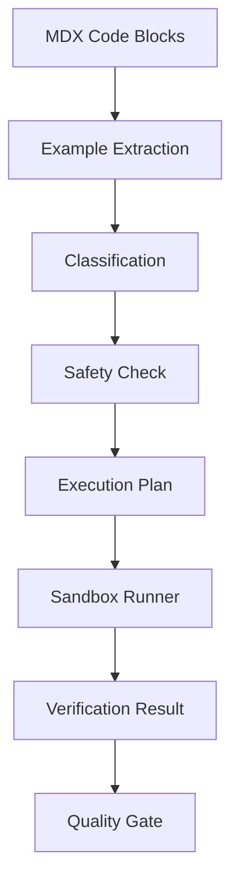
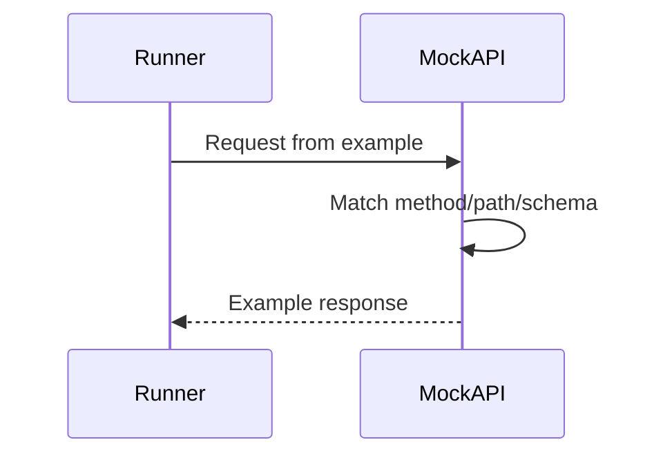
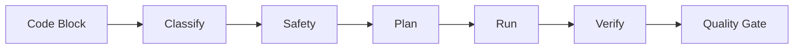

------
title: Build From Scratch: Mintlify-like AI-driven Documentation Generator CLI - Part 038
description: Mendesain code example execution dan verification untuk documentation generator: extracting runnable examples, sandbox policy, language runners, dependency setup, expected outputs, snapshot tests, API mocks, deterministic verification, safety gates, and CI integration.
series: learn-mintlify-like-ai-docs-cli
seriesTitle: Build From Scratch: Mintlify-like AI-driven Documentation Generator CLI
order: 38
partTitle: Code Example Execution and Verification
tags:
  - documentation
  - ai
  - cli
  - code-examples
  - testing
  - sandbox
  - quality-gates
  - developer-tools
date: 2026-07-03
---

# Part 038 — Code Example Execution and Verification

Code examples adalah bagian dokumentasi yang paling sering dicopy.

Jika code example salah, user langsung kehilangan trust.

Examples yang salah bisa muncul dari:

- code lama,
- API berubah,
- SDK berubah,
- CLI flag berubah,
- dependency berubah,
- environment berubah,
- AI hallucination,
- manual typo,
- syntax error,
- missing import,
- command destructive,
- secret hardcoded,
- dan code block yang bukan intended runnable example.

Karena itu, docs generator production-grade harus punya sistem:

> **code example execution and verification**

Tujuannya bukan mengeksekusi semua code block secara membabi buta.

Tujuannya:

- ekstrak example yang memang runnable,
- klasifikasikan jenisnya,
- jalankan dalam sandbox/isolated environment,
- validasi output/exit code,
- gunakan mock untuk API calls,
- cek syntax untuk bahasa yang tidak dieksekusi penuh,
- scan safety,
- dan jadikan hasilnya quality gate.

---

## 1. Mental model: examples are tests

Treat documentation examples like tests.



Not every code block is executable. But every executable example should be verifiable.

---

## 2. Example categories

```ts
export type CodeExampleKind =
  | "shellCommand"
  | "cliCommand"
  | "httpRequest"
  | "apiSample"
  | "sdkSample"
  | "sourceSnippet"
  | "configSnippet"
  | "outputSnippet"
  | "pseudoCode"
  | "nonRunnable";
```

Examples:

| Code block | Kind |
|---|---|
| `docforge build --strict` | cliCommand |
| `curl -X POST ...` | httpRequest/apiSample |
| TypeScript SDK code | sdkSample |
| `docforge.config.json` | configSnippet |
| Java class snippet | sourceSnippet |
| CLI output | outputSnippet |
| Algorithm sketch | pseudoCode |

Verification strategy depends on kind.

---

## 3. Verification levels

```ts
export type VerificationLevel =
  | "none"
  | "parse"
  | "lint"
  | "compile"
  | "execute"
  | "executeWithMock"
  | "snapshot";
```

| Kind | Recommended level |
|---|---|
| config snippet | parse/schema validate |
| CLI command | execute or dry-run |
| shell command | execute if safe |
| cURL sample | executeWithMock or syntax |
| SDK sample | compile/executeWithMock |
| source snippet | compile if context available |
| output snippet | snapshot only |
| pseudoCode | none |
| nonRunnable | none |

---

## 4. Example metadata

Use code fence metadata or MDX props.

```mdx
```bash title="Build docs" docforge verify
docforge build --strict
```
```

Better explicit:

````mdx
```bash title="Build docs" docforge:example kind="cliCommand" verify="execute"
docforge build --strict
```
````

Metadata model:

```ts
export type CodeExampleMetadata = {
  title?: string;
  kind?: CodeExampleKind;
  verify?: VerificationLevel;
  cwd?: string;
  timeoutMs?: number;
  expectedExitCode?: number;
  expectedOutput?: string;
  env?: Record<string, string>;
  requiresNetwork?: boolean;
  allowFailure?: boolean;
  setup?: string[];
  cleanup?: string[];
};
```

For generated examples, metadata can come from generator sidecar.

---

## 5. Extracted example model

```ts
export type ExtractedCodeExample = {
  id: string;
  pageId: PageId;
  sourcePath: string;
  blockId: string;
  language: string;
  code: string;
  metadata: CodeExampleMetadata;
  kind: CodeExampleKind;
  verificationLevel: VerificationLevel;
  provenance: SourceRef[];
  location?: SourceLocation;
};
```

ID:

```txt
example:<pageId>:<blockId>
```

Stable block IDs matter.

---

## 6. Example extraction

From compiled MDX/Content IR.

```ts
export function extractCodeExamples(page: CompiledPage): ExtractedCodeExample[] {
  return page.codeBlocks.map((block) => {
    const metadata = parseCodeFenceMeta(block.meta);

    const kind = metadata.kind ?? classifyCodeExample({
      language: block.language,
      code: block.code,
      page,
      metadata,
    });

    return {
      id: `example:${page.id}:${block.id}`,
      pageId: page.id,
      sourcePath: page.sourcePath,
      blockId: block.id,
      language: block.language,
      code: block.code,
      metadata,
      kind,
      verificationLevel: metadata.verify ?? defaultVerificationLevel(kind),
      provenance: block.provenance,
      location: block.location,
    };
  });
}
```

---

## 7. Example classification

```ts
export function classifyCodeExample(input: {
  language: string;
  code: string;
  page: CompiledPage;
  metadata: CodeExampleMetadata;
}): CodeExampleKind {
  const code = input.code.trim();

  if (input.metadata.kind) return input.metadata.kind;

  if (input.language === "json" || input.language === "yaml") {
    if (looksLikeConfig(code)) return "configSnippet";
  }

  if (input.language === "bash" || input.language === "sh" || input.language === "shell") {
    if (code.startsWith("curl ")) return "httpRequest";
    if (code.startsWith("docforge ")) return "cliCommand";
    return "shellCommand";
  }

  if (["typescript", "ts", "javascript", "js", "python", "java", "go"].includes(input.language)) {
    if (looksLikeSdkSample(code)) return "sdkSample";
    return "sourceSnippet";
  }

  if (input.language === "text") {
    return "outputSnippet";
  }

  return "nonRunnable";
}
```

Classification can be wrong. Metadata overrides.

---

## 8. Safety first

Never execute arbitrary code by default.

Execution requires:

- explicit metadata or generated trusted sample,
- safe command classification,
- sandbox policy,
- no dangerous patterns,
- no network unless allowed,
- no secrets,
- timeout,
- working directory isolation.

Safety scan:

```ts
export type ExampleSafetyResult = {
  safe: boolean;
  findings: SafetyFinding[];
};

export type SafetyFinding = {
  code: string;
  severity: "error" | "warning";
  message: string;
};
```

Danger patterns:

- `rm -rf`,
- `sudo`,
- `curl ... | sh`,
- `chmod 777`,
- `terraform destroy`,
- `kubectl delete`,
- `drop database`,
- writing to `/etc`,
- reading secret files,
- network exfiltration.

---

## 9. Sandbox policy

```ts
export type ExampleSandboxPolicy = {
  enabled: boolean;
  allowNetwork: boolean;
  allowFileWrites: boolean;
  allowSubprocesses: boolean;
  allowedCommands: string[];
  blockedCommands: string[];
  timeoutMs: number;
  memoryLimitMb?: number;
  cpuLimitMs?: number;
  workingDirectoryMode: "temp" | "projectFixture" | "repoReadOnly";
  envPolicy: "minimal" | "configured" | "inherit";
};
```

Default:

```ts
{
  enabled: true,
  allowNetwork: false,
  allowFileWrites: true,
  allowSubprocesses: true,
  allowedCommands: ["node", "npm", "pnpm", "python", "java", "go", "docforge"],
  blockedCommands: ["sudo", "rm", "curl|sh"],
  timeoutMs: 10000,
  workingDirectoryMode: "temp",
  envPolicy: "minimal",
}
```

In practice, sandboxing is platform-dependent. Start with temp dirs, command allowlist, timeout, env isolation. Strong sandbox later.

---

## 10. Execution plan

```ts
export type ExampleExecutionPlan = {
  exampleId: string;
  runnerId: string;
  steps: ExecutionStep[];
  sandbox: ExampleSandboxPolicy;
  expected: ExpectedResult;
};

export type ExecutionStep =
  | { type: "writeFile"; path: string; content: string }
  | { type: "runCommand"; command: string; args: string[]; cwd?: string; env?: Record<string, string> }
  | { type: "validateFile"; path: string; schema?: string }
  | { type: "cleanup" };

export type ExpectedResult = {
  exitCode?: number;
  stdoutContains?: string[];
  stderrContains?: string[];
  stdoutMatches?: string;
  outputFiles?: string[];
};
```

---

## 11. Verification result

```ts
export type ExampleVerificationResult = {
  exampleId: string;
  status: "passed" | "failed" | "skipped" | "blocked";
  level: VerificationLevel;
  runnerId?: string;
  durationMs?: number;
  exitCode?: number;
  stdout?: string;
  stderr?: string;
  diagnostics: Diagnostic[];
  verifiedAt: string;
};
```

Status meanings:

| Status | Meaning |
|---|---|
| passed | verification succeeded |
| failed | attempted and failed |
| skipped | not configured/not supported |
| blocked | unsafe/policy blocked |

Blocked unsafe examples should usually fail quality gate.

Skipped may warn.

---

## 12. Runner interface

```ts
export type CodeExampleRunner = {
  id: string;
  supports(example: ExtractedCodeExample): boolean;
  plan(example: ExtractedCodeExample, ctx: VerificationContext): Promise<ExampleExecutionPlan>;
  run(plan: ExampleExecutionPlan, ctx: VerificationContext): Promise<ExampleVerificationResult>;
};
```

Context:

```ts
export type VerificationContext = {
  projectRoot: string;
  tempRoot: string;
  config: NormalizedConfig;
  sandboxPolicy: ExampleSandboxPolicy;
  dependencyCache?: DependencyCache;
  mockServer?: MockServerController;
};
```

---

## 13. Config snippet verification

JSON config:

```json
{
  "openapi": {
    "specs": [{ "id": "public", "path": "openapi/public.yaml" }]
  }
}
```

Verification:

1. parse JSON,
2. validate against config schema,
3. if paths referenced, optionally check fixture paths,
4. no execution.

Runner:

```ts
export class JsonConfigExampleRunner implements CodeExampleRunner {
  id = "json-config";

  supports(example: ExtractedCodeExample): boolean {
    return example.kind === "configSnippet" && example.language === "json";
  }

  async run(plan: ExampleExecutionPlan): Promise<ExampleVerificationResult> {
    try {
      const parsed = JSON.parse(plan.steps[0].content);
      const result = ConfigSchema.safeParse(parsed);

      if (!result.success) {
        return failed("example.config.invalid", result.error.message);
      }

      return passed();
    } catch (error) {
      return failed("example.json.invalid", String(error));
    }
  }
}
```

YAML config similarly.

---

## 14. CLI command verification

Example:

```bash
docforge build --strict
```

Verification options:

1. `--help` parse only,
2. execute in fixture project,
3. dry-run if command supports it,
4. use fake project.

Metadata:

````mdx
```bash docforge:example kind="cliCommand" verify="execute" cwd="fixtures/basic-docs"
docforge build --strict
```
````

Runner:

```ts
export class CliCommandExampleRunner implements CodeExampleRunner {
  id = "cli-command";

  supports(example: ExtractedCodeExample): boolean {
    return example.kind === "cliCommand";
  }

  async plan(example: ExtractedCodeExample, ctx: VerificationContext): Promise<ExampleExecutionPlan> {
    const command = parseShellCommand(example.code);

    return {
      exampleId: example.id,
      runnerId: this.id,
      sandbox: ctx.sandboxPolicy,
      steps: [{
        type: "runCommand",
        command: command.command,
        args: command.args,
        cwd: resolveExampleCwd(example, ctx),
        env: minimalEnv(),
      }],
      expected: {
        exitCode: example.metadata.expectedExitCode ?? 0,
      },
    };
  }
}
```

Need command allowlist.

---

## 15. Shell parsing

Do not execute shell string directly if possible.

Parse simple command:

```ts
export type ParsedCommand = {
  command: string;
  args: string[];
};
```

For multi-line shell commands, use shell only in stricter sandbox or parse line by line.

Initial safe approach:

- support single command,
- support line continuation `\`,
- reject pipes/redirection unless allowed,
- reject command substitution,
- reject `&&` chains unless explicitly allowed.

Diagnostic:

```txt
warning example.shell.unsupportedSyntax
Shell example uses pipes or command chaining and cannot be executed safely.
```

---

## 16. JavaScript/TypeScript verification

Levels:

- parse using parser,
- typecheck in fixture tsconfig,
- execute with Node if standalone,
- mock API calls.

Generated `fetch` examples may require environment.

Simpler initial:

- syntax parse,
- optional execute if metadata says.

Plan:

1. write `example.ts`,
2. create minimal `package.json`,
3. install? avoid network,
4. use project dependencies if available,
5. run `node`/`tsx` only if tool exists.

Better for generated HTTP examples:

- verify code generation snapshot,
- do not execute network calls by default.

---

## 17. Python verification

Levels:

- `ast.parse` for syntax,
- execute in temp dir if no external dependencies,
- skip if imports unavailable,
- use mock for requests if configured.

Python `requests` is not standard library. If unavailable, syntax parse still useful.

Runner can detect imports:

```ts
export function extractPythonImports(code: string): string[] {
  // simple parser or regex fallback
  return [];
}
```

If imports include unavailable packages, skip compile/execute with diagnostic.

---

## 18. Java verification

Levels:

- syntax/compile via `javac`,
- execute if full class with `main`,
- SDK samples require dependencies.

Java snippets often are not full files. Metadata can provide wrapper.

```mdx
```java docforge:example kind="sdkSample" verify="compile" wrapper="java-main"
AcmeClient client = ...
```
```

Wrapper:

```java
public class Example {
  public static void main(String[] args) throws Exception {
    // snippet
  }
}
```

But imports/classes must exist. For SDK, need dependency setup.

Initial: syntax-ish by wrapping only when dependencies available; otherwise skip.

---

## 19. Go verification

Go examples can be compiled if full file.

For snippet:

- wrap in `package main`,
- add imports if generator knows them.

Use `gofmt`/`go test` if Go installed.

Plan:

```txt
write main.go
go test ./...
```

No network by default, so dependencies must be local/module cached.

---

## 20. SDK sample verification

SDK samples need package availability.

Options:

1. verify against local SDK source in monorepo,
2. verify against installed package,
3. syntax only,
4. mock SDK types,
5. skip.

Best for build-from-scratch:

- if SDK package exists in repo, use workspace.
- if generated docs for external SDK, require verification fixture.

SDK verification config:

```json
{
  "examples": {
    "sdk": {
      "typescript": {
        "packageRoot": "packages/sdk-js",
        "verify": "typecheck"
      },
      "java": {
        "modulePath": "sdk/java",
        "verify": "compile"
      }
    }
  }
}
```

---

## 21. API sample verification with mock server

HTTP examples should not call real production APIs in CI.

Use mock server generated from OpenAPI examples.



Mock verifies:

- method,
- path,
- query required,
- body shape,
- auth placeholder maybe,
- content type.

No real network.

---

## 22. Mock server model

```ts
export type MockServer = {
  start(registry: OpenApiRegistry): Promise<MockServerHandle>;
};

export type MockServerHandle = {
  baseUrl: string;
  stop(): Promise<void>;
  requests(): MockRequestRecord[];
};
```

For example cURL:

```bash
curl -X POST "$MOCK_API_URL/users" ...
```

During verification, replace server URL with mock server URL.

Request builder/code samples should support verification base URL override.

---

## 23. HTTP request verification

For cURL sample:

1. sanitize/replace base URL,
2. execute cURL if available,
3. mock server records request,
4. validate request matched operation,
5. validate exit code,
6. validate response status.

If cURL unavailable, parse sample and verify generated request model.

---

## 24. Avoid real network by default

Config:

```json
{
  "examples": {
    "execution": {
      "allowNetwork": false
    }
  }
}
```

If example requires network:

````mdx
```bash docforge:example requiresNetwork verify="none"
curl https://api.example.com/status
```
````

Quality gate can warn:

```txt
warning example.network.skipped
Example requires network and was not executed.
```

---

## 25. Expected output verification

Example metadata:

````mdx
```bash docforge:example verify="execute" expectedOutput="Build completed"
docforge build
```
````

Model:

```ts
export type ExpectedOutput =
  | { type: "contains"; text: string }
  | { type: "regex"; pattern: string }
  | { type: "snapshot"; snapshotId: string };
```

Snapshot file:

```txt
__snapshots__/quickstart-build.stdout
```

Be careful: output can include paths/timestamps. Normalize.

---

## 26. Output normalization

```ts
export function normalizeExampleOutput(output: string): string {
  return output
    .replace(/\r\n/g, "\n")
    .replace(/\/tmp\/docforge-[A-Za-z0-9_-]+/g, "<TMP>")
    .replace(/\d{4}-\d{2}-\d{2}T\d{2}:\d{2}:\d{2}.\d+Z/g, "<TIMESTAMP>")
    .trim();
}
```

Snapshots should be stable.

---

## 27. Environment variables

Examples may use env vars:

```bash
API_TOKEN=... docforge ...
```

Do not require real secret.

Use placeholder env:

```ts
export function buildExampleEnv(example: ExtractedCodeExample): Record<string, string> {
  return {
    ...minimalEnv(),
    API_TOKEN: "test-token",
    DOCFORGE_TEST_MODE: "1",
  };
}
```

If env var is secret-like, use fake value. Never pull from real environment unless configured.

---

## 28. Dependency setup

Some examples require dependencies.

Metadata:

````mdx
```ts docforge:example verify="execute" setup="pnpm install --offline"
...
```
````

But setup commands can be dangerous/slow.

Prefer prebuilt fixtures.

Config:

```json
{
  "examples": {
    "fixtures": {
      "quickstart": "fixtures/examples/quickstart"
    }
  }
}
```

Example metadata:

```mdx
```bash docforge:example fixture="quickstart" verify="execute"
docforge build
```
```

---

## 29. Fixture-based verification

A fixture is a small project.

```txt
fixtures/examples/quickstart/
  docforge.config.json
  docs/index.mdx
  package.json
```

Runner copies fixture to temp dir, runs command.

```ts
export async function prepareFixtureCwd(
  fixturePath: string,
  ctx: VerificationContext
): Promise<string> {
  const cwd = await createTempDir(ctx.tempRoot);
  await copyDirectory(fixturePath, cwd);
  return cwd;
}
```

This makes examples reproducible.

---

## 30. Generated example verification

Generated code samples from Part 026 can be verified at generation time.

```ts
export type GeneratedCodeSample = {
  ...
  verification?: ExampleVerificationResult;
};
```

Flow:

```txt
generate sample -> verify sample -> attach status -> render docs
```

If sample fails, do not render or mark with diagnostic.

---

## 31. Example provenance

Verification result should be stored with provenance.

```ts
export type ExampleVerificationRecord = {
  exampleId: string;
  pageId: PageId;
  blockId: string;
  codeHash: string;
  verificationLevel: VerificationLevel;
  status: "passed" | "failed" | "skipped" | "blocked";
  runnerId: string;
  runnerVersion: string;
  environmentHash: string;
  verifiedAt: string;
  diagnostics: Diagnostic[];
};
```

If code changes, verification stale.

---

## 32. Environment hash

Verification depends on environment.

```ts
export type VerificationEnvironment = {
  os?: string;
  nodeVersion?: string;
  pythonVersion?: string;
  javaVersion?: string;
  goVersion?: string;
  packageLockHash?: string;
  runnerVersion: string;
};
```

Hash:

```ts
export function hashVerificationEnvironment(env: VerificationEnvironment): string {
  return sha256(stableJson(env));
}
```

If environment changes significantly, verification may need rerun.

---

## 33. Verification cache

Cache by:

- example code hash,
- metadata hash,
- runner version,
- fixture hash,
- environment hash,
- relevant source hashes.

```ts
export type ExampleVerificationCacheKey = {
  exampleId: string;
  codeHash: string;
  metadataHash: string;
  runnerId: string;
  runnerVersion: string;
  fixtureHash?: string;
  environmentHash: string;
};
```

If same, reuse result.

---

## 34. Code example quality gate

Quality gate:

```ts
export async function runCodeExampleGate(input: QualityGateInput): Promise<QualityGateResult> {
  const examples = input.compiledPages.flatMap(extractCodeExamples);
  const results = await verifyExamples(examples, input);

  const diagnostics = results.flatMap((result) => result.diagnostics);

  return {
    gateId: "code.examples",
    category: "codeSamples",
    status: diagnostics.some((d) => d.severity === "error") ? "fail" : "pass",
    diagnostics,
    stats: {
      examples: examples.length,
      passed: results.filter((r) => r.status === "passed").length,
      failed: results.filter((r) => r.status === "failed").length,
      skipped: results.filter((r) => r.status === "skipped").length,
      blocked: results.filter((r) => r.status === "blocked").length,
    },
  };
}
```

Policy:

- generated code sample failure: error,
- manual runnable example failure: warning/error by config,
- unsafe blocked example: error,
- non-runnable skipped: okay.

---

## 35. Verification policy config

```json
{
  "examples": {
    "verify": {
      "enabled": true,
      "defaultLevel": "parse",
      "generatedSamples": "executeWithMock",
      "manualSamples": "parse",
      "failOnGeneratedFailure": true,
      "failOnManualFailure": false,
      "failOnUnsafe": true,
      "allowNetwork": false,
      "timeoutMs": 10000
    }
  }
}
```

---

## 36. Skip policy

Allow explicit skip with reason.

````mdx
```bash docforge:example verify="none" reason="Requires a live production API token"
curl https://api.example.com/users
```
````

But skipped generated sample should warn unless justified.

Diagnostic:

```txt
info example.verification.skipped
Example verification skipped: Requires a live production API token.
```

If no reason:

```txt
warning example.verification.skippedWithoutReason
Runnable example skipped verification without reason.
```

---

## 37. Non-runnable examples

Some code blocks are illustrative.

Mark:

````mdx
```ts docforge:example kind="pseudoCode" verify="none"
function algorithmSketch() {
  ...
}
```
````

Pseudo-code should not be tested.

But generated formal API samples should not be pseudo-code.

---

## 38. Example expected failure

Some docs show failing command.

```bash
docforge build
# expected to fail because config is invalid
```

Metadata:

```mdx
```bash docforge:example verify="execute" expectedExitCode="3"
docforge build
```
```

Expected stderr:

```mdx
expectedStderrContains="Invalid configuration"
```

This lets troubleshooting docs be tested.

---

## 39. Multi-step examples

Some examples require sequence.

````mdx
```bash docforge:example-group="quickstart" step="1"
docforge init
```

```bash docforge:example-group="quickstart" step="2"
docforge dev
```
````

Group model:

```ts
export type ExampleGroup = {
  id: string;
  examples: ExtractedCodeExample[];
  sharedCwd: boolean;
  setup?: ExecutionStep[];
  cleanup?: ExecutionStep[];
};
```

Verify group in order.

Be careful with long-running commands like `dev`.

For dev server, use `--once` or skip.

---

## 40. Long-running commands

`docforge dev` does not exit.

Verification needs mode:

```bash
docforge dev --once
docforge dev --check
```

If command lacks test mode, do not execute directly.

Metadata:

```mdx
```bash docforge:example verify="parse"
docforge dev
```
```

Or use expected startup with timeout and kill, but this is more complex.

---

## 41. Snapshot docs examples

For CLI outputs:

````mdx
```txt docforge:example kind="outputSnippet" verify="snapshot" snapshot="build-output"
Build completed.
Pages: 42
```
````

Snapshot verifies output snippet matches current command output if associated with command.

Model:

```ts
export type OutputSnapshotExample = {
  outputBlockId: string;
  commandExampleId: string;
  normalization: string[];
};
```

Initial version can skip output snapshots unless explicitly configured.

---

## 42. Safety scanner details

Shell safety:

```ts
export function scanShellSafety(command: string): SafetyFinding[] {
  const findings: SafetyFinding[] = [];

  if (/\brm\s+-rf\s+\/\b/.test(command)) {
    findings.push({
      code: "example.shell.rmRfRoot",
      severity: "error",
      message: "Command attempts to recursively remove root.",
    });
  }

  if (/curl\b.*\|\s*(sh|bash)/.test(command)) {
    findings.push({
      code: "example.shell.curlPipeShell",
      severity: "warning",
      message: "Command pipes remote script into a shell.",
    });
  }

  return findings;
}
```

Language safety:

- JS/Python code that reads env/secrets?
- network calls?
- filesystem writes?

Initial safety focuses on shell and known secrets.

---

## 43. Secret scan examples

Run same secret scanner as quality gate on code.

If found:

```txt
error example.secret.detected
Code example appears to contain a secret-like value.
```

Generated samples should use env placeholders.

Manual examples with fake-looking keys should use explicit placeholder.

---

## 44. Redacting verification logs

Execution stdout/stderr may contain secrets.

Before storing:

```ts
export function redactVerificationOutput(output: string): string {
  return redactSecrets(output).slice(0, MAX_OUTPUT_BYTES);
}
```

Do not store huge logs.

---

## 45. Timeouts

Every execution must have timeout.

```ts
export type RunCommandOptions = {
  timeoutMs: number;
  maxOutputBytes: number;
};
```

If timeout:

```txt
error example.execution.timeout
Example timed out after 10000ms.
```

Kill process tree if possible.

---

## 46. Resource limits

Depending on platform, enforce:

- timeout,
- output size,
- temp directory size maybe,
- memory via subprocess/container later.

Initial Node implementation can enforce timeout and output limit.

---

## 47. Runner availability

If tool missing:

```txt
warning example.runner.unavailable
Cannot verify Go example because `go` was not found.
```

Policy:

- local: warn,
- CI strict: fail if required runner missing,
- generated sample: maybe fail.

Config can require runners.

```json
{
  "examples": {
    "requiredRunners": ["node", "python", "go"]
  }
}
```

---

## 48. Language runner discovery

```ts
export type RunnerAvailability = {
  runnerId: string;
  available: boolean;
  version?: string;
  diagnostic?: Diagnostic;
};
```

Check:

```bash
node --version
python --version
javac -version
go version
curl --version
```

Cache for run.

---

## 49. Verification report

```ts
export type ExampleVerificationReport = {
  schemaVersion: "example-verification-report/v1";
  status: "pass" | "warning" | "fail";
  examples: ExampleVerificationResult[];
  summary: {
    total: number;
    passed: number;
    failed: number;
    skipped: number;
    blocked: number;
  };
};
```

CLI:

```bash
docforge examples verify
docforge examples verify --changed
docforge examples list
```

---

## 50. Examples list command

```bash
docforge examples list
```

Output:

```txt
Code examples:

/quickstart
- install-docforge bash cliCommand verify=parse
- build-docs bash cliCommand verify=execute fixture=quickstart

/api-reference/users/create-user
- curl-create-user bash httpRequest verify=executeWithMock
- js-create-user javascript apiSample verify=parse
```

This helps maintainers.

---

## 51. Changed-only example verification

If only one page changed, verify examples in that page and affected generated samples.

But if SDK generator changed, all generated SDK examples may be stale.

Invalidation inputs:

- code block hash,
- generator version,
- operation hash,
- SDK mapping hash,
- fixture hash,
- runner version.

---

## 52. Verification in CI

CI command:

```bash
docforge examples verify --strict
```

Suggested:

- parse/compile all examples,
- execute generated API samples with mock,
- execute CLI examples with fixtures,
- avoid live network.

Upload report artifact.

---

## 53. Verification in dev

Dev server should not execute examples on every edit.

It can:

- parse changed examples,
- show "example not verified",
- run on demand.

Command:

```bash
docforge examples verify --page /quickstart
```

---

## 54. Verification and AI-generated docs

AI writer should not produce code blocks unless evidence/tool generated.

Reviewer should require verification for code examples.

Quality gate:

```txt
error example.generated.unverified
Generated code example has not been verified.
```

Unless config allows warning.

---

## 55. Verification and API playground

Playground request model and code samples share `SerializableHttpRequest`.

Generated API samples can be verified by:

1. reconstruct request model,
2. generate code sample,
3. run sample against mock server,
4. compare recorded request with expected operation.

This is strong evidence that sample matches spec.

---

## 56. Verification and OpenAPI mocks

Mock server should validate body roughly against schema.

If generated sample sends missing required field, mock rejects.

Diagnostic:

```txt
error example.api.requestInvalid
Generated API sample request body is missing required field `email`.
```

This catches generator bugs.

---

## 57. Verification and SDK mapping

SDK sample verification can check:

- mapped method exists in code graph,
- example imports public package,
- code compiles/typechecks if possible.

If mapping low confidence:

```txt
warning example.sdk.mappingLowConfidence
SDK sample is based on inferred mapping and should be reviewed.
```

---

## 58. Verification output in docs UI

Should docs show verification badges?

Maybe optional.

Internal docs:

```mdx
<VerifiedExample verifiedAt="2026-07-03" />
```

Public docs usually hide build metadata.

But review mode can show:

```txt
Verified by DocForge examples runner.
```

Do not clutter docs.

---

## 59. Verification persistence

Store in knowledge store.

```sql
CREATE TABLE example_verifications (
  id TEXT PRIMARY KEY,
  example_id TEXT NOT NULL,
  page_id TEXT NOT NULL,
  block_id TEXT NOT NULL,
  code_hash TEXT NOT NULL,
  metadata_hash TEXT NOT NULL,
  runner_id TEXT NOT NULL,
  runner_version TEXT NOT NULL,
  environment_hash TEXT NOT NULL,
  status TEXT NOT NULL,
  level TEXT NOT NULL,
  verified_at TEXT NOT NULL,
  diagnostics_json TEXT,
  stdout_preview TEXT,
  stderr_preview TEXT
);

CREATE INDEX idx_example_verifications_example ON example_verifications(example_id);
CREATE INDEX idx_example_verifications_status ON example_verifications(status);
```

---

## 60. Package layout

```txt
packages/example-verifier/
  src/
    extraction.ts
    metadata.ts
    classify.ts
    safety.ts
    policy.ts
    plan.ts
    runner.ts
    report.ts
    cache.ts
    store.ts
    runners/
      config-json.ts
      config-yaml.ts
      cli-command.ts
      shell.ts
      curl.ts
      javascript.ts
      typescript.ts
      python.ts
      java.ts
      go.ts
      mock-api.ts
    sandbox/
      temp-dir.ts
      exec.ts
      env.ts
      network-policy.ts
    __tests__/
      extraction.test.ts
      classify.test.ts
      safety.test.ts
      config-runner.test.ts
      cli-runner.test.ts
      mock-api.test.ts
      cache.test.ts
```

---

## 61. Minimal implementation milestone

First version:

1. extract code examples from compiled pages,
2. parse metadata,
3. classify examples,
4. implement safety scanner,
5. verify JSON/YAML config snippets,
6. verify CLI commands with fixtures,
7. verify generated cURL/API samples against mock server,
8. syntax-parse JS/Python where available,
9. store verification results,
10. expose `docforge examples verify`.

Second version:

1. TypeScript typecheck runner,
2. Java/Go compile runners,
3. SDK sample verification,
4. multi-step example groups,
5. output snapshots,
6. stronger sandbox/container mode,
7. changed-only verification,
8. GitHub annotations,
9. verification badges,
10. coverage metrics.

---

## 62. Failure modes

| Failure | Cause | Prevention |
|---|---|---|
| Bad code sample publishes | no verification | example quality gate |
| Unsafe command executed | no safety scanner | sandbox policy and blocklist |
| CI calls production API | network allowed by default | mock server, network off |
| Token leaks in logs | env/log not redacted | fake env + redaction |
| Verification flaky | real network/time-dependent output | mocks and normalization |
| Every snippet forced executable | no classification | example kind metadata |
| Manual pseudo-code fails | no skip/nonRunnable mode | explicit kind/verify metadata |
| SDK sample invents method | no SDK mapping verification | code graph mapping check |
| Long-running command hangs | no timeout | per-example timeout |
| Verification too slow | no cache/changed-only | verification cache |

---

## 63. Key takeaways

Code example verification treats docs examples as testable artifacts.



Strong example verification design:

1. classifies examples before execution,
2. requires explicit verification levels,
3. uses sandbox policy,
4. blocks unsafe commands,
5. avoids real network by default,
6. verifies generated API samples with mocks,
7. supports fixtures for CLI examples,
8. caches results,
9. integrates with quality gates,
10. and prevents unverified generated code from shipping.

Next, we design the **documentation evaluation system** that measures docs quality beyond pass/fail checks.
