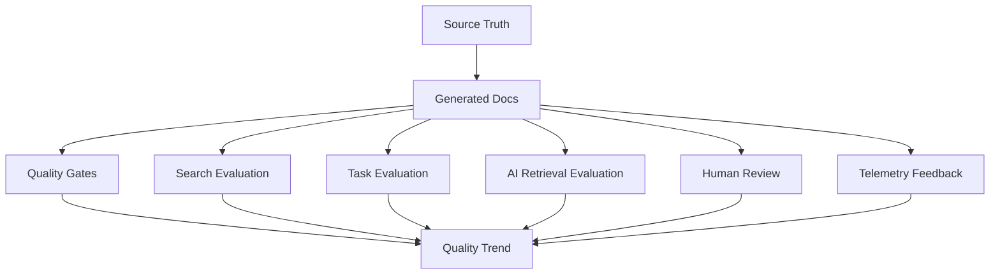
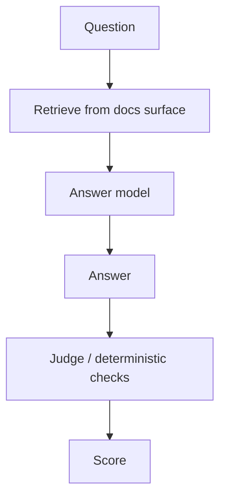
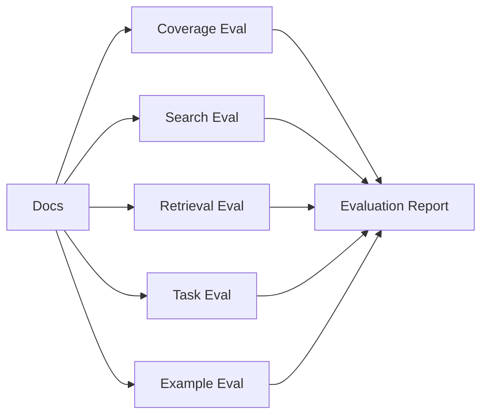

------
title: Build From Scratch: Mintlify-like AI-driven Documentation Generator CLI - Part 039
description: Mendesain documentation evaluation system untuk AI-driven documentation generator: task-based evals, retrieval evals, coverage metrics, correctness scoring, human review calibration, regression tests, benchmark datasets, telemetry feedback, and CI quality trends.
series: learn-mintlify-like-ai-docs-cli
seriesTitle: Build From Scratch: Mintlify-like AI-driven Documentation Generator CLI
order: 39
partTitle: Documentation Evaluation System
tags:
  - documentation
  - ai
  - cli
  - evaluation
  - quality
  - metrics
  - developer-tools
date: 2026-07-03
---

# Part 039 — Documentation Evaluation System

Pada Part 037, kita membangun **quality gates**.

Quality gates menjawab pertanyaan:

> Apakah docs ini boleh dipublish?

Contoh:

- internal link tidak broken,
- MDX compile,
- generated claim punya evidence,
- code sample verified,
- no secrets,
- OpenAPI ref valid.

Tetapi quality gates belum menjawab pertanyaan yang lebih tinggi:

> Apakah docs ini benar-benar membantu developer menyelesaikan tugas?

Itulah fungsi **documentation evaluation system**.

Evaluation system mengukur kualitas dokumentasi secara lebih luas:

- coverage,
- correctness,
- findability,
- task completion,
- search quality,
- retrieval quality,
- AI answer quality,
- freshness,
- examples reliability,
- reader friction,
- regression antar versi,
- dan trend kualitas dari waktu ke waktu.

Quality gate adalah pass/fail.  
Evaluation system adalah measurement and learning loop.

---

## 1. Mental model: docs quality is evaluated like product + compiler + model

Documentation generator kita adalah gabungan:

1. compiler pipeline,
2. developer product,
3. retrieval system,
4. AI generation system,
5. static site,
6. agent-readable knowledge surface.

Maka evaluasinya juga multi-layer.



Evaluation system bukan cuma "AI judge says good".

Ia harus menggabungkan deterministic metrics, synthetic tasks, human review, and real usage signals.

---

## 2. Why evaluation matters

Tanpa evaluation:

- docs bisa valid tapi tidak berguna,
- search index bisa build tapi hasil buruk,
- `llms.txt` bisa ada tapi agent answer salah,
- AI-generated pages bisa panjang tapi tidak membantu,
- coverage bisa tinggi tapi wrong audience,
- examples bisa verified tapi missing crucial scenario,
- update workflow bisa green tapi docs quality menurun.

Evaluation membantu menjawab:

- Apakah quickstart bisa diikuti?
- Apakah user bisa menemukan config field?
- Apakah agent bisa menjawab pertanyaan dari docs?
- Apakah generated docs lebih baik dari manual baseline?
- Apakah perubahan prompt memperbaiki atau memperburuk output?
- Apakah search ranking membaik?
- Apakah code examples tetap usable setelah API berubah?

---

## 3. Evaluation dimensions

```ts
export type DocumentationEvaluationDimension =
  | "coverage"
  | "correctness"
  | "freshness"
  | "findability"
  | "taskCompletion"
  | "structure"
  | "readability"
  | "exampleReliability"
  | "searchQuality"
  | "retrievalQuality"
  | "agentAnswerQuality"
  | "maintainability"
  | "trust";
```

Each dimension has different signals.

| Dimension | Example metric |
|---|---|
| coverage | public API endpoints documented |
| correctness | claims supported by evidence |
| freshness | stale pages count |
| findability | target page appears in top search results |
| taskCompletion | synthetic task passes |
| structure | page kind pattern satisfied |
| readability | long paragraph count |
| exampleReliability | verified examples/pass rate |
| searchQuality | MRR/Recall@K |
| retrievalQuality | evidence recall/precision |
| agentAnswerQuality | grounded answer score |
| maintainability | patch size, manual conflict rate |
| trust | provenance completeness/review pass rate |

---

## 4. Evaluation objects

We need common models.

```ts
export type EvaluationSuite = {
  id: string;
  title: string;
  description?: string;
  version: string;
  cases: EvaluationCase[];
  config: EvaluationSuiteConfig;
};

export type EvaluationCase =
  | CoverageEvalCase
  | SearchEvalCase
  | RetrievalEvalCase
  | TaskEvalCase
  | AgentAnswerEvalCase
  | PageQualityEvalCase
  | ExampleVerificationEvalCase;

export type EvaluationResult = {
  suiteId: string;
  runId: string;
  status: "pass" | "warning" | "fail";
  scores: EvaluationScore[];
  caseResults: EvaluationCaseResult[];
  diagnostics: Diagnostic[];
  createdAt: string;
};
```

Score:

```ts
export type EvaluationScore = {
  name: string;
  dimension: DocumentationEvaluationDimension;
  value: number;
  unit: "ratio" | "count" | "score" | "ms" | "bytes";
  threshold?: EvaluationThreshold;
};

export type EvaluationThreshold = {
  warnBelow?: number;
  failBelow?: number;
  warnAbove?: number;
  failAbove?: number;
};
```

---

## 5. Evaluation is not a replacement for quality gates

Quality gates are blocking checks.

Evaluation scores are trend and regression signals.

Examples:

| Signal | Quality gate? | Evaluation? |
|---|---:|---:|
| Broken internal link | yes | yes |
| Search Recall@5 | no maybe | yes |
| Unsupported generated claim | yes | yes |
| Quickstart task success | maybe in strict | yes |
| Readability score | no | yes |
| API coverage | yes if threshold | yes |
| User feedback negative | no | yes |
| MRR trend down 20% | no maybe | yes |

Some evals can become gates after maturity.

---

## 6. Coverage evaluation

Coverage asks:

> Which source artifacts should be documented, and are they?

Coverage inputs:

- semantic artifacts,
- docs mappings,
- page provenance,
- visibility policy,
- coverage config.

```ts
export type CoverageEvalCase = {
  type: "coverage";
  id: string;
  artifactType: SemanticArtifactType;
  scope: "public" | "internal" | "all";
  minimumCoverage: number;
};
```

Result:

```ts
export type CoverageEvalResult = {
  artifactType: SemanticArtifactType;
  total: number;
  documented: number;
  undocumented: string[];
  stale: string[];
  coverageRatio: number;
};
```

Example:

```json
{
  "artifactType": "apiEndpoint",
  "total": 128,
  "documented": 128,
  "coverageRatio": 1.0
}
```

---

## 7. Coverage is not enough

100% API endpoint coverage can still be poor if:

- descriptions are missing,
- examples absent,
- search cannot find endpoints,
- auth requirements unclear,
- code samples fail,
- guide is missing.

Coverage is necessary, not sufficient.

Therefore coverage eval should be combined with:

- quality gates,
- example verification,
- task evals,
- search evals.

---

## 8. Correctness evaluation

Correctness signals:

- fact-check pass rate,
- unsupported claim count,
- contradiction count,
- evidence confidence,
- code sample verification,
- formal artifact consistency.

```ts
export type CorrectnessScore = {
  totalClaims: number;
  supportedClaims: number;
  partiallySupportedClaims: number;
  unsupportedClaims: number;
  contradictedClaims: number;
  supportRatio: number;
};
```

Score:

```ts
supportRatio = supportedClaims / totalClaims
```

But weight formal claims higher.

```ts
weightedSupportScore =
  sum(claimWeight * supportValue) / sum(claimWeight)
```

Formal claim weights:

| Claim type | Weight |
|---|---:|
| API method/path/schema | 5 |
| CLI command/flag | 5 |
| config field/default | 5 |
| code sample behavior | 4 |
| concept explanation | 2 |
| editorial transition | 0 |

---

## 9. Freshness evaluation

Freshness from provenance.

Metrics:

```ts
export type FreshnessEval = {
  totalPages: number;
  stalePages: number;
  staleBlocks: number;
  stalePublicPages: number;
  averageVerificationAgeDays: number;
};
```

Stale reasons:

- source hash changed,
- generator version changed,
- prompt contract changed,
- review expired,
- evidence missing.

Useful trend:

```txt
stalePublicPages should be 0 before release
```

---

## 10. Search evaluation

Search evaluation asks:

> Given a user query, does the docs search return the right page/section?

Search eval case:

```ts
export type SearchEvalCase = {
  type: "search";
  id: string;
  query: string;
  expected: Array<{
    route: RoutePath;
    anchor?: string;
    relevance: "primary" | "acceptable";
  }>;
  tags?: string[];
};
```

Example:

```json
{
  "type": "search",
  "id": "find-build-output-dir",
  "query": "change build output directory",
  "expected": [
    {
      "route": "/reference/configuration",
      "anchor": "build-outputdir",
      "relevance": "primary"
    }
  ],
  "tags": ["config", "build"]
}
```

---

## 11. Search metrics

Common metrics:

```ts
export type SearchMetrics = {
  recallAt1: number;
  recallAt3: number;
  recallAt5: number;
  mrr: number;
  averageRank: number;
  noResultRate: number;
};
```

MRR:

```txt
Mean Reciprocal Rank = average(1 / rank of first relevant result)
```

Implementation:

```ts
export function computeMrr(results: SearchEvalCaseResult[]): number {
  const values = results.map((result) => {
    const rank = result.firstRelevantRank;
    return rank ? 1 / rank : 0;
  });

  return average(values);
}
```

---

## 12. Search eval runner

```ts
export async function runSearchEval(
  cases: SearchEvalCase[],
  searchProvider: SearchProvider
): Promise<SearchEvalSuiteResult> {
  const caseResults = [];

  for (const testCase of cases) {
    const results = await searchProvider.search(testCase.query);
    const firstRelevantRank = findFirstRelevantRank(results, testCase.expected);

    caseResults.push({
      caseId: testCase.id,
      query: testCase.query,
      firstRelevantRank,
      topResults: results.slice(0, 5).map((r) => ({
        route: r.route,
        anchor: r.anchor,
        score: r.score,
      })),
      passed: firstRelevantRank !== undefined && firstRelevantRank <= 5,
    });
  }

  return {
    metrics: computeSearchMetrics(caseResults),
    caseResults,
  };
}
```

---

## 13. Search eval dataset creation

Where do search cases come from?

1. manually curated tasks,
2. common support questions,
3. docs analytics search queries,
4. issue/PR titles,
5. user feedback,
6. generated from semantic artifacts,
7. generated from page titles/aliases.

Manual cases are highest quality.

Generated cases are useful for coverage but can be noisy.

Example generated case:

- config field `build.outputDir`
- query candidates:
  - `build.outputDir`
  - `output directory`
  - `where does build write files`
  - `change docs output path`

Human review can approve cases.

---

## 14. Retrieval evaluation

Retrieval eval asks:

> Given a documentation generation task or user question, does retrieval return the right evidence?

This evaluates Part 028.

Retrieval eval case:

```ts
export type RetrievalEvalCase = {
  type: "retrieval";
  id: string;
  query: string;
  taskType: "writePage" | "answerQuestion" | "updatePage" | "factCheck";
  requiredEvidenceIds: EvidenceId[];
  acceptableEvidenceIds?: EvidenceId[];
  forbiddenEvidenceIds?: EvidenceId[];
};
```

Example:

```json
{
  "type": "retrieval",
  "id": "retrieve-build-command-evidence",
  "query": "Document the docforge build command and strict mode.",
  "taskType": "writePage",
  "requiredEvidenceIds": ["ev_cli_build"],
  "forbiddenEvidenceIds": ["ev_old_build_docs"]
}
```

Metrics:

- recall@K,
- precision@K,
- forbidden retrieval rate,
- average evidence confidence,
- token efficiency.

---

## 15. Retrieval metrics

```ts
export type RetrievalMetrics = {
  recallAt5: number;
  precisionAt5: number;
  forbiddenRate: number;
  averageRequiredEvidenceRank: number;
  averageTokensUsed: number;
};
```

Precision@K:

```txt
relevant retrieved / K
```

Recall@K:

```txt
required evidence retrieved / required evidence total
```

Token efficiency:

```txt
required evidence coverage per 1k tokens
```

This helps tune retrieval ranking and compression.

---

## 16. Agent answer evaluation

Agent-ready docs should support AI assistants answering questions.

Eval case:

```ts
export type AgentAnswerEvalCase = {
  type: "agentAnswer";
  id: string;
  question: string;
  expectedFacts: ExpectedFact[];
  forbiddenFacts?: string[];
  requiredCitations?: EvidenceId[];
  docsSurface: "site" | "search" | "llms" | "mcp";
};

export type ExpectedFact = {
  id: string;
  text: string;
  evidenceIds: EvidenceId[];
};
```

Example:

```json
{
  "question": "How do I fail the docs build on warnings?",
  "expectedFacts": [
    {
      "id": "strict-flag",
      "text": "Use docforge build --strict.",
      "evidenceIds": ["ev_cli_build"]
    }
  ],
  "forbiddenFacts": [
    "Use --fail-on-warning if that flag does not exist."
  ],
  "docsSurface": "llms"
}
```

---

## 17. Agent answer runner

Flow:



But to avoid model-dependence, also evaluate retrieval surface directly.

Two modes:

| Mode | Evaluates |
|---|---|
| retrieval-only | whether required docs/evidence are available |
| answer-generation | whether model answers correctly using docs |

Start with retrieval-only. Add answer eval later.

---

## 18. Answer scoring

```ts
export type AgentAnswerScore = {
  groundedness: number;
  factualCompleteness: number;
  forbiddenFactPenalty: number;
  citationQuality: number;
  finalScore: number;
};
```

Scoring methods:

- deterministic keyword/fact match,
- evidence citation match,
- LLM-as-judge with strict rubric,
- human review sample.

Use LLM judge carefully. It can be wrong.

Store judge prompt/version if used.

---

## 19. Task-based evaluation

Task eval asks:

> Can a developer complete a task using the docs?

Task case:

```ts
export type TaskEvalCase = {
  type: "task";
  id: string;
  title: string;
  userGoal: string;
  startingPoint: "freshProject" | "existingProject" | "brokenProject";
  requiredDocsRoutes: RoutePath[];
  procedure: TaskEvalProcedure;
  successCriteria: TaskSuccessCriterion[];
};
```

Procedure could be manual or automated.

```ts
export type TaskEvalProcedure =
  | { mode: "manual"; instructions: string }
  | { mode: "scripted"; scriptPath: string }
  | { mode: "agent"; agentInstructions: string };
```

Example:

```json
{
  "type": "task",
  "id": "quickstart-build-site",
  "title": "Build a static docs site from a fresh project",
  "userGoal": "Initialize docs, run dev, and build static output.",
  "requiredDocsRoutes": ["/quickstart"],
  "procedure": {
    "mode": "scripted",
    "scriptPath": "eval/tasks/quickstart-build-site.ts"
  },
  "successCriteria": [
    { "type": "commandExitCode", "command": "docforge build", "exitCode": 0 },
    { "type": "fileExists", "path": ".docforge/site/index.html" }
  ]
}
```

---

## 20. Scripted task evaluation

Scripted eval runs commands in fixture project.

```ts
export type TaskEvalResult = {
  caseId: string;
  status: "passed" | "failed" | "skipped";
  steps: TaskEvalStepResult[];
  durationMs: number;
  diagnostics: Diagnostic[];
};
```

Step:

```ts
export type TaskEvalStepResult = {
  name: string;
  status: "passed" | "failed" | "skipped";
  output?: string;
  diagnostics: Diagnostic[];
};
```

This overlaps with example verification but evaluates whole task flow, not individual snippets.

---

## 21. Human task evaluation

For important docs, humans can rate.

Rubric:

```ts
export type HumanEvalRubric = {
  clarity: 1 | 2 | 3 | 4 | 5;
  completeness: 1 | 2 | 3 | 4 | 5;
  correctness: 1 | 2 | 3 | 4 | 5;
  findability: 1 | 2 | 3 | 4 | 5;
  confidence: 1 | 2 | 3 | 4 | 5;
  notes?: string;
};
```

Store results and compare over time.

Human eval is expensive but valuable for calibration.

---

## 22. Page quality evaluation

Page-level eval combines structural signals.

```ts
export type PageQualityEvalCase = {
  type: "pageQuality";
  id: string;
  route: RoutePath;
  expectedKind: PageKind;
  criteria: PageQualityCriterion[];
};
```

Criteria:

```ts
export type PageQualityCriterion =
  | { type: "hasSection"; heading: string }
  | { type: "hasCodeExample"; language?: string }
  | { type: "hasVerifiedExample" }
  | { type: "hasProvenance" }
  | { type: "maxWordCount"; max: number }
  | { type: "hasInternalLink"; route: RoutePath }
  | { type: "containsEvidence"; evidenceId: EvidenceId };
```

This is deterministic and useful for regression.

---

## 23. Example reliability evaluation

From Part 038.

Metrics:

```ts
export type ExampleReliabilityMetrics = {
  totalExamples: number;
  runnableExamples: number;
  verifiedExamples: number;
  failedExamples: number;
  blockedUnsafeExamples: number;
  verificationPassRate: number;
};
```

Break down by:

- generated vs manual,
- language,
- page kind,
- verification level.

Example:

```txt
Generated API samples:
  120 total
  120 verified with mock
  0 failed

Manual shell examples:
  40 total
  15 verified
  2 failed
```

This tells docs maintainers where debt exists.

---

## 24. Trust score

Trust is composite. Avoid over-simplifying, but useful for dashboards.

```ts
export type TrustScore = {
  provenanceCompleteness: number;
  factCheckPassRate: number;
  exampleVerificationRate: number;
  freshnessScore: number;
  finalTrustScore: number;
};
```

Example formula:

```txt
trust =
  0.30 * provenanceCompleteness
+ 0.30 * factCheckPassRate
+ 0.20 * exampleVerificationRate
+ 0.20 * freshnessScore
```

Use as trend, not absolute truth.

---

## 25. Maintainability evaluation

Metrics:

- average patch size,
- generated conflict rate,
- manual page conflict count,
- stale blocks per week,
- reviewRequired count,
- AI repair attempts,
- prompt regression count,
- route churn,
- nav churn.

```ts
export type MaintainabilityMetrics = {
  averagePatchLines: number;
  generatedConflictRate: number;
  reviewRequiredItems: number;
  routeChanges: number;
  staleBlocks: number;
  aiRepairRate: number;
};
```

A docs system that creates huge diffs is low maintainability.

---

## 26. Evaluation run model

```ts
export type EvaluationRun = {
  id: string;
  suiteId: string;
  startedAt: string;
  endedAt?: string;
  status: "running" | "passed" | "warning" | "failed" | "cancelled";
  git?: GitContext;
  configHash: string;
  docsBuildHash: string;
  result?: EvaluationResult;
};
```

Store runs:

```sql
CREATE TABLE evaluation_runs (
  id TEXT PRIMARY KEY,
  suite_id TEXT NOT NULL,
  status TEXT NOT NULL,
  started_at TEXT NOT NULL,
  ended_at TEXT,
  git_json TEXT,
  config_hash TEXT NOT NULL,
  docs_build_hash TEXT NOT NULL,
  result_json TEXT
);
```

---

## 27. Evaluation suite config

```json
{
  "evaluation": {
    "suites": [
      {
        "id": "core-docs",
        "path": "eval/core-docs.eval.json",
        "runInCi": true
      },
      {
        "id": "search",
        "path": "eval/search.eval.json",
        "runInCi": true
      },
      {
        "id": "agent-answers",
        "path": "eval/agent-answers.eval.json",
        "runInCi": false
      }
    ],
    "thresholds": {
      "search.mrr": {
        "warnBelow": 0.75,
        "failBelow": 0.6
      },
      "examples.passRate": {
        "warnBelow": 0.95,
        "failBelow": 0.9
      }
    }
  }
}
```

---

## 28. Evaluation CLI

```bash
docforge eval run
docforge eval run --suite search
docforge eval run --changed
docforge eval report
docforge eval compare --base main --head HEAD
docforge eval list-cases
docforge eval add-search-case
```

Common:

```bash
docforge eval run --suite search --format json
```

Output:

```txt
Evaluation suite: search

MRR:       0.82
Recall@5: 0.94
Failed cases: 3

Failed:
- find-build-output-dir
  query: "change build output directory"
  expected: /reference/configuration#build-outputdir
  top result: /guides/deploy
```

---

## 29. Evaluation compare

Regression detection:

```bash
docforge eval compare --base origin/main --head HEAD
```

Compares scores:

```txt
Search MRR:
  base: 0.86
  head: 0.79
  delta: -0.07 warning

Example pass rate:
  base: 0.98
  head: 0.98
  delta: 0

Agent answer groundedness:
  base: 0.91
  head: 0.88
  delta: -0.03
```

This is useful in PRs.

---

## 30. Baselines

Store baseline:

```txt
.docforge/eval-baselines/
  core-docs.json
  search.json
  examples.json
```

Or in knowledge store.

Baseline record:

```ts
export type EvaluationBaseline = {
  suiteId: string;
  gitRef: string;
  resultHash: string;
  scores: EvaluationScore[];
  createdAt: string;
};
```

Do not fail every small movement. Use thresholds.

---

## 31. Regression policy

```ts
export type RegressionPolicy = {
  failOnScoreDrop: Array<{
    scoreName: string;
    maxDrop: number;
  }>;
  warnOnScoreDrop: Array<{
    scoreName: string;
    maxDrop: number;
  }>;
};
```

Example:

```json
{
  "scoreName": "search.mrr",
  "maxDrop": 0.1
}
```

If MRR drops by >0.1, fail/warn.

---

## 32. Synthetic eval generation

We can generate candidate eval cases from source artifacts.

For each CLI command:

- query: command name,
- expected: CLI reference route.
- task: "How do I use command X?"

For each config field:

- query: field name,
- query: natural-language description,
- expected: config reference anchor.

For each API operation:

- query: method path,
- query: operation summary,
- expected: operation page.

Generated case model:

```ts
export type GeneratedEvalCaseCandidate = {
  case: EvaluationCase;
  source: "semanticArtifact";
  confidence: Confidence;
  needsHumanReview: boolean;
};
```

Human can approve into suite.

---

## 33. Eval case quality

Bad eval cases cause wrong optimization.

Avoid:

- expected answer ambiguous,
- query too similar to title only,
- generated cases with wrong expected route,
- overfitting to current docs,
- testing implementation detail not user intent.

Keep curated core suite small and high quality.

---

## 34. Evaluation and telemetry

If docs site has analytics/telemetry, signals:

- search queries with no results,
- search result clicks,
- pages with high exits,
- copy code sample events,
- feedback thumbs up/down,
- broken link reports,
- page view to task completion,
- docs update conflicts.

Telemetry model:

```ts
export type DocumentationTelemetryEvent =
  | { type: "search"; query: string; resultCount: number; clickedRoute?: string }
  | { type: "pageFeedback"; route: RoutePath; rating: "positive" | "negative"; comment?: string }
  | { type: "codeCopy"; route: RoutePath; blockId: string; language: string }
  | { type: "linkClick"; route: RoutePath; href: string }
  | { type: "taskCompleted"; taskId: string; route: RoutePath };
```

Respect privacy. Telemetry should be opt-in.

---

## 35. Telemetry to eval cases

No-result search query:

```txt
query: "deploy to cloudflare"
resultCount: 0
```

Candidate search eval:

- query: "deploy to cloudflare"
- expected: maybe `/deployment/cloudflare` if page exists
- if no page, candidate docs gap.

Feedback negative:

- route: `/quickstart`
- comment: "Where does build output go?"

Candidate:
- add section/eval for output location.

---

## 36. Evaluation with privacy

Evaluation data can contain user queries/comments.

Policies:

- anonymize,
- redact secrets,
- do not send raw user comments to external model unless allowed,
- aggregate where possible,
- allow opt-out,
- store retention.

```ts
export type EvaluationPrivacyPolicy = {
  allowTelemetry: boolean;
  anonymizeQueries: boolean;
  redactSecrets: boolean;
  retentionDays: number;
  allowModelJudgingOnTelemetry: boolean;
};
```

---

## 37. LLM-as-judge caution

AI judge can be useful but risky.

Use for:

- style assessment,
- answer groundedness sample review,
- task explanation quality,
- nuanced correctness when deterministic checks insufficient.

Do not use alone for:

- formal API correctness,
- CLI flag existence,
- config default,
- code execution,
- link correctness,
- security.

If used, store:

- judge prompt version,
- model,
- input/output hashes,
- rubric,
- calibration results.

---

## 38. Judge rubric

Example answer judge rubric:

```txt
Score each answer from 0 to 5.

Groundedness:
5 = every factual claim is supported by provided docs
3 = mostly supported but contains minor unsupported detail
1 = significant unsupported claims
0 = contradicts docs or fabricates

Completeness:
5 = includes all expected facts
3 = includes main fact but misses caveats
1 = incomplete
0 = does not answer

Citations:
5 = cites correct evidence
3 = cites relevant page but not exact evidence
1 = citations weak
0 = no citations
```

Output schema:

```ts
export type JudgeScore = {
  groundedness: number;
  completeness: number;
  citationQuality: number;
  notes: string;
};
```

---

## 39. Human calibration for judge

Sample AI judge decisions should be compared with human reviewers.

```ts
export type JudgeCalibrationCase = {
  answer: string;
  evidence: EvidenceItem[];
  humanScore: JudgeScore;
  judgeScore: JudgeScore;
};
```

Metric:

- correlation,
- false pass rate,
- false fail rate.

If judge false pass high, tighten prompts or don't use as gate.

---

## 40. Evaluation dashboard

A simple report can show:

```txt
Documentation evaluation

Coverage:
  API endpoints: 128/128
  CLI commands: 8/8
  Config fields: 61/62

Correctness:
  Supported claims: 98.7%
  Unsupported generated claims: 0

Examples:
  Verified examples: 94/98
  Failed: 1
  Skipped: 3

Search:
  MRR: 0.82
  Recall@5: 0.94

Freshness:
  Stale public pages: 0
  Stale internal pages: 4
```

Do not hide failures in aggregate.

---

## 41. Evaluation report JSON

```ts
export type DocumentationEvaluationReport = {
  schemaVersion: "documentation-evaluation-report/v1";
  status: "pass" | "warning" | "fail";
  suites: EvaluationResult[];
  aggregateScores: EvaluationScore[];
  regressions: RegressionFinding[];
  recommendations: EvaluationRecommendation[];
};

export type RegressionFinding = {
  scoreName: string;
  baseValue: number;
  headValue: number;
  delta: number;
  severity: "warning" | "error";
};

export type EvaluationRecommendation = {
  id: string;
  category: "search" | "coverage" | "examples" | "content" | "retrieval";
  message: string;
  suggestedAction?: string;
};
```

---

## 42. Recommendations

Evaluation should produce actionable recommendations.

Examples:

```txt
Search case "change output directory" failed.
Suggested action:
- Add alias terms "output directory" to Configuration Reference.
- Ensure `build.outputDir` appears in search chunk heading/context.
```

```txt
Config coverage below threshold.
Suggested action:
- Run `docforge generate --plan --scope config`.
```

```txt
Example verification pass rate dropped.
Suggested action:
- Run `docforge examples verify --failed --verbose`.
```

---

## 43. Search improvement loop

If search eval fails:

1. inspect query,
2. inspect top results,
3. inspect expected page chunks,
4. adjust chunking/weights/aliases,
5. add synonyms/metadata,
6. rerun eval.

Search eval case result should include:

```ts
export type SearchEvalCaseResult = {
  caseId: string;
  query: string;
  expected: SearchExpectedTarget[];
  topResults: SearchResultSummary[];
  firstRelevantRank?: number;
  diagnostics: Diagnostic[];
};
```

This makes debugging possible.

---

## 44. Retrieval improvement loop

If retrieval misses evidence:

1. inspect query expansion,
2. inspect exact/keyword/semantic results,
3. inspect graph traversal,
4. adjust ranking,
5. improve evidence summaries,
6. add direct indexes for artifact type.

Retrieval trace from Part 028 is crucial.

---

## 45. Generation prompt regression eval

When prompt contract changes, run fixed fixtures.

```txt
fixtures/eval/generation/
  openapi-guide/
  config-reference/
  troubleshooting-page/
```

Evaluate:

- schema valid,
- evidence usage,
- fact-check pass,
- page quality criteria,
- human/judge rating maybe.

This prevents prompt updates from degrading docs.

---

## 46. Golden generated page eval

For deterministic generators, use snapshot/golden tests.

For AI-generated outputs, avoid exact text snapshots. Use structural/evidence assertions.

AI eval should check:

- includes planned sections,
- no unsupported claims,
- uses required evidence,
- meets task criteria.

Do not assert exact prose unless model deterministic and output stable.

---

## 47. CI integration

CI command:

```bash
docforge eval run --suite core --ci
```

Policy:

- core deterministic evals can fail CI,
- AI/judge evals may warn unless stable,
- search eval can fail if mature,
- example verification fail for generated samples should fail.

GitHub PR comment can include eval summary.

---

## 48. Release integration

Before release:

```bash
docforge eval run --suite release
```

Release suite:

- public coverage,
- freshness,
- examples,
- search,
- agent-ready docs,
- no unsupported claims,
- task quickstart.

Release should fail if key docs regress.

---

## 49. Eval suite versioning

Eval cases evolve.

```ts
export type EvaluationSuiteMetadata = {
  id: string;
  version: string;
  owner?: string;
  createdAt: string;
  updatedAt: string;
};
```

If suite changes, compare carefully. Score differences may reflect eval change, not docs change.

Store suite hash with run.

---

## 50. Evaluation data layout

```txt
eval/
  suites/
    core.eval.json
    search.eval.json
    retrieval.eval.json
    agent-answers.eval.json
  tasks/
    quickstart-build-site.ts
  baselines/
    main.search.baseline.json
  fixtures/
    projects/
      quickstart/
```

or inside `.docforge/eval` for generated candidates.

Curated suites should be committed. Generated candidates may not.

---

## 51. Evaluation package layout

```txt
packages/docs-eval/
  src/
    suite.ts
    case.ts
    runner.ts
    report.ts
    thresholds.ts
    regression.ts
    coverage/
      coverage-eval.ts
    search/
      search-eval.ts
      metrics.ts
    retrieval/
      retrieval-eval.ts
      metrics.ts
    agent-answer/
      runner.ts
      judge.ts
      rubric.ts
    task/
      task-runner.ts
      fixtures.ts
    page-quality/
      criteria.ts
    telemetry/
      events.ts
      candidates.ts
      privacy.ts
    reporters/
      human.ts
      json.ts
      markdown.ts
    __tests__/
      search-metrics.test.ts
      coverage-eval.test.ts
      thresholds.test.ts
      regression.test.ts
```

---

## 52. Minimal implementation milestone

First version:

1. coverage eval,
2. freshness eval,
3. example reliability eval,
4. search eval with curated cases,
5. retrieval eval with curated cases,
6. quality report aggregation,
7. `docforge eval run`,
8. JSON/human reports,
9. threshold policy,
10. regression compare.

Second version:

1. task-based scripted evals,
2. agent answer eval,
3. LLM judge with calibration,
4. telemetry-to-eval candidates,
5. dashboards,
6. prompt regression suite,
7. human eval ingestion,
8. release suite,
9. PR eval summary,
10. trend storage.

---

## 53. Failure modes

| Failure | Cause | Prevention |
|---|---|---|
| Docs pass gates but are unhelpful | no task/search eval | task/search evaluation |
| Search quality regresses | no benchmark queries | search eval suite |
| Retrieval misses evidence | no retrieval eval | retrieval recall tests |
| AI judge approves wrong answer | judge used alone | deterministic checks + calibration |
| Eval overfits titles | poor cases | curated user-intent queries |
| CI flaky | live model/network evals | deterministic core suites |
| Scores meaningless | mixed suite versions | suite version/hash |
| Telemetry leaks user data | raw queries/comments stored | privacy/redaction |
| AI output snapshots brittle | exact text snapshots | structural/evidence criteria |
| Evaluation ignored | no actionable report | recommendations and regressions |

---

## 54. Key takeaways

Documentation evaluation system measures whether docs are useful, not just buildable.



Strong evaluation design:

1. separates gates from metrics,
2. measures coverage/correctness/freshness,
3. tests search and retrieval with curated cases,
4. verifies task completion,
5. evaluates agent-readable docs,
6. tracks regressions,
7. uses AI judges carefully,
8. incorporates telemetry safely,
9. provides actionable recommendations,
10. and turns docs quality into an engineering feedback loop.

Next, we create the agent-readable output: **`llms.txt` and agent-ready docs**.
