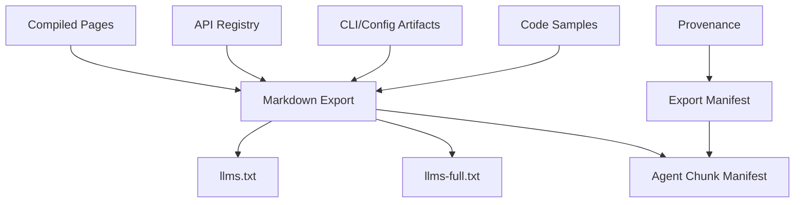
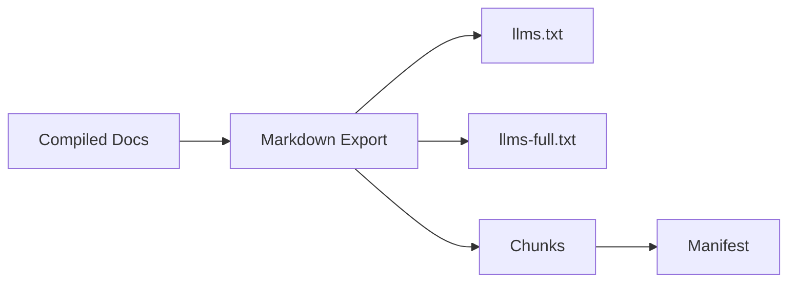

------
title: Build From Scratch: Mintlify-like AI-driven Documentation Generator CLI - Part 040
description: Mendesain llms.txt dan agent-ready docs untuk AI-driven documentation generator: curated AI-facing exports, llms-full.txt, Markdown normalization, provenance, chunk manifests, privacy filtering, token budgets, agent task maps, eval integration, and build gates.
series: learn-mintlify-like-ai-docs-cli
seriesTitle: Build From Scratch: Mintlify-like AI-driven Documentation Generator CLI
order: 40
partTitle: llms.txt and Agent-ready Docs
tags:
  - documentation
  - ai
  - cli
  - llms-txt
  - agent-ready-docs
  - markdown
  - developer-tools
date: 2026-07-03
---

# Part 040 — `llms.txt` and Agent-ready Docs

Modern documentation tidak hanya dibaca manusia.

Ia juga dibaca oleh:

- AI assistants,
- coding agents,
- support bots,
- IDE agents,
- docs search agents,
- internal copilots,
- build/debug agents,
- retrieval pipelines.

Karena itu, docs generator production-grade harus bisa menghasilkan **agent-ready docs**.

Salah satu output yang paling sederhana dan berguna adalah:

```txt
llms.txt
```

dan versi lebih lengkap:

```txt
llms-full.txt
```

Tetapi agent-ready docs bukan sekadar menggabungkan semua Markdown menjadi satu file besar.

Kita perlu desain:

- what to include,
- what to exclude,
- how to structure content,
- how to preserve links,
- how to include API/CLI/config facts,
- how to avoid private data leakage,
- how to keep token size manageable,
- how to attach provenance,
- how to evaluate agent answer quality,
- and how to integrate with search/MCP later.

---

## 1. Mental model: agent-ready docs are compiled knowledge views



Agent-ready output is a **compiled view**, not raw source.

It should be:

- readable as plain text,
- deterministic,
- safe,
- filtered,
- structured,
- traceable,
- and useful under token constraints.

---

## 2. `llms.txt` vs `llms-full.txt`

Recommended distinction:

| File | Purpose |
|---|---|
| `llms.txt` | Compact, curated entrypoint for AI agents |
| `llms-full.txt` | Larger full docs export for deeper context |
| `llms-manifest.json` | Machine-readable metadata/provenance |
| `llms-chunks.jsonl` | Optional chunked retrieval export |

`llms.txt` should not be enormous. It should help an agent decide where to look.

`llms-full.txt` can include more content, but still filtered.

---

## 3. Goals

Agent-ready docs should:

1. summarize product/project,
2. list important docs routes,
3. expose key quickstart/setup paths,
4. include reference entrypoints,
5. include API/CLI/config summaries,
6. preserve useful code samples,
7. avoid private/internal content unless configured,
8. avoid stale/unverified generated claims,
9. include stable links,
10. include provenance/manifest separately,
11. support chunking for retrieval,
12. pass quality/evaluation gates.

---

## 4. Anti-goal: dumping everything

Bad:

```txt
cat docs/**/*.mdx > llms-full.txt
```

Problems:

- MDX components not meaningful,
- hidden/internal pages included,
- duplicated nav/footer,
- broken relative links,
- raw imports,
- interactive components lost,
- token size huge,
- no provenance,
- stale pages included,
- private data leaks.

Agent-ready export must be compiled, not concatenated.

---

## 5. Export policy config

```json
{
  "llms": {
    "enabled": true,
    "output": {
      "compact": "dist/llms.txt",
      "full": "dist/llms-full.txt",
      "manifest": "dist/llms-manifest.json"
    },
    "include": {
      "pages": ["overview", "quickstart", "howTo", "reference", "apiReference"],
      "drafts": false,
      "hidden": false,
      "internal": false,
      "codeSamples": true,
      "apiReference": true,
      "configReference": true,
      "cliReference": true
    },
    "limits": {
      "compactMaxChars": 50000,
      "fullMaxChars": 2000000,
      "pageSummaryMaxChars": 1200,
      "codeSampleLanguages": ["curl", "javascript", "python"]
    },
    "provenance": {
      "includeInline": false,
      "includeManifest": true
    }
  }
}
```

Defaults should avoid internal/private content.

---

## 6. Agent export inputs

Inputs:

```ts
export type LlmsExportInput = {
  site: SiteMetadata;
  pages: CompiledPage[];
  pageManifest: PageManifest;
  nav: NavTree;
  routeIndex: RouteIndex;
  apiRegistry?: OpenApiRegistry;
  semanticArtifacts: SemanticArtifactIndex;
  codeSamples: GeneratedCodeSample[];
  provenance: ProvenanceStore;
  config: LlmsConfig;
};
```

Output:

```ts
export type LlmsExportResult = {
  compact?: LlmsExportFile;
  full?: LlmsExportFile;
  manifest?: LlmsManifest;
  chunks?: LlmsChunkManifest;
  diagnostics: Diagnostic[];
};

export type LlmsExportFile = {
  path: string;
  content: string;
  contentHash: string;
  sizeBytes: number;
};
```

---

## 7. Page inclusion policy

```ts
export function shouldIncludePageInLlms(
  page: CompiledPage,
  config: LlmsConfig
): boolean {
  if (page.frontmatter.draft && !config.include.drafts) return false;
  if (page.frontmatter.hidden && !config.include.hidden) return false;
  if (page.visibility === "internal" && !config.include.internal) return false;
  if (!config.include.pages.includes(page.kind)) return false;
  if (page.provenance?.verificationStatus === "failed") return false;

  return true;
}
```

Stale pages:

- compact export should exclude or mark stale depending config,
- strict build can fail if stale public page included.

Recommended:

```txt
do not include failed/unverified generated content in compact export
```

---

## 8. Export order

Order matters for agent usefulness.

Recommended compact order:

1. title/site summary,
2. how to use this docs export,
3. quickstart/setup links,
4. key concepts,
5. main guides,
6. reference index,
7. API summary,
8. CLI summary,
9. config summary,
10. troubleshooting entrypoints,
11. full docs link/map.

Use nav order, not filesystem order.

```ts
export function orderPagesForLlms(pages: CompiledPage[], nav: NavTree): CompiledPage[] {
  const navRank = buildNavRank(nav);

  return [...pages].sort((a, b) =>
    (navRank.get(a.id) ?? 999999) - (navRank.get(b.id) ?? 999999)
  );
}
```

---

## 9. Markdown normalization

MDX must become plain Markdown.

Rules:

- remove imports/exports,
- render components to Markdown fallback,
- preserve headings,
- preserve links,
- convert tabs to section headings,
- convert cards to bullet links,
- convert callouts to blockquotes or bold labels,
- convert API components to text,
- convert schema viewers to tables/summaries,
- remove interactive-only UI,
- sanitize HTML/JS.

This is where Part 016 component registry matters.

Each component needs `toMarkdown`.

```ts
export type ComponentMarkdownExporter = {
  componentName: string;
  toMarkdown(node: ComponentNode, ctx: MarkdownExportContext): string;
};
```

---

## 10. Component fallback examples

### Callout

MDX:

```mdx
<Callout type="warning" title="Remote specs">
Remote specs are disabled by default.
</Callout>
```

Markdown export:

```md
> **Warning: Remote specs**
>
> Remote specs are disabled by default.
```

### Tabs

MDX:

```mdx
<Tabs>
  <Tab title="npm">...</Tab>
  <Tab title="pnpm">...</Tab>
</Tabs>
```

Markdown export:

```md
#### npm

...

#### pnpm

...
```

### Cards

MDX:

```mdx
<Card title="Quickstart" href="/quickstart" />
```

Markdown export:

```md
- [Quickstart](/quickstart)
```

---

## 11. API operation Markdown export

From Part 024.

Agent needs formal API facts.

Compact operation summary:

```md
### Create user

Method: `POST`  
Path: `/users`  
Operation ID: `createUser`  
Auth: Bearer token required  
Request schema: `CreateUserRequest`  
Success response: `201` `User`

See: `/api-reference/users/create-user`
```

Full export can include:

- parameters,
- request body,
- responses,
- examples,
- schema summary.

Do not inline huge schemas in compact export.

---

## 12. CLI reference export

CLI command compact:

```md
### `docforge build`

Builds the static documentation site.

Common options:
- `--out <dir>`: set output directory
- `--strict`: fail on configured warnings
- `--no-search`: skip search index generation

See: `/reference/cli/build`
```

Full export can include all options and examples.

CLI facts should come from semantic artifacts, not prose scraping.

---

## 13. Config reference export

Config compact:

```md
### Build configuration

Important fields:
- `build.outputDir`: static build output directory
- `build.basePath`: base path for deployed site
- `search.enabled`: enable static search index

See: `/reference/configuration`
```

Full export can include tables for all fields.

Config facts should come from config schema artifacts.

---

## 14. Code sample export

Include only selected languages.

Compact:

````md
### cURL

```bash
curl -X POST "https://api.example.com/users" \
  -H "Authorization: Bearer $API_TOKEN" \
  -H "Content-Type: application/json" \
  -d '{"email":"user@example.com"}'
```
````

Rules:

- no secret values,
- verified/generated samples preferred,
- omit unverified generated samples if strict,
- limit languages,
- avoid huge examples.

Config:

```json
{
  "llms": {
    "limits": {
      "codeSampleLanguages": ["curl", "javascript"]
    }
  }
}
```

---

## 15. Link rewriting

Links in `llms.txt` should be stable.

Options:

| Link style | Example |
|---|---|
| route-relative | `/quickstart` |
| absolute site URL | `https://docs.example.com/quickstart` |
| source file path | not public by default |
| anchor links | `/quickstart#install` |

Config:

```json
{
  "llms": {
    "links": {
      "mode": "route",
      "siteUrl": "https://docs.example.com"
    }
  }
}
```

Function:

```ts
export function rewriteLinkForLlms(href: string, ctx: LlmsLinkContext): string {
  if (isExternalUrl(href)) return href;

  const route = normalizeInternalHref(href, ctx.currentRoute);

  if (ctx.mode === "absolute" && ctx.siteUrl) {
    return new URL(route, ctx.siteUrl).toString();
  }

  return route;
}
```

---

## 16. Compact export structure

Template:

```md
# <Site title>

<Site description>

## How to use these docs

This file is a compact guide for AI assistants. Use links to retrieve full pages when needed.

## Start here

- [Quickstart](/quickstart)
- [Installation](/installation)
- [Configuration](/reference/configuration)

## Common tasks

- Generate API reference from OpenAPI: /guides/openapi-reference
- Build static docs: /reference/cli/build
- Fix MDX errors: /troubleshooting/mdx-errors

## Reference

### CLI

...

### Configuration

...

### API

...

## Troubleshooting

...
```

The compact file is map + high-signal facts.

---

## 17. Full export structure

`llms-full.txt`:

```md
# Full documentation export

Generated from <site>.

## Table of contents

...

---

# Quickstart

...

---

# Configuration Reference

...

---

# API Reference: Create user

...
```

Use page separators.

```md
<!-- page: /quickstart title="Quickstart" -->
```

Metadata comments can help agents/chunkers, but keep simple.

---

## 18. Page summary generation

Compact export may include summaries instead of full pages.

Page summary sources:

1. frontmatter description,
2. first paragraph,
3. page summary generated deterministically from headings,
4. AI summary if evidence-bound and reviewed.

Prefer deterministic:

```ts
export function summarizePageForLlms(page: CompiledPage, maxChars: number): string {
  const parts = [
    page.frontmatter.description,
    topHeadings(page).map((h) => `- ${h.text}`).join("\n"),
  ].filter(Boolean);

  return truncate(parts.join("\n"), maxChars);
}
```

Avoid ungrounded AI summaries.

---

## 19. Agent task map

Agents benefit from "if you need X, read Y".

```ts
export type AgentTaskMapEntry = {
  task: string;
  route: RoutePath;
  anchors?: string[];
  keywords: string[];
};
```

Compact export:

```md
## Task map

- To initialize docs, read `/quickstart`.
- To configure OpenAPI ingestion, read `/guides/openapi-reference` and `/reference/configuration#openapi`.
- To troubleshoot MDX component errors, read `/troubleshooting/mdx-errors`.
- To find CLI options, read `/reference/cli`.
```

Task map can be derived from:

- page kind,
- nav,
- semantic artifacts,
- eval cases,
- search aliases.

---

## 20. Agent constraints section

Tell agents how to use docs responsibly.

```md
## Agent usage rules

- Prefer formal reference pages for API, CLI, and config facts.
- Do not invent CLI flags, config fields, API parameters, or response schemas.
- If a required fact is not present here, say that the docs do not provide it.
- Use code examples only if they appear in the relevant page or API reference.
- Treat deprecated endpoints as deprecated.
```

This helps downstream agents, but does not replace proper retrieval/fact checking.

---

## 21. Provenance in `llms.txt`

Inline citations can bloat file.

Recommended:

- compact export: no detailed provenance, maybe generated-from labels.
- manifest: detailed provenance.
- full export: optional page source markers.

Manifest maps content chunks to pages/source refs.

```ts
export type LlmsManifest = {
  schemaVersion: "llms-manifest/v1";
  generatedAt: string;
  site: SiteMetadata;
  files: LlmsManifestFile[];
  chunks: LlmsManifestChunk[];
};

export type LlmsManifestFile = {
  path: string;
  contentHash: string;
  sizeBytes: number;
  kind: "compact" | "full" | "chunks";
};

export type LlmsManifestChunk = {
  id: string;
  file: string;
  startOffset: number;
  endOffset: number;
  route?: RoutePath;
  pageId?: PageId;
  blockIds: string[];
  sourceRefs: SourceRef[];
  visibility: "public" | "internal";
};
```

---

## 22. Chunked export

For retrieval pipelines:

```txt
llms-chunks.jsonl
```

Each line:

```json
{
  "id": "chunk:quickstart:install",
  "route": "/quickstart",
  "title": "Install DocForge",
  "text": "Install the CLI...",
  "kind": "howTo",
  "tags": ["quickstart", "install"],
  "sourceRefs": []
}
```

Chunk model:

```ts
export type LlmsChunk = {
  id: string;
  pageId: PageId;
  route: RoutePath;
  anchor?: string;
  title: string;
  headingPath: string[];
  text: string;
  kind: PageKind;
  tags: string[];
  entities: AgentEntityRef[];
  sourceRefs: SourceRef[];
  contentHash: string;
};
```

This overlaps with search chunks but optimized for agent retrieval.

---

## 23. Search chunks vs agent chunks

| Aspect | Search chunks | Agent chunks |
|---|---|---|
| optimized for | human search UI | AI context retrieval |
| text length | shorter/snippet | larger coherent context |
| metadata | ranking fields | provenance/entities/tasks |
| token budget | UI latency | model context |
| output | static index | JSONL/manifest |
| privacy | public site | configurable |

They can share extraction but have different chunking.

---

## 24. Agent chunking strategy

Good chunks:

- coherent,
- not too large,
- include heading context,
- include route,
- include entity refs,
- avoid splitting code sample from explanation,
- keep API operation together if small,
- split huge schemas.

Chunk size target:

```txt
500-1500 tokens
```

Config by chars if tokenization unavailable:

```json
{
  "llms": {
    "chunks": {
      "targetChars": 4000,
      "maxChars": 8000
    }
  }
}
```

---

## 25. Entity refs

Entities help retrieval.

```ts
export type AgentEntityRef =
  | { type: "apiOperation"; operationId: string; method: string; path: string }
  | { type: "cliCommand"; command: string }
  | { type: "configField"; field: string }
  | { type: "codeSymbol"; symbolId: string; name: string }
  | { type: "page"; route: RoutePath };
```

Example chunk:

```json
{
  "entities": [
    {
      "type": "configField",
      "field": "build.outputDir"
    }
  ]
}
```

This improves downstream retrieval.

---

## 26. Privacy filtering

Agent exports must obey visibility.

```ts
export function filterChunkForLlms(
  chunk: LlmsChunk,
  policy: LlmsPrivacyPolicy
): LlmsChunk | undefined {
  if (chunk.visibility === "internal" && !policy.includeInternal) {
    return undefined;
  }

  if (containsSensitiveSourceRefs(chunk.sourceRefs) && !policy.includeSensitive) {
    return undefined;
  }

  return redactChunkSecrets(chunk);
}
```

Policies:

```ts
export type LlmsPrivacyPolicy = {
  includeInternal: boolean;
  includeSensitive: boolean;
  exposeSourceRefs: boolean;
  redactSecrets: boolean;
};
```

Default public:

```txt
includeInternal=false
includeSensitive=false
exposeSourceRefs=false
redactSecrets=true
```

---

## 27. Secret scanning

Before writing exports:

- scan compact,
- scan full,
- scan chunks,
- scan manifest if source refs included.

Diagnostic:

```txt
error llms.secret.detected
llms-full.txt contains a secret-like value.
```

This should block build.

---

## 28. Stale content filtering

If page/block stale:

Options:

| Policy | Behavior |
|---|---|
| exclude | omit stale content |
| includeWithWarning | include marker |
| fail | fail build |
| allow | include silently |

Recommended public build:

```txt
fail for stale public generated content
```

Config:

```json
{
  "llms": {
    "stalePolicy": "fail"
  }
}
```

If internal/dev:

```txt
includeWithWarning
```

Warning marker:

```md
> Warning: This section may be stale because the source API operation changed.
```

But public agent exports should avoid stale facts.

---

## 29. Agent export quality gates

From Part 037:

- `llms.txt` generated if enabled,
- no hidden/private pages,
- no stale generated content,
- no secrets,
- compact under size budget,
- full under size budget,
- chunks valid JSONL,
- manifest source hashes match,
- required task map entries present,
- key public reference pages included.

Diagnostics:

```txt
error llms.privatePageIncluded
Agent export includes private page /internal/runbooks.
```

```txt
warning llms.compact.tooLarge
llms.txt exceeds compact size budget.
```

---

## 30. Token budget management

Approximate tokens with chars if needed.

```ts
export function estimateTokens(text: string): number {
  return Math.ceil(text.length / 4);
}
```

Budget allocation:

```ts
export type LlmsBudgetAllocation = {
  overview: number;
  taskMap: number;
  quickstart: number;
  guides: number;
  reference: number;
  api: number;
  troubleshooting: number;
};
```

If over budget:

1. keep overview/task map,
2. keep quickstart,
3. summarize guides,
4. include reference indexes instead of full tables,
5. include API summaries not all operations,
6. point to routes/full export.

---

## 31. Priority scoring for compact export

```ts
export function scorePageForCompactLlms(page: CompiledPage): number {
  let score = 0;

  if (page.kind === "quickstart") score += 100;
  if (page.kind === "overview") score += 90;
  if (page.kind === "howTo") score += 70;
  if (page.kind === "reference") score += 60;
  if (page.kind === "apiReference") score += 40;
  if (page.kind === "troubleshooting") score += 50;

  if (page.frontmatter.featured) score += 20;
  if (page.provenance?.verificationStatus === "verified") score += 10;
  if (page.frontmatter.hidden) score -= 1000;

  return score;
}
```

Compact export includes highest-value content first.

---

## 32. Building `llms.txt`

```ts
export async function buildLlmsCompact(input: LlmsExportInput): Promise<LlmsExportFile> {
  const pages = input.pages
    .filter((page) => shouldIncludePageInLlms(page, input.config))
    .sort((a, b) => scorePageForCompactLlms(b) - scorePageForCompactLlms(a));

  const sections = [
    renderLlmsHeader(input.site),
    renderAgentUsageRules(input.config),
    renderTaskMap(input),
    renderStartHere(input, pages),
    renderReferenceSummaries(input),
    renderTroubleshootingSummaries(input, pages),
  ];

  const content = enforceCompactBudget(sections.join("\n\n"), input.config.limits.compactMaxChars);

  return {
    path: input.config.output.compact,
    content,
    contentHash: sha256(content),
    sizeBytes: Buffer.byteLength(content),
  };
}
```

---

## 33. Building `llms-full.txt`

```ts
export async function buildLlmsFull(input: LlmsExportInput): Promise<LlmsExportFile> {
  const pages = orderPagesForLlms(
    input.pages.filter((page) => shouldIncludePageInLlms(page, input.config)),
    input.nav
  );

  const parts = [
    renderFullHeader(input.site),
    renderFullToc(pages),
    ...pages.map((page) => renderPageForLlmsFull(page, input)),
  ];

  const content = parts.join("\n\n---\n\n");

  if (content.length > input.config.limits.fullMaxChars) {
    return applyFullExportBudget(content, input);
  }

  return {
    path: input.config.output.full,
    content,
    contentHash: sha256(content),
    sizeBytes: Buffer.byteLength(content),
  };
}
```

---

## 34. Rendering page to Markdown

```ts
export function renderPageForLlmsFull(
  page: CompiledPage,
  input: LlmsExportInput
): string {
  const body = page.blocks
    .map((block) => renderBlockToMarkdown(block, {
      componentRegistry: input.config.componentRegistry,
      linkMode: input.config.links.mode,
      currentRoute: page.route,
    }))
    .join("\n\n");

  return [
    `<!-- page: ${page.route} title="${escapeHtmlAttr(page.title)}" -->`,
    `# ${page.title}`,
    "",
    page.description ? `> ${page.description}` : "",
    "",
    body,
  ].filter(Boolean).join("\n");
}
```

---

## 35. Markdown export for API component

```ts
export function apiOperationToLlmsMarkdown(
  operation: NormalizedOperation,
  mode: "compact" | "full"
): string {
  if (mode === "compact") {
    return [
      `### ${operationTitle(operation)}`,
      "",
      `Method: \`${operation.method}\``,
      `Path: \`${operation.path}\``,
      operation.operationId ? `Operation ID: \`${operation.operationId}\`` : undefined,
      operation.summary,
      `Route: ${routeForOperation(operation)}`,
    ].filter(Boolean).join("\n");
  }

  return renderFullApiOperationMarkdown(operation);
}
```

---

## 36. Markdown export for schema viewer

Compact:

```md
Schema: `User`
```

Full:

```md
### Schema `User`

| Field | Type | Required | Description |
|---|---|---:|---|
| `id` | string | yes | User ID |
| `email` | string | yes | Email address |
```

If schema huge, summarize and link.

---

## 37. Markdown export for playground

Playground is interactive. Export request model/code sample, not UI.

```md
### Request example

```bash
curl ...
```
```

Do not export "click Send".

For agent docs, API playground becomes:

- method/path,
- auth,
- sample request,
- sample response if available.

---

## 38. Agent-ready docs and MCP

Part 041 will build MCP search server.

`llms` chunks can feed MCP.

Design now:

```ts
export type AgentDocsIndex = {
  chunks: LlmsChunk[];
  manifest: LlmsManifest;
  searchIndex?: SearchIndex;
};
```

MCP server can expose:

- `search_docs(query)`,
- `get_doc(route)`,
- `get_api_operation(operationId)`,
- `get_config_field(field)`.

`llms.txt` is static file. MCP is interactive tool surface. Both share agent-ready content.

---

## 39. Agent answer constraints from docs

Agent-ready export should include constraints:

```md
## Source of truth priority

When answering:
1. Use API Reference for endpoint methods, paths, parameters, request bodies, and responses.
2. Use Configuration Reference for config fields and defaults.
3. Use CLI Reference for commands and flags.
4. Use Guides for task flow.
5. If references conflict with guides, prefer references and mention the conflict.
```

This mirrors trust levels.

---

## 40. Conflict notes

If evidence conflict detected, agent export should avoid presenting both as truth.

Options:

- exclude stale/lower-trust conflicting content,
- include conflict note in internal export,
- fail public export.

Public compact should not include unresolved conflicts.

Diagnostic:

```txt
error llms.unresolvedConflict
Agent export would include conflicting facts for config field search.enabled.
```

---

## 41. Versioning agent exports

Include generator metadata.

```md
<!-- generated by DocForge 1.0.0 -->
<!-- docs build: sha256:... -->
<!-- generated at: 2026-07-03T00:00:00Z -->
```

Be careful with timestamp causing diff churn if committed.

Config:

```json
{
  "llms": {
    "includeGeneratedAt": false
  }
}
```

For deterministic builds, omit timestamp or use build metadata file.

Manifest can include timestamp if not committed.

---

## 42. Deterministic output

`llms.txt` should be deterministic for same input.

Avoid:

- current timestamp in content,
- random IDs,
- non-deterministic page order,
- environment-specific absolute paths,
- unstable summaries.

Use stable sorting and hashes.

---

## 43. File output paths

In build output:

```txt
dist/
  llms.txt
  llms-full.txt
  llms-manifest.json
  llms-chunks.jsonl
```

If generated source docs:

```txt
docs/.generated/llms-preview.txt
```

But usually `llms` files belong to static output root.

---

## 44. Should `llms.txt` be committed?

Options:

| Option | Pros | Cons |
|---|---|---|
| Build artifact only | no source churn | not visible in repo |
| Commit file | reviewable changes | noisy diffs |
| Commit compact only | balanced | still generated source |
| Publish only | simplest | less PR visibility |

Recommended:

- publish in static build,
- optionally commit compact if project wants.

Do not commit huge `llms-full.txt` by default.

---

## 45. `robots` and discoverability

If site publishes `llms.txt`, link from:

- site root `/llms.txt`,
- maybe footer/meta,
- maybe `robots.txt`/sitemap? configurable.

Build should ensure it is copied to root.

---

## 46. Agent export manifests and public safety

If manifest includes source refs, it may expose file paths.

For public:

```json
{
  "chunks": [
    {
      "id": "chunk:quickstart:intro",
      "route": "/quickstart",
      "sourceRefs": []
    }
  ]
}
```

For internal:

```json
{
  "sourceRefs": [
    {
      "path": "src/commands/build.ts",
      "range": { "startLine": 12, "endLine": 48 }
    }
  ]
}
```

Use policy.

---

## 47. Agent chunks JSONL

Example:

```json
{"id":"chunk:quickstart:install","route":"/quickstart","title":"Install DocForge","headingPath":["Quickstart","Install"],"text":"Install the CLI...","kind":"quickstart","tags":["install"],"entities":[{"type":"cliCommand","command":"docforge init"}],"contentHash":"sha256:..."}
```

JSONL is streaming-friendly.

Validation:

- each line valid JSON,
- required fields present,
- text not empty,
- no private chunks in public export,
- content hash stable.

---

## 48. Chunk IDs

Stable chunk ID:

```ts
export function llmsChunkId(page: CompiledPage, headingPath: string[], index: number): string {
  return `chunk:${page.id}:${slugify(headingPath.join("-"))}:${index}`;
}
```

Avoid random UUID.

If heading changes, chunk ID changes. That is okay, but route/page ID remains.

---

## 49. Agent-ready route map

Manifest should include route map.

```ts
export type AgentRouteMapEntry = {
  route: RoutePath;
  title: string;
  kind: PageKind;
  summary: string;
  chunks: string[];
  entities: AgentEntityRef[];
};
```

This is useful for tools.

---

## 50. Agent-ready artifact maps

Direct maps:

```ts
export type AgentArtifactMap = {
  apiOperations: Array<{
    operationId: string;
    method: string;
    path: string;
    route: RoutePath;
    chunkIds: string[];
  }>;
  cliCommands: Array<{
    command: string;
    route: RoutePath;
    chunkIds: string[];
  }>;
  configFields: Array<{
    field: string;
    route: RoutePath;
    anchor?: string;
    chunkIds: string[];
  }>;
};
```

This lets an agent directly fetch relevant docs.

---

## 51. Exporting aliases and synonyms

For search/agent retrieval, include aliases.

```ts
export type AgentAlias = {
  term: string;
  target: {
    route: RoutePath;
    anchor?: string;
    entity?: AgentEntityRef;
  };
  source: "manual" | "generated" | "telemetry" | "eval";
};
```

Example:

```json
{
  "term": "output directory",
  "target": {
    "route": "/reference/configuration",
    "anchor": "build-outputdir"
  }
}
```

Aliases help answer natural language.

---

## 52. `llms.txt` eval

Evaluation cases from Part 039 should test `llms`.

Example:

```ts
export type LlmsEvalCase = {
  id: string;
  question: string;
  requiredRoutes: RoutePath[];
  requiredFacts: string[];
};
```

Test:

- required route/fact appears in compact or full export,
- no forbidden private content,
- agent answer using `llms.txt` can answer.

Command:

```bash
docforge eval run --suite agent-ready
```

---

## 53. `llms.txt` build diagnostics

| Code | Meaning |
|---|---|
| `llms.page.excludedDraft` | draft excluded |
| `llms.page.excludedInternal` | internal page excluded |
| `llms.secret.detected` | secret-like value found |
| `llms.privatePageIncluded` | private page included |
| `llms.compact.tooLarge` | compact file over budget |
| `llms.full.tooLarge` | full file over budget |
| `llms.chunk.empty` | chunk has no text |
| `llms.manifest.invalid` | manifest invalid |
| `llms.staleContent` | stale content included |
| `llms.component.noMarkdownExport` | component lacks Markdown fallback |

---

## 54. Component without Markdown export

If a component has no fallback, agent export loses content.

Diagnostic:

```txt
warning llms.component.noMarkdownExport
Component <ApiPlayground> has no Markdown export. Interactive UI will be omitted.
```

For critical components like `ApiOperation`, missing export should be error.

```txt
error llms.component.criticalNoMarkdownExport
Critical component <ApiOperation> cannot be exported to agent-readable Markdown.
```

---

## 55. Exporting MDX raw HTML

Raw HTML in MDX may be unsafe or meaningless.

Policy:

- strip script/style,
- preserve simple tables if parsed,
- sanitize HTML,
- warn if unknown HTML block omitted.

Diagnostic:

```txt
warning llms.html.omitted
Raw HTML block was omitted from agent export.
```

Generated docs should avoid raw HTML.

---

## 56. Agent-ready docs and localization

If docs are multilingual:

Options:

- separate `llms.<locale>.txt`,
- include language metadata in chunks,
- compact file per locale.

Config:

```json
{
  "llms": {
    "locales": ["en", "id"],
    "defaultLocale": "en"
  }
}
```

Chunk:

```json
{
  "locale": "id"
}
```

Avoid mixing languages in one compact file unless intended.

---

## 57. Agent-ready docs and versioning

If docs have versions:

```txt
/v1/llms.txt
/v2/llms.txt
/llms.txt -> latest stable
```

Manifest:

```ts
export type AgentDocsVersion = {
  version: string;
  routePrefix: string;
  status: "latest" | "stable" | "deprecated" | "preview";
};
```

Agents should know version.

Compact header:

```md
Version: 2.0
Status: latest stable
```

---

## 58. Agent-ready docs and deprecations

Deprecated content should be clearly marked.

```md
### Deprecated endpoint: Delete legacy user

Status: deprecated  
Replacement: `DELETE /v2/users/{id}`  
Route: `/api-reference/users/delete-legacy-user`
```

Agents must not recommend deprecated endpoints without warning.

---

## 59. Agent-ready docs and troubleshooting

Troubleshooting is highly useful for agents.

Export pattern:

```md
### Error: Unknown MDX component

Symptom:
Build fails with `Unknown component`.

Likely cause:
The page uses a component not registered in the theme.

Fix:
Use an allowed component or register the component in the theme.

See: `/troubleshooting/mdx-components`
```

This makes support agents better.

---

## 60. Agent-ready docs and diagnostics catalog

If docs generator has diagnostic codes, export catalog.

```md
## Diagnostic codes

### `link.internal.routeNotFound`

Meaning:
An internal link points to a missing route.

Fix:
Update the link or create the target page.

See: `/troubleshooting/broken-links`
```

Agents can then explain errors.

---

## 61. Agent-ready docs and command catalog

Export CLI commands compactly.

```md
## Command catalog

- `docforge init`: initialize docs project.
- `docforge dev`: run local dev server.
- `docforge build`: build static site.
- `docforge check`: run quality gates.
- `docforge update`: update stale generated docs.
```

This helps agents answer "what command do I run?"

---

## 62. Agent-ready docs and API catalog

For large API, compact only high-level index.

```md
## API catalog

### Users

- `POST /users` — Create user. See `/api-reference/users/create-user`.
- `GET /users/{id}` — Get user. See `/api-reference/users/get-user`.

### Projects

...
```

If too large, include route to API reference and chunks manifest.

---

## 63. Agent-ready docs and config catalog

```md
## Configuration catalog

### `openapi.specs`

Defines OpenAPI specs to ingest.

Fields:
- `id`
- `path`
- `url`
- `baseRoute`

See: `/reference/configuration#openapi-specs`
```

Agents can map config questions quickly.

---

## 64. Build integration

`docforge build`:

1. compile pages,
2. run quality gates,
3. build search,
4. build agent exports,
5. run llms quality gates,
6. write files.

Do not build `llms.txt` from raw source before MDX compile. It needs compiled page/component export.

---

## 65. Dev server integration

Dev server can serve:

```txt
/llms.txt
/llms-full.txt
/__docforge/llms-manifest.json
```

In dev, include warnings for stale/unverified content if config.

Useful for local testing with agents.

---

## 66. CLI commands

```bash
docforge llms build
docforge llms inspect
docforge llms chunks
docforge llms validate
```

Inspect:

```txt
llms.txt

Size: 42 KB
Estimated tokens: 10.5k
Pages included: 18
Pages excluded:
- drafts: 2
- hidden: 3
- internal: 4

Diagnostics:
- warning llms.component.noMarkdownExport <ApiPlayground>
```

---

## 67. `llms inspect` detail

```bash
docforge llms inspect --route /quickstart
```

Output:

```txt
Route: /quickstart
Included in compact: yes
Included in full: yes
Chunks:
- chunk:quickstart:intro
- chunk:quickstart:install
Entities:
- cliCommand: docforge init
- cliCommand: docforge dev
```

This helps debug agent exports.

---

## 68. Testing llms export

Fixtures:

```txt
fixtures/llms/
  basic-site/
  hidden-page/
  internal-page/
  api-operation/
  component-tabs/
  private-evidence/
  stale-page/
  huge-api/
```

Tests:

```ts
it("excludes hidden pages", async () => {
  const result = await buildLlmsFixture("hidden-page");

  expect(result.compact.content).not.toContain("Hidden page title");
});
```

```ts
it("exports ApiOperation as Markdown", async () => {
  const result = await buildLlmsFixture("api-operation");

  expect(result.full.content).toContain("Method: `POST`");
  expect(result.full.content).toContain("Path: `/users`");
});
```

---

## 69. Testing privacy

```ts
it("does not expose source refs in public manifest", async () => {
  const result = await buildLlmsFixture("private-evidence", publicPolicy());

  expect(JSON.stringify(result.manifest)).not.toContain("src/internal");
});
```

```ts
it("fails when private page is included", async () => {
  const result = await buildLlmsFixture("internal-page-misconfigured");

  expect(result.diagnostics).toContainEqual(
    expect.objectContaining({ code: "llms.privatePageIncluded" })
  );
});
```

---

## 70. Testing budget

```ts
it("keeps compact export under budget", async () => {
  const result = await buildLlmsFixture("huge-api", {
    compactMaxChars: 50000,
  });

  expect(result.compact.content.length).toBeLessThanOrEqual(50000);
});
```

Also test that high-priority sections remain.

---

## 71. Agent-ready package layout

```txt
packages/agent-docs/
  src/
    config.ts
    input.ts
    export-policy.ts
    markdown/
      render-page.ts
      render-block.ts
      components.ts
      links.ts
    llms/
      compact.ts
      full.ts
      manifest.ts
      chunks.ts
      budget.ts
      task-map.ts
      catalogs/
        api.ts
        cli.ts
        config.ts
        diagnostics.ts
    privacy.ts
    quality.ts
    inspect.ts
    __tests__/
      compact.test.ts
      full.test.ts
      manifest.test.ts
      privacy.test.ts
      budget.test.ts
      components.test.ts
```

---

## 72. Minimal implementation milestone

First version:

1. compiled-page-to-Markdown exporter,
2. component Markdown fallback registry,
3. compact `llms.txt`,
4. full `llms-full.txt`,
5. page inclusion filtering,
6. API/CLI/config summaries,
7. code sample language filtering,
8. secret/privacy/stale checks,
9. manifest with page/chunk metadata,
10. `docforge llms inspect`.

Second version:

1. JSONL agent chunks,
2. task map generation,
3. aliases/synonyms,
4. evaluation suite for agent-ready docs,
5. MCP integration,
6. versioned/localized exports,
7. chunk provenance source refs for internal mode,
8. telemetry-informed task map,
9. advanced token budgeting,
10. public/private export profiles.

---

## 73. Failure modes

| Failure | Cause | Prevention |
|---|---|---|
| Agent export leaks internal docs | no visibility filter | page inclusion policy |
| `llms.txt` too huge | full dump | compact budget and summaries |
| API facts lost | component has no Markdown export | critical component exporters |
| Stale facts included | no provenance gate | stale policy fail/exclude |
| Secrets leak | no scan | secret scan all exports |
| Agent follows deprecated API | no deprecation markers | export status/deprecation |
| Links unusable | raw relative paths | link rewriting |
| Search chunks reused poorly | no agent chunk model | separate agent chunks |
| Manifest leaks source paths | public sourceRefs enabled | privacy policy |
| Non-deterministic diffs | timestamps/random ordering | deterministic output |

---

## 74. Key takeaways

Agent-ready docs are compiled knowledge surfaces for AI systems.



Strong agent-ready docs design:

1. does not dump raw MDX,
2. filters private/hidden/stale content,
3. exports components to Markdown,
4. prioritizes compact high-signal content,
5. includes API/CLI/config catalogs,
6. preserves links,
7. manages token budgets,
8. stores manifest/provenance separately,
9. validates exports with quality gates,
10. and prepares the system for MCP/search-based agent access.

Next, we build the **MCP Search Server for Docs**.
