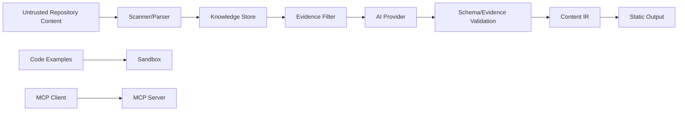
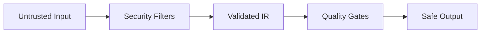

------
title: Build From Scratch: Mintlify-like AI-driven Documentation Generator CLI - Part 042
description: Mendesain security threat model untuk AI-driven documentation generator: assets, trust boundaries, adversaries, attack surfaces, STRIDE analysis, prompt injection, malicious repos, MDX risks, OpenAPI risks, MCP risks, sandboxing, secrets, supply chain, CI/GitHub, mitigations, and security gates.
series: learn-mintlify-like-ai-docs-cli
seriesTitle: Build From Scratch: Mintlify-like AI-driven Documentation Generator CLI
order: 42
partTitle: Security Threat Model
tags:
  - documentation
  - ai
  - cli
  - security
  - threat-modeling
  - supply-chain
  - developer-tools
date: 2026-07-04
---

# Part 042 — Security Threat Model

AI-driven documentation generator bukan static site generator biasa. Ia membaca source code, docs, OpenAPI specs, config, examples, git diff, dan kadang menjalankan code examples atau memanggil AI provider. Karena itu security harus menjadi bagian dari desain, bukan tambahan di akhir.

---

## 1. Security goals

Security goals utama:

1. melindungi secrets,
2. mencegah arbitrary code execution,
3. mencegah path traversal dan unintended file writes,
4. mencegah prompt injection memengaruhi action,
5. mencegah internal/private docs leak ke public output,
6. mencegah XSS/unsafe MDX,
7. mencegah SSRF dari remote refs/link checker/proxy,
8. menjaga GitHub/CI token tetap least-privilege,
9. menjaga MCP read-only dan privacy-filtered,
10. memastikan generated docs tidak publish unsupported claims.

---

## 2. Assets

| Asset | Risk |
|---|---|
| Source code | terkirim ke AI/provider atau public output |
| Secrets | masuk prompt/log/docs/search/llms |
| CI tokens | dieksfiltrasi oleh untrusted PR |
| Knowledge store | menyimpan paths/evidence/internal metadata |
| Provenance | mengekspos file path/symbol/internal API |
| Build output | mengandung hidden/internal docs |
| MCP context | agent mengambil private docs |
| User trust | docs salah atau unsafe examples |

---

## 3. Trust boundaries



Important boundaries:

- repo content is untrusted,
- AI output is untrusted,
- MDX source is untrusted until compiled/validated,
- plugins are trusted code unless sandboxed,
- untrusted PRs must run restricted mode,
- public output must pass privacy gates.

---

## 4. Adversaries

Adversaries:

- malicious contributor,
- malicious docs author,
- malicious OpenAPI spec,
- prompt injection author,
- untrusted MCP client,
- compromised dependency,
- careless maintainer,
- compromised plugin.

---

## 5. STRIDE overview

| STRIDE | Example |
|---|---|
| Spoofing | fake plugin/provider/source identity |
| Tampering | generated patch overwrites manual docs |
| Repudiation | no trace for AI-generated changes |
| Information disclosure | secrets in `llms.txt` |
| Denial of service | huge OpenAPI schema crashes build |
| Elevation of privilege | untrusted PR executes command with CI token |

---

## 6. Scanner threats and mitigations

Threats:

- symlink escape,
- huge file DoS,
- binary parsing,
- scanning `.env`, `.git`, secret files,
- path traversal in generated route.

Mitigations:

- root boundary check,
- symlink policy,
- max file size,
- binary detection,
- default ignores,
- secret classifier,
- normalized project-relative paths.

---

## 7. MDX threats and mitigations

Threats:

- raw script tags,
- arbitrary imports,
- unknown components,
- `javascript:` links,
- unsafe HTML,
- public draft/hidden pages.

Mitigations:

- restricted generated MDX,
- component allowlist,
- prop schema validation,
- raw HTML sanitization,
- safe URL protocols,
- visibility gates.

---

## 8. OpenAPI threats and mitigations

Threats:

- remote `$ref` SSRF,
- circular refs DoS,
- huge schemas,
- HTML in descriptions,
- examples with secrets,
- internal endpoints published.

Mitigations:

- remote refs off by default,
- allowlist if enabled,
- private network block,
- ref depth/cycle protection,
- size limits,
- secret scan examples,
- visibility filters.

---

## 9. AI threats and mitigations

Threats:

- private evidence sent to model,
- prompt injection,
- hallucinated claims,
- fake evidence IDs,
- unsafe code generated,
- invalid MDX/JSON.

Mitigations:

- evidence sensitivity filter,
- prompt delimiters,
- structured output schema,
- evidence ID validation,
- reviewer/fact-checker,
- missing evidence model,
- no raw model MDX publish,
- output secret/safety scan.

---

## 10. Code execution threats and mitigations

Threats:

- shell snippet deletes files,
- code reads secrets,
- network exfiltration,
- process hangs,
- package manager lifecycle scripts.

Mitigations:

- execution disabled/limited by default,
- command allowlist,
- no shell interpolation,
- temp workspace,
- minimal env,
- no network by default,
- timeout/output limit,
- container tier for stronger isolation.

---

## 11. GitHub/CI threats and mitigations

Threats:

- fork PR gets write token,
- PR comment leaks private data,
- bot commits unexpected files,
- update branch loops,
- untrusted config enables plugins.

Mitigations:

- restricted fork mode,
- least privilege permissions,
- sanitized reports,
- allowed path guard,
- bot branch prefix skip,
- plugins disabled in untrusted PR.

---

## 12. MCP threats and mitigations

Threats:

- internal docs retrieval,
- provenance/source path leak,
- arbitrary file read,
- HTTP server exposed publicly,
- oversized response DoS,
- prompt injection through docs content.

Mitigations:

- read-only default,
- stable `docforge://` resources only,
- server-side policy,
- privacy filtering,
- response budgets,
- localhost HTTP default,
- auth for HTTP,
- no write tools in read-only server.

---

## 13. Public output gates

Public output must never include:

- `.docforge` store,
- prompts,
- raw traces,
- internal pages,
- hidden/draft pages,
- sensitive source refs,
- secret-like values,
- unsafe generated JS/HTML.

Use output manifest allowlist and privacy gates.

---

## 14. SecurityContext

```ts
export type SecurityContext = {
  mode: "localTrusted" | "ciTrusted" | "ciUntrustedPr" | "publicBuild" | "internalBuild" | "release";
  trustMode: "trusted" | "restricted" | "untrusted";
  permissions: Set<Permission>;
  visibilityPolicy: VisibilityPolicy;
  networkPolicy: NetworkPolicy;
  writePolicy: WritePolicy;
  aiPrivacyPolicy: AiPrivacyPolicy;
};
```

Subsystems should receive this context instead of inventing local security decisions.

---

## 15. Security modes

| Feature | localTrusted | ciUntrustedPr | publicBuild |
|---|---:|---:|---:|
| AI calls | config | disabled/restricted | filtered |
| plugins | opt-in | disabled | trusted only |
| examples | limited | parse-only | limited |
| remote refs | config | disabled | allowlist |
| internal docs | config | false | false |
| GitHub write | n/a | false | n/a |

---

## 16. Security quality gates

Essential gates:

- secret scan,
- public output privacy,
- restricted MDX,
- OpenAPI remote ref policy,
- example safety,
- provenance required for generated formal docs,
- AI grounding,
- output allowlist,
- GitHub restricted mode,
- MCP policy.

---

## 17. Security tests

Fixtures:

```txt
fixtures/security/
  symlink-escape/
  env-file-secret/
  mdx-script-tag/
  openapi-remote-ref-localhost/
  prompt-injection-readme/
  ai-output-secret/
  unsafe-shell-example/
  public-build-internal-page/
  mcp-internal-query/
  github-fork-pr/
```

Every fixture should assert blocking diagnostics.

---

## 18. Secure defaults

Default posture:

- read-only where possible,
- no arbitrary file read,
- no arbitrary command execution,
- no network unless allowed,
- no internal docs in public output,
- no source paths in public citations,
- no auth persistence,
- no write MCP tools,
- no plugins in untrusted PR,
- no auto-apply for manual/risky AI changes,
- fail on secrets.

---

## 19. Incident playbook

If secret leaked:

1. stop publishing,
2. remove output,
3. rotate secret,
4. purge caches/search/llms,
5. remove from git history if committed,
6. add scanner rule,
7. add regression fixture,
8. release patch.

---

## 20. Key takeaways

Security for AI-driven docs is about controlling data, execution, network, writes, and publication boundaries.



Strong design:

1. treats repo/docs/specs as untrusted,
2. filters evidence before AI,
3. validates every model output,
4. restricts generated MDX,
5. sandboxes execution,
6. blocks SSRF/path traversal,
7. protects manual edits,
8. filters public output/MCP/GitHub reports,
9. uses security modes,
10. and makes dangerous features explicit opt-ins.
