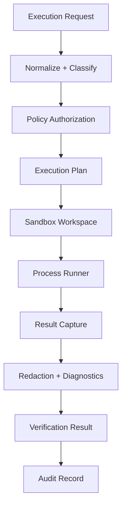
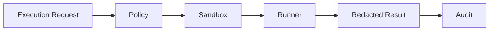

------
title: Build From Scratch: Mintlify-like AI-driven Documentation Generator CLI - Part 043
description: Mendesain sandboxing dan safe execution untuk AI-driven documentation generator: execution surfaces, sandbox policy, process isolation, filesystem/network/env controls, command allowlists, timeouts, containers, example verification, plugins, GitHub CI, MCP safety, and audit logs.
series: learn-mintlify-like-ai-docs-cli
seriesTitle: Build From Scratch: Mintlify-like AI-driven Documentation Generator CLI
order: 43
partTitle: Sandboxing and Safe Execution
tags:
  - documentation
  - ai
  - cli
  - sandboxing
  - security
  - safe-execution
  - developer-tools
date: 2026-07-04
---

# Part 043 — Sandboxing and Safe Execution

Pada Part 042 kita membuat threat model. Sekarang kita masuk ke area yang paling mudah membuat documentation generator berubah dari tool yang membantu menjadi tool yang berbahaya: **execution**.

DocForge-like CLI mungkin perlu menjalankan code examples, command examples, formatter, mock server, parser helper, plugin hook, Git command, atau verification script. Setiap execution surface adalah trust boundary.

Prinsip utamanya:

> Jangan pernah menjalankan string command hanya karena command itu muncul di docs, di README, di OpenAPI description, atau di output AI.

Safe execution harus diperlakukan sebagai capability system: request masuk, policy mengevaluasi, sandbox dipersiapkan, process dijalankan dengan limit, output diredaksi, lalu hasilnya diaudit.

---

## 1. Execution sebagai capability, bukan subprocess helper

Mental model yang benar:



Kita tidak membuat API internal seperti ini:

```ts
run(command: string): Promise<string>
```

Kita membuat API seperti ini:

```ts
execute(request: ExecutionRequest, context: SecurityContext): Promise<ExecutionResult>
```

Perbedaan ini besar. `run(command)` mendorong caller untuk langsung menjalankan sesuatu. `execute(request, context)` memaksa caller mendeklarasikan purpose, trust mode, workspace mode, expected output, dan policy.

---

## 2. Execution surfaces di documentation generator

| Surface | Contoh | Risiko | Default aman |
|---|---|---|---|
| CLI example verification | `docforge build --strict` | write files/hang | fixture + timeout |
| Shell snippets | `curl ...`, `rm ...` | destructive/network | parse-only/blocked |
| SDK code sample | JavaScript/Python/Java/Go snippets | arbitrary code | syntax/compile only |
| OpenAPI mock server | local mock API | port/network/log leak | loopback, bounded |
| API playground proxy | send live request | SSRF/token leak | off/allowlist |
| External formatter | prettier/gofmt | command injection | allowlist |
| Git commands | `git diff` | repo mutation | read-only subcommands |
| Plugins | custom hooks | arbitrary code | explicit trusted enable |
| Link checker | HTTP requests | SSRF/flaky CI | syntax/cache/allowlist |
| MCP server | agent queries | data leakage | read-only, no exec |

Setiap surface harus punya policy terpisah, tetapi semua harus melewati execution manager yang sama.

---

## 3. Sandboxing goals

Sandboxing yang baik bertujuan untuk:

1. mencegah command membaca secret dari machine atau CI;
2. mencegah command menulis ke source repo di luar path yang diizinkan;
3. mencegah network exfiltration;
4. membatasi CPU, memory, stdout, stderr, file size, dan runtime;
5. mencegah command injection dari argumen user/AI/docs;
6. mencegah symlink/path traversal keluar workspace;
7. memastikan output deterministic sejauh mungkin;
8. menyediakan diagnostics yang jelas ketika execution diblokir;
9. menyimpan audit trail tanpa menyimpan secret.

Sandbox bukan hanya Docker. Sandbox adalah kombinasi dari policy, workspace, env, network, process isolation, dan validation.

---

## 4. Sandboxing tiers

Tidak semua execution punya isolation yang sama. Definisikan tier secara eksplisit.

```ts
export type SandboxTier =
  | "none"
  | "parseOnly"
  | "processLimited"
  | "tempWorkspace"
  | "container"
  | "vm"
  | "remoteIsolated";
```

| Tier | Arti | Cocok untuk |
|---|---|---|
| `none` | tidak execute | untrusted PR |
| `parseOnly` | parse/syntax only | shell/code snippets untrusted |
| `processLimited` | child process + timeout/output limit | trusted local helper |
| `tempWorkspace` | run di temp dir/env minimal | CLI fixture examples |
| `container` | filesystem/network/resource isolation | CI verification lebih kuat |
| `vm` | isolation lebih kuat | high-risk arbitrary code |
| `remoteIsolated` | worker service ephemeral | enterprise execution farm |

Default praktis:

- local trusted examples: `tempWorkspace`;
- CI trusted branch: `tempWorkspace` atau `container`;
- PR fork/untrusted: `parseOnly` atau `none`;
- arbitrary plugin: disabled kecuali trusted;
- real network examples: disabled kecuali explicit opt-in.

---

## 5. Execution policy model

```ts
export type ExecutionPolicy = {
  enabled: boolean;
  tier: SandboxTier;
  trustMode: "trusted" | "restricted" | "untrusted";
  commands: CommandPolicy;
  filesystem: FilesystemPolicy;
  environment: EnvironmentPolicy;
  network: ExecutionNetworkPolicy;
  resources: ResourceLimitPolicy;
  logging: ExecutionLoggingPolicy;
  audit: ExecutionAuditPolicy;
};
```

Command policy:

```ts
export type CommandPolicy = {
  allow: AllowedCommand[];
  denyPatterns: string[];
  allowShell: boolean;
};

export type AllowedCommand = {
  command: string;
  allowedSubcommands?: string[];
  allowedArgs?: ArgPolicy[];
  trustModes: Array<"trusted" | "restricted" | "untrusted">;
  requiresFixture?: boolean;
};
```

Filesystem policy:

```ts
export type FilesystemPolicy = {
  workspaceMode: "tempEmpty" | "tempCopy" | "repoReadOnly" | "repoWritable";
  allowedReadGlobs: string[];
  allowedWriteGlobs: string[];
  deniedGlobs: string[];
  followSymlinks: boolean;
  maxWrittenBytes: number;
};
```

Network policy:

```ts
export type ExecutionNetworkPolicy = {
  allowNetwork: boolean;
  allowLoopback: boolean;
  allowMockServer: boolean;
  allowedHosts: string[];
  blockPrivateNetworks: boolean;
};
```

Resource limits:

```ts
export type ResourceLimitPolicy = {
  timeoutMs: number;
  maxOutputBytes: number;
  maxFileBytes?: number;
  maxMemoryMb?: number;
  maxProcessCount?: number;
};
```

---

## 6. Execution request dan result

```ts
export type ExecutionRequest = {
  id: string;
  purpose:
    | "exampleVerification"
    | "codeSampleVerification"
    | "formatting"
    | "gitRead"
    | "pluginHook"
    | "mockServer"
    | "diagnostic";
  command: string;
  args: string[];
  cwd?: string;
  input?: string;
  env?: Record<string, string>;
  trust: "trusted" | "restricted" | "untrusted";
  expected?: ExpectedExecutionResult;
  source?: {
    pageId?: PageId;
    blockId?: string;
    sourceRefs?: SourceRef[];
  };
};
```

```ts
export type ExecutionResult = {
  id: string;
  requestId: string;
  status: "passed" | "failed" | "blocked" | "timeout" | "error";
  exitCode?: number;
  signal?: string;
  durationMs: number;
  stdoutPreview: string;
  stderrPreview: string;
  diagnostics: Diagnostic[];
  artifacts: ExecutionArtifact[];
  audit: ExecutionAuditRecord;
};
```

Audit record:

```ts
export type ExecutionAuditRecord = {
  executionId: string;
  purpose: ExecutionRequest["purpose"];
  command: string;
  argsHash: string;
  trustMode: "trusted" | "restricted" | "untrusted";
  tier: SandboxTier;
  policyHash: string;
  startedAt: string;
  endedAt: string;
  status: ExecutionResult["status"];
};
```

Catatan penting: audit menyimpan hash argumen, bukan selalu full args, karena argumen dapat mengandung token atau path internal.

---

## 7. Jangan gunakan shell sebagai default

Bad:

```ts
exec(`docforge build ${userProvidedFlags}`)
```

Good:

```ts
spawn("docforge", ["build", "--strict"], { shell: false })
```

Rules:

1. gunakan args array;
2. `shell: false`;
3. parse shell snippets menjadi command terstruktur;
4. reject pipe, redirection, command substitution, `&&`, `;`, backticks kecuali policy explicit;
5. jangan biarkan AI membuat raw command yang langsung dijalankan.

Shell syntax yang harus diblokir default:

```txt
|
&&
;
`...`
$(...)
> file
< file
2>&1
```

Bukan berarti semua syntax ini selalu jahat, tetapi unsafe untuk default execution.

---

## 8. Command allowlist

Default allowlist harus kecil.

```json
{
  "allow": [
    { "command": "docforge", "trustModes": ["trusted", "restricted"] },
    { "command": "node", "trustModes": ["trusted"] },
    { "command": "python", "trustModes": ["trusted"] },
    { "command": "javac", "trustModes": ["trusted"] },
    { "command": "go", "trustModes": ["trusted"] },
    {
      "command": "git",
      "allowedSubcommands": ["diff", "status", "rev-parse", "show", "ls-files"],
      "trustModes": ["trusted", "restricted", "untrusted"]
    }
  ]
}
```

Default deny:

```txt
sudo
rm
chmod
chown
curl|sh
wget|sh
ssh
scp
kubectl delete
terraform destroy
docker
npm install
pnpm install
pip install
```

Package manager execution adalah high-risk karena lifecycle scripts dan network fetch. Jangan aktifkan default untuk example verification.

---

## 9. Arg policy

Command allowlist saja tidak cukup. `git` aman untuk `diff`, tetapi tidak aman untuk `push`.

```ts
export type ArgPolicy =
  | { type: "literal"; value: string }
  | { type: "oneOf"; values: string[] }
  | { type: "pattern"; regex: string }
  | { type: "pathWithin"; root: "workspace" | "project" };
```

Untuk Git:

```ts
const gitPolicy: AllowedCommand = {
  command: "git",
  allowedSubcommands: ["diff", "status", "rev-parse", "show", "ls-files"],
  trustModes: ["trusted", "restricted", "untrusted"],
};
```

Reject:

```txt
git push
git commit
git config
git credential
git checkout
git clean
```

Update branch automation boleh memakai Git write commands, tetapi di workflow berbeda dengan permission eksplisit.

---

## 10. Filesystem isolation

Default example verification tidak boleh berjalan di repo root writable.

Preferred flow:

1. buat temp workspace;
2. copy fixture atau subset file yang diperlukan;
3. set cwd ke temp workspace;
4. set HOME ke temp home;
5. run command;
6. collect output;
7. cleanup.

```ts
export async function prepareTempWorkspace(input: {
  projectRoot: string;
  policy: FilesystemPolicy;
  fixturePath?: string;
}): Promise<SandboxWorkspace> {
  const root = await createTempDirectory("docforge-exec-");
  const home = path.join(root, ".home");
  await fs.mkdir(home, { recursive: true });

  if (input.fixturePath) {
    await copyDirectory(input.fixturePath, root, {
      deniedGlobs: input.policy.deniedGlobs,
      followSymlinks: input.policy.followSymlinks,
    });
  }

  return { root, home, cleanup: true };
}
```

Jangan copy `.env`, `.git`, cloud config, SSH keys, atau cache credential.

---

## 11. Path boundary checks

Semua read/write path harus dinormalisasi.

```ts
export function assertInsideRoot(root: string, target: string): void {
  const realRoot = fs.realpathSync(root);
  const realTarget = fs.realpathSync(target);

  if (!realTarget.startsWith(realRoot + path.sep) && realTarget !== realRoot) {
    throw new SecurityError(`Path escapes root: ${target}`);
  }
}
```

Untuk path yang belum ada, gunakan parent realpath dan normalized target.

Path traversal seperti ini harus gagal:

```txt
../../.ssh/id_rsa
/tmp/outside
/absolute/path
```

---

## 12. Symlink policy

Default:

```txt
followSymlinks=false
```

Jika symlink perlu didukung, target harus tetap di dalam allowed root.

Diagnostic:

```txt
warning execution.filesystem.symlinkSkipped
Skipped symlink because sandbox policy does not follow symlinks.
```

Jika target keluar root:

```txt
error execution.filesystem.symlinkOutsideRoot
Symlink target escapes sandbox root.
```

---

## 13. Minimal environment

Default env untuk execution:

```ts
export function minimalEnv(workspace: SandboxWorkspace): Record<string, string> {
  return {
    PATH: safeExecutionPath(),
    HOME: workspace.home,
    TMPDIR: path.join(workspace.root, ".tmp"),
    CI: "1",
    DOCFORGE_EXAMPLE_MODE: "1",
  };
}
```

Jangan inherit env berikut:

```txt
GITHUB_TOKEN
NPM_TOKEN
AWS_ACCESS_KEY_ID
AWS_SECRET_ACCESS_KEY
GOOGLE_APPLICATION_CREDENTIALS
AZURE_CLIENT_SECRET
KUBECONFIG
SSH_AUTH_SOCK
OPENAI_API_KEY
ANTHROPIC_API_KEY
```

Jika example butuh token, gunakan fake placeholder di mock environment.

---

## 14. Output redaction

Execution output dapat berisi secret. Selalu scan dan redact sebelum disimpan atau ditampilkan.

```ts
export function sanitizeExecutionOutput(raw: string): SanitizedOutput {
  const findings = scanSecretLikeText(raw);
  const redacted = redactSecretFindings(raw, findings);

  return {
    text: truncate(redacted, 16 * 1024),
    diagnostics: findings.map((finding) => ({
      code: "execution.secret.output",
      severity: "error",
      category: "security",
      message: "Execution output contained a secret-like value and was redacted.",
    })),
  };
}
```

Jika secret ditemukan di output generated docs/example verification, quality gate harus fail.

---

## 15. Network control

Di process-only sandbox, network blocking tidak sempurna. Jika benar-benar perlu no-network guarantee, gunakan container/VM/network namespace.

Process-level mitigations:

- command allowlist;
- block `curl`, `wget`, `ssh`, cloud CLIs;
- no proxy env;
- use mock server via loopback;
- avoid arbitrary JS/Python execution in untrusted mode.

Container-level mitigations:

```bash
docker run --rm \
  --network none \
  --memory 512m \
  --cpus 1 \
  --read-only \
  --user 1000:1000 \
  -v /tmp/docforge-workspace:/workspace:rw \
  -w /workspace \
  docforge-runner:node20 \
  node example.js
```

Jangan mount Docker socket. Jangan mount home directory. Jangan run as root jika tidak perlu.

---

## 16. Container sandbox policy

```ts
export type ContainerSandboxPolicy = {
  image: string;
  network: "none" | "restricted" | "bridge";
  readOnlyRootFilesystem: boolean;
  memoryMb: number;
  cpus: number;
  user: string;
  mounts: Array<{
    source: string;
    target: string;
    mode: "ro" | "rw";
  }>;
  timeoutMs: number;
};
```

Recommended default:

```json
{
  "network": "none",
  "readOnlyRootFilesystem": true,
  "memoryMb": 512,
  "cpus": 1,
  "user": "1000:1000"
}
```

Container bukan silver bullet, tetapi jauh lebih kuat daripada child process biasa.

---

## 17. Process runner dengan timeout dan output bound

```ts
export async function runProcess(plan: ExecutionPlan): Promise<ExecutionResult> {
  const started = Date.now();
  const stdout = new BoundedBuffer(plan.maxOutputBytes);
  const stderr = new BoundedBuffer(plan.maxOutputBytes);

  const child = spawn(plan.command, plan.args, {
    cwd: plan.cwd,
    env: plan.env,
    shell: false,
    stdio: ["pipe", "pipe", "pipe"],
  });

  child.stdout.on("data", (chunk) => stdout.append(chunk));
  child.stderr.on("data", (chunk) => stderr.append(chunk));

  const timeout = setTimeout(() => {
    killProcessTree(child.pid);
  }, plan.timeoutMs);

  const exit = await waitForExit(child).finally(() => clearTimeout(timeout));

  const safeStdout = sanitizeExecutionOutput(stdout.toString());
  const safeStderr = sanitizeExecutionOutput(stderr.toString());

  return {
    id: plan.id,
    requestId: plan.requestId,
    status: exit.timedOut ? "timeout" : exit.code === 0 ? "passed" : "failed",
    exitCode: exit.code,
    signal: exit.signal,
    durationMs: Date.now() - started,
    stdoutPreview: safeStdout.text,
    stderrPreview: safeStderr.text,
    diagnostics: [...safeStdout.diagnostics, ...safeStderr.diagnostics],
    artifacts: [],
    audit: buildAuditRecord(plan, exit),
  };
}
```

Kebutuhan penting:

- kill process tree, bukan parent saja;
- cleanup temp workspace;
- jangan buffer output tanpa limit;
- jangan tampilkan raw output jika secret ditemukan.

---

## 18. Timeout policy

Every execution must have timeout.

```json
{
  "resources": {
    "timeoutMs": 10000,
    "maxOutputBytes": 16384
  }
}
```

Jika timeout:

```txt
error execution.timeout
Command timed out after 10000ms and was terminated.
```

Long-running docs examples seperti `docforge dev` sebaiknya tidak dieksekusi langsung. Sediakan test mode:

```bash
docforge dev --once
```

atau mark as parse-only.

---

## 19. Example verification integration

Code example verifier dari Part 038 tidak boleh menjalankan process sendiri.

```ts
export async function verifyCliExample(
  example: ExtractedCodeExample,
  ctx: VerificationContext
): Promise<ExampleVerificationResult> {
  const request = createExecutionRequestFromExample(example);
  const result = await ctx.executionManager.execute(request, ctx.securityContext);

  return mapExecutionToExampleResult(example, result);
}
```

Policy untuk generated API sample:

- run against mock server;
- network external off;
- fake token;
- timeout small;
- output redacted;
- result attached to provenance.

---

## 20. Mock server safety

OpenAPI mock server harus terkontrol.

```ts
export type MockServerPolicy = {
  host: "127.0.0.1";
  maxRequests: number;
  maxRequestBodyBytes: number;
  maxResponseBodyBytes: number;
  timeoutMs: number;
};
```

Rules:

- bind loopback only;
- random port;
- no external proxy;
- stop after verification;
- redact auth headers from logs;
- validate request body against schema if possible.

---

## 21. API playground proxy safety

Playground execution is different from test execution.

Default mode should be builder-only or mock-only. Live proxy is opt-in.

```ts
export type ApiProxyPolicy = {
  enabled: boolean;
  allowedHosts: string[];
  blockPrivateNetworks: boolean;
  maxRequestBytes: number;
  maxResponseBytes: number;
  timeoutMs: number;
  redactHeaders: string[];
};
```

Block:

```txt
localhost
127.0.0.0/8
10.0.0.0/8
172.16.0.0/12
192.168.0.0/16
169.254.0.0/16
metadata service IPs
```

Do not log real Authorization headers.

---

## 22. Plugin execution

Plugins are trusted code in v1.

Policy:

- disabled by default in untrusted PR;
- explicit enable;
- permission manifest;
- audit hook calls;
- future: run plugin in separate process with JSON-RPC.

```ts
export type PluginManifest = {
  id: string;
  version: string;
  permissions: Array<
    | "readProject"
    | "writeDocs"
    | "network"
    | "executeCommands"
    | "readKnowledgeStore"
  >;
};
```

Plugin API should expose controlled helpers:

```ts
export type PluginContext = {
  readArtifact(id: ArtifactId): Promise<SourceArtifact>;
  writeGeneratedPage(page: PageIr): Promise<void>;
  execute(request: PluginExecutionRequest): Promise<ExecutionResult>;
};
```

Do not hand plugins raw unrestricted internal objects if you want permission enforcement.

---

## 23. Git command safety

Internal diff workflow needs Git, but Git can mutate repo.

Safe read operations:

```txt
git diff
git status --porcelain
git rev-parse
git show
git ls-files
```

Unsafe unless explicit trusted automation:

```txt
git push
git commit
git checkout
git clean
git config
git credential
```

GitHub update branch feature from Part 036 should use a separate trusted policy and allowed path guard.

---

## 24. Trust mode matrix

| Capability | Local trusted | CI trusted | Untrusted PR | Release |
|---|---:|---:|---:|---:|
| parse config/docs | yes | yes | yes | yes |
| execute CLI fixture examples | yes | yes | no/limited | yes |
| execute arbitrary shell | no | no | no | no |
| SDK compile | optional | optional | parse-only | optional |
| external network | opt-in | off | off | off |
| plugins | opt-in | trusted only | off | trusted only |
| AI calls | config | config | off/restricted | config |
| GitHub writes | n/a | config | off | n/a |
| MCP execution tools | no | no | no | no |

Security mode overrides project config. If untrusted PR mode says plugins off, config cannot turn them on.

---

## 25. Policy resolution

```ts
export function resolveExecutionPolicy(input: {
  config: NormalizedConfig;
  securityContext: SecurityContext;
  cliOverrides: CliOverrides;
}): ExecutionPolicy {
  const defaults = defaultExecutionPolicy();
  const configured = merge(defaults, input.config.execution);
  const overridden = applyCliOverrides(configured, input.cliOverrides);
  return applySecurityModeRestrictions(overridden, input.securityContext);
}
```

Security restrictions are applied last.

Example:

```txt
ciUntrustedPr:
- execution tier forced to parseOnly
- plugins disabled
- network disabled
- package manager commands denied
```

---

## 26. Diagnostics

Execution diagnostics must explain what happened.

| Code | Meaning |
|---|---|
| `execution.disabled` | execution disabled by policy |
| `execution.command.notAllowed` | command not allowlisted |
| `execution.args.dangerous` | dangerous argument pattern |
| `execution.env.blocked` | blocked env variable requested |
| `execution.timeout` | process exceeded timeout |
| `execution.output.truncated` | stdout/stderr truncated |
| `execution.secret.output` | output contained secret-like value |
| `execution.network.denied` | network use denied |
| `execution.workspace.prepareFailed` | workspace setup failed |
| `execution.write.unexpected` | unexpected file write |
| `execution.runner.unavailable` | required runner missing |

Good user-facing message:

```txt
Blocked example execution

Example: /quickstart#install
Command: curl
Reason: network commands are disabled by execution policy.

To keep this example, mark it verify="none" with a reason, or verify it with an OpenAPI mock sample.
```

---

## 27. Execution reports

```ts
export type SafeExecutionReport = {
  schemaVersion: "safe-execution-report/v1";
  policyHash: string;
  executions: ExecutionResult[];
  summary: {
    total: number;
    passed: number;
    failed: number;
    blocked: number;
    timeout: number;
  };
};
```

CLI:

```bash
docforge examples verify --report .docforge/reports/examples.json
docforge execution report
```

Reports must be redacted and bounded.

---

## 28. Testing sandboxing

Fixtures:

```txt
fixtures/sandbox/
  safe-docforge-command/
  blocked-rm-rf/
  blocked-curl-pipe-shell/
  blocked-env-secret/
  timeout-command/
  output-too-large/
  symlink-outside-root/
  unexpected-write/
  network-denied/
```

Tests:

```ts
it("blocks rm -rf", async () => {
  const result = await runSandboxFixture("blocked-rm-rf");

  expect(result.status).toBe("blocked");
  expect(result.diagnostics).toContainEqual(
    expect.objectContaining({ code: "execution.command.notAllowed" })
  );
});
```

```ts
it("redacts secret-like output", async () => {
  const result = await runSandboxFixture("prints-secret");

  expect(result.stdoutPreview).not.toContain("sk_live_");
  expect(result.diagnostics).toContainEqual(
    expect.objectContaining({ code: "execution.secret.output" })
  );
});
```

```ts
it("does not follow symlink outside workspace", async () => {
  const result = await runSandboxFixture("symlink-outside-root");

  expect(result.diagnostics).toContainEqual(
    expect.objectContaining({ code: "execution.filesystem.symlinkOutsideRoot" })
  );
});
```

---

## 29. Cross-platform issues

Windows, macOS, Linux berbeda dalam:

- process tree killing;
- env var casing;
- executable extension;
- path separators;
- symlink permissions;
- shell syntax;
- container availability.

Buat abstraction:

```ts
export type PlatformProcessManager = {
  spawn(plan: ExecutionPlan): ChildProcessHandle;
  killTree(pid: number): Promise<void>;
  commandExists(command: string): Promise<boolean>;
};
```

Core policy tests harus cross-platform tanpa menjalankan command berbahaya.

---

## 30. Performance considerations

Sandbox setup mahal. Optimasi aman:

- verification cache by code hash + env hash;
- changed-only example verification;
- fixture copy caching dengan invalidation;
- concurrency limit;
- container image cache;
- parse-only in dev;
- full execution in release/CI.

Jangan mengorbankan safety demi speed tanpa explicit user policy.

---

## 31. Integration map

| Subsystem | Integration |
|---|---|
| Example verifier | creates execution requests |
| Workflow engine | resolves security/trust mode |
| GitHub integration | disables execution on forks |
| MCP server | read-only, no execution tools |
| Plugin system | uses execution manager for commands |
| Quality gates | fail on unsafe/unverified generated examples |
| Provenance | stores verification execution hash/status |

No subsystem should call `child_process` directly except execution manager internals.

---

## 32. Anti-patterns

### Anti-pattern: AI decides command to run

Bad:

```txt
LLM writes shell command -> tool executes it.
```

Good:

```txt
LLM may produce structured draft -> deterministic verifier decides whether code block is runnable -> execution policy authorizes.
```

### Anti-pattern: inherited environment

Running examples with full `process.env` can leak CI secrets.

### Anti-pattern: executing docs snippets in repo root

A snippet can modify or delete user files.

### Anti-pattern: treating Docker as automatic safety

Wrong mounts/network/root user can still be dangerous.

### Anti-pattern: silent skip

If example isn't verified, say why.

---

## 33. Minimal implementation milestone

First version:

1. define `ExecutionRequest`, `ExecutionPlan`, `ExecutionResult`;
2. implement execution policy resolution;
3. implement command allowlist;
4. implement safe args-array process runner;
5. implement temp workspace + temp HOME;
6. implement timeout + bounded output;
7. implement output redaction;
8. integrate with example verifier;
9. disable execution in untrusted PR mode;
10. add sandbox fixtures/tests.

Second version:

1. container sandbox tier;
2. network isolation through container;
3. repo write monitoring;
4. plugin permissions;
5. mock server execution controls;
6. audit store;
7. cross-platform process tree kill hardening;
8. package manager offline mode;
9. remote isolated execution;
10. security dashboard metrics.

---

## 34. Failure modes

| Failure | Cause | Prevention |
|---|---|---|
| arbitrary command runs | raw shell execution | structured request + allowlist |
| secret env leaks | inherited env | minimal env + blocked vars |
| repo modified | cwd repo root writable | temp workspace + write policy |
| CI hangs | no timeout | timeout + kill tree |
| log leaks token | raw stdout stored | redaction + truncation |
| network exfiltration | arbitrary code with network | network off/container |
| plugin bypasses safety | raw child_process in plugin | plugin API uses execution manager |
| generated sample wrong | no verification | example quality gate |
| untrusted PR runs code | no trust mode | restricted security context |
| sandbox path escape | symlink/path traversal | realpath boundary checks |

---

## 35. Key takeaways

Safe execution is not one utility function. It is a security architecture.



Strong safe execution design:

1. treats execution as a capability;
2. avoids shell by default;
3. uses command/arg allowlists;
4. runs in temp workspace;
5. uses minimal environment;
6. disables network by default;
7. enforces timeout/output bounds;
8. redacts secrets;
9. disables risky execution in untrusted mode;
10. escalates high-risk execution to container/VM tiers.

Next, we design **performance and scale engineering** so this tool remains usable on real repositories and monorepos.
