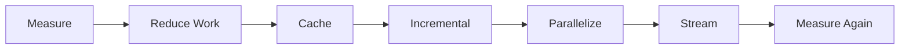
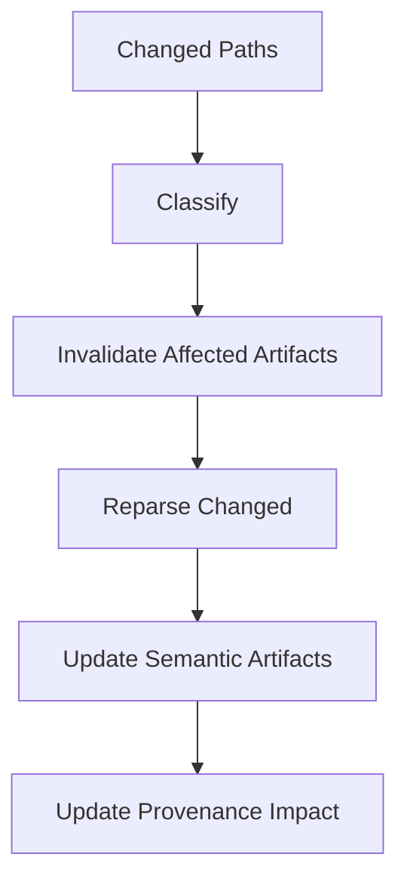
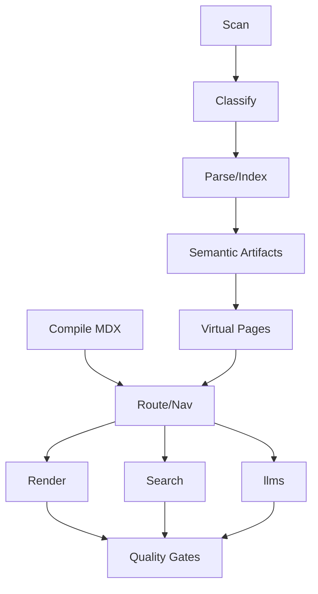

------
title: Build From Scratch: Mintlify-like AI-driven Documentation Generator CLI - Part 044
description: Mendesain performance dan scale engineering untuk AI-driven documentation generator: large repositories, monorepos, incremental indexing, caching, worker pools, SQLite tuning, MDX/OpenAPI/search performance, AI cost budgets, profiling, CI optimization, and SLOs.
series: learn-mintlify-like-ai-docs-cli
seriesTitle: Build From Scratch: Mintlify-like AI-driven Documentation Generator CLI
order: 44
partTitle: Performance and Scale Engineering
tags:
  - documentation
  - ai
  - cli
  - performance
  - scalability
  - caching
  - monorepo
  - developer-tools
date: 2026-07-04
---

# Part 044 — Performance and Scale Engineering

Production-grade documentation generator harus cepat bukan hanya di demo repo, tetapi juga di repo nyata:

- ribuan halaman MDX;
- ratusan sampai ribuan OpenAPI operations;
- puluhan ribu source files;
- monorepo dengan banyak package/service;
- CI PR workflow;
- local dev hot reload;
- code indexing;
- search indexing;
- `llms.txt` export;
- code example verification;
- AI generation dengan budget.

Performance bukan optimasi kecil di akhir. Performance harus memengaruhi data model, pipeline, cache, scheduler, quality gates, dan UX.

Prinsip utama:

> Fast systems are mostly systems that avoid unnecessary work.

---

## 1. Mental model: avoid work, then parallelize

Urutan prioritas performance:

1. kurangi scope;
2. cache hasil;
3. invalidasi kecil;
4. proses incremental;
5. gunakan concurrency terbatas;
6. stream output besar;
7. ukur bottleneck;
8. baru optimasi micro-level.



Jika pipeline melakukan full repo scan, full parse, full MDX compile, full search build, full AI generation setiap command, tool akan cepat menjadi tidak dipakai.

---

## 2. Target scale scenarios

Definisikan target agar arsitektur punya arah.

| Scenario | Target realistis |
|---|---:|
| Small docs warm build | < 2 detik |
| Medium docs warm build | < 10 detik |
| Dev MDX hot reload | 300ms-1.5s |
| PR changed-only check | < 2-5 menit |
| OpenAPI 500 operations | generate/update < 30 detik |
| Search index 5k pages | < 60 detik |
| Monorepo 10k-50k files | incremental, bukan full setiap PR |
| AI generation | explicit budget, never implicit unlimited |

Target bukan janji absolut, tetapi constraint design.

---

## 3. Work categories

```ts
export type WorkCategory =
  | "filesystemScan"
  | "classification"
  | "parsing"
  | "symbolExtraction"
  | "openapiIngestion"
  | "mdxCompile"
  | "navigation"
  | "render"
  | "searchIndex"
  | "llmsExport"
  | "qualityGates"
  | "exampleVerification"
  | "aiRetrieval"
  | "aiGeneration";
```

| Category | Bound by | Optimization style |
|---|---|---|
| filesystem scan | IO | ignore early, stat cache |
| parsing | CPU | worker pool, content cache |
| symbol extraction | CPU/memory | targeted queries |
| OpenAPI | CPU/memory | normalized op cache |
| MDX compile | CPU | page-level cache |
| render | CPU | render IR cache |
| search index | CPU/memory | search doc cache/sharding |
| external links | network | cache/timeout/warn |
| examples | process/CPU/IO | verification cache/concurrency |
| AI | network/cost | budgets/cache/deterministic first |

Satu concurrency value tidak cocok untuk semua stage.

---

## 4. Observability first

Tanpa profile, performance tuning hanya tebakan.

```ts
export type PerformanceSpan = {
  id: string;
  name: string;
  category: WorkCategory;
  startedAt: number;
  endedAt?: number;
  durationMs?: number;
  metadata?: Record<string, unknown>;
};

export type PerformanceReport = {
  command: string;
  totalDurationMs: number;
  spans: PerformanceSpan[];
  counters: Record<string, number>;
  cache: CacheSummary;
  memory?: MemorySnapshot[];
};
```

Usage:

```ts
await perf.span("scan.filesystem", () => scanProject());
await perf.span("mdx.compile", () => compileChangedPages());
await perf.span("search.index", () => buildSearchIndex());
```

CLI:

```bash
docforge build --profile
```

Output:

```txt
Build profile

Total: 18.4s

scan.filesystem       1.2s
classification        0.8s
tree-sitter.parse     4.6s
mdx.compile           3.1s
openapi.ingest        1.5s
search.index          2.7s
llms.export           0.6s
quality.links         1.1s
render.static         2.8s

Cache:
  file hash hit rate: 91%
  parser hit rate: 84%
  MDX compile hit rate: 76%
```

---

## 5. Cache key design

Cache yang salah lebih buruk daripada tidak punya cache.

Cache key harus mencakup:

- input content hash;
- relevant config hash;
- tool version;
- parser/compiler/generator version;
- schema version;
- prompt contract version untuk AI;
- dependency version jika output dipengaruhi dependency.

```ts
export type CacheKey = {
  namespace: string;
  inputHash: string;
  configHash: string;
  toolVersion: string;
  dependencyVersionHash?: string;
};
```

Bad:

```txt
cache by file path only
```

Good:

```txt
cache by content hash + parser version + query version + config subset
```

---

## 6. Cache namespaces

Pisahkan cache per stage.

```txt
scanner.fileStat
scanner.artifact
classifier.result
parser.treeSitterCaptures
symbol.extraction
openapi.normalizedDocument
openapi.operationModel
mdx.compile
page.renderIr
page.html
search.pageDocument
search.indexShard
llms.pageMarkdown
llms.compact
quality.pageLinks
example.verification
ai.retrieval
ai.output
```

Setiap namespace punya invalidation rule berbeda. Jangan bikin satu cache global yang opaque.

---

## 7. Stat cache vs content hash

Hash semua file setiap run bisa mahal. Gunakan stat cache.

```ts
export type FileStatCacheEntry = {
  path: string;
  size: number;
  mtimeMs: number;
  contentHash: string;
};
```

Flow:

1. `stat` file;
2. jika size+mtime sama dengan cache, reuse contentHash;
3. jika berubah, baca file dan hash;
4. update cache.

Mtime bukan source of truth final, tetapi shortcut untuk menghindari hashing ulang.

---

## 8. Filesystem scan performance

Scanner harus cepat karena ia sering dipakai.

Optimizations:

1. prune ignored directories sebelum traverse;
2. skip `.git`, `node_modules`, build outputs, vendor, cache;
3. avoid reading content until needed;
4. detect binary/huge files early;
5. bounded concurrency;
6. output sorted only once;
7. use source roots in monorepo.

```ts
export type ScannerPerformanceConfig = {
  maxConcurrency: number;
  maxFileSizeBytes: number;
  hardIgnoredDirs: string[];
};
```

Hard ignores:

```txt
.git
node_modules
dist
build
target
.gradle
.next
.docforge/cache
coverage
```

User can override carefully, but safe defaults matter.

---

## 9. Ignore rule compilation

Compile ignore patterns once.

```ts
export type CompiledIgnoreRules = {
  shouldSkip(path: string, kind: "file" | "directory"): SkipDecision;
};
```

Directory pruning:

```ts
if (rules.shouldSkip(dir, "directory").skip) {
  return; // do not traverse children
}
```

This is huge for monorepos.

---

## 10. Monorepo source roots

Jangan scan seluruh monorepo jika docs project hanya butuh subset.

```json
{
  "projects": [
    {
      "id": "public-docs",
      "docsRoot": "docs/public",
      "sourceRoots": ["packages/api", "packages/sdk-js", "openapi"]
    },
    {
      "id": "internal-docs",
      "docsRoot": "docs/internal",
      "sourceRoots": ["services/**", "runbooks/**"]
    }
  ]
}
```

Di CI, changed file dapat dimap ke affected docs project.

```ts
export type AffectedDocsProject = {
  projectId: string;
  reasons: string[];
};
```

---

## 11. Project graph untuk scale

```ts
export type ProjectGraph = {
  projects: ProjectNode[];
  dependencies: ProjectDependency[];
};

export type ProjectNode = {
  id: string;
  root: string;
  type: "docs" | "package" | "service" | "library" | "spec";
};
```

Use case:

```txt
changed packages/sdk-js -> affected docs: public-docs
changed services/internal-billing -> affected docs: internal-docs only
```

Tanpa project graph, CI cenderung menjalankan semua checks untuk semua docs.

---

## 12. Incremental indexing

Naive indexing:

```txt
parse every file every time
```

Incremental indexing:



Store dependency graph:

```ts
export type IndexDependency = {
  from: ArtifactId;
  to: ArtifactId;
  reason: "import" | "ref" | "openapiRef" | "docsLink" | "generatedFrom";
};
```

Invalidation:

```ts
export function computeInvalidationSet(
  changed: ArtifactId[],
  graph: DependencyGraph
): Set<ArtifactId> {
  const invalid = new Set<ArtifactId>();
  const queue = [...changed];

  while (queue.length > 0) {
    const id = queue.shift()!;
    if (invalid.has(id)) continue;
    invalid.add(id);

    for (const dependent of graph.dependentsOf(id)) {
      queue.push(dependent);
    }
  }

  return invalid;
}
```

---

## 13. Parser performance

Tree-sitter/source parser stage dapat mahal.

Optimizations:

- parse only supported/relevant languages;
- skip generated/vendor files;
- cache captures/symbols by file hash;
- avoid storing full trees persistently;
- worker pool with bounded concurrency;
- query only what you need;
- fail per-file, not whole index.

Cache entry:

```ts
export type ParserCacheEntry = {
  artifactId: ArtifactId;
  contentHash: string;
  language: LanguageId;
  parserVersion: string;
  queryVersion: string;
  capturesHash: string;
  symbolsHash: string;
};
```

Do not keep all syntax trees in memory for large repos. Extract symbols/semantic artifacts and release tree.

---

## 14. Worker pools and bounded concurrency

Bad:

```ts
await Promise.all(files.map(parseFile));
```

Good:

```ts
await mapWithConcurrency(files, parseConcurrency, parseFile);
```

Concurrency config:

```json
{
  "performance": {
    "concurrency": {
      "scan": 64,
      "parse": 8,
      "mdxCompile": 4,
      "render": 4,
      "externalLinks": 8,
      "examples": 2,
      "ai": 3
    }
  }
}
```

Different work categories need different concurrency. CPU-bound parsing should not use scan-level concurrency.

---

## 15. Adaptive concurrency

```ts
export function defaultConcurrency(category: WorkCategory): number {
  const cpu = Math.max(1, os.cpus().length);

  switch (category) {
    case "filesystemScan": return Math.min(64, cpu * 8);
    case "parsing": return Math.max(1, cpu - 1);
    case "mdxCompile": return Math.max(1, Math.floor(cpu / 2));
    case "render": return Math.max(1, Math.floor(cpu / 2));
    case "exampleVerification": return 2;
    case "aiGeneration": return 3;
    default: return Math.max(1, cpu - 1);
  }
}
```

Allow override. Over-parallelization can make build slower due memory/disk thrash.

---

## 16. SQLite performance

Knowledge store performance matters. Use:

- transactions;
- prepared statements;
- WAL mode;
- indexes on hot fields;
- batch writes;
- avoid JSON scans for hot queries;
- compact old records.

Pragmas:

```sql
PRAGMA journal_mode = WAL;
PRAGMA synchronous = NORMAL;
PRAGMA foreign_keys = ON;
PRAGMA temp_store = MEMORY;
```

Batch write:

```ts
const insertMany = db.transaction((symbols: CodeSymbol[]) => {
  for (const symbol of symbols) {
    insertSymbol.run(symbol);
  }
});

insertMany(symbols);
```

No transaction = slow write amplification.

---

## 17. Store indexes

Hot indexes:

```sql
CREATE INDEX idx_artifacts_path ON artifacts(path);
CREATE INDEX idx_artifacts_hash ON artifacts(content_hash);
CREATE INDEX idx_symbols_artifact ON symbols(artifact_id);
CREATE INDEX idx_symbols_qualified_name ON symbols(qualified_name);
CREATE INDEX idx_semantic_type_key ON semantic_artifacts(type, key);
CREATE INDEX idx_semantic_visibility ON semantic_artifacts(visibility);
CREATE INDEX idx_pages_route ON doc_pages(route);
CREATE INDEX idx_provenance_source ON provenance_refs(source_key);
CREATE INDEX idx_search_chunks_page ON search_chunks(page_id);
```

Jangan over-index semua kolom. Index mempercepat read tetapi memperlambat write.

---

## 18. JSON columns and hot fields

JSON fleksibel, tetapi jangan query hot fields dari JSON.

Good:

```sql
CREATE TABLE semantic_artifacts (
  id TEXT PRIMARY KEY,
  type TEXT NOT NULL,
  key TEXT NOT NULL,
  visibility TEXT NOT NULL,
  confidence TEXT NOT NULL,
  data_json TEXT NOT NULL
);
```

Filter by `type`, `key`, `visibility`, not by JSON path.

---

## 19. Store cleanup and compaction

Caches grow.

Commands:

```bash
docforge cache prune
docforge store compact
docforge workflow cleanup
```

Config:

```json
{
  "cache": {
    "maxSizeMb": 1024,
    "maxAgeDays": 30
  },
  "workflow": {
    "reviewArtifacts": {
      "retentionDays": 14
    }
  }
}
```

Do not let `.docforge` become a hidden multi-GB directory.

---

## 20. MDX compile cache

MDX compile cache key:

```ts
export type MdxCompileCacheKey = {
  pageContentHash: string;
  frontmatterSchemaVersion: string;
  mdxCompilerVersion: string;
  componentRegistryHash: string;
  relevantConfigHash: string;
};
```

Compiled page cache entry:

```ts
export type MdxCompileCacheEntry = {
  pageId: PageId;
  route: RoutePath;
  headingsHash: string;
  linksHash: string;
  renderIrHash: string;
  diagnosticsHash: string;
};
```

If one MDX file changes, recompile that page, update route/link/nav state as needed, not every page.

---

## 21. Component registry hash

Component changes can invalidate many pages.

```ts
componentRegistryHash = sha256(stableJson({
  components: componentSpecs.map((c) => ({
    name: c.name,
    propsSchemaHash: c.propsSchemaHash,
    markdownExporterVersion: c.markdownExporterVersion,
    renderVersion: c.renderVersion,
  })),
}));
```

If component renderer changes, page HTML may need regeneration. If only docs content changes, component hash unchanged.

---

## 22. Static render performance

Render cache key:

```ts
export type PageRenderCacheKey = {
  renderIrHash: string;
  themeVersion: string;
  layoutVersion: string;
  navHash: string;
  basePath: string;
};
```

If nav is embedded in every page, nav changes invalidate all HTML pages. For huge docs, consider:

- nav manifest as separate asset;
- client-side/lazy nav sections;
- generated API nav collapsed by default;
- route group pages.

---

## 23. OpenAPI ingestion performance

Large OpenAPI specs are common.

Optimizations:

1. parse YAML/JSON once;
2. memoize `$ref` resolution;
3. avoid full dereference unless needed;
4. normalize operation independently;
5. hash per operation and per schema;
6. regenerate only changed operation pages;
7. collapse huge schemas;
8. cache schema render models.

Normalized operation hash:

```ts
export function hashOperation(operation: NormalizedOperation): string {
  return sha256(stableJson({
    method: operation.method,
    path: operation.path,
    operationId: operation.operationId,
    parameters: operation.parameters,
    requestBody: operation.requestBody,
    responses: operation.responses,
    security: operation.security,
    deprecated: operation.deprecated,
  }));
}
```

If only one operation changes, only that operation page and affected indexes should update.

---

## 24. Ref resolver performance

Full dereference can explode memory.

Use lazy resolver:

```ts
export type RefResolver = {
  resolve(ref: string): Promise<ResolvedRef>;
};
```

With memoization:

```ts
const cache = new Map<string, ResolvedRef>();
const resolving = new Set<string>();
```

If cycle detected, represent as recursive ref, not infinite expansion.

Render options:

```ts
export type SchemaRenderOptions = {
  maxDepth: number;
  maxProperties: number;
  expandRefs: "none" | "firstLevel" | "safe";
};
```

---

## 25. API page generation performance

Generated API pages are deterministic. They should be fast and cacheable.

```ts
apiPageCacheKey = sha256(stableJson({
  operationHash,
  generatorVersion,
  themeApiComponentVersion,
  routePolicyHash,
}));
```

For 1000 operations:

- generate page IR in parallel;
- write only changed pages;
- update nav/search incrementally;
- avoid AI for formal operation content.

AI is for guides/explanations, not every operation page.

---

## 26. Search indexing performance

Search often becomes bottleneck.

Pipeline:

```txt
compiled page -> search document -> chunks -> global index
```

Cache page search document:

```ts
export type SearchDocCacheEntry = {
  pageId: PageId;
  pageContentHash: string;
  extractorVersion: string;
  searchDocument: SearchDocument;
};
```

If 5 pages changed, reuse cached search docs for others, then rebuild global index from all docs. For very large sites, shard.

---

## 27. Search sharding

For large docs:

```txt
search/
  manifest.json
  shard-guides.json
  shard-reference.json
  shard-api-users.json
  shard-api-projects.json
```

Shard by:

- route prefix;
- page kind;
- API tag/spec;
- version/locale.

This improves client load performance and build memory.

---

## 28. Search chunking trade-off

Small chunks:

- better result precision;
- bigger index;
- more postings.

Large chunks:

- smaller index;
- worse snippets;
- less precise ranking.

Config:

```json
{
  "search": {
    "chunkTargetChars": 1200,
    "chunkMaxChars": 2400,
    "maxChunksPerPage": 50
  }
}
```

Evaluate with Part 039 search evals, not intuition.

---

## 29. `llms.txt` export performance

Do not build huge strings in memory unnecessarily.

Cache page Markdown export:

```ts
export type LlmsPageMarkdownCacheEntry = {
  pageId: PageId;
  pageContentHash: string;
  markdownExporterVersion: string;
  markdown: string;
};
```

For `llms-full.txt`, stream write:

```ts
const writer = fs.createWriteStream(outputPath);

for (const page of orderedPages) {
  writer.write(renderPageSeparator(page));
  writer.write(await getCachedPageMarkdown(page));
}
```

Compact `llms.txt` should apply budget early and avoid including huge schemas.

---

## 30. Quality gates performance

Quality gates should support changed-only mode.

| Gate | Incremental strategy |
|---|---|
| internal links | changed pages + route index |
| anchors | changed pages |
| external links | URL cache |
| provenance stale | source refs of changed artifacts |
| AI grounding | changed/generated pages |
| examples | changed code blocks/cache |
| search | changed page docs + global rebuild/shard |
| llms | changed page Markdown + export budget |
| security output | full in release, changed output in dev |

Release mode can run full strict gates.

---

## 31. External link performance

External link checks are slow/flaky.

Default:

- local: syntax only/off;
- CI: cached fast mode;
- release: full optional.

Cache:

```ts
export type ExternalLinkCacheEntry = {
  url: string;
  result: ExternalLinkCheckResult;
  expiresAt: string;
};
```

Always use:

- timeout;
- concurrency limit;
- redirect limit;
- response size limit;
- private network block.

---

## 32. Example verification performance

Example verification can be expensive.

Use:

- verification cache;
- changed-only;
- fixture-based execution;
- parse-only for manual snippets;
- mock server for API samples;
- concurrency limit;
- skip long-running commands.

Cache key:

```ts
export type ExampleVerificationCacheKey = {
  exampleId: string;
  codeHash: string;
  metadataHash: string;
  runnerId: string;
  runnerVersion: string;
  fixtureHash?: string;
  environmentHash: string;
};
```

---

## 33. AI performance and cost

AI calls are expensive and slow. They should never be hidden inside normal build unless explicitly configured.

Strategies:

1. deterministic generators first;
2. AI only for planned pages/sections that need prose;
3. retrieval context bounded;
4. cache outputs;
5. budget calls/tokens/cost;
6. dry-run estimates;
7. no AI in dev hot reload;
8. no AI in untrusted PR default;
9. review plan before generating many pages.

Budget model:

```ts
export type AiBudget = {
  maxCalls: number;
  maxInputTokens: number;
  maxOutputTokens: number;
  maxCostUsd?: number;
  maxDurationMs?: number;
};
```

CLI:

```bash
docforge generate --budget-calls 20 --budget-usd 2
```

If exceeded:

```txt
error ai.budget.exceeded
AI generation budget exceeded before completing all planned pages.
```

---

## 34. AI cache

```ts
export type AiOutputCacheKey = {
  taskType: string;
  promptContractVersion: string;
  outputSchemaVersion: string;
  model: string;
  evidenceHash: string;
  constraintsHash: string;
};
```

Do not cache invalid outputs as accepted outputs. Store diagnostics separately.

Privacy config may store only hashes, not full prompt/output.

---

## 35. Embeddings/vector search performance

If vector retrieval is added:

- embed chunks incrementally;
- cache by chunk hash + embedding model;
- batch provider calls;
- avoid embedding secrets/internal docs if not allowed;
- make vector index optional;
- keep exact/keyword search as baseline.

```ts
export type EmbeddingCacheKey = {
  chunkHash: string;
  model: string;
  dimensions: number;
};
```

Embeddings should improve retrieval, not become a required bottleneck.

---

## 36. Dev server hot reload

Target behavior:

| Change | Work |
|---|---|
| MDX page edit | compile/render that page |
| frontmatter route edit | update route index/nav affected |
| config edit | reload config and affected stages |
| OpenAPI edit | reingest spec, update affected API pages |
| source code edit | update code index, mark affected docs stale |
| theme edit | rerender affected/all pages |
| search config edit | rebuild search |
| llms config edit | rebuild agent exports |

Do not call AI automatically during hot reload.

---

## 37. Watch scheduler

File watchers produce noisy events. Use debounce/coalescing.

```ts
export type WatchScheduler = {
  enqueue(change: FileChange): void;
  flush(): Promise<void>;
  cancelObsolete(workId: string): void;
};
```

Rules:

- debounce 50-200ms;
- coalesce repeated changes;
- ignore output/cache dirs;
- cancel obsolete compile;
- do not start 10 builds for 10 rapid saves.

---

## 38. Cancellation

Dev tasks need cancellation.

```ts
export type CancellationToken = {
  readonly cancelled: boolean;
  throwIfCancelled(): void;
};
```

If user edits page while previous compile running, discard stale result.

Long tasks should check token between phases.

---

## 39. Memory management

Avoid holding all of these at once:

- file contents for entire repo;
- all syntax trees;
- huge dereferenced OpenAPI graph;
- all generated HTML strings;
- full `llms-full.txt` string;
- all logs from examples.

Use:

- streaming;
- summaries;
- store-backed intermediate artifacts;
- per-task memory release;
- bounded buffers;
- worker processes for heavy parser tasks.

---

## 40. Large page handling

Large pages hurt compile, search, browser, and agent export.

Diagnostics:

```txt
warning performance.page.tooLarge
Page /api-reference/schemas/full is 1.8 MB, exceeding budget 512 KB.
```

Mitigations:

- split schema pages;
- collapse large schema sections;
- route by resource/tag;
- do not inline every schema in compact `llms.txt`;
- use lazy UI for API schema viewer.

---

## 41. Output writing performance

Naive:

```txt
rm -rf dist && write everything
```

Simple but slow and risky.

Better:

- content hash each output;
- write only if changed;
- atomic write;
- output manifest;
- remove obsolete files from previous manifest.

```ts
export async function writeIfChanged(path: string, content: string): Promise<boolean> {
  const existing = await readFileIfExists(path);
  const newHash = sha256(content);

  if (existing && sha256(existing) === newHash) {
    return false;
  }

  await atomicWrite(path, content);
  return true;
}
```

---

## 42. Output manifest

```ts
export type BuildOutputManifest = {
  schemaVersion: "build-output-manifest/v1";
  files: Array<{
    path: string;
    contentHash: string;
    kind: "html" | "asset" | "search" | "llms" | "sitemap" | "robots";
  }>;
};
```

Use manifest to:

- skip unchanged writes;
- delete obsolete files;
- detect private artifact leakage;
- generate deployment diff;
- support rollback.

---

## 43. CI optimization

PR CI should be changed-aware.

Possible flow:

```bash
docforge index --changed --since origin/main
docforge check --changed --strict
docforge update --since origin/main --dry-run --format json
docforge build --strict
```

For very large repos:

- changed-only check first;
- full build only for docs-affecting PR or release branch;
- cache `.docforge/cache` safely;
- upload quality/performance reports.

Release branch should run full strict build.

---

## 44. CI cache strategy

Cache key:

```txt
os + node-version + package-lock/pnpm-lock hash + docforge version + config hash
```

Cache contents:

- parser cache;
- MDX compile cache;
- search doc cache;
- OpenAPI normalized cache;
- example verification cache if safe.

Do not cache:

- prompts/outputs if privacy disallows;
- secrets;
- unredacted traces;
- local absolute source excerpts intended private.

Internal cache keys still must detect stale entries.

---

## 45. Remote cache

For enterprise monorepos, remote cache can help.

Requirements:

- content-addressed;
- project scoped;
- visibility scoped;
- no secret payloads;
- cache entry versioning;
- integrity hash.

Remote cache is later milestone. Local cache first.

---

## 46. Performance budgets

```json
{
  "performance": {
    "budgets": {
      "devHotReloadMs": 1500,
      "warmBuildMs": 10000,
      "searchIndexBytes": 10485760,
      "llmsCompactChars": 50000,
      "maxPageHtmlBytes": 524288
    }
  }
}
```

Diagnostics:

```txt
warning performance.build.slow
Warm build took 18.4s, exceeding budget 10s.
```

```txt
warning performance.search.tooLarge
Search index is 18 MB, exceeding budget 10 MB.
```

Budgets create feedback loops.

---

## 47. Performance doctor

```bash
docforge doctor performance
```

Output:

```txt
Performance doctor

Cache:
  enabled: yes
  size: 382 MB
  last build hit rate: 78%

Scanner:
  source files: 12,430
  generated files skipped: 2,180
  large files skipped: 18

Bottlenecks:
  tree-sitter.parse: 42% of build time
  search.index: 21% of build time

Suggestions:
  - Exclude packages/api/generated from code indexing.
  - Enable changed-only CI checks.
  - Increase parse concurrency from 4 to 8 if memory allows.
```

This is much more useful than making users guess.

---

## 48. Benchmark suite

Synthetic fixtures:

```txt
benchmarks/
  small-docs/
  mdx-100-pages/
  mdx-5000-pages/
  openapi-1000-ops/
  monorepo-10000-files/
  search-5000-pages/
  llms-large/
```

Command:

```bash
docforge bench --suite openapi-1000-ops
```

Output:

```txt
Benchmark: openapi-1000-ops

Cold build: 41.2s
Warm build: 8.7s
Changed operation rebuild: 1.4s
Peak RSS: 612 MB
Generated operation pages: 1000
```

Benchmarks protect the tool itself from regressions.

---

## 49. Performance trace artifacts

Write:

```txt
.docforge/reports/performance-report.json
.docforge/reports/performance-trace.json
```

Chrome-trace-like model later:

```ts
export type PerformanceTraceEvent = {
  name: string;
  cat: string;
  ph: "B" | "E" | "X";
  ts: number;
  dur?: number;
  pid: number;
  tid: number;
  args?: Record<string, unknown>;
};
```

Do not include secret values in trace args.

---

## 50. Algorithmic traps

| Trap | Consequence | Better |
|---|---|---|
| check links by scanning all routes linearly | O(links × routes) | route `Map`/`Set` |
| full parse every run | slow PR/dev | content-hash cache |
| full OpenAPI dereference | memory explosion | lazy refs |
| `Promise.all` thousands parse tasks | memory spike | bounded concurrency |
| rebuild search docs from raw MDX | repeated work | page search doc cache |
| JSON scan hot queries | slow store | indexed columns |
| rewrite all generated docs | noisy diffs | provenance impact |
| AI call per field | cost explosion | deterministic grouping |
| build `llms-full` as one string | memory spike | stream |
| external link check every run | flaky/slow | cache |

---

## 51. Route/link lookup performance

Internal link check should be O(number of links).

```ts
export type RouteIndex = {
  routes: Map<RoutePath, RouteRecord>;
  redirects: Map<RoutePath, RoutePath>;
};

export type RouteRecord = {
  route: RoutePath;
  pageId: PageId;
  anchors: Set<string>;
};
```

Do not compare every link against every page route.

---

## 52. Diagnostics volume

Large sites can produce thousands of diagnostics.

Terminal output should be capped and grouped.

```txt
Quality check failed with 382 diagnostics.

Errors by code:
- link.internal.routeNotFound: 41
- ai.claim.unsupported: 2
- asset.missing: 9

Showing first 50. Full report: .docforge/reports/quality-report.json
```

JSON report contains all diagnostics.

---

## 53. Task graph scheduler

Build pipeline can be modeled as task graph.

```ts
export type BuildTask = {
  id: string;
  category: WorkCategory;
  inputs: string[];
  outputs: string[];
  dependencies: string[];
  run(ctx: TaskContext): Promise<void>;
};
```

Graph:



Scheduler can run independent tasks concurrently while respecting dependencies.

---

## 54. Backpressure and queues

If parser produces results faster than SQLite writes, memory grows.

Use bounded queues:

```ts
export type BoundedQueue<T> = {
  push(item: T): Promise<void>;
  take(): Promise<T>;
};
```

Backpressure prevents memory blowups in large repos.

---

## 55. Latency vs throughput

Dev server optimizes latency. CI optimizes throughput.

Dev:

- incremental;
- cancel obsolete work;
- quick diagnostics;
- no external link full check;
- no implicit AI.

CI/release:

- batch;
- full strict checks;
- stable reports;
- cache warmed;
- no interactive UX.

Do not use identical scheduler defaults for both.

---

## 56. Progress events

Long commands need progress.

```ts
export type ProgressEvent =
  | { type: "stage.started"; stage: string }
  | { type: "stage.progress"; stage: string; completed: number; total?: number }
  | { type: "stage.finished"; stage: string; durationMs: number };
```

CLI:

```txt
Scanning files [12430]
Parsing source [842/12430]
Compiling MDX [41/600]
Generating API pages [120/1000]
Building search index
```

Progress should be high-level, not spam.

---

## 57. Load shedding

If command has time budget, optional tasks can be skipped.

```ts
export type TimeBudget = {
  totalMs?: number;
  perStageMs?: Partial<Record<WorkCategory, number>>;
  onExceeded: "fail" | "warnAndSkipOptional" | "continue";
};
```

Do not skip security gates silently. Safe optional tasks:

- external link full check;
- some style checks;
- non-critical eval suites;
- full example execution in dev.

Diagnostic:

```txt
warning performance.timeBudget.optionalSkipped
External link checking skipped because time budget was exceeded.
```

---

## 58. Multi-version and localization performance

If docs have versions/locales:

- build latest first;
- cache per version/locale;
- share assets/theme;
- build search per version/locale;
- avoid rebuilding old versions unless affected;
- generate `llms.<locale>.txt` separately.

Cache key includes version and locale.

---

## 59. Performance config

```json
{
  "performance": {
    "profile": false,
    "cache": {
      "enabled": true,
      "path": ".docforge/cache",
      "maxSizeMb": 1024,
      "maxAgeDays": 30
    },
    "concurrency": {
      "scan": 64,
      "parse": 8,
      "mdxCompile": 4,
      "render": 4,
      "examples": 2,
      "ai": 3
    },
    "incremental": {
      "enabled": true,
      "changedOnlyInCi": true
    }
  }
}
```

Config harus punya safe defaults, tetapi bisa ditune per repo.

---

## 60. Cache safety

Cache bisa stale atau corrupt.

Commands:

```bash
docforge cache verify
docforge cache reset
docforge cache prune
```

If cache corrupt:

```txt
warning cache.entry.invalid
Ignoring invalid cache entry for mdx.compile.
```

Never let corrupt cache silently produce wrong docs.

---

## 61. Performance testing matrix

| Test | Purpose |
|---|---|
| warm build idempotency | no unnecessary rewrite |
| changed MDX page | compile only affected page |
| changed OpenAPI operation | update only operation page |
| changed config field | update config reference only |
| huge OpenAPI schema | no memory explosion |
| 5k pages search | index within budget |
| external links cached | second run faster |
| examples cache | unchanged examples skipped |
| dev rapid edits | obsolete tasks cancelled |
| cache reset | clean rebuild works |

---

## 62. Performance recommendations engine

Simple rules can generate useful hints.

Examples:

```ts
if (report.stage("tree-sitter.parse").ratio > 0.4 && report.counters.generatedFilesParsed > 1000) {
  suggest("Exclude generated files from code indexing.");
}
```

```ts
if (report.cache.mdxCompileHitRate < 0.3 && report.command === "build") {
  suggest("Check whether generated timestamps are changing MDX content on each build.");
}
```

```ts
if (report.searchIndexBytes > config.performance.budgets.searchIndexBytes) {
  suggest("Shard search index or exclude large schema pages from search body.");
}
```

---

## 63. Anti-patterns

### Anti-pattern: full rebuild for every dev change

Kills local UX.

### Anti-pattern: AI inside hot reload

Expensive, slow, and unpredictable.

### Anti-pattern: cache by path only

Produces stale/wrong outputs.

### Anti-pattern: unbounded `Promise.all`

Causes memory spikes and CI failures.

### Anti-pattern: giant single API/schema page

Hurts compile, search, browser, and agent export.

### Anti-pattern: optimizing without profile

You will fix the wrong bottleneck.

---

## 64. Minimal implementation milestone

First version:

1. performance span collector;
2. `--profile` report;
3. stat/content hash cache;
4. scanner early ignore and source roots;
5. bounded concurrency helper;
6. SQLite transactions and hot indexes;
7. MDX compile cache;
8. OpenAPI operation hash cache;
9. search document cache;
10. changed-only CI path.

Second version:

1. task graph scheduler;
2. worker pool isolation;
3. dev cancellation;
4. search sharding;
5. streaming `llms-full`;
6. benchmark suite;
7. performance doctor;
8. adaptive concurrency;
9. remote cache;
10. performance regression tracking.

---

## 65. Failure modes

| Failure | Cause | Prevention |
|---|---|---|
| warm build slow | weak cache | content/version cache keys |
| dev reload slow | full rebuild | change classification |
| memory blowup | all trees/output in memory | streaming + release + store summaries |
| CI too slow | full checks every PR | changed-only + cache |
| search index huge | poor chunking | chunk budgets/sharding |
| OpenAPI slow | full dereference | lazy refs + op cache |
| SQLite slow | no transaction/index | batch writes/hot indexes |
| AI cost explosion | too many tasks | budget + deterministic generators |
| external link flaky | live checks | cache/warn mode |
| cache wrong | incomplete key | versioned cache keys |

---

## 66. Key takeaways

Performance is a system property.


Strong performance design:

1. measures every stage;
2. scans only relevant roots;
3. caches by content and versions;
4. indexes incrementally;
5. uses dependency-based invalidation;
6. bounds concurrency;
7. tunes SQLite with transactions/indexes;
8. avoids full OpenAPI dereference;
9. keeps AI out of hot paths;
10. gives users profile reports and performance doctor hints.

Next, we design the **plugin system and extension API**.
