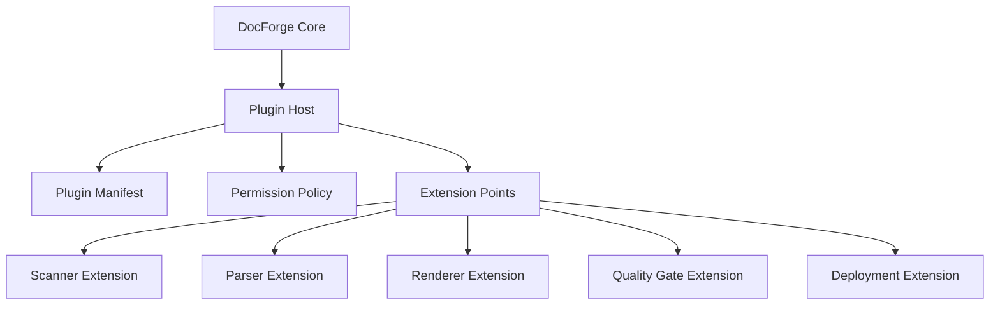
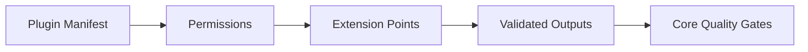

------
title: Build From Scratch: Mintlify-like AI-driven Documentation Generator CLI - Part 045
description: Mendesain plugin system dan extension API untuk AI-driven documentation generator: extension points, plugin manifest, lifecycle hooks, capabilities, permissions, sandboxing, versioning, diagnostics, testing, marketplace readiness, and production-grade plugin contracts.
series: learn-mintlify-like-ai-docs-cli
seriesTitle: Build From Scratch: Mintlify-like AI-driven Documentation Generator CLI
order: 45
partTitle: Plugin System and Extension API
tags:
  - documentation
  - ai
  - cli
  - plugins
  - extensibility
  - architecture
  - developer-tools
date: 2026-07-04
---

# Part 045 — Plugin System and Extension API

Sampai Part 044, DocForge-like CLI sudah punya core pipeline yang kuat:

- scanning,
- classification,
- parsing,
- code graph,
- OpenAPI ingestion,
- MDX compile,
- rendering,
- search,
- AI generation,
- provenance,
- quality gates,
- safe execution,
- performance engineering.

Tetapi production-grade developer tool tidak bisa memprediksi semua kebutuhan user.

Teams akan ingin:

- menambahkan parser framework internal,
- menambahkan custom documentation component,
- mengubah route strategy,
- mengintegrasikan design system internal,
- membuat custom quality gate,
- menambahkan deployment target,
- menambahkan source ingestion dari database/schema registry,
- membuat custom OpenAPI extension renderer,
- membuat docs coverage rule internal,
- menambahkan telemetry/analytics sink,
- menambahkan AI provider/model lokal,
- atau menambahkan workflow PR policy khusus.

Karena itu kita butuh:

> **plugin system and extension API**

Namun plugin system adalah pedang bermata dua. Ia membuat sistem fleksibel, tetapi juga membuka risiko:

- coupling,
- breaking changes,
- arbitrary code execution,
- security bypass,
- slow plugins,
- unstable builds,
- hidden side effects,
- dan ecosystem fragmentation.

Maka plugin system harus didesain sebagai **capability-bound extension architecture**, bukan `eval anything`.

---

## 1. Mental model: plugin is a constrained extension, not core mutation

Plugin tidak boleh bebas memodifikasi internal state core.

Plugin seharusnya berinteraksi lewat contract:



Core owns:

- pipeline order,
- security policy,
- data model,
- diagnostics,
- validation,
- write boundaries,
- cache boundaries.

Plugin contributes:

- adapters,
- hooks,
- transforms,
- generators,
- validators,
- renderers,
- exporters,
- deployment handlers.

---

## 2. Plugin design goals

A strong plugin system should:

1. expose stable extension points,
2. avoid leaking internal mutable objects,
3. make plugin capabilities explicit,
4. make plugin permissions explicit,
5. support version compatibility,
6. isolate plugin failure,
7. make plugin diagnostics first-class,
8. support deterministic builds,
9. integrate with security modes,
10. support testing with plugin fixtures,
11. allow future marketplace/distribution,
12. and keep core usable without plugins.

---

## 3. Non-goals for v1

Do not try to build a full plugin marketplace immediately.

V1 should not include:

- remote plugin execution,
- dynamic plugin install from URL,
- arbitrary untrusted plugins in CI,
- plugin sandbox with perfect isolation,
- plugin dependency resolver,
- GUI marketplace,
- plugin auto-update,
- plugin write access by default.

Start with local installed trusted plugins and strict contracts.

---

## 4. Extension point taxonomy

```ts
export type ExtensionPointKind =
  | "configSchema"
  | "scanner"
  | "classifier"
  | "parser"
  | "semanticExtractor"
  | "pageGenerator"
  | "component"
  | "theme"
  | "markdownExporter"
  | "qualityGate"
  | "searchExtractor"
  | "llmsExporter"
  | "aiProvider"
  | "retriever"
  | "deploymentAdapter"
  | "workflowHook"
  | "telemetrySink";
```

Group by risk:

| Extension point | Risk | Example |
|---|---:|---|
| component spec | low/medium | custom callout/card |
| Markdown exporter | low/medium | export custom component to `llms.txt` |
| quality gate | medium | internal docs policy |
| parser/extractor | medium/high | custom framework route detection |
| page generator | medium/high | generate SDK docs |
| AI provider | high | send data to model |
| deployment adapter | high | upload files |
| workflow hook | high | PR automation |
| plugin arbitrary command | very high | should require execution policy |

---

## 5. Plugin manifest

Every plugin needs manifest.

```ts
export type PluginManifest = {
  id: string;
  name: string;
  version: string;
  description?: string;
  entrypoint: string;
  compatibleWith: {
    docforge: string;
    api: string;
  };
  extensionPoints: ExtensionPointKind[];
  permissions: PluginPermission[];
  configSchema?: JsonSchema;
};
```

Example:

```json
{
  "id": "@acme/docforge-spring",
  "name": "Acme Spring Docs Plugin",
  "version": "1.2.0",
  "entrypoint": "dist/index.js",
  "compatibleWith": {
    "docforge": ">=1.0.0 <2.0.0",
    "api": "plugin-api/v1"
  },
  "extensionPoints": ["semanticExtractor", "qualityGate"],
  "permissions": ["readProject", "readKnowledgeStore"]
}
```

---

## 6. Plugin permissions

```ts
export type PluginPermission =
  | "readProject"
  | "readDocs"
  | "readKnowledgeStore"
  | "writeGeneratedDocs"
  | "writeBuildOutput"
  | "network"
  | "callAiProvider"
  | "executeCommands"
  | "postWorkflowNotification"
  | "deploy";
```

Permissions are not decorative. Core must enforce them.

Examples:

| Plugin type | Needed permissions |
|---|---|
| component plugin | none/readDocs maybe |
| parser plugin | readProject |
| quality gate | readDocs/readKnowledgeStore |
| deployment adapter | writeBuildOutput/network/deploy |
| AI provider | callAiProvider/network |
| telemetry sink | network/postWorkflowNotification |

---

## 7. Plugin trust model

```ts
export type PluginTrustLevel = "trusted" | "workspace" | "thirdParty" | "disabled";
```

| Trust | Meaning |
|---|---|
| trusted | explicitly approved by team/admin |
| workspace | defined in repo; trusted only in trusted mode |
| thirdParty | installed package; requires explicit enable |
| disabled | not loaded |

Untrusted PR mode should disable workspace/third-party plugins unless safe list says otherwise.

---

## 8. Plugin loading config

```json
{
  "plugins": [
    {
      "package": "@acme/docforge-spring",
      "enabled": true,
      "trust": "trusted",
      "config": {
        "scanAnnotations": true
      }
    }
  ]
}
```

Plugin config is validated by plugin's config schema if provided.

---

## 9. Plugin registry in runtime

```ts
export type PluginRegistry = {
  plugins: LoadedPlugin[];
  extensionPoints: Map<ExtensionPointKind, RegisteredExtension[]>;
};

export type LoadedPlugin = {
  manifest: PluginManifest;
  module: PluginModule;
  config: unknown;
  trust: PluginTrustLevel;
  diagnostics: Diagnostic[];
};
```

Registered extension:

```ts
export type RegisteredExtension = {
  pluginId: string;
  kind: ExtensionPointKind;
  name: string;
  version: string;
  handler: unknown;
};
```

---

## 10. Plugin module contract

```ts
export type PluginModule = {
  manifest: PluginManifest;
  activate(ctx: PluginActivationContext): Promise<void> | void;
};
```

Activation context:

```ts
export type PluginActivationContext = {
  apiVersion: "plugin-api/v1";
  logger: PluginLogger;
  register: PluginRegistrationApi;
  config: unknown;
  capabilities: PluginCapabilityApi;
};
```

Plugin should register extensions during activation.

---

## 11. Registration API

```ts
export type PluginRegistrationApi = {
  scanner(extension: ScannerExtension): void;
  classifier(extension: ClassifierExtension): void;
  parser(extension: ParserExtension): void;
  semanticExtractor(extension: SemanticExtractorExtension): void;
  pageGenerator(extension: PageGeneratorExtension): void;
  component(extension: ComponentExtension): void;
  markdownExporter(extension: MarkdownExporterExtension): void;
  qualityGate(extension: QualityGateExtension): void;
  deploymentAdapter(extension: DeploymentAdapterExtension): void;
  aiProvider(extension: AiProviderExtension): void;
};
```

Registration should validate:

- plugin permission,
- extension point declared in manifest,
- handler shape,
- duplicate names,
- version compatibility.

---

## 12. Capability API

Plugins should not receive raw Node globals as official API.

Capability API:

```ts
export type PluginCapabilityApi = {
  readProjectFile(path: string): Promise<string>;
  readDocsFile(path: string): Promise<string>;
  queryKnowledgeStore<T>(query: PluginStoreQuery): Promise<T>;
  emitDiagnostic(diagnostic: PluginDiagnostic): void;
  execute?(request: PluginExecutionRequest): Promise<ExecutionResult>;
  fetch?(request: PluginNetworkRequest): Promise<PluginNetworkResponse>;
};
```

Each method enforces permissions/security mode.

---

## 13. Why not expose internal store directly?

Bad:

```ts
plugin.activate({ db, internalGraph, mutableConfig });
```

Problems:

- plugin can corrupt state,
- API becomes impossible to version,
- security permissions are bypassed,
- testability suffers.

Good:

```ts
ctx.capabilities.queryKnowledgeStore({ type: "semanticArtifacts", filter: ... })
```

Core owns store schema. Plugin gets stable query interface.

---

## 14. Plugin diagnostics

Plugin diagnostics are normal diagnostics with source.

```ts
export type PluginDiagnostic = Diagnostic & {
  pluginId: string;
};
```

Example:

```txt
warning plugin.acme-spring.route.lowConfidence
Spring route extraction is low confidence for UserController#create.
```

Diagnostics should identify plugin.

---

## 15. Plugin failure isolation

A plugin failure should not crash whole process unless extension is required.

```ts
export type PluginFailurePolicy = "failBuild" | "warnAndDisable" | "skipExtension";
```

Config:

```json
{
  "plugins": [
    {
      "package": "@acme/docforge-spring",
      "failurePolicy": "warnAndDisable"
    }
  ]
}
```

Default:

- trusted required plugin: fail,
- optional plugin: warn and disable,
- untrusted mode: disabled.

---

## 16. Extension point: config schema

Plugins may extend config.

Example:

```json
{
  "spring": {
    "enabled": true,
    "basePackages": ["com.acme"]
  }
}
```

Extension:

```ts
export type ConfigSchemaExtension = {
  namespace: string;
  schema: JsonSchema;
  normalize?(raw: unknown): unknown;
};
```

Rules:

- plugin config lives under namespace,
- plugin cannot redefine core config fields,
- schema versioned,
- config normalized before plugin activation.

---

## 17. Extension point: scanner

Scanner extension can add virtual artifacts or classify extra files.

```ts
export type ScannerExtension = {
  name: string;
  discover(ctx: ScannerExtensionContext): Promise<ScannerExtensionResult>;
};

export type ScannerExtensionResult = {
  artifacts: SourceArtifact[];
  diagnostics: Diagnostic[];
};
```

Use cases:

- schema registry export,
- package manager workspace detection,
- service catalog files,
- generated virtual docs inputs.

Scanner plugin must respect path boundaries.

---

## 18. Extension point: classifier

```ts
export type ClassifierExtension = {
  name: string;
  classify(input: ClassifierExtensionInput): Promise<ClassificationPatch | undefined>;
};
```

Input:

```ts
export type ClassifierExtensionInput = {
  artifact: SourceArtifact;
  existingClassification: ArtifactClassification;
};
```

Patch:

```ts
export type ClassificationPatch = {
  roles?: ArtifactRole[];
  authority?: SourceAuthority;
  sensitivity?: SensitivityLevel;
  extractionPlans?: ExtractionPlan[];
  confidence: Confidence;
};
```

Classifier extensions should not read file content unless permission and content provided.

---

## 19. Extension point: parser

Parser extension handles new syntax/data format.

```ts
export type ParserExtension = {
  name: string;
  supports(artifact: SourceArtifact): boolean;
  parse(input: ParserExtensionInput): Promise<ParserExtensionResult>;
};

export type ParserExtensionResult = {
  facts: ExtractedFact[];
  symbols?: CodeSymbol[];
  relations?: CodeRelation[];
  diagnostics: Diagnostic[];
};
```

Use cases:

- AsyncAPI,
- GraphQL schema,
- Terraform modules,
- protobuf,
- database migration parser,
- proprietary config format.

---

## 20. Extension point: semantic extractor

Semantic extractor transforms syntax/symbol facts into product semantics.

```ts
export type SemanticExtractorExtension = {
  name: string;
  artifactTypes: string[];
  extract(ctx: SemanticExtractionContext): Promise<SemanticExtractionResult>;
};
```

Example: Spring route extractor.

```ts
export type SpringRouteArtifact = {
  type: "httpEndpoint";
  method: string;
  path: string;
  controller: string;
  handler: string;
  confidence: Confidence;
};
```

Extractor should return provenance.

---

## 21. Extension point: page generator

Page generator creates Page IR from semantic artifacts.

```ts
export type PageGeneratorExtension = {
  name: string;
  supports(input: PageGeneratorSupportInput): boolean;
  generate(input: PageGeneratorInput): Promise<PageGeneratorResult>;
};
```

Output:

```ts
export type PageGeneratorResult = {
  pages: PageIr[];
  nav?: NavPatch;
  diagnostics: Diagnostic[];
};
```

Rules:

- must emit Content IR/Page IR, not raw files,
- must attach provenance,
- must respect route registry,
- must be deterministic unless marked AI/non-deterministic.

---

## 22. Extension point: component

Component plugin adds MDX components.

```ts
export type ComponentExtension = {
  name: string;
  spec: ComponentSpec;
  renderer?: ComponentRenderer;
  markdownExporter?: ComponentMarkdownExporter;
  searchExtractor?: ComponentSearchExtractor;
};
```

Component spec:

```ts
export type ComponentSpec = {
  name: string;
  propsSchema: JsonSchema;
  allowedChildren?: "none" | "inline" | "block" | "any";
  safeInGeneratedDocs: boolean;
};
```

Generated docs can use only `safeInGeneratedDocs` components unless allowed.

---

## 23. Component security

Component plugin can introduce XSS or tracking.

Mitigations:

- prop schema validation,
- generated-safe flag,
- Markdown fallback required for agent exports if critical,
- no arbitrary remote script injection,
- build output security gate,
- review component plugin before trusted.

---

## 24. Extension point: Markdown exporter

If plugin adds component, it should provide Markdown exporter.

```ts
export type MarkdownExporterExtension = {
  name: string;
  componentName: string;
  toMarkdown(node: ComponentNode, ctx: MarkdownExportContext): string;
};
```

Without exporter:

- `llms.txt` may lose content,
- quality gate can warn/fail.

---

## 25. Extension point: quality gate

```ts
export type QualityGateExtension = {
  id: string;
  category: QualityGateCategory;
  run(input: QualityGateInput): Promise<QualityGateResult>;
};
```

Use cases:

- company style guide,
- regulatory warning checks,
- internal API exposure check,
- architecture docs freshness,
- custom link policy,
- product-specific coverage.

Quality gates must be pure checks. They should not modify files.

---

## 26. Extension point: deployment adapter

Part 046 covers deployment deeply.

Interface:

```ts
export type DeploymentAdapterExtension = {
  id: string;
  name: string;
  plan(input: DeploymentPlanInput): Promise<DeploymentPlan>;
  deploy(input: DeploymentInput): Promise<DeploymentResult>;
};
```

Permissions:

- deploy,
- network,
- read build output,
- maybe write deployment metadata.

Deployment plugin should never receive source code by default.

---

## 27. Extension point: AI provider

```ts
export type AiProviderExtension = {
  id: string;
  models(): Promise<AiModelInfo[]>;
  complete(request: AiCompletionRequest): Promise<AiCompletionResponse>;
  embed?(request: AiEmbeddingRequest): Promise<AiEmbeddingResponse>;
};
```

AI provider plugin is high risk because it can send data out.

Must respect AI privacy policy:

- no source code if disabled,
- no internal docs if disabled,
- redact secrets,
- log provider/model metadata.

---

## 28. Extension point: workflow hook

Workflow hooks are useful but risky.

```ts
export type WorkflowHookExtension = {
  name: string;
  onWorkflowStarted?(event: WorkflowStartedEvent): Promise<void>;
  onQualityReport?(event: QualityReportEvent): Promise<void>;
  onDeploymentFinished?(event: DeploymentFinishedEvent): Promise<void>;
};
```

Rules:

- hooks receive sanitized event model,
- no mutable workflow internals,
- network permission required for notifications,
- failure policy explicit.

---

## 29. Plugin API versioning

Core version and plugin API version are different.

```txt
DocForge CLI: 1.8.2
Plugin API: plugin-api/v1
```

A plugin declares:

```json
{
  "compatibleWith": {
    "api": "plugin-api/v1",
    "docforge": ">=1.5 <2"
  }
}
```

Breaking plugin API changes require new API version.

---

## 30. Extension versioning

Each extension can have version.

```ts
export type ExtensionDescriptor = {
  name: string;
  version: string;
  kind: ExtensionPointKind;
};
```

Cache keys include extension version.

If parser plugin version changes, invalidate extracted artifacts.

---

## 31. Plugin cache keys

```ts
export type PluginCacheKeyPart = {
  pluginId: string;
  pluginVersion: string;
  extensionName: string;
  extensionVersion: string;
  configHash: string;
};
```

If plugin or config changes, derived outputs invalidate.

---

## 32. Plugin execution model v1

V1 pragmatic approach:

- load trusted plugin module in-process,
- call typed extension functions,
- enforce permissions in capability APIs,
- disable plugins in untrusted mode,
- do not claim strong isolation.

This is honest and manageable.

High-risk plugins can later run out-of-process.

---

## 33. Out-of-process plugin model later

Future model:


Communication via JSON-RPC-like protocol.

Benefits:

- crash isolation,
- easier timeout,
- narrower capabilities,
- potential sandbox/container.

Costs:

- more complexity,
- serialization overhead,
- version protocol.

---

## 34. Plugin security modes

| Security mode | Plugin behavior |
|---|---|
| localTrusted | enabled if configured |
| ciTrusted | enabled trusted only |
| ciUntrustedPr | disabled unless allowlisted safe plugin |
| publicBuild | trusted only, privacy enforced |
| release | trusted only, strict diagnostics |

Implementation:

```ts
export function shouldLoadPlugin(
  plugin: PluginConfig,
  security: SecurityContext
): boolean {
  if (security.trustMode === "untrusted") {
    return plugin.trust === "trusted" && plugin.allowInUntrustedMode === true;
  }

  return plugin.enabled;
}
```

---

## 35. Plugin permission enforcement

```ts
export function requirePluginPermission(
  plugin: LoadedPlugin,
  permission: PluginPermission
): void {
  if (!plugin.manifest.permissions.includes(permission)) {
    throw new PluginPermissionError(plugin.manifest.id, permission);
  }
}
```

Capability method example:

```ts
async function readProjectFile(path: string): Promise<string> {
  requirePluginPermission(plugin, "readProject");
  assertPathInsideRoot(projectRoot, path);
  assertNotSensitive(path, securityContext);
  return fs.readFile(path, "utf8");
}
```

---

## 36. Plugin network access

Plugins should not call raw network through official API unless permission.

Capability:

```ts
fetch(request: PluginNetworkRequest): Promise<PluginNetworkResponse>
```

Enforces:

- network permission,
- allowed hosts,
- timeout,
- max bytes,
- no private network unless allowed.

In-process plugin can still import `fetch` if available, so v1 relies on trust. Out-of-process/plugin sandbox needed for stronger enforcement.

Be honest in docs.

---

## 37. Plugin command execution

Plugins should use execution manager.

```ts
execute(request: PluginExecutionRequest): Promise<ExecutionResult>
```

Requires:

- `executeCommands` permission,
- execution policy approval,
- sandbox mode,
- audit logging.

Do not expose raw `child_process` helper.

---

## 38. Plugin diagnostics and observability

Track plugin runtime:

```ts
export type PluginRuntimeStats = {
  pluginId: string;
  activationMs: number;
  extensionCalls: number;
  totalDurationMs: number;
  diagnostics: number;
  failures: number;
};
```

`docforge doctor plugins`:

```txt
Plugins:
- @acme/docforge-spring 1.2.0
  status: loaded
  extension points: semanticExtractor, qualityGate
  permissions: readProject, readKnowledgeStore
  activation: 42ms
```

---

## 39. Plugin timeout

Plugin hooks should have timeouts.

```ts
export type PluginTimeoutPolicy = {
  activationMs: number;
  extensionCallMs: number;
};
```

If timeout:

```txt
warning plugin.timeout
Plugin @acme/docforge-spring semanticExtractor exceeded 5000ms and was disabled for this run.
```

Out-of-process model can enforce better.

---

## 40. Plugin ordering

Multiple plugins may target same extension point.

Ordering should be explicit and deterministic.

```ts
export type ExtensionOrder = {
  before?: string[];
  after?: string[];
  priority?: number;
};
```

Resolve order:

1. dependency constraints,
2. priority,
3. plugin ID lexical fallback.

Detect cycles.

---

## 41. Conflict handling

Plugins can conflict.

Examples:

- two plugins register same component name,
- two classifiers assign different sensitivity,
- two page generators produce same route,
- two quality gates share ID.

Diagnostic:

```txt
error plugin.conflict.componentName
Multiple plugins register component <ApiExample>.
```

Core should fail or require explicit override.

---

## 42. Plugin route conflicts

Page generator plugin must not silently override route.

If route conflict:

```txt
error plugin.page.routeConflict
Plugin @acme/sdk-docs generated route /reference/sdk already used by core page.
```

Plugin can provide route prefix config.

---

## 43. Plugin config namespace

Plugin config must be namespaced.

Good:

```json
{
  "plugins": [
    {
      "package": "@acme/sdk-docs",
      "config": {
        "routePrefix": "/reference/sdk"
      }
    }
  ]
}
```

Bad:

```json
{
  "sdkDocsRoutePrefix": "/reference/sdk"
}
```

Namespacing prevents core config pollution.

---

## 44. Plugin authoring SDK

Provide SDK package:

```ts
import { defineDocForgePlugin } from "@docforge/plugin-sdk";

export default defineDocForgePlugin({
  manifest: {
    id: "@acme/docforge-spring",
    name: "Spring Plugin",
    version: "1.0.0",
    compatibleWith: { api: "plugin-api/v1", docforge: ">=1 <2" },
    extensionPoints: ["semanticExtractor"],
    permissions: ["readProject", "readKnowledgeStore"],
  },
  activate(ctx) {
    ctx.register.semanticExtractor({
      name: "spring-routes",
      artifactTypes: ["java"],
      async extract(input) {
        return { artifacts: [], diagnostics: [] };
      },
    });
  },
});
```

SDK should include types and helpers.

---

## 45. Plugin testing kit

```ts
import { createPluginTestHarness } from "@docforge/plugin-testkit";

it("extracts Spring route", async () => {
  const harness = await createPluginTestHarness({
    plugin,
    fixture: "fixtures/spring-controller",
  });

  const result = await harness.runSemanticExtraction();

  expect(result.artifacts).toContainEqual(
    expect.objectContaining({ path: "/users" })
  );
});
```

Testkit should provide:

- fixture repo,
- fake knowledge store,
- diagnostics assertion,
- snapshot utilities,
- security mode simulation.

---

## 46. Plugin fixture layout

```txt
plugins/spring-plugin/
  src/index.ts
  fixtures/
    simple-controller/
      src/main/java/com/acme/UserController.java
      expected.json
  tests/
    spring-routes.test.ts
```

Encourage plugin authors to ship fixtures.

---

## 47. Plugin quality checklist

Plugin must:

- declare manifest,
- declare permissions,
- validate config,
- emit diagnostics,
- attach provenance,
- be deterministic,
- handle parse errors,
- not crash on unsupported files,
- respect security mode,
- include tests.

---

## 48. Plugin distribution v1

V1 simplest:

- plugin is npm package or local path,
- user installs dependency,
- config references package,
- DocForge imports entrypoint.

Example:

```bash
pnpm add -D @acme/docforge-spring
```

Config:

```json
{
  "plugins": [
    { "package": "@acme/docforge-spring", "enabled": true, "trust": "trusted" }
  ]
}
```

---

## 49. Local plugin paths

```json
{
  "plugins": [
    { "path": "./tools/docforge-plugin", "enabled": true, "trust": "workspace" }
  ]
}
```

Disable in untrusted PR by default because PR can modify local plugin code.

---

## 50. Plugin lockfile

For reproducibility:

```json
{
  "plugins": [
    {
      "id": "@acme/docforge-spring",
      "version": "1.2.0",
      "resolved": "npm:@acme/docforge-spring@1.2.0",
      "integrity": "sha512-..."
    }
  ]
}
```

Maybe part of `docforge.lock.json`.

---

## 51. Plugin doctor

```bash
docforge doctor plugins
```

Output:

```txt
Plugin doctor

Loaded:
- @acme/docforge-spring 1.2.0
  API: plugin-api/v1 compatible
  Permissions: readProject, readKnowledgeStore
  Extensions: semanticExtractor:spring-routes

Warnings:
- Plugin @acme/deploy-netlify requests network and deploy permissions.
```

---

## 52. Plugin explain

```bash
docforge plugins explain @acme/docforge-spring
```

Output:

```txt
@acme/docforge-spring

Purpose:
  Extracts Spring MVC route artifacts from Java controllers.

Permissions:
  readProject: reads Java source files
  readKnowledgeStore: queries code symbols

Disabled in:
  ciUntrustedPr
```

Transparency builds trust.

---

## 53. Plugin list command

```bash
docforge plugins list
```

Output:

```txt
Plugins:
- @acme/docforge-spring loaded
- @acme/docforge-deploy-s3 disabled by config
```

---

## 54. Plugin security report

```bash
docforge plugins security
```

Shows:

- plugins with network,
- plugins with executeCommands,
- plugins enabled in CI,
- workspace plugins,
- untrusted disabled plugins.

---

## 55. Plugin marketplace readiness later

If marketplace later:

Need:

- verified publisher,
- signed packages,
- permission display,
- compatibility metadata,
- security review,
- download stats,
- deprecation warnings,
- vulnerability advisories.

Not v1.

---

## 56. Extension API stability rules

Avoid exposing classes with many methods.

Prefer:

- plain data types,
- JSON-serializable inputs/outputs,
- stable enums,
- versioned schemas,
- helper SDKs over internal objects.

This enables out-of-process plugins later.

---

## 57. Plugin data contracts

Plugin input/output should be serializable.

Good:

```ts
extract(input: SemanticExtractionInput): Promise<SemanticExtractionOutput>
```

where input/output are plain objects.

Bad:

```ts
extract(project: InternalProjectGraph, db: BetterSqliteDatabase)
```

---

## 58. Plugin and provenance

Plugin-generated facts/pages must attach provenance.

```ts
export type PluginGeneratedArtifact = {
  id: string;
  type: string;
  data: unknown;
  provenance: SourceRef[];
  generatedBy: {
    pluginId: string;
    extensionName: string;
    version: string;
  };
};
```

No provenance, no auto-publish for generated formal docs.

---

## 59. Plugin and quality gates

Plugin output goes through core quality gates.

Plugin cannot mark its own output trusted without review.

Even if plugin generates MDX:

- parse/compile,
- link check,
- security scan,
- provenance gate,
- visibility gate.

---

## 60. Plugin and AI

Plugin may provide AI provider/retriever/writer extension, but:

- must use core prompt contracts or declared contract,
- must return schema-valid output,
- must respect evidence/privacy policy,
- must be reviewed by AI grounding gate.

Do not let plugin bypass reviewer.

---

## 61. Plugin and deployment

Deployment plugins should receive build output manifest, not raw project.

```ts
export type DeploymentInput = {
  outputDir: string;
  outputManifest: BuildOutputManifest;
  deploymentConfig: unknown;
};
```

They should not scan arbitrary files.

---

## 62. Plugin and telemetry

Telemetry sink plugin:

```ts
export type TelemetrySinkExtension = {
  name: string;
  send(events: TelemetryEvent[]): Promise<void>;
};
```

Requires network permission and privacy config.

Telemetry events should be sanitized before plugin receives them.

---

## 63. Plugin performance

Plugin calls should be measured.

If plugin dominates build:

```txt
warning plugin.performance.slow
Plugin @acme/docforge-spring consumed 42% of build time.
```

Include in performance profile.

---

## 64. Plugin cache invalidation

If plugin extension changes, invalidate derived outputs.

Examples:

- semantic extractor plugin update → semantic artifacts changed,
- component exporter update → `llms` export changed,
- quality gate update → quality report changed,
- deployment adapter update → deployment plan changed.

Cache namespace should include plugin version.

---

## 65. Plugin compatibility diagnostics

```txt
error plugin.compatibility.apiVersion
Plugin @acme/foo requires plugin-api/v2 but DocForge supports plugin-api/v1.
```

```txt
warning plugin.compatibility.docforgeRange
Plugin @acme/foo was tested with DocForge <1.5. Current version is 1.8.
```

Fail for API mismatch. Warn for semver range if potentially compatible? Be conservative.

---

## 66. Plugin loading algorithm

```ts
export async function loadPlugins(
  configs: PluginConfig[],
  ctx: PluginHostContext
): Promise<PluginRegistry> {
  const registry = createEmptyRegistry();

  for (const pluginConfig of configs) {
    if (!shouldLoadPlugin(pluginConfig, ctx.security)) continue;

    const loaded = await loadOnePlugin(pluginConfig, ctx);
    validateManifest(loaded.manifest);
    validateCompatibility(loaded.manifest, ctx);
    validatePermissions(loaded.manifest, pluginConfig, ctx);

    await activatePlugin(loaded, ctx, registry);
  }

  validateExtensionConflicts(registry);
  return registry;
}
```

---

## 67. Plugin activation safety

Activation itself can have side effects in in-process model.

Mitigations v1:

- only trusted plugins,
- clear docs,
- timeout best-effort,
- no activation in untrusted mode,
- plugin author guidelines.

Out-of-process future can make activation safer.

---

## 68. Example plugin: custom quality gate

```ts
export default defineDocForgePlugin({
  manifest: {
    id: "@acme/internal-links-policy",
    name: "Acme Internal Links Policy",
    version: "1.0.0",
    compatibleWith: { api: "plugin-api/v1", docforge: ">=1 <2" },
    extensionPoints: ["qualityGate"],
    permissions: ["readDocs"],
  },
  activate(ctx) {
    ctx.register.qualityGate({
      id: "acme.no-internal-host-links",
      category: "privacy",
      async run(input) {
        const diagnostics = [];
        for (const page of input.compiledPages) {
          for (const link of page.links) {
            if (link.href.includes("internal.acme.local")) {
              diagnostics.push({
                code: "acme.privacy.internalHostLink",
                severity: "error",
                category: "privacy",
                message: "Public docs must not link to internal hosts.",
                location: link.location,
              });
            }
          }
        }
        return { gateId: "acme.no-internal-host-links", category: "privacy", status: diagnostics.length ? "fail" : "pass", diagnostics };
      },
    });
  },
});
```

---

## 69. Example plugin: deployment adapter skeleton

```ts
export default defineDocForgePlugin({
  manifest: {
    id: "@acme/docforge-deploy-internal-cdn",
    name: "Internal CDN Deployment",
    version: "1.0.0",
    compatibleWith: { api: "plugin-api/v1", docforge: ">=1 <2" },
    extensionPoints: ["deploymentAdapter"],
    permissions: ["deploy", "network"],
  },
  activate(ctx) {
    ctx.register.deploymentAdapter({
      id: "internal-cdn",
      name: "Internal CDN",
      async plan(input) {
        return { actions: [], diagnostics: [] };
      },
      async deploy(input) {
        return { status: "success", url: input.config.baseUrl, diagnostics: [] };
      },
    });
  },
});
```

---

## 70. Plugin API docs generation

DocForge should generate docs for plugin API itself.

Pages:

- plugin overview,
- manifest schema,
- permissions,
- extension points,
- examples,
- testing guide,
- security guide,
- migration guide.

This helps plugin authors.

---

## 71. Plugin migration guide

When API changes:

```md
# Migrating plugins from plugin-api/v1 to v2

## Breaking changes

- `PageGeneratorResult.pages` must now include `owner`.
- `QualityGateResult.status` changed from boolean to enum.
```

Provide codemods maybe later.

---

## 72. Minimal implementation milestone

First version:

1. plugin manifest schema,
2. plugin config loading,
3. in-process trusted plugin loading,
4. registration API,
5. component extension,
6. quality gate extension,
7. semantic extractor extension,
8. deployment adapter extension placeholder,
9. plugin diagnostics,
10. `docforge doctor plugins`.

Second version:

1. plugin SDK package,
2. plugin testkit,
3. plugin cache invalidation,
4. plugin permission explain command,
5. AI provider extension,
6. workflow hooks,
7. out-of-process plugin host,
8. plugin lockfile,
9. plugin marketplace metadata,
10. plugin security scanner.

---

## 73. Failure modes

| Failure | Cause | Prevention |
|---|---|---|
| Plugin corrupts core state | internal objects exposed | stable capability APIs |
| Plugin leaks secrets | unrestricted read/network | permissions/security modes |
| Plugin breaks CI | loaded in untrusted PR | disable in untrusted mode |
| Plugin output untraceable | no provenance requirement | provenance gate |
| Plugin slows builds | no profiling/timeouts | plugin runtime stats |
| Plugin conflicts with core route | no conflict validation | route/component/gate conflict checks |
| Plugin API breaks often | internal API exposed | versioned contracts |
| Plugin bypasses quality gates | writes raw files | IR-only generation + build gates |
| Plugin command unsafe | raw child_process helper | execution manager only |
| Plugin ecosystem chaos | no manifest/permissions | manifest and doctor commands |

---

## 74. Key takeaways

A plugin system is an extension boundary, not a free-for-all.



Strong plugin design:

1. exposes stable extension points,
2. requires manifests and permissions,
3. isolates plugin failures,
4. disables risky plugins in untrusted modes,
5. avoids exposing mutable internals,
6. requires provenance for generated facts,
7. measures plugin performance,
8. validates conflicts,
9. provides SDK/testkit,
10. and keeps core secure even when extended.

Next, we use this extension model to build **deployment adapters and hosting**.
