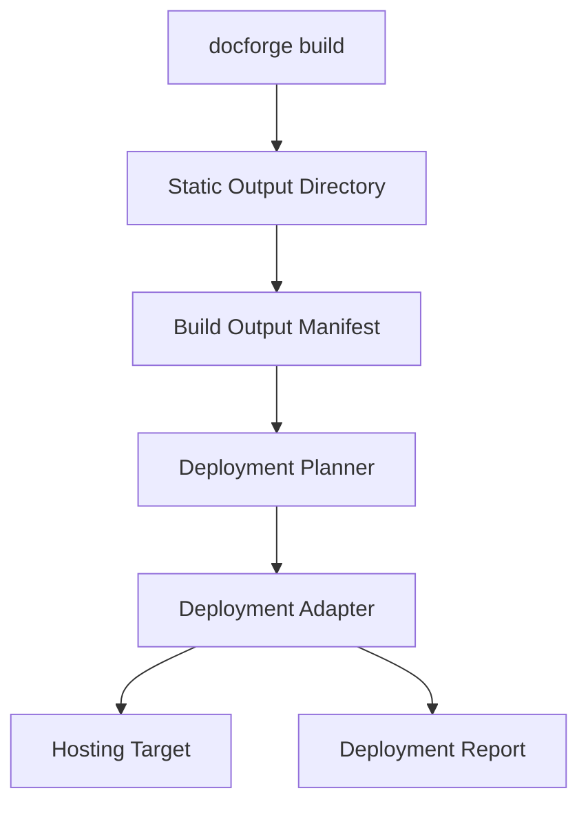
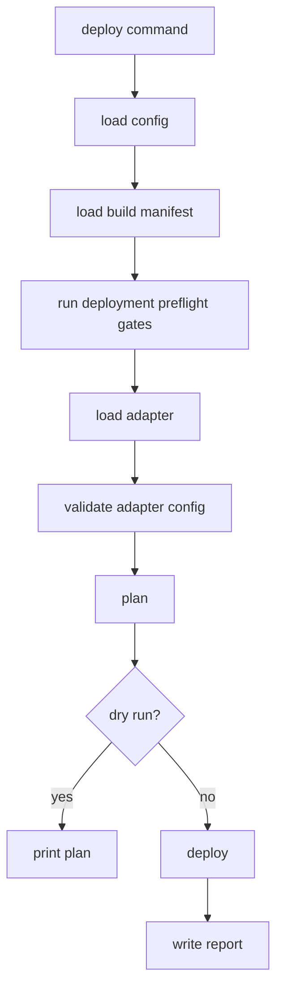
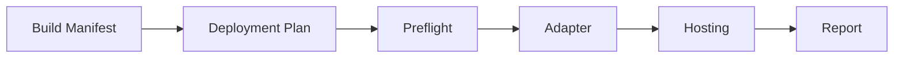

------
title: Build From Scratch: Mintlify-like AI-driven Documentation Generator CLI - Part 046
description: Mendesain deployment adapters dan hosting untuk documentation generator: static output contract, deployment manifest, GitHub Pages, object storage/CDN, Vercel/Netlify-like adapters, preview deployments, redirects, caching headers, atomic deploys, rollbacks, secrets, CI integration, and deployment quality gates.
series: learn-mintlify-like-ai-docs-cli
seriesTitle: Build From Scratch: Mintlify-like AI-driven Documentation Generator CLI
order: 46
partTitle: Deployment Adapters and Hosting
tags:
  - documentation
  - ai
  - cli
  - deployment
  - hosting
  - static-site
  - ci
  - developer-tools
date: 2026-07-04
---

# Part 046 — Deployment Adapters and Hosting

Documentation generator tidak selesai saat menghasilkan HTML.

Developer butuh dokumentasi yang:

- bisa dipublish,
- bisa dipreview di PR,
- punya redirects,
- punya cache headers,
- punya `sitemap.xml`,
- punya `robots.txt`,
- punya `llms.txt`,
- punya search assets,
- bisa rollback,
- bisa dipublish ke banyak hosting target,
- dan tidak mengikat core ke satu vendor.

Bagian ini mendesain:

> **deployment adapters and hosting**

Prinsip utama:

> Core build menghasilkan static output contract. Deployment adapter hanya memindahkan output itu ke hosting target dengan policy yang eksplisit.

---

## 1. Mental model: deployment is artifact publishing, not build logic



Deployment adapter tidak boleh:

- menjalankan ulang AI generation,
- memodifikasi docs source,
- mengubah Content IR,
- mengabaikan quality gates,
- memasukkan file selain build manifest,
- atau membaca secrets/source tanpa perlu.

Deployment adalah tahap setelah build valid.

---

## 2. Deployment goals

Deployment system harus:

1. support multiple hosting targets,
2. define static output contract,
3. preserve routes/redirects/headers,
4. support preview deployments,
5. support production deployments,
6. support dry-run plan,
7. upload only allowed files,
8. set cache headers correctly,
9. support atomic-ish deploy where platform allows,
10. produce deployment report,
11. integrate with CI/GitHub,
12. avoid leaking secrets,
13. support rollback metadata,
14. keep adapters optional/plugins.

---

## 3. Hosting target categories

| Category | Examples |
|---|---|
| Static file host | GitHub Pages, static server |
| Object storage + CDN | S3/CloudFront-like, GCS/CDN-like, Azure Blob/CDN-like |
| Jamstack platforms | Vercel-like, Netlify-like, Cloudflare Pages-like |
| Internal CDN | company deployment API |
| Container/static server | Nginx image serving built files |
| Docs platform API | hosted docs service |

Core should not know every platform. Use adapters.

---

## 4. Static output contract

Build output directory:

```txt
dist/
  index.html
  quickstart/index.html
  reference/configuration/index.html
  assets/app.<hash>.js
  assets/style.<hash>.css
  search/index.json
  llms.txt
  llms-full.txt
  sitemap.xml
  robots.txt
  404.html
  _redirects? / redirects.json?
  headers.json?
  build-manifest.json
```

Build manifest is source of truth for deployment.

---

## 5. Build output manifest

```ts
export type BuildOutputManifest = {
  schemaVersion: "build-output-manifest/v1";
  buildId: string;
  createdAt?: string;
  site: SiteMetadata;
  basePath: string;
  files: BuildOutputFile[];
  routes: BuiltRoute[];
  redirects: RedirectRule[];
  headers: HeaderRule[];
  diagnostics: Diagnostic[];
};

export type BuildOutputFile = {
  path: string;
  kind:
    | "html"
    | "asset"
    | "search"
    | "llms"
    | "sitemap"
    | "robots"
    | "redirects"
    | "headers"
    | "metadata";
  contentHash: string;
  sizeBytes: number;
  contentType: string;
  cachePolicy: CachePolicyId;
};
```

Deployment uses this manifest, not arbitrary directory traversal.

---

## 6. Deployment manifest

Deployment plan can create a target-specific manifest.

```ts
export type DeploymentManifest = {
  schemaVersion: "deployment-manifest/v1";
  deploymentId: string;
  adapterId: string;
  environment: "preview" | "staging" | "production";
  buildId: string;
  files: DeploymentFile[];
  redirects: RedirectRule[];
  headers: HeaderRule[];
  metadata: Record<string, unknown>;
};

export type DeploymentFile = {
  sourcePath: string;
  targetPath: string;
  contentHash: string;
  contentType: string;
  cacheControl?: string;
  sizeBytes: number;
};
```

---

## 7. Deployment adapter interface

```ts
export type DeploymentAdapter = {
  id: string;
  name: string;
  capabilities: DeploymentCapabilities;
  validateConfig(config: unknown): Promise<Diagnostic[]>;
  plan(input: DeploymentPlanInput): Promise<DeploymentPlan>;
  deploy(input: DeploymentInput): Promise<DeploymentResult>;
};

export type DeploymentCapabilities = {
  previewDeployments: boolean;
  atomicDeployments: boolean;
  redirects: "none" | "file" | "api";
  headers: "none" | "file" | "api";
  rollbacks: boolean;
  customDomains: boolean;
  invalidation: boolean;
};
```

Plan before deploy.

---

## 8. Deployment input/output

```ts
export type DeploymentPlanInput = {
  outputDir: string;
  buildManifest: BuildOutputManifest;
  environment: DeploymentEnvironment;
  config: unknown;
  security: SecurityContext;
};

export type DeploymentPlan = {
  adapterId: string;
  environment: DeploymentEnvironment;
  actions: DeploymentAction[];
  warnings: Diagnostic[];
  estimatedUploadBytes: number;
  filesToUpload: number;
  filesToDelete?: number;
};

export type DeploymentInput = DeploymentPlanInput & {
  plan: DeploymentPlan;
  dryRun: boolean;
};

export type DeploymentResult = {
  status: "success" | "failed" | "partial" | "skipped";
  url?: string;
  previewUrl?: string;
  deploymentId?: string;
  uploadedFiles: number;
  uploadedBytes: number;
  diagnostics: Diagnostic[];
  metadata: Record<string, unknown>;
};
```

---

## 9. Deployment actions

```ts
export type DeploymentAction =
  | { type: "uploadFile"; sourcePath: string; targetPath: string; contentHash: string }
  | { type: "deleteFile"; targetPath: string }
  | { type: "setHeaders"; rules: HeaderRule[] }
  | { type: "setRedirects"; rules: RedirectRule[] }
  | { type: "invalidateCache"; paths: string[] }
  | { type: "promote"; deploymentId: string }
  | { type: "rollback"; deploymentId: string };
```

Dry-run prints actions.

---

## 10. Deployment configuration

```json
{
  "deployment": {
    "adapter": "static",
    "environment": "production",
    "baseUrl": "https://docs.example.com",
    "preview": {
      "enabled": true
    }
  }
}
```

Adapter-specific config:

```json
{
  "deployment": {
    "adapter": "s3-cloudfront",
    "config": {
      "bucket": "docs-example-com",
      "prefix": "",
      "distributionId": "E1234567890",
      "region": "ap-southeast-1"
    }
  }
}
```

Do not store credentials in config. Use environment/CI secret store.

---

## 11. Deployment environments

```ts
export type DeploymentEnvironment = {
  name: "preview" | "staging" | "production" | string;
  baseUrl?: string;
  branch?: string;
  pullRequestNumber?: number;
  commitSha?: string;
};
```

Preview URL examples:

```txt
https://docs-pr-123.example.com
https://preview.example.com/pr-123/
```

Production URL:

```txt
https://docs.example.com
```

---

## 12. Base path and base URL

Base path affects routes/assets.

Example GitHub Pages project site:

```txt
https://org.github.io/repo/
basePath=/repo
```

Config:

```json
{
  "site": {
    "url": "https://org.github.io/repo",
    "basePath": "/repo"
  }
}
```

Build must know basePath before rendering links/assets.

Deployment adapter should verify consistency.

---

## 13. Cache policies

Different files need different cache headers.

| File kind | Cache policy |
|---|---|
| hashed JS/CSS/assets | long immutable |
| HTML pages | short/no-cache |
| search index | short or content-hashed |
| `llms.txt` | short/no-cache |
| sitemap/robots | short |
| redirects/headers | platform-specific |

Model:

```ts
export type CachePolicy = {
  id: string;
  cacheControl: string;
};
```

Defaults:

```ts
const cachePolicies = {
  immutableAsset: "public, max-age=31536000, immutable",
  html: "public, max-age=0, must-revalidate",
  metadata: "public, max-age=300",
};
```

---

## 14. Content types

Map by extension/kind.

```ts
export function contentTypeForFile(file: BuildOutputFile): string {
  if (file.path.endsWith(".html")) return "text/html; charset=utf-8";
  if (file.path.endsWith(".css")) return "text/css; charset=utf-8";
  if (file.path.endsWith(".js")) return "application/javascript; charset=utf-8";
  if (file.path.endsWith(".json")) return "application/json; charset=utf-8";
  if (file.path.endsWith(".txt")) return "text/plain; charset=utf-8";
  if (file.path.endsWith(".xml")) return "application/xml; charset=utf-8";
  return "application/octet-stream";
}
```

Deployment adapters should set correct content types where platform requires.

---

## 15. Redirects

Redirect model:

```ts
export type RedirectRule = {
  from: string;
  to: string;
  status: 301 | 302 | 307 | 308;
  conditions?: Record<string, string>;
};
```

Build validates:

- no loops,
- target exists if internal,
- no conflict with existing route,
- route/basePath correctness.

Adapter maps to platform.

---

## 16. Headers

Header model:

```ts
export type HeaderRule = {
  source: string;
  headers: Record<string, string>;
};
```

Use for:

- cache control,
- security headers,
- content type if needed,
- CORS for static assets maybe.

Security headers:

```json
{
  "source": "/*",
  "headers": {
    "X-Content-Type-Options": "nosniff",
    "Referrer-Policy": "strict-origin-when-cross-origin"
  }
}
```

CSP must match site behavior; do not generate too aggressive default without testing.

---

## 17. Static adapter

Simplest adapter: copy build output to another directory.

Config:

```json
{
  "deployment": {
    "adapter": "static",
    "config": {
      "targetDir": "public"
    }
  }
}
```

Plan:

- compare manifest with target dir,
- copy changed files,
- delete obsolete if configured.

Deploy:

```ts
export const staticDeploymentAdapter: DeploymentAdapter = {
  id: "static",
  name: "Static Directory",
  capabilities: {
    previewDeployments: false,
    atomicDeployments: true,
    redirects: "file",
    headers: "file",
    rollbacks: false,
    customDomains: false,
    invalidation: false,
  },
  async plan(input) { ... },
  async deploy(input) { ... },
};
```

---

## 18. Static adapter atomicity

For local directory:

1. write to temp dir,
2. validate manifest,
3. swap target symlink or rename,
4. cleanup old.

If target is normal directory on platforms where rename over non-empty fails, use manifest-based sync carefully.

For static adapter, dry-run is especially useful.

---

## 19. GitHub Pages adapter

Common approaches:

1. publish `dist` as artifact using GitHub Pages Actions,
2. push to `gh-pages` branch,
3. commit docs build output in repo.

Recommended modern CI pattern:

- build with DocForge,
- upload Pages artifact,
- deploy via GitHub Pages workflow.

DocForge adapter can produce correct output and optional workflow snippet, but actual deploy may be handled by GitHub Action.

Adapter capabilities:

```ts
{
  previewDeployments: false,
  atomicDeployments: true,
  redirects: "none" | "file-limited",
  headers: "none",
  rollbacks: platformDependent,
  customDomains: true,
  invalidation: false
}
```

GitHub Pages has platform-specific limitations; avoid pretending all redirect/header features exist.

---

## 20. GitHub Pages workflow example

```yaml
name: Deploy Docs

on:
  push:
    branches: [main]

permissions:
  contents: read
  pages: write
  id-token: write

jobs:
  build:
    runs-on: ubuntu-latest
    steps:
      - uses: actions/checkout@v4
      - uses: actions/setup-node@v4
        with:
          node-version: 20
          cache: pnpm
      - run: corepack enable
      - run: pnpm install --frozen-lockfile
      - run: pnpm docforge build --strict
      - uses: actions/upload-pages-artifact@v3
        with:
          path: dist

  deploy:
    needs: build
    runs-on: ubuntu-latest
    environment:
      name: github-pages
      url: ${{ steps.deployment.outputs.page_url }}
    steps:
      - id: deployment
        uses: actions/deploy-pages@v4
```

DocForge can generate this as template but should not hardcode user workflows.

---

## 21. Object storage + CDN adapter

S3-like/GCS-like/Azure-like adapters share pattern:

- upload files to bucket/container,
- set content type/cache-control,
- delete obsolete files,
- optionally invalidate CDN,
- optionally use prefix per environment.

Plan:

1. list remote manifest or remote objects,
2. compare content hash/etag/metadata,
3. upload changed,
4. delete obsolete if enabled,
5. invalidate paths.

---

## 22. Remote manifest for object storage

Store deployment manifest at:

```txt
.docforge/deployment-manifest.json
```

or public-safe:

```txt
__docforge/deployment-manifest.json
```

But public manifest may expose file list only; avoid secrets.

Remote manifest helps detect unchanged files without listing all remote objects.

```ts
export type RemoteDeploymentState = {
  deploymentId: string;
  buildId: string;
  files: Array<{
    targetPath: string;
    contentHash: string;
  }>;
};
```

---

## 23. Object storage sync plan

```ts
export function planObjectStorageSync(
  local: DeploymentManifest,
  remote?: RemoteDeploymentState
): DeploymentAction[] {
  const actions: DeploymentAction[] = [];
  const remoteByPath = new Map(remote?.files.map((f) => [f.targetPath, f]) ?? []);

  for (const file of local.files) {
    const existing = remoteByPath.get(file.targetPath);
    if (!existing || existing.contentHash !== file.contentHash) {
      actions.push({
        type: "uploadFile",
        sourcePath: file.sourcePath,
        targetPath: file.targetPath,
        contentHash: file.contentHash,
      });
    }
  }

  return actions;
}
```

---

## 24. Delete obsolete files safely

Deleting remote files is risky.

Config:

```json
{
  "deployment": {
    "deleteObsolete": true,
    "deleteProtection": ["custom/**", "uploads/**"]
  }
}
```

Only delete files known from previous DocForge deployment manifest.

Do not delete arbitrary bucket files by prefix unless user explicitly allows.

---

## 25. CDN invalidation

If assets are hashed, invalidate mostly HTML/search/llms/sitemap.

Paths:

```txt
/
/**/*.html
/search/*
/llms.txt
/llms-full.txt
/sitemap.xml
```

Avoid invalidating everything if expensive.

Adapter config:

```json
{
  "deployment": {
    "invalidation": {
      "enabled": true,
      "strategy": "changedHtmlAndMetadata"
    }
  }
}
```

---

## 26. Vercel-like adapter

Vercel-like platforms generally:

- accept project build output,
- provide preview deployments per PR/commit,
- handle atomic deploys,
- support redirects/headers via config file.

DocForge adapter can either:

1. emit platform config files,
2. or call platform deployment API/CLI.

Prefer not to shell out to platform CLI unless necessary. If using CLI, use execution manager and require permission.

---

## 27. Netlify-like adapter

Netlify-like pattern:

- output directory,
- `_redirects`,
- `_headers`,
- preview deploys,
- branch deploys.

DocForge can generate:

```txt
_redirects
_headers
```

from internal redirect/header rules.

But platform syntax differs. Adapter owns mapping.

---

## 28. Cloudflare Pages-like adapter

Similar:

- static output dir,
- project deploy through CI or CLI/API,
- preview deployments,
- redirects/headers conventions.

Adapter must validate capabilities and warn if feature unsupported.

---

## 29. Nginx/container adapter

Some teams deploy static docs as container.

Output:

```txt
Dockerfile
nginx.conf
```

or deployment package.

Adapter:

- copies `dist` into image context,
- generates Nginx config for SPA/404/headers,
- build image maybe outside core.

High risk if adapter builds/pushes images; requires execution/network permissions.

---

## 30. Deployment adapter should not own build

Bad:

```txt
adapter.deploy() runs docforge build internally with different config
```

Good:

```txt
docforge build --strict
docforge deploy --adapter s3
```

Deploy consumes known build output.

This makes deployment reproducible and auditable.

---

## 31. Deployment quality gates

Before deploy:

- build manifest valid,
- quality report pass,
- no secrets in output,
- no internal pages for public env,
- redirects valid,
- `llms` policy pass,
- search assets exist if enabled,
- content types known,
- output size within limits.

Deployment should fail if build not verified.

```txt
error deploy.quality.failed
Cannot deploy because quality report status is fail.
```

---

## 32. Deploy command

```bash
docforge deploy
```

Options:

```txt
--adapter <id>
--env preview|staging|production
--dry-run
--output-dir <dir>
--base-url <url>
--require-clean-build
--no-delete
--invalidate
--format human|json
```

Default should be dry-run? For deploy, maybe require explicit environment/config.

---

## 33. Deployment dry-run output

```txt
Deployment dry-run

Adapter: s3-cloudfront
Environment: production
Target: s3://docs-example-com/

Actions:
- upload 42 files (3.8 MB)
- delete 2 obsolete files
- set headers for 48 patterns
- invalidate 12 CDN paths

Warnings:
- External link gate has warnings but deployment policy allows warnings.

Run:
  docforge deploy --env production --apply
```

Use `--apply` or explicit deploy command? A deploy command itself is apply. But dry-run should be easy.

---

## 34. Deployment apply safety

For production:

- require clean build output,
- require quality pass,
- require environment config,
- require credentials available,
- require no uncommitted output if policy,
- maybe require confirmation if interactive.

Non-interactive CI uses explicit flags/config.

---

## 35. Credentials

Never put credentials in `docforge.config.json`.

Use:

- environment variables,
- CI secret store,
- cloud provider default auth,
- OIDC in CI,
- platform token env.

Adapter config references env names if needed:

```json
{
  "deployment": {
    "adapter": "internal-cdn",
    "config": {
      "tokenEnv": "INTERNAL_CDN_TOKEN"
    }
  }
}
```

If missing:

```txt
error deploy.credentials.missing
Required environment variable INTERNAL_CDN_TOKEN is not set.
```

Do not print token.

---

## 36. Deployment security context

Deployment requires permissions:

- read build output,
- network,
- deploy,
- maybe write deployment metadata.

In untrusted PR:

- no production deploy,
- no credentials,
- preview deploy only if trusted workflow and sanitized.

---

## 37. Preview deployments

Preview deploys are crucial for PR review.

Preview environment includes:

- PR number,
- commit SHA,
- branch,
- expiration maybe,
- base URL.

```ts
export type PreviewDeploymentContext = {
  pullRequestNumber: number;
  commitSha: string;
  branch: string;
  expiresAt?: string;
};
```

Preview URL should be reported to GitHub comment/check.

---

## 38. Preview deployment policy

Potential issues:

- preview includes internal/private pages,
- preview indexed by search engines,
- preview leaks future docs,
- preview uses production analytics.

Mitigations:

- `robots: noindex`,
- preview banner,
- no production analytics unless configured,
- restrict internal previews,
- expire previews.

---

## 39. Preview build metadata

Add preview metadata:

```json
{
  "preview": {
    "pullRequest": 123,
    "commitSha": "abc123",
    "createdAt": "..."
  }
}
```

Can render banner:

```txt
Preview deployment for PR #123
```

Configurable.

---

## 40. Robots and indexing

Production:

```txt
User-agent: *
Allow: /
Sitemap: https://docs.example.com/sitemap.xml
```

Preview:

```txt
User-agent: *
Disallow: /
```

Also add page meta `noindex` if preview.

---

## 41. Sitemap generation

Build stage should generate sitemap based on public routes.

```ts
export type SitemapEntry = {
  loc: string;
  lastmod?: string;
  changefreq?: string;
  priority?: number;
};
```

Deployment checks base URL.

If no site URL configured:

```txt
warning sitemap.siteUrl.missing
Cannot generate absolute sitemap URLs without site.url.
```

---

## 42. 404 handling

Static hosting differs:

- GitHub Pages uses `404.html`,
- Netlify supports redirects,
- object storage/CDN may need error document config,
- Vercel-like platforms handle config.

Build should output `404.html`. Adapter maps platform behavior.

---

## 43. Headers and security

Static hosts vary.

Common headers:

- `X-Content-Type-Options: nosniff`,
- `Referrer-Policy`,
- `Content-Security-Policy`,
- cache control.

CSP can break interactive features. Provide sensible configurable template.

```json
{
  "deployment": {
    "headers": {
      "security": "balanced"
    }
  }
}
```

---

## 44. Atomic deployments

Platforms with atomic deploy:

- upload immutable deployment,
- then promote pointer/alias.

Object storage is not truly atomic unless using versioned prefix and pointer.

Strategy for object storage:

```txt
releases/<buildId>/...
current -> releases/<buildId>
```

CDN/origin must support rewrite/prefix switching. Otherwise sync is non-atomic.

Be honest in adapter capabilities.

---

## 45. Versioned release deployment

For versioned docs:

```txt
/v1/
/v2/
/latest/
```

Deployment can:

- upload new version path,
- update `/latest` redirect/alias,
- keep old versions,
- update sitemap.

Config:

```json
{
  "versioning": {
    "enabled": true,
    "current": "v2",
    "aliases": { "latest": "v2" }
  }
}
```

---

## 46. Rollback

Rollback depends on platform.

Deployment record:

```ts
export type DeploymentRecord = {
  deploymentId: string;
  adapterId: string;
  environment: string;
  buildId: string;
  url?: string;
  createdAt: string;
  manifestHash: string;
  status: "success" | "failed";
};
```

Command:

```bash
docforge deploy rollback --deployment <id>
```

Only if adapter supports.

For object storage with versioned prefixes, rollback can promote previous prefix.

---

## 47. Deployment records store

Local:

```txt
.docforge/deployments/
  production.jsonl
  preview.jsonl
```

CI artifact:

```txt
.docforge/reports/deployment-report.json
```

Do not store credentials.

---

## 48. Deployment report

```ts
export type DeploymentReport = {
  schemaVersion: "deployment-report/v1";
  deploymentId: string;
  adapterId: string;
  environment: string;
  status: "success" | "failed" | "partial";
  url?: string;
  previewUrl?: string;
  buildId: string;
  uploadedFiles: number;
  uploadedBytes: number;
  durationMs: number;
  diagnostics: Diagnostic[];
};
```

Human output:

```txt
Deployment successful

URL: https://docs.example.com
Files uploaded: 42
Bytes uploaded: 3.8 MB
CDN invalidation: requested
```

---

## 49. Deployment in GitHub PR

PR workflow:

1. build docs,
2. quality gates,
3. deploy preview,
4. comment preview URL,
5. update check.

Comment:

```md
Docs preview: https://docs-pr-123.example.com

DocForge quality: passed
```

Part 036 GitHub adapter can render this.

---

## 50. Deployment and branch protection

Production deploy should require:

- main branch,
- quality check passed,
- release eval passed maybe,
- deployment environment approval if configured,
- credentials available only in protected environment.

Do not deploy production from arbitrary PR.

---

## 51. Deployment adapter as plugin

Deployment adapters fit plugin system.

Built-in adapters:

- static directory,
- GitHub Pages helper,
- generic object storage maybe.

External adapters:

- internal CDN,
- vendor-specific platform,
- enterprise docs portal.

Adapter plugins require high-risk permissions.

---

## 52. Adapter capability validation

If config asks for redirects but adapter doesn't support redirects:

```txt
warning deploy.redirects.unsupported
Adapter github-pages does not support configured redirect rules. Redirects will not be deployed.
```

If redirects are required:

```txt
error deploy.redirects.requiredUnsupported
Deployment requires redirects, but adapter does not support them.
```

---

## 53. Deployment policy

```ts
export type DeploymentPolicy = {
  requireQualityPass: boolean;
  allowWarnings: boolean;
  allowPreviewFromUntrustedPr: boolean;
  allowProductionFromBranch: string[];
  requireCleanBuildManifest: boolean;
  deleteObsolete: boolean;
  maxUploadBytes?: number;
};
```

Config:

```json
{
  "deployment": {
    "policy": {
      "requireQualityPass": true,
      "allowWarnings": true,
      "allowProductionFromBranch": ["main"],
      "maxUploadBytes": 524288000
    }
  }
}
```

---

## 54. Deployment privacy gates

Before public deploy:

- hidden/draft excluded,
- internal excluded,
- search excludes internal,
- llms excludes internal,
- provenance source paths hidden,
- no secret-like output,
- robots correct for environment.

Diagnostic:

```txt
error deploy.privacy.publicOutputFailed
Public deployment blocked because privacy gate failed.
```

---

## 55. Deployment size gates

Large deploys can be accidental.

```txt
warning deploy.size.large
Deployment will upload 1.2 GB, exceeding configured warning threshold.
```

Could happen if `.docforge` or videos accidentally included.

Use build manifest allowlist.

---

## 56. Deployment path safety

Target paths must be normalized.

```ts
export function normalizeDeploymentTargetPath(path: string): string {
  if (path.includes("..")) throw new Error("Invalid deployment path");
  if (path.startsWith("/")) return path.slice(1);
  return path;
}
```

Prevent path traversal in upload target.

---

## 57. MIME and compression

Some adapters can upload precompressed assets.

Files:

```txt
assets/app.js
assets/app.js.br
assets/app.js.gz
```

Need correct headers:

- `Content-Encoding: br`,
- `Content-Type: application/javascript`.

Precompression should be optional.

---

## 58. Immutable assets

Hashed assets:

```txt
assets/app.abc123.js
```

Can use immutable cache.

HTML references exact hash. On new build, new asset path. Old assets can remain safely for a while.

Delete obsolete assets with caution; users may have cached old HTML.

Policy:

```json
{
  "deployment": {
    "assetRetentionDays": 30
  }
}
```

---

## 59. Search index cache headers

If search index path content-hashed:

```txt
search/index.abc123.json
```

immutable cache okay.

If fixed path:

```txt
search/index.json
```

use short/no-cache.

Same for `llms.txt`: fixed path, short/no-cache.

---

## 60. Deployment observability

Metrics:

```ts
export type DeploymentMetrics = {
  planDurationMs: number;
  uploadDurationMs: number;
  uploadedFiles: number;
  skippedFiles: number;
  uploadedBytes: number;
  invalidatedPaths: number;
};
```

Profile output:

```txt
Deployment profile
plan: 1.2s
upload: 14.8s
invalidate: 2.1s
```

---

## 61. Resumable deploys

Large upload may fail halfway.

For object storage:

- compare remote state,
- rerun deploy resumes unchanged uploaded files,
- use content hash.

Avoid marking deployment success until manifest uploaded last.

---

## 62. Manifest upload ordering

Upload order:

1. assets,
2. HTML/pages,
3. search/llms/sitemap,
4. deployment manifest last,
5. invalidate/promote.

If manifest is uploaded first, remote state may claim success before files exist.

---

## 63. Partial failure handling

If deployment partially fails:

- report partial,
- do not update success record,
- suggest retry,
- do not invalidate/promote if critical files failed.

Diagnostic:

```txt
error deploy.partialFailure
Deployment uploaded 38/42 files. Manifest was not promoted.
```

---

## 64. Deployment locking

Prevent two deploys racing to same environment.

Options:

- CI concurrency group,
- remote lock file,
- platform deployment lock,
- local lock for static adapter.

GitHub Actions concurrency:

```yaml
concurrency:
  group: docs-production
  cancel-in-progress: false
```

DocForge can warn if lock not configured? Maybe via docs template.

---

## 65. Multi-project deployment

Monorepo may have multiple docs sites.

```json
{
  "projects": [
    { "id": "public-docs", "deployment": { "adapter": "pages" } },
    { "id": "internal-docs", "deployment": { "adapter": "internal-cdn" } }
  ]
}
```

Command:

```bash
docforge deploy --project public-docs
```

---

## 66. Deployment for versioned docs

Command:

```bash
docforge deploy --version v2.1 --alias latest
```

Plan:

- upload `/v2.1/`,
- update `/latest/` alias/redirect,
- update root redirect maybe,
- update sitemap.

Rollback can repoint alias.

---

## 67. Deployment for internal docs

Internal docs may need:

- auth at hosting layer,
- no public search engine,
- internal source path citations,
- internal MCP endpoint,
- private network.

DocForge can prepare output, but access control is hosting/platform concern.

Adapter should validate that internal deployment target is not public if configured.

---

## 68. Deployment and analytics

Analytics config differs by environment.

Production:

```json
{
  "analytics": { "enabled": true, "provider": "..." }
}
```

Preview:

```txt
analytics disabled by default
```

Prevent preview/test traffic polluting analytics.

---

## 69. Deployment and CSP

If analytics/search/playground need scripts/connect endpoints, CSP must include them.

CSP generation should be config-driven.

```json
{
  "securityHeaders": {
    "contentSecurityPolicy": {
      "scriptSrc": ["'self'"],
      "connectSrc": ["'self'", "https://api.example.com"]
    }
  }
}
```

Do not add broad `*` by default.

---

## 70. Deployment command architecture



---

## 71. Deployment preflight

```ts
export async function runDeploymentPreflight(input: DeploymentPlanInput): Promise<Diagnostic[]> {
  return [
    ...validateBuildManifest(input.buildManifest),
    ...validateQualityStatus(input),
    ...validatePrivacyForEnvironment(input),
    ...validateDeploymentCredentials(input),
    ...validateAdapterCapabilities(input),
  ];
}
```

If preflight errors, do not deploy.

---

## 72. Deployment adapter tests

Use fake target.

```ts
it("uploads changed files only", async () => {
  const adapter = createFakeObjectStorageAdapter({
    remoteManifest: previousManifest,
  });

  const plan = await adapter.plan(input);

  expect(plan.actions.filter((a) => a.type === "uploadFile")).toHaveLength(2);
});
```

---

## 73. Static adapter tests

Fixtures:

```txt
fixtures/deploy/static-basic/
  dist/
  expected-target/
```

Test:

- copy files,
- content types maybe manifest,
- no unexpected files,
- dry-run no writes,
- delete obsolete only if enabled.

---

## 74. Object storage adapter tests

Use fake in-memory object store.

Test:

- upload new,
- skip unchanged,
- set metadata headers,
- delete obsolete from previous manifest,
- do not delete protected paths,
- upload manifest last,
- partial failure report.

---

## 75. Deployment security tests

Fixtures:

- build output includes `.docforge/index.sqlite`,
- internal page in public build,
- secret in `llms.txt`,
- target path traversal,
- credentials missing,
- untrusted PR production deploy.

All should fail.

---

## 76. Deployment package layout

```txt
packages/deployment/
  src/
    adapter.ts
    config.ts
    manifest.ts
    plan.ts
    deploy.ts
    preflight.ts
    cache-policy.ts
    content-type.ts
    redirects.ts
    headers.ts
    reports.ts
    adapters/
      static.ts
      github-pages.ts
      object-storage.ts
    security/
      credentials.ts
      privacy.ts
      path-safety.ts
    __tests__/
      manifest.test.ts
      static-adapter.test.ts
      object-storage-plan.test.ts
      preflight.test.ts
```

Vendor-specific adapters can be plugins.

---

## 77. Deployment generated docs

DocForge should generate deployment guide pages:

- deploy static directory,
- GitHub Pages workflow,
- object storage/CDN pattern,
- preview deploys,
- cache headers,
- redirects,
- troubleshooting.

This is useful for users.

---

## 78. Deployment troubleshooting catalog

Examples:

### 404 after deploy

Possible causes:

- basePath mismatch,
- host does not support clean URLs,
- missing `404.html`,
- route not generated,
- CDN cache stale.

### CSS/JS not loading

Possible causes:

- wrong basePath,
- immutable asset not uploaded,
- content type wrong,
- CDN cached old HTML.

### `llms.txt` missing

Possible causes:

- llms disabled,
- output file excluded by adapter,
- fixed path overwritten,
- privacy gate failed.

---

## 79. Deployment diagnostics

| Code | Meaning |
|---|---|
| `deploy.manifest.missing` | build manifest missing |
| `deploy.quality.failed` | quality report failed |
| `deploy.credentials.missing` | required credentials missing |
| `deploy.adapter.unsupportedFeature` | adapter lacks required feature |
| `deploy.redirects.unsupported` | redirects cannot be deployed |
| `deploy.path.invalid` | unsafe target path |
| `deploy.output.unexpectedFile` | output contains file outside manifest |
| `deploy.privacy.failed` | privacy gate failed |
| `deploy.upload.failed` | upload failed |
| `deploy.partialFailure` | partial upload failure |
| `deploy.invalidation.failed` | CDN invalidation failed |

---

## 80. CI deployment patterns

### Preview on PR

```yaml
on: pull_request
jobs:
  preview:
    if: github.event.pull_request.head.repo.full_name == github.repository
    steps:
      - run: pnpm docforge build --strict --env preview
      - run: pnpm docforge deploy --env preview --adapter <adapter>
```

For forks, preview disabled unless safe.

### Production on main

```yaml
on:
  push:
    branches: [main]
jobs:
  deploy:
    environment: production
    steps:
      - run: pnpm docforge build --strict --env production
      - run: pnpm docforge eval run --suite release
      - run: pnpm docforge deploy --env production
```

---

## 81. Deployment and GitHub checks

Deployment result can update PR/check:

```txt
Docs preview deployed: https://docs-pr-123.example.com
```

Production deploy result:

```txt
Docs deployed: https://docs.example.com
Build ID: build_abc123
```

Use Part 036 GitHub adapter.

---

## 82. Deployment and rollbacks in CI

Manual rollback workflow:

```yaml
workflow_dispatch:
  inputs:
    deployment_id:
      required: true
```

Command:

```bash
docforge deploy rollback --deployment $DEPLOYMENT_ID
```

Adapter must support.

---

## 83. Deployment and release notes

Deployment report can include docs changelog summary:

- pages added,
- pages removed,
- redirects added,
- API operations changed,
- stale docs fixed.

This summary comes from build/update workflow.

---

## 84. Deployment cost awareness

Object storage/CDN invalidations and uploads may cost.

Plan should show:

- upload bytes,
- invalidation count,
- files deleted,
- large files.

This helps avoid surprises.

---

## 85. Deployment performance

Optimizations:

- upload changed files only,
- concurrent uploads with limit,
- skip unchanged via manifest/hash,
- compress assets before upload,
- avoid full CDN invalidation,
- store remote manifest.

Concurrency config:

```json
{
  "deployment": {
    "concurrency": 8
  }
}
```

---

## 86. Deployment upload order and concurrency

Concurrent upload okay for assets/pages, but manifest last.

```ts
await uploadFiles(concurrentFiles);
await uploadDeploymentManifest(manifest);
await invalidateCache(paths);
```

If HTML references assets, upload assets first.

---

## 87. Deployment and immutable assets retention

Do not immediately delete old hashed assets.

Users may have old HTML cached.

Retention policy:

```json
{
  "deployment": {
    "obsoleteAssetRetentionDays": 30
  }
}
```

Delete only after retention if remote state supports timestamps.

---

## 88. Deployment and redirects migration

When routes change, deployment must publish redirects.

If adapter doesn't support redirects:

- fail if route changes require redirects,
- or generate static redirect pages if feasible.

Static redirect page fallback:

```html
<meta http-equiv="refresh" content="0; url=/new-path/">
<link rel="canonical" href="/new-path/">
```

Not as good as HTTP redirect, but sometimes acceptable.

---

## 89. Deployment and search engine safety

Production:

- canonical URLs,
- sitemap,
- robots.

Preview:

- noindex,
- disallow robots,
- maybe auth.

Do not let PR previews be indexed.

---

## 90. Deployment and agent docs

Ensure root files:

```txt
/llms.txt
/llms-full.txt
/llms-manifest.json? maybe
```

If public manifest disabled, do not deploy it.

Adapter uses build manifest.

---

## 91. Deployment and MCP hosting

MCP server is not static hosting. But deployment may publish agent chunks that hosted MCP service consumes.

Pattern:

```txt
docforge build -> upload static docs + agent chunks -> hosted MCP reads chunks from deployment artifact store
```

Do not expose MCP server publicly without auth.

---

## 92. Adapter plugin permissions

Deployment adapter plugin manifest:

```json
{
  "permissions": ["deploy", "network"],
  "extensionPoints": ["deploymentAdapter"]
}
```

If adapter needs command execution, also `executeCommands`, but prefer API SDK over shelling out.

---

## 93. Adapter config schema

Each adapter validates config.

```ts
export type DeploymentAdapterExtension = {
  id: string;
  configSchema: JsonSchema;
  plan(...): Promise<DeploymentPlan>;
  deploy(...): Promise<DeploymentResult>;
};
```

Bad config should fail before upload.

---

## 94. Deployment local preview

Command:

```bash
docforge preview
```

or:

```bash
docforge serve dist
```

Serves build output locally with similar headers/redirect behavior if possible.

Useful before deploy.

---

## 95. Deployment smoke test

After deploy, optionally verify:

- base URL returns 200,
- quickstart returns 200,
- asset returns 200 with content type,
- `llms.txt` returns 200 if enabled,
- sitemap returns 200,
- redirect works.

Config:

```json
{
  "deployment": {
    "smokeTest": {
      "enabled": true,
      "paths": ["/", "/quickstart", "/llms.txt"]
    }
  }
}
```

Network policies apply.

---

## 96. Smoke test result

```ts
export type DeploymentSmokeTestResult = {
  path: string;
  status: "passed" | "failed" | "skipped";
  statusCode?: number;
  contentType?: string;
  diagnostics: Diagnostic[];
};
```

If smoke test fails after deployment:

- report failure,
- optionally rollback if supported and policy.

---

## 97. Deployment rollback policy

```json
{
  "deployment": {
    "rollback": {
      "onSmokeTestFailure": true,
      "onPartialFailure": false
    }
  }
}
```

Be careful: rollback can also fail. Report clearly.

---

## 98. Deployment state and audit

Audit record:

```ts
export type DeploymentAuditRecord = {
  deploymentId: string;
  adapterId: string;
  environment: string;
  actor?: string;
  commitSha?: string;
  buildId: string;
  status: string;
  url?: string;
  createdAt: string;
};
```

Do not store credentials.

---

## 99. Deployment failure UX

Bad:

```txt
Deploy failed.
```

Good:

```txt
Deployment failed during upload.

File:
  assets/app.abc123.js

Reason:
  Access denied by target bucket.

No deployment manifest was promoted.

Next:
  - Check credentials for DOCS_DEPLOY_ROLE
  - Run `docforge deploy --dry-run --verbose`
```

---

## 100. Minimal implementation milestone

First version:

1. build output manifest,
2. deployment adapter interface,
3. static directory adapter,
4. deployment preflight gates,
5. cache/content-type mapping,
6. redirects/headers model,
7. deploy dry-run,
8. deployment report JSON,
9. GitHub Pages workflow template docs,
10. basic smoke test.

Second version:

1. object storage generic adapter,
2. CDN invalidation,
3. preview deployment support,
4. deployment records/rollback,
5. adapter plugin API,
6. platform-specific redirect/header mapping,
7. immutable asset retention,
8. deployment GitHub comments/checks,
9. versioned docs deployment,
10. hosted MCP artifact integration.

---

## 101. Failure modes

| Failure | Cause | Prevention |
|---|---|---|
| Wrong files deployed | directory traversal/copy all | build manifest allowlist |
| Internal docs published | visibility gate missing | deployment privacy preflight |
| Secrets deployed | no output scan | secret gate before deploy |
| CSS/JS broken | wrong basePath/content type | basePath validation/smoke test |
| Old pages linger | obsolete files not handled | manifest-based delete policy |
| Users see broken deploy | non-atomic upload | manifest last/atomic platform/prefix release |
| Preview indexed | robots/noindex missing | preview policy |
| Redirects lost | adapter unsupported | capability validation |
| CDN stale | no invalidation/cache policy | targeted invalidation/cache headers |
| Credentials leak | stored in config/logs | env secrets/redaction |

---

## 102. Key takeaways

Deployment adapters publish validated static artifacts through explicit platform contracts.



Strong deployment design:

1. separates build from deploy,
2. deploys from manifest, not arbitrary files,
3. validates quality/privacy before upload,
4. maps redirects/headers per platform,
5. uses cache policies intentionally,
6. supports dry-run and reports,
7. protects credentials,
8. supports preview/production environments,
9. plans for rollback/smoke tests,
10. and keeps vendor-specific logic in adapters/plugins.

Next, we build **observability, telemetry, and product analytics**.
