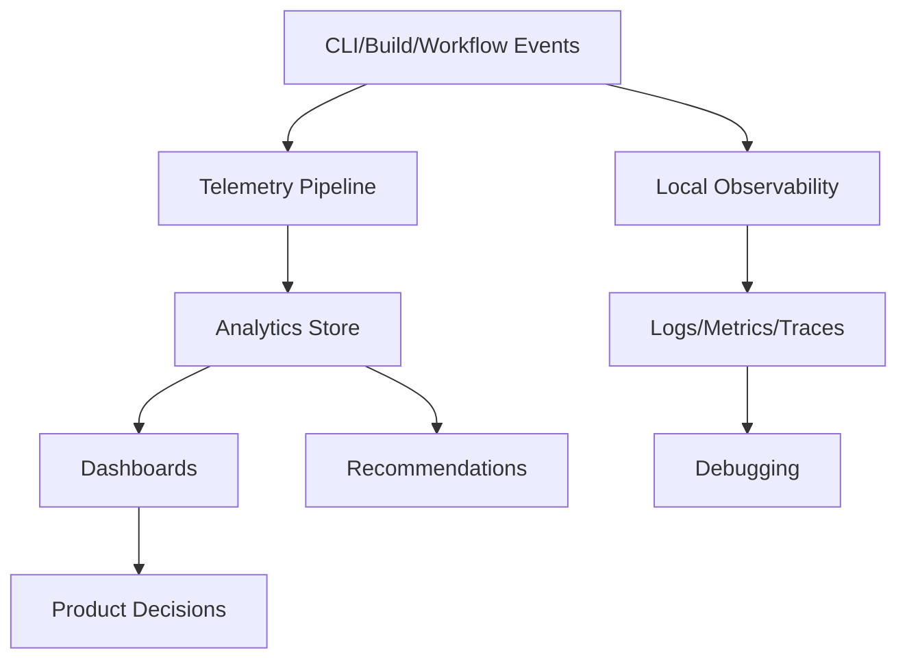
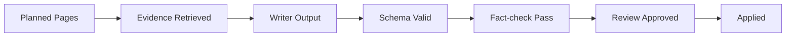
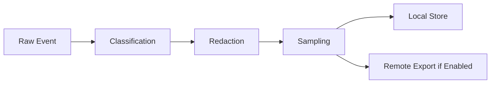
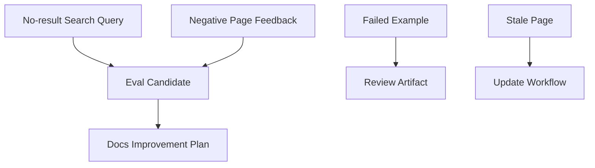
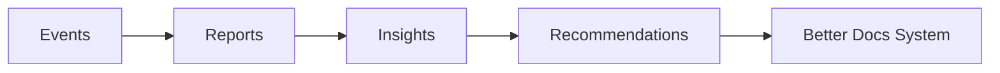

------
title: Build From Scratch: Mintlify-like AI-driven Documentation Generator CLI - Part 047
description: Mendesain observability, telemetry, dan product analytics untuk AI-driven documentation generator: logs, metrics, traces, events, privacy, quality dashboards, AI cost tracking, workflow analytics, search telemetry, adoption metrics, feedback loops, and operational health.
series: learn-mintlify-like-ai-docs-cli
seriesTitle: Build From Scratch: Mintlify-like AI-driven Documentation Generator CLI
order: 47
partTitle: Observability, Telemetry, and Product Analytics
tags:
  - documentation
  - ai
  - cli
  - observability
  - telemetry
  - analytics
  - developer-tools
date: 2026-07-04
---

# Part 047 — Observability, Telemetry, and Product Analytics

Kita sudah membangun hampir seluruh technical surface:

- compiler pipeline,
- scanner/indexer,
- MDX compiler,
- OpenAPI generator,
- AI writer/reviewer,
- provenance,
- self-updating workflow,
- GitHub automation,
- quality gates,
- sandboxing,
- performance engineering,
- plugin API,
- deployment adapters.

Sekarang kita perlu membuat sistem ini **operable**.

Production-grade developer tool harus bisa menjawab:

- apa yang sedang terjadi?
- kenapa build lambat?
- kenapa page menjadi stale?
- berapa banyak AI call digunakan?
- berapa biaya AI generation?
- apakah generated docs sering gagal review?
- search query apa yang gagal menemukan hasil?
- example verification apa yang paling sering gagal?
- apakah fitur self-updating dipakai?
- deployment mana yang gagal?
- plugin mana yang memperlambat build?
- apakah kualitas docs naik atau turun dari minggu ke minggu?

Itulah fungsi **observability, telemetry, dan product analytics**.

---

## 1. Mental model: observability vs telemetry vs analytics

Istilah ini sering tercampur. Untuk DocForge-like CLI, kita bedakan:

| Area | Purpose | Audience |
|---|---|---|
| Observability | Debug system behavior | maintainers/operators |
| Telemetry | Collect usage/health signals | product/maintainers |
| Product analytics | Understand adoption and value | product/team leads |
| Quality analytics | Track docs quality trends | docs/platform teams |
| AI analytics | Track model quality/cost/risk | AI/platform teams |

Diagram:



Observability is about **debugging**.  
Analytics is about **learning**.

---

## 2. Privacy-first principle

This tool can see repository code, docs, API specs, prompts, evidence, traces, local paths, and generated content.

Therefore telemetry must be **privacy-first**.

Default:

```txt
telemetry off or local-only unless user opts in
```

If telemetry exists, it should collect:

- counts,
- timings,
- feature usage,
- anonymized errors,
- aggregate quality metrics,
- cache hit rates,
- non-sensitive environment metadata.

It should not collect by default:

- source code,
- prompts,
- model outputs,
- file contents,
- full paths,
- secrets,
- private URLs,
- user queries with sensitive text,
- organization-specific identifiers.

---

## 3. Telemetry config

```json
{
  "telemetry": {
    "enabled": false,
    "mode": "local",
    "anonymousId": true,
    "collect": {
      "usage": true,
      "performance": true,
      "quality": true,
      "errors": true,
      "aiCost": true,
      "searchQueries": false,
      "pageFeedback": false
    },
    "privacy": {
      "sendFilePaths": false,
      "sendSourceContent": false,
      "sendPrompts": false,
      "sendModelOutputs": false,
      "redactSecrets": true
    }
  }
}
```

Modes:

| Mode | Meaning |
|---|---|
| `off` | no telemetry |
| `local` | store local metrics/reports only |
| `anonymous` | send anonymous aggregate events |
| `workspace` | team-owned telemetry endpoint |
| `enterprise` | customer-managed observability/export |

---

## 4. Signal taxonomy

```ts
export type ObservabilitySignal =
  | LogRecord
  | MetricPoint
  | TraceSpan
  | ProductEvent
  | QualityEvent
  | AiEvent
  | WorkflowEvent
  | SecurityEvent;
```

Categories:

| Category | Examples |
|---|---|
| Logs | diagnostics, warnings, errors |
| Metrics | build duration, cache hit rate |
| Traces | per-stage spans |
| Product events | command used, feature enabled |
| Quality events | broken link count, stale pages |
| AI events | model call, token estimate, validation fail |
| Workflow events | update applied, review required |
| Security events | secret blocked, unsafe command blocked |

---

## 5. Logs

Logs answer:

> What happened?

Structured log model:

```ts
export type LogRecord = {
  timestamp: string;
  level: "debug" | "info" | "warn" | "error";
  message: string;
  code?: string;
  command?: string;
  runId?: string;
  projectId?: string;
  fields?: Record<string, unknown>;
};
```

Rules:

- logs are structured internally,
- terminal renderer formats them,
- JSON/NDJSON reporters can stream them,
- sensitive values are redacted,
- verbose/debug mode explicit,
- do not log full prompts by default.

---

## 6. Metrics

Metrics answer:

> How much, how often, how long?

```ts
export type MetricPoint = {
  name: string;
  value: number;
  unit: "count" | "ms" | "bytes" | "ratio" | "usd";
  timestamp: string;
  tags?: Record<string, string>;
};
```

Examples:

```txt
docforge.build.duration_ms
docforge.scan.files_count
docforge.cache.hit_ratio
docforge.mdx.compile.errors
docforge.ai.calls
docforge.ai.estimated_cost_usd
docforge.quality.broken_links
docforge.workflow.review_required
docforge.examples.pass_ratio
```

---

## 7. Traces

Traces answer:

> Where did time go?

```ts
export type TraceSpan = {
  traceId: string;
  spanId: string;
  parentSpanId?: string;
  name: string;
  category: WorkCategory;
  startTime: string;
  endTime?: string;
  durationMs?: number;
  status: "ok" | "error" | "cancelled";
  attributes?: Record<string, string | number | boolean>;
};
```

Example trace:

```txt
build
  scan.filesystem 1.2s
  index.openapi 0.8s
  mdx.compile 3.4s
  render.static 2.1s
  search.index 1.7s
  llms.export 0.4s
```

Traces help identify bottlenecks and plugin slowdowns.

---

## 8. Product events

Product events answer:

> Which features are used?

```ts
export type ProductEvent = {
  type: string;
  timestamp: string;
  anonymousUserId?: string;
  projectFingerprint?: string;
  properties: Record<string, unknown>;
};
```

Examples:

```txt
command.invoked
project.initialized
build.completed
update.dry_run.completed
update.apply.completed
mcp.started
llms.generated
plugin.enabled
```

Keep properties non-sensitive.

---

## 9. Project fingerprint

Avoid sending repo name/path by default.

Local-only:

```ts
projectId = config.projectId
```

Anonymous telemetry:

```ts
projectFingerprint = sha256(normalizedProjectRootSalted)
```

Better:

- random local UUID stored in `.docforge/telemetry.json`,
- no path/hash of path sent,
- user can reset.

```ts
export type TelemetryIdentity = {
  anonymousInstallationId: string;
  createdAt: string;
};
```

---

## 10. Command analytics

Track command usage locally:

```ts
export type CommandUsageEvent = {
  command: string;
  flags: string[];
  durationMs: number;
  exitCode: number;
  mode?: "dev" | "ci" | "local";
};
```

Do not include raw argument values if they may contain paths/secrets.

Safe:

```json
{
  "command": "build",
  "flags": ["--strict", "--profile"],
  "durationMs": 18400,
  "exitCode": 0
}
```

Potentially unsafe:

```json
{
  "out": "/Users/alice/private-client/docs-dist"
}
```

Redact or omit.

---

## 11. Build observability

Build report:

```ts
export type BuildObservabilityReport = {
  runId: string;
  command: "build";
  status: "success" | "warning" | "failed";
  durationMs: number;
  pages: number;
  virtualPages: number;
  diagnostics: DiagnosticSummary;
  cache: CacheSummary;
  performance: PerformanceReport;
  output: BuildOutputSummary;
};
```

Summary output:

```txt
Build completed with warnings

Pages: 482
Virtual API pages: 311
Duration: 18.4s
Cache hit rate: 81%
Warnings: 7
Output: dist/
```

---

## 12. Diagnostics analytics

Diagnostics should be countable.

```ts
export type DiagnosticSummary = {
  total: number;
  bySeverity: Record<DiagnosticSeverity, number>;
  byCode: Record<string, number>;
  topFiles?: Array<{ pathHash: string; count: number }>;
};
```

Useful questions:

- most common error code?
- which diagnostics block adoption?
- which quality gate produces the most warnings?
- are users failing mostly on config or MDX?

Do not send raw file paths by default.

---

## 13. Quality analytics

Quality metrics from Parts 037-039:

```ts
export type QualityAnalyticsSnapshot = {
  timestamp: string;
  pages: number;
  brokenInternalLinks: number;
  brokenExternalLinks: number;
  stalePublicPages: number;
  unsupportedGeneratedClaims: number;
  verifiedExamples: number;
  failedExamples: number;
  apiCoverageRatio: number;
  cliCoverageRatio: number;
  configCoverageRatio: number;
  searchMrr?: number;
  searchRecallAt5?: number;
};
```

Trend output:

```txt
Quality trend, last 7 runs:

Broken internal links:  4 -> 0
Stale public pages:     8 -> 1
Verified examples:      82% -> 94%
Search MRR:             0.76 -> 0.83
```

---

## 14. AI observability

AI-specific signals:

```ts
export type AiCallEvent = {
  jobId: string;
  role: "planner" | "writer" | "reviewer" | "repair" | "summarizer";
  provider: string;
  model: string;
  promptContractVersion: string;
  inputTokenEstimate?: number;
  outputTokenEstimate?: number;
  estimatedCostUsd?: number;
  durationMs: number;
  status: "success" | "schema_error" | "review_failed" | "provider_error";
  retries: number;
};
```

Do not store prompt/model output unless explicit.

---

## 15. AI quality funnel

AI generation should be observable as funnel:



Metrics:

```ts
export type AiGenerationFunnel = {
  plannedPages: number;
  evidencePacksCreated: number;
  writerCalls: number;
  schemaValidOutputs: number;
  repairedOutputs: number;
  factCheckPasses: number;
  reviewApprovals: number;
  appliedPages: number;
};
```

If many outputs fail schema, prompt/schema mismatch.

If many fail fact-check, retrieval/writer is weak.

If many require repair, model/prompt/constraints need tuning.

---

## 16. AI cost budgets and reports

```ts
export type AiCostReport = {
  runId: string;
  calls: number;
  inputTokens: number;
  outputTokens: number;
  estimatedCostUsd: number;
  byRole: Record<string, {
    calls: number;
    estimatedCostUsd: number;
  }>;
};
```

CLI:

```bash
docforge generate --cost-report
```

Output:

```txt
AI cost estimate

Planner:   4 calls   $0.03
Writer:   12 calls   $0.42
Reviewer: 12 calls   $0.18
Repair:    2 calls   $0.04
Total:    30 calls   $0.67
```

---

## 17. Workflow analytics

From Part 035:

```ts
export type WorkflowAnalyticsEvent = {
  mode: WorkflowMode;
  trigger: WorkflowTrigger["type"];
  changedFiles: number;
  semanticChanges: number;
  affectedPages: number;
  patchesGenerated: number;
  patchesApplied: number;
  reviewRequired: number;
  conflicts: number;
  durationMs: number;
};
```

Questions:

- how often does self-updating apply automatically?
- how many review-required items remain open?
- what causes conflicts?
- do docs drift before release?
- how big are patches?

---

## 18. Review debt analytics

```ts
export type ReviewDebtMetric = {
  openReviewArtifacts: number;
  highRiskItems: number;
  oldestAgeDays: number;
  byReason: Record<string, number>;
};
```

CLI:

```bash
docforge workflow status
```

Output:

```txt
Review debt:
  open artifacts: 6
  high risk: 2
  oldest: 9 days

Top reasons:
  manual page stale: 3
  human-edited generated block: 2
  unsupported AI claim: 1
```

---

## 19. Search telemetry

Search telemetry is sensitive because queries may contain private data.

Default: local-only or off.

If enabled:

```ts
export type SearchTelemetryEvent = {
  queryHash?: string;
  normalizedQuery?: string;
  resultCount: number;
  clickedRoute?: RoutePath;
  clickedRank?: number;
  noResult: boolean;
  timestamp: string;
};
```

Privacy options:

- hash query,
- store query locally only,
- redact secrets,
- aggregate no-result terms manually,
- sampling.

---

## 20. Search analytics use cases

Useful insights:

- top no-result queries,
- high-query pages missing aliases,
- search result rank too low,
- query-to-click mismatch,
- users searching for unsupported features.

Example report:

```txt
Search insights

No-result queries:
- "deploy cloudflare" 12 times
- "output folder" 9 times
- "mcp config" 7 times

Recommendations:
- Add alias "output folder" to build.outputDir.
- Create deployment guide for Cloudflare.
```

---

## 21. Page feedback telemetry

Optional user feedback:

```ts
export type PageFeedbackEvent = {
  route: RoutePath;
  rating: "positive" | "negative";
  reason?: "outdated" | "unclear" | "missing" | "wrong" | "other";
  comment?: string;
};
```

Privacy:

- comments may contain sensitive data,
- store locally/team-owned by default,
- redact secrets,
- do not send to external AI judge without explicit consent.

---

## 22. Code-copy analytics

Useful but privacy-sensitive.

Track event, not code content:

```ts
export type CodeCopyEvent = {
  route: RoutePath;
  blockId: string;
  language: string;
  kind: CodeExampleKind;
  verified: boolean;
};
```

Insight:

- which examples are copied most,
- unverified copied examples should be prioritized,
- copied examples with failed verification are urgent.

---

## 23. MCP analytics

MCP server signals:

```ts
export type McpAnalyticsEvent = {
  tool: string;
  durationMs: number;
  status: "ok" | "error" | "denied";
  resultCount?: number;
  responseChars?: number;
  truncated?: boolean;
};
```

Do not store raw queries by default.

Use cases:

- which tools agents use,
- search result quality,
- truncation rate,
- denied internal access attempts,
- stale docs queries.

---

## 24. Security analytics

Security events:

```ts
export type SecurityEvent = {
  type:
    | "secret_detected"
    | "unsafe_command_blocked"
    | "remote_ref_blocked"
    | "private_output_blocked"
    | "mcp_request_denied"
    | "plugin_denied";
  severity: "info" | "warning" | "error";
  timestamp: string;
  code: string;
  redacted: boolean;
};
```

Security report:

```txt
Security summary

Secrets blocked: 2
Unsafe examples blocked: 3
Remote refs blocked: 1
Private pages excluded from public build: 4
MCP denied requests: 0
```

---

## 25. Plugin observability

Plugins must be observable.

```ts
export type PluginTelemetryEvent = {
  pluginId: string;
  hook: string;
  durationMs: number;
  status: "success" | "failed" | "denied";
  diagnostics: number;
};
```

Plugin performance report:

```txt
Plugin timings:
- @docforge/plugin-spring: 2.4s
- @acme/plugin-internal-api: 8.7s warning
```

If plugin slow/failing, users need to know.

---

## 26. Deployment analytics

Deployment adapter metrics:

```ts
export type DeploymentAnalyticsEvent = {
  adapter: string;
  target: "preview" | "production";
  filesUploaded: number;
  bytesUploaded: number;
  cacheHits?: number;
  durationMs: number;
  status: "success" | "failed";
};
```

Questions:

- are deployments slow?
- are previews failing?
- is CDN cache policy effective?
- are too many files uploaded?

---

## 27. Local observability store

Store local reports:

```txt
.docforge/reports/
  build-report.json
  quality-report.json
  performance-report.json
  ai-cost-report.json
  workflow-report.json
  security-report.json
```

Store history in SQLite:

```sql
CREATE TABLE telemetry_events (
  id TEXT PRIMARY KEY,
  type TEXT NOT NULL,
  timestamp TEXT NOT NULL,
  payload_json TEXT NOT NULL
);

CREATE INDEX idx_telemetry_events_type_time ON telemetry_events(type, timestamp);
```

Retention policy:

```json
{
  "telemetry": {
    "localRetentionDays": 30
  }
}
```

---

## 28. Event redaction pipeline



Implementation:

```ts
export function prepareTelemetryEvent(
  event: ProductEvent,
  policy: TelemetryPrivacyPolicy
): ProductEvent | undefined {
  if (!policy.enabled) return undefined;

  const redacted = redactEvent(event, policy);
  const sampled = applySampling(redacted, policy);

  return sampled;
}
```

---

## 29. Redaction rules

Redact:

- secrets,
- absolute paths,
- repo names if disabled,
- URLs if disabled,
- prompt text,
- source snippets,
- user queries if disabled,
- comments/feedback if disabled.

```ts
export function redactPath(path: string): string {
  return `<path:${sha256(path).slice(0, 8)}>`;
}
```

For local reports, paths can be preserved. For remote telemetry, redact.

---

## 30. Sampling

Telemetry sampling reduces volume.

```ts
export type SamplingPolicy = {
  defaultRate: number;
  byEventType?: Record<string, number>;
};
```

Always keep critical local events. Remote anonymous telemetry can sample.

Errors may use higher rate, but still redacted.

---

## 31. Export adapters

Telemetry should be pluggable.

```ts
export type TelemetryExporter = {
  name: string;
  export(events: ProductEvent[]): Promise<void>;
  flush(): Promise<void>;
};
```

Built-ins:

- local JSONL,
- local SQLite,
- stdout NDJSON,
- custom HTTP endpoint,
- enterprise observability adapter,
- no-op.

Do not hardcode one vendor in core.

---

## 32. NDJSON telemetry stream

For CI/automation:

```bash
docforge build --events ndjson
```

Output:

```json
{"type":"command.started","command":"build"}
{"type":"build.stage.finished","stage":"mdx.compile","durationMs":3200}
{"type":"quality.finished","errors":0,"warnings":4}
{"type":"command.finished","exitCode":0,"durationMs":18400}
```

This is useful for wrappers and dashboards.

---

## 33. Health dashboard

Local command:

```bash
docforge analytics report
```

Output:

```txt
DocForge analytics, last 30 days

Commands:
  build: 182
  dev: 94
  update: 38
  check: 121

Quality:
  average broken links: 0.4
  stale public pages: 0 current
  example pass rate: 96%

Performance:
  median warm build: 8.2s
  p95 warm build: 21.4s

AI:
  calls: 412
  estimated cost: $9.82
  review rejection rate: 8%
```

---

## 34. Product funnel

Adoption funnel:

```txt
init -> first dev -> first build -> search enabled -> openapi enabled -> update workflow -> GitHub integration -> llms/MCP enabled
```

Model:

```ts
export type ProductFunnelStage =
  | "projectInitialized"
  | "firstDevStarted"
  | "firstBuildSucceeded"
  | "searchEnabled"
  | "openApiConfigured"
  | "qualityGateConfigured"
  | "updateWorkflowUsed"
  | "githubIntegrationUsed"
  | "llmsGenerated"
  | "mcpStarted";
```

This helps product decisions without reading user content.

---

## 35. Feature adoption analytics

Track config features:

```ts
export type FeatureAdoptionSnapshot = {
  searchEnabled: boolean;
  openApiSpecsCount: number;
  aiEnabled: boolean;
  githubEnabled: boolean;
  llmsEnabled: boolean;
  mcpEnabled: boolean;
  pluginsCount: number;
  deploymentAdapter?: string;
};
```

Remote telemetry should not include spec names or plugin config if sensitive; plugin package names can also be sensitive, so make configurable.

---

## 36. Operational SLOs

For an internal docs platform, define SLO-like goals:

| Area | Example objective |
|---|---|
| Build reliability | 99% successful scheduled docs builds |
| Preview latency | p95 preview build < 5 min |
| Stale public docs | 0 stale pages on release branch |
| Search | MRR > 0.8 for curated eval suite |
| Examples | > 95% verified pass rate |
| AI generation | < 10% review rejection rate |
| Deployment | p95 deployment < 2 min |

These are not hardcoded; they are team-level goals.

---

## 37. Alerting

For team/enterprise mode:

Alerts:

- release docs build failed,
- stale public docs > 0,
- secret detected in build output,
- deployment failed,
- search MRR regression,
- AI cost budget exceeded,
- example pass rate below threshold.

Alert model:

```ts
export type AlertRule = {
  id: string;
  metric: string;
  condition: "above" | "below" | "equals";
  threshold: number;
  severity: "warning" | "critical";
};
```

---

## 38. Telemetry in CI

CI reports should be artifacts.

```txt
.docforge/reports/
  ci-summary.md
  ci-docs-report.json
  performance-report.json
  quality-report.json
```

GitHub PR comment can include summary only.

Do not upload raw evidence/prompts unless configured.

---

## 39. Telemetry in dev server

Dev server can expose internal dashboard:

```txt
/__docforge/health
/__docforge/metrics
/__docforge/quality
/__docforge/performance
```

Local only.

Dashboard sections:

- current route diagnostics,
- hot reload timings,
- cache hit rate,
- stale pages,
- search index status,
- last build status.

---

## 40. Product analytics for docs site readers

If hosted docs include reader analytics, keep separate from CLI telemetry.

Reader events:

- page view,
- search,
- link click,
- code copy,
- feedback.

This should be opt-in and privacy documented.

Docs generator can provide event hooks, not force analytics vendor.

```ts
export type DocsSiteAnalyticsAdapter = {
  renderScript(config: unknown): string;
  trackEvent(event: DocumentationTelemetryEvent): void;
};
```

---

## 41. Analytics adapter privacy

If rendering analytics script:

- honor Do Not Track if configured,
- no code sample content in events,
- no secret/query collection unless enabled,
- anonymize IP if provider supports,
- cookie-less mode if possible,
- clear docs disclosure.

This is product/legal sensitive.

---

## 42. Feedback-to-workflow loop

Telemetry should produce actions.



Examples:

- no-result query -> add alias or page,
- copied unverified example -> prioritize verification,
- negative feedback on guide -> create review task,
- stale page repeatedly -> improve provenance/update automation.

---

## 43. Recommendation engine

```ts
export type AnalyticsRecommendation = {
  id: string;
  category: "search" | "quality" | "performance" | "ai" | "workflow" | "content";
  severity: "info" | "warning" | "critical";
  message: string;
  evidence: string[];
  suggestedCommand?: string;
};
```

Example:

```json
{
  "category": "search",
  "severity": "warning",
  "message": "Users search for 'output folder' but the expected config field is indexed as 'build.outputDir'.",
  "suggestedCommand": "docforge eval add-search-case"
}
```

---

## 44. Telemetry schema versioning

Events are public-ish contracts.

```ts
export type TelemetryEnvelope = {
  schemaVersion: "telemetry-event/v1";
  eventType: string;
  eventVersion: string;
  timestamp: string;
  payload: unknown;
};
```

Version event types independently.

Do not break downstream analytics silently.

---

## 45. Telemetry test strategy

Tests:

- no telemetry when disabled,
- redaction removes paths/secrets,
- prompt/model outputs not exported by default,
- local reports written,
- NDJSON events valid,
- sampling deterministic in tests,
- metrics aggregate correctly.

Fixture:

```txt
fixtures/telemetry/
  disabled/
  redacts-secrets/
  build-events/
  ai-cost-report/
  search-local-only/
```

---

## 46. Test: telemetry disabled

```ts
it("emits no remote events when telemetry disabled", async () => {
  const exporter = new FakeTelemetryExporter();

  await runCommand("build", {
    telemetry: { enabled: false },
    exporter,
  });

  expect(exporter.events).toHaveLength(0);
});
```

---

## 47. Test: secret redaction

```ts
it("redacts secret-like values before export", () => {
  const event = createDiagnosticEvent({
    message: "token sk_live_1234567890abcdef",
  });

  const prepared = prepareTelemetryEvent(event, privacyPolicy());

  expect(JSON.stringify(prepared)).not.toContain("sk_live_");
});
```

---

## 48. Test: path redaction

```ts
it("redacts absolute paths for remote telemetry", () => {
  const event = createBuildEvent({
    outputPath: "/Users/alice/acme/private-docs/dist",
  });

  const prepared = prepareTelemetryEvent(event, remotePrivacyPolicy());

  expect(JSON.stringify(prepared)).not.toContain("/Users/alice");
});
```

---

## 49. Analytics package layout

```txt
packages/observability/
  src/
    logs.ts
    metrics.ts
    traces.ts
    events.ts
    reporter.ts
    redaction.ts
    privacy.ts
    exporters/
      noop.ts
      local-jsonl.ts
      sqlite.ts
      ndjson.ts
      http.ts
    reports/
      build.ts
      quality.ts
      ai-cost.ts
      workflow.ts
      security.ts
      analytics.ts
    recommendations/
      search.ts
      performance.ts
      quality.ts
      ai.ts
    __tests__/
      redaction.test.ts
      telemetry-disabled.test.ts
      metrics.test.ts
      reports.test.ts
```

---

## 50. Integration points

Every major package should emit structured events, not print directly.

```ts
export type ObservabilityContext = {
  logger: Logger;
  metrics: MetricsSink;
  tracer: Tracer;
  events: EventSink;
};
```

Pass context through:

- scanner,
- parser,
- MDX compiler,
- OpenAPI ingestion,
- AI pipeline,
- workflow,
- deployment,
- MCP,
- plugins.

---

## 51. Plugin observability API

Plugins receive scoped observability.

```ts
export type PluginObservability = {
  log(level: LogRecord["level"], message: string, fields?: Record<string, unknown>): void;
  metric(name: string, value: number, tags?: Record<string, string>): void;
  span<T>(name: string, fn: () => Promise<T>): Promise<T>;
};
```

Plugin events should be tagged by plugin ID.

---

## 52. Observability and performance overhead

Telemetry itself must be cheap.

Rules:

- no blocking network in hot path,
- buffer events,
- flush at command end,
- cap event size,
- sampling,
- local writes batched,
- disable debug spans unless profile mode.

If telemetry export fails, do not fail build unless enterprise policy requires.

---

## 53. Flush behavior

```ts
export async function shutdownObservability(ctx: ObservabilityContext): Promise<void> {
  await Promise.race([
    ctx.events.flush(),
    timeout(2000),
  ]);
}
```

Do not hang CLI for telemetry.

---

## 54. Failure policy

Telemetry failure should usually be warning at most.

```txt
warning telemetry.export.failed
Telemetry export failed. Build result is unaffected.
```

Exception:

- enterprise compliance mode may require local audit write.

---

## 55. Observability commands

```bash
docforge analytics report
docforge analytics export
docforge analytics reset
docforge perf history
docforge ai cost-report
docforge telemetry status
docforge telemetry disable
docforge telemetry enable --local
```

`telemetry status`:

```txt
Telemetry status

Mode: local
Remote export: disabled
Source content: not collected
Prompts: not collected
Model outputs: not collected
Retention: 30 days
```

---

## 56. Observability dashboards

Potential dashboards:

1. build health,
2. quality trends,
3. search quality,
4. AI cost/quality,
5. workflow drift/review debt,
6. deployment health,
7. plugin performance,
8. security events.

Start with CLI reports. Dashboards can come later.

---

## 57. Anti-pattern: collecting source content for convenience

Never collect source/docs content by default just because it helps analytics.

Aggregate metrics and local-only reports are enough for most product learning.

---

## 58. Anti-pattern: analytics without action

Metrics that do not inform decisions are noise.

Good metrics drive:

- better defaults,
- better docs generation,
- better search,
- better performance,
- lower AI cost,
- lower review debt.

---

## 59. Anti-pattern: hiding operational failures

If deployment failed, review debt grew, or stale pages remain, surface it clearly.

Analytics must not become vanity dashboard.

---

## 60. Minimal implementation milestone

First version:

1. structured logger,
2. metrics sink,
3. trace spans,
4. local reports,
5. performance report,
6. AI cost report,
7. workflow/quality/security summaries,
8. telemetry disabled by default,
9. redaction pipeline,
10. `docforge analytics report`.

Second version:

1. local SQLite event history,
2. NDJSON event stream,
3. search/page feedback local telemetry,
4. recommendation engine,
5. dashboard UI in dev server,
6. enterprise exporter adapter,
7. alert rules,
8. plugin telemetry,
9. analytics-to-eval candidate generation,
10. product adoption funnel.

---

## 61. Failure modes

| Failure | Cause | Prevention |
|---|---|---|
| Telemetry leaks code | source content collected | privacy defaults/redaction |
| CLI slow due telemetry | blocking export | async buffered flush |
| Metrics unusable | unstructured logs | schemas and reports |
| AI cost surprises | no cost tracking | AI cost report/budgets |
| Search issues invisible | no query/eval signals | local search analytics/evals |
| Review debt ignored | no workflow metrics | review debt summary |
| Plugin slowdowns hidden | no plugin spans | tagged plugin observability |
| Users distrust telemetry | unclear behavior | status command/opt-in docs |
| Remote analytics breaks build | hard dependency | non-blocking exporter |
| Data retention grows forever | no cleanup | retention policy |

---

## 62. Key takeaways

Observability makes the system debuggable. Telemetry and analytics make it improvable.



Strong observability design:

1. emits structured logs/metrics/traces,
2. keeps telemetry privacy-first,
3. tracks quality and workflow trends,
4. measures AI cost and validation funnels,
5. supports local and CI reports,
6. redacts sensitive data,
7. exposes actionable recommendations,
8. makes plugin/deployment/MCP behavior visible,
9. avoids blocking core workflows,
10. and turns documentation quality into an operational discipline.

Next, we finish the whole system with the final integration and release playbook.
