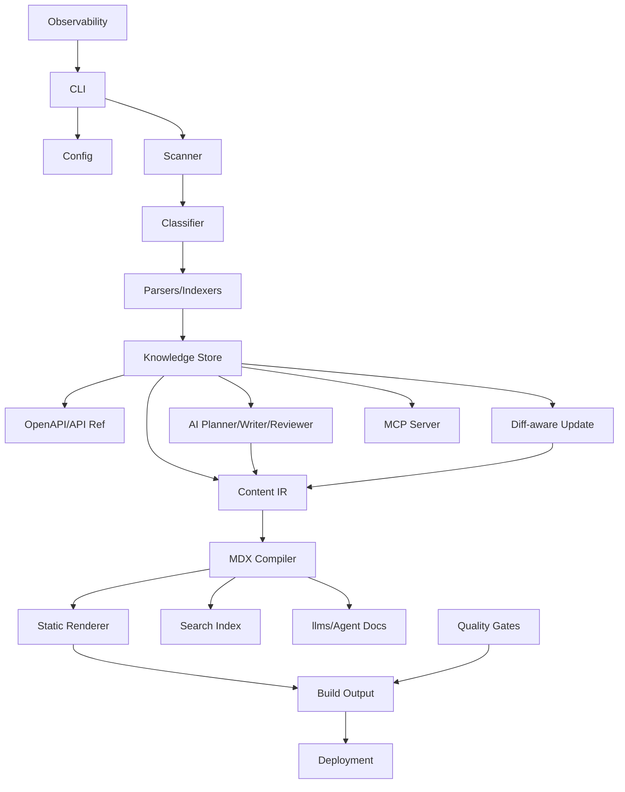
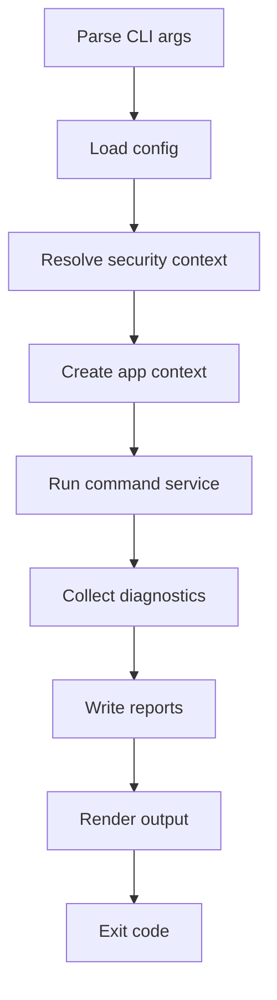
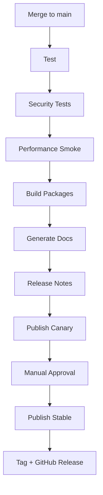
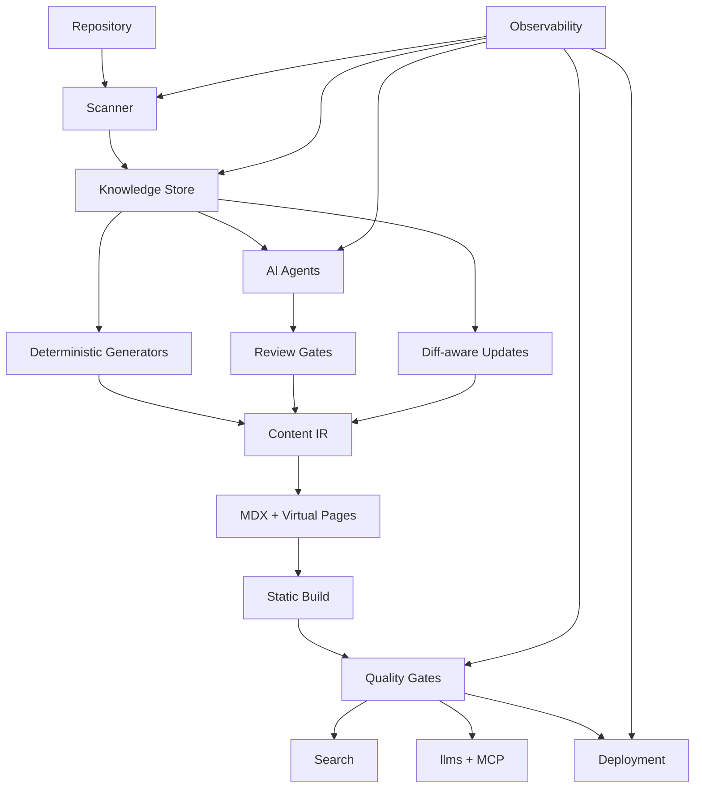

------
title: Build From Scratch: Mintlify-like AI-driven Documentation Generator CLI - Part 048
description: Final integration, hardening, dan release playbook untuk Mintlify-like AI-driven documentation generator CLI: system assembly, package boundaries, end-to-end flows, test matrix, security/performance hardening, beta/GA rollout, packaging, docs, support, and operational readiness.
series: learn-mintlify-like-ai-docs-cli
seriesTitle: Build From Scratch: Mintlify-like AI-driven Documentation Generator CLI
order: 48
partTitle: Final Integration, Hardening, and Release Playbook
tags:
  - documentation
  - ai
  - cli
  - release
  - hardening
  - integration
  - developer-tools
date: 2026-07-04
---

# Part 048 — Final Integration, Hardening, and Release Playbook

Ini adalah bagian terakhir dari roadmap 48 part.

Kita sudah membangun konsep, arsitektur, data model, pipeline, AI agents, quality gates, security, performance, plugins, deployment, dan observability.

Sekarang pertanyaannya:

> Bagaimana semua ini disatukan menjadi produk CLI yang benar-benar bisa dirilis?

Part terakhir ini adalah **final integration, hardening, and release playbook**.

Tujuannya:

- mengikat seluruh package menjadi sistem coherent,
- menentukan vertical slice release,
- menyusun test matrix,
- memastikan security/performance/reliability,
- menyiapkan packaging/distribution,
- membuat migration/compatibility policy,
- menjalankan beta,
- lalu release v1 dengan confidence.

---

## 1. Final product definition

Produk akhir kita:

> CLI developer tool yang membaca repository, docs, OpenAPI, config, dan code; membangun static documentation site; menghasilkan search/agent-ready exports; menjaga docs tetap sinkron; dan menggunakan AI secara evidence-bound untuk membantu menulis/update dokumentasi tanpa mengorbankan trust.

Core commands:

```bash
docforge init
docforge dev
docforge build
docforge check
docforge scan
docforge index
docforge generate
docforge update
docforge stale
docforge examples verify
docforge llms build
docforge mcp
docforge deploy
docforge doctor
```

Not all commands must be v1. But architecture supports them.

---

## 2. Final system architecture



Core invariant:

> Generated output must be rebuildable, traceable, validated, and safe by policy.

---

## 3. Package dependency direction

Keep architecture clean.

```txt
packages/
  cli                 depends on app/services
  app                 orchestrates workflows
  core                domain types/utilities
  config              config loading/schema/migrations
  scanner             filesystem artifacts
  classifier          source classification
  parsers             MDX/tree-sitter/OpenAPI adapters
  storage             SQLite knowledge store
  content-ir          Content IR types/transforms
  mdx                 MDX compile/emit
  renderer            static site render
  search              search docs/index
  agent-docs          llms/chunks/manifest
  ai                  provider abstraction/prompts/schemas
  doc-planner         planner agent
  doc-writer          writer agent
  doc-reviewer        reviewer/fact checker
  update              diff-aware updates
  quality-gates       link/content/security gates
  examples            code example verification
  workflow            self-updating workflow
  github              GitHub adapter
  deploy              deployment adapters
  mcp-server          MCP docs server
  plugins             plugin API/runtime
  observability       logs/metrics/traces/reports
  testkit             fixtures/golden test helpers
```

Dependency rules:

- `core` depends on nothing domain-specific.
- `cli` should not contain business logic.
- `ai` should not write files directly.
- `plugins` should not bypass security context.
- `renderer` should not read repository source.
- `mcp-server` should be read-only by default.
- `deploy` consumes build output manifest, not raw source.

---

## 4. Integration boundary: application service layer

Introduce an application layer.

```ts
export type DocForgeApp = {
  init(input: InitInput): Promise<InitResult>;
  dev(input: DevInput): Promise<DevServerHandle>;
  build(input: BuildInput): Promise<BuildResult>;
  check(input: CheckInput): Promise<QualityReport>;
  generate(input: GenerateInput): Promise<GenerateResult>;
  update(input: UpdateInput): Promise<UpdateResult>;
  deploy(input: DeployInput): Promise<DeployResult>;
};
```

CLI calls `DocForgeApp`. Tests can call `DocForgeApp`. GitHub integration can call workflow services.

This avoids duplicating command logic.

---

## 5. Final command lifecycle

Every command follows standard lifecycle:



Shared context:

```ts
export type AppContext = {
  projectRoot: string;
  config: NormalizedConfig;
  security: SecurityContext;
  store: KnowledgeStore;
  observability: ObservabilityContext;
  cache: CacheService;
  clock: Clock;
};
```

---

## 6. Release scope: do not ship everything at once

A top-1% engineering approach is to release coherent vertical slices, not unfinished mega-system.

Recommended release phases:

| Phase | Scope |
|---|---|
| Alpha 0 | init + basic MDX compile/build |
| Alpha 1 | dev server + nav + static search |
| Alpha 2 | OpenAPI ingestion + API reference |
| Alpha 3 | quality gates + link checker |
| Beta 1 | code indexing + provenance + stale detection |
| Beta 2 | diff-aware deterministic updates |
| Beta 3 | AI planner/writer/reviewer gated by review |
| Beta 4 | llms.txt + MCP read-only server |
| v1 | hardened build/update/check/deploy with docs |

Do not make AI generation a blocker for first useful release.

---

## 7. v1 minimal valuable product

A strong v1 could include:

1. `init`,
2. `dev`,
3. `build`,
4. MDX compile/diagnostics,
5. navigation,
6. static site renderer,
7. static search,
8. OpenAPI API reference,
9. link/content/security quality gates,
10. `llms.txt`,
11. provenance sidecars for generated API pages,
12. deterministic diff-aware update for OpenAPI/config/CLI generated sections,
13. GitHub dry-run report,
14. deployment adapters for static output,
15. observability reports.

AI writer can be beta if not fully trusted.

---

## 8. v1 non-goals

Do not overload v1.

Possible non-goals:

- fully autonomous AI docs rewriting,
- arbitrary plugin sandboxing,
- hosted SaaS control plane,
- full vector retrieval,
- real API playground proxy,
- fully verified SDK examples for every language,
- multi-tenant hosted MCP,
- complex WYSIWYG editor,
- enterprise SSO.

Shipping fewer reliable things is better than many brittle things.

---

## 9. Integration test matrix

End-to-end test fixtures:

```txt
fixtures/e2e/
  minimal-mdx-site/
  mdx-components-site/
  openapi-small/
  openapi-large/
  cli-reference/
  config-reference/
  broken-links/
  stale-provenance/
  generated-api-update/
  ai-draft-review-required/
  llms-export/
  mcp-readonly/
  deploy-static/
```

Each fixture should run:

```bash
docforge init/check/build/update/dev-smoke
```

where applicable.

---

## 10. Golden output tests

For deterministic outputs:

- API reference MDX/HTML,
- config reference,
- CLI reference,
- search docs,
- `llms.txt`,
- manifest files,
- diagnostics,
- update patches.

Golden tests:

```ts
it("generates stable API reference pages", async () => {
  const result = await runFixtureBuild("openapi-small");
  expect(result.files["docs/api/create-user.mdx"]).toMatchGolden();
});
```

Avoid exact golden tests for AI prose. Use structural assertions.

---

## 11. AI integration tests

AI tests should be layered.

### Deterministic fake model tests

- invalid JSON repair,
- unknown evidence ID,
- missing section,
- unsupported claim,
- review rejection.

### Contract tests

- prompt schema version,
- output schema validation,
- evidence mapping.

### Optional live model evals

- not required for normal CI,
- run nightly/manual,
- budget-limited,
- record pass/fail trend.

---

## 12. Security test matrix

From Part 042:

```txt
security/
  symlink escape
  .env secret
  MDX script tag
  OpenAPI remote ref localhost
  prompt injection README
  AI output secret
  unsafe shell example
  public output internal page
  MCP internal query
  GitHub fork PR
  plugin untrusted mode
```

Every one should assert blocking diagnostic.

Security regressions are release blockers.

---

## 13. Performance test matrix

From Part 044:

```txt
performance/
  100 pages
  5000 pages
  1000 OpenAPI operations
  10000 source files
  changed-only MDX edit
  changed-only OpenAPI operation
  search index large
  llms-full large
```

Track:

- cold build,
- warm build,
- peak memory,
- cache hit rate,
- output size.

Do not let performance silently degrade.

---

## 14. Compatibility matrix

Test supported environments.

Example matrix:

| Dimension | Values |
|---|---|
| Node | 20, 22 |
| OS | Linux, macOS, Windows |
| Package manager | npm, pnpm, yarn? |
| Repo size | small, medium, large |
| Docs mode | physical, virtual, hybrid |
| Build output | local static, GitHub Pages, object storage |
| OpenAPI | 3.0, 3.1 |
| AI | disabled, mocked, enabled beta |

For v1, keep support matrix manageable.

---

## 15. Configuration compatibility

Config schema is public API.

Rules:

- version config schema,
- support migrations,
- warn before removal,
- never silently reinterpret fields,
- include `docforge config migrate`,
- include `docforge config explain`.

Release checklist:

```txt
- config schema updated
- migration tests added
- docs updated
- deprecation warnings tested
```

---

## 16. Plugin API compatibility

Plugin API must be versioned.

```ts
export type PluginApiVersion = "1.0";
```

Plugin manifest:

```json
{
  "name": "@acme/docforge-plugin",
  "apiVersion": "1.0",
  "permissions": ["readProject"]
}
```

Rules:

- minor versions add optional capabilities,
- major versions can break,
- plugin loader checks compatibility,
- diagnostics explain mismatch.

---

## 17. Build output contract

Static output contract:

```txt
dist/
  index.html
  assets/**
  search/**
  llms.txt
  llms-full.txt optional
  sitemap.xml
  robots.txt optional
  _redirects or redirects.json optional
  manifest.json
```

Build manifest records files and hashes.

Deployment adapters consume manifest, not random directory scan.

---

## 18. Release readiness checklist

```txt
Core:
[ ] init works on empty project
[ ] dev server hot reload works
[ ] build output deterministic
[ ] check runs quality gates
[ ] search index works
[ ] llms.txt generated and validated

OpenAPI:
[ ] 3.0 fixture passes
[ ] 3.1 fixture passes
[ ] invalid spec diagnostics clear
[ ] large spec performance acceptable

Security:
[ ] secret scan enabled
[ ] public output privacy gate passes
[ ] restricted MDX enforced for generated docs
[ ] remote refs off by default
[ ] unsafe examples blocked

Workflow:
[ ] update dry-run works
[ ] generated deterministic patch works
[ ] manual pages protected
[ ] GitHub report generated

Operations:
[ ] profile report available
[ ] analytics local report available
[ ] cache reset/doctor commands work
[ ] deployment smoke test passes
```

---

## 19. Release blocker categories

Block release if:

- generated docs can leak secrets,
- public build includes private/internal pages,
- manual docs can be overwritten without review,
- invalid MDX can publish,
- OpenAPI route generation unstable,
- build output non-deterministic for same input,
- core commands crash on common fixtures,
- security tests fail,
- config migration breaks existing fixture,
- release package cannot run on supported Node version.

Warnings can ship only if documented and non-critical.

---

## 20. Dogfooding

Before public release, use DocForge to document itself.

Dogfood goals:

- generate CLI reference from own CLI,
- generate config reference from own schema,
- generate plugin API docs,
- generate diagnostic catalog,
- generate `llms.txt`,
- run self-updating workflow on own PRs,
- use GitHub comments internally,
- use MCP server with coding agent.

If the tool cannot document itself, it is not ready.

---

## 21. Dogfood metrics

Track:

```txt
DocForge self-docs:
- CLI commands documented: 100%
- Config fields documented: 100%
- Diagnostics documented: 90%+
- Broken links: 0
- Stale generated pages: 0
- Verified examples: > 90%
- Search MRR: > 0.8 on curated suite
```

---

## 22. Hardening pass: error handling

Every subsystem should produce actionable diagnostics.

Checklist:

- no raw stack trace for user errors,
- include file/line when possible,
- include diagnostic code,
- include hint,
- include docs link if available,
- preserve debug stack in verbose/report.

Example:

```txt
error mdx.component.unknown docs/guide.mdx:42:1
Unknown component <FancyGrid>.

Hint:
Register this component in the theme or use an allowed component.
```

---

## 23. Hardening pass: cancellation and cleanup

Commands should handle interruption.

- `Ctrl+C` stops dev server,
- child processes killed,
- temp dirs cleaned,
- partial writes rolled back,
- SQLite transactions closed,
- telemetry flush bounded,
- lock files released.

Test cancellation for:

- build,
- examples verify,
- update apply,
- dev server,
- deploy.

---

## 24. Hardening pass: atomic writes

Never corrupt docs on failed update/build.

Rules:

- write temp files,
- validate,
- rename atomically,
- backup where needed,
- rollback on failure,
- update sidecars with source file together.

Patch apply should be transactional.

---

## 25. Hardening pass: idempotency

Commands should be repeatable.

Test:

```bash
docforge init
docforge init

docforge build
docforge build

docforge update --apply
docforge update --apply
```

Second run should not create unintended diffs.

---

## 26. Hardening pass: deterministic output

No non-deterministic:

- random IDs,
- timestamps in committed output,
- unstable sort order,
- environment-specific absolute paths,
- model output in deterministic path,
- dependency on filesystem traversal order.

Use stable sort and stable hashes.

---

## 27. Hardening pass: diagnostics catalog

Every diagnostic code should have docs.

Generated diagnostic reference:

```md
# Diagnostic codes

## `link.internal.routeNotFound`

Meaning: ...
Cause: ...
Fix: ...
```

MCP `get_diagnostic` uses this catalog.

---

## 28. Hardening pass: privacy review

Review outputs:

- build output,
- search index,
- `llms.txt`,
- `llms-full.txt`,
- manifest,
- GitHub comments,
- review artifacts,
- telemetry reports,
- MCP responses,
- deployment logs.

Run secret/privacy scan across all.

---

## 29. Hardening pass: docs UX

Docs for DocForge should include:

- quickstart,
- install,
- project config,
- MDX authoring,
- OpenAPI reference generation,
- quality gates,
- self-updating workflow,
- GitHub integration,
- AI generation safety,
- llms/MCP,
- deployment,
- troubleshooting,
- security model,
- plugin development.

Developer tool without excellent docs is ironic failure.

---

## 30. Release packaging

Packaging decisions:

- npm package CLI,
- ESM/CJS strategy,
- bundled vs unbundled dependencies,
- optional native parser dependencies,
- binary size,
- install speed,
- Node version support,
- package exports.

Package entry:

```json
{
  "name": "docforge",
  "version": "1.0.0",
  "bin": {
    "docforge": "./dist/cli.js"
  },
  "type": "module",
  "engines": {
    "node": ">=20"
  }
}
```

---

## 31. Dependency strategy

For a CLI:

- keep startup dependencies minimal,
- lazy-load heavy modules,
- optional dependencies for parsers where possible,
- avoid postinstall scripts,
- pin internal workspace versions,
- audit dependencies,
- watch license compatibility.

Heavy features like tree-sitter/OpenAPI/AI can load only when command needs them.

---

## 32. CLI startup performance

`docforge --help` should be fast.

Avoid loading:

- MDX compiler,
- OpenAPI parser,
- AI SDK,
- renderer,
- tree-sitter,
- SQLite heavy setup,

for basic help/version.

Use lazy command handlers.

---

## 33. Versioning policy

Use semantic versioning for CLI package and public APIs.

Public API includes:

- CLI command flags,
- config schema,
- plugin API,
- generated sidecar schema,
- output manifest schema,
- telemetry schema if exported,
- MCP tool schema,
- deployment adapter API.

Breaking changes require major version or migration.

---

## 34. Release channels

```txt
alpha
beta
latest
next
canary
```

Recommended:

- alpha for early adopters,
- beta for API stabilization,
- latest for stable,
- next for upcoming features,
- canary for every main commit if team needs.

---

## 35. Changelog discipline

Changelog categories:

```md
## Added
## Changed
## Deprecated
## Removed
## Fixed
## Security
## Migration
```

For each release include:

- config changes,
- command changes,
- plugin API changes,
- security-relevant changes,
- migration steps.

---

## 36. Migration playbook

For breaking changes:

1. add migration function,
2. add deprecation warning in previous minor,
3. document migration,
4. test old fixture migration,
5. provide `docforge config migrate`,
6. preserve backup.

Migration command:

```bash
docforge config migrate --from 1 --to 2 --write
```

---

## 37. Backward compatibility tests

Fixtures:

```txt
fixtures/compat/config-v1/
fixtures/compat/config-v2/
fixtures/compat/sidecar-v1/
fixtures/compat/plugin-api-v1/
```

Test:

- old config loads,
- migration output valid,
- old sidecar either works or gives clear migration diagnostic,
- plugin mismatch error clear.

---

## 38. Release automation pipeline



Do not publish if docs build fails.

---

## 39. Release CI checklist

```txt
[ ] unit tests
[ ] integration tests
[ ] e2e fixtures
[ ] security fixtures
[ ] performance smoke
[ ] package build
[ ] CLI smoke install
[ ] docs build
[ ] llms build
[ ] MCP doctor
[ ] deployment dry-run
[ ] changelog generated
[ ] version tags correct
```

---

## 40. CLI smoke install

Test package like user installs it.

```bash
npm pack
mkdir /tmp/docforge-smoke
cd /tmp/docforge-smoke
npm init -y
npm install /path/to/docforge-1.0.0.tgz
npx docforge --version
npx docforge init --template minimal --yes
npx docforge build
```

This catches packaging issues unit tests miss.

---

## 41. Release artifact integrity

Artifacts:

- npm package tarball,
- checksums,
- provenance/attestation later,
- GitHub release notes,
- docs site deployed.

Verify tarball contents:

```bash
npm pack --dry-run
```

Ensure no:

- `.env`,
- test secrets,
- local reports,
- `.docforge/index.sqlite`,
- huge fixtures unless intended.

---

## 42. Security release checklist

```txt
[ ] no secrets in package
[ ] no secrets in docs output
[ ] dependencies audited
[ ] remote refs off by default
[ ] generated MDX restricted
[ ] MCP read-only default
[ ] code execution limited default
[ ] GitHub fork mode restricted
[ ] telemetry disabled/local by default
[ ] security docs updated
```

---

## 43. Performance release checklist

```txt
[ ] --help startup acceptable
[ ] small project build acceptable
[ ] large OpenAPI smoke acceptable
[ ] changed-only update acceptable
[ ] search index size within budget
[ ] memory peak acceptable
[ ] cache reset works
[ ] profile report available
```

---

## 44. Documentation release checklist

```txt
[ ] Quickstart verified
[ ] Config reference generated
[ ] CLI reference generated
[ ] OpenAPI docs guide complete
[ ] Quality gates guide complete
[ ] Security model guide complete
[ ] AI generation guide includes limitations
[ ] Troubleshooting includes common diagnostics
[ ] Migration guide updated
[ ] llms.txt generated
```

---

## 45. Beta program

Before v1, run beta with real projects.

Beta cohort:

- small OSS-style docs site,
- internal monorepo,
- OpenAPI-heavy API project,
- SDK docs project,
- Java/backend service project,
- frontend component docs project.

Collect:

- install friction,
- config confusion,
- build errors,
- performance,
- generated docs quality,
- update workflow trust,
- missing integrations.

---

## 46. Beta success criteria

```txt
[ ] 80%+ beta projects complete first build in < 30 minutes
[ ] no critical secret/privacy leak
[ ] no manual content overwrite
[ ] generated API reference useful in 3+ projects
[ ] quality gates catch real issues
[ ] update dry-run trusted by maintainers
[ ] docs quickstart understandable
[ ] top 10 beta issues resolved or documented
```

---

## 47. Support and troubleshooting readiness

Prepare:

- diagnostic catalog,
- GitHub issue templates,
- `docforge doctor`,
- `docforge doctor performance`,
- `docforge security doctor`,
- minimal reproduction guide,
- debug report export.

Debug bundle command:

```bash
docforge doctor --bundle .docforge/debug-bundle.zip
```

Bundle must redact secrets and ask confirmation.

---

## 48. Debug bundle contents

Safe bundle:

```txt
config redacted
quality report
performance report
diagnostics
package versions
system info
```

Not by default:

- source files,
- prompts,
- model outputs,
- secrets,
- full knowledge store.

---

## 49. Incident playbook

If critical issue discovered:

1. acknowledge,
2. reproduce,
3. classify severity,
4. prepare patch,
5. add regression test,
6. release patch,
7. publish advisory if security,
8. update docs,
9. communicate mitigation.

For secret leak:

- remove output,
- rotate secret,
- purge caches if possible,
- add scanner rule,
- add fixture.

---

## 50. Operational readiness for hosted deployments

If offering hosted deployment later:

- multi-tenant isolation,
- authz,
- audit logs,
- data retention,
- per-tenant encryption,
- job isolation,
- webhook security,
- rate limits,
- abuse prevention,
- SOC/security roadmap.

This is beyond CLI v1 but architecture should not block it.

---

## 51. Final integration: build command flow

```ts
export async function buildCommand(args: BuildArgs): Promise<ExitCode> {
  const ctx = await createAppContext(args);

  const result = await ctx.app.build({
    strict: args.strict,
    profile: args.profile,
    outputDir: args.out,
  });

  await writeReports(result.reports, ctx);
  renderBuildResult(result, ctx.reporter);

  return result.ok ? 0 : 5;
}
```

Everything goes through app context, security, observability, reports.

---

## 52. Final integration: update command flow

```ts
export async function updateCommand(args: UpdateArgs): Promise<ExitCode> {
  const ctx = await createAppContext(args);

  const result = await ctx.app.update({
    since: args.since,
    mode: args.apply ? "applySafe" : "suggest",
    only: args.only,
  });

  renderUpdateResult(result, ctx.reporter);

  return result.hasErrors ? 5 : 0;
}
```

Key invariants:

- dry-run by default,
- apply only safe patches,
- manual pages protected,
- validation before write,
- review artifacts for risky.

---

## 53. Final integration: generate command flow

```ts
export async function generateCommand(args: GenerateArgs): Promise<ExitCode> {
  const ctx = await createAppContext(args);

  const plan = await ctx.app.generatePlan({ scope: args.scope });

  if (!args.apply) {
    renderPlan(plan);
    return 0;
  }

  const result = await ctx.app.generateApply({ planId: plan.id });
  renderGenerateResult(result);

  return result.ok ? 0 : 5;
}
```

AI generation should be plan-first, not immediate mass-write.

---

## 54. Final integration: MCP command flow

```ts
export async function mcpCommand(args: McpArgs): Promise<ExitCode> {
  const ctx = await createAppContext(args);

  const server = await createMcpServer({
    config: ctx.config.mcp,
    store: ctx.store,
    security: ctx.security,
    observability: ctx.observability,
  });

  await server.start(args.stdio ? "stdio" : "http");
  return 0;
}
```

MCP is read-only unless a separate trusted profile explicitly adds write capabilities.

---

## 55. Final integration: deploy command flow

```ts
export async function deployCommand(args: DeployArgs): Promise<ExitCode> {
  const ctx = await createAppContext(args);

  const build = await ctx.app.build({ strict: true });
  if (!build.ok) return 5;

  const deploy = await ctx.app.deploy({
    adapter: args.adapter,
    target: args.target,
    preview: args.preview,
  });

  renderDeployResult(deploy);
  return deploy.ok ? 0 : 5;
}
```

Deployment should consume validated build output.

---

## 56. Final architecture invariants

These should never be broken:

1. AI output is untrusted until schema/evidence/review validation.
2. Generated MDX is emitted from Content IR, not raw model text.
3. Manual docs are never overwritten without explicit review/approval.
4. Public output never includes internal/sensitive/secret artifacts.
5. Code execution goes through safe execution manager.
6. Plugins cannot bypass security context.
7. Build output is manifest-driven.
8. Config schema is versioned and migratable.
9. Every generated formal reference has provenance.
10. Dangerous automation is opt-in.

---

## 57. Product principles

For this class of tool, product trust matters more than flashy generation.

Principles:

- deterministic first,
- AI second,
- evidence always,
- review when risky,
- minimal diffs,
- secure defaults,
- local-first,
- privacy-first,
- composable adapters,
- excellent diagnostics.

---

## 58. Top 1% engineering lens

A top 1% engineer does not just ask:

> Can we generate docs with AI?

They ask:

- What is the source of truth?
- What invariants protect correctness?
- How do we know docs are stale?
- How do we avoid overwriting humans?
- How do we test generated output?
- How do we reduce blast radius?
- How do we keep builds fast?
- How do we debug failures?
- How do we migrate users safely?
- How do we know the product is useful?

That mindset is the core of this 48-part series.

---

## 59. Final recommended implementation order

If building this for real, implement in this order:

1. CLI shell and config,
2. MDX compiler and diagnostics,
3. static renderer,
4. navigation/routes,
5. link checker,
6. search index,
7. OpenAPI ingestion,
8. API reference generation,
9. build manifest,
10. llms export,
11. quality gates,
12. provenance sidecars,
13. stale detection,
14. diff-aware deterministic update,
15. GitHub dry-run report,
16. example verification,
17. MCP read-only server,
18. AI planner/writer/reviewer beta,
19. plugins,
20. deployment adapters.

This order gives value early and keeps risk controlled.

---

## 60. Final repo structure snapshot

```txt
docforge/
  apps/
    docs-site/                  # dogfood docs
  packages/
    cli/
    app/
    core/
    config/
    scanner/
    classifier/
    parsers/
    storage/
    content-ir/
    mdx/
    renderer/
    search/
    openapi/
    agent-docs/
    ai/
    doc-planner/
    doc-writer/
    doc-reviewer/
    update/
    quality-gates/
    examples/
    workflow/
    github/
    deploy/
    mcp-server/
    plugins/
    observability/
    testkit/
  fixtures/
    e2e/
    security/
    performance/
  eval/
    suites/
  docs/
  docforge.config.json
```

---

## 61. Final docs project dogfood config

```json
{
  "schemaVersion": 1,
  "site": {
    "title": "DocForge",
    "description": "AI-assisted documentation compiler for developer products"
  },
  "docs": {
    "root": "docs"
  },
  "openapi": {
    "specs": [
      {
        "id": "public",
        "path": "fixtures/openapi/public.yaml",
        "baseRoute": "/api-reference"
      }
    ]
  },
  "search": {
    "enabled": true
  },
  "llms": {
    "enabled": true
  },
  "quality": {
    "profile": "strict"
  },
  "workflow": {
    "defaultMode": "suggest"
  },
  "mcp": {
    "enabled": true,
    "readOnly": true
  }
}
```

---

## 62. Final release candidate process

For each RC:

```bash
pnpm install --frozen-lockfile
pnpm test
pnpm test:e2e
pnpm test:security
pnpm bench:smoke
pnpm build
pnpm docforge build --strict
pnpm docforge eval run --suite release
pnpm pack:smoke
```

Then:

- publish RC,
- dogfood on real repos,
- collect issues,
- patch,
- repeat.

---

## 63. Final v1 release criteria

```txt
[ ] all release blockers closed
[ ] beta success criteria met
[ ] security review complete
[ ] performance smoke acceptable
[ ] docs complete
[ ] migration guide complete
[ ] package smoke install passes
[ ] dogfood docs built with v1
[ ] changelog ready
[ ] support process ready
[ ] rollback plan ready
```

---

## 64. Rollback plan

If release bad:

- deprecate bad npm version if needed,
- publish patch,
- update docs warning,
- pin recommended version,
- communicate issue,
- add regression test.

For docs deployment bad:

- rollback to previous build artifact,
- purge CDN if needed,
- fix and redeploy.

---

## 65. Post-release monitoring

First 72 hours:

- install errors,
- GitHub issues,
- docs search failures,
- telemetry if opted-in,
- crash reports,
- security reports,
- performance complaints.

Create triage labels:

```txt
bug:build
bug:config
bug:openapi
bug:mdx
bug:ai
bug:security
bug:performance
bug:windows
```

---

## 66. Roadmap after v1

Possible v1.x/v2 areas:

- stronger container sandbox,
- plugin marketplace,
- hosted preview service,
- enterprise MCP service,
- vector retrieval,
- advanced AI evals,
- multi-version/multi-locale docs,
- deeper framework discovery,
- SDK generation integration,
- visual docs editor,
- team analytics dashboard.

But only after core trust is strong.

---

## 67. Final risk register

| Risk | Mitigation |
|---|---|
| AI hallucination damages trust | evidence/review gates, AI beta |
| Security/privacy incident | secure defaults, secret scans, public output gates |
| Performance poor in monorepos | incremental index/cache/profile |
| Too many features unfinished | phased release scope |
| Plugin API unstable | versioned API and beta flag |
| GitHub bot surprises users | dry-run first, opt-in updates |
| Docs output vendor lock-in | static output and adapter interface |
| Users confused by config | init templates, doctor, config explain |
| Generated diffs too noisy | provenance/minimal patches |
| MCP leaks data | read-only + policy/redaction |

---

## 68. Final mental model recap

This product is not merely:

```txt
repo + AI -> docs
```

The production mental model is:

```txt
repo/source contracts
  -> indexed knowledge
  -> validated content IR
  -> deterministic docs build
  -> quality/security gates
  -> search/agent/deployment outputs
  -> observable workflow
```

AI is a controlled transform inside that pipeline, not the pipeline itself.

---

## 69. Final architecture diagram



---

## 70. Final checklist for your own learning

To master this project deeply, you should be able to implement/explain:

1. config schema and migration,
2. scanner with ignore/symlink/secret policy,
3. MDX compiler diagnostics,
4. Content IR and deterministic emitter,
5. route/nav graph,
6. OpenAPI normalization,
7. generated API pages,
8. static search index,
9. provenance and stale detection,
10. AI writer/reviewer contracts,
11. diff-aware updates,
12. quality gates,
13. example verification sandbox,
14. `llms.txt` export,
15. MCP read-only server,
16. GitHub PR automation,
17. plugin API,
18. deployment adapters,
19. observability reports,
20. release/security/performance hardening.

If you can build and reason about those, you are operating at a very high engineering level.

---

## 71. What makes this system production-grade

Production-grade means:

- not just demo pages,
- not just prompt magic,
- not just static rendering,
- not just AI text generation,
- not just one happy path.

It means:

- failure modes are known,
- output is validated,
- source truth is traceable,
- security boundaries exist,
- performance scales,
- updates are minimal,
- humans remain in control,
- integrations are observable,
- release process is disciplined.

---

## 72. Final closing

This 48-part series described how to build a Mintlify-like, AI-driven documentation generator CLI from scratch with production-grade engineering standards.

The most important lesson:

> AI can accelerate documentation, but trust comes from compiler architecture, evidence, validation, provenance, security boundaries, and operational discipline.

If you build this system with those principles, you are not merely building a docs generator.

You are building a developer knowledge platform.

---

## 73. Series completion

This is the final part of the planned roadmap.

Total parts completed: **48 / 48**.

Suggested next advanced materials after this:

1. Build from scratch: AI codebase intelligence platform.
2. Build from scratch: enterprise developer portal.
3. Build from scratch: OpenAPI/SDK platform with contract testing.
4. Build from scratch: internal AI engineering assistant with MCP tools.
5. In action: production-grade Java platform documentation and governance.

End of series.
