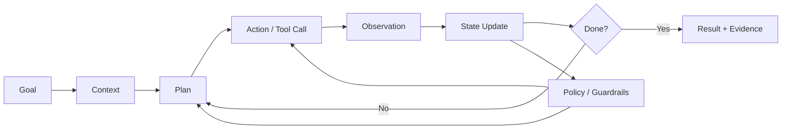
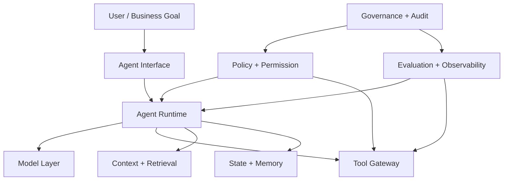
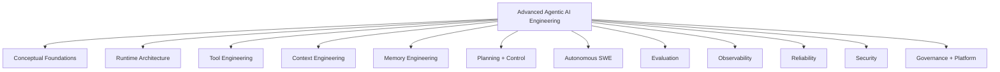
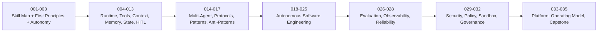
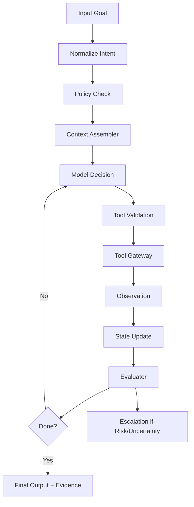
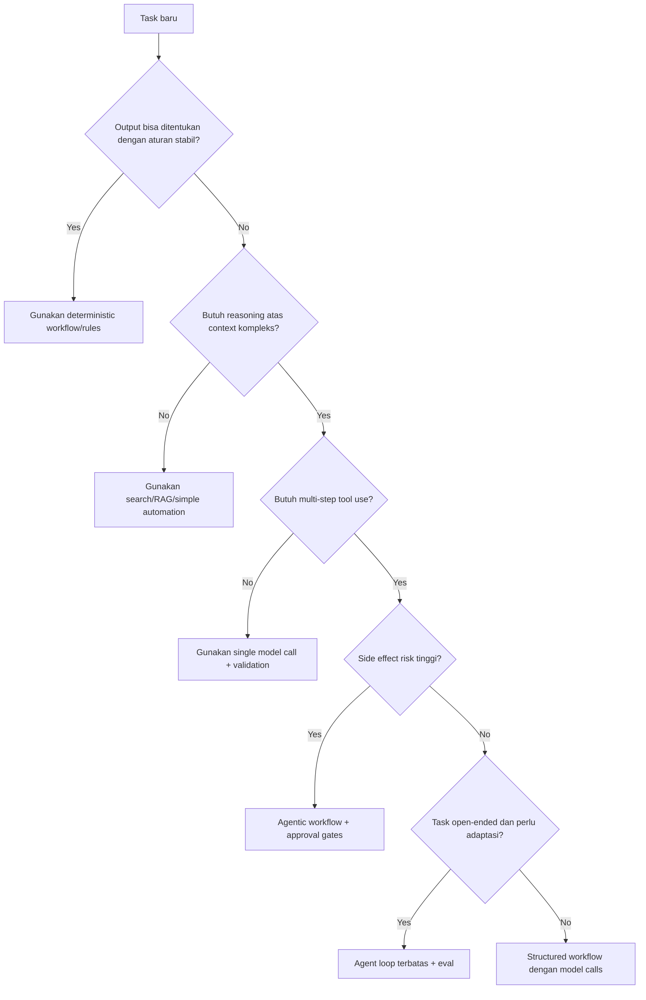

------
title: Learn Advanced Agentic AI Engineering & Autonomous Software Engineering - Part 001
description: Skill map, learning contract, target performance, and deliberate practice plan for mastering advanced agentic AI engineering and autonomous software engineering.
series: learn-agentic-ai-engineering
seriesTitle: Learn Advanced Agentic AI Engineering & Autonomous Software Engineering
order: 1
partTitle: Kaufman Skill Map for Agentic AI Engineering
tags:
- agentic-ai
- autonomous-software-engineering
- ai-engineering
- agents
- software-engineering
- series
date: 2026-06-29
---

# Part 001 — Kaufman Skill Map for Agentic AI Engineering

> Target part ini: membentuk **peta belajar operasional** untuk menjadi engineer yang mampu merancang, membangun, mengevaluasi, mengamankan, dan mengoperasikan **agentic AI system** serta **autonomous software engineering system** secara production-grade.

Part ini bukan tutorial framework. Ini adalah kontrak belajar dan peta skill. Kita akan menentukan apa yang perlu dikuasai, apa yang tidak perlu diulang dari seri sebelumnya, bagaimana membagi skill menjadi subskill, dan bagaimana mengukur apakah kita benar-benar naik level.

Kita menggunakan prinsip Josh Kaufman dari *The First 20 Hours*:

1. **Choose a lovable project** — tentukan target konkret yang cukup menarik untuk diselesaikan.
2. **Focus on one skill at a time** — jangan belajar semua hal AI sekaligus.
3. **Define target performance level** — tentukan bentuk performa yang bisa diamati.
4. **Deconstruct the skill into subskills** — pecah kemampuan besar menjadi komponen kecil.
5. **Obtain critical tools** — siapkan alat minimum untuk praktik.
6. **Eliminate barriers to practice** — hilangkan friction teknis dan mental.
7. **Make dedicated time** — jadwalkan latihan yang tidak tercampur dengan konsumsi pasif.
8. **Create fast feedback loops** — setiap latihan harus punya sinyal benar/salah.
9. **Practice by the clock in short bursts** — latihan terukur, bukan hanya membaca lama.
10. **Emphasize quantity and speed early** — awalnya bangun fluency; presisi ditingkatkan setelah loop jalan.

Dalam konteks advanced agentic AI, prinsip itu kita terjemahkan menjadi:

> Bangun sistem agent kecil yang nyata, beri tools yang aman, beri target yang bisa diverifikasi, jalankan banyak eksperimen, ukur trajectory, temukan failure mode, lalu iterasi sampai sistemnya dapat dipercaya.

---

## 1. Apa yang Sedang Kita Pelajari?

Istilah **agentic AI engineering** sering dipakai terlalu longgar. Banyak sistem disebut “agent” padahal hanya:

- chatbot dengan prompt panjang,
- workflow deterministic dengan satu pemanggilan model,
- RAG biasa dengan sedikit tool calling,
- wrapper UI di atas LLM,
- atau automation script yang kebetulan memakai model.

Dalam seri ini, kita akan memakai definisi yang lebih ketat.

**Agentic AI system** adalah sistem berbasis model yang dapat:

1. menerima tujuan,
2. memahami konteks,
3. memilih atau menyusun langkah,
4. memakai tools atau external systems,
5. membaca hasil tindakannya,
6. memperbarui state,
7. melanjutkan, mengoreksi, atau berhenti,
8. dan tetap berada dalam batas policy, permission, observability, serta review gate.

Dengan kata lain, agentic system bukan sekadar “model yang menjawab”. Ia adalah **runtime pengambilan keputusan dan eksekusi**.



Untuk **autonomous software engineering**, agentic system diterapkan ke lifecycle engineering:

- memahami repository,
- membaca issue,
- menemukan lokasi perubahan,
- membuat patch,
- menjalankan test,
- menganalisis failure,
- memperbaiki patch,
- membuat PR,
- merespons review,
- menyiapkan release note,
- membantu incident response,
- dan menjaga auditability.

Namun kita tidak akan memperlakukannya sebagai “AI coding shortcut”. Kita akan memperlakukannya sebagai **software engineering system with delegated agency**.

---

## 2. Target Performa: “Top 1%” Itu Apa?

Target “top 1%” tidak berarti hafal semua framework agent. Itu target yang salah. Framework berubah cepat. Yang bertahan adalah kemampuan membangun mental model, constraint model, dan evaluation loop.

Dalam seri ini, engineer top-tier berarti mampu menjawab pertanyaan berikut dengan tajam:

1. **Apakah masalah ini perlu agent?**  
   Atau cukup workflow deterministic, search, rules engine, queue worker, BPMN, atau simple automation?

2. **Apa boundary otonomi yang aman?**  
   Apa agent boleh membaca? Menulis? Mengirim email? Membuka PR? Merge? Deploy? Menghapus data? Menghubungi customer?

3. **Apa state machine-nya?**  
   Apa state valid, transisi valid, terminal state, retry state, failure state, dan escalation state?

4. **Apa tool contract-nya?**  
   Apakah tool idempotent? Punya side effect? Bisa rollback? Bisa dipanggil paralel? Bisa bocor credential?

5. **Apa evidence of completion-nya?**  
   Bagaimana kita tahu task benar-benar selesai, bukan hanya agent mengklaim selesai?

6. **Bagaimana mengevaluasi trajectory, bukan hanya jawaban akhir?**  
   Apakah agent memilih tool yang tepat, membaca file yang tepat, menghindari loop, dan menghasilkan perubahan minimal?

7. **Apa failure mode yang paling berbahaya?**  
   Hallucinated success, silent data corruption, excessive agency, prompt injection, memory poisoning, unbounded cost, atau unsafe tool call?

8. **Apa governance model-nya?**  
   Siapa pemilik agent, siapa reviewer, apa audit log-nya, apa kill switch-nya, dan bagaimana policy diubah?

Engineer top-tier tidak hanya bertanya: “bagaimana cara membuat agent?”  
Ia bertanya: **“agent ini boleh gagal seperti apa, dan bagaimana sistem membuktikan bahwa kegagalannya terkendali?”**

---

## 3. Scope Seri Ini

Seri ini akan fokus pada **advanced agentic AI engineering** dan **autonomous software engineering**.

### 3.1 Yang Masuk Scope

Kita akan membahas:

- agentic AI first principles,
- workflow vs agent loop,
- autonomy boundary,
- planner-executor architecture,
- tool calling engineering,
- MCP-style integration layer,
- context engineering,
- memory architecture,
- state machine for agents,
- human approval gates,
- multi-agent coordination,
- agent communication protocols,
- design patterns and anti-patterns,
- coding agent execution loop,
- repository understanding,
- autonomous debugging,
- test generation,
- PR review agents,
- migration agents,
- DevOps and release agents,
- evaluation engineering,
- observability,
- reliability,
- security threat modeling,
- policy and permission,
- sandboxing,
- governance,
- enterprise platform architecture,
- and capstone autonomous engineering system.

### 3.2 Yang Tidak Akan Diulang

Kita tidak akan mengulang materi dasar yang sudah ada di seri sebelumnya:

- Java syntax, collections, concurrency, persistence, messaging, observability, security dasar,
- Python basic dan AI application engineering dasar,
- frontend, React, JavaScript, HTML/CSS,
- DSA, design pattern umum,
- BPMN/Camunda detail,
- core banking atau telecom domain modelling.

Materi tersebut akan dianggap sebagai prasyarat. Kalau muncul, ia akan dipakai sebagai konteks, bukan dijelaskan ulang.

### 3.3 Yang Sengaja Tidak Kita Jadikan Fokus Utama

Kita tidak akan menjadikan seri ini sebagai:

- katalog prompt,
- daftar library tercepat,
- hype review model terbaru,
- tutorial membuat chatbot,
- tutorial LangChain/OpenAI/Anthropic dari nol,
- atau kumpulan demo notebook.

Framework akan dipakai sebagai contoh, bukan sebagai pusat pemahaman.

---

## 4. Mental Model Utama

Agentic AI system production-grade dapat dipahami sebagai komposisi dari sembilan lapisan:



Setiap lapisan punya tanggung jawab berbeda.

| Lapisan | Tanggung Jawab | Failure Jika Lemah |
|---|---|---|
| Interface | Menerima intent, constraints, dan consent | Task ambigu, consent tidak jelas, ekspektasi salah |
| Runtime | Mengatur loop, state, planning, action, stop condition | Infinite loop, stuck state, tindakan tidak terkontrol |
| Model | Reasoning, language understanding, generation | Hallucination, brittle reasoning, salah interpretasi |
| Tool Gateway | Mengakses external systems secara aman | Unsafe side effect, credential leak, action salah target |
| Context | Menyediakan informasi relevan | Stale knowledge, retrieval salah, context bloat |
| Memory | Menyimpan state jangka pendek/panjang | Memory poisoning, privacy leak, fakta usang |
| Policy | Membatasi authority agent | Excessive agency, privilege escalation |
| Evaluation | Mengukur kualitas dan risiko | Tidak tahu agent gagal sampai production incident |
| Governance | Ownership, audit, lifecycle | Tidak ada akuntabilitas, sulit diaudit |

Prinsip penting:

> Semakin besar agency yang diberikan ke agent, semakin eksplisit runtime, policy, dan audit yang harus dibangun.

---

## 5. Agentic AI sebagai Distributed System

Kesalahan umum adalah melihat agentic AI sebagai “AI problem”. Untuk engineer senior, lebih tepat melihatnya sebagai distributed system yang komponennya sebagian probabilistik.

Agentic system memiliki karakteristik distributed system:

- asynchronous execution,
- unreliable dependencies,
- partial failure,
- retry and timeout,
- side effect,
- eventual consistency,
- concurrency,
- resource limits,
- identity and permission,
- audit log,
- and rollback/compensation.

Bedanya, agentic system menambahkan risiko baru:

- non-deterministic reasoning,
- hallucinated state,
- instruction conflict,
- prompt injection,
- tool misuse,
- unbounded planning,
- context drift,
- and self-justifying incorrect output.

Jadi baseline arsitektur bukan:

```text
user -> prompt -> model -> answer
```

Tetapi:

```text
request -> intent normalization -> policy check -> context assembly -> model decision -> tool mediation -> observation -> state transition -> evaluation -> response/audit
```

Dengan model ini, kita bisa merancang agent seperti sistem yang bisa diuji.

---

## 6. Kaufman Deconstruction: Skill Besar Menjadi Subskill

Kita pecah agentic AI engineering menjadi 12 subskill utama.



### 6.1 Conceptual Foundations

Kemampuan inti:

- membedakan assistant, workflow, agent, autonomous system,
- memahami agency, autonomy, authority, dan accountability,
- menentukan kapan agent layak dipakai,
- menyusun objective, constraint, evidence, dan stop condition.

Pertanyaan self-check:

- Apa perbedaan “agent memilih action” dan “workflow menjalankan branch”?
- Apa tanda task terlalu sempit untuk agent?
- Apa tanda task terlalu berbahaya untuk full autonomy?

### 6.2 Runtime Architecture

Kemampuan inti:

- mendesain agent loop,
- mendefinisikan state schema,
- mengatur planner, executor, critic, and supervisor,
- menentukan checkpointing,
- mendukung pause/resume,
- mencegah unbounded execution.

Pertanyaan self-check:

- Apa state minimal yang perlu disimpan agar agent bisa resume?
- Apa kondisi agent harus berhenti?
- Apa bedanya execution state dan conversation state?

### 6.3 Tool Engineering

Kemampuan inti:

- mendesain tool schema,
- membedakan read tool vs write tool,
- membuat idempotency key,
- membatasi side effect,
- membuat dry-run mode,
- memvalidasi input/output,
- membuat tool audit log.

Pertanyaan self-check:

- Tool mana yang boleh dipanggil tanpa approval?
- Apa risiko kalau model salah memilih parameter?
- Bagaimana rollback jika tool sudah menulis data?

### 6.4 Context Engineering

Kemampuan inti:

- menentukan informasi yang masuk context,
- menghindari context bloat,
- mengatur retrieval budget,
- membuat context contract,
- menilai freshness dan authority source,
- menghindari stale/corrupted context.

Pertanyaan self-check:

- Apa context yang harus selalu ada?
- Apa context yang hanya boleh diambil on-demand?
- Bagaimana mendeteksi agent bekerja dengan informasi lama?

### 6.5 Memory Engineering

Kemampuan inti:

- membedakan working memory, episodic memory, semantic memory, procedural memory,
- mendesain retention policy,
- mencegah memory poisoning,
- mengatur privacy dan consent,
- membuat memory update verifiable.

Pertanyaan self-check:

- Apa yang boleh disimpan jangka panjang?
- Siapa yang boleh menghapus memory?
- Bagaimana mencegah agent menyimpan asumsi sebagai fakta?

### 6.6 Planning and Control

Kemampuan inti:

- task decomposition,
- planning horizon,
- replanning,
- critic/evaluator loop,
- constraint enforcement,
- plan validation,
- and escalation.

Pertanyaan self-check:

- Apa tanda plan terlalu abstrak?
- Apa tanda plan terlalu detail dan brittle?
- Kapan agent harus replan?

### 6.7 Autonomous Software Engineering

Kemampuan inti:

- repository understanding,
- issue triage,
- code search,
- patch planning,
- test generation,
- compile/test feedback,
- debugging loop,
- PR review,
- migration,
- release assistance.

Pertanyaan self-check:

- Bagaimana agent tahu file mana yang relevan?
- Bagaimana agent membuktikan patch menyelesaikan issue?
- Bagaimana agent menghindari perubahan terlalu luas?

### 6.8 Evaluation Engineering

Kemampuan inti:

- final answer eval,
- trajectory eval,
- tool-call eval,
- regression eval,
- golden dataset,
- LLM-as-judge limitations,
- cost-quality tradeoff,
- production eval pipeline.

Pertanyaan self-check:

- Apa yang diukur: output, process, atau both?
- Apa eval yang bisa dijalankan otomatis?
- Apa eval yang butuh human reviewer?

### 6.9 Observability

Kemampuan inti:

- tracing agent run,
- logging tool calls,
- cost telemetry,
- token telemetry,
- decision log,
- state snapshot,
- audit reconstruction,
- incident debugging.

Pertanyaan self-check:

- Jika agent salah kirim email, bisa rekonstruksi penyebabnya?
- Apakah tool call punya correlation id?
- Apakah decision dibuat berdasarkan context yang bisa dilihat ulang?

### 6.10 Reliability

Kemampuan inti:

- timeout,
- retry,
- backoff,
- circuit breaker,
- graceful degradation,
- partial completion,
- stuck detection,
- deterministic wrapper around probabilistic core.

Pertanyaan self-check:

- Apa yang terjadi jika model timeout?
- Apa yang terjadi jika tool return data parsial?
- Apa yang terjadi jika agent mengulang action berbahaya?

### 6.11 Security

Kemampuan inti:

- prompt injection threat model,
- tool output trust boundary,
- sandboxing,
- secret isolation,
- permission scoping,
- policy enforcement,
- data exfiltration prevention,
- supply-chain control.

Pertanyaan self-check:

- Apakah tool output dianggap trusted?
- Apakah agent bisa membaca secret yang tidak dibutuhkan?
- Apakah retrieved document bisa memberi instruksi ke agent?

### 6.12 Governance and Platform

Kemampuan inti:

- agent registry,
- ownership,
- model/version control,
- policy lifecycle,
- eval gates,
- production rollout,
- auditability,
- compliance evidence,
- enterprise operating model.

Pertanyaan self-check:

- Siapa owner agent ini?
- Apa proses approval perubahan policy?
- Bagaimana agent dinonaktifkan cepat saat incident?

---

## 7. The First 20 Hours Plan untuk Seri Ini

Walaupun seri ini panjang, 20 jam pertama harus menghasilkan fluency awal. Kita tidak menunggu semua teori selesai baru praktik.

### 7.1 Target Project 20 Jam Pertama

Project minimum:

> Bangun **Autonomous Issue Triage and Patch Assistant** untuk repository kecil: agent membaca issue, membuat rencana patch, memilih file relevan, mengusulkan diff, menjalankan test lokal, dan menghasilkan final report. Agent belum boleh langsung push atau merge.

Autonomy level:

- boleh membaca repository,
- boleh menjalankan command read-only atau test command yang diizinkan,
- boleh membuat patch lokal,
- tidak boleh commit tanpa approval,
- tidak boleh push,
- tidak boleh deploy,
- tidak boleh mengakses secret.

Output yang harus ada:

- issue interpretation,
- repo map,
- file relevance ranking,
- patch plan,
- diff,
- test result,
- risk assessment,
- final evidence.

### 7.2 Breakdown 20 Jam

| Jam | Fokus | Output Praktik |
|---:|---|---|
| 1-2 | Definisi agent dan autonomy boundary | Tulis agent charter dan permission matrix |
| 3-4 | Agent runtime loop | Implement pseudo-runtime sederhana |
| 5-6 | Tool schema | Buat read_file, search_code, run_tests sebagai tool contract |
| 7-8 | Context assembly | Buat repo summary dan issue context pack |
| 9-10 | Planning | Buat planner yang menghasilkan task graph |
| 11-12 | Execution | Jalankan satu patch loop dengan manual review |
| 13-14 | Evaluation | Buat rubric: correctness, minimality, risk, evidence |
| 15-16 | Observability | Log setiap decision dan tool call |
| 17-18 | Failure injection | Simulasikan missing file, failing test, ambiguous issue |
| 19-20 | Retrospective | Tulis failure modes dan improvement backlog |

### 7.3 Prinsip Practice

Jangan mulai dari framework berat. Mulai dari loop kecil:

```text
Task -> Context -> Plan -> Tool Call -> Observation -> State -> Decision -> Evidence
```

Jika loop kecil belum jelas, framework hanya akan menyembunyikan kebingungan.

---

## 8. Learning Contract

Agar pembelajaran efektif, setiap part akan punya format mental yang relatif konsisten:

1. **Core concept** — definisi dan kenapa penting.
2. **Mental model** — cara memikirkan masalah secara engineering.
3. **Architecture view** — komponen dan relasi.
4. **Design rules** — aturan praktis yang dapat diterapkan.
5. **Failure modes** — bagaimana sistem gagal.
6. **Practice** — latihan yang bisa dieksekusi.
7. **Checklist** — alat self-review.

Kita akan menghindari dua jebakan:

- terlalu abstrak sampai tidak bisa dibangun,
- terlalu framework-specific sampai tidak tahan perubahan tool.

---

## 9. Agentic Engineering Invariants

Sepanjang seri ini, kita akan mengulang beberapa invariant. Ini bukan repetisi materi; ini adalah safety rail.

### 9.1 Every Agent Must Have a Stop Condition

Agent tanpa stop condition adalah infinite loop yang dibungkus language model.

Stop condition bisa berupa:

- target tercapai,
- budget habis,
- confidence terlalu rendah,
- tool failure berulang,
- policy conflict,
- human approval required,
- atau task ambiguous.

### 9.2 Every Side Effect Must Be Mediated

Agent tidak boleh langsung melakukan irreversible action. Semua side effect harus melewati tool gateway atau policy layer.

Side effect termasuk:

- menulis database,
- mengirim email,
- membuka PR,
- merge PR,
- deploy,
- mengubah permission,
- menghapus file,
- mengirim data ke external API.

### 9.3 Every Completion Claim Needs Evidence

Output “done” tidak cukup. Agent harus menyertakan evidence:

- test passed,
- diff summary,
- file changed,
- command result,
- source citation,
- reviewer approval,
- or business rule verification.

### 9.4 Every Tool Output Is Untrusted Until Classified

Tool output dapat mengandung:

- instruksi berbahaya,
- data palsu,
- prompt injection,
- stale information,
- partial result,
- or malicious payload.

Jadi tool output harus diklasifikasikan sebagai data, bukan instruksi, kecuali explicit trusted channel.

### 9.5 Every Agent Run Must Be Replayable Enough

Tidak semua run harus bit-by-bit deterministic. Namun run harus cukup bisa direkonstruksi:

- input,
- model version,
- prompt/system instruction,
- context pack,
- tool calls,
- tool outputs,
- state transitions,
- approvals,
- and final result.

Tanpa ini, incident analysis hampir mustahil.

---

## 10. Roadmap Seri 35 Part

Berikut peta besar yang akan kita jalani.



### 10.1 Foundation Block

- Part 001 — Kaufman Skill Map
- Part 002 — Agentic AI First Principles
- Part 003 — Autonomy Boundaries and Control Theory

Tujuan block ini adalah membersihkan definisi dan boundary. Tanpa ini, semua diskusi berikutnya akan kabur.

### 10.2 Runtime Block

- Part 004 — Agent Runtime Architecture
- Part 005 — Workflow vs Agent Loop
- Part 006 — Task Decomposition and Planning
- Part 007 — Tool Calling Engineering
- Part 008 — MCP and Agent Integration Layer
- Part 009 — Context Engineering
- Part 010 — Memory Architecture
- Part 011 — RAG for Agentic Systems
- Part 012 — Agent State Machines
- Part 013 — Human-in-the-Loop and Approval Gates

Tujuan block ini adalah membuat agent sebagai executable system, bukan prompt improvisation.

### 10.3 Coordination Block

- Part 014 — Multi-Agent Systems
- Part 015 — Agent Communication Protocols
- Part 016 — Agentic Design Patterns
- Part 017 — Agentic Anti-Patterns

Tujuan block ini adalah memahami kapan banyak agent berguna dan kapan justru menambah entropy.

### 10.4 Autonomous SWE Block

- Part 018 — Autonomous Software Engineering Foundations
- Part 019 — Repository Understanding Agents
- Part 020 — Coding Agent Execution Loop
- Part 021 — Autonomous Debugging and Repair
- Part 022 — Test Generation and Verification Agents
- Part 023 — Code Review and PR Review Agents
- Part 024 — Refactoring and Migration Agents
- Part 025 — DevOps and Release Agents

Tujuan block ini adalah membangun autonomous engineering loop dari issue sampai release support.

### 10.5 Quality Block

- Part 026 — Agent Evaluation Engineering
- Part 027 — Observability for Agentic Systems
- Part 028 — Reliability and Failure Modeling

Tujuan block ini adalah membuat kualitas agent measurable, debuggable, dan improvable.

### 10.6 Risk Block

- Part 029 — Security Threat Modeling for Agents
- Part 030 — Policy, Permission, and Identity
- Part 031 — Sandboxing and Safe Execution
- Part 032 — Governance, Risk, and Compliance

Tujuan block ini adalah memastikan agent tidak menjadi automation dengan privilege terlalu besar.

### 10.7 Platform Block

- Part 033 — Agent Platform Architecture
- Part 034 — Enterprise Adoption and Operating Model
- Part 035 — Capstone: Autonomous Engineering System

Tujuan block ini adalah menyatukan seluruh konsep menjadi enterprise-grade architecture.

---

## 11. Skill Ladder

Kita akan memakai ladder berikut untuk menilai progress.

### Level 0 — User of AI Tools

Ciri:

- memakai chat/coding assistant,
- copy-paste prompt,
- tidak memahami failure mode,
- menganggap output benar jika terdengar meyakinkan.

Risiko:

- hallucination diterima sebagai fakta,
- code generated tanpa verification,
- prompt injection tidak dikenali.

### Level 1 — Prompt-Oriented Builder

Ciri:

- bisa membuat prompt template,
- memakai structured output,
- memanggil tool sederhana,
- mulai membuat RAG/basic automation.

Risiko:

- prompt menjadi tempat semua logic,
- tidak ada state machine,
- tidak ada eval.

### Level 2 — Workflow Engineer

Ciri:

- memakai deterministic workflow,
- punya branching logic,
- memisahkan model call dan business logic,
- mulai memakai logging dan eval sederhana.

Risiko:

- workflow brittle untuk task open-ended,
- context management masih manual,
- tool permission belum matang.

### Level 3 — Agentic System Engineer

Ciri:

- mendesain runtime loop,
- memahami planning, tool use, memory, and state,
- punya policy gate,
- punya eval harness,
- bisa debug trajectory.

Risiko:

- sistem mulai kompleks,
- biaya dan latency naik,
- failure mode lebih sulit diprediksi.

### Level 4 — Production Agent Architect

Ciri:

- membangun platform agent multi-use-case,
- mengatur governance,
- mengintegrasikan observability dan audit,
- mengelola security threat model,
- mendesain rollout dan operating model.

Risiko:

- organizational adoption,
- model/vendor dependency,
- compliance and accountability.

### Level 5 — Autonomous Engineering Systems Lead

Ciri:

- membangun agent yang dapat menjalankan bagian nyata SDLC,
- mengontrol autonomy secara granular,
- mengukur engineering productivity and risk,
- mengintegrasikan agent dengan CI/CD, code review, incident, and release process,
- menjaga quality, reliability, security, and compliance.

Risiko:

- delegasi terlalu cepat,
- human review menjadi rubber stamp,
- metrics salah sehingga agent terlihat produktif padahal menaikkan risk.

Target seri ini adalah membawa Anda minimal ke Level 4, dan memberi blueprint menuju Level 5.

---

## 12. Core Vocabulary

Sebelum masuk part berikutnya, kita tetapkan vocabulary.

| Istilah | Definisi Operasional |
|---|---|
| Model | Komponen probabilistik yang melakukan reasoning/generation berdasarkan input/context |
| Agent | Runtime yang memakai model untuk memilih tindakan dalam environment dengan state dan feedback |
| Workflow | Jalur eksekusi yang sebagian besar ditentukan developer |
| Tool | Fungsi eksternal yang dapat dipanggil agent/runtime |
| Observation | Hasil dari action/tool call yang digunakan untuk langkah berikutnya |
| State | Representasi progres task dan informasi penting selama execution |
| Memory | Informasi yang dipertahankan lintas langkah atau lintas run |
| Policy | Aturan yang membatasi apa yang boleh dilakukan agent |
| Guardrail | Mekanisme enforcement atau validation terhadap input/action/output |
| Evaluation | Proses mengukur kualitas output dan trajectory |
| Trajectory | Urutan decision, tool call, observation, dan state transition selama run |
| Human-in-the-loop | Mekanisme pause/escalation untuk review atau approval manusia |
| Autonomy Boundary | Batas kewenangan agent dalam membuat keputusan dan melakukan action |
| Evidence | Bukti bahwa output benar, lengkap, atau aman |

---

## 13. Canonical Agent Run Record

Salah satu artefak terpenting dalam agentic engineering adalah **agent run record**. Setiap agent run harus dapat direkam dalam struktur seperti ini:

```json id="canonical-agent-run-record"
{
  "runId": "run_2026_06_29_001",
  "agentId": "issue-triage-agent",
  "agentVersion": "0.1.0",
  "model": {
    "provider": "example-provider",
    "name": "example-model",
    "version": "2026-06-29"
  },
  "input": {
    "goal": "Analyze issue #123 and propose a safe patch plan",
    "constraints": [
      "do not modify files without approval",
      "do not access secrets",
      "only run allowed test commands"
    ]
  },
  "contextPack": {
    "sources": [
      "issue body",
      "repository map",
      "recent failing test output"
    ],
    "createdAt": "2026-06-29T10:00:00+07:00"
  },
  "stateTransitions": [
    {
      "from": "RECEIVED",
      "to": "ANALYZING",
      "reason": "Issue text parsed successfully"
    }
  ],
  "toolCalls": [
    {
      "tool": "search_code",
      "input": {
        "query": "PaymentStatusMapper"
      },
      "sideEffect": false,
      "approved": true
    }
  ],
  "observations": [
    {
      "source": "search_code",
      "summary": "Found mapper implementation and tests"
    }
  ],
  "finalOutput": {
    "status": "NEEDS_HUMAN_APPROVAL",
    "summary": "Patch plan ready; no files modified",
    "evidence": [
      "Relevant files identified",
      "Risk assessment completed"
    ]
  }
}
```

Run record seperti ini akan menjadi basis observability, eval, governance, dan audit.

---

## 14. Minimum Viable Agent Architecture

Sebelum membangun platform besar, kita butuh minimum architecture yang benar.



Komponen minimal:

1. **Intent normalizer** — mengubah request pengguna menjadi goal dan constraints.
2. **Policy checker** — menentukan apakah request boleh dijalankan.
3. **Context assembler** — mengambil informasi relevan.
4. **Model decision step** — memilih reasoning/action.
5. **Tool validator** — memvalidasi action sebelum tool dipanggil.
6. **Tool gateway** — menjalankan external action.
7. **State manager** — menyimpan progres dan observation.
8. **Evaluator** — mengecek kualitas dan completion.
9. **Escalation path** — meminta review manusia saat perlu.
10. **Audit logger** — mencatat seluruh run.

---

## 15. Practice: Agent Charter

Latihan pertama bukan menulis code. Latihan pertama adalah menulis **agent charter**.

Gunakan template berikut.

```mdx id="agent-charter-template"
# Agent Charter: <agent-name>

## 1. Mission
Agent ini bertugas untuk ...

## 2. Non-Goals
Agent ini tidak boleh ...

## 3. Allowed Inputs
- ...

## 4. Allowed Tools
| Tool | Read/Write | Side Effect | Approval Required | Notes |
|---|---|---:|---:|---|
| search_code | Read | No | No | Repository-local only |
| run_tests | Read/Compute | No | No | Allowed command list only |
| create_patch | Write local | Yes | Yes | No commit/push |

## 5. Autonomy Boundary
- Agent boleh mengambil keputusan sendiri untuk ...
- Agent wajib meminta approval untuk ...
- Agent tidak pernah boleh ...

## 6. Completion Evidence
Task dianggap selesai jika ...

## 7. Failure Handling
Jika agent tidak yakin, agent harus ...

## 8. Audit Requirements
Setiap run harus mencatat ...
```

Contoh singkat:

```mdx id="issue-agent-charter-example"
# Agent Charter: Issue Patch Assistant

## Mission
Membantu engineer menganalisis issue repository, menyusun patch plan, membuat diff lokal, dan menjalankan test yang diizinkan.

## Non-Goals
Agent tidak boleh merge PR, deploy, mengubah secret, atau mengirim komunikasi eksternal.

## Allowed Tools
| Tool | Read/Write | Side Effect | Approval Required |
|---|---|---:|---:|
| read_file | Read | No | No |
| search_code | Read | No | No |
| run_tests | Compute | No | No |
| propose_patch | Write local diff | Yes | Yes |

## Autonomy Boundary
Agent boleh memilih file untuk dibaca dan test yang dijalankan dari allowlist. Agent wajib meminta approval sebelum menulis patch.

## Completion Evidence
Agent harus menyertakan issue summary, relevant files, patch rationale, diff summary, test command, test result, dan residual risk.
```

---

## 16. Practice: Build Your First Skill Matrix

Buat matriks skill pribadi. Jangan hanya menilai “sudah/belum”. Pakai level evidence.

| Skill | Level Saat Ini | Evidence | Next Practice |
|---|---:|---|---|
| Define autonomy boundary | 0-5 | Pernah menulis permission matrix? | Tulis charter untuk 3 agent |
| Tool schema design | 0-5 | Pernah membuat tool idempotent? | Desain 5 read/write tools |
| Context engineering | 0-5 | Pernah mengukur retrieval quality? | Buat context pack untuk issue |
| Agent state machine | 0-5 | Pernah mendesain state transition? | Gambar state machine agent |
| Evaluation | 0-5 | Punya eval harness? | Buat 20 test task |
| Security | 0-5 | Punya prompt injection tests? | Buat adversarial prompt set |
| Observability | 0-5 | Bisa replay run? | Implement run record |

Aturan:

- Level 0: hanya pernah dengar.
- Level 1: bisa menjelaskan.
- Level 2: bisa membuat prototype.
- Level 3: bisa membuat production path sederhana.
- Level 4: bisa mendesain sistem untuk tim.
- Level 5: bisa menetapkan standard/platform.

---

## 17. Practice: Minimum Evaluation Rubric

Setiap agent task perlu rubric. Untuk awal, gunakan rubric 100 poin.

| Kriteria | Bobot | Pertanyaan |
|---|---:|---|
| Goal understanding | 15 | Apakah agent memahami task dan constraints? |
| Context relevance | 15 | Apakah agent memakai informasi yang tepat? |
| Plan quality | 15 | Apakah rencana feasible dan minimal? |
| Tool use | 15 | Apakah tool dipakai tepat dan aman? |
| Correctness | 20 | Apakah output menyelesaikan masalah? |
| Evidence | 10 | Apakah klaim didukung bukti? |
| Risk handling | 10 | Apakah agent mengenali uncertainty/risk? |

Gunakan ambang awal:

- 90-100: production candidate untuk low-risk task.
- 75-89: usable with human review.
- 60-74: prototype only.
- <60: unsafe/unreliable.

Jangan gunakan skor ini sebagai kebenaran absolut. Gunakan sebagai alat diskusi dan regression tracking.

---

## 18. Common Early Mistakes

### 18.1 Memulai dari Multi-Agent

Banyak engineer ingin langsung membuat banyak agent: planner, researcher, coder, reviewer, tester, manager. Ini sering menjadi distributed confusion.

Mulai dari satu agent dengan tools yang jelas. Tambah agent hanya jika:

- ada boundary tugas yang stabil,
- ada komunikasi yang bisa diformalisasi,
- ada eval per role,
- dan ada manfaat yang mengalahkan overhead koordinasi.

### 18.2 Menaruh Business Logic di Prompt

Prompt bukan tempat ideal untuk business logic kritis. Business logic harus berada di code/policy/rules yang bisa diuji.

Prompt boleh menjelaskan:

- role,
- objective,
- output format,
- reasoning constraints,
- tool usage instruction.

Prompt tidak boleh menjadi satu-satunya enforcement untuk:

- permission,
- security boundary,
- irreversible action,
- compliance rule,
- financial calculation,
- regulatory decision.

### 18.3 Tidak Membedakan Data dan Instruction

Dokumen, halaman web, email, issue GitHub, log, dan tool output adalah data. Mereka bisa mengandung instruksi berbahaya.

Rule:

> Data yang diambil dari environment tidak boleh otomatis menjadi instruction untuk agent.

### 18.4 Tidak Punya Eval Sebelum Demo

Demo agent sering terlihat bagus karena task dipilih mudah. Production membutuhkan eval sebelum perluasan autonomy.

Minimal punya:

- happy path,
- ambiguous task,
- malicious input,
- tool failure,
- stale context,
- conflicting instruction,
- and partial success case.

### 18.5 Menganggap Human-in-the-Loop Selalu Aman

Human review bisa gagal jika:

- reviewer overloaded,
- diff terlalu besar,
- agent explanation terlalu meyakinkan,
- evidence tidak lengkap,
- approval UI buruk,
- atau organization mengejar speed.

Human-in-the-loop harus didesain, bukan sekadar tombol approve.

---

## 19. Decision Rule: Apakah Perlu Agent?

Gunakan decision tree berikut.



Heuristic:

- Jika task deterministic, jangan pakai agent.
- Jika task low-risk dan open-ended, agent terbatas bisa berguna.
- Jika task high-risk, pakai workflow dengan gates sebelum full agent loop.
- Jika task tidak bisa diverifikasi, jangan tingkatkan autonomy.

---

## 20. What Good Looks Like

Sistem agentic yang baik terlihat membosankan dari luar:

- input jelas,
- permission jelas,
- logs lengkap,
- tool calls terbatas,
- output menyertakan evidence,
- failures diklasifikasikan,
- ada escalation,
- biaya terukur,
- dan behavior membaik melalui eval.

Sistem yang buruk sering terlihat mengesankan saat demo:

- banyak agent berbicara satu sama lain,
- output panjang,
- reasoning terdengar pintar,
- action cepat,
- tapi tidak ada evidence,
- tidak ada rollback,
- tidak ada audit,
- tidak ada eval,
- tidak ada security boundary.

Dalam engineering, trust tidak dibangun dari gaya bahasa model. Trust dibangun dari control, evidence, measurement, and recovery.

---

## 21. Checklist Part 001

Gunakan checklist ini sebelum lanjut ke Part 002.

- [ ] Saya bisa membedakan model, workflow, agent, dan autonomous system.
- [ ] Saya bisa menjelaskan kenapa agentic AI adalah runtime system, bukan hanya prompt.
- [ ] Saya punya target project 20 jam pertama.
- [ ] Saya sudah menulis agent charter awal.
- [ ] Saya bisa menyebutkan minimal 10 subskill agentic engineering.
- [ ] Saya bisa menjelaskan autonomy boundary.
- [ ] Saya bisa menjelaskan kenapa side effect harus dimediasi.
- [ ] Saya bisa menjelaskan kenapa completion claim butuh evidence.
- [ ] Saya bisa membuat minimum evaluation rubric.
- [ ] Saya tahu bahwa seri ini selesai di Part 035.

---

## 22. Ringkasan

Part ini membangun fondasi belajar:

- Agentic AI engineering adalah kemampuan membangun sistem yang dapat mengambil keputusan terbatas, memakai tools, mengelola state, dan menghasilkan evidence dalam batas policy.
- Autonomous software engineering adalah penerapan agentic system pada lifecycle software engineering, dari issue sampai review/release.
- Target “top 1%” bukan menghafal framework, melainkan menguasai autonomy, runtime, tools, context, memory, eval, reliability, security, and governance.
- Kaufman membantu kita memecah skill besar menjadi subskill yang bisa dilatih.
- 20 jam pertama harus menghasilkan agent kecil yang nyata, bukan konsumsi teori pasif.

Part berikutnya akan masuk ke **Agentic AI First Principles**: definisi teknis, taxonomy, perbedaan workflow vs agent, level autonomy, dan kapan agent sebaiknya tidak digunakan.

---

## 23. Referensi Utama

- Josh Kaufman, *The First 20 Hours: How to Learn Anything ... Fast*.
- Anthropic, “Building Effective AI Agents”: https://www.anthropic.com/research/building-effective-agents
- OpenAI Agents SDK documentation: https://developers.openai.com/api/docs/guides/agents
- OpenAI, “New tools for building agents”: https://openai.com/index/new-tools-for-building-agents/
- Model Context Protocol specification: https://modelcontextprotocol.io/specification/2025-03-26
- NIST AI Risk Management Framework: Generative AI Profile: https://www.nist.gov/publications/artificial-intelligence-risk-management-framework-generative-artificial-intelligence
- OWASP Top 10 for Large Language Model Applications: https://owasp.org/www-project-top-10-for-large-language-model-applications/
- OWASP Top 10 for Agentic Applications 2026: https://genai.owasp.org/resource/owasp-top-10-for-agentic-applications-for-2026/
- SWE-bench: https://www.swebench.com/original.html
- AgentBench: https://arxiv.org/abs/2308.03688
