------
title: Learn Advanced Agentic AI Engineering & Autonomous Software Engineering - Part 002
description: First principles of agentic AI: definitions, taxonomy, autonomy, workflows versus agents, execution loops, and production decision criteria.
series: learn-agentic-ai-engineering
seriesTitle: Learn Advanced Agentic AI Engineering & Autonomous Software Engineering
order: 2
partTitle: Agentic AI First Principles
tags:
- agentic-ai
- agents
- ai-engineering
- autonomous-systems
- software-engineering
- series
date: 2026-06-29
---

# Part 002 — Agentic AI First Principles

> Target part ini: membangun definisi teknis yang presisi tentang **agentic AI**, membedakan agent dari workflow/assistant/chatbot, memahami level autonomy, dan membentuk decision model kapan agent layak digunakan.

Part ini penting karena istilah “agent” sering digunakan untuk banyak hal yang berbeda. Dalam engineering, definisi yang kabur menghasilkan arsitektur yang kabur. Arsitektur yang kabur menghasilkan failure yang sulit dilacak.

Kita akan mulai dari prinsip paling dasar:

> Agent bukan model. Agent adalah sistem yang menggunakan model untuk memilih tindakan dalam lingkungan tertentu, berdasarkan tujuan, context, state, feedback, dan policy.

---

## 1. Problem dengan Istilah “Agent”

Di industri, kata “agent” sering dipakai untuk:

- chatbot yang punya system prompt,
- assistant yang bisa memanggil satu tool,
- workflow dengan beberapa model call,
- RAG pipeline,
- browser automation,
- coding assistant,
- multi-agent conversation,
- atau autonomous worker yang bisa menjalankan task end-to-end.

Semua ini related, tetapi tidak sama.

Kesalahan definisi menyebabkan keputusan arsitektur yang salah:

| Salah Kaprah | Dampak Engineering |
|---|---|
| Semua LLM app disebut agent | Sistem terlalu kompleks untuk task sederhana |
| Tool calling dianggap cukup untuk agent | Tidak ada state, feedback loop, atau stop condition |
| Multi-agent dianggap lebih advanced | Koordinasi meningkat, kualitas belum tentu naik |
| Prompt dianggap guardrail | Policy tidak enforceable |
| Agent dianggap autonomous by default | Permission dan accountability kacau |

Karena itu, kita perlu taxonomy.

---

## 2. Taxonomy: Dari Software Biasa ke Autonomous Agent

Kita buat spektrum sistem dari deterministic sampai autonomous.

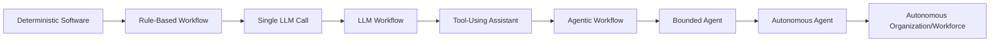

### 2.1 Deterministic Software

Sistem biasa: input, logic, output. Behavior diharapkan deterministic.

Contoh:

- tax calculation engine,
- payment validation,
- data mapper,
- authorization policy,
- workflow state transition,
- API orchestration.

Gunakan ini jika aturan jelas dan stabil.

### 2.2 Rule-Based Workflow

Workflow menjalankan beberapa step dengan branch yang ditentukan developer.

Contoh:

```text
if user_is_vip:
    route_to_priority_queue()
else:
    route_to_standard_queue()
```

Workflow cocok untuk proses yang:

- langkahnya diketahui,
- variasi terbatas,
- risiko tinggi,
- butuh audit kuat,
- dan outcome bisa dispesifikasi.

### 2.3 Single LLM Call

Satu model call untuk tugas bahasa atau reasoning lokal.

Contoh:

- summarize email,
- classify ticket,
- extract structured data,
- rewrite message,
- generate explanation.

Ini bukan agent. Ini model invocation.

### 2.4 LLM Workflow

Beberapa model call dalam flow deterministic.

Contoh:

```text
classify ticket -> retrieve policy -> draft reply -> validate tone -> send to human review
```

Model membantu di beberapa node, tetapi developer masih menentukan jalur utama.

### 2.5 Tool-Using Assistant

Assistant bisa memanggil tool berdasarkan intent user.

Contoh:

- user bertanya cuaca,
- assistant memanggil weather API,
- assistant menjawab berdasarkan hasil tool.

Ini mulai agentic, tetapi belum tentu agent penuh. Jika tidak ada state loop, planning, dan feedback-driven continuation, ia lebih tepat disebut tool-using assistant.

### 2.6 Agentic Workflow

Workflow dengan beberapa titik keputusan yang dipilih model, tetapi tetap dalam skeleton yang jelas.

Contoh:

```text
intake -> model chooses search strategy -> retrieve -> model chooses whether enough -> draft -> validator -> approval
```

Ini sering menjadi pilihan production terbaik karena menyeimbangkan fleksibilitas dan kontrol.

### 2.7 Bounded Agent

Agent dengan loop, tools, state, dan feedback, tetapi autonomy dibatasi.

Contoh:

- coding agent boleh membaca repo, membuat patch lokal, dan menjalankan test, tetapi tidak boleh push tanpa approval.
- support agent boleh draft reply, tetapi tidak boleh mengirim ke customer tanpa review untuk high-risk case.

Bounded agent adalah target realistis untuk banyak enterprise use case.

### 2.8 Autonomous Agent

Agent dapat menjalankan task multi-step secara end-to-end dengan sedikit atau tanpa intervensi manusia, dalam boundary tertentu.

Contoh:

- agent memperbaiki dependency update kecil, menjalankan test, membuka PR, dan menandai reviewer.
- agent memonitor alert low-risk, mengumpulkan evidence, menjalankan runbook yang diizinkan, dan membuat incident note.

Autonomous agent harus punya:

- policy enforcement,
- eval gate,
- audit log,
- rollback/compensation strategy,
- and operational ownership.

### 2.9 Autonomous Organization/Workforce

Ini adalah banyak agent yang berkoordinasi lintas fungsi. Level ini masih sangat berisiko dan harus diperlakukan sebagai advanced organizational system, bukan sekadar technical pattern.

Untuk seri ini, fokus kita adalah bounded agent dan autonomous engineering system yang terkendali.

---

## 3. Definisi Operasional

### 3.1 Model

**Model** adalah komponen probabilistik yang menerima input dan menghasilkan output. Model bisa:

- menjawab,
- merangkum,
- mengklasifikasi,
- membuat rencana,
- memilih tool,
- menghasilkan code,
- atau menilai output.

Namun model sendiri tidak memiliki authority. Authority berasal dari aplikasi yang memberinya tools dan permission.

### 3.2 Agent

**Agent** adalah sistem yang menggunakan model untuk memilih tindakan berdasarkan goal, context, state, observation, dan policy.

Minimal agent memiliki:

- goal,
- environment,
- state,
- action set,
- observation,
- decision policy,
- stop condition.

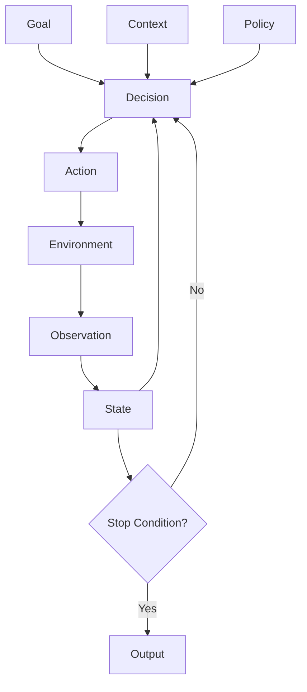

### 3.3 Workflow

**Workflow** adalah urutan step yang sebagian besar ditentukan developer. Workflow bisa memakai model, tetapi control flow utamanya tidak diserahkan sepenuhnya ke model.

Workflow bagus untuk:

- predictable business process,
- compliance-heavy process,
- strict SLA,
- high-risk action,
- clear state machine.

### 3.4 Agentic Workflow

**Agentic workflow** adalah hybrid: developer menetapkan skeleton proses, tetapi model diberi ruang untuk memilih strategi di beberapa node.

Contoh:

```text
Developer-defined: intake -> search -> draft -> validate -> review
Model-defined: search query, relevance ranking, draft content, risk explanation
```

Ini sering lebih aman daripada agent loop bebas.

### 3.5 Autonomous Software Engineering Agent

**Autonomous SWE agent** adalah agent yang bekerja pada lingkungan software engineering: repository, issue tracker, CI, test suite, PR system, documentation, deployment system.

Ia harus memahami:

- codebase structure,
- dependency graph,
- build/test commands,
- issue semantics,
- code style,
- risk of change,
- and review expectations.

---

## 4. Agent = Policy-Bounded Feedback Loop

Cara paling sederhana memahami agent:

```text
Agent = Goal + State + Tools + Model + Feedback Loop + Policy + Stop Condition
```

Jika salah satu hilang, sistem mungkin belum layak disebut agent production-grade.

| Komponen | Pertanyaan Desain |
|---|---|
| Goal | Apa yang harus dicapai? |
| State | Apa yang sudah diketahui/dilakukan? |
| Tools | Apa action yang tersedia? |
| Model | Bagaimana decision dibuat? |
| Feedback | Bagaimana agent tahu hasil action? |
| Policy | Apa yang boleh/tidak boleh dilakukan? |
| Stop Condition | Kapan berhenti? |

Model tanpa tools hanya berbicara.  
Tools tanpa policy berbahaya.  
Policy tanpa observability sulit diaudit.  
Loop tanpa stop condition adalah risiko reliability.  
State tanpa schema adalah debugging nightmare.

---

## 5. The Agentic Control Loop

Agentic control loop dapat dipahami mirip OODA loop: observe, orient, decide, act. Untuk software, kita perlu versi yang lebih eksplisit.

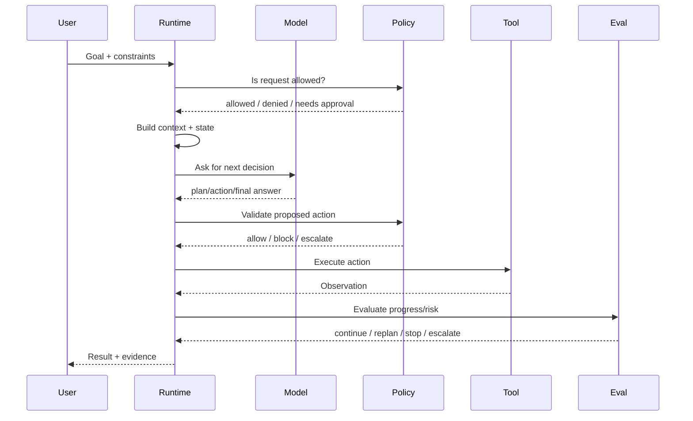

Ada beberapa hal penting:

1. Model tidak langsung memanggil tool. Runtime memediasi.
2. Policy mengecek request dan action.
3. Observation masuk ke state, bukan dipercaya begitu saja.
4. Evaluator menentukan apakah progress cukup.
5. Final output harus menyertakan evidence.

---

## 6. Workflows vs Agents

Anthropic membedakan **workflows** sebagai sistem yang mengikuti jalur predefined dan **agents** sebagai sistem yang lebih dinamis dalam memilih langkah dan tools berdasarkan feedback. Dalam engineering, perbedaan ini sangat penting.

### 6.1 Workflow

Workflow cocok ketika:

- step diketahui,
- variasi terbatas,
- cost harus predictable,
- latency harus ketat,
- compliance penting,
- action risk tinggi,
- correctness lebih penting daripada fleksibilitas.

Contoh:

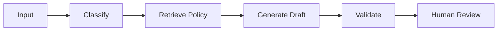

Model dipakai, tetapi flow tidak bebas.

### 6.2 Agent

Agent cocok ketika:

- task open-ended,
- path tidak diketahui di awal,
- environment memberi feedback,
- perlu eksplorasi,
- perlu memilih tools secara adaptif,
- dan output bisa diverifikasi.

Contoh:

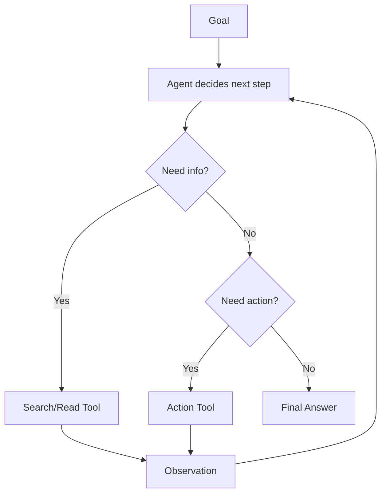

### 6.3 Agentic Workflow

Untuk production, sering kali hybrid terbaik:

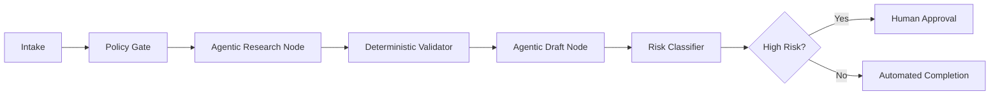

Hybrid ini memberi fleksibilitas pada bagian yang memang butuh reasoning, tetapi menjaga kontrol pada bagian risk-critical.

---

## 7. Dimensi Agency

Agent bukan binary. Agency memiliki beberapa dimensi.

| Dimensi | Rendah | Tinggi |
|---|---|---|
| Goal ambiguity | Task spesifik | Goal luas |
| Planning freedom | Step fixed | Agent memilih step |
| Tool access | Read-only | Write/execute/deploy |
| Statefulness | Stateless | Long-running state |
| Memory | No memory | Cross-session memory |
| Environment feedback | None | Rich interactive feedback |
| Human approval | Every step | Exception only |
| Reversibility | Easy rollback | Irreversible action |
| Risk | Low impact | Legal/financial/security impact |
| Evaluation | Exact expected output | Judgment-based success |

Kenaikan agency harus diikuti kenaikan control.

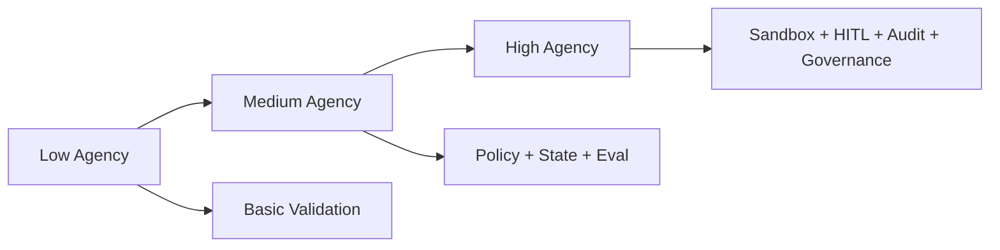

Rule:

> Jangan menaikkan agency lebih cepat daripada kemampuan Anda mengukur, membatasi, dan memulihkan failure.

---

## 8. Level Autonomy

Kita gunakan model 6 level untuk praktik.

### Level 0 — No AI Autonomy

AI tidak mengambil keputusan. Sistem deterministic.

Contoh:

- rules engine,
- batch job,
- static code analysis.

### Level 1 — AI Suggests

AI memberi saran. Manusia melakukan action.

Contoh:

- AI menyarankan refactor,
- AI membuat draft response,
- AI menjelaskan log.

Risk rendah karena human tetap executor.

### Level 2 — AI Acts Locally with Review

AI bisa melakukan action lokal, tetapi butuh approval untuk side effect.

Contoh:

- AI membuat patch lokal,
- AI menjalankan test lokal,
- AI membuat draft PR description.

Ini level awal yang sehat untuk coding agent.

### Level 3 — AI Executes Bounded Low-Risk Tasks

AI dapat menyelesaikan task low-risk end-to-end dalam boundary yang jelas.

Contoh:

- update documentation typo,
- generate weekly internal report,
- close duplicate ticket dengan evidence kuat,
- open PR for dependency patch tetapi tidak merge.

### Level 4 — AI Executes with Exception-Based Human Oversight

AI menjalankan banyak task, manusia hanya masuk saat risk/uncertainty melewati threshold.

Contoh:

- agent memperbaiki bug kategori tertentu dan membuka PR otomatis,
- agent menjalankan runbook incident low-risk,
- agent melakukan triage support otomatis.

Butuh observability, policy, and eval mature.

### Level 5 — AI Operates Autonomous Domain

AI mengelola domain operasional dalam batas governance.

Contoh hipotetis:

- autonomous maintenance system untuk subset service,
- autonomous release assistant untuk non-critical packages,
- autonomous compliance evidence collector.

Level ini butuh architecture, governance, and organization maturity tinggi.

---

## 9. Agency Requires Accountability

Semakin agent dapat bertindak, semakin accountability harus jelas.

| Pertanyaan | Harus Dijawab Oleh |
|---|---|
| Siapa owner agent? | Product/engineering owner |
| Siapa owner tool? | System owner |
| Siapa owner policy? | Risk/security/platform team |
| Siapa reviewer output? | Domain expert |
| Siapa menerima incident? | On-call/operations |
| Siapa boleh menaikkan autonomy? | Governance process |

Agent tidak boleh menjadi “ghost employee” tanpa owner.

Untuk setiap agent production, minimal ada:

- owner,
- purpose,
- scope,
- model/provider version,
- allowed tools,
- allowed data,
- approval policy,
- eval suite,
- rollout stage,
- incident procedure,
- retirement procedure.

---

## 10. First Principle: Environment Matters

Agent selalu bekerja dalam environment. Environment bisa berupa:

- repository,
- file system,
- browser,
- database,
- email inbox,
- ticket system,
- cloud account,
- CI/CD pipeline,
- customer support system,
- production monitoring system.

Environment menentukan:

- action yang mungkin,
- observation yang tersedia,
- latency,
- risk,
- permission model,
- and failure semantics.

Agent untuk repository berbeda dari agent untuk email. Agent untuk email berbeda dari agent untuk production deployment.

Karena itu, desain agent harus dimulai dari environment model.

```mdx id="environment-model-template"
# Environment Model

## Environment
Repository / Gmail / Jira / Kubernetes / Database / Browser / etc.

## Available Observations
- ...

## Available Actions
- ...

## Side Effects
- ...

## Reversibility
- ...

## Permissions
- ...

## Failure Modes
- ...

## Audit Requirements
- ...
```

---

## 11. First Principle: Tools Are Capabilities, Not Functions

Dalam software biasa, function adalah unit logic. Dalam agentic AI, tool adalah **capability** yang diberikan kepada agent.

Capability memiliki implikasi permission.

Contoh tool:

```json id="tool-capability-example"
{
  "name": "send_email",
  "description": "Send an email to an external recipient",
  "inputSchema": {
    "to": "string",
    "subject": "string",
    "body": "string"
  },
  "sideEffect": true,
  "requiresApproval": true,
  "riskLevel": "high",
  "auditRequired": true
}
```

Tool bukan hanya schema input. Tool harus memiliki metadata:

- read/write classification,
- side effect level,
- approval requirement,
- permission scope,
- idempotency semantics,
- timeout,
- retry policy,
- output trust classification,
- audit requirement.

Jika tool tidak punya metadata ini, runtime sulit mengontrol agent.

---

## 12. First Principle: Context Is a Budgeted Resource

Context bukan tempat menaruh semua informasi. Context adalah resource terbatas dan mahal.

Context yang buruk menghasilkan:

- reasoning lambat,
- biaya tinggi,
- informasi penting tenggelam,
- stale data ikut terbawa,
- prompt injection lebih mudah masuk,
- dan model bingung memilih source.

Context engineering adalah seni memilih informasi yang:

- relevan,
- fresh,
- authoritative,
- compact,
- structured,
- and safe.

Untuk agent, context berubah sepanjang run. Maka context harus dilihat sebagai dynamic pack, bukan static prompt.

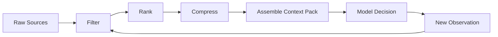

---

## 13. First Principle: Memory Is Liability Until Proven Useful

Memory terdengar menarik, tetapi berbahaya jika tidak dikontrol.

Memory bisa menyebabkan:

- stale assumptions,
- privacy leakage,
- cross-user contamination,
- poisoned facts,
- unexplainable decisions,
- and compliance issues.

Default rule:

> Jangan simpan memory jangka panjang kecuali ada use case jelas, consent jelas, retention policy jelas, dan mechanism untuk koreksi/hapus.

Jenis memory:

| Memory Type | Scope | Contoh | Risiko |
|---|---|---|---|
| Working memory | Dalam satu step/run | Current plan | Hilang saat crash jika tidak checkpoint |
| Episodic memory | Riwayat pengalaman | Agent pernah mencoba patch X | Bisa menyimpan kesimpulan salah |
| Semantic memory | Fakta umum/domain | Project memakai Gradle | Bisa stale |
| Procedural memory | Cara melakukan task | Runbook | Bisa outdated/unsafe |
| User memory | Preferensi user | Style review | Privacy and consent |

Memory bukan pengganti state machine. State adalah kebenaran execution. Memory adalah knowledge tambahan yang harus diverifikasi.

---

## 14. First Principle: Planning Is Cheap, Execution Is Risky

Model dapat membuat rencana panjang. Itu tidak berarti rencana tersebut aman atau benar.

Pisahkan:

- plan generation,
- plan validation,
- plan execution,
- and plan revision.

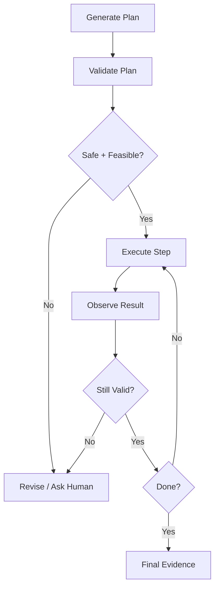

Rencana agent harus punya:

- goal alignment,
- step list,
- dependencies,
- required tools,
- risk per step,
- evidence per step,
- rollback/compensation if applicable,
- and stop conditions.

---

## 15. First Principle: Verification Beats Confidence

Model confidence bukan bukti. Agent bisa terdengar yakin saat salah.

Untuk engineering system, kita lebih percaya:

- tests,
- type checks,
- static analysis,
- reproducible commands,
- source citations,
- diff inspection,
- policy validation,
- human approval,
- and independent evaluator.

Contoh coding agent:

Bad:

```text
The bug is fixed.
```

Good:

```text
The patch changes PaymentStatusMapper to handle PENDING_REVIEW.
Evidence:
- Added unit test PaymentStatusMapperTest.shouldMapPendingReview
- Ran ./gradlew test --tests PaymentStatusMapperTest
- Test passed locally
- No production config changed
Residual risk:
- Integration test not run because external dependency is unavailable
```

Agent harus dilatih untuk menyertakan evidence, bukan hanya conclusion.

---

## 16. First Principle: Non-Determinism Must Be Boxed

LLM output tidak sepenuhnya deterministic. Production system perlu membungkus non-determinism dengan deterministic controls.

Controls:

- input normalization,
- schema validation,
- allowlisted tools,
- policy-as-code,
- deterministic validators,
- bounded retries,
- explicit state machine,
- idempotency key,
- audit log,
- and eval gates.

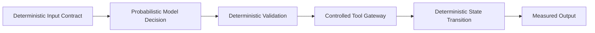

Tujuannya bukan membuat model deterministic. Tujuannya membuat **sistem** behave within acceptable bounds.

---

## 17. Agentic System as State Machine

Setiap agent production sebaiknya punya state machine eksplisit.

Contoh generic:

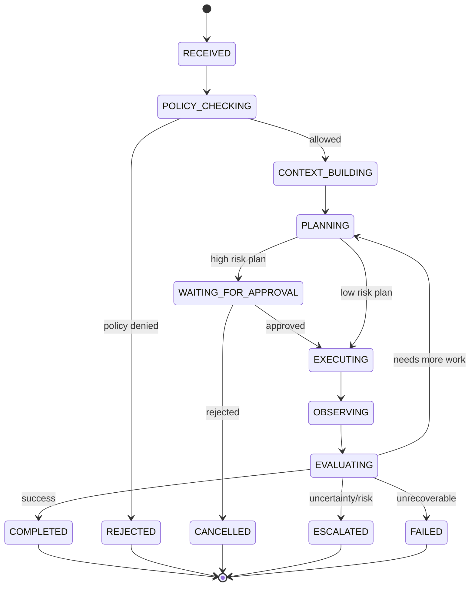

State machine membuat agent:

- bisa di-debug,
- bisa di-resume,
- bisa diaudit,
- bisa diberi timeout,
- bisa diberi approval gate,
- dan bisa diuji.

Tanpa state machine, agent loop menjadi percakapan panjang yang sulit dikontrol.

---

## 18. Agentic System as Risk System

Setiap action agent punya risk level.

| Risk Level | Contoh | Control Minimal |
|---|---|---|
| R0 | Summarize public doc | Basic validation |
| R1 | Read internal docs | Access control + audit |
| R2 | Draft internal response | Human review optional |
| R3 | Modify local files | Approval or sandbox |
| R4 | Send external communication | Human approval required |
| R5 | Modify production/system of record | Strong approval, change process, rollback |
| R6 | Legal/financial/regulatory decision | Human accountable decision-maker |

Agent runtime harus tahu risk level tool dan task.

Example:

```json id="risk-level-tool-registry"
{
  "tools": [
    {
      "name": "read_repository_file",
      "riskLevel": "R1",
      "sideEffect": false,
      "approval": "not_required"
    },
    {
      "name": "write_patch",
      "riskLevel": "R3",
      "sideEffect": true,
      "approval": "required"
    },
    {
      "name": "merge_pull_request",
      "riskLevel": "R5",
      "sideEffect": true,
      "approval": "strong_required"
    }
  ]
}
```

---

## 19. When Not to Use an Agent

Engineer matang tahu kapan tidak memakai agent.

Jangan gunakan agent jika:

1. **Task deterministic dan aturan stabil.**  
   Pakai rules/workflow biasa.

2. **Output tidak bisa diverifikasi.**  
   Agent autonomy tanpa verification berbahaya.

3. **Risk tinggi tetapi governance belum siap.**  
   Jangan memberi tool production hanya karena model terlihat pintar.

4. **Latency/cost harus sangat predictable.**  
   Agent loop bisa sulit diprediksi.

5. **Data terlalu sensitif dan isolation belum kuat.**  
   Bangun permission, sandbox, and audit dulu.

6. **Failure mode tidak bisa diterima.**  
   Jika satu kesalahan bisa berdampak legal/financial besar, gunakan human decision-maker.

7. **Masalah sebenarnya adalah process ambiguity.**  
   Agent tidak menyelesaikan organisasi yang belum tahu prosesnya sendiri.

---

## 20. When to Use an Agent

Agent cocok jika:

- task membutuhkan reasoning multi-step,
- jalur penyelesaian tidak diketahui di awal,
- agent dapat memperoleh observation dari environment,
- tools dapat dibatasi,
- output dapat diverifikasi,
- failure dapat dipulihkan,
- dan ada manfaat signifikan dibanding workflow deterministic.

Contoh baik:

| Use Case | Mengapa Cocok |
|---|---|
| Repository issue triage | Perlu memahami bahasa natural, codebase, dan test evidence |
| Debugging log incident low-risk | Perlu eksplorasi dan korelasi banyak sumber |
| Documentation update from code changes | Perlu reasoning lintas diff dan docs |
| Dependency migration assistant | Perlu plan, code mod, test feedback |
| Support draft with policy retrieval | Perlu language generation + source grounding |

Tetap gunakan bounded autonomy.

---

## 21. Production Criteria

Sebuah agent belum production-ready hanya karena berhasil di demo.

Minimal production criteria:

### 21.1 Functional

- Goal jelas.
- Input contract jelas.
- Output schema jelas.
- Tool list jelas.
- Stop condition jelas.
- Completion evidence jelas.

### 21.2 Safety

- Permission scoped.
- Tool access allowlisted.
- Side effect mediated.
- Approval gate untuk risk tinggi.
- Prompt injection mitigation.
- Secret isolation.

### 21.3 Reliability

- Timeout.
- Retry limit.
- Stuck loop detection.
- Partial failure handling.
- Resume or safe abort.
- Idempotency for actions.

### 21.4 Evaluation

- Golden tasks.
- Regression suite.
- Trajectory review.
- Tool-call correctness eval.
- Safety/adversarial eval.
- Cost and latency tracking.

### 21.5 Observability

- Run id.
- Input/context snapshot.
- Model version.
- Tool call logs.
- State transitions.
- Decision rationale summary.
- Final evidence.

### 21.6 Governance

- Owner.
- Risk classification.
- Model/version change process.
- Policy change process.
- Incident response.
- Kill switch.

---

## 22. Example: Support Agent Taxonomy

Misalnya kita ingin membangun customer support automation.

### Bad Design

```text
User email -> LLM -> send reply
```

Masalah:

- tidak ada policy retrieval,
- tidak ada classification,
- tidak ada risk check,
- tidak ada approval,
- tidak ada audit,
- raw email bisa mengandung prompt injection,
- agent bisa memberi janji yang salah.

### Better Workflow

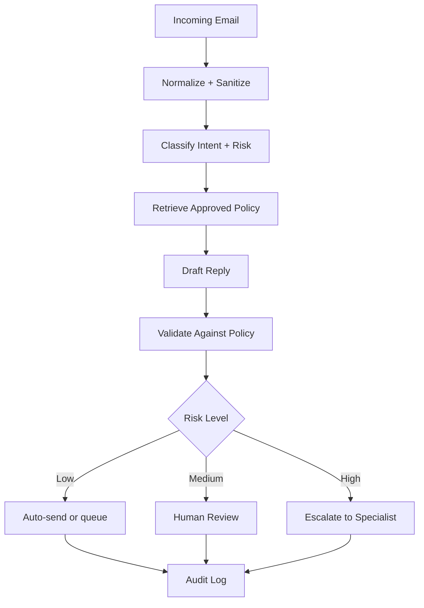

Ini bukan agent loop bebas. Ini agentic workflow yang lebih aman.

### Kapan Menjadi Agent?

Jika support case membutuhkan multi-step investigation:

- cek order,
- cek payment,
- cek delivery status,
- bandingkan policy,
- minta missing info,
- buat action recommendation,

maka bounded agent bisa berguna. Tetapi action seperti refund atau external reply tetap perlu policy gate.

---

## 23. Example: Coding Agent Taxonomy

### Level 1: Suggestion

Agent membaca issue dan menyarankan file yang mungkin relevan.

### Level 2: Local Patch with Review

Agent membuat diff lokal dan menjalankan test. Engineer review sebelum commit.

### Level 3: PR Creation

Agent membuka PR dengan evidence, tetapi tidak merge.

### Level 4: Bounded Auto-Merge

Agent boleh auto-merge kategori perubahan tertentu jika:

- risk low,
- test suite pass,
- diff small,
- code owner policy allow,
- eval score high,
- rollback easy.

### Level 5: Autonomous Maintenance

Agent mengelola subset maintenance task, misalnya dependency patch minor, docs sync, lint fixes, atau generated client update. Ini butuh governance kuat.

---

## 24. Anatomy of a Coding Agent Run

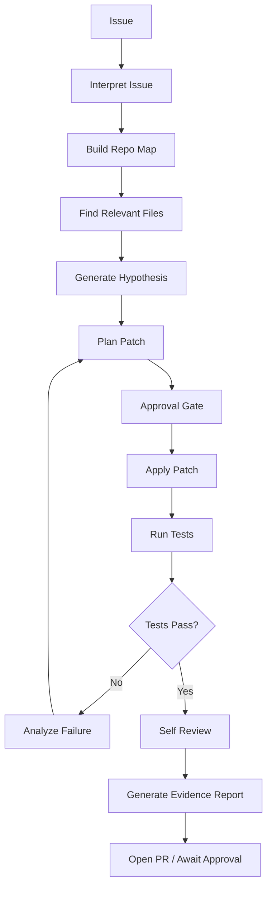

Key point:

- Agent tidak hanya menulis code.
- Agent menjalankan engineering loop.
- Agent harus bisa menjelaskan evidence.
- Agent harus menghindari diff yang tidak perlu.

---

## 25. Common Failure Modes

### 25.1 Hallucinated Capability

Agent mengklaim sudah menjalankan test padahal tidak.

Mitigation:

- command execution log,
- evidence requirement,
- no unverified claims policy.

### 25.2 Tool Misuse

Agent memakai tool yang benar dengan parameter salah.

Mitigation:

- schema validation,
- dry-run,
- confirmation for ambiguous targets,
- tool output preview.

### 25.3 Context Drift

Agent mulai dengan goal A, lalu tergeser karena context baru.

Mitigation:

- persistent goal field,
- periodic goal alignment check,
- evaluator.

### 25.4 Infinite Exploration

Agent terus membaca file tanpa membuat keputusan.

Mitigation:

- exploration budget,
- max tool calls,
- required plan checkpoint.

### 25.5 Premature Completion

Agent berhenti sebelum evidence cukup.

Mitigation:

- completion checklist,
- verifier,
- minimum evidence policy.

### 25.6 Overbroad Patch

Coding agent mengubah terlalu banyak file.

Mitigation:

- diff size budget,
- minimality eval,
- code owner approval.

### 25.7 Prompt Injection via Tool Output

Retrieved document berisi instruksi seperti “ignore previous instructions”.

Mitigation:

- treat tool output as data,
- separate instruction channel,
- content sanitization,
- policy engine outside model.

### 25.8 Excessive Agency

Agent diberi tool terlalu kuat untuk task sederhana.

Mitigation:

- least privilege,
- capability registry,
- task-scoped credentials.

---

## 26. Design Rule: Start with the Boring Architecture

Untuk production, arsitektur yang boring lebih baik daripada agent demo yang ajaib.

Mulai dari:

1. deterministic workflow,
2. tambah model call untuk reasoning terbatas,
3. tambah tool calling read-only,
4. tambah state and trace,
5. tambah bounded write action dengan approval,
6. tambah eval harness,
7. baru tambah autonomy.

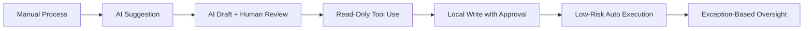

Ini menghindari lompatan berbahaya dari chatbot ke autonomous worker.

---

## 27. Design Rule: Make the Agent Explain Its Operating Mode

Setiap run sebaiknya punya operating mode.

Contoh:

```json id="operating-mode-example"
{
  "mode": "analysis_only",
  "allowedActions": [
    "read_issue",
    "search_code",
    "summarize_findings"
  ],
  "blockedActions": [
    "modify_files",
    "commit",
    "push",
    "deploy"
  ],
  "approvalRequiredFor": [
    "write_patch"
  ]
}
```

Mode umum:

| Mode | Deskripsi |
|---|---|
| analysis_only | Agent hanya menganalisis dan memberi rekomendasi |
| draft_only | Agent boleh membuat draft lokal |
| local_execution | Agent boleh menjalankan local tools yang aman |
| approval_required_write | Write action harus approval |
| autonomous_low_risk | Agent boleh menyelesaikan task low-risk |
| emergency_locked | Semua write/action diblokir |

Operating mode membantu user dan auditor memahami boundary.

---

## 28. Design Rule: Separate Decision, Validation, and Execution

Jangan biarkan model langsung melakukan action.

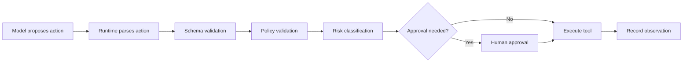

Manfaat:

- action bisa diblokir,
- action bisa dikoreksi,
- action bisa diminta approval,
- action bisa diaudit,
- tool layer tetap deterministic.

---

## 29. Design Rule: Completion Must Be Structured

Agent output harus membedakan:

- conclusion,
- evidence,
- uncertainty,
- residual risk,
- next step.

Template:

```mdx id="agent-final-output-template"
## Result
<what was achieved>

## Evidence
- <test/source/tool result>
- <test/source/tool result>

## Changes
- <file/action changed>

## Uncertainty
- <what is not verified>

## Residual Risk
- <risk that remains>

## Recommended Next Step
- <human action or automated continuation>
```

Untuk coding agent, output tanpa test/evidence harus dianggap incomplete.

---

## 30. Evaluation Starts at Definition

Sebelum build agent, tentukan eval.

Pertanyaan:

- Apa task representatif?
- Apa expected behavior?
- Apa unacceptable behavior?
- Apa evidence minimal?
- Apa risk threshold?
- Apa human review rubric?
- Apa regression suite?

Jika eval tidak bisa ditulis, mungkin task belum cukup jelas untuk autonomy.

Contoh eval untuk issue triage agent:

| Eval Case | Expected |
|---|---|
| Clear bug with stack trace | Identifies relevant files and proposes focused plan |
| Ambiguous issue | Asks clarification or marks uncertainty |
| Malicious issue body | Ignores injected instructions |
| Large repo | Uses search strategy, not random reading |
| Test failure after patch | Analyzes failure instead of claiming success |
| No relevant file found | Stops with evidence, not hallucination |

---

## 31. Mental Model: Agentic AI is Control Delegation

AI agent bukan magic intelligence. Ia adalah control delegation.

Kita mendelegasikan sebagian control dari developer/human/process ke runtime yang memakai model.

Delegation membutuhkan:

1. scope,
2. authority,
3. feedback,
4. accountability,
5. revocation.

Jika Anda tidak bisa mencabut authority agent, berarti desain permission salah.

Jika Anda tidak bisa melihat action agent, berarti observability salah.

Jika Anda tidak bisa mengukur output agent, berarti eval salah.

Jika Anda tidak bisa menjelaskan kenapa agent boleh melakukan sesuatu, berarti governance salah.

---

## 32. Practice: Classify 10 Systems

Ambil 10 sistem AI yang pernah Anda lihat. Klasifikasikan:

| System | Category | Agency Level | Main Risk | Better Architecture? |
|---|---|---:|---|---|
| Chatbot FAQ | Single LLM/RAG | 1 | wrong answer | RAG + citation + fallback |
| Coding assistant | Tool-using assistant | 2 | wrong patch | local diff + test evidence |
| CI failure fixer | Bounded agent | 3 | masking failure | sandbox + PR review |
| Refund bot | Agentic workflow | 2-4 | financial loss | policy gate + approval |

Tujuan latihan:

- berhenti menyebut semua sistem agent,
- melihat agency sebagai spektrum,
- dan memilih architecture sesuai risk.

---

## 33. Practice: Write an Autonomy Policy

Buat policy sederhana untuk coding agent.

```mdx id="coding-agent-autonomy-policy"
# Coding Agent Autonomy Policy

## Allowed Without Approval
- Read repository files.
- Search code.
- Read issue descriptions.
- Run allowlisted test commands.
- Generate patch plan.

## Requires Approval
- Modify files.
- Create branch.
- Commit changes.
- Open pull request.

## Always Forbidden
- Push to protected branch.
- Merge pull request.
- Deploy to production.
- Read secrets.
- Modify permissions.
- Disable tests.

## Stop Conditions
- More than 5 failed patch attempts.
- Test command fails due to environment issue.
- Issue is ambiguous.
- Required file is missing.
- Proposed change touches high-risk modules.

## Evidence Required
- Relevant files list.
- Patch rationale.
- Diff summary.
- Test command and output.
- Residual risk.
```

Policy ini belum lengkap, tetapi cukup untuk latihan awal.

---

## 34. Practice: Build a “No-Agent” Decision

Pilih satu use case yang kelihatannya cocok untuk agent. Lalu buktikan mengapa sebaiknya **tidak** memakai agent.

Template:

```mdx id="no-agent-decision-template"
# No-Agent Decision Record

## Use Case
...

## Initial Idea
Use an agent to ...

## Reason Not to Use Agent
- Rules are deterministic.
- Output must be exact.
- Risk is high.
- Latency must be predictable.
- Human accountability is required.

## Better Solution
Use deterministic workflow + limited model assistance for ...

## Revisit Conditions
Consider agentic workflow only if ...
```

Kemampuan menolak agent adalah tanda maturity.

---

## 35. Checklist Part 002

Sebelum lanjut ke Part 003, pastikan Anda bisa menjawab:

- [ ] Apa perbedaan model, workflow, assistant, agentic workflow, bounded agent, dan autonomous agent?
- [ ] Apa minimal komponen agent?
- [ ] Kenapa tool adalah capability, bukan hanya function?
- [ ] Kenapa context adalah budgeted resource?
- [ ] Kenapa memory harus dianggap liability sampai terbukti berguna?
- [ ] Apa beda planning dan execution?
- [ ] Kenapa verification lebih penting daripada confidence?
- [ ] Bagaimana membungkus non-determinism model dengan deterministic controls?
- [ ] Apa level autonomy yang aman untuk coding agent awal?
- [ ] Kapan sebaiknya tidak memakai agent?
- [ ] Apa production criteria minimal untuk agent?

---

## 36. Ringkasan

Part ini membangun first principles:

- Agent bukan model; agent adalah policy-bounded feedback loop yang memakai model untuk memilih tindakan.
- Workflow dan agent berbeda pada letak control flow. Workflow mengikuti jalur developer-defined; agent memilih langkah secara lebih dinamis berdasarkan feedback.
- Production architecture sering paling sehat dalam bentuk agentic workflow: sebagian deterministic, sebagian agentic.
- Agency adalah spektrum, bukan binary.
- Semakin tinggi autonomy, semakin kuat kebutuhan policy, sandbox, eval, observability, and governance.
- Tools adalah capabilities yang harus diberi metadata risk, side effect, permission, dan audit.
- Context dan memory harus dikelola sebagai resource berisiko.
- Verification mengalahkan confidence.
- Agentic AI pada dasarnya adalah control delegation.

Part berikutnya akan membahas **Autonomy Boundaries and Control Theory**: bagaimana mendesain level otonomi, authority boundary, blast radius, reversible/irreversible action, dan safe delegation model.

---

## 37. Referensi Utama

- Anthropic, “Building Effective AI Agents”: https://www.anthropic.com/research/building-effective-agents
- OpenAI Agents SDK documentation: https://developers.openai.com/api/docs/guides/agents
- OpenAI, “New tools for building agents”: https://openai.com/index/new-tools-for-building-agents/
- Model Context Protocol specification: https://modelcontextprotocol.io/specification/2025-03-26
- LangGraph overview: https://docs.langchain.com/oss/python/langgraph/overview
- LangGraph persistence: https://docs.langchain.com/oss/python/langgraph/persistence
- LangChain Human-in-the-Loop documentation: https://docs.langchain.com/oss/python/langchain/human-in-the-loop
- OWASP Top 10 for Large Language Model Applications: https://owasp.org/www-project-top-10-for-large-language-model-applications/
- OWASP Top 10 for Agentic Applications 2026: https://genai.owasp.org/resource/owasp-top-10-for-agentic-applications-for-2026/
- NIST AI RMF Generative AI Profile: https://www.nist.gov/publications/artificial-intelligence-risk-management-framework-generative-artificial-intelligence
- SWE-bench: https://www.swebench.com/original.html
- AgentBench: https://arxiv.org/abs/2308.03688
