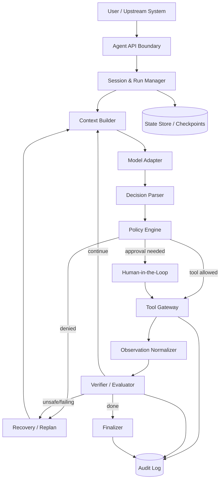
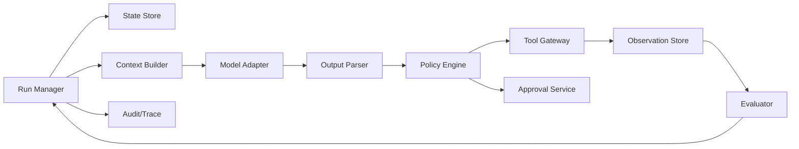
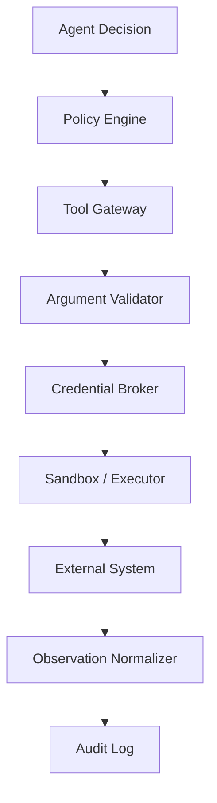
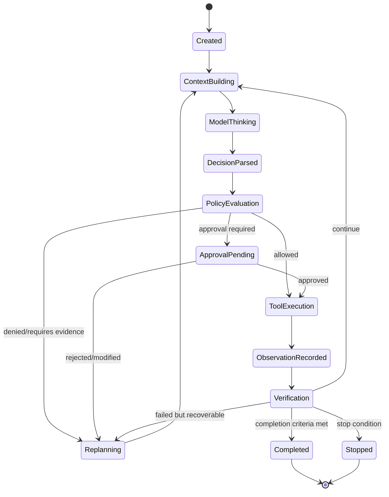
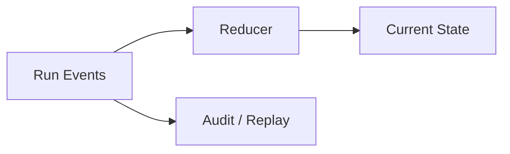
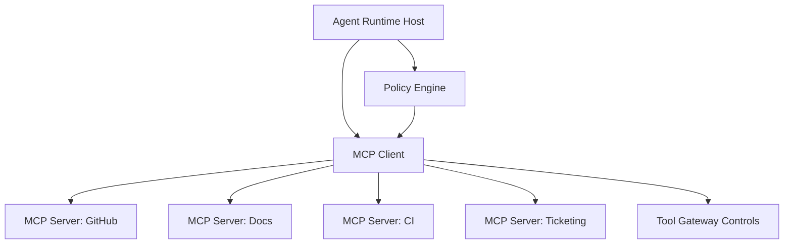
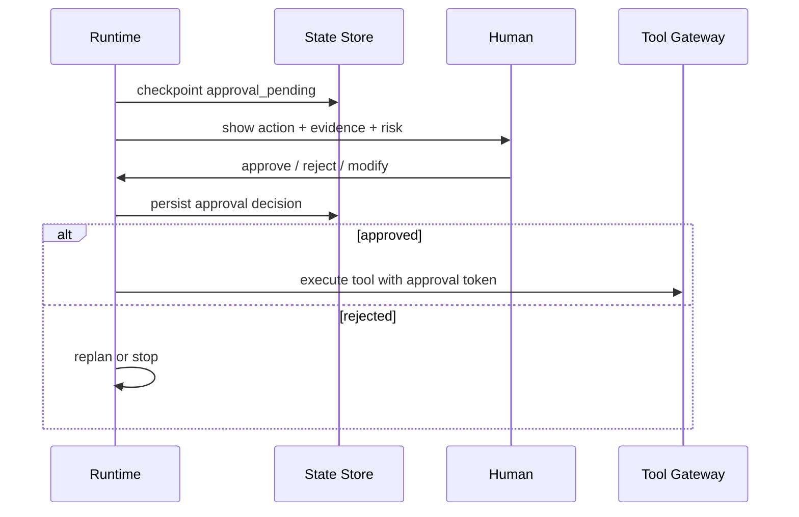
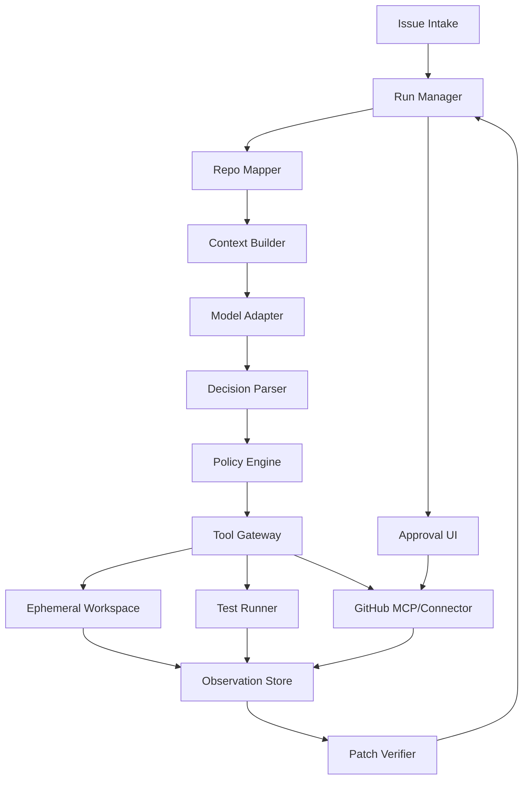

------
title: Learn Advanced Agentic AI Engineering & Autonomous Software Engineering - Part 004
description: Runtime architecture for production agentic systems: model adapter, planner, executor, tool gateway, policy engine, memory, state, persistence, evaluator, human-in-the-loop, and observability.
series: learn-agentic-ai-engineering
seriesTitle: Learn Advanced Agentic AI Engineering & Autonomous Software Engineering
order: 4
partTitle: Agent Runtime Architecture
tags:
- agentic-ai
- runtime-architecture
- orchestration
- tool-calling
- state-machine
- series
date: 2026-06-29
---

# Part 004 — Agent Runtime Architecture

> Target skill: mampu mendesain agent runtime sebagai sistem terkontrol, durable, observable, policy-aware, dan aman untuk tool execution — bukan sekadar loop `while not done: call_llm()`.

Pada level demo, agent runtime tampak sederhana:

```text
user input -> LLM -> tool call -> tool result -> LLM -> final answer
```

Pada level produksi, desain itu tidak cukup. Runtime agent harus menjawab pertanyaan engineering yang lebih keras:

- Di mana state disimpan?
- Bagaimana run dilanjutkan setelah crash?
- Siapa yang memvalidasi tool arguments?
- Siapa yang memutuskan tool call butuh approval?
- Bagaimana mencegah tool call keluar scope?
- Bagaimana audit trail direkonstruksi?
- Bagaimana agent berhenti saat looping?
- Bagaimana memory ditulis, diverifikasi, dan dibatasi?
- Bagaimana evaluator membedakan “selesai” dari “terlihat selesai”?
- Bagaimana human bisa inspect, modify, approve, reject, dan resume?

Part ini membangun arsitektur runtime yang menjawab pertanyaan tersebut.

## 1. Core Mental Model

Agent runtime adalah **control shell** di sekitar **stochastic reasoner**.



LLM boleh melakukan reasoning, planning, and tool selection. Tetapi runtime harus mengendalikan:

1. **input contract**;
2. **state transition**;
3. **context construction**;
4. **tool permissions**;
5. **side effects**;
6. **human approval**;
7. **verification**;
8. **termination**;
9. **audit and replay**.

Anthropic menekankan bahwa implementasi agent yang sukses sering memakai pola sederhana dan komposable, bukan framework kompleks. OpenAI Agents SDK mendeskripsikan agent sebagai LLM yang dikonfigurasi dengan instructions, tools, dan perilaku runtime opsional seperti handoffs, guardrails, structured outputs, sessions, dan managed turns. LangGraph memosisikan dirinya sebagai runtime orchestration untuk long-running stateful agents dengan durable execution, persistence, streaming, and human-in-the-loop. Tiga pandangan ini mengarah pada prinsip yang sama: runtime harus eksplisit tentang orchestration, state, tools, and control.

## 2. Runtime Is Not Framework

Framework membantu, tetapi runtime architecture adalah keputusan sistem.

| Concern | Bisa dibantu framework? | Tetap tanggung jawab engineer? |
|---|---:|---:|
| Tool calling | ✅ | Tool risk model, idempotency, permissions |
| State graph | ✅ | State schema, invariants, persistence strategy |
| Memory | ✅ | Trust, retention, poisoning defense |
| Human approval | ✅ | Approval policy, evidence package, accountability |
| Tracing | ✅ | Signal quality, alerting, incident reconstruction |
| Guardrails | ✅ | Threat model, policy, fallback, red-team cases |
| Evals | ✅ | Dataset, scoring, regression gates |
| Deployment | partly | Runtime isolation, credentials, tenancy, compliance |

Jangan memilih framework sebelum tahu runtime contract. Framework dipilih untuk mengeksekusi desain, bukan mengganti desain.

## 3. The Minimal Production Runtime

Minimum production runtime untuk agent tool-using harus memiliki komponen berikut.



### 3.1 Run Manager

Run Manager adalah pemilik lifecycle.

Tanggung jawab:

- membuat `run_id`;
- mengikat run ke `tenant_id`, `user_id`, `agent_id`, dan `policy_version`;
- menjaga step count, timeout, budget, dan status;
- memanggil model/tool/evaluator dalam urutan yang valid;
- menyimpan checkpoint;
- memutuskan resume, stop, fail, atau complete.

State minimal:

```json
{
  "run_id": "run_01",
  "agent_id": "repo_patch_agent",
  "tenant_id": "tenant_a",
  "user_id": "user_123",
  "status": "running",
  "mode": "supervised_execution",
  "step": 7,
  "max_steps": 30,
  "started_at": "2026-06-29T10:00:00Z",
  "policy_version": "agent-policy-v4",
  "checkpoint_id": "cp_007"
}
```

### 3.2 State Store

Agent state tidak boleh hanya tersimpan di prompt conversation. Prompt adalah view; state store adalah source of truth.

State store menyimpan:

- user goal;
- task status;
- plan;
- tool observations;
- intermediate artifacts;
- approval status;
- memory references;
- error history;
- evaluator results;
- final output.

State harus versioned. Setiap transition harus bisa diaudit.

```json
{
  "state_version": 12,
  "phase": "verifying_patch",
  "goal": "Fix issue #812: null status causes invoice export failure",
  "plan": [
    {"id": "p1", "status": "done", "task": "Inspect failing path"},
    {"id": "p2", "status": "done", "task": "Patch null handling"},
    {"id": "p3", "status": "running", "task": "Run targeted tests"}
  ],
  "artifacts": ["patch.diff", "test-output.txt"],
  "open_questions": [],
  "risk_flags": ["billing-domain"],
  "next_allowed_actions": ["run_tests", "summarize_patch", "request_pr_approval"]
}
```

### 3.3 Context Builder

Context Builder mengubah state menjadi prompt/context yang tepat untuk model.

Ia harus:

- memilih informasi relevan;
- memasukkan policy ringkas;
- memasukkan tool affordances;
- membatasi token;
- menghapus data sensitif;
- menandai source dan trust level;
- menghindari stale context;
- memasukkan acceptance criteria.

Context Builder bukan string concatenation. Ia adalah subsystem.

Bad:

```text
prompt = system + history + all_docs + all_tool_results
```

Better:

```text
context = build_context(
  goal=current_goal,
  state=current_state_summary,
  relevant_observations=ranked_observations,
  allowed_tools=policy.allowed_tools(state),
  forbidden_actions=policy.forbidden_actions(state),
  acceptance_criteria=task.acceptance_criteria,
  unresolved_risks=state.risk_flags,
  output_schema=next_step_schema
)
```

### 3.4 Model Adapter

Model Adapter menyembunyikan detail provider.

Tanggung jawab:

- normalize request/response;
- choose model based on task;
- enforce structured output;
- handle rate limits;
- map tool specs;
- manage streaming;
- attach trace metadata;
- implement fallback policy.

Runtime tidak boleh bergantung pada format internal satu provider. Bahkan jika hanya memakai satu provider, adapter tetap penting agar policy, telemetry, and tests tidak tersebar.

### 3.5 Decision Parser

Model output harus diparsing menjadi decision object.

```json
{
  "type": "tool_call",
  "tool": "run_tests",
  "arguments": {
    "command": "./gradlew test --tests InvoiceExportTest"
  },
  "reason": "Need to verify null status handling",
  "expected_observation": "Targeted test passes or exposes remaining failure",
  "risk": "low"
}
```

Decision Parser harus menolak output ambigu:

- tool tidak dikenal;
- argument tidak valid;
- multiple incompatible actions;
- missing rationale;
- action di luar phase;
- final answer tanpa evidence.

### 3.6 Policy Engine

Policy Engine adalah boundary keras.

Input:

- actor identity;
- agent identity;
- tenant;
- tool/action;
- arguments;
- state;
- evidence;
- environment;
- risk class;
- policy version.

Output:

```json
{
  "decision": "allow | deny | require_approval | require_more_evidence",
  "reason": "...",
  "constraints": {},
  "audit_level": "minimal | full",
  "approval_request": {}
}
```

Policy Engine tidak bertanya “apakah model ingin melakukan ini?”. Ia bertanya:

> Berdasarkan state saat ini, actor ini, tool ini, argument ini, environment ini, dan policy ini, apakah action ini sah?

### 3.7 Tool Gateway

Tool Gateway adalah satu-satunya jalur ke side effect.

Tanggung jawab:

- validate arguments;
- enforce capability scopes;
- redact secrets;
- inject credentials with least privilege;
- enforce rate limits;
- enforce idempotency keys;
- execute in sandbox if needed;
- normalize errors;
- record audit;
- attach provenance.

Jangan biarkan model memanggil tool langsung dari application code yang tersebar.



### 3.8 Observation Normalizer

Tool result harus diubah menjadi observation yang aman dan terstruktur.

Bad observation:

```text
Command failed.
```

Better:

```json
{
  "tool": "run_tests",
  "status": "failed",
  "exit_code": 1,
  "duration_ms": 18420,
  "summary": "InvoiceExportTest.testNullStatus failed",
  "important_output": "Expected UNKNOWN but got NullPointerException at InvoiceMapper.java:88",
  "artifacts": ["test-report.xml"],
  "sensitive_data_redacted": true,
  "retryable": false
}
```

Observation adalah sensor. Sensor buruk membuat controller buruk.

### 3.9 Verifier / Evaluator

Verifier menjawab: apakah hasil saat ini valid?

Jenis verifier:

| Verifier | Example |
|---|---|
| Schema verifier | Output sesuai JSON schema |
| Tool-result verifier | Command exit code, API status |
| Test verifier | Unit/integration/property tests |
| Policy verifier | Tidak melanggar scope/security |
| Grounding verifier | Klaim didukung source |
| Diff verifier | Patch minimal dan relevan |
| Human verifier | Reviewer approve/reject |
| Regression evaluator | Evals tidak turun |

Verifier harus mampu menghasilkan signal:

```json
{
  "verdict": "continue | complete | replan | stop | escalate",
  "confidence": "high",
  "missing_evidence": [],
  "failure_reason": null,
  "next_hint": "Prepare PR approval package"
}
```

### 3.10 Finalizer

Finalizer tidak hanya mengirim jawaban akhir. Ia memastikan run selesai secara benar.

Tanggung jawab:

- validate completion criteria;
- attach evidence;
- summarize actions;
- expose unresolved risk;
- close resources;
- update state;
- optionally write memory;
- emit audit event;
- produce user-facing output.

Final answer tanpa completion validation adalah common source of hallucinated success.

## 4. The Runtime Loop

Runtime loop production-grade:

```text
initialize run
load state
while not terminal:
    build context
    call model
    parse decision
    evaluate policy
    if approval needed:
        pause and persist
    if tool allowed:
        execute through gateway
        normalize observation
    verify progress
    update state
    checkpoint
    check stop conditions
finalize
```

Pseudo-code:

```ts
async function runAgent(runId: string): Promise<RunResult> {
  let state = await stateStore.load(runId);

  while (!isTerminal(state)) {
    assertWithinBudget(state);
    assertWithinStepLimit(state);

    const context = await contextBuilder.build(state);
    const rawDecision = await modelAdapter.generate(context);
    const decision = decisionParser.parse(rawDecision);

    const policyDecision = await policyEngine.evaluate({
      actor: state.actor,
      agent: state.agent,
      action: decision,
      state,
      environment: state.environment
    });

    if (policyDecision.decision === "deny") {
      state = reducer.applyDeniedAction(state, decision, policyDecision);
      await stateStore.checkpoint(state);
      continue;
    }

    if (policyDecision.decision === "require_approval") {
      state = reducer.applyPendingApproval(state, decision, policyDecision);
      await stateStore.checkpoint(state);
      return { status: "paused", reason: "approval_required" };
    }

    const observation = await toolGateway.execute(decision, policyDecision.constraints);
    state = reducer.applyObservation(state, decision, observation);

    const verdict = await verifier.evaluate(state);
    state = reducer.applyVerdict(state, verdict);

    await stateStore.checkpoint(state);
  }

  return finalizer.finalize(state);
}
```

## 5. State Machine Architecture

Agent runtime should be explicit state machine.



Explicit state machine memberi manfaat:

- easier debugging;
- safe pause/resume;
- deterministic policy checks;
- clearer audit;
- bounded retries;
- better testing;
- less prompt spaghetti.

## 6. Deterministic Shell, Stochastic Core

Best practice: let model reason, but keep system transitions deterministic.

| Layer | Deterministic or stochastic? | Notes |
|---|---|---|
| User/API validation | Deterministic | Reject invalid requests early |
| Context selection | Mostly deterministic | Ranking can be model-assisted, but policy deterministic |
| Planning | Stochastic | Model can propose plan |
| Policy decision | Deterministic/rule-based | Do not let model decide its own permission |
| Tool execution | Deterministic | Tool should be typed and controlled |
| Verification | Mixed | Tests deterministic; judge can assist but not alone for high risk |
| State transition | Deterministic | Reducers should be testable |
| Audit | Deterministic | Complete immutable log |

Invariant:

> The model may propose a transition. The runtime owns the transition.

## 7. State Reducer Pattern

Agent state should be updated by reducer functions, not arbitrary mutation by model output.

```ts
type AgentState = {
  phase: Phase;
  step: number;
  plan: PlanItem[];
  observations: Observation[];
  approvals: Approval[];
  riskFlags: string[];
  terminalReason?: string;
};

function applyObservation(
  state: AgentState,
  decision: Decision,
  observation: Observation
): AgentState {
  return {
    ...state,
    step: state.step + 1,
    observations: [...state.observations, observation],
    phase: nextPhaseFromObservation(state.phase, observation),
    riskFlags: updateRiskFlags(state.riskFlags, observation)
  };
}
```

Keuntungan:

- unit-testable;
- deterministic replay;
- prevents model from forging state;
- makes invariants enforceable.

## 8. Event Log vs Current State

Gunakan dua representasi:

1. **Event log**: immutable history.
2. **Current state**: materialized view untuk runtime.



Example events:

```json
{"type":"RUN_CREATED","run_id":"run_01","time":"..."}
{"type":"MODEL_DECISION_PARSED","decision_id":"d_04","tool":"run_tests"}
{"type":"POLICY_ALLOWED","decision_id":"d_04","policy_version":"v4"}
{"type":"TOOL_EXECUTED","tool":"run_tests","status":"failed"}
{"type":"VERIFIER_REPLAN","reason":"test_failed"}
```

Current state dapat direbuild dari event log. Ini sangat berguna untuk compliance, debugging, and incident analysis.

## 9. Tool Gateway Design in Detail

Tool Gateway harus mengubah tools dari “function exposed to LLM” menjadi “controlled capability”.

Tool descriptor production-grade:

```json
{
  "name": "github_create_pr",
  "description": "Create a pull request from an existing branch to a target branch.",
  "input_schema": {
    "type": "object",
    "required": ["repo", "source_branch", "target_branch", "title", "body"],
    "properties": {
      "repo": {"type": "string"},
      "source_branch": {"type": "string"},
      "target_branch": {"type": "string"},
      "title": {"type": "string"},
      "body": {"type": "string"}
    }
  },
  "risk": {
    "side_effect": "external_write",
    "reversibility": "partial",
    "data_sensitivity": "source_code",
    "requires_approval": true
  },
  "constraints": {
    "forbidden_target_branches": ["main", "release/*"],
    "max_body_chars": 12000,
    "allowed_repos_policy": "repo_scope_from_run"
  },
  "idempotency": {
    "supported": true,
    "key_fields": ["repo", "source_branch", "target_branch"]
  }
}
```

Tool Gateway flow:

```text
receive decision
validate schema
classify risk
check policy
check approval token if required
bind scoped credentials
execute with timeout
normalize observation
redact output
emit audit event
return observation
```

## 10. MCP in Runtime Architecture

Model Context Protocol standardizes how LLM applications connect to external data sources and tools. The MCP specification describes hosts, clients, and servers: hosts are LLM applications, clients are connectors within the host, and servers provide context and capabilities. MCP also defines capabilities for sharing contextual information, exposing tools, and building composable integrations.

In runtime architecture, MCP is not “the whole agent”. MCP is an integration layer.



Key point:

> MCP standardizes access, but your runtime still owns authorization, policy, audit, state, and approval.

Never assume that because a tool is exposed via MCP, it is safe. MCP tool descriptions can be incomplete or misleading. Treat every tool as an untrusted capability until classified.

## 11. Human-in-the-Loop Runtime

Human-in-the-loop is not just asking a user in chat. Runtime HITL requires:

- pause execution;
- persist state;
- display evidence;
- allow approve/reject/edit;
- resume with same checkpoint;
- record decision;
- prevent replay of stale approval.



Approval token should be scoped:

```json
{
  "approval_id": "appr_123",
  "approved_by": "maintainer@example.com",
  "approved_action": "github_create_pr",
  "approved_args_hash": "sha256:...",
  "expires_at": "2026-06-29T12:15:00Z",
  "single_use": true
}
```

If arguments change after approval, approval is invalid.

## 12. Memory Architecture Hook Points

Memory is covered deeply in Part 010, but runtime must reserve hook points now.

Memory operations:

| Operation | Runtime control |
|---|---|
| Read memory | scoped by tenant/user/task/trust |
| Propose memory write | model may propose |
| Validate memory write | policy/classifier/verifier decides |
| Commit memory | memory service writes with provenance |
| Expire memory | retention policy |
| Use memory in context | context builder includes trust labels |

Runtime invariant:

> Model output can propose memory. It should not directly mutate durable memory.

Memory write proposal:

```json
{
  "type": "memory_write_proposal",
  "memory_kind": "user_preference",
  "content": "User prefers PR summaries with risk notes first.",
  "source_event_id": "evt_044",
  "confidence": "medium",
  "ttl": "180d"
}
```

## 13. Observability Architecture

Agent runtime telemetry harus menjawab:

- Apa goal run ini?
- Context apa yang dipakai?
- Model apa yang dipanggil?
- Tool apa yang diminta?
- Tool apa yang benar-benar dieksekusi?
- Policy apa yang mengizinkan/menolak?
- Apa observation yang diterima?
- Mengapa agent mengubah plan?
- Apakah completion criteria terpenuhi?
- Berapa cost dan latency?
- Siapa approve action?

Trace structure:

```text
run
 ├─ context_build
 ├─ model_call
 ├─ decision_parse
 ├─ policy_eval
 ├─ approval_wait
 ├─ tool_exec
 ├─ observation_normalize
 ├─ verifier_eval
 └─ state_checkpoint
```

Metrics:

| Metric | Why it matters |
|---|---|
| run_success_rate | Outcome quality |
| tool_denial_rate | Policy friction or attack attempts |
| approval_rate | Autonomy calibration |
| approval_rejection_rate | Agent overreach signal |
| average_steps_per_run | Efficiency and loop risk |
| retry_count | Tool/model instability |
| stuck_run_count | Runtime liveness |
| cost_per_success | Economic viability |
| hallucinated_completion_rate | Critical quality risk |
| memory_write_rejection_rate | Memory safety signal |

## 14. Runtime Failure Modes

### 14.1 Orchestration Hidden in Prompt

The prompt says: “first do A, then B, then C”. Runtime has no idea whether A/B/C happened.

Fix: represent phases as state machine.

### 14.2 Tool Calls Without Policy Intercept

Model emits tool call; framework executes immediately.

Fix: tool call must pass policy engine and gateway.

### 14.3 State Only in Conversation History

Long run becomes impossible to resume, audit, or correct.

Fix: state store + event log + checkpoints.

### 14.4 No Verifier Layer

Agent says “done” after a plausible answer.

Fix: finalizer requires completion criteria and evidence.

### 14.5 Retry Storm

Agent keeps retrying same failed command.

Fix: retry budget + error classification + stop condition.

### 14.6 Approval Drift

Human approves one action, agent executes slightly different action.

Fix: approval args hash + single-use scoped token.

### 14.7 Tool Output Injection

Tool result contains malicious instruction: “ignore previous instructions”.

Fix: tool output is data, not instruction; context builder labels it as untrusted observation.

## 15. Runtime Testing Strategy

Test runtime separately from model quality.

### 15.1 Deterministic Unit Tests

- policy decisions;
- schema validation;
- reducer transitions;
- stop conditions;
- approval token validation;
- tool risk classification.

### 15.2 Simulated Model Tests

Replace model with scripted decisions.

```ts
const fakeModel = decisions([
  toolCall("read_file", { path: "src/A.java" }),
  toolCall("delete_database", { table: "users" }),
  finalAnswer("Done")
]);
```

Assert:

- first tool allowed;
- second tool denied;
- final answer rejected because completion criteria unmet.

### 15.3 Tool Fault Injection

Simulate:

- timeout;
- malformed output;
- sensitive data leakage;
- flaky test;
- rate limit;
- partial failure;
- duplicate request;
- stale approval.

### 15.4 Replay Tests

Run event log through reducer and verify current state equals recorded checkpoint.

## 16. Runtime Architecture for Autonomous SWE Agent

Example: coding agent that fixes small issues.



Allowed automatic actions:

- read issue;
- inspect repo;
- edit ephemeral workspace;
- run tests;
- generate patch;
- summarize risk.

Approval required:

- push branch;
- open PR;
- comment externally;
- modify sensitive files;
- change public API;
- dependency upgrade.

Forbidden by default:

- direct commit to protected branch;
- production deployment;
- secret access;
- destructive repo operations;
- license header removal;
- hidden telemetry disablement.

## 17. Runtime Design Checklist

Before shipping an agent runtime, answer:

### Identity and tenancy

- Does every run have tenant, user, agent, policy version?
- Are credentials scoped per action?
- Can agent actions be distinguished from human actions?

### State and durability

- Can a run resume after crash?
- Is current state reconstructable from events?
- Are checkpoints durable?
- Are state transitions deterministic?

### Tools

- Are tools classified by risk?
- Are tool args validated?
- Are side effects controlled?
- Are idempotency keys used?
- Are errors normalized?

### Policy

- Is policy external to prompt?
- Can policy deny/require approval?
- Is approval scoped and expiring?
- Are forbidden actions technically impossible?

### Verification

- Is “done” verified?
- Are completion criteria explicit?
- Are tests/evals attached?
- Is final output grounded?

### Observability

- Can you reconstruct why a tool ran?
- Can you detect stuck loops?
- Can you calculate cost per successful run?
- Can you audit human approvals?

### Security

- Are tool outputs treated as untrusted data?
- Are memory writes gated?
- Are secrets protected from context?
- Are sandbox and egress controlled?

## 18. Top 1% Runtime Principles

1. **The model proposes; the runtime disposes.**
2. **State is explicit, versioned, and replayable.**
3. **Tool execution goes through a gateway, never direct arbitrary calls.**
4. **Policy is runtime-enforced, not prompt-enforced.**
5. **Approval is evidence-based and scoped.**
6. **Completion is verified, not declared.**
7. **Memory writes are controlled side effects.**
8. **Every action is observable and auditable.**
9. **Stop conditions are first-class.**
10. **Frameworks are implementation aids, not architecture substitutes.**

## 19. Deliberate Practice

### Exercise 1 — Runtime Component Map

Design runtime for an “incident diagnosis agent”. Draw:

- run manager;
- context builder;
- model adapter;
- tool gateway;
- policy engine;
- verifier;
- HITL;
- audit log.

Mark which components are deterministic and which are model-assisted.

### Exercise 2 — State Machine

Create state machine for autonomous PR agent with states:

- created;
- repo mapping;
- planning;
- editing;
- testing;
- approval pending;
- PR opened;
- stopped;
- completed.

Define valid transitions and invalid transitions.

### Exercise 3 — Policy Intercept

Write pseudo-policy for:

- allow `run_tests`;
- require approval for `open_pr`;
- deny `push_to_main`;
- require security approval for files under `auth/`, `crypto/`, or `infra/`.

### Exercise 4 — Replay

Create five fake events and rebuild current state from them. Then inject an invalid event and verify reducer rejects it.

## 20. Summary

Agent runtime architecture is the difference between a demo and an engineered system.

A production runtime must have:

- explicit run lifecycle;
- durable state;
- context builder;
- model adapter;
- decision parser;
- policy engine;
- tool gateway;
- observation normalizer;
- verifier/evaluator;
- HITL mechanism;
- event log and tracing;
- stop conditions;
- finalization contract.

The critical invariant:

> Agentic behavior can be dynamic, but runtime control must be explicit.

## References

- Anthropic, “Building effective agents”, published December 19, 2024 — https://www.anthropic.com/engineering/building-effective-agents
- OpenAI, “Agents SDK” documentation — https://developers.openai.com/api/docs/guides/agents
- OpenAI Agents SDK, “Agents” — https://openai.github.io/openai-agents-python/agents/
- Model Context Protocol Specification, 2025-11-25 — https://modelcontextprotocol.io/specification/2025-11-25
- LangGraph documentation, “Overview” — https://docs.langchain.com/oss/python/langgraph/overview
- LangGraph documentation, “Interrupts” — https://docs.langchain.com/oss/python/langgraph/interrupts
- OWASP Top 10 for Large Language Model Applications — https://owasp.org/www-project-top-10-for-large-language-model-applications/
