------
title: Learn Advanced Agentic AI Engineering & Autonomous Software Engineering - Part 005
description: Distinguish deterministic workflows, LLM workflows, semi-agentic workflows, and autonomous agent loops, then learn when to choose each architecture in production systems.
series: learn-agentic-ai-engineering
seriesTitle: Learn Advanced Agentic AI Engineering & Autonomous Software Engineering
order: 5
partTitle: Agentic Workflow vs Agent Loop
tags:
- agentic-ai
- autonomous-software-engineering
- ai-engineering
- agents
- workflow
- architecture
- series
date: 2026-06-29
---

# Part 005 — Agentic Workflow vs Agent Loop

## 1. Why This Part Matters

A common failure in agentic AI engineering is treating every AI feature as an "agent".

That is usually wrong.

Many production systems need only a **workflow with LLM steps**, not a fully autonomous loop. A workflow is easier to test, audit, secure, and explain. An agent loop is more flexible, but it creates new risks: unbounded behavior, non-deterministic tool usage, difficult replay, ambiguous responsibility, hidden state, and higher operational cost.

The goal of this part is to build the engineering judgment to answer one question:

> Should this capability be implemented as a deterministic workflow, an LLM-assisted workflow, a semi-agentic workflow, or a true agent loop?

This is not a terminology problem. It is a control-plane design problem.

Anthropic's guidance on effective agents makes a useful distinction: **workflows** are systems where LLMs and tools are orchestrated through predefined code paths, while **agents** are systems where the LLM dynamically directs its own process and tool usage. That distinction should shape your architecture from the beginning, because it determines where control, responsibility, observability, and failure recovery live.

## 2. Kaufman Framing

Josh Kaufman's method is useful here because "build agents" is too broad. We deconstruct it into discriminating subskills.

### 2.1 Target Performance

After this part, you should be able to:

1. Explain the difference between a workflow and an agent loop without relying on marketing language.
2. Select the simplest architecture that satisfies a task's uncertainty, risk, and adaptivity requirements.
3. Design a hybrid workflow where deterministic orchestration owns safety-critical control while the model owns bounded reasoning.
4. Identify when autonomy is unnecessary, dangerous, or economically unjustified.
5. Convert a vague "let the AI handle it" requirement into explicit control-flow, state, tool, approval, and stopping semantics.

### 2.2 Subskills

You are learning five subskills:

| Subskill | What You Must Be Able to Do |
|---|---|
| Task shape recognition | Determine whether the task is linear, branching, exploratory, adversarial, or open-ended. |
| Control allocation | Decide what code controls, what the model controls, and what humans control. |
| State modelling | Define durable state, ephemeral reasoning state, tool state, and audit state. |
| Risk partitioning | Separate reversible from irreversible actions and low-risk from high-risk decisions. |
| Runtime selection | Choose workflow, semi-agentic workflow, loop, graph, supervisor, or hybrid architecture. |

### 2.3 Practice Bias

For the first 20 hours, do not start by building the most autonomous system possible.

Start by converting ambiguous agent requirements into explicit execution models.

The practice loop is:

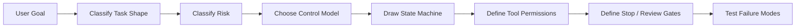

## 3. Core Mental Model

The most important distinction:

> A workflow is a system where **software owns the next step**.  
> An agent loop is a system where **the model proposes the next step**, subject to policy and runtime constraints.

That one sentence determines most engineering consequences.

### 3.1 Workflow

A workflow has a predefined path or graph. The model may fill in content, classify data, extract structure, summarize context, or choose among bounded options, but the software controls progression.

Example:

1. Receive support ticket.
2. Classify ticket.
3. Retrieve customer records.
4. Generate proposed answer.
5. Run policy check.
6. Ask human to approve.
7. Send response.

The model helps, but it does not own the process.

### 3.2 Agent Loop

An agent loop repeatedly asks the model something like:

> Given the goal, state, observations, tools, and constraints, what should happen next?

The model may decide to search, inspect files, call an API, ask a question, update a plan, run a test, or stop.

A simplified loop:

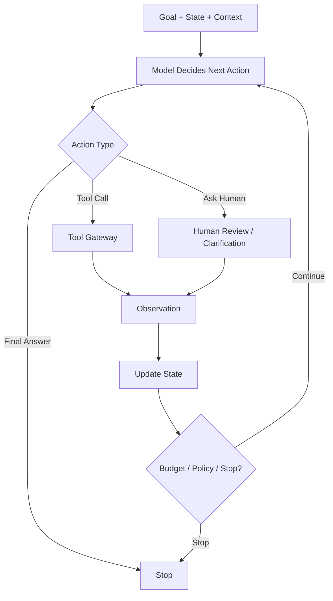

The model now participates in the control plane. That increases flexibility but also increases responsibility for guardrails, state, replay, and verification.

## 4. The Architecture Spectrum

Avoid binary thinking. Most useful production systems sit on a spectrum.

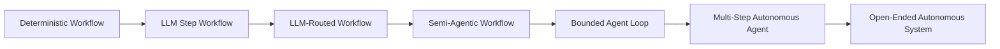

Each level changes the amount of control delegated to the model.

## 5. Architecture Types

### 5.1 Deterministic Workflow

A deterministic workflow uses no model for control or reasoning.

Use it when:

- Rules are explicit.
- Inputs are structured.
- Risk is high.
- Auditability is mandatory.
- Variability is low.
- The cost of model error is higher than the benefit of flexibility.

Example:

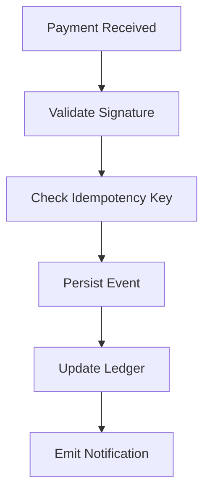

This is not an AI problem. Do not agentify it.

### 5.2 LLM Step Workflow

An LLM step workflow uses the model inside a predefined flow.

Examples:

- Extract structured fields from a document.
- Classify issue severity.
- Summarize a conversation.
- Generate a draft response.
- Rewrite text in a required tone.

The workflow is still deterministic. The model is a function call with validation.

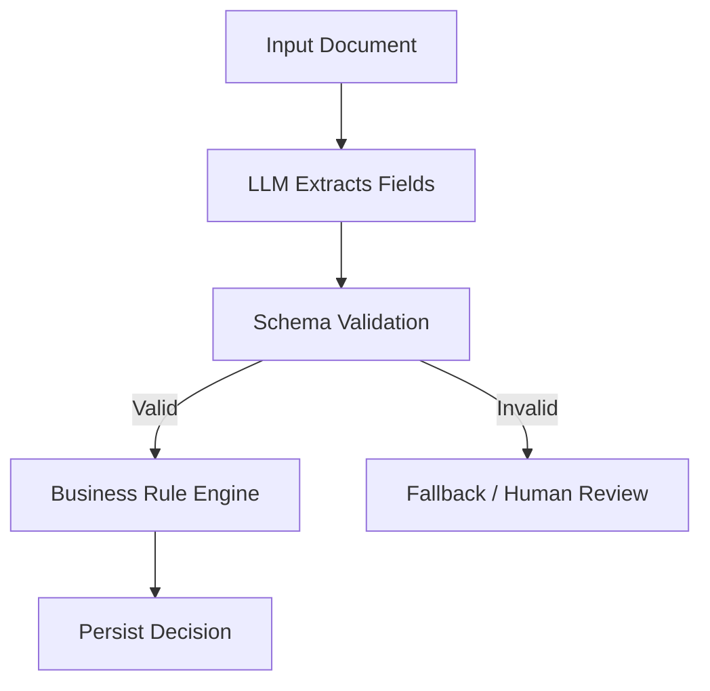

This pattern is often enough for enterprise AI.

### 5.3 LLM-Routed Workflow

In an LLM-routed workflow, the model chooses from a constrained set of routes.

Example:

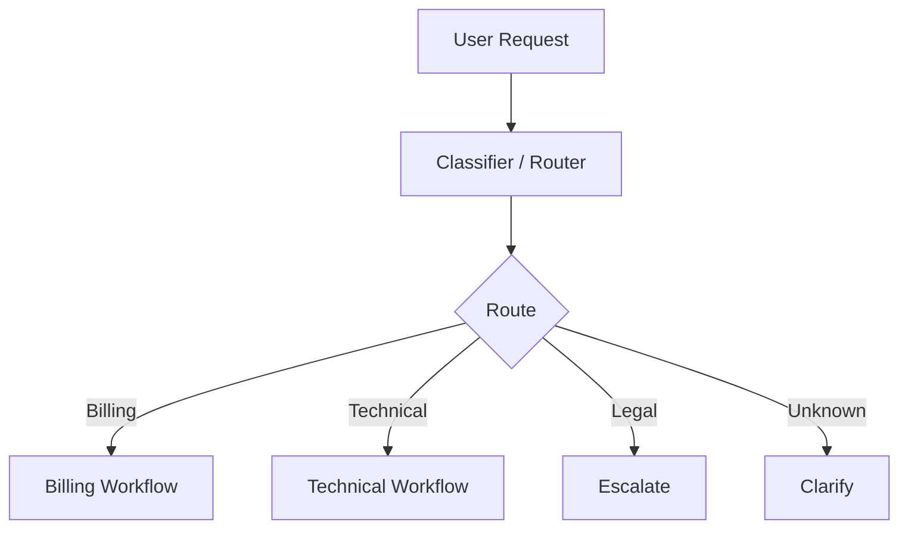

This is more flexible than a simple workflow but still bounded. The model selects a lane; code owns the lane.

Use this when:

- Requests vary in natural language.
- The number of business processes is finite.
- Each process has different tools, permissions, and review gates.
- Misrouting is recoverable.

### 5.4 Semi-Agentic Workflow

A semi-agentic workflow gives the model bounded control inside a specific phase.

Example:

1. Workflow receives a GitHub issue.
2. Code determines repo, branch, and environment.
3. Agent loop investigates possible files for a fixed budget.
4. Workflow decides whether patch generation is allowed.
5. Agent proposes a patch.
6. Workflow runs tests.
7. Human approves PR.

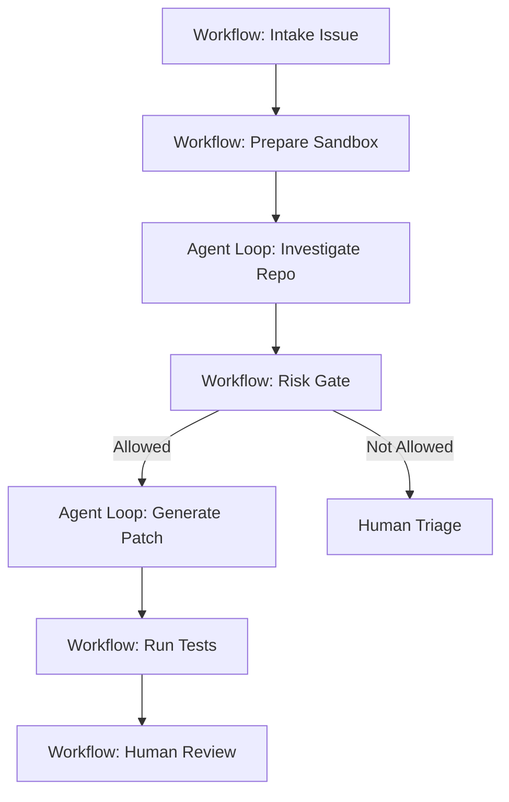

This is often the best production architecture for autonomous software engineering: autonomy exists, but only inside controlled zones.

### 5.5 Bounded Agent Loop

A bounded loop lets the model repeatedly choose actions, but under hard constraints.

Constraints include:

- Maximum steps.
- Maximum wall-clock time.
- Maximum token/cost budget.
- Allowed tools.
- Allowed file paths.
- Allowed APIs.
- Required approval before side effects.
- Stop conditions.
- Verification conditions.

A bounded loop is not "let the model do anything". It is a dynamic planner inside a sandbox.

### 5.6 Open-Ended Agent Loop

An open-ended loop runs until the goal is achieved or some external condition stops it.

This is rarely acceptable in production without strict supervisor controls.

Use it only when:

- The environment is low-risk or sandboxed.
- The task is exploratory.
- Failure is cheap.
- The agent has no direct irreversible authority.
- Observability and kill switches exist.

Examples:

- Research sandbox.
- Internal experiment.
- Long-running data exploration assistant.
- Game/simulation agent.

For enterprise systems, prefer bounded loops or semi-agentic workflows.

## 6. Control Ownership Matrix

The key design question is: **who owns the next transition?**

| Architecture | Code Owns Next Step | Model Owns Next Step | Human Owns Next Step | Best Fit |
|---|---:|---:|---:|---|
| Deterministic workflow | High | None | Optional | Rules, compliance, transaction systems |
| LLM step workflow | High | Low | Optional | Extraction, summarization, classification |
| LLM-routed workflow | Medium-high | Low-medium | Optional | Intent routing, triage |
| Semi-agentic workflow | Medium | Medium | Medium | Coding assist, investigation, operations assist |
| Bounded agent loop | Low-medium | Medium-high | Gate-based | Exploratory tasks with constrained actions |
| Open-ended agent loop | Low | High | Supervisor-only | Research, sandbox, low-risk automation |

A mature engineer does not ask, "Can an agent do this?"

A mature engineer asks:

> Which transitions must remain deterministic, which transitions can be model-selected, and which transitions require human approval?

## 7. Decision Framework

Use this decision flow before choosing architecture.

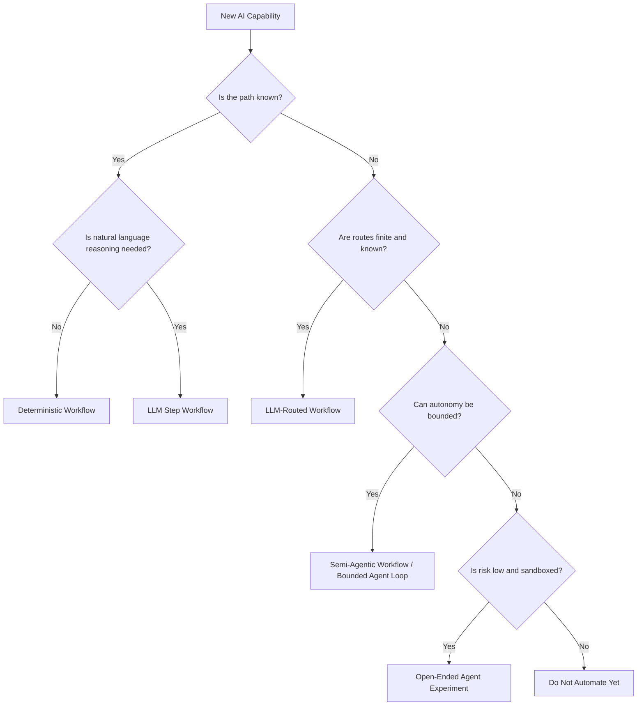

### 7.1 Questions to Ask

1. Is the happy path known?
2. Are failure paths known?
3. Are tool side effects reversible?
4. Can the model's choices be validated?
5. Can the run be replayed?
6. Can a human interrupt?
7. What happens if the model calls the wrong tool?
8. What happens if the model stops too early?
9. What happens if the model never stops?
10. What is the maximum allowed blast radius?

If you cannot answer these, you are not ready to build an autonomous loop.

## 8. Workflow Patterns

Anthropic highlights several practical patterns for building effective agentic systems, including prompt chaining, routing, parallelization, orchestrator-workers, and evaluator-optimizer. These are not just prompt tricks; they are control-flow patterns.

### 8.1 Prompt Chaining

Prompt chaining decomposes a task into fixed sequential stages.

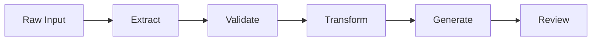

Use it when each stage can be clearly validated before moving to the next.

Example:

- Stage 1: Extract fields from contract.
- Stage 2: Validate required fields.
- Stage 3: Compare against policy.
- Stage 4: Generate risk summary.
- Stage 5: Ask reviewer to approve.

Strengths:

- Easy to test.
- Easy to observe.
- Easy to retry from a stage.
- Good for regulated workflows.

Weaknesses:

- Less adaptive.
- May fail when input requires unexpected investigation.
- Can become brittle if too many stages are prompt-specific.

### 8.2 Routing

Routing chooses one path among known paths.

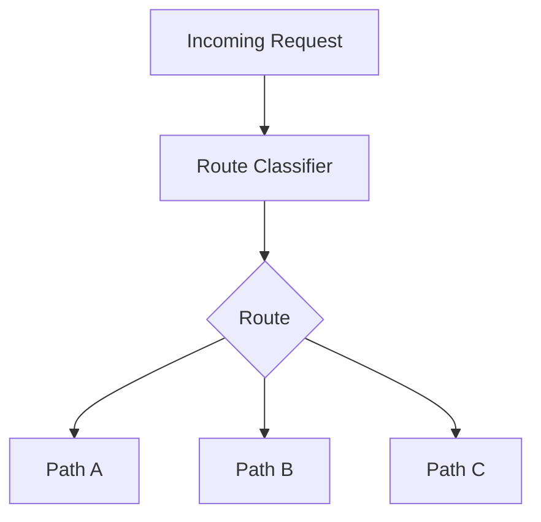

Use it when the variability is mostly in **intent**, not in execution strategy.

A production router should output:

```json
{
  "route": "billing_dispute",
  "confidence": 0.91,
  "reason": "User is contesting a charge and asking for refund evidence.",
  "requires_human_review": false
}
```

Do not allow free-form route names in production. Use enums.

### 8.3 Parallelization

Parallelization runs independent model calls or tool calls concurrently.

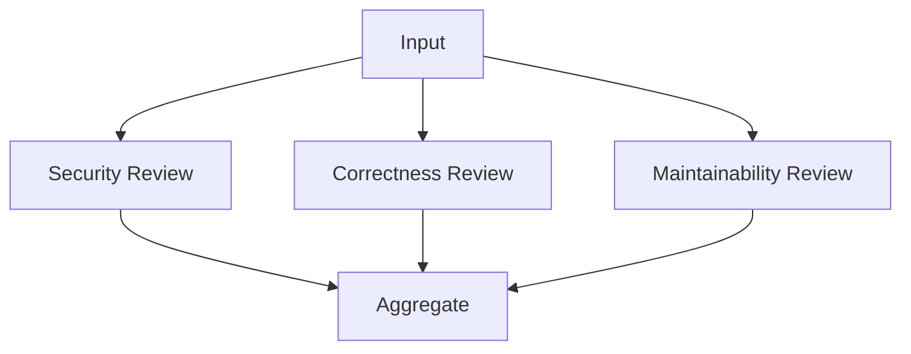

Use it when sub-judgments are independent enough to avoid shared bias.

Examples:

- Code review by separate reviewers.
- Document extraction from multiple sections.
- Risk scoring across different dimensions.
- Multi-source retrieval.

Parallelization is useful, but it needs aggregation logic. Do not just concatenate outputs.

### 8.4 Orchestrator-Workers

An orchestrator dynamically breaks a task into subtasks and delegates them to workers.

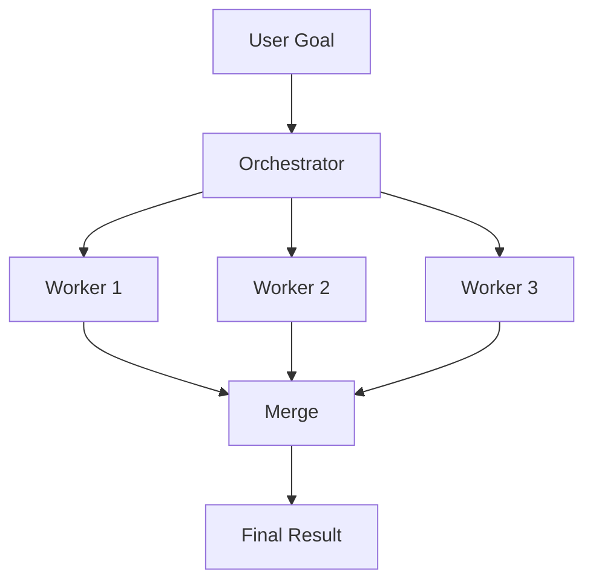

This is useful when the number or type of subtasks is not known upfront.

Example:

- Analyze a large codebase.
- Investigate multiple possible root causes.
- Break down a migration plan by module.

Risks:

- Duplicate work.
- Conflicting assumptions.
- Lost provenance.
- Hidden dependencies.
- Expensive fan-out.

A strong orchestrator-worker design needs task contracts:

```json
{
  "task_id": "T-014",
  "objective": "Find callers of deprecated method X",
  "input_scope": ["module-a", "module-b"],
  "allowed_tools": ["symbol_search", "read_file"],
  "output_schema": "CallerInventory",
  "budget": { "max_steps": 8, "max_tokens": 12000 },
  "done_when": "All direct callers are listed with file path and line range"
}
```

### 8.5 Evaluator-Optimizer

An evaluator-optimizer loop generates an output, evaluates it, and improves it.

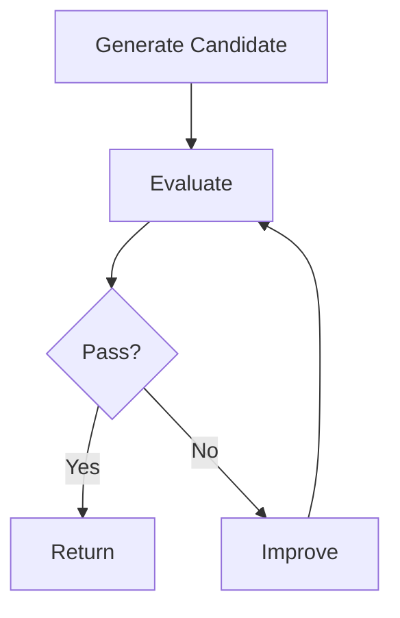

Use it when quality can be measured or judged.

Examples:

- Draft generation with rubric review.
- SQL generation with execution validation.
- Code patch generation with tests.
- Documentation generation with coverage checklist.

Be careful: evaluator-optimizer loops can create expensive illusion-of-progress if the evaluator is weak.

The evaluator must be stronger than the generator in the relevant dimension, or at least grounded in external checks.

## 9. Agent Loop Patterns

### 9.1 ReAct Loop

The ReAct pattern interleaves reasoning and acting. The model reasons about what to do, calls a tool, observes the result, then reasons again. The original ReAct work showed that combining reasoning traces with actions can improve interpretability and task-solving for knowledge and interactive tasks.

Production adaptation:

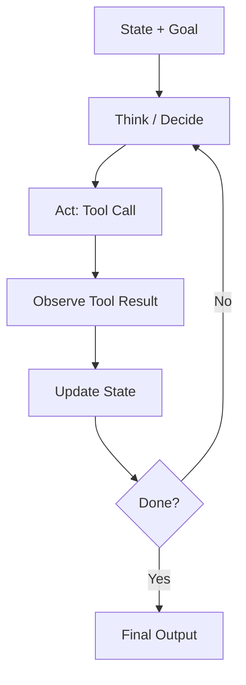

Do not expose private chain-of-thought in production outputs. Instead, store structured decision records:

```json
{
  "step": 7,
  "decision": "read_file",
  "target": "src/auth/TokenValidator.ts",
  "justification_summary": "Need to inspect token expiry validation before patching login failure.",
  "policy_result": "allowed",
  "observation_digest": "Token expiration is checked before clock skew adjustment."
}
```

### 9.2 Plan-Execute Loop

The model first creates a plan, then executes steps.

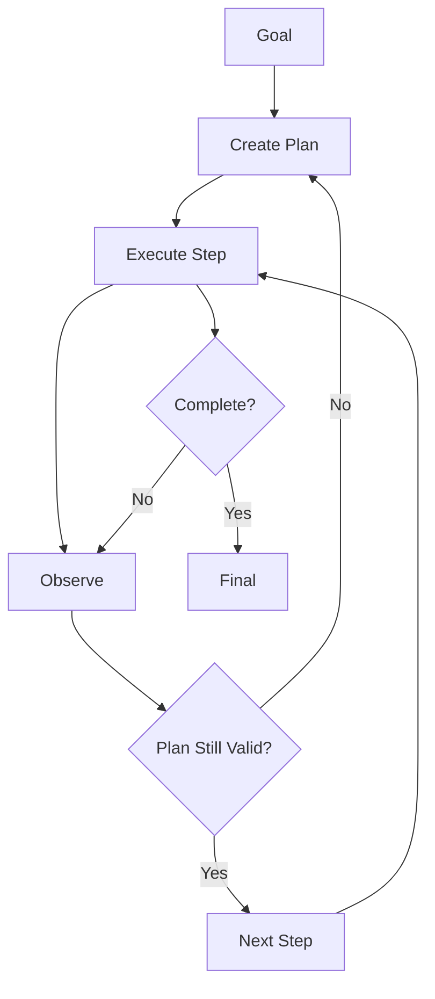

Use it when:

- The task has multiple dependent steps.
- Progress needs to be inspectable.
- You want humans to review the plan before execution.
- Tool permissions differ by step.

Plan-execute is stronger than raw ReAct for enterprise work because plans create reviewable intermediate artifacts.

### 9.3 Tree Search / Branching Deliberation

Tree-of-Thought-style planning explores multiple possible reasoning paths before choosing a direction. This helps when early choices strongly affect outcome quality.

Use this sparingly because it is expensive.

Good fits:

- Architecture design alternatives.
- Complex bug root-cause hypotheses.
- Migration strategy comparison.
- Incident remediation options.

Bad fits:

- Simple extraction.
- Known workflows.
- Low-value tasks.
- Latency-sensitive user interactions.

A production version should look like:

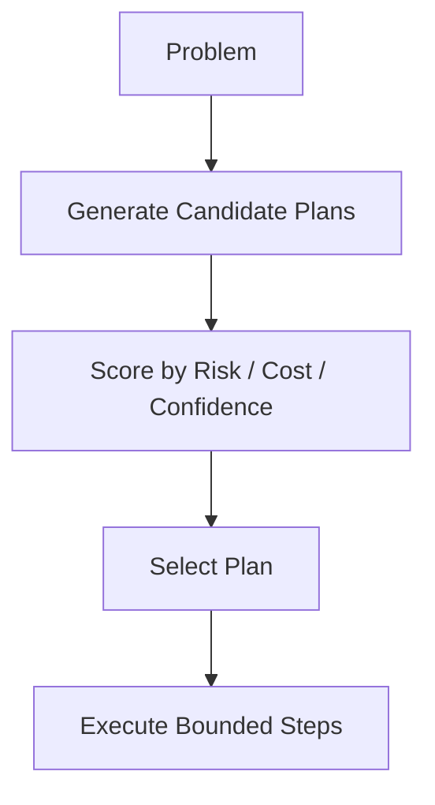

### 9.4 Reflective Loop

A reflective loop asks the model to review prior attempts and update its strategy. Reflexion-style approaches use feedback signals and text memory to improve future attempts without model weight updates.

Production caution:

- Reflection can improve behavior.
- Reflection can also preserve wrong assumptions.
- Reflection memory can become polluted.
- Reflection should not replace external verification.

Use reflection for:

- Learning from failed tests.
- Improving search strategy.
- Capturing assumptions.
- Explaining why a previous approach failed.

Do not use reflection as proof of correctness.

## 10. Choosing the Right Pattern

### 10.1 Task Shape Matrix

| Task Shape | Recommended Pattern | Why |
|---|---|---|
| Linear, known steps | Prompt chaining | Deterministic control is enough. |
| Known categories, different flows | Routing | Model classifies; code controls. |
| Independent checks | Parallelization | Reduces latency and separates concerns. |
| Unknown number of subtasks | Orchestrator-workers | Dynamic decomposition is useful. |
| Quality can be scored | Evaluator-optimizer | Feedback loop improves output. |
| Need environment interaction | ReAct / bounded loop | Tool observations guide progress. |
| Need upfront reviewable strategy | Plan-execute | Plan can be inspected before action. |
| High uncertainty, high search | Tree exploration | Multiple strategies reduce premature commitment. |
| High-risk irreversible action | Workflow + approval gate | Human/code should own decision. |

### 10.2 Risk Matrix

| Risk | Avoid | Prefer |
|---|---|---|
| Irreversible writes | Open-ended loop | Workflow with approval |
| External side effects | Raw ReAct | Tool gateway + policy checks |
| Sensitive data | Broad context stuffing | Scoped retrieval + redaction |
| Compliance decisions | Agent final authority | Deterministic policy + human review |
| High cost operations | Unlimited loop | Budgeted loop |
| Ambiguous completion | Model self-declared done | Verifier-owned done condition |
| Complex code changes | One-shot patch | Plan-execute + tests + review |

## 11. Runtime Design Implications

### 11.1 Workflow Runtime

A workflow runtime should provide:

- Explicit steps.
- Step-level retries.
- Durable state.
- Compensation logic.
- Human tasks.
- Audit trail.
- Versioned process definitions.

In workflow systems, the LLM is a participant, not the orchestrator.

### 11.2 Agent Runtime

An agent runtime should provide:

- Iteration loop.
- State checkpoints.
- Tool gateway.
- Policy engine.
- Budget manager.
- Stop controller.
- Observation store.
- Trace log.
- Verifier.
- Human interrupt.

In agent systems, the runtime exists to prevent the model from becoming an uncontrolled process manager.

### 11.3 Graph Runtime

Graph-based runtimes, such as LangGraph, are useful because many production agents are neither simple linear workflows nor unconstrained loops. A graph can represent states, transitions, persistence, human-in-the-loop interrupts, and durable execution.

Conceptually:

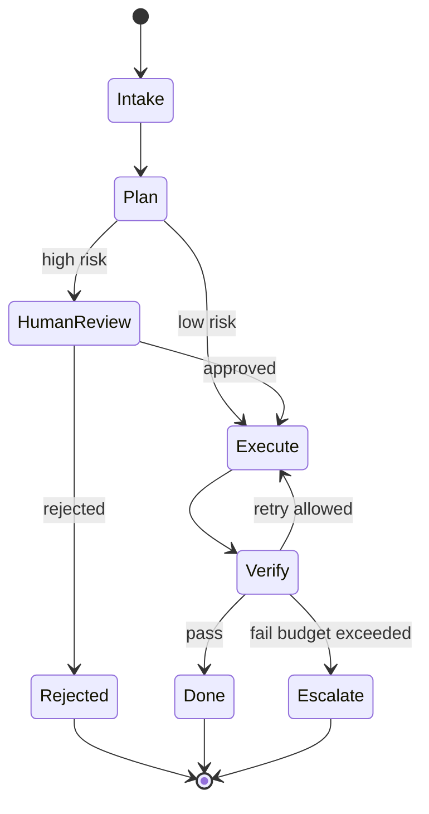

This is often the correct shape for enterprise agentic systems.

## 12. Engineering Rules of Thumb

### Rule 1: Prefer Workflow Until Variability Forces a Loop

Do not use an agent loop for a known process.

If the steps are known, encode them.

### Rule 2: Put the Model in the Smallest Useful Control Box

The model may need to choose a file to inspect. It probably does not need permission to deploy to production.

### Rule 3: Separate Decision, Action, and Verification

Never let one model response fully own:

1. What to do.
2. The execution of the action.
3. The declaration that it succeeded.

Separate these responsibilities.

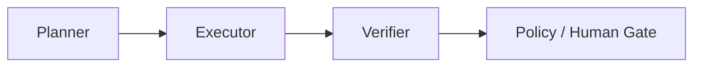

### Rule 4: Make Stop Conditions External

A model saying "done" is not enough.

Stop conditions should be derived from:

- Passing tests.
- Schema validation.
- Required fields present.
- Human approval.
- Budget exhausted.
- Verified output artifact exists.
- Business invariant satisfied.

### Rule 5: Make Tool Calls Boring

A tool call should be structured, validated, idempotent where possible, authorized, logged, and bounded.

If your tool call is a raw shell command generated by the model, you do not have a tool. You have an unbounded execution vulnerability.

## 13. Practical Design Example: Customer Refund Assistant

### 13.1 Bad Design

"Build an agent that handles refunds."

This is too vague and too dangerous.

Potential problems:

- Refunds are financial side effects.
- Policy varies by customer, product, region, and fraud signals.
- Model may hallucinate policy.
- Model may issue refund without authority.
- Audit requirements may be unmet.

### 13.2 Better Architecture

Use workflow + bounded model reasoning.

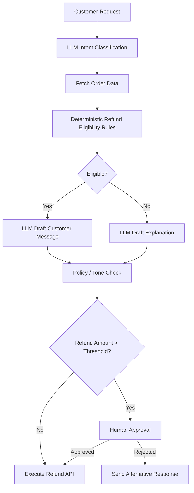

The model helps classify and communicate. Rules and humans control financial action.

## 14. Practical Design Example: Coding Issue Resolver

### 14.1 Bad Design

"Let the agent fix the issue and push to main."

This combines investigation, editing, verification, and release authority into one uncontrolled loop.

### 14.2 Better Architecture

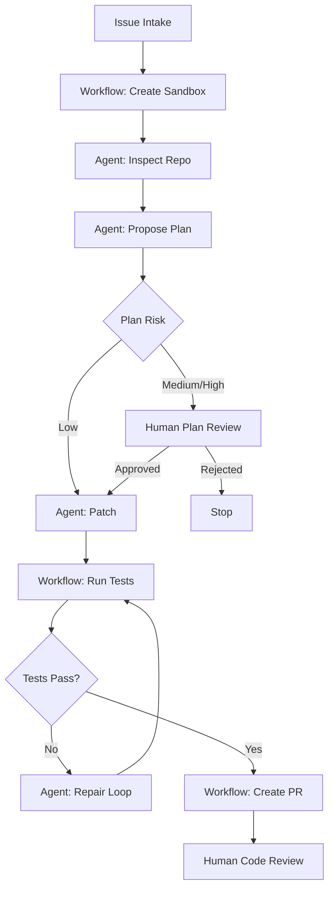

The agent has autonomy in investigation and patching, but the workflow owns sandboxing, tests, PR creation, and review gates.

## 15. Common Failure Modes

### 15.1 Over-Agentification

Symptom:

- Simple task is implemented as a loop.
- Tests are hard to write.
- Cost is unpredictable.
- Behavior varies across runs.

Fix:

- Collapse into a workflow.
- Keep LLM as a step, not controller.

### 15.2 Prompt-Spaghetti Workflow

Symptom:

- Control flow is hidden inside prompts.
- Prompt says "first do X, then Y, then Z".
- Code cannot observe intermediate state.

Fix:

- Move control flow into code or graph nodes.
- Keep prompts local to one decision.

### 15.3 Unbounded Loop

Symptom:

- Agent keeps searching, rewriting, or retrying.
- Cost grows without clear progress.
- No hard stop condition.

Fix:

- Add max steps, max cost, max retries, and external success criteria.

### 15.4 Verifier Collapse

Symptom:

- The same model generates and approves the output.
- It rationalizes poor work.
- It marks incomplete tasks as done.

Fix:

- Use deterministic checks where possible.
- Use independent model/evaluator for subjective checks.
- Use human approval for high-risk tasks.

### 15.5 Tool Boundary Leakage

Symptom:

- Model can invoke overly broad tools.
- Tools expose too much data.
- Tool names encourage unsafe behavior.

Fix:

- Create narrow tools with scoped permissions.
- Validate parameters.
- Log all calls.
- Use policy checks before side effects.

## 16. Architecture Selection Checklist

Before implementing, fill this table.

| Question | Answer |
|---|---|
| What is the user goal? |  |
| Is the process path known? |  |
| Which steps require model judgment? |  |
| Which steps must be deterministic? |  |
| Which tools are needed? |  |
| Which tools have side effects? |  |
| What is the max budget? |  |
| What is the stop condition? |  |
| What is the human approval condition? |  |
| What must be logged for audit? |  |
| What can be replayed? |  |
| What can be compensated? |  |
| What is the fallback path? |  |

## 17. Practice Drills

### Drill 1: Classify 10 AI Ideas

For each idea, classify it as:

- Deterministic workflow.
- LLM step workflow.
- LLM-routed workflow.
- Semi-agentic workflow.
- Bounded agent loop.
- Open-ended agent loop.

Ideas:

1. Summarize meeting transcript.
2. Approve customer refund.
3. Investigate failing CI.
4. Generate release notes.
5. Monitor security advisories.
6. Migrate deprecated API usage.
7. Explain invoice dispute.
8. Reconcile bank transactions.
9. Generate code review comments.
10. Autonomously deploy hotfix.

### Drill 2: Convert Agent Idea to Workflow

Take this vague requirement:

> Build an agent that handles customer complaints.

Convert it into:

1. Intent router.
2. Known workflows.
3. Agentic investigation zones.
4. Human gates.
5. Stop conditions.
6. Audit log fields.

### Drill 3: Add Boundaries to a Loop

Given this loop:

```text
Goal -> Model decides action -> Tool executes -> Observation -> Repeat
```

Add:

- Budget manager.
- Policy engine.
- Tool allowlist.
- Human approval.
- Verifier.
- Stop controller.
- Audit log.

## 18. Production Readiness Checklist

A workflow/agent design is production-ready only if these are explicit:

- [ ] Architecture type is chosen intentionally.
- [ ] Control ownership is documented.
- [ ] Tool permissions are scoped.
- [ ] Side effects are gated.
- [ ] State is durable where needed.
- [ ] Run can be inspected.
- [ ] Run can be replayed or reconstructed.
- [ ] Stop conditions are externalized.
- [ ] Budgets are enforced.
- [ ] Human escalation exists.
- [ ] Failure modes are tested.
- [ ] Evaluation harness exists.
- [ ] Security review covers prompt/tool/memory attacks.

## 19. Key Takeaways

1. A workflow is code-owned control flow; an agent loop is model-influenced control flow.
2. Most production systems should start as workflows, not agents.
3. Autonomy should be bounded by tools, budgets, policy, state, and approval gates.
4. The best systems are often hybrid: deterministic workflow outside, bounded agentic reasoning inside.
5. Do not confuse model intelligence with system authority.

## 20. References

- Anthropic, "Building Effective Agents" — https://www.anthropic.com/research/building-effective-agents
- OpenAI Agents SDK documentation — https://openai.github.io/openai-agents-python/agents/
- OpenAI Agents SDK Handoffs — https://openai.github.io/openai-agents-python/handoffs/
- LangGraph Overview — https://docs.langchain.com/oss/python/langgraph/overview
- LangGraph Persistence — https://docs.langchain.com/oss/python/langgraph/persistence
- LangChain Human-in-the-Loop Middleware — https://docs.langchain.com/oss/python/langchain/human-in-the-loop
- Yao et al., "ReAct: Synergizing Reasoning and Acting in Language Models" — https://arxiv.org/abs/2210.03629
- Yao et al., "Tree of Thoughts: Deliberate Problem Solving with Large Language Models" — https://arxiv.org/abs/2305.10601
- Shinn et al., "Reflexion: Language Agents with Verbal Reinforcement Learning" — https://arxiv.org/abs/2303.11366
