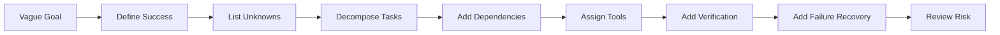
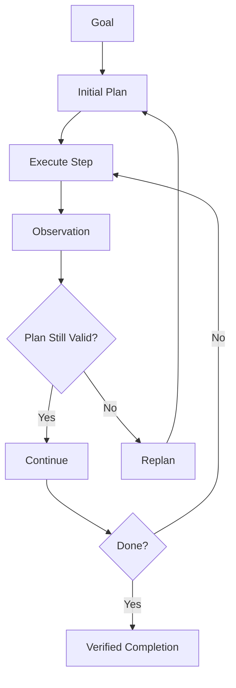
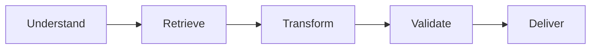
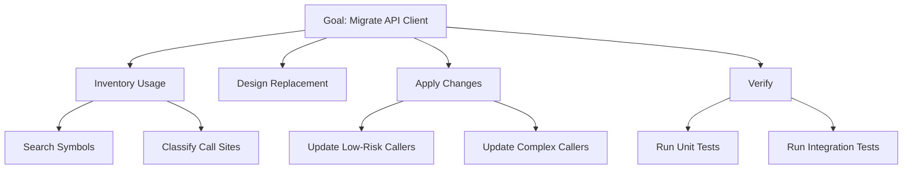
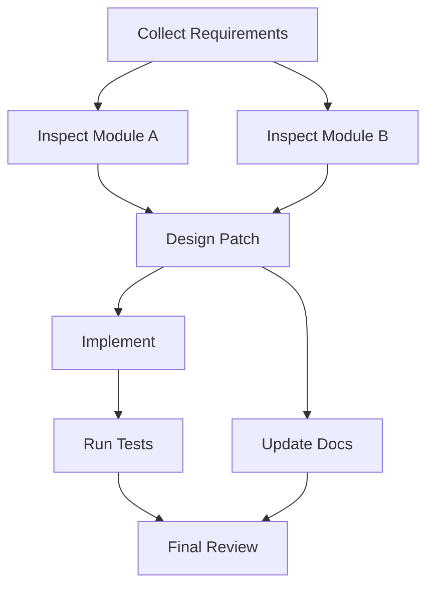
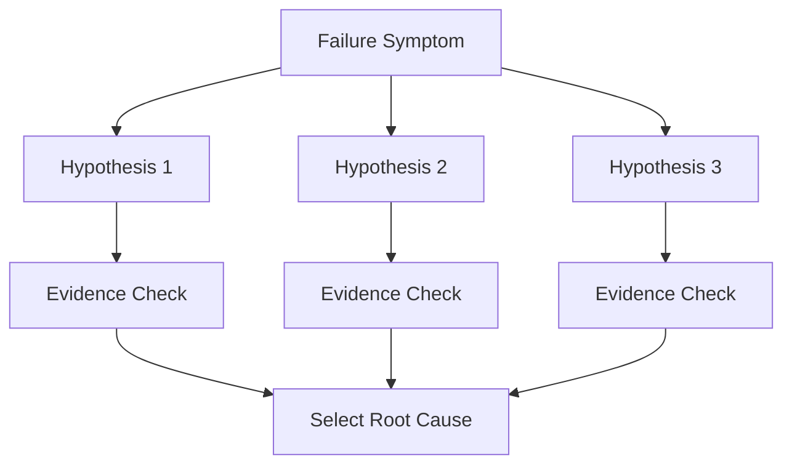
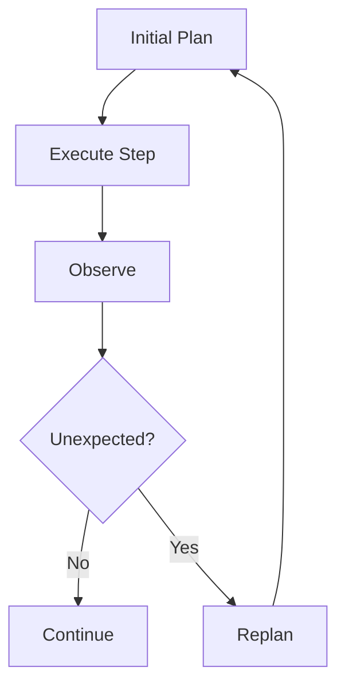
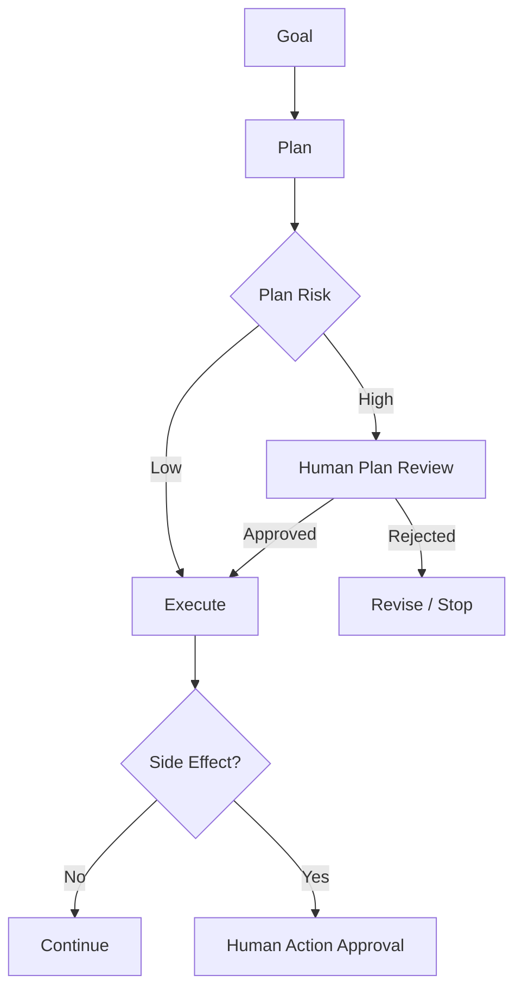

------
title: Learn Advanced Agentic AI Engineering & Autonomous Software Engineering - Part 006
description: Learn how agentic systems decompose goals into bounded tasks, plans, dependencies, evidence, constraints, verification steps, and recovery paths.
series: learn-agentic-ai-engineering
seriesTitle: Learn Advanced Agentic AI Engineering & Autonomous Software Engineering
order: 6
partTitle: Task Decomposition and Planning
tags:
- agentic-ai
- autonomous-software-engineering
- planning
- task-decomposition
- agents
- architecture
- series
date: 2026-06-29
---

# Part 006 — Task Decomposition and Planning

## 1. Why This Part Matters

Agentic systems fail less often because the model is "bad at language" and more often because the task was decomposed poorly.

Bad decomposition causes:

- Wrong tool usage.
- Missing prerequisites.
- Confused execution order.
- Premature patching.
- Duplicate work.
- Hidden assumptions.
- Ambiguous completion.
- Unbounded retries.
- False success.

A strong agentic engineer treats a plan as an executable risk model.

A plan is not a pretty list of steps. A production-grade plan defines:

1. What must be known.
2. What must be changed.
3. What must be preserved.
4. Which tools may be used.
5. Which actions are reversible.
6. Which actions require approval.
7. How progress is measured.
8. How completion is verified.
9. How failure is recovered.

This part gives you the mental model and structure for building planning systems that survive real-world ambiguity.

## 2. Kaufman Framing

### 2.1 Target Performance

After this part, you should be able to:

1. Turn a vague goal into a task graph with dependencies and verification points.
2. Classify tasks by uncertainty, side effect, reversibility, and required evidence.
3. Design planning prompts and planning schemas that produce executable plans, not narrative plans.
4. Decide when to use linear planning, DAG planning, hierarchical planning, search planning, or replanning.
5. Build plan-review gates for high-risk autonomous software engineering tasks.

### 2.2 Subskills

| Subskill | What You Must Be Able to Do |
|---|---|
| Goal clarification | Convert vague user intent into explicit success criteria. |
| Task atomization | Break work into small tasks that can be executed, observed, and verified. |
| Dependency modelling | Identify ordering constraints and parallelizable work. |
| Evidence planning | Define what observations are needed before acting. |
| Risk-aware sequencing | Put low-risk information-gathering before high-risk side effects. |
| Replanning | Detect when a plan is invalid and repair it. |
| Completion verification | Use external criteria to decide done. |

### 2.3 The 20-Hour Practice Loop

Practice this repeatedly:



Do this on real tasks: repository changes, incident diagnosis, document analysis, data reconciliation, API integration, release planning.

## 3. Core Mental Model

> A plan is a hypothesis about how to move from current state to desired state under constraints.

This definition matters.

A plan is not truth. It is a working model that must be updated as observations arrive.



A good agent does not blindly follow the first plan. It maintains plan validity.

## 4. Goal, Task, Step, Action

These terms must be distinct.

| Level | Meaning | Example |
|---|---|---|
| Goal | Desired outcome | Fix login failure when token is near expiry. |
| Task | Coherent unit of work | Reproduce the bug. |
| Step | Ordered operation inside a task | Run auth integration test. |
| Action | Tool invocation or model operation | `run_tests("AuthTokenTest")` |
| Observation | Result of action | Test fails with clock skew assertion. |
| Evidence | Observation that supports a decision | Failure trace points to expiry check order. |
| Verification | Check that goal is satisfied | Regression test passes and old behavior preserved. |

Bad agents collapse these levels. Good systems preserve them.

## 5. From Goal to Success Criteria

A vague goal is unsafe.

Example:

> Fix the flaky login test.

Better success criteria:

```json
{
  "goal": "Fix flaky login test",
  "success_criteria": [
    "The identified flaky test passes 20 consecutive local runs",
    "No production authentication logic is changed unless root cause requires it",
    "The fix does not disable or weaken the assertion",
    "A short root-cause note is included in the PR description"
  ],
  "non_goals": [
    "Do not rewrite the authentication module",
    "Do not skip the test",
    "Do not change unrelated timeout settings globally"
  ]
}
```

A plan without success criteria is just activity.

## 6. Planning Inputs

A planning system should not rely only on the user prompt.

It should consume:

| Input | Purpose |
|---|---|
| User goal | Desired outcome. |
| Current state | What is known now. |
| Constraints | Time, budget, security, policy, allowed tools. |
| Environment | Repo, branch, sandbox, APIs, data sources. |
| Historical context | Prior attempts, related incidents, previous decisions. |
| Risk profile | Side effects, sensitivity, blast radius. |
| Verification options | Tests, validators, reviewers, static checks, policy checks. |

Planning quality is limited by input quality. Do not ask an agent to plan with missing state and then blame the model for guessing.

## 7. Task Classification

Before decomposition, classify the task.

### 7.1 By Information Shape

| Type | Description | Planning Implication |
|---|---|---|
| Known-known | Inputs and process are clear. | Use workflow. |
| Known-unknown | Need to gather specific missing info. | Plan retrieval/investigation first. |
| Unknown-known | User forgot or omitted available context. | Ask clarification or inspect context. |
| Unknown-unknown | Discovery problem. | Use bounded exploration. |

### 7.2 By Side Effect

| Type | Example | Control |
|---|---|---|
| Read-only | Search docs, inspect code | Low risk; allow more autonomy. |
| Draft-only | Generate PR description | Low-medium risk; validate. |
| Local write | Edit sandbox file | Medium risk; checkpoint. |
| External write | Create ticket, send email | High risk; approval. |
| Financial/legal/security action | Refund, block user, rotate secrets | Very high risk; deterministic policy + human gate. |

### 7.3 By Reversibility

| Type | Example | Planning Rule |
|---|---|---|
| Reversible | Create draft, edit branch file | Agent may act with checkpoint. |
| Compensatable | Create ticket, label issue | Agent may act if compensation exists. |
| Hard to reverse | Send external email | Approval before action. |
| Irreversible | Delete data, deploy destructive migration | Avoid or require strict human control. |

### 7.4 By Verification Strength

| Type | Example | Reliability |
|---|---|---|
| Strong verifier | Unit tests, schema validation | Good for autonomous execution. |
| Medium verifier | Static analysis, lint, rubric | Needs caution. |
| Weak verifier | Model self-evaluation | Not enough for high-risk tasks. |
| Human verifier | Expert review | Required for subjective/high-risk tasks. |

Autonomy should increase when side effects are low and verification is strong.

## 8. Decomposition Patterns

### 8.1 Linear Decomposition

Use when steps are naturally sequential.



Example: document extraction.

1. Read document.
2. Extract fields.
3. Validate schema.
4. Normalize values.
5. Return structured output.

Linear decomposition is easy to test but brittle for exploratory work.

### 8.2 Hierarchical Decomposition

Break a large goal into nested tasks.



Use when:

- Work has natural layers.
- Different subtasks need different tools.
- Humans may review intermediate artifacts.

### 8.3 DAG Decomposition

A DAG represents dependencies and parallelizable work.



Use DAGs when:

- Some tasks can run in parallel.
- Some tasks depend on shared evidence.
- You need scheduling and progress tracking.

A DAG plan is better than a bullet list for agentic systems because it exposes dependency mistakes.

### 8.4 Search Decomposition

Use when the agent must explore multiple hypotheses.



This is useful for debugging and architecture decisions.

Tree-of-Thought-style approaches formalize this idea by exploring multiple reasoning paths and using evaluation/backtracking rather than committing to the first chain.

### 8.5 Plan-Execute-Replan

Use when uncertainty is high.



The plan must include replanning triggers.

Examples:

- Test result contradicts hypothesis.
- Required file does not exist.
- Tool returns permission denied.
- Cost budget nearly exhausted.
- User goal conflicts with policy.
- New risk discovered.

## 9. The Planning Artifact

A production plan should be structured.

### 9.1 Minimum Plan Schema

```json
{
  "goal": "...",
  "success_criteria": ["..."],
  "assumptions": ["..."],
  "unknowns": ["..."],
  "constraints": {
    "allowed_tools": ["..."],
    "forbidden_actions": ["..."],
    "max_steps": 20,
    "requires_human_approval_before": ["..."]
  },
  "tasks": [
    {
      "id": "T1",
      "title": "...",
      "type": "read_only | local_write | external_write | verify | human_review",
      "depends_on": [],
      "tool_candidates": ["..."],
      "expected_evidence": ["..."],
      "done_when": ["..."],
      "risk": "low | medium | high"
    }
  ],
  "verification": ["..."],
  "fallbacks": ["..."]
}
```

### 9.2 Why Structured Plans Matter

Structured plans allow:

- Policy engines to inspect proposed actions.
- Humans to review before execution.
- Runtimes to schedule tasks.
- Observability systems to track progress.
- Evaluators to compare actual trajectory against intended trajectory.
- Recovery systems to resume after failure.

A narrative plan is useful for humans. A structured plan is useful for systems.

## 10. Planning for Evidence Before Action

A strong agent gathers evidence before making changes.

Bad plan:

1. Edit likely file.
2. Run tests.
3. Hope it works.

Better plan:

1. Reproduce failure.
2. Identify failing assertion.
3. Locate responsible code path.
4. Inspect recent changes.
5. Form root-cause hypothesis.
6. Make minimal patch.
7. Run targeted tests.
8. Run regression tests.
9. Summarize evidence.

This is the most important habit in autonomous software engineering:

> Investigation before modification.

## 11. Planning Horizon

Planning horizon is how far ahead the agent should plan.

| Horizon | Description | Use Case |
|---|---|---|
| One-step | Decide next action only. | Simple ReAct loop. |
| Short horizon | Plan next 3–5 steps. | Debugging, research. |
| Full plan | Plan complete task before execution. | Reviewable enterprise workflows. |
| Rolling plan | Plan high-level path, replan after observations. | Complex engineering tasks. |
| Branching plan | Explore alternatives before acting. | Architecture, root cause analysis. |

Do not always require full plans. Full plans are often wrong in exploratory tasks.

Do not always use one-step planning. One-step agents often become reactive and inefficient.

For production autonomous SWE, prefer **rolling plans**:

1. Create initial plan.
2. Execute safe evidence-gathering steps.
3. Replan after new evidence.
4. Gate writes.
5. Verify.

## 12. Dependency Modelling

A task dependency means one task requires the output or evidence of another.

Bad:

```text
1. Update auth code.
2. Find failing test.
3. Understand expected behavior.
```

Good:

```text
1. Find failing test.
2. Understand expected behavior.
3. Reproduce failure.
4. Update auth code.
```

### 12.1 Dependency Types

| Dependency | Meaning | Example |
|---|---|---|
| Data dependency | Needs output from previous task. | Need stack trace before root cause. |
| Permission dependency | Needs approval. | Need human approval before sending email. |
| Environment dependency | Needs setup. | Need sandbox before running tests. |
| Risk dependency | Need evidence before side effect. | Need policy check before refund. |
| Verification dependency | Need test before done. | Need regression result before PR. |

## 13. Planning With Constraints

Constraints are not optional hints. They are execution boundaries.

Examples:

```json
{
  "constraints": {
    "time_budget_minutes": 20,
    "max_tool_calls": 40,
    "allowed_paths": ["src/auth/**", "tests/auth/**"],
    "forbidden_paths": ["infra/**", "secrets/**"],
    "no_external_network": true,
    "approval_required_for": ["git_push", "send_email", "deploy", "delete_file"],
    "must_preserve": ["public API compatibility", "audit logging behavior"]
  }
}
```

The planner should produce plans that fit constraints. The runtime should enforce them anyway.

Never trust the planner to self-enforce critical constraints.

## 14. Planning With Tools

A task should not just say "investigate". It should specify tool candidates and tool limits.

Example:

```json
{
  "id": "T2",
  "title": "Locate token expiry validation",
  "type": "read_only",
  "tool_candidates": ["symbol_search", "grep", "read_file"],
  "forbidden_tools": ["write_file", "shell_exec"],
  "expected_evidence": [
    "File path containing token expiry validation",
    "Function or method name",
    "Relevant test references"
  ],
  "done_when": [
    "At least one implementation file and one test file are identified"
  ]
}
```

Tool-aware planning reduces unnecessary autonomy.

## 15. Planning With Verification

Every task should have a local done condition. The whole plan should have global success criteria.

### 15.1 Local Done

Example:

```json
{
  "task": "Reproduce failing test",
  "done_when": [
    "The exact failing command is recorded",
    "The failure output is captured",
    "The failure is reproducible at least twice or marked intermittent"
  ]
}
```

### 15.2 Global Done

Example:

```json
{
  "goal": "Fix flaky login test",
  "global_done_when": [
    "Targeted test passes repeatedly",
    "Full auth test suite passes",
    "Patch diff is limited to relevant files",
    "PR summary explains root cause and fix"
  ]
}
```

The more autonomous the agent, the stronger the done conditions must be.

## 16. Planning for Failure

Plans should include failure handling.

### 16.1 Failure Categories

| Failure | Example | Recovery |
|---|---|---|
| Missing context | File not found | Search alternatives, ask human. |
| Tool failure | Test runner unavailable | Retry, fallback command, report blocker. |
| Contradictory evidence | Two tests imply different behavior | Escalate or branch hypotheses. |
| Budget exceeded | Too many attempts | Stop with partial findings. |
| Policy blocked | Tool call denied | Ask approval or choose safe alternative. |
| Verification failed | Tests still fail | Repair loop if budget remains. |

### 16.2 Recovery Plan Schema

```json
{
  "failure_recovery": [
    {
      "condition": "targeted test command fails due to missing dependency",
      "action": "inspect project build docs and try documented setup command",
      "max_attempts": 2,
      "escalate_after": "dependency setup still fails"
    },
    {
      "condition": "patch causes unrelated tests to fail",
      "action": "revert patch and re-evaluate root cause",
      "max_attempts": 1
    }
  ]
}
```

A plan without recovery paths is not production-grade.

## 17. Replanning Triggers

Replanning should happen when assumptions break.

Examples:

- Required file does not exist.
- Search results contradict task assumption.
- Tool output has low confidence.
- A supposedly low-risk action becomes high-risk.
- Tests fail in a new area.
- Human rejects the plan.
- Budget is nearly exhausted.
- The agent discovers the user goal is impossible.

Replanning should not erase history. It should preserve:

- Original goal.
- Prior attempts.
- Evidence gathered.
- Failed hypotheses.
- Updated assumptions.

## 18. Autonomous SWE Planning Example

Goal:

> Fix issue: users with valid refresh tokens are sometimes logged out after daylight saving time changes.

### 18.1 Bad Plan

```text
1. Search for refresh token code.
2. Modify expiry logic.
3. Run tests.
4. Done.
```

This is too shallow. It jumps to modification.

### 18.2 Better Plan

```json
{
  "goal": "Fix intermittent logout around daylight saving time changes",
  "success_criteria": [
    "Bug is reproduced or a plausible failing test is added",
    "Root cause is tied to time-zone or clock-skew handling",
    "Fix preserves existing token security semantics",
    "Auth tests pass",
    "New regression test covers DST boundary"
  ],
  "unknowns": [
    "Where refresh token expiry is calculated",
    "Whether system uses local time, UTC, or injected clock",
    "Whether failure is in token creation, validation, or session refresh"
  ],
  "tasks": [
    {
      "id": "T1",
      "title": "Inventory refresh token code paths",
      "type": "read_only",
      "depends_on": [],
      "tool_candidates": ["symbol_search", "grep", "read_file"],
      "expected_evidence": ["Token creation path", "Token validation path", "Clock/time abstraction"],
      "done_when": ["Relevant files and functions are listed"],
      "risk": "low"
    },
    {
      "id": "T2",
      "title": "Find existing time-boundary tests",
      "type": "read_only",
      "depends_on": ["T1"],
      "tool_candidates": ["grep", "read_file"],
      "expected_evidence": ["Existing expiry tests", "Clock mocking utilities"],
      "done_when": ["Test coverage gap is identified"],
      "risk": "low"
    },
    {
      "id": "T3",
      "title": "Create minimal failing regression test",
      "type": "local_write",
      "depends_on": ["T1", "T2"],
      "tool_candidates": ["write_file", "run_tests"],
      "expected_evidence": ["Failing test demonstrates DST boundary issue"],
      "done_when": ["Regression test fails before fix"],
      "risk": "medium"
    },
    {
      "id": "T4",
      "title": "Patch time handling minimally",
      "type": "local_write",
      "depends_on": ["T3"],
      "tool_candidates": ["edit_file", "run_tests"],
      "expected_evidence": ["Patch uses UTC/injected clock consistently"],
      "done_when": ["Regression test passes"],
      "risk": "medium"
    },
    {
      "id": "T5",
      "title": "Run auth regression suite",
      "type": "verify",
      "depends_on": ["T4"],
      "tool_candidates": ["run_tests"],
      "expected_evidence": ["No auth regression"],
      "done_when": ["Relevant tests pass"],
      "risk": "low"
    }
  ],
  "human_review_required_before": ["Changing token cryptographic semantics", "Changing token lifetime policy"],
  "fallbacks": [
    "If bug cannot be reproduced, stop with investigation summary and proposed test scenario",
    "If fix requires policy change, escalate before patching"
  ]
}
```

This plan is executable, reviewable, and risk-aware.

## 19. Planning Prompt Design

A planning prompt should force structure and humility.

### 19.1 Weak Planning Prompt

```text
Make a plan to solve this issue.
```

Likely output: generic steps.

### 19.2 Strong Planning Prompt

```text
You are planning only. Do not execute.

Given the goal, current state, allowed tools, forbidden actions, and success criteria, produce a structured plan.

Rules:
- Prefer read-only evidence gathering before modification.
- List assumptions separately from facts.
- Every task must have a done_when condition.
- Every write action must depend on evidence.
- Mark tasks requiring human approval.
- Include replanning triggers.
- Include verification steps.
- Return JSON matching the schema.
```

The key is not the words. The key is the constraints and output schema.

## 20. Plan Review

Before execution, review the plan.

### 20.1 Review Rubric

| Question | Good Sign | Bad Sign |
|---|---|---|
| Is success explicit? | Measurable done criteria | "Improve" / "fix" only |
| Are assumptions separated? | Facts and assumptions distinct | Model states guesses as facts |
| Are dependencies valid? | Evidence before action | Writes before investigation |
| Are tools scoped? | Narrow tool list | Broad shell/browser access |
| Are risks marked? | Side effects gated | All tasks treated same |
| Is verification strong? | Tests/validators/human review | Self-evaluation only |
| Is fallback defined? | Stop/escalate paths | Infinite retries |

### 20.2 Plan Risk Score

A simple scoring model:

```text
risk_score = side_effect_risk + data_sensitivity + reversibility_risk + verifier_weakness + ambiguity
```

Use risk score to decide:

- Execute automatically.
- Require human plan approval.
- Require human approval before specific tasks.
- Refuse or redesign.

## 21. Planning and Human-in-the-Loop

Human review should not appear only at the end.

Review gates can exist at:

1. Goal clarification.
2. Plan approval.
3. Before side-effect action.
4. After failed verification.
5. Before final delivery.



This is important for enterprise trust: humans should approve the right artifact at the right time, not inspect a mysterious final result.

## 22. Planning and Memory

Planning uses memory, but memory must be controlled.

Useful memory:

- Prior user preferences.
- Previous failed attempts.
- Known project conventions.
- Historical incident patterns.
- Approved architectural decisions.

Dangerous memory:

- Unverified model guesses.
- Stale environment details.
- Prompt-injected instructions.
- Sensitive data beyond need-to-know.
- Reflections that encode wrong assumptions.

Rule:

> Memory can inform planning, but evidence must validate planning.

## 23. Planning and Cost

Planning itself costs tokens, latency, and complexity.

Use lightweight planning for low-risk tasks.

Use heavy planning for:

- High-impact code changes.
- Multi-system workflows.
- External side effects.
- Long-running tasks.
- Compliance-sensitive decisions.
- Ambiguous production failures.

Planning should reduce downstream waste. If planning becomes ceremony, simplify.

## 24. Common Planning Anti-Patterns

### 24.1 Narrative Plan Masquerading as Execution Plan

Bad:

```text
I'll analyze the code, find the issue, fix it, and test it.
```

This has no dependencies, tools, evidence, or verification.

### 24.2 Premature Modification

Bad:

```text
First, update the likely broken file.
```

Fix:

- Reproduce.
- Inspect.
- Gather evidence.
- Then modify.

### 24.3 Infinite Investigation

Bad:

```text
Search all files, inspect all modules, read all docs.
```

Fix:

- Define search scope.
- Define evidence target.
- Define budget.

### 24.4 Unowned Verification

Bad:

```text
Verify the fix works.
```

Fix:

```text
Run `AuthTokenExpiryTest`, `SessionRefreshIT`, and relevant regression suite. Done only if all pass.
```

### 24.5 No Replanning Trigger

Bad:

```text
Follow this plan exactly.
```

Fix:

```text
Replan if tests contradict root-cause hypothesis or required files are absent.
```

## 25. Planning Quality Checklist

A plan is acceptable when:

- [ ] Goal is explicit.
- [ ] Success criteria are measurable.
- [ ] Non-goals are listed.
- [ ] Facts and assumptions are separated.
- [ ] Unknowns are listed.
- [ ] Tasks are atomic enough to execute.
- [ ] Dependencies are explicit.
- [ ] Tools are scoped per task.
- [ ] Side effects are marked.
- [ ] Human gates are included.
- [ ] Verification is external where possible.
- [ ] Replanning triggers exist.
- [ ] Failure recovery exists.
- [ ] Budget limits exist.
- [ ] Final output expectations are clear.

## 26. Practice Drills

### Drill 1: Decompose a Vague Goal

Goal:

> Make the onboarding workflow smarter with AI.

Produce:

1. Success criteria.
2. Non-goals.
3. Unknowns.
4. Task DAG.
5. Tool list.
6. Human gates.
7. Verification plan.

### Drill 2: Repair a Bad Plan

Bad plan:

```text
1. Search code.
2. Fix problem.
3. Run tests.
4. Submit PR.
```

Rewrite it with:

- Evidence-first tasks.
- Dependencies.
- Tool constraints.
- Done conditions.
- Replanning triggers.

### Drill 3: Plan Risk Review

For each task, score:

- Side effect risk.
- Data sensitivity.
- Reversibility.
- Verification strength.
- Ambiguity.

Then decide whether the agent may execute automatically.

## 27. Key Takeaways

1. A plan is a hypothesis, not truth.
2. Good planning separates goal, task, step, action, observation, evidence, and verification.
3. Evidence should precede modification.
4. Task graphs are better than vague bullet lists for agentic systems.
5. The runtime must enforce constraints even if the planner says it will follow them.
6. Replanning is not failure; it is how robust agents handle reality.
7. Strong verification is what makes autonomy safe.

## 28. References

- Anthropic, "Building Effective Agents" — https://www.anthropic.com/research/building-effective-agents
- OpenAI Agents SDK documentation — https://openai.github.io/openai-agents-python/agents/
- OpenAI Agents SDK Handoffs — https://openai.github.io/openai-agents-python/handoffs/
- LangGraph Overview — https://docs.langchain.com/oss/python/langgraph/overview
- LangGraph Persistence — https://docs.langchain.com/oss/python/langgraph/persistence
- LangChain Human-in-the-Loop Middleware — https://docs.langchain.com/oss/python/langchain/human-in-the-loop
- Yao et al., "ReAct: Synergizing Reasoning and Acting in Language Models" — https://arxiv.org/abs/2210.03629
- Yao et al., "Tree of Thoughts: Deliberate Problem Solving with Large Language Models" — https://arxiv.org/abs/2305.10601
- Shinn et al., "Reflexion: Language Agents with Verbal Reinforcement Learning" — https://arxiv.org/abs/2303.11366
- Schick et al., "Toolformer: Language Models Can Teach Themselves to Use Tools" — https://arxiv.org/abs/2302.04761
- Karpas et al., "MRKL Systems" — https://arxiv.org/abs/2205.00445
