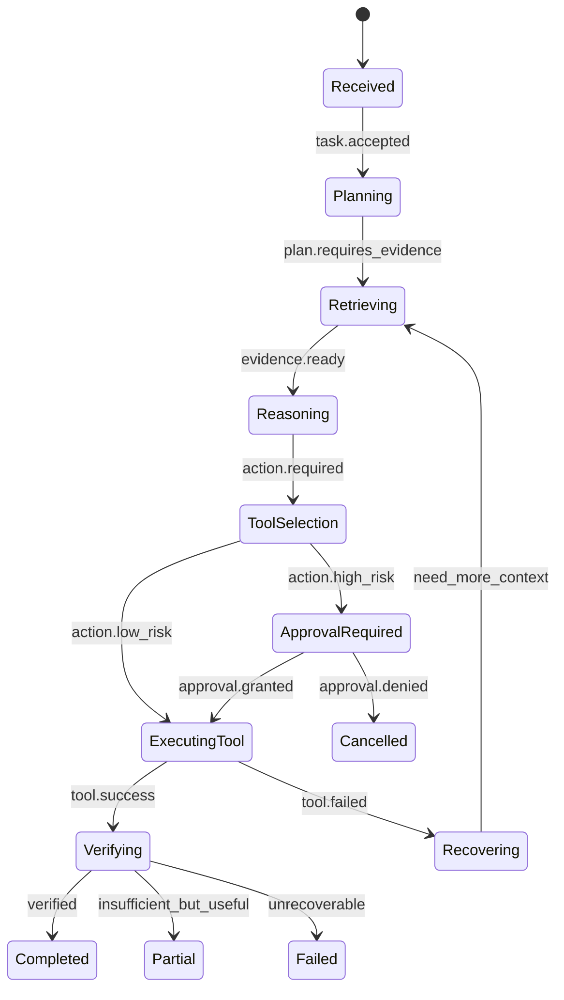
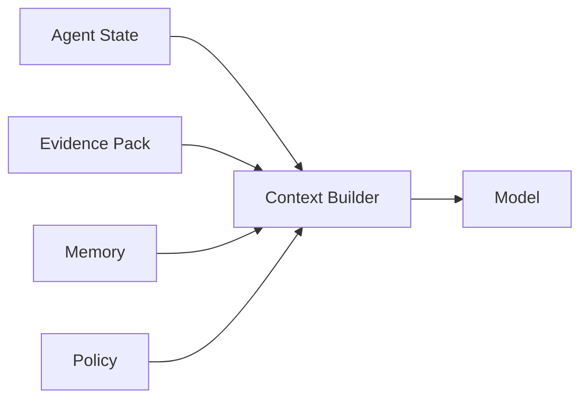
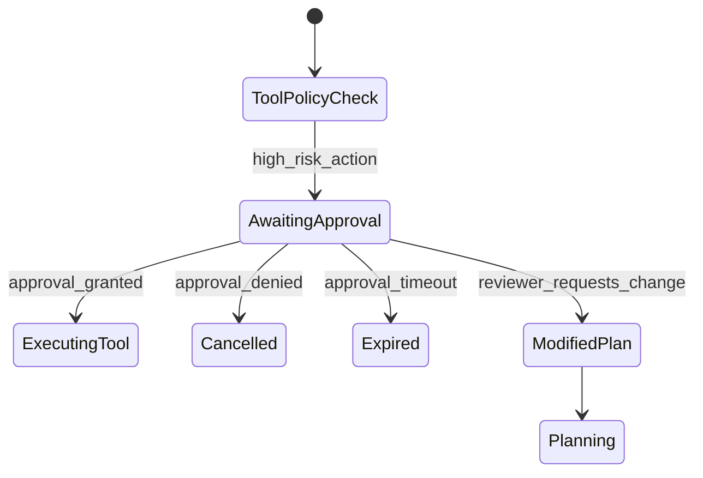
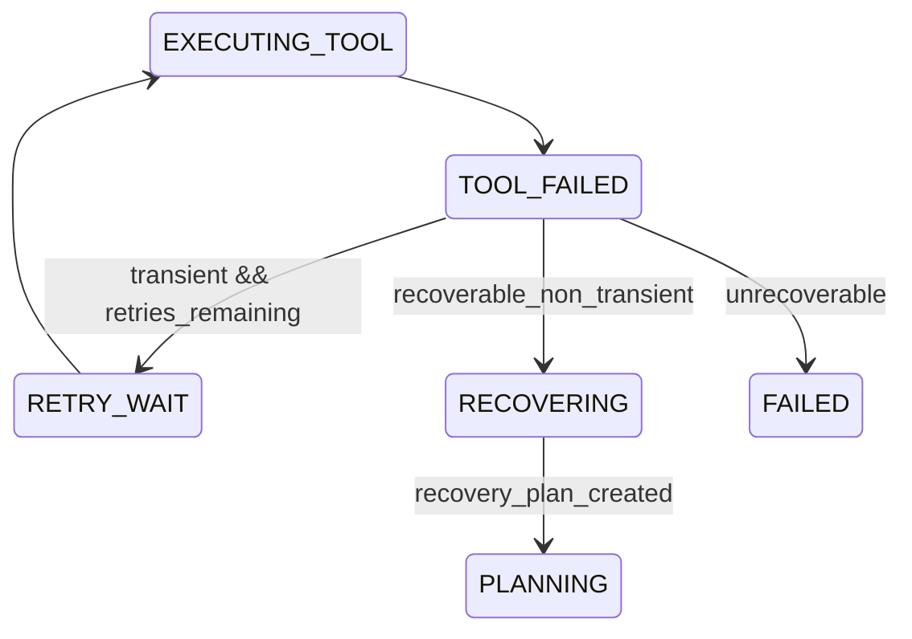
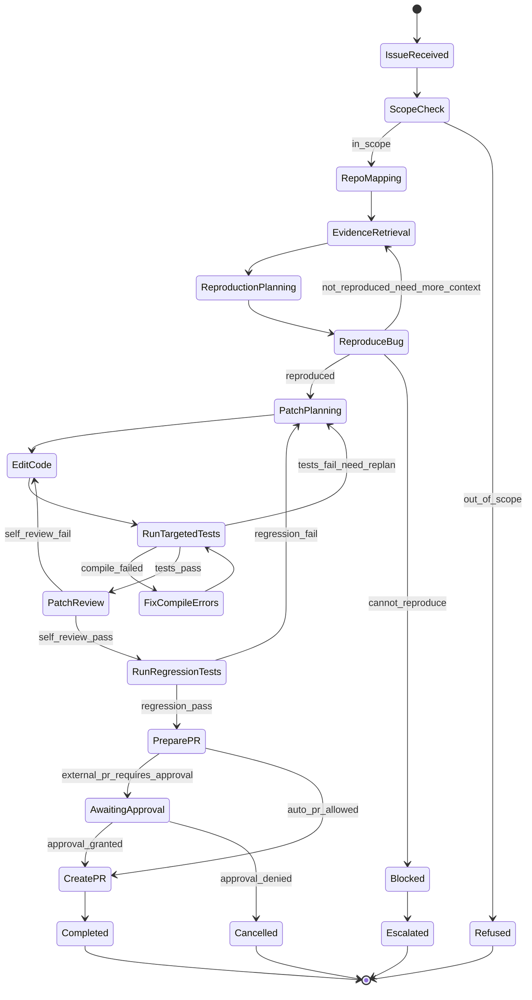
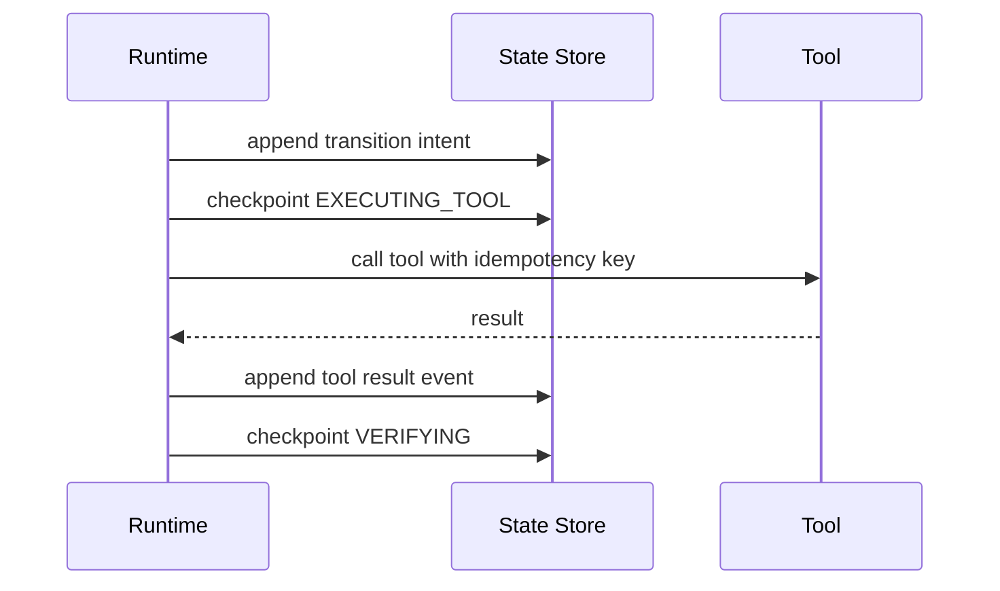

------
title: Learn Advanced Agentic AI Engineering & Autonomous Software Engineering - Part 012
description: Explicit state-machine design for reliable, replayable, pauseable, auditable, and policy-governed agentic systems.
series: learn-agentic-ai-engineering
seriesTitle: Learn Advanced Agentic AI Engineering & Autonomous Software Engineering
order: 12
partTitle: Agent State Machines
tags:
- agentic-ai
- autonomous-software-engineering
- state-machine
- durable-execution
- reliability
- ai-engineering
- series
date: 2026-06-29
---

# Part 012 — Agent State Machines

> Target part ini: mampu mendesain agent runtime sebagai **explicit state machine** sehingga agent tidak menjadi loop kabur yang sulit diuji, sulit diaudit, sulit dihentikan, dan sulit dipercaya.

Agentic system sering gagal bukan karena model tidak pintar, tetapi karena runtime-nya tidak punya struktur.

Gejala umum:

- agent mengulang tool call tanpa batas,
- agent lupa sudah melakukan apa,
- agent melakukan action sebelum approval,
- agent tidak bisa resume setelah crash,
- agent tidak bisa menjelaskan kenapa pindah langkah,
- agent sulit dibedakan antara “sedang bekerja”, “gagal”, “butuh manusia”, dan “selesai sebagian”,
- trace ada, tetapi tidak ada state semantics.

Solusinya bukan sekadar prompt lebih panjang.

Solusinya adalah memperlakukan agent sebagai **stateful distributed workflow** dengan state, event, transition, guard, action, checkpoint, dan terminal condition yang eksplisit.

---

## 1. Kaufman Framing

### 1.1 Target performance

Setelah part ini, kita ingin mampu:

- mengubah agent loop kabur menjadi state machine eksplisit,
- mendefinisikan state, event, transition, guard, dan side effect,
- membuat agent bisa pause/resume,
- mendesain checkpoint dan replay,
- menempatkan human approval sebagai state, bukan ad-hoc callback,
- menguji agent berdasarkan transition coverage,
- membuat autonomous SWE agent yang bisa survive task panjang.

Target performa praktis:

> Jika diberi task seperti “agent memperbaiki bug repo dan membuka PR”, kita bisa menggambar state machine dari issue intake sampai PR ready, termasuk state untuk planning, retrieval, editing, testing, failed tests, approval, blocked, dan terminal completion.

### 1.2 Deconstruct the skill

Skill state machine agent terdiri dari:

1. **State modelling** — apa status agent saat ini.
2. **Event modelling** — apa yang memicu transisi.
3. **Transition design** — bagaimana agent pindah state.
4. **Guard design** — kondisi yang harus benar sebelum pindah.
5. **Side-effect isolation** — action apa yang terjadi di transition/node.
6. **Checkpointing** — bagaimana state disimpan.
7. **Replay** — bagaimana history dipakai untuk audit/debug.
8. **Interrupt/HITL** — bagaimana manusia masuk ke flow.
9. **Error state** — bagaimana kegagalan direpresentasikan.
10. **Testing** — bagaimana state machine dibuktikan aman.

### 1.3 Learn enough to self-correct

Kita ingin bisa mengenali failure:

- state terlalu coarse,
- transition tidak punya guard,
- terminal state ambigu,
- error dianggap exception biasa,
- retry tidak idempotent,
- approval tidak persist,
- model output langsung menjadi action,
- replay tidak bisa dilakukan karena event log tidak lengkap.

### 1.4 Remove practice barriers

Untuk belajar efektif:

- mulai dari diagram state kecil,
- definisikan event log,
- tulis invariant,
- simulasikan happy path dan failure path,
- baru implementasi runtime.

### 1.5 Deliberate practice

Latihan utama:

> Ambil agent yang sekarang berupa while-loop. Ubah menjadi state machine dengan minimal 8 state, explicit guards, terminal states, dan replayable event log. Tambahkan satu human approval state dan satu failure recovery path.

---

## 2. Kenapa Agent Butuh State Machine

Agent runtime minimal biasanya seperti ini:

```python
while not done:
    response = llm(messages)
    if response.tool_call:
        result = call_tool(response.tool_call)
        messages.append(result)
    else:
        done = True
```

Ini berguna untuk demo, tetapi berbahaya untuk production.

Masalahnya:

- `done` terlalu miskin sebagai terminal semantics,
- tidak ada distinction antara success, partial, blocked, unsafe, failed,
- tool call tidak selalu idempotent,
- retry bisa menggandakan side effect,
- approval tidak menjadi bagian dari state,
- crash menghilangkan posisi agent,
- audit harus menebak dari chat transcript.

State machine memberi struktur:



Dengan state machine, kita bisa menjawab:

- agent sedang di mana,
- kenapa pindah ke sana,
- apa event pemicunya,
- guard apa yang lolos,
- side effect apa yang terjadi,
- apakah bisa resume,
- apakah perlu manusia,
- apakah terminal state valid.

---

## 3. Definisi Dasar

### 3.1 State

**State** adalah representasi posisi agent dalam lifecycle task.

Contoh:

- `RECEIVED`,
- `PLANNING`,
- `RETRIEVING`,
- `REASONING`,
- `AWAITING_APPROVAL`,
- `EXECUTING_TOOL`,
- `VERIFYING`,
- `RECOVERING`,
- `COMPLETED`,
- `FAILED`,
- `CANCELLED`,
- `PARTIAL`.

State yang baik harus:

- bermakna secara operasional,
- punya allowed transitions,
- punya owner/handler,
- punya timeout policy,
- punya observability semantics.

### 3.2 Event

**Event** adalah fakta bahwa sesuatu terjadi.

Contoh:

- `task.received`,
- `plan.created`,
- `evidence.ready`,
- `model.output.generated`,
- `tool.call.requested`,
- `tool.call.succeeded`,
- `tool.call.failed`,
- `approval.granted`,
- `approval.denied`,
- `verification.failed`,
- `timeout.expired`.

Event harus immutable.

Jangan simpan “current truth” sebagai event yang bisa diubah. Jika ada koreksi, tambahkan event baru.

### 3.3 Transition

**Transition** adalah perpindahan dari state A ke state B akibat event tertentu jika guard terpenuhi.

Contoh:

```yaml
transition:
  from: PLANNING
  event: plan.created
  to: RETRIEVING
  guard: plan.requires_evidence == true
  action: schedule_retrieval
```

### 3.4 Guard

**Guard** adalah kondisi yang harus benar sebelum transition terjadi.

Contoh guard:

- evidence confidence cukup,
- action risk rendah,
- approval sudah diberikan,
- tool permission tersedia,
- retry count belum melewati batas,
- budget masih cukup,
- state belum terminal,
- user identity cocok.

Guard harus berada di runtime/policy layer, bukan hanya di prompt.

### 3.5 Action / Effect

**Action** adalah side effect yang dijalankan saat state/node/transition.

Contoh:

- call model,
- call retriever,
- execute tool,
- create draft,
- write file,
- run test,
- request approval,
- emit audit event.

Action harus memiliki:

- input schema,
- output schema,
- idempotency key jika side-effectful,
- timeout,
- retry policy,
- audit event.

### 3.6 Terminal State

Terminal state adalah state akhir.

Minimal:

- `COMPLETED`,
- `FAILED`,
- `CANCELLED`,
- `REFUSED`,
- `PARTIAL`,
- `ESCALATED`.

Jangan hanya pakai `DONE`.

`DONE` menyembunyikan perbedaan penting.

---

## 4. State vs Context vs Memory vs Trace

Empat hal ini sering tercampur.

| Konsep | Fungsi | Contoh |
|---|---|---|
| State | Posisi lifecycle saat ini | `AWAITING_APPROVAL` |
| Context | Informasi yang diberikan ke model | task, evidence, instructions |
| Memory | Informasi lintas turn/session/task | prior preference, learned procedure |
| Trace | Riwayat eksekusi observability | spans, tool calls, model output |

### 4.1 State bukan transcript

Transcript bisa panjang, noisy, dan tidak selalu menunjukkan status operasional.

State harus ringkas dan eksplisit.

```json
{
  "run_id": "run_123",
  "state": "AWAITING_APPROVAL",
  "task_id": "ticket_456",
  "pending_action": {
    "type": "send_email",
    "risk": "external_visible",
    "requires_approval": true
  },
  "evidence_pack_id": "ev_789",
  "retry_count": 1,
  "budget_remaining": {
    "tool_calls": 5,
    "tokens": 12000
  }
}
```

### 4.2 Context berasal dari state, bukan sebaliknya

Model context sebaiknya dibangun dari state:



Jangan membiarkan model transcript menjadi satu-satunya state.

### 4.3 Trace bukan state machine

Trace menjelaskan apa yang terjadi. State machine menjelaskan apa yang boleh terjadi.

Keduanya diperlukan.

---

## 5. Core Agent State Taxonomy

### 5.1 Intake states

- `RECEIVED` — task masuk.
- `CLASSIFYING` — intent/risk/scope ditentukan.
- `REJECTED` — task tidak valid atau di luar scope.

### 5.2 Planning states

- `PLANNING` — agent menyusun plan.
- `PLAN_REVIEW` — plan diverifikasi.
- `PLAN_REJECTED` — plan tidak aman/tidak cukup.

### 5.3 Evidence states

- `RETRIEVING` — mencari evidence.
- `EVIDENCE_EVALUATION` — menilai evidence.
- `INSUFFICIENT_EVIDENCE` — evidence tidak cukup.
- `EVIDENCE_READY` — evidence memenuhi threshold.

### 5.4 Reasoning states

- `REASONING` — model menghasilkan keputusan/next action.
- `DECISION_REVIEW` — output diverifikasi.
- `NEEDS_REPLAN` — keputusan memerlukan plan ulang.

### 5.5 Tool states

- `TOOL_SELECTION` — tool dipilih.
- `TOOL_POLICY_CHECK` — permission/risk dicek.
- `AWAITING_APPROVAL` — menunggu manusia.
- `EXECUTING_TOOL` — tool berjalan.
- `TOOL_SUCCEEDED` — tool berhasil.
- `TOOL_FAILED` — tool gagal.

### 5.6 Verification states

- `VERIFYING` — hasil dicek.
- `REGRESSION_TESTING` — untuk SWE agent.
- `GROUNDING_CHECK` — klaim dicocokkan ke evidence.
- `SAFETY_CHECK` — policy/security check.

### 5.7 Recovery states

- `RECOVERING` — agent mencoba recovery.
- `RETRY_WAIT` — menunggu retry.
- `NEEDS_HUMAN` — butuh keputusan manusia.
- `BLOCKED` — tidak bisa lanjut tanpa external input.

### 5.8 Terminal states

- `COMPLETED`,
- `PARTIAL`,
- `FAILED`,
- `CANCELLED`,
- `REFUSED`,
- `ESCALATED`.

---

## 6. Transition Design

### 6.1 Transition table

State machine production sebaiknya punya transition table.

Contoh:

| From | Event | Guard | To | Effect |
|---|---|---|---|---|
| RECEIVED | task.accepted | scope_valid | PLANNING | create_run_record |
| PLANNING | plan.created | plan_requires_evidence | RETRIEVING | schedule_retrieval |
| RETRIEVING | evidence.found | evidence_sufficient | REASONING | build_context |
| RETRIEVING | evidence.not_found | retries_remaining | RETRIEVING | reformulate_query |
| RETRIEVING | evidence.not_found | no_retries | BLOCKED | request_input |
| REASONING | action.proposed | action_low_risk | TOOL_POLICY_CHECK | evaluate_tool_policy |
| TOOL_POLICY_CHECK | policy.pass | no_approval_needed | EXECUTING_TOOL | call_tool |
| TOOL_POLICY_CHECK | policy.requires_approval | true | AWAITING_APPROVAL | request_approval |
| AWAITING_APPROVAL | approval.granted | approver_valid | EXECUTING_TOOL | call_tool |
| AWAITING_APPROVAL | approval.denied | true | CANCELLED | emit_cancelled |
| EXECUTING_TOOL | tool.success | true | VERIFYING | verify_result |
| EXECUTING_TOOL | tool.failed | recoverable | RECOVERING | plan_recovery |
| VERIFYING | verification.pass | true | COMPLETED | emit_result |
| VERIFYING | verification.partial | true | PARTIAL | emit_partial |
| VERIFYING | verification.fail | recoverable | RECOVERING | plan_recovery |
| RECOVERING | recovery.ready | retry_budget_available | PLANNING | replan |
| RECOVERING | recovery.failed | true | FAILED | emit_failure |

### 6.2 Transition invariants

Invariant adalah aturan yang harus selalu benar.

Contoh:

```yaml
invariants:
  - terminal_state_has_no_outgoing_transition
  - external_visible_action_requires_audit_event
  - high_risk_action_requires_approval
  - tool_execution_requires_policy_pass
  - completed_requires_verification_pass
  - failed_requires_failure_reason
  - retry_count_never_exceeds_limit
  - model_output_never_directly_executes_tool_without_policy_gate
```

Invariant lebih penting daripada prompt.

Prompt bisa gagal. Runtime invariant harus tetap menahan agent.

---

## 7. Guard Design

Guard adalah safety-critical.

### 7.1 Guard categories

| Category | Contoh |
|---|---|
| Scope guard | Task berada dalam kemampuan agent |
| Permission guard | User/agent boleh akses resource |
| Evidence guard | Evidence cukup dan current |
| Risk guard | Action risk dalam batas otonomi |
| Budget guard | Token/tool/time masih cukup |
| Retry guard | Retry belum melewati limit |
| Approval guard | Approval valid dari role yang benar |
| Consistency guard | State belum berubah oleh event lain |
| Idempotency guard | Side effect belum pernah dijalankan untuk key sama |

### 7.2 Guard as code

Contoh:

```python
def can_execute_tool(state, proposed_action, policy):
    if state.current != "TOOL_POLICY_CHECK":
        return Deny("Invalid state for tool execution")

    if not policy.is_tool_allowed(proposed_action.tool, state.agent_identity):
        return Deny("Tool not allowed for agent identity")

    if proposed_action.risk in ["external_visible", "destructive"]:
        if not state.approval or not state.approval.is_valid_for(proposed_action):
            return RequireApproval("High-risk action requires approval")

    if state.evidence_pack.confidence < policy.min_evidence_confidence(proposed_action):
        return Deny("Insufficient evidence")

    if state.has_executed_idempotency_key(proposed_action.idempotency_key):
        return Deny("Duplicate side effect")

    return Allow()
```

### 7.3 Never outsource guards to the model

Model boleh memberi rekomendasi:

> “This action seems safe.”

Runtime harus memutuskan:

> “Policy says this action is allowed.”

Perbedaannya besar.

---

## 8. Side Effects and Idempotency

Agent sering memanggil tool dengan side effect.

Contoh:

- membuat ticket,
- mengirim email,
- menulis file,
- membuat PR,
- menjalankan deployment,
- mengubah case status,
- membuat refund request.

### 8.1 Exactly-once is a trap

Dalam distributed system, exactly-once sering ilusi. Lebih realistis:

- at-least-once execution,
- idempotent side effect,
- deduplication key,
- transactional outbox,
- compensating action.

### 8.2 Idempotency key

Setiap side-effectful tool call harus punya idempotency key.

```json
{
  "tool": "create_pull_request",
  "idempotency_key": "run_123:create_pr:patch_v2",
  "input": {
    "repo": "payments-service",
    "branch": "agent/fix-refund-timeout",
    "title": "Fix refund timeout retry handling"
  }
}
```

Jika runtime crash setelah tool sukses tetapi sebelum state update, replay tidak boleh membuat PR kedua.

### 8.3 Effect log

Simpan effect log:

```json
{
  "run_id": "run_123",
  "effect_id": "effect_456",
  "idempotency_key": "run_123:create_pr:patch_v2",
  "tool": "create_pull_request",
  "status": "succeeded",
  "external_id": "pr_987",
  "timestamp": "2026-06-29T12:00:00+07:00"
}
```

### 8.4 Compensating action

Untuk aksi yang tidak bisa diulang, siapkan compensation.

| Action | Compensation |
|---|---|
| Create draft | Delete/archive draft |
| Create ticket | Close with reason |
| Create branch | Delete branch |
| Post comment | Post correction comment |
| Update case status | Revert status with audit note |
| Send email | Tidak bisa undo; perlu approval before send |

---

## 9. Checkpointing and Replay

Agent task bisa panjang. Runtime harus bisa resume.

### 9.1 Checkpoint

Checkpoint menyimpan state cukup untuk melanjutkan.

```json
{
  "run_id": "run_123",
  "state": "VERIFYING",
  "version": 17,
  "task": {
    "id": "issue_456",
    "type": "repo_bug_fix"
  },
  "plan": {
    "id": "plan_2",
    "steps_completed": ["retrieve", "edit", "test"]
  },
  "evidence_pack_id": "ev_789",
  "tool_effects": ["effect_1", "effect_2"],
  "pending": null,
  "retry_count": 2
}
```

### 9.2 Event log

Event log menyimpan history:

```json
{
  "event_id": "evt_0017",
  "run_id": "run_123",
  "previous_state": "EXECUTING_TOOL",
  "event_type": "tool.call.succeeded",
  "next_state": "VERIFYING",
  "payload_ref": "tool_result_abc",
  "timestamp": "2026-06-29T12:03:00+07:00"
}
```

### 9.3 Replay

Replay dipakai untuk:

- debugging,
- audit,
- regression testing,
- incident analysis,
- eval reproduction,
- human review.

Dalam replay, hati-hati dengan tool side effect. Gunakan mode:

- `dry_run`,
- `read_only_replay`,
- `mock_tools`,
- `effect_log_replay`.

### 9.4 Deterministic control, nondeterministic reasoning

LLM output tidak selalu deterministic. Tetapi control flow bisa dibuat deterministic.

Prinsip:

> Model boleh nondeterministic dalam proposal. Runtime harus deterministic dalam validasi dan transition.

---

## 10. Human-in-the-Loop as State

Approval bukan modal popup acak.

Approval adalah state.



### 10.1 Approval payload

```json
{
  "approval_request_id": "appr_123",
  "run_id": "run_456",
  "state": "AWAITING_APPROVAL",
  "requested_action": {
    "tool": "send_email",
    "risk": "external_visible",
    "recipient": "customer@example.com"
  },
  "evidence_summary": [
    "Customer requested refund on ticket T-100",
    "Refund amount exceeds auto-send threshold"
  ],
  "options": ["approve", "deny", "request_changes"],
  "expires_at": "2026-06-29T15:00:00+07:00"
}
```

### 10.2 Approval invariants

- Approval must bind to exact action, not generic permission.
- Approval must expire.
- Approval must include reviewer identity.
- Changed action invalidates prior approval.
- Approval denial must lead to terminal/correction path.

### 10.3 Human review is not only safety

Human review also improves:

- domain correctness,
- accountability,
- regulatory defensibility,
- user trust,
- training/eval data quality.

---

## 11. Error and Recovery States

Errors should be modelled, not just thrown.

### 11.1 Error taxonomy

| Error | Meaning | Typical transition |
|---|---|---|
| `INSUFFICIENT_CONTEXT` | Agent lacks required information | retrieve/reask/block |
| `TOOL_TIMEOUT` | Tool did not respond | retry/recover/fail |
| `TOOL_DENIED` | Policy denied tool | replan/escalate/refuse |
| `VERIFICATION_FAILED` | Output unsupported | regenerate/retrieve/escalate |
| `BUDGET_EXCEEDED` | Token/time/tool budget exhausted | partial/fail/escalate |
| `APPROVAL_TIMEOUT` | Human did not respond | cancel/escalate |
| `CONFLICTING_EVIDENCE` | Evidence disagreement | retrieve authoritative source/escalate |
| `UNSAFE_REQUEST` | Request violates policy | refuse |

### 11.2 Recovery path



### 11.3 Partial completion

Partial bukan failure biasa.

Contoh autonomous SWE:

- bug reproduced,
- failing test added,
- patch attempted,
- tests still failing.

Terminal state bisa `PARTIAL` dengan artifact:

```json
{
  "terminal_state": "PARTIAL",
  "completed": ["repo_understood", "bug_reproduced", "test_added"],
  "not_completed": ["patch_verified"],
  "blocking_reason": "Existing integration tests fail due to missing local dependency",
  "handoff": "Human should inspect Docker test dependency"
}
```

Partial yang jelas lebih baik daripada success palsu.

---

## 12. State Machine for Autonomous SWE Agent

Mari desain state machine untuk coding agent.



### 12.1 Key state data

```json
{
  "run_id": "swe_run_123",
  "state": "RunTargetedTests",
  "repo": "payments-service",
  "base_ref": "main@a13f...",
  "working_branch": "agent/fix-export-comma-filter",
  "issue": {
    "id": "GH-456",
    "summary": "Admin export fails when filters contain comma"
  },
  "hypothesis": "Filter parser splits comma inside quoted values",
  "relevant_files": [
    "src/export/AdminExportController.java",
    "src/filter/FilterParser.java"
  ],
  "tests_added": [
    "FilterParserTest.shouldPreserveCommaInQuotedFilterValue"
  ],
  "commands_run": [
    "./gradlew test --tests FilterParserTest"
  ],
  "last_test_result": "failed",
  "retry_count": 1
}
```

### 12.2 Important invariants

```yaml
swe_agent_invariants:
  - no_code_edit_before_repo_mapping
  - no_patch_without_reproduction_hypothesis
  - no_pr_before_tests_or_explicit_exception
  - no_claim_fixed_without_verification
  - no_external_pr_without_policy_check
  - no_unbounded_command_execution
  - no_secret_output_in_logs
```

### 12.3 State-specific model context

Context untuk `PatchPlanning` berbeda dari `RunTargetedTests`.

`PatchPlanning` butuh:

- issue,
- relevant files,
- reproduction result,
- current hypothesis,
- constraints.

`RunTargetedTests` butuh:

- test command,
- changed files,
- expected failure/pass condition,
- timeout.

Jangan mengirim seluruh transcript ke setiap state.

---

## 13. Implementation Blueprint

### 13.1 State enum

```python
from enum import Enum

class AgentState(str, Enum):
    RECEIVED = "RECEIVED"
    PLANNING = "PLANNING"
    RETRIEVING = "RETRIEVING"
    REASONING = "REASONING"
    TOOL_POLICY_CHECK = "TOOL_POLICY_CHECK"
    AWAITING_APPROVAL = "AWAITING_APPROVAL"
    EXECUTING_TOOL = "EXECUTING_TOOL"
    VERIFYING = "VERIFYING"
    RECOVERING = "RECOVERING"
    COMPLETED = "COMPLETED"
    PARTIAL = "PARTIAL"
    FAILED = "FAILED"
    CANCELLED = "CANCELLED"
    REFUSED = "REFUSED"
    ESCALATED = "ESCALATED"
```

### 13.2 Transition definition

```python
from dataclasses import dataclass
from typing import Callable

@dataclass(frozen=True)
class Transition:
    from_state: AgentState
    event_type: str
    to_state: AgentState
    guard: Callable
    effect: Callable | None = None
```

### 13.3 Transition application

```python
def apply_event(state, event, transitions):
    candidates = [
        t for t in transitions
        if t.from_state == state.current and t.event_type == event.type
    ]

    if not candidates:
        raise InvalidTransition(state.current, event.type)

    for transition in candidates:
        decision = transition.guard(state, event)
        if decision.allowed:
            new_state = state.with_current(transition.to_state)
            append_event_log(state, event, transition.to_state)
            save_checkpoint(new_state)

            if transition.effect:
                schedule_effect(transition.effect, new_state, event)

            return new_state

    raise GuardRejected(state.current, event.type, candidates)
```

### 13.4 Separate transition and effect

Jangan menjalankan side effect sebelum checkpoint jika efeknya sulit diulang.

Pola aman:

1. Validasi event.
2. Pilih transition.
3. Simpan event + state intent.
4. Jalankan effect dengan idempotency key.
5. Simpan effect result.
6. Emit event berikutnya.



---

## 14. Testing Agent State Machines

### 14.1 Transition coverage

Test setiap allowed transition.

```yaml
coverage:
  states_covered: 14/14
  transitions_covered: 32/36
  terminal_states_covered: 5/6
  error_paths_covered: 11/14
```

### 14.2 Invalid transition tests

Pastikan runtime menolak transition ilegal:

- `AWAITING_APPROVAL -> EXECUTING_TOOL` tanpa approval,
- `RETRIEVING -> COMPLETED` tanpa reasoning/verification,
- `FAILED -> EXECUTING_TOOL`,
- `COMPLETED -> PLANNING`,
- `TOOL_POLICY_CHECK -> EXECUTING_TOOL` saat policy denied.

### 14.3 Property-based tests

Contoh property:

- terminal state tidak punya outgoing transition,
- high-risk action selalu melewati approval,
- tool execution selalu punya policy pass,
- completed selalu punya verification pass,
- retry count tidak pernah melebihi limit.

### 14.4 Prompt fuzzing

Model output bisa aneh. Fuzz model output:

- malformed JSON,
- tool call tidak dikenal,
- missing argument,
- action melebihi permission,
- contradictory answer,
- hallucinated completion,
- instruction injection.

Runtime harus tetap aman.

### 14.5 Replay tests

Ambil event log production/simulation, replay dengan:

- same mocked model output,
- mocked tools,
- new verifier,
- updated policy.

Gunakan untuk regression.

---

## 15. Observability

State machine harus terlihat.

### 15.1 Metrics

- runs by state,
- terminal state distribution,
- average time per state,
- approval wait time,
- recovery rate,
- retry count,
- invalid transition count,
- guard rejection count,
- stuck runs,
- partial completion rate.

### 15.2 Logs

Log harus mencatat:

- run id,
- previous state,
- event,
- next state,
- guard decision,
- effect id,
- correlation id,
- identity,
- policy version.

### 15.3 Traces

Trace harus menghubungkan:

- model calls,
- retrieval calls,
- tool calls,
- guard decisions,
- verification steps,
- human approvals.

### 15.4 Stuck-state detection

Contoh alert:

```yaml
alerts:
  - name: agent_stuck_awaiting_approval
    condition: state == AWAITING_APPROVAL and age > 24h

  - name: excessive_recovery_loop
    condition: state == RECOVERING and retry_count > 3

  - name: invalid_transition_spike
    condition: invalid_transition_count > baseline * 2

  - name: high_partial_rate
    condition: terminal_state_partial_rate > 0.25
```

---

## 16. Relationship with LangGraph-style Runtime

Modern agent orchestration frameworks increasingly expose concepts that map well to state machines:

- graph nodes as execution steps,
- edges as routing/transition,
- state as shared graph data,
- checkpointing for persistence,
- interrupts for human-in-the-loop,
- streaming for visibility,
- trace/evaluation integration.

Frameworks can help, but they do not remove design responsibility.

You still need to define:

- business states,
- allowed transitions,
- guard semantics,
- terminal states,
- policy gates,
- error taxonomy,
- audit requirements.

A graph framework gives mechanics. Architecture gives meaning.

---

## 17. Common Anti-Patterns

### 17.1 Transcript as state

Using only conversation history as state makes runtime hard to inspect and resume.

Fix:

- store explicit state object,
- derive model context from state.

### 17.2 One giant `RUNNING` state

If every non-terminal condition is `RUNNING`, operations cannot reason about progress.

Fix:

- split planning, retrieval, action, verification, approval, recovery.

### 17.3 Approval outside state machine

Approval handled outside runtime causes race condition and audit gaps.

Fix:

- model approval as `AWAITING_APPROVAL`, with exact action binding.

### 17.4 Tool call directly from model output

Model output should be proposal, not authority.

Fix:

- parse, validate, guard, then execute.

### 17.5 Retry without idempotency

Retry can duplicate side effects.

Fix:

- idempotency key + effect log.

### 17.6 No terminal distinction

Everything ends as success/failure without nuance.

Fix:

- use completed, partial, failed, cancelled, refused, escalated.

### 17.7 Hidden recovery loops

Agent silently retries until budget disappears.

Fix:

- recovery state, retry budget, alert, human escalation.

---

## 18. Design Review Questions

Sebelum production, tanyakan:

1. Apa semua state yang mungkin?
2. Apa terminal states?
3. Apa event yang memicu transition?
4. Apa transition ilegal yang harus ditolak?
5. Apa guard untuk high-risk action?
6. Apa action yang punya side effect?
7. Apa idempotency key untuk action itu?
8. Apa checkpoint yang dibutuhkan untuk resume?
9. Apa yang terjadi jika model output malformed?
10. Apa yang terjadi jika tool timeout?
11. Apa yang terjadi jika approval tidak dijawab?
12. Apa yang terjadi jika evidence bertentangan?
13. Apa yang terjadi jika budget habis?
14. Bagaimana operator melihat stuck runs?
15. Bagaimana auditor merekonstruksi keputusan?

---

## 19. Practice Lab

### Lab 1 — Draw the state machine

Ambil satu agent:

- support triage,
- code fixing,
- incident analysis,
- policy Q&A,
- release assistant.

Gambar state machine dengan minimal:

- 8 non-terminal states,
- 4 terminal states,
- 2 recovery paths,
- 1 approval path,
- 1 refusal path.

### Lab 2 — Write transition table

Untuk diagram tadi, tulis table:

- from,
- event,
- guard,
- to,
- effect.

### Lab 3 — Define invariants

Tulis minimal 10 invariant.

Contoh:

- no external action without approval,
- no completed without verifier pass,
- no terminal state transition,
- no duplicate side effect.

### Lab 4 — Simulate failure

Simulasikan:

- tool timeout,
- retrieval insufficient,
- approval denied,
- model malformed output,
- verification failed,
- crash after tool success.

Pastikan state machine tetap aman.

### Lab 5 — Build replay

Simpan event log dan checkpoint. Jalankan replay dengan mock tools.

Tujuan:

- bisa melihat state sequence,
- bisa menemukan transition salah,
- bisa menjalankan regression eval.

---

## 20. What Good Looks Like

State machine agent yang matang punya karakter:

- state eksplisit,
- transition eksplisit,
- guard sebagai code/policy,
- tool side effect idempotent,
- approval sebagai state,
- error sebagai state,
- checkpoint dan replay,
- terminal state meaningful,
- observability berdasarkan state,
- model output sebagai proposal, bukan authority.

Agent yang buruk punya karakter:

- while-loop tidak terbatas,
- transcript sebagai state,
- tool execution langsung dari model,
- approval ad-hoc,
- retry tanpa idempotency,
- success palsu,
- partial tidak terlihat,
- operator tidak tahu agent sedang apa.

---

## 21. Summary

Agentic system harus diperlakukan sebagai **stateful workflow**, bukan chat loop yang kebetulan bisa memanggil tool.

Mental model utama:

1. State menjelaskan posisi lifecycle.
2. Event menjelaskan apa yang terjadi.
3. Transition menjelaskan perpindahan yang boleh.
4. Guard menjelaskan kondisi keamanan.
5. Effect menjelaskan side effect.
6. Checkpoint membuat agent bisa resume.
7. Replay membuat agent bisa diaudit.
8. Approval harus menjadi state.
9. Error harus menjadi state.
10. Terminal state harus meaningful.

Part ini menghubungkan Part 004 Agent Runtime Architecture, Part 007 Tool Calling Engineering, Part 009 Context Engineering, Part 010 Memory Architecture, dan Part 011 Agentic RAG.

Part berikutnya akan membahas **Human-in-the-Loop and Approval Gates** secara lebih detail: bagaimana mendesain review, escalation, approval policy, reviewer UX, dan auditability untuk agent yang punya potensi side effect.

---

## References

- Anthropic, “Building Effective AI Agents”, 2024.
- OpenAI Agents SDK documentation: agents, runner, tools, guardrails, tracing, sessions.
- LangGraph documentation: overview, persistence, durable execution, human-in-the-loop, stateful agents.
- Model Context Protocol specification and documentation.
- OWASP Top 10 for Large Language Model Applications.
- NIST AI Risk Management Framework and Generative AI Profile.
- SWE-bench and SWE-agent documentation for autonomous software engineering evaluation context.
