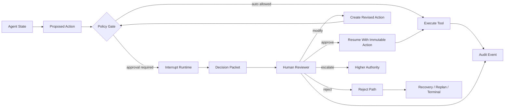
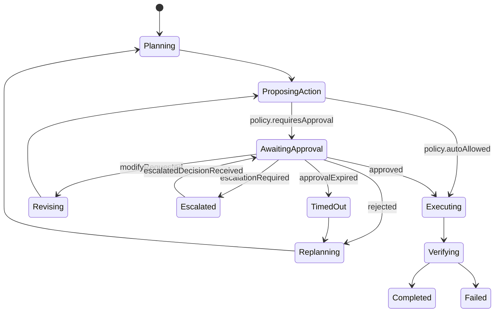
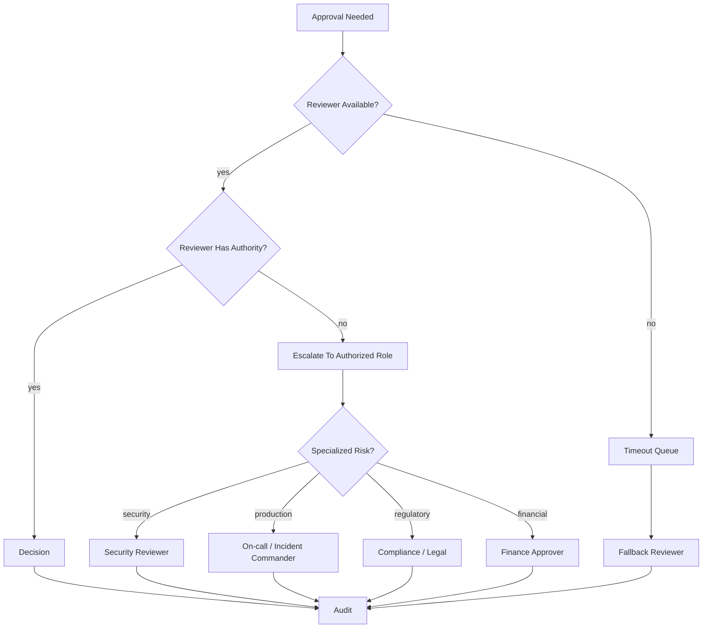
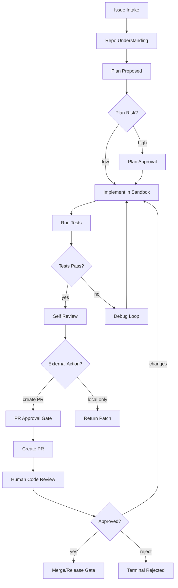
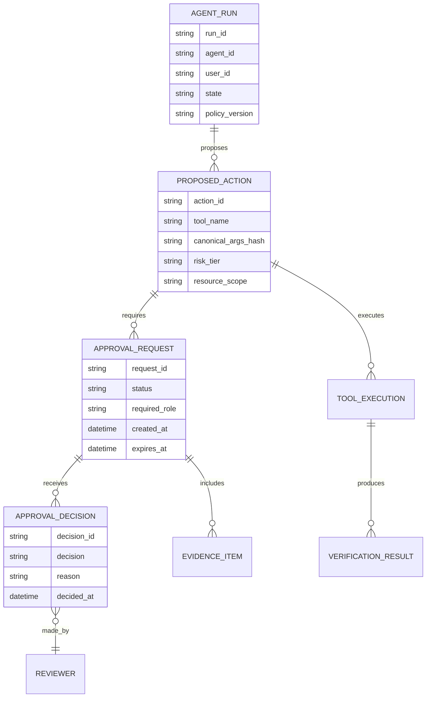
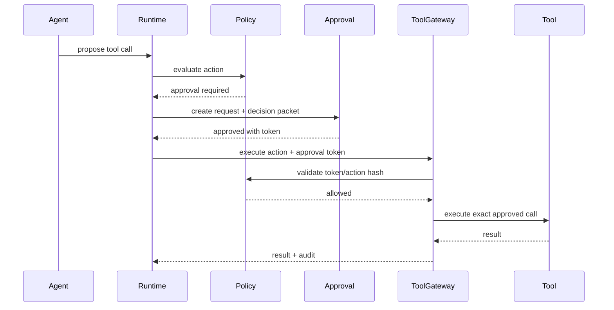
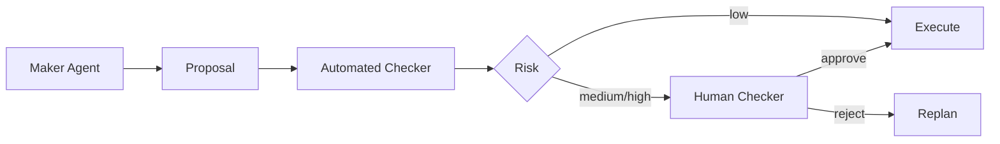
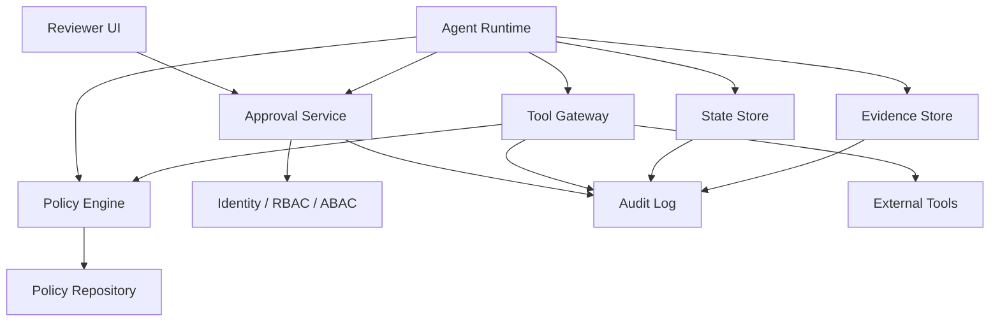

------
title: Learn Advanced Agentic AI Engineering & Autonomous Software Engineering - Part 013
description: Human-in-the-loop, approval gates, escalation, review policy, and decision-rights architecture for safe agentic systems.
series: learn-agentic-ai-engineering
seriesTitle: Learn Advanced Agentic AI Engineering & Autonomous Software Engineering
order: 13
partTitle: Human-in-the-Loop and Approval Gates
tags:
- agentic-ai
- human-in-the-loop
- approval-gates
- ai-governance
- autonomous-software-engineering
- risk-management
- ai-engineering
- series
date: 2026-06-29
---

# Part 013 — Human-in-the-Loop and Approval Gates

> Target part ini: mampu mendesain **human-in-the-loop** sebagai bagian dari runtime agent, bukan sebagai popup approval tempelan. Kita ingin agent yang bisa pause, meminta keputusan manusia dengan konteks cukup, resume dengan aman, dan meninggalkan audit trail yang defensible.

Agentic system yang dipakai di production jarang gagal hanya karena model salah menjawab.

Ia sering gagal karena:

- agent diberi authority lebih besar dari yang bisa diverifikasi,
- manusia diminta approve tanpa konteks yang cukup,
- approval terjadi setelah side effect dilakukan,
- reviewer tidak tahu konsekuensi keputusan,
- tidak ada state snapshot ketika approval diberikan,
- tidak ada alasan kenapa approval dibutuhkan,
- tidak ada bukti bahwa action yang dieksekusi sama dengan action yang disetujui,
- tidak ada escalation path saat confidence rendah,
- agent bisa bypass approval melalui tool lain.

Human-in-the-loop bukan berarti manusia harus selalu membaca semua output agent.

Human-in-the-loop berarti sistem punya **decision-rights architecture**: siapa boleh memutuskan apa, dalam kondisi apa, dengan bukti apa, dan bagaimana keputusan itu direkam.

---

## 1. Kaufman Framing

### 1.1 Target performance

Setelah part ini, kita ingin mampu:

- mengidentifikasi action agent yang membutuhkan human approval,
- membedakan approval, review, confirmation, consent, override, dan escalation,
- mendesain approval gate berdasarkan risk tier,
- membuat decision packet yang cukup untuk reviewer,
- mendesain pause/resume runtime,
- mencegah approval bypass,
- membuat approval audit trail yang bisa direkonstruksi,
- mendesain HITL untuk autonomous software engineering agent.

Target performa praktis:

> Jika diberi agent yang bisa membaca repository, mengedit file, menjalankan test, membuka PR, mengirim email, dan memanggil deployment API, kita bisa menentukan gate mana yang wajib, siapa reviewer-nya, data apa yang harus ditampilkan, state apa yang disimpan, dan apa yang terjadi jika reviewer reject/modify/timeout.

### 1.2 Deconstruct the skill

Skill HITL terdiri dari:

1. **Risk classification** — action mana yang low/high risk.
2. **Decision rights** — siapa boleh approve apa.
3. **Gate placement** — di state/transisi mana approval dibutuhkan.
4. **Decision packet design** — bukti apa yang harus dilihat manusia.
5. **Pause/resume semantics** — bagaimana runtime berhenti dan lanjut.
6. **Policy enforcement** — bagaimana agent tidak bisa bypass approval.
7. **Escalation modelling** — kapan naik ke reviewer lain.
8. **Auditability** — bagaimana keputusan direkam.
9. **Reviewer UX** — bagaimana approval tidak berubah menjadi rubber stamp.
10. **Evaluation** — bagaimana gate diuji efektif.

### 1.3 Learn enough to self-correct

Kita ingin bisa mengenali smell berikut:

- approval hanya berupa tombol `Approve` tanpa diff/evidence,
- reviewer melihat output natural language, bukan action spec,
- action yang disetujui tidak immutable,
- agent bisa mengubah tool args setelah approval,
- approval tidak terkait state checkpoint,
- rejection tidak punya path selain gagal total,
- timeout tidak didefinisikan,
- semua action butuh approval sehingga sistem tidak usable,
- tidak ada tier antara auto, notify, approve, dan dual-control,
- reviewer tidak punya authority nyata untuk modify.

### 1.4 Remove barriers

Untuk belajar efektif, kita tidak mulai dari framework.

Kita mulai dari empat pertanyaan:

1. **Apa action yang akan dilakukan agent?**
2. **Apa dampak terburuk jika action salah?**
3. **Siapa yang punya authority untuk mengizinkan action?**
4. **Bukti apa yang perlu dilihat sebelum authority itu dipakai?**

Framework apa pun hanya implementasi dari empat pertanyaan ini.

### 1.5 Practice plan

Latihan utama part ini:

- ambil satu agent workflow,
- daftar semua tool/action,
- klasifikasikan risk tier,
- tentukan gate,
- desain decision packet,
- gambar state machine,
- tulis negative test: bagaimana agent mencoba bypass gate.

---

## 2. Core Mental Model

Human-in-the-loop adalah **control boundary**.

Bukan:

```text
Agent bingung -> tanya manusia
```

Tetapi:

```text
Agent ingin melewati boundary risiko -> runtime pause -> manusia diberi decision packet -> keputusan direkam -> runtime resume dengan action immutable
```

Model dasarnya:



Kunci desainnya:

- agent boleh **mengusulkan** action,
- policy engine menentukan apakah action butuh approval,
- manusia approve **action spec**, bukan narasi,
- runtime mengeksekusi action yang sudah disetujui tanpa perubahan tersembunyi,
- semua keputusan menjadi event audit.

---

## 3. Istilah yang Harus Dibedakan

### 3.1 Human input

Manusia memberi informasi tambahan.

Contoh:

- “branch mana yang harus dipakai?”
- “apakah requirement ini benar?”
- “file konfigurasi mana yang authoritative?”

Human input bukan selalu approval.

### 3.2 Confirmation

Manusia mengonfirmasi pilihan ringan.

Contoh:

- “Gunakan timezone Asia/Jakarta?”
- “Ringkas email ini menjadi 5 bullet?”

Biasanya low risk.

### 3.3 Approval

Manusia memberi izin untuk action yang punya side effect.

Contoh:

- mengirim email,
- membuka PR,
- merge PR,
- membuat ticket,
- mengubah konfigurasi,
- memanggil API pembayaran,
- menjalankan deployment,
- menghapus data.

Approval harus terkait action spec yang eksplisit.

### 3.4 Review

Manusia menilai kualitas output sebelum output dipakai.

Contoh:

- review patch code,
- review architecture proposal,
- review incident summary,
- review legal/regulatory wording.

Review bisa menghasilkan approve, request change, reject, atau escalate.

### 3.5 Override

Manusia mengganti keputusan agent/policy.

Contoh:

- agent menolak action karena confidence rendah, tetapi senior reviewer memutuskan lanjut,
- policy menyarankan escalation, tetapi incident commander memilih rollback cepat.

Override harus lebih kuat audit-nya daripada approval biasa.

### 3.6 Escalation

Keputusan dinaikkan ke authority yang lebih tinggi atau lebih spesifik.

Contoh:

- security-sensitive change dinaikkan ke security reviewer,
- financial threshold dinaikkan ke finance approver,
- production deployment dinaikkan ke incident commander.

### 3.7 Consent

User memberi izin terkait penggunaan data, akses, atau tindakan atas nama user.

Contoh:

- memberi akses ke email,
- mengizinkan agent membaca private repository,
- mengizinkan agent menyimpan memory jangka panjang.

Consent bukan approval satu action; consent adalah izin scope.

---

## 4. HITL sebagai State, Bukan Callback

Kesalahan umum: human approval diperlakukan sebagai callback UI.

```text
if needsApproval:
    showPopup()
```

Ini terlalu dangkal.

Dalam agent runtime yang benar, approval adalah state.



Kenapa harus state?

Karena saat menunggu manusia:

- proses bisa berlangsung menit, jam, atau hari,
- runtime bisa restart,
- model version bisa berubah,
- policy version bisa berubah,
- reviewer bisa berbeda,
- action bisa expired,
- context awal harus tetap bisa direkonstruksi.

Jika approval hanya callback, sistem kehilangan determinisme.

---

## 5. Decision Rights Architecture

Decision rights menjawab:

> Siapa boleh memutuskan action apa, dalam scope apa, berdasarkan bukti apa?

### 5.1 Decision rights matrix

| Decision type | Example | Default authority | Common gate |
|---|---|---|---|
| Read-only retrieval | Search docs, read code | Agent | Auto + audit |
| Local analysis | Summarize logs, inspect tests | Agent | Auto + trace |
| Local reversible edit | Modify working branch | Agent or reviewer | Auto/approve by risk |
| External communication | Send email/comment | User/reviewer | Approval |
| Persistent state write | Create ticket/memory/record | User/system owner | Approval or policy |
| Production change | Deploy, rollback, config change | Operator/commander | Strong approval |
| Financial/legal/regulatory action | Payment, notice, filing | Domain authority | Dual control |
| Destructive action | Delete data, revoke access | Owner/admin | Strong approval + cooldown |

### 5.2 Authority is contextual

Seseorang bisa approve code change di service A, tetapi tidak di service B.

Seseorang bisa approve staging deployment, tetapi tidak production deployment.

Seseorang bisa approve cost increase sampai batas tertentu, tetapi tidak di atas threshold.

Karena itu authority harus dimodelkan sebagai tuple:

```text
authority = subject + action_type + resource_scope + environment + risk_tier + time_window
```

Contoh:

```json id="authority-tuple-example"
{
  "subject": "alice@example.com",
  "role": "service-owner",
  "action_type": "approve_pr_creation",
  "resource_scope": "repo:payments-ledger",
  "environment": "non-production",
  "risk_tier": "R2",
  "expires_at": "2026-06-29T18:00:00+07:00"
}
```

### 5.3 Agent tidak boleh menjadi authority untuk dirinya sendiri

Agent boleh mengevaluasi.

Agent boleh memberi rekomendasi.

Agent boleh menilai confidence.

Tetapi untuk action berisiko, agent tidak boleh menjadi satu-satunya authority yang membebaskan dirinya melewati gate.

Ini adalah invariant penting:

> **The actor proposing a risky action must not be the only actor authorizing that action.**

---

## 6. Risk Tier untuk Agent Action

Agar tidak semua hal butuh approval, kita perlu tier.

### 6.1 Tier sederhana

| Tier | Meaning | Example | Gate |
|---|---|---|---|
| R0 | No side effect | Read docs, inspect files | Auto |
| R1 | Local reversible side effect | Create local note, generate patch | Auto + trace |
| R2 | Persistent but reversible | Create draft, create issue, push branch | Approval or notify |
| R3 | External visible action | Send email, comment on PR, create public ticket | Approval |
| R4 | High-impact operational action | Deploy, rollback, change config | Strong approval |
| R5 | Irreversible/destructive/regulated | Delete data, payment, legal notice | Dual control + audit + cooldown |

### 6.2 Autonomous SWE risk tiers

| Action | Risk | Suggested handling |
|---|---:|---|
| Read repository files | R0 | Auto |
| Run local tests | R1 | Auto, resource budgeted |
| Modify working tree | R1/R2 | Auto in sandbox, audit diff |
| Install dependency | R2/R3 | Approval if external/supply-chain risk |
| Push branch | R2 | Approval or restricted branch policy |
| Open PR | R3 | Approval or trusted agent scope |
| Comment on PR | R3 | Approval for external repos |
| Merge PR | R4 | Human approval, branch protection |
| Deploy to staging | R3/R4 | Environment-specific gate |
| Deploy to production | R4/R5 | Strong approval, change window, rollback plan |

### 6.3 Risk is not only action type

Risk depends on:

- resource sensitivity,
- environment,
- reversibility,
- blast radius,
- data classification,
- user visibility,
- regulatory impact,
- cost impact,
- confidence,
- novelty of action,
- availability of automated verification.

A `send_email` action to yourself might be R2.

A `send_email` action to regulator/customer might be R5.

A `modify_file` action in a throwaway branch might be R1.

A `modify_file` action in production config repository might be R4.

---

## 7. Gate Placement

Approval gate harus ditempatkan **sebelum side effect**, bukan setelah.

### 7.1 Pre-action gate

Dipakai sebelum tool call berisiko.

```text
propose -> approve -> execute
```

Contoh:

- send email,
- call payment API,
- deploy,
- delete file,
- push branch.

### 7.2 Pre-plan gate

Dipakai saat rencana sendiri berisiko.

Contoh:

- agent ingin melakukan refactor besar,
- agent ingin mengubah dependency utama,
- agent ingin migrasi schema,
- agent ingin menyentuh banyak service.

Manusia approve strategi sebelum agent menghabiskan waktu/biaya.

### 7.3 Pre-commit gate

Dipakai saat agent sudah membuat perubahan, tetapi belum mem-persist ke remote.

Contoh:

- review diff sebelum commit,
- review generated config sebelum apply,
- review generated migration sebelum run.

### 7.4 Pre-release gate

Dipakai sebelum perubahan masuk environment shared/production.

Contoh:

- deployment,
- feature flag enablement,
- rollout percentage change,
- data migration.

### 7.5 Pre-exfiltration gate

Dipakai sebelum data keluar boundary.

Contoh:

- mengirim ringkasan data internal ke vendor,
- menempelkan log ke external issue tracker,
- mengirim attachment.

### 7.6 Pre-memory gate

Dipakai sebelum agent menyimpan memory jangka panjang.

Contoh:

- menyimpan preference user,
- menyimpan project fact,
- menyimpan private operational detail.

### 7.7 Post-action review

Post-action review bukan pengganti approval.

Ia berguna untuk:

- quality improvement,
- audit sampling,
- incident learning,
- model/tool evaluation,
- compliance evidence.

Tetapi post-action review tidak mencegah kerusakan.

---

## 8. Decision Packet Design

Reviewer tidak boleh diminta approve berdasarkan kalimat seperti:

```text
Agent wants to proceed. Approve?
```

Itu rubber stamp.

Reviewer perlu decision packet.

### 8.1 Minimal decision packet

```json id="decision-packet-minimal"
{
  "decision_id": "dec_20260629_000123",
  "run_id": "run_abc",
  "agent_id": "autonomous_swe_agent",
  "state": "AWAITING_APPROVAL",
  "proposed_action": {
    "tool": "github.create_pull_request",
    "args": {
      "repo": "example/payment-service",
      "branch": "agent/fix-ledger-rounding",
      "base": "main",
      "title": "Fix ledger rounding regression"
    }
  },
  "risk_tier": "R3",
  "reason_approval_required": "External visible action: PR creation in shared repository",
  "agent_rationale": "Tests pass locally and diff is limited to rounding normalization logic.",
  "evidence": [
    "diff_summary",
    "test_results",
    "files_changed",
    "known_risks"
  ],
  "allowed_decisions": ["approve", "reject", "request_changes", "escalate"],
  "expires_at": "2026-06-29T20:00:00+07:00"
}
```

### 8.2 Decision packet untuk code change

Untuk autonomous SWE, decision packet sebaiknya mencakup:

- issue/task summary,
- repo/branch/base branch,
- files changed,
- diff summary,
- tests run,
- tests not run,
- known risks,
- behavior change,
- migration risk,
- dependency changes,
- security-sensitive changes,
- rollback strategy,
- agent confidence,
- reviewer checklist.

### 8.3 Decision packet untuk external communication

Untuk email/comment/ticket:

- recipient/audience,
- exact message body,
- attachments,
- source facts,
- claims requiring verification,
- tone/sensitivity,
- data classification,
- whether message is public/permanent,
- allowed edit path.

### 8.4 Decision packet untuk deployment

Untuk deployment:

- service/environment,
- version/artifact,
- diff from current version,
- change reason,
- test status,
- migration status,
- SLO/error budget impact,
- rollback plan,
- monitoring plan,
- change window,
- owner/on-call,
- dependency/service graph impact.

### 8.5 Decision packet harus immutable

Setelah reviewer approve, action spec harus dibekukan.

Jika agent ingin mengubah args, itu action baru dan butuh gate baru.

Invariant:

> **Approved action hash must equal executed action hash.**

Contoh:

```json id="approved-action-hash"
{
  "approved_action_hash": "sha256:8d2c...",
  "executed_action_hash": "sha256:8d2c...",
  "status": "MATCH"
}
```

---

## 9. Pause/Resume Semantics

HITL production-grade membutuhkan pause/resume.

### 9.1 Saat pause

Runtime harus menyimpan:

- run id,
- current state,
- proposed action,
- context snapshot,
- relevant evidence,
- policy result,
- model output yang menghasilkan action,
- tool args canonicalized,
- reviewer candidates,
- timeout,
- resume token,
- action hash.

### 9.2 Saat resume

Runtime harus memvalidasi:

- decision valid,
- reviewer authorized,
- decision belum expired,
- action hash cocok,
- policy version masih compatible,
- resource masih dalam kondisi aman,
- run belum dibatalkan,
- approval belum dipakai sebelumnya.

### 9.3 Resume bukan regenerate

Kesalahan berbahaya:

```text
approval received -> ask model again what to do -> execute new answer
```

Yang benar:

```text
approval received -> execute approved action spec -> verify result
```

Model boleh dipanggil lagi setelah execution untuk interpretasi result, tetapi tidak boleh diam-diam mengganti action yang disetujui.

---

## 10. Approval Policy Engine

Approval tidak boleh hanya berdasarkan prompt.

Kita butuh policy engine.

### 10.1 Input policy

Policy menerima:

- actor/agent identity,
- user identity,
- action type,
- tool name,
- resource scope,
- environment,
- data classification,
- risk tier,
- confidence,
- verification status,
- historical trust score,
- organization policy,
- time/window constraints.

### 10.2 Output policy

Policy menghasilkan:

```json id="policy-decision-example"
{
  "decision": "REQUIRES_APPROVAL",
  "risk_tier": "R3",
  "required_approver_role": "repo-owner",
  "reason_codes": [
    "EXTERNAL_VISIBLE_ACTION",
    "SHARED_REPOSITORY",
    "AGENT_INITIATED_CHANGE"
  ],
  "required_evidence": [
    "diff_summary",
    "test_results",
    "risk_summary"
  ],
  "timeout_minutes": 1440
}
```

### 10.3 Policy should be deterministic

Agent boleh memberi recommendation.

Policy engine harus deterministic sejauh mungkin.

Jika gate bergantung pada natural language judgment, hasilnya sulit diuji.

Contoh buruk:

```text
If the action seems risky, ask for approval.
```

Contoh lebih baik:

```text
If action.type in [SEND_EMAIL, CREATE_PR, DEPLOY, DELETE]
or action.resource.data_classification in [CONFIDENTIAL, REGULATED]
or action.blast_radius >= TEAM
then approval required.
```

---

## 11. Approval Modes

### 11.1 Auto

Agent boleh lanjut tanpa approval.

Cocok untuk:

- read-only,
- local reasoning,
- safe sandbox action,
- reversible action dengan blast radius kecil.

Tetap perlu audit log.

### 11.2 Notify

Agent lanjut, tetapi manusia diberi notifikasi.

Cocok untuk:

- low-risk persistent action,
- generated report,
- background maintenance,
- action yang mudah dibatalkan.

### 11.3 Approve before execute

Agent pause sampai approval.

Cocok untuk:

- external visible action,
- shared-state write,
- user-facing communication,
- cost-impacting action.

### 11.4 Approve with edit

Reviewer bisa mengubah action spec.

Cocok untuk:

- email body,
- PR title/description,
- ticket content,
- release notes.

Edited action harus diperlakukan sebagai action baru yang canonical.

### 11.5 Dual control

Dua pihak berbeda harus approve.

Cocok untuk:

- regulated action,
- financial movement,
- destructive data operation,
- production deployment berisiko tinggi.

### 11.6 Break-glass

Emergency override dengan audit kuat.

Cocok untuk incident.

Break-glass harus:

- time-bound,
- reason-required,
- post-review-required,
- highly logged,
- visible to governance/security.

---

## 12. Escalation Design

Escalation bukan kegagalan.

Escalation adalah cara sistem menjaga decision quality saat kondisi melebihi authority reviewer awal.

### 12.1 Escalation triggers

Escalate ketika:

- risk tier lebih tinggi dari authority reviewer,
- confidence rendah,
- policy conflict,
- data classification tinggi,
- action menyentuh regulated domain,
- blast radius besar,
- reviewer menolak tapi agent punya evidence kuat,
- reviewer tidak merespons sampai timeout,
- automated verification gagal,
- action terjadi saat incident/change freeze.

### 12.2 Escalation paths



### 12.3 Escalation packet

Escalation harus membawa:

- original decision packet,
- reviewer decision/history,
- reason escalation,
- conflicting signals,
- time sensitivity,
- recommended next decision.

---

## 13. Reviewer UX

Reviewer UX menentukan apakah HITL benar-benar aman atau hanya compliance theater.

### 13.1 Prinsip UX

Reviewer harus melihat:

- action exact yang akan dieksekusi,
- dampak action,
- evidence ringkas,
- confidence dan uncertainty,
- apa yang belum diverifikasi,
- alternative actions,
- rollback/recovery path,
- policy reason,
- audit consequence.

Reviewer tidak boleh hanya melihat:

- raw prompt,
- chain of thought,
- narasi panjang tanpa struktur,
- tombol approve global,
- confidence score tanpa evidence.

### 13.2 Review surface untuk code diff

Review surface minimal:

```text
Task: Fix ledger rounding regression
Files changed: 3
Risk: R3 — external visible PR
Tests passed: unit, integration ledger suite
Tests not run: end-to-end settlement test
Behavior change: normalize decimal rounding before ledger write
Known risk: migration not needed; historic data not modified
Action: create PR to main
Decision: approve / request changes / reject / escalate
```

### 13.3 Jangan tampilkan semua detail sekaligus

Gunakan progressive disclosure:

1. Summary.
2. Evidence.
3. Diff/details.
4. Raw logs.
5. Full trace.

Reviewer butuh cepat memahami risiko, tetapi tetap bisa drill-down.

---

## 14. HITL untuk Autonomous Software Engineering

Autonomous SWE agent punya banyak gate alami.

### 14.1 Lifecycle gate



### 14.2 Gate examples

| Stage | Gate | Decision packet |
|---|---|---|
| Task intake | Clarification gate | ambiguous requirement, assumptions |
| Plan | Plan approval | files/components, risk, strategy |
| Edit | Sandbox boundary | diff, touched files, generated code |
| Test | Verification gate | pass/fail, coverage, skipped tests |
| Dependency | Supply-chain gate | package, version, vulnerability signal |
| PR | External action gate | title, body, branch, diff, test evidence |
| Merge | Production code gate | owner review, CI, risk, rollback |
| Release | Operational gate | deployment plan, monitoring, rollback |

### 14.3 Code review is not enough

Code review happens after patch exists.

But some agent decisions should be gated before patch:

- large refactor,
- cross-service change,
- dependency upgrade,
- schema migration,
- security-sensitive code,
- generated code touching auth/payment/regulatory logic.

Plan approval prevents wasted work and risky drift.

---

## 15. HITL Failure Modes

### 15.1 Rubber stamp approval

Reviewer sees insufficient detail and clicks approve.

Mitigation:

- structured decision packet,
- required risk summary,
- evidence links,
- reviewer checklist,
- random audit,
- reject/modify path easy.

### 15.2 Approval after side effect

Agent executes first, asks later.

Mitigation:

- policy-enforced tool gateway,
- side-effect tools unavailable without approval token,
- pre-action gate,
- audit on denied attempt.

### 15.3 Approval bypass through alternate tool

Agent cannot send email through `send_email`, but writes a file that another automation sends.

Mitigation:

- classify capabilities, not just tool names,
- shared policy engine,
- egress controls,
- downstream enforcement.

### 15.4 Mutable approved action

Reviewer approves one action, agent executes a modified one.

Mitigation:

- canonical action hash,
- immutable action spec,
- execute from approved payload,
- diff approved vs executed.

### 15.5 Reviewer lacks authority

Reviewer approves action outside their scope.

Mitigation:

- authority check at decision time,
- resource-scoped role mapping,
- dual control for high-risk action.

### 15.6 Over-gating

Everything needs approval; users ignore system or disable agent.

Mitigation:

- risk tiering,
- auto/notify/approve modes,
- trust calibration,
- progressive automation.

### 15.7 Under-gating

Agent is fast but unsafe.

Mitigation:

- threat model,
- policy tests,
- incident review,
- canary rollout,
- limit blast radius.

### 15.8 Hidden uncertainty

Agent presents uncertain output as confident.

Mitigation:

- require unresolved questions,
- require tests not run,
- require evidence quality rating,
- escalate low-confidence high-risk action.

### 15.9 Approval queue becomes bottleneck

Humans cannot keep up.

Mitigation:

- batch low-risk approvals,
- auto-approve proven patterns,
- route to correct owners,
- set SLAs,
- improve decision packet quality.

### 15.10 No post-decision learning

System never improves gate placement.

Mitigation:

- measure approval outcomes,
- analyze overrides,
- tune policy,
- use incidents as eval cases.

---

## 16. HITL Data Model

### 16.1 Core entities



### 16.2 Audit event examples

```json id="approval-audit-event"
{
  "event_type": "APPROVAL_GRANTED",
  "timestamp": "2026-06-29T12:30:45+07:00",
  "run_id": "run_abc",
  "action_id": "act_123",
  "request_id": "apr_456",
  "reviewer": "alice@example.com",
  "reviewer_roles": ["repo-owner"],
  "decision": "approve",
  "reason": "Diff is limited and tests pass. PR creation approved.",
  "approved_action_hash": "sha256:8d2c...",
  "policy_version": "policy-2026-06-01",
  "evidence_hashes": ["sha256:aa...", "sha256:bb..."]
}
```

---

## 17. Tool Gateway Enforcement

Approval harus ditegakkan di tool gateway.

Jangan percaya agent prompt untuk mematuhi gate.

### 17.1 Flow yang benar



### 17.2 Approval token requirements

Approval token should bind:

- action id,
- action hash,
- reviewer,
- authorized scope,
- expiry,
- policy version,
- allowed tool,
- allowed args,
- single-use semantics.

If any mismatch occurs, tool gateway rejects.

---

## 18. Confidence Thresholds

Confidence can help route approval, but should not be the only signal.

### 18.1 Bad use of confidence

```text
If model says confidence > 0.8, auto-execute.
```

This is weak because self-reported confidence can be poorly calibrated.

### 18.2 Better use

Combine confidence with:

- automated verification,
- evidence quality,
- risk tier,
- historical task type,
- blast radius,
- novelty,
- test pass status,
- reviewer history.

Example:

```text
Auto-execute only if:
- risk <= R1,
- all required checks pass,
- action is reversible,
- no external visibility,
- no regulated data,
- policy allows agent identity for this scope.
```

Confidence may downgrade action into approval/escalation, but should rarely upgrade a risky action into auto-execute.

---

## 19. Maker-Checker Pattern

Maker-checker adalah pola klasik yang sangat cocok untuk agent.

- **Maker** membuat proposal/action.
- **Checker** memverifikasi dan approve/reject.

Dalam agentic system:

- agent bisa menjadi maker,
- human bisa menjadi checker,
- second agent bisa menjadi preliminary checker,
- final authority tetap sesuai policy.



Penting:

- checker harus independen dari maker,
- checker harus melihat evidence,
- checker harus punya authority,
- checker decision harus direkam.

---

## 20. Approval Testing

HITL harus diuji seperti business logic.

### 20.1 Unit tests

Test policy rules:

- `send_email` requires approval,
- `read_file` does not require approval,
- `delete_customer_data` requires dual control,
- `deploy_production` requires production approver,
- expired approval token rejected,
- mismatched action hash rejected.

### 20.2 Scenario tests

Simulasikan run:

- approve path,
- reject path,
- request changes path,
- escalation path,
- timeout path,
- reviewer unauthorized path,
- policy changed while paused,
- tool unavailable after approval.

### 20.3 Red-team tests

Coba bypass:

- prompt injection meminta agent mengabaikan approval,
- tool alias dengan efek sama,
- encoded data exfiltration,
- approved action args changed,
- stale approval reused,
- reviewer identity spoofed,
- memory injection menurunkan risk tier.

### 20.4 Regression tests

Setiap incident approval menjadi eval case.

Jika agent pernah melakukan action tanpa gate yang benar, buat test yang memastikan path itu tidak terulang.

---

## 21. Metrics

### 21.1 Safety metrics

- risky action attempted,
- risky action blocked,
- approval required rate,
- approval bypass attempts,
- unauthorized decision attempts,
- expired approval attempts,
- post-action incident rate,
- policy violation rate.

### 21.2 Usability metrics

- approval latency,
- approval queue length,
- reviewer load,
- approval abandonment,
- request changes rate,
- rejection rate,
- escalation rate,
- over-gating complaints.

### 21.3 Quality metrics

- decision packet completeness,
- evidence missing rate,
- tests-not-run disclosure rate,
- reviewer override rate,
- post-review defect rate,
- agent recommendation accepted rate.

### 21.4 Calibration metrics

- high-confidence rejected actions,
- low-confidence approved actions,
- risk tier adjusted by reviewer,
- policy false positives,
- policy false negatives.

---

## 22. Production Checklist

Sebelum HITL dianggap production-ready:

- [ ] Semua side-effect tool melewati tool gateway.
- [ ] Policy engine menentukan approval requirement secara deterministic.
- [ ] Action spec canonical dan hashable.
- [ ] Approval request menyimpan context snapshot.
- [ ] Reviewer authority divalidasi.
- [ ] Approval token single-use dan expiring.
- [ ] Executed action hash dicocokkan dengan approved action hash.
- [ ] Reject/request-change/escalate path jelas.
- [ ] Timeout behavior jelas.
- [ ] Audit event lengkap.
- [ ] UI menampilkan evidence, bukan hanya narasi.
- [ ] Red-team bypass tests ada.
- [ ] Metrics safety/usability dipantau.
- [ ] Break-glass path tersedia untuk incident.
- [ ] Post-incident review memperbarui policy/evals.

---

## 23. Reference Architecture



Komponen:

- **Agent Runtime** — menjalankan state machine.
- **Policy Engine** — menentukan gate.
- **Approval Service** — membuat approval request dan menerima decision.
- **Reviewer UI** — menampilkan decision packet.
- **Identity Service** — memvalidasi authority.
- **Tool Gateway** — mengeksekusi action yang sudah authorized.
- **State Store** — menyimpan checkpoint.
- **Evidence Store** — menyimpan diff/log/test result.
- **Audit Log** — merekam semua event.

---

## 24. Common Design Decisions

### 24.1 Apakah approval harus synchronous?

Tidak selalu.

- Low-latency UX: synchronous approval.
- Long-running workflow: async approval queue.
- Incident: synchronous with timeout/escalation.
- Batch maintenance: async batch approval.

### 24.2 Apakah reviewer bisa edit output?

Boleh, tetapi edited output menjadi action baru.

Jangan memperlakukan edit sebagai “approval atas action lama”.

### 24.3 Apakah approval bisa didelegasikan?

Bisa jika policy mendukung delegated authority.

Delegasi harus:

- explicit,
- scoped,
- time-limited,
- auditable.

### 24.4 Apakah agent boleh memilih reviewer?

Agent boleh merekomendasikan reviewer.

Policy/ownership system harus menentukan reviewer yang sah.

### 24.5 Apakah approval bisa otomatis berdasarkan sejarah?

Bisa secara bertahap, tetapi hanya untuk pola yang:

- low risk,
- sering terjadi,
- punya verification kuat,
- punya rollback mudah,
- sudah punya data historis aman.

---

## 25. Practice: Design HITL for a Coding Agent

### 25.1 Scenario

Agent diberi task:

```text
Fix a production bug in payment-service where ledger rounding creates a one-cent mismatch.
Agent can read repo, modify files, run tests, install dependencies, push branch, create PR, and comment on the PR.
```

### 25.2 Task

Buat:

1. risk tier untuk setiap tool,
2. approval gate placement,
3. decision packet untuk create PR,
4. decision packet untuk dependency install,
5. rejection path,
6. escalation path jika diff menyentuh settlement module,
7. audit event untuk approval.

### 25.3 Expected answer outline

Minimal jawaban bagus:

- read repo: R0 auto,
- modify sandbox branch: R1 auto,
- install dependency: R2/R3 approval jika package baru,
- push branch: R2 approval atau restricted token,
- create PR: R3 approval,
- comment PR: R3 approval if external visible,
- settlement module touched: escalate to domain owner,
- test result included,
- action hash immutable,
- reject path returns to planning/edit state.

---

## 26. Summary

Human-in-the-loop yang baik bukan sekadar manusia di tengah alur.

Ia adalah kombinasi dari:

- risk tier,
- decision rights,
- approval gates,
- state checkpoint,
- immutable action spec,
- evidence packet,
- authority validation,
- tool gateway enforcement,
- escalation,
- audit,
- evaluation.

Prinsip paling penting:

> Agent boleh cepat, tetapi authority harus eksplisit.

Jika authority tidak eksplisit, autonomy akan berubah menjadi liability.

---

## 27. References

- OpenAI Agents SDK — Human-in-the-loop approval flow.
- LangGraph documentation — interrupts, persistence, pause/resume, human-in-the-loop patterns.
- Anthropic — Building effective agents; workflow vs agent distinction and simplicity guidance.
- OWASP Top 10 for LLM Applications — excessive agency, prompt injection, insecure output handling, sensitive information disclosure.
- OWASP Agentic Applications / Agentic Skills guidance — agent-specific risk framing.
- NIST AI Risk Management Framework and Generative AI Profile — governance, measurement, mapping, and lifecycle risk management.
