------
title: Learn Advanced Agentic AI Engineering & Autonomous Software Engineering - Part 016
description: Production-ready agentic design patterns: router, planner-executor, evaluator-optimizer, verifier, tool firewall, policy proxy, sandboxed actor, memory curator, and autonomous SWE patterns.
series: learn-agentic-ai-engineering
seriesTitle: Learn Advanced Agentic AI Engineering & Autonomous Software Engineering
order: 16
partTitle: Agentic Design Patterns
tags:
- agentic-ai
- design-patterns
- autonomous-software-engineering
- ai-architecture
- agent-runtime
- ai-engineering
- series
date: 2026-06-29
---

# Part 016 — Agentic Design Patterns

> Target part ini: memiliki katalog **agentic design patterns** yang bisa dipakai untuk mendesain sistem agentic produksi secara sadar: kapan dipakai, kapan dihindari, invariants apa yang harus dijaga, failure mode apa yang harus dimonitor, dan bagaimana pattern dikombinasikan untuk autonomous software engineering.

Design pattern bukan template untuk di-copy.

Design pattern adalah nama untuk struktur solusi yang sering muncul.

Dalam agentic AI, pattern sangat berguna karena banyak engineer tersesat di dua ekstrem:

1. Semua hal dibuat deterministic workflow sehingga sistem kaku dan tidak bisa menangani variasi.
2. Semua hal dibuat open-ended agent sehingga sistem tidak terkendali.

Top 1% agentic engineer tidak bertanya:

```text
Framework apa yang paling bagus?
```

Mereka bertanya:

```text
Control structure apa yang sesuai dengan uncertainty, risk, tool authority, verification cost, dan business impact dari task ini?
```

Part ini adalah katalog pola desain untuk menjawab pertanyaan itu.

---

## 1. Kaufman Framing

### 1.1 Target performance

Setelah part ini, kita ingin mampu:

- memilih pattern berdasarkan problem, bukan tren,
- membedakan workflow pattern, agent loop pattern, tool safety pattern, memory pattern, dan autonomous SWE pattern,
- menggabungkan pattern tanpa menciptakan prompt spaghetti,
- mengenali anti-pattern sejak desain,
- menjelaskan invariants setiap pattern,
- mendesain reference architecture agentic system produksi,
- membuat evaluasi per-pattern.

Target praktis:

> Jika diberi requirement “buat agent yang bisa membaca issue GitHub, memahami repo, membuat patch, menjalankan test, meminta approval, dan membuka PR”, kita bisa memilih kombinasi pattern yang tepat: issue router, repo mapper, planner-executor, sandboxed coder, test verifier, review gate, policy proxy, PR creator, trace recorder.

### 1.2 Deconstruct the skill

Skill pattern design terdiri dari:

1. **Problem characterization** — task deterministic atau open-ended?
2. **Risk classification** — side effect rendah atau tinggi?
3. **Control-flow selection** — chain, route, loop, graph, supervisor?
4. **Verification design** — output bisa diuji otomatis atau perlu reviewer?
5. **Tool boundary** — tool mana yang boleh dipanggil oleh siapa?
6. **State design** — ephemeral, persistent, shared, atau audit-only?
7. **Failure handling** — retry, fallback, escalation, stop?
8. **Evaluation** — metric apa yang membuktikan pattern berhasil?

### 1.3 Learn enough to self-correct

Smell yang harus dikenali:

- pattern dipilih karena framework default,
- router memakai prompt besar tanpa label/criteria jelas,
- planner membuat plan terlalu panjang dan tidak pernah direvisi,
- evaluator memberi pujian umum tanpa rubric,
- reflection dipakai sebagai ritual tanpa evidence,
- tool gateway tidak punya policy,
- memory curator menyimpan semua hal,
- multi-agent dipakai untuk task linear,
- human approval dipakai terlalu akhir,
- autonomous SWE agent menulis patch sebelum reproduksi masalah.

### 1.4 Remove barriers

Mulai dari 5 pertanyaan:

```text
1. Apa yang diketahui pasti?
2. Apa yang tidak pasti?
3. Apa action yang punya side effect?
4. Apa yang bisa diverifikasi otomatis?
5. Di mana manusia harus masuk?
```

Jawaban ini menentukan pattern.

---

## 2. Pattern Taxonomy

```mermaid
flowchart TD
    A[Agentic Design Patterns] --> B[Control Flow Patterns]
    A --> C[Tool & Capability Patterns]
    A --> D[Quality & Verification Patterns]
    A --> E[Memory & Context Patterns]
    A --> F[Safety & Governance Patterns]
    A --> G[Autonomous SWE Patterns]

    B --> B1[Prompt Chain]
    B --> B2[Router]
    B --> B3[Planner Executor]
    B --> B4[Supervisor Worker]
    B --> B5[Event Driven Agent]

    C --> C1[Tool Gateway]
    C --> C2[Tool Firewall]
    C --> C3[Sandboxed Actor]
    C --> C4[Capability Broker]

    D --> D1[Evaluator Optimizer]
    D --> D2[Verifier]
    D --> D3[Critic Reviewer]
    D --> D4[Confidence Gate]

    E --> E1[Context Builder]
    E --> E2[Memory Curator]
    E --> E3[Retrieval Router]

    F --> F1[Policy Proxy]
    F --> F2[Approval Gate]
    F --> F3[Audit Event Sourcing]

    G --> G1[Repo Mapper]
    G --> G2[Patch Loop]
    G --> G3[Test First Repair]
    G --> G4[PR Review Agent]
```

Kita akan bahas pattern dalam kategori, tetapi real system biasanya menggabungkan beberapa pattern.

---

## 3. Control Flow Patterns

## 3.1 Prompt Chain Pattern

### Intent

Memecah pekerjaan menjadi langkah berurutan yang output-nya menjadi input untuk langkah berikutnya.

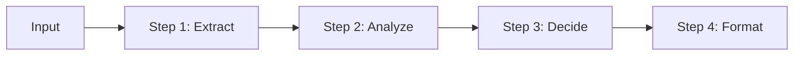

### Use when

- task punya urutan natural,
- setiap langkah bisa divalidasi,
- output intermediate berguna,
- risiko lebih rendah jika dipisah.

### Avoid when

- task membutuhkan eksplorasi bebas,
- urutan tidak diketahui di awal,
- tiap langkah membutuhkan banyak replanning,
- output intermediate sulit divalidasi.

### Example

Customer support refund flow:

1. classify issue,
2. retrieve order,
3. check refund policy,
4. produce response,
5. request approval if refund amount high.

### Invariants

- setiap step punya input/output schema,
- step tidak boleh diam-diam melewati validation,
- failure step harus menghentikan chain atau masuk fallback,
- context step berikutnya hanya menerima data yang perlu.

### Failure modes

- error awal menyebar ke step berikutnya,
- terlalu banyak step menambah latency,
- chain menjadi brittle,
- validation terlalu lemah.

---

## 3.2 Router Pattern

### Intent

Mengirim task ke agent/tool/workflow yang tepat berdasarkan intent, domain, risk, atau capability.

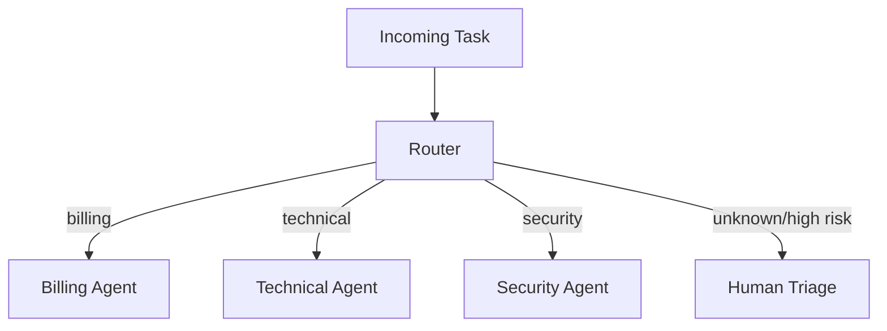

### Use when

- input bervariasi,
- ada specialist berbeda,
- tool/capability punya boundary jelas,
- salah routing berdampak signifikan.

### Avoid when

- semua route melakukan hal yang sama,
- router tidak punya label yang jelas,
- confidence routing tidak diukur,
- task high-risk langsung diroute tanpa guard.

### Router output schema

```json
{
  "route": "security_review",
  "confidence": 0.87,
  "reason": "Task asks whether patch introduces authorization bypass",
  "risk_level": "high",
  "fallback": "human_security_reviewer"
}
```

### Invariants

- route set terbatas dan terdokumentasi,
- router boleh menjawab `unknown`,
- confidence rendah harus fallback,
- high-risk route harus policy-check,
- routing decisions dilog dan dievaluasi.

### Failure modes

- overconfident wrong route,
- route explosion,
- router prompt menjadi dumping ground,
- fallback tidak pernah diuji.

---

## 3.3 Planner-Executor Pattern

### Intent

Memisahkan pembuatan rencana dari eksekusi langkah.

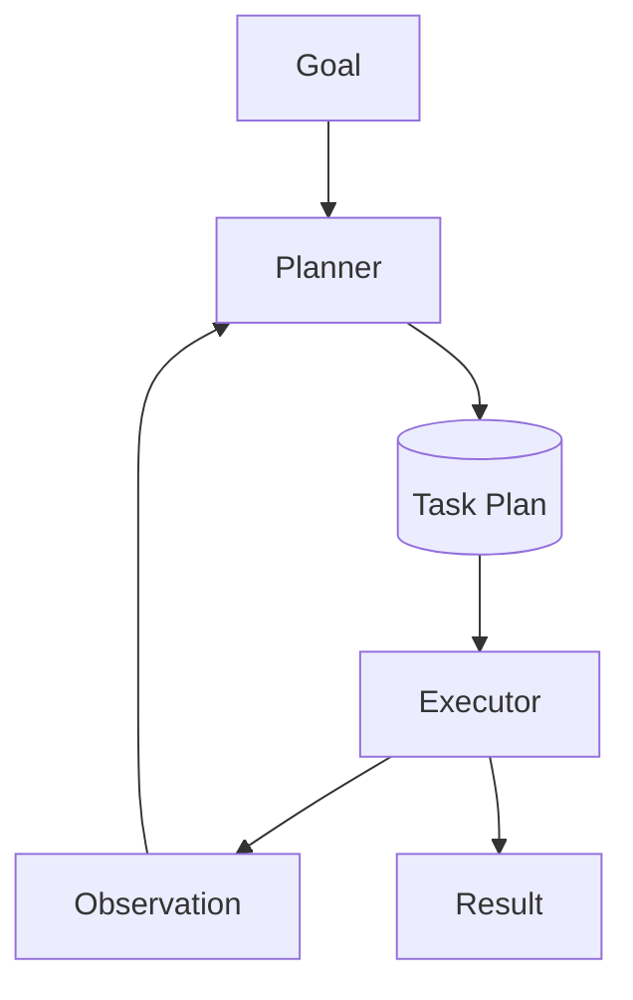

### Use when

- task multi-step,
- urutan kerja tidak trivial,
- perlu tracking progress,
- execution perlu tool calls,
- plan bisa direvisi berdasarkan observation.

### Avoid when

- task sederhana,
- planning cost lebih mahal dari execution,
- planner membuat plan abstrak tanpa acceptance criteria,
- executor bebas mengubah goal tanpa mekanisme replanning.

### Plan schema

```json
{
  "goal": "Fix issue #712",
  "steps": [
    {
      "id": "reproduce",
      "objective": "Reproduce failing behavior",
      "expected_evidence": "failing test or command output",
      "allowed_tools": ["shell", "file_read"],
      "done_when": "Failure is observed and artifact is stored"
    },
    {
      "id": "patch",
      "objective": "Create minimal code fix",
      "depends_on": ["reproduce"],
      "allowed_tools": ["file_read", "file_write"],
      "done_when": "Diff is generated and scoped to relevant files"
    }
  ]
}
```

### Invariants

- plan step punya `done_when`,
- executor reports observation,
- planner can replan on failure,
- plan has budget,
- execution cannot exceed authority.

### Failure modes

- plan terlalu panjang,
- plan tidak berdasar evidence,
- executor melakukan hidden work,
- replanning loop tak berhenti,
- plan sukses secara teks tetapi action gagal.

---

## 3.4 Orchestrator-Worker Pattern

### Intent

Orchestrator memecah task menjadi subtask dan mendelegasikan ke worker specialist.

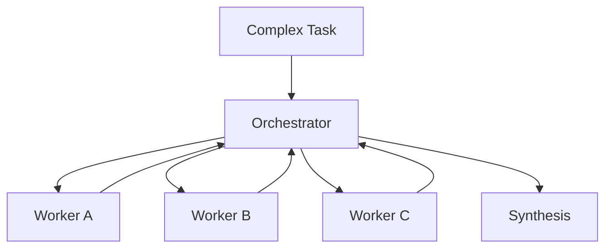

### Use when

- task kompleks dan bisa diparalelkan,
- worker punya expertise/tool berbeda,
- synthesis butuh owner tunggal,
- hasil worker perlu digabung.

### Avoid when

- subtask tidak independen,
- orchestrator tidak bisa menilai hasil,
- worker hanya persona berbeda,
- context sharing tidak dikontrol.

### Invariants

- orchestrator owns final decision,
- worker punya output contract,
- worker tidak saling mengubah state sembarangan,
- synthesis cites evidence per worker,
- conflict resolution defined.

### Failure modes

- duplicate work,
- inconsistent assumptions,
- synthesis hallucination,
- hidden disagreement,
- cost explosion.

---

## 3.5 Event-Driven Agent Pattern

### Intent

Agent bereaksi terhadap event, bukan hanya synchronous request-response.

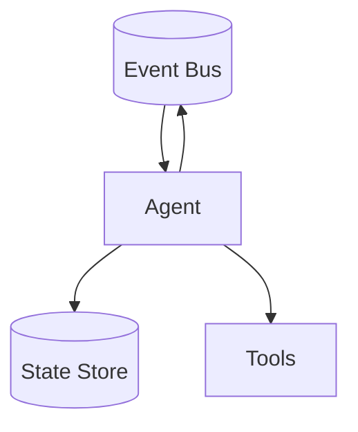

### Use when

- task panjang,
- ada external triggers,
- perlu decoupling,
- workflow bisa pause/resume,
- banyak observer seperti audit, metrics, policy monitor.

### Avoid when

- ordering ketat tapi event semantics belum matang,
- idempotency belum dirancang,
- duplicate event tidak ditangani,
- state transition tidak eksplisit.

### Invariants

- events immutable,
- handlers idempotent,
- event has schema version,
- causation/correlation tracked,
- state changes are guarded.

---

## 4. Tool and Capability Patterns

## 4.1 Tool Gateway Pattern

### Intent

Semua tool calls melewati gateway yang melakukan validation, policy check, logging, retry, timeout, and redaction.

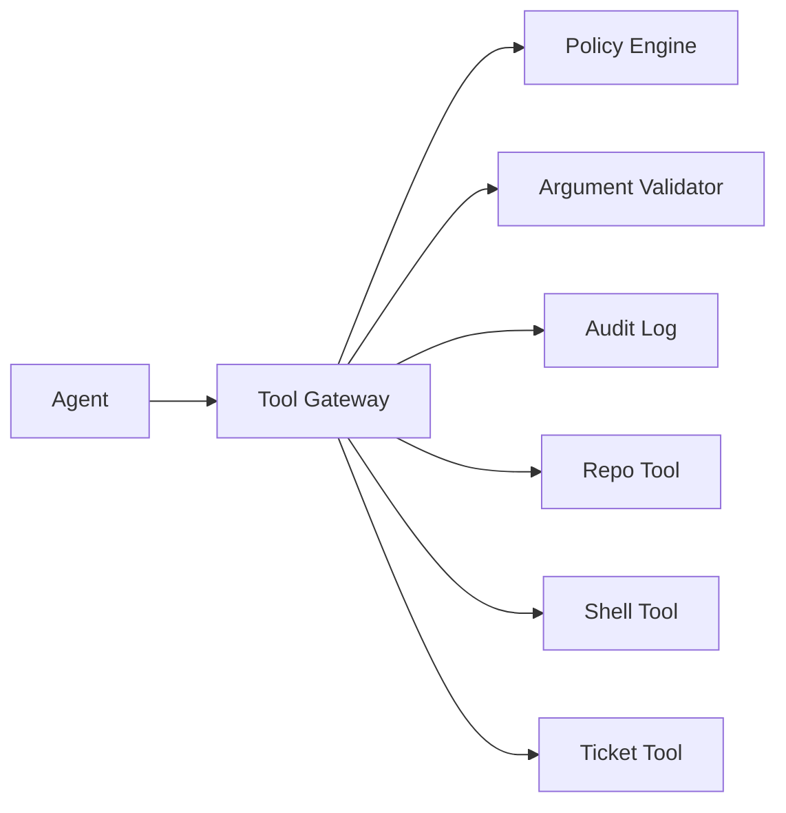

### Use when

- agent punya banyak tools,
- tool bisa melakukan side effect,
- security/audit penting,
- multi-tenant system,
- tool schema berubah.

### Avoid when

- prototype sangat kecil dan no side effect,
- gateway hanya pass-through tanpa value.

### Invariants

- no direct tool access bypassing gateway,
- arguments validated,
- result classified by trust level,
- tool call traced,
- side-effecting tool requires idempotency.

### Failure modes

- gateway terlalu permissive,
- gateway tidak memahami semantics,
- logging membocorkan secrets,
- retry menggandakan side effect.

---

## 4.2 Tool Firewall Pattern

### Intent

Membatasi tool yang bisa dilihat/dipanggil agent berdasarkan task, role, state, policy, and risk.

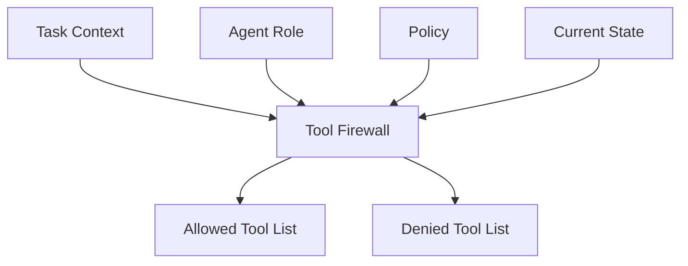

### Use when

- banyak tools tersedia,
- beberapa tool high-risk,
- prompt injection risk tinggi,
- agent roles berbeda,
- task scope harus ketat.

### Avoid when

- tool set kecil dan read-only,
- policy belum jelas.

### Example

Coder agent saat tahap patch:

Allowed:

- read files,
- write allowed source/test files,
- run focused tests.

Denied:

- git push,
- modify deployment config,
- external network,
- read secrets.

### Invariants

- tool visibility is least privilege,
- denied tool not shown to model when possible,
- runtime still enforces denial,
- tool availability can change by state.

---

## 4.3 Sandboxed Actor Pattern

### Intent

Agent melakukan tindakan di sandbox yang membatasi filesystem, network, process, credentials, and runtime resources.

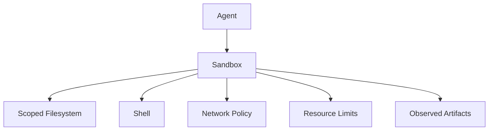

### Use when

- agent menjalankan command,
- agent mengedit code,
- agent membaca file tidak sepenuhnya trusted,
- autonomous SWE workflow,
- browser/computer-use action.

### Avoid when

- sandbox illusion saja tanpa enforcement,
- secrets tersedia di environment,
- egress tidak dikontrol.

### Invariants

- no production credentials in sandbox,
- network deny by default,
- filesystem scoped,
- command allowlist or policy,
- artifacts captured,
- sandbox disposable.

### Failure modes

- secret leakage,
- supply-chain download during test,
- persistent compromised workspace,
- runaway process.

---

## 4.4 Capability Broker Pattern

### Intent

Agent meminta capability, broker mengevaluasi apakah capability diberikan berdasarkan identity, task, state, and approval.

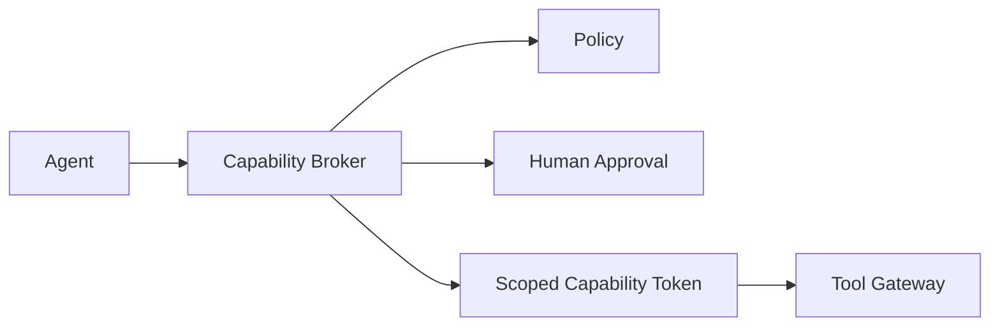

### Use when

- capability high-risk,
- privilege harus temporary,
- need dynamic escalation,
- audit penting.

### Example

Agent awalnya hanya boleh read repo.

Setelah root cause ditemukan dan approval diberikan, agent mendapat token scoped untuk edit dua file.

### Invariants

- capabilities expire,
- capabilities scoped to task,
- capabilities auditable,
- capability grant is separate from model output.

---

## 5. Quality and Verification Patterns

## 5.1 Evaluator-Optimizer Pattern

### Intent

Satu component menghasilkan output; evaluator menilai; optimizer memperbaiki sampai threshold tercapai atau budget habis.

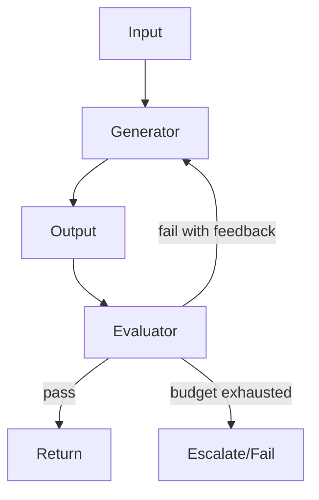

### Use when

- quality bisa dinilai dengan rubric,
- output bisa diperbaiki iteratif,
- task tidak punya side effect selama iterasi,
- improvement lebih murah dari human review.

### Avoid when

- evaluator tidak lebih reliable dari generator,
- rubric kabur,
- loop tidak punya stop condition,
- output butuh ground truth eksternal tapi evaluator tidak punya evidence.

### Invariants

- evaluator uses rubric,
- feedback specific,
- max iterations set,
- pass threshold defined,
- final output includes evaluation summary.

### Failure modes

- self-congratulation loop,
- evaluator accepts style over correctness,
- cost explosion,
- regression after optimization.

---

## 5.2 Verifier Pattern

### Intent

Memisahkan generation dari verification menggunakan deterministic checks, tools, tests, or independent model review.

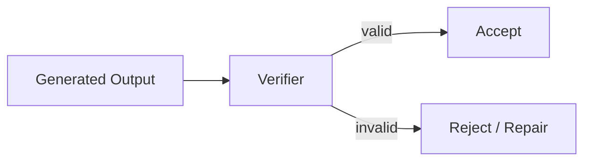

### Use when

- output punya correctness criteria,
- ada tool/test/static analyzer,
- safety matters,
- hallucinated success harus dicegah.

### Examples

- code patch verified by tests,
- JSON verified by schema,
- citation verified by source existence,
- policy decision verified by policy engine,
- SQL query verified by parser and allowlist.

### Invariants

- verifier independent of generator when possible,
- verifier result persisted,
- failure blocks action,
- verifier has known limitations.

---

## 5.3 Critic-Reviewer Pattern

### Intent

Reviewer agent menilai output berdasarkan rubric dan memberikan actionable feedback.

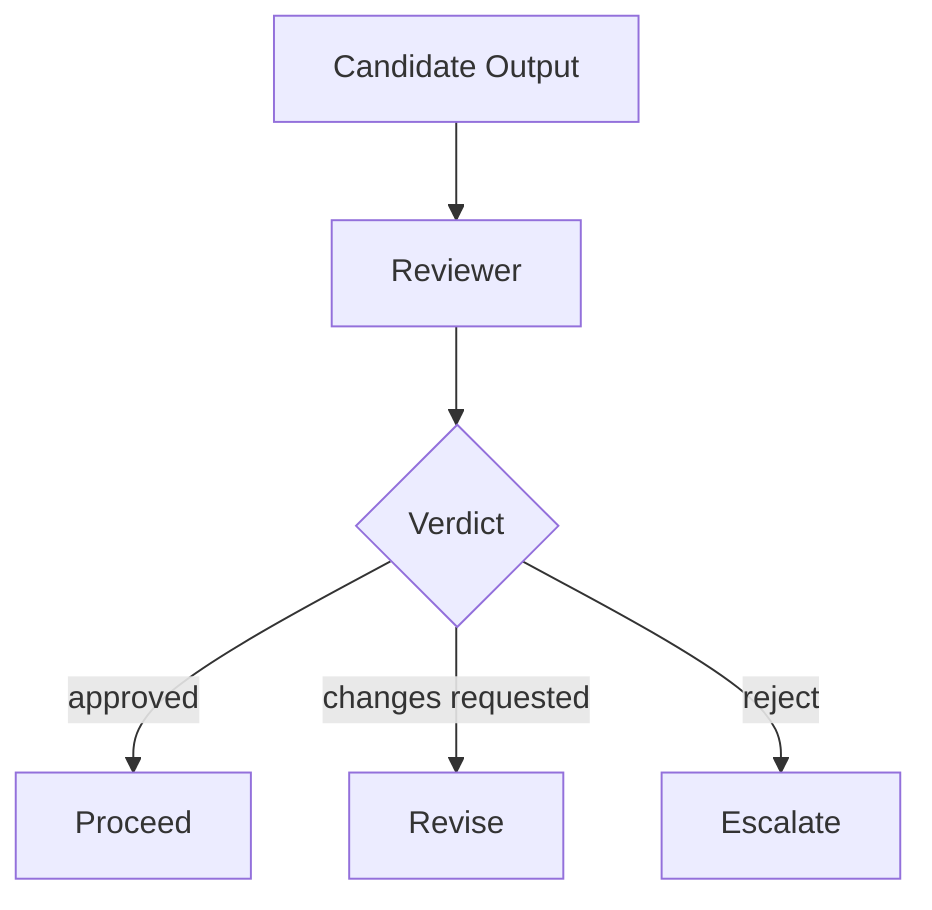

### Use when

- output complex,
- deterministic verifier tidak cukup,
- review criteria bisa ditulis jelas,
- reviewer punya konteks berbeda dari generator.

### Avoid when

- reviewer membaca konteks yang sama dan hanya mengulang,
- rubric tidak spesifik,
- review result tidak structured,
- reviewer tidak bisa block.

### Review schema

```json
{
  "verdict": "changes_requested",
  "risk_level": "medium",
  "findings": [
    {
      "severity": "high",
      "category": "correctness",
      "evidence_ref": "diff://patch-1",
      "required_action": "Add regression test for null customer"
    }
  ]
}
```

---

## 5.4 Confidence Gate Pattern

### Intent

Mengarahkan output berdasarkan confidence, evidence quality, and risk.

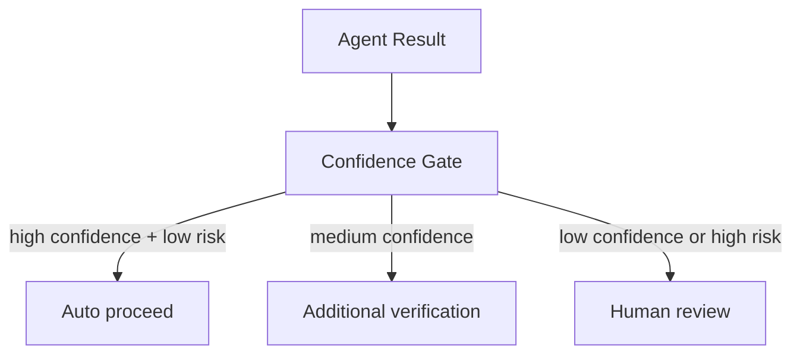

### Use when

- confidence bisa dihitung dari beberapa sinyal,
- cost of false positive berbeda dengan false negative,
- escalation path tersedia.

### Confidence signals

- schema valid,
- evidence present,
- deterministic tests pass,
- reviewer agrees,
- tool result consistent,
- no policy warning,
- task within known domain,
- no untrusted instruction conflict.

### Invariants

- confidence is not just model self-score,
- risk modifies threshold,
- low confidence has safe fallback.

---

## 6. Memory and Context Patterns

## 6.1 Context Builder Pattern

### Intent

Membangun context packet minimal, relevant, fresh, and safe untuk model.

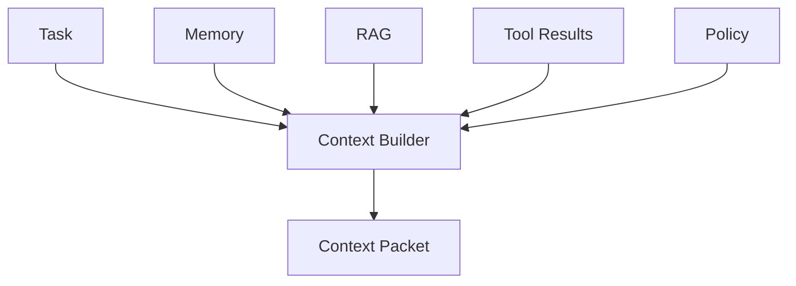

### Use when

- context banyak,
- source trust berbeda,
- model context window terbatas,
- auditability penting.

### Invariants

- context has source refs,
- untrusted content isolated,
- stale context marked,
- irrelevant context excluded,
- context packet persisted or reconstructable.

---

## 6.2 Retrieval Router Pattern

### Intent

Memilih retrieval source berdasarkan intent dan question type.

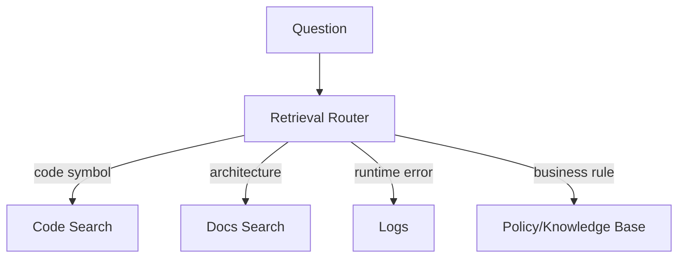

### Use when

- banyak knowledge sources,
- vector search saja tidak cukup,
- source reliability berbeda,
- retrieval cost harus dikontrol.

### Invariants

- source selected intentionally,
- retrieval query logged,
- results scored and filtered,
- final answer cites evidence.

---

## 6.3 Memory Curator Pattern

### Intent

Memutuskan apa yang layak disimpan ke memory jangka panjang.

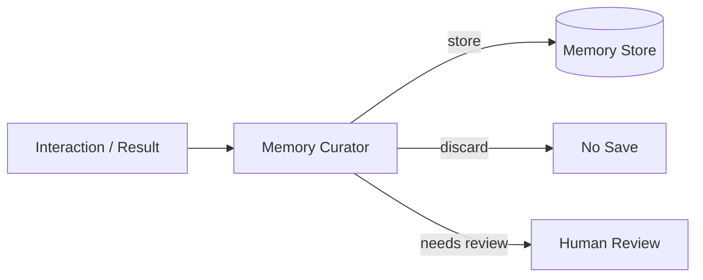

### Use when

- agent belajar dari interaksi,
- personalization atau process memory dibutuhkan,
- memory poisoning risk ada,
- privacy/retention penting.

### Store only if

- stable,
- useful for future task,
- allowed by policy,
- source is known,
- expiry/retention defined.

### Avoid storing

- secrets,
- one-off transient data,
- unverified claims,
- user content beyond retention policy,
- tool output containing injected instructions.

---

## 7. Safety and Governance Patterns

## 7.1 Policy Proxy Pattern

### Intent

Semua action request melewati policy proxy sebelum dieksekusi.

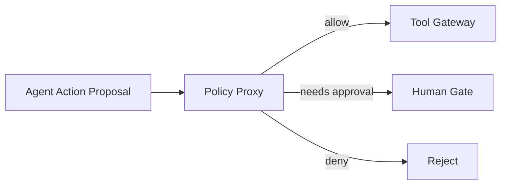

### Use when

- action punya risk,
- compliance penting,
- authority berbeda per role,
- policy harus bisa berubah tanpa retrain prompt.

### Invariants

- model cannot bypass policy,
- policy decision logged,
- deny reason explicit,
- policy uses runtime facts, not only text.

---

## 7.2 Approval Gate Pattern

### Intent

Menahan action sampai human/authorized reviewer menyetujui action packet.

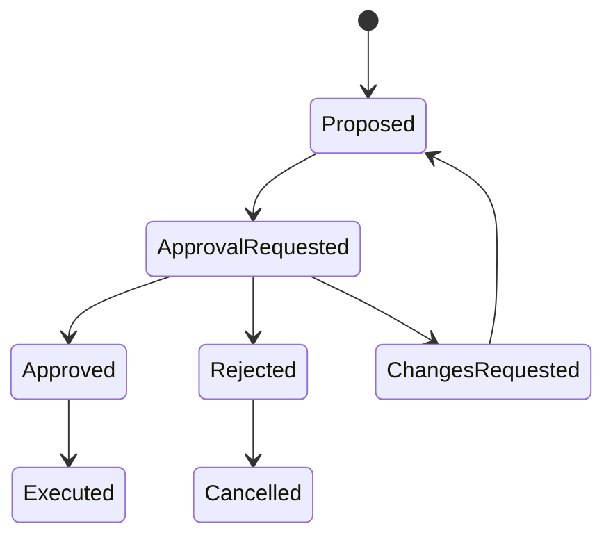

### Use when

- action irreversible,
- production impact,
- data exposure,
- external communication,
- financial/legal/compliance impact.

### Invariants

- approval tied to immutable action hash,
- approver identity logged,
- changed action requires reapproval,
- approval UI shows evidence and risk.

---

## 7.3 Audit Event Sourcing Pattern

### Intent

Mencatat seluruh run sebagai event log immutable sehingga bisa direkonstruksi.

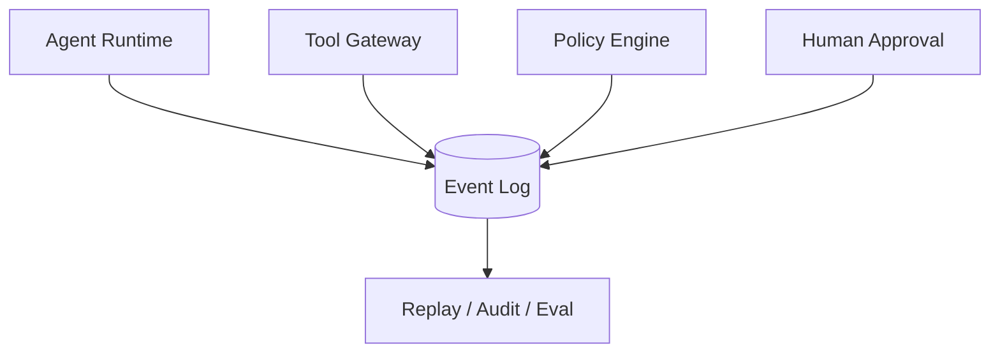

### Use when

- regulated domain,
- high-impact actions,
- debugging complex runs,
- production evaluation.

### Invariants

- events immutable,
- sensitive fields redacted or encrypted,
- correlation/causation maintained,
- replay tools available.

---

## 8. Autonomous SWE Patterns

## 8.1 Repo Mapper Pattern

### Intent

Agent membangun peta repo sebelum mengedit.

```mermaid
flowchart TD
    I[Issue] --> M[Repo Mapper]
    M --> S[Symbol Map]
    M --> D[Dependency Map]
    M --> T[Test Map]
    M --> O[Ownership / Risk Map]
```

### Use when

- repo besar,
- issue tidak langsung menunjuk file,
- build/test graph penting,
- patch harus minimal.

### Output

- candidate files,
- relevant symbols,
- entry points,
- test targets,
- risk zones,
- commands to reproduce.

### Invariants

- no patch before mapping if repo unfamiliar,
- candidate confidence stated,
- source refs included,
- ownership/risk noted.

---

## 8.2 Reproduce-Before-Patch Pattern

### Intent

Agent harus mereproduksi bug sebelum membuat patch, jika feasible.

```mermaid
flowchart TD
    A[Issue] --> B[Reproduce]
    B -->|failure observed| C[Root Cause]
    B -->|cannot reproduce| D[Report limitation]
    C --> E[Patch]
    E --> F[Verify]
```

### Use when

- bug report bisa diuji,
- test/command tersedia,
- correctness penting.

### Avoid when

- issue adalah purely static change,
- reproduction impossible due environment,
- urgent mitigation needed but limitation must be stated.

### Invariants

- reproduction command recorded,
- failing artifact stored,
- if not reproduced, patch confidence reduced,
- regression test preferred.

---

## 8.3 Patch Loop Pattern

### Intent

Iterasi patch dengan feedback compile/test/review sampai pass or budget exhausted.

```mermaid
flowchart TD
    A[Patch Proposal] --> B[Apply in Sandbox]
    B --> C[Run Tests]
    C -->|fail| D[Analyze Failure]
    D --> E[Revise Patch]
    E --> B
    C -->|pass| F[Review]
    F -->|changes requested| E
    F -->|approved| G[Ready for PR]
```

### Use when

- tests available,
- patch can be iterated safely,
- sandbox exists.

### Invariants

- max iterations,
- diff minimized,
- each failure stored,
- no unrelated changes,
- final result includes tests run.

---

## 8.4 Test-First Repair Pattern

### Intent

Agent membuat atau mengidentifikasi failing test sebelum patch.

```mermaid
flowchart LR
    A[Bug] --> B[Write/Find Failing Test]
    B --> C[Confirm Failure]
    C --> D[Patch]
    D --> E[Confirm Pass]
```

### Use when

- behavior should be locked,
- regression risk high,
- codebase has test harness.

### Invariants

- test fails before patch,
- test passes after patch,
- test asserts behavior not implementation detail,
- test is minimal and maintainable.

---

## 8.5 PR Review Agent Pattern

### Intent

Agent reviews diff using structured rubric.

```mermaid
flowchart TD
    D[Diff] --> R[Review Agent]
    C[Context] --> R
    T[Test Results] --> R
    R --> V[Verdict]
```

### Review dimensions

- correctness,
- tests,
- security,
- performance,
- maintainability,
- compatibility,
- observability,
- migration risk,
- documentation.

### Invariants

- comments are actionable,
- severity and category included,
- claims cite diff/test evidence,
- reviewer can block,
- style-only feedback not mixed with correctness blockers.

---

## 8.6 Review-Comment Addressing Pattern

### Intent

Agent addresses reviewer comments with traceable mapping.

```json
{
  "review_comment_id": "rc_123",
  "finding": "Null customer not handled",
  "action_taken": "Added explicit null customer guard",
  "changed_files": ["CustomerMapper.java", "CustomerMapperTest.java"],
  "evidence_refs": ["test://CustomerMapperTest-pass"],
  "status": "addressed"
}
```

### Invariants

- each comment has status,
- unresolved comments explicit,
- agent does not mark addressed without evidence,
- follow-up diff is minimal.

---

## 9. Combining Patterns

### 9.1 Reference architecture: autonomous issue resolver

```mermaid
flowchart TD
    A[Issue Intake] --> B[Router]
    B --> C[Repo Mapper]
    C --> D[Planner]
    D --> E[Sandboxed Coder]
    E --> F[Patch Loop]
    F --> G[Test Verifier]
    G --> H[PR Review Agent]
    H --> I[Security Reviewer]
    I --> J[Confidence Gate]
    J -->|low/high risk| K[Human Approval]
    J -->|safe| L[PR Creator]
    K -->|approved| L

    P[Policy Proxy] --> E
    P --> L
    T[Tool Gateway] --> E
    T --> G
    M[Memory Curator] --> C
    O[Audit Event Log] --> B
    O --> C
    O --> D
    O --> E
    O --> F
    O --> G
    O --> H
    O --> I
    O --> J
    O --> K
    O --> L
```

Pattern used:

- Router,
- Repo Mapper,
- Planner-Executor,
- Sandboxed Actor,
- Patch Loop,
- Verifier,
- Critic-Reviewer,
- Confidence Gate,
- Approval Gate,
- Policy Proxy,
- Tool Gateway,
- Audit Event Sourcing,
- Memory Curator.

### 9.2 Control principle

Do not combine patterns randomly.

Use this rule:

```text
Add a pattern only if it reduces uncertainty, risk, or coordination cost more than it increases complexity.
```

### 9.3 Pattern interaction risks

| Combination | Risk | Control |
|---|---|---|
| planner + long loop | endless replanning | budget and stop condition |
| multi-agent + shared memory | memory poisoning | memory curator and provenance |
| router + tool gateway | wrong tool exposure | policy-based tool filtering |
| evaluator + generator | self-confirmation | independent evidence and rubric |
| approval gate + patch loop | stale approval | action hash invalidation |
| sandbox + dependency install | supply-chain risk | network deny/allowlist |

---

## 10. Pattern Selection Matrix

| Problem | Preferred Pattern | Why |
|---|---|---|
| Known linear process | Prompt Chain | Simpler and auditable. |
| Many possible task types | Router | Avoid giant universal agent. |
| Multi-step uncertain task | Planner-Executor | Allows plan and observation loop. |
| Complex task with specialists | Orchestrator-Worker | Separates expertise and context. |
| Risky tool use | Tool Gateway + Policy Proxy | Enforced boundary. |
| Prompt injection risk | Tool Firewall + Context Builder | Reduce exposure. |
| Code execution | Sandboxed Actor | Contain side effects. |
| Quality improvement | Evaluator-Optimizer | Iterative refinement with rubric. |
| Correctness critical | Verifier | Deterministic checks. |
| Human accountability needed | Approval Gate | Explicit decision right. |
| Long-running work | Event-Driven Agent + Checkpoints | Durable execution. |
| Bug fixing | Reproduce-Before-Patch + Patch Loop | Evidence-first repair. |
| PR review | Critic-Reviewer | Structured review. |

---

## 11. Pattern Documentation Template

For each internal pattern, document:

```mdx
## Pattern Name

### Intent
What problem does this solve?

### Context
When does this problem occur?

### Forces
What trade-offs exist?

### Structure
Diagram or component list.

### Protocol
Message types and schemas.

### Invariants
What must always be true?

### Failure Modes
How can it fail?

### Observability
What must be logged/traced?

### Evaluation
How do we know it works?

### Security Notes
What can be abused?

### Examples
Where this pattern is used.
```

This prevents pattern names from becoming vague buzzwords.

---

## 12. Pattern Evaluation

### 12.1 Evaluate fit

Before implementing, score pattern fit:

```yaml
pattern_fit:
  task_uncertainty: high
  side_effect_risk: medium
  verification_available: true
  human_accountability_required: true
  expected_latency_budget: moderate
  recommended_patterns:
    - planner_executor
    - sandboxed_actor
    - verifier
    - approval_gate
```

### 12.2 Evaluate runtime quality

Metrics:

| Pattern | Metric |
|---|---|
| Router | routing accuracy, fallback rate |
| Planner | plan completion rate, replan count |
| Executor | tool success rate, policy denial rate |
| Evaluator | false approval/rejection rate |
| Verifier | defect catch rate |
| Approval Gate | stale approval rate, review latency |
| Tool Gateway | denied unsafe action rate |
| Patch Loop | iterations to pass, regression rate |
| Repo Mapper | candidate file precision/recall |

### 12.3 Evaluate complexity cost

A pattern is not free.

Measure:

- latency,
- token cost,
- implementation cost,
- cognitive overhead,
- debugging complexity,
- operational failure modes.

Pattern is justified only if benefit exceeds complexity.

---

## 13. Practical Case Study

### 13.1 Requirement

```text
Build an internal agent that fixes low-to-medium risk bugs in service repositories and opens draft PRs.
```

### 13.2 Wrong design

```text
One huge agent with GitHub, shell, browser, file write, memory, and PR creation tools.
```

Failure:

- overbroad privilege,
- hidden planning,
- weak verification,
- no approval boundary,
- hard to debug,
- prompt injection from repo content,
- PR creation without stable evidence.

### 13.3 Better design

Use pattern composition:

1. **Issue Router** — classify bug, enhancement, doc, security, unknown.
2. **Repo Mapper** — locate relevant files/tests.
3. **Planner** — produce bounded plan.
4. **Tool Firewall** — expose only read/test tools initially.
5. **Reproduce-Before-Patch** — collect failure evidence.
6. **Capability Broker** — grant scoped write access after reproduction.
7. **Sandboxed Actor** — apply patch in isolated workspace.
8. **Patch Loop** — iterate with tests.
9. **Verifier** — run tests/static checks.
10. **Reviewer** — structured PR review.
11. **Confidence Gate** — decide auto-draft or human review.
12. **Approval Gate** — for risky diffs.
13. **PR Creator** — side-effecting action via idempotent tool.
14. **Audit Event Sourcing** — persist trajectory.

### 13.4 Resulting architecture

```mermaid
sequenceDiagram
    participant U as User/Issue
    participant R as Router
    participant M as Repo Mapper
    participant P as Planner
    participant C as Sandboxed Coder
    participant V as Verifier
    participant Rev as Reviewer
    participant H as Human Gate
    participant PR as PR Tool
    participant A as Audit Log

    U->>R: issue.intake
    R->>A: route decision
    R->>M: repo.map.request
    M->>A: repo map result
    M->>P: planning context
    P->>A: plan created
    P->>C: patch task
    C->>V: test execution request
    V->>A: test result
    V->>Rev: review request
    Rev->>A: review result
    Rev->>H: approval request if needed
    H->>PR: approved PR create request
    PR->>A: PR created
```

---

## 14. Common Pattern Mistakes

### 14.1 Pattern stacking

Adding router, planner, evaluator, reviewer, memory, and multi-agent for a task that needs one deterministic chain.

Fix:

- start simple,
- add pattern only for observed failure.

### 14.2 Fake verifier

Verifier is just another model saying “looks good”.

Fix:

- prefer deterministic checks,
- use independent evidence,
- force structured findings.

### 14.3 Reflection theater

Agent reflects on its output but has no new evidence.

Fix:

- reflection must inspect artifacts, tests, diff, logs, or rubric.

### 14.4 Universal tool access

Every agent sees every tool.

Fix:

- tool firewall,
- capability broker,
- scoped credentials.

### 14.5 Pattern without stop condition

Loops run until model says done.

Fix:

- max iterations,
- budget,
- convergence criteria,
- failure terminal state.

### 14.6 Approval after execution

Human reviews after side effect already happened.

Fix:

- action packet before execution,
- approval tied to hash,
- reapproval on change.

---

## 15. Design Heuristics

Use deterministic workflow when:

- process is known,
- input variance low,
- correctness rules explicit,
- auditability matters.

Use agent loop when:

- task is open-ended,
- steps are not known upfront,
- tools must be chosen dynamically,
- observation changes next action.

Use multi-agent when:

- specialists have real boundary,
- tools/permissions differ,
- parallelism helps,
- independent review matters.

Use human gate when:

- action is irreversible,
- regulated/high-impact,
- data exposure possible,
- accountability required.

Use memory when:

- future tasks benefit,
- data is stable,
- source is trusted,
- retention is allowed.

Do not use memory to avoid designing proper state.

---

## 16. Minimal Pattern Set for Production

If building your first serious internal agent platform, start with:

1. **Context Builder**
2. **Tool Gateway**
3. **Tool Firewall**
4. **Policy Proxy**
5. **Planner-Executor** for uncertain tasks
6. **Verifier**
7. **Approval Gate**
8. **Audit Event Sourcing**
9. **Confidence Gate**
10. **Sandboxed Actor** for code/command execution

Delay:

- broad multi-agent swarm,
- long-term memory,
- autonomous deployment,
- self-modifying agents,
- automatic production actions.

These are advanced capabilities, not starting points.

---

## 17. Deliberate Practice

### Exercise 1 — Pattern selection

For each task, choose pattern(s):

1. Summarize customer complaint email.
2. Classify support ticket into billing/technical/security.
3. Fix failing unit test in monorepo.
4. Recommend production rollback after incident.
5. Generate migration plan for deprecated API.
6. Review PR for authorization risk.

For each, explain:

- uncertainty,
- side effect,
- verification,
- human gate,
- chosen pattern.

### Exercise 2 — Pattern refactoring

Given this design:

```text
One agent receives a bug issue, edits files, runs tests, creates PR, and posts Slack update.
```

Refactor into pattern composition.

At minimum include:

- repo mapper,
- planner,
- sandboxed actor,
- verifier,
- policy proxy,
- approval gate,
- audit log.

### Exercise 3 — Design an evaluator

Create evaluator rubric for `patch.proposal`.

Must score:

- minimality,
- correctness,
- test evidence,
- risk,
- compatibility,
- maintainability.

### Exercise 4 — Tool firewall

Design tool visibility for:

- planner,
- repo mapper,
- coder,
- tester,
- reviewer,
- PR creator.

Explain why each tool is allowed or denied.

---

## 18. Summary

Agentic design patterns give us vocabulary to design systems consciously.

Key takeaways:

- Pattern is a control structure, not a prompt template.
- Choose pattern based on uncertainty, risk, verification, and authority.
- Prompt chain is good for known process.
- Router is good for varied intent.
- Planner-executor is good for multi-step uncertainty.
- Orchestrator-worker is good for specialist decomposition.
- Tool gateway and firewall are mandatory for serious tool use.
- Sandboxed actor is mandatory for code/command execution.
- Evaluator and verifier reduce hallucinated success.
- Approval gate preserves accountability.
- Audit event sourcing enables replay and governance.
- Autonomous SWE agents should reproduce before patching and verify before PR.

A strong agentic engineer does not ask how to make an agent “more autonomous” in general.

They ask:

```text
Where should autonomy exist, where should determinism exist, where should verification exist, and where must humans retain decision rights?
```

That is the core design discipline.

Part berikutnya akan membahas **Agentic Anti-Patterns**: semua bentuk kegagalan umum ketika engineer terlalu cepat meng-agent-kan sesuatu tanpa control structure yang tepat.

---

## References

- Anthropic — Building Effective Agents: prompt chaining, routing, parallelization, orchestrator-workers, evaluator-optimizer, and advice to start simple.
- OpenAI Agents SDK documentation: agents, tools, handoffs, guardrails, structured outputs, tracing, and human-in-the-loop concepts.
- Model Context Protocol specification: protocol layer for tools, resources, prompts, client/server capabilities, and authorization.
- LangGraph documentation: durable execution, stateful graphs, persistence, human-in-the-loop, supervisor-style multi-agent orchestration.
- OWASP Top 10 for LLM Applications and OWASP Agentic Application Security: prompt injection, excessive agency, insecure tool/plugin design, sensitive data disclosure.
- NIST AI Risk Management Framework and Generative AI Profile: governance, measurement, and risk control across AI lifecycle.
