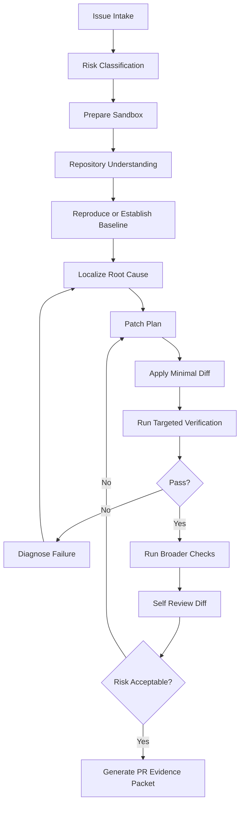
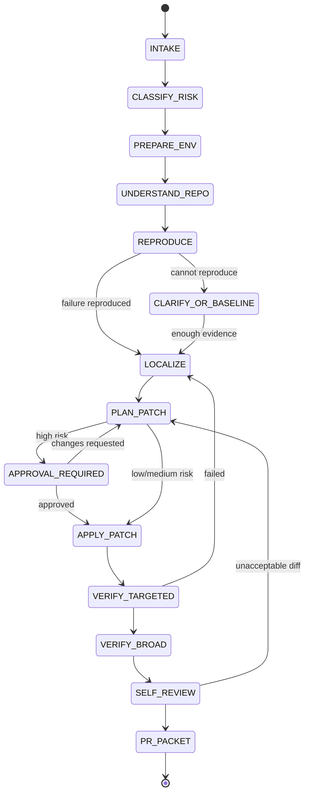
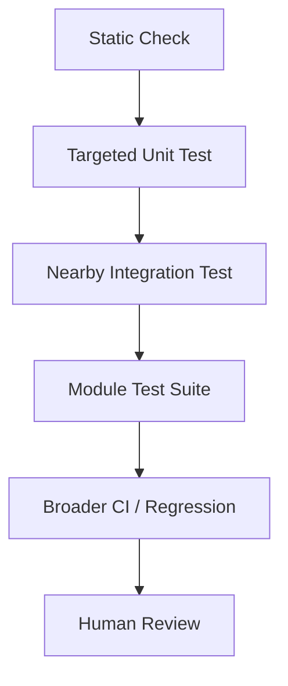
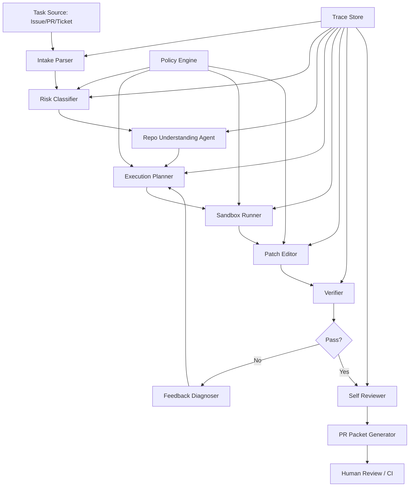

------
title: Learn Advanced Agentic AI Engineering & Autonomous Software Engineering - Part 020
description: Coding agent execution loop for autonomous software engineering: issue intake, environment preparation, reproduction, localization, patch planning, edit loop, verification, review packet, and feedback-driven iteration.
series: learn-agentic-ai-engineering
seriesTitle: Learn Advanced Agentic AI Engineering & Autonomous Software Engineering
order: 20
partTitle: Coding Agent Execution Loop
tags:
- agentic-ai
- autonomous-software-engineering
- coding-agent
- execution-loop
- verification
- series
date: 2026-06-29
---

# Part 020 — Coding Agent Execution Loop

> Target part ini: mampu mendesain **coding agent execution loop** yang aman, terukur, dan reviewable: mulai dari issue intake, environment preparation, reproduction, localization, patch planning, edit loop, verification, sampai PR evidence packet. Fokusnya bukan “agent menulis kode”, tetapi **agent menjalankan proses engineering yang benar**.

Autonomous coding agent harus diperlakukan seperti engineer junior yang sangat cepat tetapi non-deterministic.

Ia bisa membaca, mencari, menjalankan tool, membuat patch, dan menjelaskan.
Tetapi ia juga bisa:

- salah memahami requirement,
- salah memilih file,
- membuat patch terlalu besar,
- melewatkan test penting,
- menganggap command berhasil padahal tidak,
- menutupi failure,
- mengubah behavior tak terkait,
- menghasilkan PR yang tampak rapi tetapi secara sistemik salah.

Karena itu coding agent butuh execution loop yang eksplisit.

```text
A coding agent is not a code generator.
A coding agent is a controlled engineering executor that changes code through evidence, tests, and reviewable state transitions.
```

---

## 1. Kaufman Framing

### 1.1 Target performance

Setelah part ini, kita ingin mampu:

- mendesain loop coding agent dari issue sampai PR,
- menentukan state dan transition penting,
- membuat policy kapan agent boleh patch dan kapan harus berhenti,
- membedakan reproduction, localization, patching, dan verification,
- mengatur patch minimal, rollback, dan diff review,
- membangun evidence packet untuk human reviewer,
- mengevaluasi agent berdasarkan task outcome dan process quality,
- menghindari autonomous coding anti-pattern seperti “patch before reproduce” dan “tests ignored”.

Target praktis:

> Jika diberi request “buat agent yang memperbaiki bug otomatis dari GitHub issue”, kita bisa membuat state machine, tool contract, verification hierarchy, stop condition, failure handling, dan PR output format yang production-grade.

### 1.2 Deconstruct the skill

Coding agent execution terdiri dari subskill:

1. **Task intake** — memahami issue, acceptance criteria, constraints.
2. **Risk classification** — menentukan autonomy level dan approval gate.
3. **Environment preparation** — checkout, dependency, build/test readiness, sandbox.
4. **Repository understanding** — menggunakan repo map dan context packet.
5. **Reproduction** — membuat failure observable.
6. **Localization** — menemukan candidate root cause.
7. **Patch planning** — memilih perubahan minimal dan test plan.
8. **Edit execution** — apply diff secara scoped.
9. **Verification** — run tests, static checks, targeted regression.
10. **Self-review** — inspect diff, risk, unintended changes.
11. **Human review packet** — PR body, evidence, limitation.
12. **Feedback iteration** — respond to CI/review/failure.

### 1.3 Learn enough to self-correct

Minimal knowledge agar bisa self-correct:

- patch tanpa reproduction adalah spekulasi,
- patch tanpa test adalah klaim belum diverifikasi,
- diff besar meningkatkan risk surface,
- passing targeted test tidak selalu cukup,
- agent harus mencatat command, output, dan decision,
- setiap action mutating harus bisa direplay atau diaudit,
- coding agent harus punya stop condition.

### 1.4 Remove friction

Friction umum:

- tidak tahu command test,
- dependency install gagal,
- test lambat,
- flaky tests,
- environment beda dari CI,
- issue tidak jelas,
- repo map tidak lengkap,
- permission terlalu luas,
- no review packet.

Solusi:

- repo understanding packet,
- command manifest,
- sandboxed execution,
- targeted test selection,
- retry policy,
- approval gate,
- PR evidence template.

---

## 2. Core Mental Model: Evidence-Driven Coding Loop

Coding agent loop ideal:



The loop is evidence-driven because every major step needs proof:

| Step | Evidence |
|---|---|
| Intake | parsed requirement, acceptance criteria, unknowns |
| Risk classification | risk category, autonomy level, required gates |
| Repo understanding | candidate files/tests with reasons |
| Reproduction | failing command/output or baseline rationale |
| Localization | root-cause hypothesis with code evidence |
| Patch | minimal diff linked to hypothesis |
| Verification | command outputs and test results |
| Review | diff summary, risk, limitation |

---

## 3. Execution State Machine

A coding agent should not be a free-form loop.
It should be a state machine.



### 3.1 Terminal states

Not every task should end with patch.

Valid terminal states:

| State | Meaning |
|---|---|
| `PATCH_READY` | patch verified and review packet created |
| `NEEDS_HUMAN_CLARIFICATION` | requirement ambiguous or risky |
| `CANNOT_REPRODUCE` | no reliable reproduction after allowed attempts |
| `ENVIRONMENT_BLOCKED` | build/test setup impossible under policy |
| `OUT_OF_SCOPE` | task violates permission/scope |
| `UNSAFE_TO_CONTINUE` | security/risk threshold exceeded |

A good agent stops honestly.

Bad agent invents success.

---

## 4. Step 1 — Issue Intake

### 4.1 Intake fields

```yaml
task_intake:
  source: github_issue
  title: "Payment reversal duplicates ledger entry after retry timeout"
  description: "..."
  task_type: bugfix
  expected_behavior: "reversal should be idempotent"
  observed_behavior: "duplicate ledger entries"
  artifacts:
    - logs
    - stack_trace
    - reproduction_steps
  constraints:
    - do_not_change_public_api
    - preserve backward compatibility
  unknowns:
    - exact retry timing not specified
```

### 4.2 Intake parser should extract

- task type,
- affected component,
- expected behavior,
- observed behavior,
- reproduction clues,
- constraints,
- non-goals,
- urgency,
- risk signals,
- missing information.

### 4.3 Acceptance criteria

For bug fixing:

```yaml
acceptance_criteria:
  - failing behavior is reproduced or convincingly simulated
  - regression test demonstrates failure before fix
  - patch makes regression test pass
  - existing relevant tests pass
  - diff does not broaden unrelated behavior
```

For feature implementation:

```yaml
acceptance_criteria:
  - analogous existing pattern followed
  - new behavior covered by tests
  - API/contract updates included if needed
  - backward compatibility considered
  - docs updated if user-facing
```

---

## 5. Step 2 — Risk Classification

Risk changes autonomy.

### 5.1 Risk tiers

| Tier | Example | Agent autonomy |
|---|---|---|
| R0 trivial | typo, docs, comments | can patch with light review |
| R1 low | isolated test, small internal helper | patch with tests |
| R2 medium | business logic, non-critical API | patch with targeted+broad tests |
| R3 high | auth, billing, data migration, security | approval before patch/merge |
| R4 critical | production secrets, destructive infra, legal/compliance | human-led, agent assists only |

### 5.2 Risk classifier output

```yaml
risk_classification:
  tier: R3
  categories:
    - money-movement
    - idempotency-critical
  autonomy:
    may_read: true
    may_run_tests: true
    may_patch: after_approval
    may_open_pr: true
    may_merge: false
  required_reviews:
    - domain_owner
    - backend_reviewer
```

### 5.3 Risk signals

- auth/authorization,
- money movement,
- tax/billing/ledger,
- personally identifiable information,
- encryption/crypto,
- database migration,
- public API,
- infrastructure/deployment,
- concurrency primitives,
- data deletion,
- compliance audit.

---

## 6. Step 3 — Prepare Environment

### 6.1 Environment goals

Agent needs:

- clean checkout,
- known commit,
- sandbox,
- no production secrets,
- build/test commands,
- dependency cache if allowed,
- resource limits,
- command logging.

### 6.2 Environment manifest

```yaml
environment:
  repository_commit: abc123
  branch: agent/task-123
  sandbox:
    network: restricted
    secrets: unavailable
    filesystem: workspace-scoped
  commands_discovered:
    - ./gradlew test
    - ./gradlew :payment:test
  baseline_status:
    clean_git_status: true
    build_command_known: true
    test_command_known: true
```

### 6.3 Baseline check

Before patch:

```bash
git status --short
./gradlew :payment:test --dry-run
./gradlew :payment:test --tests PaymentReversalServiceTest
```

If baseline already fails, record it.

```yaml
baseline:
  command: ./gradlew :payment:test
  status: failed
  interpretation: "baseline has unrelated failing tests"
  action: "continue only with targeted test and report limitation"
```

Do not hide baseline failures.

---

## 7. Step 4 — Repository Understanding

This uses Part 019.

Required before patch:

```yaml
repo_understanding_required:
  build_manifest: true
  candidate_files: true
  candidate_tests: true
  risk_notes: true
  unknowns: true
```

Coding agent should consume context packet:

```yaml
context_packet:
  likely_patch_targets:
    - PaymentReversalService.java
    - IdempotencyStore.java
  likely_tests:
    - PaymentReversalServiceTest
  invariants:
    - reversal must be idempotent by transaction id
  risks:
    - money movement
    - ledger duplication
```

If repo understanding confidence is low, agent should not jump to patch.
It should gather more evidence.

---

## 8. Step 5 — Reproduce or Establish Baseline

### 8.1 Reproduction-first rule

For bugfix tasks:

```text
Prefer reproduction before patch.
```

Why:

- proves bug exists,
- prevents fixing wrong thing,
- gives regression test,
- produces objective verification.

### 8.2 Forms of reproduction

| Form | Strength |
|---|---|
| Existing failing test | strongest |
| New regression test that fails before patch | strong |
| Minimal script/fixture | medium-strong |
| Manual command/log reproduction | medium |
| Static reasoning only | weak, acceptable only when execution impossible |

### 8.3 Reproduction packet

```yaml
reproduction:
  status: reproduced
  command: ./gradlew :payment:test --tests PaymentReversalServiceTest.duplicateLedgerOnRetry
  failure_summary: "expected one ledger entry but found two"
  evidence:
    - test_output_excerpt
    - fixture_used
  confidence: high
```

If cannot reproduce:

```yaml
reproduction:
  status: not_reproduced
  attempts:
    - command: ./gradlew :payment:test
      result: pass
    - command: ./gradlew :payment:test --tests PaymentReversalServiceTest
      result: pass
  possible_reasons:
    - missing timing condition
    - integration dependency unavailable
    - issue environment-specific
  recommended_action: ask_for_logs_or_reproduction_details
```

### 8.4 When patch without reproduction is acceptable

Rarely acceptable when:

- issue is obvious static defect,
- compile error is clear,
- typo/config mismatch is exact,
- test environment unavailable but code evidence is strong,
- production incident requires emergency mitigation under human control.

Even then, mark confidence lower.

---

## 9. Step 6 — Localize Root Cause

Localization connects symptom to code.

### 9.1 Root-cause hypothesis

```yaml
root_cause_hypothesis:
  statement: "Payment reversal idempotency key uses timeout attempt id instead of original transaction id."
  evidence:
    - "PaymentReversalService constructs key from retryContext.getAttemptId()"
    - "LedgerEntryService deduplicates by idempotency key"
    - "test fails when retry attempt id changes"
  confidence: 0.82
  missing_evidence:
    - "no integration test with real queue retry"
```

### 9.2 Localization tools

- stack trace mapping,
- log message search,
- symbol references,
- call graph,
- data flow,
- test failure diff,
- git history,
- recent commit inspection,
- config/feature flag inspection.

### 9.3 Avoid single-cause bias

A bug can involve:

- code,
- config,
- migration,
- dependency version,
- race condition,
- test fixture,
- environment,
- third-party API.

Agent should keep competing hypotheses when evidence is incomplete.

```yaml
hypotheses:
  - statement: "wrong idempotency key"
    confidence: 0.82
  - statement: "ledger unique constraint missing"
    confidence: 0.44
  - statement: "retry handler duplicates event"
    confidence: 0.51
```

---

## 10. Step 7 — Patch Planning

Patch plan should be explicit before editing.

### 10.1 Patch plan template

```yaml
patch_plan:
  objective: "make payment reversal idempotent across retry attempts"
  intended_files:
    - PaymentReversalService.java
    - PaymentReversalServiceTest.java
  strategy:
    - add failing regression test for retry with changed attempt id
    - derive idempotency key from original transaction id
    - keep public API unchanged
  verification:
    targeted:
      - ./gradlew :payment:test --tests PaymentReversalServiceTest
    broader:
      - ./gradlew :payment:test
  risks:
    - ledger behavior change
    - backward compatibility with existing keys
  rollback:
    - revert service and test changes
```

### 10.2 Patch planning rules

- prefer smallest behavior-preserving change,
- add/adjust tests before or with code,
- avoid unrelated cleanup,
- avoid broad rewrites,
- avoid changing public contracts unless required,
- document migration/compatibility if needed,
- plan verification before patch.

### 10.3 Approval before patch

High-risk plan should be approved before code mutation.

```yaml
approval_request:
  risk_tier: R3
  reason: "money movement and ledger idempotency"
  proposed_change: "use original transaction id for reversal idempotency key"
  files: [...]
  tests: [...]
```

---

## 11. Step 8 — Apply Minimal Diff

### 11.1 Edit discipline

Agent should:

- apply focused changes,
- keep style consistent,
- preserve formatting conventions,
- avoid drive-by refactors,
- keep generated files untouched unless appropriate,
- update tests/docs/config when required,
- keep commits/diffs reviewable.

### 11.2 Diff size control

Bad:

```text
Refactor whole service while fixing one bug.
```

Better:

```text
Change one idempotency key derivation method and add one regression test.
```

### 11.3 Edit packet

```yaml
edit_packet:
  changed_files:
    - path: PaymentReversalService.java
      reason: "fix idempotency key derivation"
    - path: PaymentReversalServiceTest.java
      reason: "add retry regression test"
  intentional_non_changes:
    - "No public API change"
    - "No database schema change"
  generated_files_touched: false
```

---

## 12. Step 9 — Verification Hierarchy

Verification should be layered.



### 12.1 Verification layers

| Layer | Example | Purpose |
|---|---|---|
| Format/lint | formatter, lint | mechanical correctness |
| Compile/typecheck | `javac`, `tsc`, `go test` compile | syntax/type correctness |
| Targeted unit test | nearest test | direct behavior |
| Regression test | new failing-then-passing test | bug prevention |
| Integration test | module/service interaction | boundary behavior |
| Full module suite | module-wide | local regression |
| CI | full project | broader confidence |
| Human review | expert judgment | maintainability/risk |

### 12.2 Verification packet

```yaml
verification:
  commands:
    - command: ./gradlew :payment:test --tests PaymentReversalServiceTest
      status: passed
      duration: 12s
    - command: ./gradlew :payment:test
      status: passed
      duration: 2m10s
  not_run:
    - command: ./gradlew check
      reason: "exceeds time budget in sandbox"
  interpretation: "targeted and module tests pass; full CI still required"
```

### 12.3 Failing verification

If verification fails:

```yaml
verification_failure:
  command: ./gradlew :payment:test --tests PaymentReversalServiceTest
  failure: "expected one ledger entry but found two"
  classification: patch_incomplete
  next_action: relocalize_root_cause
```

Do not repeatedly patch blindly.

Failure should update hypothesis.

---

## 13. Step 10 — Diagnose Feedback

Coding agent must interpret feedback, not only retry.

### 13.1 Feedback types

| Feedback | Meaning |
|---|---|
| compiler error | code does not build |
| test assertion failure | behavior mismatch |
| snapshot diff | output changed |
| lint/format error | style/mechanical issue |
| flaky failure | nondeterministic or infra issue |
| timeout | performance/deadlock/slow test |
| CI-only failure | environment difference or hidden dependency |
| reviewer comment | human semantic feedback |

### 13.2 Feedback diagnosis packet

```yaml
feedback_diagnosis:
  source: test_output
  type: assertion_failure
  failed_test: PaymentReversalServiceTest.shouldDeduplicateRetry
  likely_cause: "idempotency key still includes attempt id"
  evidence:
    - "actual keys differ between retry attempts"
  next_step: "inspect key builder"
```

### 13.3 Retry policy

Agent should limit retries.

```yaml
retry_policy:
  max_patch_iterations: 4
  max_same_failure_retries: 2
  stop_if:
    - no_new_information
    - risk_tier_increases
    - patch_scope_expands_beyond_plan
    - tests_fail_for_unrelated_reasons
```

---

## 14. Step 11 — Self-Review

Before PR, agent reviews its own diff.

### 14.1 Self-review checklist

- Does diff match original task?
- Are there unrelated changes?
- Are generated/vendor files touched?
- Are public contracts changed?
- Are tests added/updated?
- Are edge cases considered?
- Is error handling consistent?
- Is logging/metric behavior acceptable?
- Does patch preserve invariants?
- Are limitations documented?

### 14.2 Diff risk scoring

```yaml
diff_risk_score:
  files_changed: 2
  lines_added: 42
  lines_removed: 5
  public_api_changed: false
  database_changed: false
  auth_changed: false
  money_movement_changed: true
  generated_files_changed: false
  overall: medium_high
```

### 14.3 Self-review output

```yaml
self_review:
  summary: "Patch changes reversal idempotency key derivation and adds retry regression test."
  unrelated_changes: false
  public_api_change: false
  generated_files_touched: false
  remaining_risks:
    - "integration behavior with real queue retry should be validated in CI"
```

---

## 15. Step 12 — PR Evidence Packet

The output of coding agent should not just be a diff.
It should be a review artifact.

### 15.1 PR body template

```md
## Summary
- Fixed payment reversal idempotency across retry attempts.
- Added regression test for retry timeout scenario.

## Root Cause
The reversal idempotency key was derived from retry attempt id, so retries generated different ledger deduplication keys.

## Changes
- Use original transaction id as reversal idempotency key source.
- Added `shouldDeduplicateReversalAfterRetryTimeout` regression test.

## Verification
- `./gradlew :payment:test --tests PaymentReversalServiceTest` ✅
- `./gradlew :payment:test` ✅

## Risk
- Touches money movement behavior.
- No public API or database schema changes.
- Full CI still required before merge.

## Reviewer Notes
Please pay special attention to compatibility with existing ledger idempotency records.
```

### 15.2 Evidence fields

```yaml
pr_evidence_packet:
  task: issue-123
  root_cause: "..."
  changed_files: [...]
  tests_run: [...]
  tests_not_run: [...]
  risks: [...]
  limitations: [...]
  reviewer_focus: [...]
```

### 15.3 Never overclaim

Bad:

```text
This fully fixes all retry issues.
```

Better:

```text
This fixes the reproduced duplicate ledger entry scenario for reversal retry timeout. Full CI and integration environment validation are still recommended.
```

---

## 16. Autonomous SWE Loop Variants

### 16.1 Bugfix loop

```text
intake → reproduce → localize → regression test → patch → targeted test → broader test → PR
```

### 16.2 Feature loop

```text
intake → find analogous feature → design small change → implement → test → docs/contracts → PR
```

### 16.3 Refactor loop

```text
intake → map references → ensure baseline tests → transform → run impacted tests → verify behavior → PR
```

### 16.4 Migration loop

```text
intake → inventory usages → plan phases → codemod/sample patch → verify → staged PRs
```

### 16.5 Code review fix loop

```text
read review → classify comments → patch actionable comments → verify → reply with evidence
```

---

## 17. Tool Contract for Coding Agent

### 17.1 Tool categories

| Category | Examples | Risk |
|---|---|---|
| Read-only | list files, read file, search | low |
| Analysis | parse AST, dependency graph | low |
| Execution | run test/build | medium |
| Mutation | edit file, apply patch | medium/high |
| External | open PR, comment, push | high |
| Destructive | delete branch, deploy, migrate DB | critical |

### 17.2 Mutating tool guard

```yaml
before_edit_required:
  - task_intake_complete
  - risk_classification_complete
  - repo_context_packet_exists
  - patch_plan_exists
  - approval_if_required
```

### 17.3 Command execution guard

```yaml
command_policy:
  allowed:
    - git status
    - git diff
    - ./gradlew test
    - npm test
  requires_approval:
    - npm install
    - pip install
    - docker compose up
  forbidden:
    - rm -rf /
    - deploy
    - production migration
    - printenv
```

---

## 18. Handling Common Difficult Cases

### 18.1 Ambiguous issue

If issue says:

```text
Login sometimes broken.
```

Agent should not invent specifics.

It should produce:

```yaml
needs_clarification:
  missing:
    - user role
    - environment
    - reproduction steps
    - error message
  possible_next_actions:
    - inspect recent auth failures if logs provided
    - search login flow tests
    - identify likely entrypoints
```

### 18.2 No tests

If no tests exist:

- add characterization test if possible,
- use compile/static checks,
- create small reproduction script,
- mark confidence lower,
- recommend human review.

### 18.3 Flaky tests

Agent should distinguish:

- patch-caused failure,
- existing flaky failure,
- environment failure.

Record repeated runs:

```yaml
flaky_test_observation:
  test: PaymentEventConsumerIT
  runs: [pass, fail, pass]
  likely_flaky: true
  action: "do not claim patch failure; report limitation"
```

### 18.4 Huge repo

Use:

- repo map,
- affected project calculation,
- top-k localization,
- context budget,
- targeted tests,
- staged PR.

### 18.5 Long-running tests

Use hierarchy:

1. compile/typecheck,
2. targeted unit tests,
3. impacted module tests,
4. CI for full validation.

Report what was not run.

### 18.6 CI-only failure

CI failure may involve:

- OS differences,
- dependency cache,
- credentials,
- service container,
- hidden env var,
- race condition,
- timeouts.

Agent should read CI logs, classify failure, and produce a follow-up patch only if evidence supports it.

---

## 19. Autonomous Coding Agent Memory

Coding agent should remember process artifacts for a run.

### 19.1 Run memory

```yaml
run_memory:
  task_id: issue-123
  decisions:
    - "classified risk as R3 due to money movement"
    - "selected PaymentReversalService based on stack trace and symbol graph"
  commands:
    - command: ./gradlew :payment:test --tests PaymentReversalServiceTest
      result: failed_before_patch
    - command: ./gradlew :payment:test --tests PaymentReversalServiceTest
      result: passed_after_patch
  files_read:
    - PaymentReversalService.java
    - LedgerEntryService.java
  files_changed:
    - PaymentReversalService.java
    - PaymentReversalServiceTest.java
```

### 19.2 Do not use memory as authority

Memory is evidence candidate, not truth.

If memory says a test exists, verify it in current commit.

---

## 20. Evaluation of Coding Agent Loop

### 20.1 Outcome metrics

| Metric | Meaning |
|---|---|
| issue resolved | final patch passes hidden/eval tests |
| test pass rate | targeted/broader tests pass |
| regression coverage | new/updated test captures bug |
| patch minimality | diff is scoped |
| review acceptance | human reviewer accepts patch |
| CI success | pipeline passes |

### 20.2 Process metrics

| Metric | Meaning |
|---|---|
| reproduction rate | agent reproduced bug before patch |
| localization accuracy | agent selected correct files |
| iteration count | number of patch loops |
| command success | valid build/test commands |
| evidence quality | PR packet grounded and complete |
| stop honesty | agent stops instead of faking success |
| autonomy violations | unsafe actions attempted |

### 20.3 Trajectory eval

Do not evaluate only final diff.
Evaluate trajectory:

- Did agent read relevant files?
- Did agent run appropriate commands?
- Did agent ignore failures?
- Did agent change plan when evidence contradicted hypothesis?
- Did agent stop when stuck?

A plausible final answer with bad process is not production-ready.

---

## 21. Reference Architecture



### 21.1 Required platform services

| Service | Role |
|---|---|
| Policy engine | controls actions and approvals |
| Repo map service | repository understanding |
| Sandbox runner | safe command execution |
| Patch service | controlled file mutation |
| Verification service | test/static check execution |
| Trace store | audit and replay |
| PR service | draft PR/comment generation |
| Eval harness | regression evaluation |

---

## 22. Internal Engineering Handbook Rules

### Rule 1 — No silent success

Agent must never claim success without verification evidence.

### Rule 2 — Reproduce before patch when possible

For bugfixes, reproduction is the strongest guard against wrong fixes.

### Rule 3 — Patch plan before mutation

Every edit should map to hypothesis and verification.

### Rule 4 — Minimal diff by default

Avoid unrelated refactor, formatting churn, and broad rewrites.

### Rule 5 — Test failures are information

Failed tests should update hypothesis, not trigger blind retries.

### Rule 6 — Risk gates autonomy

Higher-risk code requires approval and stronger evidence.

### Rule 7 — Review packet is part of deliverable

A diff without explanation, tests, risks, and limitations is incomplete.

### Rule 8 — Stop honestly

`CANNOT_REPRODUCE`, `ENVIRONMENT_BLOCKED`, and `NEEDS_CLARIFICATION` are valid outputs.

---

## 23. Practice Lab

### Lab 1 — Build a coding loop state machine

For a sample repo, define:

- states,
- transitions,
- allowed tools per state,
- terminal states,
- approval gates.

### Lab 2 — Reproduction packet

Take a known bug.
Produce:

- failing command,
- failure summary,
- evidence,
- regression test plan.

### Lab 3 — Patch plan

Before editing, write:

- root-cause hypothesis,
- files to change,
- tests to add/run,
- risks,
- rollback.

### Lab 4 — Verification hierarchy

For a repo module, identify:

- fastest compile/check command,
- nearest unit test,
- module suite,
- full CI command.

### Lab 5 — PR evidence packet

Given a final diff, produce:

- summary,
- root cause,
- changes,
- verification,
- risks,
- reviewer notes.

---

## 24. Self-Assessment

You understand this part if you can answer:

1. Why is coding agent not equivalent to code generator?
2. Why should bugfix agents reproduce before patching?
3. What are valid terminal states besides `PATCH_READY`?
4. How does risk tier affect autonomy?
5. What should be inside a patch plan?
6. What is the difference between targeted verification and broader verification?
7. How should agent react to failing tests?
8. Why is PR evidence packet part of the deliverable?
9. How do you evaluate process quality, not only final diff?
10. When should agent stop instead of continuing?

---

## 25. Key Takeaways

A production-grade coding agent follows an execution loop:

1. parse task,
2. classify risk,
3. prepare sandbox,
4. understand repository,
5. reproduce or establish baseline,
6. localize root cause,
7. plan patch,
8. apply minimal diff,
9. verify,
10. diagnose failures,
11. self-review,
12. produce PR evidence.

The main invariant:

```text
Every code change must be traceable to a task, hypothesis, evidence, and verification result.
```

The next part will go deeper into **autonomous debugging and repair**: failure reproduction, log/stack-trace reasoning, test minimization, root-cause graph, and patch validation.

---

## References

- SWE-bench — official benchmark for resolving real-world GitHub software issues: https://www.swebench.com/
- SWE-bench GitHub repository: https://github.com/swe-bench/SWE-bench
- OpenAI Introducing Codex: https://openai.com/index/introducing-codex/
- OpenAI Codex cloud documentation: https://developers.openai.com/codex/cloud
- OpenAI Codex skills documentation: https://developers.openai.com/codex/skills
- Anthropic Claude Code documentation: https://docs.anthropic.com/en/docs/claude-code/overview
- OpenAI Agents SDK documentation: https://openai.github.io/openai-agents-python/
- OWASP Top 10 for LLM Applications: https://owasp.org/www-project-top-10-for-large-language-model-applications/
